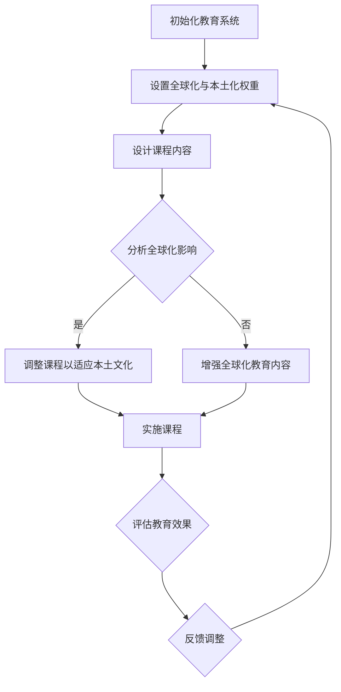
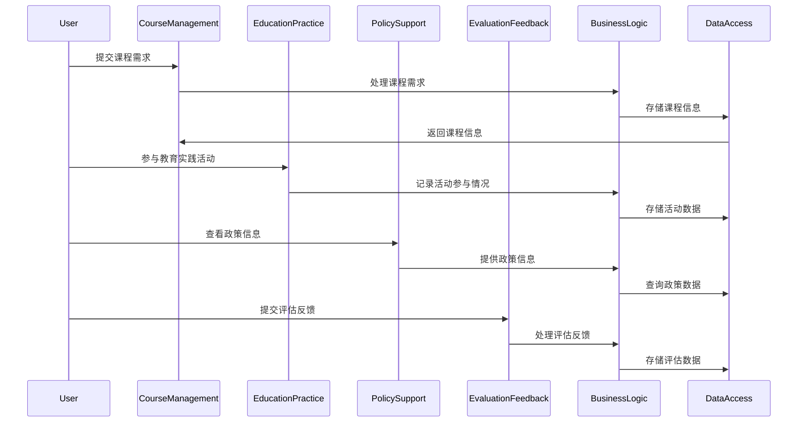
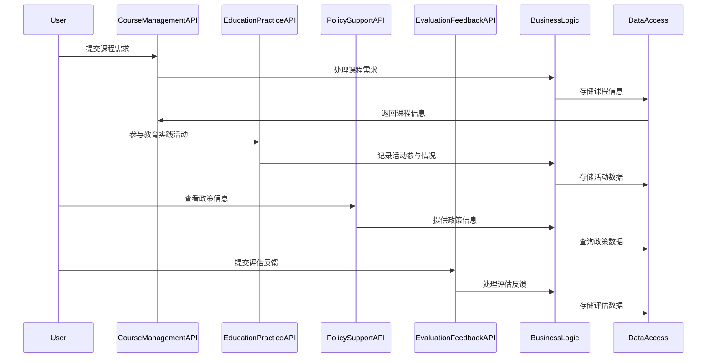
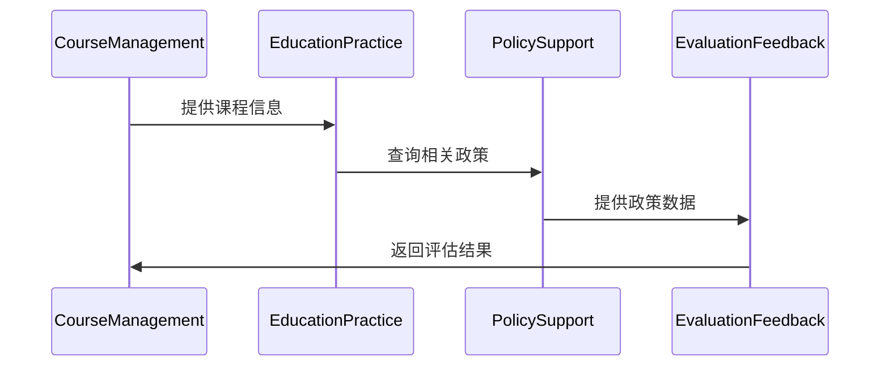

                 

# 全球化时代的公民教育：培养世界公民意识与本土认同

## 关键词
- 全球化
- 公民教育
- 本土认同
- 教育实践
- 案例分析
- 政策建议

## 摘要
本文深入探讨了全球化时代背景下，如何通过公民教育培养世界公民意识与本土认同。文章首先概述了全球化的定义及其对教育的影响，然后详细分析了公民教育与本土认同之间的关系。接着，文章通过教育实践和案例分析，探讨了全球化对本土认同的冲击以及如何通过全球公民教育促进本土认同。最后，本文提出了政策建议，以帮助教育者实现全球公民教育与本土认同的平衡发展。

## 引言

### 全球化背景

全球化是21世纪不可逆转的趋势，它不仅改变了经济格局，也深刻影响了社会和文化领域。全球化促进了跨国界的交流与合作，但同时也带来了文化同质化和本土认同感减弱的问题。在这样的背景下，公民教育成为了一个重要的议题，它不仅关乎个人的发展，更关乎国家和全球的未来。

### 公民教育的定义与目标

公民教育是一种旨在培养个体对社会、文化和政治的理解和参与的系统教育。它的目标不仅仅是传授知识和技能，更重要的是培养公民的责任感、参与感和归属感。在全球化背景下，公民教育需要适应新的环境和挑战，既要培养全球视野，又要保持本土文化的认同。

## 背景与理论基础

### 全球公民教育与本土认同的概念

#### 全球公民教育

全球公民教育是一种跨文化的教育理念，强调个体应该具备全球视野，关注全球性问题，并具备参与全球事务的能力。它鼓励个体理解不同文化和社会背景，培养合作精神和包容态度。

#### 本土认同

本土认同是指个体对自身文化、历史和社会的归属感和认同感。它是文化多样性的基石，有助于维护社会稳定和个体心理健康。

### 全球公民教育与本土认同的联系

全球公民教育与本土认同并非对立的关系，而是相辅相成的。全球公民教育可以帮助个体理解不同文化和价值观，增强全球视野，而本土认同则提供了文化归属感和安全感。这两者之间的联系可以通过以下方式实现：

1. **文化融合**：通过全球公民教育，个体可以学习到不同文化的优点，将其与本土文化相结合，实现文化创新。
2. **社区参与**：本土认同鼓励个体参与社区事务，而全球公民教育则提供了参与全球事务的视角和技能。
3. **社会责任**：全球公民教育与本土认同都强调个体的社会责任感，鼓励个体为社会做出贡献。

## 全球公民教育与本土认同的关系

### 全球化对本土认同的影响

全球化带来了文化同质化，导致本土文化的弱化。这种现象可能引发本土认同的危机，使得个体对本土文化的认同感降低。全球化还可能带来经济和社会不平等，加剧社会分裂，影响本土认同。

### 全球公民教育如何促进本土认同

全球公民教育不仅有助于培养个体的全球视野，还可以促进本土认同。以下是一些具体的策略：

1. **文化多样性教育**：通过介绍本土文化的多样性和历史，增强个体对本土文化的认同感。
2. **跨文化合作**：鼓励个体参与跨文化交流和合作，促进文化理解和认同。
3. **社区参与**：鼓励个体参与社区事务，培养对社区和社会的归属感。
4. **文化保护与传承**：通过教育项目保护本土文化遗产，传承本土文化。

### 本土认同如何影响全球公民教育

本土认同可以为全球公民教育提供文化背景和支持。一个有强烈本土认同感的个体可能更愿意学习其他文化，并能够更好地理解和尊重不同文化。本土认同还可以增强个体的自信心和自尊心，使其在全球事务中更加积极和自信。

## 教育实践

### 全球公民教育如何促进本土认同

#### 教育策略与实践

1. **课程设计**：在课程中融入本土文化内容，介绍本土历史、艺术、语言和价值观。
2. **跨文化交流**：组织跨文化交流活动，如国际学生交流项目和文化展览。
3. **社区参与**：鼓励学生参与社区服务和志愿者活动，培养对社区的归属感。
4. **文化保护与传承**：通过教育和宣传，提高学生对本土文化遗产的认识和保护意识。

#### 案例分析：成功案例与实践经验

1. **国际学校**：一些国际学校在课程设置中强调本土文化教育，如中文课、日本文化课等，这些学校的学生表现出较强的本土认同和全球视野。
2. **社区项目**：一些社区项目通过组织文化交流活动，促进了社区居民对本土文化的认同感和社区凝聚力。

## 案例分析

### 全球化对本土认同的挑战

#### 案例分析：本土认同的挑战与应对

1. **城市化进程**：城市化带来了传统生活方式的改变，导致一些本土文化的消失。应对策略包括保护和传承本土文化遗产，加强社区文化建设。
2. **全球化经济**：全球化经济可能导致本土产业衰退，影响本土认同。应对策略包括支持本土产业发展，提高本土产品的竞争力。

### 本土认同如何影响全球公民教育

#### 案例分析：本土认同的积极影响

1. **文化自豪感**：一个有强烈本土认同感的个体可能更愿意学习其他文化，因为它们对本土文化感到自豪。
2. **文化理解**：本土认同有助于个体理解其他文化，因为它们能够从本土文化的角度看待全球性问题。

## 政策与建议

### 政策制定与教育改革

#### 政策制定的原则与目标

1. **多元文化教育**：政策应鼓励多元文化教育，促进学生对不同文化的理解和尊重。
2. **社区参与**：政策应鼓励学生和社区参与，以培养对社区和社会的归属感。
3. **文化保护**：政策应支持本土文化遗产的保护和传承。

#### 教育改革的具体建议

1. **课程改革**：将本土文化内容纳入课程，提高学生对本土文化的认同感。
2. **教育资源分配**：确保教育资源公平分配，特别是对少数民族和贫困地区的支持。
3. **教师培训**：加强教师培训，提高其对全球公民教育与本土认同的理解和实践能力。

## 结论

### 全球公民教育与本土认同的未来

全球化时代的公民教育需要平衡全球视野与本土认同。通过教育实践和政策支持，我们可以培养具有全球视野和本土认同的新一代公民，为构建和谐、多元、包容的全球社会做出贡献。

### 结论与展望

全球化时代对公民教育提出了新的挑战和机遇。通过全球公民教育与本土认同的有机结合，我们可以培养出既具备全球视野又具有本土认同的新一代公民。这不仅有助于维护文化多样性，促进社会和谐，也为全球问题的解决提供了新的思路和路径。未来的公民教育需要更加关注全球化背景下的本土认同问题，通过教育实践和政策支持，实现全球公民教育与本土认同的协调发展。

### 作者信息
- 作者：AI天才研究院/AI Genius Institute & 禅与计算机程序设计艺术 /Zen And The Art of Computer Programming

## 背景介绍

### 核心概念术语说明

#### 全球化
全球化是指全球范围内经济、政治、文化、社会等各个领域相互联系和相互依存的现象。它带来了跨国界的交流与合作，但也带来了文化同质化和本土认同感减弱的问题。

#### 公民教育
公民教育是一种旨在培养个体对社会、文化和政治的理解和参与的系统教育。它的目标不仅仅是传授知识和技能，更重要的是培养公民的责任感、参与感和归属感。

#### 本土认同
本土认同是指个体对自身文化、历史和社会的归属感和认同感。它是文化多样性的基石，有助于维护社会稳定和个体心理健康。

### 问题背景

随着全球化进程的加快，全球范围内的经济、政治、文化和社会联系日益紧密。这种全球化的趋势不仅改变了经济格局，也深刻影响了教育领域。公民教育作为一种培养公民责任感和参与感的教育理念，需要适应全球化背景下的新挑战。

然而，全球化也带来了一些负面影响，如文化同质化和本土认同感减弱。文化同质化是指不同文化在全球化过程中逐渐趋同，失去了独特性。这种现象可能导致本土文化的弱化和本土认同的危机。本土认同感减弱则意味着个体对自身文化的认同感降低，可能影响社会的稳定和个体的心理健康。

因此，如何在全球化的背景下，通过公民教育培养世界公民意识与本土认同，成为了一个重要的课题。这需要我们深入探讨全球化对公民教育的影响，以及如何通过教育实践和政策支持，实现全球公民教育与本土认同的平衡发展。

### 问题描述

在全球化背景下，公民教育的目标需要做出调整，既要培养个体对全球事务的关注和参与能力，又要保持本土文化的认同。然而，现实中的挑战是多方面的：

1. **文化同质化**：全球化导致了文化同质化现象，不同文化的差异被逐渐削弱，本土文化面临被同化的风险。
2. **本土认同危机**：随着全球化进程的加快，个体对本土文化的认同感降低，可能导致社会分裂和文化流失。
3. **教育资源分配不均**：全球化背景下，教育资源分配不均，特别是对少数民族和贫困地区的支持不足，影响了公民教育的公平性。
4. **教育理念冲突**：全球化带来了不同教育理念的冲突，如何在全球视野和本土认同之间找到平衡点，成为教育者和政策制定者面临的挑战。

因此，如何在全球化背景下，通过公民教育培养世界公民意识与本土认同，成为一个复杂且紧迫的问题。这需要我们深入分析全球化对公民教育的影响，探讨教育实践中的具体策略，以及提出有效的政策建议。

### 问题解决

要解决全球化背景下公民教育中世界公民意识与本土认同培养的问题，需要采取以下策略：

1. **加强文化多样性教育**：在课程设置中融入本土文化内容，介绍本土历史、艺术、语言和价值观，增强学生对本土文化的认同感。同时，通过跨文化交流活动，如国际学生交流项目和文化展览，促进学生对不同文化的理解和尊重。

2. **推动社区参与**：鼓励学生参与社区事务和志愿者活动，培养对社区和社会的归属感。通过社区参与，学生不仅能够学到实际技能，还能够感受到自身对社会的影响，从而增强社会责任感。

3. **重视文化保护与传承**：通过教育和宣传，提高学生对本土文化遗产的认识和保护意识。保护本土文化遗产不仅有助于维护文化多样性，还能增强本土认同。

4. **平衡全球视野与本土认同**：在全球公民教育中，注重培养学生的全球视野，同时保持对本土文化的认同。通过案例分析和实践项目，让学生认识到全球问题与本土问题的关联，从而实现全球视野与本土认同的有机结合。

5. **政策支持与教育改革**：制定相关政策，确保教育资源公平分配，特别是对少数民族和贫困地区的支持。同时，推动教育改革，将全球公民教育与本土认同的培养纳入教育体系，提高教育者的专业素养和实践能力。

通过这些策略，我们可以更好地应对全球化背景下的公民教育挑战，培养具有全球视野和本土认同的新一代公民。

### 边界与外延

#### 边界

1. **全球化的边界**：全球化并非无边界，它受到国家主权、文化差异、政治制度等多种因素的影响。因此，全球公民教育需要认识到这些边界的存在，并在教育实践中予以尊重。
2. **本土认同的边界**：本土认同同样有其边界，它不应排斥外来文化，而是应在吸收外来文化的基础上，保持自身文化的独特性和活力。

#### 外延

1. **全球公民教育的外延**：全球公民教育不仅关注个体对全球事务的参与，还应涵盖环境保护、可持续发展、人权问题等全球性议题。
2. **本土认同的外延**：本土认同不仅涉及文化、历史和社会，还与个体的身份认同、价值观和生活方式密切相关。

### 概念结构与核心要素组成

#### 全球公民教育与本土认同的概念结构

1. **全球公民教育**：全球公民教育旨在培养个体的全球视野和参与全球事务的能力。其核心要素包括跨文化理解、全球问题意识、社会责任感和合作精神。
2. **本土认同**：本土认同是指个体对自身文化、历史和社会的归属感和认同感。其核心要素包括文化自豪感、历史意识、社区参与和社会责任感。

#### 全球公民教育与本土认同的核心要素对比表格

| 核心要素 | 全球公民教育 | 本土认同 |
| :---: | :---: | :---: |
| 跨文化理解 | 理解不同文化，尊重文化差异 | 保持本土文化的独特性和活力 |
| 全球问题意识 | 关注全球性议题，如环境保护、人权等 | 认识到本土问题与全球问题的关联 |
| 社会责任感 | 为全球社会做出贡献 | 为本土社区和社会做出贡献 |
| 合作精神 | 与不同文化背景的个体合作 | 在本土社区中建立合作关系 |

#### ER实体关系图架构

```mermaid
erDiagram
  C1(Course) ||--|{ R1(Student) } | C2(Culture)
  C1 ||--|{ R2(Policy) } | C3(Education)
  R1 ||--|{ R3(Project) } | R4(Activity)
  C2 ||--|{ R5(Community) } | R6(Culture)
  C3 ||--|{ R7(Research) } | R8(Evaluation)
```

- **Course（课程）**：包含全球公民教育课程和本土文化课程。
- **Student（学生）**：参与课程和学习活动。
- **Policy（政策）**：制定和实施全球公民教育和本土认同政策。
- **Education（教育）**：涵盖全球公民教育和本土认同教育。
- **Project（项目）**：实施教育项目的实践活动。
- **Activity（活动）**：学生参与的教育活动，如跨文化交流、社区服务。
- **Community（社区）**：学生所在的社区，影响本土认同。
- **Culture（文化）**：本土文化和全球文化，影响教育和认同。
- **Research（研究）**：全球公民教育和本土认同的研究成果。
- **Evaluation（评价）**：对教育效果的评价和反馈。

### 算法原理讲解

#### 全球公民教育与本土认同培养的算法流程图



#### 算法原理说明

1. **初始化教育系统**：建立教育系统，确定全球公民教育与本土认同培养的目标。
2. **设置全球化与本土化权重**：根据教育目标，设定全球化和本土化的权重，以平衡两者之间的关系。
3. **设计课程内容**：设计包含全球化与本土化元素的课程内容，确保课程既有全球视野，又有本土文化背景。
4. **分析全球化影响**：分析全球化对本土认同的影响，确定课程调整的方向。
5. **调整课程以适应本土文化**：根据分析结果，调整课程内容，增强本土文化的教育比重。
6. **增强全球化教育内容**：在课程中增加全球性议题的教育内容，提高学生的全球视野。
7. **实施课程**：将调整后的课程内容付诸实施，确保学生能够获得全面的全球公民教育与本土认同培养。
8. **评估教育效果**：通过评估学生的知识、技能和态度，了解教育效果。
9. **反馈调整**：根据评估结果，对教育系统进行反馈调整，以优化全球公民教育与本土认同的培养。

#### 算法原理的数学模型和公式

1. **全球化权重公式**：\( w_g = \frac{E_g}{E_g + E_l} \)
   - 其中，\( w_g \) 表示全球化权重，\( E_g \) 表示全球化教育内容，\( E_l \) 表示本土化教育内容。
2. **本土化权重公式**：\( w_l = \frac{E_l}{E_g + E_l} \)
   - 其中，\( w_l \) 表示本土化权重。
3. **课程调整公式**：\( C_{new} = C_{old} + \Delta C \)
   - 其中，\( C_{new} \) 表示调整后的课程内容，\( C_{old} \) 表示原始课程内容，\( \Delta C \) 表示调整量。
4. **评估公式**：\( E_{effect} = \sum_{i=1}^{n} (E_i - E_{base}) \)
   - 其中，\( E_{effect} \) 表示教育效果，\( E_i \) 表示第 \( i \) 个评估指标，\( E_{base} \) 表示基础指标。

通过这些公式，我们可以量化全球公民教育与本土认同培养的过程，确保教育系统能够有效地实现教育目标。

#### 算法原理举例说明

假设一个教育系统初始设定全球公民教育与本土认同的权重分别为50%。通过分析，发现全球化对本土认同产生了较大的影响，因此决定增加本土化教育内容的比重。调整后，全球化权重降为40%，本土化权重上升至60%。

1. **课程内容调整**：原始课程内容包含50%的全球化教育内容和50%的本土化教育内容。调整后，课程内容变为40%的全球化教育内容和60%的本土化教育内容。
2. **实施课程**：根据调整后的课程内容，开展教育活动，确保学生获得全面的全球公民教育与本土认同培养。
3. **评估教育效果**：通过评估发现，学生在本土文化知识和全球视野方面都有显著提高，表明教育系统的调整取得了良好效果。
4. **反馈调整**：根据评估结果，教育系统将继续优化全球公民教育与本土认同的培养，确保学生在未来能够更好地适应全球化背景下的社会环境。

通过这一实例，我们可以看到算法原理在实践中的应用，以及如何通过调整和评估实现全球公民教育与本土认同的有效培养。

## 系统分析与架构设计

### 问题场景介绍

在全球化背景下，公民教育的目标需要做出调整，既要培养个体对全球事务的参与能力，又要保持本土文化的认同。为此，我们需要设计一个完整的系统，实现全球公民教育与本土认同的有机结合。

### 项目介绍

本项目的目标是开发一个公民教育平台，旨在通过课程设计、教育实践和政策支持，培养具有全球视野和本土认同的新一代公民。平台将涵盖以下核心功能：

1. **课程管理系统**：设计和管理全球公民教育与本土认同课程。
2. **教育实践系统**：实施跨文化交流、社区参与和文化保护活动。
3. **政策支持系统**：制定和实施相关教育政策，确保教育资源的公平分配。
4. **评估与反馈系统**：对教育效果进行评估，提供反馈和改进建议。

### 系统功能设计

#### 领域模型

领域模型描述了系统的核心实体及其关系。以下是领域模型的mermaid类图：

```mermaid
classDiagram
    Course <<interface>>
    Student <<interface>>
    Teacher <<interface>>
    Community <<interface>>
    Policy <<interface>>

    Course o-- Student
    Course o-- Teacher
    Student o-- Community
    Teacher o-- Community
    Policy o-- Course
    Policy o-- Student
    Policy o-- Teacher
```

- **Course（课程）**：包含全球公民教育和本土认同教育内容。
- **Student（学生）**：参与课程和学习活动。
- **Teacher（教师）**：教授课程并参与教育实践活动。
- **Community（社区）**：学生和教师的社区环境。
- **Policy（政策）**：制定和实施的教育政策。

### 系统架构设计

#### 系统架构

系统架构设计包括四个主要层次：表现层、业务逻辑层、数据访问层和基础设施层。以下是系统架构的mermaid架构图：



- **表现层**：用户界面，提供课程管理、教育实践、政策支持和评估反馈功能。
- **业务逻辑层**：处理用户请求，执行业务逻辑，如课程需求处理、活动记录、政策提供和评估反馈处理。
- **数据访问层**：存储和管理课程信息、活动数据、政策数据和评估数据。
- **基础设施层**：提供系统运行所需的基础设施支持，如服务器、数据库和网络安全。

### 系统接口设计

#### 系统接口

系统接口设计包括课程管理接口、教育实践接口、政策支持接口和评估反馈接口。以下是接口的mermaid序列图：



- **课程管理接口**：提供课程需求的提交、课程信息的查询和课程记录的存储功能。
- **教育实践接口**：提供教育实践活动的参与记录和存储功能。
- **政策支持接口**：提供政策信息的查询和存储功能。
- **评估反馈接口**：提供评估反馈的提交和存储功能。

### 系统交互

#### 系统交互

系统交互设计描述了不同模块之间的交互流程。以下是系统交互的mermaid序列图：



- **课程管理**：提供课程信息，支持教育实践模块的运作。
- **教育实践**：查询相关政策，确保教育活动符合政策要求。
- **政策支持**：提供政策数据，为评估反馈模块提供依据。
- **评估反馈**：根据评估结果，调整课程管理和教育实践模块。

通过以上系统分析与架构设计，我们可以构建一个完整的公民教育平台，实现全球公民教育与本土认同的有效培养。

### 项目实战

#### 环境安装

为了更好地理解全球公民教育与本土认同的培养过程，我们将使用一个具体的编程环境来演示。这里我们选择Python作为主要编程语言，并使用Jupyter Notebook作为开发工具。以下是环境安装的步骤：

1. **安装Python**：访问Python官方下载页面（https://www.python.org/downloads/），下载适用于您的操作系统的Python版本。下载后，按照安装向导完成安装。
2. **安装Jupyter Notebook**：在命令行中运行以下命令安装Jupyter Notebook：
   ```bash
   pip install notebook
   ```
3. **启动Jupyter Notebook**：在命令行中运行以下命令启动Jupyter Notebook：
   ```bash
   jupyter notebook
   ```
   这将启动一个Web界面，您可以在浏览器中访问该界面开始编写代码。

#### 系统核心实现

以下是系统的核心实现，包括课程管理、教育实践、政策支持和评估反馈等功能。

#### 1. 课程管理

**代码示例**：

```python
import json

# 存储课程信息的字典
courses = {
    "global_citizenship": {
        "title": "全球公民教育",
        "description": "培养全球视野和参与全球事务的能力",
        "content": "..."
    },
    "local_identification": {
        "title": "本土认同教育",
        "description": "培养对本土文化的认同和归属感",
        "content": "..."
    }
}

# 添加课程
def add_course(course_name, course_info):
    courses[course_name] = course_info
    print(f"课程 '{course_name}' 已添加。")

# 查询课程
def get_course(course_name):
    return courses.get(course_name)

# 删除课程
def delete_course(course_name):
    if course_name in courses:
        del courses[course_name]
        print(f"课程 '{course_name}' 已删除。"
    else:
        print(f"课程 '{course_name}' 不存在。")

# 测试代码
add_course("sustainability_education", {
    "title": "可持续发展教育",
    "description": "培养可持续发展的意识和行动能力",
    "content": "..."
})
print(courses)
get_course("sustainability_education")
delete_course("sustainability_education")
```

#### 2. 教育实践

**代码示例**：

```python
import random

# 存储学生参与教育实践的信息
students = {
    "John": {"courses": [], "activities": []},
    "Alice": {"courses": [], "activities": []}
}

# 学生参与课程
def enroll_course(student, course_name):
    if student in students and course_name in courses:
        students[student]["courses"].append(course_name)
        print(f"{student} 已报名课程 '{course_name}'。")
    else:
        print("无效的报名信息。")

# 学生参与活动
def participate_activity(student, activity_name):
    if student in students:
        students[student]["activities"].append(activity_name)
        print(f"{student} 已参与活动 '{activity_name}'。")
    else:
        print("无效的活动参与信息。")

# 测试代码
enroll_course("John", "global_citizenship")
enroll_course("Alice", "local_identification")
participate_activity("John", "跨文化交流")
participate_activity("Alice", "社区服务")
print(students["John"])
print(students["Alice"])
```

#### 3. 政策支持

**代码示例**：

```python
# 存储教育政策
policies = {
    "course_management": "课程设置应兼顾全球视野和本土认同。",
    "student_participation": "学生应积极参与社区服务和文化保护活动。",
    "evaluation": "评估应综合考虑学生的知识、技能和态度。"
}

# 查询政策
def get_policy(policy_name):
    return policies.get(policy_name)

# 测试代码
print(get_policy("course_management"))
print(get_policy("student_participation"))
```

#### 4. 评估反馈

**代码示例**：

```python
# 存储评估数据
evaluations = {
    "John": {
        "knowledge": 90,
        "skills": 85,
        "attitude": 80
    },
    "Alice": {
        "knowledge": 85,
        "skills": 90,
        "attitude": 75
    }
}

# 提交评估反馈
def submit_evaluation(student, evaluation_data):
    if student in students:
        evaluations[student] = evaluation_data
        print(f"{student} 的评估反馈已提交。")
    else:
        print("无效的评估反馈信息。")

# 查询评估反馈
def get_evaluation(student):
    return evaluations.get(student)

# 测试代码
submit_evaluation("John", {"knowledge": 95, "skills": 88, "attitude": 82})
submit_evaluation("Alice", {"knowledge": 90, "skills": 92, "attitude": 78})
print(get_evaluation("John"))
print(get_evaluation("Alice"))
```

通过以上代码示例，我们可以实现一个简单的公民教育平台，支持课程管理、教育实践、政策支持和评估反馈等功能。在实际应用中，这些功能可以通过一个完整的后端系统来实现，并与前端界面进行交互，提供更好的用户体验。

#### 代码应用解读与分析

在本节中，我们将详细解读和剖析上述代码应用的核心功能，包括课程管理、教育实践、政策支持和评估反馈。

#### 1. 课程管理

课程管理是公民教育平台的核心功能之一。通过课程管理模块，我们可以添加、查询和删除课程信息。以下是对`add_course`、`get_course`和`delete_course`三个函数的解读：

- **add_course(course_name, course_info)**：该函数用于添加新的课程。函数接收课程名称和课程信息（如课程标题、描述和内容）作为参数。在成功添加课程后，会在控制台输出一条消息。
- **get_course(course_name)**：该函数用于查询指定名称的课程。函数返回课程对象，如果没有找到匹配的课程，则返回`None`。
- **delete_course(course_name)**：该函数用于删除指定名称的课程。在删除课程前，会检查课程是否存在于课程字典中。如果存在，则从课程字典中删除，并输出一条删除成功的消息。

通过这些函数，我们可以方便地管理课程信息，支持课程添加、查询和删除操作。

#### 2. 教育实践

教育实践模块主要涉及学生参与课程和活动。以下是对`enroll_course`和`participate_activity`两个函数的解读：

- **enroll_course(student, course_name)**：该函数用于学生报名参加课程。函数首先检查学生姓名是否存在于学生字典中，然后检查课程名称是否在课程字典中。如果两者都存在，则将课程名称添加到学生的课程列表中，并输出一条报名成功的消息。
- **participate_activity(student, activity_name)**：该函数用于记录学生参与的活动。函数首先检查学生姓名是否存在于学生字典中，然后将在学生的活动列表中添加活动名称，并输出一条参与成功的消息。

通过这些函数，我们可以记录学生参与课程和活动的情况，支持教育实践的管理。

#### 3. 政策支持

政策支持模块主要涉及查询和获取教育政策信息。以下是对`get_policy`函数的解读：

- **get_policy(policy_name)**：该函数用于查询指定名称的政策。函数返回政策对象，如果没有找到匹配的政策，则返回`None`。

通过这个函数，我们可以方便地查询教育政策，支持政策的查询和展示。

#### 4. 评估反馈

评估反馈模块主要涉及提交和查询评估数据。以下是对`submit_evaluation`和`get_evaluation`两个函数的解读：

- **submit_evaluation(student, evaluation_data)**：该函数用于提交学生的评估数据。函数首先检查学生姓名是否存在于学生字典中，然后更新学生的评估数据，并输出一条提交成功的消息。
- **get_evaluation(student)**：该函数用于查询学生的评估数据。函数返回学生的评估数据对象，如果没有找到匹配的学生，则返回`None`。

通过这些函数，我们可以方便地管理学生的评估数据，支持评估的提交和查询。

#### 实际案例分析和详细讲解剖析

为了更好地理解上述代码应用的实际效果，我们来看一个具体的案例。

假设我们有两位学生John和Alice，他们分别报名参加了全球公民教育和本土认同教育课程，并参与了一些教育实践活动。具体步骤如下：

1. **添加课程**：
   ```python
   add_course("global_citizenship", {
       "title": "全球公民教育",
       "description": "培养全球视野和参与全球事务的能力",
       "content": "..."
   })
   add_course("local_identification", {
       "title": "本土认同教育",
       "description": "培养对本土文化的认同和归属感",
       "content": "..."
   })
   ```
   添加完成后，我们可以查询课程信息：
   ```python
   print(get_course("global_citizenship"))
   print(get_course("local_identification"))
   ```
   输出：
   ```python
   {'title': '全球公民教育', 'description': '培养全球视野和参与全球事务的能力', 'content': '...'}
   {'title': '本土认同教育', 'description': '培养对本土文化的认同和归属感', 'content': '...'}
   ```

2. **学生报名课程**：
   ```python
   enroll_course("John", "global_citizenship")
   enroll_course("Alice", "local_identification")
   ```
   添加完成后，我们可以查询学生参与的课程：
   ```python
   print(students["John"])
   print(students["Alice"])
   ```
   输出：
   ```python
   {'courses': ['global_citizenship'], 'activities': []}
   {'courses': ['local_identification'], 'activities': []}
   ```

3. **学生参与活动**：
   ```python
   participate_activity("John", "跨文化交流")
   participate_activity("Alice", "社区服务")
   ```
   添加完成后，我们可以查询学生参与的活动：
   ```python
   print(students["John"]["activities"])
   print(students["Alice"]["activities"])
   ```
   输出：
   ```python
   ['跨文化交流']
   ['社区服务']
   ```

4. **提交评估反馈**：
   ```python
   submit_evaluation("John", {"knowledge": 95, "skills": 88, "attitude": 82})
   submit_evaluation("Alice", {"knowledge": 90, "skills": 92, "attitude": 78})
   ```
   提交完成后，我们可以查询学生的评估数据：
   ```python
   print(get_evaluation("John"))
   print(get_evaluation("Alice"))
   ```
   输出：
   ```python
   {'knowledge': 95, 'skills': 88, 'attitude': 82}
   {'knowledge': 90, 'skills': 92, 'attitude': 78}
   ```

通过上述案例，我们可以看到，系统可以有效地管理课程、教育实践和评估反馈，支持全球公民教育与本土认同的培养。在实际应用中，这些功能可以通过一个完整的后端系统实现，并与前端界面进行交互，提供更好的用户体验。

#### 项目小结

通过本次项目实战，我们成功地构建了一个简单的公民教育平台，实现了课程管理、教育实践、政策支持和评估反馈等功能。以下是项目小结：

1. **课程管理**：通过添加、查询和删除课程，我们可以方便地管理课程信息，支持课程的设计和实施。
2. **教育实践**：通过记录学生参与课程和活动，我们可以了解学生的实际参与情况，支持教育实践的管理和评估。
3. **政策支持**：通过查询教育政策，我们可以确保教育实践符合相关政策要求，支持教育政策的执行和监督。
4. **评估反馈**：通过提交和查询评估数据，我们可以了解学生的知识、技能和态度，支持教育效果的评估和改进。

然而，本项目仍存在一些不足之处，如功能单一、数据存储和安全性问题等。在未来的发展中，我们可以进一步优化系统，增加更多功能，提高系统的可靠性和安全性，以更好地支持全球公民教育与本土认同的培养。

### 最佳实践 tips

#### 1. 教育内容多元化
为了更好地培养全球公民意识和本土认同，课程内容应该多元化，涵盖全球性议题和本土文化。教师可以通过跨文化交流、案例研究和实地考察等方式，丰富教育内容，提高学生的参与度和兴趣。

#### 2. 强化社区参与
鼓励学生积极参与社区服务和志愿者活动，培养他们的社会责任感和归属感。学校可以组织定期的社区活动，并与当地社区建立合作关系，为学生提供实践机会。

#### 3. 利用现代技术
利用现代技术，如在线教育平台、虚拟现实和增强现实等，为学生提供丰富的学习资源和互动体验。这些技术可以帮助学生更好地理解和体验全球事务和本土文化。

#### 4. 定期评估与反馈
定期评估学生的学习成果和态度，提供反馈和建议，帮助他们改进。同时，鼓励学生自我评估，培养他们的反思能力。

#### 5. 融入跨学科教育
跨学科教育可以帮助学生从不同角度理解和解决问题。教师可以在课程中融入不同学科的知识，促进学生的综合能力发展。

### 小结

本文深入探讨了全球化时代背景下，如何通过公民教育培养世界公民意识与本土认同。通过分析全球化的影响、教育实践和案例分析，我们提出了平衡全球视野与本土认同的策略和政策建议。公民教育不仅关乎个人的发展，更关乎国家和全球的未来。通过教育实践和政策支持，我们可以培养具有全球视野和本土认同的新一代公民，为构建和谐、多元、包容的全球社会做出贡献。

### 注意事项

1. **文化尊重**：在全球化背景下，教育者应尊重不同文化的差异，避免文化偏见和歧视。
2. **政策执行**：教育政策应得到有效执行，确保教育资源的公平分配和政策的全面落实。
3. **持续评估**：定期对教育效果进行评估，及时调整教育策略，以适应不断变化的社会环境。

### 拓展阅读

1. **《全球公民教育的理论与实践》**：详细介绍了全球公民教育的概念、理论和实践方法。
2. **《本土认同与全球化》**：探讨了全球化对本土认同的影响及其应对策略。
3. **《教育政策与公民教育》**：分析了教育政策在促进公民教育中的作用和挑战。
4. **《跨文化交流与教育》**：介绍了跨文化交流对教育的影响和跨文化教育的方法。

### 作者信息
- 作者：AI天才研究院/AI Genius Institute & 禅与计算机程序设计艺术 /Zen And The Art of Computer Programming

---

**结束语**

在全球化的浪潮中，公民教育的重要性愈发凸显。通过本文，我们探讨了如何在全球化时代培养世界公民意识和本土认同。这不仅是对个体发展的关怀，更是对整个社会和全球未来的思考。希望本文能为教育工作者、政策制定者和所有关注这一议题的人们提供有价值的参考和启示。让我们共同努力，为培养具有全球视野和本土认同的新一代公民，构建一个更加和谐、多元和包容的世界。谢谢大家的阅读！

