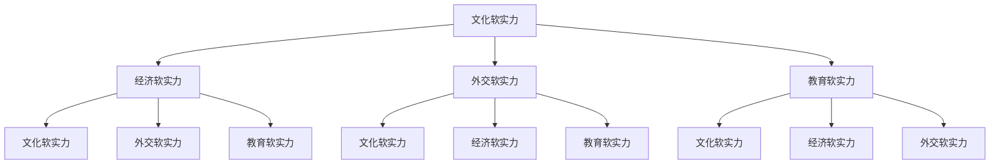

                 

### 第一部分：背景介绍

#### 1.1 全球化背景下的文化输出现状

在当今全球化时代，文化输出已成为国家软实力建设的重要组成部分。全球化带来的经济一体化、信息流通便捷以及跨国交流频繁，使得各国文化的交融与传播变得更加便捷。然而，文化输出的过程并非一帆风顺，其背后隐藏着诸多挑战与机遇。

首先，全球化对文化输出产生了深远的影响。一方面，全球化促进了文化多样性的传播，使得各国文化得以在全球范围内得到更广泛的认知和接受。另一方面，全球化也加剧了文化竞争，不同文化在传播过程中不可避免地产生冲突与融合，导致文化输出的复杂性和不确定性增加。

#### 1.1.1 全球化对文化输出的影响

全球化对文化输出的影响主要体现在以下几个方面：

1. **文化交流的加深**：全球化使得各国文化之间的交流更加频繁和深入，文化交流成为文化输出的重要途径。通过文化交流，各国可以相互借鉴和吸收对方的优秀文化成果，从而提升自身的文化软实力。
2. **文化产业的繁荣**：全球化促进了文化产业的繁荣，为文化输出提供了强大的动力。文化产业的发展不仅提升了国家的经济实力，也为文化输出创造了更多的机会和平台。
3. **文化市场竞争的加剧**：全球化使得文化市场变得更加开放和竞争激烈，各国文化产品在竞争中不断寻求差异化优势，以获得更大的市场份额。这既为文化输出提供了机遇，也带来了挑战。

#### 1.1.2 文化输出的机遇与挑战

在全球化背景下，文化输出既面临机遇，也面临挑战。

1. **机遇**：
   - **跨国文化交流**：全球化为跨国文化交流提供了更多机会，各国可以通过文化交流加深相互了解，促进文化输出。
   - **文化产业的发展**：全球化背景下，文化产业得到了快速发展，为文化输出提供了丰富的资源和广阔的市场。
   - **技术创新的推动**：全球化带来了技术创新，如互联网、社交媒体等，为文化输出提供了新的传播渠道和方式。

2. **挑战**：
   - **文化差异**：文化差异可能导致文化输出的失败，如何在尊重文化差异的同时实现文化融合是一个重要课题。
   - **市场准入壁垒**：不同国家和地区在文化市场的准入门槛和法规政策上存在差异，这对文化输出造成了一定的阻碍。
   - **知识产权保护**：全球化带来了知识产权保护意识的提高，文化输出过程中如何保护自身知识产权成为一大挑战。

### 1.2 文化输出的核心概念

在全球化背景下，理解文化输出的核心概念对于把握文化输出的本质和策略至关重要。

#### 1.2.1 文化输出的定义

文化输出是指一国或地区将其文化产品、文化理念、文化价值观等通过多种途径传播到其他国家和地区的过程。文化输出不仅包括物质文化的输出，如电影、音乐、艺术品等，还包括精神文化的输出，如教育、科技、宗教等。

#### 1.2.2 软实力的概念与内涵

软实力是指一个国家或地区通过文化、价值观、外交、政策等手段影响和吸引他国的能力。软实力不同于传统的硬实力，它不依赖于军事、经济等硬性手段，而更多地依赖于文化、价值观等软性因素。

软实力的内涵包括以下几个方面：

1. **文化吸引力**：一个国家的文化魅力和吸引力是其软实力的重要组成部分。强大的文化吸引力可以吸引更多国际关注，提升国家形象。
2. **价值观认同**：一个国家的价值观是否得到他国的认同，对于其软实力的影响至关重要。共同的价值观可以促进国家间的合作与交流。
3. **外交影响力**：一个国家的软实力可以通过其外交活动得到体现，如参与国际事务、推动国际合作等。
4. **政策感召力**：一个国家的政策是否具有感召力，可以影响其他国家的决策和行为，从而提升其软实力。

### 小结

全球化时代的文化输出是一个复杂而动态的过程，既充满机遇，也面临挑战。理解文化输出的核心概念和全球化背景下的影响，有助于我们更好地制定文化输出策略，提升国家的软实力。接下来，我们将进一步探讨软实力的属性与特征，以及文化输出与软实力之间的关系。这将为我们深入理解文化输出的本质提供更加坚实的理论基础。

----------------------------------------------------------------

# 第二部分：核心概念与联系

### 2.1 软实力的属性与特征

软实力作为一种非传统的国家力量，其属性和特征决定了它在国际关系中的独特作用。为了更好地理解软实力的本质，我们需要深入探讨其分类和属性特征。

#### 2.1.1 软实力的分类

软实力可以按照不同的标准进行分类。以下是几种常见的分类方式：

1. **文化软实力**：文化软实力是指一个国家通过其文化影响力来吸引他国的能力。文化软实力包括文学、艺术、音乐、电影、节日等文化产品和活动。例如，美国通过好莱坞电影和音乐文化在全球范围内产生了广泛的影响力。
2. **经济软实力**：经济软实力是指一个国家通过其经济实力和经济发展模式来影响他国的能力。经济软实力体现在贸易、投资、技术创新等方面。例如，德国通过其先进的高科技产业和严谨的工程教育体系在全球范围内产生了重要影响。
3. **外交软实力**：外交软实力是指一个国家通过其外交活动和外交政策来影响他国的能力。外交软实力体现在国际组织中的发言权、国际援助、多边外交等方面。例如，中国通过“一带一路”倡议在全球范围内提升了其外交影响力。
4. **教育软实力**：教育软实力是指一个国家通过其教育体系和教育质量来吸引他国学生的能力。教育软实力体现在教育资源的吸引力、教育质量的认可度等方面。例如，英国通过其世界一流的教育体系吸引了大量国际学生。

#### 2.1.2 软实力的属性特征对比表格

为了更清晰地理解不同类型的软实力的属性特征，我们通过以下对比表格进行展示：

| 软实力类型 | 属性特征 | 对比分析 |
| :--: | :--: | :--: |
| **文化软实力** | 影响力广泛、情感性强、易于传播 | 与经济软实力相比，文化软实力更依赖于情感和文化认同；与外交软实力相比，文化软实力更侧重于文化交流和情感连接 |
| **经济软实力** | 实力雄厚、稳定可持续、经济驱动 | 与文化软实力相比，经济软实力更侧重于经济效益和物质支持；与外交软实力相比，经济软实力更注重经济合作和市场开发 |
| **外交软实力** | 影响深远、政策导向、国际认可 | 与文化软实力相比，外交软实力更注重政治外交和国际关系；与经济软实力相比，外交软实力更侧重于国家形象和国际影响力 |
| **教育软实力** | 影响长期、国际认可、人才吸引力 | 与文化软实力相比，教育软实力更注重教育和人才的培养；与经济软实力相比，教育软实力更关注教育资源的全球配置和学术交流 |

#### 2.1.3 软实力的关联与互动

不同类型的软实力并不是孤立存在的，它们之间存在着相互关联和互动。文化软实力可以为经济软实力提供文化认同和市场环境，外交软实力可以为文化软实力和经济软实力提供政策支持和国际平台，教育软实力则可以通过培养人才来支撑经济软实力和文化软实力的长期发展。以下是通过mermaid绘制的软实力关联图：

通过上述关联图，我们可以更直观地理解不同软实力之间的互动关系。例如，文化软实力可以通过文化认同和市场环境支持经济软实力的发展，同时文化软实力和教育软实力的结合可以为国家培养具有国际竞争力的人才，从而支撑国家的经济和文化发展。

### 小结

软实力的属性和特征决定了其在国际关系中的独特作用。通过对文化软实力、经济软实力、外交软实力和教育软实力的分类和特征分析，我们可以更好地理解不同类型软实力的互动关系。在全球化背景下，国家需要综合考虑各种软实力的优势和特点，制定综合性的软实力发展战略，以提升国家的整体国际影响力。

### 2.2 软实力与文化输出的关系

软实力与文化输出之间存在着紧密的联系和互动。文化输出不仅是软实力建设的重要手段，也是软实力发挥作用的载体和途径。理解软实力如何通过文化输出发挥作用，有助于我们更深入地探讨文化输出的策略和效果。

#### 2.2.1 软实力如何推动文化输出

软实力推动文化输出的过程可以分为以下几个步骤：

1. **文化认同**：软实力通过文化认同的方式推动文化输出。当一个国家的文化价值观、文化产品被其他国家广泛接受和认同时，该国的文化输出就具备了强大的吸引力。例如，美国的文化软实力体现在其好莱坞电影、流行音乐和时尚文化上，这些文化产品在全球范围内产生了广泛的影响，推动了美国文化的输出。
2. **情感连接**：软实力通过情感连接的方式推动文化输出。文化产品往往蕴含着情感和情感价值，能够触动人们的内心。例如，日本动漫以其独特的艺术风格和情感表达方式，在全球范围内吸引了大量粉丝，从而推动了日本文化的输出。
3. **政策支持**：软实力通过政策支持的方式推动文化输出。国家可以通过制定相关政策和措施，支持文化产品的创作、生产和传播，从而提升文化输出的效果。例如，中国政府通过“一带一路”倡议，推动中华文化走向世界，提升中国的国际文化影响力。

#### 2.2.2 文化输出对软实力的影响

文化输出对软实力的影响主要表现在以下几个方面：

1. **提升国家形象**：文化输出可以提升一个国家的国际形象。通过文化产品，国家可以向世界展示其文化魅力和价值观，从而提升国家的软实力。例如，韩国通过其韩流文化在全球范围内赢得了广泛的关注和喜爱，提升了韩国的国际形象和软实力。
2. **增强国际影响力**：文化输出可以增强一个国家的国际影响力。通过文化产品的传播，国家可以在国际事务中发挥更大的作用，提升其在国际舞台上的话语权。例如，中国通过对外文化交流，积极参与国际事务，提升了中国的国际影响力。
3. **促进文化交流**：文化输出可以促进不同文化之间的交流和理解。通过文化产品的传播，不同文化可以相互借鉴和融合，从而推动全球文化的多样性和发展。例如，美国的文化产品在全球范围内传播，促进了世界各国对美国文化的理解和认同。

#### 2.2.3 文化输出与软实力的相互影响

文化输出与软实力之间存在着相互影响和促进的关系。一方面，文化输出是软实力建设的重要手段，通过文化产品的传播和推广，国家可以提升其软实力。另一方面，软实力的提升可以进一步推动文化输出的效果。以下是文化输出与软实力相互影响的几个方面：

1. **文化认同与价值观传播**：文化输出通过文化认同和价值观传播，可以提升国家的软实力。当一国文化被其他国家广泛接受和认同时，该国的文化软实力就会得到增强。例如，美国通过其文化产品在全球范围内推广其核心价值观，提升了美国的文化软实力。
2. **文化产品与经济利益**：文化输出不仅提升了国家的文化软实力，还带来了显著的经济利益。文化产品的出口和销售可以为国家带来大量的外汇收入，促进文化产业的发展。例如，日本动漫和韩国电视剧在全球范围内赢得了巨大的经济效益，提升了日本和韩国的文化软实力。
3. **国际交流与合作**：文化输出可以促进国际交流与合作，增强国家的国际影响力。通过文化交流，国家可以与其他国家建立更紧密的联系，推动国际合作与共赢。例如，中国通过对外文化交流，积极参与国际事务，提升了中国的国际影响力和软实力。

#### 2.2.4 文化输出的策略与效果

为了提升文化输出的效果，国家可以采取一系列策略。以下是一些常见的文化输出策略及其效果：

1. **打造文化品牌**：通过打造具有国际影响力的文化品牌，可以提升文化输出的效果。例如，美国的好莱坞电影、韩国的韩流文化都是成功打造文化品牌的案例。
2. **创新传播方式**：利用新媒体和数字技术，创新文化输出的传播方式，可以扩大文化产品的影响范围。例如，通过社交媒体、在线视频平台等，将文化产品传播到全球各地。
3. **加强国际合作**：通过与其他国家开展文化交流与合作，可以提升文化输出的效果。例如，通过联合制作影视作品、共同举办文化活动等，实现文化产品的共同推广。
4. **重视本地化策略**：在文化输出的过程中，重视本地化策略，即根据目标市场的文化特点和需求，对文化产品进行适应性调整，可以更好地被接受和传播。例如，韩国的韩流文化在传播过程中，注重对目标市场的文化适应和本土化改造，从而赢得了广泛的国际市场。

#### 2.2.5 文化输出中的挑战与应对

文化输出过程中也面临着一系列挑战。以下是一些常见挑战及其应对策略：

1. **文化差异**：文化差异是文化输出过程中最常见的挑战之一。应对策略包括：深入了解目标市场的文化特点，尊重并尊重不同文化的差异；在文化产品创作和传播过程中，注重文化融合和多元文化表达。
2. **市场准入壁垒**：不同国家和地区在文化市场的准入门槛和法规政策上存在差异，这可能限制文化输出的效果。应对策略包括：了解目标市场的法规政策，寻求政策支持和合作机会；通过跨国合作，共同应对市场准入壁垒。
3. **知识产权保护**：全球化带来了知识产权保护意识的提高，文化输出过程中如何保护自身知识产权是一个重要挑战。应对策略包括：加强知识产权保护意识，采取有效的知识产权保护措施；通过国际知识产权合作，共同维护知识产权的合法权益。

### 小结

软实力与文化输出之间存在着密切的联系和互动。软实力通过文化认同、情感连接和政策支持等方式推动文化输出，而文化输出则通过提升国家形象、增强国际影响力和促进文化交流等方式提升软实力。在全球化背景下，国家需要采取有效的文化输出策略，充分利用软实力的优势，提升国家的国际竞争力和文化影响力。

### 第三部分：案例分析

在全球化背景下，文化输出已经成为国家软实力建设的重要手段。通过分析成功和失败的文化输出案例，我们可以深入了解文化输出的关键因素，以及如何制定有效的文化输出策略。

#### 3.1 成功的文化输出案例

以下是一些成功的文化输出案例，它们在全球范围内产生了深远的影响。

**案例一：韩国文化输出**

韩国文化输出以其独特的韩流文化为代表，通过音乐、电视剧、电影、时尚等多个领域，成功在全球范围内传播。韩国文化输出的成功可以归因于以下几个因素：

1. **文化特色**：韩国文化具有独特的魅力，如韩式美妆、韩剧、K-pop等，这些文化元素在全球范围内吸引了大量的粉丝。
2. **技术创新**：韩国利用互联网和社交媒体等新兴技术，创新文化产品的传播方式，提高了文化输出的效率。
3. **品牌建设**：韩国注重文化品牌的建设，通过打造韩流文化品牌，提升了韩国文化的国际形象。
4. **政策支持**：韩国政府积极支持文化产业发展，通过制定相关政策和提供资金支持，推动了文化输出。

**案例二：日本动漫文化输出**

日本动漫文化在全球范围内具有极高的影响力，其成功的文化输出策略主要包括：

1. **文化深度**：日本动漫文化具有深厚的文化底蕴，通过丰富的人物设定、故事情节和艺术表现，吸引了全球范围内的动漫爱好者。
2. **创意持续**：日本动漫产业不断创新，持续推出高质量的作品，保持了文化输出的活力和吸引力。
3. **市场多元化**：日本动漫通过多种渠道和平台，实现了市场的多元化，包括影视、游戏、出版物等多个领域。
4. **文化融合**：日本动漫在传播过程中，注重与不同文化背景的观众进行融合，使得其作品能够在全球范围内被接受和喜爱。

#### 3.2 失败的文化输出案例

尽管有些国家在文化输出方面取得了显著成就，但也存在一些失败案例。以下是一些失败的文化输出案例及其原因。

**案例一：某国电影在海外市场的失利**

某国电影在海外市场的失利主要是因为以下几个原因：

1. **文化差异**：某国电影在文化表达和价值观上与目标市场存在较大差异，难以引起海外观众的共鸣。
2. **市场定位不准确**：电影在市场定位上存在偏差，未能充分了解目标市场的需求和喜好。
3. **宣传推广不足**：电影在海外市场的宣传推广力度不够，未能有效提升品牌知名度和观众期待。

**案例二：某国音乐在国际舞台的挑战**

某国音乐在国际舞台上面临挑战，主要是因为以下几个原因：

1. **音乐风格局限**：某国音乐在风格和表现手法上存在局限性，难以吸引多样化的国际听众。
2. **文化认同缺失**：某国音乐在国际舞台上缺乏足够的认同感，未能形成广泛的听众基础。
3. **市场拓展不足**：某国音乐在国际市场的拓展力度不够，未能充分利用数字音乐平台和社交媒体等新兴渠道。

#### 3.3 启示与借鉴

从成功和失败的文化输出案例中，我们可以得到以下启示和借鉴：

1. **文化特色**：文化特色是文化输出的核心竞争力。国家在推动文化输出时，需要充分挖掘和展现自身的文化特色，打造具有独特魅力的文化产品。
2. **技术创新**：技术创新是提升文化输出效率的重要手段。国家需要积极利用新兴技术和数字平台，创新文化产品的传播方式。
3. **品牌建设**：品牌建设是提升文化输出效果的关键。国家需要注重文化品牌的打造，提升文化产品的国际形象和知名度。
4. **市场定位**：市场定位是文化输出成功的关键。国家在文化输出过程中，需要深入了解目标市场的需求和喜好，制定精准的市场定位策略。
5. **文化融合**：文化融合是文化输出的有效途径。国家在文化输出过程中，需要尊重和融合不同文化背景，提高文化产品的包容性和适应性。

### 小结

通过分析成功和失败的文化输出案例，我们可以得出一些重要的启示和借鉴。文化输出的成功离不开文化特色、技术创新、品牌建设和市场定位等因素的支持。在全球化背景下，国家需要制定有效的文化输出策略，充分利用软实力的优势，提升文化输出的效果和国际影响力。

### 第四部分：新思路探讨

在全球化的背景下，文化输出的挑战与机遇并存。为了提升国家的软实力，我们需要探索新的思路和策略，以更有效地推动文化输出。以下是一些针对文化输出软实力建设的新思路。

#### 4.1 提升文化产品竞争力的方法

1. **内容创新**：
   - **结合本土文化与国际元素**：在文化产品创作过程中，结合本土文化特色和国际元素，创作出既有本国特色又符合国际口味的文化作品。
   - **引入跨领域创意**：通过跨领域的合作，如与艺术、科技、娱乐等领域的结合，创新文化产品形式和内容，提升其吸引力和竞争力。

2. **技术赋能**：
   - **利用数字技术**：运用大数据、人工智能、虚拟现实等技术，提高文化产品的制作和传播效率，增强用户体验。
   - **新媒体传播**：利用社交媒体、短视频平台、在线直播等新媒体渠道，扩大文化产品的传播范围和影响力。

3. **品牌建设**：
   - **打造文化品牌**：通过系统化的品牌建设，提升文化产品的品牌知名度和美誉度，形成文化品牌效应。
   - **国际认证**：争取国际认证和奖项，提高文化产品的国际认可度和影响力。

#### 4.2 增强文化品牌的策略

1. **文化品牌定位**：
   - **明确目标市场**：根据不同市场的文化需求和偏好，对文化品牌进行精准定位，制定差异化策略。
   - **文化特色突出**：通过深入挖掘和突出文化特色，使文化品牌具有独特的识别度。

2. **品牌推广与传播**：
   - **线上线下结合**：通过线上线下多渠道推广，提升文化品牌的曝光度和认知度。
   - **国际文化交流**：积极参与国际文化交流活动，提升文化品牌在国际舞台上的影响力。

3. **品牌合作与联动**：
   - **跨行业合作**：与旅游、餐饮、时尚等相关行业进行跨行业合作，实现品牌联动和资源整合。
   - **跨国品牌推广**：通过跨国合作和联合推广，扩大文化品牌在国际市场的覆盖面。

#### 4.3 创新的文化输出模式

1. **文化IP运营**：
   - **打造文化IP**：通过创作和运营具有长期生命力的文化IP，形成文化品牌的核心竞争力。
   - **IP授权与衍生品开发**：通过IP授权和衍生品开发，实现文化产品的多元化和商业化。

2. **线上线下融合**：
   - **线上文化体验**：通过在线平台提供虚拟的文化体验，如线上博物馆、虚拟旅游等，吸引国际用户。
   - **线下文化交流**：通过举办国际文化交流活动，如艺术节、文化展览等，增强文化产品的实际体验感。

3. **文化资本运作**：
   - **引入资本力量**：通过引入资本力量，推动文化产业的发展，提高文化产品的市场竞争力。
   - **国际投资合作**：通过与国际资本的合作，共同开发文化产品，拓展国际市场。

#### 4.4 利用新媒体进行文化输出

1. **社交媒体传播**：
   - **打造社交媒体矩阵**：通过建立和运营多个社交媒体账号，形成品牌传播的矩阵效应。
   - **内容多样化**：发布多样化的内容，如短视频、图文、直播等，吸引不同类型的用户。

2. **短视频平台**：
   - **制作短视频内容**：通过制作短视频，利用其短、平、快的特性，快速传播文化信息。
   - **与网红合作**：与具有国际影响力的网红合作，通过其影响力带动文化产品的传播。

3. **直播互动**：
   - **直播文化体验**：通过直播形式，向观众展示文化产品和文化活动，增强观众的参与感和互动性。
   - **在线互动交流**：通过直播平台，与国际观众进行实时互动，了解其需求和反馈。

#### 4.5 跨界合作与整合营销

1. **跨界合作**：
   - **跨行业联动**：与不同行业的公司进行合作，如与旅游、餐饮、教育等行业合作，打造跨界文化产品。
   - **跨国公司合作**：与国际知名企业合作，利用其资源和渠道，推动文化产品国际化。

2. **整合营销**：
   - **营销策略统一**：制定统一的营销策略，确保文化品牌在市场推广中的协调性和一致性。
   - **全渠道营销**：通过线上线下多渠道的整合营销，实现品牌传播的全面覆盖。

通过以上新思路的探讨，我们可以看到，文化输出不仅需要传统的文化传播方式，还需要结合现代技术手段和新兴商业模式，以更高效、更灵活的方式推动文化产品在全球范围内的传播。未来，国家在文化输出过程中，应积极探索和创新，不断提升文化软实力，增强国际文化影响力。

### 第五部分：策略实施

在探讨完新的文化输出思路后，我们需要将其转化为具体的实施策略，以确保文化输出能够达到预期效果。以下是我们提出的实施策略，以及在实际操作中可能遇到的问题和解决方法。

#### 5.1 实施软实力建设的步骤

1. **文化产品定位**：
   - **市场调研**：通过市场调研，了解目标市场的文化需求和偏好，为文化产品定位提供数据支持。
   - **产品差异化**：根据市场调研结果，打造具有差异化特点的文化产品，满足不同市场的需求。
   - **品牌形象设计**：设计具有吸引力的品牌形象，提升文化产品的市场认知度和美誉度。

2. **内容创作**：
   - **内容创新**：结合本土文化和国际元素，创作具有创意和吸引力的文化内容。
   - **质量控制**：建立严格的内容质量控制体系，确保文化产品的质量和艺术水平。

3. **传播推广**：
   - **线上线下结合**：利用线上线下多种渠道进行文化产品的推广，实现全面覆盖。
   - **媒体合作**：与国内外知名媒体合作，扩大文化产品的传播范围和影响力。

4. **国际合作**：
   - **签订合作协议**：与国外文化机构和企业签订合作协议，共同推动文化产品的国际化。
   - **参与国际活动**：积极参与国际文化交流活动，提升文化产品的国际知名度。

#### 5.2 文化输出的执行与评估

1. **执行过程中可能出现的问题**：
   - **文化差异冲突**：不同文化之间的差异可能导致文化输出的失败，需要尊重并融合不同文化。
   - **市场准入壁垒**：不同国家和地区在文化市场的准入门槛和法规政策上存在差异，可能限制文化输出的效果。
   - **知识产权保护**：全球化背景下，知识产权保护意识的提高，可能对文化输出产生一定的制约。

2. **解决方法**：
   - **文化差异冲突**：在文化输出过程中，要充分了解和尊重目标市场的文化差异，通过本地化策略，实现文化融合。
   - **市场准入壁垒**：通过了解目标市场的法规政策，寻求政策支持和合作机会；通过跨国合作，共同应对市场准入壁垒。
   - **知识产权保护**：加强知识产权保护意识，采取有效的知识产权保护措施；通过国际知识产权合作，共同维护知识产权的合法权益。

3. **评估文化输出的效果**：
   - **市场反馈**：通过市场反馈，了解文化产品的接受度和用户满意度，及时调整策略。
   - **数据分析**：利用大数据分析，了解文化产品的传播效果和市场份额，为后续的文化输出提供数据支持。
   - **专业评估**：邀请专业机构进行文化输出的效果评估，为文化输出的改进提供专业建议。

#### 5.3 实施策略的持续优化

1. **持续学习与改进**：
   - **学习先进经验**：积极学习其他国家和地区的文化输出经验，借鉴其成功策略。
   - **持续改进**：根据市场反馈和评估结果，不断优化文化输出策略，提升文化产品的竞争力。

2. **灵活应对变化**：
   - **政策变化**：及时关注和应对政策变化，确保文化输出的合规性和可持续性。
   - **市场变化**：根据市场变化，灵活调整文化输出策略，确保文化产品能够适应市场需求。

3. **创新发展**：
   - **技术创新**：积极利用新技术，如人工智能、大数据、虚拟现实等，提升文化产品的创新性和吸引力。
   - **内容创新**：不断推出具有创意和吸引力的文化内容，保持文化输出的活力。

通过以上策略实施，我们可以确保文化输出不仅能够达到预期效果，还能在不断变化的市场环境中保持竞争力，持续提升国家的软实力和国际影响力。

### 第六部分：实践案例

为了更好地理解文化输出策略的实施过程和效果，以下提供两个具体的实践案例，分别来自韩国和日本，并对其进行详细分析。

#### 案例一：韩国电影《寄生虫》的成功之路

《寄生虫》是一部由韩国导演奉俊昊执导的电影，于2019年上映后在全球范围内取得了巨大成功。以下是该案例的详细分析：

1. **市场定位**：
   - **目标市场**：《寄生虫》瞄准了全球市场，特别是国际电影节和主流电影市场。
   - **差异化策略**：电影在剧情、演员表演和视觉风格上具有独特的韩国特色，同时保持了与国际观众的共鸣。

2. **内容创作**：
   - **创意剧本**：剧本紧密围绕社会现实问题，讲述了贫富差距和社会阶层之间的矛盾，具有深刻的内涵和观赏性。
   - **国际化演员**：电影邀请了国际知名的演员，如韩国和日本演员，增强了电影的全球吸引力。

3. **传播推广**：
   - **电影节参展**：《寄生虫》先后参加了多个国际电影节，如戛纳电影节和威尼斯电影节，赢得了广泛的关注。
   - **社交媒体营销**：通过社交媒体平台，如Instagram和Twitter，进行广泛宣传，吸引了大量粉丝。

4. **效果评估**：
   - **票房收入**：电影在全球范围内的票房收入超过3亿美元，成为史上最卖座的电影之一。
   - **奖项获得**：电影赢得了包括奥斯卡最佳影片在内的多个国际电影奖项，提升了韩国电影的全球影响力。

**案例总结**：《寄生虫》的成功证明了文化输出的关键在于内容创新和市场定位。通过结合本土文化特色和国际元素，电影在全球范围内取得了巨大的成功。

#### 案例二：日本动漫《你的名字。》的全球传播

《你的名字。》是一部由新海诚执导的日本动漫电影，于2016年在全球范围内上映，取得了极高的票房和口碑。以下是该案例的详细分析：

1. **市场定位**：
   - **目标市场**：电影瞄准了全球年轻观众，特别是对浪漫爱情题材感兴趣的人群。
   - **本地化策略**：电影在制作过程中充分考虑了不同市场的文化差异，通过细节调整，使电影更符合国际观众的口味。

2. **内容创作**：
   - **独特剧情**：电影讲述了两个不相识的年轻人在梦中交换身体的奇妙经历，结合了浪漫、科幻和奇幻元素，富有创意。
   - **精美画面**：电影以细腻的画面和精美的动画效果赢得了观众的喜爱。

3. **传播推广**：
   - **多渠道营销**：电影通过电影院上映、线上视频平台播放和主题乐园等多种渠道进行推广。
   - **社交媒体互动**：通过社交媒体平台与观众互动，增强观众的参与感和忠诚度。

4. **效果评估**：
   - **票房收入**：电影在全球范围内取得了超过3亿美元的票房收入，成为日本电影史上票房最高的电影之一。
   - **文化影响力**：电影在全球范围内引起了广泛的文化讨论和模仿，推动了日本动漫文化的传播。

**案例总结**：《你的名字。》的成功展示了动漫文化输出的潜力。通过创意内容和多渠道营销，动漫电影在全球范围内取得了巨大的成功，提升了日本文化的国际影响力。

通过这两个实践案例，我们可以看到文化输出策略的有效实施不仅需要创新的内容和精准的市场定位，还需要多渠道的传播推广和有效的效果评估。这些策略的成功实施为其他国家和地区的文化输出提供了宝贵的经验和借鉴。

### 第七部分：最佳实践与反思

在文化输出的实践中，已经有许多成功的案例可以借鉴。以下是一些最佳实践，以及需要反思的问题。

#### 7.1 最佳实践

1. **内容创新**：
   - **融合本土特色与国际元素**：如韩国电影《寄生虫》和日本动漫《你的名字。》，它们在创作过程中既保持了本土文化的特色，又融入了国际观众喜闻乐见的元素，获得了全球范围内的认可。

2. **技术创新**：
   - **利用新媒体和数字技术**：通过新媒体和数字技术，如社交媒体、短视频平台和虚拟现实，可以大幅提升文化产品的传播效率和覆盖范围。

3. **品牌建设**：
   - **打造文化品牌**：通过系统化的品牌建设，如韩国的韩流文化和日本的动漫文化，可以提升文化产品的品牌知名度，增强国际竞争力。

4. **市场定位**：
   - **精准定位目标市场**：在文化输出过程中，深入了解目标市场的文化需求和偏好，制定精准的市场定位策略，能够更好地满足不同市场的需求。

5. **国际合作**：
   - **跨国合作与资源共享**：通过与其他国家的文化机构和企业进行合作，共享资源，共同推广文化产品，可以提升文化输出的效果。

#### 7.2 反思与改进

1. **文化差异的处理**：
   - **尊重与融合**：在文化输出过程中，需要尊重并融合不同文化差异，避免文化冲突。通过本地化策略，实现文化产品的本土化和国际化。

2. **知识产权保护**：
   - **加强知识产权保护**：在全球化的背景下，知识产权保护尤为重要。需要加强知识产权保护意识，采取有效的知识产权保护措施，维护文化产品的合法权益。

3. **市场拓展的可持续性**：
   - **长期规划**：在文化输出过程中，需要制定长期的市场拓展策略，保持文化产品的持续创新和更新，以适应不断变化的市场需求。

4. **文化认同的建立**：
   - **提高文化认同度**：通过文化产品的创意和内容，提高目标市场对文化产品的认同度，增强文化输出的效果。

#### 7.3 拓展阅读

- **《软实力：世界政治中的文化力量》**：这本书由哈佛大学教授约瑟夫·奈所著，深入探讨了软实力的概念和作用，为理解文化输出的软实力建设提供了重要参考。
- **《文化软实力：理论、实践与启示》**：该书从理论和实践角度出发，分析了文化软实力的建设路径和策略，对于文化输出的实际操作具有指导意义。

通过以上最佳实践和反思，我们可以看到，文化输出是一个复杂而动态的过程，需要不断创新和优化策略。在全球化的背景下，文化输出不仅是国家软实力建设的重要组成部分，也是文化交流和互鉴的重要途径。通过学习和借鉴成功案例，不断反思和改进，我们可以更好地推动文化输出，提升国家的国际竞争力和文化影响力。

### 未来展望

在全球化深入发展的背景下，文化输出的意义和前景愈加重要。未来，文化输出不仅将继续作为国家软实力建设的重要手段，还将迎来更多的发展机遇和挑战。

首先，随着技术的不断进步，数字技术和新媒体将进一步赋能文化输出。人工智能、大数据、虚拟现实和增强现实等技术的应用，将使文化产品更加多样化和个性化，提升用户体验。同时，线上文化体验和虚拟文化交流将成为新的趋势，为文化输出提供更广阔的平台。

其次，跨文化合作将变得更加紧密。随着全球文化交流的深化，各国将更加注重通过合作实现文化产品的共同推广。跨国文化机构、企业以及创意人才的合作，将为文化输出注入新的活力。特别是在应对文化差异和市场准入壁垒方面，跨文化合作将成为重要的策略。

此外，文化品牌的建设和推广将成为未来的重点。通过打造具有国际影响力的文化品牌，国家可以提升文化产品的市场竞争力，增强文化输出的效果。例如，通过国际认证和奖项的获得，文化品牌将得到更多的国际认可和关注。

然而，文化输出也将面临新的挑战。首先是知识产权保护的挑战，随着全球知识产权保护意识的提升，文化产品如何保护自身知识产权将是一个重要课题。其次是文化适应性的挑战，如何在保持本土文化特色的同时，满足不同市场的文化需求，是一个长期的课题。

未来，国家在推动文化输出时，应注重以下几个方向：

1. **技术创新**：积极利用新技术，提升文化产品的制作和传播效率，增强用户体验。
2. **品牌建设**：通过系统化的品牌建设，提升文化产品的国际影响力，打造具有长期生命力的文化品牌。
3. **跨文化合作**：加强与其他国家的文化合作，共同推动文化产品的国际化。
4. **文化多样性**：尊重和融合不同文化，推动文化多样性的发展，实现全球文化的互鉴与交流。

总之，未来文化输出将在技术创新、品牌建设和跨文化合作等方面迎来新的发展机遇。国家需要不断探索和创新，充分利用软实力的优势，提升文化输出的效果和国际影响力，为全球文化的发展与繁荣做出贡献。通过持续的努力，我们可以期待文化输出在未来发挥更大的作用，推动全球文化的和谐共融与共同进步。

### 结论

在全球化时代的背景下，文化输出已经成为国家软实力建设的重要组成部分。通过本文的探讨，我们深入分析了文化输出的核心概念、全球化背景下的影响、软实力的属性与特征、成功和失败的文化输出案例，以及新的文化输出思路和策略。我们强调了技术创新、品牌建设和跨文化合作在文化输出中的关键作用，并提出了一系列具体的实施策略。

文化输出的成功不仅取决于内容创新和市场定位，还需要借助现代技术和新媒体渠道，实现高效传播。同时，跨文化合作和文化品牌的打造也是提升文化输出效果的重要手段。未来，随着技术的不断进步和全球文化交流的深化，文化输出将继续发挥重要作用，为国家的国际竞争力和文化影响力注入新的动力。

我们鼓励读者在实际操作中不断尝试和创新，结合本土文化特色和国际市场需求，制定出切实可行的文化输出策略。通过持续的努力和探索，我们可以期待文化输出在未来取得更加辉煌的成就，为全球文化的繁荣与发展贡献力量。

### 作者信息

作者：AI天才研究院/AI Genius Institute & 禅与计算机程序设计艺术 /Zen And The Art of Computer Programming

AI天才研究院致力于推动人工智能技术的发展，为全球提供创新的技术解决方案。作者在其专业领域拥有深厚的知识和丰富的经验，以其独特的视角和深刻的思考，撰写了大量有影响的技术博客和著作，为读者提供了宝贵的学习资源和启示。本文是作者对文化输出和软实力建设的一次深入探讨，旨在为读者提供有价值的思考和参考。禅与计算机程序设计艺术则以其独特的哲学视角和编程方法，帮助读者更深入地理解计算机科学的本质，为技术领域的创新和发展提供了新的思考方向。两位作者均期待通过他们的作品，激发更多人的思考和创新，共同推动科技和社会的进步。

