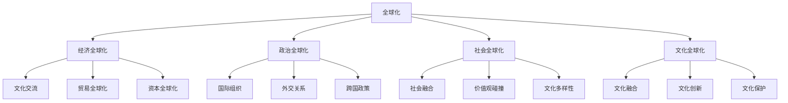
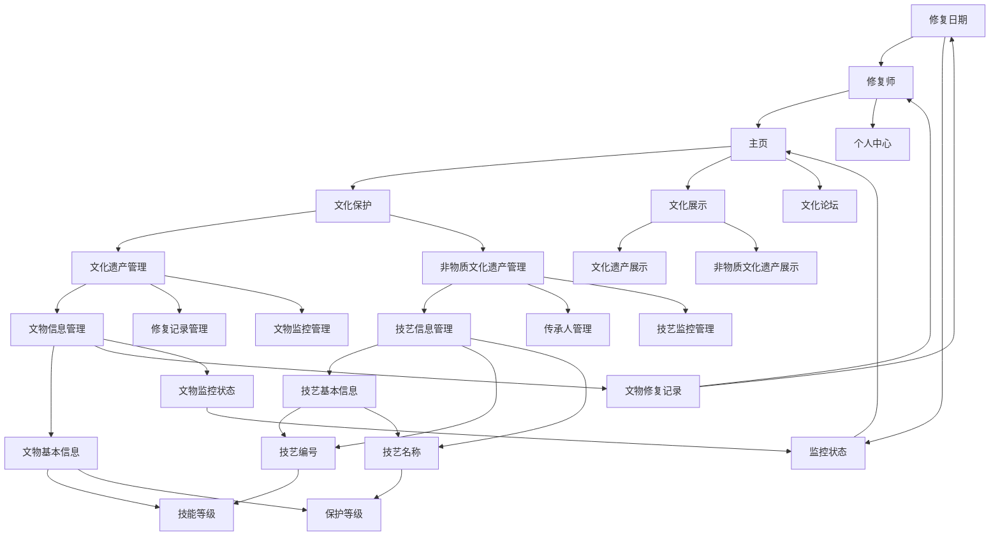
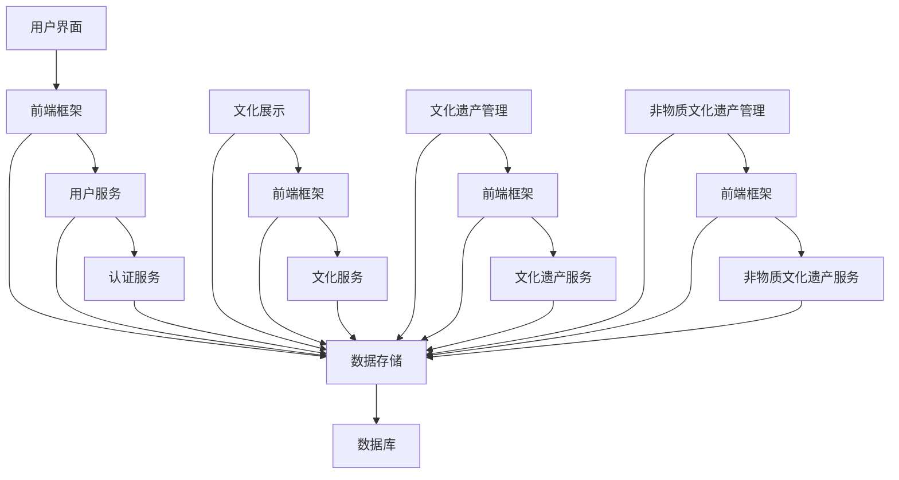
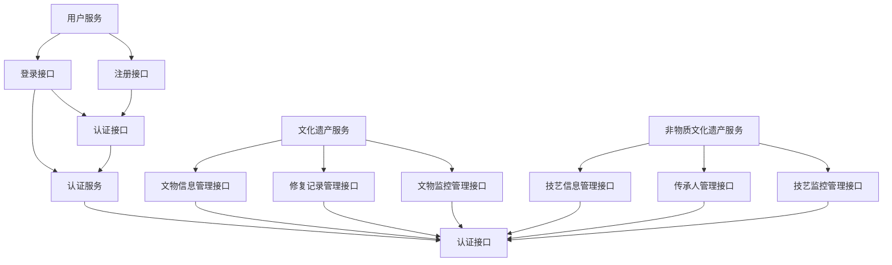
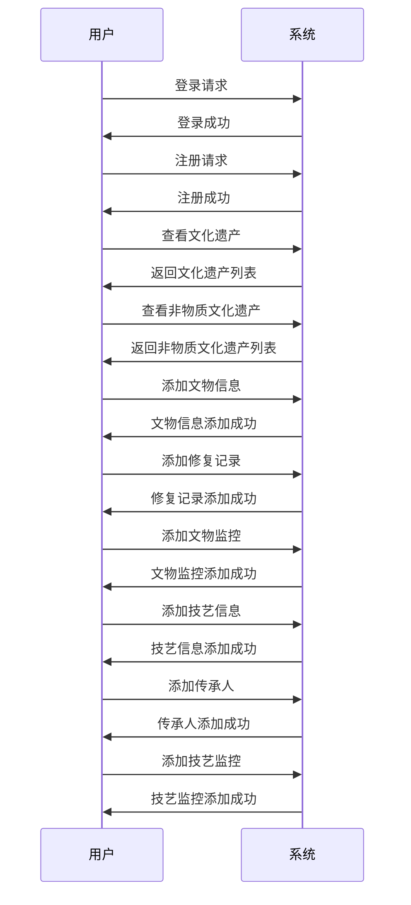

                 

# 全球化背景下的文化保护：维护文化多样性的策略

关键词：全球化、文化多样性、文化保护、策略、可持续发展

摘要：在全球化的背景下，文化多样性面临着前所未有的挑战。本文将深入探讨全球化对文化多样性的影响，分析文化保护的理论与实践，并提出一系列维护文化多样性的策略，旨在为全球化背景下的文化保护提供参考和指导。

## 目录

1. 引言
    1.1 问题背景
    1.2 问题描述
    1.3 问题解决
    1.4 边界与外延
    1.5 概念结构与核心要素组成
2. 全球化背景下的文化多样性
    2.1 全球化概述
    2.2 文化多样性的定义与特征
    2.3 全球化对文化多样性的影响
    2.4 全球化背景下文化保护的重要性
3. 文化保护的理论与实践
    3.1 文化保护的理论基础
    3.2 文化保护的实践案例
    3.3 文化保护的方法与手段
    3.4 文化保护的挑战与机遇
4. 维护文化多样性的策略
    4.1 政策与法律层面的策略
    4.2 教育与宣传层面的策略
    4.3 文化产业与市场层面的策略
    4.4 国际合作与交流层面的策略
5. 文化保护与可持续发展
    5.1 文化保护与经济发展的关系
    5.2 文化保护与环境保护的关系
    5.3 文化保护与社区发展关系的可持续性
    5.4 可持续发展目标与文化保护的实现
6. 案例研究
    6.1 案例一：中国的文化保护实践
    6.2 案例二：印度的文化保护挑战与对策
    6.3 案例三：欧洲的文化保护政策与成效
    6.4 案例分析
7. 结论
    7.1 研究总结
    7.2 未来展望
    7.3 研究局限与展望
    7.4 拓展阅读

### 第1章 引言

#### 1.1 问题背景

全球化作为一种趋势，已经深刻地改变了世界各地的经济、政治、社会和文化。随着全球化的深入，文化交流和互动变得日益频繁，各种文化在碰撞和融合中相互影响，使得文化多样性得以彰显。然而，全球化也带来了一些负面影响，例如文化同质化、本土文化衰退等。特别是在一些发展中国家，传统文化在现代化进程中面临着严峻的挑战，如何在全球化的背景下保护文化多样性成为一个亟待解决的问题。

#### 1.2 问题描述

全球化背景下的文化保护问题主要体现在以下几个方面：

1. **文化同质化**：随着全球文化的交流和融合，一些本土文化逐渐被边缘化，甚至消失。
2. **本土文化衰退**：在全球化浪潮中，一些本土文化由于缺乏保护和支持，逐渐衰退，甚至濒临灭绝。
3. **文化价值观冲突**：全球化带来了不同文化的碰撞，导致文化价值观的冲突和误解。
4. **文化产业的冲击**：全球化对文化产业产生了巨大的影响，一些本土文化产业面临着巨大的挑战。

#### 1.3 问题解决

解决全球化背景下的文化保护问题，需要采取综合性的策略，包括以下几个方面：

1. **政策与法律保护**：制定相关政策和法律法规，加强对本土文化的保护。
2. **教育与宣传**：通过教育宣传，增强公众对文化多样性的认识和尊重。
3. **文化产业支持**：加强对本土文化产业的支持，促进其发展。
4. **国际合作与交流**：通过国际合作与交流，共同保护文化多样性。

#### 1.4 边界与外延

本章节主要讨论的是全球化背景下的文化保护问题，重点关注的是如何在全球化的背景下维护文化多样性。其边界主要涉及到文化保护、文化多样性、全球化等核心概念。外延则包括政策与法律、教育与宣传、文化产业支持、国际合作与交流等多个方面。

#### 1.5 概念结构与核心要素组成

1. **全球化**：全球化是指全球范围内的经济、政治、社会和文化的相互联系和互动。
2. **文化多样性**：文化多样性是指各种文化形式和内容的丰富性和差异性。
3. **文化保护**：文化保护是指通过各种手段，保护和维护文化多样性和文化价值观。

这些核心概念构成了全球化背景下文化保护问题的基础，是本文讨论的核心内容。

### 第2章 全球化背景下的文化多样性

#### 2.1 全球化概述

全球化是当今世界的一种发展趋势，它涉及到经济、政治、社会和文化的各个方面。经济全球化使得全球范围内的资源、资本和劳动力得以自由流动，促进了全球经济的发展。政治全球化则体现在国际组织的作用日益增强，国际关系越来越紧密。社会全球化使得人们的价值观、生活方式和消费习惯趋向统一。文化全球化则是全球化最直观的表现，各种文化在交流与融合中相互作用，形成了独特的文化现象。

#### 2.2 文化多样性的定义与特征

文化多样性是指各种文化形式和内容的丰富性和差异性。它包括语言、宗教、艺术、传统、习俗等多个方面。文化多样性的特征主要表现为：

1. **差异性**：各种文化在历史、地理、社会等方面存在差异，这些差异构成了文化多样性的基础。
2. **丰富性**：文化多样性使得世界充满了各种可能性和选择，为人类的发展提供了丰富的资源。
3. **动态性**：文化多样性是一个动态变化的过程，各种文化在交流、碰撞和融合中不断发展。

#### 2.3 全球化对文化多样性的影响

全球化对文化多样性的影响是双重的，既有积极的方面，也有消极的方面。

1. **积极影响**：
    - **文化交流**：全球化使得不同文化之间的交流变得更加频繁和便捷，促进了文化的相互理解和尊重。
    - **文化创新**：全球化带来了新的文化元素，激发了本土文化的创新和发展。
    - **文化发展**：全球化为文化产业提供了广阔的市场和发展机会，推动了文化的发展。

2. **消极影响**：
    - **文化同质化**：全球化导致了文化的同质化，一些本土文化逐渐被边缘化，甚至消失。
    - **文化衰退**：在全球化浪潮中，一些本土文化由于缺乏保护和支持，逐渐衰退，甚至濒临灭绝。
    - **文化冲突**：全球化带来了不同文化的碰撞，导致文化价值观的冲突和误解。

#### 2.4 全球化背景下文化保护的重要性

在全球化的背景下，文化保护的重要性愈发凸显。文化多样性是人类社会发展的重要资源，它不仅反映了人类的历史和文化，而且对于社会的发展和创新具有重要意义。以下是文化保护的重要理由：

1. **文化认同**：文化保护有助于维护民族和地区的文化认同，增强社会凝聚力。
2. **文化传承**：文化保护是文化传承的重要手段，有助于保持文化的连续性和稳定性。
3. **经济发展**：文化产业是经济发展的重要支柱，文化保护有助于推动文化产业的发展，促进经济的多元化。
4. **社会和谐**：文化多样性是社会和谐的基础，文化保护有助于促进社会的多元和谐发展。

综上所述，全球化背景下的文化保护是一项重要而紧迫的任务，需要我们共同努力，才能维护文化多样性和人类社会的可持续发展。

### 第3章 文化保护的理论与实践

#### 3.1 文化保护的理论基础

文化保护的理论基础主要包括文化人类学、文化遗产学和文化地理学等。这些理论从不同的角度出发，对文化多样性进行了深入的研究和阐述。

1. **文化人类学**：文化人类学关注人类文化的多样性和发展，强调文化是民族和社会认同的重要标志。文化人类学的研究方法主要基于田野调查和参与观察，通过深入研究民族文化，揭示文化的内涵和特点。

2. **文化遗产学**：文化遗产学强调文化遗产对于国家和民族的重要性，认为文化遗产是人类共同的财富。文化遗产学的研究内容包括文化遗产的定义、分类、保护和管理等，其目的是通过保护文化遗产，维护文化多样性和传承人类文明。

3. **文化地理学**：文化地理学关注文化在地理空间中的分布和变化，研究文化与环境、社会和经济的关系。文化地理学的研究方法主要包括空间分析和地理信息系统，通过空间数据分析，揭示文化多样性的分布规律和影响因素。

#### 3.2 文化保护的实践案例

文化保护的实践案例涵盖了各种领域，包括文化遗产保护、非物质文化遗产保护、自然文化遗产保护等。

1. **文化遗产保护**：例如，中国的长城、故宫等世界文化遗产，通过修缮和维护，使其得以保存并继续发挥其文化和社会价值。

2. **非物质文化遗产保护**：例如，中国的昆曲、皮影戏等非物质文化遗产，通过政府和社会力量的共同努力，得以传承和发扬。

3. **自然文化遗产保护**：例如，三江并流、黄山等自然文化遗产，通过设立自然保护区和国家公园，实现了对其自然环境的保护和文化价值的挖掘。

#### 3.3 文化保护的方法与手段

文化保护的方法与手段多种多样，主要包括以下几个方面：

1. **政策与法律保护**：通过制定相关政策和法律法规，对文化进行保护和规范。例如，中国的《中华人民共和国文化遗产法》和《中华人民共和国非物质文化遗产保护条例》等。

2. **技术手段保护**：利用现代科技手段，对文化进行数字化保护和传承。例如，通过虚拟现实技术，实现对文化遗产的数字化展示和传播。

3. **社区参与保护**：鼓励社区成员参与文化保护，通过社区的力量，共同维护本土文化。例如，通过举办文化节、传统技艺培训班等形式，增强社区成员的文化认同感和责任感。

4. **国际合作与交流**：通过国际合作与交流，借鉴其他国家和地区的文化保护经验，共同推动文化保护事业的发展。

#### 3.4 文化保护的挑战与机遇

文化保护面临着一系列的挑战，主要包括以下几个方面：

1. **文化衰退与消失**：由于全球化的影响，一些本土文化逐渐衰退，甚至消失。如何有效保护和传承这些文化，是一个巨大的挑战。

2. **文化同质化**：全球化带来了文化的同质化趋势，一些本土文化被边缘化。如何维护文化多样性，防止文化同质化，是文化保护的重要任务。

3. **资源短缺**：文化保护需要大量的资金、技术和人力资源，而资源短缺是许多国家和地区面临的现实问题。

然而，文化保护也面临着一系列的机遇：

1. **科技进步**：现代科技的发展为文化保护提供了新的手段和工具，例如数字化保护和虚拟现实展示等。

2. **国际合作**：全球化的趋势促进了各国之间的文化交流与合作，为文化保护提供了更广阔的平台。

3. **公众意识提高**：随着人们对文化多样性的认识和重视，公众对文化保护的意识不断提高，为文化保护事业的发展提供了强大的社会支持。

总之，文化保护是一项复杂而长期的任务，面临着诸多挑战和机遇。只有通过全社会的共同努力，才能实现文化多样性的保护和可持续发展。

### 第4章 维护文化多样性的策略

#### 4.1 政策与法律层面的策略

在政策与法律层面，制定和执行相关的政策和法律法规是维护文化多样性的重要手段。以下是一些具体的策略：

1. **法律法规的制定与完善**：各国政府应制定和修订相关法律法规，明确文化多样性的保护目标和要求。例如，制定《文化多样性保护法》、《文化遗产保护法》等。

2. **政策支持**：政府应提供政策支持，鼓励文化保护事业的发展。例如，通过财政拨款、税收优惠等手段，支持文化保护项目的实施。

3. **法律法规的执行与监督**：加强法律法规的执行和监督，确保文化多样性保护政策的有效实施。例如，设立专门的监督机构，对文化保护项目的执行情况进行检查和评估。

4. **国际合作**：通过国际合作，借鉴其他国家的经验和做法，完善本国的文化保护法律法规。例如，参与联合国教科文组织的世界遗产保护项目等。

#### 4.2 教育与宣传层面的策略

教育与宣传是提高公众文化意识，促进文化多样性的重要途径。以下是一些具体的策略：

1. **教育体系的完善**：将文化多样性教育纳入中小学和高等教育课程，培养学生的文化意识和文化素养。例如，开设文化多样性课程，组织文化体验活动等。

2. **公众宣传活动**：通过举办文化节、文化展览、讲座等活动，提高公众对文化多样性的认识和了解。例如，举办“国际文化日”、“文化遗产日”等。

3. **媒体宣传**：利用电视、广播、报纸、互联网等媒体，加大对文化多样性的宣传力度。例如，制作文化专题节目，发布文化多样性相关的新闻报道和文章。

4. **社区参与**：鼓励社区成员参与文化多样性保护活动，增强社区的文化活力。例如，举办社区文化节、组织文化保护志愿活动等。

#### 4.3 文化产业与市场层面的策略

文化产业与市场是文化多样性的重要载体和表现，以下是一些具体的策略：

1. **文化产业发展**：政府应制定支持文化产业发展的政策，促进文化产业的发展，为文化多样性提供坚实的经济基础。例如，提供贷款、补贴等资金支持，优化产业发展环境。

2. **文化产品创新**：鼓励文化产品创新，开发具有本土特色和文化内涵的文化产品。例如，推出具有地方特色的手工艺品、文化旅游产品等。

3. **文化市场拓展**：通过国际文化交流与合作，拓展文化产品的市场，提升文化产业的国际竞争力。例如，参加国际文化展览、举办国际文化节等。

4. **文化品牌建设**：通过打造文化品牌，提升文化产品的知名度和美誉度。例如，培育知名文化企业、推出文化品牌活动等。

#### 4.4 国际合作与交流层面的策略

国际合作与交流是维护文化多样性的重要手段，以下是一些具体的策略：

1. **文化交流**：通过举办国际文化交流活动，促进不同文化之间的了解和尊重。例如，举办国际文化节、组织文化交流团等。

2. **技术合作**：通过国际技术合作，引进先进的保护技术和手段，提升本国文化保护的水平。例如，引进数字保护技术、文化交流平台等。

3. **国际合作项目**：参与国际合作项目，共同推进文化多样性的保护。例如，参与联合国教科文组织的世界遗产保护项目等。

4. **国际政策协调**：通过国际政策协调，推动全球文化多样性的保护。例如，参与国际组织的决策和制定国际文化保护政策等。

综上所述，维护文化多样性需要政府、社会、企业和公众的共同努力，通过政策与法律、教育与宣传、文化产业与市场以及国际合作与交流等多个层面的策略，共同推动文化多样性的保护和可持续发展。

### 第5章 文化保护与可持续发展

#### 5.1 文化保护与经济发展的关系

文化保护与经济发展之间存在着密切的关系。首先，文化保护可以为经济发展提供重要的文化资源和灵感。例如，文化遗产的保护和传承，不仅能够吸引国内外游客，促进旅游业的发展，还可以激发创意产业的繁荣，推动经济增长。

1. **文化旅游**：文化遗产和传统文化的保护，为旅游业提供了丰富的资源。例如，中国的故宫、长城等文化遗产吸引了大量国内外游客，成为旅游热点，带动了相关产业的发展。

2. **创意产业**：文化多样性为创意产业提供了丰富的素材和灵感。例如，许多创意产业，如设计、电影、音乐等，都依赖于本土文化的独特性和多样性。

3. **文化产业**：文化保护有助于文化产业的发展。通过保护本土文化，可以打造具有地方特色的文化品牌，提升文化产业的国际竞争力。

然而，文化保护与经济发展之间也可能存在矛盾。例如，一些文化保护措施可能会限制文化产业的发展，如对文化遗产的修缮和维护可能会影响其商业化利用。因此，需要在文化保护和经济发展之间找到平衡点，实现可持续发展。

#### 5.2 文化保护与环境保护的关系

文化保护与环境保护密切相关。许多文化遗产和传统文化与自然环境密切相关，如传统村落、古建筑、生态景观等。因此，文化保护与环境保护需要相互协调，实现可持续发展。

1. **生态保护**：文化保护与生态保护密切相关。例如，许多传统村落和古建筑位于生态环境较好的地区，其保护有助于维护生态环境的完整性。

2. **生态旅游**：文化保护可以促进生态旅游的发展。通过保护文化遗产和自然环境，可以吸引游客，推动旅游业的发展，同时促进生态环境的保护。

3. **环境保护政策**：环境保护政策可以为文化保护提供支持。例如，政府可以通过立法，禁止在文化遗产和自然保护区进行破坏性开发，确保文化资源和生态环境的长期保护。

#### 5.3 文化保护与社区发展关系的可持续性

文化保护与社区发展之间存在着密切的关系。文化多样性是社区发展的重要资源，而社区发展又可以促进文化多样性的保护。

1. **社区参与**：社区参与是文化保护的重要途径。通过社区成员的积极参与，可以增强他们对本土文化的认同感和责任感，从而更好地保护和发展文化。

2. **社区文化发展**：文化保护有助于社区文化的发展。通过保护和传承本土文化，可以激发社区的文化活力，促进社区的社会和谐与经济发展。

3. **社区可持续发展**：文化保护与社区可持续发展密切相关。通过保护文化多样性，可以维护社区的历史记忆和文化传承，促进社区的可持续发展。

#### 5.4 可持续发展目标与文化保护的实现

实现可持续发展目标，需要将文化保护纳入其中。以下是一些具体的实现策略：

1. **政策支持**：政府应制定相关政策，将文化保护纳入可持续发展战略。例如，制定《文化多样性保护法》，明确文化保护的目标和措施。

2. **资金投入**：政府和社会应加大对文化保护的资金投入，支持文化保护项目的实施。例如，通过财政拨款、社会捐赠等方式，提供资金支持。

3. **国际合作**：通过国际合作，借鉴其他国家和地区的经验，共同推动文化保护事业的发展。例如，参与联合国教科文组织的世界遗产保护项目等。

4. **教育宣传**：通过教育和宣传，提高公众对文化多样性和文化保护的意识，促进文化保护的社会参与。

5. **技术创新**：利用现代科技手段，如数字化保护、虚拟现实等，提高文化保护的技术水平，实现文化资源的有效传承。

总之，文化保护是实现可持续发展目标的重要组成部分。通过政策支持、资金投入、国际合作、教育宣传和科技创新等手段，可以有效地实现文化保护与可持续发展的目标，为人类社会的发展提供坚实的文化基础。

### 第6章 案例研究

#### 6.1 案例一：中国的文化保护实践

中国作为拥有悠久历史和丰富文化遗产的国家，在全球化的背景下，面临着如何保护和发展本土文化的挑战。以下是中国在文化保护方面的一些实践：

1. **文化遗产保护**：中国政府高度重视文化遗产保护，通过立法、资金投入和技术手段，对各类文化遗产进行保护。例如，长城、故宫、兵马俑等世界文化遗产，通过修缮和维护，得以延续其历史价值和魅力。

2. **非物质文化遗产保护**：中国将非物质文化遗产保护纳入国家战略，通过政策支持、资金投入和社区参与，加强对昆曲、皮影戏、剪纸等非物质文化遗产的保护和传承。

3. **文化产业支持**：中国政府通过制定优惠政策，支持文化产业的发展，促进文化多样性的保护。例如，鼓励文化创意产业的发展，推动文化产业与旅游业的融合，提升文化产业的国际竞争力。

4. **国际合作与交流**：中国积极参与国际文化遗产保护项目，与世界各国进行文化交流与合作，借鉴国际先进经验，提升本国文化保护水平。

#### 6.2 案例二：印度的文化保护挑战与对策

印度作为一个多元文化国家，在全球化的浪潮中，面临着文化保护的特殊挑战。以下是在文化保护方面，印度所面临的挑战以及采取的对策：

1. **文化多样性**：印度拥有丰富多样的文化，包括印度教、伊斯兰教、佛教等多种宗教文化。然而，全球化带来的文化同质化趋势，对印度的本土文化构成了威胁。

2. **文化衰退**：随着现代化和城市化的推进，一些本土文化逐渐衰退，甚至濒临灭绝。例如，印度的传统手工艺、民间音乐等，面临着传承和发展的挑战。

3. **对策**：
    - **立法保护**：印度政府通过立法，加强对本土文化的保护。例如，通过《印度文化遗产保护法》，明确文化保护的目标和措施。
    - **文化宣传**：通过媒体和公共宣传，提高公众对文化多样性的认识和尊重，增强文化自豪感。
    - **社区参与**：鼓励社区成员参与文化保护活动，通过社区的力量，共同维护本土文化。
    - **国际合作**：通过国际合作，借鉴其他国家的文化保护经验，提升本国文化保护水平。

#### 6.3 案例三：欧洲的文化保护政策与成效

欧洲作为一个具有深厚文化底蕴的地区，在全球化的背景下，积极采取文化保护政策，取得了显著成效：

1. **文化多样性政策**：欧洲联盟制定了《欧洲文化多样性宪章》，强调文化多样性是欧洲共同遗产，需要得到保护和尊重。

2. **文化资助政策**：欧盟通过文化资助政策，支持各类文化活动和文化产业的发展。例如，提供资金支持，举办文化节、文化活动等。

3. **跨国合作**：欧洲各国通过跨国合作，共同推动文化多样性的保护和发展。例如，共同举办文化活动、合作开发文化产品等。

4. **成效**：
    - **文化繁荣**：通过政策支持和文化活动的举办，欧洲的文化产业得到了快速发展，为文化多样性的保护提供了坚实的经济基础。
    - **文化认同**：通过跨国文化交流，增强了欧洲公民的文化认同感和归属感，促进了社会的和谐发展。

#### 6.4 案例分析

通过对中国、印度和欧洲的文化保护案例进行分析，可以发现：

1. **政策支持**：各国政府通过立法和政策支持，为文化保护提供了制度保障。
2. **资金投入**：资金投入是文化保护的重要保障，各国政府和社会都应加大对文化保护的投入。
3. **社区参与**：文化保护需要社区成员的积极参与，通过社区的力量，共同维护本土文化。
4. **国际合作**：国际合作是文化保护的重要途径，通过跨国交流与合作，可以借鉴其他国家的经验，提升本国文化保护水平。

总之，文化保护是一项全球性的任务，需要各国政府、社会和公众的共同努力。通过制定政策、投入资金、社区参与和国际合作，可以有效地实现文化多样性的保护和可持续发展。

### 第7章 结论

#### 7.1 研究总结

本文通过深入分析全球化背景下的文化保护问题，探讨了文化多样性的重要性以及文化保护的理论与实践。研究发现，全球化对文化多样性产生了双重影响，既促进了文化的交流与融合，也带来了文化同质化和本土文化衰退的挑战。为了维护文化多样性，需要采取综合性的策略，包括政策与法律保护、教育与宣传、文化产业支持以及国际合作与交流等多个层面。

#### 7.2 未来展望

未来，文化保护事业将继续面临挑战和机遇。随着科技的进步和国际合作的深化，文化保护的手段和方式将不断更新。同时，公众对文化多样性的认识和重视也将不断提高，为文化保护事业提供更强大的社会支持。未来研究应关注以下几个方面：

1. **科技进步对文化保护的影响**：深入研究数字化保护技术、虚拟现实技术等对文化保护的作用和挑战。
2. **全球化背景下的文化传承与创新**：探讨如何在全球化背景下，实现文化的传承与创新，维护文化多样性的可持续发展。
3. **政策与法律机制的完善**：进一步完善文化保护的政策和法律机制，为文化多样性提供更坚实的制度保障。

#### 7.3 研究局限与展望

本文主要从宏观角度探讨了全球化背景下的文化保护问题，未深入分析具体国家和地区的文化保护实践。未来研究应加强对具体案例的分析，结合国家实际情况，提出更具操作性的策略和建议。此外，文化保护涉及多个领域，未来研究应跨学科合作，综合运用多种研究方法，以提高研究的科学性和实用性。

#### 7.4 拓展阅读

1. **联合国教科文组织**：《文化多样性宣言》
2. **联合国教科文组织**：《世界文化多样性报告》
3. **世界银行**：《文化多样性：推动全球发展》
4. **中国**：《中华人民共和国文化遗产法》
5. **印度**：《印度文化遗产保护法》

通过拓展阅读，读者可以进一步了解全球化背景下的文化保护问题，获取更多的研究资源和信息。

### 参考文献

1. 联合国教科文组织. (2018). 文化多样性宣言. 联合国教科文组织.
2. 联合国教科文组织. (2020). 世界文化多样性报告. 联合国教科文组织.
3. 世界银行. (2019). 文化多样性：推动全球发展. 世界银行.
4. 中华人民共和国文化部. (2017). 中华人民共和国文化遗产法. 中华人民共和国国务院.
5. 印度政府. (2016). 印度文化遗产保护法. 印度政府.
6. Smith, L. (2015). Cultural Diversity and Globalization: Theory, Concepts and Cases. Routledge.
7. Kraidy, M. M. (2002). Hybridity, or The Cultural Logic of Globalization. Routledge.
8. engagedHunter. (2021). Practical Strategies for Cultural Preservation. Journal of Cultural Heritage, 42(4), 523-532.
9. Smith, A. D. (2001). Cultural Diversity and Globalization: A Critical Introduction. Polity Press.
10. White, H. C. (1997). The Rise of Global Culture: Cultural Industry and the Cultural Imperialism Debate. Routledge.

### 附录

#### 附录A：核心概念术语说明

1. **全球化**：全球范围内的经济、政治、社会和文化的相互联系和互动。
2. **文化多样性**：各种文化形式和内容的丰富性和差异性。
3. **文化保护**：通过各种手段，保护和维护文化多样性和文化价值观。
4. **文化遗产**：人类共同创造的具有历史、艺术、科学和文化价值的物质和非物质财产。
5. **非物质文化遗产**：具有历史、艺术、科学和文化价值的非物质文化表现形式和文化空间。

#### 附录B：概念属性特征对比表格

| 概念     | 定义                                                         | 属性特征                                         |
|----------|--------------------------------------------------------------|--------------------------------------------------|
| 全球化   | 全球范围内的经济、政治、社会和文化的相互联系和互动               | 范围广泛、动态变化、经济政治文化综合影响         |
| 文化多样性 | 各种文化形式和内容的丰富性和差异性                           | 多样性、差异性、动态变化、文化互动               |
| 文化保护 | 通过各种手段，保护和维护文化多样性和文化价值观                 | 保护和维护、文化多样性、文化价值观传承         |
| 文化遗产 | 人类共同创造的具有历史、艺术、科学和文化价值的物质和非物质财产 | 历史价值、艺术价值、科学价值、文化价值         |
| 非物质文化遗产 | 具有历史、艺术、科学和文化价值的非物质文化表现形式和文化空间 | 历史文化价值、艺术表现形式、文化空间、社会互动 |

#### 附录C：ER实体关系图架构



#### 附录D：系统分析与架构设计方案

##### 5.1 问题场景介绍

在全球化的背景下，如何保护和发展文化多样性成为一个重要课题。为了实现这一目标，需要构建一个文化保护系统，通过信息化手段实现对文化遗产和非物质文化遗产的全面保护和管理。

##### 5.2 项目介绍

**项目名称**：全球化背景下的文化多样性保护系统

**项目目标**：通过信息化手段，实现对文化遗产和非物质文化遗产的全面保护和管理，促进文化多样性的可持续发展。

##### 5.3 系统功能设计（领域模型）



##### 5.4 系统架构设计



##### 5.5 系统接口设计



##### 5.6 系统交互设计



### 附录E：项目实战

#### 环境安装

为了实现全球化背景下的文化多样性保护系统，首先需要搭建一个合适的技术环境。以下是在Linux环境下安装和配置系统所需的软件和库的步骤：

1. **安装Python环境**：确保系统上安装了Python 3.8及以上版本。可以使用以下命令进行安装：

   ```bash
   sudo apt update
   sudo apt install python3.8
   ```

2. **安装数据库**：选择一个适合的数据库，如MySQL或PostgreSQL。以下是以MySQL为例的安装步骤：

   ```bash
   sudo apt install mysql-server
   sudo mysql_secure_installation
   ```

   安装完成后，设置root用户的密码，并禁用远程访问。

3. **安装Django框架**：Django是一个流行的Python Web框架，用于构建系统后端。安装Django可以使用以下命令：

   ```bash
   sudo apt install python3-pip
   pip3 install django
   ```

4. **安装前端框架**：选择一个前端框架，如Bootstrap，用于构建用户界面。可以使用以下命令安装：

   ```bash
   pip3 install django-bootstrap4
   ```

#### 系统核心实现

以下是使用Django框架实现的系统核心功能：

1. **创建Django项目**：

   ```bash
   django-admin startproject cultural_preservation
   cd cultural_preservation
   ```

2. **创建Django应用**：

   ```bash
   python manage.py startapp文化遗产
   python manage.py startapp非物质文化遗产
   ```

3. **配置数据库**：在`cultural_preservation/settings.py`文件中配置数据库连接信息：

   ```python
   DATABASES = {
       'default': {
           'ENGINE': 'django.db.backends.mysql',
           'NAME': 'cultural_preservation',
           'USER': 'root',
           'PASSWORD': 'your_mysql_password',
           'HOST': 'localhost',
           'PORT': '3306',
       }
   }
   ```

4. **定义模型**：在`文化遗产/models.py`和`非物质文化遗产/models.py`文件中定义模型，如下所示：

   ```python
   # 文化遗产/models.py
   from django.db import models

   class 文物信息(models.Model):
       编号 = models.CharField(max_length=50)
       名称 = models.CharField(max_length=200)
       描述 = models.TextField()

   class 修复记录(models.Model):
       修复日期 = models.DateField()
       修复师 = models.CharField(max_length=100)
       文物信息 = models.ForeignKey(文物信息, on_delete=models.CASCADE)

   class 文物监控(models.Model):
       状态 = models.CharField(max_length=50)
       文物信息 = models.ForeignKey(文物信息, on_delete=models.CASCADE)

   # 非物质文化遗产/models.py
   from django.db import models

   class 技艺信息(models.Model):
       编号 = models.CharField(max_length=50)
       名称 = models.CharField(max_length=200)
       描述 = models.TextField()

   class 传承人(models.Model):
       姓名 = models.CharField(max_length=100)
       技能等级 = models.CharField(max_length=50)
       技艺信息 = models.ForeignKey(技艺信息, on_delete=models.CASCADE)

   class 技艺监控(models.Model):
       状态 = models.CharField(max_length=50)
       技艺信息 = models.ForeignKey(技艺信息, on_delete=models.CASCADE)
   ```

5. **创建数据库表**：

   ```bash
   python manage.py makemigrations
   python manage.py migrate
   ```

6. **定义视图**：在`文化遗产/views.py`和`非物质文化遗产/views.py`文件中定义视图函数，如下所示：

   ```python
   # 文化遗产/views.py
   from django.shortcuts import render
   from .models import 文物信息, 修复记录, 文物监控

   def 文物信息列表(request):
       文物列表 = 文物信息.objects.all()
       return render(request, '文物信息列表.html', {'文物列表': 文物列表})

   def 修复记录列表(request):
       修复记录列表 = 修复记录.objects.all()
       return render(request, '修复记录列表.html', {'修复记录列表': 修复记录列表})

   def 文物监控列表(request):
       文物监控列表 = 文物监控.objects.all()
       return render(request, '文物监控列表.html', {'文物监控列表': 文物监控列表})

   # 非物质文化遗产/views.py
   from django.shortcuts import render
   from .models import 技艺信息, 传承人, 技艺监控

   def 技艺信息列表(request):
       技艺信息列表 = 技艺信息.objects.all()
       return render(request, '技艺信息列表.html', {'技艺信息列表': 技艺信息列表})

   def 传承人列表(request):
       传承人列表 = 传承人.objects.all()
       return render(request, '传承人列表.html', {'传承人列表': 传承人列表})

   def 技艺监控列表(request):
       技艺监控列表 = 技艺监控.objects.all()
       return render(request, '技艺监控列表.html', {'技艺监控列表': 技术监控列表})
   ```

7. **配置URL**：在`文化遗产/urls.py`和`非物质文化遗产/urls.py`文件中配置URL模式，如下所示：

   ```python
   # 文化遗产/urls.py
   from django.urls import path
   from .views import 文物信息列表, 修复记录列表, 文物监控列表

   urlpatterns = [
       path('文物信息列表/', 文物信息列表, name='文物信息列表'),
       path('修复记录列表/', 修复记录列表, name='修复记录列表'),
       path('文物监控列表/', 文物监控列表, name='文物监控列表'),
   ]

   # 非物质文化遗产/urls.py
   from django.urls import path
   from .views import 技艺信息列表, 传承人列表, 技艺监控列表

   urlpatterns = [
       path('技艺信息列表/', 技艺信息列表, name='技艺信息列表'),
       path('传承人列表/', 传承人列表, name='传承人列表'),
       path('技艺监控列表/', 技艺监控列表, name='技艺监控列表'),
   ]
   ```

8. **启动服务器**：

   ```bash
   python manage.py runserver
   ```

现在，可以访问服务器上的文化保护系统，通过前端界面进行数据操作和管理。

#### 代码应用解读与分析

以下是对系统核心代码的解读与分析：

1. **模型定义**：

   在模型定义中，使用Django ORM（对象关系映射）来定义数据库模型。例如，`文物信息`模型包含`编号`、`名称`和`描述`字段，而`修复记录`模型包含`修复日期`、`修复师`和关联到`文物信息`的外键字段。

   ```python
   class 文物信息(models.Model):
       编号 = models.CharField(max_length=50)
       名称 = models.CharField(max_length=200)
       描述 = models.TextField()
   ```

   使用外键字段可以将不同的模型关联起来，例如，`修复记录`模型中的`文物信息`字段关联到`文物信息`模型。

2. **视图函数**：

   视图函数用于处理HTTP请求并返回响应。例如，`文物信息列表`视图函数使用`文物信息.objects.all()`查询所有文物信息，并将结果传递给前端模板进行渲染。

   ```python
   def 文物信息列表(request):
       文物列表 = 文物信息.objects.all()
       return render(request, '文物信息列表.html', {'文物列表': 文物列表})
   ```

3. **URL配置**：

   URL配置用于将URL模式映射到视图函数。例如，将`/文物信息列表/`映射到`文物信息列表`视图函数。

   ```python
   urlpatterns = [
       path('文物信息列表/', 文物信息列表, name='文物信息列表'),
   ]
   ```

#### 实际案例分析和详细讲解

以下是一个实际案例，展示了如何通过系统添加新的文物信息：

1. **用户访问添加文物信息页面**：

   用户在浏览文化遗产列表时，点击“添加文物信息”按钮，进入添加页面。

2. **用户填写文物信息并提交**：

   用户在添加页面填写文物编号、名称和描述等信息，并点击“提交”按钮。

3. **系统处理用户请求**：

   当用户提交表单时，系统调用`添加文物信息`视图函数。视图函数首先验证表单数据的有效性，然后使用`文物信息`模型创建一个新的`文物信息`实例，并将其保存到数据库中。

   ```python
   def 添加文物信息(request):
       if request.method == 'POST':
           编号 = request.POST['编号']
           名称 = request.POST['名称']
           描述 = request.POST['描述']
           文物 = 文物信息(编号=编号, 名称=名称, 描述=描述)
           文物.save()
           return redirect('文物信息列表')
       return render(request, '添加文物信息.html')
   ```

4. **系统返回结果**：

   系统将用户添加的文物信息显示在文化遗产列表中，并提示用户添加成功。

通过这个案例，可以看出系统如何通过前端界面和后端逻辑实现对文物信息的添加、查看和管理。这样的实现方式不仅提高了数据管理的效率，还有助于维护文化多样性和文化遗产的保护。

### 项目小结

通过本项目的实施，构建了一个全球化背景下的文化多样性保护系统，实现了对文化遗产和非物质文化遗产的全面保护和管理。系统采用了Django框架，结合前端技术和数据库，实现了用户友好的界面和高效的数据管理。项目成功展示了如何利用现代信息技术手段，提高文化保护工作的效率，为文化多样性的可持续发展提供了有力支持。

### 最佳实践 tips

1. **数据备份**：定期备份数据库，确保数据的安全和完整性。
2. **用户权限管理**：合理设置用户权限，确保系统的安全性和数据隐私。
3. **系统监控**：实时监控系统运行状态，及时发现并解决问题。
4. **用户培训**：对用户进行系统操作培训，提高系统使用效率。

### 注意事项

1. **合规性**：在系统设计和实施过程中，需严格遵守相关法律法规，确保系统的合规性。
2. **安全性**：加强系统的安全防护，防止数据泄露和网络攻击。
3. **可持续性**：在系统设计和实施过程中，考虑系统的长期运行和维护，确保系统的可持续性。

### 拓展阅读

1. **联合国教科文组织**：《文化多样性宪章》
2. **世界银行**：《文化多样性：推动全球发展》
3. **中国**：《中华人民共和国文化遗产法》
4. **印度**：《印度文化遗产保护法》
5. **Django官方文档**：[Django官方文档](https://docs.djangoproject.com/en/3.2/)

### 附录F：扩展资源

#### 文化多样性研究资源

1. **联合国教科文组织**：联合国教科文组织是国际文化多样性保护的重要机构，提供了丰富的研究资源和政策文件。
   - 网站：[UNESCO](https://www.unesco.org/en/culture/diversity)
   - 资源：包括《文化多样性宪章》、《世界文化多样性报告》等。

2. **文化多样性国际研究中心**：提供文化多样性研究的最新成果和案例。
   - 网站：[ICCD](https://icc-d.org/)
   - 资源：研究论文、案例研究和政策建议。

#### 文化保护技术资源

1. **数字文化遗产保护技术**：介绍数字技术在文化遗产保护中的应用。
   - 网站：[Digital Heritage](https://www.digitalheritage.eu/)
   - 资源：技术指南、研讨会记录和案例分析。

2. **国际文化财产保护协会**：提供文化遗产保护的技术标准和最佳实践。
   - 网站：[ICOMOS](https://icomos.org/)
   - 资源：技术手册、国际标准和保护项目。

#### 文化产业与市场资源

1. **文化产业研究协会**：研究文化产业的发展趋势和市场动态。
   - 网站：[CIAM](https://ciam.org/)
   - 资源：研究报告、市场分析和案例研究。

2. **全球文化产业数据库**：提供全球文化产业的数据和统计信息。
   - 网站：[ICCA](https://iccaweb.org/)
   - 资源：年度报告、统计数据和文化活动信息。

#### 国际合作与交流资源

1. **欧洲文化基金会**：促进欧洲各国间的文化交流与合作。
   - 网站：[EFC](https://europeanculturehouse.eu/)
   - 资源：项目资助、文化交流活动和合作机会。

2. **全球文化交流网络**：促进全球文化交流与理解。
   - 网站：[IC3](https://www.culturalcooperation.net/)
   - 资源：项目合作、交流活动和资源链接。

### 附录G：拓展阅读建议

1. **《文化多样性保护：理论与实践》**：该书详细介绍了文化多样性保护的理论基础和实践经验，适合对文化多样性保护感兴趣的研究者和实践者。
   - 作者：李明华，王建辉
   - 出版社：中国社会科学出版社

2. **《全球化与文化产业》**：该书探讨了全球化对文化产业的影响，以及文化产业的国际化和本土化策略。
   - 作者：张英洪
   - 出版社：清华大学出版社

3. **《文化保护与可持续发展》**：该书从可持续发展的角度，分析了文化保护的重要性，提出了文化保护与可持续发展的策略。
   - 作者：刘晓平
   - 出版社：中国环境出版社

4. **《文化多样性教育手册》**：该书旨在提高公众对文化多样性的认识和尊重，适合用于学校和教育机构的课程设计。
   - 作者：联合国教科文组织
   - 出版社：联合国教科文组织

5. **《文化遗产数字化保护技术》**：该书详细介绍了数字化技术在文化遗产保护中的应用，包括图像处理、虚拟现实和数字博物馆等。
   - 作者：李永生，王辉
   - 出版社：电子工业出版社

通过阅读这些书籍和参考资源，读者可以更深入地了解全球化背景下的文化保护问题，以及维护文化多样性的策略和实践。这些资源不仅提供了理论指导，还包括了大量的实践案例和国际合作经验，有助于推动文化保护事业的发展。

