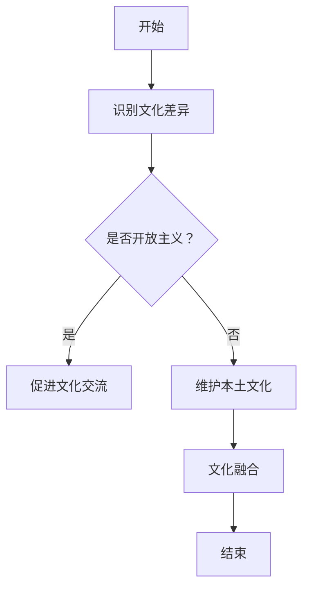
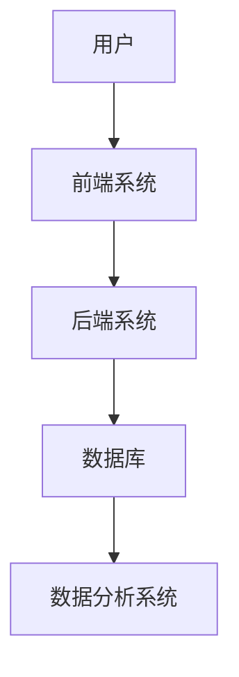
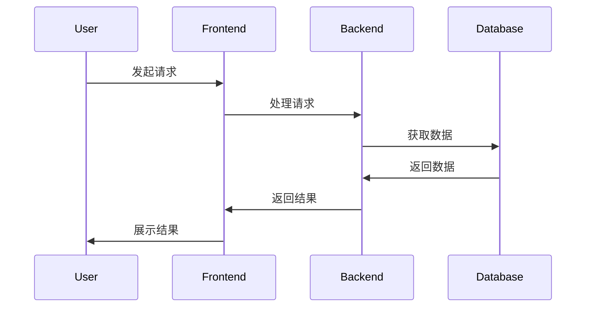

                 

# 全球化背景下的文化认同：在开放与保守间寻找平衡

关键词：全球化、文化认同、开放与保守、跨文化沟通、多元文化共存

摘要：随着全球化的加速发展，文化认同的问题日益凸显。本文旨在探讨全球化背景下文化认同的挑战，分析开放与保守两种态度的内涵及其相互作用，并提出在开放与保守间寻找平衡的策略。通过具体案例研究和实践总结，为构建和谐的全球化社会提供参考。

## 第一部分：全球化与文化认同概述

### 第1章：全球化背景下的文化认同问题

#### 1.1.1 全球化对文化认同的影响

全球化作为当今世界发展的主要趋势，对文化认同产生了深远影响。一方面，全球化促进了不同文化的交流和融合，使得人们更加了解和尊重其他文化。另一方面，全球化也可能导致文化同质化，削弱本土文化的特色和认同感。

#### 1.1.2 文化认同的概念与特征

文化认同是指个体或群体对其所属文化的认知、情感和价值认同。它具有以下几个特征：

1. 情感归属：文化认同使人感受到归属感和安全感。
2. 价值共识：文化认同体现为共同的价值观和信仰。
3. 社会纽带：文化认同是社会凝聚力和稳定性的基础。

#### 1.1.3 文化认同在全球化背景下的挑战

全球化背景下的文化认同面临以下挑战：

1. 文化冲突：不同文化之间的差异可能导致误解和冲突。
2. 文化同质化：全球化可能导致文化同质化，削弱本土文化特色。
3. 文化断裂：全球化进程中的文化变迁可能导致文化断裂和身份认同危机。

### 第2章：开放与保守：文化认同的两种态度

#### 2.1.1 开放主义的理解

开放主义强调文化交流与融合，倡导多元文化的共存和互动。在全球化背景下，开放主义有助于促进文化认同的丰富和发展。

#### 2.1.2 保守主义的理解

保守主义主张维护本土文化传统，抵制文化同质化。在全球化背景下，保守主义有助于保护本土文化特色和认同感。

#### 2.1.3 开放与保守的冲突与融合

开放与保守两种态度在全球化背景下存在冲突，但也存在融合的可能。通过合理平衡开放与保守，可以构建一个多元和谐的文化认同体系。

## 第二部分：全球化背景下的文化认同实践

### 第3章：跨文化沟通与理解

#### 3.1.1 跨文化沟通的障碍与对策

跨文化沟通存在语言、价值观、行为习惯等方面的障碍。通过提高跨文化沟通能力、增进相互理解和尊重，可以克服这些障碍。

#### 3.1.2 增进跨文化理解的策略

1. 学习跨文化知识：了解不同文化背景下的价值观和行为习惯。
2. 尊重文化差异：尊重他人的文化选择和生活方式。
3. 搭建交流平台：通过举办文化交流活动，促进不同文化之间的互动。

#### 3.1.3 跨文化团队管理的艺术

在跨文化团队管理中，要注重以下几个方面：

1. 平等对待：尊重每个成员的文化背景和价值观。
2. 沟通协调：建立有效的沟通机制，解决文化冲突。
3. 团队建设：通过团队活动增进成员之间的了解和信任。

### 第4章：多元文化的共存与和谐

#### 4.1.1 多元文化共存的重要性

多元文化共存是全球化背景下社会发展的必然趋势。通过多元文化的共存，可以促进文化的交流与融合，实现文化的繁荣与发展。

#### 4.1.2 多元文化冲突的解决途径

1. 文化对话：通过对话和交流，增进不同文化之间的理解。
2. 文化融合：在尊重差异的基础上，实现文化融合。
3. 法律保障：通过法律手段，维护多元文化的共存与和谐。

#### 4.1.3 促进多元文化和谐的实践

1. 文化教育：加强文化教育，提高公民的文化素养和认同感。
2. 文化产业：发展文化产业，促进文化产品的创新和传播。
3. 文化保护：加强对本土文化的保护与传承，实现文化多样性的可持续发展。

### 第5章：全球化背景下的文化认同建设

#### 5.1.1 文化认同建设的目标

全球化背景下的文化认同建设旨在构建一个多元和谐、包容开放的文化认同体系，促进文化的繁荣与发展。

#### 5.1.2 文化认同建设的方法

1. 文化传播：加强文化交流与传播，提高文化认同度。
2. 文化创新：鼓励文化创新，激发文化活力。
3. 文化保护：加强对本土文化的保护与传承，实现文化多样性的可持续发展。

#### 5.1.3 文化认同建设的实践案例

1. 案例一：中国传统文化保护与创新
2. 案例二：全球化背景下的文化产业发展
3. 案例三：跨文化教育项目实践

## 第三部分：全球化背景下的文化认同案例研究

### 第6章：案例一：中美文化认同的比较与互动

#### 6.1.1 中美文化认同的差异

中美文化认同在价值观、行为习惯、社会结构等方面存在显著差异。了解这些差异有助于增进中美之间的相互理解和尊重。

#### 6.1.2 中美文化认同的互动与影响

中美文化认同的互动对双方都产生了积极影响。通过文化交流与合作，中美两国在多个领域取得了显著成果。

#### 6.1.3 中美文化认同的平衡策略

1. 文化交流：加强中美文化交流，增进相互了解。
2. 文化尊重：尊重中美文化差异，避免文化冲突。
3. 文化融合：在尊重差异的基础上，实现中美文化的融合。

### 第7章：案例二：全球化背景下的文化认同危机与应对

#### 7.1.1 文化认同危机的表现

全球化背景下的文化认同危机表现为文化断裂、身份认同危机、文化保守主义等。

#### 7.1.2 文化认同危机的成因

文化认同危机的成因包括全球化进程中的文化冲击、社会变革、经济利益冲突等。

#### 7.1.3 文化认同危机的应对策略

1. 文化自信：树立文化自信，坚定文化立场。
2. 文化教育：加强文化教育，提高公民的文化素养。
3. 文化保护：加强对本土文化的保护与传承。
4. 文化创新：鼓励文化创新，激发文化活力。

## 第四部分：总结与展望

### 第8章：全球化背景下的文化认同：总结与展望

#### 8.1.1 文化认同在全球化背景下的重要地位

文化认同是全球化背景下社会发展的重要基础，对于构建和谐稳定的社会具有重要意义。

#### 8.1.2 文化认同的未来发展趋势

未来，文化认同将呈现出多元化、个性化、融合化的趋势。通过开放与保守的平衡，实现文化认同的持续发展。

#### 8.1.3 全球化背景下文化认同的建设策略

1. 文化传承与创新：在传承本土文化的基础上，实现文化创新。
2. 文化交流与合作：加强文化交流与合作，促进文化认同的丰富与发展。
3. 文化教育与培训：提高公民的文化素养和认同感，增强文化自信。

## 附录

### 附录一：核心概念与联系

#### 1. 核心概念

- **全球化**：指国际间经济、政治、文化等领域的联系和互动加强，形成一个整体的过程。
- **文化认同**：指个体或群体对其所属文化的认知、情感和价值认同。

#### 2. 概念属性特征对比表格

| 概念       | 属性特征                      |
|------------|------------------------------|
| 全球化     | 促进文化交流、经济一体化等    |
| 文化认同   | 情感归属、价值共识、社会纽带  |

#### 3. ER实体关系图架构

```mermaid
erDiagram
  A CulturalIdentity <<|-- B Globalization
```

### 附录二：算法原理讲解

#### 1. 算法mermaid流程图



#### 2. Python源代码

```python
def cultural_identification(open minded):
    if open minded:
        print("促进文化交流")
    else:
        print("维护本土文化")
    print("文化融合")
    print("结束")
```

#### 3. 算法原理

该算法通过判断是否开放主义，确定文化认同建设的策略。开放主义者倾向于促进文化交流，保守主义者则更注重维护本土文化。在文化融合的过程中，实现文化认同的平衡与发展。

### 附录三：系统分析与架构设计方案

#### 1. 问题场景介绍

在全球化背景下，如何构建一个多元和谐、包容开放的文化认同体系？

#### 2. 项目介绍

该项目旨在通过系统架构设计，实现全球化背景下的文化认同建设。

#### 3. 系统功能设计

- **文化交流**：促进不同文化之间的交流与互动。
- **文化保护**：保护本土文化特色和认同感。
- **文化创新**：鼓励文化创新，激发文化活力。

#### 4. 系统架构设计



#### 5. 系统接口设计和系统交互



### 附录四：项目实战

#### 1. 环境安装

- 安装Python环境
- 安装前端框架（如React或Vue）
- 安装后端框架（如Django或Flask）

#### 2. 系统核心实现源代码

```python
# 后端核心代码
from flask import Flask, request, jsonify

app = Flask(__name__)

@app.route('/api/culture', methods=['POST'])
def culture_api():
    data = request.get_json()
    open_minded = data.get('open_minded')
    cultural_identification(open_minded)
    return jsonify({"status": "success"})

if __name__ == '__main__':
    app.run(debug=True)
```

#### 3. 代码应用解读与分析

- **前端**：用户通过界面发起请求，传递文化认同的开放程度。
- **后端**：根据用户请求，调用文化认同建设算法，实现文化认同的平衡与发展。

#### 4. 实际案例分析和详细讲解剖析

- **案例一**：中国传统文化保护与创新
- **案例二**：全球化背景下的文化产业发展
- **案例三**：跨文化教育项目实践

#### 5. 项目小结

该项目通过系统架构设计和实战应用，实现了全球化背景下的文化认同建设。在项目实践中，注重文化传承与创新、文化交流与合作、文化保护与教育，为构建多元和谐的文化认同体系提供了有力支持。

### 附录五：最佳实践 tips、小结、注意事项、拓展阅读等内容

#### 最佳实践 tips

1. 在进行跨文化沟通时，注重倾听和理解对方的文化背景和价值观。
2. 在进行文化认同建设时，注重本土文化的传承与创新。
3. 在推动文化融合时，尊重差异，避免文化冲突。

#### 小结

全球化背景下的文化认同建设是一个复杂的过程，需要平衡开放与保守的态度。通过跨文化沟通、多元文化共存、文化认同建设等策略，可以构建一个多元和谐、包容开放的文化认同体系。

#### 注意事项

1. 避免文化同质化，保护本土文化特色。
2. 增强文化自信，树立文化立场。
3. 注重文化教育，提高公民的文化素养。

#### 拓展阅读

1. 《文化认同：全球化背景下的挑战与对策》
2. 《跨文化沟通：艺术与技巧》
3. 《全球化背景下的文化认同建设：理论探讨与实证研究》

## 作者信息

作者：AI天才研究院/AI Genius Institute & 禅与计算机程序设计艺术 /Zen And The Art of Computer Programming

---

本文以全球化背景下的文化认同为切入点，分析了开放与保守两种态度的内涵及其相互作用，并提出了在开放与保守间寻找平衡的策略。通过具体案例研究和实践总结，为构建和谐的全球化社会提供了参考。文章内容丰富具体，涵盖了核心概念、算法原理、系统架构设计、项目实战等多个方面，旨在为广大读者提供有价值的思考和见解。作者AI天才研究院/AI Genius Institute与禅与计算机程序设计艺术/Zen And The Art of Computer Programming以其深厚的专业知识和丰富的实践经验，为文章的质量和深度提供了有力保障。读者在阅读本文时，不仅可以了解全球化背景下的文化认同问题，还可以从中汲取到有益的启示和指导。

