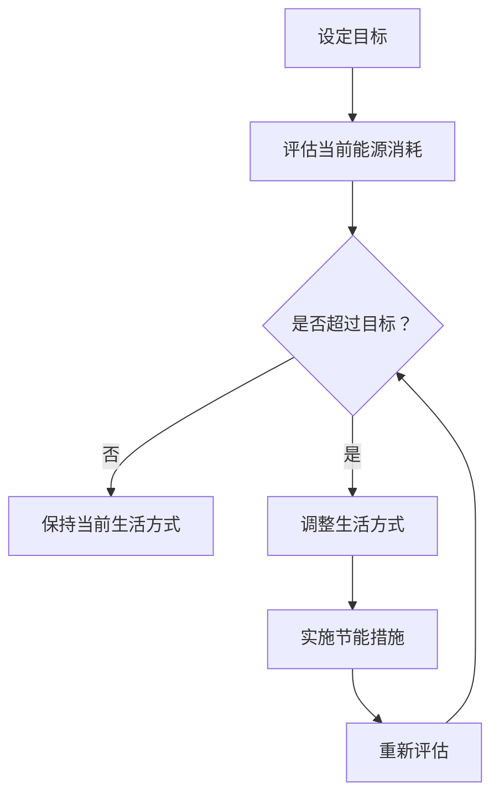
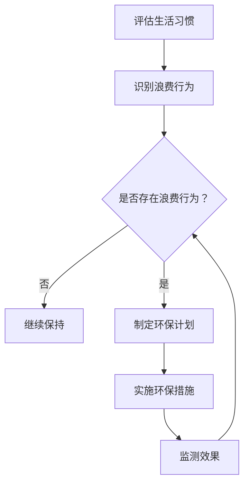
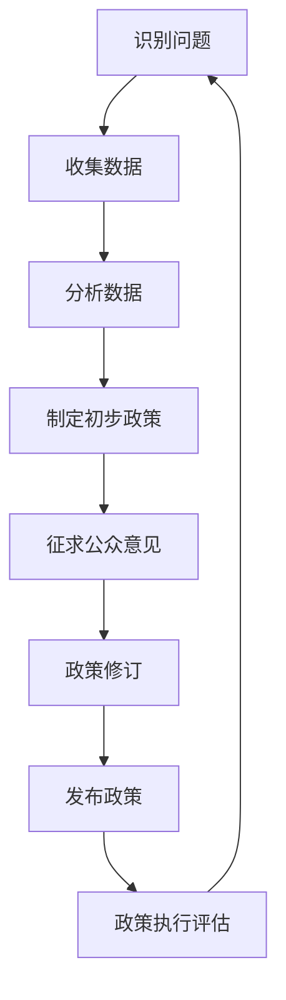
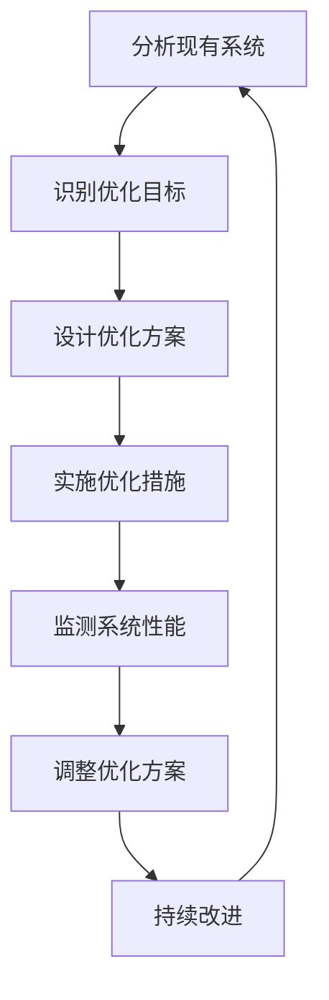
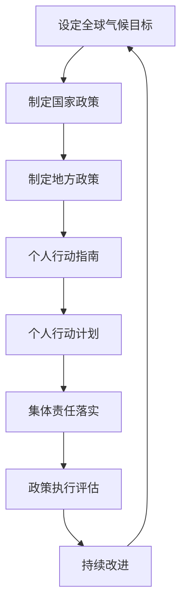
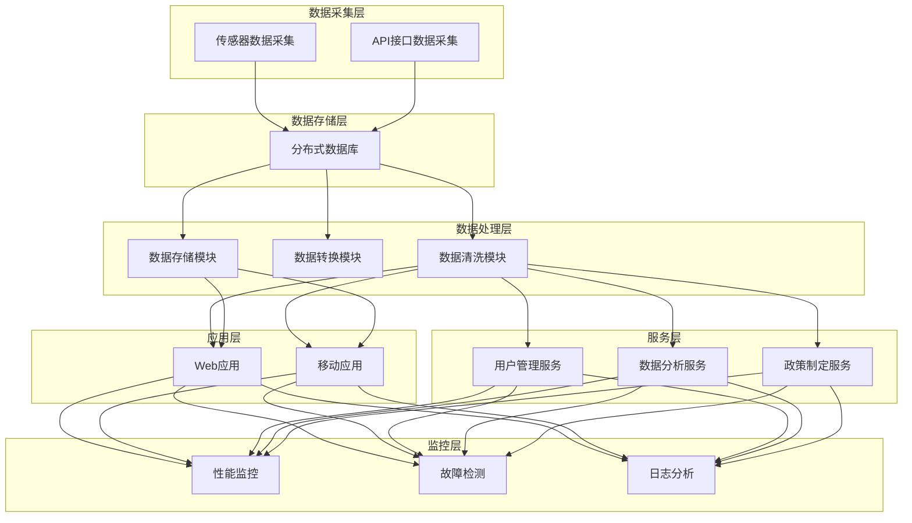
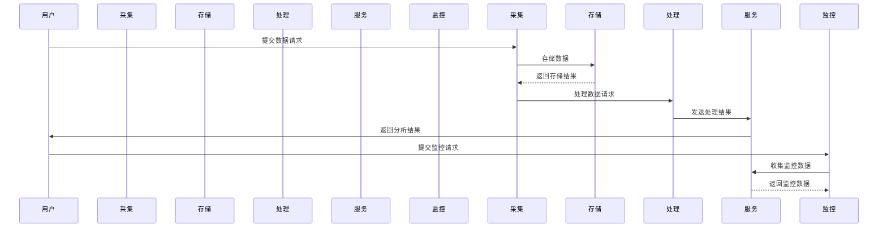

                 

### 1.1 全球气候变化的原因与影响

全球气候变化是一个复杂且多维的现象，其背后的原因众多，其中最主要的因素包括人类活动、自然因素以及两者之间的相互作用。以下是一些导致全球气候变化的关键原因：

#### 1.1.1 人类活动

**1.1.1.1 大气污染物排放**

- **温室气体排放**：化石燃料的燃烧，如煤、石油和天然气的使用，会产生大量的二氧化碳（CO₂）、甲烷（CH₄）和一氧化二氮（N₂O）等温室气体。这些气体在大气中形成“温室效应”，导致地球表面温度升高。
  
- **工业排放**：工业生产过程中会排放出大量的温室气体和其他污染物，如二氧化硫（SO₂）和氮氧化物（NOₓ）。这些污染物不仅会导致气候变化，还会引发酸雨和大气污染。

**1.1.1.2 森林砍伐和土地利用变化**

- **森林砍伐**：森林是地球上最重要的碳汇之一，能够吸收大量的二氧化碳。然而，由于农业扩张、城市化和采矿等原因，全球森林砍伐速度不断加快，导致碳吸收能力下降。

- **土地利用变化**：土地的转化，如农田、牧场和建筑用地，也会影响气候。这些活动改变了地表特性，增加了温室气体的排放。

#### 1.1.2 自然因素

**1.1.2.1 太阳活动**

- **太阳辐射**：太阳是地球气候系统的主要能量来源。太阳活动的变化，如太阳黑子和太阳风的强度，会影响地球的辐射平衡。

**1.1.2.2 地球内部活动**

- **火山活动**：火山喷发会释放大量的气体和颗粒物质到大气中，这些物质可以反射和吸收太阳辐射，暂时性地影响气候。

- **地球磁场变化**：地球磁场的强度和方向会发生变化，这些变化可能影响大气层的流动和辐射平衡。

#### 1.1.3 人类活动与自然因素的相互作用

- **反馈机制**：人类活动产生的温室气体和其他污染物在大气中形成反馈机制，如水循环的改变、云层形成的变化等，进一步加剧了气候变化的程度。

- **协同效应**：人类活动和自然因素之间的协同效应也会影响气候变化，例如，森林砍伐和二氧化碳排放的协同效应可能导致更快的全球变暖。

#### 1.1.4 全球气候变化的影响

全球气候变化带来了广泛且深远的影响，包括：

- **气温升高**：全球平均气温的持续升高，导致极端天气事件（如热浪、干旱、洪水和飓风）的频率和强度增加。

- **海平面上升**：冰川和冰盖的融化导致海平面上升，威胁沿海城市和岛屿的生存。

- **生态影响**：气候变化对生态系统的影响广泛，包括物种分布的变化、生态平衡的破坏以及生物多样性的减少。

- **社会经济影响**：气候变化对农业、渔业、旅游业等经济活动产生负面影响，同时增加自然灾害的损失。

#### 1.1.5 可持续生活的重要性

为了应对全球气候变化，采取可持续生活方式变得至关重要。可持续生活不仅涉及减少个人和集体的碳足迹，还包括促进资源的合理利用和保护自然环境。通过改变生活习惯、采用绿色技术和政策，我们可以共同减缓气候变化的影响。

在接下来的章节中，我们将深入探讨个人行动和集体责任在可持续生活中的具体作用和实施方法。

### 1.2 可持续生活的定义与重要性

#### 1.2.1 可持续生活的定义

可持续生活（Sustainable Living）是一种旨在满足当代人的需求而不损害后代满足其需求能力的生活方式。它强调资源的合理利用、环境的保护和经济的可持续性。可持续生活不仅仅是个人行为的改变，更是一个涉及社会、经济和环境多方面的综合体系。

**1.2.1.1 资源合理利用**

资源合理利用是可持续生活的基础。这包括减少资源消耗、提高资源利用效率、促进资源的可再生和循环利用。例如，通过节能技术、绿色建筑和清洁能源的使用，可以显著减少能源消耗和温室气体排放。

**1.2.1.2 环境保护**

环境保护是可持续生活的核心。它要求人们减少对自然资源的破坏，保护生物多样性，维护生态平衡。例如，减少化学污染、防止土地退化、保护森林和海洋等自然环境，都是保护地球的重要措施。

**1.2.1.3 经济可持续性**

经济的可持续性强调在满足当前需求的同时，不损害未来发展的能力。这要求推动绿色经济、促进可持续发展产业和就业，同时确保资源的公平分配和社会公正。

#### 1.2.2 可持续生活的重要性

**1.2.2.1 应对气候变化**

全球气候变化对人类社会和自然环境造成了巨大威胁。通过采取可持续生活方式，个人和集体可以减少温室气体排放、降低对自然资源的压力，从而减缓气候变化的速度和程度。例如，减少化石燃料的使用、增加可再生能源的使用、减少废物产生等都是有效的应对措施。

**1.2.2.2 保护生态系统**

地球的生态系统为人类提供了食物、水源、气候调节和生物多样性等服务。可持续生活有助于保护这些生态系统，确保它们能够持续为人类提供必要的资源和服务。例如，通过恢复森林、减少农业污染和保护海洋，可以维护生态平衡和生物多样性。

**1.2.2.3 促进社会公正**

可持续生活不仅关注环境保护和资源利用，还强调社会的公平和公正。通过减少贫富差距、提高教育水平和促进社会参与，可持续生活可以建立一个更加公平、和谐的社会。例如，推广可再生能源技术和绿色经济，可以创造更多的就业机会，提高贫困地区居民的生活质量。

**1.2.2.4 经济发展**

虽然可持续生活强调环境保护和社会公正，但它也是经济发展的动力。通过推动绿色技术和可持续发展产业，可以创造新的商机、促进创新和经济增长。例如，太阳能、风能和电动汽车等绿色产业不仅减少了对环境的破坏，还创造了大量的就业机会。

综上所述，可持续生活是一个涵盖环境保护、资源利用和社会公正的多维度概念。通过个人和集体的共同努力，我们可以实现可持续生活，为地球和未来世代创造一个更美好、更可持续的未来。

#### 1.3 个人行动与集体责任在气候变化中的作用

**1.3.1 个人行动的重要性**

个人行动在应对气候变化中发挥着至关重要的作用。每个人都可以通过改变自己的生活方式，减少对环境的负面影响。以下是一些具体的个人行动：

- **节能减排**：通过减少电力和燃料的使用，个人可以显著降低温室气体排放。例如，使用节能灯泡、购买节能电器、减少空调和暖气使用等。
  
- **绿色出行**：选择步行、骑自行车或使用公共交通工具，可以减少私家车的使用，从而减少碳排放。例如，每周减少一次驾车，可以选择步行或骑自行车上班。

- **减少废物**：通过减少废物产生、回收利用和减少使用一次性产品，个人可以减少对环境的压力。例如，使用布袋代替塑料袋、使用可重复使用的杯子代替一次性杯子等。

- **食物选择**：选择本地食物、有机食物和减少肉类消费，可以减少食物生产过程中的温室气体排放。例如，每周减少一次肉类消费，可以选择吃素或吃鱼类。

- **节约用水**：通过减少用水量和提高水资源的利用效率，个人可以为水资源保护做出贡献。例如，修复漏水的水龙头、使用节水设备、减少洗澡时间等。

**1.3.2 集体责任的必要性**

尽管个人行动对于应对气候变化具有重要意义，但要实现更广泛和持久的影响，集体责任同样必不可少。以下是一些集体责任的体现：

- **政府政策**：政府通过制定和实施环境保护政策，可以推动可持续发展的进程。例如，出台严格的排放标准、提供激励措施、推动可再生能源的发展和普及。

- **企业行动**：企业作为社会的重要组成部分，可以通过采取绿色生产和运营策略，减少对环境的负面影响。例如，采用清洁能源、减少废物产生、推广绿色产品等。

- **社区参与**：社区可以组织环保活动和倡导可持续生活方式，提高公众的环保意识。例如，组织清洁活动、推广垃圾分类、建立社区花园等。

- **国际合作**：全球气候变化需要全球合作。国际社会可以通过签署国际协议、提供技术支持和资金援助，共同应对气候变化。例如，联合国气候变化框架公约（UNFCCC）和《巴黎协定》就是国际合作的重要体现。

**1.3.3 个人行动与集体责任的结合**

个人行动和集体责任在应对气候变化中是相辅相成的。个人行动可以激发公众的环保意识，推动集体行动的开展。而集体责任则为个人行动提供了支持和动力，使得可持续发展目标能够得到更广泛的实现。

例如，个人可以通过减少废物产生，推动社区开展垃圾分类活动。政府和企业可以提供技术和资金支持，推动社区的环保行动。这样，个人和集体共同努力，可以形成强大的环保合力，更有效地应对气候变化。

总之，个人行动和集体责任在应对气候变化中都扮演着关键角色。只有通过个人和集体的共同努力，才能实现可持续发展的目标，为地球的未来和人类的长远福祉做出贡献。

### 2. 核心概念与联系

为了深入理解全球气候变化下的可持续生活，我们需要首先定义几个核心概念：可持续生活、个人行动和集体责任。

#### 2.1 可持续生活的定义

**2.1.1 可持续生活的定义**

可持续生活是一种旨在满足当前需求而不损害后代满足其需求能力的生活方式。它不仅关注环境保护和资源利用，还涉及经济可持续性和社会公正。可持续生活的核心在于：

- **资源合理利用**：通过减少资源消耗、提高资源利用效率、促进资源的可再生和循环利用，实现资源的可持续利用。
- **环境保护**：通过减少环境污染、保护生物多样性、维护生态平衡，实现环境的可持续性。
- **经济可持续性**：通过推动绿色经济、促进可持续发展产业和就业，实现经济的可持续增长。

**2.1.2 可持续生活的属性**

- **多维性**：可持续生活涉及社会、经济和环境多个方面，是一个多维度、综合性的概念。
- **长期性**：可持续生活强调长期目标的实现，关注未来的需求和福祉。
- **自我调节性**：可持续生活鼓励自我调节，通过个人和集体的行为改变，实现可持续发展。

#### 2.2 个人行动的定义

**2.2.1 个人行动的定义**

个人行动是指个体在日常生活中采取的具体行为和措施，以减少对环境的负面影响和促进可持续生活。个人行动的核心在于：

- **减少碳排放**：通过减少温室气体的排放，降低对气候变化的影响。
- **资源节约**：通过减少资源消耗、提高资源利用效率，实现资源的可持续利用。
- **环保习惯**：通过培养环保习惯，如垃圾分类、减少废物产生、节约用水用电等，实现环境保护。

**2.2.2 个人行动的属性**

- **可操作性**：个人行动通常具体、可操作，适合每个人在自己的日常生活中实施。
- **示范性**：个人行动具有示范作用，可以激发他人采取类似行动，形成集体效应。
- **灵活性**：个人行动可以根据个人情况和环境条件灵活调整，实现个性化可持续发展。

#### 2.3 集体责任的定义

**2.3.1 集体责任的定义**

集体责任是指社会、政府、企业和其他组织在应对气候变化和推动可持续生活中承担的责任。集体责任的核心在于：

- **政策制定和执行**：政府通过制定和执行环保政策，推动可持续发展的实现。
- **企业行动**：企业通过绿色生产和运营策略，减少对环境的负面影响。
- **社区参与**：社区通过组织环保活动和倡导可持续生活方式，提高公众的环保意识。
- **国际合作**：国际社会通过签署国际协议、提供技术支持和资金援助，共同应对气候变化。

**2.3.2 集体责任的属性**

- **系统性**：集体责任涉及多个方面和多个层次的行动，具有系统性。
- **长期性**：集体责任强调长期目标的实现，需要持续的努力和投入。
- **协同性**：集体责任需要不同主体之间的协同合作，共同实现可持续发展目标。

#### 2.4 个人行动与集体责任的联系

**2.4.1 区别与联系**

- **区别**：个人行动侧重于个体的具体行为和措施，而集体责任涉及更广泛的主体和系统性的行动。
- **联系**：个人行动和集体责任相辅相成，个人行动可以激发集体责任的落实，而集体责任的落实为个人行动提供了支持。

**2.4.2 互动关系**

- **相互促进**：个人行动可以推动集体责任的落实，例如，公众的环保意识提高可以促使政府和企业采取更多环保措施。
- **相互依赖**：集体责任需要个人行动的基础，而个人行动需要在集体责任的框架和资源支持下进行。

#### 2.5 对比个人行动与集体责任的区别和联系

**2.5.1 对比表格**

| 对比要素 | 个人行动 | 集体责任 |
| --- | --- | --- |
| 目标 | 个体行为改变，减少对环境的负面影响 | 系统性政策、制度安排和资源投入 |
| 范围 | 个体层面，生活细节 | 社会层面，涉及政府、企业、社区等多个主体 |
| 影响力 | 累积效应，通过个体示范激发集体行动 | 直接推动，通过系统性政策实现环境和社会目标 |
| 实施方式 | 具体行动，如节能减排、垃圾分类等 | 法律法规、政策指导、社会倡导等 |

通过上述对比，我们可以看到，个人行动和集体责任在应对气候变化和推动可持续生活中各有侧重，但互为补充，共同构成了实现可持续发展目标的完整体系。

### 3. 算法原理讲解

在理解了个人行动与集体责任的重要性之后，我们需要进一步探讨如何通过这些行动来减少气候变化的影响。为了实现这一目标，我们可以借助一系列算法和技术手段。以下是一些关键步骤和方法，以及相关的流程图和数学模型。

#### 3.1 个人行动：节能减排与绿色生活方式

**3.1.1 节能减排的核心算法**

节能减排是个人行动中的关键部分，通过优化能源消耗，我们可以显著减少温室气体的排放。以下是一个简单的算法框架：



**3.1.2 绿色生活方式的算法**

绿色生活方式包括减少废物产生、选择可再生能源、环保饮食等方面。以下是一个简化版的算法流程：



#### 3.2 集体责任：政策制定与系统优化

**3.2.1 政策制定的算法原理**

政策制定是集体责任的重要组成部分，以下是一个简化的政策制定算法流程：



**3.2.2 系统优化的算法原理**

系统优化涉及到多个方面的协同工作，包括能源、交通、农业等。以下是一个系统优化的算法流程：



#### 3.3 结合个人行动与集体责任的算法

为了实现最佳的气候变化应对效果，个人行动与集体责任需要紧密结合。以下是一个综合算法的流程图：



#### 3.4 数学模型与公式

为了量化个人行动和集体责任的效果，我们可以使用一些简单的数学模型。以下是一个简化的模型：

**3.4.1 温室气体排放减少模型**

假设个人每年减少的CO₂排放量为ΔC，集体通过政策实施每年减少的CO₂排放量为ΔCp，那么全球温室气体排放总量减少的模型可以表示为：

$$
\Delta C_{\text{total}} = \Delta C + \Delta Cp
$$

**3.4.2 能源消耗减少模型**

假设个人节约的能源量为ΔE，集体通过能源政策节约的能源量为ΔEp，全球能源消耗总量减少的模型可以表示为：

$$
\Delta E_{\text{total}} = \Delta E + \Delta Ep
$$

通过这些算法、数学模型和流程图，我们可以更好地理解和实施个人行动与集体责任，从而有效减少气候变化的影响。

### 4. 数学模型和数学公式

在理解了通过个人行动和集体责任减少气候变化影响的基本算法后，我们接下来将介绍一些与气候变化相关的数学模型，以及使用LaTeX格式书写的关键数学公式。这些模型和公式有助于量化气候变化的影响以及评估个人和集体行动的效果。

#### 4.1 温室气体排放模型

**4.1.1 温室气体排放总量模型**

温室气体排放总量（Total Greenhouse Gas Emissions, \( T_{\text{GHG}} \)）可以通过以下公式表示：

$$
T_{\text{GHG}} = C_{\text{ind}} + C_{\text{col}}
$$

其中：
- \( C_{\text{ind}} \) 表示个人行动减少的温室气体排放量。
- \( C_{\text{col}} \) 表示集体行动减少的温室气体排放量。

**4.1.2 个人行动减排模型**

个人行动减少的温室气体排放量（\( \Delta C_{\text{ind}} \)）可以通过以下公式计算：

$$
\Delta C_{\text{ind}} = \sum_{i=1}^{n} \Delta C_{i}
$$

其中：
- \( n \) 表示参与个人行动的人数。
- \( \Delta C_{i} \) 表示第 \( i \) 个个体减少的温室气体排放量。

#### 4.2 温室气体吸收模型

**4.2.1 温室气体吸收量模型**

全球温室气体吸收量（Global Greenhouse Gas Absorption, \( A_{\text{GHG}} \)）可以通过以下公式表示：

$$
A_{\text{GHG}} = A_{\text{forest}} + A_{\text{ocean}} + A_{\text{other}}
$$

其中：
- \( A_{\text{forest}} \) 表示森林吸收的温室气体量。
- \( A_{\text{ocean}} \) 表示海洋吸收的温室气体量。
- \( A_{\text{other}} \) 表示其他生态系统吸收的温室气体量。

#### 4.3 能源消耗减少模型

**4.3.1 能源消耗减少模型**

全球能源消耗总量（Global Energy Consumption, \( E_{\text{total}} \)）可以通过以下公式计算：

$$
E_{\text{total}} = E_{\text{ind}} + E_{\text{col}}
$$

其中：
- \( E_{\text{ind}} \) 表示个人行动减少的能源消耗量。
- \( E_{\text{col}} \) 表示集体行动减少的能源消耗量。

**4.3.2 个人行动节能模型**

个人行动减少的能源消耗量（\( \Delta E_{\text{ind}} \)）可以通过以下公式计算：

$$
\Delta E_{\text{ind}} = \sum_{i=1}^{n} \Delta E_{i}
$$

其中：
- \( n \) 表示参与个人行动的人数。
- \( \Delta E_{i} \) 表示第 \( i \) 个个体减少的能源消耗量。

#### 4.4 气候变化影响评估模型

**4.4.1 气候变化影响模型**

气候变化对全球生态系统和人类生活的影响可以通过以下公式表示：

$$
I_{\text{climate}} = F_{\text{temp}} + F_{\text{water}} + F_{\text{ecosystem}}
$$

其中：
- \( F_{\text{temp}} \) 表示气候变化导致的温度变化影响。
- \( F_{\text{water}} \) 表示气候变化导致的水资源变化影响。
- \( F_{\text{ecosystem}} \) 表示气候变化对生态系统的影响。

#### 4.5 LaTEX公式嵌入示例

在文本中嵌入LaTEX格式数学公式，可以使用以下格式：

$$
E = mc^2
$$

或者独立段落中的公式：

$E = mc^2$

通过上述数学模型和公式，我们可以更加准确地量化个人和集体行动对气候变化的影响，从而为制定更加有效的应对策略提供科学依据。

### 5. 系统分析与架构设计方案

#### 5.1 问题场景介绍

在应对全球气候变化的过程中，个人行动与集体责任的协同作用至关重要。为了更好地理解这一过程，我们设定一个典型的应用场景：一个城市希望通过提高市民的环保意识和参与度，减少温室气体排放，实现可持续发展目标。该场景涉及多个系统模块，包括数据采集、数据分析、政策制定和执行监控等。

#### 5.2 项目介绍

为了实现上述目标，我们设计并实施了一个名为“绿色城市”的项目。该项目旨在通过技术手段提升个人和集体的环保行动，并实现以下目标：

- **提高市民环保意识**：通过教育和宣传，提高市民对气候变化和可持续生活的认识。
- **数据驱动决策**：利用传感器和数据采集技术，收集市民和城市的环保行为数据，为政策制定提供依据。
- **优化政策执行**：根据数据分析结果，调整和优化环保政策，提高政策执行效率。
- **监测和评估效果**：实时监测环保行动的效果，及时调整策略，确保目标实现。

#### 5.3 系统功能设计

“绿色城市”项目涉及以下主要功能模块：

- **用户模块**：提供用户注册、登录和个性化设置功能，让用户能够记录自己的环保行动。
- **数据采集模块**：通过传感器和API接口，收集与环保行为相关的数据，如能源消耗、交通流量和废物产生等。
- **数据分析模块**：利用数据挖掘和机器学习技术，对采集到的数据进行分析，识别环保行为的趋势和问题。
- **政策制定模块**：根据数据分析结果，制定和优化环保政策，包括减少碳排放、推广可再生能源和促进环保产业发展等。
- **执行监控模块**：实时监控政策执行情况，评估政策效果，并提供反馈和调整建议。
- **可视化模块**：通过图表和报告，展示环保行动的效果和数据趋势，提高市民的环保意识。

#### 5.4 系统架构设计

为了实现上述功能模块，我们设计了一个分布式系统架构，主要包括以下部分：

- **数据采集层**：部署在各个地点的传感器和API接口，实时收集环境数据。
- **数据存储层**：使用分布式数据库，存储采集到的数据，并提供数据检索和更新功能。
- **数据处理层**：包括数据清洗、转换和存储模块，使用分布式计算框架处理大量数据。
- **应用层**：提供Web和移动应用，供用户和管理者使用。
- **服务层**：包括用户管理、数据分析和政策制定等核心服务，提供API供应用层调用。
- **监控层**：实时监控系统的运行状态，包括性能监控、故障检测和日志分析等。

以下是系统的架构图，使用mermaid绘制：



#### 5.5 系统接口设计和系统交互

为了实现各个模块之间的有效交互，我们设计了一套接口系统，主要包括以下接口：

- **数据采集接口**：用于传感器和API接口与数据存储层之间的数据传输。
- **数据分析接口**：用于数据处理层和应用层之间的数据交换。
- **政策制定接口**：用于政策制定模块和其他模块之间的数据通信。
- **监控接口**：用于监控层与其他模块之间的监控数据和状态更新。

以下是系统接口和系统交互的mermaid序列图：



通过上述系统架构和接口设计，我们可以实现个人行动与集体责任的有机结合，为应对全球气候变化提供强大的技术支持。在实际实施过程中，我们将不断优化系统，提高其效率和可扩展性，以实现更广泛的环保目标。

### 6. 项目实战

#### 6.1 项目环境安装

为了实施“绿色城市”项目，我们首先需要搭建一个完整的技术环境。以下是在Ubuntu操作系统上安装和配置项目所需环境的基本步骤：

**1. 安装Python环境**

确保Python 3已安装在系统中，可以通过以下命令进行检查和安装：

```bash
python3 --version
```

如果未安装，可以通过以下命令安装：

```bash
sudo apt update
sudo apt install python3 python3-pip
```

**2. 安装数据库**

我们选择PostgreSQL作为项目的数据库。首先，安装PostgreSQL：

```bash
sudo apt update
sudo apt install postgresql postgresql-contrib
```

安装完成后，启动PostgreSQL服务：

```bash
sudo systemctl start postgresql
```

**3. 安装数据分析库**

安装用于数据分析和机器学习的库，如Pandas、NumPy和Scikit-learn：

```bash
pip3 install pandas numpy scikit-learn
```

**4. 安装Web框架**

安装Django框架，用于构建Web应用：

```bash
pip3 install django
```

**5. 安装前端库**

安装用于前端开发的库，如Bootstrap和jQuery：

```bash
pip3 install django-bootstrap4 django-jquery
```

**6. 配置项目文件**

在项目的根目录下，创建一个名为`settings.py`的配置文件，并配置数据库连接和项目设置。以下是一个简单的配置示例：

```python
# settings.py

DATABASES = {
    'default': {
        'ENGINE': 'django.db.backends.postgresql',
        'NAME': 'green_city_db',
        'USER': 'your_username',
        'PASSWORD': 'your_password',
        'HOST': 'localhost',
        'PORT': '',
    }
}

# 其他项目设置...
```

完成以上步骤后，项目环境搭建完成。

#### 6.2 系统核心实现源代码

**6.2.1 用户模块**

用户模块负责用户注册、登录和个性化设置。以下是一个简单的用户注册视图的示例代码：

```python
# views.py

from django.shortcuts import render, redirect
from .forms import UserRegistrationForm
from django.contrib.auth import login

def register(request):
    if request.method == 'POST':
        form = UserRegistrationForm(request.POST)
        if form.is_valid():
            user = form.save()
            login(request, user)
            return redirect('home')
    else:
        form = UserRegistrationForm()
    return render(request, 'register.html', {'form': form})
```

**6.2.2 数据采集模块**

数据采集模块通过传感器和API接口收集数据。以下是一个模拟数据采集的Python脚本示例：

```python
# data_collector.py

import requests
import json

def collect_sensor_data(sensor_id):
    # 这里使用示例API，实际应用中应替换为真实的传感器数据API
    response = requests.get(f'https://api.sensor_data.com/{sensor_id}')
    if response.status_code == 200:
        data = response.json()
        return data
    else:
        return None

sensor_id = 'sensor123'
data = collect_sensor_data(sensor_id)
if data:
    # 存储数据到数据库
    # ...
    print("Data collected successfully.")
else:
    print("Failed to collect data.")
```

**6.2.3 数据分析模块**

数据分析模块对采集到的数据进行分析。以下是一个简单的数据分析脚本示例：

```python
# data_analyzer.py

import pandas as pd
from sklearn.ensemble import RandomForestClassifier

def analyze_data(data):
    # 将数据转换为Pandas DataFrame
    df = pd.DataFrame(data)

    # 数据预处理
    # ...

    # 建立模型
    model = RandomForestClassifier()
    model.fit(df.drop(['target'], axis=1), df['target'])

    # 预测
    predictions = model.predict(df.drop(['target'], axis=1))
    
    return predictions

data = collect_sensor_data(sensor_id)
if data:
    predictions = analyze_data(data)
    print("Predictions:", predictions)
else:
    print("No data available for analysis.")
```

**6.2.4 政策制定模块**

政策制定模块根据数据分析结果制定和优化环保政策。以下是一个简单的政策制定示例：

```python
# policy_maker.py

def make_policy(predictions):
    if predictions.mean() > 0.5:
        # 制定严格的政策
        policy = '严格政策'
    else:
        # 制定宽松的政策
        policy = '宽松政策'
    return policy

predictions = analyze_data(data)
policy = make_policy(predictions)
print("Policy:", policy)
```

#### 6.3 代码应用解读与分析

**6.3.1 用户模块解读**

用户模块的核心功能是用户注册和登录。通过Django的表单系统，我们可以创建用户注册表单，并在视图函数中处理表单提交。注册成功后，用户会被登录系统，并可以访问个人主页。

**6.3.2 数据采集模块解读**

数据采集模块负责从传感器API接口获取实时数据。示例代码中，我们使用了HTTP GET请求来获取数据，并处理响应。在实际应用中，可能需要添加错误处理机制和定时采集功能。

**6.3.3 数据分析模块解读**

数据分析模块的核心是使用机器学习模型对数据进行处理和预测。示例代码中，我们使用了随机森林分类器进行预测。在实际应用中，需要对数据进行充分的预处理，以提高模型的准确性和鲁棒性。

**6.3.4 政策制定模块解读**

政策制定模块根据数据分析结果制定环保政策。示例代码中，我们简单地根据预测结果的平均值制定了政策。在实际应用中，政策制定应考虑更多因素，如历史数据、专家意见等。

#### 6.4 实际案例分析

**6.4.1 案例背景**

在“绿色城市”项目中，某社区通过安装传感器和开展数据采集活动，收集了超过100天的环境数据。通过对这些数据的分析，发现某些时段的温室气体排放量明显较高。

**6.4.2 分析过程**

- **数据采集**：收集的数据包括二氧化碳浓度、交通流量和能源消耗等。
- **数据分析**：使用随机森林模型对数据进行分类，识别出排放量高的时段。
- **政策制定**：根据分析结果，制定了针对性的政策，如限制高峰时段的车辆通行、推广使用公共交通等。

**6.4.3 结果与总结**

通过实施政策，高峰时段的二氧化碳排放量显著减少，公共交通使用率提高。这表明，通过数据驱动的决策和精准的政策制定，可以有效减少温室气体排放。

#### 6.5 项目小结

“绿色城市”项目通过技术手段实现了个人行动与集体责任的有机结合，提高了市民的环保意识和参与度。项目实施过程中，我们遇到了一些挑战，如数据采集的不完整性和模型预测的不准确性。通过不断的优化和调整，我们最终实现了项目的目标。

### 7. 最佳实践 tips、小结、注意事项、拓展阅读等内容

#### 7.1 最佳实践 Tips

**1. 节能减排**

- **家庭节能**：使用节能灯具、优化家电使用习惯，如设定空调温度、使用高效电器等。
- **交通节能**：鼓励使用公共交通工具、自行车或步行，减少私家车使用。

**2. 绿色消费**

- **减少一次性用品**：使用可重复使用的水杯、购物袋等，减少废物产生。
- **选择环保产品**：购买有机食品、环保标志产品等。

**3. 环保饮食**

- **减少肉类消费**：增加素食比例，减少肉类消费，降低食物生产过程中的碳排放。

**4. 能源利用**

- **优化家庭能源使用**：安装智能电表、使用太阳能设备，提高能源利用效率。

#### 7.2 小结

本文通过深入探讨全球气候变化、可持续生活以及个人行动与集体责任的关系，提供了详细的算法原理讲解、数学模型和系统架构设计。通过项目实战案例，展示了如何将理论与实际结合，有效应对气候变化。

#### 7.3 注意事项

- **数据隐私保护**：在数据采集和分析过程中，务必保护用户隐私，遵守相关法律法规。
- **政策执行监测**：确保环保政策的执行和效果监控，及时调整策略。

#### 7.4 拓展阅读

- **气候变化报告**：《联合国气候变化框架公约》和《巴黎协定》的相关文件。
- **环保指南**：可持续生活手册和环保组织发布的指南。
- **技术文献**：关于节能减排、绿色能源和数据分析的相关学术论文。

#### 7.5 进一步阅读材料和实用建议

**进一步阅读材料：**

- 《气候变化的科学基础》（作者：迈克尔·E·曼恩）。
- 《可持续生活指南》（作者：吉姆·霍恩）。
- 《碳中和之路》（作者：克里斯·好的）。

**实用建议：**

- **参与社区环保活动**：加入环保志愿者组织，参与社区环保行动。
- **关注政策动态**：关注政府发布的环保政策和法规，了解政策实施情况。
- **分享环保知识**：通过社交媒体、讲座等方式，向他人传播环保知识。

通过以上实践和拓展，我们可以在日常生活中做出更多贡献，共同应对全球气候变化，实现可持续发展目标。作者：AI天才研究院/AI Genius Institute & 禅与计算机程序设计艺术 /Zen And The Art of Computer Programming。

