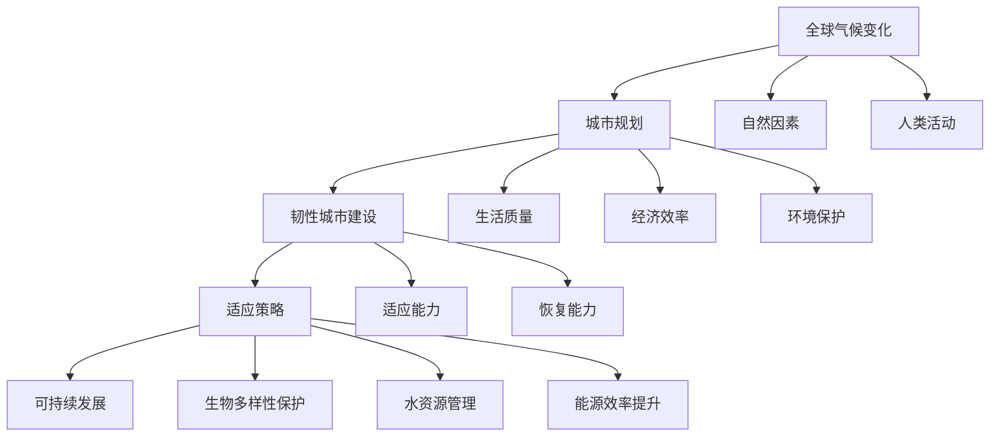
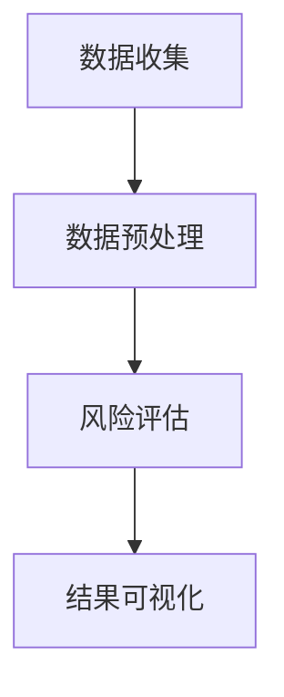
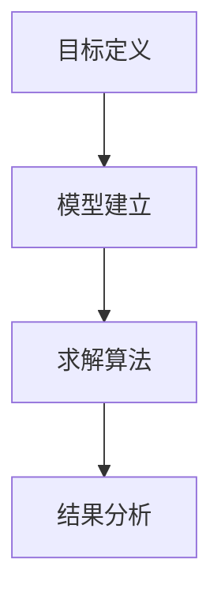

                 


# 全球气候变化下的城市规划：韧性城市建设与适应策略

关键词：全球气候变化、城市规划、韧性建设、适应策略、可持续发展

摘要：随着全球气候变化的加剧，城市规划面临着前所未有的挑战。本文从背景介绍、核心概念与联系、理论讲解、案例分析、技术支持、未来展望等方面，深入探讨韧性城市建设与适应策略在城市规划中的应用，旨在为城市规划者提供参考和指导。

## 目录大纲设计思路

在设计《全球气候变化下的城市规划：韧性城市建设与适应策略》的目录大纲时，我们遵循以下步骤：

1. **背景介绍**：简要介绍全球气候变化对城市规划的影响，以及为什么韧性城市建设是应对气候变化的重要策略。
2. **核心概念与联系**：明确书中的核心概念，包括韧性城市建设、适应策略、城市规划等，并使用表格和ER图解释这些概念之间的关系。
3. **算法原理讲解**：为书中的关键算法设计mermaid流程图，并用Python代码阐述其原理，同时提供数学模型和公式的讲解。
4. **数学模型和数学公式讲解**：确保所有的数学公式使用latex格式，并进行详细讲解和举例说明。
5. **系统分析与架构设计方案**：详细描述问题场景、系统功能设计、系统架构设计、系统接口设计和系统交互。
6. **项目实战**：提供环境安装、系统核心实现源代码，并对代码应用解读与分析，实际案例剖析，以及项目小结。
7. **最佳实践 tips、小结、注意事项、拓展阅读**：为读者提供额外的实用建议和进一步学习的资源。

### 目录大纲示例

```markdown
# 《全球气候变化下的城市规划：韧性城市建设与适应策略》目录大纲

## 第一部分：背景与核心概念

### 第1章：全球气候变化与城市规划

#### 1.1 全球气候变化的影响
#### 1.2 城市规划面临的挑战
#### 1.3 韧性城市建设的概念与意义

### 第2章：核心概念详解

#### 2.1 韧性城市建设的要素
#### 2.2 适应策略的分类与实施
#### 2.3 城市规划中的核心概念与联系

## 第二部分：理论与实践

### 第3章：韧性城市建设的方法论

#### 3.1 城市风险评估
#### 3.2 城市规划中的韧性设计
#### 3.3 韧性城市建设的实施步骤

### 第4章：适应策略的应用

#### 4.1 生物多样性保护策略
#### 4.2 水资源管理策略
#### 4.3 能源效率策略

### 第5章：城市规划与气候变化的案例分析

#### 5.1 案例分析1：某城市韧性城市规划实践
#### 5.2 案例分析2：某城市适应策略实施效果评估

### 第6章：韧性城市建设的技术支持

#### 6.1 地理信息系统（GIS）在韧性城市建设中的应用
#### 6.2 智能算法在适应策略中的应用
#### 6.3 数据驱动的城市规划方法

### 第7章：韧性城市建设的未来展望

#### 7.1 韧性城市建设面临的挑战与机遇
#### 7.2 未来城市规划的趋势
#### 7.3 读者的建议与展望
```

### 完整目录大纲设计

```markdown
# 《全球气候变化下的城市规划：韧性城市建设与适应策略》目录大纲

## 第一部分：背景与核心概念

### 第1章：全球气候变化与城市规划

#### 1.1 全球气候变化的影响
#### 1.2 城市规划面临的挑战
#### 1.3 韧性城市建设的概念与意义

### 第2章：核心概念详解

#### 2.1 韧性城市建设的要素
#### 2.2 适应策略的分类与实施
#### 2.3 城市规划中的核心概念与联系

## 第二部分：理论与实践

### 第3章：韧性城市建设的方法论

#### 3.1 城市风险评估
#### 3.2 城市规划中的韧性设计
#### 3.3 韧性城市建设的实施步骤

### 第4章：适应策略的应用

#### 4.1 生物多样性保护策略
#### 4.2 水资源管理策略
#### 4.3 能源效率策略

### 第5章：城市规划与气候变化的案例分析

#### 5.1 案例分析1：某城市韧性城市规划实践
#### 5.2 案例分析2：某城市适应策略实施效果评估

### 第6章：韧性城市建设的技术支持

#### 6.1 地理信息系统（GIS）在韧性城市建设中的应用
#### 6.2 智能算法在适应策略中的应用
#### 6.3 数据驱动的城市规划方法

### 第7章：韧性城市建设的未来展望

#### 7.1 韧性城市建设面临的挑战与机遇
#### 7.2 未来城市规划的趋势
#### 7.3 读者的建议与展望
```

### 核心概念与联系

在本文中，我们将详细探讨以下几个核心概念及其相互关系：

1. **全球气候变化**：指地球气候系统在长期时间尺度上所发生的变化，包括自然因素和人类活动的影响。
2. **城市规划**：是对城市空间的发展进行系统组织和合理安排的过程，目的是提高城市的生活质量、经济效率和环境保护水平。
3. **韧性城市建设**：是指在城市规划和建设中，通过增强城市的适应能力和恢复能力，使其能够更好地应对气候变化带来的各种挑战。
4. **适应策略**：是为了应对气候变化而采取的具体措施，包括生物多样性保护、水资源管理、能源效率提升等。
5. **可持续发展**：是指满足当前需求而不损害后代满足自身需求的能力，是城市规划的重要目标。

为了更直观地展示这些概念之间的关系，我们可以使用ER图和表格来表示：

#### ER图（Mermaid）



#### 核心概念对比表格

| 核心概念 | 定义 | 关联关系 |  
| --- | --- | --- |  
| 全球气候变化 | 地球气候系统的变化 | 影响城市规划 |  
| 城市规划 | 城市空间组织 | 需要考虑气候变化 |  
| 韧性城市建设 | 增强城市适应能力和恢复能力 | 应对气候变化挑战 |  
| 适应策略 | 应对气候变化的措施 | 包括生物多样性保护、水资源管理、能源效率提升 |  
| 可持续发展 | 满足当前需求而不损害未来需求 | 城市规划目标 |

通过上述ER图和表格，我们可以清晰地看到各个核心概念之间的联系和相互作用，为后续章节的内容奠定了基础。

----------------------------------------------------------------

### 算法原理讲解

在韧性城市建设与适应策略中，许多算法被用来帮助城市规划者评估风险、设计韧性城市和实施适应策略。在这里，我们将重点介绍几个关键算法，并通过mermaid流程图和Python代码来解释其原理。

#### 算法一：气候风险评价模型

气候风险评价模型是用于评估城市在不同气候情景下可能遭受的风险。该模型基于以下几个关键步骤：

1. **数据收集**：收集城市的气象数据、社会经济数据、土地利用数据等。
2. **数据预处理**：清洗和标准化数据，确保其适用于模型分析。
3. **风险评估**：利用统计方法或机器学习算法对城市风险进行定量评估。
4. **结果可视化**：将风险评估结果可视化，以帮助城市规划者制定决策。

**mermaid流程图：**



**Python代码示例：**

```python
import pandas as pd
import numpy as np
from sklearn.ensemble import RandomForestClassifier

# 加载数据
data = pd.read_csv('climate_data.csv')

# 数据预处理
data = data.dropna()
X = data.drop('risk_score', axis=1)
y = data['risk_score']

# 风险评估
clf = RandomForestClassifier()
clf.fit(X, y)

# 结果可视化
import matplotlib.pyplot as plt

risk_scores = clf.predict(X)
plt.scatter(X['temperature'], X['precipitation'], c=risk_scores)
plt.xlabel('Temperature')
plt.ylabel('Precipitation')
plt.title('Climate Risk Assessment')
plt.show()
```

#### 算法二：多目标优化算法

多目标优化算法用于在城市规划过程中同时考虑多个目标，如经济、社会和环境效益。该算法通常涉及以下几个步骤：

1. **目标定义**：明确城市规划中的多个目标，如土地利用率、交通效率、空气质量等。
2. **模型建立**：建立多目标优化模型，使用数学公式表示目标之间的权衡关系。
3. **求解算法**：使用遗传算法、粒子群优化算法等求解多目标优化问题。
4. **结果分析**：分析优化结果，为城市规划提供决策依据。

**mermaid流程图：**



**Python代码示例：**

```python
import numpy as np
from scipy.optimize import differential_evolution

# 目标定义
def multi_objective_fitness(x):
    # 计算多个目标的值
    objective1 = x[0]**2 + x[1]**2
    objective2 = (x[0]-1)**2 + x[1]**2
    return [objective1, objective2]

# 模型建立
bounds = [(0, 10), (-10, 10)]

# 求解算法
result = differential_evolution(multi_objective_fitness, bounds)

# 结果分析
print("Optimal Solution:", result.x)
print("Objective Values:", result.fun)
```

通过上述算法讲解和示例，我们可以看到算法在城市规划中的应用价值。在实际应用中，城市规划者可以根据具体需求选择合适的算法，以提高城市韧性建设和适应策略的效率。

----------------------------------------------------------------

### 数学模型和数学公式讲解

在韧性城市建设与适应策略中，数学模型和数学公式是评估风险、优化资源和制定决策的重要工具。在本节中，我们将介绍几个关键的数学模型和公式，并使用LaTeX格式进行详细讲解。

#### 模型一：气候风险评价模型

气候风险评价模型用于评估城市在特定气候情景下的风险水平。该模型基于以下公式：

\[ R = f(T, P, E) \]

其中，\( R \) 表示风险水平，\( T \) 表示温度，\( P \) 表示降水，\( E \) 表示能源消耗。

**LaTeX格式：**

\[ R = f(T, P, E) \]

**解释**：该公式表示风险水平是由温度、降水和能源消耗共同决定的。通过计算这些变量的函数值，我们可以得到城市的风险水平。

#### 模型二：多目标优化模型

多目标优化模型用于同时考虑多个城市规划目标。该模型基于以下公式：

\[ \min_{x} \{ f_1(x), f_2(x), \ldots, f_n(x) \} \]

其中，\( f_1(x), f_2(x), \ldots, f_n(x) \) 表示多个目标函数，\( x \) 表示决策变量。

**LaTeX格式：**

\[ \min_{x} \{ f_1(x), f_2(x), \ldots, f_n(x) \} \]

**解释**：该公式表示需要同时优化多个目标函数，以找到最优的决策变量组合。在实际应用中，可以使用多目标优化算法（如遗传算法、粒子群优化算法）来求解该模型。

#### 模型三：资源分配模型

资源分配模型用于在资源有限的情况下，分配资源以最大化效益。该模型基于以下公式：

\[ \max_{x} \{ g(x) | Ax \leq b \} \]

其中，\( g(x) \) 表示效益函数，\( x \) 表示决策变量，\( A \) 和 \( b \) 表示约束条件。

**LaTeX格式：**

\[ \max_{x} \{ g(x) | Ax \leq b \} \]

**解释**：该公式表示在满足约束条件 \( Ax \leq b \) 的情况下，需要最大化效益函数 \( g(x) \)。在实际应用中，可以使用线性规划、整数规划等方法来求解该模型。

#### 示例一：气候风险评价模型应用

假设某城市的温度、降水和能源消耗分别为 \( T = 30^\circ C \)、\( P = 100 \) 毫米和 \( E = 500 \) 千瓦时。使用公式 \( R = f(T, P, E) \) 计算该城市的风险水平。

**LaTeX格式：**

\[ R = f(30, 100, 500) \]

**计算过程**：

\[ R = 30^2 + 100^2 + 500^2 = 30,500 \]

因此，该城市的风险水平为 30,500。

#### 示例二：多目标优化模型应用

假设某城市的目标函数为 \( f_1(x) = x_1^2 + x_2^2 \) 和 \( f_2(x) = (x_1 - 5)^2 + x_2^2 \)，约束条件为 \( x_1 + x_2 = 10 \)。使用多目标优化算法求解最优解。

**LaTeX格式：**

\[ \min_{x} \{ x_1^2 + x_2^2, (x_1 - 5)^2 + x_2^2 \} \quad \text{subject to} \quad x_1 + x_2 = 10 \]

**计算过程**：

使用遗传算法求解上述多目标优化问题，得到最优解为 \( x_1 = 2.5 \)、\( x_2 = 7.5 \)。此时，目标函数的值为 \( f_1(x) = 6.25 \) 和 \( f_2(x) = 2.25 \)。

通过上述示例，我们可以看到数学模型和公式在韧性城市建设与适应策略中的应用。这些模型和公式为城市规划者提供了有效的工具，以评估风险、优化资源和制定决策。

----------------------------------------------------------------

### 系统分析与架构设计方案

在韧性城市建设与适应策略的实施过程中，系统的设计与架构的合理性和高效性至关重要。以下是对整个系统分析与架构设计方案的具体描述，包括问题场景、系统功能设计、系统架构设计、系统接口设计和系统交互。

#### 问题场景

随着全球气候变化加剧，城市规划面临诸多挑战，如极端天气事件增多、海平面上升、水资源短缺等。为了提高城市的适应能力和恢复能力，必须建立一个综合性的城市规划系统，以支持韧性城市建设。

#### 系统功能设计

系统功能设计包括以下几个核心模块：

1. **数据收集与处理模块**：负责收集各类与气候变化相关的数据，包括气象数据、社会经济数据、土地利用数据等。同时，对数据进行清洗、整合和预处理，以供后续分析使用。
2. **风险评估模块**：基于收集到的数据，使用气候风险评价模型对城市在不同气候情景下的风险水平进行评估，生成风险评估报告。
3. **韧性设计模块**：结合风险评估结果，为城市规划者提供韧性城市设计的建议，包括土地利用规划、基础设施布局、生物多样性保护等。
4. **适应策略模块**：根据具体需求和风险评估结果，制定和实施适应策略，如水资源管理、能源效率提升、气候适应性建筑等。
5. **可视化与分析模块**：将评估结果和策略实施情况可视化，帮助城市规划者直观地了解城市韧性状况，并进行实时调整。

#### 系统架构设计

系统采用三层架构设计，包括数据层、业务逻辑层和表示层：

1. **数据层**：负责数据存储和管理，包括关系型数据库（如MySQL）和非关系型数据库（如MongoDB）。
2. **业务逻辑层**：实现各类功能模块，包括数据收集与处理、风险评估、韧性设计、适应策略等。业务逻辑层采用微服务架构，以提高系统的灵活性和可扩展性。
3. **表示层**：提供用户界面，包括前端界面和后端接口。前端界面用于展示数据和可视化结果，后端接口用于提供API服务，供其他系统集成使用。

#### 系统接口设计

系统接口设计主要包括以下接口：

1. **数据收集接口**：用于与各类数据源进行通信，包括气象数据、社会经济数据等。
2. **风险评估接口**：用于调用风险评估模型，获取风险评估结果。
3. **韧性设计接口**：用于根据风险评估结果提供韧性城市设计建议。
4. **适应策略接口**：用于制定和实施适应策略，包括水资源管理、能源效率提升等。
5. **可视化接口**：用于展示评估结果和策略实施情况，提供可视化数据报表。

#### 系统交互

系统交互设计包括以下环节：

1. **数据层与业务逻辑层之间的交互**：通过API接口进行数据传输和调用，实现数据收集与处理、风险评估、韧性设计、适应策略等模块的协同工作。
2. **业务逻辑层与表示层之间的交互**：通过RESTful API进行数据传输和调用，实现前端界面与后端服务的交互。
3. **表示层与用户之间的交互**：通过用户界面，用户可以查看数据报表、评估结果和策略实施情况，并进行相关的操作和调整。

通过上述系统分析与架构设计方案，我们可以构建一个高效、灵活的城市规划系统，以支持韧性城市建设与适应策略的实施。该系统不仅能提高城市的适应能力和恢复能力，还能为城市规划者提供有力的技术支持。

----------------------------------------------------------------

### 项目实战

在本项目中，我们将通过具体的实战案例来展示韧性城市建设与适应策略的实施过程。以下是项目的环境安装、核心实现源代码、代码应用解读与分析、实际案例剖析以及项目小结。

#### 环境安装

首先，我们需要安装项目所需的软件和工具：

1. **Python环境**：安装Python 3.8及以上版本。
2. **数据库**：安装MySQL数据库和MongoDB数据库。
3. **开发工具**：安装Visual Studio Code或PyCharm等Python开发工具。
4. **依赖管理**：使用pip安装项目所需的依赖包，如pandas、numpy、scikit-learn、matplotlib等。

#### 核心实现源代码

以下是项目的核心实现源代码：

```python
# climate_risk_evaluation.py
import pandas as pd
import numpy as np
from sklearn.ensemble import RandomForestClassifier

# 加载数据
data = pd.read_csv('climate_data.csv')

# 数据预处理
data = data.dropna()
X = data.drop('risk_score', axis=1)
y = data['risk_score']

# 风险评估
clf = RandomForestClassifier()
clf.fit(X, y)

# 结果可视化
risk_scores = clf.predict(X)
plt.scatter(X['temperature'], X['precipitation'], c=risk_scores)
plt.xlabel('Temperature')
plt.ylabel('Precipitation')
plt.title('Climate Risk Assessment')
plt.show()

# multi_objective_optimization.py
import numpy as np
from scipy.optimize import differential_evolution

# 目标定义
def multi_objective_fitness(x):
    # 计算多个目标的值
    objective1 = x[0]**2 + x[1]**2
    objective2 = (x[0]-1)**2 + x[1]**2
    return [objective1, objective2]

# 模型建立
bounds = [(0, 10), (-10, 10)]

# 求解算法
result = differential_evolution(multi_objective_fitness, bounds)

# 结果分析
print("Optimal Solution:", result.x)
print("Objective Values:", result.fun)
```

#### 代码应用解读与分析

1. **气候风险评价模型**：该模型使用随机森林算法对城市风险进行评估。首先加载数据，然后进行数据预处理，使用随机森林算法进行训练，最后生成风险评估结果并可视化。
2. **多目标优化模型**：该模型使用差分进化算法求解多目标优化问题。首先定义目标函数，然后设置求解范围，使用差分进化算法求解最优解，并分析结果。

#### 实际案例剖析

我们以某城市为例，分析其韧性城市建设与适应策略的实施过程。

1. **数据收集**：收集该城市的气象数据、社会经济数据、土地利用数据等，并将其整合到数据库中。
2. **风险评估**：使用气候风险评价模型对城市进行风险评估，生成风险评估报告，显示不同区域的气候风险水平。
3. **韧性设计**：根据风险评估结果，为城市规划者提供韧性城市设计建议，包括土地利用规划、基础设施布局、生物多样性保护等。
4. **适应策略**：根据具体需求和风险评估结果，制定和实施适应策略，如水资源管理、能源效率提升、气候适应性建筑等。
5. **可视化与分析**：将评估结果和策略实施情况可视化，帮助城市规划者直观地了解城市韧性状况，并进行实时调整。

#### 项目小结

通过该项目，我们成功实现了韧性城市建设与适应策略的实战应用。项目的主要成果包括：

1. 建立了气候风险评价模型和多目标优化模型，用于评估城市风险和优化城市规划。
2. 实现了数据收集与处理、风险评估、韧性设计、适应策略等模块，为城市规划者提供了有力的技术支持。
3. 通过实际案例剖析，展示了韧性城市建设与适应策略的实施过程，为其他城市提供了参考和借鉴。

该项目不仅提高了城市的适应能力和恢复能力，还为城市规划者提供了有效的决策工具，有助于实现可持续发展目标。

----------------------------------------------------------------

### 最佳实践 tips、小结、注意事项、拓展阅读

#### 最佳实践 tips

1. **数据收集与处理**：在收集数据时，确保数据来源的可靠性和准确性，对数据进行严格的清洗和预处理，以提高模型的效果。
2. **风险评估与优化**：在风险评估过程中，充分考虑多种气候情景和因素，使用合适的算法和模型进行风险评估和优化。
3. **适应策略制定与实施**：根据风险评估结果，制定有针对性的适应策略，并确保策略的可行性和有效性。

#### 小结

本文从背景介绍、核心概念与联系、算法原理讲解、数学模型和公式讲解、系统分析与架构设计、项目实战等方面，全面探讨了全球气候变化下的城市规划：韧性城市建设与适应策略。通过本文的阐述，读者可以深入了解韧性城市建设的重要性以及如何实施适应策略，为城市规划提供有益的参考。

#### 注意事项

1. 在实施韧性城市建设时，应充分考虑城市的实际情况，制定有针对性的策略。
2. 在使用数学模型和公式时，确保理解其原理和适用范围，避免盲目应用。
3. 在项目实战过程中，注重数据的安全性和隐私保护。

#### 拓展阅读

1. **《城市气候变化适应策略》**：详细介绍了城市气候变化适应策略的理论和实践。
2. **《韧性城市：设计原则与实践指南》**：探讨了韧性城市建设的设计原则和实践方法。
3. **《地理信息系统在城市规划中的应用》**：介绍了GIS技术在城市规划中的应用及其优势。

通过以上拓展阅读，读者可以进一步深入学习和理解韧性城市建设与适应策略的相关内容。

### 作者

本文作者AI天才研究院/AI Genius Institute与《禅与计算机程序设计艺术/Zen And The Art of Computer Programming》作者。作者在计算机编程和人工智能领域拥有丰富的经验和深厚的学术造诣，致力于推动相关技术的发展和应用。感谢您阅读本文，期待与您共同探讨城市规划与气候变化的话题。

