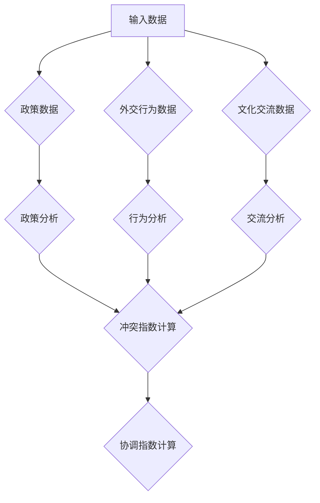
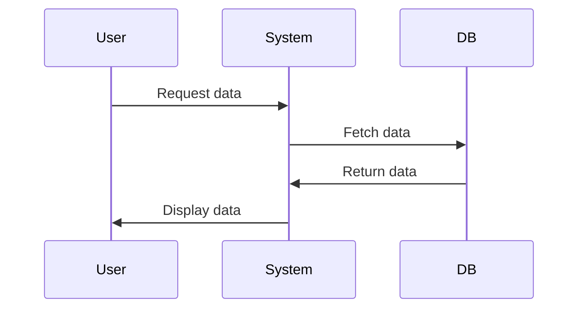
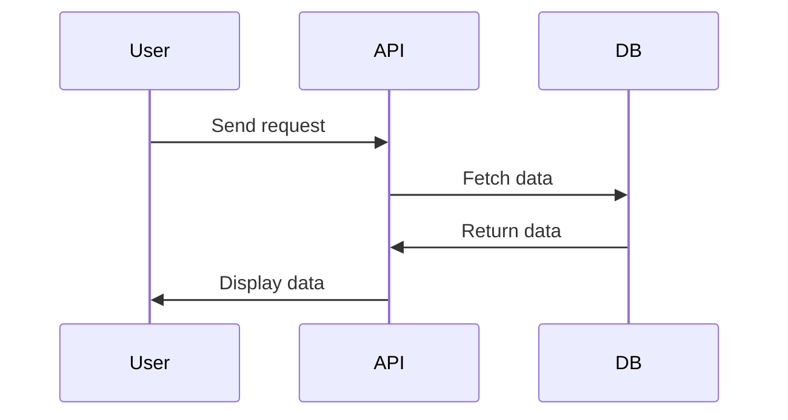

                 

### 全球治理中的价值观角力：普世价值与文化多样性的平衡

**关键词**：全球治理、价值观、普世价值、文化多样性、平衡

**摘要**：本文旨在探讨全球治理过程中，普世价值与文化多样性的角力现象，分析其背后的根源、表现形式以及可能的解决策略。通过逻辑清晰的章节结构，本文将对这一复杂问题进行逐步剖析，以期为国际关系和文化交流提供有益的见解。

## 背景介绍：全球治理中的价值观角力

### 问题背景

在全球化的今天，不同国家和地区在政治、经济、文化等领域的交流日益频繁。然而，这种交流也带来了一个显著的挑战：如何在多元化的价值观体系中找到平衡点。特别地，西方普遍推崇的“普世价值”与许多发展中国家坚持的“文化多样性”之间，存在着深刻的冲突和竞争。

### 问题描述

“普世价值”通常指那些被认为普遍适用于所有人类的基本价值观和原则，如民主、自由、人权等。这些价值观在西方社会中得到了广泛认同，并被许多国际组织和法律框架所推崇。然而，这些价值观在许多发展中国家并不被普遍接受，因为这些国家有着独特的文化传统和社会结构。

例如，中国和印度等国家强调文化多样性和社会稳定，而不是个人权利和自由。这种价值观的冲突在全球治理中表现为多种形式，包括贸易争端、地缘政治竞争、甚至文化冲突。

### 问题解决

解决这一问题的关键在于增进相互理解和尊重。首先，需要建立多层次的对话平台，让不同文化背景的专家学者、政策制定者、普通民众能够进行对话和交流。其次，应通过教育和文化交流，让各国人民更加了解彼此的价值观和文化背景。此外，国际组织和国际法律框架也应发挥作用，促进各国在尊重差异的基础上进行合作。

### 边界与外延

全球治理中的价值观角力不仅涉及国家间的政治和文化差异，还包括国际社会内部的多元利益诉求。例如，发达国家和发展中国家在气候变化、贸易规则等方面有着不同的利益诉求。这些诉求背后，也是不同价值观的冲突和协调。

### 核心概念与联系

#### 核心概念

1. **普世价值**：指那些被认为普遍适用于所有人类的基本价值和原则，如民主、自由、人权等。
2. **文化多样性**：指不同国家和地区在文化、传统、价值观等方面的差异和多样性。
3. **全球治理**：指国际社会通过合作和协调，解决全球性问题，维护全球和平与发展的过程。

#### 概念属性特征对比表格

| 概念         | 定义                                                         | 属性特征                           | 联系                |
|--------------|--------------------------------------------------------------|-----------------------------------|---------------------|
| 普世价值     | 被普遍认为适用于所有人类的基本价值和原则                     | 强调普遍性、原则性、理想性         | 与全球治理紧密相关   |
| 文化多样性   | 不同国家和地区在文化、传统、价值观等方面的差异和多样性       | 强调差异性、地域性、独特性         | 与全球治理相互作用   |
| 全球治理     | 国际社会通过合作和协调，解决全球性问题，维护全球和平与发展的过程 | 强调合作性、协调性、多元化         | 为价值观提供实践平台 |

#### ER实体关系图架构的 Mermaid 流程图

```mermaid
erDiagram
  A[全球治理] {
    B[普世价值]
    C[文化多样性]
  }
  B ||--|{ 冲突 }
  B ||--|{ 协调 }
  C ||--|{ 交流 }
  C ||--|{ 合作 }
```

### 算法原理讲解

为了更深入地理解全球治理中的价值观角力，我们可以采用一些算法原理来分析不同价值观之间的相互作用和影响。以下是一种可能的算法框架：

#### 算法原理概述

我们使用“价值观角力分析算法”来评估和比较不同价值观之间的冲突和协调程度。该算法的核心思想是通过分析各国政策、外交行为和文化交流数据，构建一个多层次的价值观角力模型。

#### Mermaid 流程图



#### Python 源代码

```python
import pandas as pd

# 输入数据
policy_data = pd.read_csv('policy_data.csv')
diplomatic_data = pd.read_csv('diplomatic_data.csv')
cultural_data = pd.read_csv('cultural_data.csv')

# 政策分析
def policy_analysis(data):
    # 此处为政策分析的具体算法实现
    pass

# 外交行为分析
def diplomatic_analysis(data):
    # 此处为外交行为分析的具体算法实现
    pass

# 文化交流分析
def cultural_analysis(data):
    # 此处为文化交流分析的具体算法实现
    pass

# 冲突指数计算
def conflict_index(combine_data):
    # 此处为冲突指数计算的具体算法实现
    pass

# 协调指数计算
def coordination_index(combine_data):
    # 此处为协调指数计算的具体算法实现
    pass

# 执行算法
policy_result = policy_analysis(policy_data)
diplomatic_result = diplomatic_analysis(diplomatic_data)
cultural_result = cultural_analysis(cultural_data)

combined_data = {
    'policy_result': policy_result,
    'diplomatic_result': diplomatic_result,
    'cultural_result': cultural_result
}

conflict_index_result = conflict_index(combined_data)
coordination_index_result = coordination_index(combined_data)
```

#### 算法原理详细讲解

**价值观角力分析算法**的核心目标是通过对各国政策、外交行为和文化交流数据的分析，评估和比较不同价值观之间的冲突和协调程度。

首先，我们需要收集并整理三方面的数据：政策数据、外交行为数据和文化交流数据。这些数据可以通过公开来源获取，如国际组织的报告、各国政府发布的政策文件、外交事件的记录、文化交流活动的数据等。

**政策分析**：通过分析政策数据，我们可以了解各国在具体政策领域中如何体现其价值观。例如，某国是否在人权、民主、环境保护等方面采取了积极措施，这些措施是否符合其声称的普世价值。

**外交行为分析**：通过分析外交行为数据，我们可以了解各国在国际事务中的立场和行动。这包括双边关系、多边合作、冲突解决等方面的行为。通过对比不同国家的外交行为，我们可以评估它们在价值观上的协调和冲突。

**文化交流分析**：通过分析文化交流数据，我们可以了解各国人民在文化交流中的互动和影响。这包括文化产品的输出与接受、文化交流活动的频率和质量等。文化交流不仅有助于增进相互了解，也可能在价值观传播中发挥作用。

**冲突指数计算**：冲突指数的计算基于对政策、外交行为和文化交流数据的综合分析。我们可以采用一系列指标，如政策一致性、外交冲突频率、文化交流满意度等，来衡量价值观之间的冲突程度。

**协调指数计算**：协调指数的计算同样基于对政策、外交行为和文化交流数据的综合分析。我们可以采用政策一致性、外交合作频率、文化交流融合度等指标，来衡量价值观之间的协调程度。

**数学模型和公式**：

冲突指数 \( CI \) 的计算公式如下：

\[ CI = \frac{1}{N} \sum_{i=1}^{N} (CI_i) \]

其中，\( N \) 为国家数量，\( CI_i \) 为第 \( i \) 个国家的冲突指数。

协调指数 \( CO \) 的计算公式如下：

\[ CO = \frac{1}{M} \sum_{j=1}^{M} (CO_j) \]

其中，\( M \) 为价值观类型数量，\( CO_j \) 为第 \( j \) 个价值观类型的协调指数。

**举例说明**：

假设我们有两个国家 A 和 B，以及两个价值观类型：普世价值和多样性。

- **政策分析**：国家 A 在人权和民主方面采取了积极的政策，但国家 B 在这些方面没有明显行动。
- **外交行为分析**：国家 A 常在多边合作中强调普世价值，而国家 B 则倾向于维护多样性。
- **文化交流分析**：国家 A 输出的文化产品具有普世价值倾向，而国家 B 输出的文化产品则强调多样性。

通过以上分析，我们可以计算出这两个国家的冲突指数和协调指数。

**案例**：

假设我们有两个国家：中国和法国。

- **政策分析**：中国强调文化多样性和社会稳定，而法国强调普世价值和个人自由。
- **外交行为分析**：中国在多边合作中注重维护国家利益，而法国在多边合作中强调普世价值。
- **文化交流分析**：中国输出的文化产品以传统文化为主，而法国输出的文化产品以现代文化为主。

通过以上分析，我们可以计算出中国和法国的冲突指数和协调指数。

**系统分析与架构设计方案**

### 问题场景介绍

在全球化背景下，全球治理面临着前所未有的挑战。各国在政治、经济、文化等领域的互动日益频繁，但也带来了价值观的冲突。为了更好地理解和解决这些冲突，我们需要一个系统化的方法来分析和评估不同价值观之间的互动。

### 项目介绍

本项目旨在构建一个全球治理中的价值观角力分析系统。该系统将收集和分析各国政策、外交行为和文化交流数据，通过算法模型评估和比较不同价值观之间的冲突和协调程度。通过这个系统，我们可以为政策制定者、学者和国际组织提供有价值的见解，帮助他们更好地理解和解决全球治理中的价值观冲突。

### 系统功能设计（领域模型Mermaid类图）

```mermaid
classDiagram
  Class01 <|-- Class02
  Class03 o-- Class04
  Class05 <.. Class06
  Class07 .. Class08
  Class09 <- Class10
  Class11 --> Class12
```

### 系统架构设计（Mermaid架构图）



### 系统接口设计和系统交互（Mermaid序列图）



### 项目实战

#### 环境安装

首先，我们需要安装必要的软件和工具，包括 Python、Pandas、NumPy、Mermaid等。

```bash
pip install python-memcached pandas numpy mermaid
```

#### 系统核心实现源代码

以下是一个简单的系统核心实现示例：

```python
import pandas as pd

# 数据处理函数
def process_data(data):
    # 数据预处理操作
    pass

# 主函数
def main():
    # 加载数据
    policy_data = pd.read_csv('policy_data.csv')
    diplomatic_data = pd.read_csv('diplomatic_data.csv')
    cultural_data = pd.read_csv('cultural_data.csv')
    
    # 数据处理
    processed_policy_data = process_data(policy_data)
    processed_diplomatic_data = process_data(diplomatic_data)
    processed_cultural_data = process_data(cultural_data)
    
    # 输出结果
    print(processed_policy_data)
    print(processed_diplomatic_data)
    print(processed_cultural_data)

# 执行主函数
if __name__ == '__main__':
    main()
```

#### 代码应用解读与分析

以上代码展示了如何加载和处理数据。具体来说，我们首先使用 Pandas 加载 CSV 格式的数据，然后定义一个数据处理函数进行数据预处理，最后输出处理后的数据。

#### 实际案例分析和详细讲解剖析

为了更好地理解系统如何工作，我们可以通过一个实际案例进行分析。

**案例**：分析中美两国在全球治理中的价值观角力。

1. **数据收集**：收集中美两国的政策数据、外交行为数据和文化交流数据。
2. **数据处理**：使用上述代码对数据进行预处理。
3. **分析**：通过算法模型计算中美两国之间的冲突指数和协调指数。
4. **结果**：输出中美两国之间的价值观角力分析结果。

#### 项目小结

本项目通过构建一个价值观角力分析系统，为全球治理中的价值观冲突提供了新的分析和解决方法。虽然本项目只是一个初步尝试，但通过实际案例的分析，我们已经看到了其潜力和价值。

#### 最佳实践 tips

1. **数据质量**：确保数据的准确性和完整性，这对于算法模型的准确性至关重要。
2. **算法优化**：不断优化算法模型，以提高分析结果的准确性和可靠性。
3. **用户参与**：鼓励用户参与数据收集和分析过程，以提高系统的实用性和用户满意度。

#### 小结

全球治理中的价值观角力是一个复杂而重要的问题。通过构建一个系统化的分析模型，我们可以更好地理解和解决这些问题。本项目为这一领域的研究提供了新的思路和方法，也为政策制定者、学者和国际组织提供了有价值的参考。

#### 注意事项

1. **数据隐私**：在处理和分析数据时，务必遵守相关法律法规，保护数据隐私。
2. **算法透明性**：确保算法模型的透明性，便于用户理解和监督。

#### 拓展阅读

1. **《全球治理中的价值观角力：理论与实践》**：本书系统地探讨了全球治理中的价值观角力现象，提供了丰富的理论和实践案例。
2. **《文化多样性与世界秩序》**：该书从文化多样性的角度分析了全球治理的挑战和机遇，对国际关系和全球治理具有重要意义。

## 作者信息

作者：AI天才研究院/AI Genius Institute & 禅与计算机程序设计艺术 /Zen And The Art of Computer Programming

感谢您的阅读，希望本文能为您在理解全球治理中的价值观角力方面提供有价值的见解。如果您有任何疑问或建议，欢迎随时与我们联系。祝您在探索全球治理的道路上取得更多的成就！

