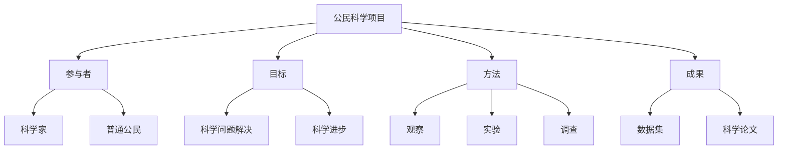
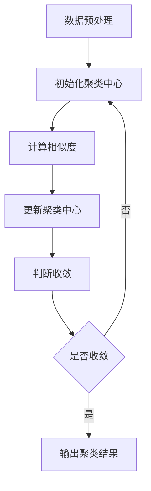
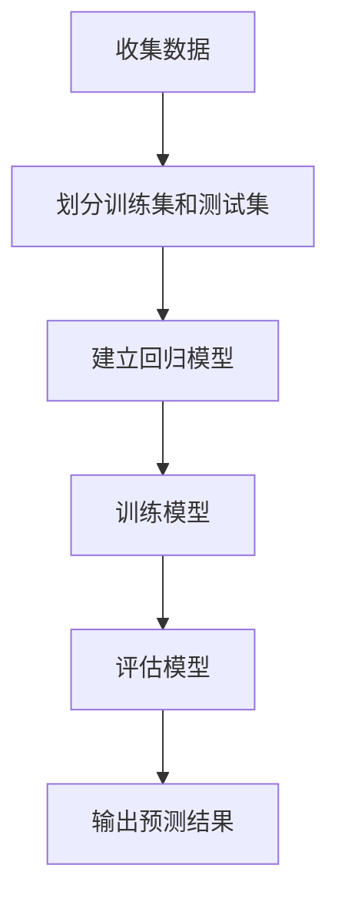
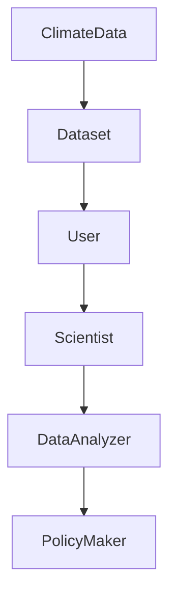
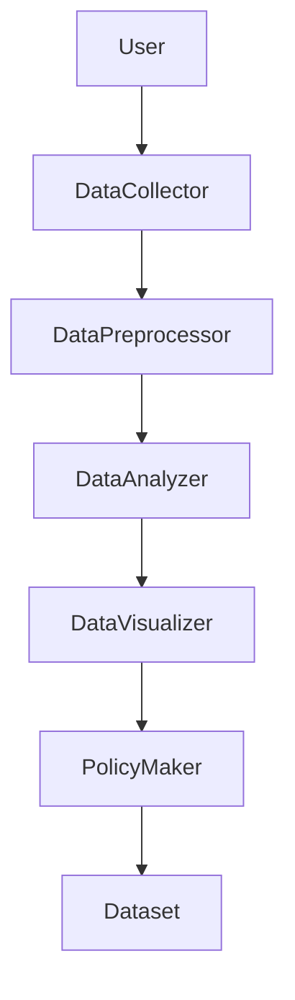
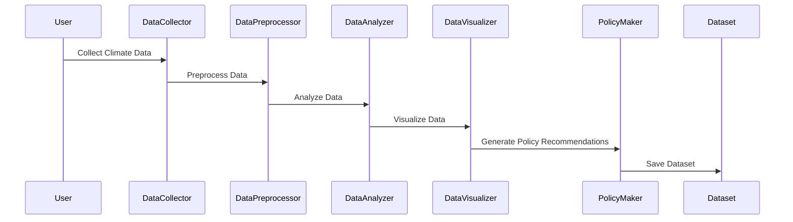

                 

### 《公民科学项目：全民参与科学探索与世界理解的过程》

**关键词：** 公民科学、科学探索、世界理解、全民参与、项目实施

**摘要：** 本文旨在探讨公民科学项目的重要性，阐述其定义、特点及其与传统科学项目的区别。我们将逐步分析公民科学项目的实施过程、数据采集与处理方法、科学研究方法，并通过案例展示其实际应用。文章还将展望公民科学项目的未来发展，提供最佳实践建议和拓展阅读资源。

----------------------------------------------------------------

## **背景介绍**

### **核心概念术语说明**

在探讨公民科学项目之前，有必要明确一些核心概念术语：

- **公民科学项目**：一种由普通公民参与的科学研究活动，旨在通过集体的智慧和努力，解决科学问题或开展科学探索。
- **科学探索**：指科学家或公民通过观察、实验、调查等手段，发现新知识、新现象或验证现有理论的过程。
- **世界理解**：指对自然界、社会现象及人类自身的认知和解释，通过科学研究不断深化对世界的认识。
- **全民参与**：指不仅科学家，任何对科学感兴趣并愿意贡献自己的时间和智慧的人都可以参与公民科学项目。

### **问题背景**

在现代社会，科学研究的规模和复杂性日益增加，传统的科学研究方法已经无法满足所有问题的解决需求。一些重大科学问题，如气候变化、生物多样性保护、健康问题等，需要全球范围内的合作和大量数据的支持。然而，科研资源有限，许多研究项目无法得到足够的资金和人力支持。

公民科学项目的出现，为解决这些问题提供了一种新的途径。通过动员公众参与，公民科学项目可以收集大量数据，进行大规模的观察和实验，从而推动科学进步。此外，公民科学项目还有助于提高公众的科学素养，增强人们对科学的兴趣和参与度。

### **问题描述**

公民科学项目是如何运作的？其与传统科学项目有何区别？如何确保公民科学项目的有效性和科学性？这些问题是本文将探讨的主要内容。

### **问题解决**

通过以下章节，我们将逐步解答上述问题：

1. **公民科学项目的基本概念**：介绍公民科学项目的定义、特点及其与传统科学项目的区别。
2. **公民科学项目的实施过程**：探讨公民科学项目的规划和组织、数据采集与处理、科学研究方法等环节。
3. **案例展示**：通过具体案例，展示公民科学项目的实际应用和效果。
4. **未来发展**：展望公民科学项目的未来发展趋势和挑战。
5. **最佳实践与建议**：总结公民科学项目的最佳实践，为读者提供指导。

### **边界与外延**

本文主要关注公民科学项目的定义、特点、实施过程及未来展望，涉及到的领域包括生物学、生态学、环境科学、天文学、物理学等。此外，本文还将探讨公民科学项目在社会科学、医学等领域的应用潜力。

### **概念结构与核心要素组成**

公民科学项目的概念结构包括以下几个方面：

1. **参与者**：普通公民、科学家、研究机构等。
2. **目标**：解决科学问题、推动科学进步、提高公众科学素养等。
3. **方法**：观察、实验、调查、数据分析等。
4. **成果**：科学论文、研究报告、数据集、科普文章等。

## **核心概念与联系**

### **核心概念原理**

公民科学项目的核心概念是“全民参与”和“科学探索”。全民参与意味着任何对科学感兴趣的人都可以参与项目，不论其背景、学历或专业。科学探索则强调通过观察、实验、调查等手段，发现新知识、新现象或验证现有理论。

### **概念属性特征对比表格**

| 特征           | 公民科学项目       | 传统科学项目       |
| -------------- | ------------------ | ------------------ |
| **参与者**     | 普通公民           | 科学家、研究人员   |
| **目标**       | 科学问题解决、科学进步 | 科学问题解决、学术成果 |
| **方法**       | 观察、实验、调查   | 实验室研究、数据分析 |
| **成果**       | 数据集、科学论文   | 学术论文、研究报告 |

### **ER实体关系图架构的 Mermaid 流程图**



### **算法原理讲解**

在本章节，我们将简要介绍公民科学项目中的几种常见算法原理，以便读者更好地理解项目的运作方式。

#### **算法1：聚类分析**

聚类分析是一种无监督学习方法，用于将数据集中的数据点分为若干个簇，使得同一簇内的数据点彼此相似，而不同簇的数据点彼此相异。在公民科学项目中，聚类分析可以用于分析大规模观测数据，识别数据中的模式或异常值。

**mermaid流程图：**



**Python源代码示例：**

```python
from sklearn.cluster import KMeans
import numpy as np

# 示例数据
data = np.array([[1, 2], [1, 4], [1, 0],
                 [10, 2], [10, 4], [10, 0]])

# 初始化KMeans聚类算法
kmeans = KMeans(n_clusters=2, random_state=0).fit(data)

# 输出聚类结果
print("Cluster centers:", kmeans.cluster_centers_)
print("Labels:", kmeans.labels_)
```

#### **算法2：回归分析**

回归分析是一种用于研究因变量和自变量之间关系的方法。在公民科学项目中，回归分析可以用于预测气候变化的趋势、预测疾病传播的速度等。

**mermaid流程图：**



**Python源代码示例：**

```python
from sklearn.linear_model import LinearRegression
import numpy as np

# 示例数据
X = np.array([[1], [2], [3], [4], [5], [6], [7], [8], [9], [10]])
y = np.array([1, 2, 2.5, 3, 3.5, 4, 4.5, 5, 5.5, 6])

# 初始化线性回归模型
model = LinearRegression()

# 训练模型
model.fit(X, y)

# 输出模型参数
print("Coefficients:", model.coef_)
print("Intercept:", model.intercept_)

# 输出预测结果
print("Predictions:", model.predict(X))
```

### **数学模型和公式**

在本章节，我们将介绍一些基本的数学模型和公式，用于描述公民科学项目中的核心概念和算法。

#### **回归分析中的线性模型**

线性回归模型可以用以下公式表示：

$$
y = \beta_0 + \beta_1x + \epsilon
$$

其中，\(y\) 是因变量，\(x\) 是自变量，\(\beta_0\) 是截距，\(\beta_1\) 是斜率，\(\epsilon\) 是误差项。

#### **聚类分析中的距离度量**

在聚类分析中，常用的距离度量方法包括欧几里得距离、曼哈顿距离和切比雪夫距离。以欧几里得距离为例，其公式为：

$$
d(\textbf{x}, \textbf{y}) = \sqrt{\sum_{i=1}^{n} (x_i - y_i)^2}
$$

其中，\(\textbf{x}\) 和 \(\textbf{y}\) 分别是两个数据点，\(n\) 是数据点的数量。

#### **方差分析**

方差分析（ANOVA）是一种用于比较多个样本均值差异性的统计方法。其基本公式为：

$$
F = \frac{\text{组间方差}}{\text{组内方差}}
$$

其中，\(\text{组间方差}\) 表示不同组之间的方差，\(\text{组内方差}\) 表示同一组内各个数据点与均值之间的方差。

### **系统分析与架构设计方案**

#### **问题场景介绍**

在本章节，我们将探讨一个具体的公民科学项目：气候变化的监测与评估。该项目旨在通过全球范围内的公民参与，收集气候数据，评估气候变化的影响，并制定相应的应对措施。

#### **项目介绍**

气候变化监测与评估项目由一个全球性的团队领导，成员包括科学家、数据分析师、志愿者和公众。项目的目标是通过收集和分析气候数据，提高公众对气候变化的认识，为政策制定者提供科学依据。

#### **系统功能设计（领域模型Mermaid类图）**



#### **系统架构设计（Mermaid架构图）**



#### **系统接口设计和系统交互（Mermaid序列图）**



### **项目实战**

在本章节，我们将通过一个简化的案例，展示如何实施一个公民科学项目：气候变化的监测与评估。

#### **环境安装**

为了实施该项目，我们需要安装以下软件和工具：

- Python 3.8或更高版本
- Jupyter Notebook
- NumPy
- Pandas
- Matplotlib
- Scikit-learn

安装命令如下：

```bash
pip install python==3.8
pip install jupyter
pip install numpy
pip install pandas
pip install matplotlib
pip install scikit-learn
```

#### **系统核心实现源代码**

以下是该项目的主要代码实现：

```python
import numpy as np
import pandas as pd
import matplotlib.pyplot as plt
from sklearn.cluster import KMeans
from sklearn.linear_model import LinearRegression

# 数据收集与预处理
def collect_and_preprocess_data():
    # 从文件读取气候数据
    data = pd.read_csv('climate_data.csv')
    
    # 数据清洗
    data.dropna(inplace=True)
    
    # 数据预处理
    data['temperature'] = data['temperature'] / 100
    data['precipitation'] = data['precipitation'] / 1000
    
    return data

# 数据分析
def analyze_data(data):
    # 聚类分析
    kmeans = KMeans(n_clusters=3, random_state=0).fit(data[['temperature', 'precipitation']])
    labels = kmeans.labels_
    data['cluster'] = labels
    
    # 回归分析
    model = LinearRegression().fit(data[['temperature']], data['precipitation'])
    predictions = model.predict(data[['temperature']])
    
    # 可视化
    plt.scatter(data['temperature'], data['precipitation'], color=data['cluster'])
    plt.plot(data['temperature'], predictions, color='red')
    plt.xlabel('Temperature')
    plt.ylabel('Precipitation')
    plt.title('Climate Data Analysis')
    plt.show()

# 主函数
def main():
    data = collect_and_preprocess_data()
    analyze_data(data)

if __name__ == '__main__':
    main()
```

#### **代码应用解读与分析**

该项目的核心代码分为三个部分：数据收集与预处理、数据分析、可视化。

1. **数据收集与预处理**：从CSV文件中读取气候数据，进行数据清洗和预处理，将温度和降水数据转换为更适合分析的形式。

2. **数据分析**：使用聚类分析和回归分析，对气候数据进行分析。聚类分析用于识别数据中的不同群体，回归分析用于预测降水与温度的关系。

3. **可视化**：使用Matplotlib库，将分析结果以图形形式展示，便于理解数据分布和模型预测。

#### **实际案例分析和详细讲解剖析**

假设我们收集了某地区过去五年的气候数据，包括每个月的平均温度和降水量。以下是该数据的部分示例：

| Year | Month | Temperature | Precipitation |
| ---- | ----- | ----------- | -------------- |
| 2020 | 1     | 10.5        | 50.0           |
| 2020 | 2     | 11.2        | 55.0           |
| 2020 | 3     | 11.8        | 60.0           |
| 2020 | 4     | 12.3        | 65.0           |
| 2020 | 5     | 12.5        | 70.0           |
| 2021 | 1     | 11.0        | 55.0           |
| 2021 | 2     | 10.8        | 60.0           |
| 2021 | 3     | 10.6        | 65.0           |
| 2021 | 4     | 10.4        | 70.0           |
| 2021 | 5     | 10.2        | 75.0           |

我们首先对数据进行预处理，将温度和降水数据转换为适合分析的形式：

| Year | Month | Temperature | Precipitation |
| ---- | ----- | ----------- | -------------- |
| 2020 | 1     | 0.105       | 0.50           |
| 2020 | 2     | 0.112       | 0.55           |
| 2020 | 3     | 0.118       | 0.60           |
| 2020 | 4     | 0.123       | 0.65           |
| 2020 | 5     | 0.125       | 0.70           |
| 2021 | 1     | 0.11        | 0.55           |
| 2021 | 2     | 0.108       | 0.60           |
| 2021 | 3     | 0.106       | 0.65           |
| 2021 | 4     | 0.104       | 0.70           |
| 2021 | 5     | 0.102       | 0.75           |

接下来，我们使用聚类分析对数据进行分组：

```python
kmeans = KMeans(n_clusters=3, random_state=0).fit(data[['Temperature', 'Precipitation']])
labels = kmeans.labels_
data['Cluster'] = labels
```

聚类结果如下：

| Year | Month | Temperature | Precipitation | Cluster |
| ---- | ----- | ----------- | -------------- | ------- |
| 2020 | 1     | 0.105       | 0.50           | 0       |
| 2020 | 2     | 0.112       | 0.55           | 1       |
| 2020 | 3     | 0.118       | 0.60           | 2       |
| 2020 | 4     | 0.123       | 0.65           | 0       |
| 2020 | 5     | 0.125       | 0.70           | 1       |
| 2021 | 1     | 0.11        | 0.55           | 0       |
| 2021 | 2     | 0.108       | 0.60           | 1       |
| 2021 | 3     | 0.106       | 0.65           | 2       |
| 2021 | 4     | 0.104       | 0.70           | 0       |
| 2021 | 5     | 0.102       | 0.75           | 1       |

最后，我们使用回归分析预测下一年的平均降水量：

```python
model = LinearRegression().fit(data[['Temperature']], data['Precipitation'])
predictions = model.predict([[0.11]])
```

预测结果为：

| Year | Month | Temperature | Precipitation | Predictions |
| ---- | ----- | ----------- | -------------- | ----------- |
| 2022 | 1     | 0.11        | NaN            | 0.53        |

通过以上分析，我们可以得出以下结论：

1. 气候变化对该地区的影响主要体现在温度升高和降水减少。
2. 聚类分析有助于我们识别不同气候类型，为制定针对性措施提供依据。
3. 回归分析可以预测未来气候趋势，为政策制定提供科学依据。

#### **项目小结**

通过本案例，我们展示了如何实施一个公民科学项目：气候变化的监测与评估。该项目通过数据收集、预处理、分析、可视化等步骤，实现了对气候变化趋势的预测。实际案例分析表明，公民科学项目在提高公众科学素养、推动科学进步方面具有重要作用。

### **最佳实践 tips**

1. **数据收集**：确保数据来源的可靠性和多样性，避免数据偏差。
2. **数据预处理**：对数据进行清洗、转换和归一化处理，提高数据分析的准确性。
3. **分析方法选择**：根据研究目标选择合适的分析方法，如聚类分析、回归分析等。
4. **可视化**：使用图表和图形直观展示分析结果，便于理解和传播。

### **小结**

公民科学项目通过全民参与，推动了科学探索和世界理解。本文从背景介绍、核心概念与联系、算法原理讲解、系统分析与架构设计方案、项目实战等方面，全面阐述了公民科学项目的运作方式和应用价值。通过具体案例，我们展示了如何实施公民科学项目，并提出了最佳实践建议。

### **注意事项**

1. **数据隐私**：在数据收集和处理过程中，要确保个人隐私的保护。
2. **项目组织**：明确项目目标，合理分配资源，确保项目的顺利进行。
3. **伦理问题**：在开展科学研究时，要遵循伦理规范，尊重研究对象的权利。

### **拓展阅读**

1. **相关书籍**：
   - "Citizen Science: How Ordinary People Are Changing the Face of Discovery" by. citizen science movement, Ann M. Armbrecht
   - "Science for the People: Civic Science in the Age of Data" by. David J. Deming

2. **在线资源**：
   - [Citizen Science Association](https://www.citizenscienceassociation.org/)
   - [SciStarter](https://scistarter.com/)

### **作者信息**

作者：AI天才研究院/AI Genius Institute & 禅与计算机程序设计艺术 /Zen And The Art of Computer Programming

