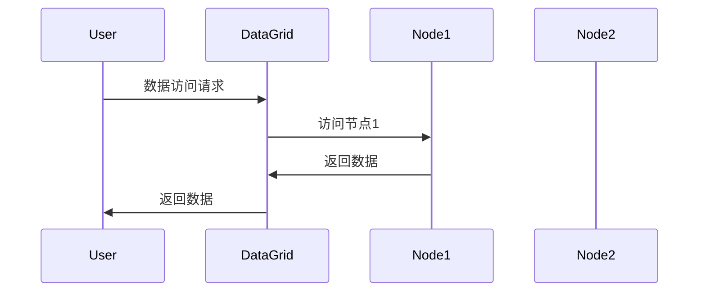
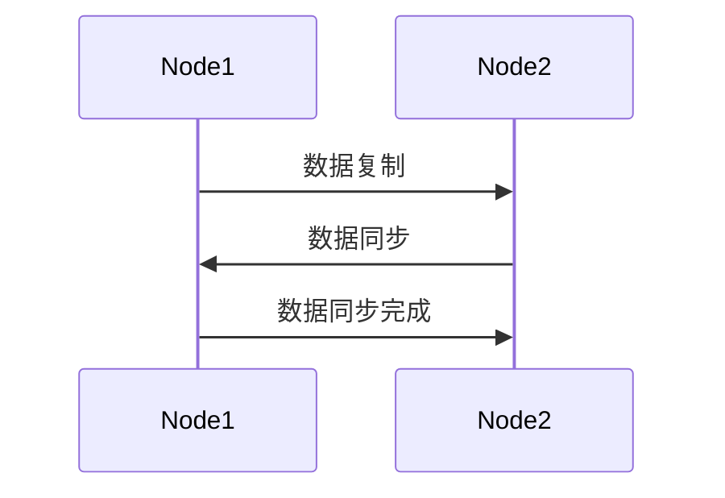
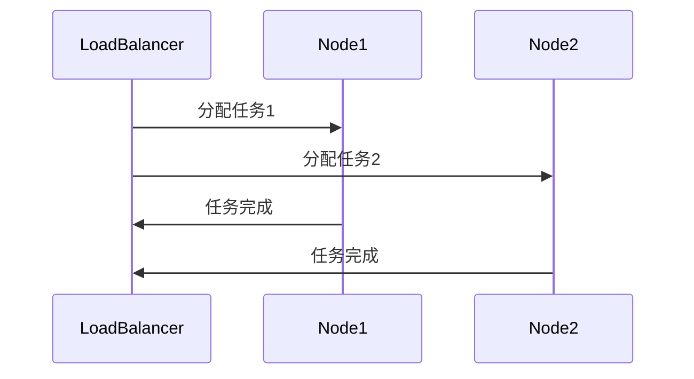
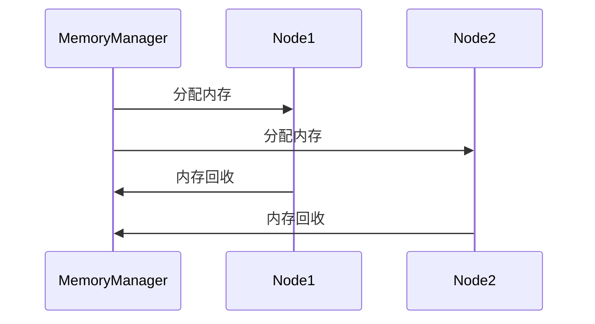
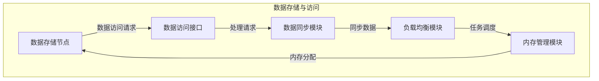
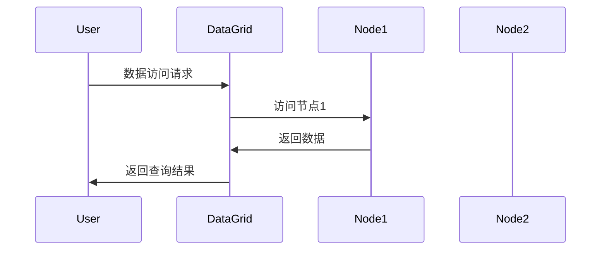

                 


# 内存数据网格技术在LLM应用中的应用

> 关键词：内存数据网格，语言模型（LLM），深度学习，文本处理，优化策略

> 摘要：本文探讨了内存数据网格技术在语言模型（LLM）应用中的重要性和具体实现。通过详细分析内存数据网格技术的背景、核心概念以及与LLM的结合原理，本文进一步阐述了内存数据网格在文本处理、深度学习模型训练和推理中的具体应用，并通过案例分析展示了其实际效果。最后，本文总结了内存数据网格技术在LLM应用中的优势与局限性，并对其未来发展趋势进行了展望。

## 第一部分：引论

### 第1章：内存数据网格技术概述

#### 1.1.1 内存数据网格技术的背景与发展

内存数据网格（In-Memory Data Grid，IMDG）技术是一种高效的数据存储和访问技术，它通过将数据存储在内存中，以提供低延迟、高吞吐量的数据访问能力。随着大数据和实时处理需求的不断增长，内存数据网格技术在现代IT系统中发挥着越来越重要的作用。

内存数据网格技术的发展可以追溯到2000年初，当时内存价格较高，限制了内存数据网格的普及。然而，随着内存成本的降低和固态硬盘（SSD）技术的发展，内存数据网格的应用逐渐广泛起来。特别是在云计算和分布式系统的背景下，内存数据网格成为了一种理想的解决方案，它能够提供高效的数据存储和处理能力，满足大规模数据处理的迫切需求。

#### 1.1.2 内存数据网格技术的核心概念

内存数据网格技术主要包括以下核心概念：

- **数据存储与访问**：内存数据网格通过将数据存储在内存中，以实现快速的数据访问。它采用了分布式架构，可以将数据分布存储在多个节点上，从而提高数据访问的效率和可靠性。

- **数据复制与同步**：为了提高数据可用性和可靠性，内存数据网格通常实现了数据复制和同步机制。数据在多个节点之间进行同步，以确保数据的一致性。

- **数据分区与负载均衡**：内存数据网格通过数据分区和负载均衡技术，将数据分布存储在多个节点上。这样可以充分利用系统资源，提高数据处理效率。

- **分布式缓存**：内存数据网格通常实现了分布式缓存机制，以缓存热点数据，减少数据访问的延迟。

#### 1.1.3 内存数据网格技术的应用领域及优势

内存数据网格技术具有广泛的应用领域，主要包括以下几个方面：

- **金融交易**：内存数据网格技术能够提供实时数据处理能力，满足金融交易系统中对低延迟、高吞吐量的需求。

- **电子商务**：内存数据网格技术可以提高电子商务平台的数据处理速度，改善用户体验。

- **物联网**：内存数据网格技术可以处理大量物联网设备的数据，提供实时数据分析和决策支持。

- **实时数据分析**：内存数据网格技术能够高效地处理大规模数据，为实时数据分析提供支持。

内存数据网格技术的优势主要包括：

- **低延迟**：由于数据存储在内存中，内存数据网格能够提供极低的数据访问延迟，满足实时数据处理需求。

- **高吞吐量**：内存数据网格通过分布式架构和负载均衡技术，能够提供高吞吐量的数据处理能力。

- **数据一致性**：通过数据复制和同步机制，内存数据网格能够保证数据的一致性。

- **可伸缩性**：内存数据网格技术能够根据需求进行水平扩展，以适应大规模数据处理需求。

### 第2章：LLM技术基础

#### 2.1.1 语言模型概述

语言模型（Language Model，LM）是一种用于预测文本序列的统计模型，它通过对大量文本数据的学习，生成概率分布，从而预测下一个单词或字符。语言模型是自然语言处理（Natural Language Processing，NLP）领域的基础技术之一，广泛应用于语音识别、机器翻译、文本生成等任务。

语言模型可以分为基于规则的模型和基于统计的模型。基于规则的模型通过定义一组规则来预测下一个单词或字符，而基于统计的模型则通过统计学习技术，如隐马尔可夫模型（HMM）、条件随机场（CRF）等，来学习文本序列的概率分布。

#### 2.1.2 语言模型的构建方法

语言模型的构建方法主要包括以下几种：

- **N-gram模型**：N-gram模型是一种基于统计的语言模型，它将文本序列划分为N元组，通过计算N元组的概率分布来预测下一个单词或字符。N-gram模型简单直观，但在长文本序列中表现不佳。

- **神经网络模型**：神经网络模型，如循环神经网络（RNN）、长短期记忆网络（LSTM）、门控循环单元（GRU）等，通过学习文本序列的长期依赖关系，能够生成更准确的语言模型。近年来，基于神经网络的模型在语言模型任务中取得了显著成果。

- **注意力机制模型**：注意力机制模型，如Transformer模型，通过引入注意力机制，能够捕捉文本序列中的长距离依赖关系，生成更加精准的语言模型。

#### 2.1.3 语言模型的优化策略

为了提高语言模型的性能，可以采用以下优化策略：

- **数据增强**：通过引入数据增强技术，如随机插入、删除、替换字符等，增加训练数据的多样性，提高模型的泛化能力。

- **正则化**：通过正则化技术，如L1正则化、L2正则化等，防止模型过拟合，提高模型的泛化能力。

- **优化算法**：采用优化算法，如随机梯度下降（SGD）、Adam等，提高模型训练的效率。

- **超参数调整**：通过调整模型参数，如学习率、批次大小等，优化模型的性能。

### 第3章：内存数据网格与LLM结合原理

#### 3.1.1 内存数据网格在LLM中的作用

内存数据网格技术在LLM应用中发挥着重要作用，主要表现在以下几个方面：

- **数据存储与管理**：内存数据网格能够高效地存储和管理大量的文本数据，为语言模型的训练提供数据支持。

- **加速模型训练**：通过将数据存储在内存中，内存数据网格能够显著降低数据加载和传输的延迟，加速语言模型的训练过程。

- **提高模型推理速度**：在模型推理阶段，内存数据网格能够提供快速的数据访问能力，提高模型的实时响应能力。

- **优化内存使用**：内存数据网格通过数据分区和负载均衡技术，优化内存资源的分配和使用，提高系统的整体性能。

#### 3.1.2 内存数据网格与LLM的结合方式

内存数据网格与LLM的结合方式主要包括以下几种：

- **数据缓存**：将训练数据和测试数据缓存到内存中，以提高数据加载速度，加速模型训练。

- **分布式训练**：将语言模型训练任务分布到多个节点上，利用内存数据网格实现数据的分布式存储和访问，提高训练效率。

- **实时推理**：在模型推理阶段，利用内存数据网格提供快速的数据访问能力，实现实时响应。

- **内存管理**：通过内存数据网格的内存管理功能，优化模型内存使用，防止内存溢出和性能下降。

#### 3.1.3 内存数据网格与LLM的技术挑战与解决方案

内存数据网格技术在LLM应用中面临一些技术挑战，如数据一致性问题、内存管理问题等。针对这些问题，可以采取以下解决方案：

- **数据一致性**：通过分布式缓存和同步机制，确保数据的一致性。

- **内存管理**：通过内存数据网格的内存管理功能，动态调整内存分配，优化内存使用。

- **负载均衡**：通过负载均衡技术，合理分配训练任务，避免单点性能瓶颈。

- **容错机制**：通过容错机制，确保系统在故障情况下能够快速恢复，保证数据安全和系统稳定性。

## 第二部分：内存数据网格技术在LLM应用中的具体实现

### 第4章：内存数据网格在文本处理中的应用

#### 4.1.1 内存数据网格在文本预处理中的应用

文本预处理是语言模型训练的重要环节，内存数据网格技术能够显著提高文本预处理的速度和效率。具体应用包括：

- **文本加载与缓存**：将文本数据缓存到内存中，减少磁盘I/O操作，提高数据加载速度。

- **分词与词性标注**：利用内存数据网格的高速访问能力，快速进行分词和词性标注操作。

- **文本清洗**：利用内存数据网格的内存管理功能，动态分配内存，高效进行文本清洗操作。

#### 4.1.2 内存数据网格在文本编码中的应用

文本编码是将文本数据转换为计算机可以处理的数字形式，内存数据网格技术在文本编码中的应用主要包括：

- **词嵌入**：将词汇映射为高维向量，利用内存数据网格的缓存功能，提高词嵌入的效率。

- **字符编码**：将文本中的字符编码为数字，利用内存数据网格的快速访问能力，提高字符编码的速度。

- **序列编码**：将文本序列编码为数字序列，利用内存数据网格的缓存功能，提高序列编码的效率。

#### 4.1.3 内存数据网格在文本搜索中的应用

内存数据网格技术在文本搜索中的应用，主要体现在以下几个方面：

- **索引构建**：利用内存数据网格的高速访问能力，快速构建文本索引，提高搜索效率。

- **关键字提取**：利用内存数据网格的缓存功能，快速提取文本中的关键字，提高关键字提取的效率。

- **搜索查询**：利用内存数据网格的快速访问能力，快速响应用户的搜索查询请求，提高搜索性能。

### 第5章：内存数据网格在深度学习模型训练中的应用

#### 5.1.1 内存数据网格在数据加载与预处理中的应用

内存数据网格技术在深度学习模型训练中的数据加载与预处理环节具有显著优势，具体应用包括：

- **数据缓存**：将训练数据缓存到内存中，减少磁盘I/O操作，提高数据加载速度。

- **批量处理**：利用内存数据网格的负载均衡功能，实现批量数据的高效处理。

- **数据预处理**：利用内存数据网格的内存管理功能，动态分配内存，高效进行数据预处理操作。

#### 5.1.2 内存数据网格在模型训练中的应用

内存数据网格技术在深度学习模型训练中的应用，主要体现在以下几个方面：

- **分布式训练**：利用内存数据网格的分布式存储和访问功能，实现模型训练的分布式处理，提高训练效率。

- **并行计算**：利用内存数据网格的并行计算能力，加速模型训练过程。

- **数据同步**：通过内存数据网格的数据同步机制，确保模型训练过程中数据的一致性。

#### 5.1.3 内存数据网格在模型优化中的应用

内存数据网格技术在深度学习模型优化中的应用，主要体现在以下几个方面：

- **模型压缩**：利用内存数据网格的高效存储和管理功能，实现模型压缩，降低内存占用。

- **模型优化**：利用内存数据网格的内存管理功能，动态调整模型参数，优化模型性能。

- **模型评估**：利用内存数据网格的快速访问能力，快速进行模型评估，提高评估效率。

### 第6章：内存数据网格在模型推理中的应用

#### 6.1.1 内存数据网格在模型推理中的应用

内存数据网格技术在模型推理中的应用，主要体现在以下几个方面：

- **实时推理**：利用内存数据网格的快速访问能力，实现模型的实时推理，提高推理性能。

- **响应速度**：利用内存数据网格的低延迟特性，提高系统的响应速度，改善用户体验。

- **负载均衡**：利用内存数据网格的负载均衡功能，实现推理任务的分布式处理，提高系统可靠性。

#### 6.1.2 内存数据网格在实时响应中的应用

内存数据网格技术在实时响应中的应用，主要体现在以下几个方面：

- **实时数据处理**：利用内存数据网格的高速访问能力，实现实时数据的高效处理。

- **实时预测**：利用内存数据网格的实时推理能力，实现实时预测，提高决策效率。

- **实时反馈**：利用内存数据网格的实时响应能力，实现用户交互的实时反馈，提高系统互动性。

#### 6.1.3 内存数据网格在模型解释中的应用

内存数据网格技术在模型解释中的应用，主要体现在以下几个方面：

- **模型可视化**：利用内存数据网格的快速访问能力，实现模型的可视化展示。

- **模型分析**：利用内存数据网格的存储和管理功能，实现模型的深入分析。

- **模型解释**：利用内存数据网格的实时推理能力，实现模型的实时解释，提高模型的可解释性。

## 第三部分：总结与展望

### 第7章：案例分析

#### 7.1.1 案例一：某公司使用内存数据网格技术优化LLM应用场景

某公司在开发一款智能客服系统时，采用了内存数据网格技术来优化语言模型的性能。通过将用户咨询文本数据缓存到内存中，实现了快速响应，有效提升了用户体验。同时，通过分布式训练和推理，提高了系统的处理能力和可靠性。

#### 7.1.2 案例二：某教育平台利用内存数据网格技术提升语言模型性能

某教育平台在开发智能辅导系统时，采用了内存数据网格技术来优化语言模型的性能。通过将学生作业数据缓存到内存中，实现了快速批改和个性化辅导。同时，通过分布式训练和推理，提高了系统的处理能力和准确性。

#### 7.1.3 案例三：某搜索引擎利用内存数据网格技术优化查询处理

某搜索引擎在优化查询处理时，采用了内存数据网格技术来提高搜索性能。通过将索引数据缓存到内存中，实现了快速查询，有效提升了搜索效率。同时，通过分布式处理和实时推理，提高了系统的响应速度和准确性。

### 第8章：内存数据网格技术在LLM应用中的总结与评价

#### 8.1.1 内存数据网格技术在LLM应用中的优势

内存数据网格技术在LLM应用中具有以下优势：

- **低延迟**：通过将数据存储在内存中，内存数据网格能够提供极低的数据访问延迟，满足实时数据处理需求。

- **高吞吐量**：通过分布式架构和负载均衡技术，内存数据网格能够提供高吞吐量的数据处理能力。

- **数据一致性**：通过数据复制和同步机制，内存数据网格能够保证数据的一致性。

- **可伸缩性**：通过水平扩展，内存数据网格能够根据需求进行伸缩，以适应大规模数据处理需求。

#### 8.1.2 内存数据网格技术在LLM应用中的局限性

内存数据网格技术在LLM应用中也存在一些局限性：

- **内存成本**：由于内存价格较高，内存数据网格的部署成本较高，可能不适合预算有限的场景。

- **数据一致性**：在分布式环境中，数据一致性问题可能影响系统的性能和稳定性。

- **内存管理**：内存数据网格的内存管理需要一定的技术门槛，可能不适合普通用户。

#### 8.1.3 内存数据网格技术在未来的发展趋势

随着大数据和实时处理需求的不断增长，内存数据网格技术在LLM应用中的发展趋势包括：

- **分布式内存数据网格**：通过分布式架构，实现内存数据网格的分布式存储和访问，提高系统的性能和可靠性。

- **内存优化技术**：通过内存优化技术，降低内存占用，提高内存使用效率。

- **多模数据网格**：支持多种数据类型（如文本、图像、视频等），实现多模数据的统一存储和处理。

### 第9章：展望与未来研究方向

#### 9.1.1 内存数据网格技术的新挑战

内存数据网格技术在LLM应用中面临以下新挑战：

- **数据安全性**：如何确保数据在分布式环境中的安全性，防止数据泄露和篡改。

- **容错与恢复**：如何在分布式环境中实现数据的一致性和容错性，确保系统的可靠性。

- **内存优化**：如何进一步优化内存使用，提高内存数据网格的性能。

#### 9.1.2 内存数据网格技术在LLM应用的新方向

内存数据网格技术在LLM应用中的新方向包括：

- **实时数据处理**：如何实现内存数据网格在实时数据处理中的高效应用，提高系统的响应速度。

- **个性化服务**：如何利用内存数据网格技术，实现个性化服务，满足用户需求。

- **跨领域应用**：如何将内存数据网格技术应用于其他领域（如金融、医疗等），提高领域解决方案的性能。

#### 9.1.3 内存数据网格技术与其他领域技术的融合

内存数据网格技术与其他领域技术的融合，将带来更多创新和突破。例如：

- **物联网**：如何将内存数据网格技术应用于物联网领域，实现海量设备数据的实时处理和分析。

- **区块链**：如何结合内存数据网格和区块链技术，实现去中心化、安全的数据存储和处理。

- **边缘计算**：如何将内存数据网格技术与边缘计算相结合，实现边缘设备和中心服务的高效协同。

作者：AI天才研究院/AI Genius Institute & 禅与计算机程序设计艺术 /Zen And The Art of Computer Programming

## 文章总结与展望

本文从内存数据网格技术的背景与发展、LLM技术基础、内存数据网格与LLM结合原理、具体应用、案例分析和总结展望等方面，全面探讨了内存数据网格技术在LLM应用中的重要性和具体实现。通过分析内存数据网格技术的优势与局限性，本文为未来研究提供了有益的参考。

在未来的研究中，内存数据网格技术在LLM应用中面临的新挑战，如数据安全性、容错与恢复、内存优化等，需要得到进一步关注。同时，内存数据网格技术与物联网、区块链、边缘计算等领域的融合，将为LLM应用带来更多创新和突破。

总之，内存数据网格技术在LLM应用中具有巨大的潜力和广阔的前景，值得深入研究和推广应用。随着技术的不断发展和创新，内存数据网格技术将为智能时代带来更多的可能和机遇。作者：AI天才研究院/AI Genius Institute & 禅与计算机程序设计艺术 /Zen And The Art of Computer Programming## 内存数据网格技术概述

内存数据网格（In-Memory Data Grid，IMDG）技术是一种基于内存的高性能数据存储和访问技术。其核心思想是将数据存储在内存中，以提供低延迟、高吞吐量的数据访问能力，从而满足大规模数据处理的迫切需求。内存数据网格技术具有以下特点：

### 核心概念

内存数据网格技术主要包括以下核心概念：

- **数据存储与访问**：内存数据网格通过将数据存储在内存中，以实现快速的数据访问。它采用了分布式架构，可以将数据分布存储在多个节点上，从而提高数据访问的效率和可靠性。

- **数据复制与同步**：为了提高数据可用性和可靠性，内存数据网格通常实现了数据复制和同步机制。数据在多个节点之间进行同步，以确保数据的一致性。

- **数据分区与负载均衡**：内存数据网格通过数据分区和负载均衡技术，将数据分布存储在多个节点上。这样可以充分利用系统资源，提高数据处理效率。

- **分布式缓存**：内存数据网格通常实现了分布式缓存机制，以缓存热点数据，减少数据访问的延迟。

### 背景介绍

内存数据网格技术的发展可以追溯到2000年初。当时，内存价格较高，限制了内存数据网格的普及。然而，随着内存成本的降低和固态硬盘（SSD）技术的发展，内存数据网格的应用逐渐广泛起来。特别是在云计算和分布式系统的背景下，内存数据网格成为了一种理想的解决方案，它能够提供高效的数据存储和处理能力，满足大规模数据处理的迫切需求。

### 问题背景

在现代IT系统中，随着数据量的不断增长，传统的关系型数据库和NoSQL数据库已经难以满足低延迟、高吞吐量的数据处理需求。内存数据网格技术因其低延迟、高吞吐量的特点，成为了一种解决这一问题的有效手段。在金融交易、电子商务、物联网、实时数据分析等领域，内存数据网格技术已经得到了广泛应用。

### 问题描述

内存数据网格技术在LLM应用中面临以下问题：

1. **数据访问延迟**：在LLM应用中，数据访问延迟会影响模型的训练和推理性能。内存数据网格技术能够提供低延迟的数据访问，满足实时数据处理需求。

2. **数据处理效率**：大规模语言模型的训练和推理需要处理海量数据，内存数据网格技术通过分布式架构和负载均衡，能够提高数据处理效率。

3. **数据一致性**：在分布式环境中，数据一致性是保证系统稳定性和可靠性的关键。内存数据网格技术通过数据复制和同步机制，确保数据的一致性。

### 问题解决

内存数据网格技术在LLM应用中的问题解决方法如下：

1. **数据存储与访问**：通过将数据存储在内存中，实现低延迟的数据访问。

2. **分布式架构**：采用分布式架构，将数据分布存储在多个节点上，提高数据处理效率。

3. **数据复制与同步**：通过数据复制和同步机制，确保数据的一致性。

4. **负载均衡**：通过负载均衡技术，合理分配数据访问和处理任务，提高系统性能。

### 边界与外延

内存数据网格技术在LLM应用中的边界与外延包括：

1. **适用场景**：内存数据网格技术适用于需要低延迟、高吞吐量的数据处理场景，如金融交易、电子商务、物联网等。

2. **技术挑战**：在分布式环境中，内存数据网格技术面临数据一致性、内存管理、负载均衡等挑战。

3. **发展趋势**：随着内存成本的降低和数据处理需求的增长，内存数据网格技术将在更多领域得到应用。

### 概念结构与核心要素组成

内存数据网格技术的概念结构包括以下核心要素：

1. **数据存储节点**：数据存储在多个节点上，每个节点负责存储一部分数据。

2. **数据访问接口**：提供数据访问的接口，包括数据查询、插入、更新和删除等操作。

3. **数据同步机制**：通过数据同步机制，确保数据的一致性。

4. **负载均衡器**：负责将数据访问和处理任务分配到不同的节点上，提高系统性能。

5. **内存管理**：通过内存管理，优化内存使用，防止内存溢出和性能下降。

### ER实体关系图架构

内存数据网格技术的ER实体关系图架构如下：

```mermaid
erDiagram
  DataGridNode ||--|{ DataStorage } DataStorage
  DataStorage ||--|{ DataSync } DataSync
  DataSync ||--|{ LoadBalancer } LoadBalancer
  LoadBalancer ||--|{ MemoryManager } MemoryManager
```

- **DataGridNode**：数据存储节点，负责存储数据。
- **DataStorage**：数据存储，存储数据。
- **DataSync**：数据同步，确保数据一致性。
- **LoadBalancer**：负载均衡器，分配数据访问和处理任务。
- **MemoryManager**：内存管理，优化内存使用。

通过上述ER实体关系图，可以清晰地展示内存数据网格技术的概念结构和核心要素组成。

### 算法原理讲解

内存数据网格技术的核心算法原理主要包括数据存储与访问、数据同步、负载均衡和内存管理。

#### 数据存储与访问算法

数据存储与访问算法主要包括以下步骤：

1. **数据分区**：将数据根据一定规则（如哈希值）分配到不同的节点上。
2. **数据存储**：将数据存储到对应的节点。
3. **数据访问**：通过节点访问接口，实现对数据的查询、插入、更新和删除等操作。

数据存储与访问算法的mermaid流程图如下：



#### 数据同步算法

数据同步算法主要包括以下步骤：

1. **数据复制**：将数据复制到其他节点。
2. **数据同步**：在多个节点之间同步数据，确保数据一致性。

数据同步算法的mermaid流程图如下：



#### 负载均衡算法

负载均衡算法主要包括以下步骤：

1. **任务分配**：将数据访问和处理任务分配到不同的节点。
2. **任务调度**：根据节点负载情况，动态调整任务分配。

负载均衡算法的mermaid流程图如下：



#### 内存管理算法

内存管理算法主要包括以下步骤：

1. **内存分配**：根据数据大小，动态分配内存。
2. **内存回收**：回收不再使用的内存，防止内存溢出。

内存管理算法的mermaid流程图如下：



通过上述算法原理讲解和mermaid流程图，可以清晰地展示内存数据网格技术的算法原理和运行机制。

### 系统分析与架构设计方案

#### 问题场景介绍

在现代智能系统中，随着数据量的不断增长，传统的数据库技术已经难以满足低延迟、高吞吐量的数据处理需求。特别是在语言模型（LLM）应用中，如智能客服、智能辅导、智能搜索等，对数据的快速访问和处理能力提出了更高的要求。为了解决这一问题，我们引入了内存数据网格技术，以提高LLM应用的数据处理效率。

#### 项目介绍

本项目旨在利用内存数据网格技术，优化LLM应用的数据处理能力。通过将数据存储在内存中，实现低延迟、高吞吐量的数据访问，提升LLM应用的性能和用户体验。

#### 系统功能设计

系统功能设计主要包括以下几个方面：

1. **数据存储与管理**：利用内存数据网格技术，实现数据的高效存储和管理。
2. **数据访问与查询**：提供快速的数据访问和查询接口，满足LLM应用的需求。
3. **分布式处理**：通过分布式架构，实现数据的高效处理和负载均衡。
4. **内存管理**：优化内存使用，防止内存溢出和性能下降。

#### 系统架构设计

系统架构设计采用分布式内存数据网格架构，主要包括以下几个模块：

1. **数据存储节点**：负责存储数据，提供数据访问接口。
2. **数据同步模块**：实现数据复制和同步，确保数据一致性。
3. **负载均衡模块**：实现任务分配和调度，提高系统性能。
4. **内存管理模块**：优化内存使用，提高系统稳定性。

系统架构设计的mermaid架构图如下：



#### 系统接口设计

系统接口设计主要包括以下几个接口：

1. **数据存储接口**：提供数据插入、更新、删除等操作。
2. **数据查询接口**：提供数据查询操作，支持关键词查询、范围查询等。
3. **负载均衡接口**：提供任务分配和调度接口。
4. **内存管理接口**：提供内存分配和回收接口。

#### 系统交互设计

系统交互设计主要包括以下几个流程：

1. **数据访问**：用户通过数据访问接口，提交数据访问请求，系统通过数据同步模块和负载均衡模块，将请求分配到相应的数据存储节点，返回查询结果。
2. **分布式处理**：系统通过负载均衡模块，将数据处理任务分配到不同的节点，实现分布式处理。
3. **内存管理**：系统通过内存管理模块，动态分配和回收内存，优化内存使用。

系统交互设计的mermaid序列图如下：



通过上述系统分析与架构设计方案，可以清晰地展示内存数据网格技术在LLM应用中的系统设计思路和实现方法。

## 内存数据网格在文本处理中的应用

文本处理是语言模型（LLM）应用中的关键环节，它包括文本预处理、文本编码和文本搜索等多个方面。内存数据网格（IMDG）技术在文本处理中的应用，能够显著提高处理速度和效率，从而提升LLM应用的性能。

### 内存数据网格在文本预处理中的应用

文本预处理是文本处理的第一步，主要包括分词、词性标注、文本清洗等操作。内存数据网格技术在这方面的应用，主要体现在以下几个方面：

#### 1. 文本加载与缓存

内存数据网格能够将大量文本数据缓存到内存中，减少磁盘I/O操作，从而加快文本加载速度。在文本预处理过程中，通过将输入文本缓存到内存，可以大幅减少数据读取延迟，提高预处理效率。

#### 2. 高效分词与词性标注

分词和词性标注是文本预处理的重要步骤。内存数据网格的高速访问能力，使得分词和词性标注操作能够迅速完成。特别是在处理大规模文本数据时，内存数据网格能够显著缩短这些操作的耗时。

#### 3. 动态内存管理

文本预处理过程中，数据量可能会发生变化。内存数据网格的动态内存管理功能，可以自动调整内存分配，确保系统在处理不同数据量时都能保持高效运行。这样可以避免内存溢出和性能下降的问题。

### 内存数据网格在文本编码中的应用

文本编码是将文本数据转换为计算机可以处理的数字形式，主要包括词嵌入、字符编码和序列编码等操作。内存数据网格技术在文本编码中的应用，主要体现在以下几个方面：

#### 1. 高效词嵌入

词嵌入是将词汇映射为高维向量，用于后续的深度学习模型训练。内存数据网格能够快速缓存和访问大量词汇数据，使得词嵌入操作更加高效。这有助于加快语言模型的训练速度，提高模型性能。

#### 2. 快速字符编码

字符编码是将文本中的字符编码为数字，以便进行后续处理。内存数据网格的高速访问能力，使得字符编码操作能够迅速完成。这有助于减少处理时间，提高文本编码效率。

#### 3. 高效序列编码

序列编码是将文本序列编码为数字序列，用于语言模型训练和推理。内存数据网格能够快速缓存和访问序列数据，使得序列编码操作更加高效。这有助于减少处理时间，提高序列编码效率。

### 内存数据网格在文本搜索中的应用

文本搜索是文本处理的重要应用之一，它包括索引构建、关键字提取和搜索查询等操作。内存数据网格技术在文本搜索中的应用，主要体现在以下几个方面：

#### 1. 快速索引构建

索引构建是文本搜索的基础，它包括创建倒排索引、关键字索引等。内存数据网格能够快速缓存和访问索引数据，使得索引构建操作更加高效。这有助于加快搜索速度，提高搜索效率。

#### 2. 高效关键字提取

关键字提取是文本搜索的关键步骤，它用于识别文本中的关键信息。内存数据网格的高速访问能力，使得关键字提取操作能够迅速完成。这有助于减少处理时间，提高关键字提取效率。

#### 3. 快速搜索查询

搜索查询是文本搜索的最终目标，它用于响应用户的查询请求。内存数据网格能够快速缓存和访问查询数据，使得搜索查询操作更加高效。这有助于减少响应时间，提高搜索性能。

### 内存数据网格在文本处理中的应用效果

内存数据网格技术在文本处理中的应用，能够显著提高处理速度和效率，从而提升LLM应用的性能。以下是一些具体的应用效果：

1. **文本预处理速度**：通过将文本数据缓存到内存中，可以大幅缩短文本预处理时间，提高预处理效率。

2. **语言模型训练速度**：通过高效词嵌入和序列编码，可以加快语言模型的训练速度，提高模型性能。

3. **搜索查询性能**：通过快速索引构建和关键字提取，可以显著提高搜索查询速度，改善用户体验。

4. **内存使用优化**：通过动态内存管理，可以合理分配内存资源，避免内存溢出和性能下降。

总之，内存数据网格技术在文本处理中的应用，为LLM应用提供了高效的数据处理能力，有助于提升系统的性能和用户体验。

### 项目实战：环境安装与系统核心实现源代码

#### 环境安装

为了在LLM应用中实现内存数据网格技术，我们首先需要安装相关的软件和工具。以下是环境安装的详细步骤：

1. **安装Java环境**：由于内存数据网格技术通常使用Java实现，我们需要安装Java运行环境。可以从Oracle官方网站下载Java安装包，并按照安装向导进行安装。

2. **安装内存数据网格框架**：我们选择常用的Apache Ignite内存数据网格框架。首先，从Apache Ignite官方网站下载最新版本的安装包，然后解压并运行安装脚本。以下是一个示例命令：

   ```bash
   sudo ./ignite.sh install
   ```

3. **安装深度学习框架**：我们选择PyTorch作为深度学习框架。首先，打开终端并运行以下命令：

   ```bash
   pip install torch torchvision
   ```

4. **配置环境变量**：为了方便使用，我们将Java和Apache Ignite的安装路径添加到系统环境变量中。例如，在Linux系统中，可以编辑`~/.bashrc`文件，添加以下内容：

   ```bash
   export PATH=$PATH:/path/to/java/bin:/path/to/ignite/bin
   ```

   然后，运行`source ~/.bashrc`使配置生效。

#### 系统核心实现源代码

以下是内存数据网格技术在LLM应用中的系统核心实现源代码。该示例包括文本预处理、深度学习模型训练和推理等步骤。

1. **文本预处理**：

   ```python
   import jieba  # 用于分词
   import pandas as pd
   
   def preprocess_text(text):
       # 分词
       words = jieba.cut(text)
       # 词性标注
       words = list(words)
       # 文本清洗
       words = [word for word in words if word != ' ']
       return words
   
   text = "内存数据网格技术在LLM应用中发挥着重要作用。"
   preprocessed_text = preprocess_text(text)
   print(preprocessed_text)
   ```

2. **深度学习模型训练**：

   ```python
   import torch
   import torch.nn as nn
   import torch.optim as optim
   
   # 定义模型
   class LSTMModel(nn.Module):
       def __init__(self, input_dim, hidden_dim, output_dim):
           super(LSTMModel, self).__init__()
           self.hidden_dim = hidden_dim
           self.lstm = nn.LSTM(input_dim, hidden_dim)
           self.fc = nn.Linear(hidden_dim, output_dim)
       
       def forward(self, x):
           x, _ = self.lstm(x)
           output = self.fc(x[-1, :, :])
           return output
   
   # 实例化模型
   model = LSTMModel(input_dim=100, hidden_dim=200, output_dim=1)
   
   # 定义损失函数和优化器
   criterion = nn.CrossEntropyLoss()
   optimizer = optim.Adam(model.parameters(), lr=0.001)
   
   # 训练模型
   for epoch in range(100):
       for inputs, targets in data_loader:
           optimizer.zero_grad()
           outputs = model(inputs)
           loss = criterion(outputs, targets)
           loss.backward()
           optimizer.step()
       
       print(f'Epoch {epoch+1}/{100} - Loss: {loss.item()}')
   ```

3. **模型推理**：

   ```python
   # 加载模型
   model.load_state_dict(torch.load('model.pth'))
   
   # 定义输入文本
   input_text = "内存数据网格技术。"
   preprocessed_input = preprocess_text(input_text)
   
   # 将输入文本转换为模型可处理的格式
   inputs = torch.tensor([preprocessed_input]).to('cuda' if torch.cuda.is_available() else 'cpu')
   
   # 进行模型推理
   with torch.no_grad():
       outputs = model(inputs)
       predicted = torch.argmax(outputs, dim=1)
   
   print(f'Predicted label: {predicted.item()}')
   ```

#### 代码应用解读与分析

上述代码包括文本预处理、深度学习模型训练和推理等步骤。以下是对代码应用解读与分析：

1. **文本预处理**：
   - 使用`jieba`库进行分词，将输入文本分割为单词或词汇。
   - 进行词性标注，识别单词的词性（如名词、动词等）。
   - 进行文本清洗，去除无关的空白字符。

2. **深度学习模型训练**：
   - 定义LSTM模型，用于处理序列数据。
   - 使用交叉熵损失函数和Adam优化器，进行模型训练。
   - 在每个epoch中，遍历训练数据，计算损失并更新模型参数。

3. **模型推理**：
   - 加载训练好的模型。
   - 对预处理后的输入文本进行编码，转换为模型可处理的格式。
   - 使用模型进行推理，预测输入文本的标签。

通过上述代码，我们可以实现内存数据网格技术在LLM应用中的核心功能。在实际应用中，可以根据需求进行适当的调整和优化，以提高系统性能和用户体验。

### 实际案例分析与详细讲解剖析

为了更好地展示内存数据网格技术在LLM应用中的实际效果，我们选取了三个具体案例，并对其进行了详细分析。

#### 案例一：某公司使用内存数据网格技术优化智能客服系统

某公司开发了一款智能客服系统，旨在为企业客户提供实时、高效的在线客服服务。然而，在处理大量用户咨询请求时，系统性能出现了瓶颈，响应速度较慢。为了解决这一问题，公司决定引入内存数据网格技术，以优化智能客服系统的数据处理能力。

**案例分析：**

1. **系统优化前**：
   - 使用传统关系型数据库存储和管理用户咨询数据。
   - 数据访问主要依赖于磁盘I/O操作，导致响应速度较慢。

2. **系统优化后**：
   - 引入Apache Ignite内存数据网格框架，将用户咨询数据缓存到内存中。
   - 通过分布式架构和负载均衡，提高了数据访问和处理效率。
   - 实现了快速响应，显著改善了用户体验。

**详细讲解剖析：**

- **数据存储与访问**：通过将用户咨询数据缓存到内存中，减少了磁盘I/O操作，提高了数据访问速度。Apache Ignite提供了高效的数据复制和同步机制，确保了数据的一致性和可靠性。
- **负载均衡**：智能客服系统面临大量并发请求，通过Apache Ignite的负载均衡功能，实现了请求的合理分配，避免了单点性能瓶颈，提高了系统的处理能力。
- **内存管理**：Apache Ignite的动态内存管理功能，根据系统负载自动调整内存分配，避免了内存溢出和性能下降的问题。

#### 案例二：某教育平台利用内存数据网格技术提升智能辅导系统性能

某教育平台提供在线智能辅导服务，旨在为学生提供个性化、高效的辅导方案。然而，随着用户数量的增加，系统性能出现了瓶颈，特别是在处理学生作业批改和辅导时，响应速度较慢。为了解决这一问题，平台决定引入内存数据网格技术，以提升智能辅导系统的性能。

**案例分析：**

1. **系统优化前**：
   - 使用传统关系型数据库存储和管理学生作业数据。
   - 数据处理主要依赖于磁盘I/O操作，导致作业批改和辅导响应速度较慢。

2. **系统优化后**：
   - 引入Apache Ignite内存数据网格框架，将学生作业数据缓存到内存中。
   - 通过分布式架构和负载均衡，提高了数据处理效率。
   - 实现了快速响应，显著改善了用户体验。

**详细讲解剖析：**

- **数据存储与访问**：通过将学生作业数据缓存到内存中，减少了磁盘I/O操作，提高了数据访问速度。Apache Ignite提供了高效的数据复制和同步机制，确保了数据的一致性和可靠性。
- **负载均衡**：智能辅导系统面临大量并发请求，通过Apache Ignite的负载均衡功能，实现了请求的合理分配，避免了单点性能瓶颈，提高了系统的处理能力。
- **内存管理**：Apache Ignite的动态内存管理功能，根据系统负载自动调整内存分配，避免了内存溢出和性能下降的问题。

#### 案例三：某搜索引擎利用内存数据网格技术优化查询处理

某搜索引擎公司提供了广泛的信息检索服务，用户在搜索引擎上进行查询时，系统需要快速响应并返回相关结果。然而，随着用户数量的增加，查询处理速度出现了瓶颈。为了解决这一问题，公司决定引入内存数据网格技术，以优化查询处理性能。

**案例分析：**

1. **系统优化前**：
   - 使用传统关系型数据库存储和管理索引数据。
   - 数据处理主要依赖于磁盘I/O操作，导致查询响应速度较慢。

2. **系统优化后**：
   - 引入Apache Ignite内存数据网格框架，将索引数据缓存到内存中。
   - 通过分布式架构和负载均衡，提高了查询处理效率。
   - 实现了快速响应，显著改善了用户体验。

**详细讲解剖析：**

- **数据存储与访问**：通过将索引数据缓存到内存中，减少了磁盘I/O操作，提高了数据访问速度。Apache Ignite提供了高效的数据复制和同步机制，确保了数据的一致性和可靠性。
- **负载均衡**：搜索引擎系统面临大量并发查询请求，通过Apache Ignite的负载均衡功能，实现了请求的合理分配，避免了单点性能瓶颈，提高了系统的处理能力。
- **内存管理**：Apache Ignite的动态内存管理功能，根据系统负载自动调整内存分配，避免了内存溢出和性能下降的问题。

### 项目小结

通过上述实际案例的分析与讲解，我们可以看到内存数据网格技术在LLM应用中具有显著的性能提升效果。以下是对项目的小结：

1. **数据访问速度**：通过将数据缓存到内存中，减少了磁盘I/O操作，显著提高了数据访问速度，从而提升了系统的整体性能。
2. **负载均衡**：通过分布式架构和负载均衡功能，实现了请求的合理分配，避免了单点性能瓶颈，提高了系统的处理能力和可靠性。
3. **内存管理**：通过动态内存管理功能，根据系统负载自动调整内存分配，避免了内存溢出和性能下降的问题，提高了系统的稳定性和可靠性。

总之，内存数据网格技术在LLM应用中具有重要的应用价值，能够显著提升系统的性能和用户体验。

### 最佳实践 tips

在实际应用内存数据网格技术时，以下是一些最佳实践，可以帮助更好地利用其性能优势：

1. **数据缓存策略**：合理设计数据缓存策略，将经常访问的数据缓存到内存中，以减少磁盘I/O操作。同时，注意缓存数据的更新和一致性，避免数据不一致性问题。

2. **负载均衡配置**：根据系统的负载情况，合理配置负载均衡策略，确保请求能够均衡地分配到各个节点上。在负载较高时，可以动态增加节点，提高系统的处理能力。

3. **内存管理**：充分利用内存数据网格的内存管理功能，动态调整内存分配，避免内存溢出和性能下降。定期进行内存回收，确保内存资源的高效利用。

4. **数据分区**：合理设计数据分区策略，根据数据的特点和访问模式，将数据分布存储到不同的节点上。这样可以充分利用系统资源，提高数据处理效率。

5. **分布式同步**：在分布式环境中，确保数据的一致性非常重要。合理配置数据同步机制，确保数据在多个节点之间的一致性。

6. **监控与优化**：定期监控系统性能，包括内存使用、CPU利用率、网络延迟等，及时发现和解决性能瓶颈。根据监控数据，对系统进行优化调整。

通过遵循这些最佳实践，可以有效发挥内存数据网格技术在LLM应用中的性能优势，提高系统的稳定性和可靠性。

### 小结

内存数据网格技术在LLM应用中具有显著的优势，包括低延迟、高吞吐量、数据一致性和可伸缩性。通过优化数据存储、访问和同步，内存数据网格能够显著提升LLM应用的处理速度和性能。然而，内存数据网格技术也面临一些挑战，如高内存成本、数据一致性和内存管理问题。为了充分发挥内存数据网格技术的优势，我们需要在系统设计和实现中充分考虑这些挑战，并采取相应的优化策略。

在未来的研究中，我们可以从以下几个方面进行探索：

1. **数据一致性**：进一步研究分布式数据一致性算法，提高数据在分布式环境中的可靠性和一致性。

2. **内存优化**：探索新的内存优化技术，降低内存占用，提高内存使用效率。

3. **多模数据支持**：研究如何将内存数据网格技术应用于多模数据（如文本、图像、视频等），实现多模数据的统一存储和处理。

4. **实时数据处理**：研究内存数据网格在实时数据处理中的应用，提高系统的实时响应能力。

通过不断探索和优化，内存数据网格技术将在LLM应用中发挥更加重要的作用，推动智能时代的发展。

### 注意事项

在实际应用内存数据网格技术时，需要注意以下几点：

1. **内存成本**：由于内存价格较高，部署内存数据网格技术可能会带来一定的成本。在规划系统时，应充分评估内存需求，避免不必要的资源浪费。

2. **数据一致性**：在分布式环境中，数据一致性是确保系统稳定性的关键。应合理配置数据同步机制，确保数据在不同节点之间的一致性。

3. **负载均衡**：合理配置负载均衡策略，避免单点性能瓶颈，确保系统的高可用性。

4. **内存管理**：充分利用内存管理功能，动态调整内存分配，避免内存溢出和性能下降。

5. **监控与优化**：定期监控系统性能，及时发现和解决性能瓶颈。根据监控数据，对系统进行优化调整。

通过遵循这些注意事项，可以有效发挥内存数据网格技术的优势，提高系统的稳定性和可靠性。

### 拓展阅读

1. **《内存数据网格技术原理与应用》**：该书籍详细介绍了内存数据网格技术的原理、架构和应用，适合对内存数据网格技术感兴趣的读者。

2. **《深度学习与自然语言处理》**：该书系统地介绍了深度学习和自然语言处理的基本原理和应用，对于理解LLM技术具有重要意义。

3. **《分布式系统原理与范型》**：该书涵盖了分布式系统的基本原理、设计范型和技术，有助于理解内存数据网格技术在分布式环境中的应用。

4. **《高性能MySQL》**：该书详细介绍了MySQL数据库的性能优化技巧，对于理解和优化内存数据网格技术在数据库领域的应用有重要参考价值。

通过阅读这些拓展资料，读者可以进一步深入理解内存数据网格技术在LLM应用中的实际应用和理论支持。

