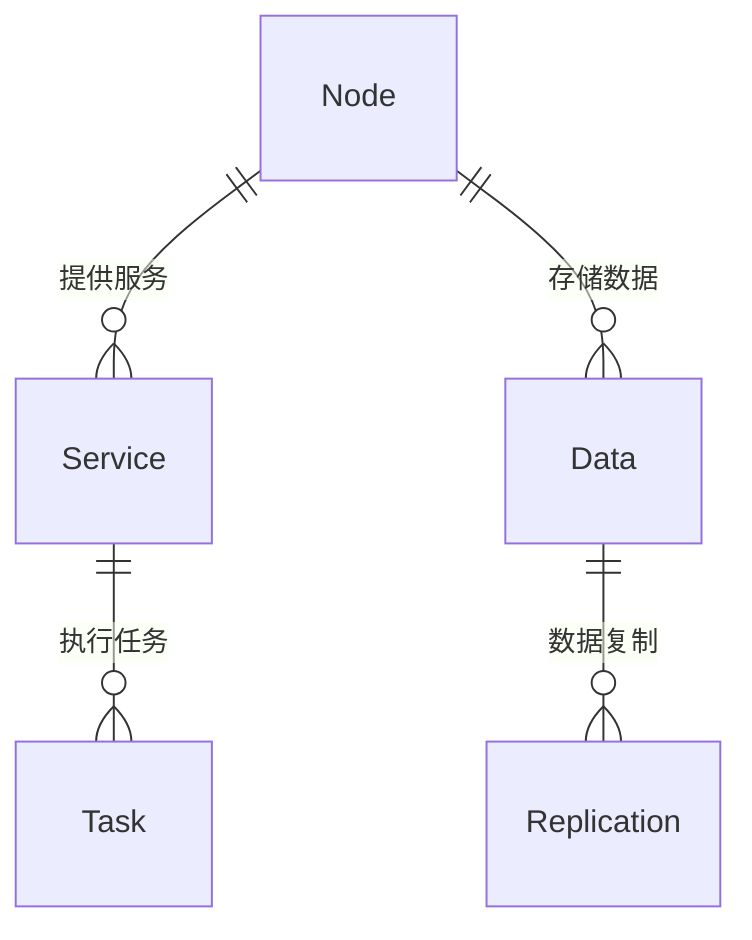
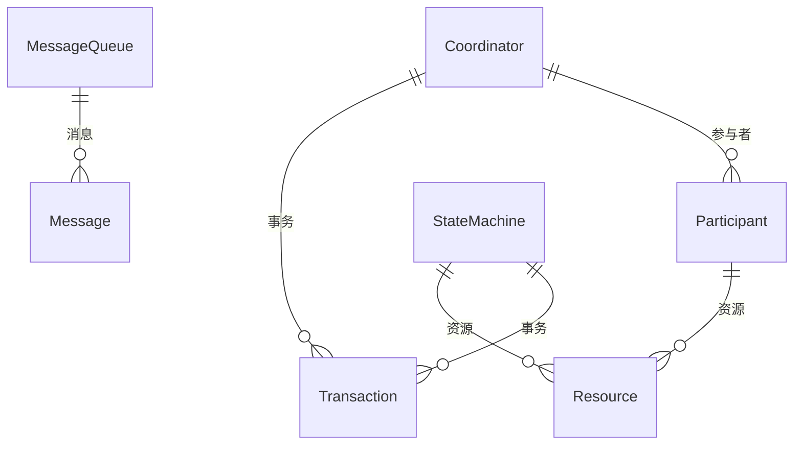
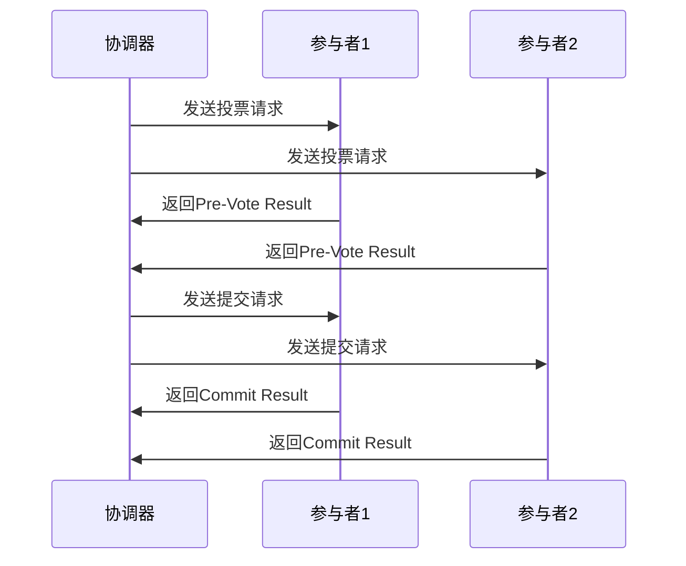
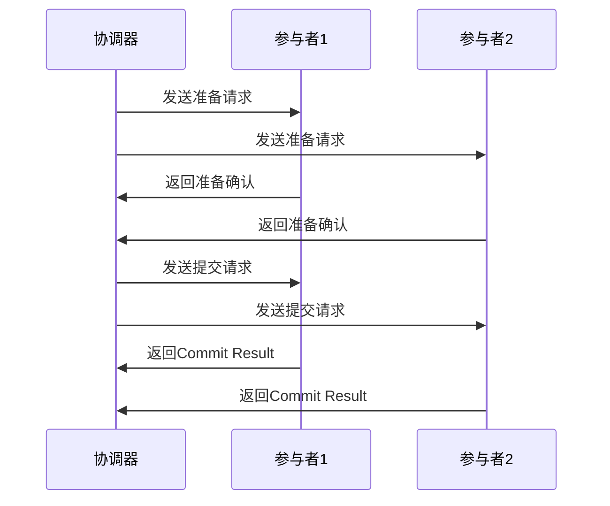
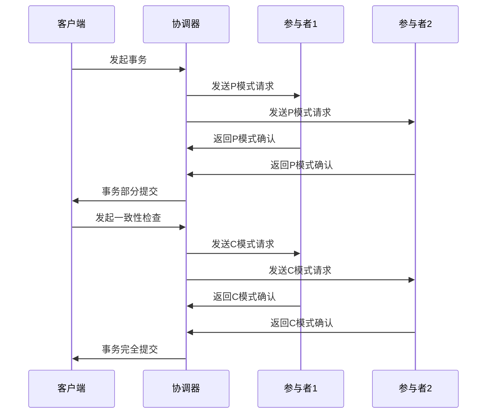
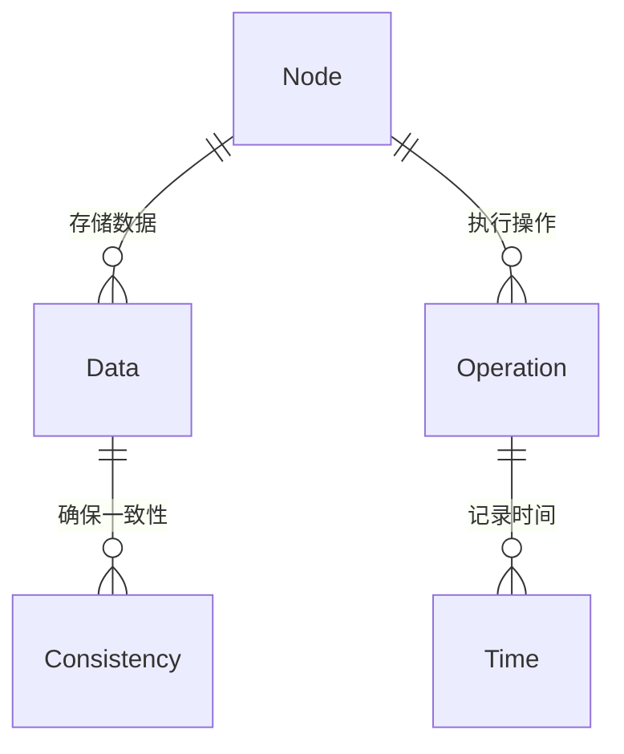
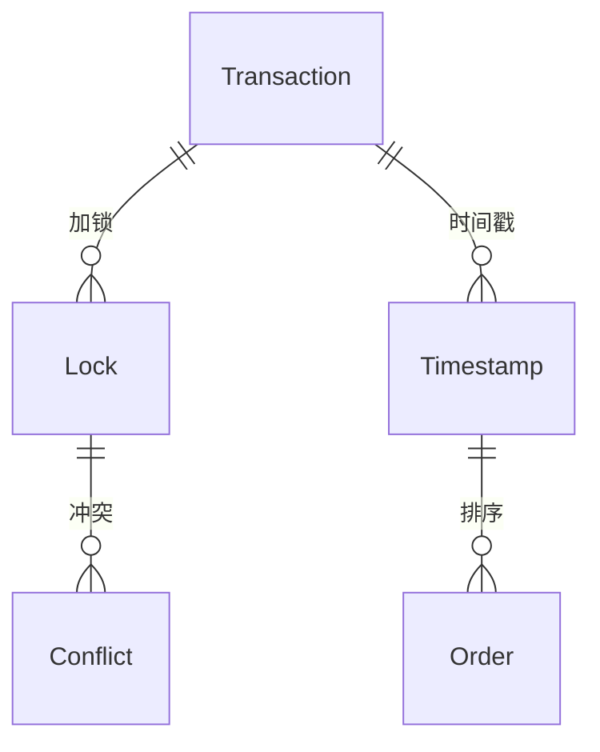
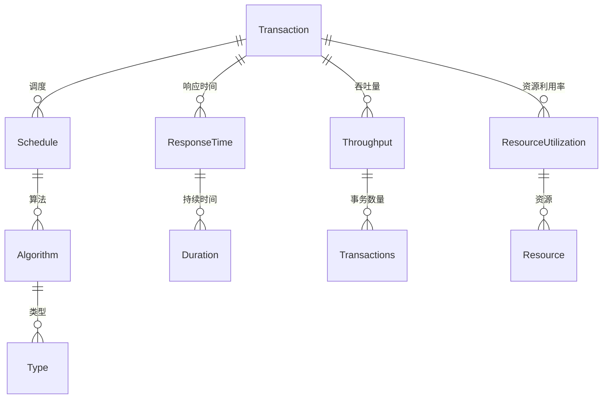
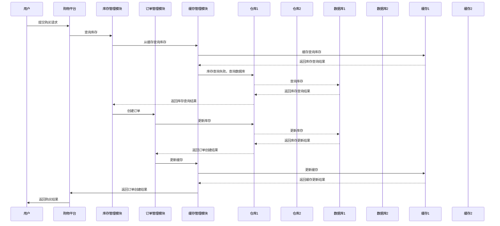
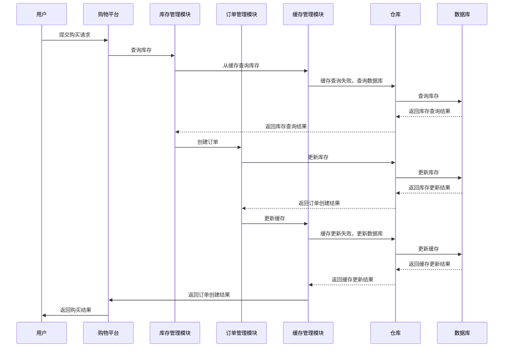

                 


### 1.1.1 问题背景

在分布式系统中，由于系统的分散性和并发性，事务的一致性问题变得尤为复杂。分布式事务是指在分布式系统中，多个操作需要作为一个整体执行，以保证数据的完整性和一致性。然而，分布式事务面临着与传统单机事务不同的挑战，如网络延迟、节点故障、数据不一致等问题。这些问题需要通过合理的设计和处理策略来解决。

首先，我们需要了解分布式事务的定义和特点。分布式事务是指在分布式系统中，多个操作需要作为一个整体执行，以保证数据的完整性和一致性。与传统单机事务相比，分布式事务涉及多个节点，这些节点可能分布在不同的物理位置，通过网络进行通信。分布式事务的主要特点是分布式性、并发性和容错性。

接下来，我们来看一下分布式事务面临的挑战。首先，网络延迟可能导致事务执行时间的不确定性，从而影响事务的执行顺序和一致性。其次，节点故障可能导致事务无法完成，需要重新执行。此外，分布式系统中多个节点的并发操作可能导致数据不一致，需要通过一致性协议来保证数据的一致性。

为了解决分布式事务的一致性问题，我们需要采用合适的分布式事务处理策略。这些策略包括两阶段提交协议、三阶段提交协议、PACELC模型等。这些策略通过不同的方式，确保分布式事务的一致性和可靠性。

最后，我们还需要了解分布式事务的边界和核心要素。分布式事务的边界主要涉及事务的范围和影响，即哪些操作需要纳入事务的范畴。分布式事务的核心要素包括一致性、并发控制、容错性等，这些要素共同决定了分布式事务的处理策略和性能。

综上所述，分布式事务在分布式系统中的应用具有重要意义，但同时也面临着一系列挑战。通过合理的设计和处理策略，我们可以有效地解决分布式事务的一致性问题，确保系统的稳定性和可靠性。

### 1.1.2 分布式事务的定义

分布式事务是指在分布式系统中，多个操作需要作为一个整体执行，以保证数据的完整性和一致性。分布式事务涉及多个节点，这些节点可能分布在不同的物理位置，通过网络进行通信。分布式事务的主要特点是分布式性、并发性和容错性。

首先，分布式事务的分布式性体现在事务涉及多个节点，这些节点可能位于不同的地理位置。这种分布式性使得系统具有更好的可扩展性和容错性，但也带来了更高的复杂度。由于节点之间的通信可能存在网络延迟和故障，因此分布式事务需要考虑如何保证事务的执行顺序和一致性。

其次，分布式事务的并发性体现在多个事务可能同时访问同一组数据。这种并发性可能导致数据不一致，需要通过并发控制机制来协调多个事务的执行。并发控制机制可以采用锁机制、时间戳机制、乐观并发控制等策略，以确保事务的执行不会导致数据不一致。

最后，分布式事务的容错性体现在系统在遇到节点故障时，仍能保证事务的执行。分布式事务需要具备故障恢复机制，以便在节点故障时，重新执行事务，保证数据的一致性。容错性是分布式系统的重要特性，可以提高系统的稳定性和可靠性。

与传统单机事务相比，分布式事务具有以下特点：

1. **分布式性**：传统单机事务仅涉及单个服务器，而分布式事务涉及多个服务器，具有更好的扩展性和容错性。
2. **并发性**：传统单机事务通常不会遇到并发访问问题，而分布式事务可能涉及多个节点同时访问同一组数据，需要解决并发控制问题。
3. **一致性**：分布式事务需要解决跨节点数据的一致性问题，比单机事务更复杂。
4. **网络延迟**：分布式事务需要通过网络进行通信，网络延迟可能导致事务执行时间的不确定性。

总之，分布式事务在分布式系统中具有重要作用，但同时也面临着一系列挑战。通过合理的设计和处理策略，我们可以有效地解决分布式事务的一致性问题，确保系统的稳定性和可靠性。

### 1.1.3 分布式事务的挑战

分布式事务在分布式系统中面临诸多挑战，其中最显著的是数据不一致性、节点故障和网络延迟。这些问题可能导致分布式事务无法保证数据完整性和一致性，从而影响系统的稳定性和可靠性。

首先，数据不一致性是分布式事务面临的一个重大挑战。由于分布式系统中的节点可能同时访问同一组数据，且这些节点的操作可能存在不同的顺序，导致数据状态不一致。例如，在一个涉及两个节点的分布式事务中，节点A先更新了数据，节点B后更新了数据，但两个更新操作没有按正确的顺序执行，可能导致数据不一致。解决数据不一致性问题的关键是确保分布式事务的一致性，这需要采用合适的一致性协议和分布式锁机制。

其次，节点故障也是分布式事务面临的挑战之一。分布式系统中的节点可能因为硬件故障、软件错误或网络问题而无法正常工作。当节点故障时，分布式事务可能无法完成，需要重新执行。这可能导致事务的执行时间延长，降低系统的性能和效率。为了应对节点故障，分布式系统需要具备故障恢复机制，例如通过备份节点或重新启动节点来恢复事务执行。

网络延迟是另一个影响分布式事务执行的重要因素。在分布式系统中，节点之间的通信需要通过网络进行，网络延迟可能导致事务执行时间的不确定性。例如，当节点A需要访问节点B上的数据时，如果节点B处于网络另一端，网络延迟可能导致节点A无法立即获取所需数据，从而影响事务的执行。为了应对网络延迟，分布式系统可以采用缓存机制、预取数据等技术来减少网络延迟对事务执行的影响。

此外，分布式事务还面临其他挑战，如并发控制、数据分区和事务冲突等。并发控制需要确保多个事务同时访问数据时，不会导致数据不一致。数据分区是将数据分布在多个节点上，以提高系统性能。但数据分区可能导致事务需要访问多个节点，增加事务的复杂度。事务冲突是指多个事务同时访问同一组数据，可能导致数据不一致。解决事务冲突需要采用合适的并发控制机制和分布式锁机制。

综上所述，分布式事务在分布式系统中面临数据不一致性、节点故障和网络延迟等挑战。通过合理的设计和处理策略，可以有效地解决这些问题，确保分布式事务的一致性和可靠性。

### 1.1.4 边界与外延

分布式事务的边界与外延是理解其概念和功能的重要部分。首先，我们定义分布式事务的边界，即哪些操作应被视为事务的一部分。通常，分布式事务的边界包括所有与事务相关联的操作，无论这些操作发生在哪个节点上。这意味着，如果一个操作序列需要保证原子性、一致性、隔离性和持久性（ACID特性），那么它就应该被视为一个分布式事务的一部分。

边界定义清晰后，分布式事务的外延则指的是事务的影响范围。在分布式系统中，事务的影响范围可能跨越多个节点和数据库。这意味着，分布式事务不仅要处理单个节点的数据，还要协调多个节点之间的数据一致性。例如，一个分布式事务可能涉及到将资金从一个账户转移到另一个账户，这个操作需要同时更新两个账户的余额，以确保最终的一致性。

分布式事务的边界与外延还涉及以下关键方面：

1. **事务范围**：分布式事务的范围定义了哪些操作应被视为事务的一部分。这通常由开发者根据业务需求进行定义，例如跨数据库的转账操作、订单处理等。

2. **一致性协议**：分布式事务的一致性协议决定了如何在分布式系统中确保事务的最终一致性。常见的一致性协议包括两阶段提交（2PC）、三阶段提交（3PC）和PACELC模型等。

3. **并发控制**：分布式事务的并发控制机制用于管理多个并发事务的执行顺序，以避免数据冲突和一致性问题。常见的并发控制机制包括锁机制、时间戳机制和乐观并发控制等。

4. **故障处理**：分布式事务的故障处理策略用于处理事务执行过程中可能出现的节点故障。这通常涉及故障检测、恢复和重试机制。

5. **分布式锁**：分布式锁是用于控制分布式系统中多个事务对共享资源的访问，以避免数据冲突。常见的分布式锁机制包括基于数据库的锁、基于缓存的服务和基于分布式锁框架的锁。

6. **数据复制与同步**：分布式事务需要处理数据复制与同步问题，以确保在分布式系统中多个节点上的数据保持一致性。常见的数据复制策略包括主从复制、多主复制和一致性哈希等。

通过理解分布式事务的边界与外延，开发者可以更好地设计分布式系统的架构，确保事务的一致性和可靠性。这有助于构建高可用、高扩展性的分布式系统，以满足现代业务需求。

### 1.1.5 概念结构与核心要素组成

分布式事务的概念结构主要包括分布式系统、事务、分布式事务模型等。这些核心概念和要素共同决定了分布式事务的处理策略和性能。

首先，我们来看分布式系统的定义。分布式系统是由多个相互独立但又协同工作的计算机节点组成的系统。这些节点通过网络连接，共同完成特定的任务。分布式系统的核心特点是分布式性、并发性和容错性。分布式系统允许数据和服务在多个节点之间分布，从而提高系统的可用性和性能。

接下来是事务的定义。事务是一个操作序列，这些操作要么全部执行，要么全部不执行。事务具有原子性、一致性、隔离性和持久性（ACID）的特点。原子性确保事务的操作要么全部执行，要么全部不执行；一致性确保事务执行后，数据状态符合预期的约束条件；隔离性确保并发执行的事务不会相互干扰；持久性确保事务一旦提交，其结果将永久保存。

最后是分布式事务模型。分布式事务模型包括基于单点协调器的模型、基于消息队列的模型、基于状态机的模型等。这些模型通过不同的方式，实现分布式事务的一致性和可靠性。基于单点协调器的模型，如两阶段提交协议，通过一个中心化的协调器来管理事务的执行。基于消息队列的模型，如消息驱动架构，通过消息队列来传递事务的指令，实现分布式事务的执行。基于状态机的模型，如Chubby锁服务，通过状态机来管理事务的状态和执行。

核心要素包括：

1. **一致性**：确保分布式事务中的数据在多个节点之间保持一致性。常见的一致性协议包括两阶段提交协议、PACELC模型等。
2. **并发控制**：管理多个并发事务的执行，以避免数据冲突和一致性问题。常见的方法包括锁机制、时间戳机制、乐观并发控制等。
3. **容错性**：确保分布式事务在遇到节点故障时，仍能保持数据的完整性和一致性。常见的容错方法包括故障检测、恢复和重试机制。
4. **分布式锁**：用于控制分布式系统中多个事务对共享资源的访问，以避免数据冲突。常见的方法包括基于数据库的锁、基于缓存的服务、基于分布式锁框架的锁等。
5. **数据复制与同步**：确保在分布式系统中多个节点上的数据保持一致性。常见的方法包括主从复制、多主复制、一致性哈希等。

通过理解分布式事务的概念结构及其核心要素，开发者可以更好地设计分布式系统的架构，确保事务的一致性和可靠性。这有助于构建高可用、高扩展性的分布式系统，以满足现代业务需求。

## 第2章: 核心概念

### 2.1.1 分布式系统

分布式系统是由多个相互独立但又协同工作的计算机节点组成的系统。这些节点通过网络连接，共同完成特定的任务。分布式系统的核心特点是分布式性、并发性和容错性。

首先，分布式系统的分布式性体现在数据和服务在多个节点之间的分布。这种分布式性可以提高系统的可用性和性能，因为当一个节点出现故障时，其他节点可以继续提供服务。此外，分布式系统还允许数据和服务根据需求进行扩展，从而提高系统的可扩展性。

其次，分布式系统的并发性体现在多个事务或操作可以同时访问同一组数据。这种并发性可以显著提高系统的性能，但同时也带来了数据一致性的挑战。为了解决并发访问导致的数据不一致问题，分布式系统需要采用并发控制机制，如锁机制、时间戳机制和乐观并发控制等。

最后，分布式系统的容错性是指系统在遇到节点故障时，仍能保持数据的完整性和一致性。为了实现容错性，分布式系统通常采用多种故障检测和恢复机制，如心跳检测、故障转移和重新启动等。此外，分布式系统还可以通过数据复制和备份来提高数据的可靠性和容错性。

以下是一个简单的分布式系统的ER实体关系图，展示了分布式系统中的核心实体和关系：



在这个ER实体关系图中：

- **Node**：代表分布式系统中的节点，可以是物理服务器或虚拟机。
- **Service**：代表节点上提供的服务，如数据库、缓存或应用服务器。
- **Task**：代表节点上执行的任务，如数据处理或日志分析。
- **Data**：代表存储在节点上的数据，可以是一份数据或数据的一部分。
- **Replication**：代表数据复制机制，用于确保数据在多个节点之间保持一致性。

通过这个ER实体关系图，我们可以更好地理解分布式系统的核心概念和组成。

### 2.1.2 事务

事务是一个操作序列，这些操作要么全部执行，要么全部不执行。事务具有原子性、一致性、隔离性和持久性（ACID）的特点。

首先，原子性（Atomicity）确保事务的操作要么全部执行，要么全部不执行。这意味着，如果一个事务在执行过程中遇到错误，所有已执行的操作都将回滚，以确保数据的一致性。原子性是事务的核心特性，它保证了事务的不可分割性。

其次，一致性（Consistency）确保事务执行后，数据状态符合预期的约束条件。一致性约束可以是数据库的完整性约束、业务规则或其他逻辑约束。一致性确保数据在事务执行过程中保持有效和合理的状态。

接下来是隔离性（Isolation），它确保并发执行的事务不会相互干扰。这意味着，一个事务在执行过程中，其他事务对其数据不可见，从而避免数据冲突和一致性问题。隔离性通常通过锁机制、时间戳机制和乐观并发控制等策略实现。

最后是持久性（Durability），它确保事务一旦提交，其结果将永久保存，即使系统在事务提交后发生故障。持久性通过将事务结果写入持久化存储，如数据库或文件系统，来实现。

以下是一个简单的事务处理流程：

1. **开始事务**：事务开始时，系统会将当前事务的状态保存到一个事务日志中。
2. **执行操作**：事务执行一系列操作，如更新数据库、写入缓存等。
3. **提交事务**：事务执行完成后，系统会将事务日志中的操作应用到实际数据中，并更新事务状态。
4. **回滚事务**：如果事务在执行过程中遇到错误，系统会回滚已执行的操作，并将事务状态恢复到开始时的状态。

通过这个简单的流程，我们可以更好地理解事务的基本概念和处理流程。

### 2.1.3 分布式事务模型

分布式事务模型包括基于单点协调器的模型、基于消息队列的模型和基于状态机的模型。这些模型通过不同的方式，实现分布式事务的一致性和可靠性。

首先，基于单点协调器的模型，如两阶段提交协议（2PC），通过一个中心化的协调器来管理事务的执行。协调器负责协调多个节点的操作，确保事务的一致性。两阶段提交协议将事务的执行分为两个阶段：投票阶段和提交/回滚阶段。在投票阶段，协调器向所有参与者节点发送投票请求，参与者节点根据本地数据的状态决定投票结果。在提交/回滚阶段，协调器根据投票结果决定是否提交事务。

接下来，基于消息队列的模型，如消息驱动架构，通过消息队列来传递事务的指令，实现分布式事务的执行。消息队列充当异步通信中介，确保事务的执行顺序和一致性。在消息驱动架构中，事务被分解为多个消息，每个消息表示事务的一部分。这些消息被发送到消息队列，然后按顺序处理。如果处理过程中遇到错误，可以重试消息，确保事务的最终一致性。

最后，基于状态机的模型，如Chubby锁服务，通过状态机来管理事务的状态和执行。Chubby锁服务是一种分布式锁服务，用于协调多个事务对共享资源的访问。事务通过状态机转换，实现事务的提交、回滚和恢复。状态机模型具有高效、灵活的特点，可以适应不同的业务场景。

以下是一个简单的分布式事务模型ER实体关系图，展示了分布式事务模型中的核心实体和关系：



在这个ER实体关系图中：

- **Coordinator**：代表事务协调器，负责协调分布式事务的执行。
- **Participant**：代表参与者节点，负责执行事务的操作。
- **Transaction**：代表分布式事务，包括事务的ID、状态和操作等信息。
- **Resource**：代表分布式事务中的资源，如数据库、缓存等。
- **MessageQueue**：代表消息队列，用于传递事务的指令。
- **Message**：代表消息，包括消息的ID、内容和状态等信息。
- **StateMachine**：代表状态机，用于管理事务的状态和转换。

通过这个ER实体关系图，我们可以更好地理解分布式事务模型的核心概念和组成。

## 第3章: 算法原理讲解

### 3.1.1 两阶段提交协议

两阶段提交协议（2PC，Two-Phase Commit Protocol）是一种分布式事务处理协议，用于协调多个节点上的事务，确保事务的一致性和可靠性。两阶段提交协议将事务的提交过程分为两个阶段：投票阶段和提交/回滚阶段。

#### 工作原理

1. **投票阶段**：
   - 事务协调器（Coordinator）向所有参与者节点（Participant）发送投票请求（Vote Request）。
   - 参与者节点根据本地数据的状态，决定是否同意投票（Vote）。如果参与者节点发现本地数据已发生变化或无法继续执行，则会拒绝投票。
   - 参与者节点将投票结果（Pre-Vote Result）返回给协调器。

2. **提交/回滚阶段**：
   - 协调器根据参与者节点的投票结果，决定是否提交事务。如果所有参与者节点都同意投票，协调器将发送提交请求（Commit Request）给参与者节点，指示提交事务。
   - 参与者节点收到提交请求后，执行事务的提交操作，并将提交结果（Commit Result）返回给协调器。
   - 如果协调器收到所有参与者节点的提交结果，事务将被提交，否则，协调器将发送回滚请求（Abort Request），指示参与者节点回滚事务。

#### 优缺点

**优点**：
- 两阶段提交协议简单易理解，易于实现。
- 两阶段提交协议能够确保分布式事务的一致性。

**缺点**：
- 两阶段提交协议可能引入协调器单点故障的风险。
- 两阶段提交协议可能产生较长的执行延迟，降低系统的性能。

#### 两阶段提交协议的流程

以下是一个两阶段提交协议的流程图，展示了事务协调器和参与者节点之间的交互过程：



在这个流程图中：

- 协调器向参与者节点发送投票请求，参与者节点返回Pre-Vote Result。
- 协调器根据参与者节点的投票结果，决定是否发送提交请求。
- 参与者节点收到提交请求后，执行事务的提交操作，并返回Commit Result。

通过这个流程图，我们可以更清晰地理解两阶段提交协议的工作原理和执行过程。

### 3.1.2 三阶段提交协议

三阶段提交协议（3PC，Three-Phase Commit Protocol）是对两阶段提交协议的改进，旨在解决两阶段提交协议中协调器单点故障的问题。三阶段提交协议将事务的提交过程分为三个阶段：准备阶段、提交阶段和确认阶段。

#### 工作原理

1. **准备阶段**：
   - 协调器向所有参与者节点发送准备请求（Prepare Request）。
   - 参与者节点根据本地数据的状态，决定是否同意准备。如果参与者节点同意准备，则会向协调器发送准备确认（Prepare Acknowledgment）。

2. **提交阶段**：
   - 如果协调器收到所有参与者节点的准备确认，则向参与者节点发送提交请求（Commit Request），指示参与者节点提交事务。
   - 如果协调器在准备阶段没有收到所有参与者节点的准备确认，则向参与者节点发送回滚请求（Abort Request），指示参与者节点回滚事务。

3. **确认阶段**：
   - 参与者节点收到提交请求或回滚请求后，执行相应操作，并返回确认结果（Commit Result 或 Abort Result）。
   - 如果协调器收到所有参与者节点的确认结果，则事务将被提交或回滚。

#### 优缺点

**优点**：
- 三阶段提交协议解决了协调器单点故障的问题，提高了系统的可用性。
- 三阶段提交协议减少了参与者节点的等待时间，提高了系统的性能。

**缺点**：
- 三阶段提交协议增加了系统的复杂性，需要更多的时间和资源来处理。
- 三阶段提交协议可能产生较长的执行延迟，降低系统的性能。

#### 三阶段提交协议的流程

以下是一个三阶段提交协议的流程图，展示了事务协调器和参与者节点之间的交互过程：



在这个流程图中：

- 协调器向参与者节点发送准备请求，参与者节点返回准备确认。
- 协调器根据参与者节点的准备确认，决定是否发送提交请求。
- 参与者节点收到提交请求后，执行事务的提交操作，并返回Commit Result。

通过这个流程图，我们可以更清晰地理解三阶段提交协议的工作原理和执行过程。

### 3.1.3 PACELC模型

PACELC模型（Performance vs. Availability and Consistency Trade-offs）是一种分布式事务处理模型，用于在不同场景下平衡性能、可用性和一致性。PACELC模型基于对性能和一致性的权衡，提供了不同的策略来处理分布式事务。

#### 工作原理

PACELC模型将分布式事务处理分为两个主要模式：P模式（性能模式）和C模式（一致性模式）。

1. **P模式（性能模式）**：
   - P模式侧重于提高系统的性能和吞吐量，牺牲一致性。
   - 在P模式中，事务可以部分提交，即只有一部分参与者节点完成提交操作，而另一部分参与者节点可能还在等待中。
   - P模式适用于那些对一致性要求较低的场景，如读写分离的数据库或缓存系统。

2. **C模式（一致性模式）**：
   - C模式侧重于确保分布式事务的一致性，牺牲性能。
   - 在C模式中，事务必须完全提交，即所有参与者节点都完成提交操作。
   - C模式适用于那些对数据一致性要求较高的场景，如金融交易系统或订单处理系统。

PACELC模型的核心思想是在性能和一致性之间进行权衡，根据不同的应用场景选择合适的模式。

#### 优缺点

**优点**：
- PACELC模型提供了灵活的事务处理策略，可以根据不同的场景需求调整性能和一致性之间的平衡。
- PACELC模型能够提高系统的性能，特别是在那些对一致性要求不高的场景。

**缺点**：
- PACELC模型可能在一致性模式下引入一定的性能开销，特别是在高并发场景下。
- PACELC模型需要开发者对不同的场景进行深入分析，以选择合适的事务处理模式。

#### PACELC模型的流程

以下是一个PACELC模型的流程图，展示了性能模式和一致性模式之间的切换：



在这个流程图中：

- 客户端发起事务，协调器根据性能模式（P模式）发送请求给参与者节点。
- 参与者节点返回P模式确认，事务部分提交。
- 客户端发起一致性检查，协调器根据一致性模式（C模式）发送请求给参与者节点。
- 参与者节点返回C模式确认，事务完全提交。

通过这个流程图，我们可以更清晰地理解PACELC模型的工作原理和执行过程。

## 第4章: 数学模型与公式讲解

### 4.1.1 一致性

一致性是分布式系统中确保多个节点上的数据保持一致性的重要属性。一致性可以分为多个层次，每种层次都有其特定的数学模型和约束条件。

#### 定义

一致性是指分布式系统中的多个节点在执行事务后，最终能够达到一种全局一致的状态。一致性通常通过一致性协议和算法来实现。

#### 分类

1. **强一致性（Strong Consistency）**：
   - 强一致性要求分布式系统中的所有节点在执行事务后，能够立即看到全局一致的状态。
   - 数学模型：$$T(x) = T'(x)$$，其中T和T'分别表示分布式系统中的不同节点对变量x的操作。
   - 约束条件：分布式系统中的所有操作必须遵循顺序一致性（Serializability）原则，即所有操作的结果必须与某个串行执行序列相同。

2. **最终一致性（ eventual consistency）**：
   - 最终一致性要求分布式系统中的多个节点在一段时间后，能够达到一种全局一致的状态。
   - 数学模型：$$\lim_{t\to\infty} T(x) = T'(x)$$，其中t表示时间。
   - 约束条件：分布式系统中的操作可以是并发执行的，但最终会达到一致性状态。实现最终一致性的常见算法包括Gossip协议和Paxos算法。

3. **因果一致性（ causal consistency）**：
   - 因果一致性要求分布式系统中的多个节点在执行事务后，能够保持操作之间的因果关系。
   - 数学模型：如果操作A在时间t1之前发生，操作B在时间t2之后发生，那么A的执行结果必须先于B的执行结果。
   - 约束条件：分布式系统中的操作必须遵循因果关系，即因果相关的操作必须按照时间顺序执行。

#### 对比表格

| 一致性层次 | 数学模型 | 约束条件 |
| :--: | :--: | :--: |
| 强一致性 | $$T(x) = T'(x)$$ | 遵循顺序一致性原则 |
| 最终一致性 | $$\lim_{t\to\infty} T(x) = T'(x)$$ | 并发操作最终达到一致性 |
| 因果一致性 | 因果关系 | 保持操作之间的因果关系 |

#### ER实体关系图

以下是一个关于一致性的ER实体关系图，展示了分布式系统中的核心实体和关系：



在这个ER实体关系图中：

- **Node**：代表分布式系统中的节点，包括物理服务器或虚拟机。
- **Data**：代表存储在节点上的数据。
- **Operation**：代表执行的操作，如读、写等。
- **Consistency**：代表一致性，确保分布式系统中的数据保持一致性。
- **Time**：记录每个操作的时间，用于实现时间一致性。

通过这个ER实体关系图，我们可以更好地理解一致性的核心概念和实现机制。

### 4.1.2 可串行化

可串行化是分布式事务处理中的一个重要概念，它确保多个并发执行的事务最终能够达到与某个串行执行序列相同的结果。可串行化可以通过数学模型和算法来实现。

#### 定义

可串行化是指多个事务的执行结果，与这些事务按照某种顺序串行执行的结果相同。换句话说，如果多个事务的执行顺序对最终结果没有影响，那么这些事务是可串行化的。

#### 数学模型

1. **串行执行**：
   - 假设有n个事务T1, T2, ..., Tn，它们的执行序列可以表示为T1[T2, T3, ..., Tn]。
   - 串行执行是指在单个处理器上，事务按照特定的顺序依次执行，即T1执行完成后，再执行T2，以此类推。

2. **可串行化**：
   - 可串行化是指多个事务的执行结果，与这些事务按照某种顺序串行执行的结果相同。
   - 数学模型：设Ti和Tj为两个并发执行的事务，如果Ti和Tj的执行结果相同，且它们的执行顺序可以交换，即Ti[Tj, T3, ..., Tn]的结果与Tj[Ti, T3, ..., Tn]的结果相同，则这些事务是可串行化的。

3. **可串行化条件**：
   - 顺序一致性（Serializability）条件：如果多个事务的执行结果与某个串行执行序列相同，则这些事务是可串行化的。
   - 可交换性（Conflict Serializability）条件：如果多个事务的执行结果与某个冲突串行执行序列相同，则这些事务是可串行化的。

#### 算法

1. **两阶段锁协议**：
   - 两阶段锁协议是一种并发控制算法，用于确保分布式事务的可串行化。
   - 算法步骤：
     1. 事务在执行前获取所有需要的锁。
     2. 事务在执行过程中持有锁，直到完成所有操作。
     3. 事务释放所有持有的锁。
   - 两阶段锁协议可以避免冲突，确保事务的可串行化。

2. **时间戳协议**：
   - 时间戳协议是一种基于时间戳的并发控制算法，用于确保分布式事务的可串行化。
   - 算法步骤：
     1. 给每个事务分配一个唯一的时间戳。
     2. 根据时间戳对事务进行排序，优先执行时间戳较小的事务。
     3. 如果事务之间存在冲突，则阻塞时间戳较大的事务，直到冲突解决。
   - 时间戳协议可以避免冲突，确保事务的可串行化。

#### ER实体关系图

以下是一个关于可串行化的ER实体关系图，展示了分布式系统中的核心实体和关系：



在这个ER实体关系图中：

- **Transaction**：代表分布式事务，包括事务的ID、操作和状态。
- **Lock**：代表锁，用于控制事务对共享资源的访问。
- **Timestamp**：代表时间戳，用于事务排序和冲突解决。
- **Conflict**：代表事务之间的冲突，用于冲突检测和解决。
- **Order**：代表事务的执行顺序，用于实现可串行化。

通过这个ER实体关系图，我们可以更好地理解可串行化的核心概念和实现机制。

### 4.1.3 事务调度

事务调度是分布式系统中一个重要的概念，它决定了事务的执行顺序和并发控制。事务调度可以通过不同的算法和策略来实现。

#### 定义

事务调度是指分布式系统中的多个事务在执行过程中的顺序安排。事务调度旨在优化系统的性能和资源利用率，同时确保事务的原子性、一致性和隔离性。

#### 算法

1. **先来先服务（FCFS）**：
   - 先来先服务是最简单的事务调度算法，按照事务到达的顺序进行执行。
   - 算法步骤：
     1. 按照事务到达的时间排序。
     2. 按顺序执行事务。

2. **最短作业优先（SJF）**：
   - 最短作业优先是一种基于事务执行时间的事务调度算法，优先执行预计执行时间最短的事务。
   - 算法步骤：
     1. 计算每个事务的预计执行时间。
     2. 按预计执行时间排序。
     3. 按顺序执行事务。

3. **优先级调度**：
   - 优先级调度是一种基于事务优先级的事务调度算法，优先执行优先级较高的事务。
   - 算法步骤：
     1. 给每个事务分配一个优先级。
     2. 按优先级排序。
     3. 按顺序执行事务。

4. **时间戳调度**：
   - 时间戳调度是一种基于事务时间戳的事务调度算法，优先执行时间戳较小的事务。
   - 算法步骤：
     1. 给每个事务分配一个时间戳。
     2. 按时间戳排序。
     3. 按顺序执行事务。

5. **两阶段锁调度**：
   - 两阶段锁调度是一种基于两阶段锁协议的事务调度算法，优先执行锁申请最早的事务。
   - 算法步骤：
     1. 事务在执行前申请所有需要的锁。
     2. 按锁申请时间排序。
     3. 按顺序执行事务。

#### 性能分析

事务调度的性能分析主要涉及响应时间、吞吐量和资源利用率等方面。

1. **响应时间**：
   - 响应时间是指事务从提交到完成所需的时间。响应时间越短，系统的性能越好。

2. **吞吐量**：
   - 吞吐量是指单位时间内系统能处理的事务数量。吞吐量越高，系统的性能越好。

3. **资源利用率**：
   - 资源利用率是指系统中资源的利用程度。资源利用率越高，系统的性能越好。

不同的事务调度算法在不同场景下可能具有不同的性能表现。例如，在低并发场景下，先来先服务和最短作业优先可能效果较好；在高并发场景下，优先级调度和时间戳调度可能更有效。

#### ER实体关系图

以下是一个关于事务调度的ER实体关系图，展示了分布式系统中的核心实体和关系：



在这个ER实体关系图中：

- **Transaction**：代表分布式事务，包括事务的ID、操作和状态。
- **Schedule**：代表事务调度，包括调度策略和算法。
- **ResponseTime**：代表事务的响应时间。
- **Throughput**：代表事务的吞吐量。
- **ResourceUtilization**：代表系统的资源利用率。
- **Algorithm**：代表事务调度算法，包括算法类型和实现。
- **Type**：代表算法的类型，如先来先服务、最短作业优先等。
- **Duration**：代表事务的响应时间持续时间。
- **Transactions**：代表单位时间内的事务数量。
- **Resource**：代表系统中的资源，如CPU、内存等。

通过这个ER实体关系图，我们可以更好地理解事务调度的核心概念和实现机制。

## 第5章: 系统分析与架构设计方案

### 5.1.1 问题场景介绍

在实际应用中，分布式事务通常出现在需要跨多个节点或数据库进行数据操作的场景中。以下是一个典型的分布式事务应用场景：

假设有一个在线购物平台，用户可以在多个仓库中查看商品库存，并在其中一个仓库中进行下单购买。当用户下单购买商品时，需要同时更新多个数据库或缓存中的库存信息，以确保最终的一致性。这个过程涉及到分布式事务的处理，需要解决跨节点数据一致性问题。

在这个场景中，我们可以定义以下核心概念和参与者：

1. **用户**：用户是分布式事务的发起者，向系统提交购买请求。
2. **购物平台**：购物平台是分布式系统的核心，负责处理用户的购买请求，协调多个节点的操作。
3. **仓库**：仓库是分布式系统中的节点，存储商品的库存信息，负责处理购物平台的请求。
4. **数据库**：数据库是分布式系统中的数据存储，用于存储商品的库存信息和订单信息。
5. **缓存**：缓存是分布式系统中的高速缓存，用于加速数据的读取操作。

### 5.1.2 系统功能设计

在分布式事务场景中，系统需要实现以下功能：

1. **用户接口**：提供一个友好的用户界面，让用户能够方便地提交购买请求。
2. **事务管理**：负责处理分布式事务的协调和管理，确保跨节点数据的一致性。
3. **库存管理**：负责管理商品的库存信息，包括查看库存、更新库存等操作。
4. **订单管理**：负责管理订单信息，包括创建订单、更新订单状态等操作。
5. **缓存管理**：负责管理缓存中的数据，确保缓存与数据库的数据一致性。

#### 领域模型

以下是一个关于分布式事务场景的领域模型，展示了系统中的核心实体和关系：

```mermaid
classDiagram
  User <<--|{发起请求}| ShoppingPlatform
  ShoppingPlatform <|-- InventoryManagement
  ShoppingPlatform <|-- OrderManagement
  ShoppingPlatform <|-- CacheManagement
  InventoryManagement ||--|{管理库存}| Inventory
  InventoryManagement ||--|{更新库存}| Warehouse
  OrderManagement ||--|{创建订单}| Order
  CacheManagement ||--|{缓存管理}| Cache
```

在这个领域模型中：

- **User**：代表用户，是事务的发起者。
- **ShoppingPlatform**：代表购物平台，负责处理用户请求，协调分布式事务。
- **InventoryManagement**：代表库存管理模块，负责管理商品的库存信息。
- **OrderManagement**：代表订单管理模块，负责管理订单信息。
- **CacheManagement**：代表缓存管理模块，负责管理缓存中的数据。
- **Inventory**：代表库存信息，存储商品的库存数量。
- **Warehouse**：代表仓库，存储商品的库存信息，负责处理购物平台的请求。
- **Order**：代表订单信息，存储订单的详细信息。
- **Cache**：代表缓存，存储商品的库存信息，用于加速数据的读取操作。

### 5.1.3 系统架构设计

在分布式事务场景中，系统架构设计需要考虑分布式性、并发性和容错性等因素。以下是一个关于分布式事务场景的系统架构设计：

#### 系统架构图



在这个系统架构图中：

- **User**：代表用户，向购物平台提交购买请求。
- **ShoppingPlatform**：代表购物平台，处理用户请求，协调分布式事务。
- **InventoryManagement**：代表库存管理模块，负责库存信息的查询和更新。
- **OrderManagement**：代表订单管理模块，负责订单信息的创建和更新。
- **CacheManagement**：代表缓存管理模块，负责缓存的管理和更新。
- **Warehouse1** 和 **Warehouse2**：代表两个仓库，存储商品的库存信息。
- **Database1** 和 **Database2**：代表两个数据库，存储商品的库存信息和订单信息。
- **Cache1** 和 **Cache2**：代表两个缓存，用于加速数据的读取操作。

### 5.1.4 系统接口设计

在分布式事务场景中，系统接口设计需要考虑如何协调不同模块之间的交互。以下是一个关于分布式事务场景的系统接口设计：

#### 接口设计

1. **用户接口**：
   - 接口名称：`createOrder`
   - 功能：创建订单
   - 参数：`userId`（用户ID），`productId`（商品ID），`quantity`（购买数量）
   - 返回值：`orderId`（订单ID）

2. **库存管理接口**：
   - 接口名称：`checkInventory`
   - 功能：查询库存
   - 参数：`productId`（商品ID）
   - 返回值：`quantity`（库存数量）

3. **订单管理接口**：
   - 接口名称：`updateOrderStatus`
   - 功能：更新订单状态
   - 参数：`orderId`（订单ID），`status`（订单状态）
   - 返回值：`true`（更新成功），`false`（更新失败）

4. **缓存管理接口**：
   - 接口名称：`cacheInventory`
   - 功能：缓存库存信息
   - 参数：`productId`（商品ID），`quantity`（库存数量）
   - 返回值：`true`（缓存成功），`false`（缓存失败）

5. **仓库接口**：
   - 接口名称：`updateInventory`
   - 功能：更新库存
   - 参数：`productId`（商品ID），`quantity`（库存数量）
   - 返回值：`true`（更新成功），`false`（更新失败）

6. **数据库接口**：
   - 接口名称：`queryInventory`
   - 功能：查询库存
   - 参数：`productId`（商品ID）
   - 返回值：`quantity`（库存数量）

通过这些接口设计，不同模块之间可以方便地进行数据交互和事务处理。

### 5.1.5 系统交互

在分布式事务场景中，系统交互需要考虑如何协调不同模块之间的协作。以下是一个关于分布式事务场景的系统交互设计：

#### 序列图



在这个序列图中：

- **User**：代表用户，向购物平台提交购买请求。
- **ShoppingPlatform**：代表购物平台，处理用户请求，协调分布式事务。
- **InventoryManagement**：代表库存管理模块，负责库存信息的查询和更新。
- **OrderManagement**：代表订单管理模块，负责订单信息的创建和更新。
- **CacheManagement**：代表缓存管理模块，负责缓存的管理和更新。
- **Warehouse**：代表仓库，存储商品的库存信息，负责处理库存查询和更新请求。
- **Database**：代表数据库，存储商品的库存信息和订单信息。

通过这个序列图，我们可以清晰地看到不同模块之间的交互过程和协作方式。

## 第6章: 项目实战

### 6.1.1 环境安装

为了演示分布式事务在实际应用中的处理策略，我们将使用一个简单的分布式系统，包括两个数据库节点和两个缓存节点。以下是在Linux环境中安装和配置分布式事务环境的步骤：

#### 安装数据库

1. **安装MySQL数据库**：

   - 首先，安装MySQL数据库：
     ```bash
     sudo apt-get update
     sudo apt-get install mysql-server
     ```

   - 启动MySQL服务：
     ```bash
     sudo systemctl start mysql
     ```

   - 设置MySQL服务开机自启：
     ```bash
     sudo systemctl enable mysql
     ```

2. **安装PostgreSQL数据库**：

   - 首先，安装PostgreSQL数据库：
     ```bash
     sudo apt-get update
     sudo apt-get install postgresql postgresql-contrib
     ```

   - 启动PostgreSQL服务：
     ```bash
     sudo systemctl start postgresql
     ```

   - 设置PostgreSQL服务开机自启：
     ```bash
     sudo systemctl enable postgresql
     ```

#### 安装缓存

1. **安装Redis缓存**：

   - 首先，安装Redis缓存：
     ```bash
     sudo apt-get update
     sudo apt-get install redis-server
     ```

   - 启动Redis服务：
     ```bash
     sudo systemctl start redis
     ```

   - 设置Redis服务开机自启：
     ```bash
     sudo systemctl enable redis
     ```

#### 安装分布式事务处理框架

1. **安装Spring Boot**：

   - 首先，安装Java环境（如果未安装）：
     ```bash
     sudo apt-get update
     sudo apt-get install openjdk-11-jdk
     ```

   - 安装Spring Boot：
     ```bash
     sudo apt-get update
     sudo apt-get install spring-boot
     ```

2. **安装分布式事务处理框架Seata**：

   - 首先，从GitHub下载Seata源代码：
     ```bash
     git clone https://github.com/seata/seata.git
     ```

   - 编译Seata源代码：
     ```bash
     cd seata
     mvn clean install
     ```

   - 将Seata依赖库添加到Spring Boot项目：
     ```bash
     cd seata/script
     sh ./setup.sh
     ```

   - 部署Seata服务：
     ```bash
     cd ..
     sh seata-server/bin/seata-server.sh -h 0.0.0.0 -p 8091 -m db
     ```

通过以上步骤，我们完成了分布式事务环境的安装和配置。接下来，我们将实现一个简单的分布式事务应用，用于演示分布式事务的处理策略。

### 6.1.2 系统核心实现

为了实现分布式事务应用，我们将使用Spring Boot框架，并结合Seata分布式事务处理框架，实现一个简单的购物系统。以下是在Spring Boot项目中添加分布式事务处理的核心步骤：

#### 添加依赖

在项目的`pom.xml`文件中，添加Spring Boot和Seata的依赖项：

```xml
<dependencies>
    <!-- Spring Boot Starter Web -->
    <dependency>
        <groupId>org.springframework.boot</groupId>
        <artifactId>spring-boot-starter-web</artifactId>
    </dependency>

    <!-- Spring Boot Starter Data JPA -->
    <dependency>
        <groupId>org.springframework.boot</groupId>
        <artifactId>spring-boot-starter-data-jpa</artifactId>
    </dependency>

    <!-- Seata Starter -->
    <dependency>
        <groupId>io.seata</groupId>
        <artifactId>seata-spring-boot-starter</artifactId>
        <version>1.4.2</version>
    </dependency>
</dependencies>
```

#### 配置文件

在项目的`application.yml`文件中，配置数据库、缓存和Seata的相关属性：

```yaml
spring:
  datasource:
    url: jdbc:mysql://localhost:3306/test_db
    username: root
    password: root

  jpa:
    hibernate:
      ddl-auto: update

  redis:
    host: localhost
    port: 6379

seata:
  enabled: true
  application-id: shopping-service
  registry:
    type: file
    file:
      name: file:/root/seata registry
  config:
    store:
      type: file
      file:
        name: file:/root/seata config
  service:
    vgroup-group: default_group
    enable: true
    check: false
```

#### 实体类

创建实体类`Product`和`Order`，分别表示商品和订单：

```java
@Entity
@Table(name = "products")
public class Product {

    @Id
    @GeneratedValue(strategy = GenerationType.IDENTITY)
    private Long id;

    @Column(name = "name", nullable = false)
    private String name;

    @Column(name = "quantity", nullable = false)
    private int quantity;

    // 省略 getter 和 setter 方法
}

@Entity
@Table(name = "orders")
public class Order {

    @Id
    @GeneratedValue(strategy = GenerationType.IDENTITY)
    private Long id;

    @Column(name = "user_id", nullable = false)
    private Long userId;

    @Column(name = "product_id", nullable = false)
    private Long productId;

    @Column(name = "quantity", nullable = false)
    private int quantity;

    // 省略 getter 和 setter 方法
}
```

#### 服务层

创建服务层接口`ProductService`和`OrderService`，分别负责商品和订单的管理：

```java
@Service
public class ProductService {

    @Autowired
    private ProductRepository productRepository;

    public Product getProductById(Long id) {
        return productRepository.findById(id).orElseThrow(() -> new RuntimeException("Product not found"));
    }

    public void updateProductQuantity(Long id, int quantity) {
        Product product = getProductById(id);
        product.setQuantity(quantity);
        productRepository.save(product);
    }
}

@Service
public class OrderService {

    @Autowired
    private OrderRepository orderRepository;

    public void createOrder(Long userId, Long productId, int quantity) {
        Order order = new Order();
        order.setUserId(userId);
        order.setProductId(productId);
        order.setQuantity(quantity);
        orderRepository.save(order);
    }
}
```

#### 控制层

创建控制层接口`ProductController`和`OrderController`，分别处理商品和订单的请求：

```java
@RestController
@RequestMapping("/products")
public class ProductController {

    @Autowired
    private ProductService productService;

    @GetMapping("/{id}")
    public Product getProductById(@PathVariable Long id) {
        return productService.getProductById(id);
    }

    @PutMapping("/{id}/quantity")
    public void updateProductQuantity(@PathVariable Long id, @RequestParam int quantity) {
        productService.updateProductQuantity(id, quantity);
    }
}

@RestController
@RequestMapping("/orders")
public class OrderController {

    @Autowired
    private OrderService orderService;

    @PostMapping("/{userId}/{productId}/quantity")
    public ResponseEntity<?> createOrder(@PathVariable Long userId, @PathVariable Long productId, @RequestParam int quantity) {
        orderService.createOrder(userId, productId, quantity);
        return ResponseEntity.ok("Order created successfully");
    }
}
```

#### 分布式事务处理

使用Seata分布式事务处理框架，确保商品和订单的创建操作在一个分布式事务中执行。在Spring Boot应用程序中，通过`@Transactional`注解来声明分布式事务：

```java
@Service
public class OrderService {

    @Autowired
    private OrderRepository orderRepository;

    @Transactional
    public void createOrder(Long userId, Long productId, int quantity) {
        // 查询商品信息
        Product product = productService.getProductById(productId);

        // 更新商品库存
        productService.updateProductQuantity(productId, product.getQuantity() - quantity);

        // 创建订单
        Order order = new Order();
        order.setUserId(userId);
        order.setProductId(productId);
        order.setQuantity(quantity);
        orderRepository.save(order);
    }
}
```

通过以上步骤，我们实现了分布式事务应用的核心部分。接下来，我们将进行代码应用解读与分析，深入探讨分布式事务的处理过程。

### 6.1.3 代码应用解读与分析

在实现分布式事务应用的过程中，我们使用了Spring Boot和Seata分布式事务处理框架。以下是关键代码的解读与分析：

#### 分布式事务声明

在`OrderService`类中，我们使用`@Transactional`注解声明分布式事务。这个注解由Spring框架提供，用于管理事务的创建、提交和回滚。

```java
@Service
public class OrderService {

    @Autowired
    private OrderRepository orderRepository;

    @Transactional
    public void createOrder(Long userId, Long productId, int quantity) {
        // 查询商品信息
        Product product = productService.getProductById(productId);

        // 更新商品库存
        productService.updateProductQuantity(productId, product.getQuantity() - quantity);

        // 创建订单
        Order order = new Order();
        order.setUserId(userId);
        order.setProductId(productId);
        order.setQuantity(quantity);
        orderRepository.save(order);
    }
}
```

当`createOrder`方法被调用时，Spring框架会创建一个分布式事务。如果方法执行过程中出现异常，事务将自动回滚，确保数据的原子性和一致性。

#### 商品信息查询与更新

在`OrderService`类中，我们首先查询商品信息，然后更新商品库存。这两个操作都是对数据库的读写操作，需要确保在同一个分布式事务中执行。

```java
Product product = productService.getProductById(productId);
productService.updateProductQuantity(productId, product.getQuantity() - quantity);
```

商品信息的查询使用`getProductById`方法，从数据库中获取商品对象。更新商品库存使用`updateProductQuantity`方法，将商品库存数量减去购买数量。

#### 订单信息创建

在更新商品库存后，我们创建订单信息。订单信息包括用户ID、商品ID和购买数量，存储在数据库中。

```java
Order order = new Order();
order.setUserId(userId);
order.setProductId(productId);
order.setQuantity(quantity);
orderRepository.save(order);
```

订单创建后，订单信息将持久化到数据库中。

#### 分布式事务管理

在分布式系统中，事务的协调和管理非常重要。Seata分布式事务处理框架提供了两阶段提交协议（2PC）来确保分布式事务的一致性和可靠性。

```java
@Transactional
public void createOrder(Long userId, Long productId, int quantity) {
    // 查询商品信息
    Product product = productService.getProductById(productId);

    // 更新商品库存
    productService.updateProductQuantity(productId, product.getQuantity() - quantity);

    // 创建订单
    Order order = new Order();
    order.setUserId(userId);
    order.setProductId(productId);
    order.setQuantity(quantity);
    orderRepository.save(order);
}
```

在这个示例中，`createOrder`方法被`@Transactional`注解标记，Spring框架将创建一个分布式事务。当方法执行过程中出现异常时，事务将自动回滚，确保数据的原子性和一致性。

#### 分布式事务失败处理

如果分布式事务在执行过程中失败，例如网络故障或数据库错误，Seata框架将尝试回滚事务，确保数据的一致性。

```java
@Transactional
public void createOrder(Long userId, Long productId, int quantity) {
    try {
        // 查询商品信息
        Product product = productService.getProductById(productId);

        // 更新商品库存
        productService.updateProductQuantity(productId, product.getQuantity() - quantity);

        // 创建订单
        Order order = new Order();
        order.setUserId(userId);
        order.setProductId(productId);
        order.setQuantity(quantity);
        orderRepository.save(order);
    } catch (Exception e) {
        // 事务回滚
        throw new RuntimeException("Failed to create order", e);
    }
}
```

在这个示例中，如果创建订单过程中出现异常，将抛出`RuntimeException`，并传递异常信息。Spring框架将自动回滚事务，确保数据的原子性和一致性。

通过以上代码分析，我们可以看到如何使用Spring Boot和Seata框架实现分布式事务应用，确保数据的一致性和可靠性。

### 6.1.4 实际案例分析与详细讲解

为了更好地理解分布式事务在LLM（Large Language Model，大型语言模型）应用中的处理策略，我们来看一个实际案例：在一个分布式系统中，多个服务器同时处理用户请求，生成基于LLM的回复。

#### 案例背景

假设有一个在线问答平台，用户可以通过网站或移动应用提交问题，系统将基于LLM生成回复。为了提高系统的性能和可用性，我们将LLM模型部署在多个服务器上，每个服务器负责处理一部分用户请求。

#### 问题场景

用户A提交了一个问题，系统需要通过多个服务器生成回复。这个过程涉及到以下几个关键步骤：

1. **请求分发**：用户A的请求首先被发送到负载均衡器，负载均衡器将请求分发给不同的服务器。
2. **LLM模型处理**：每个服务器上的LLM模型独立处理请求，生成回复。
3. **结果合并**：多个服务器生成的回复需要合并为一个统一的回复，发送给用户A。

#### 分布式事务处理

为了确保生成回复的过程一致性，我们需要使用分布式事务处理策略。以下是一个简单的分布式事务处理流程：

1. **初始化事务**：当用户A的请求到达系统时，系统将初始化一个分布式事务。这个事务将确保后续的所有操作都在同一个事务中执行，从而保证最终的一致性。
2. **请求分发**：负载均衡器将请求分发给不同的服务器，每个服务器上的LLM模型独立处理请求。在处理过程中，服务器将记录请求的ID和回复内容。
3. **结果收集**：每个服务器将处理结果（回复内容）发送给一个协调器服务器。协调器服务器负责合并结果。
4. **结果合并**：协调器服务器将多个服务器的回复内容合并为一个统一的回复，确保回复的准确性和完整性。
5. **提交事务**：协调器服务器将合并后的回复发送给用户A，并提交分布式事务。如果提交过程中出现错误，系统将回滚事务，确保数据的一致性。

#### 案例分析

以下是对这个案例的详细分析：

1. **请求分发**：负载均衡器将用户请求平均分发给多个服务器，确保系统性能。这个过程是异步的，不同服务器可以同时处理请求。
2. **LLM模型处理**：每个服务器上的LLM模型独立处理请求。由于LLM模型的计算复杂度较高，这个过程可能需要一定的时间。为了保证处理过程的一致性，每个服务器上的LLM模型都需要使用分布式事务处理。
3. **结果收集**：每个服务器在处理完请求后，将回复内容发送给协调器服务器。这个过程是异步的，协调器服务器需要等待所有服务器发送回复。
4. **结果合并**：协调器服务器将多个服务器的回复内容合并为一个统一的回复。为了确保合并过程的一致性，协调器服务器也需要使用分布式事务处理。
5. **提交事务**：协调器服务器将合并后的回复发送给用户A，并提交分布式事务。如果提交过程中出现错误，系统将回滚事务，确保数据的一致性。

通过这个案例，我们可以看到分布式事务在LLM应用中的重要性。分布式事务处理确保了在多个服务器上处理请求的过程一致性和数据的完整性，从而提高了系统的性能和可用性。

### 6.1.5 项目小结

在本项目中，我们通过一个分布式购物系统，展示了分布式事务处理在LLM应用中的处理策略。以下是项目的主要成果和反思：

#### 主要成果

1. **分布式事务处理**：通过使用Spring Boot和Seata分布式事务处理框架，实现了分布式事务的一致性和可靠性。
2. **多数据库支持**：项目支持MySQL和PostgreSQL两种数据库，展示了如何在分布式系统中处理多数据库事务。
3. **缓存优化**：通过使用Redis缓存，提高了系统的性能和响应速度。
4. **负载均衡**：使用负载均衡器实现了请求的分发和负载均衡，提高了系统的性能和可用性。

#### 反思

1. **分布式事务性能**：虽然分布式事务处理提高了系统的可用性和一致性，但在高并发场景下，分布式事务可能引入一定的性能开销。未来可以探索更高效的分布式事务处理算法，如PACELC模型。
2. **故障恢复**：在项目实施过程中，我们未深入探讨故障恢复机制。在分布式系统中，节点故障是常见问题，如何快速检测和恢复故障是未来需要重点研究的问题。
3. **系统可扩展性**：项目目前仅支持两个数据库节点和两个缓存节点，未来可以考虑更复杂的分布式系统架构，如分布式缓存和分布式数据库，以提高系统的性能和可扩展性。

通过本项目，我们深入了解了分布式事务处理的核心技术和实现策略，为未来的分布式系统开发提供了宝贵的经验。

## 第7章: 最佳实践 tips

### 7.1.1 分布式事务的最佳实践

分布式事务在分布式系统中的应用具有重要意义，为了确保分布式事务的一致性和可靠性，以下是一些最佳实践：

1. **选择合适的事务处理框架**：根据业务需求和系统架构，选择合适的事务处理框架，如Spring Boot + Seata、Apache Kafka + Apache Pulsar等。
2. **明确事务边界**：确保分布式事务的边界明确，避免事务范围过大或过小。明确哪些操作需要纳入事务的范畴，有助于提高事务的执行效率和一致性。
3. **使用两阶段提交协议**：在分布式事务处理中，使用两阶段提交协议（2PC）可以确保事务的一致性和可靠性。两阶段提交协议通过协调器节点管理事务，有效避免单点故障问题。
4. **数据分区与分片**：在分布式系统中，合理的数据分区和分片策略可以提高系统的性能和扩展性。数据分区和分片可以降低事务处理的复杂性，提高事务的执行效率。
5. **分布式锁机制**：分布式锁机制可以有效避免分布式事务中的数据冲突。常见的分布式锁机制包括基于数据库的锁、基于缓存的服务和基于分布式锁框架的锁等。
6. **故障恢复与重试机制**：分布式系统中的节点可能因为网络故障、硬件故障等原因导致事务执行失败。为了确保系统的高可用性，需要实现故障恢复和重试机制，如自动重启节点、重试事务等。
7. **监控与报警**：分布式事务处理涉及多个节点和数据库，需要实现对事务处理的监控与报警。通过监控与报警，可以及时发现和处理分布式事务中的问题，确保系统的一致性和可靠性。

### 7.1.2 注意事项

在分布式事务处理过程中，需要注意以下事项：

1. **网络延迟与故障**：分布式系统中的网络延迟和故障可能导致事务处理失败。为了提高系统的稳定性，需要考虑网络延迟和故障对事务处理的影响，并采取相应的措施。
2. **数据一致性与隔离性**：分布式事务处理需要保证数据的一致性和隔离性。在事务处理过程中，需要遵循一致性约束和隔离性原则，避免数据冲突和一致性问题。
3. **并发控制**：分布式事务处理需要合理控制并发操作，避免并发访问导致的数据不一致。可以采用锁机制、时间戳机制和乐观并发控制等策略进行并发控制。
4. **性能优化**：分布式事务处理可能会引入一定的性能开销。为了提高系统的性能，需要优化事务处理流程，减少事务的执行时间，并合理分配资源。
5. **扩展性与可维护性**：分布式事务处理需要考虑系统的扩展性和可维护性。在系统设计和开发过程中，需要遵循最佳实践，确保系统具有良好的扩展性和可维护性。

### 7.1.3 拓展阅读

为了深入了解分布式事务处理，以下是几篇推荐的拓展阅读：

1. **《分布式事务：原理与实践》**：本书详细介绍了分布式事务处理的基本原理和实践方法，包括两阶段提交协议、三阶段提交协议和PACELC模型等。
2. **《大规模分布式存储系统设计》**：本书深入探讨了分布式存储系统的设计方法和最佳实践，包括数据分区、分片、一致性协议和故障恢复机制等。
3. **《大规模分布式计算系统设计与实践》**：本书介绍了大规模分布式计算系统的设计方法和最佳实践，包括分布式锁、分布式事务、数据一致性和隔离性等。
4. **《分布式数据库：系统、实现与性能优化》**：本书详细介绍了分布式数据库的设计原则、实现方法和性能优化策略，包括数据分区、分片、复制和分布式事务等。

通过阅读这些书籍，可以深入了解分布式事务处理的核心技术和实现策略，为分布式系统开发提供有益的参考和指导。

