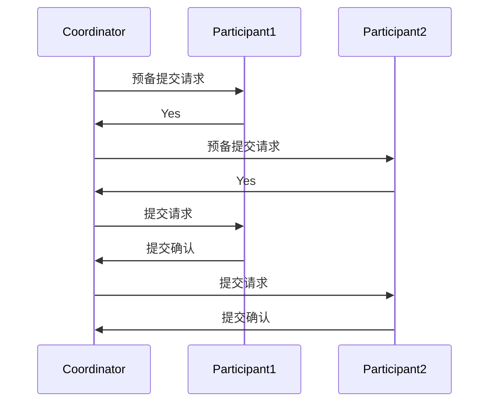

                 

# 《分布式事务管理器在LLM应用中的应用》

## 关键词

- 分布式事务管理器
- LLM应用
- 分布式系统
- 一致性模型
- 两阶段提交协议
- 性能优化

## 摘要

本文旨在探讨分布式事务管理器在大型语言模型（LLM）应用中的重要性。首先，我们将介绍分布式事务管理器的基础知识，包括其概念、原理和架构设计。随后，我们将分析LLM应用中分布式事务的挑战和解决方案，并通过实际案例展示分布式事务管理器在LLM训练和推理中的应用。最后，我们将总结最佳实践，并展望分布式事务管理器在LLM应用中的未来发展趋势。

## 目录

### 第一部分：分布式事务管理器基础

### 第二部分：分布式事务管理器在LLM应用中的具体应用

### 第三部分：分布式事务管理器在LLM应用中的最佳实践与未来展望

---

### 第一部分：分布式事务管理器基础

#### 第1章：分布式事务管理器概述

#### 第2章：分布式事务管理器原理

#### 第3章：分布式事务管理器架构

#### 第4章：分布式事务管理器性能优化

---

### 第1章：分布式事务管理器概述

#### 1.1.1 分布式系统概述

分布式系统是由多个独立计算机节点组成的系统，这些节点通过网络连接并协同工作。分布式系统的核心目标是实现资源共享、负载均衡和容错能力。在分布式系统中，节点之间的通信通过消息传递进行，这使得系统可以扩展到大量节点而无需单点故障。

#### 1.1.2 分布式事务概念

分布式事务是指在分布式系统中执行的一系列操作，这些操作要么全部成功，要么全部失败。分布式事务通常涉及到多个节点上的数据操作，因此需要确保数据的一致性。分布式事务的关键挑战包括数据一致性和故障处理。

#### 1.1.3 分布式事务挑战

分布式事务面临的主要挑战包括：

1. **数据一致性**：如何确保分布式事务中的数据一致性，即使节点发生故障。
2. **故障处理**：如何处理分布式系统中的节点故障，确保事务能够正确地恢复。
3. **性能问题**：分布式事务可能会导致性能下降，因为需要协调多个节点的操作。

---

### 第2章：分布式事务管理器原理

#### 2.1.1 一致性模型

分布式事务的一致性模型有多种，包括强一致性、最终一致性等。强一致性确保在任意时刻，所有节点上的数据都保持一致。最终一致性则允许在一定延迟内，不同节点的数据可能不一致，但最终会达到一致状态。

#### 2.1.2 实现分布式事务的技术

实现分布式事务的技术包括：

1. **两阶段提交协议**：两阶段提交是一种常用的分布式事务实现技术，通过协调事务协调者（Coordinator）和参与者（Participant）来确保事务的原子性。
2. **分布式锁**：分布式锁用于在分布式系统中确保对共享资源的独占访问。

#### 2.1.3 两阶段提交协议

两阶段提交协议的工作流程如下：

1. **投票阶段**：事务协调者向所有参与者发送预备提交请求，参与者根据当前数据状态回复Yes或No。
2. **提交阶段**：如果所有参与者回复Yes，事务协调者发送提交请求，参与者执行事务。如果任何参与者回复No，事务协调者发送回滚请求，参与者撤销事务。

---

### 第3章：分布式事务管理器架构

#### 3.1.1 架构设计原则

分布式事务管理器架构设计的关键原则包括：

1. **高可用性**：确保系统在节点故障时能够继续运行。
2. **可扩展性**：支持节点动态增减，以适应系统负载变化。
3. **高性能**：优化系统性能，减少事务处理延迟。

#### 3.1.2 分布式事务管理器组件

分布式事务管理器通常包括以下组件：

1. **事务协调者**：负责协调分布式事务的执行。
2. **参与者**：执行事务操作的节点。
3. **日志服务**：记录事务操作的日志，用于故障恢复。

#### 3.1.3 架构图解析

以下是分布式事务管理器架构的简化Mermaid图：

---

### 第4章：分布式事务管理器性能优化

#### 4.1.1 性能瓶颈分析

分布式事务管理器可能遇到的主要性能瓶颈包括：

1. **网络延迟**：节点之间的通信延迟可能会影响事务处理速度。
2. **锁冲突**：分布式锁可能导致大量锁冲突，降低系统性能。
3. **日志同步**：日志同步可能成为系统性能的瓶颈。

#### 4.1.2 性能优化策略

以下是一些性能优化策略：

1. **数据分片**：将数据分布在多个节点上，减少单个节点的负载。
2. **负载均衡**：合理分配事务负载，避免单点过载。
3. **缓存机制**：使用缓存减少对数据库的访问频率。

#### 4.1.3 性能测试与调优实践

性能测试是评估系统性能的重要手段。以下是一个简单的性能测试与调优实践：

1. **测试环境搭建**：搭建分布式测试环境，模拟实际生产环境。
2. **性能测试**：执行各种负载测试，记录系统性能指标。
3. **调优实践**：根据测试结果，调整系统配置和架构设计，以优化性能。

---

### 第二部分：分布式事务管理器在LLM应用中的具体应用

#### 第5章：LLM应用中的分布式事务挑战

#### 第6章：分布式事务管理器在LLM训练中的应用

#### 第7章：分布式事务管理器在LLM推理中的应用

---

### 第5章：LLM应用中的分布式事务挑战

#### 5.1.1 LLM应用特点

大型语言模型（LLM）是一种基于深度学习的技术，能够理解和生成自然语言。LLM应用的特点包括：

1. **大规模数据集**：LLM需要处理大规模文本数据集，进行训练和推理。
2. **高并发访问**：LLM应用通常面临高并发访问，需要支持大量用户的请求。
3. **数据一致性要求**：在分布式环境中，确保数据一致性是关键挑战。

#### 5.1.2 分布式事务挑战

在LLM应用中，分布式事务面临以下挑战：

1. **数据一致性**：如何确保在分布式环境中，数据的一致性不受影响。
2. **并发控制**：如何处理并发访问，确保事务的正确执行。
3. **故障恢复**：如何处理节点故障，确保系统的稳定性。

#### 5.1.3 分布式事务解决方案

为了解决LLM应用中的分布式事务挑战，可以采用以下解决方案：

1. **分布式锁机制**：使用分布式锁确保对共享资源的独占访问，避免并发冲突。
2. **最终一致性模型**：采用最终一致性模型，允许一定延迟内的数据不一致，但最终会达到一致状态。
3. **两阶段提交协议**：使用两阶段提交协议确保事务的原子性和一致性。

---

### 第6章：分布式事务管理器在LLM训练中的应用

#### 6.1.1 分布式训练需求

在LLM训练过程中，分布式事务管理器需要满足以下需求：

1. **数据一致性**：确保训练数据在不同节点之间保持一致性。
2. **并发控制**：支持大规模并发训练任务，避免资源冲突。
3. **故障恢复**：在节点故障时，能够快速恢复训练任务。

#### 6.1.2 分布式事务管理器实现

在LLM训练中，分布式事务管理器的实现可以采用以下步骤：

1. **数据一致性保障**：使用分布式锁机制确保对训练数据的独占访问，避免数据冲突。
2. **并发控制**：采用负载均衡算法分配训练任务，避免单点过载。
3. **故障恢复**：使用分布式日志记录训练过程，实现故障恢复。

#### 6.1.3 实际案例解析

以下是一个分布式事务管理器在LLM训练中的实际案例：

- **场景描述**：一个大型公司使用分布式事务管理器在多台服务器上训练一个大型语言模型。
- **实现过程**：分布式事务管理器协调训练任务的分配和执行，确保数据一致性。在节点故障时，通过日志恢复训练任务。

---

### 第7章：分布式事务管理器在LLM推理中的应用

#### 7.1.1 分布式推理需求

在LLM推理过程中，分布式事务管理器需要满足以下需求：

1. **高并发处理**：支持大量用户的请求，提供高效的响应。
2. **数据一致性**：确保推理结果的一致性，避免数据不一致的问题。
3. **故障恢复**：在节点故障时，能够快速切换到其他节点，确保系统可用性。

#### 7.1.2 分布式事务管理器实现

在LLM推理中，分布式事务管理器的实现可以采用以下步骤：

1. **数据一致性保障**：使用分布式锁机制确保对推理数据的独占访问，避免数据冲突。
2. **负载均衡**：采用负载均衡算法分配请求，避免单点过载。
3. **故障恢复**：使用分布式日志记录推理过程，实现故障恢复。

#### 7.1.3 实际案例解析

以下是一个分布式事务管理器在LLM推理中的实际案例：

- **场景描述**：一个在线问答平台使用分布式事务管理器在多台服务器上提供LLM推理服务。
- **实现过程**：分布式事务管理器协调请求的分配和执行，确保数据一致性。在节点故障时，通过日志切换到其他节点，确保系统可用性。

---

### 第三部分：分布式事务管理器在LLM应用中的最佳实践与未来展望

#### 第8章：分布式事务管理器在LLM应用中的最佳实践

#### 第9章：未来展望

---

### 第8章：分布式事务管理器在LLM应用中的最佳实践

在LLM应用中，分布式事务管理器的设计和实现需要遵循以下最佳实践：

1. **高可用性**：确保系统在节点故障时能够快速恢复，减少服务中断时间。
2. **可扩展性**：设计可扩展的分布式事务管理器架构，支持节点动态增减。
3. **性能优化**：通过数据分片、缓存机制等优化策略提高系统性能。
4. **安全性**：确保分布式事务管理器的安全，防止恶意攻击和数据泄露。

#### 8.1.2 实践经验

以下是一些分布式事务管理器在LLM应用中的实践经验：

- **数据分片**：将训练数据分布在多个节点上，提高数据处理速度。
- **负载均衡**：采用负载均衡算法，合理分配训练和推理任务。
- **故障恢复**：使用分布式日志和备份机制，实现快速故障恢复。

#### 8.1.3 注意事项

在实现分布式事务管理器时，需要注意以下事项：

- **一致性模型选择**：根据应用场景选择合适的一致性模型，如强一致性或最终一致性。
- **故障处理策略**：设计合理的故障处理策略，确保系统在节点故障时能够快速恢复。
- **性能监控**：定期监控系统性能，及时调整配置和优化策略。

---

### 第9章：未来展望

分布式事务管理器在LLM应用中的发展前景广阔。未来，分布式事务管理器将面临以下挑战和机遇：

1. **更高效的算法**：研究更高效的分布式事务算法，提高系统性能和一致性。
2. **自动化管理**：开发自动化管理工具，降低分布式事务管理器的部署和维护成本。
3. **跨平台兼容性**：提高分布式事务管理器的跨平台兼容性，支持更多编程语言和框架。
4. **安全性提升**：加强分布式事务管理器的安全性，防止恶意攻击和数据泄露。

未来，分布式事务管理器将在LLM应用中发挥越来越重要的作用，推动人工智能技术的发展和进步。

---

**作者：AI天才研究院/AI Genius Institute & 禅与计算机程序设计艺术 /Zen And The Art of Computer Programming**

