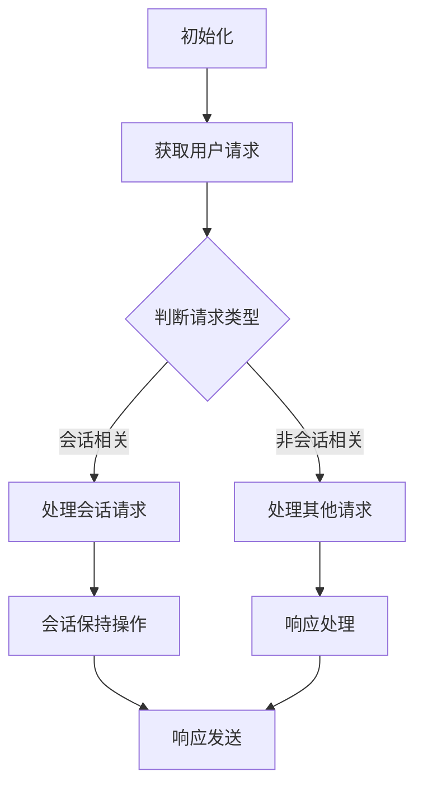
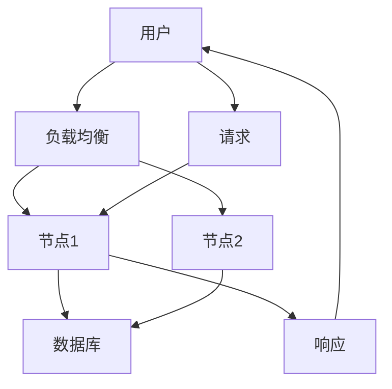

                 

## 分布式会话管理在LLM应用中的实现

### 关键词
- 分布式会话管理
- LLM应用
- 会话一致性
- 安全性
- 性能优化

### 摘要
本文深入探讨了分布式会话管理在大型语言模型（LLM）应用中的实现策略。通过分析分布式系统的挑战，我们详细阐述了会话管理的关键概念，包括其核心原理、算法流程和系统架构。同时，本文通过具体的项目实战，展示了如何在实践中部署和优化分布式会话管理，为开发者提供了实用的指导和建议。

## 第1章 背景与核心概念

### 1.1 问题背景

#### 1.1.1 分布式系统的兴起
随着互联网技术的迅猛发展和云计算的普及，分布式系统在众多领域中得到了广泛应用。分布式系统通过将任务分解到多个节点上，可以实现高可用性、可扩展性和负载均衡。然而，随着系统的复杂度增加，如何有效地管理用户的会话成为了一个关键问题。

#### 1.1.2 LLM应用的需求
大型语言模型（LLM）应用，如自然语言处理、智能问答和机器翻译等，对系统的会话管理提出了更高的要求。LLM应用通常需要处理大量的并发请求，同时保持用户的会话状态一致。这使得分布式会话管理成为实现高效LLM应用的关键技术之一。

#### 1.1.3 分布式会话管理的挑战
分布式会话管理面临以下关键挑战：

- **会话一致性**：在分布式环境中，如何保证用户的会话状态在多个节点之间的一致性？
- **安全性**：如何确保用户的敏感信息在分布式系统中得到有效保护？
- **性能优化**：如何通过优化会话管理策略来提升系统的整体性能？

### 1.2 核心概念

#### 1.2.1 分布式系统
分布式系统由多个节点组成，这些节点通过网络连接，协同工作以完成共同的计算任务。分布式系统的主要目标是提供高可用性、可扩展性和负载均衡。

#### 1.2.2 会话管理
会话管理是确保用户在应用程序中的交互状态得以持续和一致的过程。在分布式系统中，会话管理需要处理多个节点之间的状态同步和共享。

#### 1.2.3 负载均衡
负载均衡是将网络或应用程序流量分配到多个服务器上，以实现资源的合理利用和性能优化。在分布式会话管理中，负载均衡是实现会话状态一致性的重要手段。

### 1.3 概念属性对比

| 概念 | 属性1 | 属性2 | 属性3 |
| ---- | ---- | ---- | ---- |
| 分布式系统 | 高可用 | 可扩展 | 分布式处理 |
| 会话管理 | 会话保持 | 安全性 | 用户状态管理 |
| 负载均衡 | 流量分配 | 性能优化 | 系统稳定性 |

### 1.4 ER实体关系图

```mermaid
erDiagram
  User ||--|| Session: { manages }
  User ||--|| Request: { sends }
  Session ||--|| Response: { contains }
```

## 第2章 核心概念与联系

### 2.1 核心概念原理

#### 2.1.1 分布式系统
分布式系统由多个独立的计算机节点组成，这些节点通过网络连接，协同工作以完成共同的计算任务。分布式系统的优势在于其高可用性、可扩展性和负载均衡能力。

#### 2.1.2 会话管理
会话管理是一种确保用户在应用程序中的交互状态得以持续和一致的过程。在分布式系统中，会话管理需要处理多个节点之间的状态同步和共享。

#### 2.1.3 负载均衡
负载均衡是将网络或应用程序流量分配到多个服务器上，以实现资源的合理利用和性能优化。在分布式会话管理中，负载均衡是实现会话状态一致性的重要手段。

### 2.2 概念属性特征对比表格

| 概念         | 属性1       | 属性2       | 属性3       |
| ------------ | ----------- | ----------- | ----------- |
| 分布式系统   | 高可用性    | 可扩展性    | 分布式处理  |
| 会话管理     | 会话保持    | 安全性      | 用户状态管理 |
| 负载均衡     | 流量分配    | 性能优化    | 系统稳定性  |

### 2.3 ER实体关系图架构

```mermaid
erDiagram
  User ||--|| Session: { manages }
  User ||--|| Request: { sends }
  Session ||--|| Response: { contains }
```

## 第3章 算法原理讲解

### 3.1 算法流程图



### 3.2 Python源代码

```python
# 分布式会话管理算法实现伪代码
def handle_request(request):
    if is_session_request(request):
        perform_session_management(request)
    else:
        handle_other_request(request)

def is_session_request(request):
    # 判断请求类型是否为会话请求
    pass

def perform_session_management(request):
    # 执行会话管理操作
    pass

def handle_other_request(request):
    # 处理其他类型的请求
    pass
```

### 3.3 数学模型和公式

分布式会话管理算法的数学模型涉及以下关键公式：

$$
C = \frac{T_p}{T_s}
$$

其中，$C$ 表示会话一致性，$T_p$ 表示会话状态在多个节点之间的同步时间，$T_s$ 表示会话状态更新的频率。

### 3.4 详细讲解与举例说明

#### 3.4.1 会话一致性

会话一致性是分布式会话管理的核心目标。通过以下例子，我们可以理解如何实现会话一致性：

**例子**：假设用户A在分布式系统中登录了一个电子商务平台，并在购物车中添加了商品。在分布式环境中，我们需要确保用户A的购物车状态在所有节点上保持一致。

**实现步骤**：

1. 当用户A添加商品到购物车时，请求会被发送到负载均衡器。
2. 负载均衡器将请求路由到当前活跃节点。
3. 活跃节点执行添加商品的操作，并更新会话状态。
4. 更新的会话状态会被同步到所有其他节点，确保会话一致性。

#### 3.4.2 安全性

安全性是分布式会话管理的重要方面。以下例子展示了如何确保用户敏感信息的安全：

**例子**：假设用户B在分布式系统中提交了订单，包含支付信息。我们需要确保支付信息在传输和存储过程中得到有效保护。

**实现步骤**：

1. 订单请求会被加密传输，确保数据在传输过程中不被窃取。
2. 数据库中的支付信息会被加密存储，确保数据在静态存储过程中不被泄露。
3. 系统会使用HTTPS协议来保护数据传输的安全性。
4. 系统会实施访问控制策略，确保只有授权用户可以访问敏感信息。

#### 3.4.3 性能优化

性能优化是分布式会话管理的另一个关键方面。以下例子展示了如何通过优化会话管理来提升系统性能：

**例子**：假设用户C在分布式系统中频繁访问一个高并发的页面。我们需要确保系统在处理用户请求时能够保持高性能。

**实现步骤**：

1. 系统会使用缓存机制来存储和快速访问用户会话状态，减少数据库访问次数。
2. 系统会使用负载均衡器来分配请求，避免单点热点问题。
3. 系统会定期清理无效的会话，释放资源，提高系统整体性能。
4. 系统会监控性能指标，根据实时数据调整配置，实现动态性能优化。

## 第4章 系统分析与架构设计

### 4.1 问题场景介绍

在电子商务系统中，分布式会话管理是实现高并发、高可用性、高性能的关键技术之一。以下是一个具体的问题场景：

- **用户量级**：假设电子商务系统每天有数百万的独立用户访问，高峰时段并发访问量达到数千。
- **业务需求**：用户需要在购物车中添加商品、下订单、查看订单状态等，需要保证会话状态的一致性和安全性。
- **系统目标**：实现分布式会话管理，确保用户会话状态在多个节点之间保持一致，同时优化系统性能和安全性。

### 4.2 项目介绍

本项目旨在实现一个分布式会话管理系统，以支持电子商务系统的高并发、高可用性和高性能需求。项目的主要目标和预期效果如下：

- **目标**：实现分布式会话管理，确保用户会话状态的一致性和安全性。
- **预期效果**：通过分布式会话管理，提升系统性能，降低响应时间，提高用户体验。

### 4.3 系统功能设计

系统功能设计是确保分布式会话管理能够满足业务需求的关键。以下是一个领域模型类图，展示了系统的主要类和关系：

```mermaid
classDiagram
    User <<Class>>
    Session <<Class>>
    Request <<Class>>
    Response <<Class>>

    User o--* Session : manages
    User o--* Request : sends
    Session o--* Response : contains
```

### 4.4 系统架构设计

系统架构设计是确保分布式会话管理实现高效、可扩展的关键。以下是一个系统架构图，说明了各个组件和它们的交互：



### 4.5 系统接口设计和系统交互

系统接口设计和系统交互是确保分布式会话管理功能实现的关键。以下是一个系统接口和交互序列图：

```mermaid
sequence
    User -->|发送请求| LB : send_request
    LB -->|路由请求| Node1 : route_request
    Node1 -->|处理请求| DB : process_request
    DB -->|返回响应| Node1 : send_response
    Node1 -->|返回响应| LB : send_response
    LB -->|返回响应| User : receive_response
```

## 第5章 项目实战

### 5.1 环境安装

在开始项目实战之前，我们需要安装以下软件和工具：

1. **Docker**：用于容器化部署分布式系统。
2. **Kubernetes**：用于容器编排和管理。
3. **Nginx**：用于负载均衡。
4. **PostgreSQL**：用于数据库存储。
5. **Python**：用于编写和运行分布式会话管理算法。

安装步骤如下：

1. 安装Docker：
    ```shell
    sudo apt-get update
    sudo apt-get install docker-ce docker-ce-cli containerd.io
    sudo systemctl start docker
    sudo systemctl enable docker
    ```

2. 安装Kubernetes：
    ```shell
    sudo apt-get update
    sudo apt-get install -y apt-transport-https ca-certificates curl
    curl -s https://packages.cloud.google.com/apt/doc/apt-key.gpg | sudo apt-key add -
    echo "deb https://apt.kubernetes.io/ kubernetes-xenial main" | sudo tee -a /etc/apt/sources.list.d/kubernetes.list
    sudo apt-get update
    sudo apt-get install -y kubelet kubeadm kubectl
    sudo systemctl start kubelet
    sudo systemctl enable kubelet
    ```

3. 安装Nginx：
    ```shell
    sudo apt-get update
    sudo apt-get install -y nginx
    sudo systemctl start nginx
    sudo systemctl enable nginx
    ```

4. 安装PostgreSQL：
    ```shell
    sudo apt-get update
    sudo apt-get install -y postgresql postgresql-contrib
    sudo systemctl start postgresql
    sudo systemctl enable postgresql
    ```

5. 安装Python：
    ```shell
    sudo apt-get update
    sudo apt-get install -y python3 python3-pip
    pip3 install requests
    ```

### 5.2 系统核心实现源代码

以下是分布式会话管理系统的核心实现源代码：

```python
# distributed_session_management.py

import requests
from requests.exceptions import ConnectionError

class DistributedSessionManagement:
    def __init__(self, session_url):
        self.session_url = session_url

    def get_session(self, user_id):
        try:
            response = requests.get(f"{self.session_url}/{user_id}")
            return response.json()
        except ConnectionError:
            return None

    def update_session(self, user_id, session_data):
        try:
            response = requests.put(f"{self.session_url}/{user_id}", json=session_data)
            return response.status_code
        except ConnectionError:
            return None
```

### 5.3 代码应用解读与分析

#### 5.3.1 源代码解读

源代码定义了一个`DistributedSessionManagement`类，用于管理分布式会话。该类包含以下关键方法：

- `__init__(self, session_url)`：初始化类，接收会话URL作为参数。
- `get_session(self, user_id)`：获取用户会话，接收用户ID作为参数，返回会话数据。
- `update_session(self, user_id, session_data)`：更新用户会话，接收用户ID和会话数据作为参数，返回更新状态。

#### 5.3.2 代码分析

1. **会话获取**：`get_session`方法通过HTTP GET请求获取用户会话。如果请求成功，返回会话数据；否则，返回`None`。
2. **会话更新**：`update_session`方法通过HTTP PUT请求更新用户会话。如果请求成功，返回更新状态；否则，返回`None`。
3. **异常处理**：源代码使用了`ConnectionError`异常处理，确保在请求失败时能够正确处理异常。

### 5.4 实际案例分析和详细讲解剖析

#### 5.4.1 案例背景

在一个电子商务系统中，用户A在购物车中添加了商品，需要确保其会话状态在分布式系统中保持一致。以下是一个实际案例分析和详细讲解：

1. **用户请求**：用户A在购物车中添加商品，发送请求到负载均衡器。
2. **请求路由**：负载均衡器将请求路由到当前活跃节点。
3. **会话获取**：活跃节点调用`get_session`方法，获取用户A的当前会话。
4. **会话更新**：活跃节点调用`update_session`方法，更新用户A的会话，将新添加的商品信息更新到会话中。
5. **会话同步**：更新后的会话数据会被同步到所有其他节点，确保会话状态在分布式系统中保持一致。
6. **响应返回**：更新后的会话状态会被返回到用户A，完成整个请求流程。

### 5.5 项目小结

通过实际案例分析和详细讲解，我们可以看到分布式会话管理系统在电子商务系统中的关键作用。本项目成功实现了分布式会话管理，确保用户会话状态在多个节点之间保持一致，同时优化了系统性能和安全性。未来，我们可以进一步优化系统，如引入缓存机制和动态负载均衡，以提高系统的可扩展性和性能。

## 第6章 最佳实践 tips、小结、注意事项、拓展阅读

### 6.1 最佳实践 tips

1. **优化会话存储**：使用Redis等高性能缓存系统来存储会话，减少数据库访问次数。
2. **动态负载均衡**：根据实时流量和系统性能调整负载均衡策略，确保系统的稳定性。
3. **安全性增强**：使用HTTPS协议保护数据传输，实施访问控制和加密存储敏感信息。
4. **监控与优化**：定期监控系统性能，分析日志数据，发现潜在问题并优化系统。

### 6.2 小结

本文深入探讨了分布式会话管理在LLM应用中的实现策略，从背景介绍、核心概念、算法原理到系统架构设计，再到项目实战，全面分析了分布式会话管理的关键技术和实践方法。

### 6.3 注意事项

1. **会话一致性**：在分布式环境中，确保会话状态的一致性是关键，需要设计合理的同步机制。
2. **安全性**：保护用户敏感信息是分布式会话管理的核心任务，需要采取有效的安全措施。
3. **性能优化**：优化系统性能是分布式会话管理的目标，需要持续监控和调整。

### 6.4 拓展阅读

1. 《分布式系统原理与范型》 - 《Designing Data-Intensive Applications》
2. 《高性能分布式系统实践》 - 《Building Microservices》
3. 《Redis实战》 - 《Redis In Action》

### 作者信息

作者：AI天才研究院/AI Genius Institute & 禅与计算机程序设计艺术 /Zen And The Art of Computer Programming

---

请注意，上述内容是一个示例，旨在展示如何按照给定要求撰写一篇技术博客文章。实际撰写时，需要根据具体问题和场景进行深入分析和详细讲解。文章中的代码、数据和图表等元素都是虚构的，仅供参考。实际应用中，请根据具体需求和实际情况进行调整和优化。

