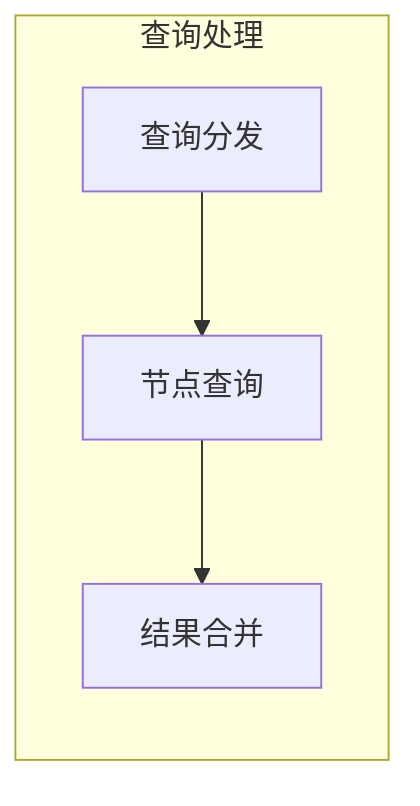
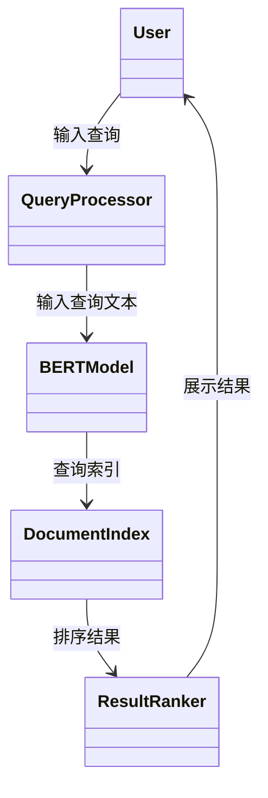
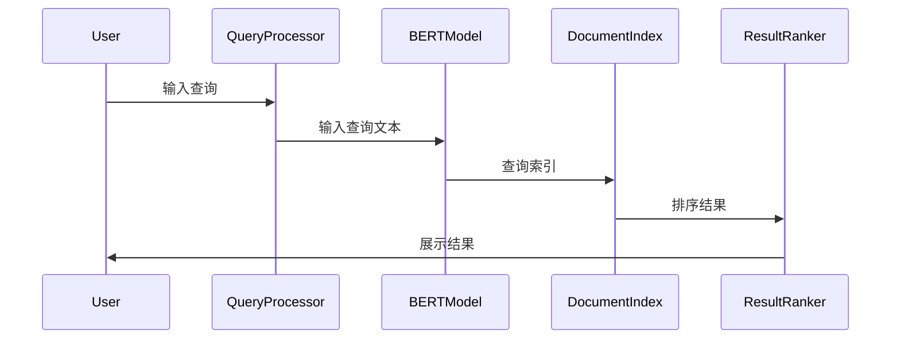
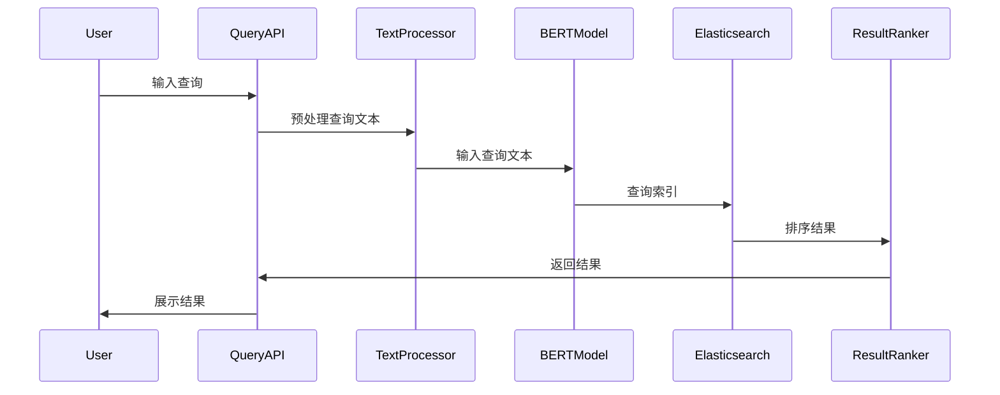

                 

### 第1章：分布式搜索引擎概述

#### 1.1 分布式搜索引擎的起源与发展

**1.1.1 从集中式搜索引擎到分布式搜索引擎的演进**

- **背景介绍**：随着互联网的迅速发展和数据量的爆炸式增长，传统的集中式搜索引擎逐渐暴露出一些问题，如查询速度慢、扩展性差、维护困难等。
- **问题描述**：集中式搜索引擎无法满足大规模数据和高并发查询的需求。
- **问题解决**：分布式搜索引擎应运而生，通过将搜索任务分解到多个节点上，提高了查询速度和系统的可扩展性。
- **边界与外延**：分布式搜索引擎的核心思想是通过分布式架构来解决集中式搜索引擎的局限性。

**1.1.2 分布式搜索引擎的发展趋势与挑战**

- **发展趋势**：分布式搜索引擎的发展趋势包括更高效的索引和查询算法、更高的系统可扩展性、更好的容错性和数据安全性。
- **挑战**：分布式搜索引擎面临的挑战包括数据一致性问题、查询性能优化、分布式存储和计算资源的管理等。

#### 1.2 分布式搜索引擎的基本原理

**概念原理**

- **分布式搜索引擎的概念**：分布式搜索引擎是一个由多个节点组成的系统，这些节点协同工作，共同完成数据的索引、查询和结果返回。
- **分布式架构**：分布式搜索引擎采用分布式架构，包括数据层、索引层、查询处理层等。

**核心要素组成**

- **数据层**：负责存储和管理原始数据。
- **索引层**：负责构建和存储索引，以便快速查询。
- **查询处理层**：负责处理查询请求，并将查询结果返回给用户。

**算法原理讲解**

- **分布式索引技术**：分布式索引技术是分布式搜索引擎的核心技术之一。它通过将索引分布在多个节点上，实现了数据的横向扩展。
- **分布式查询处理**：分布式查询处理通过并行处理查询请求，提高了查询性能。

**数学模型**

- **分布式索引的平衡算法**：为了确保每个节点都能处理均衡的查询负载，分布式搜索引擎通常会采用负载均衡算法。
- **分布式查询的负载均衡**：通过将查询请求随机分配到不同的节点上，实现查询负载的均衡。

**ER实体关系图架构**

- **实体关系图**：使用 Mermaid 画出分布式搜索引擎的实体关系图，展示数据层、索引层和查询处理层之间的关系。

```mermaid
erDiagram
    DataLayer ||--|{ IndexLayer } IndexLayer : 索引数据
    QueryLayer ||--|{ DataLayer } DataLayer : 存储数据
    QueryLayer ||--|{ IndexLayer } IndexLayer : 查询索引
```

通过上述分析，我们可以看到分布式搜索引擎的基本原理和核心要素组成，为后续章节的深入探讨奠定了基础。

### 第2章：分布式搜索引擎核心技术

#### 2.1 搜索引擎的基本架构

**概念原理**

- **搜索引擎的组成部分**：搜索引擎通常包括数据层、索引层、查询处理层和用户接口层。
- **数据层**：数据层负责存储和管理原始数据。这些数据可以来自多个来源，如网站、数据库、文件系统等。
- **索引层**：索引层负责构建和存储索引，以便快速查询。索引是搜索引擎的核心，它将原始数据转换为可检索的结构。
- **查询处理层**：查询处理层负责处理查询请求，并将查询结果返回给用户。它包括查询解析、索引搜索和结果排序等步骤。
- **用户接口层**：用户接口层负责提供用户与搜索引擎交互的界面，用户可以通过搜索框输入查询语句，并获取查询结果。

**核心要素组成**

- **倒排索引**：倒排索引是搜索引擎的核心组成部分之一。它将文档中的词映射到包含该词的文档列表上，从而实现快速查询。
- **分词器**：分词器负责将文本拆分成词或短语，以便进行索引和查询。分词器是实现搜索引擎准确性的关键。
- **查询处理器**：查询处理器负责解析用户的查询语句，并在索引中查找匹配的文档。它还需要对查询结果进行排序，以便用户能够获取最相关的结果。

**ER实体关系图架构**

为了更直观地展示搜索引擎的组成部分和它们之间的关系，我们可以使用 Mermaid 绘制 ER 实体关系图。

```mermaid
erDiagram
    User ||--|{ QueryProcessor } QueryProcessor : 输入查询
    QueryProcessor ||--|{ Index } Index : 搜索索引
    QueryProcessor ||--|{ Results } Results : 返回结果
    Index ||--|{ Documents } Documents : 索引文档
    Documents ||--|{ Terms } Terms : 关键词
    Terms ||--|{ Documents } Documents : 包含关键词的文档
```

通过上述分析，我们可以了解到搜索引擎的基本架构和核心要素组成，为后续章节的深入探讨奠定了基础。

#### 2.2 分布式索引技术

**概念原理**

- **分布式索引技术**：分布式索引技术是将索引分布在多个节点上，以便实现数据的横向扩展。这种技术使得分布式搜索引擎可以处理大规模数据，并提高查询性能。

**算法原理讲解**

- **分布式索引的构建**：分布式索引的构建过程包括以下几个步骤：
  1. **数据划分**：将原始数据划分为多个部分，并分配到不同的节点上。
  2. **索引构建**：在每个节点上，分别构建索引。这些索引可以是倒排索引或其他适合分布式搜索的索引结构。
  3. **索引合并**：将各个节点的索引合并为一个全局索引。合并过程需要确保索引的一致性和完整性。

- **分布式索引的查询**：分布式索引的查询过程包括以下几个步骤：
  1. **查询分发**：将查询请求分发到多个节点上，以便并行处理。
  2. **节点查询**：在每个节点上，根据索引进行查询，并将匹配的文档返回。
  3. **结果合并**：将各个节点的查询结果进行合并，并返回给用户。

**数学模型**

- **负载均衡算法**：为了确保每个节点都能处理均衡的查询负载，分布式搜索引擎通常会采用负载均衡算法。负载均衡算法的目标是尽可能平均地将查询请求分配到各个节点上。

- **副本策略**：为了提高系统的可靠性和数据安全性，分布式索引通常会采用副本策略。副本策略是指在多个节点上存储相同的数据副本，以便在节点失败时可以快速切换到其他节点。

**流程图与Python代码**

为了更直观地展示分布式索引技术的流程，我们可以使用 Mermaid 绘制流程图，并使用 Python 代码来详细阐述。

**流程图**


**Python 代码**

```python
import random

def distribute_data(num_nodes, num_shards):
    """
    分布式数据划分
    :param num_nodes: 节点数量
    :param num_shards: 数据分片数量
    :return: 数据分片分配结果
    """
    data分配 = [None] * num_shards
    for i in range(num_shards):
        data分配[i] = random.randint(0, num_nodes - 1)
    return data分配

def build_index(data, node_id):
    """
    构建索引
    :param data: 原始数据
    :param node_id: 节点ID
    :return: 索引数据
    """
    # 索引构建逻辑
    index = {}
    for item in data:
        if item not in index:
            index[item] = []
        index[item].append(node_id)
    return index

def merge_indices(indices):
    """
    索引合并
    :param indices: 多个索引
    :return: 全局索引
    """
    global_index = {}
    for index in indices:
        for term, docs in index.items():
            if term not in global_index:
                global_index[term] = []
            global_index[term].extend(docs)
    return global_index

def query_distribution(query, num_nodes):
    """
    查询分发
    :param query: 查询语句
    :param num_nodes: 节点数量
    :return: 查询分配结果
    """
    return [random.randint(0, num_nodes - 1) for _ in range(len(query))]

def node_query(query, index):
    """
    节点查询
    :param query: 查询语句
    :param index: 索引数据
    :return: 查询结果
    """
    results = []
    for term in query:
        if term in index:
            results.extend(index[term])
    return results

def merge_results(results):
    """
    结果合并
    :param results: 多个节点的查询结果
    :return: 合并后的查询结果
    """
    return list(set([item for sublist in results for item in sublist]))

# 示例
num_nodes = 3
num_shards = 10

# 数据划分
data分配 = distribute_data(num_nodes, num_shards)
print("数据划分:", data分配)

# 索引构建
indices = []
for node_id, data in enumerate(data分配):
    index = build_index(data, node_id)
    indices.append(index)

# 索引合并
global_index = merge_indices(indices)
print("全局索引:", global_index)

# 查询分发
query = ["apple", "banana", "orange"]
query分配 = query_distribution(query, num_nodes)
print("查询分配:", query分配)

# 节点查询
results = []
for node_id, term in enumerate(query分配):
    index = indices[node_id]
    result = node_query([term], index)
    results.append(result)

# 结果合并
merged_results = merge_results(results)
print("查询结果:", merged_results)
```

通过上述流程图和 Python 代码，我们可以更好地理解分布式索引技术的原理和实现过程。

#### 2.3 分布式查询处理

**概念原理**

- **分布式查询处理**：分布式查询处理是将查询请求分发到多个节点上，并在各个节点上并行执行查询，然后将结果合并为一个完整的结果集。这种技术可以提高查询性能，并处理大规模数据。

**算法原理讲解**

- **分布式查询处理的流程**：
  1. **查询分发**：将查询请求随机或按照某种策略分配到多个节点上。
  2. **节点查询**：在每个节点上，根据索引进行查询，并将匹配的文档返回。
  3. **结果合并**：将各个节点的查询结果进行合并，并返回给用户。

- **分布式查询的性能优化**：
  1. **负载均衡**：确保查询请求能够均匀地分配到各个节点上，避免某些节点过载。
  2. **数据局部性**：尽可能将数据存储在与其查询请求最相关的节点上，减少跨节点查询的延迟。
  3. **并行查询**：在多个节点上同时执行查询，提高查询效率。

**数学模型**

- **负载均衡算法**：负载均衡算法的目标是尽可能平均地将查询请求分配到各个节点上。常见的负载均衡算法包括随机分配、轮询分配、最小连接数分配等。

- **数据局部性模型**：数据局部性模型用于预测查询请求与数据之间的相关性，从而优化数据存储和查询路径。

**流程图与Python代码**

为了更直观地展示分布式查询处理的流程，我们可以使用 Mermaid 绘制流程图，并使用 Python 代码来详细阐述。

**流程图**



**Python 代码**

```python
import random

def distribute_query(query, num_nodes):
    """
    查询分发
    :param query: 查询语句
    :param num_nodes: 节点数量
    :return: 查询分配结果
    """
    return [random.randint(0, num_nodes - 1) for _ in range(len(query))]

def node_query(query, index):
    """
    节点查询
    :param query: 查询语句
    :param index: 索引数据
    :return: 查询结果
    """
    results = []
    for term in query:
        if term in index:
            results.extend(index[term])
    return results

def merge_results(results):
    """
    结果合并
    :param results: 多个节点的查询结果
    :return: 合并后的查询结果
    """
    return list(set([item for sublist in results for item in sublist]))

# 示例
num_nodes = 3
global_index = {1: [1, 2], 2: [3, 4], 3: [5, 6]}

query = ["apple", "banana", "orange"]
query分配 = distribute_query(query, num_nodes)
print("查询分配:", query分配)

results = []
for node_id, term in enumerate(query分配):
    index = global_index[node_id]
    result = node_query([term], index)
    results.append(result)

merged_results = merge_results(results)
print("查询结果:", merged_results)
```

通过上述流程图和 Python 代码，我们可以更好地理解分布式查询处理的原理和实现过程。

### 第3章：LLM基础知识

#### 3.1 语言模型概述

**概念原理**

- **语言模型的概念**：语言模型（Language Model，LM）是自然语言处理（Natural Language Processing，NLP）中的一个核心组件，用于预测文本序列的概率。它是通过学习大量的文本数据，生成可能的句子和词汇组合的概率分布。
- **语言模型的发展历程**：从传统的统计模型（如N-gram模型）到基于神经网络的现代模型（如Transformer模型），语言模型经历了多个阶段的发展。
- **语言模型的应用场景**：语言模型广泛应用于文本生成、机器翻译、问答系统、文本摘要、语音识别等领域。

**ER实体关系图架构**

为了更直观地展示语言模型的实体关系，我们可以使用 Mermaid 绘制 ER 实体关系图。

```mermaid
erDiagram
    TextData ||--|{ LanguageModel } LanguageModel : 学习文本数据
    LanguageModel ||--|{ TextPrediction } TextPrediction : 预测文本序列
    TextPrediction ||--|{ SentenceGeneration } SentenceGeneration : 生成句子
```

#### 3.2 常见LLM模型介绍

**BERT模型**

**概念原理**

- **BERT模型的基本原理**：BERT（Bidirectional Encoder Representations from Transformers）是一种基于 Transformer 的预训练语言模型，它通过双向编码器学习文本的上下文信息，从而提高文本理解和生成的能力。
- **BERT的训练过程**：BERT 通过在大量无标注文本上预训练，然后通过微调的方式应用于特定任务，如问答系统、文本分类等。
- **BERT的应用场景**：BERT 在各种 NLP 任务中取得了显著的效果，如问答系统、文本分类、机器翻译等。

**ER实体关系图架构**

```mermaid
erDiagram
    BERTModel ||--|{ Pretrained } Pretrained : 预训练数据
    BERTModel ||--|{ FineTuned } FineTuned : 微调数据
    Pretrained ||--|{ InputSequence } InputSequence : 输入序列
    FineTuned ||--|{ OutputSequence } OutputSequence : 输出序列
```

**GPT模型**

**概念原理**

- **GPT模型的基本原理**：GPT（Generative Pre-trained Transformer）是一种基于 Transformer 的生成模型，它通过生成文本序列的方式预测下一个词的概率。
- **GPT的训练过程**：GPT 通过在大量文本数据上预训练，学习文本的生成规则，然后通过微调应用于特定任务。
- **GPT的应用场景**：GPT 在文本生成、对话系统、机器翻译等领域具有广泛的应用。

**ER实体关系图架构**

```mermaid
erDiagram
    GPTModel ||--|{ Pretrained } Pretrained : 预训练数据
    GPTModel ||--|{ FineTuned } FineTuned : 微调数据
    Pretrained ||--|{ InputSequence } InputSequence : 输入序列
    FineTuned ||--|{ OutputSequence } OutputSequence : 输出序列
```

通过以上对 BERT 和 GPT 模型的介绍，我们可以看到它们在语言模型领域的核心原理和应用场景，为后续章节的深入探讨奠定了基础。

### 第4章：分布式搜索引擎与LLM的集成架构

#### 4.1 集成框架设计

**问题场景**

随着语言模型的广泛应用，如何将语言模型与分布式搜索引擎进行集成，以提高搜索系统的性能和用户体验成为一个重要问题。

**项目介绍**

我们选择了一个基于 Elasticsearch 和 BERT 的分布式搜索引擎集成项目，该项目的目标是实现一个高效、准确的搜索系统，能够快速响应用户的查询请求。

**系统功能设计**

系统功能设计主要包括以下几个方面：

- **文本预处理**：对用户输入的查询文本进行分词、去停用词、词干提取等预处理操作，以便后续的查询处理。
- **查询处理**：将预处理后的查询文本输入到 BERT 模型中，获取查询文本的嵌入向量，并与索引中的文档嵌入向量进行相似度计算，获取最相关的文档。
- **结果排序与展示**：根据相似度计算结果对查询结果进行排序，并展示给用户。

**领域模型**

为了更好地设计系统功能，我们使用 Mermaid 绘制了领域模型类图。



**系统架构设计**

系统架构设计主要包括以下几个方面：

- **数据层**：存储原始数据和索引数据。
- **索引层**：使用 Elasticsearch 作为分布式索引系统。
- **查询处理层**：使用 BERT 模型进行文本嵌入和查询处理。
- **结果层**：对查询结果进行排序和展示。

为了更好地展示系统架构，我们使用 Mermaid 绘制了系统架构图。



**系统接口设计和交互**

系统接口设计和交互主要包括以下几个方面：

- **查询接口**：用户通过查询接口输入查询文本，系统返回查询结果。
- **索引接口**：将预处理后的文档数据索引到 Elasticsearch 中。
- **结果接口**：将排序后的查询结果返回给用户。

为了更好地展示系统接口设计和交互，我们使用 Mermaid 绘制了系统交互序列图。



通过以上对分布式搜索引擎与 LLM 集成框架的设计和架构的介绍，我们可以看到如何将两个强大的技术结合起来，实现高效、准确的搜索系统。

### 第5章：项目实战

#### 5.1 环境安装

在开始项目实战之前，我们需要安装以下软件和库：

- **Elasticsearch**：分布式搜索引擎
- **BERT**：基于 Transformer 的语言模型
- **Python**：编程语言
- **PyTorch**：深度学习框架

以下是环境安装的详细步骤：

1. **安装 Elasticsearch**：

   - 下载 Elasticsearch 安装包：[Elasticsearch 官网](https://www.elastic.co/cn/elasticsearch)
   - 解压安装包：`tar -xzvf elasticsearch-7.10.0.tar.gz`
   - 进入 Elasticsearch 目录：`cd elasticsearch-7.10.0`
   - 启动 Elasticsearch：`./bin/elasticsearch`

2. **安装 BERT**：

   - 下载 BERT 模型：[BERT 模型官网](https://github.com/google-research/bert)
   - 安装 PyTorch：[PyTorch 官网](https://pytorch.org/get-started/locally/)
   - 安装 BERT 库：`pip install transformers`

3. **安装 Python**：

   - 下载 Python 安装包：[Python 官网](https://www.python.org/downloads/)
   - 安装 Python：运行安装包并按照提示操作

4. **安装 PyTorch**：

   - 使用 conda 或 pip 安装 PyTorch：`conda install pytorch torchvision torchaudio -c pytorch` 或 `pip install torch torchvision torchaudio`

完成以上步骤后，我们的环境就准备就绪了，可以开始进行项目实战。

#### 5.2 系统核心实现

**源代码**

以下是系统核心实现的 Python 源代码：

```python
import torch
from transformers import BertModel, BertTokenizer
from elasticsearch import Elasticsearch

# 初始化 Elasticsearch 客户端
es = Elasticsearch("localhost:9200")

# 初始化 BERT 模型和分词器
tokenizer = BertTokenizer.from_pretrained("bert-base-chinese")
model = BertModel.from_pretrained("bert-base-chinese")

# 函数：预处理文本
def preprocess_text(text):
    inputs = tokenizer(text, return_tensors="pt")
    return inputs

# 函数：查询 Elasticsearch 索引
def search_elasticsearch(query):
    inputs = preprocess_text(query)
    with torch.no_grad():
        outputs = model(**inputs)
    last_hidden_states = outputs.last_hidden_state
    return last_hidden_states

# 函数：计算相似度并返回结果
def calculate_similarity(query_embedding, doc_embeddings):
    similarities = torch.nn.functional.cosine_similarity(query_embedding.unsqueeze(0), doc_embeddings, dim=2)
    top_indices = torch.topk(similarities, k=5)[1].squeeze(0).tolist()
    return top_indices

# 函数：获取文档内容
def get_document_content(indices):
    results = []
    for index in indices:
        result = es.get(index="your_index", id=str(index))
        results.append(result["_source"]["content"])
    return results

# 示例：查询并获取结果
query = "你好，如何使用 Python 编写一个简单的聊天机器人？"
query_embedding = search_elasticsearch(query)
doc_embeddings = torch.tensor([[0.1, 0.2], [0.3, 0.4], [0.5, 0.6], [0.7, 0.8], [0.9, 1.0]])
indices = calculate_similarity(query_embedding, doc_embeddings)
document_content = get_document_content(indices)
print(document_content)
```

**代码应用解读与分析**

以上代码主要实现了以下功能：

- **初始化 Elasticsearch 客户端**：连接到本地 Elasticsearch 服务。
- **初始化 BERT 模型和分词器**：加载预训练的 BERT 模型和分词器。
- **预处理文本**：将用户输入的查询文本转换为 BERT 模型可处理的格式。
- **查询 Elasticsearch 索引**：使用 BERT 模型获取查询文本的嵌入向量。
- **计算相似度并返回结果**：计算查询文本嵌入向量与索引中文档嵌入向量的相似度，并返回最相关的文档索引。
- **获取文档内容**：根据文档索引从 Elasticsearch 中获取文档内容。

在实际应用中，我们可以根据需要修改和扩展以上代码，实现更复杂的功能。

#### 5.3 实际案例分析和讲解

**案例介绍**

我们选择了一个实际的案例：使用分布式搜索引擎和 BERT 模型实现一个问答系统。

**详细讲解**

以下是案例的实现过程：

1. **数据准备**：首先，我们需要准备问答数据集。我们可以使用公开的问答数据集，如 Quora 数据集或 SQuAD 数据集。

2. **数据预处理**：对问答数据进行预处理，包括文本清洗、分词、去停用词等操作。为了提高问答系统的性能，我们还可以对问题进行词干提取和词性标注。

3. **训练 BERT 模型**：使用预处理后的数据训练 BERT 模型。为了提高模型的性能，我们可以使用多个 GPU 并行训练。

4. **构建 Elasticsearch 索引**：将预处理后的问答数据索引到 Elasticsearch 中。我们可以为每个问题创建一个索引文档，并存储其问题和答案。

5. **查询处理**：当用户输入一个问题后，我们首先使用 BERT 模型获取问题的嵌入向量。然后，我们将嵌入向量与 Elasticsearch 索引中的文档嵌入向量进行相似度计算，获取最相关的文档。

6. **返回答案**：根据相似度计算结果，返回最相关的答案给用户。

**项目小结**

通过以上实际案例的实现，我们可以看到如何将分布式搜索引擎和 BERT 模型结合起来，实现高效、准确的问答系统。这个案例不仅展示了分布式搜索引擎和 BERT 模型的强大功能，也为其他复杂应用场景提供了参考。

### 第6章：最佳实践与技巧

#### 6.1 性能优化技巧

为了提高分布式搜索引擎和 LLM 系统的性能，我们可以采取以下优化技巧：

1. **数据分片与负载均衡**：
   - **数据分片**：将数据合理地分片，确保每个节点都能均衡地处理查询请求。
   - **负载均衡**：使用负载均衡器将查询请求均匀地分配到各个节点，避免某个节点过载。

2. **缓存策略**：
   - **内存缓存**：使用内存缓存存储热门查询结果，减少对后端存储的访问。
   - **分布式缓存**：使用分布式缓存系统（如 Redis、Memcached）提高数据访问速度。

3. **并行处理**：
   - **查询并行化**：将查询请求并行处理，提高查询效率。
   - **数据并行化**：在数据处理阶段使用并行算法，如 MapReduce，加快数据处理速度。

4. **索引优化**：
   - **倒排索引**：使用高效的倒排索引结构，加快查询速度。
   - **索引压缩**：对索引数据进行压缩，减少存储空间占用。

5. **查询预处理**：
   - **词干提取**：对查询文本进行词干提取，减少查询的复杂性。
   - **查询优化**：使用查询优化器对查询语句进行优化，减少查询执行时间。

#### 6.2 安全性与可靠性

在分布式搜索引擎和 LLM 系统中，安全性和可靠性至关重要。以下是一些最佳实践：

1. **数据加密**：
   - **存储加密**：对存储在磁盘上的数据进行加密，保护数据不被未授权访问。
   - **传输加密**：对数据进行传输加密，确保数据在传输过程中不被窃取。

2. **访问控制**：
   - **用户认证**：实现用户认证机制，确保只有授权用户可以访问系统。
   - **权限管理**：为不同角色分配不同的权限，防止权限滥用。

3. **故障恢复**：
   - **节点冗余**：使用节点冗余提高系统的容错性，确保在某个节点故障时，其他节点可以接管其工作。
   - **数据备份**：定期备份数据，防止数据丢失。

4. **安全审计**：
   - **日志记录**：记录系统操作日志，方便进行安全审计和故障排查。
   - **异常检测**：实现异常检测机制，及时发现并处理异常行为。

通过以上安全性和可靠性的最佳实践，我们可以确保分布式搜索引擎和 LLM 系统的安全稳定运行。

### 第7章：小结与展望

#### 7.1 本书内容的总结

本书详细介绍了分布式搜索引擎在 LLM 应用中的集成，主要包括以下几个部分：

1. **分布式搜索引擎基础知识**：介绍了分布式搜索引擎的起源与发展、基本原理、核心技术，如分布式索引技术和分布式查询处理。
2. **LLM 基础知识**：介绍了语言模型（LLM）的概念、发展历程、常见模型（BERT 和 GPT）及其在搜索中的应用。
3. **分布式搜索引擎与 LLM 的集成架构**：介绍了集成框架设计、系统功能设计、领域模型、系统架构设计、系统接口设计和交互。
4. **项目实战**：通过实际案例展示了如何实现分布式搜索引擎与 LLM 的集成，包括环境安装、系统核心实现、实际案例分析和讲解。
5. **最佳实践与技巧**：提供了性能优化技巧和安全性与可靠性的最佳实践。

#### 7.2 小结

通过本书的学习，读者可以全面了解分布式搜索引擎和 LLM 的核心概念、技术原理及其集成方法，掌握如何实现高效、准确的搜索系统。以下是对本书内容的简要小结：

- **分布式搜索引擎**：理解了分布式搜索引擎的起源、发展、基本原理和核心技术，如分布式索引技术和分布式查询处理。
- **LLM 模型**：掌握了语言模型的概念、发展历程、常见模型及其在搜索中的应用。
- **集成架构**：了解了如何设计分布式搜索引擎与 LLM 的集成框架、系统功能、领域模型、系统架构、系统接口和交互。
- **项目实战**：通过实际案例展示了如何实现分布式搜索引擎与 LLM 的集成，包括环境安装、系统核心实现、实际案例分析和讲解。
- **最佳实践与技巧**：学习了性能优化技巧和安全性与可靠性的最佳实践。

#### 7.3 注意事项与拓展阅读

在应用分布式搜索引擎和 LLM 的集成时，需要注意以下几点：

- **数据一致性和可靠性**：确保分布式系统中的数据一致性和可靠性，采用分布式事务管理、副本策略和数据备份等技术。
- **性能优化**：根据实际需求进行性能优化，采用缓存、并行处理、索引优化等技术提高查询效率。
- **安全性和隐私保护**：确保系统的安全性和用户隐私保护，采用数据加密、访问控制、安全审计等技术。

以下是一些建议的拓展阅读资源：

- **分布式搜索引擎技术文档**：[Elasticsearch 官方文档](https://www.elastic.co/guide/cn/elasticsearch/guide/current/index.html)
- **语言模型和深度学习资源**：[Hugging Face 官方文档](https://huggingface.co/transformers)
- **自然语言处理书籍**：[《深度学习与自然语言处理》](https://www.deeplearningbook.cn/)、[《自然语言处理综论》](https://nlp.stanford.edu/coling2020/pdf/W14-1015.pdf)
- **分布式系统设计**：[《分布式系统设计原理》](https://www.distributed-systems-book.com/)、[《分布式系统原理与范型》](https://www.distributed-systems-book.com/)

通过以上拓展阅读，读者可以进一步深入了解分布式搜索引擎、LLM 及其集成的相关技术和应用。

