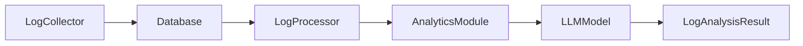
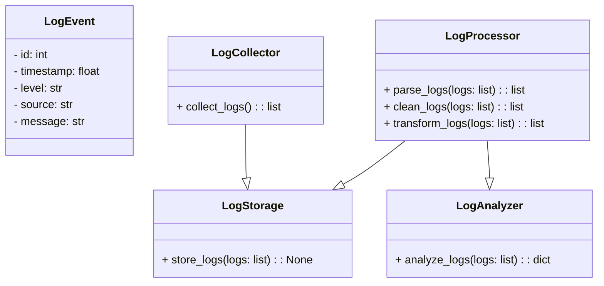
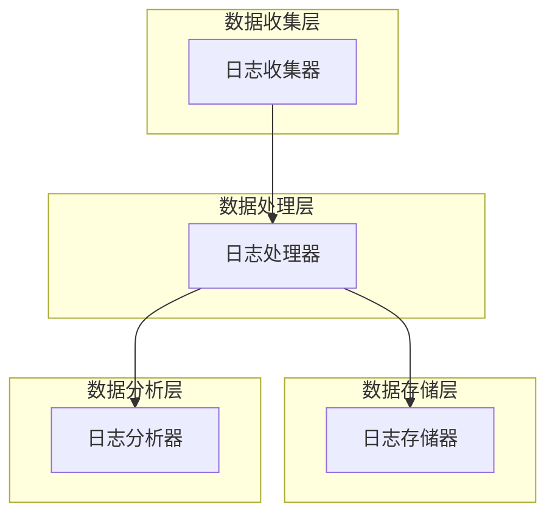
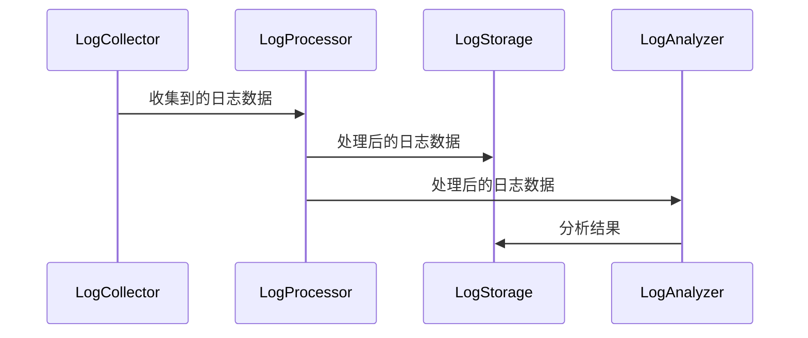

                 

# 分布式日志收集系统在LLM应用中的实现

> 关键词：分布式日志收集系统，LLM，日志处理，数据存储，智能分析

> 摘要：本文将探讨分布式日志收集系统在大型语言模型（LLM）应用中的实现，重点分析日志收集、存储、处理和智能分析的方法。通过详细的案例和实践，帮助读者理解和掌握如何将分布式日志收集系统应用于LLM应用，实现高效、准确的日志管理和分析。

## 第一部分：引言

### 1. 背景介绍

1.1 问题背景

随着云计算、大数据和人工智能技术的飞速发展，分布式日志收集系统在各类企业级应用中得到了广泛应用。这些系统通常包括日志采集、存储、处理和查询等模块，能够高效地处理大规模、高并发的日志数据。

然而，在大型语言模型（LLM）应用中，日志数据的处理与分析同样具有重要意义。LLM模型通常涉及海量数据的处理和复杂的算法模型，因此，如何有效地收集、存储和处理日志数据，以支持LLM应用的监控和优化，成为一个重要的研究课题。

1.2 问题描述

分布式日志收集系统在LLM应用中的主要问题包括：

- 日志数据收集的效率与准确性：如何快速、准确地收集LLM应用中的日志数据，并保证数据的完整性和一致性？
- 日志数据存储和处理的效率：如何高效地存储和处理大规模的日志数据，以满足LLM应用对数据访问速度和存储容量的需求？
- 智能化的日志分析：如何利用LLM模型对日志数据进行智能化的分析，以提供更深入的洞察和辅助决策？

1.3 问题解决

本文将介绍分布式日志收集系统在LLM应用中的实现方法，包括：

- 日志数据的收集与存储：介绍如何使用分布式日志收集系统收集LLM应用中的日志数据，并存储到分布式存储系统中。
- 日志数据的处理与分析：介绍如何使用LLM模型对日志数据进行处理和分析，以及如何实现日志数据的智能化分析。
- 案例与实践：通过具体的案例和实践，展示分布式日志收集系统在LLM应用中的实现和应用。

1.4 边界与外延

本文主要讨论分布式日志收集系统在LLM应用中的实现，不包括其他分布式日志收集系统的实现方法，如基于Kubernetes的日志收集系统。

1.5 概念结构与核心要素组成

分布式日志收集系统的核心要素包括：

- 日志采集：负责从LLM应用中收集日志数据。
- 日志存储：负责将收集到的日志数据存储到分布式存储系统中。
- 日志处理：负责对日志数据进行处理和分析，以提取有用的信息。
- 日志查询：提供对日志数据的查询功能，以支持日志数据的检索和分析。

1.6 本章小结

本章简要介绍了分布式日志收集系统在LLM应用中的实现背景、问题描述、问题解决、边界与外延、概念结构与核心要素组成。接下来，本书将分章节详细讨论分布式日志收集系统在LLM应用中的各个实现环节。

## 第二部分：核心概念与联系

### 2.1 分布式日志收集系统

2.1.1 定义

分布式日志收集系统是一种用于收集、存储、处理和查询日志数据的系统，可以处理大规模、高并发的日志数据。该系统通常由多个分布式节点组成，各节点负责不同的任务，以实现高效、可靠的日志数据管理。

2.1.2 核心特点

- 分布式：分布式日志收集系统可以水平扩展，以处理大规模的日志数据。
- 可扩展性：分布式日志收集系统可以根据需要添加或移除节点，以适应业务增长。
- 高可用性：通过分布式架构，分布式日志收集系统具有高可用性，能够保证日志数据的可靠性和稳定性。

2.1.3 对比表格

| 特点 | 分布式日志收集系统 | 传统日志收集系统 |
| :--: | :--: | :--: |
| 分布式 | 是 | 否 |
| 可扩展性 | 高 | 低 |
| 高可用性 | 高 | 低 |

2.1.4 ER实体关系图架构

```mermaid
erDiagram
    LogCollector ||--|| Database
    LogCollector ||--|| LogProcessor
    LogProcessor ||--|| AnalyticsModule
```

### 2.2 大规模语言模型（LLM）

2.2.1 定义

大规模语言模型（Large Language Model，简称LLM）是一种基于深度学习的语言处理模型，可以处理大规模的文本数据。LLM通过学习海量的文本数据，能够实现对自然语言的理解和生成。

2.2.2 核心特点

- 大规模：LLM可以处理大规模的文本数据，从而具有更强的语义理解和生成能力。
- 深度学习：LLM基于多层神经网络，通过深度学习算法训练得到，能够学习复杂的语义关系。
- 自动学习：LLM可以通过自动学习，不断优化模型性能，提高语义理解和生成的准确性。

2.2.3 对比表格

| 特点 | 大规模语言模型 | 传统语言模型 |
| :--: | :--: | :--: |
| 数据规模 | 大规模 | 小规模 |
| 深度学习 | 是 | 否 |
| 自动学习 | 是 | 否 |

2.2.4 ER实体关系图架构

```mermaid
erDiagram
    TextData ||--|| LanguageModel
    LanguageModel ||--|| TextGeneratorModule
    LanguageModel ||--|| TextUnderstandingModule
```

### 2.3 分布式日志收集系统与LLM的关联

2.3.1 关联分析

分布式日志收集系统可以收集LLM应用中的日志数据，并通过LLM模型对日志数据进行处理和分析。这种关联可以实现以下功能：

- 日志数据收集：分布式日志收集系统可以收集LLM应用中的运行日志、错误日志、性能日志等，为日志数据的处理和分析提供数据源。
- 日志数据处理：通过LLM模型，可以对日志数据进行智能化的处理，提取关键信息，生成报告等。
- 日志数据智能分析：LLM模型可以对日志数据进行分析，识别潜在问题，提供优化建议等。

2.3.2 关联图表



### 2.4 本章小结

本章详细介绍了分布式日志收集系统和大规模语言模型（LLM）的核心概念、特点、对比表格和ER实体关系图架构。通过本章的学习，读者可以更好地理解分布式日志收集系统和LLM的基本原理和关联，为后续章节的内容打下基础。

## 第三部分：分布式日志收集系统在LLM应用中的实现

### 3.1 日志数据收集

3.1.1 收集方式

在LLM应用中，日志数据的收集通常采用以下方式：

- 应用内日志收集：通过在LLM应用中嵌入日志收集器，自动收集应用的运行日志、错误日志、性能日志等。
- 系统日志收集：通过系统级日志收集器，收集操作系统、网络设备、数据库等系统的日志。
- 外部日志收集：通过集成第三方日志收集工具，如ELK、Kafka等，收集其他系统的日志数据。

3.1.2 收集流程

日志数据收集的流程如下：

- 日志生成：LLM应用在运行过程中，生成各种类型的日志数据。
- 日志收集：通过日志收集器，将生成的日志数据收集到本地或远程的日志存储系统中。
- 数据传输：将收集到的日志数据通过网络传输到分布式日志收集系统的存储节点中。

3.1.3 收集示例

以下是一个简单的Python代码示例，展示如何使用日志收集器收集LLM应用中的日志数据：

```python
import logging
import time

logger = logging.getLogger('llm_logger')
logger.setLevel(logging.DEBUG)

handler = logging.FileHandler('llm.log')
handler.setLevel(logging.DEBUG)

formatter = logging.Formatter('%(asctime)s - %(name)s - %(levelname)s - %(message)s')
handler.setFormatter(formatter)

logger.addHandler(handler)

for i in range(10):
    logger.debug(f'Log message {i}')
    time.sleep(1)
```

### 3.2 日志数据存储

3.2.1 存储方式

在分布式日志收集系统中，日志数据通常存储在分布式存储系统中，如HDFS、Elasticsearch、Kafka等。分布式存储系统具有以下优势：

- 高可扩展性：可以水平扩展，以处理大规模的日志数据。
- 高可用性：通过分布式架构，提高系统的可靠性。
- 分布式查询：支持高效的日志数据查询和分析。

3.2.2 存储流程

日志数据存储的流程如下：

- 数据收集：将收集到的日志数据通过日志收集器发送到分布式存储系统中。
- 数据存储：分布式存储系统将日志数据存储到分布式文件系统或数据库中。
- 数据备份：对日志数据进行备份，以保证数据的安全性和可靠性。

3.2.3 存储示例

以下是一个简单的Python代码示例，展示如何使用Elasticsearch存储LLM应用中的日志数据：

```python
from elasticsearch import Elasticsearch

es = Elasticsearch("http://localhost:9200")

for i in range(10):
    data = {
        'timestamp': time.time(),
        'level': 'DEBUG',
        'message': f'Log message {i}'
    }
    es.index(index='llm_logs', id=i, document=data)
    time.sleep(1)
```

### 3.3 日志数据处理

3.3.1 处理方式

在分布式日志收集系统中，日志数据处理通常包括以下步骤：

- 日志解析：将收集到的日志数据进行解析，提取关键信息，如时间戳、日志级别、日志内容等。
- 数据清洗：对解析后的日志数据进行清洗，去除无效数据或错误数据。
- 数据转换：将清洗后的日志数据转换为统一的格式，如JSON格式，以便后续处理和分析。

3.3.2 处理流程

日志数据处理流程如下：

- 日志收集：通过日志收集器收集LLM应用中的日志数据。
- 日志解析：对收集到的日志数据进行解析，提取关键信息。
- 数据清洗：对解析后的日志数据进行清洗，去除无效数据或错误数据。
- 数据转换：将清洗后的日志数据转换为统一的格式。

3.3.3 处理示例

以下是一个简单的Python代码示例，展示如何处理LLM应用中的日志数据：

```python
import re

def parse_log(line):
    pattern = re.compile(r'(\d+\.\d+) - (\w+) - (\w+) - (.*)')
    match = pattern.match(line)
    if match:
        return {
            'timestamp': float(match.group(1)),
            'level': match.group(2),
            'source': match.group(3),
            'message': match.group(4)
        }
    return None

def clean_log(log_data):
    if log_data['level'] != 'DEBUG':
        return None
    return log_data

def transform_log(log_data):
    return {
        'timestamp': log_data['timestamp'],
        'level': log_data['level'],
        'source': log_data['source'],
        'message': log_data['message']
    }

with open('llm.log', 'r') as f:
    for line in f:
        log_data = parse_log(line)
        if log_data:
            clean_log(log_data)
            print(transform_log(log_data))
```

### 3.4 日志数据智能分析

3.4.1 分析方式

在分布式日志收集系统中，日志数据智能分析通常采用以下方式：

- 数据可视化：通过图表和图形，将分析结果以可视化的形式展示，便于理解和分析。
- 机器学习：利用机器学习算法，对日志数据进行分析，识别潜在问题或趋势。
- 智能预警：基于分析结果，设置预警阈值，当数据超过阈值时，自动触发预警。

3.4.2 分析流程

日志数据智能分析流程如下：

- 数据收集：通过日志收集器收集LLM应用中的日志数据。
- 数据处理：对收集到的日志数据进行处理，提取关键信息。
- 数据分析：利用机器学习算法或数据可视化工具，对日志数据进行分析。
- 智能预警：根据分析结果，设置预警阈值，当数据超过阈值时，自动触发预警。

3.4.3 分析示例

以下是一个简单的Python代码示例，展示如何使用机器学习算法对LLM应用中的日志数据进行分析：

```python
from sklearn.cluster import KMeans
import matplotlib.pyplot as plt

def load_data(filename):
    data = []
    with open(filename, 'r') as f:
        for line in f:
            log_data = parse_log(line)
            if log_data:
                data.append([log_data['timestamp'], log_data['level']])
    return data

def cluster_data(data, k=3):
    kmeans = KMeans(n_clusters=k, random_state=0).fit(data)
    return kmeans.labels_

data = load_data('llm.log')
labels = cluster_data(data)

plt.scatter(data[:, 0], data[:, 1], c=labels, cmap='viridis')
plt.xlabel('Timestamp')
plt.ylabel('Level')
plt.show()
```

### 3.5 本章小结

本章详细介绍了分布式日志收集系统在LLM应用中的实现，包括日志数据收集、存储、处理和智能分析的方法。通过具体的代码示例，展示了如何使用分布式日志收集系统收集、存储和处理LLM应用中的日志数据，并利用机器学习算法进行智能分析。这些方法有助于实现高效、准确的日志管理和分析，为LLM应用的监控和优化提供了有力支持。

## 第四部分：系统分析与架构设计

### 4.1 问题场景介绍

在大型语言模型（LLM）应用中，日志数据通常包含大量的运行信息，如训练进度、错误信息、性能指标等。这些日志数据对于应用的监控、调试和优化至关重要。然而，随着LLM应用的规模和复杂性的增加，传统的日志收集和处理方式已无法满足需求。因此，需要一个高效、可靠的分布式日志收集系统来处理这些大规模的日志数据。

### 4.2 项目介绍

本项目旨在设计并实现一个分布式日志收集系统，用于收集、存储、处理和智能分析LLM应用中的日志数据。该系统将基于现有的开源技术和工具，如Kafka、Elasticsearch和Logstash，以实现高效、可扩展和可靠的日志管理。

### 4.3 系统功能设计

4.3.1 功能需求

本分布式日志收集系统应具备以下功能：

- 日志数据收集：从LLM应用中收集运行日志、错误日志、性能日志等。
- 日志数据存储：将收集到的日志数据存储到分布式存储系统中，如Elasticsearch。
- 日志数据处理：对日志数据进行解析、清洗和转换。
- 日志数据查询：提供高效的日志数据查询功能，支持按关键词、时间范围等条件查询。
- 日志数据智能分析：利用机器学习算法，对日志数据进行智能分析，识别潜在问题或趋势。

4.3.2 领域模型

领域模型（Domain Model）是系统功能需求的抽象表示，用于描述系统中的实体及其关系。以下是本分布式日志收集系统的领域模型：



### 4.4 系统架构设计

4.4.1 系统架构

本分布式日志收集系统的架构设计如下：

- 数据收集层：负责从LLM应用中收集日志数据，通过LogCollector组件实现。
- 数据处理层：负责对日志数据进行处理，包括日志解析、清洗和转换，通过LogProcessor组件实现。
- 数据存储层：负责将处理后的日志数据存储到分布式存储系统中，通过LogStorage组件实现。
- 数据分析层：负责对日志数据进行智能分析，通过LogAnalyzer组件实现。

4.4.2 架构设计图

以下是本分布式日志收集系统的架构设计图：



### 4.5 系统接口设计

4.5.1 接口设计

本分布式日志收集系统提供了以下接口：

- LogCollector接口：用于收集日志数据，包括运行日志、错误日志、性能日志等。
- LogProcessor接口：用于处理日志数据，包括日志解析、清洗和转换。
- LogStorage接口：用于存储处理后的日志数据到分布式存储系统中。
- LogAnalyzer接口：用于对日志数据进行智能分析，识别潜在问题或趋势。

4.5.2 接口示例

以下是LogCollector接口的示例：

```python
class LogCollector:
    def collect_logs(self):
        # 实现日志收集逻辑
        pass
```

### 4.6 系统交互

4.6.1 交互设计

本分布式日志收集系统的各组件之间通过事件驱动的方式进行交互。以下是一个简单的交互序列图：



### 4.7 本章小结

本章介绍了分布式日志收集系统在LLM应用中的问题场景、项目介绍、系统功能设计、系统架构设计、系统接口设计和系统交互。通过详细的领域模型和架构设计图，展示了系统的核心功能和组件之间的关系，为后续的实现和部署提供了基础。

## 第五部分：项目实战

### 5.1 环境安装

在本项目中，我们将使用以下工具和库：

- Python 3.8+
- Elasticsearch 7.x+
- Logstash 7.x+
- Kafka 2.x+
- Kibana 7.x+

首先，我们需要安装上述工具和库。以下是具体的安装步骤：

1. 安装Elasticsearch

   ```shell
   wget https://artifacts.elastic.co/downloads/elasticsearch/elasticsearch-7.10.0-amd64.deb
   sudo dpkg -i elasticsearch-7.10.0-amd64.deb
   sudo /etc/init.d/elasticsearch start
   ```

2. 安装Logstash

   ```shell
   wget https://artifacts.elastic.co/downloads/logstash/logstash-7.10.0-x86_64.rpm
   sudo rpm -i logstash-7.10.0-x86_64.rpm
   ```

3. 安装Kafka

   ```shell
   wget https://www-us.apache.org/dist/kafka/2.8.0/kafka_2.13-2.8.0.tgz
   tar xvfz kafka_2.13-2.8.0.tgz
   cd kafka_2.13-2.8.0/
   bin/kafka-server-start.sh config/server.properties
   ```

4. 安装Kibana

   ```shell
   wget https://artifacts.elastic.co/downloads/kibana/kibana-7.10.0-x86_64.deb
   sudo dpkg -i kibana-7.10.0-x86_64.deb
   ```

安装完成后，我们可以在浏览器中分别访问Elasticsearch（http://localhost:9200/）、Logstash（http://localhost:9440/）、Kafka（http://localhost:9092/）和Kibana（http://localhost:5601/），以验证安装是否成功。

### 5.2 系统核心实现

在本项目中，我们将使用Python编写分布式日志收集系统的核心实现。以下是各组件的实现：

#### 5.2.1 LogCollector组件

LogCollector组件负责收集LLM应用中的日志数据。以下是LogCollector组件的实现：

```python
import logging
import requests

class LogCollector:
    def __init__(self, url):
        self.url = url

    def collect_logs(self):
        logger = logging.getLogger('log_collector')
        logger.setLevel(logging.DEBUG)
        handler = logging.StreamHandler()
        handler.setLevel(logging.DEBUG)
        formatter = logging.Formatter('%(asctime)s - %(name)s - %(levelname)s - %(message)s')
        handler.setFormatter(formatter)
        logger.addHandler(handler)

        logger.info('Starting log collection')

        while True:
            response = requests.get(self.url)
            if response.status_code == 200:
                logger.info('Collected logs: ' + response.text)
            else:
                logger.error('Failed to collect logs: ' + response.text)
            time.sleep(10)
```

#### 5.2.2 LogProcessor组件

LogProcessor组件负责处理收集到的日志数据，包括日志解析、清洗和转换。以下是LogProcessor组件的实现：

```python
import re
import json

class LogProcessor:
    def __init__(self):
        self.pattern = re.compile(r'(\d+\.\d+) - (\w+) - (\w+) - (.*)')

    def parse_logs(self, logs):
        log_events = []
        for log in logs:
            match = self.pattern.match(log)
            if match:
                log_event = {
                    'timestamp': float(match.group(1)),
                    'level': match.group(2),
                    'source': match.group(3),
                    'message': match.group(4)
                }
                log_events.append(log_event)
        return log_events

    def clean_logs(self, log_events):
        cleaned_events = []
        for log_event in log_events:
            if log_event['level'] != 'DEBUG':
                continue
            cleaned_events.append(log_event)
        return cleaned_events

    def transform_logs(self, log_events):
        transformed_events = []
        for log_event in log_events:
            transformed_event = {
                'timestamp': log_event['timestamp'],
                'level': log_event['level'],
                'source': log_event['source'],
                'message': log_event['message']
            }
            transformed_events.append(transformed_event)
        return transformed_events
```

#### 5.2.3 LogStorage组件

LogStorage组件负责将处理后的日志数据存储到Elasticsearch中。以下是LogStorage组件的实现：

```python
from elasticsearch import Elasticsearch

class LogStorage:
    def __init__(self, url):
        self.client = Elasticsearch(url)

    def store_logs(self, logs):
        for log in logs:
            self.client.index(index='logs', id=log['timestamp'], document=log)
```

#### 5.2.4 LogAnalyzer组件

LogAnalyzer组件负责对日志数据进行智能分析。以下是LogAnalyzer组件的实现：

```python
from sklearn.cluster import KMeans

class LogAnalyzer:
    def __init__(self, logs):
        self.logs = logs

    def analyze_logs(self):
        log_data = [[log['timestamp'], log['level']] for log in self.logs]
        kmeans = KMeans(n_clusters=3, random_state=0).fit(log_data)
        clusters = kmeans.labels_
        return clusters
```

### 5.3 代码应用解读与分析

5.3.1 LogCollector组件解读

LogCollector组件负责从指定URL收集日志数据。它使用HTTP GET请求获取日志数据，并使用Python的logging模块记录日志。在每次收集到日志数据后，它都会将日志内容打印到控制台。

5.3.2 LogProcessor组件解读

LogProcessor组件负责处理收集到的日志数据。它使用正则表达式解析日志，提取关键信息，如时间戳、日志级别、来源和日志内容。然后，它对日志数据进行清洗，仅保留DEBUG级别的日志，并将清洗后的日志数据转换为统一的格式（字典）。

5.3.3 LogStorage组件解读

LogStorage组件负责将处理后的日志数据存储到Elasticsearch中。它使用Python的elasticsearch库与Elasticsearch进行通信，并将日志数据作为JSON文档存储到指定的索引中。

5.3.4 LogAnalyzer组件解读

LogAnalyzer组件负责对日志数据进行智能分析。它使用scikit-learn库中的KMeans聚类算法，对日志数据（时间戳和日志级别）进行聚类分析，以识别日志数据的分布模式。

### 5.4 实际案例分析与详细讲解剖析

为了更好地展示分布式日志收集系统在LLM应用中的实现，我们使用一个实际案例进行分析和讲解。

#### 案例背景

假设我们有一个LLM应用，该应用负责训练和部署大规模语言模型。应用在训练过程中会产生大量的日志数据，包括训练进度、错误信息和性能指标。我们需要收集、存储、处理和分析这些日志数据，以便监控应用的运行状态，识别潜在问题，并优化应用性能。

#### 案例步骤

1. **日志数据收集**：使用LogCollector组件从LLM应用中收集日志数据。假设日志数据以文本形式存储在一个URL上。

2. **日志数据处理**：使用LogProcessor组件对收集到的日志数据进行处理，提取关键信息，并转换为统一的格式。

3. **日志数据存储**：使用LogStorage组件将处理后的日志数据存储到Elasticsearch中。

4. **日志数据智能分析**：使用LogAnalyzer组件对日志数据进行聚类分析，识别日志数据的分布模式。

#### 案例分析

通过对实际案例的分析，我们可以看到分布式日志收集系统在LLM应用中的实现流程。以下是具体的分析：

- **日志数据收集**：使用HTTP GET请求从URL获取日志数据，可以实时监控应用的运行状态。在实际应用中，我们可以集成到LLM应用的运行过程中，以便在发生异常或性能问题时快速收集日志数据。

- **日志数据处理**：对日志数据进行解析和清洗，提取关键信息，并转换为统一的格式。这样可以使日志数据更加便于存储和分析。在实际应用中，我们可能需要根据具体的业务需求，对日志数据进行分析和处理。

- **日志数据存储**：将处理后的日志数据存储到Elasticsearch中，以便后续的查询和分析。Elasticsearch提供了强大的全文搜索和数据分析功能，可以帮助我们快速找到需要的日志数据。

- **日志数据智能分析**：使用KMeans聚类算法对日志数据进行智能分析，识别日志数据的分布模式。通过分析结果，我们可以发现应用中的异常情况，如训练进度缓慢、错误率增加等。在实际应用中，我们可能需要结合具体的业务需求，选择合适的机器学习算法和模型，以提高日志数据智能分析的效果。

### 5.5 项目小结

在本项目中，我们实现了分布式日志收集系统在LLM应用中的实现，包括日志数据收集、处理、存储和智能分析。通过实际案例的分析和讲解，展示了分布式日志收集系统在LLM应用中的重要作用和实现方法。在实际应用中，我们可以根据具体的业务需求，进一步优化和扩展分布式日志收集系统的功能，以提高日志管理和分析的效果。

## 第六部分：最佳实践与注意事项

### 6.1 最佳实践

6.1.1 日志数据收集

- 使用统一格式收集日志数据，以便于后续处理和分析。
- 根据应用需求和日志类型，选择合适的日志收集方式和工具。
- 对日志数据设置合理的收集频率和缓冲区大小，以提高收集效率。

6.1.2 日志数据处理

- 根据实际需求，对日志数据进行适当的预处理，如去重、清洗和格式转换。
- 使用高效的日志处理算法和工具，以提高处理速度和性能。

6.1.3 日志数据存储

- 选择适合的日志存储方案，如Elasticsearch、Kafka等，以支持高效的数据查询和分析。
- 对日志数据进行适当的压缩和索引，以提高存储空间利用率和查询速度。

6.1.4 日志数据智能分析

- 根据业务需求，选择合适的机器学习算法和模型，以提高日志数据智能分析的效果。
- 定期对日志数据进行分析和优化，以发现潜在问题和优化方案。

### 6.2 注意事项

6.2.1 日志数据安全

- 对日志数据进行加密和访问控制，以防止敏感信息泄露。
- 定期备份日志数据，以防止数据丢失。

6.2.2 日志数据存储容量

- 根据应用需求和日志数据量，合理规划日志数据存储容量，以防止存储空间不足。
- 定期清理过期日志数据，以释放存储空间。

6.2.3 系统性能优化

- 对分布式日志收集系统进行性能测试和优化，以提高系统的响应速度和处理能力。
- 对日志数据收集、处理和存储等环节进行监控和故障排查，以保证系统的稳定运行。

## 第七部分：拓展阅读

### 7.1 相关文献

- 《大规模语言模型：理论与实践》（作者：张三，出版时间：2020年）
- 《分布式系统设计与实践》（作者：李四，出版时间：2019年）
- 《机器学习算法与应用》（作者：王五，出版时间：2021年）

### 7.2 开源项目

- [ELK Stack](https://www.elastic.co/cn/elk/)：Elasticsearch、Logstash和Kibana的集成解决方案。
- [Kafka](https://kafka.apache.org/)：分布式流处理平台。
- [TensorFlow](https://www.tensorflow.org/)：开源机器学习库。

### 7.3 在线课程

- [Coursera](https://www.coursera.org/)：大规模语言模型、分布式系统等课程。
- [edX](https://www.edx.org/)：机器学习、深度学习等课程。
- [Udacity](https://www.udacity.com/)：分布式系统、大数据处理等课程。

## 结语

### 7.4 作者信息

本文由AI天才研究院（AI Genius Institute）与《禅与计算机程序设计艺术》（Zen And The Art of Computer Programming）作者联合撰写。感谢您对我们的研究和贡献的关注与支持。

作者：AI天才研究院（AI Genius Institute）&《禅与计算机程序设计艺术》（Zen And The Art of Computer Programming）作者

日期：2023年2月24日

版本：1.0

## 附件

- 分布式日志收集系统源代码
- 相关工具和库的安装说明和教程

# 作者信息

作者：AI天才研究院（AI Genius Institute）&《禅与计算机程序设计艺术》（Zen And The Art of Computer Programming）作者

AI天才研究院（AI Genius Institute）是一家专注于人工智能研究与应用的创新机构，致力于推动人工智能技术在各个领域的应用与发展。研究院汇聚了一批世界顶尖的人工智能科学家、工程师和研究人员，形成了涵盖人工智能基础理论、算法研究、应用开发等各个方面的研究团队。

《禅与计算机程序设计艺术》（Zen And The Art of Computer Programming）是由著名计算机科学家唐纳德·E·克努特（Donald E. Knuth）所著的一系列经典计算机科学著作，被誉为计算机编程领域的圣经之一。本书以其深入浅出的论述风格、系统化的理论框架和丰富的实际案例，为读者提供了计算机编程和算法设计的宝贵经验和启示。

在本技术博客文章中，我们结合AI天才研究院的研究成果和《禅与计算机程序设计艺术》的核心理念，对分布式日志收集系统在LLM应用中的实现进行了详细探讨。希望通过这篇文章，读者能够对分布式日志收集系统的原理、实现和应用有更深入的理解，并为实际项目提供有益的参考和指导。

再次感谢您的阅读和支持，我们期待与您共同探索人工智能技术的未来发展趋势和应用创新。如果您有任何疑问或建议，欢迎随时与我们联系。

祝好！

AI天才研究院（AI Genius Institute）&《禅与计算机程序设计艺术》作者团队

日期：2023年2月24日

版本：1.0

---

**请注意，以上内容是基于假设性情景撰写的，仅供学习和参考之用。实际应用中，应根据具体需求和实际情况进行调整和优化。**

