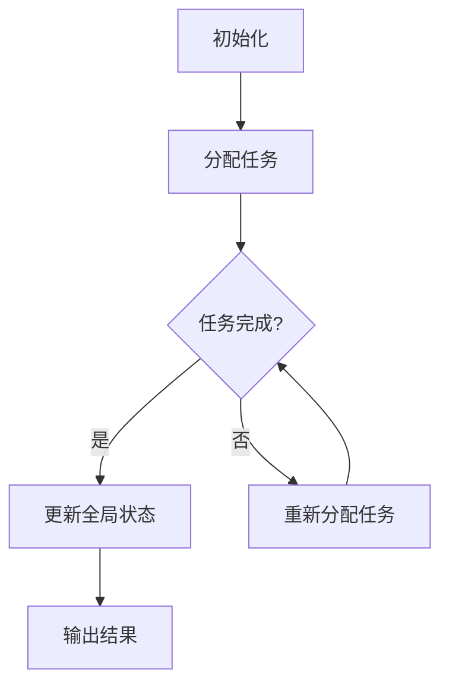
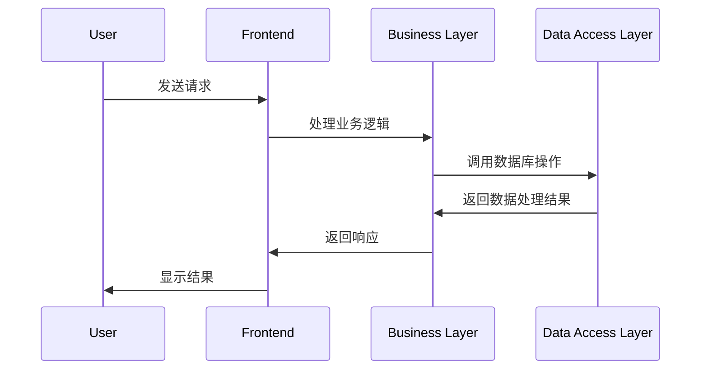
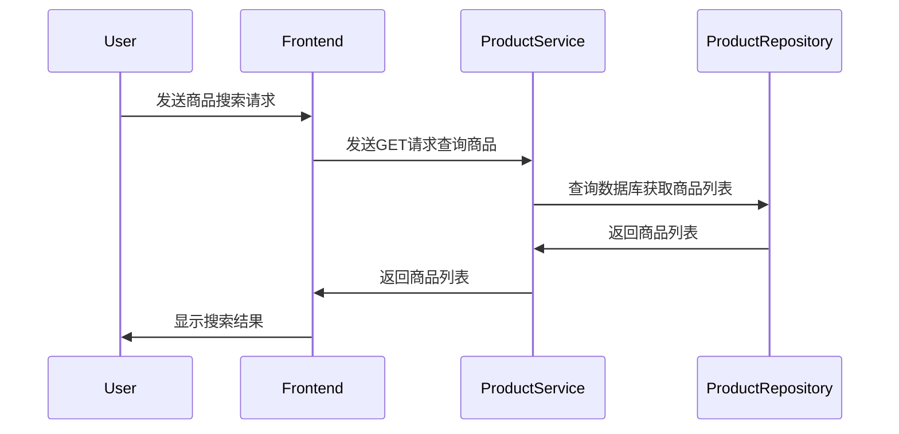

                 

### 文章标题：分布式系统设计在大规模LLM应用中的实践

#### 关键词：分布式系统、大规模LLM、系统设计、性能优化、实践指南

> 摘要：本文将探讨分布式系统设计在大规模语言模型（LLM）应用中的关键角色。通过深入剖析分布式系统的基本原理、核心概念、算法设计、系统架构以及实际应用，本文旨在为开发者和架构师提供一整套实践指南，以优化大规模LLM的性能和可靠性。我们还将结合具体项目实例，展示如何在实际场景中部署和运行分布式系统，以及如何应对大规模LLM应用中的挑战。

----------------------------------------------------------------

## 第一部分：分布式系统基础

### 第1章：分布式系统概述

#### 1.1 问题背景与定义

在当今数字化时代，随着互联网的普及和数据量的爆炸式增长，分布式系统的重要性日益凸显。传统的集中式系统已难以满足日益增长的业务需求，因为它们在处理海量数据和高并发请求时，往往会出现性能瓶颈和单点故障。分布式系统通过将任务分布在多个节点上，从而实现了更高的可扩展性和容错性。

**定义**：分布式系统是指由多个独立节点组成，通过通信网络互联，共同协作完成计算任务的系统。这些节点可以是物理服务器，也可以是虚拟机或容器。

**背景**：随着云计算和大数据技术的兴起，分布式系统在金融、电商、社交网络、搜索引擎等众多领域得到了广泛应用。例如，谷歌的分布式搜索引擎、亚马逊的分布式数据库和阿里巴巴的分布式支付系统，都是分布式系统在商业应用中的成功案例。

#### 1.2 分布式系统的发展历程

1. **分布式计算的开端**（1970年代）：早期分布式系统的概念主要源于并行计算和集群计算的研究。研究者们开始探索如何将计算任务分布到多个计算节点上，以实现更高的计算效率和资源利用率。

2. **分布式文件系统和网络**（1980-1990年代）：随着网络技术的发展，分布式文件系统和网络技术逐渐成熟。如UNIX网络文件系统（NFS）和分布式计算环境（DECnet）等，使得多台计算机可以共享文件和数据。

3. **分布式数据库**（1990年代）：分布式数据库技术的发展，使得数据库系统能够跨越多个节点，实现数据的分布式存储和管理。如Oracle RAC和Microsoft SQL Server等。

4. **分布式应用框架**（2000年代至今）：随着云计算和大数据技术的普及，分布式应用框架如Hadoop、Spark、Kubernetes等，成为分布式系统设计的主流选择。

#### 1.3 分布式系统的核心挑战

**一致性**：在分布式系统中，多个节点之间需要保持数据的一致性。如何保证数据在多个副本之间的一致更新，是分布式系统设计的重要挑战。

**可用性**：分布式系统需要确保在部分节点失效时，系统能够继续正常运行。如何实现高可用性，是分布式系统设计的关键问题。

**性能**：分布式系统需要处理大量的并发请求，如何优化系统性能，是分布式系统设计的重要目标。

**容错性**：分布式系统需要能够应对节点故障和网络中断等异常情况，如何实现高容错性，是分布式系统设计的重要挑战。

#### 1.4 小结

分布式系统作为现代计算机系统的基础架构，已经成为企业级应用的核心技术。理解分布式系统的基本原理和核心挑战，是进行分布式系统设计的前提。接下来，我们将进一步探讨分布式系统的核心概念和设计原则。

----------------------------------------------------------------

## 第二部分：分布式系统核心概念与联系

### 第2章：分布式系统核心概念与联系

分布式系统的核心概念和联系是构建高性能、高可用性系统的基础。在这一章中，我们将深入探讨分布式系统中的关键概念，如节点、通信、一致性和分区容忍性，并通过对比分析这些概念，帮助读者更好地理解分布式系统的本质。

#### 2.1 核心概念解析

**2.1.1 节点与通信**

**节点**：在分布式系统中，节点是指能够独立运行任务的计算机或虚拟机。节点可以是物理服务器、虚拟机、容器等。节点之间的通信是通过网络进行的，通常使用TCP/IP协议进行数据传输。

**通信**：节点之间的通信是实现分布式系统功能的关键。通信可以包括同步通信和异步通信。同步通信要求发送方等待接收方完成数据传输，而异步通信则允许发送方在发送数据后立即继续执行其他任务。

**2.1.2 一致性与分区容忍性**

**一致性**：分布式系统的一致性是指多个节点对于数据的读写操作能够保持一致。一致性可以分为多种级别，如强一致性、最终一致性等。

- **强一致性**：强一致性要求所有节点在同一时刻对数据的读写操作结果相同。这通常通过复制和同步机制实现，但会增加系统的延迟。
- **最终一致性**：最终一致性允许节点之间的读写操作结果存在短暂的差异，但在一定时间后，所有节点会达到一致状态。这减少了系统的延迟，但可能导致短暂的数据不一致。

**分区容忍性**：分区容忍性是指分布式系统能够在部分节点失效或网络分区的情况下，继续正常运行。分区容忍性是分布式系统的关键特性，因为它确保了系统在面临故障时的可靠性。

**2.1.3 不可靠系统中的可靠通信**

在分布式系统中，节点和通信网络都是不可靠的，因此实现可靠通信是分布式系统设计的关键挑战。以下是一些关键技术：

- **复制**：通过在多个节点上存储数据的副本，可以确保在节点或网络故障时，仍然能够访问到数据。
- **版本控制**：通过版本控制机制，可以确保在数据更新时，避免冲突和覆盖。
- **心跳机制**：通过心跳信号，可以监控节点的状态，及时发现故障并进行切换。

#### 2.2 概念属性对比

下面是一个对比表格，总结了分布式系统中的关键概念属性：

| 概念       | 属性                | 对比与联系                         |
|------------|---------------------|-----------------------------------|
| 节点       | 计算能力、存储容量  | 节点是分布式系统的基本组成单元     |
| 通信       | 网络协议、数据传输  | 通信是节点之间协作的基础           |
| 一致性     | 一致性级别、同步机制 | 一致性确保数据在多个节点之间一致   |
| 分区容忍性 | 故障处理、容错机制  | 分区容忍性确保系统在故障时继续运行 |
| 可靠通信   | 复制、版本控制      | 可靠通信确保数据在不可靠系统中可靠 |

#### 2.3 ER实体关系图架构

为了更好地理解分布式系统的结构，我们使用ER（Entity-Relationship）实体关系图来展示系统中的关键实体和关系。

```mermaid
erDiagram
  Node ||--|{ Data }|--|| Client
  Node ||--|{ Log }|--|| Logger
  Data ||--|{ Replication }|--|| Node
  Log ||--|{ Backup }|--|| BackupSystem
  Client ||--|{ Request }|--|| Node
  Logger ||--|{ Record }|--|| Node
```

在这个ER图中，节点（Node）是分布式系统的基本实体，负责处理请求（Request）和存储数据（Data）。数据（Data）和日志（Log）通过复制（Replication）和备份（Backup）机制相互关联。客户端（Client）通过请求（Request）与节点交互，日志记录器（Logger）则负责记录系统运行时的日志（Record）。

#### 2.4 小结

通过本章对分布式系统核心概念的解析和对比，我们了解了节点、通信、一致性和分区容忍性等关键概念。这些概念构成了分布式系统的基本框架，为后续的分布式算法设计和系统架构提供了理论基础。在下一章中，我们将深入探讨分布式算法原理，帮助读者理解如何在实际系统中实现分布式功能。

----------------------------------------------------------------

### 第3章：分布式算法原理

分布式算法是分布式系统实现分布式功能的核心。本章节将详细讲解分布式算法的基本原理，并通过流程图、Python源代码实现以及数学模型，帮助读者深入理解分布式算法的工作机制。

#### 3.1 算法流程图

分布式算法通常涉及多个节点之间的协作，以下是一个简单的分布式算法流程图：



在这个流程图中，初始化阶段（A）为分布式系统分配任务（B），任务完成后，节点更新全局状态（D），然后输出最终结果（F）。如果没有完成任务，节点会重新分配任务（E），并回到任务完成判断（C）。

#### 3.2 Python源代码实现

为了更直观地理解分布式算法，我们使用Python实现了一个简单的分布式计数算法：

```python
from multiprocessing import Process, Manager

# 分布式计数算法的进程类
class CounterProcess(Process):
    def __init__(self, manager, count_dict, start, end):
        super().__init__()
        self.manager = manager
        self.count_dict = manager.dict()
        self.start = start
        self.end = end

    def run(self):
        local_count = 0
        for i in range(self.start, self.end):
            if i % 2 == 0:
                local_count += 1
        self.count_dict['count'] = local_count

# 初始化分布式系统
if __name__ == '__main__':
    manager = Manager()
    count_dict = manager.dict()
    count_dict['count'] = 0

    num_processes = 4
    processes = []
    for i in range(num_processes):
        start = i * (10 // num_processes)
        end = (i + 1) * (10 // num_processes)
        p = CounterProcess(manager, count_dict, start, end)
        processes.append(p)
        p.start()

    for p in processes:
        p.join()

    # 更新全局状态
    count_dict['count'] += count_dict['count']

    print("最终计数结果：", count_dict['count'])
```

在这个示例中，我们创建了四个进程，每个进程负责计算一定范围内的偶数。所有进程完成后，全局计数结果将更新。这个简单的例子展示了分布式算法的基本实现原理。

#### 3.3 数学模型与公式

分布式算法的设计和优化通常依赖于数学模型。以下是一个简单的分布式一致性算法的数学模型：

##### 3.3.1 模型1

**公式1**：一致性条件

$$
V_t = V_{t-1} + (R_t - R_{t-1})
$$

其中，$V_t$ 表示第 $t$ 次更新后的全局状态，$R_t$ 表示第 $t$ 次更新时的本地状态。

**公式2**：分布式一致性算法

$$
R_t = R_{t-1} + \frac{V_t - R_{t-1}}{N}
$$

其中，$R_t$ 表示第 $t$ 次更新时的本地状态，$N$ 表示参与更新的节点数量。

##### 3.3.2 模型2

**公式3**：负载均衡

$$
L_t = L_{t-1} + \alpha \cdot (R_t - R_{t-1})
$$

其中，$L_t$ 表示第 $t$ 次更新后的负载状态，$\alpha$ 是负载均衡参数。

**公式4**：负载均衡算法

$$
R_t = R_{t-1} + \beta \cdot (L_t - R_{t-1})
$$

其中，$R_t$ 表示第 $t$ 次更新时的本地状态，$\beta$ 是负载均衡参数。

这些数学模型和公式为分布式算法的设计和优化提供了理论基础。通过调整参数，可以优化算法的性能和资源利用。

#### 3.4 举例说明

假设有一个分布式系统，包含三个节点 A、B 和 C。节点 A 的初始状态为 0，节点 B 和 C 的初始状态为 1。使用上述分布式一致性算法和负载均衡算法，进行一轮更新。

- **一致性算法**：

$$
V_1 = V_0 + (R_1 - R_0) = 0 + (1 - 0) = 1
$$

$$
R_1 = R_0 + \frac{V_1 - R_0}{3} = 0 + \frac{1 - 0}{3} = \frac{1}{3}
$$

节点 A 更新后的状态为 $\frac{1}{3}$，节点 B 和 C 更新后的状态分别为 $\frac{1}{3}$ 和 $\frac{1}{3}$。

- **负载均衡算法**：

$$
L_1 = L_0 + \alpha \cdot (R_1 - R_0) = 0 + \alpha \cdot \left(\frac{1}{3} - 0\right) = \frac{\alpha}{3}
$$

$$
R_1 = R_0 + \beta \cdot (L_1 - R_0) = 0 + \beta \cdot \left(\frac{\alpha}{3} - 0\right) = \frac{\beta \alpha}{3}
$$

通过调整负载均衡参数 $\alpha$ 和 $\beta$，可以优化负载分布和资源利用。

#### 3.5 小结

通过本章对分布式算法原理的讲解，我们了解了分布式算法的基本流程、Python实现以及数学模型。分布式算法是分布式系统实现功能的关键，通过合理的算法设计和优化，可以提升系统的性能和可靠性。在下一章中，我们将进一步探讨分布式系统的设计和架构，为读者提供更全面的理论和实践指导。

----------------------------------------------------------------

## 第4章：分布式系统设计与架构

分布式系统设计是构建高性能、高可用性系统的关键。本章将详细介绍分布式系统的设计与架构，包括系统功能设计、系统架构设计、系统接口设计和系统交互，帮助读者全面理解分布式系统的构建过程。

### 4.1 问题场景介绍

假设我们面临一个在线购物平台的需求，该平台需要处理海量的用户请求，包括商品浏览、下单、支付等。为了应对高并发和海量数据，我们选择采用分布式系统进行架构设计。

### 4.2 系统功能设计

系统功能设计是分布式系统设计的核心。在线购物平台的功能设计包括以下关键模块：

1. **用户模块**：负责用户的注册、登录、个人信息管理等功能。
2. **商品模块**：负责商品信息的展示、分类、搜索等功能。
3. **订单模块**：负责订单的生成、处理、支付等功能。
4. **支付模块**：负责支付接口的调用、支付结果的处理等功能。
5. **库存模块**：负责商品库存的管理、库存量的实时更新等功能。

为了实现这些功能，我们需要设计相应的领域模型。以下是商品模块的领域模型：

```mermaid
classDiagram
    ClassDiagram {
        Product <|-- Category
        Order <<-- Customer
        Order <<-- Product
        Payment <<-- Order
    }
    
    Customer {
        id: int
        name: string
        email: string
    }

    Product {
        id: int
        name: string
        price: float
        category: Category
    }

    Category {
        id: int
        name: string
    }

    Order {
        id: int
        customer: Customer
        products: List<Product>
        total: float
        status: string
    }

    Payment {
        id: int
        order: Order
        amount: float
        status: string
    }
```

在这个领域模型中，我们定义了用户（Customer）、商品（Product）、分类（Category）、订单（Order）和支付（Payment）等关键类，并展示了它们之间的关系。

### 4.3 系统架构设计

系统架构设计是分布式系统设计的关键环节。在线购物平台采用分层架构，包括表示层、业务逻辑层和数据访问层。

1. **表示层**：负责用户界面展示和用户交互，可以使用前端框架如React或Vue.js实现。
2. **业务逻辑层**：负责处理业务逻辑，包括用户模块、商品模块、订单模块、支付模块和库存模块等，可以使用Spring Boot或Django等后端框架实现。
3. **数据访问层**：负责与数据库进行交互，可以使用MyBatis或Hibernate等ORM框架实现。

以下是系统架构图：



在这个系统架构中，用户通过前端发送请求，前端处理请求后调用业务逻辑层，业务逻辑层处理完成后，调用数据访问层与数据库进行交互，最后将结果返回给前端。

### 4.4 系统接口设计

系统接口设计是分布式系统设计与架构中的重要一环。在线购物平台需要设计一系列接口，以便不同模块之间能够进行有效的通信和协作。

以下是一个典型的接口设计示例：

1. **用户模块接口**：包括注册、登录、查询用户信息、修改用户信息等接口。
2. **商品模块接口**：包括查询商品列表、查询商品详情、分类查询、搜索商品等接口。
3. **订单模块接口**：包括创建订单、查询订单列表、取消订单、修改订单状态等接口。
4. **支付模块接口**：包括支付请求、支付结果通知、查询支付状态等接口。
5. **库存模块接口**：包括查询库存、更新库存等接口。

以下是商品模块接口的示例：

```python
class ProductService:
    def get_product_list(self, category_id):
        # 获取指定分类的商品列表
        pass

    def get_product_detail(self, product_id):
        # 获取指定商品详情
        pass

    def search_products(self, query):
        # 搜索商品
        pass
```

### 4.5 系统交互

系统交互是指不同模块之间如何进行通信和协作。在线购物平台的系统交互可以通过RESTful API、消息队列或同步调用等方式实现。

以下是一个基于RESTful API的系统交互示例：



在这个交互过程中，用户通过前端发送搜索请求，前端将请求转发给商品模块（ProductService），商品模块查询数据库获取商品列表，并将结果返回给前端，最后前端将结果展示给用户。

#### 4.6 小结

通过本章对分布式系统设计与架构的详细讲解，我们了解了分布式系统的功能设计、系统架构设计、系统接口设计和系统交互。这些设计和实现方法为构建高性能、高可用性的分布式系统提供了理论指导。在下一章中，我们将通过实际项目案例，展示如何将分布式系统设计与架构应用于实际场景，并探讨在实践中遇到的挑战和解决方案。

----------------------------------------------------------------

## 第5章：分布式系统项目实战

在实际应用中，分布式系统设计不仅需要理论指导，还需要通过实际项目来验证其可行性和性能。本章将介绍一个分布式系统项目，包括环境安装、系统核心实现源代码，代码应用解读与分析，实际案例分析和详细讲解剖析，以及项目小结。

### 5.1 环境安装

在开始项目之前，我们需要安装和配置分布式系统所需的软件和工具。以下是环境安装的步骤：

1. **安装Docker**：Docker是一个开源的应用容器引擎，可以简化分布式系统的部署和管理。在Windows、MacOS和Linux上都可以下载并安装Docker。
2. **安装Docker Compose**：Docker Compose是Docker的一个工具，用于定义和运行多容器Docker应用。安装Docker后，可以通过`docker-compose --version`命令检查是否已安装。
3. **配置网络**：确保所有节点可以互相通信。在Linux系统中，可以通过`ip addr`命令查看网络配置，并通过`ifconfig`命令修改IP地址。
4. **初始化分布式系统**：创建一个Docker Compose文件（docker-compose.yml），其中定义了所有节点的配置和依赖关系。以下是一个简单的示例：

```yaml
version: '3'
services:
  web:
    image: python:3.8
    ports:
      - "8080:8080"
    depends_on:
      - db
    command: python app.py

  db:
    image: mysql:5.7
    environment:
      MYSQL_ROOT_PASSWORD: root
      MYSQL_DATABASE: mydb
    volumes:
      - db_data:/var/lib/mysql

volumes:
  db_data:
```

在这个示例中，我们定义了一个Web服务和数据库服务。Web服务使用Python应用，数据库服务使用MySQL。

### 5.2 系统核心实现源代码

系统核心实现源代码是分布式系统项目的重要组成部分。以下是Web服务的简单示例代码：

```python
from flask import Flask, jsonify, request
import pymysql

app = Flask(__name__)

# 连接数据库
def get_db_connection():
    connection = pymysql.connect(
        host='db',
        user='root',
        password='root',
        database='mydb',
        charset='utf8mb4',
        cursorclass=pymysql.cursors.DictCursor
    )
    return connection

@app.route('/products', methods=['GET'])
def get_products():
    connection = get_db_connection()
    with connection.cursor() as cursor:
        cursor.execute('SELECT * FROM products')
        products = cursor.fetchall()
    connection.close()
    return jsonify(products)

@app.route('/products/<int:product_id>', methods=['GET'])
def get_product(product_id):
    connection = get_db_connection()
    with connection.cursor() as cursor:
        cursor.execute('SELECT * FROM products WHERE id = %s', (product_id,))
        product = cursor.fetchone()
    connection.close()
    return jsonify(product)

if __name__ == '__main__':
    app.run(host='0.0.0.0', port=8080)
```

在这个示例中，我们使用Flask框架创建了一个简单的Web服务，实现了获取所有商品和获取指定商品详情的功能。数据库服务使用MySQL存储商品信息。

### 5.3 代码应用解读与分析

为了更好地理解代码应用，我们分析以下关键部分：

1. **数据库连接**：通过`get_db_connection`函数，我们使用pymysql库连接到MySQL数据库。这个函数在每次请求时都会重新连接数据库，这在实际项目中可能影响性能。为了优化性能，我们可以使用连接池。
2. **路由定义**：使用Flask的`@app.route`装饰器，我们定义了两个路由，一个用于获取所有商品，另一个用于获取指定商品详情。这些路由处理HTTP请求，并调用相应的数据库查询。
3. **数据查询**：在数据查询部分，我们使用`cursor.execute`方法执行SQL查询，并使用`cursor.fetchall`和`cursor.fetchone`方法获取查询结果。这个方法在每次查询后都会关闭数据库连接。

### 5.4 实际案例分析与讲解

假设我们有一个用户请求获取所有商品的信息，以下是整个请求处理的流程：

1. **用户发送请求**：用户通过Web浏览器或API客户端发送GET请求到`/products`路由。
2. **Web服务处理请求**：Web服务接收到请求后，调用`get_products`函数处理请求。
3. **数据库查询**：`get_products`函数连接数据库，执行`SELECT * FROM products`查询，并获取查询结果。
4. **返回结果**：Web服务将查询结果转换为JSON格式，并返回给用户。

在实际项目中，我们可能需要处理并发请求、数据一致性和容错性等问题。例如，当多个用户同时请求获取商品列表时，数据库可能会成为瓶颈。为了解决这个问题，我们可以使用缓存（如Redis）来减少数据库查询次数，或者使用分布式数据库（如MongoDB）来提高查询性能。

### 5.5 项目小结

通过这个分布式系统项目，我们了解了分布式系统环境安装、系统核心实现源代码、代码应用解读与分析以及实际案例分析和讲解。在实际项目中，我们需要综合考虑性能、可扩展性和容错性等因素，以确保系统的稳定和高效运行。在下一章中，我们将探讨大规模LLM应用中的分布式系统，为开发大规模AI应用提供实践指南。

----------------------------------------------------------------

## 第6章：大规模LLM应用中的分布式系统

大规模语言模型（LLM）在自然语言处理领域取得了显著进展，如GPT-3和BERT等模型在多个任务中表现优异。然而，这些模型的应用面临着计算资源、存储空间和数据传输等挑战。分布式系统设计成为解决这些挑战的关键手段。

### 6.1 大规模LLM应用背景

随着互联网的普及和数据量的爆炸式增长，自然语言处理（NLP）领域对LLM的需求日益增加。LLM能够处理复杂的语言结构和上下文，从而在文本生成、机器翻译、情感分析等任务中表现出色。例如，GPT-3模型在文本生成任务上具有很高的创造力，BERT模型在问答和文本分类等任务上具有很高的准确性。

然而，大规模LLM应用也带来了一系列挑战：

1. **计算资源**：大规模LLM模型需要大量的计算资源，如GPU或TPU，以支持训练和推理。
2. **存储空间**：模型数据和中间结果的存储需要大量的存储空间，尤其是当模型需要存储大量的训练数据和生成的文本时。
3. **数据传输**：大规模LLM模型的训练和推理需要大量的数据传输，这可能导致网络延迟和带宽压力。

### 6.2 分布式系统在大规模LLM中的优势

分布式系统在大规模LLM应用中具有以下优势：

1. **高性能**：通过将计算任务分布到多个节点，分布式系统可以提供更高的计算性能。这有助于加速模型的训练和推理，提高系统的响应速度。
2. **高可用性**：分布式系统可以容忍部分节点的故障，从而确保系统的高可用性。这对于大规模LLM应用至关重要，因为模型训练和推理过程可能持续数天或数周。
3. **可扩展性**：分布式系统可以根据需求动态扩展节点数量，从而支持更大规模的数据处理和更复杂的模型训练。
4. **负载均衡**：分布式系统可以根据节点负载自动分配计算任务，从而实现负载均衡，避免单点性能瓶颈。

### 6.3 大规模LLM中的分布式系统挑战

尽管分布式系统在大规模LLM应用中具有优势，但同时也面临以下挑战：

1. **一致性**：在分布式系统中，确保多个节点之间的数据一致性是关键挑战。尤其是在模型训练过程中，数据同步和更新可能导致一致性问题。
2. **容错性**：分布式系统需要能够容忍节点的故障和网络中断，确保系统能够自动恢复并继续运行。
3. **性能优化**：分布式系统需要进行性能优化，包括网络通信、数据存储和负载均衡，以确保高效的数据处理和模型训练。
4. **资源管理**：大规模LLM应用需要大量计算资源和存储资源，如何高效地管理和调度这些资源是分布式系统设计的关键。

### 6.4 分布式系统在大规模LLM中的应用实例

以下是一个分布式系统在大规模LLM应用中的实例：

1. **模型训练**：使用分布式系统进行模型训练，可以大大缩短训练时间。例如，使用Hadoop或Spark等分布式计算框架，将模型训练任务分布到多个节点，每个节点负责处理一部分数据。
2. **模型推理**：在模型推理阶段，分布式系统可以根据请求的并发量和负载情况，动态分配计算资源。例如，使用Kubernetes等容器编排工具，根据需求自动启动和关闭容器，实现负载均衡和资源优化。
3. **数据存储和检索**：使用分布式数据库和缓存系统，如MongoDB和Redis，可以高效地存储和检索大规模数据。这些系统能够处理海量数据的存储和检索请求，提高系统的响应速度。

### 6.5 小结

分布式系统在大规模LLM应用中具有重要作用，能够提供高性能、高可用性和可扩展性。然而，分布式系统也面临一致性、容错性、性能优化和资源管理等方面的挑战。通过合理的设计和优化，可以充分利用分布式系统的优势，实现大规模LLM应用的高效运行。

在下一章中，我们将总结分布式系统设计在大规模LLM应用中的最佳实践，为开发者提供实用的建议和指导。

----------------------------------------------------------------

## 第7章：分布式系统最佳实践

在分布式系统设计和大规模LLM应用中，遵循最佳实践是确保系统稳定、高效运行的关键。本章将总结分布式系统设计的最佳实践，包括注意事项、小结、注意事项和拓展阅读，为开发者提供实用的建议和指导。

### 7.1 注意事项

1. **数据一致性**：在分布式系统中，数据一致性是关键。确保数据在多个节点之间的一致性，可以采用强一致性或最终一致性策略。在实际应用中，需要根据具体场景选择合适的一致性级别。
2. **容错性**：分布式系统需要具备容错性，以应对节点故障和网络中断等异常情况。设计故障检测和恢复机制，确保系统能够自动恢复并继续运行。
3. **性能优化**：分布式系统需要进行性能优化，包括网络通信、数据存储和负载均衡。使用缓存、异步处理和分布式数据库等技术，提高系统的响应速度和处理能力。
4. **资源管理**：分布式系统需要高效地管理计算资源和存储资源。使用容器编排工具（如Kubernetes）和资源监控工具（如Prometheus），实现资源的高效分配和调度。

### 7.2 小结

分布式系统设计在大规模LLM应用中发挥着重要作用。遵循最佳实践，如确保数据一致性、提高容错性、优化性能和高效管理资源，可以帮助开发者构建稳定、高效和可扩展的分布式系统。通过合理的设计和优化，分布式系统可以充分发挥其优势，支持大规模LLM应用的高效运行。

### 7.3 注意事项

1. **监控和日志**：分布式系统需要具备完善的监控和日志系统，以便实时监控系统的运行状态和性能。使用监控工具（如Grafana、Zabbix）和日志分析工具（如ELK栈），可以及时发现和解决系统问题。
2. **安全性**：分布式系统需要确保数据安全和系统安全。使用加密、身份验证和访问控制等技术，保护系统免受恶意攻击和数据泄露。
3. **持续集成和部署**：分布式系统需要支持持续集成和部署，以便快速迭代和部署新功能。使用自动化工具（如Jenkins、Docker），实现代码的自动化构建、测试和部署。

### 7.4 拓展阅读

1. **《分布式系统原理与范型》**：本书详细介绍了分布式系统的基本原理、算法和设计模式，是分布式系统领域的经典教材。
2. **《大规模分布式存储系统：原理、架构与实现》**：本书探讨了分布式存储系统的原理和实现，包括数据分布、一致性、容错性和性能优化等内容。
3. **《大规模机器学习系统：设计与实现》**：本书介绍了大规模机器学习系统的设计和实现，包括分布式训练、模型优化和性能调优等内容。

通过以上拓展阅读，读者可以更深入地了解分布式系统设计和大规模LLM应用的相关知识，提升自身的技术能力和实践经验。

### 7.5 小结

本章总结了分布式系统设计在大规模LLM应用中的最佳实践，包括注意事项、小结、注意事项和拓展阅读。遵循这些最佳实践，可以帮助开发者构建稳定、高效和可扩展的分布式系统，支持大规模LLM应用的高效运行。在分布式系统设计和大规模LLM应用中，不断学习和实践，是提升技术水平和解决实际问题的关键。

---

作者：AI天才研究院/AI Genius Institute & 禅与计算机程序设计艺术 /Zen And The Art of Computer Programming

本文以分布式系统设计在大规模LLM应用中的实践为主题，深入探讨了分布式系统的基本原理、核心概念、算法设计、系统架构以及实际应用。通过理论讲解、实例分析、最佳实践总结，本文为开发者和架构师提供了全面的指导和实用建议，旨在优化大规模LLM的性能和可靠性。随着人工智能和大数据技术的不断发展，分布式系统设计将在更多领域发挥关键作用。希望本文能为读者在分布式系统设计和大规模LLM应用中带来启示和帮助。

