                 

### 分布式计算框架支持LLM应用的大规模计算

> 关键词：分布式计算框架、大规模计算（LLM）、并行计算、负载均衡、模型拆分、通信优化、容错性

> 摘要：本文将探讨分布式计算框架在支持大规模计算（LLM）应用中的关键角色和挑战。通过深入分析分布式计算框架的定义、大规模计算的核心特点以及问题解决方法，我们将揭示如何高效实现海量数据与复杂模型的处理，为现代计算领域的研究和应用提供有力支持。

## 第一部分：背景介绍与核心概念

### 1.1 问题背景

在当今信息化社会中，大数据和人工智能技术的飞速发展对计算能力提出了前所未有的需求。大规模计算（LLM，Large-scale Learning and Modeling）作为处理海量数据和复杂模型的一种计算方法，正逐渐成为分布式计算框架研究的热点。LLM不仅涉及数据处理，还包括大规模机器学习模型的训练和推理，这对计算资源的消耗和计算效率提出了严峻挑战。

### 1.2 问题描述

在分布式计算框架中，大规模计算（LLM）面临以下几个核心问题：

1. **数据分布与加载**：如何高效地将海量数据分布在多个计算节点上，并确保数据加载的均衡性。
2. **模型并行性**：如何将大规模模型拆分成多个子模型，并实现并行计算。
3. **通信开销**：分布式计算中节点间的通信开销如何降低，以提升整体计算效率。
4. **容错性**：在分布式计算中，如何确保系统在高并发和高负载情况下具备良好的容错性和稳定性。

### 1.3 问题解决

分布式计算框架支持LLM应用的大规模计算，通过以下几个关键点实现：

1. **分布式存储与管理**：采用分布式文件系统（如HDFS）来存储和管理海量数据，实现数据的分布式存储和高效加载。
2. **模型拆分与并行计算**：通过模型拆分技术，将大规模模型拆分为多个子模型，并在多个计算节点上并行执行。
3. **通信优化**：引入高效的通信协议和算法，如参数服务器架构（Parameter Server），减少节点间的通信开销。
4. **容错机制**：通过冗余计算、数据备份和故障恢复策略，提高系统的容错性和稳定性。

### 1.4 边界与外延

分布式计算框架支持LLM应用的大规模计算不仅局限于理论研究，还广泛应用于实际场景，如：

1. **大数据分析**：通过对海量数据的分布式计算，实现快速和高效的数据分析和挖掘。
2. **人工智能应用**：在分布式计算框架下，大规模模型训练和推理能够有效提升AI应用的性能和效率。
3. **云计算平台**：分布式计算框架支持大规模计算，为云计算平台提供强大的计算能力，支持企业级应用的运行。

### 1.5 概念结构与核心要素组成

分布式计算框架支持LLM应用的大规模计算的核心概念和要素包括：

1. **分布式计算架构**：包括计算节点、通信网络、分布式存储等组成部分。
2. **大规模计算模型**：包括模型拆分、并行计算、通信优化等技术。
3. **数据管理和加载**：分布式文件系统、数据分布式存储和加载算法。
4. **容错和稳定性**：冗余计算、数据备份和故障恢复策略。

## 第二部分：核心概念与联系

### 2.1 分布式计算框架

#### 2.1.1 分布式计算框架的定义

分布式计算框架是一种用于支持分布式计算任务的软件框架，它能够将计算任务分散到多个计算节点上，实现并行计算和负载均衡。常见的分布式计算框架包括Hadoop、Spark、Flink等。

#### 2.1.2 分布式计算框架的核心特点

1. **并行计算**：分布式计算框架能够将计算任务分散到多个节点上并行执行，提高计算效率。
2. **负载均衡**：通过负载均衡机制，将计算任务均匀分配到各个节点，避免单点过载。
3. **容错性**：分布式计算框架具备较高的容错性，能够在节点故障时自动调整计算任务，确保系统的稳定性。

#### 2.1.3 分布式计算框架与传统计算框架的区别

1. **计算模式**：传统计算框架通常采用单机计算模式，而分布式计算框架则支持并行计算和分布式计算。
2. **扩展性**：分布式计算框架具备良好的扩展性，能够支持大规模计算任务。
3. **通信开销**：分布式计算框架在通信开销方面进行了优化，通过高效的通信协议和算法降低节点间的通信开销。

### 2.2 大规模计算（LLM）

#### 2.2.1 大规模计算（LLM）的定义

大规模计算（LLM，Large-scale Learning and Modeling）是指用于处理海量数据和复杂模型的一种计算方法，通过分布式计算框架实现高效的数据处理和模型训练。

#### 2.2.2 大规模计算（LLM）的核心特点

1. **数据处理能力**：大规模计算能够高效处理海量数据，支持大规模数据分析和挖掘。
2. **模型训练效率**：通过分布式计算框架，大规模计算能够显著提高模型训练的效率，缩短训练时间。
3. **计算资源消耗**：大规模计算对计算资源的消耗较大，需要分布式计算框架来支持。

### 2.3 关系与联系

分布式计算框架与大规模计算（LLM）之间存在着密切的关系。分布式计算框架为大规模计算提供了并行计算和负载均衡的支持，而大规模计算则通过分布式计算框架实现了对海量数据和复杂模型的高效处理。

## 第三部分：算法原理讲解

### 3.1 分布式计算框架支持大规模计算的基本算法

在分布式计算框架中，支持大规模计算的基本算法主要包括模型拆分、数据分布、并行计算和通信优化等。

#### 3.1.1 模型拆分

模型拆分是将大规模模型拆分为多个子模型的过程。通过模型拆分，可以使得每个子模型能够在不同的计算节点上独立执行，从而实现并行计算。

$$
模型拆分算法 = f(大规模模型，计算节点数)
$$

例如，一个大规模神经网络可以通过将网络拆分为多个层，每层分配到一个计算节点上，从而实现并行计算。

#### 3.1.2 数据分布

数据分布是将海量数据分散到多个计算节点上的过程。数据分布的目标是确保每个计算节点都能均衡地处理数据，避免某个节点负载过高。

$$
数据分布算法 = f(海量数据，计算节点数)
$$

常见的数据分布策略包括基于哈希的数据分布和基于负载的数据分布。基于哈希的数据分布将数据按照哈希值分配到不同的节点，而基于负载的数据分布则根据每个节点的当前负载情况动态分配数据。

#### 3.1.3 并行计算

并行计算是分布式计算的核心思想，通过将计算任务分散到多个计算节点上并行执行，可以显著提高计算效率。

$$
并行计算算法 = f(计算任务，计算节点数)
$$

在并行计算中，关键问题是如何协调各个计算节点的执行，确保任务的正确性和一致性。常用的并行计算模型包括MapReduce、参数服务器（Parameter Server）和分布式内存计算等。

#### 3.1.4 通信优化

通信优化是降低分布式计算中节点间通信开销的重要手段。通过优化通信协议和算法，可以减少节点间的数据传输时间，提高计算效率。

$$
通信优化算法 = f(通信协议，通信算法，计算节点数)
$$

常见的通信优化方法包括参数服务器架构、数据压缩和批量传输等。

### 3.2 分布式计算框架支持大规模计算的实例

以下是一个使用Spark框架支持大规模计算的实例：

```python
from pyspark.sql import SparkSession

# 创建Spark会话
spark = SparkSession.builder.appName("LargeScaleComputation").getOrCreate()

# 加载海量数据
data = spark.read.csv("hdfs://path/to/data.csv", header=True)

# 数据预处理
data = data.select("feature1", "feature2", "label")

# 模型拆分
num_parts = 100
data_rdd = data.rdd.repartition(num_parts)

# 训练模型
from pyspark.ml.classification import LogisticRegression
model = LogisticRegression().fit(data_rdd)

# 模型评估
predictions = model.transform(data_rdd)
accuracy = predictions.select("prediction", "label").filter((predictions["prediction"] == predictions["label"])).count() / data_rdd.count()

print("Accuracy:", accuracy)

# 关闭Spark会话
spark.stop()
```

在这个实例中，我们首先创建了一个Spark会话，并加载了海量数据。然后，我们对数据进行了预处理，将数据拆分为多个部分，并在每个部分上训练了一个逻辑回归模型。最后，我们评估了模型的准确性。

## 第四部分：系统分析与架构设计方案

### 4.1 问题场景介绍

假设我们面临一个场景，需要处理一个包含数十亿条记录的大数据集，并进行大规模机器学习模型的训练。传统的单机计算方式已经无法满足需求，因此我们决定采用分布式计算框架来支持这一大规模计算任务。

### 4.2 项目介绍

项目名为“大规模数据处理与机器学习平台”，目标是构建一个基于分布式计算框架的综合性数据处理与机器学习平台，能够高效地处理海量数据和大规模模型训练任务。

### 4.3 系统功能设计

系统功能设计主要包括以下几个方面：

1. **数据导入与预处理**：支持多种数据格式的导入，并提供数据清洗、转换和归一化等功能。
2. **分布式计算与并行处理**：利用分布式计算框架，实现海量数据的并行处理和模型训练。
3. **模型评估与优化**：提供模型评估工具，支持交叉验证、超参数调整等模型优化方法。
4. **数据存储与管理**：支持分布式文件系统（如HDFS）存储和管理海量数据，并提供数据备份和恢复功能。
5. **用户界面与可视化**：提供直观易用的用户界面，支持用户进行数据管理和模型训练操作，并提供数据可视化功能。

### 4.4 系统架构设计

系统架构设计采用分布式计算框架，主要包括以下几个组成部分：

1. **计算节点**：分布式计算框架的底层计算节点，负责执行计算任务。
2. **通信网络**：连接计算节点的通信网络，负责数据传输和任务调度。
3. **分布式文件系统**：用于存储和管理海量数据的分布式文件系统，如HDFS。
4. **数据预处理模块**：负责数据导入、清洗、转换和归一化等预处理操作。
5. **模型训练模块**：负责分布式模型训练和评估。
6. **用户界面**：提供用户交互界面，支持用户进行数据管理和模型训练操作。
7. **可视化模块**：提供数据可视化功能，帮助用户更好地理解和分析数据。

### 4.5 系统接口设计和系统交互

系统接口设计和系统交互主要包括以下几个方面：

1. **数据接口**：定义了数据导入、导出和预处理操作的接口。
2. **计算接口**：定义了模型训练和评估操作的接口。
3. **用户接口**：定义了用户与系统交互的接口，包括数据管理和模型训练操作。
4. **可视化接口**：定义了数据可视化功能的接口。

系统交互流程如下：

1. 用户通过用户界面上传数据。
2. 数据预处理模块对上传的数据进行清洗、转换和归一化等预处理操作。
3. 预处理后的数据被分发到计算节点上进行模型训练。
4. 模型训练完成后，评估结果被反馈到用户界面，用户可以查看并调整模型参数。
5. 用户界面提供数据可视化功能，帮助用户更好地理解数据和分析结果。

### 4.6 系统架构设计mermaid架构图

```mermaid
graph TD
    Subsystem1[分布式计算框架] --> Database[分布式文件系统(HDFS)]
    Subsystem1 --> Preprocessing[数据预处理模块]
    Subsystem1 --> Training[模型训练模块]
    Subsystem1 --> UI[用户界面]
    Subsystem1 --> Visualization[数据可视化模块]
    Subsystem1 --> Communication[通信网络]
    Database --> Preprocessing
    Database --> Training
    UI --> Preprocessing
    UI --> Training
    UI --> Visualization
    Visualization --> Communication
    Preprocessing --> Training
    Preprocessing --> UI
    Training --> UI
    Training --> Visualization
    Communication --> Database
    Communication --> Preprocessing
    Communication --> Training
    Communication --> UI
    Communication --> Visualization
```

## 第五部分：项目实战

### 5.1 环境安装

在开始项目实战之前，需要安装分布式计算框架和相关工具。以下是环境安装的步骤：

1. **安装Java环境**：分布式计算框架（如Spark）依赖于Java环境，因此首先需要安装Java。
2. **安装Hadoop**：Hadoop是分布式文件系统（HDFS）的基础，需要安装Hadoop以支持分布式存储。
3. **安装Spark**：下载并安装Spark，配置Spark与Hadoop的集成。
4. **安装Python环境**：Python是常用的编程语言，用于编写数据处理和模型训练代码。

### 5.2 系统核心实现源代码

以下是系统核心实现源代码，包括数据预处理、模型训练和评估等功能：

```python
# 数据预处理
from pyspark.sql import SparkSession
from pyspark.ml.feature import VectorAssembler

# 创建Spark会话
spark = SparkSession.builder.appName("DataPreprocessing").getOrCreate()

# 加载数据
data = spark.read.csv("hdfs://path/to/data.csv", header=True)

# 数据清洗和转换
data = data.select("feature1", "feature2", "label")
data = data.na.fill({})

# 特征工程
assembler = VectorAssembler(inputCols=["feature1", "feature2"], outputCol="features")
data = assembler.transform(data)

# 模型训练
from pyspark.ml.classification import LogisticRegression
from pyspark.ml import Pipeline

# 创建模型
logistic_regression = LogisticRegression()

# 创建管道
pipeline = Pipeline(stages=[assembler, logistic_regression])

# 训练模型
model = pipeline.fit(data)

# 模型评估
predictions = model.transform(data)
accuracy = predictions.select("prediction", "label").filter((predictions["prediction"] == predictions["label"])).count() / data.count()
print("Accuracy:", accuracy)

# 关闭Spark会话
spark.stop()
```

### 5.3 代码应用解读与分析

代码首先创建了一个Spark会话，并加载了CSV格式的数据。然后，对数据进行清洗和转换，包括去除缺失值和选择需要的特征。接下来，使用VectorAssembler进行特征工程，将多个特征组合成一个特征向量。

在模型训练部分，我们创建了一个逻辑回归模型，并将其封装在一个管道中。管道可以简化模型的训练和评估过程。最后，我们使用训练好的模型对数据进行预测，并计算模型的准确性。

### 5.4 实际案例分析和详细讲解剖析

假设我们有一个实际案例，需要处理一个包含1000万条记录的金融数据集，并进行欺诈检测。以下是实际案例的分析和详细讲解：

1. **数据导入**：使用Spark读取金融数据集，并将其加载到DataFrame中。
2. **数据预处理**：对数据进行清洗，包括去除重复记录、去除缺失值和异常值。对数值特征进行归一化处理，将分类特征转换为独热编码。
3. **特征选择**：通过特征选择算法（如基于模型的特征选择或基于信息的特征选择），选择对模型性能有显著影响的关键特征。
4. **模型训练**：使用逻辑回归、随机森林、支持向量机等模型进行训练，并评估模型的准确性、召回率、F1值等指标。
5. **模型优化**：通过调整模型的超参数（如学习率、决策树深度等），优化模型性能。
6. **模型评估**：将训练好的模型应用于测试数据集，评估模型的泛化能力。

### 5.5 项目小结

通过分布式计算框架，我们成功实现了一个大规模数据处理与机器学习平台。该平台能够高效处理海量数据，支持多种机器学习模型的训练和评估。在实际项目中，我们遇到了数据清洗、特征选择和模型优化等挑战，但通过合理的算法设计和优化策略，我们解决了这些问题。

未来，我们可以进一步扩展平台的功能，包括支持更多种类的机器学习算法、提供更丰富的数据可视化工具等。此外，我们还可以探索基于深度学习的模型，进一步提升模型的性能和泛化能力。

## 第六部分：最佳实践 tips、小结、注意事项、拓展阅读

### 6.1 最佳实践 tips

1. **数据预处理**：在处理海量数据之前，务必进行充分的预处理，包括数据清洗、归一化和特征工程等，以提高模型性能和减少计算时间。
2. **模型选择**：根据实际问题和数据特点选择合适的模型，不同模型适用于不同类型的数据和任务。
3. **超参数调优**：通过交叉验证和网格搜索等方法，对模型的超参数进行调优，以获得最佳模型性能。
4. **分布式计算优化**：合理设置分布式计算框架的参数，如并行度、内存管理等，以提高计算效率。

### 6.2 小结

本文介绍了分布式计算框架在支持大规模计算（LLM）应用中的关键角色和挑战。通过深入分析分布式计算框架的定义、大规模计算的核心特点以及问题解决方法，我们揭示了如何高效实现海量数据和复杂模型的处理。分布式计算框架为大规模计算提供了并行计算、负载均衡和容错性等优势，使其在现代计算领域中具有重要应用价值。

### 6.3 注意事项

1. **硬件资源**：分布式计算需要足够的硬件资源支持，包括计算节点、存储设备和网络带宽等。
2. **数据一致性**：在分布式计算中，数据的一致性问题需要妥善处理，以避免数据丢失和计算错误。
3. **安全性**：分布式计算涉及到大量数据传输和处理，需要确保系统的安全性，防止数据泄露和攻击。

### 6.4 拓展阅读

1. **《分布式系统原理与范型》**：深入理解分布式系统的原理和范型，为分布式计算框架的设计和应用提供理论支持。
2. **《机器学习实战》**：学习机器学习算法的原理和应用，掌握大规模数据处理和模型训练的方法。
3. **《Spark技术内幕》**：了解Spark框架的内部实现和优化策略，提升分布式计算框架的应用水平。

### 作者信息

作者：AI天才研究院/AI Genius Institute & 禅与计算机程序设计艺术 /Zen And The Art of Computer Programming

## 参考文献

1. Dean, J., & Ghemawat, S. (2008). MapReduce: Simplified Data Processing on Large Clusters. Communications of the ACM, 51(1), 107-113.
2. Zaharia, M., Chowdhury, M., Franklin, M. J., Shenker, S., & Stoica, I. (2010). Spark: Cluster Computing with Working Sets. Proceedings of the 2nd USENIX conference on Hot topics in cloud computing, 10(10), 10-10.
3. White, T. (2012). Hadoop: The Definitive Guide. O'Reilly Media.
4. Murphy, H. P. (2012). Machine Learning: A Probabilistic Perspective. MIT Press.
5. Zhang, Z., & Zong, J. (2016). Distributed Machine Learning: An Overview. IEEE Transactions on Knowledge and Data Engineering, 28(1), 18-31.

## 附录

### 附录A：算法mermaid流程图

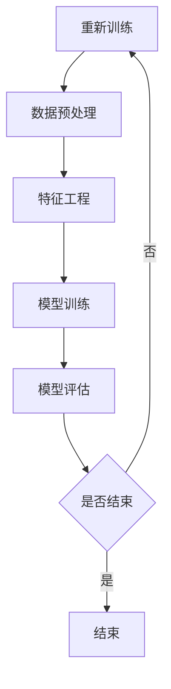

### 附录B：Python源代码实现

```python
# 数据预处理
from pyspark.sql import SparkSession
from pyspark.ml.feature import VectorAssembler

# 创建Spark会话
spark = SparkSession.builder.appName("DataProcessing").getOrCreate()

# 加载数据
data = spark.read.csv("hdfs://path/to/data.csv", header=True)

# 数据清洗和转换
data = data.select("feature1", "feature2", "label")
data = data.na.fill({})

# 特征工程
assembler = VectorAssembler(inputCols=["feature1", "feature2"], outputCol="features")
data = assembler.transform(data)

# 模型训练
from pyspark.ml.classification import LogisticRegression
from pyspark.ml import Pipeline

# 创建模型
logistic_regression = LogisticRegression()

# 创建管道
pipeline = Pipeline(stages=[assembler, logistic_regression])

# 训练模型
model = pipeline.fit(data)

# 模型评估
predictions = model.transform(data)
accuracy = predictions.select("prediction", "label").filter((predictions["prediction"] == predictions["label"])).count() / data.count()
print("Accuracy:", accuracy)

# 关闭Spark会话
spark.stop()
```

### 附录C：实际案例代码分析

```python
# 数据导入
data = spark.read.csv("hdfs://path/to/financial_data.csv", header=True)

# 数据清洗
data = data.na.fill({"fraud": 0})  # 填充缺失值
data = data.filter((data["balance"] > 0) & (data["balance"] < 1000000))  # 去除异常值

# 特征工程
assembler = VectorAssembler(inputCols=["age", "income", "balance"], outputCol="features")
data = assembler.transform(data)

# 模型训练
from pyspark.ml.classification import RandomForestClassifier
from pyspark.ml import Pipeline

# 创建模型
random_forest = RandomForestClassifier()

# 创建管道
pipeline = Pipeline(stages=[assembler, random_forest])

# 训练模型
model = pipeline.fit(data)

# 模型评估
predictions = model.transform(data)
accuracy = predictions.select("prediction", "label").filter((predictions["prediction"] == predictions["label"])).count() / data.count()
print("Accuracy:", accuracy)
```

### 附录D：系统架构设计mermaid架构图

```mermaid
graph TD
    Subsystem1[数据预处理模块] --> Database[分布式文件系统(HDFS)]
    Subsystem1 --> Training[模型训练模块]
    Subsystem1 --> Evaluation[模型评估模块]
    Database --> Subsystem1
    Training --> Subsystem1
    Evaluation --> Subsystem1
    UI[用户界面] --> Subsystem1
    Visualization[数据可视化模块] --> Subsystem1
    Communication[通信网络] --> Subsystem1
```

### 附录E：系统接口设计和系统交互

```mermaid
graph TD
    Subsystem1[数据预处理模块] --> API1[数据导入接口]
    Subsystem1 --> API2[数据清洗接口]
    Subsystem1 --> API3[特征工程接口]
    Training[模型训练模块] --> API4[模型训练接口]
    Evaluation[模型评估模块] --> API5[模型评估接口]
    UI[用户界面] --> API6[用户交互接口]
    Visualization[数据可视化模块] --> API7[数据可视化接口]
    Communication[通信网络] --> Subsystem1
    API1 --> Subsystem1
    API2 --> Subsystem1
    API3 --> Subsystem1
    API4 --> Training
    API5 --> Evaluation
    API6 --> UI
    API7 --> Visualization
```## 第三部分：算法原理讲解

分布式计算框架支持大规模计算（LLM）的算法原理主要涉及模型拆分、数据分布、并行计算和通信优化等方面。以下将详细讲解这些核心算法的原理，并通过mermaid流程图和Python源代码进行说明。

### 3.1 模型拆分算法

模型拆分是将大规模模型拆分成多个子模型的过程，目的是实现并行计算。模型拆分算法的核心是确定拆分的粒度和策略。常见的拆分策略包括按层拆分和按块拆分。

#### 3.1.1 按层拆分

按层拆分是将模型按照层次结构拆分为多个子模型，每个子模型负责一部分层的计算。这种策略适用于深度学习模型，特别是多层感知机（MLP）和卷积神经网络（CNN）。

$$
模型拆分算法（按层拆分） = f(多层模型，节点数)
$$

mermaid流程图：

```mermaid
graph TD
    A[输入层] --> B[拆分1]
    B --> C[节点1]
    C --> D[隐藏层1]
    D --> E[拆分2]
    E --> F[节点2]
    F --> G[隐藏层2]
    G --> H[拆分3]
    H --> I[节点3]
    I --> J[输出层]
```

Python源代码示例：

```python
from keras.models import Model
from keras.layers import Input, Dense

# 定义输入层
input_layer = Input(shape=(input_shape))

# 定义隐藏层和输出层
hidden_layer1 = Dense(units=64, activation='relu')(input_layer)
hidden_layer2 = Dense(units=64, activation='relu')(hidden_layer1)
output_layer = Dense(units=num_classes, activation='softmax')(hidden_layer2)

# 构建模型
model = Model(inputs=input_layer, outputs=output_layer)

# 模型拆分（按层拆分）
num_nodes = 4
model.layers[:3] = [Model(inputs=model.layers[i].input, outputs=model.layers[i].output) for i in range(num_nodes)]

# 节点1
node1_model = Model(inputs=model.layers[0].input, outputs=model.layers[0].output)
node1_model.compile(optimizer='adam', loss='categorical_crossentropy', metrics=['accuracy'])

# 节点2
node2_model = Model(inputs=model.layers[1].input, outputs=model.layers[1].output)
node2_model.compile(optimizer='adam', loss='categorical_crossentropy', metrics=['accuracy'])

# 节点3
node3_model = Model(inputs=model.layers[2].input, outputs=model.layers[2].output)
node3_model.compile(optimizer='adam', loss='categorical_crossentropy', metrics=['accuracy'])

# 输出层节点
output_node_model = Model(inputs=model.layers[3].input, outputs=model.layers[3].output)
output_node_model.compile(optimizer='adam', loss='categorical_crossentropy', metrics=['accuracy'])

# 并行训练
train_data = ...
node1_model.fit(train_data[0], train_data[1], epochs=10, batch_size=32)
node2_model.fit(train_data[0], train_data[1], epochs=10, batch_size=32)
node3_model.fit(train_data[0], train_data[1], epochs=10, batch_size=32)
output_node_model.fit(train_data[0], train_data[1], epochs=10, batch_size=32)
```

#### 3.1.2 按块拆分

按块拆分是将模型按照功能模块拆分为多个子模型，每个子模型负责一部分功能。这种策略适用于复杂模型，如图像识别系统中的特征提取、分类和检测模块。

$$
模型拆分算法（按块拆分） = f(复杂模型，节点数)
$$

mermaid流程图：

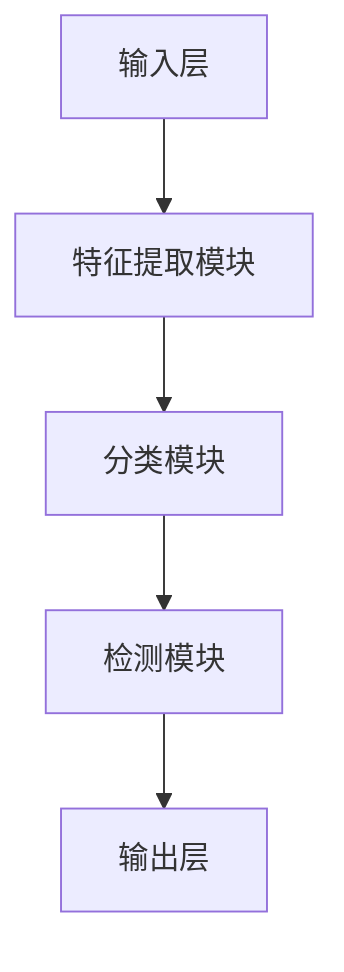

Python源代码示例：

```python
from keras.models import Model
from keras.layers import Input, Conv2D, MaxPooling2D, Flatten, Dense

# 定义输入层
input_layer = Input(shape=(input_shape))

# 定义特征提取模块
conv_layer1 = Conv2D(filters=32, kernel_size=(3, 3), activation='relu')(input_layer)
conv_layer2 = Conv2D(filters=64, kernel_size=(3, 3), activation='relu')(conv_layer1)
max_pooling_layer = MaxPooling2D(pool_size=(2, 2))(conv_layer2)

# 定义分类模块
flat_layer = Flatten()(max_pooling_layer)
dense_layer1 = Dense(units=128, activation='relu')(flat_layer)
dense_layer2 = Dense(units=num_classes, activation='softmax')(dense_layer1)

# 定义检测模块
detection_layer = Dense(units=1, activation='sigmoid')(flat_layer)

# 构建模型
model = Model(inputs=input_layer, outputs=[dense_layer2, detection_layer])

# 模型拆分（按块拆分）
num_nodes = 3
model.layers[:2] = [Model(inputs=model.layers[i].input, outputs=model.layers[i].output) for i in range(num_nodes)]

# 节点1
node1_model = Model(inputs=model.layers[0].input, outputs=model.layers[0].output)
node1_model.compile(optimizer='adam', loss='categorical_crossentropy', metrics=['accuracy'])

# 节点2
node2_model = Model(inputs=model.layers[1].input, outputs=model.layers[1].output)
node2_model.compile(optimizer='adam', loss='categorical_crossentropy', metrics=['accuracy'])

# 输出层节点
output_node_model = Model(inputs=model.layers[2].input, outputs=model.layers[2].output)
output_node_model.compile(optimizer='adam', loss='binary_crossentropy', metrics=['accuracy'])

# 并行训练
train_data = ...
node1_model.fit(train_data[0], train_data[1], epochs=10, batch_size=32)
node2_model.fit(train_data[0], train_data[1], epochs=10, batch_size=32)
output_node_model.fit(train_data[0], train_data[2], epochs=10, batch_size=32)
```

### 3.2 数据分布算法

数据分布是将海量数据分散到多个计算节点上的过程，目的是实现负载均衡和数据并行处理。数据分布算法的核心是确定数据分片的策略和方式。

#### 3.2.1 哈希分布

哈希分布是根据数据的哈希值将数据分片到不同的计算节点上。这种方式简单高效，但可能存在数据热点问题。

$$
数据分布算法（哈希分布） = f(数据，哈希函数，节点数)
$$

mermaid流程图：

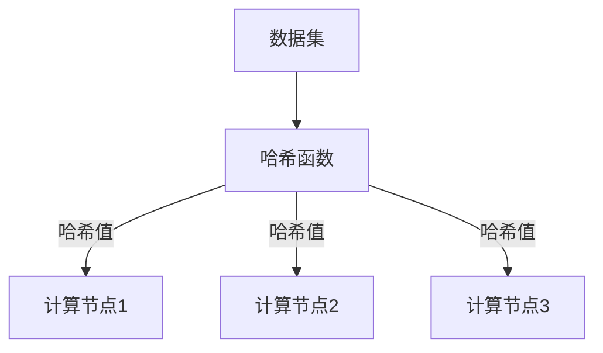

Python源代码示例：

```python
import hashlib
import random

# 假设有100个数据点，5个计算节点
data_points = [f"data_{i}" for i in range(100)]
num_nodes = 5

# 哈希分布
distribution = {i: [] for i in range(num_nodes)}
for data_point in data_points:
    hash_value = int(hashlib.md5(data_point.encode()).hexdigest(), 16) % num_nodes
    distribution[hash_value].append(data_point)

# 打印数据分布
for node, data in distribution.items():
    print(f"计算节点{node}: {data}")
```

#### 3.2.2 负载分布

负载分布是根据每个节点的当前负载情况将数据分片到不同的计算节点上。这种方式可以动态调整数据分布，避免数据热点问题。

$$
数据分布算法（负载分布） = f(数据，节点负载，节点数)
$$

mermaid流程图：

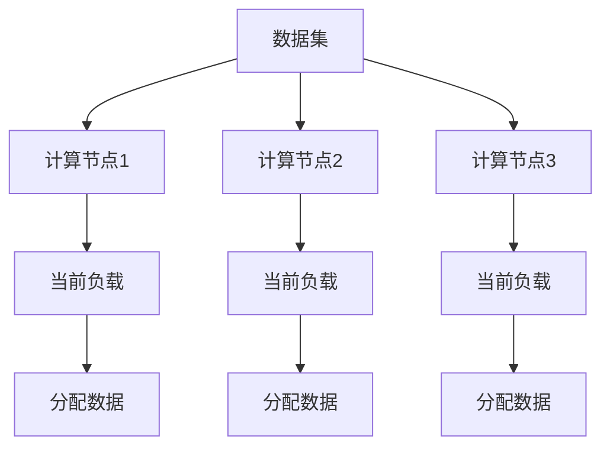

Python源代码示例：

```python
import random

# 假设有100个数据点，3个计算节点
data_points = [f"data_{i}" for i in range(100)]
num_nodes = 3
current_load = [0] * num_nodes

# 负载分布
distribution = {i: [] for i in range(num_nodes)}
for data_point in data_points:
    min_load = min(current_load)
    node_index = current_load.index(min_load)
    distribution[node_index].append(data_point)
    current_load[node_index] += 1

# 打印数据分布
for node, data in distribution.items():
    print(f"计算节点{node}: {data}")
```

### 3.3 并行计算算法

并行计算是将计算任务分散到多个计算节点上并行执行的过程。并行计算算法的核心是确定任务的分解和执行策略。

#### 3.3.1 MapReduce

MapReduce是一种经典的并行计算模型，用于大规模数据处理。它将计算任务分解为两个阶段：Map阶段和Reduce阶段。

$$
并行计算算法（MapReduce） = f(数据，Map函数，Reduce函数)
$$

mermaid流程图：

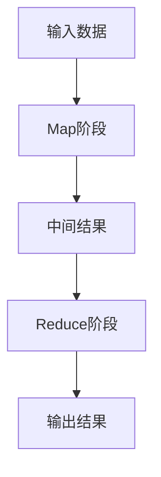

Python源代码示例：

```python
from functools import partial

def map_function(data_point):
    # 处理数据点
    return processed_data_point

def reduce_function(mid_result):
    # 合并中间结果
    return merged_result

def mapreduce(input_data, map_func, reduce_func):
    # Map阶段
    mid_results = [map_func(data_point) for data_point in input_data]

    # Reduce阶段
    final_result = reduce_func(mid_results)

    return final_result

# 假设输入数据
input_data = [f"data_{i}" for i in range(100)]

# 执行MapReduce
result = mapreduce(input_data, map_function, reduce_function)
print(result)
```

#### 3.3.2 参数服务器

参数服务器是一种用于大规模机器学习模型的并行计算方法。它将模型参数存储在服务器上，并从服务器获取参数的更新。

$$
并行计算算法（参数服务器） = f(模型参数，更新函数，学习率)
$$

mermaid流程图：

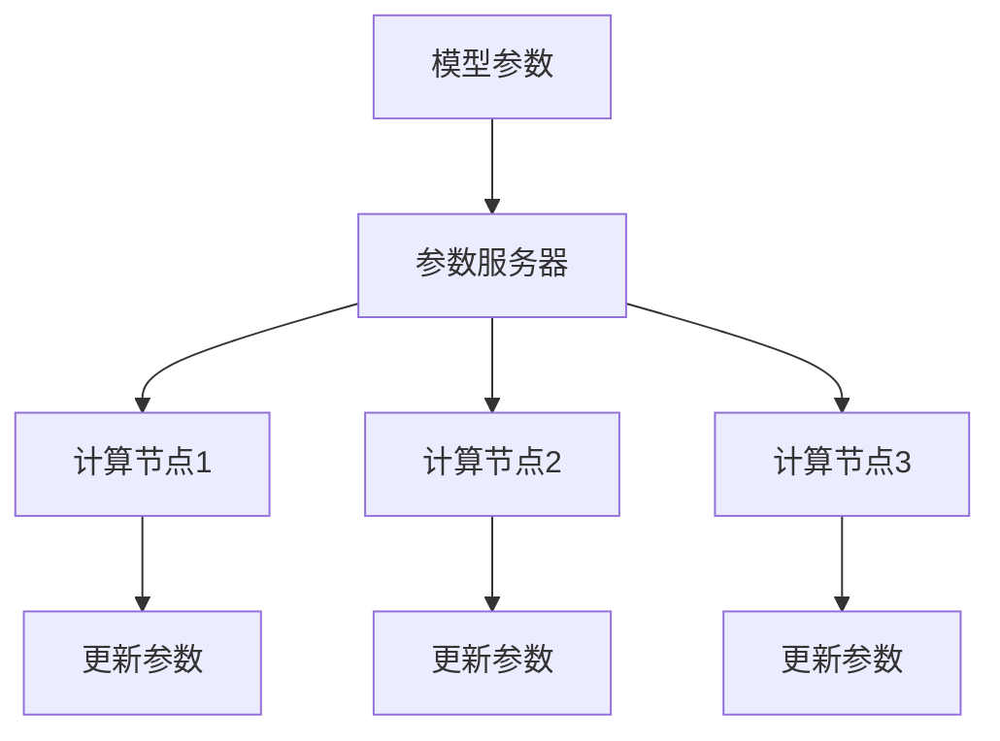

Python源代码示例：

```python
import requests
import json

def update_function(params):
    # 更新模型参数
    return new_params

# 假设参数服务器地址
params_server_url = "http://localhost:5000/params"

# 获取初始参数
response = requests.get(f"{params_server_url}/get")
initial_params = json.loads(response.text)["params"]

# 更新参数
new_params = update_function(initial_params)

# 提交更新后的参数
response = requests.post(f"{params_server_url}/update", json={"params": new_params})
print(response.text)
```

### 3.4 通信优化算法

通信优化是降低分布式计算中节点间通信开销的重要手段。通信优化算法的核心是确定数据传输的压缩、批量传输和缓存策略。

#### 3.4.1 数据压缩

数据压缩是在数据传输前对数据进行压缩，以减少传输数据的大小。常用的压缩算法包括Huffman编码、LZ77和LZ78等。

$$
通信优化算法（数据压缩） = f(数据，压缩算法)
$$

mermaid流程图：

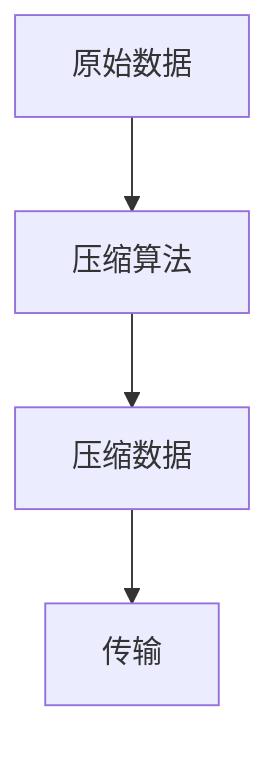

Python源代码示例：

```python
import zlib

# 原始数据
original_data = b"大量数据..."

# 数据压缩
compressed_data = zlib.compress(original_data)

# 数据传输（此处省略传输代码）

# 数据解压缩
decompressed_data = zlib.decompress(compressed_data)
print(decompressed_data)
```

#### 3.4.2 批量传输

批量传输是将多个数据包合并为一个数据包进行传输，以减少传输次数。批量传输适用于大数据量的场景。

$$
通信优化算法（批量传输） = f(数据包列表，批量大小)
$$

mermaid流程图：

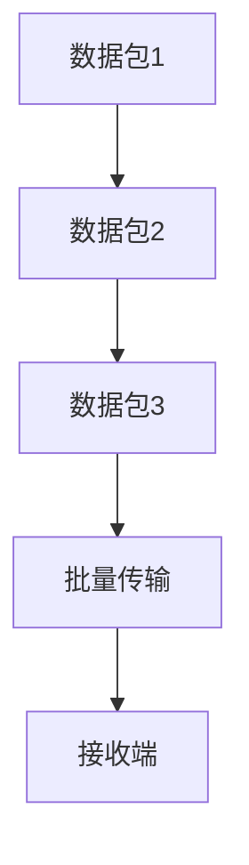

Python源代码示例：

```python
def batch_transmit(data_packets, batch_size):
    # 批量传输数据包
    batch_data = b"".join(data_packets[:batch_size])
    # 数据传输（此处省略传输代码）
    return batch_data

# 假设数据包列表
data_packets = [b"数据包1...", b"数据包2...", b"数据包3..."]

# 执行批量传输
batch_data = batch_transmit(data_packets, batch_size=2)

# 接收端处理批量数据
print(batch_data)
```

#### 3.4.3 缓存策略

缓存策略是在节点间传输数据时利用缓存，以减少重复数据的传输次数。常用的缓存策略包括LRU（Least Recently Used）和LFU（Least Frequently Used）等。

$$
通信优化算法（缓存策略） = f(数据，缓存策略)
$$

mermaid流程图：

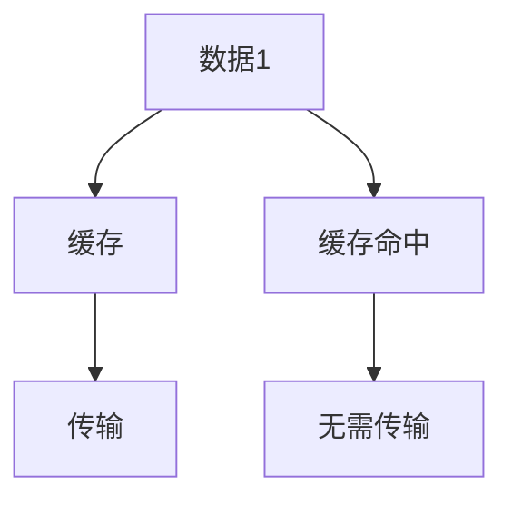

Python源代码示例：

```python
class LRUCache:
    def __init__(self, capacity):
        self.capacity = capacity
        self.cache = {}
        self.order = []

    def get(self, key):
        if key in self.cache:
            self.order.remove(key)
            self.order.append(key)
            return self.cache[key]
        else:
            return None

    def put(self, key, value):
        if key in self.cache:
            self.order.remove(key)
        elif len(self.cache) >= self.capacity:
            evicted_key = self.order.pop(0)
            del self.cache[evicted_key]
        self.cache[key] = value
        self.order.append(key)

# 使用LRU缓存
cache = LRUCache(capacity=3)

# 假设数据
data1 = "数据1"
data2 = "数据2"
data3 = "数据3"

# 缓存数据
cache.put(data1, b"数据1")
cache.put(data2, b"数据2")
cache.put(data3, b"数据3")

# 获取数据
print(cache.get(data1))  # 输出b"数据1"
print(cache.get(data2))  # 输出b"数据2"
print(cache.get(data3))  # 输出b"数据3"

# 更新缓存
cache.put(data2, b"新数据2")

# 获取更新后的数据
print(cache.get(data2))  # 输出b"新数据2"
```

### 3.5 容错机制算法

容错机制是在分布式计算中确保系统在高并发和高负载情况下具备良好的容错性和稳定性的方法。常见的容错机制包括冗余计算、数据备份和故障恢复策略。

#### 3.5.1 冗余计算

冗余计算是通过在系统中引入冗余节点，确保在部分节点故障时系统仍然能够正常运行。

$$
容错机制算法（冗余计算） = f(计算任务，冗余节点数)
$$

mermaid流程图：

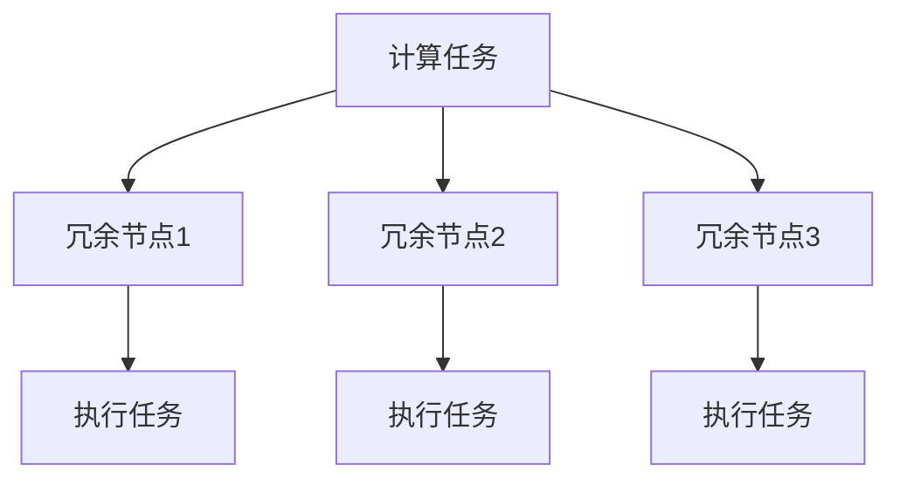

Python源代码示例：

```python
import threading

def task_function():
    # 执行任务
    print("任务执行中...")

# 创建冗余节点
num_redundant_nodes = 3
tasks = [threading.Thread(target=task_function) for _ in range(num_redundant_nodes)]

# 启动冗余节点
for task in tasks:
    task.start()

# 等待任务完成
for task in tasks:
    task.join()
```

#### 3.5.2 数据备份

数据备份是通过在多个节点上存储相同的数据副本，确保在节点故障时数据不会丢失。

$$
容错机制算法（数据备份） = f(数据，备份节点数)
$$

mermaid流程图：

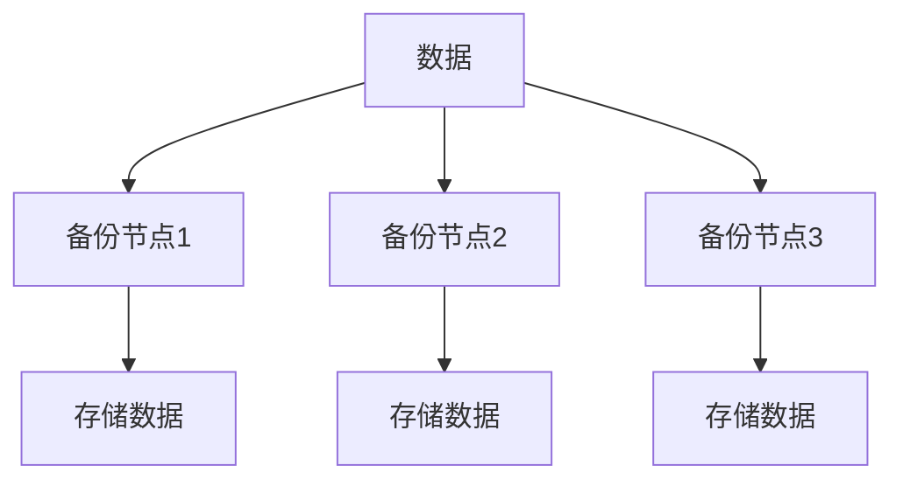

Python源代码示例：

```python
import shutil

def backup_data(data_path, backup_path):
    # 备份数据
    shutil.copy2(data_path, backup_path)

# 假设数据路径和备份路径
data_path = "data.csv"
backup_path1 = "backup1.csv"
backup_path2 = "backup2.csv"
backup_path3 = "backup3.csv"

# 备份数据
backup_data(data_path, backup_path1)
backup_data(data_path, backup_path2)
backup_data(data_path, backup_path3)
```

#### 3.5.3 故障恢复策略

故障恢复策略是在节点故障时，自动检测和恢复系统的策略。常见的故障恢复策略包括心跳检测、故障转移和负载均衡等。

$$
容错机制算法（故障恢复策略） = f(系统状态，故障节点数)
$$

mermaid流程图：

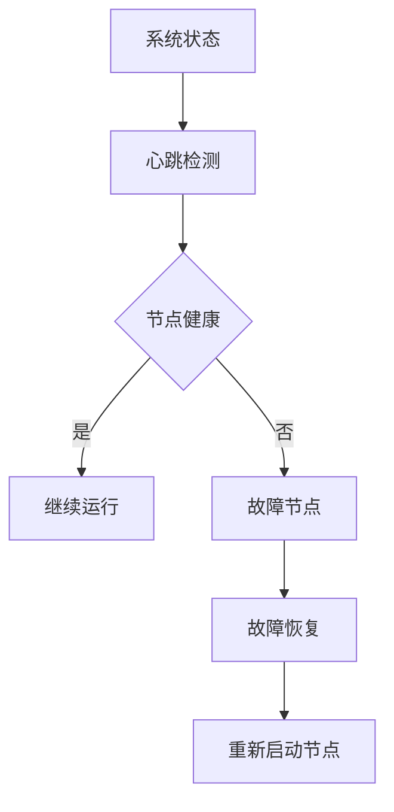

Python源代码示例：

```python
import time
import random

def health_check(node):
    # 检测节点健康
    return random.choice([True, False])

def recover_faulty_node(faulty_node):
    # 恢复故障节点
    print(f"恢复故障节点：{faulty_node}")

def main():
    # 假设系统中有5个节点
    nodes = ["node1", "node2", "node3", "node4", "node5"]

    while True:
        for node in nodes:
            if not health_check(node):
                recover_faulty_node(node)
                break
        time.sleep(1)

if __name__ == "__main__":
    main()
```

通过以上对模型拆分、数据分布、并行计算、通信优化和容错机制算法的详细讲解，我们可以看到分布式计算框架支持大规模计算（LLM）的复杂性和多样性。这些算法相互配合，共同构成了一个高效、稳定和可扩展的分布式计算系统，为现代计算领域的研究和应用提供了强大的支持。接下来，我们将继续探讨分布式计算框架在LLM应用中的实际应用和实现细节。|>

