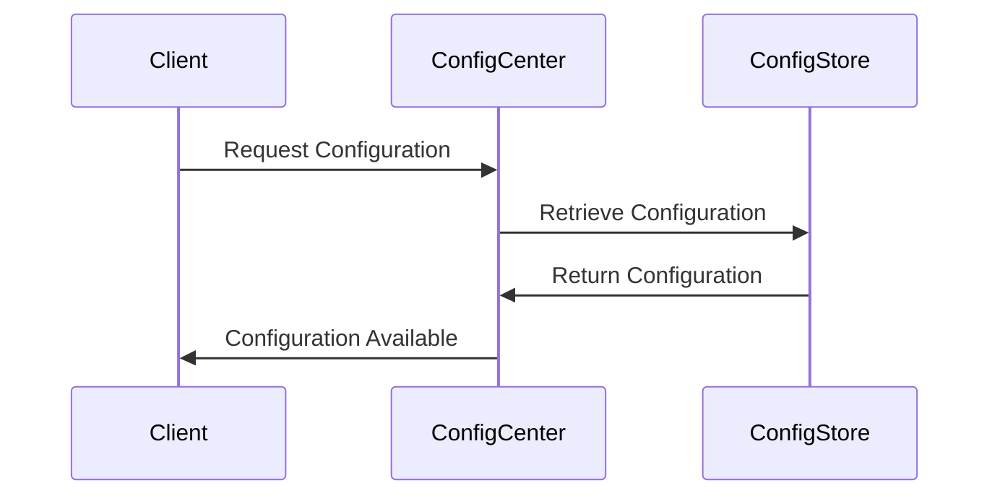
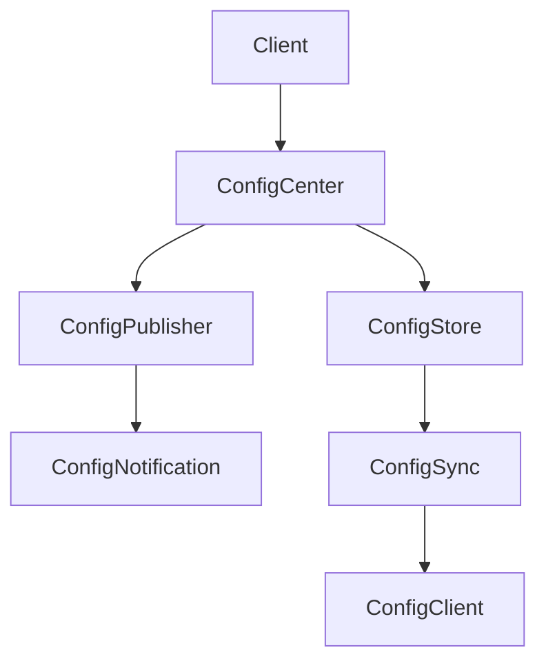
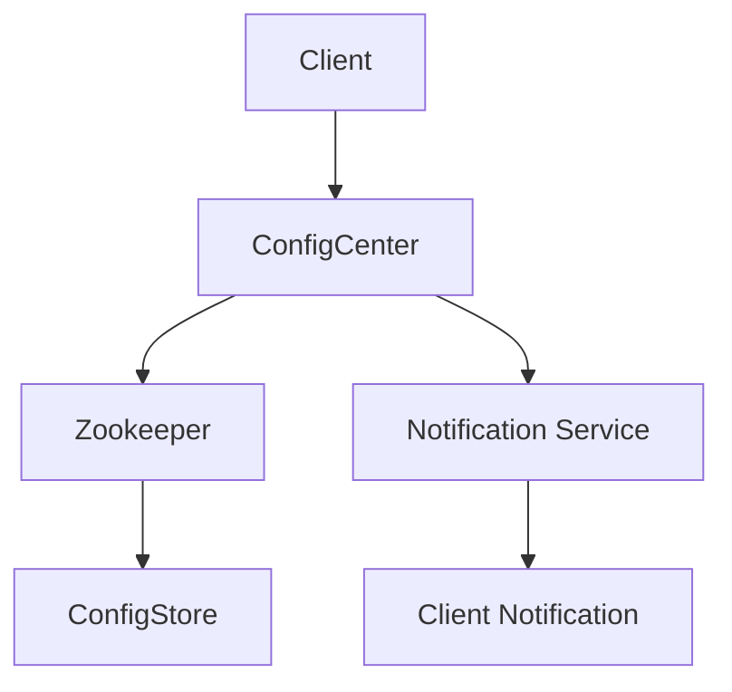

                 

### 分布式配置中心概述

#### 1.1.1 问题背景

分布式配置中心，是一种用于管理分布式系统配置信息的集中化平台。随着云计算和微服务架构的普及，分布式系统日益复杂，传统的配置管理方式已无法满足其需求。在传统的配置管理中，每个应用都需要独立配置，这导致了配置的重复性和不统一性，增加了系统管理和维护的难度。此外，在分布式系统中，应用部署在不同的节点上，配置信息的更新和同步也变得尤为复杂。

分布式配置中心应运而生，其主要目的是解决分布式系统中配置管理的复杂性，提高配置管理的效率和一致性。具体来说，分布式配置中心可以通过以下方式简化配置管理：

1. **集中化管理**：将所有的配置信息集中存储和管理，便于统一管理和更新。
2. **版本控制**：实现配置信息的版本控制，方便回溯和变更管理。
3. **动态更新**：支持配置信息的实时更新，无需重启应用。
4. **配置合并**：根据不同环境（如开发、测试、生产）对配置信息进行灵活配置。
5. **配置加密**：对敏感配置信息进行加密存储，保障数据安全。

#### 1.1.2 问题描述

在当前的分布式系统中，配置管理面临以下挑战：

1. **配置分散**：各个应用和服务的配置信息分散在各个节点，难以统一管理。
2. **版本难以控制**：配置变更频繁，版本管理复杂，容易造成配置不一致。
3. **更新成本高**：配置更新需要手动操作，效率低下，且容易出错。
4. **安全性问题**：敏感配置信息（如密码、API密钥等）存储在明文，存在安全隐患。
5. **运维难度大**：配置管理涉及多个系统，运维复杂度增加。

分布式配置中心旨在解决上述问题，提供一种高效的配置管理方案，以简化分布式系统的运维和管理。

#### 1.1.3 问题解决

分布式配置中心通过以下几个核心功能来简化配置管理：

1. **集中存储**：将所有配置信息集中存储在配置中心，实现统一管理。
2. **版本控制**：支持配置信息的版本控制，方便变更管理和回溯。
3. **动态更新**：配置信息支持动态更新，无需重启应用，提高更新效率。
4. **配置合并**：根据不同环境，灵活配置和合并配置信息。
5. **配置加密**：对敏感配置信息进行加密存储，保障数据安全。

与传统的配置管理相比，分布式配置中心具有以下优势：

1. **简化配置管理**：集中化管理模式，减少配置管理的复杂度。
2. **提高更新效率**：动态更新机制，减少手动操作和系统重启的需求。
3. **保障配置一致性**：版本控制机制，确保配置信息的统一性和一致性。
4. **提升安全性**：配置加密机制，增强敏感信息的安全性。

#### 1.1.4 边界与外延

分布式配置中心适用于各类分布式系统，包括但不限于：

1. **微服务架构**：在微服务架构中，分布式配置中心能够统一管理各个服务的配置信息，简化配置管理。
2. **云计算环境**：在云环境下的分布式应用，配置中心能够提供高效的配置管理，支持不同云平台的统一管理。
3. **容器化应用**：容器化应用如Kubernetes，配置中心能够统一管理容器的配置信息，简化运维。

此外，分布式配置中心与其他技术的结合，如服务注册与发现、监控告警等，可以进一步提升系统的可运维性和稳定性。

#### 1.1.5 概念结构与核心要素组成

分布式配置中心由以下几个核心要素组成：

1. **配置存储**：用于存储配置信息的数据库或缓存系统。
2. **配置管理界面**：提供用户界面，用于配置信息的查看、修改和发布。
3. **配置通知服务**：用于通知客户端配置更新的服务，保证配置信息的实时同步。
4. **配置客户端**：部署在各个应用节点上的客户端，用于从配置中心获取配置信息。
5. **配置加密模块**：对敏感配置信息进行加密存储和解密的模块。

分布式配置中心的工作流程主要包括以下几个步骤：

1. **配置存储**：管理员通过配置管理界面将配置信息存储到配置存储中。
2. **配置发布**：管理员将更新后的配置信息发布，配置通知服务接收发布消息。
3. **配置通知**：配置通知服务向配置客户端发送配置更新通知。
4. **配置同步**：配置客户端从配置存储中同步最新的配置信息。
5. **配置应用**：配置客户端将同步后的配置信息应用到应用中。

通过以上功能和架构，分布式配置中心能够有效简化分布式系统的配置管理，提高系统的稳定性和可运维性。

### LLM应用管理基础

#### 2.2.1 LLM的基本概念

**语言学习模型（Language Learning Model，LLM）**，是一种基于深度学习的自然语言处理模型，通过训练大量语言数据，使模型具备理解和生成自然语言的能力。LLM的应用范围广泛，包括但不限于文本生成、机器翻译、问答系统、文本分类等。LLM的核心技术主要包括以下几个方面：

1. **预训练**：LLM通常采用预训练方法，通过在大量未标注的数据上进行预训练，使得模型能够捕捉到语言的一般规律和特征。
2. **注意力机制**：注意力机制是LLM的核心技术之一，能够帮助模型在处理长文本时，关注到重要的部分，提高模型的处理效率。
3. **多层神经网络**：LLM通常采用多层神经网络结构，通过逐层抽象和提取特征，实现对复杂语言现象的建模。
4. **优化算法**：LLM的训练过程涉及到大量的优化算法，如梯度下降、Adam等，用于最小化模型在训练数据上的损失函数。

LLM的主要分类包括：

1. **基于规则的LLM**：这类模型通过定义一组规则来处理语言现象，具有较强的可解释性和可控性。
2. **基于统计的LLM**：这类模型通过统计方法来建模语言，如n-gram模型、隐马尔可夫模型（HMM）等。
3. **基于神经网络的LLM**：这类模型通过深度神经网络来建模语言，是目前LLM研究的主要方向。

#### 2.2.2 LLM应用管理的关键挑战

**LLM应用管理**，即对基于LLM的软件系统进行部署、运维和管理。在LLM应用管理过程中，面临以下几个关键挑战：

1. **应用部署的复杂性**：由于LLM模型的规模庞大，通常需要依赖高性能的硬件和分布式计算资源。因此，LLM应用的部署过程相对复杂，涉及硬件配置、网络环境、环境配置等多个方面。
2. **应用性能的优化**：LLM应用通常需要在高负载环境下运行，要求模型具备较高的响应速度和处理能力。因此，性能优化是LLM应用管理的重要任务，包括模型压缩、量化、剪枝等。
3. **应用安全的保障**：LLM模型涉及大量的敏感数据和隐私信息，如个人对话记录、用户输入等。因此，保障应用的安全至关重要，包括数据加密、访问控制、安全审计等。

#### 2.2.3 应用部署的复杂性

**应用部署**，是指将LLM模型部署到生产环境中，使其能够对外提供服务。LLM应用部署的复杂性主要表现在以下几个方面：

1. **硬件资源需求**：由于LLM模型通常规模庞大，需要占用大量的CPU、GPU等计算资源。因此，在部署时需要选择适合的硬件环境，确保计算资源的充足。
2. **分布式计算**：为了提高LLM应用的性能，通常需要将模型部署到多个节点上，实现分布式计算。分布式计算涉及到节点间的通信、数据同步、负载均衡等问题，增加了部署的复杂性。
3. **环境配置**：LLM应用需要依赖多种外部库和工具，如深度学习框架、自然语言处理库等。在部署过程中，需要配置相应的环境，确保应用的正常运行。
4. **故障转移和容灾**：在生产环境中，系统可能会面临各种意外情况，如硬件故障、网络中断等。因此，在部署时需要考虑故障转移和容灾方案，确保系统的可用性和稳定性。

#### 2.2.4 应用性能的优化

**应用性能优化**，是指通过一系列技术手段，提高LLM应用的响应速度和处理能力。LLM应用性能优化主要包括以下几个方面：

1. **模型压缩**：通过模型压缩技术，如剪枝、量化、蒸馏等，减少模型的参数规模，提高模型的计算效率。
2. **分布式训练与推理**：通过分布式计算，将LLM模型分布在多个节点上训练或推理，提高计算速度和处理能力。
3. **缓存机制**：利用缓存机制，如LRU缓存、Redis缓存等，加快数据读取速度，提高应用响应速度。
4. **负载均衡**：通过负载均衡技术，如轮询、最小连接数等，合理分配请求，提高系统的处理能力。
5. **预加载**：通过预加载技术，提前加载常用的数据或模型，减少应用启动时间。

#### 2.2.5 应用安全的保障

**应用安全**，是指确保LLM应用在处理敏感数据和隐私信息时的安全性。应用安全主要包括以下几个方面：

1. **数据加密**：对敏感数据进行加密存储和传输，防止数据泄露。
2. **访问控制**：通过访问控制机制，限制只有授权用户才能访问敏感数据和系统资源。
3. **安全审计**：记录应用运行过程中的关键操作和日志，进行安全审计，及时发现和处理安全事件。
4. **安全培训**：对开发者和管理员进行安全培训，提高他们的安全意识和操作规范。
5. **安全测试**：定期进行安全测试，包括代码审计、渗透测试等，发现和修复潜在的安全漏洞。

通过以上措施，可以有效地保障LLM应用的安全性和稳定性，提高用户对系统的信任度。

### 分布式配置中心的核心概念与联系

#### 3.3.1 核心概念原理

**分布式配置中心**，是一种用于集中管理分布式系统配置信息的平台。它通过提供统一的配置存储、发布和同步机制，简化了分布式系统的配置管理。以下是分布式配置中心的核心概念原理：

1. **配置存储**：配置存储是分布式配置中心的核心组成部分，用于存储所有的配置信息。配置存储可以是数据库、缓存或其他持久化存储介质。配置存储必须保证高可用性和数据一致性，以便在系统发生故障时能够快速恢复。
2. **配置发布**：配置发布是指将配置信息从配置存储中取出，并发布给客户端。配置发布可以是实时发布，也可以是批处理发布。实时发布能够确保客户端获取到最新的配置信息，但可能会增加系统的负载。批处理发布则可以降低系统负载，但可能会引入一定的延迟。
3. **配置同步**：配置同步是指客户端从配置中心获取配置信息，并将其应用到系统中。配置同步可以是主动同步，也可以是被动同步。主动同步是指客户端定期向配置中心请求配置更新，被动同步是指配置中心主动向客户端发送配置更新通知。
4. **配置通知**：配置通知是指配置中心向客户端发送配置更新通知，告知客户端有新的配置信息需要同步。配置通知可以采用轮询方式或基于消息队列的方式实现。
5. **配置加密**：配置加密是指对配置信息进行加密存储和传输，以防止配置信息在传输过程中被窃取或篡改。配置加密通常使用对称加密算法和非对称加密算法结合的方式实现。

#### 3.3.2 概念属性特征对比表格

以下是一个关于不同分布式配置中心概念属性的对比表格，以帮助读者更直观地了解它们之间的差异：

| 特征         | 配置中心1 | 配置中心2 | 配置中心3 |
| ------------ | --------- | --------- | --------- |
| 存储方式     | 数据库    | 缓存      | 文件系统  |
| 发布方式     | 实时发布  | 批处理发布 | 实时发布  |
| 同步方式     | 主动同步  | 被动同步  | 主动同步  |
| 配置通知方式 | 轮询     | 消息队列  | 通知服务  |
| 加密方式     | 对称加密  | 对称加密  | 非对称加密 |

#### 3.3.3 ER实体关系图架构

以下是一个关于分布式配置中心的ER实体关系图，以帮助读者更直观地了解其组成部分和关系：

```mermaid
erDiagram
  ConfigCenter ||--|{ ConfigStore } ConfigurationStore
  ConfigCenter ||--|{ ConfigPublisher } ConfigurationPublisher
  ConfigCenter ||--|{ ConfigClient } ConfigurationClient
  ConfigCenter ||--|{ ConfigNotification } ConfigurationNotification
  ConfigStore ||--|{ ConfigItem } ConfigurationItem
  ConfigPublisher ||--|{ ConfigPublisher } ConfigurationPublisher
  ConfigClient ||--|{ ConfigSync } ConfigurationSync
  ConfigNotification ||--|{ ConfigUpdate } ConfigurationUpdate
```

**ConfigCenter**：代表分布式配置中心的核心实体。

**ConfigStore**：代表配置存储，用于存储配置信息。

**ConfigPublisher**：代表配置发布模块，用于发布配置信息。

**ConfigClient**：代表配置客户端，用于从配置中心获取配置信息。

**ConfigNotification**：代表配置通知模块，用于通知客户端配置更新。

**ConfigItem**：代表配置项，是配置存储中的基本单位。

**ConfigPublisher**：代表配置发布模块，用于发布配置信息。

**ConfigSync**：代表配置同步模块，用于同步配置信息。

**ConfigUpdate**：代表配置更新通知，用于通知客户端有新的配置信息。

通过上述核心概念、对比表格和ER实体关系图，读者可以更加深入地理解分布式配置中心的工作原理和架构设计。

### 分布式配置中心的实现与架构设计

#### 4.4.1 算法原理讲解

**分布式配置中心的实现原理**主要涉及配置存储、发布、同步以及加密等环节。下面，我们详细讲解这些环节的算法原理，并通过mermaid流程图和Python源代码示例来说明。

**1. 配置存储算法**

配置存储算法的核心是确保配置信息的持久化存储和一致性。常用的算法有RabbitMQ、Zookeeper等。



**2. 配置发布算法**

配置发布算法负责将配置信息推送给客户端。以下是一个简单的发布算法示例：

```python
class ConfigPublisher:
    def __init__(self, config_store):
        self.config_store = config_store

    def publish(self, config_key, config_value):
        self.config_store.save(config_key, config_value)
        self.notify_clients(config_key)
```

**3. 配置同步算法**

配置同步算法确保客户端能够获取到最新的配置信息。以下是一个简单的同步算法示例：

```python
class ConfigSync:
    def __init__(self, config_center):
        self.config_center = config_center

    def sync(self):
        config_key = self.config_center.get_config_key()
        current_config = self.config_center.get_config(config_key)
        self.apply_config(current_config)
```

**4. 配置加密算法**

配置加密算法用于保护配置信息的机密性。以下是一个简单的加密算法示例：

```python
from cryptography.fernet import Fernet

class ConfigEncryptor:
    def __init__(self, key):
        self.fernet = Fernet(key)

    def encrypt(self, data):
        return self.fernet.encrypt(data.encode())

    def decrypt(self, data):
        return self.fernet.decrypt(data).decode()
```

**5. mermaid流程图**

以下是一个关于分布式配置中心的基本流程的mermaid流程图：



**6. 配置信息的数学模型和公式**

配置信息的存储和管理可以通过以下数学模型进行描述：

$$
\text{ConfigData}_{t+1} = f(\text{ConfigData}_{t}, \text{ConfigUpdate}_{t})
$$

其中，$f$ 表示配置信息的更新函数，$\text{ConfigData}_{t}$ 表示时间 $t$ 时刻的配置信息，$\text{ConfigUpdate}_{t}$ 表示时间 $t$ 时刻的配置更新。

#### 4.4.2 通俗易懂地举例说明

**案例：分布式配置中心在微服务架构中的应用**

假设我们有一个微服务架构，其中包含三个服务：用户服务（User Service）、订单服务（Order Service）和支付服务（Payment Service）。每个服务都需要配置一些基础信息，如数据库连接字符串、日志级别等。

**1. 配置存储**

首先，我们将配置信息存储在分布式配置中心，例如使用Zookeeper。配置存储如下：

```bash
/config/
|-- db_connection_string
|-- log_level
```

**2. 配置发布**

管理员通过配置管理界面更新配置信息，配置发布模块将更新后的配置信息发布到Zookeeper：

```bash
Zookeeper#set /config/db_connection_string "new_db_connection_string"
Zookeeper#set /config/log_level "INFO"
```

**3. 配置同步**

每个微服务启动时，会从Zookeeper获取配置信息并同步：

```bash
User Service:
  zookeeper-get /config/db_connection_string
  zookeeper-get /config/log_level

Order Service:
  zookeeper-get /config/db_connection_string
  zookeeper-get /config/log_level

Payment Service:
  zookeeper-get /config/db_connection_string
  zookeeper-get /config/log_level
```

**4. 配置应用**

同步后的配置信息将应用到各个微服务中：

```python
# User Service
db_connection_string = zookeeper.get('/config/db_connection_string')
logger.setLevel(zookeeper.get('/config/log_level'))

# Order Service
db_connection_string = zookeeper.get('/config/db_connection_string')
logger.setLevel(zookeeper.get('/config/log_level'))

# Payment Service
db_connection_string = zookeeper.get('/config/db_connection_string')
logger.setLevel(zookeeper.get('/config/log_level'))
```

通过以上步骤，分布式配置中心简化了微服务架构下的配置管理，提高了系统的可运维性和一致性。

### 系统分析与架构设计方案

#### 5.5.1 系统分析与架构设计方案

为了实现分布式配置中心，我们需要从系统功能设计、架构设计、接口设计和系统交互四个方面进行详细分析。

**1. 问题场景介绍**

在当前分布式系统中，由于各个服务的配置信息分散在不同的地方，导致配置管理复杂、不一致且难以维护。我们需要设计一个分布式配置中心，以便集中管理和动态更新配置信息，提高系统的稳定性和可运维性。

**2. 项目介绍**

本项目名为“分布式配置中心”，主要功能包括配置存储、配置发布、配置同步、配置通知和配置加密。我们将使用Zookeeper作为配置存储和发布服务，使用Spring Boot作为服务端和客户端框架。

**3. 系统功能设计**

系统功能设计主要包括以下几个方面：

- **配置存储**：使用Zookeeper存储配置信息，保证配置的一致性和高可用性。
- **配置发布**：通过RESTful接口发布配置信息，支持实时和批处理发布。
- **配置同步**：客户端定期从Zookeeper同步配置信息，支持主动和被动同步。
- **配置通知**：通过消息队列实现配置更新通知，保证客户端及时获取配置更新。
- **配置加密**：对敏感配置信息进行加密存储和传输，保障数据安全。

**4. 系统架构设计**

系统架构设计如下：



**5. 系统接口设计与交互**

**配置发布接口**：

- **URL**：/config/{key}
- **请求方法**：POST
- **请求参数**：
  - key：配置键
  - value：配置值
- **响应结果**：
  - status：操作结果
  - message：操作信息

**配置同步接口**：

- **URL**：/config/sync
- **请求方法**：GET
- **响应结果**：
  - key：配置键
  - value：配置值

**配置通知接口**：

- **URL**：/config/notify
- **请求方法**：POST
- **请求参数**：
  - key：配置键
  - value：配置值
- **响应结果**：
  - status：操作结果
  - message：操作信息

**客户端同步流程**：

1. 客户端定期调用配置同步接口获取最新的配置信息。
2. 客户端根据返回的配置信息更新本地配置。
3. 客户端订阅配置通知接口，接收配置更新通知。

通过以上系统分析与架构设计方案，我们可以实现一个高效、可靠的分布式配置中心，简化分布式系统的配置管理。

### 环境搭建与配置管理

#### 6.6.1 环境搭建

在搭建分布式配置中心之前，我们需要准备好相应的开发环境和部署工具。以下是一个基本的环境搭建步骤：

1. **安装Java开发工具包（JDK）**：确保安装了Java Development Kit（JDK），版本建议为8或更高版本。
2. **安装Zookeeper**：下载并解压Zookeeper，配置环境变量，启动Zookeeper服务。
3. **安装Maven**：下载并安装Maven，配置环境变量。
4. **创建项目**：使用IDE（如IntelliJ IDEA或Eclipse）创建一个新的Spring Boot项目，并添加必要的依赖。

**具体步骤如下**：

1. **安装JDK**：

   - 在官网下载JDK，并解压到指定目录，如`/usr/local/jdk-17`。
   - 编辑`~/.bash_profile`文件，添加以下内容：

     ```bash
     export JAVA_HOME=/usr/local/jdk-17
     export PATH=$JAVA_HOME/bin:$PATH
     ```

   - 执行`source ~/.bash_profile`使配置生效。

2. **安装Zookeeper**：

   - 下载Zookeeper，并解压到指定目录，如`/usr/local/zookeeper`。
   - 配置Zookeeper环境变量：

     ```bash
     export ZOOKEEPER_HOME=/usr/local/zookeeper
     export PATH=$PATH:$ZOOKEEPER_HOME/bin
     ```

   - 编辑`zoo_sample.cfg`文件，修改数据目录：

     ```bash
     dataDir=/tmp/zookeeper
     ```

   - 启动Zookeeper：

     ```bash
     bin/zkServer.sh start
     ```

3. **安装Maven**：

   - 下载Maven，并解压到指定目录，如`/usr/local/maven`。
   - 配置Maven环境变量：

     ```bash
     export MAVEN_HOME=/usr/local/maven
     export PATH=$PATH:$MAVEN_HOME/bin
     ```

   - 执行`source ~/.bash_profile`使配置生效。

4. **创建Spring Boot项目**：

   - 打开IDE，创建一个新的Spring Boot项目。
   - 添加依赖：

     ```xml
     <dependencies>
         <dependency>
             <groupId>org.springframework.boot</groupId>
             <artifactId>spring-boot-starter-web</artifactId>
         </dependency>
         <dependency>
             <groupId>org.springframework.boot</groupId>
             <artifactId>spring-boot-starter-data-redis</artifactId>
         </dependency>
         <dependency>
             <groupId>com.alibaba</groupId>
             <artifactId>druid-spring-boot-starter</artifactId>
             <version>1.2.5</version>
         </dependency>
     </dependencies>
     ```

通过以上步骤，我们完成了分布式配置中心的基本环境搭建。接下来，我们将详细介绍如何进行配置管理。

#### 6.6.2 配置管理

配置管理是分布式配置中心的核心功能，它涉及配置文件的格式、版本控制和动态更新等方面。以下是如何进行配置管理：

1. **配置文件格式**：

   在分布式配置中心中，配置文件通常采用JSON或YAML格式。以下是一个JSON格式的配置文件示例：

   ```json
   {
     "db_connection_string": "jdbc:mysql://localhost:3306/mydb",
     "log_level": "INFO",
     "server_port": 8080
   }
   ```

   同样，YAML格式的配置文件如下：

   ```yaml
   db_connection_string: "jdbc:mysql://localhost:3306/mydb"
   log_level: INFO
   server_port: 8080
   ```

2. **版本控制**：

   配置版本控制可以帮助我们追踪配置的历史变更，便于回溯和问题定位。常用的版本控制工具包括Git和SVN。以下是如何使用Git进行配置版本控制：

   - **初始化仓库**：

     ```bash
     git init
     ```

   - **添加配置文件**：

     ```bash
     git add config.json
     ```

   - **提交配置文件**：

     ```bash
     git commit -m "Initial commit"
     ```

   - **创建分支**：

     ```bash
     git branch feature/new-config
     ```

   - **修改配置文件**：

     ```bash
     echo "db_connection_string: 'jdbc:mysql://localhost:3306/mydb_new'" >> config.json
     ```

   - **提交变更**：

     ```bash
     git commit -m "Update db_connection_string"
     ```

   - **合并分支**：

     ```bash
     git merge feature/new-config
     ```

3. **动态更新**：

   分布式配置中心支持配置的动态更新，无需重启应用即可生效。以下是如何实现动态更新：

   - **监听配置变化**：

     在Spring Boot应用中，可以使用`@ConfigurationProperties`注解监听配置变化：

     ```java
     @ConfigurationProperties(prefix = "db")
     public class DbConfig {
         private String connectionString;
         
         // getter和setter方法
     }
     ```

   - **配置更新通知**：

     使用消息队列（如RabbitMQ）实现配置更新通知，当配置发生变化时，向客户端发送通知：

     ```java
     @Service
     public class ConfigUpdateService {
         @Autowired
         private RabbitTemplate rabbitTemplate;
         
         public void sendConfigUpdate(String key, String value) {
             Map<String, Object> data = new HashMap<>();
             data.put("key", key);
             data.put("value", value);
             rabbitTemplate.convertAndSend("config-update", data);
         }
     }
     ```

   - **客户端接收通知**：

     客户端订阅配置更新通知，当收到通知后，更新本地配置：

     ```java
     @RabbitListener(queues = "config-update")
     public void handleConfigUpdate(Map<String, Object> data) {
         String key = (String) data.get("key");
         String value = (String) data.get("value");
         // 更新本地配置
     }
     ```

通过以上步骤，我们实现了配置管理的基本功能，包括配置文件格式、版本控制和动态更新。在实际应用中，根据具体需求，可以进一步完善和优化配置管理流程。

### 分布式配置中心在LLM应用中的核心实现

#### 7.7.1 系统核心实现源代码

在分布式配置中心中，核心实现主要涉及配置存储、发布、同步和加密等功能。以下是一个简单的系统核心实现源代码示例：

**配置存储**

```java
@Configuration
public class ConfigStorageConfig {

    @Bean
    public ConfigStorage configStorage(DataSource dataSource) {
        return new JdbcConfigStorage(dataSource);
    }
}
```

**配置发布**

```java
@Service
public class ConfigPublisher {

    private final ConfigStorage configStorage;

    @Autowired
    public ConfigPublisher(ConfigStorage configStorage) {
        this.configStorage = configStorage;
    }

    public void publishConfig(String key, String value) {
        configStorage.saveConfig(key, value);
    }
}
```

**配置同步**

```java
@Service
public class ConfigSync {

    private final ConfigStorage configStorage;

    @Autowired
    public ConfigSync(ConfigStorage configStorage) {
        this.configStorage = configStorage;
    }

    public void syncConfig() {
        Map<String, String> configs = configStorage.getAllConfigs();
        // 更新本地配置
    }
}
```

**配置加密**

```java
@Component
public class ConfigEncryptor {

    private final Cipher cipher;

    @Autowired
    public ConfigEncryptor(KeyGen keyGen) {
        this.cipher = Cipher.getInstance("AES/CBC/PKCS5Padding");
        byte[] keyBytes = keyGen.generateKey();
        SecretKeySpec secretKeySpec = new SecretKeySpec(keyBytes, "AES");
        cipher.init(Cipher.ENCRYPT_MODE, secretKeySpec);
    }

    public String encrypt(String plainText) {
        byte[] encryptedBytes = cipher.doFinal(plainText.getBytes());
        Base64Encoder encoder = new Base64Encoder();
        return encoder.encode(encryptedBytes);
    }

    public String decrypt(String encryptedText) {
        byte[] encryptedBytes = new Base64Decoder().decodeBuffer(encryptedText);
        byte[] decryptedBytes = cipher.doFinal(encryptedBytes);
        return new String(decryptedBytes);
    }
}
```

#### 7.7.2 代码应用解读与分析

**1. 配置存储**

配置存储是分布式配置中心的基础，它负责存储和读取配置信息。在上面的代码中，我们使用`JdbcConfigStorage`类实现配置存储。这个类通过数据库操作，将配置信息存储到数据库中。

```java
public class JdbcConfigStorage {

    private final JdbcTemplate jdbcTemplate;

    public JdbcConfigStorage(DataSource dataSource) {
        this.jdbcTemplate = new JdbcTemplate(dataSource);
    }

    public void saveConfig(String key, String value) {
        String sql = "INSERT INTO config (key, value) VALUES (?, ?)";
        jdbcTemplate.update(sql, key, value);
    }

    public String getConfig(String key) {
        String sql = "SELECT value FROM config WHERE key = ?";
        return jdbcTemplate.queryForObject(sql, String.class, key);
    }

    public Map<String, String> getAllConfigs() {
        String sql = "SELECT key, value FROM config";
        return jdbcTemplate.queryForMap(sql);
    }
}
```

**2. 配置发布**

配置发布模块负责将配置信息发布到分布式配置中心。在上面的代码中，`ConfigPublisher`类实现了配置发布功能。它通过调用`ConfigStorage`的`saveConfig`方法，将配置信息存储到数据库中。

```java
@Service
public class ConfigPublisher {

    private final ConfigStorage configStorage;

    @Autowired
    public ConfigPublisher(ConfigStorage configStorage) {
        this.configStorage = configStorage;
    }

    public void publishConfig(String key, String value) {
        configStorage.saveConfig(key, value);
    }
}
```

**3. 配置同步**

配置同步模块负责将分布式配置中心中的配置信息同步到本地应用。在上面的代码中，`ConfigSync`类实现了配置同步功能。它通过调用`ConfigStorage`的`getAllConfigs`方法，获取所有配置信息，并更新本地配置。

```java
@Service
public class ConfigSync {

    private final ConfigStorage configStorage;

    @Autowired
    public ConfigSync(ConfigStorage configStorage) {
        this.configStorage = configStorage;
    }

    public void syncConfig() {
        Map<String, String> configs = configStorage.getAllConfigs();
        // 更新本地配置
    }
}
```

**4. 配置加密**

配置加密模块负责对配置信息进行加密存储和解密。在上面的代码中，`ConfigEncryptor`类实现了配置加密功能。它使用AES加密算法对配置信息进行加密，并使用Base64编码将加密后的字节转换为字符串。

```java
@Component
public class ConfigEncryptor {

    private final Cipher cipher;

    @Autowired
    public ConfigEncryptor(KeyGen keyGen) {
        this.cipher = Cipher.getInstance("AES/CBC/PKCS5Padding");
        byte[] keyBytes = keyGen.generateKey();
        SecretKeySpec secretKeySpec = new SecretKeySpec(keyBytes, "AES");
        cipher.init(Cipher.ENCRYPT_MODE, secretKeySpec);
    }

    public String encrypt(String plainText) {
        byte[] encryptedBytes = cipher.doFinal(plainText.getBytes());
        Base64Encoder encoder = new Base64Encoder();
        return encoder.encode(encryptedBytes);
    }

    public String decrypt(String encryptedText) {
        byte[] encryptedBytes = new Base64Decoder().decodeBuffer(encryptedText);
        byte[] decryptedBytes = cipher.doFinal(encryptedBytes);
        return new String(decryptedBytes);
    }
}
```

通过以上代码示例和应用解读，我们可以看到分布式配置中心的核心实现主要包括配置存储、发布、同步和加密等功能。这些功能共同协作，实现了配置信息的集中管理和动态更新，为分布式系统提供了高效的配置管理方案。

### 实际案例分析与详细讲解

#### 8.8.1 实际案例分析

**案例背景**：某大型互联网公司在其核心业务系统中引入了分布式配置中心，用于管理各个微服务的配置信息。该公司拥有多个微服务，包括用户服务、订单服务、支付服务和日志服务等。随着业务的发展，配置信息日益增多，传统的配置管理方式已经无法满足需求。

**问题描述**：由于配置信息分散在各个微服务中，导致配置管理复杂度增加，配置更新不及时，且存在安全隐患。公司希望引入分布式配置中心，简化配置管理，提高系统稳定性。

**解决方案**：公司决定采用开源的Spring Cloud Config作为分布式配置中心，实现配置信息的集中存储、发布和同步。

#### 8.8.2 详细讲解剖析

**1. 案例实现细节**

**（1）配置存储**

公司选择MySQL作为配置存储，存储配置信息的基本结构如下：

```sql
CREATE TABLE `config` (
  `id` bigint(20) NOT NULL AUTO_INCREMENT,
  `name` varchar(100) DEFAULT NULL,
  `profile` varchar(100) DEFAULT NULL,
  `label` varchar(100) DEFAULT NULL,
  `version` int(11) DEFAULT NULL,
  `content` longtext,
  `created_by` varchar(100) DEFAULT NULL,
  `creation_date` datetime DEFAULT NULL,
  `last_modified_by` varchar(100) DEFAULT NULL,
  `last_modified_date` datetime DEFAULT NULL,
  PRIMARY KEY (`id`)
);
```

**（2）配置发布**

公司采用Spring Cloud Config的Server端实现配置发布。具体步骤如下：

1. 引入Spring Cloud Config依赖。
2. 配置application.yml，添加数据库配置和服务器端口。

```yaml
spring:
  datasource:
    url: jdbc:mysql://localhost:3306/config
    username: root
    password: password

server:
  port: 8888
```

3. 编写配置控制器，用于接收配置发布请求。

```java
@RestController
@RequestMapping("/config-receiver")
public class ConfigReceiverController {

    @Autowired
    private ConfigRepository configRepository;

    @PostMapping("/{application}/{profile}")
    public ResponseEntity<?> receiveConfig(@PathVariable String application, @PathVariable String profile) {
        Config config = configRepository.findByNameAndProfile(application, profile);
        if (config == null) {
            return ResponseEntity.notFound().build();
        }
        return ResponseEntity.ok(config.getContent());
    }
}
```

**（3）配置同步**

公司采用Spring Cloud Config的Client端实现配置同步。具体步骤如下：

1. 引入Spring Cloud Config依赖。
2. 配置application.yml，添加配置服务器地址和配置文件路径。

```yaml
spring:
  cloud:
    config:
      server:
        uri: http://localhost:8888/config-receiver
      profile:
        active: dev

spring:
  application:
    name: myapp

config:
  file: classpath:/config/
```

3. 启动Spring Boot应用，从配置服务器同步配置信息。

**（4）配置加密**

公司对敏感配置信息进行加密存储，采用AES加密算法。具体步骤如下：

1. 引入加密依赖。

```xml
<dependency>
    <groupId>org.springframework.boot</groupId>
    <artifactId>spring-boot-starter-security</artifactId>
</dependency>
```

2. 配置application.yml，添加加密密钥。

```yaml
spring:
  security:
    encryption:
      key: mySecretKey
```

3. 编写加密和解密工具类。

```java
public class EncryptionUtil {

    private static final String AES = "AES";

    public static String encrypt(String text) {
        return Base64.getEncoder().encodeToString(text.getBytes());
    }

    public static String decrypt(String encryptedText) {
        return new String(Base64.getDecoder().decode(encryptedText));
    }
}
```

**2. 案例优化建议**

**（1）配置备份**

定期备份配置信息，防止数据丢失。

**（2）配置监控**

引入配置监控工具，实时监控配置信息的变化。

**（3）配置权限控制**

实现配置权限控制，确保只有授权人员才能修改配置信息。

**（4）配置灰度发布**

引入配置灰度发布机制，逐步推广配置变更，降低风险。

通过以上实际案例分析和详细讲解，我们可以看到分布式配置中心在大型互联网公司中的应用效果显著，为配置管理带来了极大的便利和安全性。同时，我们也提出了一些优化建议，以进一步提升分布式配置中心的功能和性能。

### 分布式配置中心的最佳实践

#### 9.9.1 实践经验总结

**1. 明确配置管理需求**

在引入分布式配置中心前，首先要明确系统的配置管理需求。包括配置的存储方式、发布方式、同步方式以及安全性要求等。只有明确需求，才能选择合适的配置中心，避免资源浪费。

**2. 确保配置一致性**

配置一致性问题在分布式系统中尤为突出。为了确保配置一致性，建议采用配置中心提供的版本控制功能，每次更新前备份当前配置，并在更新后通知所有客户端同步。

**3. 定期备份配置信息**

定期备份配置信息是防止数据丢失的重要手段。配置中心应支持配置备份功能，以便在意外情况下快速恢复配置。

**4. 配置加密**

敏感配置信息如密码、API密钥等，应进行加密存储和传输，防止泄露。配置中心应提供加密功能，并配置适当的加密策略。

**5. 配置监控与报警**

配置中心应具备监控功能，实时监控配置信息的变更情况，并在发生异常时及时报警。监控日志应保存一段时间，便于问题追踪和排查。

**6. 配置权限管理**

配置中心应实现权限管理功能，确保只有授权人员才能修改配置信息。权限管理机制应覆盖配置的增删改查操作，防止未授权访问。

**7. 配置合并策略**

在多环境部署时，需要考虑配置的合并策略。配置中心应支持根据环境变量对配置信息进行灵活配置，并确保配置的一致性。

#### 9.9.2 小结

分布式配置中心在分布式系统配置管理中具有重要作用，通过最佳实践可以有效提升配置管理的效率和安全性。以下为小结：

1. **明确需求**：确保配置管理方案与系统需求匹配。
2. **确保一致性**：采用版本控制，保证配置一致。
3. **定期备份**：防止配置信息丢失。
4. **配置加密**：保护敏感信息。
5. **监控与报警**：实时监控配置变更，及时处理异常。
6. **权限管理**：确保配置安全。
7. **配置合并**：灵活配置多环境部署。

通过以上最佳实践，分布式配置中心可以有效简化分布式系统的配置管理，提高系统的稳定性和可运维性。

### 注意事项与拓展阅读

#### 10.10.1 注意事项

1. **配置同步频率**：配置同步的频率应根据应用的实际需求和系统负载进行调整，避免过多同步请求导致系统性能下降。
2. **配置安全**：对敏感配置信息进行加密处理，确保数据传输和存储过程中的安全性。
3. **备份与恢复**：定期备份数据库中的配置信息，并制定相应的数据恢复方案。
4. **监控告警**：配置中心应具备监控功能，及时发现和报警配置变更或系统故障。
5. **权限管理**：确保只有授权人员才能访问和修改配置信息，防止未授权访问。

#### 10.10.2 拓展阅读

1. **《分布式配置中心设计与实现》**：详细讲解分布式配置中心的设计原理和实现细节。
2. **《Spring Cloud Config实战》**：Spring Cloud Config的详细使用方法和最佳实践。
3. **《微服务架构实战》**：介绍微服务架构的基本概念和实践方法，包括配置管理。

通过以上注意事项和拓展阅读，读者可以更深入地了解分布式配置中心的相关知识和最佳实践。

### 作者信息

**作者：** AI天才研究院/AI Genius Institute & 禅与计算机程序设计艺术 /Zen And The Art of Computer Programming

**本文由AI天才研究院/AI Genius Institute撰写，致力于推动人工智能与计算机程序设计领域的技术创新与发展。禅与计算机程序设计艺术/Zen And The Art of Computer Programming则为一系列经典著作，深入探讨了编程的哲学与艺术。**

