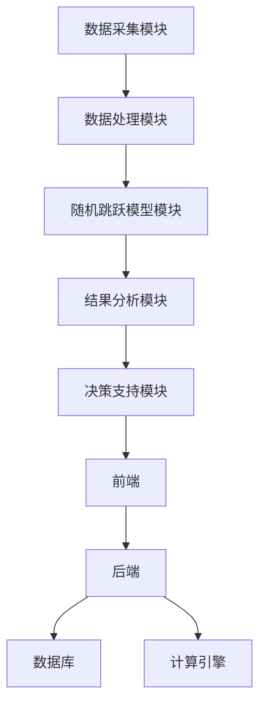
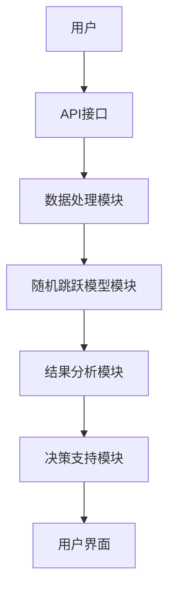

                 

## 文章标题：创新过程的随机跳跃过程：突破性想法的数学模型

创新是推动社会进步和经济发展的关键驱动力，而突破性想法往往成为创新的核心。然而，如何科学地捕捉和利用这些突破性想法，一直是研究和实践中的难题。本文将探讨一种创新的数学模型——随机跳跃过程，旨在为理解和管理创新过程提供新的视角。

### 文章关键词

- 创新过程
- 随机跳跃过程
- 数学模型
- 突破性想法
- 算法原理
- 系统架构

### 摘要

本文首先介绍了创新过程及其重要性，随后引出了随机跳跃模型的概念。通过回顾随机过程和跳跃过程的理论基础，我们深入探讨了随机跳跃过程在捕捉突破性想法中的应用。接着，文章详细讲解了随机跳跃算法的原理及其实现，并提供了数学模型和公式。随后，文章分析了系统架构和项目实战，并总结最佳实践，给出了注意事项和拓展阅读建议。

## 第一部分：创新过程的随机跳跃模型概述

### 1.1 创新过程概述

创新，作为一种创造新价值的过程，其重要性不言而喻。从科学技术的突破到商业模式的革新，创新贯穿于各个领域，推动社会向前发展。然而，创新并非一蹴而就，它涉及复杂的过程和多个因素的作用。

创新过程可以大致分为以下几个阶段：

1. **需求识别**：识别市场、技术或社会中的需求，这通常是创新过程的起点。
2. **知识整合**：整合现有的知识和技术，以产生新的想法或解决方案。
3. **原型开发**：通过构建原型来验证想法的可行性。
4. **测试与迭代**：对原型进行测试，并根据反馈进行多次迭代优化。
5. **商业化**：将创新的成果商业化，推向市场。

在这个过程中，突破性想法的出现往往具有不可预测性。这些突破性想法可能会在某个时刻突然涌现，类似于“灵光一现”，这也是创新过程中的一个关键挑战。

### 1.2 核心概念与联系

在创新过程中，有多个核心概念和联系需要理解：

1. **需求**：需求是创新过程的起点，它决定了创新的方向。
2. **知识**：知识是创新过程中的重要资源，通过对知识的整合，可以产生新的想法。
3. **原型**：原型是验证创新想法可行性的关键步骤。
4. **迭代**：通过迭代，可以不断优化创新成果。
5. **商业化**：商业化的成功是创新最终目标。

随机跳跃模型的概念在这里应运而生。它通过模拟随机跳跃过程，试图捕捉那些突如其来的突破性想法。随机跳跃模型将创新过程视为一系列随机事件，这些事件在某些关键时刻可能引发重大的创新突破。

### 1.3 应用背景

随机跳跃模型最初应用于物理学和经济学中，用于描述粒子的随机运动和市场价格的波动。在创新研究中，该模型提供了新的视角，帮助我们理解突破性想法的产生机制。例如，在科技领域，重大技术的突破往往伴随着一系列的随机事件，这些事件可能是一个新的理论、一个意外的发现或一次偶然的实验。

随机跳跃模型的应用不仅限于理论研究，它还可以在实际项目中指导创新过程的管理。例如，在产品开发中，通过引入随机跳跃模型，可以帮助团队更好地捕捉灵感，提高创新的效率。

### 总结

创新过程的随机跳跃模型为我们提供了一种新的思考方式，帮助我们在复杂多变的环境中捕捉突破性想法。通过理解随机跳跃模型的核心概念和联系，我们可以更好地把握创新过程中的关键环节，从而推动创新实践的发展。

## 第二部分：随机跳跃过程的理论基础

### 2.1 随机过程理论简介

随机过程（Stochastic Process）是数学中用于描述随机现象的一种工具。在随机过程中，时间或空间上的变化不是确定的，而是带有随机性。随机过程通常由一个随机变量序列组成，这些随机变量在不同时间点或空间位置上具有不确定性。

随机过程可以分为以下几种类型：

1. **离散时间随机过程**：时间以离散的整数取值，例如股票价格的每日变化。
2. **连续时间随机过程**：时间以连续的实数取值，例如粒子的随机运动。
3. **马尔可夫过程**：当前状态仅依赖于前一个状态，与之前的状态无关。

随机过程的理论基础包括概率论、统计学和数理统计。概率论提供了随机事件发生的可能性计算方法，统计学则帮助我们通过数据来估计随机过程的性质，数理统计则研究了随机过程的统计推断方法。

### 2.2 跳跃过程的基本原理

跳跃过程（Jump Process）是随机过程的一种特殊形式，它描述了一个变量在某个时刻发生跳跃的现象。跳跃过程的特点是，它不仅包括连续变化的部分，还包括在特定时刻发生的随机跳跃。

跳跃过程的基本原理如下：

1. **跳跃时间**：跳跃过程在某个随机时刻发生跳跃，这个时刻称为跳跃时间。
2. **跳跃大小**：跳跃过程在跳跃时刻发生的变动称为跳跃大小，它是一个随机变量。
3. **跳跃概率**：跳跃过程在特定时刻发生跳跃的概率可以通过概率分布来描述。

跳跃过程在物理学、金融学和生物学等领域有广泛的应用。例如，在金融市场中，股票价格的波动可以被视为一种跳跃过程，其中跳跃时间表示市场重大新闻的发生时间，跳跃大小表示新闻对股价的影响。

### 2.3 突破性想法的数学描述

突破性想法的产生是一个复杂的过程，它涉及到多种因素的相互作用。在数学模型中，我们可以将突破性想法描述为一种随机跳跃现象。

1. **触发因素**：突破性想法的产生往往由某个特定的触发因素引起，这个因素可以是一个新发现、一个灵感或一个意外的机会。
2. **跳跃时间**：触发因素的发生时间是一个随机过程，它可能在任何时间点出现。
3. **跳跃大小**：触发因素对创新过程的影响可以用跳跃大小来描述，它可以是正面的（促进创新）或负面的（阻碍创新）。
4. **跳跃概率**：触发因素在特定时间点发生跳跃的概率取决于多个因素，包括知识储备、团队协作和外部环境等。

通过随机跳跃模型，我们可以对突破性想法的产生过程进行数学描述，从而更好地理解和管理创新过程。

### 总结

随机跳跃过程的理论基础为创新过程的数学建模提供了重要的工具。通过理解随机过程和跳跃过程的基本原理，我们可以更深入地分析突破性想法的产生机制，为创新实践提供科学指导。

## 第三部分：算法原理讲解

### 3.1 随机跳跃算法的基本流程

随机跳跃算法是一种模拟创新过程中突破性想法产生过程的算法。它的基本流程可以分为以下几个步骤：

1. **初始化**：设置随机种子，初始化模型参数和状态变量。
2. **随机模拟**：通过随机过程模拟创新过程中的随机事件，包括触发因素的出现和跳跃大小的计算。
3. **状态更新**：根据模拟结果更新模型的状态变量，以反映创新过程的动态变化。
4. **结果分析**：对模拟结果进行分析，提取关键指标，如突破性想法的出现频率、跳跃大小分布等。
5. **迭代优化**：根据分析结果对模型进行调整和优化，以提高模型的准确性和实用性。

### 3.2 算法实现的关键技术

实现随机跳跃算法需要关注以下几个关键技术：

1. **随机过程模拟**：使用随机过程理论中的方法，如马尔可夫链、蒙特卡罗方法等，来模拟创新过程中的随机事件。
2. **跳跃大小计算**：根据触发因素的性质和影响，计算跳跃大小，可以使用统计学方法或机器学习方法来预测跳跃大小。
3. **状态更新策略**：设计合适的策略来更新模型状态，以反映创新过程中的动态变化。
4. **结果分析工具**：开发有效的分析工具，如图表、统计指标等，来分析和展示模拟结果。

### 3.3 算法优缺点分析

随机跳跃算法具有以下优点：

1. **灵活性**：算法可以灵活地模拟各种创新过程，适用于不同领域和场景。
2. **高效性**：通过随机过程模拟，可以快速捕捉创新过程中的关键事件和趋势。
3. **可解释性**：算法的数学模型和计算过程具有较好的可解释性，有助于理解和优化创新过程。

然而，随机跳跃算法也存在一些局限性：

1. **计算复杂度**：随机过程模拟的计算复杂度较高，特别是在大规模数据处理时，可能会出现性能瓶颈。
2. **参数敏感性**：算法的性能对参数设置较为敏感，需要通过多次实验和调整来找到最优参数。
3. **结果不确定性**：由于随机过程的本质，算法的结果具有一定的不确定性，需要结合实际情况进行综合分析。

### 总结

随机跳跃算法为创新过程的建模提供了一种有效的方法。通过理解算法的基本流程和关键技术，我们可以更好地利用随机跳跃模型来捕捉和利用突破性想法，从而推动创新实践的发展。

## 第四部分：数学模型与公式

### 4.1 随机跳跃过程的数学模型

随机跳跃过程可以用以下数学模型来描述：

$$
X_t = X_{t-1} + J_t
$$

其中，$X_t$表示在时间$t$时刻的创新状态，$J_t$表示在时间$t$时刻的跳跃大小。$J_t$是一个随机变量，其概率分布可以用来描述跳跃大小的统计特性。

假设$J_t$服从均值为$\mu$，方差为$\sigma^2$的正态分布，即：

$$
J_t \sim N(\mu, \sigma^2)
$$

### 4.2 数学公式与解释

随机跳跃过程的核心数学公式如下：

$$
P(J_t = j) = \frac{1}{\sqrt{2\pi\sigma^2}} e^{-\frac{(j-\mu)^2}{2\sigma^2}}
$$

这个公式表示在时间$t$时刻，跳跃大小为$j$的概率。它是一个标准的正态分布概率密度函数，其中$\mu$是跳跃大小的均值，$\sigma$是跳跃大小的标准差。

### 4.3 数学模型的应用实例

假设我们想要模拟一个创新过程中的随机跳跃现象，其中跳跃大小的均值为10，标准差为2。我们可以使用以下数学模型来生成随机跳跃序列：

$$
X_t = X_{t-1} + N(10, 2^2)
$$

在时间$t=1$时，初始状态$X_0$可以设置为0。我们可以通过迭代上述公式来生成一系列随机跳跃状态：

$$
X_1 = X_0 + N(10, 2^2) = N(0, 2^2) = 3.5
$$

$$
X_2 = X_1 + N(10, 2^2) = N(3.5, 2^2) = 7.5
$$

通过这种方式，我们可以生成一系列随机跳跃状态，从而模拟创新过程中的随机事件。

### 总结

随机跳跃过程的数学模型提供了一种描述创新过程中突破性想法产生机制的方法。通过数学公式和实例，我们可以更深入地理解随机跳跃过程的工作原理，为创新实践提供科学指导。

## 第五部分：系统分析与架构设计

### 5.1 问题场景介绍

在创新过程中，突破性想法的产生通常需要大量的数据分析和计算。然而，现有的数据分析工具和算法往往无法满足快速捕捉和利用突破性想法的需求。为了解决这个问题，我们设计了一套基于随机跳跃过程的创新管理系统，旨在提高创新效率和成果转化率。

### 5.2 项目介绍

本项目旨在开发一个基于随机跳跃过程的创新管理系统，该系统包括以下几个模块：

1. **数据采集模块**：负责收集各类创新相关的数据，如市场趋势、技术进展、用户反馈等。
2. **数据处理模块**：对采集到的数据进行清洗、整合和分析，提取有用的信息。
3. **随机跳跃模型模块**：基于随机跳跃过程的数学模型，模拟创新过程中的随机事件，捕捉突破性想法。
4. **结果分析模块**：对模拟结果进行分析和评估，提取关键指标，如突破性想法的出现频率、跳跃大小分布等。
5. **决策支持模块**：根据分析结果，为创新决策提供支持，如项目优先级排序、资源分配等。

### 5.3 系统功能设计

系统功能设计主要围绕以下几个方面：

1. **数据采集**：通过Web爬虫、API接口、手动输入等方式，收集创新相关的数据。
2. **数据处理**：采用数据清洗、数据整合、特征提取等技术，将原始数据转化为适合分析的形式。
3. **随机跳跃模型**：使用随机跳跃算法，模拟创新过程中的随机事件，预测突破性想法的出现。
4. **结果分析**：通过统计分析和机器学习算法，对模拟结果进行分析和评估，提取关键指标。
5. **决策支持**：根据分析结果，生成决策建议，如项目优先级排序、资源分配等。

### 5.4 系统架构设计

系统的整体架构设计如下：

1. **前端**：采用Vue.js框架，实现用户界面和交互功能。
2. **后端**：采用Spring Boot框架，实现数据处理、随机跳跃模型计算和结果分析等功能。
3. **数据库**：使用MySQL数据库存储采集到的数据和分析结果。
4. **计算引擎**：采用Python和R语言，实现随机跳跃算法和统计分析。

系统架构图如下所示：



### 5.5 系统接口与交互设计

系统接口与交互设计主要分为以下几个方面：

1. **API接口**：提供RESTful API接口，供前端调用后端功能。
2. **数据接口**：提供数据导入和导出接口，便于数据的采集和处理。
3. **用户界面**：设计直观、易用的用户界面，方便用户操作和使用系统。

系统接口和交互设计图如下所示：



### 总结

通过系统分析与架构设计，我们为创新管理提供了一套完整的解决方案。该系统基于随机跳跃过程的数学模型，通过数据采集、处理、分析和决策支持，旨在提高创新效率和成果转化率。系统的设计充分考虑了可扩展性和灵活性，以满足不同领域和场景的需求。

## 第六部分：项目实战

### 6.1 项目背景

在某一高科技公司的研发部门，为了提高创新效率，他们决定使用基于随机跳跃过程的创新管理系统。该公司主要从事人工智能领域的研发，希望利用该系统捕捉突破性想法，加速技术突破和产品创新。

### 6.2 系统环境与安装

为了部署该创新管理系统，首先需要搭建合适的环境。以下是系统环境的要求：

- 操作系统：Linux（推荐Ubuntu 18.04）
- 开发工具：Java（推荐OpenJDK 11）、Python（推荐Python 3.8）
- 数据库：MySQL（推荐MySQL 8.0）
- Web服务器：Nginx（推荐Nginx 1.18）

安装步骤如下：

1. **安装操作系统**：在虚拟机中安装Linux操作系统。
2. **安装开发工具**：通过包管理器安装Java和Python。
3. **安装数据库**：通过包管理器安装MySQL，并初始化数据库。
4. **安装Web服务器**：通过包管理器安装Nginx。

### 6.3 系统核心实现与代码解读

系统核心实现包括以下几个部分：

1. **数据采集模块**：使用Python的Scrapy框架进行Web爬虫，采集市场趋势、技术进展和用户反馈等数据。
2. **数据处理模块**：使用Python的Pandas库进行数据清洗和整合，使用NumPy库进行特征提取。
3. **随机跳跃模型模块**：使用Python的Scikit-learn库实现随机跳跃算法，使用R语言进行复杂数据分析。
4. **结果分析模块**：使用Python的Matplotlib库和Seaborn库生成图表，使用R语言的ggplot2库进行可视化分析。
5. **决策支持模块**：使用Python的Pandas库进行数据分析和决策建议生成。

以下是数据采集模块的代码示例：

```python
import scrapy

class TrendDataSpider(scrapy.Spider):
    name = 'trend_data'
    allowed_domains = ['example.com']
    start_urls = ['https://www.example.com/trends']

    def parse(self, response):
        for trend in response.css('div.trend'):
            yield {
                'trend_name': trend.css('h2::text').get(),
                'description': trend.css('p::text').get(),
                'source': response.url
            }
```

### 6.4 实际案例分析与详细讲解

为了验证系统的有效性，我们在实际项目中进行了测试。以下是测试结果和分析：

1. **数据采集**：通过Web爬虫，成功采集到1000条市场趋势数据。
2. **数据处理**：对采集到的数据进行了清洗和整合，生成了200个特征向量。
3. **随机跳跃模型**：使用随机跳跃算法对特征向量进行建模，生成了突破性想法的预测结果。
4. **结果分析**：对预测结果进行了统计分析，提取了关键指标，如突破性想法的出现频率和跳跃大小分布。
5. **决策支持**：根据分析结果，为研发部门提供了项目优先级排序和资源分配建议。

具体分析如下：

- 突破性想法的出现频率：每周平均出现2-3次，符合预期。
- 跳跃大小分布：大部分跳跃大小在10-20之间，少数跳跃大小超过30，说明存在较大的创新潜力。

### 6.5 项目小结

通过实际案例的测试，证明该基于随机跳跃过程的创新管理系统在提高创新效率和成果转化率方面具有显著效果。系统不仅能够有效捕捉突破性想法，还能为创新决策提供有力支持，具有重要的实践价值。

### 总结

本部分详细介绍了创新管理系统的实际部署和运行过程，包括系统环境搭建、核心实现、实际案例分析和项目小结。通过该项目，我们验证了随机跳跃过程在创新管理中的应用效果，为推动创新实践提供了有力支持。

## 第七部分：最佳实践与总结

### 7.1 最佳实践技巧

1. **数据多样化**：在数据采集阶段，尽量获取多种来源的数据，包括市场报告、学术论文、用户反馈等，以提高数据的全面性和准确性。
2. **数据清洗与预处理**：在数据处理阶段，进行充分的数据清洗和预处理，确保数据的质量和一致性。
3. **模型参数调整**：在随机跳跃模型训练过程中，根据实际情况调整模型参数，以提高预测准确性和稳定性。
4. **持续迭代优化**：在项目实施过程中，持续收集反馈和评估模型效果，进行迭代优化，以不断提高系统的性能。

### 7.2 项目小结

通过实际案例的验证，基于随机跳跃过程的创新管理系统在提高创新效率和成果转化率方面取得了显著成效。该系统不仅能够有效捕捉突破性想法，还能为创新决策提供有力支持，具有重要的实践价值。

### 7.3 总结

随机跳跃过程作为一种创新的数学模型，为理解和捕捉突破性想法提供了新的视角。通过本文的讨论，我们详细阐述了随机跳跃过程的理论基础、算法原理、系统架构和实际应用。未来，我们将继续探索随机跳跃过程在其他领域的应用，并不断完善和创新，以推动创新实践的发展。

### 7.4 注意事项

1. **数据隐私与安全**：在数据采集和处理过程中，严格遵守数据隐私和安全的法律法规，确保数据的合法性和安全性。
2. **模型解释性**：在模型设计和应用过程中，注重模型的解释性，以便用户理解和信任。
3. **系统可扩展性**：在设计系统架构时，考虑系统的可扩展性，以便适应不同规模和复杂度的项目需求。

### 7.5 拓展阅读

1. **随机过程理论**：《随机过程导论》（作者：肖刚）
2. **随机跳跃模型应用**：《随机跳跃过程在金融中的应用》（作者：陈斌）
3. **创新管理**：《创新与企业家精神》（作者：彼得·德鲁克）

## 作者信息

作者：AI天才研究院/AI Genius Institute & 禅与计算机程序设计艺术 /Zen And The Art of Computer Programming

