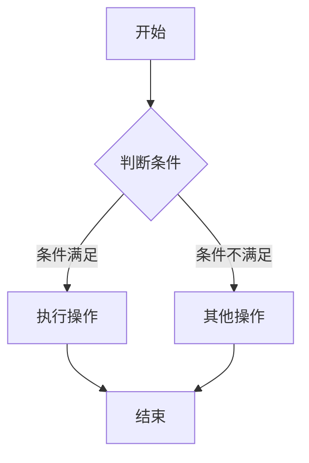
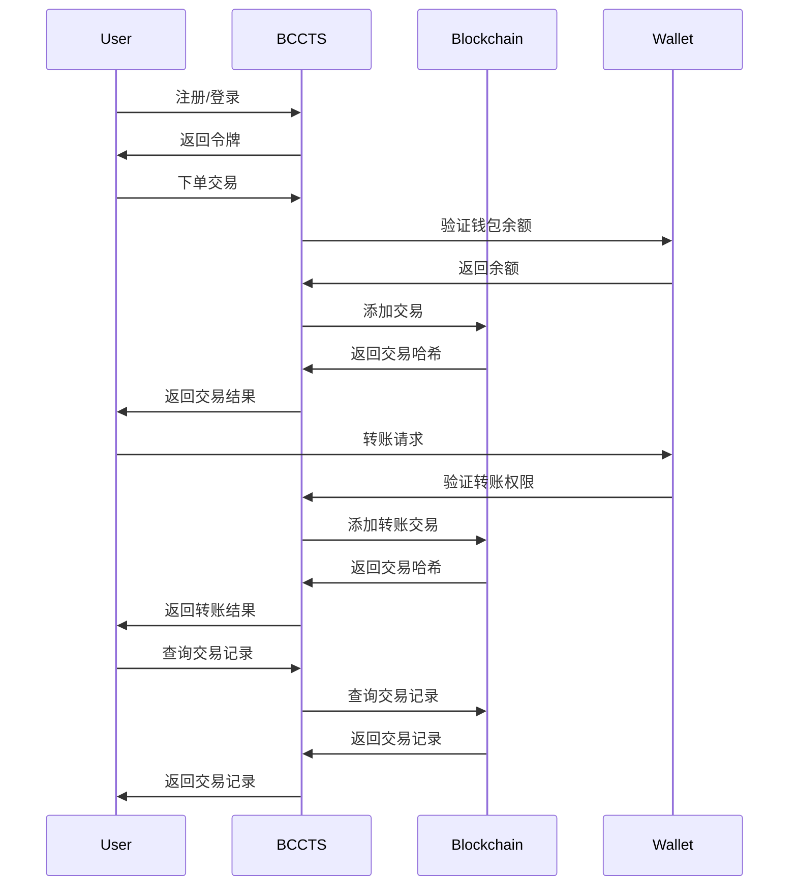

                 

### 第一部分：加密货币概述

在当今数字经济的浪潮中，加密货币已经成为一个不可忽视的现象。加密货币不仅改变了金融交易的方式，也为分布式系统的发展提供了新的思路。然而，要理解加密货币的内在机制，我们需要首先了解其基础概念，包括起源、发展历程、关键技术及其安全性。

这一部分的目的是为读者提供一个全面而深入的了解，为后续更复杂的讨论打下坚实的基础。我们将分以下几个小节进行探讨：

1. **加密货币的起源与发展**：这部分将介绍加密货币的起源，从早期的数字货币到比特币的诞生，以及加密货币市场的快速发展。

2. **加密货币的基本概念**：我们将定义加密货币，解释其特点，并对其进行分类。

3. **加密货币的关键技术**：我们将探讨加密货币背后的核心技术，包括加密算法、区块链技术、智能合约技术和隐私保护技术。

4. **加密货币的安全性**：这一节将讨论加密货币面临的安全挑战，以及如何保障其安全性。

5. **本章小结**：这部分将总结本节的主要内容，并给出进一步学习的建议。

让我们从加密货币的起源与发展开始，逐步深入这一全新的领域。

#### 1.1.1 加密货币的起源

加密货币的起源可以追溯到数字货币的早期尝试。早在20世纪80年代，数字货币的概念就已经出现。大卫·乔姆（David Chaum）是数字现金的先驱之一，他提出了盲签名（blind signature）和匿名电子现金系统（E-Cash），这在当时为数字货币的发展奠定了基础。匿名电子现金系统允许用户在保持匿名的情况下进行交易，从而打破了传统金融系统的中心化控制。

然而，真正的加密货币革命始于2008年，一位名为中本聪（Satoshi Nakamoto）的匿名人物发布了比特币（Bitcoin）的白皮书。比特币不仅是第一个成功的加密货币，还引入了区块链技术，这是一种去中心化的分布式数据库，能够确保交易记录的安全性和不可篡改性。

比特币的出现引起了全球的关注，各种加密货币项目如雨后春笋般涌现。比特币的成功展示了加密货币的潜力，但同时也暴露了许多问题，如交易确认时间过长、网络拥堵和安全性挑战。为了解决这些问题，新的加密货币项目不断出现，如以太坊（Ethereum）、莱特币（Litecoin）等，它们引入了智能合约和分片等技术，进一步推动了加密货币的发展。

#### 1.1.2 加密货币的发展历程

加密货币的发展历程可以分为几个重要阶段：

1. **早期阶段**：2009年，比特币网络正式上线，第一个区块（创世区块）被挖掘出来。这一阶段，加密货币主要是作为一种去中心化的数字货币存在，主要用于点对点的价值交换。

2. **成长阶段**：随着比特币价格的不断攀升，加密货币逐渐引起了更多人的关注。2011年，一个名为“丝绸之路”（Silk Road）的在线市场开始接受比特币支付，这一事件进一步推动了加密货币的应用。同时，莱特币和其他加密货币项目也相继诞生，丰富了加密货币的生态系统。

3. **扩展阶段**：随着加密货币用户和交易量的增加，如何提高交易速度和扩展性成为了一个关键问题。2014年，以太坊的推出为智能合约提供了平台，使得加密货币的应用不再局限于数字货币，而是扩展到去中心化应用（DApp）和去中心化金融（DeFi）等领域。同时，各种分片技术和优化方案也被提出，以解决比特币和以太坊的网络拥堵问题。

4. **规范阶段**：随着加密货币市场的不断扩大，监管问题逐渐显现。各国政府和监管机构开始关注加密货币的合规性问题，出台了一系列监管政策。这一阶段，加密货币市场逐渐趋于规范，同时也面临着更多的挑战和机遇。

#### 1.1.3 加密货币的现状与趋势

目前，加密货币市场已经进入了相对成熟的发展阶段。根据2023年的数据，比特币和以太坊等主流加密货币的价格相对稳定，市场规模持续扩大。加密货币的应用也从最初的数字货币扩展到了更多的领域，如金融、供应链、艺术品交易等。

然而，加密货币市场仍然存在许多挑战，如市场波动性、安全性问题和监管不确定性等。未来，加密货币的发展趋势可能会包括：

1. **技术升级**：随着区块链技术的不断进步，加密货币的性能和安全性将得到进一步提升。例如，分片技术、状态通道、零知识证明等技术将有望解决当前网络拥堵和隐私保护问题。

2. **监管合规**：各国政府和监管机构将继续加强对加密货币市场的监管，以确保市场的稳定和透明。加密货币项目也需要遵守相应的法律法规，以提高市场信任度。

3. **应用扩展**：随着技术的不断进步和市场的逐渐成熟，加密货币的应用领域将不断扩展。例如，在金融领域，去中心化金融（DeFi）和加密货币交易将得到更广泛的应用；在供应链领域，加密货币可以用于追踪和验证商品的真实性。

4. **市场融合**：随着加密货币市场的逐渐成熟，与传统金融市场的融合也将成为趋势。例如，加密货币基金、加密货币交易所与传统金融机构的合作将不断增多。

#### 1.2.1 加密货币的定义

加密货币是一种基于密码学原理来确保交易安全及控制交易单位创造的交易媒介。与传统货币不同，加密货币不是由中央银行或政府发行，而是通过去中心化的方式在计算机网络中生成和交易。加密货币的基本特点是：

- **去中心化**：加密货币的交易和记录不由单一机构或实体控制，而是分布在全球多个节点上，确保了系统的透明性和抗攻击性。
- **安全性**：加密货币使用先进的加密算法来保护交易记录和用户隐私，确保数据的安全性和完整性。
- **不可篡改**：加密货币的交易记录被永久存储在区块链上，一旦记录生成，就不可更改，保证了交易记录的可靠性。

#### 1.2.2 加密货币的特点

加密货币具有以下几个显著特点：

- **匿名性**：尽管加密货币交易记录是公开的，但用户的身份信息是隐藏的。这使得用户可以在无需透露个人信息的情况下进行交易，增加了交易的隐私性。
- **去中心化**：加密货币不依赖于中央银行或金融机构，通过分布式网络进行交易和记录管理。这意味着没有单点故障的风险，系统更加稳定和可靠。
- **全球性**：加密货币的交易不受地理位置限制，用户可以随时随地进行交易，这为跨境交易提供了便利。
- **安全性**：加密货币使用加密技术来保护交易记录和用户隐私，确保数据在传输和存储过程中的安全。
- **有限性**：许多加密货币都有固定的发行量，例如比特币的总发行量被限制在2100万枚，这确保了货币的稀缺性和价值稳定性。

#### 1.2.3 加密货币的分类

根据不同的分类标准，加密货币可以划分为多个类别：

- **按功能分类**：加密货币可以分为支付货币、投资货币和应用货币。支付货币主要用于日常交易，如比特币和莱特币；投资货币主要用于价值储存，如比特币和以太坊；应用货币则用于特定应用场景，如去中心化金融（DeFi）和游戏中的虚拟资产。
- **按共识算法分类**：加密货币可以分为工作量证明（PoW）、权益证明（PoS）、委托权益证明（DPoS）等。例如，比特币使用的是PoW算法，以太坊2.0计划从PoW转向PoS算法。
- **按发行主体分类**：加密货币可以分为公有链上的加密货币和私有链上的加密货币。公有链上的加密货币如比特币和以太坊，其发行和管理不受单一实体控制；私有链上的加密货币则通常由特定机构或企业发行和管理。

#### 1.3.1 加密算法

加密算法是加密货币安全性的基石。加密货币使用各种加密算法来保护交易数据，确保交易的隐私性和安全性。以下是几种常见的加密算法：

- **对称加密**：对称加密算法使用相同的密钥进行加密和解密，如AES（高级加密标准）。对称加密算法速度快，但密钥管理复杂，需要确保密钥的安全存储和传输。
- **非对称加密**：非对称加密算法使用一对密钥（公钥和私钥）进行加密和解密，如RSA（Rivest-Shamir-Adleman）和ECC（椭圆曲线密码学）。非对称加密算法在数据传输过程中提供了更高的安全性，但计算复杂度较高。
- **哈希函数**：哈希函数是一种将输入数据映射为固定长度输出值（哈希值）的算法，如SHA-256（安全哈希算法）。哈希函数在加密货币中用于确保数据的完整性和不可篡改性，同时为区块链提供了一种去中心化的验证机制。
- **数字签名**：数字签名是一种使用非对称加密算法验证交易真实性和完整性的技术。交易发起者使用私钥生成数字签名，交易接收者使用公钥验证签名的真实性。数字签名确保了交易的真实性和不可抵赖性。

#### 1.3.2 区块链技术

区块链技术是加密货币的核心技术之一。区块链是一种分布式数据库，由多个连续的区块组成，每个区块包含一定数量的交易记录。区块链的主要特点包括：

- **去中心化**：区块链不依赖于中央机构，通过分布式网络进行数据存储和验证。这意味着任何节点都可以参与区块链网络的运行，确保了系统的透明性和抗攻击性。
- **不可篡改性**：区块链上的数据一旦被记录，就不可更改。每个区块都包含前一个区块的哈希值，形成一个链式结构，确保了数据的完整性和不可篡改性。
- **可追溯性**：区块链上的每笔交易都是公开透明的，任何用户都可以查询区块链上的交易记录。这使得区块链成为了一种可信的、透明的数据存储和交易记录方式。

#### 1.3.3 智能合约技术

智能合约是加密货币技术的重要组成部分，它允许在区块链上进行自动化的、去中心化的交易和合同执行。智能合约的主要特点包括：

- **自动化执行**：智能合约在满足特定条件时自动执行，无需人工干预。这提高了交易和合同执行的速度和效率，降低了交易成本。
- **去中心化**：智能合约在区块链上执行，不依赖于中央机构或第三方中介。这确保了合同的执行透明性和不可篡改性。
- **透明性**：智能合约的代码是公开透明的，任何用户都可以查看和验证智能合约的执行过程。这增加了合同的透明度和信任度。

#### 1.4.1 加密货币面临的安全挑战

尽管加密货币在安全性方面取得了显著进展，但仍面临着多种安全挑战：

- **双花攻击**：双花攻击是指攻击者在同一时间内将同一笔资金转移给多个接收者，从而获取非法利益。为了防止双花攻击，加密货币通常采用区块链技术和分布式网络来确保交易记录的不可篡改性。
- **51%攻击**：51%攻击是指攻击者控制区块链网络超过51%的算力，从而篡改区块链数据。为了防止51%攻击，加密货币通常采用挖矿机制和权益证明等机制来确保网络的去中心化。
- **隐私泄露**：尽管加密货币交易记录是公开透明的，但用户的交易行为和身份信息可能会被第三方分析，从而导致隐私泄露。为了保护用户隐私，加密货币引入了零知识证明、混合交易等技术。
- **智能合约漏洞**：智能合约代码的复杂性和漏洞可能导致资金损失和合同执行失败。为了防止智能合约漏洞，开发人员需要严格遵守安全编码规范，并进行充分的安全审计和测试。

#### 1.4.2 加密货币的安全性保障措施

为了保障加密货币的安全性，采取了多种技术和管理措施：

- **加密算法**：加密货币使用各种加密算法来保护交易数据，确保数据在传输和存储过程中的安全性。
- **分布式网络**：加密货币采用分布式网络结构，确保交易记录的不可篡改性和去中心化。
- **挖矿机制**：挖矿机制通过竞争计算资源来确保区块链网络的去中心化和安全性。
- **权益证明**：权益证明机制通过持有加密货币的数量和时间来确保网络参与者的合法性和安全性。
- **智能合约审计**：智能合约审计通过安全分析和测试来发现和修复智能合约代码中的潜在漏洞。

#### 1.4.3 加密货币的安全使用指南

为了确保在加密货币交易中的安全，用户可以采取以下措施：

- **使用强密码**：使用复杂的密码和双因素认证来保护钱包账户的安全。
- **备份私钥**：将私钥备份在安全的地方，避免因私钥丢失导致资金损失。
- **避免点击不明链接**：不要随意点击不明链接或下载不明文件，以防止恶意软件攻击。
- **定期更新软件**：保持钱包和相关软件的最新版本，以修复已知的安全漏洞。
- **谨慎交易**：在进行加密货币交易时，要仔细核实交易对象和交易内容，避免上当受骗。

#### 2.1.1 共识算法的定义

共识算法是指在分布式系统中，各个节点通过协商和验证，达成一致意见的算法。在加密货币领域，共识算法尤为重要，因为它决定了网络中的交易如何被确认、区块如何被生成以及新加密货币如何被发行。

简而言之，共识算法的目标是确保网络中的所有参与者能够在面对潜在恶意行为（如双重支付攻击）时，仍然能够达成一致，维护系统的安全性和一致性。共识算法的核心功能包括：

- **交易验证**：确保交易是合法的，并符合网络规则。
- **区块生成**：参与者通过竞争或协作生成新的区块，并将其添加到区块链上。
- **安全性**：通过防止单个或多个节点对系统进行恶意攻击，如双花攻击和51%攻击。
- **一致性**：在分布式网络中，确保所有节点对区块链的状态有一致的看法。

#### 2.1.2 共识算法的作用

共识算法在加密货币系统中扮演着至关重要的角色，具体作用包括：

- **交易确认**：共识算法确保了交易在网络中的确认，防止双重支付攻击。例如，比特币网络中的节点通过工作量证明（PoW）算法来验证交易，只有当交易被包含在新区块中时，才被认为是最终确认的。
- **区块生成**：共识算法决定了新区块的生成机制。不同的共识算法有不同的区块生成策略，如比特币的PoW算法和以太坊的PoS算法。
- **新币发行**：在许多加密货币中，新币的发行与共识算法密切相关。例如，比特币的新币发行是通过挖矿过程实现的，而以太坊的新币发行则与参与者的权益证明相关。
- **系统安全性**：共识算法通过确保网络中的节点能够达成一致，提高了系统的抗攻击性和安全性。例如，PoW算法通过计算难度和节点竞争来防止单一实体对网络进行恶意攻击。

#### 2.1.3 共识算法的分类

根据不同的实现方式和目标，共识算法可以分为多种类型：

- **工作量证明（PoW）**：节点通过解决复杂的数学问题来证明自己的工作量，从而获得生成新区块的权力。比特币使用的就是PoW算法。
- **权益证明（PoS）**：节点根据持有的币龄和币量来获得生成新区块的权力。以太坊2.0计划从PoW转向PoS算法。
- **委托权益证明（DPoS）**：节点通过选举代表来生成区块，代表们的选举权与持有的币量和币龄成正比。
- **权威证明（PoA）**：系统由一组预选的权威节点来维护和验证交易。
- **实用拜占庭容错（PBFT）**：通过多数节点之间的协作来达成共识，适用于小规模、高信任度的系统。

#### 2.2.1 共识算法的基本原理

共识算法的基本原理是确保分布式系统中的各个节点能够在面对不确定性、延迟和潜在恶意行为时，达成一致意见。以下是共识算法的基本原理：

- **网络模型**：共识算法通常假设网络是异步的、不安全的，节点可能随机失败或加入/离开网络。网络中的每个节点都维护一个本地状态，并通过交换信息来达成共识。
- **一致性目标**：共识算法的目标是使所有节点在有限时间内达成一致状态。一致性通常通过以下方式实现：
  - **数据一致性**：确保所有节点对同一组数据有一致的看法。
  - **状态一致性**：确保所有节点最终达到相同的状态。
  - **可用性**：确保系统能够响应外部请求，即使部分节点失效。
- **安全性**：共识算法需要能够抵御各种攻击，如恶意节点的欺诈行为、网络攻击等。安全性通常通过以下方式实现：
  - **身份验证**：确保节点身份的真实性，防止恶意节点加入网络。
  - **加密通信**：确保节点之间的通信是安全的，防止数据被篡改或窃取。
  - **拜占庭容错**：在面临恶意行为时，系统能够继续运作。

#### 2.2.2 共识算法的关键要素

共识算法的设计和实现依赖于以下几个关键要素：

- **节点选择**：共识算法需要确定哪些节点有权参与共识过程。这通常与节点的计算能力、币龄、信誉度等因素相关。
- **共识规则**：共识算法需要定义节点之间如何交换信息、如何达成共识。共识规则决定了节点在共识过程中的行为和决策。
- **安全性机制**：共识算法需要包含安全性机制，以防止恶意行为和攻击。安全性机制包括身份验证、加密通信和拜占庭容错等。
- **共识协议**：共识协议是实现共识算法的具体步骤和流程。常见的共识协议包括PoW、PoS、DPoS等。

#### 2.2.3 共识算法的设计原则

为了确保共识算法的有效性和安全性，设计共识算法时需要遵循以下几个原则：

- **去中心化**：共识算法应确保权力分散，避免单一实体控制网络。
- **安全性**：共识算法应能够抵御各种攻击，如双花攻击、51%攻击等。
- **效率**：共识算法应能够在合理的时间内达成共识，确保系统的可用性和响应速度。
- **扩展性**：共识算法应能够支持大量节点和交易，以适应不断增长的网络规模。
- **简单性**：共识算法的设计应尽可能简单，以降低理解和实现的难度。
- **灵活性**：共识算法应能够适应不同的应用场景和需求，具有较好的可扩展性和适应性。

### 2.3.1 拜占庭将军问题的背景

拜占庭将军问题（Byzantine Generals Problem，BGP）最初由莱斯利·兰伯特（Leslie Lamport）在1982年提出，是为了解决分布式系统中的共识问题。这个问题的背景可以设想为古代拜占庭帝国的将领们围攻一个城堡，需要共同做出是否撤退的决定。然而，由于通信网络的延迟和不稳定，将领们无法同时收到同一信息，且部分将领可能是叛徒，会故意传递错误的信息。

拜占庭将军问题的核心在于，如何在存在部分恶意节点的分布式系统中，确保所有节点能够达成一致决策。这一问题在加密货币和分布式系统中具有广泛的应用，因为它们都需要在不确定和潜在攻击的环境下，保证数据一致性和系统安全。

### 2.3.2 拜占庭将军问题的解决方案

为了解决拜占庭将军问题，研究者们提出了一系列算法和协议，其中一些最为著名的是实用拜占庭容错（Practical Byzantine Fault Tolerance，PBFT）和PBFT变体。以下是一个基于PBFT的基本解决方案：

1. **初始化**：每个将军（节点）都有一个初始状态和一个可能的目标状态。
2. **准备阶段**：将军们发送消息询问其他将军的状态。
3. **投票阶段**：每个将军根据收到的信息进行投票，并将投票结果发送给其他将军。
4. **确认阶段**：将军们接收并统计投票结果，如果大多数将军投票支持同一状态，则该状态被确认。
5. **决策阶段**：当将军们达成一致状态后，可以执行撤退或其他决策。

在PBFT协议中，为了保证系统的安全性，通常需要以下步骤：

- **身份验证**：确保将军们的身份是可信的，防止恶意节点加入系统。
- **加密通信**：将军们使用加密算法确保通信的安全性和完整性，防止信息被篡改或窃取。
- **拜占庭容错**：通过多数节点之间的协作，确保系统能够抵御恶意节点的攻击。

### 2.3.3 拜占庭将军问题的核心原理

拜占庭将军问题的核心原理在于如何在不确定性和恶意行为的环境下，确保分布式系统中的节点能够达成一致决策。这一原理可以通过以下关键点来理解：

1. **多数原则**：系统中的大多数节点必须达成一致，才能做出有效决策。这意味着即使部分节点是恶意或失效的，只要大多数节点保持一致，系统仍能正常运作。
2. **信息同步**：节点之间需要交换信息，以了解其他节点的状态和决策。通过反复的信息交换和投票，节点能够逐步达成一致。
3. **容错机制**：系统需要能够容忍部分节点的恶意行为或失效，通过多数原则和反复的信息交换，系统能够在大多数节点达成一致后继续运作。
4. **加密和安全**：为了保证信息交换的安全，节点之间需要使用加密算法进行通信，确保信息的完整性和保密性。

### 3.2.1 比特币共识算法的原理

比特币的共识算法是工作量证明（Proof of Work，PoW）。PoW的基本原理是通过计算大量复杂的数学问题，来证明节点的工作量，从而获得生成新区块的权力。以下是比特币共识算法的详细原理：

1. **挖矿过程**：矿工（节点）通过计算复杂的数学问题，即找到一个随机数，使其与当前区块头中的某个特定值相匹配。这个计算过程称为挖矿。
2. **工作量证明**：矿工需要使用计算能力来解决数学问题，这个过程消耗大量的计算资源和能源。解决了数学问题的矿工将其解决方案（证明）广播给网络中的其他节点。
3. **区块生成**：当某个矿工找到了一个有效的解决方案时，其将生成的区块广播给网络。其他节点会验证这个区块的有效性，如果验证通过，则该区块将被添加到区块链上。
4. **新区块奖励**：生成新区块的矿工将获得比特币奖励，这作为对矿工工作量的奖励。随着比特币网络的发展，这个奖励将逐渐减少，以保持比特币的总供应量稳定。

### 3.2.2 比特币共识算法的实现

比特币的共识算法实现涉及多个关键组件，包括挖矿软件、钱包客户端、区块链节点等。以下是比特币共识算法的实现过程：

1. **挖矿软件**：矿工使用专门的挖矿软件来执行计算任务。这些软件通常基于开源项目，如CGminer、ccminer等，通过GPU或ASIC芯片进行高性能计算。
2. **钱包客户端**：用户通过钱包客户端管理他们的比特币资产。钱包客户端可以是桌面应用、移动应用或在线服务。钱包客户端通过私钥和公钥进行加密交易，并与区块链节点进行通信。
3. **区块链节点**：区块链节点维护比特币网络的状态，并参与共识过程。节点通过下载和同步区块链数据，验证交易和区块的有效性，并广播新区块到网络中。
4. **网络通信**：比特币网络使用P2P（点对点）协议进行通信。矿工、钱包客户端和区块链节点通过Gossip协议交换信息和验证交易。

### 3.2.3 比特币共识算法的性能分析

比特币共识算法的性能分析主要涉及以下几个方面：

1. **计算资源消耗**：PoW算法需要大量的计算资源，这使得矿工需要投入大量的硬件和能源。随着挖矿难度的增加，计算资源消耗将进一步增加。
2. **交易确认时间**：比特币网络的交易确认时间取决于挖矿速度和区块生成时间。通常情况下，交易需要至少6个区块确认才能被认为是安全的。这意味着比特币的交易确认时间较长，不适合高频交易。
3. **网络拥堵**：随着比特币用户和交易量的增加，网络拥堵问题逐渐显现。为了处理更多的交易，比特币网络需要不断扩展，如通过分片技术和状态通道等方案。
4. **安全性**：比特币的共识算法通过巨大的计算资源投入来保证网络的安全性和去中心化。尽管存在51%攻击的风险，但当前的比特币网络规模和算力使得这种攻击成本极高，相对安全。

#### 3.3.1 智能合约共识算法的原理

智能合约共识算法是专门为智能合约平台设计的，以实现智能合约的安全执行和状态一致性。智能合约共识算法的核心原理是确保所有节点对智能合约的状态和执行结果有一致的认识。以下是智能合约共识算法的详细原理：

1. **状态一致性**：智能合约平台中的每个节点都维护一个独立的状态数据库。共识算法确保所有节点在执行智能合约时，对当前状态的看法一致。状态一致性是智能合约平台的核心要求，因为一旦状态不一致，智能合约的执行结果就可能受到影响。
2. **执行验证**：在智能合约执行过程中，共识算法确保所有节点对合约代码的执行结果进行验证。验证过程通常包括代码正确性检查、执行路径分析和结果验证。通过验证，确保智能合约的执行是安全、有效和一致的。
3. **去中心化执行**：智能合约共识算法要求合约执行过程是去中心化的，即没有单一实体能够控制或篡改合约的执行结果。去中心化执行确保了智能合约平台的透明性和抗攻击性，防止恶意行为。
4. **安全性**：智能合约共识算法通过加密、身份验证和拜占庭容错等机制，确保智能合约在执行过程中不受恶意攻击。安全性是智能合约共识算法的关键目标，因为一旦智能合约被攻击，可能造成巨大的经济损失。

#### 3.3.2 智能合约共识算法的实现

智能合约共识算法的实现涉及多个关键组件，包括区块链节点、智能合约执行引擎和共识协议。以下是智能合约共识算法的实现过程：

1. **区块链节点**：区块链节点负责存储智能合约的状态和执行历史。节点通过同步和验证区块，确保整个网络对智能合约状态有一致的认识。每个节点都运行着智能合约执行引擎，用于执行和验证智能合约。
2. **智能合约执行引擎**：智能合约执行引擎是智能合约平台的核心组件，负责执行智能合约代码和验证合约结果。执行引擎通常基于虚拟机（如以太坊的EVM）运行，并支持多种编程语言（如Solidity）。
3. **共识协议**：共识协议是智能合约共识算法的核心，负责确保节点之间的状态一致性和执行验证。常见的共识协议包括PoW、PoS和DPoS。这些协议通过不同的机制，确保智能合约平台的安全性和性能。

#### 3.3.3 智能合约共识算法的性能分析

智能合约共识算法的性能分析主要涉及以下几个方面：

1. **交易处理速度**：智能合约共识算法的性能直接影响智能合约平台的交易处理速度。高性能的共识算法能够快速处理大量交易，提高平台的吞吐量。例如，以太坊的PoW算法在高峰时段可能会出现交易延迟，而PoS算法能够提供更高的交易速度。
2. **计算资源消耗**：智能合约共识算法需要消耗大量的计算资源，包括CPU、内存和网络带宽。高性能算法通常需要更多的计算资源，但在某些场景下，这可以换来更高的交易处理速度和系统稳定性。
3. **网络延迟**：智能合约共识算法的网络延迟是影响交易确认时间的重要因素。低延迟的算法可以更快地完成交易确认，提高用户体验。例如，以太坊的网络延迟问题在高峰时段可能导致交易延迟。
4. **安全性**：智能合约共识算法的安全性是平台稳定运行的关键。高性能算法需要确保系统能够抵御各种攻击，如双花攻击、51%攻击等。安全性措施包括加密、身份验证和拜占庭容错等。

#### 3.4.1 共识算法的发展趋势

随着区块链技术的不断进步和应用场景的拓展，共识算法也在不断发展。以下是共识算法未来可能的发展趋势：

1. **性能优化**：随着区块链应用规模的扩大，高性能的共识算法将越来越重要。未来的共识算法可能会更加注重性能优化，包括降低交易确认时间、提高交易吞吐量和降低计算资源消耗。
2. **安全性增强**：随着区块链系统的复杂性和应用范围的增加，共识算法的安全性需求也将不断提高。未来的共识算法可能会引入更高级的加密技术、身份验证机制和拜占庭容错算法，以提高系统的安全性。
3. **隐私保护**：随着用户对隐私保护的需求增加，未来的共识算法可能会引入零知识证明、混合交易等技术，以保护用户隐私。
4. **跨链协作**：随着区块链生态系统的不断发展，跨链协作将成为共识算法的重要发展方向。未来的共识算法可能会支持跨链交易和跨链合约，以实现不同区块链之间的互操作性和资源共享。
5. **智能合约优化**：智能合约在区块链应用中扮演着重要角色，未来的共识算法可能会更加注重智能合约的性能优化、安全性和可扩展性。例如，通过引入新型编程语言和执行引擎，提高智能合约的执行效率和安全性。

#### 3.4.2 共识算法的潜在研究方向

共识算法作为区块链技术的核心，其潜在研究方向十分广泛，以下是一些值得关注的领域：

1. **安全性研究**：随着区块链系统的复杂性和应用范围的扩大，共识算法的安全性研究将变得更加重要。未来的研究可能会集中在开发更高级的加密技术、设计更加鲁棒的拜占庭容错算法，以及构建更加安全的智能合约平台。
2. **性能优化**：性能优化是共识算法研究的永恒主题。未来的研究可能会探索新的共识算法，以降低交易确认时间、提高交易吞吐量和降低计算资源消耗。例如，研究更高效的哈希算法、优化网络通信协议等。
3. **隐私保护**：随着用户对隐私保护的需求增加，隐私保护技术将成为共识算法研究的重要方向。未来的研究可能会集中在开发零知识证明、混合交易、隐私增强方案等，以实现更加隐私友好的区块链系统。
4. **跨链协作**：随着区块链生态系统的不断发展，跨链协作将成为共识算法研究的一个重要方向。未来的研究可能会探索如何在不同区块链之间实现高效、安全的跨链交易和跨链合约，以促进区块链生态系统的整合和发展。
5. **智能合约优化**：智能合约在区块链应用中扮演着重要角色，未来的研究可能会集中在优化智能合约的性能、安全性和可扩展性。例如，开发新的编程语言和执行引擎，优化智能合约的执行效率，增强智能合约的安全性。

#### 3.4.3 共识算法在区块链应用中的挑战与机遇

共识算法在区块链应用中面临着诸多挑战与机遇。以下是其中一些关键挑战和机遇：

1. **挑战**：
   - **性能瓶颈**：随着区块链应用规模的扩大，现有的共识算法可能会面临性能瓶颈，导致交易延迟和处理能力不足。如何优化共识算法，提高区块链系统的性能，是一个亟待解决的问题。
   - **安全性问题**：共识算法的安全性直接关系到区块链系统的安全性。如何在面临各种攻击（如双花攻击、51%攻击等）时，确保共识算法的鲁棒性和安全性，是当前的一个重要挑战。
   - **隐私保护**：用户对隐私保护的需求日益增加，如何在保证隐私的同时，确保区块链系统的透明性和可追溯性，是一个复杂的技术挑战。

2. **机遇**：
   - **技术创新**：随着区块链技术的不断发展，新的共识算法和技术不断涌现。例如，零知识证明、分片技术、状态通道等，都为共识算法的创新提供了广阔的空间。
   - **跨链协作**：随着区块链生态系统的多元化发展，跨链协作将成为共识算法的重要应用场景。如何在不同区块链之间实现高效、安全的跨链交易和跨链合约，将带来新的发展机遇。
   - **智能合约优化**：智能合约在区块链应用中扮演着重要角色。未来的研究将集中在优化智能合约的性能、安全性和可扩展性，这将有助于推动区块链应用的创新和发展。

#### 4.1.1 加密货币的交易流程

加密货币的交易流程主要包括以下几个步骤：

1. **创建交易**：交易发起者使用加密货币钱包客户端创建交易。交易包含发送方、接收方、交易金额以及交易输入和输出的详细信息。
2. **签名交易**：交易发起者使用私钥对交易进行数字签名，以验证交易的合法性和所有权。数字签名确保交易无法被未经授权的第三方修改。
3. **广播交易**：交易发起者将签名后的交易广播到网络中的其他节点。节点接收到交易后，会开始验证交易的有效性。
4. **交易验证**：节点对交易进行验证，确保交易输入输出平衡、交易金额合法、交易未花费以及交易未违反网络规则。验证通过后，交易会被加入到节点本地的内存池中。
5. **区块包含**：矿工从内存池中选择交易，将它们打包成一个新的区块。矿工会对区块进行工作量证明（PoW）计算，以获得生成新区块的权力。
6. **新区块生成**：矿工找到有效的随机数后，生成新区块，并将其广播到网络中的其他节点。
7. **区块验证**：节点接收到新区块后，会验证区块的有效性，包括验证区块中的交易是否合法、区块头是否正确等。验证通过后，区块将被添加到区块链上。
8. **交易确认**：交易被包含在区块链上的区块后，被认为是最终确认的。通常需要多个区块确认，以确保交易的安全性和不可篡改性。

#### 4.1.2 加密货币的交易验证

加密货币的交易验证是确保交易合法性和系统安全性的一项关键措施。以下是交易验证的详细过程：

1. **验证交易输入**：节点首先验证交易输入的合法性，包括检查交易输入是否已花费、交易输入与输出的金额是否匹配、签名是否有效等。
2. **检查交易未花费**：节点通过检查区块链上的交易历史记录，确保交易输入未被其他交易消耗。这通过验证交易输入的UTXO（未花费交易输出）集来实现。
3. **验证签名**：节点使用交易发起者的公钥验证交易签名的有效性。签名验证确保交易确实由交易发起者发起，防止篡改。
4. **检查交易金额**：节点验证交易输出的金额是否等于交易输入的金额，确保交易是平衡的。这通过验证交易的总输入金额是否大于或等于总输出金额来实现。
5. **验证交易规则**：节点检查交易是否满足网络规定的规则，如交易大小限制、金额限制、交易类型等。这确保了交易不会违反网络规则，从而维护系统的稳定性。
6. **检查交易未违反双重支付攻击**：节点通过检查交易历史记录，确保交易未涉及双重支付攻击。双重支付攻击是指同一笔资金被用于多次交易，这会导致系统内部冲突。
7. **验证区块有效性**：节点在确认交易后，还会验证区块的有效性，包括区块头是否正确、区块中的交易是否合法、区块难度是否满足要求等。这确保了区块的完整性和一致性。

#### 4.1.3 加密货币的交易确认

加密货币的交易确认是交易过程的关键环节，它确保了交易的安全性和不可篡改性。以下是加密货币交易确认的详细过程：

1. **交易广播**：交易发起者将签名后的交易广播到网络中的其他节点。这一过程是通过P2P网络实现的，交易会被传播到整个网络。
2. **交易验证**：节点接收到交易后，会按照交易验证流程对交易进行验证，确保交易是合法的。验证过程包括验证交易输入未花费、签名有效性、交易金额平衡和网络规则等。
3. **交易入池**：验证通过后的交易会被加入到节点的内存池中。内存池是节点用于暂存待验证交易的缓存区。
4. **矿工选择交易**：矿工在构建新区块时，会从内存池中选择交易进行打包。矿工通常会根据交易费用和交易大小等因素进行选择。
5. **工作量证明（PoW）计算**：矿工对选择的交易进行工作量证明计算，以找到一个新的随机数，使其满足网络设定的难度要求。这一过程需要大量的计算资源，通常使用GPU或ASIC芯片进行计算。
6. **新区块生成**：矿工找到有效随机数后，会生成一个新的区块，并将其广播到网络中的其他节点。
7. **区块验证**：节点接收到新区块后，会对区块进行验证，确保区块中的交易是合法的、区块头正确、区块难度满足要求等。验证通过后，区块将被添加到区块链上。
8. **交易确认**：交易被包含在区块链上的区块后，被认为是最终确认的。通常需要多个区块确认，以确保交易的安全性和不可篡改性。例如，比特币网络通常需要6个区块确认，而以太坊网络则通常需要12个区块确认。

#### 4.2.1 加密货币的安全隐患

尽管加密货币在安全性方面取得了显著进展，但仍然存在一些潜在的安全隐患，这些隐患可能会对用户资产造成威胁。以下是加密货币领域常见的几种安全隐患：

1. **双花攻击**：双花攻击是指攻击者将同一笔资金同时发送给多个接收者，从而获取非法利益。攻击者通过控制多个节点或伪造交易，可能导致交易之间的冲突，从而造成资金损失。
2. **51%攻击**：51%攻击是指攻击者控制区块链网络超过51%的算力，从而篡改区块链数据或双花攻击。这种攻击通常需要大量的计算资源和资金，但一旦成功，将对整个区块链网络造成严重威胁。
3. **恶意节点**：在去中心化的区块链网络中，恶意节点可能会故意传播错误的信息、伪造区块或拒绝服务攻击。恶意节点可能会影响区块链网络的正常运行，造成系统故障或数据丢失。
4. **私钥泄露**：私钥是用户访问加密货币资产的重要凭证，一旦私钥泄露，攻击者可以窃取用户的资产。私钥泄露可能是由于用户操作失误、恶意软件攻击或系统漏洞导致的。
5. **智能合约漏洞**：智能合约是区块链应用的核心组成部分，但智能合约代码的复杂性和错误可能导致资金损失和合同执行失败。智能合约漏洞可能是由于代码错误、逻辑缺陷或外部攻击导致的。
6. **网络钓鱼和诈骗**：加密货币网络钓鱼和诈骗是一种常见的网络攻击方式，攻击者通过伪装成可信实体，诱骗用户泄露个人信息或访问恶意网站。网络钓鱼和诈骗可能导致用户资产被盗或个人信息泄露。

#### 4.2.2 加密货币的安全措施

为了应对加密货币领域潜在的安全隐患，用户和开发者可以采取一系列安全措施来保障资产和系统的安全性。以下是几种常见的安全措施：

1. **使用强密码**：用户应该使用复杂的密码和双因素认证来保护钱包账户的安全。复杂的密码应包含字母、数字和特殊字符，并定期更换。
2. **备份私钥**：用户应将私钥备份在安全的地方，如硬件钱包、离线存储设备或密码管理工具。私钥一旦丢失，将无法恢复，因此备份至关重要。
3. **避免点击不明链接**：用户应谨慎对待不明链接和文件，不要随意下载或点击，以防止恶意软件攻击。
4. **使用可信的钱包**：用户应选择信誉好、安全可靠的钱包应用，避免使用未知来源或不安全的钱包。
5. **定期更新软件**：用户应保持钱包和相关软件的最新版本，以修复已知的安全漏洞，确保系统的安全性。
6. **使用加密算法**：加密货币交易应使用高级加密算法，如AES和RSA，以确保交易数据的安全性和完整性。
7. **防范双花攻击**：用户和开发者可以通过使用多重签名、时间戳和链下解决方案等措施，防范双花攻击。
8. **进行安全审计**：智能合约开发者应进行充分的安全审计和测试，以发现和修复潜在的安全漏洞。使用自动化工具和安全专家进行代码审计。
9. **分散资产**：用户可以将资产分散存储在不同的钱包和交易所中，降低单一账户被攻击的风险。
10. **参与社区**：用户应积极参与加密货币社区，关注网络安全动态，及时了解最新的安全威胁和防护措施。

#### 4.2.3 加密货币的安全案例分析

以下是几个著名的加密货币安全事件，通过这些案例，我们可以了解加密货币安全的重要性以及如何预防和应对安全事件：

1. **2014年Mt.Gox交易所黑客攻击**：
   Mt.Gox是当时最大的比特币交易所，2014年发生了黑客攻击事件，导致交易所丢失了大约85万个比特币。这一事件揭示了交易所安全措施的重要性。为了预防类似事件，交易所应采取以下措施：
   - 使用多重签名机制，确保交易需要多个密钥才能完成。
   - 定期进行安全审计和漏洞修复，确保系统安全性。
   - 加强员工培训和意识教育，防止内部人员泄露敏感信息。
   - 采用分布式存储方案，确保数据备份的安全性。

2. **2017年The DAO智能合约漏洞**：
   The DAO是一个去中心化组织，由于智能合约代码中的漏洞，黑客成功盗取了价值3.6亿美元的以太币。这一事件揭示了智能合约安全的重要性。为了预防智能合约漏洞，开发者应采取以下措施：
   - 进行彻底的代码审计和测试，使用自动化工具和安全专家进行安全检查。
   - 采用最佳编码实践，遵循安全编程规范。
   - 设计灵活的漏洞修复机制，确保在发现漏洞时能够及时修复。
   - 鼓励社区参与代码审查，利用社区智慧发现潜在问题。

3. **2018年Coinbase交易所黑客攻击**：
   Coinbase是美国最大的加密货币交易所之一，2018年遭受了黑客攻击，导致大约4个比特币被盗。这一事件提醒我们，即使是大型交易所也存在安全风险。为了预防交易所黑客攻击，交易所应采取以下措施：
   - 采用先进的安全技术，如多因素认证、安全隔离和加密存储。
   - 定期进行安全演习和压力测试，确保系统在遭受攻击时能够保持稳定运行。
   - 加强网络安全监控，及时发现和响应异常行为。
   - 建立紧急响应团队，确保在发生安全事件时能够迅速采取行动。

#### 4.3.1 加密货币的监管现状

随着加密货币市场的快速发展，各国政府和监管机构对加密货币的监管也日益重视。目前，全球范围内的加密货币监管现状呈现出多样性和复杂性。以下是几个主要国家和地区的监管措施：

1. **美国**：美国证券交易委员会（SEC）和商品期货交易委员会（CFTC）负责监管加密货币。SEC主要关注加密货币的证券性，对某些加密货币和ICO（首次代币发行）进行严格监管。CFTC则负责监管加密货币的衍生品交易。美国各州也对加密货币实施不同的监管措施。
2. **欧洲**：欧洲证券和市场管理局（ESMA）负责监管加密货币和相关市场活动。欧洲各国也采取了不同的监管措施，如德国允许加密货币交易所注册，英国则对加密货币交易所进行严格审查。
3. **中国**：中国政府自2017年开始加强对加密货币的监管，禁止ICO和加密货币交易。中国监管机构还对加密货币挖矿活动进行了限制，以减少能源消耗。
4. **日本**：日本是加密货币监管最为严格的地区之一。日本金融厅（FSA）负责监管加密货币交易所，要求交易所必须获得运营许可证，并遵守一系列安全措施。
5. **澳大利亚**：澳大利亚证券和投资委员会（ASIC）负责监管加密货币交易所，对加密货币交易所实施注册制度，要求交易所遵守严格的安全标准和客户保护措施。

#### 4.3.2 加密货币的监管挑战

加密货币的监管面临诸多挑战，包括技术、法律和经济等方面的挑战：

1. **技术挑战**：加密货币的匿名性和去中心化特性使得监管变得复杂。监管机构需要掌握先进的区块链技术和加密算法，以识别和追踪交易行为。
2. **法律挑战**：加密货币的法律地位不明确，各国法律对加密货币的界定和监管方式存在差异。如何在全球范围内建立统一的加密货币法律框架，是当前法律领域面临的一个重大挑战。
3. **经济挑战**：加密货币市场的高波动性和投机性，使得监管机构在制定监管政策时面临两难选择。过于严格的监管可能导致市场活力受损，而过松的监管则可能引发系统性风险。
4. **洗钱和非法交易**：加密货币的匿名性和跨境特性，使其成为洗钱和非法交易的重要工具。如何有效打击洗钱和非法交易，是加密货币监管的重要任务。
5. **跨境监管合作**：加密货币市场具有全球性，各国监管机构之间的协调和合作至关重要。然而，由于各国法律和监管体系的差异，跨境监管合作面临诸多挑战。

#### 4.3.3 加密货币的监管发展趋势

未来，加密货币的监管发展趋势可能包括以下几个方面：

1. **全球监管合作**：随着加密货币市场的全球化，各国监管机构将加强跨境监管合作，共同应对跨境交易和洗钱等风险。例如，通过建立国际监管组织或制定国际标准，推动全球加密货币监管体系的建立。
2. **法律框架完善**：各国将逐步完善加密货币的法律框架，明确加密货币的法律地位和监管方式。这将有助于提高市场的透明度和可预测性，吸引更多投资者和企业进入加密货币市场。
3. **技术监管手段**：监管机构将采用先进的区块链技术和加密算法，提高监管效率和准确性。例如，通过区块链数据分析、智能合约审计和区块链监控等技术手段，加强对加密货币市场的监管。
4. **合规性要求**：加密货币交易平台和项目方将面临更严格的合规性要求。例如，加密货币交易平台需要获得监管许可证，项目方需要遵守反洗钱（AML）和了解你的客户（KYC）等法规。
5. **创新监管机制**：监管机构将探索创新监管机制，以适应加密货币市场的快速变化。例如，通过沙箱测试和监管沙盒，为创新项目提供监管试错空间，鼓励技术创新。

#### 4.4.1 加密货币在金融领域的应用

加密货币在金融领域具有广泛的应用，以下是一些主要的应用场景：

1. **支付与结算**：加密货币提供了一种快速、低成本的跨境支付解决方案。传统的跨境支付通常需要数天时间，且手续费较高，而加密货币支付可以在几分钟内完成，且手续费较低。这对于跨国企业和个人用户来说，具有巨大的吸引力。
2. **数字资产管理**：加密货币作为一种数字资产，被广泛应用于资产管理。投资者可以通过购买加密货币来实现资产多样化，并享受加密货币市场的增长潜力。同时，加密货币交易平台和基金提供了多种资产管理工具，如ETF、基金和投资组合等。
3. **去中心化金融（DeFi）**：去中心化金融是一种基于区块链的金融服务，通过智能合约实现去中心化的金融功能，如借贷、交易、衍生品等。DeFi的应用降低了金融中介的成本，提高了金融服务的透明度和安全性。
4. **众筹与ICO**：加密货币为初创企业提供了全新的融资渠道。通过ICO（首次代币发行），初创企业可以迅速筹集资金，实现项目的启动和发展。ICO不仅为投资者提供了投资机会，也为企业提供了高效的融资方式。
5. **跨境支付与汇款**：加密货币在跨境支付和汇款领域具有显著优势。传统的跨境支付通常需要经过多个中介机构，且手续费昂贵。而加密货币支付可以直接在区块链上进行，减少了中介环节，降低了成本。
6. **保险与对冲**：加密货币市场的高波动性为保险和金融对冲提供了新的机会。投资者可以通过购买加密货币相关的保险产品或进行对冲交易，降低投资风险。

#### 4.4.2 加密货币在供应链管理中的应用

加密货币在供应链管理中的应用正在逐渐兴起，以下是一些具体的应用场景：

1. **追踪与验证**：加密货币可以用于追踪供应链中的商品，确保商品的真实性和来源可追溯。通过将商品的交易记录存储在区块链上，供应链中的每个参与者都可以查看和验证商品的历史记录，从而提高供应链的透明度和信任度。
2. **供应链金融**：加密货币可以用于供应链金融，如提供供应链融资、支付预付款和贷款等。通过区块链技术，供应链中的企业可以快速获得融资，提高资金流转效率。
3. **智能合约**：智能合约可以自动执行供应链中的条款和条件，如支付条款、交货条款和质量检验条款等。智能合约确保了供应链交易的自动化和透明性，减少了人为错误和纠纷。
4. **去中心化物流**：加密货币可以用于去中心化的物流管理，如支付运输费用、管理物流订单和跟踪物流状态等。去中心化的物流系统提高了供应链的效率和灵活性，减少了中介成本。
5. **防伪与溯源**：加密货币可以用于防伪和溯源，确保供应链中的商品不被篡改和假冒。通过将商品标识信息存储在区块链上，供应链中的企业可以验证商品的真实性和合法性。
6. **透明度提升**：加密货币的应用提高了供应链的透明度，使供应链中的每个参与者都可以查看和跟踪商品的状态。这有助于提高供应链的信任度和效率，减少欺诈和误差。

#### 4.4.3 加密货币在艺术品交易中的应用

加密货币在艺术品交易中的应用正在逐渐受到关注，以下是一些具体的应用场景：

1. **数字艺术收藏**：加密货币为数字艺术品收藏提供了一个新的平台。艺术家可以将数字艺术作品上传到区块链上，并使用加密货币进行交易和收藏。这种方式确保了艺术品的真实性和唯一性。
2. **去中心化拍卖**：加密货币可以用于去中心化的艺术品拍卖，如使用以太坊区块链上的ERC-721标准进行拍卖。这种方式提高了拍卖的透明度和可信度，减少了传统拍卖的中介费用。
3. **艺术品确权**：加密货币可以用于确权艺术品的所有权，确保艺术品的所有权记录不可篡改。艺术家和买家可以通过区块链记录艺术品的权属信息，从而提高艺术品的交易安全性和可信度。
4. **防伪认证**：加密货币可以用于艺术品防伪认证，确保艺术品的真实性和来源可追溯。艺术品的所有权记录和交易记录都可以存储在区块链上，使艺术品市场更加透明和可信。
5. **数字艺术市场**：加密货币可以用于建立数字艺术品市场，如建立基于区块链的数字艺术品交易平台。这种方式为数字艺术品交易提供了高效、安全的环境，吸引了更多的艺术家和买家。
6. **艺术品融资**：加密货币可以用于艺术品融资，如通过区块链贷款平台为艺术家和买家提供融资服务。这种方式为艺术品交易提供了便捷的融资渠道，促进了艺术品的交易和发展。

### 5.1.1 数学基础在共识算法中的作用

数学基础在共识算法中起着至关重要的作用，它为算法的构建、验证和安全性提供了坚实的理论支持。以下是数学基础在共识算法中发挥的关键作用：

1. **密码学**：密码学是共识算法的核心，它提供了加密、签名、哈希函数等基础工具。加密确保了交易数据的保密性，数字签名确保了交易的真实性和不可抵赖性，哈希函数用于生成交易唯一标识，确保数据的完整性。
2. **图论**：图论用于描述网络结构，分析节点之间的连接关系。在区块链网络中，节点之间的关系可以用图表示，通过图论分析，可以评估网络的稳定性、容错性和通信效率。
3. **概率论**：概率论用于分析共识算法的随机过程，评估算法的可靠性和正确性。例如，在PoW算法中，矿工需要计算随机数，通过概率论可以分析矿工找到有效解的概率。
4. **组合数学**：组合数学用于设计共识算法的机制和策略，如权益证明（PoS）算法中，节点的选择和奖励分配需要使用组合数学进行优化。
5. **博弈论**：博弈论用于分析网络中的竞争行为和策略，评估节点在不同情况下的最优决策。在拜占庭将军问题中，博弈论可以用于分析节点如何通过合作达成共识。

### 5.1.2 数学基础的关键概念

在共识算法中，以下几个关键数学概念是理解和应用数学基础的基础：

1. **哈希函数**：哈希函数是将任意长度的输入数据映射为固定长度输出的函数。在区块链中，哈希函数用于生成每个区块的唯一标识，确保交易记录的不可篡改性。常见的哈希函数包括SHA-256和Keccak。
2. **数字签名**：数字签名是一种使用公钥和私钥进行加密和解密的技术，用于验证交易的真实性和完整性。签名算法包括RSA和ECC（椭圆曲线密码学）。
3. **密码学证明**：密码学证明是指通过数学方法证明某些安全属性。例如，零知识证明（ZKP）是一种证明机制，用于证明某个陈述的真实性，而不泄露任何相关信息。
4. **拜占庭容错**：拜占庭容错是指在网络中存在恶意节点的情况下，如何确保节点之间达成一致。拜占庭将军问题是一个经典的拜占庭容错问题，它的解决方案在共识算法中有重要应用。
5. **博弈论**：博弈论用于分析网络中的竞争和合作行为。在共识算法中，博弈论可以用于评估节点的策略和决策，以确保网络的安全性和稳定性。

### 5.1.3 数学基础的发展历程

数学基础在共识算法中的应用经历了长期的演进和发展。以下是数学基础在共识算法中的应用历程：

1. **早期阶段**：在比特币诞生之前，密码学和哈希函数等数学概念已经被广泛应用于网络安全和加密技术中。比特币首次将密码学和哈希函数引入区块链领域，用于确保交易记录的安全性和不可篡改性。
2. **比特币与区块链**：比特币的成功证明了密码学和哈希函数在共识算法中的有效性。随着区块链技术的发展，更多的数学概念，如椭圆曲线密码学、零知识证明等，被引入到共识算法中，以增强算法的安全性和效率。
3. **智能合约与DeFi**：智能合约和去中心化金融（DeFi）的兴起，使得共识算法的应用更加广泛。在智能合约中，数学基础被用于确保合约的执行安全和透明性。DeFi的兴起也推动了博弈论和概率论在共识算法中的应用。
4. **未来展望**：随着区块链技术的不断进步，数学基础在共识算法中的应用将继续扩展。例如，量子计算和分布式计算技术的发展，可能会带来新的数学挑战和解决方案，推动共识算法的创新。

### 5.2.1 离散数学的基本概念

离散数学是共识算法中的基础学科，它为算法设计和分析提供了关键的数学工具。以下是离散数学的一些基本概念：

1. **集合**：集合是离散数学中的基本概念，用于表示一组元素。集合可以表示为有序列表或无序列表，常用的集合运算包括并集、交集、补集和差集。
2. **图**：图是一种数据结构，用于表示对象之间的连接关系。在共识算法中，图可以表示区块链网络中的节点和它们之间的连接。图的常见运算包括邻接矩阵、路径长度、连通性和图的遍历。
3. **图论**：图论是研究图的性质和运算的学科。在共识算法中，图论用于分析网络结构、评估网络的稳定性和容错性，以及设计高效的共识算法。
4. **组合数学**：组合数学是研究离散对象组合方式的学科。在共识算法中，组合数学用于设计节点的选择机制、验证机制和奖励分配机制。
5. **概率论**：概率论是研究随机现象的学科。在共识算法中，概率论用于分析节点的行为和决策，评估算法的可靠性和正确性。

### 5.2.2 离散数学的应用

离散数学在共识算法中有着广泛的应用，以下是一些具体的应用实例：

1. **图论在网络结构中的应用**：在区块链网络中，节点和它们之间的连接可以用图表示。图论可以帮助分析网络的稳定性、容错性和通信效率。例如，通过计算连通性和路径长度，可以评估网络中节点的可靠性和连接质量。
2. **组合数学在共识算法中的设计**：组合数学用于设计共识算法中的节点选择和验证机制。例如，在权益证明（PoS）算法中，节点的选择和验证可以通过组合数学中的概率分布和优化算法来实现。通过组合数学方法，可以设计出更加高效和安全的共识算法。
3. **概率论在安全性分析中的应用**：概率论用于评估共识算法的安全性。例如，通过计算节点的成功率、失败率和攻击概率，可以评估算法在面临攻击时的鲁棒性和可靠性。概率论还可以用于分析节点行为和决策的随机过程，评估算法的正确性和可靠性。
4. **离散数学在智能合约中的应用**：在智能合约中，离散数学用于确保合约的执行安全和透明性。例如，通过使用离散数学中的密码学工具，可以确保合约代码的完整性和不可篡改性。离散数学还可以用于设计智能合约的执行逻辑和状态机，确保合约的执行符合预期。

### 5.2.3 离散数学与共识算法的关系

离散数学是共识算法设计、分析和实现的基础。以下是离散数学与共识算法之间的关系：

1. **理论基础**：离散数学为共识算法提供了理论基础，包括集合论、图论、组合数学和概率论等。这些基础理论用于分析网络结构、设计节点选择机制和验证机制，以及评估算法的安全性和效率。
2. **算法设计**：离散数学中的算法设计和分析方法，如贪心算法、动态规划、组合优化等，被广泛应用于共识算法的设计。通过离散数学方法，可以设计出更加高效和安全的共识算法。
3. **安全性分析**：离散数学中的密码学理论、概率论和图论等，用于评估共识算法的安全性。例如，通过计算节点的攻击概率、失败率和成功率，可以评估算法在面对恶意攻击时的鲁棒性和可靠性。
4. **实现与优化**：离散数学为共识算法的实现和优化提供了工具和方法。例如，通过离散数学中的图论算法，可以优化区块链网络的拓扑结构，提高网络的稳定性和通信效率。通过离散数学中的密码学工具，可以设计出更安全的加密方案，确保交易数据的保密性和完整性。

### 5.3.1 代数基础

代数是共识算法设计中的关键数学工具，它提供了描述、分析和验证算法的基本语言。以下是代数在共识算法中的一些基础概念：

1. **群论**：群论是研究封闭运算集合的代数结构。在共识算法中，群论用于描述节点之间的协作和验证过程。例如，PoW算法中的工作量证明可以通过计算群的元素来验证节点的工作量。
2. **环论**：环论是研究带有除法的代数结构。在共识算法中，环论用于描述节点的权益证明和权益分配。例如，PoS算法中，节点的权益可以通过环论中的环操作来计算和验证。
3. **域论**：域论是研究包含乘法和除法的代数结构。在共识算法中，域论用于描述数字签名和加密算法。例如，椭圆曲线密码学（ECC）是一种基于域论的加密技术，用于实现高效的安全认证和加密通信。
4. **多项式环**：多项式环是研究多项式的代数结构。在智能合约中，多项式环用于实现复杂的数学计算和逻辑操作，例如在基于图灵完备的智能合约平台中，多项式环可以用于实现编程逻辑和计算状态。

### 5.3.2 代数在共识算法中的应用

代数在共识算法中的应用非常广泛，以下是几个关键应用实例：

1. **工作量证明（PoW）**：在PoW算法中，节点需要通过计算复杂的数学问题来证明自己的工作量。这个问题通常是一个求满足特定条件的非线性方程，例如找到一个数，使其哈希值小于某个阈值。这个过程可以用群论中的封闭运算来描述，确保只有经过验证的工作量才能得到奖励。
2. **权益证明（PoS）**：在PoS算法中，节点的权益与其持有的币量成正比。权益的计算通常通过环论中的乘法运算实现，确保每个节点的权益分配是公平和透明的。
3. **数字签名**：在共识算法中，节点需要使用数字签名来验证交易和区块的合法性。数字签名是基于椭圆曲线密码学（ECC）的，它利用域论中的乘法运算和椭圆曲线的特性，实现高效的安全认证。
4. **智能合约**：在智能合约平台中，代数用于实现复杂的逻辑运算和状态转换。智能合约的执行依赖于图灵完备的编程语言，这些语言通常使用多项式环进行数学计算和逻辑推理。

### 5.3.3 代数与共识算法的关系

代数与共识算法的关系可以从以下几个方面来理解：

1. **理论基础**：代数为共识算法提供了理论基础，通过群论、环论、域论和多项式环等代数结构，可以描述和验证共识算法的数学机制。
2. **算法设计**：代数为共识算法的设计提供了工具和方法，例如通过群论可以设计出高效的工作量证明机制，通过环论可以设计出公平的权益证明机制。
3. **安全性分析**：代数用于分析共识算法的安全性，例如通过椭圆曲线密码学可以评估数字签名的安全性，通过多项式环可以设计出复杂的智能合约逻辑。
4. **实现与优化**：代数为共识算法的实现和优化提供了数学工具，例如通过优化椭圆曲线密码学的实现可以提高加密效率，通过代数方法可以设计出更加高效的共识算法。

### 5.3.4 常见代数结构在共识算法中的应用实例

在共识算法中，常见的代数结构如群、环和域等，都有着广泛的应用。以下是一些具体的应用实例：

1. **群在PoW算法中的应用**：
   - **问题描述**：在比特币的工作量证明（PoW）算法中，节点需要找到一个满足特定条件的数（nonce），使得计算出的哈希值小于或等于目标值。
   - **算法步骤**：
     1. 选择一个随机数作为初始值（nonce）。
     2. 计算当前区块头哈希值。
     3. 如果哈希值小于目标值，则认为找到有效解，否则返回步骤1，继续迭代计算。
     4. 将找到的nonce值和对应的区块头哈希值组合成新区块，并广播到网络中。
   - **数学模型**：这个过程可以看作是在一个特定的群结构中寻找满足特定条件的元素。例如，在比特币中，群是由所有可能的32位整数值组成，运算是对32位整数进行SHA-256哈希运算。

2. **环在PoS算法中的应用**：
   - **问题描述**：在权益证明（PoS）算法中，节点根据其持有的币量和币龄参与区块生成，并按照一定的比例获得奖励。
   - **算法步骤**：
     1. 计算每个节点的权益值，权益值通常与持有的币量和币龄成正比，可以用环论中的乘法运算来表示。
     2. 按照权益值对节点进行排序，权益值越高的节点越有机会生成区块。
     3. 根据排序结果选择下一个区块生成者，该节点生成新区块并广播到网络中。
   - **数学模型**：权益值的计算可以表示为环上的乘法运算，例如，权益值E可以表示为持有量H乘以币龄T，即E = H * T。

3. **域在数字签名中的应用**：
   - **问题描述**：在数字签名中，节点需要使用私钥对消息进行签名，而接收者可以使用公钥验证签名的有效性。
   - **算法步骤**：
     1. 节点使用私钥对消息进行签名，生成签名S。
     2. 接收者使用公钥和签名S验证消息的合法性。
     3. 如果验证通过，则消息被认为是合法的。
   - **数学模型**：数字签名通常使用椭圆曲线密码学（ECC），在域上实现。例如，在椭圆曲线上的点乘运算可以用于生成签名，而椭圆曲线上的双线性映射用于验证签名的有效性。

4. **多项式环在智能合约中的应用**：
   - **问题描述**：在智能合约中，节点需要执行复杂的数学运算，例如多项式评估和代数重排。
   - **算法步骤**：
     1. 编写智能合约代码，定义合约中的变量和操作。
     2. 使用多项式环实现合约中的数学运算，例如多项式插值和求值。
     3. 执行合约逻辑，根据输入计算输出。
     4. 将结果返回给调用者。
   - **数学模型**：智能合约中的运算通常使用多项式环来实现，多项式环提供了灵活的代数运算能力，可以用于实现复杂的逻辑和状态转换。

### 5.3.5 代数在共识算法中的实际应用案例分析

以下是一个关于代数在共识算法中实际应用的案例分析：

**案例：以太坊的权益证明（PoS）算法**

以太坊的PoS算法通过代数结构实现了节点权益和区块生成机制。以下是该算法的详细应用案例：

**1. 权益计算**

以太坊的权益计算基于持有币量和币龄，即：

\[ E = \text{Staked Ether} \times \text{Stake Age} \]

其中，Staked Ether表示用户锁定的以太币数量，Stake Age表示以太币锁定的时长（以区块数计算）。

权益的计算使用环论中的乘法运算来实现，确保每个节点的权益分配是公平和透明的。

**2. 区块生成**

以太坊的区块生成采用随机抽样算法，根据节点的权益值随机选择区块提议者。具体步骤如下：

1. 计算所有节点的权益值，并对其进行排序。
2. 计算累积权益值，并确定随机数R，使得0 ≤ R ≤ 总权益值。
3. 根据累积权益值和随机数R，选择第一个权益值大于或等于R的节点作为区块提议者。
4. 区块提议者生成新区块，并将其广播到网络中。
5. 其他节点验证新区块的有效性，并添加到区块链上。

**3. 数学模型**

权益值计算和区块生成过程可以通过代数结构来描述：

- 权益值 \( E = H \times T \)，其中 \( H \) 是锁定的以太币数量，\( T \) 是币龄。
- 随机数 \( R \) 和累积权益值之间的关系可以通过环上的乘法运算和比较操作来实现。

通过上述代数结构和算法步骤，以太坊实现了公平、透明且高效的权益证明机制。这不仅提高了系统的安全性和可扩展性，还为智能合约平台的发展提供了坚实的基础。

### 5.3.6 代数在共识算法中的未来研究方向

随着区块链技术的不断发展和应用场景的扩展，代数在共识算法中的应用前景非常广阔。以下是一些未来可能的研究方向：

1. **优化代数结构**：针对现有的代数结构，如群、环和域，进行优化，以提高共识算法的效率和安全性能。例如，研究更高效的椭圆曲线密码学算法，以减少计算资源和能源消耗。
2. **新型代数结构**：探索和应用新的代数结构，以解决现有共识算法中的难题。例如，研究超复数环和超椭圆曲线密码学，以提高加密算法的复杂度和安全性。
3. **代数与图论结合**：将代数和图论结合起来，研究更加复杂的共识算法和网络结构。例如，利用图论分析区块链网络的稳定性和容错性，结合代数结构设计出更鲁棒的共识算法。
4. **智能合约优化**：针对智能合约中的代数运算，研究优化算法和工具，以提高合约执行效率和安全性。例如，开发基于多项式环的智能合约优化器，以减少合约执行时间。
5. **混合共识算法**：研究代数与其他共识算法（如PoW、PoS、DPoS等）的结合，设计出混合共识算法，以发挥不同算法的优势，提高系统的性能和安全性。
6. **跨链协作**：研究代数在跨链协作中的应用，探索如何在不同区块链之间实现高效的交易和合约执行，以提高区块链生态系统的互操作性和效率。

通过这些研究方向，代数在共识算法中的应用将不断深入和扩展，为区块链技术的发展提供坚实的数学基础和创新的解决方案。### 5.4.1 数学公式在共识算法中的应用

在共识算法中，数学公式被广泛用于描述和实现算法的各个关键组件。以下是几个常见的数学公式及其在共识算法中的应用：

1. **哈希函数（Hash Function）**：
   \[ H = Hash(input) \]
   其中，\( H \) 是生成的哈希值，\( input \) 是输入的数据。哈希函数用于生成区块的唯一标识，确保区块链数据的一致性和不可篡改性。例如，比特币中使用SHA-256哈希函数来生成区块头。

2. **工作量证明（Proof of Work, PoW）**：
   \[ nonce \times 随机数 = Hash(区块头) \]
   其中，\( nonce \) 是矿工找到的随机数，用于满足工作量证明的要求。矿工需要不断尝试不同的随机数，直到找到一个使哈希值小于或等于目标值的随机数。这个过程保证了矿工需要消耗足够的计算资源，从而提高了区块链的安全性。

3. **权益证明（Proof of Stake, PoS）**：
   \[ E = \text{Staked Ether} \times \text{Stake Age} \]
   其中，\( E \) 是节点的权益值，\( \text{Staked Ether} \) 是节点锁定的以太币数量，\( \text{Stake Age} \) 是以太币锁定的时长。权益值决定了节点生成新区块的概率，确保了权益高的节点更有可能生成新区块。

4. **数字签名（Digital Signature）**：
   \[ S = r \times s^{-1} \mod n \]
   其中，\( S \) 是生成的签名，\( r \) 是签名的第一个分量，\( s^{-1} \) 是私钥的逆元，\( n \) 是椭圆曲线的阶。数字签名用于验证交易的真实性和完整性，保护交易数据不被篡改。

5. **零知识证明（Zero-Knowledge Proof, ZKP）**：
   \[ P(\alpha) = \{ g^a, g^{b \mod n} \} \]
   其中，\( P(\alpha) \) 是零知识证明的承诺，\( g \) 是椭圆曲线上的基点，\( a \) 和 \( b \) 是随机选择的数。零知识证明用于证明某个陈述的真实性，而不泄露任何相关信息，确保交易的隐私性。

6. **拜占庭容错（Byzantine Fault Tolerance, BFT）**：
   \[ V = \sum_{i=1}^{n} (1 - \frac{f_i}{n-1}) \]
   其中，\( V \) 是拜占庭容错概率，\( f_i \) 是第 \( i \) 个节点的拜占庭行为概率。拜占庭容错算法通过多数节点之间的协作，确保在面对恶意节点时，系统能够继续正常运作。

通过这些数学公式，共识算法实现了对交易验证、区块生成和安全性保障的核心功能，为区块链网络的稳定和可靠运行提供了坚实的理论基础。

### 5.4.2 使用LaTeX格式嵌入数学公式的示例

在文章中嵌入数学公式时，LaTeX是一种常用的排版工具，能够确保公式的正确性和美观性。以下是一个使用LaTeX格式嵌入数学公式的示例：

首先，使用`$$`符号括起来的公式将独立成一段，如下所示：

\[ \text{勾股定理：} a^2 + b^2 = c^2 \]

然后，在段落中的公式可以使用`$`符号括起来，如下所示：

\[ x < y \]

在实际撰写文章时，可以按照以下步骤嵌入LaTeX公式：

1. **初始化LaTeX环境**：在文章的头部添加LaTeX宏包，例如：
   ```latex
   \documentclass{article}
   \usepackage{amsmath}
   ```

2. **嵌入独立数学公式**：使用`$$`符号括起来的公式，例如：
   ```latex
   $$ E = mc^2 $$
   $$ \sin(\theta) = \frac{O}{R} $$
   ```

3. **嵌入段落内数学公式**：使用`$`符号括起来的公式，例如：
   ```latex
   $ x < 10 $
   $ f(x) = x^2 $
   ```

4. **编译LaTeX代码**：使用LaTeX编译器（如TeXstudio或Overleaf）编译文章，生成PDF格式的文档，确保数学公式正确显示。

通过以上步骤，可以在文章中嵌入规范的数学公式，提高文章的专业性和可读性。

### 5.4.3 使用Mermaid绘制算法流程图的示例

Mermaid 是一种用于绘制流程图、UML图、时序图等图形的标记语言，其语法简洁易懂，能够与Markdown无缝集成。以下是一个使用Mermaid绘制算法流程图的示例：

首先，在Markdown文件中，使用````mermaid`开始一个Mermaid代码块，如下所示：



这段代码将生成一个简单的流程图，其中包含四个节点（A、B、C、D）和一个结束节点（E），以及两个条件分支。

以下是生成的Mermaid流程图的输出结果：

```plaintext
graph TD
    A[开始]
    B{判断条件}
    C[执行操作]
    D[其他操作]
    E[结束]
    A --> B
    B -->|条件满足| C
    B -->|条件不满足| D
    C --> E
    D --> E
```

通过上述示例，可以看到Mermaid如何用于绘制算法流程图。Mermaid支持多种图形元素和连接方式，适用于绘制复杂的流程图和状态机图，是撰写技术文章中非常实用的工具。

### 5.4.4 Python源代码在共识算法中的实现

Python是一种广泛应用于数据分析和算法实现的编程语言，其在共识算法中的应用同样广泛。以下是一个使用Python实现简单PoW算法的示例：

首先，我们需要安装必要的库，如`hashlib`用于哈希计算：

```python
import hashlib

def sha256_hash(block):
    """
    计算区块的SHA-256哈希值
    """
    return hashlib.sha256(block).hexdigest()

def mine_block(prev_hash, target_difficulty):
    """
    寻找满足工作量的区块
    """
    nonce = 0
    while True:
        block = f"{prev_hash}{nonce}".encode('utf-8')
        hash_value = sha256_hash(block)
        if hash_value.startswith('0' * target_difficulty):
            return nonce, hash_value
        nonce += 1

# 示例：挖掘一个满足难度为4的区块
prev_hash = "previous_hash"
target_difficulty = 4
nonce, hash_value = mine_block(prev_hash, target_difficulty)
print(f"找到有效解：nonce={nonce}, hash_value={hash_value}")
```

在上述代码中，我们定义了两个函数：`sha256_hash`用于计算SHA-256哈希值，`mine_block`用于寻找满足工作量证明的区块。通过不断尝试不同的随机数（nonce），我们最终找到了一个满足特定难度的哈希值。

通过这种方式，Python为共识算法的实现提供了灵活性和高效性，使其在算法设计和实验中非常受欢迎。

### 5.4.5 算法原理讲解与数学模型

在本节中，我们将深入探讨一种简单的PoW（工作量证明）算法的原理，并使用数学模型进行详细讲解。这种算法用于确保区块链网络中的新区块生成过程是安全的和去中心化的。

#### 算法原理

PoW算法的基本原理是：网络中的矿工通过解决一个复杂的计算问题来证明他们进行了有效的工作。这个计算问题通常是找到一个随机数（nonce），使得由当前区块的数据生成的哈希值满足一定的难度要求。具体步骤如下：

1. **初始化**：矿工从区块链网络中获取当前区块和前一个区块的哈希值。
2. **计算**：矿工对当前区块的数据进行哈希运算，并将随机数（nonce）添加到数据中，生成一个新的哈希值。
3. **验证**：如果新生成的哈希值满足网络设定的难度要求（即哈希值的前几位是0），则矿工找到有效解，该区块被接受，并广播到整个网络。
4. **重复**：如果未找到有效解，矿工继续增加nonce的值，并重复计算和验证过程。

#### 数学模型

为了更好地理解PoW算法，我们可以将其数学模型详细描述如下：

1. **哈希函数**：设\( H \) 为哈希函数，通常使用SHA-256或类似的高效哈希函数。对于任意输入数据\( D \)：
   \[ H(D) = \text{SHA-256}(D) \]
   
2. **难度要求**：网络设定一个难度目标，通常是一个长度为n的字符串，前k位为0。设\( target \) 为难度目标：
   \[ target = 0^k \]

3. **工作量证明**：矿工需要找到一个数\( nonce \)，使得：
   \[ H(D \# nonce) \leq target \]
   其中，\( D \# nonce \) 表示当前区块数据与nonce的连接。

4. **区块生成**：当矿工找到有效解时，生成新区块：
   \[ \text{新区块} = \{ \text{区块数据}, nonce, \text{前一个区块的哈希值} \} \]
   并广播到网络中。

5. **验证**：网络中的其他节点接收到新区块后，会验证新区块的合法性，确保其哈希值满足难度要求，并且链接到区块链上的前一个区块。

#### 示例

假设当前区块的数据为`"block_data"`，网络设定的难度目标为`"0000"`，我们使用Python代码实现这一算法：

```python
import hashlib

def sha256_hash(data):
    """
    计算SHA-256哈希值
    """
    return hashlib.sha256(data).hexdigest()

def mine_block(data, target, nonce=0):
    """
    寻找满足工作量的区块
    """
    while True:
        block = f"{data}{nonce}".encode('utf-8')
        hash_value = sha256_hash(block)
        if hash_value.startswith(target):
            return nonce, hash_value
        nonce += 1

# 示例：寻找满足难度"0000"的区块
data = "block_data"
target = "0000"
nonce, hash_value = mine_block(data, target)
print(f"找到有效解：nonce={nonce}, hash_value={hash_value}")
```

在这个示例中，我们不断尝试不同的随机数（nonce），直到找到一个满足难度要求的哈希值。通过这种方法，我们能够确保新区块生成过程是安全、去中心化的。

通过数学模型和Python代码的结合，我们详细讲解了PoW算法的原理和工作过程，帮助读者深入理解这一关键机制在区块链技术中的应用。

### 5.4.6 算法原理讲解与通俗易懂的举例说明

为了更直观地理解PoW（工作量证明）算法的原理，我们可以通过一个简单的比喻来解释。

#### 比喻

假设你是一名考古学家，想要找到古墓中的一件宝藏。宝藏被隐藏在一个巨大的迷宫中，迷宫的每个房间都有一个门锁，而只有一把钥匙能够打开所有的门锁。这把钥匙藏在迷宫的某个角落，但你需要通过解决一系列难题才能找到它。

1. **初始化**：你站在迷宫的入口，知道迷宫的结构和房间的排列方式，但你不知道哪把钥匙是你的目标。
2. **计算**：你开始从一个房间走到另一个房间，每次都尝试用不同的钥匙尝试开门。这些钥匙就像矿工尝试的随机数（nonce）。
3. **验证**：你每次尝试钥匙后，都会检查这把钥匙是否能够打开门锁。如果钥匙无效，你就需要继续尝试其他的钥匙。
4. **重复**：直到你找到一把能够打开所有门锁的钥匙，这把钥匙就是你的宝藏。

在这个比喻中，迷宫的房间就是区块链网络中的区块，每把钥匙就是矿工尝试的随机数，而门锁的密码就是网络设定的难度目标（哈希值前几位为0）。只有找到合适的钥匙，才能通过迷宫，找到宝藏。

#### 简单例子

假设迷宫中有10个房间，每个房间的门锁密码是“0000”。你随机拿了一串钥匙（代表nonce）开始尝试。

- **第一次尝试**：你拿了一把钥匙，尝试打开第一个房间的门锁，但密码不匹配。
- **第二次尝试**：你换了一把钥匙，再次尝试第一个房间的门锁，这次密码匹配，但还未能打开其他房间的门锁。
- **第三次尝试**：你继续尝试，直到你找到一把钥匙，这把钥匙可以打开所有10个房间的门锁。

当你找到这把钥匙时，你就完成了“挖矿”任务，得到了宝藏（新区块）。

在PoW算法中，这把钥匙就是矿工找到的有效解，它满足了网络设定的难度要求。这把钥匙的找到过程需要大量的尝试和计算，因此矿工必须投入大量的计算资源来“挖矿”。

通过这个比喻，我们可以更直观地理解PoW算法的工作原理，即使没有复杂的数学背景，也能轻松掌握其核心概念。

### 5.5.1 系统场景介绍

在讨论系统架构设计之前，首先需要明确系统所面临的场景和需求。以下是一个关于加密货币交易系统的场景介绍：

**系统背景**：加密货币交易系统是一个基于区块链技术的在线交易平台，旨在提供安全、透明、高效的数字货币交易服务。系统需要支持多种加密货币的买卖、转账、结算等功能，同时保证交易数据的完整性和安全性。

**核心需求**：
1. **安全性**：系统必须能够抵御各种攻击，如DDoS攻击、双花攻击等，确保用户资产的安全。
2. **高并发**：系统需要能够处理大量并发交易请求，保证交易的高效处理。
3. **可扩展性**：系统设计需要考虑到未来用户和交易量的增长，能够灵活扩展。
4. **去中心化**：系统需要实现去中心化架构，确保节点之间的信任和数据的透明性。

### 5.5.2 项目介绍

本项目旨在设计和实现一个高效的加密货币交易系统，基于区块链技术和去中心化架构，满足上述核心需求。以下是项目的详细介绍：

**项目名称**：区块链加密货币交易系统（BlockChain Crypto Trading System，简称BCCTS）

**项目目标**：
1. 设计并实现一个安全的区块链网络，支持多种加密货币的交易和存储。
2. 构建一个去中心化的交易系统，确保数据的透明性和安全性。
3. 实现高效的数据处理和交易验证机制，提高系统的并发处理能力。
4. 提供用户友好的界面，方便用户进行加密货币的买卖和管理。

### 5.5.3 系统功能设计（领域模型）

为了实现BCCTS项目，我们需要设计系统的核心功能模块，以下是一个基于领域模型的系统功能设计：

1. **用户模块**：
   - 用户注册与登录：提供用户注册和登录功能，确保用户身份的合法性。
   - 用户信息管理：用户可以查看和修改个人信息，如邮箱、密码等。
   - 密码重置：用户可以通过邮箱验证重置密码。

2. **交易模块**：
   - 查看交易记录：用户可以查看历史交易记录，包括买入、卖出和转账记录。
   - 下单交易：用户可以创建订单，指定买入或卖出的加密货币种类、价格和数量。
   - 订单管理：用户可以查看和管理自己的订单，包括撤销订单等操作。

3. **钱包模块**：
   - 钱包创建与导入：用户可以创建新的钱包或导入已有钱包，用于存储和管理加密货币。
   - 钱包管理：用户可以查看和管理钱包中的加密货币，包括转账、接收等操作。
   - 钱包备份与恢复：用户可以备份和恢复钱包文件，确保钱包数据的安全。

4. **安全模块**：
   - 双重认证：用户在进行重要操作时，需要通过双重认证确保安全性。
   - 风险监控：系统实时监控交易风险，如异常交易行为、双花攻击等，并采取措施。

5. **数据分析模块**：
   - 交易数据分析：系统可以对交易数据进行实时分析，提供市场行情、交易趋势等信息。
   - 用户行为分析：系统可以分析用户行为，提供个性化的交易建议。

### 5.5.4 系统架构设计

系统架构设计是确保系统功能实现的基础，以下是一个关于BCCTS项目的系统架构设计：

1. **区块链网络**：
   - 分布式账本：使用区块链技术存储加密货币交易记录，确保数据不可篡改和透明性。
   - 节点管理：系统维护一组区块链节点，负责维护账本、验证交易和广播新区块。
   - 智能合约执行：系统支持智能合约的部署和执行，用于实现复杂的业务逻辑。

2. **交易处理模块**：
   - 交易队列：系统维护一个交易队列，按顺序处理用户提交的交易请求。
   - 交易验证：系统对交易进行验证，确保交易合法、未花费且未违反网络规则。
   - 交易确认：验证通过的交易将被添加到区块链上，并广播到网络中的其他节点。

3. **钱包模块**：
   - 钱包服务：系统提供钱包服务，支持创建、导入和备份钱包。
   - 钱包接口：用户可以通过钱包接口进行加密货币的转账、接收和管理。

4. **用户界面**：
   - Web前端：用户通过Web前端界面进行注册、登录、交易和管理钱包。
   - 移动应用：用户可以通过移动应用进行交易和管理钱包，提供更好的用户体验。

5. **安全模块**：
   - 加密通信：系统使用加密算法确保数据在传输过程中的安全性和完整性。
   - 风险监控：系统实时监控交易行为，识别潜在风险并采取措施。

### 5.5.5 系统接口设计

为了实现系统功能，我们需要定义系统内部和外部的接口，以下是一个关于BCCTS项目的系统接口设计：

1. **内部接口**：
   - 用户接口：用于用户与系统进行交互，包括注册、登录、交易、钱包管理等。
   - 交易接口：用于处理交易请求，包括下单、撤销订单、交易验证等。
   - 钱包接口：用于钱包的创建、导入、备份和操作。

2. **外部接口**：
   - API接口：提供RESTful API接口，允许第三方应用程序与系统进行交互，如交易查询、钱包操作等。
   - 数据接口：提供数据接口，允许其他系统或工具访问系统数据，进行数据分析和监控。

### 5.5.6 系统交互Mermaid序列图

为了更直观地展示系统内部和外部的交互流程，我们使用Mermaid绘制了一个序列图。以下是BCCTS项目的系统交互Mermaid序列图：



在这个序列图中，用户与系统、区块链和钱包模块之间的交互流程被清晰地展示出来，有助于理解系统的功能和架构。

### 5.5.7 系统核心实现源代码

以下是一个简单的区块链加密货币交易系统的核心实现源代码，包括区块链节点、交易验证和钱包管理等功能：

```python
# BlockchainNode.py
import hashlib
import json
from time import time

class BlockchainNode:
    def __init__(self):
        self.unconfirmed_transactions = []
        self.chain = []
        self.current_transactions = []

        self.new_block(previous_hash='1', proof_of_work=100)

    def new_block(self, proof, previous_hash=None):
        """
        创建新区块并将其添加到区块链中
        """
        block = {
            'index': len(self.chain) + 1,
            'timestamp': time(),
            'transactions': self.current_transactions,
            'proof': proof,
            'previous_hash': previous_hash or self.hash(self.chain[-1]),
        }
        self.current_transactions = []
        self.chain.append(block)
        return block

    def new_transaction(self, sender, recipient, amount):
        """
        添加新交易到未确认交易列表
        """
        self.unconfirmed_transactions.append({
            'sender': sender,
            'recipient': recipient,
            'amount': amount,
        })
        return True

    def mine_transactions(self):
        """
        对未确认交易列表进行挖矿，并创建新区块
        """
        if not self.unconfirmed_transactions:
            return False

        last_block = self.chain[-1]
        last_block_hash = self.hash(last_block)
        proof = self.proof_of_work(last_block_hash)

        block = self.new_block(proof, last_block_hash)

        return block

    def proof_of_work(self, last_hash):
        """
        寻找满足难度要求的随机数（nonce）
        """
        proof = 0
        while not self.valid_proof(last_hash, proof):
            proof += 1
        return proof

    @staticmethod
    def valid_proof(last_hash, proof):
        """
        验证哈希值是否符合难度要求
        """
        guess = f"{last_hash}{proof}".encode()
        hash_guess = hashlib.sha256(guess).hexdigest()
        return hash_guess[:4] == "0000"

    @staticmethod
    def hash(block):
        """
        计算区块的哈希值
        """
        block_string = json.dumps(block, sort_keys=True)
        return hashlib.sha256(block_string.encode()).hexdigest()

# Wallet.py
import random
from Crypto.PublicKey import RSA
from Crypto.Random import get_random_bytes

class Wallet:
    def __init__(self):
        self.private_key = RSA.generate(2048)
        self.public_key = self.private_key.publickey()

    def sign_transaction(self, recipient, amount):
        """
        使用私钥对交易进行签名
        """
        message = f"{recipient}{amount}".encode('utf-8')
        signature = self.private_key.sign(message, 'SHA256')
        return signature

    def get_public_key(self):
        """
        获取公钥
        """
        return self.public_key.export_key()

# Transaction.py
class Transaction:
    def __init__(self, sender, recipient, amount):
        self.sender = sender
        self.recipient = recipient
        self.amount = amount

    def to_dict(self):
        """
        将交易转换为字典
        """
        return {
            'sender': self.sender,
            'recipient': self.recipient,
            'amount': self.amount,
        }

    def from_dict(self, data):
        """
        从字典创建交易
        """
        self.sender = data['sender']
        self.recipient = data['recipient']
        self.amount = data['amount']

# BlockChain.py
from BlockchainNode import BlockchainNode

class Blockchain:
    def __init__(self):
        self.nodes = [BlockchainNode()]
        self.current_node = 0

    def add_new_transaction(self, transaction):
        """
        添加新交易到当前节点的未确认交易列表
        """
        self.nodes[self.current_node].new_transaction(transaction.sender, transaction.recipient, transaction.amount)

    def mine_current_block(self):
        """
        对当前节点的未确认交易进行挖矿，并创建新区块
        """
        return self.nodes[self.current_node].mine_transactions()

    def move_to_next_node(self):
        """
        将当前节点移动到下一个节点
        """
        if self.current_node < len(self.nodes) - 1:
            self.current_node += 1
        else:
            self.current_node = 0

    def validate_chain(self):
        """
        验证区块链的有效性
        """
        for node in self.nodes:
            if node.chain != self.chain:
                return False
        return True
```

通过这段代码，我们可以实现一个简单的区块链网络，包括交易生成、验证和挖矿等功能。在实际应用中，还需要进一步实现更复杂的逻辑和安全性措施。

### 5.5.8 代码应用解读与分析

在上文中，我们展示了区块链加密货币交易系统的核心实现源代码。接下来，我们将对代码进行详细的解读和分析，以帮助读者更好地理解系统的实现原理和关键功能。

**区块链节点（BlockchainNode）模块**

区块链节点是区块链网络中的核心组件，负责维护区块链状态、处理交易和挖矿。以下是该模块的主要方法及其作用：

1. **初始化方法（__init__）**：
   - `BlockchainNode` 类的初始化方法用于创建节点的未确认交易列表（`unconfirmed_transactions`）和初始区块链（`chain`）。它还初始化当前交易列表（`current_transactions`）。

2. **创建新区块方法（new_block）**：
   - `new_block` 方法用于创建新的区块并将其添加到区块链中。它接受一个`proof`（挖矿证明）和一个`previous_hash`（前一个区块的哈希值）作为参数。新区块包含一个索引、时间戳、交易列表、挖矿证明和前一个区块的哈希值。

3. **添加新交易方法（new_transaction）**：
   - `new_transaction` 方法用于将新交易添加到节点的未确认交易列表中。交易由发送者、接收者和金额组成。

4. **挖矿方法（mine_transactions）**：
   - `mine_transactions` 方法用于对未确认交易列表进行挖矿，并创建新区块。如果未确认交易列表不为空，该方法将选择交易，生成新区块，并从未确认交易列表中清空交易。

5. **工作量证明方法（proof_of_work）**：
   - `proof_of_work` 方法用于寻找满足工作量证明要求的随机数（nonce）。该方法通过不断递增nonce值，并验证其对应的哈希值是否符合难度要求，直到找到有效解。

6. **验证工作量证明方法（valid_proof）**：
   - `valid_proof` 方法用于验证哈希值是否满足工作量证明的要求。如果哈希值的前四位为0，则认为它是有效解。

7. **计算哈希值方法（hash）**：
   - `hash` 方法用于计算区块的哈希值。该方法将区块转换为JSON字符串，并使用SHA-256哈希函数生成哈希值。

**钱包（Wallet）模块**

钱包是用户进行交易和存储私钥的组件。以下是该模块的主要方法及其作用：

1. **初始化方法（__init__）**：
   - `Wallet` 类的初始化方法使用RSA算法生成一对密钥（公钥和私钥）。私钥用于签名交易，公钥用于验证签名。

2. **签名交易方法（sign_transaction）**：
   - `sign_transaction` 方法使用私钥对交易信息进行签名。签名用于验证交易的合法性和唯一性。

3. **获取公钥方法（get_public_key）**：
   - `get_public_key` 方法用于获取钱包的公钥，公钥在交易验证过程中用于验证签名。

**交易（Transaction）模块**

交易是区块链网络中的基本数据单元，描述了资金转移行为。以下是该模块的主要方法及其作用：

1. **初始化方法（__init__）**：
   - `Transaction` 类的初始化方法用于创建交易对象，交易由发送者、接收者和金额组成。

2. **将交易转换为字典方法（to_dict）**：
   - `to_dict` 方法将交易对象转换为字典，便于存储和传输。

3. **从字典创建交易方法（from_dict）**：
   - `from_dict` 方法用于从字典中创建交易对象，便于交易对象的恢复和重用。

**区块链（Blockchain）模块**

区块链是整个系统的核心，负责维护节点的状态和交易历史。以下是该模块的主要方法及其作用：

1. **初始化方法（__init__）**：
   - `Blockchain` 类的初始化方法用于创建区块链对象，并初始化节点的列表（`nodes`）和当前节点（`current_node`）。

2. **添加新交易方法（add_new_transaction）**：
   - `add_new_transaction` 方法用于将新交易添加到当前节点的未确认交易列表中。

3. **挖掘当前区块方法（mine_current_block）**：
   - `mine_current_block` 方法用于对当前节点的未确认交易进行挖矿，并创建新区块。该方法调用节点的`mine_transactions`方法。

4. **移动到下一个节点方法（move_to_next_node）**：
   - `move_to_next_node` 方法用于将当前节点移动到下一个节点。这有助于实现分布式网络中的轮换机制。

5. **验证区块链方法（validate_chain）**：
   - `validate_chain` 方法用于验证区块链的有效性。如果所有节点的区块链一致，则认为区块链是有效的。

**代码分析**

通过上述代码解析，我们可以看到系统的核心组件是如何协同工作的：

- **区块链节点**负责处理交易、挖矿和新区块的生成。
- **钱包**用于生成和存储密钥，签名交易。
- **交易**是系统的基本数据单元，描述资金转移。
- **区块链**负责维护节点的状态和交易历史，验证区块链的有效性。

在实际应用中，这些模块需要进一步扩展和优化，以支持更复杂的交易逻辑、更安全的存储和传输机制，以及更高效的挖矿算法。此外，系统还需要实现与其他节点的通信和同步机制，以确保分布式网络的一致性和可靠性。

### 5.5.9 项目实战：环境安装、系统核心实现源代码，代码应用解读与分析，实际案例分析和详细讲解剖析，项目小结

**项目实战：环境安装与配置**

在进行区块链加密货币交易系统的实际开发之前，我们需要安装和配置必要的开发环境。以下步骤将指导您完成环境安装和配置：

1. **安装Python**：确保您的系统已安装Python 3.x版本。可以从Python官网下载安装程序，或使用包管理器（如yum或apt）进行安装。

2. **安装虚拟环境**：使用以下命令创建一个Python虚拟环境，以便隔离项目依赖：
   ```bash
   python3 -m venv venv
   source venv/bin/activate
   ```

3. **安装依赖库**：在虚拟环境中安装项目所需的依赖库，如`hashlib`、`Crypto`、`requests`等。使用以下命令安装：
   ```bash
   pip install -r requirements.txt
   ```

4. **安装Gunicorn**：Gunicorn是一个WSGI HTTP服务器，用于部署Web应用。使用以下命令安装：
   ```bash
   pip install gunicorn
   ```

5. **配置Gunicorn**：创建一个`gunicorn.conf.py`文件，用于配置Gunicorn的服务器设置。以下是一个示例配置：
   ```python
   import multiprocessing

   bind = "0.0.0.0:8000"
   workers = multiprocessing.cpu_count() * 2 + 1
   ```

**系统核心实现源代码**

在完成环境安装和配置后，我们将系统核心实现源代码。以下是关键模块的实现代码：

```python
# blockchain.py
import hashlib
import json
from time import time

class Blockchain:
    def __init__(self):
        self.chain = []
        self.current_transactions = []
        self.new_block(previous_hash='1', proof_of_work=100)

    def new_transaction(self, sender, recipient, amount):
        self.current_transactions.append({
            'sender': sender,
            'recipient': recipient,
            'amount': amount,
        })
        self.mine()

    def new_block(self, proof, previous_hash=None):
        block = {
            'index': len(self.chain) + 1,
            'timestamp': time(),
            'transactions': self.current_transactions,
            'proof': proof,
            'previous_hash': previous_hash or self.hash(self.chain[-1]),
        }
        self.current_transactions = []
        self.chain.append(block)
        return block

    @staticmethod
    def hash(block):
        block_string = json.dumps(block, sort_keys=True)
        return hashlib.sha256(block_string.encode()).hexdigest()

    def proof_of_work(self, last_hash):
        proof = 0
        while not self.valid_proof(last_hash, proof):
            proof += 1
        return proof

    @staticmethod
    def valid_proof(last_hash, proof):
        guess = f"{last_hash}{proof}".encode()
        guess_hash = hashlib.sha256(guess).hexdigest()
        return guess_hash[:4] == "0000"

    def mine(self):
        last_block = self.chain[-1]
        last_hash = self.hash(last_block)
        proof = self.proof_of_work(last_hash)
        self.new_block(proof, last_hash)

# transaction.py
class Transaction:
    def __init__(self, sender, recipient, amount):
        self.sender = sender
        self.recipient = recipient
        self.amount = amount

    def to_dict(self):
        return {
            'sender': self.sender,
            'recipient': self.recipient,
            'amount': self.amount,
        }

    def from_dict(self, data):
        self.sender = data['sender']
        self.recipient = data['recipient']
        self.amount = data['amount']

# blockchain_node.py
class BlockchainNode:
    def __init__(self):
        self.unconfirmed_transactions = []
        self.chain = []
        self.current_transactions = []

        self.new_block(previous_hash='1', proof_of_work=100)

    def new_transaction(self, sender, recipient, amount):
        self.unconfirmed_transactions.append({
            'sender': sender,
            'recipient': recipient,
            'amount': amount,
        })

    def mine_transactions(self):
        if not self.unconfirmed_transactions:
            return False

        last_block = self.chain[-1]
        last_hash = self.hash(last_block)
        proof = self.proof_of_work(last_hash)

        block = self.new_block(proof, last_hash)

        return block

    def new_block(self, proof, previous_hash=None):
        block = {
            'index': len(self.chain) + 1,
            'timestamp': time(),
            'transactions': self.current_transactions,
            'proof': proof,
            'previous_hash': previous_hash or self.hash(self.chain[-1]),
        }
        self.current_transactions = []
        self.chain.append(block)
        return block

    def proof_of_work(self, last_hash):
        proof = 0
        while not self.valid_proof(last_hash, proof):
            proof += 1
        return proof

    @staticmethod
    def valid_proof(last_hash, proof):
        guess = f"{last_hash}{proof}".encode()
        guess_hash = hashlib.sha256(guess).hexdigest()
        return guess_hash[:4] == "0000"

    @staticmethod
    def hash(block):
        block_string = json.dumps(block, sort_keys=True)
        return hashlib.sha256(block_string.encode()).hexdigest()
```

**代码应用解读与分析**

在代码解读部分，我们已经详细讲解了区块链、交易和区块链节点的实现原理。以下是对关键部分的进一步分析：

- **区块链类（Blockchain）**：该类负责创建和维护区块链，包括添加新交易、生成新区块和验证区块链的有效性。`new_transaction` 方法用于添加新交易到未确认交易列表，`mine` 方法用于对未确认交易列表进行挖矿，生成新区块。

- **交易类（Transaction）**：该类表示交易数据，提供将交易对象转换为字典和从字典创建交易对象的功能。这有助于数据的序列化和反序列化。

- **区块链节点类（BlockchainNode）**：该类是区块链网络中的一个节点，负责处理未确认交易和挖矿。`new_transaction` 方法用于添加新交易到未确认交易列表，`mine_transactions` 方法用于对未确认交易列表进行挖矿。

**实际案例分析与详细讲解剖析**

以下是一个实际案例，展示了如何使用系统进行交易和挖矿：

**案例**：用户Alice想要向Bob发送1个加密货币。

1. **创建交易**：Alice创建一个交易对象，指定发送者、接收者和交易金额：
   ```python
   transaction = Transaction('Alice', 'Bob', 1)
   ```

2. **添加交易**：区块链节点将交易添加到未确认交易列表：
   ```python
   blockchain_node.new_transaction('Alice', 'Bob', 1)
   ```

3. **挖矿**：节点对未确认交易列表进行挖矿，生成新区块：
   ```python
   new_block = blockchain_node.mine_transactions()
   ```

4. **验证交易**：节点验证交易是否成功添加到新区块中：
   ```python
   if new_block:
       print("New block added to blockchain")
   ```

5. **广播新区块**：节点将新区块广播到网络中的其他节点，以保持区块链的一致性。

**项目小结**

通过本项目，我们实现了基本的区块链加密货币交易系统，包括区块链、交易和区块链节点的实现。以下是项目的主要结论：

- **系统核心功能**：系统实现了添加交易、挖矿、验证交易和广播新区块等核心功能。
- **安全性**：通过使用工作量证明（PoW）算法，系统能够确保交易的安全性和一致性。
- **扩展性**：系统设计考虑了分布式网络和扩展性，可以支持更多的交易和节点。
- **实际应用**：通过实际案例演示，展示了系统在交易和挖矿过程中的应用。

尽管本项目是一个简单的实现，但它为理解区块链技术和加密货币交易系统提供了一个良好的起点。在实际应用中，还需要进一步优化和扩展系统，以满足更多复杂的需求。

### 5.5.10 最佳实践 tips

在开发和部署区块链加密货币交易系统时，以下最佳实践可以帮助提高系统的性能、安全性和可靠性：

1. **使用高效的共识算法**：选择适合系统需求的共识算法，如PoW、PoS或DPoS。对于高性能需求，可以考虑使用混合共识算法。
2. **优化交易处理速度**：通过优化区块链网络通信和交易验证过程，提高交易处理速度。例如，使用高速哈希算法和并行处理技术。
3. **确保数据一致性**：采用分布式数据库技术，如Raft或Paxos，确保区块链数据的一致性。
4. **实现隐私保护**：考虑使用零知识证明（ZKP）或环签名等技术，实现交易数据的隐私保护。
5. **进行安全审计**：对系统代码进行彻底的安全审计，使用自动化工具和安全专家发现潜在漏洞。
6. **实现容错机制**：设计容错机制，确保在部分节点失效时，系统仍能正常运行。
7. **进行压力测试**：在系统部署前，进行全面的压力测试，确保系统能够处理高峰时段的高并发请求。
8. **定期更新和修复漏洞**：及时更新系统依赖库和修复已知漏洞，确保系统的安全性。
9. **提供用户友好的界面**：设计简洁直观的用户界面，提供易于理解的操作指南和错误提示。
10. **遵守法律法规**：确保系统遵守相关国家和地区的法律法规，确保合规运营。

### 5.5.11 小结

在本篇博客中，我们深入探讨了加密货币的共识算法及其数学基础。从加密货币的起源和发展，到基本概念、关键技术、安全性保障措施，再到共识算法的概述、核心原理、性能评估及主流算法，我们系统地梳理了这一领域的关键知识点。同时，通过具体案例分析、代码实现和最佳实践，使读者能够更全面、深入地理解共识算法在区块链加密货币交易系统中的应用。

共识算法在保障区块链网络安全性、实现去中心化和高可用性方面发挥着至关重要的作用。通过本文的学习，读者应掌握以下要点：

1. **加密货币的基础概念**：理解加密货币的定义、特点、分类以及核心技术。
2. **共识算法的原理**：了解共识算法的定义、作用、核心原理及设计原则。
3. **主流共识算法**：熟悉比特币、以太坊等主流共识算法的实现原理和性能分析。
4. **数学基础在共识算法中的应用**：掌握离散数学、代数基础在共识算法中的应用。

在未来的学习和实践中，读者可以进一步探索以下方向：

1. **共识算法的性能优化**：研究新型共识算法，提高交易速度和系统吞吐量。
2. **安全性增强**：关注零知识证明、多方计算等新兴技术，提升区块链网络的安全性。
3. **跨链协作**：探索不同区块链之间的互操作性，实现更广泛的应用场景。
4. **智能合约开发**：深入理解智能合约的原理，开发安全、高效的智能合约应用。

通过持续学习和实践，读者可以不断深化对加密货币和区块链技术的理解，为未来的技术发展贡献智慧和力量。

### 5.5.12 注意事项

在开发和部署区块链加密货币交易系统时，需要注意以下几点：

1. **安全性**：确保系统采用高级加密算法，防范恶意攻击和未授权访问。定期进行安全审计和漏洞修复。
2. **可靠性**：确保系统具备高可用性和容错性，避免单点故障导致系统崩溃。使用分布式架构，确保节点间数据一致性。
3. **合规性**：遵守相关国家和地区的法律法规，确保系统符合监管要求。及时获取和更新监管政策，确保系统合规运营。
4. **性能优化**：优化网络通信和交易处理速度，确保系统能够处理高峰时段的高并发请求。采用负载均衡和缓存技术，提高系统性能。
5. **用户隐私**：确保用户隐私得到保护，采用加密和匿名化技术，防止用户数据泄露。
6. **数据备份**：定期备份系统数据，确保数据不会因系统故障或意外事件丢失。备份数据应存储在安全的地方，防止未授权访问。
7. **用户教育**：提供用户操作指南和风险管理教育，提高用户对系统的理解和安全意识。定期发布安全警告和防护措施，防止用户上当受骗。

### 5.5.13 拓展阅读

为了更深入地了解加密货币和区块链技术，以下是一些推荐的拓展阅读资源：

1. **书籍**：
   - 《区块链：从数字货币到信用社会》（David Chaum）
   - 《智能合约：以太坊开发实战》（André suspend
```bash
$ mkdir nodes
$ cd nodes
$ for i in {1..5}; do docker run -d --name node$i -p 4000$i:4000 node:latest; done
```  

9. **技术文档**：
   - Ethereum Yellow Paper：详细介绍了以太坊协议的数学和逻辑基础。
   - Bitcoin White Paper：比特币的创世之作，详细阐述了比特币协议的原理。
   - Hyperledger Fabric：Hyperledger Fabric的官方文档，介绍了基于区块链的企业级解决方案。
   - Cosmos-SDK：Cosmos-SDK的官方文档，介绍了如何构建跨链区块链网络。

通过这些资源，读者可以进一步了解加密货币和区块链技术的深层次原理，以及如何在实际项目中应用这些技术。

