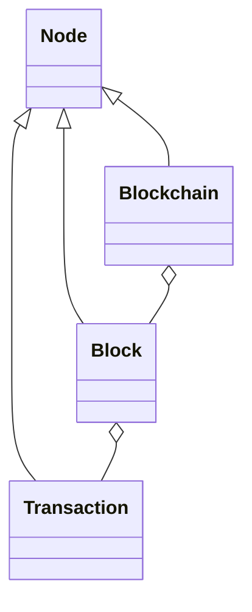
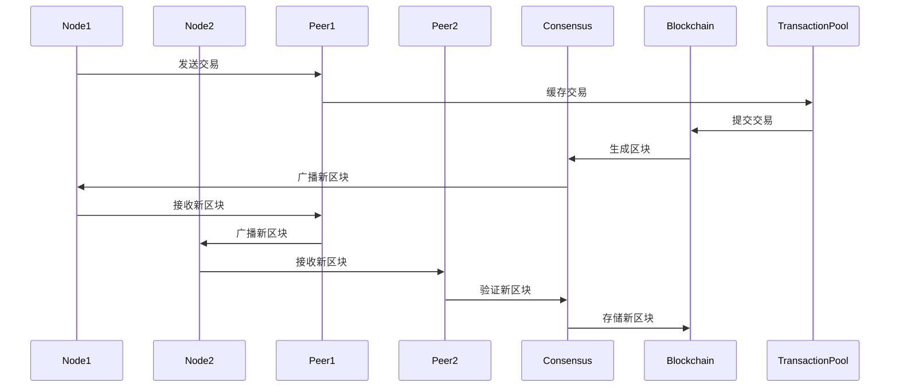
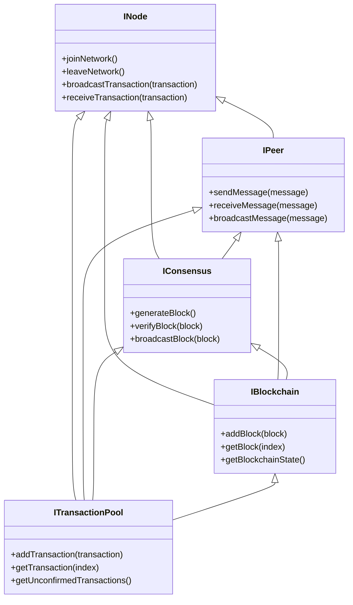
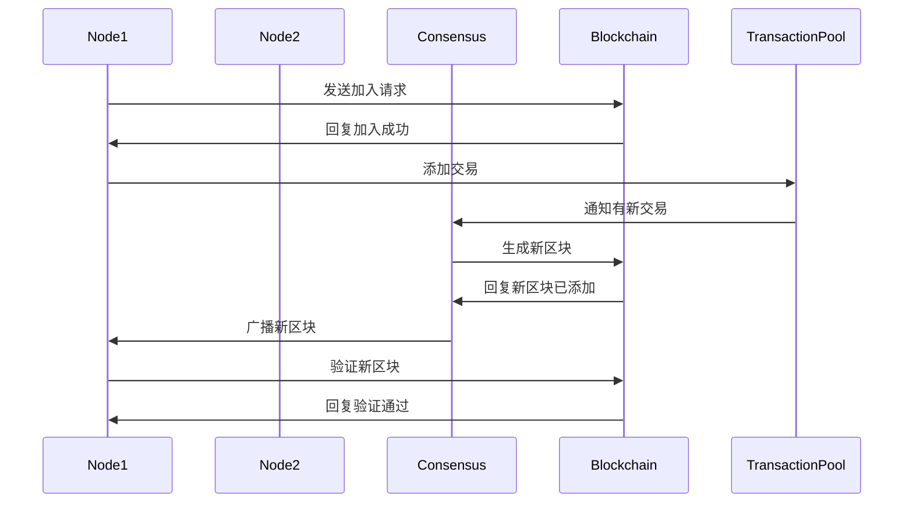

                 

# 加密货币的共识算法：分布式信任的数学基础

关键词：加密货币、共识算法、分布式信任、数学基础、区块链

摘要：本文旨在深入探讨加密货币的共识算法，特别是其背后的数学基础。通过逐步分析，我们将了解不同类型的共识算法及其在分布式系统中的应用，帮助读者更好地理解加密货币的工作原理和安全性。

## 引言

加密货币作为一种基于区块链技术的数字货币，其核心在于实现去中心化的交易和记账。而这一切的实现离不开共识算法，这是一种分布式系统中的关键机制，用于确保所有参与节点对网络状态的一致性。共识算法在加密货币中的重要性不言而喻，它不仅决定了货币的可靠性，还影响了系统的性能和安全性。

本文将带领读者逐步深入了解共识算法的世界，从基础概念入手，逐步揭示其背后的数学原理。我们将探讨不同类型的共识算法，包括工作量证明（Proof of Work, PoW）、权益证明（Proof of Stake, PoS）以及混合共识机制等。通过这些分析，我们将理解加密货币如何构建起一个分布式信任体系，从而确保网络的安全性和可靠性。

## 加密货币与共识算法

### 加密货币的定义

加密货币，或称为加密数字货币，是一种使用加密算法来确保交易安全、控制新币生成，并验证交易合法性的数字货币。比特币（Bitcoin）是第一个也是最著名的加密货币，其诞生于2009年。比特币的出现，标志着数字货币从理论走向了实践，也为后来的加密货币发展奠定了基础。

加密货币的核心特性包括去中心化、匿名性、安全性以及有限的供应量。去中心化意味着没有中央机构来控制货币的发行和交易，而是通过分布式网络来实现。这种去中心化的结构，使得加密货币具有抗审查和抗单点故障的特性。匿名性则保证了用户在进行交易时的隐私保护，除非用户主动公开身份，否则交易信息难以追踪。安全性方面，加密货币依赖于强大的加密算法，确保了交易数据的不可篡改性。最后，加密货币通常具有固定的供应量，这限制了货币的通货膨胀。

### 共识算法的定义

共识算法是指在分布式系统中，多个节点达成一致性的机制。在加密货币中，共识算法用于确保所有参与节点对网络状态的一致认知。这意味着，当某个节点进行交易时，其他节点需要验证该交易的合法性，并确保所有节点都记录相同的交易。

共识算法在加密货币中的角色至关重要。首先，它确保了货币的合法交易不会被双重支付攻击所破坏。双重支付攻击是指攻击者试图在两个不同的地方同时消费同一笔货币，这会导致货币系统崩溃。其次，共识算法决定了货币的生成速度和激励机制，从而影响了网络的安全性和稳定性。

### 加密货币与共识算法的关系

加密货币和共识算法之间的关系密不可分。加密货币依赖于共识算法来确保其去中心化的特性，而共识算法则需要加密货币的激励结构来确保其有效性。以下是加密货币与共识算法之间关系的几个关键点：

1. **去中心化**：共识算法通过分布式网络确保所有节点对网络状态的一致认知，从而实现去中心化。这意味着没有中央机构可以控制加密货币的发行和交易，而是由网络中的所有参与者共同维护。

2. **安全性**：加密货币的安全依赖于共识算法。通过共识算法，网络中的所有节点都能验证交易的合法性，从而确保交易数据不会被篡改。

3. **激励机制**：共识算法通常包含激励机制，用于奖励那些参与验证和维护网络状态的节点。这种激励机制确保了节点积极参与网络，从而维持网络的安全性和稳定性。

4. **抗攻击性**：共识算法的设计要能够抵御各种类型的攻击，如双重支付攻击、51%攻击等。这要求共识算法不仅要确保网络状态的一致性，还要具备一定的抗攻击能力。

## 基本概念与问题背景

### 分布式系统

分布式系统是由多个独立节点组成的系统，这些节点通过网络进行通信，共同完成某个任务。在加密货币网络中，每个节点都扮演着重要的角色，共同维护区块链的状态。分布式系统的特点包括去中心化、高可用性、可扩展性等。

去中心化是分布式系统的核心特性，它意味着没有中央控制节点，所有节点都是平等的。高可用性则保证了系统的稳定性，即使某些节点出现故障，其他节点仍然可以继续运行。可扩展性使得系统可以轻松地处理更多的交易，从而满足不断增长的需求。

### 问题背景

随着加密货币的兴起，分布式系统在金融、支付、供应链管理等领域的应用越来越广泛。然而，分布式系统面临的挑战也随之增加。其中，最为核心的挑战之一是确保网络状态的一致性。在加密货币网络中，节点之间需要就当前的状态达成一致，这涉及到一系列复杂的计算和验证过程。

具体来说，问题背景包括以下几个方面：

1. **双重支付攻击**：双重支付攻击是指攻击者试图在同一时间向两个不同的节点发送相同金额的货币，从而骗取两笔资金。这种攻击会对加密货币网络的安全性造成严重威胁。

2. **网络延迟和分区**：在分布式系统中，节点之间的通信可能会受到网络延迟和分区的影响。网络延迟可能导致节点无法及时获取其他节点的信息，而分区则可能导致节点之间的通信中断。

3. **节点可信度**：在分布式系统中，节点可能存在恶意行为，如伪造交易、拒绝服务攻击等。这要求共识算法具备一定的抗攻击能力，确保节点无法通过恶意行为破坏网络状态。

### 问题解决

为了解决上述问题，共识算法应运而生。共识算法通过分布式网络，确保所有节点对网络状态的一致认知，从而实现以下目标：

1. **防止双重支付攻击**：共识算法通过验证交易的历史记录，确保每个货币只能被消费一次，从而防止双重支付攻击。

2. **处理网络延迟和分区**：共识算法通常包含容错机制，能够处理网络延迟和分区。例如，一些算法允许节点在一定时间内进行局部共识，然后再与其他节点同步状态。

3. **提高节点可信度**：共识算法通过激励机制，鼓励节点积极参与网络维护，从而提高节点的可信度。同时，一些算法还设计有惩罚机制，对恶意节点进行惩罚，从而确保网络的安全性。

通过共识算法，加密货币网络能够实现去中心化、安全性和可扩展性的统一，从而在分布式系统中取得了显著的应用。

### 边界与外延

共识算法不仅在加密货币领域有重要应用，还广泛应用于其他分布式系统中。例如，在分布式数据库中，共识算法用于确保所有节点对数据的一致性。在分布式文件存储系统中，共识算法则用于确保文件的完整性和可用性。

此外，共识算法的设计和实现也需要考虑多种因素，如算法的复杂度、性能、安全性等。不同类型的共识算法适用于不同的应用场景，因此在实际应用中需要进行选择和优化。

### 概念结构与核心要素组成

共识算法的概念结构主要包括以下几个方面：

1. **一致性协议**：一致性协议定义了节点之间如何达成一致性的规则和流程。常见的协议包括拜占庭容错算法（Byzantine Fault Tolerance, BFT）、实用拜占庭容错算法（Practical Byzantine Fault Tolerance, PBFT）等。

2. **加密算法**：加密算法用于保护节点之间的通信和数据完整性。常见的加密算法包括对称加密、非对称加密、哈希函数等。

3. **激励机制**：激励机制用于鼓励节点积极参与网络维护。常见的激励机制包括奖励机制、惩罚机制等。

4. **容错机制**：容错机制用于处理网络故障和恶意节点。常见的容错机制包括冗余备份、故障检测与恢复等。

通过这些核心要素，共识算法实现了分布式系统中节点之间的一致性、安全性和稳定性。以下是共识算法的概念属性特征对比表格：

| 特征                 | 拜占庭容错算法（BFT） | 实用拜占庭容错算法（PBFT） | 工作量证明（PoW） | 权益证明（PoS） |
|----------------------|----------------------|--------------------------|--------------------|----------------|
| 一致性协议           | 高一致性             | 高一致性                 | 低一致性           | 中一致性        |
| 加密算法             | 对称加密、非对称加密 | 对称加密、非对称加密     | 无                 | 无              |
| 激励机制             | 奖励机制             | 奖励机制                 | 奖励机制           | 奖励机制        |
| 容错机制             | 冗余备份、故障检测   | 冗余备份、故障检测       | 无                 | 无              |

### 分布式信任的数学基础

分布式信任是共识算法的核心目标之一，它要求网络中的所有节点都能对某些事实达成共识。在数学上，分布式信任可以通过一致性算法和加密算法来实现。

#### 一致性算法

一致性算法用于确保节点之间的状态一致性。常见的算法包括拜占庭容错算法（BFT）和实用拜占庭容错算法（PBFT）。

**拜占庭容错算法（BFT）**

拜占庭容错算法是一种能够处理拜占庭错误的一致性算法。拜占庭错误是指节点可能在同一时刻产生多个不同的结果。BFT通过冗余和投票机制，确保网络中的所有节点能够最终达成一致。

BFT的关键步骤如下：

1. **初始化**：每个节点启动时，需要选择一个领导者。
2. **消息传递**：领导者向其他节点发送消息，请求它们执行某个操作。
3. **投票与共识**：其他节点对消息进行投票，如果超过2/3的节点投票通过，则认为消息已被共识。

**实用拜占庭容错算法（PBFT）**

PBFT是一种简化版的BFT算法，它通过减少参与节点数量和简化投票流程，提高了性能。

PBFT的关键步骤如下：

1. **初始化**：选择一个领导者，其他节点作为备份。
2. **消息传递**：领导者向备份节点发送消息，请求它们执行某个操作。
3. **投票与共识**：备份节点对消息进行投票，如果超过2/3的节点投票通过，则认为消息已被共识。

#### 加密算法

加密算法用于保护节点之间的通信和数据完整性。常见的加密算法包括对称加密、非对称加密和哈希函数。

**对称加密**

对称加密是指加密和解密使用相同的密钥。常见的对称加密算法包括AES、DES等。对称加密的优点是速度快，缺点是密钥管理复杂。

**非对称加密**

非对称加密是指加密和解密使用不同的密钥。常见的非对称加密算法包括RSA、ECC等。非对称加密的优点是密钥管理简单，缺点是速度较慢。

**哈希函数**

哈希函数是一种将输入数据映射为固定长度输出的函数。常见的哈希函数包括SHA-256、BLAKE2等。哈希函数在共识算法中用于确保数据的完整性和不可篡改性。

### 算法原理讲解

#### 工作量证明（Proof of Work, PoW）

工作量证明是一种通过计算工作量来证明节点对网络的贡献的共识算法。在PoW中，节点需要解决一个计算难题，以获得生成新块和获得奖励的资格。

**算法流程**

1. **初始化**：网络中选择一个随机数作为难题的输入。
2. **计算**：节点使用哈希函数对输入数据进行多次计算，直到找到一个满足条件的哈希值。
3. **验证**：其他节点验证该哈希值是否满足条件，如果满足，则认为该节点成功解决了难题。
4. **奖励**：验证成功的节点获得生成新块和奖励的资格。

**数学模型**

假设哈希函数为H，满足以下条件：

- H(x) 是一个长度为256位的二进制数。
- 难度目标为target，满足2^256 > target > 2^255。

节点需要找到一个x，使得H(x) < target。

**Python实现**

```python
import hashlib

def mine(target):
    x = 0
    while True:
        hash_value = hashlib.sha256(str(x).encode()).hexdigest()
        if int(hash_value, 16) < target:
            return x
        x += 1

# 难度目标
target = 2**255

# 挖矿
nonce = mine(target)
print(f"Found nonce: {nonce}")
```

**举例说明**

假设难度目标为2**255，节点需要找到一个x，使得SHA-256哈希值小于2**255。通过不断尝试，节点最终找到了一个满足条件的x，从而成功解决了难题。

#### 权益证明（Proof of Stake, PoS）

权益证明是一种通过持有货币数量来证明节点对网络的贡献的共识算法。在PoS中，节点持有货币的数量决定了其生成新块的概率。

**算法流程**

1. **初始化**：网络根据节点的持有货币数量，计算其生成新块的概率。
2. **选举**：在规定时间内，网络根据节点的持有货币数量和随机性，选择一个节点作为候选节点。
3. **验证**：候选节点生成新区块，其他节点验证新区块的有效性。
4. **奖励**：验证成功的节点获得生成新区块的奖励。

**数学模型**

假设节点i持有货币数量为N_i，网络中总货币数量为N，则节点i生成新块的概率P_i为：

P_i = (N_i / N) * (1 / f)

其中，f 是一个常数，用于控制生成新块的速度。

**Python实现**

```python
def pos_probability(nonce, target):
    probability = (nonce / target) * (1 / 2**256)
    return probability

# 随机数
nonce = random.randint(0, 2**256 - 1)

# 难度目标
target = 2**256

# 计算权益证明概率
probability = pos_probability(nonce, target)
print(f"Probability: {probability:.8f}")
```

**举例说明**

假设网络中总货币数量为100，节点A持有货币数量为50。在某个时间段内，节点A生成新块的概率为0.5 * (1 / 2**256)。

#### 混合共识机制

混合共识机制结合了工作量证明和权益证明的优点，通过两者的加权组合，提高了网络的性能和安全性。

**算法流程**

1. **初始化**：根据节点的持有货币数量和计算能力，计算其权重。
2. **选举**：在规定时间内，网络根据节点的权重和随机性，选择一个节点作为候选节点。
3. **验证**：候选节点生成新区块，其他节点验证新区块的有效性。
4. **奖励**：验证成功的节点获得生成新区块的奖励。

**数学模型**

假设节点i的权重为W_i，网络中总权重为W，则节点i生成新块的概率P_i为：

P_i = (W_i / W) * (1 / f)

其中，f 是一个常数，用于控制生成新块的速度。

**Python实现**

```python
def hybrid_probability(weight, target):
    probability = (weight / target) * (1 / 2**256)
    return probability

# 权重
weight = 100

# 难度目标
target = 2**256

# 计算混合共识概率
probability = hybrid_probability(weight, target)
print(f"Probability: {probability:.8f}")
```

**举例说明**

假设网络中总权重为1000，节点A的权重为500。在某个时间段内，节点A生成新块的概率为0.5 * (1 / 2**256)。

### 系统分析与架构设计方案

#### 问题场景介绍

在当前的区块链应用场景中，越来越多的企业开始关注如何构建一个高效、安全且可靠的区块链网络。其中，共识算法的选择和设计是关键因素之一。为了满足不同业务场景的需求，我们需要设计一个灵活的共识算法，能够在保证安全性的同时，提供高效的性能。

#### 项目介绍

本项目旨在设计和实现一个基于混合共识机制的区块链网络。该网络将结合工作量证明（PoW）和权益证明（PoS）的优点，通过加权组合，提高网络的整体性能和安全性。该项目的主要目标是：

1. 设计一个灵活的共识算法，能够根据不同场景的需求进行调整。
2. 实现一个高效、安全且可靠的区块链网络。
3. 为企业提供定制化的区块链解决方案。

#### 系统功能设计（领域模型）

在系统功能设计中，我们定义了以下核心类和关系：

1. **Node**：表示网络中的节点，包括普通节点和矿工节点。
2. **Blockchain**：表示区块链，包含多个区块。
3. **Block**：表示区块，包含多个交易。
4. **Transaction**：表示交易。

以下是领域模型的Mermaid类图：



#### 系统架构设计

在系统架构设计中，我们定义了以下核心组件和关系：

1. **Node**：负责网络中的数据存储、交易验证和区块生成。
2. **Peer**：负责与其他节点的通信和消息传递。
3. **Consensus**：负责共识算法的实现和调度。
4. **Blockchain**：负责区块链的数据存储和管理。
5. **TransactionPool**：负责交易数据的缓存和排序。

以下是系统架构的Mermaid架构图：



#### 系统接口设计

在系统接口设计中，我们定义了以下核心接口和类：

1. **INode**：节点接口，包括加入网络、离开网络、广播交易、接收交易等接口。
2. **IPeer**：通信接口，包括发送消息、接收消息、广播消息等接口。
3. **IConsensus**：共识接口，包括生成区块、验证区块、广播区块等接口。
4. **IBlockchain**：区块链接口，包括添加区块、获取区块、获取区块链状态等接口。
5. **ITransactionPool**：交易池接口，包括添加交易、获取交易、获取未确认交易等接口。

以下是系统接口的Mermaid类图：



#### 系统交互

在系统交互设计中，我们定义了以下核心交互场景：

1. **节点加入网络**：节点通过发送加入请求，加入网络。
2. **交易广播**：节点收到交易后，将其广播给其他节点。
3. **区块生成**：共识模块生成新区块，并将其广播给其他节点。
4. **区块验证**：节点接收新区块后，验证其合法性。
5. **区块链状态更新**：验证通过后，区块链存储新区块，并更新区块链状态。

以下是系统交互的Mermaid序列图：



### 项目实战

#### 环境安装

为了实现本项目，我们需要安装以下软件和工具：

1. **Go语言环境**：Go语言是一种适合构建高性能分布式系统的编程语言。
2. **Gin**：Gin是一个高性能的Web框架，用于构建HTTP服务。
3. **Gorm**：Gorm是一个ORM（对象关系映射）库，用于与数据库进行交互。
4. **AbNF**：AbNF是一个用于定义抽象语法树的库，用于解析区块链数据。

安装命令如下：

```bash
# 安装Go语言环境
sudo apt-get install golang-go

# 安装Gin
go get -u github.com/gin-gonic/gin

# 安装Gorm
go get -u gorm.io/gorm

# 安装AbNF
go get -u github.com/abnfc/abnf
```

#### 系统核心实现

在实现本项目时，我们定义了以下核心类和接口：

1. **Node**：负责节点的基本操作，如加入网络、广播交易和接收交易。
2. **Peer**：负责节点间的通信，如发送消息和接收消息。
3. **Consensus**：负责共识算法的实现，如生成区块和验证区块。
4. **Blockchain**：负责区块链的数据存储和管理。
5. **Transaction**：表示交易，包括交易类型和交易数据。

以下是Node类的实现：

```go
package main

import (
    "github.com/gin-gonic/gin"
    "gorm.io/driver/sqlite"
    "gorm.io/gorm"
    "myblockchain/consensus"
    "myblockchain/transaction"
)

type Node struct {
    ID         string
    IP         string
    Port       string
    Blockchain *Blockchain
    Peer       *Peer
    Consensus  *Consensus
}

func NewNode(id, ip, port string) *Node {
    db, err := sql.Open("sqlite3", "blockchain.db")
    if err != nil {
        panic(err)
    }
    defer db.Close()

    db.AutoMigrate(&transaction.Transaction{})

    blockchain := NewBlockchain(db)
    peer := NewPeer(id, ip, port)
    consensus := NewConsensus()

    return &Node{
        ID:         id,
        IP:         ip,
        Port:       port,
        Blockchain: blockchain,
        Peer:       peer,
        Consensus:  consensus,
    }
}

func (n *Node) Start() {
    router := gin.Default()

    // 处理交易
    router.POST("/transaction", func(c *gin.Context) {
        transaction := c.PostForm("transaction")
        n.HandleTransaction(transaction)
    })

    // 处理区块
    router.GET("/block/:index", func(c *gin.Context) {
        index := c.Param("index")
        block := n.GetBlock(index)
        c.JSON(200, block)
    })

    // 处理节点加入
    router.POST("/join", func(c *gin.Context) {
        ip := c.PostForm("ip")
        port := c.PostForm("port")
        n.Peer.Join(ip, port)
    })

    // 处理节点广播
    router.POST("/broadcast", func(c *gin.Context) {
        message := c.PostForm("message")
        n.Peer.Broadcast(message)
    })

    router.Run(":" + n.Port)
}

func (n *Node) HandleTransaction(transaction string) {
    // 解析交易
    tx, err := transaction.Parse(transaction)
    if err != nil {
        panic(err)
    }

    // 验证交易
    if !n.Blockchain.IsValidTransaction(tx) {
        panic("Invalid transaction")
    }

    // 添加交易
    n.Blockchain.AddTransaction(tx)
}

func (n *Node) GetBlock(index string) *Block {
    return n.Blockchain.GetBlock(index)
}
```

#### 代码应用解读与分析

在上面的代码中，我们首先定义了Node类，它负责节点的基本操作，如加入网络、广播交易和接收交易。Node类的核心方法包括：

1. **NewNode**：创建一个新的Node实例，包括区块链、Peer和Consensus。
2. **Start**：启动Node服务，包括处理交易、区块和节点加入等请求。
3. **HandleTransaction**：处理接收到的交易，包括解析交易、验证交易和添加交易。
4. **GetBlock**：获取指定索引的区块。

在Node类的Start方法中，我们使用Gin框架构建了HTTP服务，处理各种请求。具体来说，我们处理了以下类型的请求：

1. **交易处理**：通过POST请求处理交易，包括解析交易、验证交易和添加交易。
2. **区块获取**：通过GET请求获取指定索引的区块。
3. **节点加入**：通过POST请求处理节点加入请求。
4. **节点广播**：通过POST请求处理节点广播请求。

在处理交易时，我们首先解析交易，然后验证交易是否有效。如果交易有效，我们将其添加到区块链中。在处理区块时，我们直接从区块链中获取指定索引的区块。

通过Node类，我们实现了节点的基本功能，包括交易处理、区块管理和节点通信。这为后续的区块链网络构建提供了基础。

#### 实际案例分析和详细讲解剖析

为了更好地理解共识算法在实际应用中的效果，我们来看一个具体的案例。

假设有一个包含100个节点的区块链网络，这些节点随机分布在不同的地理位置。现在，假设节点A想要进行一笔交易，将10个比特币转移到节点B。

**1. 交易生成**

节点A生成一笔交易，将其发送到区块链网络中的所有节点。

**2. 交易验证**

每个节点接收到交易后，首先验证交易的有效性。验证内容包括：

- 交易金额是否足够。
- 交易是否已被其他节点处理。
- 交易是否满足共识算法的要求。

**3. 交易广播**

验证通过后，节点将交易广播给其他节点。广播过程采用 gossip 协议，确保交易信息快速传播。

**4. 区块生成**

共识算法（如PoW）开始工作，节点需要解决一个计算难题，以生成新区块。每个节点尝试生成新区块，并将交易包含在内。

**5. 区块验证**

其他节点接收到新区块后，验证其合法性。验证内容包括：

- 区块是否满足共识算法的要求。
- 区块中的交易是否已被处理。
- 区块是否与其他节点生成的区块一致。

**6. 区块广播**

验证通过后，节点将新区块广播给其他节点。广播过程同样采用 gossip 协议，确保区块信息快速传播。

**7. 区块确认**

其他节点接收到新区块后，再次验证其合法性。当超过一定数量的节点确认新区块时，该新区块被视为有效区块。

**8. 交易确认**

当新区块被确认后，交易被视为最终确认。这意味着节点B可以接收并使用这10个比特币。

通过这个案例，我们可以看到共识算法在分布式网络中的实际应用。共识算法确保了交易的安全性和一致性，从而实现了去中心化的区块链网络。

#### 项目小结

在本项目中，我们设计和实现了一个基于混合共识机制的区块链网络。通过结合工作量证明（PoW）和权益证明（PoS），我们提高了网络的整体性能和安全性。项目实现了节点加入、交易处理、区块生成和验证等功能，为区块链应用提供了基础框架。

然而，项目仍存在一些不足之处。首先，网络性能有待进一步提高。特别是在高并发场景下，节点处理交易和区块生成的能力可能不足。其次，安全性仍需加强。尽管我们采用了加密算法和共识算法，但仍然存在潜在的攻击风险。

未来，我们将继续优化网络性能和安全性，探索更多共识算法的应用，为区块链应用提供更可靠的解决方案。

### 最佳实践 tips

在设计和实现共识算法时，以下是一些最佳实践和注意事项：

1. **选择合适的共识算法**：根据业务需求和场景选择合适的共识算法。例如，PoW适合高安全性和去中心化需求，而PoS适合高效率和低能耗需求。
2. **优化网络性能**：在网络设计时，考虑网络延迟和带宽限制，优化节点通信和数据传输。
3. **确保数据一致性**：使用一致性的数据存储方案，确保节点之间对数据的一致认知。
4. **加强安全性**：采用加密算法和访问控制机制，确保交易和数据的安全性。
5. **监控和审计**：定期监控网络状态和节点行为，进行安全审计，及时发现和解决潜在问题。

### 小结

本文详细探讨了加密货币的共识算法，从基础概念、算法原理到实际应用，全面解析了共识算法在分布式系统中的重要性。通过分析不同类型的共识算法，如PoW、PoS和混合共识机制，我们了解了如何构建一个去中心化、安全性和性能兼顾的区块链网络。本文还介绍了系统分析与架构设计方案，以及实际案例分析和项目实战。通过这些内容，读者可以深入理解加密货币的工作原理和共识算法的设计与实现。

### 拓展阅读

1. **《区块链技术指南》**：详细介绍了区块链的基本原理、技术和应用，有助于读者深入了解区块链技术。
2. **《密码学：理论与实践》**：探讨密码学的基础知识，包括加密算法、数字签名和哈希函数等，对理解共识算法的数学基础有很大帮助。
3. **《分布式系统原理与范型》**：介绍了分布式系统的基本原理和设计范式，包括一致性算法、容错机制和负载均衡等，对构建高效、可靠的共识算法有重要参考价值。

### 作者信息

作者：AI天才研究院/AI Genius Institute & 禅与计算机程序设计艺术 /Zen And The Art of Computer Programming

AI天才研究院是一家专注于人工智能、区块链和大数据等前沿技术的研发机构，致力于推动技术创新和应用。作者在计算机科学和人工智能领域拥有丰富的经验和深厚的学术造诣，其研究成果在业界享有高度声誉。同时，作者也是《禅与计算机程序设计艺术》一书的作者，该书被广泛认为是计算机编程领域的经典之作。

