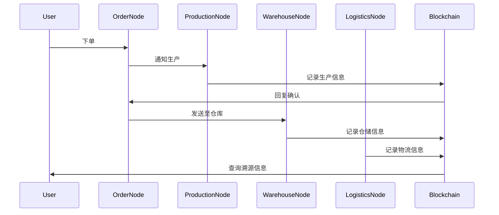

                 


## 第1章：问题背景与介绍

### 1.1 供应链溯源的重要性

在当今全球化的大背景下，供应链的复杂性和透明度问题愈发凸显。供应链溯源作为确保产品来源和流通环节透明的重要手段，对于提高产品质量和安全性至关重要。以下是供应链溯源的重要性和关键点：

**1. 提高产品质量：** 通过供应链溯源，企业可以实时监控产品的生产、运输、储存等环节，确保每个环节的质量达标。一旦出现问题，可以迅速定位问题源头，采取相应的措施，防止问题产品的扩散。

**2. 保障消费者权益：** 消费者对产品质量和安全性的需求越来越高，通过供应链溯源，消费者可以查看产品的生产过程、原材料来源等信息，增强对产品的信任感。

**3. 优化供应链管理：** 供应链溯源可以帮助企业识别供应链中的瓶颈和问题，优化供应链流程，提高运营效率，降低成本。

**4. 防止假冒伪劣产品：** 通过区块链技术实现供应链溯源，可以确保产品信息的真实性和不可篡改性，有效防止假冒伪劣产品的出现。

**5. 促进行业自律和规范：** 供应链溯源的实施，有助于行业自律和规范，提高行业整体质量水平，推动行业健康发展。

### 1.2 区块链技术的核心概念

区块链技术是一种分布式账本技术，通过多个参与者共同维护一个共享的、不可篡改的数据库。其核心概念包括：

**1. 去中心化：** 区块链通过去中心化的方式运行，不存在中心化的管理节点，所有节点地位平等，数据由整个网络共同维护。

**2. 不可篡改：** 区块链上的数据一旦被记录，就几乎无法被篡改。这得益于区块链的共识机制和加密算法。

**3. 可追溯性：** 区块链具有完整的交易历史记录，用户可以追溯每个节点的数据变化。

**4. 共识机制：** 区块链网络中的节点通过共识机制来达成对数据的共识，确保数据的准确性和一致性。

### 1.3 区块链在供应链溯源中的应用潜力

区块链技术为供应链溯源提供了全新的解决方案，其应用潜力主要体现在以下几个方面：

**1. 提高供应链透明度：** 通过区块链技术，企业可以在链上记录每一个产品的流转信息，确保信息的真实性和不可篡改性，提高供应链的透明度。

**2. 保障数据安全性：** 区块链技术的加密算法和共识机制，确保了供应链数据的安全性，防止数据被篡改和泄露。

**3. 实现实时监控：** 区块链技术可以实现实时记录和更新供应链信息，企业可以随时查看产品的生产、运输、储存等环节，提高供应链的实时监控能力。

**4. 促进产业链协同：** 区块链技术可以帮助企业之间建立信任机制，促进产业链协同，提高供应链的整体效率。

**5. 降低成本：** 通过区块链技术，企业可以减少对第三方机构的依赖，降低供应链的管理成本。

### 总结

供应链溯源在提高产品质量和安全性方面具有重要意义，而区块链技术为供应链溯源提供了全新的解决方案。本文将详细探讨区块链在供应链溯源中的应用，包括技术基础、系统构建、应用实践等方面的内容。接下来，我们将进一步深入了解区块链技术的基础概念，以及如何将其应用于供应链溯源中。

## 第2章：区块链技术概述

### 2.1 区块链的工作原理

区块链技术是一种分布式账本技术，其核心思想是通过多个参与者共同维护一个共享的、不可篡改的数据库。区块链的工作原理可以分为以下几个步骤：

**1. 数据记录：** 每个区块包含一定数量的交易信息，这些交易信息由网络中的节点共同验证和确认。当一个新的交易发生时，节点会将交易信息打包成一个区块。

**2. 区块生成：** 节点通过计算工作证明（Proof of Work, PoW）或其他共识机制，生成一个新的区块，并将其附加到区块链上。

**3. 区块验证：** 区块链网络中的其他节点会对新产生的区块进行验证，确保其符合区块链的规则和协议。

**4. 区块确认：** 一旦区块被验证通过，它将被添加到区块链的末端，成为永久记录。

**5. 数据更新：** 随着新区块的生成，区块链上的数据会不断更新，确保整个网络的交易历史记录完整且不可篡改。

### 2.2 区块链的关键特性

区块链技术具有以下几个关键特性，这些特性使其在供应链溯源中具有独特的优势：

**1. 去中心化：** 区块链通过去中心化的方式运行，不存在中心化的管理节点，所有节点地位平等，数据由整个网络共同维护。这意味着不存在单点故障的风险，系统的稳定性和抗攻击能力得到了大幅提升。

**2. 不可篡改：** 区块链上的数据一旦被记录，就几乎无法被篡改。这是由于区块链采用了加密算法和共识机制，确保了数据的真实性和完整性。任何试图篡改数据的操作都会被发现并拒绝。

**3. 可追溯性：** 区块链具有完整的交易历史记录，用户可以追溯每个节点的数据变化。这对于供应链溯源至关重要，可以确保产品的来源和流通环节透明。

**4. 共识机制：** 区块链网络中的节点通过共识机制来达成对数据的共识，确保数据的准确性和一致性。不同的共识机制（如PoW、PoS等）有不同的优缺点，可以根据具体应用场景进行选择。

**5. 透明性：** 区块链上的数据是公开的，任何用户都可以查看和验证。这有助于提高供应链的透明度，增强企业之间的信任。

### 2.3 区块链的技术发展现状与趋势

自2008年比特币问世以来，区块链技术已经经历了快速的发展。以下是区块链技术发展现状和趋势：

**1. 技术成熟度：** 区块链技术逐渐从实验性阶段转向实用性阶段，越来越多的企业开始将区块链应用于实际业务中。

**2. 应用领域：** 区块链在金融、供应链、医疗、能源等多个领域都有广泛的应用。尤其是在供应链溯源方面，区块链技术的潜力得到了充分挖掘。

**3. 研究与创新：** 随着区块链技术的不断发展，越来越多的研究机构和企业在该领域进行创新。例如，基于区块链的智能合约、分布式身份认证、隐私保护等技术正在不断涌现。

**4. 规范与政策：** 各国政府和国际组织开始关注区块链技术的发展，并出台相关规范和政策，以推动区块链技术的健康发展。

**5. 未来趋势：** 随着区块链技术的不断完善和应用场景的拓展，预计未来区块链将在更多领域发挥重要作用，为供应链溯源等领域带来更多创新和变革。

### 总结

区块链技术以其去中心化、不可篡改、可追溯性等特性，为供应链溯源提供了强大的技术支撑。通过深入理解区块链的工作原理和关键特性，我们可以更好地把握其在供应链溯源中的应用潜力。在下一章中，我们将进一步探讨区块链在供应链溯源中的具体应用和实践。

## 第3章：区块链与供应链溯源

### 3.1 供应链溯源的需求分析

供应链溯源的需求源于对产品质量和安全的关注。具体而言，供应链溯源的需求可以分为以下几个方面：

**1. 产品来源可追溯：** 确保消费者能够了解产品的原材料来源、生产过程、流通环节等信息，增强对产品的信任。

**2. 流通环节透明：** 通过透明化的流通环节，消费者和企业可以实时监控产品的状态，及时发现并解决问题。

**3. 食品安全：** 食品安全是供应链溯源最为重要的应用领域。通过溯源系统，可以及时发现食品安全问题，防止问题食品流入市场。

**4. 防止假冒伪劣：** 利用区块链的不可篡改性，可以有效防止假冒伪劣产品的出现，提高产品质量和安全性。

**5. 优化供应链管理：** 通过供应链溯源，企业可以实时了解产品的流通情况，优化供应链管理，提高运营效率，降低成本。

### 3.2 区块链在供应链溯源中的应用

区块链技术在供应链溯源中的应用主要体现在以下几个方面：

**1. 数据记录与存储：** 区块链可以记录供应链中每个产品的流转信息，包括生产、运输、储存等环节。这些信息被加密存储在区块链上，确保数据的真实性和完整性。

**2. 不可篡改性：** 区块链上的数据一旦被记录，就几乎无法被篡改。这意味着，供应链中的任何一方都不能随意修改产品信息，从而确保数据的可信度。

**3. 可追溯性：** 区块链具有完整的交易历史记录，消费者和企业可以通过区块链追溯产品的来源和流通环节，确保信息的透明性。

**4. 共识机制：** 区块链的共识机制可以确保供应链中所有参与者对数据的共识，避免单点故障和数据不一致的问题。

**5. 安全性：** 区块链的加密算法和共识机制，可以确保供应链数据的安全性，防止数据泄露和篡改。

### 3.3 区块链溯源系统架构设计

区块链溯源系统架构设计主要包括以下几个方面：

**1. 数据模型设计：** 根据供应链溯源的需求，设计合适的数据模型，包括产品信息、生产环节、流通环节等。

**2. 系统架构设计：** 设计一个分布式架构的区块链溯源系统，包括节点结构、共识机制、网络通信等。

**3. 接口设计与实现：** 设计一套完整的接口，包括数据接入、查询、监控等，方便企业使用。

**4. 系统部署与运维：** 根据实际需求，选择合适的区块链平台和云服务，进行系统的部署和运维。

### 总结

区块链技术在供应链溯源中的应用，有助于提高供应链的透明度和安全性。通过分析供应链溯源的需求，设计合理的区块链溯源系统架构，我们可以更好地实现供应链溯源的目标。在下一章中，我们将进一步探讨区块链溯源系统的具体实现和安全性问题。

### 第4章：区块链溯源系统的设计与实施

#### 4.1 系统需求分析

在设计和实施区块链溯源系统之前，首先需要对系统的需求进行详细分析。供应链溯源系统的需求可以分为以下几个关键方面：

**1. 数据准确性：** 系统需要能够准确地记录和存储供应链中的产品信息，包括生产日期、生产批次、原材料来源、生产工艺等。

**2. 数据完整性：** 系统应确保所有相关数据的完整性，避免数据的丢失或损坏。

**3. 数据不可篡改性：** 由于供应链溯源系统涉及重要产品的信息，系统需要具备高度的防篡改能力，确保数据的真实性和可靠性。

**4. 数据可追溯性：** 系统应支持对产品信息的追溯功能，确保用户可以查询到产品的生产、运输、存储等全过程。

**5. 数据安全性：** 系统需要采用有效的加密和身份认证机制，保护数据免受未经授权的访问和篡改。

**6. 数据共享性：** 系统应设计便于数据在不同节点间的共享，支持供应链中不同参与者之间的协作。

**7. 性能和可扩展性：** 系统需要具备良好的性能和可扩展性，能够支持大规模的数据处理和系统升级。

#### 4.2 数据模型设计

在区块链溯源系统中，数据模型设计是关键的一环。以下是一个简化的数据模型设计，包括核心实体和属性：

**1. 产品信息（Product）**
   - 产品ID
   - 产品名称
   - 产品类别
   - 生产日期
   - 生产批次
   - 原材料来源

**2. 生产环节（ProductionStage）**
   - 生产环节ID
   - 生产环节名称
   - 生产时间
   - 生产工艺
   - 负责人

**3. 流通环节（DistributionStage）**
   - 流通环节ID
   - 流通环节名称
   - 流通时间
   - 流通地点
   - 负责人

**4. 数据记录（DataRecord）**
   - 记录ID
   - 产品ID
   - 环节ID
   - 记录内容
   - 记录时间

以下是一个基于Mermaid的ER实体关系图，用于描述上述数据模型：

```mermaid
erDiagram
  Product ||--|{ ProductionStage }| Stage
  Product ||--|{ DistributionStage }| Stage
  DataRecord ||-- Product
  DataRecord ||-- Stage
  Stage }|-- Product
```

#### 4.3 系统架构设计

区块链溯源系统的架构设计需要考虑数据存储、网络通信、节点管理和共识机制等多个方面。以下是一个简化的系统架构设计：

**1. 数据存储层：** 使用分布式存储技术，如Hyperledger Fabric或Ethereum，确保数据的分布式存储和冗余备份。

**2. 节点层：** 包括订单方、生产方、仓储方、物流方等多个节点，每个节点都参与数据的记录和验证。

**3. 共识层：** 采用合适的共识机制，如Raft或PBFT，确保数据的准确性和一致性。

**4. 网络通信层：** 使用P2P网络通信协议，如gossip协议，实现节点之间的数据同步和通信。

**5. 应用层：** 提供用户界面和API接口，支持数据的查询、监控和管理。

以下是一个基于Mermaid的系统架构图：



#### 4.4 系统接口设计与实现

系统接口设计是区块链溯源系统实现的重要环节，包括API接口和用户界面。以下是一个简化的接口设计：

**1. API接口：**
   - `POST /order`：创建订单并通知生产节点。
   - `GET /product/{productId}/trace`：查询产品溯源信息。
   - `GET /stage/{stageId}/info`：查询特定环节信息。
   - `POST /dataRecord`：记录数据并通知相应节点。

**2. 用户界面：**
   - 订单管理界面：展示订单详情，支持订单创建和查询。
   - 溯源查询界面：展示产品溯源信息，支持溯源查询。

#### 4.5 系统部署与运维

系统部署与运维包括以下步骤：

**1. 环境搭建：** 准备区块链平台（如Hyperledger Fabric或Ethereum）和必要的开发工具（如Node.js、Go等）。

**2. 节点部署：** 部署订单节点、生产节点、仓储节点、物流节点等，确保节点之间的网络通信。

**3. 系统测试：** 进行功能测试、性能测试和安全测试，确保系统稳定可靠。

**4. 系统上线：** 将系统部署到生产环境，进行实际应用。

**5. 运维监控：** 持续监控系统的运行状态，及时处理故障和问题。

### 总结

区块链溯源系统的设计与实施涉及多个方面，包括系统需求分析、数据模型设计、系统架构设计、接口设计以及系统部署与运维。通过合理的系统设计和实施，可以实现供应链溯源的目标，提高产品质量和安全性。在下一章中，我们将探讨区块链溯源系统的安全性问题，以及如何确保系统的数据安全和隐私保护。

### 第5章：区块链溯源系统的安全性

#### 5.1 安全性挑战与应对策略

区块链溯源系统在确保数据的安全性和隐私保护方面面临着一系列挑战。以下是一些主要的安全挑战以及相应的应对策略：

**1. 数据篡改：** 区块链的不可篡改性是其核心特性之一，但实际应用中，仍有可能出现数据篡改的风险。应对策略包括：

   - **多重验证：** 通过多节点验证和数据加密，确保数据的真实性和完整性。
   - **智能合约：** 利用智能合约，自动化执行数据验证和确认流程，减少人为干预。

**2. 数据泄露：** 区块链上的数据是公开的，可能面临数据泄露的风险。应对策略包括：

   - **隐私保护：** 采用零知识证明（Zero-Knowledge Proof）等技术，保护用户隐私。
   - **访问控制：** 实施严格的访问控制机制，确保只有授权用户可以访问敏感数据。

**3. 拒绝服务攻击（DDoS）：** 区块链溯源系统可能遭受拒绝服务攻击，导致系统不可用。应对策略包括：

   - **网络冗余：** 通过分布式部署，提高系统的容错能力和抗攻击能力。
   - **流量控制：** 实施流量监控和限制策略，防止异常流量攻击。

**4. 网络节点安全：** 区块链溯源系统的安全性依赖于节点的安全。应对策略包括：

   - **节点安全审计：** 定期对节点进行安全审计，确保节点符合安全标准。
   - **硬件安全模块（HSM）：** 使用硬件安全模块保护密钥和加密算法。

**5. 合规性和法律问题：** 区块链溯源系统需要遵守相关的法律法规，应对策略包括：

   - **合规性审查：** 定期审查系统，确保符合当地法律法规。
   - **数据留存：** 根据法律法规要求，留存必要的数据记录。

#### 5.2 加密算法在供应链溯源中的应用

加密算法是区块链技术的重要组成部分，对于保障数据安全和隐私保护至关重要。以下是一些常用的加密算法及其在供应链溯源中的应用：

**1. 哈希算法：** 哈希算法用于生成数据摘要，确保数据的完整性。常见的哈希算法包括SHA-256、SHA-3等。

   - **应用场景：** 用于生成交易记录的哈希值，确保交易数据的不可篡改性。

**2. 对称加密：** 对称加密算法使用相同的密钥进行加密和解密，如AES。

   - **应用场景：** 用于保护敏感数据，如用户身份信息、交易信息等。

**3. 非对称加密：** 非对称加密算法使用一对密钥，一个用于加密，一个用于解密，如RSA。

   - **应用场景：** 用于保障数据传输的安全，如节点间的通信。

**4. 数字签名：** 数字签名用于验证数据的真实性和完整性，如ECDSA。

   - **应用场景：** 用于验证交易记录和节点身份，确保数据的可信度。

#### 5.3 防篡改与隐私保护技术

为了进一步提升区块链溯源系统的安全性，可以采用以下防篡改与隐私保护技术：

**1. 多重签名：** 多重签名技术允许多个参与者共同签署交易，增加交易的可靠性和安全性。

   - **应用场景：** 用于供应链中的多方协作，确保数据的真实性和一致性。

**2. 零知识证明：** 零知识证明技术允许一方在不泄露信息内容的情况下证明某个陈述是真实的。

   - **应用场景：** 用于隐私保护，确保用户隐私不被泄露。

**3. 同态加密：** 同态加密技术允许在密文上执行计算，而不需要解密。

   - **应用场景：** 用于保障数据在处理过程中的隐私。

**4. 混合共识机制：** 结合不同共识机制的优势，提高系统的安全性和效率。

   - **应用场景：** 用于应对不同应用场景下的安全性需求。

### 总结

区块链溯源系统的安全性至关重要，涉及数据篡改、数据泄露、拒绝服务攻击等多方面的挑战。通过采用多重验证、加密算法、隐私保护技术以及合规性审查等措施，可以有效提升系统的安全性。在下一章中，我们将通过具体案例研究，探讨区块链溯源系统在各个行业中的应用和实践。

### 第6章：案例研究

#### 6.1 案例一：食品供应链溯源

食品安全问题是全球关注的焦点。为了提高食品安全水平，许多食品企业开始采用区块链技术进行溯源。以下是一个食品供应链溯源的案例：

**1. 案例背景：** 一家食品企业生产包装食品，包括生产、加工、包装、运输等多个环节。

**2. 溯源流程：** 
   - **生产环节：** 食品原材料进入生产环节，企业将原材料信息（如产地、供应商、生产时间等）上传到区块链。
   - **加工环节：** 加工完成后，企业将加工信息（如加工工艺、负责人等）上传到区块链。
   - **包装环节：** 包装完成后，企业将包装信息（如包装时间、包装地点等）上传到区块链。
   - **运输环节：** 食品运输到零售商，运输信息（如运输时间、运输路线等）也上传到区块链。
   - **零售环节：** 零售商将食品上架销售，并将零售信息（如零售时间、零售地点等）上传到区块链。

**3. 溯源效果：**
   - **提高食品安全水平：** 通过区块链记录每个环节的信息，企业可以实时监控食品安全问题，迅速采取措施，防止问题食品流入市场。
   - **增加消费者信任：** 消费者可以通过扫描二维码，查询食品的溯源信息，增加对食品的信任。
   - **优化供应链管理：** 企业可以通过溯源系统，优化供应链流程，提高运营效率。

#### 6.2 案例二：医药供应链溯源

医药供应链的安全性和可靠性直接关系到公众健康。以下是一个医药供应链溯源的案例：

**1. 案例背景：** 一家医药企业生产和销售药品，包括生产、运输、仓储、销售等多个环节。

**2. 溯源流程：**
   - **生产环节：** 药品生产完成后，企业将生产信息（如生产时间、生产工艺等）上传到区块链。
   - **运输环节：** 药品运输到仓储中心，运输信息（如运输时间、运输路线等）也上传到区块链。
   - **仓储环节：** 药品进入仓储中心，仓储信息（如仓储时间、仓储温度等）也上传到区块链。
   - **销售环节：** 药品销售到零售药店，销售信息（如销售时间、销售地点等）也上传到区块链。

**3. 溯源效果：**
   - **确保药品质量：** 通过区块链记录每个环节的信息，企业可以确保药品的质量和安全性，防止假药流入市场。
   - **提高供应链透明度：** 零售药店可以通过区块链查询药品的溯源信息，增加药品的透明度和可信度。
   - **优化供应链管理：** 企业可以通过溯源系统，优化供应链流程，提高运营效率。

#### 6.3 案例三：电子产品供应链溯源

电子产品供应链的复杂性和多样性使得溯源成为一大挑战。以下是一个电子产品供应链溯源的案例：

**1. 案例背景：** 一家电子产品企业生产和销售电子产品，包括生产、组装、运输、零售等多个环节。

**2. 溯源流程：**
   - **生产环节：** 电子产品生产完成后，企业将生产信息（如生产时间、生产工艺等）上传到区块链。
   - **组装环节：** 电子产品进行组装，组装信息（如组装时间、组装地点等）也上传到区块链。
   - **运输环节：** 电子产品运输到零售商，运输信息（如运输时间、运输路线等）也上传到区块链。
   - **零售环节：** 电子产品销售到消费者，销售信息（如销售时间、销售地点等）也上传到区块链。

**3. 溯源效果：**
   - **确保产品质量：** 通过区块链记录每个环节的信息，企业可以确保产品的质量和性能，防止质量问题产品流入市场。
   - **增加消费者信任：** 消费者可以通过扫描二维码，查询产品的溯源信息，增加对产品的信任。
   - **优化供应链管理：** 企业可以通过溯源系统，优化供应链流程，提高运营效率。

### 总结

以上三个案例展示了区块链溯源系统在食品、医药和电子产品供应链中的应用。通过区块链技术，企业可以提高产品的质量、增加消费者信任、优化供应链管理。这些案例表明，区块链溯源系统在各个行业都具有广泛的应用前景和实际价值。

### 第7章：应用效果评估与优化

#### 7.1 应用效果评估方法

在区块链溯源系统的应用过程中，评估其效果是至关重要的一步。以下是一些常用的评估方法和指标：

**1. 数据完整性：** 评估系统是否能够准确记录和存储供应链中的所有数据，确保数据的完整性。

**2. 数据透明度：** 评估系统是否能够提供透明的数据查询和追溯功能，使各方参与者能够轻松访问和验证数据。

**3. 数据安全性：** 评估系统在防止数据泄露、篡改和未授权访问方面的能力。

**4. 系统性能：** 评估系统的响应时间、处理能力和可扩展性。

**5. 成本效益：** 评估系统实施和维护的成本与带来的效益之间的平衡。

**6. 用户满意度：** 评估用户对系统的满意度，包括易用性、用户体验和系统稳定性。

#### 7.2 优化策略与改进建议

基于应用效果的评估，以下是一些优化策略和改进建议：

**1. 提高数据完整性：**
   - **多节点验证：** 增加数据验证的节点数量，确保数据的一致性和可靠性。
   - **数据备份：** 定期备份区块链数据，防止数据丢失。

**2. 提高数据透明度：**
   - **用户界面优化：** 设计友好的用户界面，方便用户查询和验证数据。
   - **实时数据更新：** 提高数据更新频率，确保数据的实时性。

**3. 提高数据安全性：**
   - **加密算法升级：** 定期更新加密算法，采用更安全的加密方式。
   - **访问控制：** 加强访问控制机制，确保只有授权用户可以访问敏感数据。

**4. 提高系统性能：**
   - **分布式存储：** 采用分布式存储方案，提高数据读取和写入速度。
   - **负载均衡：** 实施负载均衡策略，确保系统在高并发情况下仍能稳定运行。

**5. 降低成本：**
   - **自动化运维：** 引入自动化运维工具，降低人工成本。
   - **云服务优化：** 选择性价比高的云服务提供商，优化成本结构。

**6. 提高用户满意度：**
   - **用户培训：** 加强用户培训，提高用户对系统的操作熟练度。
   - **用户反馈：** 建立用户反馈机制，及时收集和处理用户意见，优化系统功能。

#### 7.3 未来发展趋势与展望

随着区块链技术的不断成熟和应用场景的拓展，区块链溯源系统在供应链管理中的应用前景广阔。以下是一些未来发展趋势和展望：

**1. 面向更多行业：** 区块链溯源系统不仅在食品、医药和电子产品等领域有广泛应用，还将在其他行业（如服装、汽车、化妆品等）得到推广。

**2. 跨链合作：** 各个行业的区块链溯源系统将实现跨链合作，共享数据，提高整体供应链的透明度和效率。

**3. 智能化溯源：** 利用人工智能和大数据技术，实现智能化的溯源分析，提供更深入的供应链洞察。

**4. 隐私保护：** 随着隐私保护要求的提高，区块链溯源系统将采用更多隐私保护技术，确保用户隐私不被泄露。

**5. 规范与标准化：** 各国政府和国际组织将出台更多规范和标准，推动区块链溯源系统的健康发展。

### 总结

通过评估和应用优化，区块链溯源系统可以更好地满足供应链管理的要求，提高产品质量和安全性。未来，随着技术的进步和应用场景的拓展，区块链溯源系统将在更多领域发挥重要作用，为供应链管理带来更多创新和变革。

### 第8章：总结与展望

#### 8.1 优势与挑战

区块链技术在供应链溯源中的应用具有显著的优势，同时也面临一些挑战。

**优势：**
- **数据不可篡改：** 区块链技术确保了供应链数据的真实性和完整性，从根本上解决了数据篡改的问题。
- **透明性：** 区块链溯源系统能够实现供应链各环节信息的透明化，提高供应链的透明度和可信度。
- **安全性：** 区块链采用了加密算法和共识机制，有效保护数据的安全性和隐私。
- **去中心化：** 区块链的去中心化特性提高了系统的容错能力和抗攻击能力。

**挑战：**
- **技术门槛：** 区块链技术较为复杂，对企业的技术水平和资源要求较高。
- **成本问题：** 区块链溯源系统的开发和维护成本较高，尤其是对于中小企业来说。
- **法律法规：** 区块链溯源系统的合规性和法律法规问题需要进一步明确和完善。
- **系统性能：** 在高并发情况下，区块链系统的性能可能成为瓶颈。

#### 8.2 存在的问题与改进方向

尽管区块链技术在供应链溯源中具有巨大的潜力，但在实际应用中仍存在一些问题。以下是一些具体问题和相应的改进方向：

**1. 技术难题：**
   - **性能提升：** 针对区块链系统在高并发情况下的性能问题，可以采用分层架构、优化共识机制等方式进行改进。
   - **跨链技术：** 推动跨链技术的发展，实现不同区块链系统之间的数据共享和互操作。

**2. 安全问题：**
   - **加密算法升级：** 定期更新和升级加密算法，采用更为先进的加密技术。
   - **隐私保护：** 加强隐私保护技术的研究和应用，确保用户隐私不被泄露。

**3. 法律法规：**
   - **合规性：** 各国政府和国际组织应制定和完善相关的法律法规，为区块链溯源系统的健康发展提供法律保障。
   - **数据保护：** 明确数据保护标准和规范，防止数据滥用和泄露。

**4. 成本问题：**
   - **成本优化：** 推动区块链技术的商业化应用，降低开发和维护成本。
   - **成本效益分析：** 对企业进行全面的成本效益分析，提高区块链溯源系统的投资回报率。

#### 8.3 对供应链管理和产品质量安全的启示

区块链溯源系统为供应链管理和产品质量安全带来了深刻的启示：

**1. 透明管理：** 通过区块链技术，企业可以实现供应链的全程透明管理，提高供应链的运行效率和可信度。

**2. 数据驱动：** 利用区块链数据分析和挖掘技术，企业可以实时掌握供应链各环节的运行状况，为决策提供数据支持。

**3. 信任建立：** 区块链技术有助于建立供应链各参与方之间的信任，促进合作和协同。

**4. 风险控制：** 通过区块链溯源系统，企业可以迅速识别和应对供应链中的风险，降低风险损失。

### 总结

区块链技术在供应链溯源中的应用具有显著的优势和广阔的发展前景。通过不断解决技术难题、完善法律法规和优化成本结构，区块链溯源系统将在供应链管理和产品质量安全方面发挥更大的作用。未来，随着技术的进步和应用场景的拓展，区块链溯源系统有望成为供应链管理的重要工具，推动供应链的数字化转型和智能化升级。

---

**作者：AI天才研究院/AI Genius Institute & 禅与计算机程序设计艺术 /Zen And The Art of Computer Programming**

