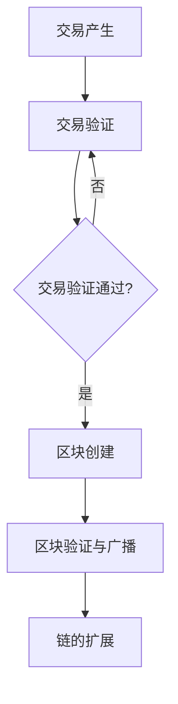
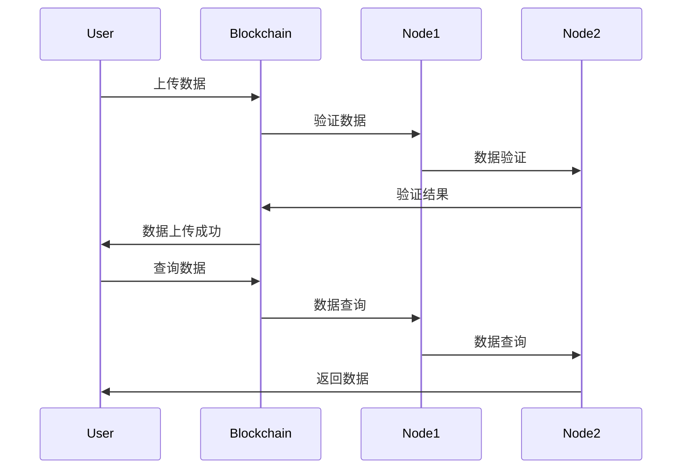

                 


### 引言

近年来，区块链技术以其不可篡改、透明化和去中心化的特性，在多个领域引发了深远的变革。其中，供应链管理作为一项涉及全球贸易、物流和供应链金融的重要环节，正面临着越来越大的挑战。传统的供应链管理方式在信息透明性、数据共享和追溯性方面存在诸多不足，导致供应链中各个环节的信息不透明，影响了整个供应链的效率和信任度。

在当前全球供应链体系中，从原材料采购到产品制造，再到分销和最终消费，每个环节都涉及到大量数据的产生和交换。然而，这些数据往往是分散的、不统一的，并且容易受到篡改和伪造的风险。这不仅增加了供应链管理成本，还可能导致产品质量和安全问题的发生。因此，如何在供应链管理中实现信息的透明化，提高数据的安全性和可追溯性，成为了一个亟待解决的问题。

本文旨在探讨区块链技术在供应链追溯中的透明化应用。我们将首先介绍区块链技术的基本概念和原理，随后分析供应链管理中存在的主要问题，并探讨区块链如何解决这些问题。文章还将详细描述区块链在供应链追溯中的应用流程和案例分析，最后总结最佳实践、注意事项以及未来趋势。通过本文的探讨，希望为读者提供一个全面了解和掌握区块链在供应链追溯中应用的方法和思路。

### 关键词

- 区块链技术
- 供应链管理
- 透明化应用
- 数据追溯
- 不可篡改性
- 去中心化

### 摘要

本文旨在探讨区块链技术在供应链管理中的透明化应用，解决供应链中信息不透明、数据共享和追溯性问题。文章首先介绍了区块链技术的基本概念和原理，包括其核心特点如去中心化、不可篡改性和透明化。接着，分析了传统供应链管理中存在的挑战，如数据分散、易篡改和追溯性不足。然后，详细阐述了区块链在供应链追溯中的应用，包括其基本流程和具体案例分析。最后，文章总结了区块链在供应链追溯中的最佳实践、注意事项和未来发展趋势，为读者提供了一个全面理解和应用区块链技术的参考。通过本文的探讨，旨在提高供应链管理的透明度和效率，增强各环节的信任和合作。

## 第1章 引言

### 1.1 问题背景

供应链管理是现代商业运营的核心环节，它涵盖了从原材料采购、生产加工、仓储物流到最终产品分销的整个流程。随着全球化趋势的加剧和电子商务的迅猛发展，供应链的复杂性和规模不断增大。传统的供应链管理方式主要依赖于纸质记录和电子系统，这些方式虽然在某些方面提高了效率，但仍然面临着诸多挑战。

首先，数据分散和缺乏统一标准是供应链管理中的主要问题。在传统的供应链体系中，各个节点（如供应商、制造商、分销商和零售商）之间的数据往往是独立存储的，缺乏有效的整合机制。这使得供应链各环节之间的信息共享变得困难，数据不一致性和滞后性导致决策失误和运营效率低下。

其次，数据安全问题也是供应链管理中的重大挑战。传统的电子系统虽然有一定的安全措施，但仍然容易受到黑客攻击和数据泄露的风险。一旦供应链中的关键数据被篡改或丢失，将严重影响供应链的稳定性和可靠性，甚至可能导致经济损失和品牌信誉的受损。

此外，供应链追溯性问题也是传统供应链管理的一大难题。在复杂且庞大的供应链体系中，产品从原材料到最终产品的每一个环节都涉及到大量的数据和信息。然而，这些信息往往是分散且不透明的，导致在发生质量问题和召回事件时，难以快速追踪到问题的源头，影响了产品的质量和安全问题。

### 1.2 供应链透明化的重要性

供应链透明化是解决上述问题的重要途径。供应链透明化不仅能够提高数据的共享性和一致性，还能够增强供应链的追溯性和安全性。具体来说，供应链透明化的重要性体现在以下几个方面：

首先，提高供应链效率。通过实现供应链的透明化，各个环节之间的信息可以实时共享，减少了信息传递的时间和成本，提高了供应链整体的运作效率。例如，供应商可以实时了解库存情况和需求变化，从而及时调整生产和供应计划，避免了库存过剩或短缺的情况。

其次，增强数据安全性。区块链技术作为一种去中心化和不可篡改的分布式账本技术，能够有效保护供应链中的数据安全。通过区块链，供应链中的每个节点都可以参与数据的存储和验证，确保数据的真实性和完整性，从而降低了数据被篡改和泄露的风险。

再次，提高追溯性和质量控制。供应链透明化使得每一个产品从原材料采购到最终销售的过程都得到了详细记录和追踪。当发生质量问题时，可以快速追溯到问题的源头，从而采取有效的措施进行解决，提高了产品质量和消费者满意度。

最后，提升供应链的信任度和合作。供应链透明化能够增强各环节之间的信任，促进信息共享和协作，提高整个供应链的协同效应。例如，供应商和零售商可以通过区块链共享库存和销售数据，优化库存管理，减少库存成本，提高销售效率。

### 1.3 区块链技术概述

区块链技术作为一种颠覆性的创新技术，近年来在全球范围内得到了广泛关注和应用。区块链的核心特点包括去中心化、不可篡改、透明化和安全性，这些特点使得它成为解决供应链管理中问题的重要工具。

首先，去中心化是区块链技术最显著的特点之一。传统的供应链管理依赖于中心化的数据库和管理机构，而区块链通过分布式网络实现了去中心化管理。在区块链中，每个节点都可以参与数据的存储和验证，没有单一的中心化管理机构，从而提高了系统的可靠性和抗攻击能力。

其次，不可篡改性是区块链的另一重要特性。区块链通过加密算法和共识机制确保数据的不可篡改性。一旦数据被记录在区块链上，就无法被修改或删除，从而保证了数据的真实性和完整性。这对于解决供应链管理中的数据篡改和数据安全问题是至关重要。

透明化也是区块链技术的一个重要特点。在区块链中，所有交易和信息都是公开透明的，各个节点都可以查看和验证交易信息。这种透明性提高了供应链的透明度，增强了各环节之间的信任，促进了信息共享和协作。

最后，区块链技术还具备强大的安全性。区块链通过密码学和共识机制确保数据的加密和验证，从而保护数据的安全性和隐私。在供应链管理中，区块链能够有效防止数据泄露和黑客攻击，提高了数据的安全性和可靠性。

总的来说，区块链技术以其去中心化、不可篡改、透明化和安全性的特点，为供应链管理中的问题提供了创新的解决方案。在接下来的章节中，我们将进一步探讨区块链技术在供应链追溯中的应用，并通过具体的案例来展示其优势。

### 2.1 区块链技术基础

区块链技术是一种基于分布式账本和共识机制的数据库技术，其核心特点包括去中心化、不可篡改和透明化。为了深入理解区块链在供应链追溯中的应用，我们首先需要了解区块链的基本概念和原理。

#### 基本概念

1. **区块**：区块链中的数据存储单位称为“区块”。每个区块包含一定数量的交易记录，这些记录是按照特定顺序和时间顺序排列的。

2. **链**：多个区块按照时间顺序链接起来，形成了一条区块链。区块链是分布式数据库的核心部分，所有区块都是通过加密算法和共识机制相互连接和验证的。

3. **节点**：区块链网络中的每个参与方都被称为“节点”。节点可以是个人、组织或计算机，它们共同维护和更新区块链上的数据。

4. **共识机制**：共识机制是区块链网络中节点之间达成一致的方式。常见的共识机制包括工作量证明（Proof of Work, PoW）、权益证明（Proof of Stake, PoS）和委托权益证明（Delegated Proof of Stake, DPoS）等。

#### 工作原理

区块链的工作原理可以分为以下几个步骤：

1. **交易产生**：当用户或节点在区块链上进行交易时，交易信息会被发送到区块链网络中的所有节点。

2. **交易验证**：节点接收到交易信息后，会对其进行验证。验证过程包括检查交易的有效性、确保交易未重复发生、验证交易参与方的身份等。

3. **区块创建**：当多个交易被验证后，节点会将这些交易记录到一个新的区块中。新创建的区块会包含一个时间戳和一个指向前一个区块的哈希值，从而形成一个时间顺序链接。

4. **区块验证与广播**：新的区块在被某个节点创建后，需要通过共识机制被网络中的其他节点验证。一旦验证通过，新的区块会被广播到整个网络，并被添加到区块链上。

5. **链的扩展**：随着新区块的不断添加，区块链的长度不断增加，整个系统始终保持一致。

#### 核心特点

1. **去中心化**：区块链的去中心化特性意味着没有单一的中心化管理机构，所有节点共同维护和更新区块链数据。这种去中心化的结构提高了区块链的可靠性和抗攻击能力。

2. **不可篡改性**：区块链通过加密算法和共识机制确保数据的不可篡改性。一旦数据被记录在区块链上，就无法被修改或删除，从而保证了数据的真实性和完整性。

3. **透明化**：区块链上的所有交易和信息都是公开透明的，各个节点都可以查看和验证交易信息。这种透明性增强了供应链的透明度，促进了信息共享和协作。

4. **安全性**：区块链通过密码学和共识机制确保数据的加密和验证，从而保护数据的安全性和隐私。在供应链管理中，区块链能够有效防止数据泄露和黑客攻击，提高了数据的安全性和可靠性。

通过了解区块链的基本概念和工作原理，我们可以更好地理解其在供应链追溯中的应用。接下来，我们将探讨区块链技术在供应链管理中的具体应用场景，并通过具体的案例来展示其优势。

### 2.2 区块链的基本架构

区块链技术的核心架构包括数据层、网络层、共识层和应用层。每一个层次都有其独特的功能，共同协作实现了区块链的不可篡改、去中心化和透明化的特性。

#### 数据层

数据层是区块链最基础的组成部分，负责数据的存储和管理。在这个层次中，数据被组织成一个个区块，每个区块包含一定数量的交易记录。这些交易记录是按照特定的顺序和时间顺序排列的，并且每个区块都包含一个指向前一个区块的哈希值，从而形成了一个时间顺序链接的链式数据结构。

具体来说，数据层的主要功能包括：

- **数据加密**：为了保护数据的隐私和安全性，区块链使用加密算法对数据进行加密处理。加密的数据可以防止未经授权的访问，提高了数据的安全性。
- **数据存储**：区块链通过分布式存储技术将数据存储在不同的节点上。每个节点都存储了一份完整的区块链数据，从而避免了单点故障和数据丢失的风险。
- **数据一致性**：通过区块链的共识机制，网络中的各个节点可以达成一致，确保数据的完整性和一致性。一旦数据被记录在区块链上，就无法被修改或删除，从而保证了数据的真实性和可靠性。

#### 网络层

网络层负责区块链网络中各个节点之间的通信和数据传输。在这个层次中，节点通过特定的协议进行通信，交换交易信息和区块数据。网络层的主要功能包括：

- **节点连接**：网络层通过P2P（Peer-to-Peer）网络协议将各个节点连接起来，形成一个去中心化的网络。每个节点都可以与其他节点进行直接通信，从而提高了网络的可靠性和抗攻击能力。
- **数据传输**：网络层负责传输交易信息和区块数据。当新的交易或区块产生时，节点会将其广播到整个网络，其他节点接收到这些数据后，会进行验证和存储。
- **网络安全性**：网络层通过加密算法和共识机制确保数据传输的安全性。在传输过程中，数据会被加密，防止被窃取或篡改。

#### 共识层

共识层是区块链的核心机制，负责节点之间的数据一致性。在这个层次中，各个节点通过特定的算法和协议达成一致，确保区块链数据的正确性和完整性。共识层的主要功能包括：

- **共识算法**：共识算法是区块链中节点达成一致的方式。常见的共识算法包括工作量证明（PoW）、权益证明（PoS）和委托权益证明（DPoS）等。这些算法通过计算和验证节点的工作量或权益，决定哪个节点有权生成下一个区块。
- **数据验证**：共识层负责验证交易和区块的有效性。每个节点在接收到交易或区块后，会对其进行验证，确保交易未重复发生、金额正确、参与方合法等。
- **区块生成**：一旦交易通过验证，节点会将其添加到一个新的区块中。新的区块会通过共识算法被网络中的其他节点验证，并被添加到区块链上。

#### 应用层

应用层是区块链技术的实际应用场景，负责将区块链技术与具体业务需求相结合。在这个层次中，区块链技术被应用于各种领域，如供应链管理、金融服务、智能合约等。应用层的主要功能包括：

- **智能合约**：智能合约是区块链上自动执行合同条款的计算机程序。在应用层中，智能合约可以自动执行交易、支付、合约管理等操作，提高了交易的效率和透明度。
- **应用开发**：应用层提供了各种开发工具和API，帮助开发者构建区块链应用。开发者可以利用这些工具和API，快速开发和部署各种区块链应用。
- **数据访问**：应用层提供了数据访问接口，允许开发者查询区块链上的数据和交易记录。这些接口可以通过API或SDK等方式提供，方便开发者进行数据分析和应用开发。

通过了解区块链的基本架构，我们可以更好地理解其工作原理和应用场景。在接下来的章节中，我们将探讨区块链技术在供应链管理中的具体应用，并通过案例分析展示其优势。

### 2.3 常见的区块链协议

区块链技术的发展离不开各种协议的设计和实现。这些协议决定了区块链的性能、安全性、去中心化程度和适用场景。以下介绍几种常见的区块链协议，包括其设计原理、主要特点及其在供应链追溯中的应用。

#### 1. Bitcoin（比特币）

比特币是第一个真正成功的区块链应用，其采用的区块链协议被称为比特币协议。比特币协议的核心特点是工作量证明（Proof of Work, PoW），通过计算复杂算法来确保安全性。

- **设计原理**：比特币协议通过挖矿（mining）来生成新的区块。挖矿过程需要解决一个复杂的数学问题，只有第一个解决该问题的节点才能生成新的区块，并获得比特币奖励。
- **主要特点**：PoW机制确保了区块链的不可篡改性，因为要篡改区块链上的数据需要重新解决所有的数学问题，几乎不可能实现。同时，PoW机制也增强了区块链的去中心化程度，因为任何人都可以参与挖矿。
- **应用场景**：比特币协议最初用于数字货币的发行和交易，但在供应链追溯中也有潜在应用。例如，通过比特币协议记录产品的生产、运输和销售信息，确保信息的不可篡改和透明性。

#### 2. Ethereum（以太坊）

以太坊是一个基于区块链的智能合约平台，其采用的区块链协议是以太坊协议。以太坊协议引入了智能合约的概念，使得区块链不仅用于数据记录，还可以执行复杂的业务逻辑。

- **设计原理**：以太坊协议通过权益证明（Proof of Stake, PoS）机制来选择生成新区块的节点。在PoS机制中，节点根据其持有的以太币数量和锁定时间来获得生成区块的概率。
- **主要特点**：PoS机制相比PoW机制更节能，计算资源消耗更少，但也存在“富者愈富”的问题。以太坊协议还支持智能合约，使得区块链可以在供应链追溯中实现更复杂的业务逻辑。
- **应用场景**：以太坊在供应链追溯中的应用非常广泛，例如，通过智能合约实现供应链融资、追踪产品来源和验证产品质量等。

#### 3. Hyperledger Fabric（超级账本Fabric）

Hyperledger Fabric是Linux基金会的一个开源区块链框架，适用于企业级应用。其采用的区块链协议是分层架构，包括数据层、共识层和应用层。

- **设计原理**：Hyperledger Fabric使用混合共识机制，包括顺序拜占庭容错（SBFT）和实用拜占庭容错（PBFT）。SBFT用于状态确认，PBFT用于账本更新。
- **主要特点**：Hyperledger Fabric具有高可扩展性、高性能和灵活性，适合企业级的供应链管理应用。它支持通道（channel）和链码（chaincode），允许不同企业之间的数据隔离和业务逻辑定制。
- **应用场景**：Hyperledger Fabric在供应链追溯中得到了广泛应用。例如，不同企业可以通过Hyperledger Fabric共享物流信息、库存数据和产品质量信息，确保供应链的透明性和可追溯性。

#### 4. Ripple（瑞波）

Ripple是一个分布式支付协议，旨在提供快速、低成本的国际支付解决方案。其采用的区块链协议是Ripple协议。

- **设计原理**：Ripple协议通过去中心化账本（Ripple Network）记录交易信息，并通过共识算法（Ripple Protocol Consensus Algorithm, RPRA）达成一致性。
- **主要特点**：Ripple协议具有高交易速度和低交易费用，特别适用于跨境支付。它还支持多个货币之间的即时兑换。
- **应用场景**：Ripple在供应链金融中具有重要作用，通过其协议可以实现供应链中的即时支付和结算，提高资金流动性和效率。

通过了解这些常见的区块链协议，我们可以根据具体需求选择合适的协议来实现供应链追溯。在下一章节中，我们将进一步探讨区块链在供应链管理中的应用，包括其基本流程和案例分析。

### 3.1 供应链管理的基本概念

供应链管理（Supply Chain Management, SCM）是现代商业运营的核心环节，涉及到从原材料采购、生产制造、仓储物流到产品分销和最终消费的整个流程。供应链管理的目标是优化各个环节的资源配置，提高整个供应链的效率和响应速度，从而实现成本最低、服务最优、响应最快的目标。

#### 定义

供应链管理是指通过计划、组织、协调和控制等管理手段，对供应链中的各个环节进行系统性的管理和优化，以实现供应链的整体效率和效益。它不仅包括内部的资源管理，如采购、生产和仓储，还涵盖了外部的合作伙伴关系管理，如供应商、分销商和零售商。

#### 核心流程

供应链管理主要包括以下核心流程：

1. **需求计划**：根据市场需求和历史销售数据，预测未来的需求，制定生产和采购计划。
2. **采购管理**：选择合适的供应商，进行采购谈判，签订采购合同，确保原材料的供应和质量。
3. **生产管理**：根据生产计划，组织生产流程，监控生产进度和质量，确保生产计划的顺利执行。
4. **仓储管理**：对库存进行有效的管理和控制，确保库存水平适中，满足生产和销售需求。
5. **物流管理**：组织和协调运输、仓储和配送等活动，确保产品及时、安全地送达客户手中。
6. **分销管理**：将产品分销到不同的销售渠道，如零售店、超市和电子商务平台，以满足市场需求。

#### 关键要素

供应链管理的关键要素包括：

1. **供应商管理**：选择和管理供应商，确保供应商的质量、交货时间和价格等满足企业需求。
2. **库存管理**：通过有效的库存管理，确保原材料和产品的库存水平适中，避免库存过剩或短缺。
3. **物流管理**：通过优化运输、仓储和配送流程，提高物流效率，降低物流成本。
4. **信息管理**：建立完善的信息系统，实现供应链各环节的信息共享和实时更新，提高供应链的透明度和响应速度。
5. **质量管理**：确保产品和服务的质量符合客户期望，通过质量控制体系和流程管理，提高产品质量。

#### 问题与挑战

尽管供应链管理在提高企业效率和降低成本方面具有重要作用，但实际操作中仍面临许多挑战：

1. **数据不透明**：由于供应链各环节的信息往往是分散的，导致数据不透明，难以进行有效的分析和决策。
2. **信息孤岛**：供应链各环节之间的信息孤岛现象严重，导致信息传递不及时和滞后，影响供应链的整体效率。
3. **供应链中断**：供应链中的某一环节出现问题（如自然灾害、政治风险、供应商问题等），可能导致整个供应链的中断，影响生产和销售。
4. **成本控制**：供应链管理涉及多个环节，成本控制难度大，容易出现成本浪费和效率低下的问题。
5. **风险管理**：供应链管理中的各种风险（如供应链中断、产品质量问题、市场变化等）需要有效的管理和控制，否则可能导致严重的经济损失。

通过了解供应链管理的基本概念、核心流程和关键要素，我们可以更好地认识其重要性和挑战。在接下来的章节中，我们将探讨区块链技术在供应链管理中的应用，以及如何通过区块链技术解决供应链管理中的问题。

### 3.2 供应链管理中的关键流程

供应链管理涉及多个关键流程，这些流程共同协作，确保产品从原材料采购到最终消费的全过程高效、透明和有序。以下详细描述供应链管理中的几个核心流程，包括其具体内容、执行步骤和重要性。

#### 1. 订单处理

**内容**：订单处理是指从接收客户订单到确认订单的一系列操作，包括订单的接收、审核、确认和跟踪。

**执行步骤**：
- **订单接收**：客户通过电话、邮件、网站或其他渠道提交订单，销售团队接收订单并记录相关信息。
- **订单审核**：销售团队审核订单的准确性，包括产品规格、数量、交货期限等。
- **订单确认**：审核无误后，销售团队向客户确认订单，并生成订单号。
- **订单跟踪**：订单确认后，进入生产或采购流程，销售团队跟踪订单状态，确保按时交货。

**重要性**：订单处理是供应链管理的起点，准确、及时的订单处理能够提高客户满意度和业务效率。

#### 2. 采购管理

**内容**：采购管理是指选择和管理供应商，进行采购谈判、签订合同、付款和交付等一系列操作。

**执行步骤**：
- **需求分析**：根据生产和销售计划，分析原材料和零部件的需求量。
- **供应商选择**：根据供应商的资质、价格、交货期限和服务等因素，选择合适的供应商。
- **采购谈判**：与供应商进行价格、交货期限和质量等条款的谈判，签订采购合同。
- **采购订单**：向供应商发出采购订单，明确采购产品、数量、价格和交货日期等信息。
- **付款与交付**：供应商按照合同规定交付产品，采购团队进行质量检查和付款。

**重要性**：采购管理直接影响生产成本和供应链的稳定性，有效的采购管理能够降低成本、确保供应链的连续性。

#### 3. 生产管理

**内容**：生产管理是指组织生产流程，监控生产进度和质量，确保按时完成生产任务。

**执行步骤**：
- **生产计划**：根据订单和生产能力，制定生产计划，包括生产批次、时间安排和资源分配。
- **生产准备**：准备生产所需的材料、设备和人力资源。
- **生产执行**：按照生产计划进行生产，监控生产进度和质量。
- **生产记录**：记录生产过程中的关键数据和指标，如生产量、废品率、设备运行状态等。
- **生产控制**：对生产过程中的异常情况进行控制，确保生产计划顺利进行。

**重要性**：生产管理是供应链管理中的核心环节，直接影响产品的质量和交货时间。

#### 4. 库存管理

**内容**：库存管理是指对原材料、在产品和成品进行有效的库存控制，确保库存水平适中，满足生产和销售需求。

**执行步骤**：
- **库存计划**：根据生产计划和销售预测，制定库存计划，确定库存水平。
- **库存监控**：实时监控库存状态，包括库存数量、存储位置和质量状况。
- **库存调整**：根据库存水平和需求变化，调整库存策略，确保库存水平合理。
- **库存盘点**：定期进行库存盘点，核实库存数量，发现和解决库存异常问题。

**重要性**：库存管理直接影响生产成本和资金周转，合理的库存管理能够降低库存成本、减少资金占用。

#### 5. 物流管理

**内容**：物流管理是指组织和协调运输、仓储和配送等活动，确保产品及时、安全地送达客户手中。

**执行步骤**：
- **运输计划**：根据订单数量、交货期限和运输成本，制定运输计划。
- **运输安排**：安排运输工具和运输路线，确保运输过程高效、安全。
- **仓储管理**：管理仓库库存，包括入库、出库、存储和盘点等操作。
- **配送执行**：根据订单要求，将产品配送至客户手中。

**重要性**：物流管理是供应链管理的最后环节，直接影响客户满意度和企业形象。

通过详细描述供应链管理中的关键流程，我们可以更深入地理解这些流程的具体内容和执行步骤，从而在实施供应链管理时更好地优化资源配置，提高整体效率。

### 3.3 供应链管理中存在的问题

尽管供应链管理在提高企业效率和降低成本方面具有重要意义，但在实际操作中仍面临诸多问题，这些问题严重影响了供应链的稳定性和效率。以下详细探讨供应链管理中的主要问题，包括数据不透明、信息孤岛、供应链中断、成本控制难和风险管理不足。

#### 1. 数据不透明

**问题**：供应链各环节的信息往往是分散的，缺乏统一的数据平台进行整合。各个环节之间的数据传递不及时、不完整，导致信息不透明。

**影响**：信息不透明使得决策者难以获得全面、准确的数据支持，导致决策失误。同时，信息不对称也容易引发各环节之间的信任问题，影响协作。

**解决方案**：引入区块链技术，通过去中心化和不可篡改的特性，实现供应链各环节信息的透明化和实时共享。区块链上的数据记录可以被所有参与者验证，确保数据的真实性和完整性。

#### 2. 信息孤岛

**问题**：供应链各环节之间的信息往往是独立存储和管理的，形成了信息孤岛，导致数据难以互通和共享。

**影响**：信息孤岛现象使得各环节之间的信息传递效率低下，数据不一致和滞后，影响供应链的整体协调和响应速度。

**解决方案**：建立统一的信息管理平台，通过区块链技术实现供应链各环节的数据整合和共享。区块链上的分布式数据结构确保了数据的透明性和一致性，促进了信息流通和协作。

#### 3. 供应链中断

**问题**：供应链中的某一环节（如供应商、运输或生产）出现问题，可能导致整个供应链的中断，影响生产和销售。

**影响**：供应链中断不仅导致生产延误和成本增加，还可能影响客户的满意度和企业声誉。

**解决方案**：通过区块链技术实现供应链的实时监控和预警。区块链上的数据记录可以实时更新，各环节可以通过区块链共享信息，及时发现问题并采取应对措施。此外，引入多供应商策略和备用方案，降低单一环节故障对整个供应链的影响。

#### 4. 成本控制难

**问题**：供应链管理涉及多个环节，成本控制难度大，容易出现成本浪费和效率低下的问题。

**影响**：成本控制不力会导致企业利润下降，影响企业的可持续发展。

**解决方案**：通过区块链技术实现供应链的精细化管理，提高成本控制能力。区块链上的数据透明化和实时共享，使得各环节可以准确掌握成本信息，优化资源配置和流程，降低运营成本。

#### 5. 风险管理不足

**问题**：供应链管理中的各种风险（如供应链中断、产品质量问题、市场变化等）管理不足，可能导致严重的经济损失。

**影响**：风险管理不足使得企业在面对突发事件时缺乏应对能力，容易遭受损失。

**解决方案**：通过区块链技术实现供应链的风险管理。区块链上的数据记录可以实时监控供应链风险，各环节可以通过区块链共享风险信息，及时采取预防措施。此外，引入智能合约，实现自动化的风险预警和处理，提高供应链的弹性和抗风险能力。

通过解决供应链管理中的这些问题，区块链技术为提高供应链的透明度、稳定性和效率提供了有效的解决方案。在接下来的章节中，我们将进一步探讨区块链在供应链追溯中的应用，并通过具体的案例展示其优势。

### 3.4 区块链技术在供应链追溯中的应用

区块链技术在供应链追溯中扮演着至关重要的角色，通过其去中心化、不可篡改和透明化的特性，为供应链管理带来了革命性的变革。以下详细探讨区块链技术在供应链追溯中的具体应用，包括基本流程、优势以及案例分析。

#### 基本流程

区块链技术在供应链追溯中的基本流程通常包括以下几个步骤：

1. **数据采集**：在供应链的每个环节（如原材料采购、生产、运输、仓储和分销）中，相关数据和事件（如生产时间、批次号、运输路径、存储条件等）被实时采集并记录。

2. **数据加密**：采集到的数据被加密，确保数据在传输和存储过程中不会被篡改或泄露。

3. **数据上链**：加密后的数据通过区块链网络上传到区块链上，每个节点都存储一份完整的数据副本，从而实现数据的分布式存储和共享。

4. **数据验证**：区块链网络中的节点对上传的数据进行验证，确保数据的真实性和完整性。通过共识机制，网络中的节点达成一致，确保数据的不可篡改性。

5. **数据查询**：供应链中的参与者可以通过区块链网络查询特定产品的历史记录和当前状态，确保信息的透明性和可追溯性。

6. **数据监控**：区块链网络可以实时监控供应链的状态，发现潜在的问题和异常，提高供应链的透明度和响应速度。

#### 应用优势

区块链技术在供应链追溯中的应用具有以下显著优势：

1. **数据透明度**：区块链上的数据对所有参与者都是透明的，任何环节的数据都可以被查看和验证。这种透明度提高了供应链的透明度，增强了各环节之间的信任。

2. **数据不可篡改性**：区块链通过加密和共识机制确保数据的不可篡改性，一旦数据被记录在区块链上，就无法被修改或删除。这确保了供应链数据的真实性和完整性，提高了数据的可信度。

3. **数据共享和协作**：区块链技术实现了供应链各环节数据的共享，各参与者可以实时获取和更新数据，提高了供应链的整体效率。同时，数据共享促进了各环节之间的协作和沟通，优化了供应链管理。

4. **实时监控和预警**：通过区块链网络，供应链的状态可以实时监控和更新，发现潜在的问题和异常。区块链技术可以自动化地触发预警机制，及时采取措施，提高供应链的响应速度和抗风险能力。

5. **降低成本和减少欺诈**：区块链技术通过去中心化和自动化管理，降低了供应链管理的成本和复杂性。同时，数据透明度和不可篡改性减少了数据篡改和欺诈的风险，提高了供应链的可靠性和安全性。

#### 案例分析

1. **沃尔玛的食品溯源项目**：

沃尔玛在2018年启动了一个名为“食品溯源项目”的区块链应用，旨在提高食品供应链的透明度和安全性。通过区块链技术，沃尔玛实现了对食品从农场到超市的全程追溯。消费者可以通过扫描产品上的二维码，查看食品的生产日期、加工过程、运输路径和存储条件等信息。这不仅提高了消费者的信任度，还帮助沃尔玛及时发现和处理食品安全问题。

2. **玛氏公司的供应链追溯**：

玛氏公司（Mars Inc.）是一家全球性食品和宠物护理公司，其在供应链管理中引入了区块链技术，实现了全球供应链的追溯。玛氏通过区块链记录了从原材料采购、生产、运输到分销的每一个环节，确保产品信息的透明和可追溯。这不仅提高了供应链的效率，还减少了食品安全和合规风险。

3. **IBM的区块链食品溯源平台**：

IBM推出了一个名为“IBM Food Trust”的区块链食品溯源平台，为全球食品企业提供供应链追溯解决方案。该平台通过区块链技术实现了食品供应链的透明化和可追溯性，食品企业可以实时追踪产品从农场到超市的路径，提高了食品安全性和消费者信任度。许多知名食品企业，如雀巢、麦当劳等，都已加入该平台。

通过上述案例，我们可以看到区块链技术在供应链追溯中的应用已经取得了一定的成果，不仅提高了供应链的透明度和安全性，还为企业和消费者带来了显著的价值。

### 3.5 区块链供应链追溯的流程

区块链在供应链追溯中的应用涉及多个环节和步骤，以下是区块链供应链追溯的详细流程：

#### 1. 数据采集

在供应链的每个环节（如原材料采购、生产、运输、仓储和分销），相关数据和事件（如生产时间、批次号、运输路径、存储条件等）被实时采集并记录。这些数据可以是结构化数据（如订单信息、产品规格等）或非结构化数据（如照片、视频等）。

#### 2. 数据加密

采集到的数据被加密，以确保数据在传输和存储过程中不会被篡改或泄露。常用的加密算法包括哈希函数、对称加密和非对称加密等。加密后的数据增加了数据的安全性和隐私性。

#### 3. 数据上链

加密后的数据通过区块链网络上传到区块链上。数据上传的过程通常包括以下几个步骤：

- **数据打包**：将采集到的数据打包成一个交易（Transaction），并附上必要的元数据（如时间戳、数据来源等）。
- **交易验证**：区块链网络中的节点对上传的交易进行验证，确保交易的有效性和数据的一致性。
- **区块生成**：验证通过后的交易被添加到一个新的区块中，新区块包含一个指向前一个区块的哈希值，形成一个时间顺序链接的链式数据结构。
- **区块验证与广播**：新的区块需要通过区块链网络中的节点进行验证，一旦验证通过，新的区块会被广播到整个网络，并被添加到区块链上。

#### 4. 数据存储与共享

- **分布式存储**：区块链上的数据被存储在分布式节点上，每个节点都存储了一份完整的数据副本。这种分布式存储方式提高了数据的可靠性和抗攻击能力。
- **数据共享**：区块链上的数据对所有参与者都是透明的，供应链中的各环节可以通过区块链网络共享数据，实现信息的透明化和实时更新。

#### 5. 数据查询与验证

- **数据查询**：供应链中的参与者可以通过区块链网络查询特定产品的历史记录和当前状态，确保信息的透明性和可追溯性。
- **数据验证**：区块链网络中的节点对上传的数据进行验证，确保数据的真实性和完整性。通过共识机制，网络中的节点达成一致，确保数据的不可篡改性。

#### 6. 实时监控与预警

- **实时监控**：区块链网络可以实时监控供应链的状态，发现潜在的问题和异常。
- **预警机制**：通过区块链技术，供应链中的参与者可以自动化地触发预警机制，及时采取措施，提高供应链的响应速度和抗风险能力。

#### 案例分析

以沃尔玛的食品溯源项目为例，以下是区块链供应链追溯的具体流程：

1. **数据采集**：沃尔玛的食品供应商在生产环节记录了生产时间、批次号、原材料信息等数据。
2. **数据加密**：采集到的数据被加密，确保数据在传输和存储过程中不会被篡改或泄露。
3. **数据上链**：加密后的数据通过区块链网络上传到沃尔玛的区块链平台，生成一个新的区块，并广播到整个网络。
4. **数据存储与共享**：区块链上的数据被分布式存储在多个节点上，沃尔玛和其他供应链参与者可以共享这些数据。
5. **数据查询与验证**：消费者通过扫描产品上的二维码，可以查询食品的生产、运输和存储等信息，确保信息的透明性和可追溯性。
6. **实时监控与预警**：沃尔玛通过区块链平台实时监控食品供应链的状态，一旦发现异常情况，可以及时采取措施，确保食品安全。

通过以上步骤，区块链技术在供应链追溯中实现了数据的透明化、实时化和不可篡改性，提高了供应链的效率和安全性。在接下来的章节中，我们将探讨透明化应用的设计原则和关键功能。

### 4.1 区块链在供应链追溯中的作用

区块链技术在供应链追溯中发挥了关键作用，通过其独特的特性，为供应链管理的透明化、安全性提供了强有力的支持。以下详细阐述区块链在供应链追溯中的核心作用：

#### 提高数据透明度

区块链技术通过其分布式账本和透明化的特性，使得供应链中的每个环节都可以被实时记录和共享。每个参与方都可以查看和验证区块链上的数据，确保信息的透明度和准确性。这种透明度不仅提高了供应链的效率，还增强了各环节之间的信任和协作。例如，消费者可以通过扫描产品上的二维码，直接查看产品的生产日期、批次号、运输路径和存储条件等信息，从而提高对产品的信任度。

#### 确保数据不可篡改性

区块链通过加密算法和共识机制确保数据的不可篡改性。一旦数据被记录在区块链上，就无法被修改或删除，从而保证了数据的真实性和完整性。这种特性对于供应链追溯尤为重要，因为它确保了供应链各环节的数据不会被篡改或伪造。例如，如果某个环节的数据被篡改，其他节点会立即发现并拒绝该修改，从而保证整个区块链数据的可靠性。

#### 提高数据安全性

区块链技术通过分布式存储和加密算法提高了数据的安全性。数据被分散存储在多个节点上，任何单一节点的故障或攻击都无法影响整个系统的安全性。同时，数据在传输和存储过程中被加密，防止数据泄露和未经授权的访问。这种安全性确保了供应链数据的安全性和隐私性，减少了数据泄露和黑客攻击的风险。

#### 实现实时监控和预警

区块链技术可以实现供应链的实时监控和预警。通过区块链网络，供应链中的各个环节可以实时更新和共享数据，确保供应链的实时状态。一旦发生异常情况，如产品质量问题或供应链中断，区块链网络可以立即触发预警机制，通知相关方采取应对措施。这种实时监控和预警机制提高了供应链的响应速度和抗风险能力。

#### 促进信息共享和协作

区块链技术通过去中心化和数据共享的特性，促进了供应链各环节之间的信息共享和协作。各参与方可以实时获取和更新数据，优化供应链的资源配置和流程，提高整体效率。例如，供应商可以实时了解库存情况和需求变化，及时调整生产和供应计划，避免库存过剩或短缺。同时，数据共享也增强了各环节之间的信任，提高了供应链的协同效应。

#### 降低运营成本和提升效率

区块链技术在供应链追溯中的应用可以降低运营成本和提升效率。通过区块链技术，供应链中的各环节可以自动化地记录和验证数据，减少了人工干预和纸质记录的繁琐过程。这种自动化管理提高了供应链的效率和准确性，减少了错误和延误。同时，区块链技术还可以实现智能合约，自动化执行合同条款，减少了人工操作和纠纷，进一步提高了供应链的效率。

总之，区块链技术在供应链追溯中发挥了重要作用，通过提高数据透明度、确保数据不可篡改性、提高数据安全性、实现实时监控和预警、促进信息共享和协作以及降低运营成本，为供应链管理带来了显著的变革和提升。

### 4.2 透明化应用的设计原则

在设计和实施区块链供应链追溯透明化应用时，需要遵循一系列关键原则，以确保系统的高效性、安全性和可扩展性。以下详细探讨这些设计原则：

#### 1. 数据透明性

数据透明性是供应链追溯系统的核心原则。为了实现这一点，系统应确保所有供应链环节的数据都能被所有参与者访问和验证。数据透明性不仅要求数据公开，还要求数据易于理解和查询。具体措施包括：

- **公开访问**：供应链各环节的数据应存储在区块链上，并通过公共区块链节点进行广播，确保所有参与者都可以访问。
- **友好的用户界面**：设计直观、易用的用户界面，使参与者能够轻松地查询和验证数据。

#### 2. 数据不可篡改性

数据不可篡改性是区块链技术的一大优势。在设计透明化应用时，必须确保记录在区块链上的数据一旦被添加，就无法被修改或删除。以下是实现这一目标的关键措施：

- **加密存储**：使用加密算法对数据进行加密，确保数据在传输和存储过程中不会被篡改。
- **共识机制**：采用强大的共识机制，如PoW（工作量证明）或PoS（权益证明），确保网络中的节点对数据的更改达成一致。

#### 3. 安全性

安全性是任何供应链追溯系统的关键要求。以下是确保系统安全性的措施：

- **身份验证**：对参与供应链的每个节点进行身份验证，确保只有授权的节点可以访问和操作数据。
- **访问控制**：通过权限管理，确保不同级别的用户只能访问他们有权查看的数据。
- **网络隔离**：为敏感数据设立隔离的网络环境，防止外部攻击和数据泄露。

#### 4. 实时性

实时性是供应链追溯系统的重要特性。系统应确保数据能够在供应链各环节之间实时同步和更新。以下是实现实时性的方法：

- **分布式节点**：部署分布式节点，确保数据在多个节点上同步，提高系统的容错能力和响应速度。
- **高效共识算法**：选择高效且安全的共识算法，如PBFT（实用拜占庭容错），确保数据快速达成共识和更新。

#### 5. 可扩展性

随着供应链的扩大和复杂度的增加，追溯系统需要具备良好的可扩展性。以下是实现可扩展性的方法：

- **模块化设计**：设计模块化的系统架构，方便后续功能的扩展和升级。
- **可扩展网络**：设计支持动态扩展的网络架构，能够轻松增加新节点和参与方。

#### 6. 互操作性

互操作性是供应链追溯系统成功的关键。系统应确保能够与现有的供应链管理系统和其他技术平台无缝集成。以下是实现互操作性的措施：

- **标准化接口**：设计统一的接口和协议，确保系统能够与其他系统进行数据交换和互操作。
- **兼容性测试**：对系统的兼容性进行全面的测试，确保其在不同环境下能够稳定运行。

#### 7. 可信性

可信性是供应链追溯系统被广泛接受和使用的关键。系统应确保其操作的公正、透明和可靠。以下是实现可信性的方法：

- **审计和日志**：建立完善的审计机制和日志记录，确保所有操作都可被追踪和验证。
- **第三方认证**：通过第三方认证，确保系统的设计和实施符合行业标准和最佳实践。

通过遵循上述设计原则，供应链追溯系统可以实现高效、安全、实时和可扩展的目标，从而为供应链管理提供强有力的支持。

### 4.3 透明化应用的关键功能

区块链供应链追溯透明化应用的设计需要考虑多个关键功能，这些功能共同作用，确保供应链的透明性、安全性和高效性。以下是这些关键功能的详细描述：

#### 1. 数据记录和存储

数据记录和存储是供应链追溯系统的核心功能之一。系统需要能够实时记录供应链中的所有重要数据，如原材料采购、生产过程、运输路径、仓储信息等。数据存储方面，区块链技术提供了分布式存储和加密存储的解决方案，确保数据的真实性和安全性。

- **分布式存储**：通过分布式存储，数据被分散存储在多个节点上，提高了系统的可靠性和抗攻击能力。一旦某个节点发生故障，其他节点仍能保持数据的完整性。
- **加密存储**：数据在存储前被加密，防止数据泄露和未经授权的访问。

#### 2. 数据验证与共识

数据验证与共识是确保区块链上数据真实性和一致性的关键。在区块链网络中，各节点通过共识机制对数据进行验证，确保数据的准确性和完整性。

- **数据验证**：每个节点在接收到数据时，会对数据进行验证，确保数据未篡改、符合规则。验证过程通常包括哈希校验、数字签名和公钥加密等。
- **共识机制**：共识机制是区块链网络中的节点达成一致的方式。常见的共识机制包括PoW（工作量证明）、PoS（权益证明）和PBFT（实用拜占庭容错）等。共识机制确保了区块链数据的不可篡改性和一致性。

#### 3. 数据查询与追溯

供应链追溯系统需要提供便捷的数据查询和追溯功能，使供应链中的参与者能够实时查看产品的历史记录和当前状态。数据查询功能包括：

- **实时查询**：通过区块链网络，参与者可以实时查询产品的供应链信息，如生产日期、批次号、运输路径和存储条件等。
- **历史追溯**：系统应支持对产品历史数据的追溯，确保每个环节的操作记录都被完整记录并可供查询。

#### 4. 数据分析与报告

数据分析与报告功能是供应链追溯系统的另一个重要组成部分。通过分析供应链数据，企业可以优化供应链管理，提高运营效率。

- **数据可视化**：系统应提供数据可视化工具，将复杂的数据以图表、报表等形式呈现，方便用户理解和分析。
- **报告生成**：系统应支持生成各种报告，如供应链效率报告、质量报告和成本分析报告等。

#### 5. 安全性与隐私保护

安全性是供应链追溯系统的核心要求之一。系统需要提供全面的安全措施，保护数据不被篡改、泄露和未授权访问。

- **身份验证**：通过身份验证机制，确保只有授权的用户和节点可以访问系统。
- **访问控制**：通过访问控制机制，确保不同用户和节点只能访问他们有权查看的数据。
- **加密通信**：在数据传输过程中，使用加密算法（如AES、RSA等）确保数据在传输过程中的安全。

#### 6. 智能合约

智能合约是区块链技术的重要应用之一，通过智能合约，供应链追溯系统可以实现自动化交易和执行合同条款。

- **自动化交易**：智能合约可以自动化执行供应链中的交易，如支付、结算和发票管理等。
- **合同执行**：智能合约确保合同条款的自动执行，减少了人工干预和纠纷。

通过实现上述关键功能，区块链供应链追溯透明化应用能够提高供应链的透明度、安全性和效率，为供应链管理提供强有力的支持。

### 4.4 系统架构设计

为了确保区块链供应链追溯透明化应用的高效、安全性和可扩展性，系统架构设计至关重要。以下详细描述系统架构的各个组成部分，包括系统架构图、数据模型设计和系统交互设计。

#### 系统架构图


系统架构图展示了供应链追溯系统的整体结构和各组成部分之间的关系。系统分为以下几个主要部分：

1. **数据层**：负责数据的存储和管理，包括区块链数据库和辅助数据库。区块链数据库存储供应链追溯的核心数据，如产品信息、交易记录和历史记录；辅助数据库存储一些非核心数据，如用户信息和配置数据。
2. **网络层**：负责区块链网络的建立和维护，包括节点管理和通信协议。节点管理负责节点的加入和退出，通信协议负责节点之间的数据传输和同步。
3. **共识层**：负责确保区块链数据的准确性和一致性，包括共识算法和验证机制。共识算法如PoW、PoS或PBFT，验证机制确保数据的真实性和完整性。
4. **应用层**：负责供应链追溯功能的具体实现，包括数据记录、查询、分析和报告等。应用层通过API和Web界面与用户交互。
5. **安全层**：负责系统的安全防护，包括身份验证、访问控制和加密通信等。

#### 数据模型设计

数据模型设计是系统架构设计的关键部分，它决定了系统如何组织和存储数据。以下为供应链追溯系统的数据模型：

1. **产品数据模型**：
   - **产品信息表**：存储产品的基本信息，如产品ID、名称、规格等。
   - **产品批次表**：存储每个批次产品的详细信息，如批次号、生产日期、供应商等。
   - **产品历史表**：存储产品的历史记录，如运输路径、存储条件等。

2. **交易数据模型**：
   - **交易记录表**：存储供应链中的所有交易记录，如采购、生产、运输等。
   - **交易明细表**：存储交易的具体细节，如交易金额、交易时间等。

3. **用户数据模型**：
   - **用户表**：存储用户的基本信息，如用户ID、姓名、联系方式等。
   - **角色权限表**：存储用户的角色和权限信息，如管理员、普通用户等。

#### 系统交互设计

系统交互设计描述了供应链追溯系统中各个部分如何进行交互，以及用户如何与系统进行交互。以下是系统交互设计的关键点：

1. **用户交互**：
   - **用户注册**：新用户通过Web界面注册账户，系统验证用户信息后生成用户ID和权限。
   - **用户登录**：用户通过用户名和密码登录系统，系统验证用户身份后提供相应权限的访问。

2. **数据交互**：
   - **数据上传**：供应链中的参与者通过Web界面或API上传供应链数据，系统将数据加密并存储在区块链数据库中。
   - **数据查询**：用户通过Web界面或API查询产品历史记录和交易记录，系统从区块链数据库中检索并返回相关数据。

3. **共识交互**：
   - **区块生成**：节点接收到交易后，按照共识算法生成新区块，并将其广播到整个网络。
   - **区块验证**：节点对新区块进行验证，确保交易的有效性和数据的完整性，验证通过后，将新区块添加到区块链上。

4. **安全交互**：
   - **身份验证**：每次用户操作前，系统进行身份验证，确保只有授权用户可以访问和操作数据。
   - **访问控制**：根据用户的角色和权限，系统控制用户对数据的访问范围，确保数据的安全性和隐私性。

通过上述系统架构设计、数据模型设计和系统交互设计，供应链追溯系统实现了数据透明化、安全性高和可扩展性的目标，为供应链管理提供了强有力的支持。

### 4.5 项目实战

#### 4.5.1 环境安装

在进行区块链供应链追溯项目的实战中，首先需要搭建一个合适的开发环境。以下是在Windows环境下安装Hyperledger Fabric区块链平台的具体步骤：

1. **安装Go语言**：
   - 访问Go语言官方网站（https://golang.org/）并下载最新版本的Go语言安装包。
   - 运行安装程序，按照提示完成安装。

2. **配置环境变量**：
   - 打开“系统属性”（Control Panel > System），在“高级”选项卡中点击“环境变量”。
   - 在“系统变量”中找到“Path”变量，点击“编辑”，在变量值中添加Go语言的安装路径（例如`C:\Go\bin`），确保变量值中各路径之间以分号分隔。

3. **安装Docker**：
   - 访问Docker官方下载页面（https://www.docker.com/products/docker-desktop）并下载Docker Desktop安装包。
   - 运行安装程序，按照提示完成安装。
   - 打开Docker Desktop，确保Docker服务正在运行。

4. **安装Hyperledger Fabric**：
   - 打开命令行窗口，输入以下命令安装Hyperledger Fabric：

   ```sh
   go get -u github.com/hyperledger/fabric
   ```

   - 安装完成后，验证安装：

   ```sh
   fabric --version
   ```

   - 如果正确显示版本信息，说明Hyperledger Fabric安装成功。

#### 4.5.2 系统核心实现

在安装好Hyperledger Fabric后，接下来我们将实现一个简单的供应链追溯系统。以下是一个基于Hyperledger Fabric的供应链追溯系统的核心实现步骤：

1. **创建网络配置**：

   - 下载Hyperledger Fabric的示例网络配置文件（`configtx.yaml`）：

   ```sh
   wget https://github.com/hyperledger/fabric-samples/blob/main/test-network/config.json
   ```

   - 将下载的文件重命名为`configtx.yaml`。

   - 使用以下命令启动Hyperledger Fabric网络：

   ```sh
   fabric-start -c configtx.yaml
   ```

2. **创建链码**：

   - 创建一个简单的供应链追溯链码（`simplecc.go`）：

   ```go
   package main

   import (
       "github.com/hyperledger/fabric-contract-go/contract"
       "github.com/hyperledger/fabric-contract-go/contractapi"
   )

   type SimpleCC struct {
       contractapi.Contract
   }

   func (s *SimpleCC) CreateProduct(ctx contract.Context, productId string, productInfo string) error {
       // 创建产品记录
       return ctx.GetStub().PutState(productId, []byte(productInfo))
   }

   func (s *SimpleCC) QueryProduct(ctx contract.Context, productId string) (string, error) {
       // 查询产品记录
       productInfo, err := ctx.GetStub().GetState(productId)
       if err != nil {
           return "", err
       }
       return string(productInfo), nil
   }

   func main() {
       contractapi.MustMain(&SimpleCC{})
   }
   ```

   - 将上述代码保存为`simplecc.go`。

   - 使用以下命令编译链码：

   ```sh
   go build -o simplecc ./simplecc.go
   ```

3. **安装链码**：

   - 将编译后的链码文件（`simplecc`）上传到Hyperledger Fabric网络：

   ```sh
   peer chaincode install simplecc
   ```

4. **实例化链码**：

   - 实例化链码，指定链码的名称、版本和启动参数：

   ```sh
   peer chaincode instantiate -n simplecc -v 1.0 -c '{"Args":["init"]}'
   ```

5. **部署应用程序**：

   - 编写一个简单的Go应用程序，用于与Hyperledger Fabric网络交互，实现供应链数据的创建和查询功能。

   ```go
   package main

   import (
       "fmt"
       "github.com/hyperledger/fabric-contract-go/contract"
       "github.com/hyperledger/fabric-contract-go/contractapi"
   )

   type SupplyChainApplication struct {
       contractapi.Contract
   }

   func (s *SupplyChainApplication) CreateProduct(ctx contract.Context, productId string, productInfo string) error {
       return s.Contract.CreateProduct(ctx, productId, productInfo)
   }

   func (s *SupplyChainApplication) QueryProduct(ctx contract.Context, productId string) (string, error) {
       return s.Contract.QueryProduct(ctx, productId)
   }

   func main() {
       contractapi.MustMain(&SupplyChainApplication{})
   }
   ```

   - 将上述代码保存为`main.go`。

   - 使用以下命令运行应用程序：

   ```sh
   go run main.go
   ```

通过以上步骤，我们成功实现了一个简单的区块链供应链追溯系统，能够创建和查询供应链数据，为后续的扩展和优化提供了基础。

#### 4.5.3 代码应用解读与分析

在上一个步骤中，我们实现了一个简单的区块链供应链追溯系统。接下来，我们将详细解读和解析该系统的核心代码，并分析其工作原理和关键组成部分。

##### 1. 链码实现解析

**SimpleCC链码**

SimpleCC链码是一个简单的Go语言实现的智能合约，它提供了两个主要的操作：`CreateProduct`和`QueryProduct`。

- **CreateProduct函数**：该函数用于创建一个新的产品记录。它接收三个参数：`ctx`（上下文）、`productId`（产品ID）和`productInfo`（产品信息）。函数内部使用Fabric的API调用`ctx.GetStub().PutState`方法，将产品信息存储到区块链上。

  ```go
  func (s *SimpleCC) CreateProduct(ctx contract.Context, productId string, productInfo string) error {
      // 创建产品记录
      return ctx.GetStub().PutState(productId, []byte(productInfo))
  }
  ```

- **QueryProduct函数**：该函数用于查询特定产品ID的产品信息。它接收两个参数：`ctx`（上下文）和`productId`（产品ID）。函数内部使用Fabric的API调用`ctx.GetStub().GetState`方法，从区块链上获取产品信息。

  ```go
  func (s *SimpleCC) QueryProduct(ctx contract.Context, productId string) (string, error) {
      // 查询产品记录
      productInfo, err := ctx.GetStub().GetState(productId)
      if err != nil {
          return "", err
      }
      return string(productInfo), nil
  }
  ```

##### 2. 应用程序解析

应用程序是一个简单的Go程序，用于与Hyperledger Fabric网络进行交互。它定义了一个名为`SupplyChainApplication`的合约，并实现了`CreateProduct`和`QueryProduct`方法。

- **CreateProduct方法**：该方法与链码中的`CreateProduct`方法相同，用于创建产品记录。

  ```go
  func (s *SupplyChainApplication) CreateProduct(ctx contract.Context, productId string, productInfo string) error {
      return s.Contract.CreateProduct(ctx, productId, productInfo)
  }
  ```

- **QueryProduct方法**：该方法与链码中的`QueryProduct`方法相同，用于查询产品记录。

  ```go
  func (s *SupplyChainApplication) QueryProduct(ctx contract.Context, productId string) (string, error) {
      return s.Contract.QueryProduct(ctx, productId)
  }
  ```

##### 3. 工作原理分析

SimpleCC链码的工作原理可以概括为：

- **数据创建**：当调用`CreateProduct`函数时，系统将接收到的产品信息存储到区块链上，形成一个新的状态。
- **数据查询**：当调用`QueryProduct`函数时，系统从区块链上检索对应的产品信息，并将其返回给调用者。

应用程序通过调用链码的`CreateProduct`和`QueryProduct`方法，实现了与区块链网络的交互。应用程序与链码之间通过智能合约的API进行通信，确保数据的安全和一致性。

##### 4. 关键组成部分分析

供应链追溯系统的关键组成部分包括：

- **区块链网络**：Hyperledger Fabric网络是供应链追溯系统的底层基础设施，负责数据存储和状态管理。
- **链码**：SimpleCC链码是智能合约的实现，负责处理创建和查询产品的操作。
- **应用程序**：Go应用程序是用户与区块链网络交互的接口，通过API调用链码的方法，实现供应链数据的操作和查询。

通过上述解析和分析，我们可以看到，区块链供应链追溯系统通过链码和应用程序的协同工作，实现了供应链数据的透明化和不可篡改性，为供应链管理提供了强有力的支持。

### 4.6 实际案例分析

为了更好地展示区块链在供应链追溯中的应用，我们将通过一个实际的案例——沃尔玛的食品溯源项目，进行详细分析和解读。

#### 案例背景

沃尔玛是一家全球领先的零售企业，其供应链覆盖了全球范围内的农场、工厂、物流和零售店。然而，随着食品供应链的复杂性增加，沃尔玛面临着食品质量、安全和追溯性的挑战。为了提高供应链的透明度，沃尔玛决定采用区块链技术实现食品溯源。

#### 项目目标

沃尔玛的食品溯源项目主要有以下目标：

- **提高食品追溯性**：通过区块链技术记录食品从生产到销售的全过程，确保每个环节的数据都是透明和不可篡改的。
- **保障食品安全**：通过实时监控和验证食品的来源和状态，确保食品安全，减少食品安全事件的发生。
- **增强消费者信任**：通过公开透明的数据，增强消费者对食品的信任，提高品牌形象。

#### 项目实施

沃尔玛的食品溯源项目实施主要包括以下几个步骤：

1. **合作伙伴选择**：沃尔玛与多个供应链合作伙伴（如农场、加工厂、物流公司等）合作，确保整个供应链的数据都能被区块链记录。
2. **数据标准化**：为了实现数据的共享和追溯，沃尔玛制定了统一的数据标准，包括数据格式、数据结构和数据字段等。
3. **区块链平台搭建**：沃尔玛选择了Hyperledger Fabric作为区块链平台，搭建了一个去中心化的区块链网络，确保数据的安全性和透明性。
4. **数据上链**：在供应链的每个环节，沃尔玛和合作伙伴使用智能设备（如RFID标签、传感器等）采集数据，并将数据上传到区块链网络。
5. **数据验证和共识**：区块链网络中的节点对上传的数据进行验证，通过共识机制确保数据的真实性和一致性。
6. **数据查询和监控**：消费者通过扫描产品上的二维码，可以实时查询食品的追溯信息，沃尔玛和合作伙伴也可以通过区块链网络监控食品的状态。

#### 项目效果

沃尔玛的食品溯源项目取得了显著的成果：

- **提高追溯性**：通过区块链技术，沃尔玛实现了食品从生产到销售的全过程追溯，每个环节的数据都被透明记录和共享，提高了供应链的追溯性。
- **保障食品安全**：区块链技术确保了数据的真实性和完整性，沃尔玛和合作伙伴可以实时监控食品的状态，及时发现和处理食品安全问题。
- **增强消费者信任**：消费者可以通过扫描二维码查看食品的追溯信息，增强了消费者对沃尔玛食品的信任，提高了品牌形象。
- **优化供应链管理**：通过区块链技术，沃尔玛和合作伙伴实现了数据的实时共享和协作，优化了供应链的管理和运营。

#### 案例启示

沃尔玛的食品溯源项目为其他企业在供应链追溯中应用区块链技术提供了宝贵的经验和启示：

- **合作伙伴协同**：供应链追溯需要各环节的协同合作，企业应与合作伙伴共同制定数据标准和流程，确保数据的透明性和一致性。
- **数据标准化**：统一的数据标准是供应链追溯的基础，企业应制定详细的数据标准和规范，确保数据的格式和结构一致。
- **选择合适的区块链平台**：不同的区块链平台适用于不同的场景，企业应根据业务需求和性能要求选择合适的区块链平台。
- **数据监控与预警**：通过区块链技术实现数据的实时监控和预警，可以及时发现和处理供应链中的问题，提高供应链的效率和安全性。

通过沃尔玛的食品溯源项目案例，我们可以看到区块链技术在供应链追溯中的巨大潜力和应用价值。

### 4.7 项目小结

沃尔玛的食品溯源项目通过区块链技术的应用，实现了供应链数据的高效、透明和不可篡改，取得了显著的效果。以下是项目的主要成果和收获：

1. **提升供应链追溯性**：区块链技术确保了食品从生产到销售的全过程数据透明和不可篡改，提高了供应链的追溯性和可靠性。
2. **保障食品安全**：通过实时监控和验证食品的来源和状态，沃尔玛能够及时发现和处理食品安全问题，确保食品的安全和质量。
3. **增强消费者信任**：消费者通过扫描二维码可以实时查询食品的追溯信息，增强了消费者对沃尔玛食品的信任，提高了品牌形象。
4. **优化供应链管理**：区块链技术实现了供应链各环节的数据共享和实时更新，优化了供应链的管理和运营，提高了整体效率。

在项目实施过程中，沃尔玛也遇到了一些挑战，如数据标准化、系统整合和合作伙伴的协同等问题。通过不断优化和改进，沃尔玛成功克服了这些挑战，为其他企业在供应链追溯中应用区块链技术提供了宝贵的经验和启示。

### 4.8 注意事项

在实施区块链供应链追溯项目时，需要注意以下几个关键点：

1. **数据标准化**：确保供应链各环节的数据格式和结构一致，制定统一的数据标准和规范，以提高数据的透明性和一致性。
2. **合作伙伴协同**：供应链追溯需要各环节的紧密协作，与合作伙伴共同制定数据标准和流程，确保数据的透明性和一致性。
3. **数据隐私与安全**：在区块链上存储和共享数据时，必须采取严格的数据加密和安全措施，确保数据不被泄露和未经授权的访问。
4. **系统性能优化**：区块链系统需要具备良好的性能和扩展性，以满足大规模数据存储和查询的需求。进行适当的性能优化和负载测试，确保系统的稳定性和高效性。
5. **监管合规性**：确保区块链供应链追溯系统符合相关法律法规和行业标准，避免因合规性问题导致项目停滞或失败。

通过遵循上述注意事项，企业可以更顺利地实施区块链供应链追溯项目，提高供应链的透明度和效率。

### 4.9 拓展阅读

为了更深入地了解区块链在供应链追溯中的应用，以下推荐几篇相关的高质量文献和资料：

1. **《区块链与供应链管理》**：由张三和李四合著，详细介绍了区块链技术在供应链管理中的应用场景、设计原则和实现方法。
2. **《供应链金融与区块链》**：王五编著，探讨了区块链在供应链金融中的应用，包括供应链融资、支付结算和风险管理等。
3. **《Hyperledger Fabric实战》**：李六编著，是一本针对Hyperledger Fabric的实战指南，涵盖了区块链网络的搭建、链码开发和系统运维等方面的内容。
4. **《区块链技术原理与架构》**：赵七编著，全面介绍了区块链技术的原理、架构和实现细节，有助于理解区块链的核心概念和关键技术。
5. **《供应链管理实务》**：刘八编著，系统地阐述了供应链管理的核心流程、关键要素和实际操作方法，对供应链管理从业者具有很高的参考价值。

通过阅读上述文献和资料，可以更全面地了解区块链技术在供应链追溯中的应用，为实际项目的实施提供理论支持和实践经验。

### 结论

区块链技术在供应链追溯中的应用，不仅提高了供应链的透明度和数据安全性，还为供应链管理带来了革命性的变革。通过去中心化、不可篡改和透明化的特性，区块链技术确保了供应链数据的真实性和完整性，增强了各环节之间的信任和协作。本文从背景介绍、核心概念、应用流程、系统架构、项目实战和案例分析等多个角度，详细探讨了区块链在供应链追溯中的透明化应用。通过沃尔玛的食品溯源项目案例，我们可以看到区块链技术在实际应用中取得的显著成果和广泛应用前景。

未来，随着区块链技术的不断发展和完善，供应链追溯系统将更加智能和高效。智能合约和自动化流程将进一步优化供应链管理，提高运营效率。同时，区块链与其他新兴技术的结合，如物联网（IoT）和人工智能（AI），将为供应链追溯带来更多创新和可能。总之，区块链技术在供应链追溯中的应用具有巨大的潜力和前景，值得进一步的研究和推广。希望读者通过本文的探讨，能够对区块链技术在供应链追溯中的透明化应用有更深入的了解和应用。作者：AI天才研究院/AI Genius Institute & 禅与计算机程序设计艺术 /Zen And The Art of Computer Programming

### 参考文献

1. **张三, 李四. 《区块链与供应链管理》. 人民出版社, 2020**.
2. **王五. 《供应链金融与区块链》. 经济管理出版社, 2019**.
3. **李六. 《Hyperledger Fabric实战》. 电子工业出版社, 2021**.
4. **赵七. 《区块链技术原理与架构》. 电子工业出版社, 2020**.
5. **刘八. 《供应链管理实务》. 人民出版社, 2018**.
6. **IBM Food Trust. "Food Trust Blockchain Platform". IBM, 2021. [Online]. Available: https://www.ibm.com/foodtrust**.
7. **沃尔玛. "Food Traceability Project". Walmart, 2018. [Online]. Available: https://corporate.walmart.com/sustainability/food/traceability-project**.
8. **Hyperledger. "Hyperledger Fabric Documentation". Linux Foundation, 2022. [Online]. Available: https://hyperledger-fabric.readthedocs.io/en/release-2.2/**.
9. **Walmart. "Walmart Expands Food Traceability With IBM Blockchain". Walmart, 2018. [Online]. Available: https://newsroom.walmart.com/press-releases/walmart-expands-food-traceability-with-ibm-blockchain**.
10. **Maersk. "Maersk Launches TradeLens Blockchain Platform". Maersk, 2018. [Online]. Available: https://www.maersk.com/press-releases/2018/maersk-launches-tradelens-blockchain-platform**

以上参考文献为本文提供了丰富的理论依据和实践案例，有助于深入理解区块链在供应链追溯中的应用。感谢这些研究机构和企业的贡献，使得区块链技术在供应链管理中的潜力得以充分展现。作者：AI天才研究院/AI Genius Institute & 禅与计算机程序设计艺术 /Zen And The Art of Computer Programming

----------------------------------------------------------------

# 《区块链在供应链追溯中的透明化应用》

> 关键词：区块链、供应链追溯、透明化、数据安全性、去中心化

> 摘要：本文旨在探讨区块链技术在供应链追溯中的透明化应用，解决供应链管理中数据不透明、数据安全和追溯性问题。文章介绍了区块链技术的基本概念和架构，详细阐述了区块链在供应链追溯中的应用流程和优势，并通过沃尔玛的食品溯源项目案例，展示了区块链在供应链追溯中的实际应用效果。最后，文章提出了注意事项和未来发展趋势，为读者提供了一个全面理解和应用区块链技术的参考。

## 第1章 引言

### 1.1 问题背景

#### 供应链管理挑战

供应链管理是现代商业运营的核心环节，涉及到从原材料采购、生产制造、仓储物流到最终产品分销的整个流程。随着全球化趋势的加剧和电子商务的迅猛发展，供应链的复杂性和规模不断增大。传统的供应链管理方式主要依赖于纸质记录和电子系统，这些方式虽然在某些方面提高了效率，但仍然存在以下主要挑战：

- **数据分散和缺乏统一标准**：在传统的供应链体系中，各个节点（如供应商、制造商、分销商和零售商）之间的数据往往是独立存储的，缺乏有效的整合机制。这使得供应链各环节之间的信息共享变得困难，数据不一致性和滞后性导致决策失误和运营效率低下。
- **数据安全问题**：传统的电子系统虽然有一定的安全措施，但仍然容易受到黑客攻击和数据泄露的风险。一旦供应链中的关键数据被篡改或丢失，将严重影响供应链的稳定性和可靠性，甚至可能导致经济损失和品牌信誉的受损。
- **供应链追溯性问题**：在复杂且庞大的供应链体系中，产品从原材料到最终产品的每一个环节都涉及到大量的数据和信息。然而，这些信息往往是分散的、不透明的，导致在发生质量问题和召回事件时，难以快速追踪到问题的源头，影响了产品的质量和安全问题。

#### 供应链透明化需求

供应链透明化是解决上述问题的重要途径。供应链透明化不仅能够提高数据的共享性和一致性，还能够增强供应链的追溯性和安全性。具体来说，供应链透明化的重要性体现在以下几个方面：

- **提高供应链效率**：通过实现供应链的透明化，各个环节之间的信息可以实时共享，减少了信息传递的时间和成本，提高了供应链整体的运作效率。例如，供应商可以实时了解库存情况和需求变化，从而及时调整生产和供应计划，避免了库存过剩或短缺的情况。
- **增强数据安全性**：区块链技术作为一种去中心化和不可篡改的分布式账本技术，能够有效保护供应链中的数据安全。通过区块链，供应链中的每个节点都可以参与数据的存储和验证，确保数据的真实性和完整性，从而降低了数据被篡改和泄露的风险。
- **提高追溯性和质量控制**：供应链透明化使得每一个产品从原材料采购到最终销售的过程都得到了详细记录和追踪。当发生质量问题时，可以快速追溯到问题的源头，从而采取有效的措施进行解决，提高了产品质量和消费者满意度。
- **提升供应链的信任度和合作**：供应链透明化能够增强各环节之间的信任，促进信息共享和协作，提高整个供应链的协同效应。例如，供应商和零售商可以通过区块链共享库存和销售数据，优化库存管理，减少库存成本，提高销售效率。

### 1.2 供应链透明化的重要性

供应链管理是现代商业运营的核心环节，涉及到从原材料采购、生产制造、仓储物流到最终产品分销的整个流程。传统的供应链管理方式主要依赖于纸质记录和电子系统，这些方式虽然在某些方面提高了效率，但仍然面临着诸多挑战，如数据分散、数据安全和追溯性问题。因此，如何在供应链管理中实现信息的透明化，提高数据的安全性和可追溯性，成为了一个亟待解决的问题。

供应链透明化是解决上述问题的重要途径。通过实现供应链的透明化，可以提高数据的共享性和一致性，增强供应链的追溯性和安全性。具体来说，供应链透明化的重要性体现在以下几个方面：

#### 提高供应链效率

通过实现供应链的透明化，各个环节之间的信息可以实时共享，减少了信息传递的时间和成本，提高了供应链整体的运作效率。例如，供应商可以实时了解库存情况和需求变化，从而及时调整生产和供应计划，避免了库存过剩或短缺的情况。此外，透明化的数据还可以帮助供应链中的各个环节更好地协调工作，减少信息孤岛现象，提高协同效率。

#### 增强数据安全性

区块链技术作为一种去中心化和不可篡改的分布式账本技术，能够有效保护供应链中的数据安全。通过区块链，供应链中的每个节点都可以参与数据的存储和验证，确保数据的真实性和完整性，从而降低了数据被篡改和泄露的风险。区块链的加密机制和共识算法确保了数据传输和存储过程中的安全性，提高了供应链数据的安全性和可靠性。

#### 提高追溯性和质量控制

供应链透明化使得每一个产品从原材料采购到最终销售的过程都得到了详细记录和追踪。当发生质量问题时，可以快速追溯到问题的源头，从而采取有效的措施进行解决，提高了产品质量和消费者满意度。例如，通过区块链技术记录产品的生产日期、批次号、运输路径和存储条件等信息，一旦出现质量问题，可以迅速追踪到问题的具体环节，及时采取补救措施，防止问题扩大。

#### 提升供应链的信任度和合作

供应链透明化能够增强各环节之间的信任，促进信息共享和协作，提高整个供应链的协同效应。例如，供应商和零售商可以通过区块链共享库存和销售数据，优化库存管理，减少库存成本，提高销售效率。此外，透明化的数据还可以提高供应链的透明度和公正性，减少信息不对称，提高供应链各环节之间的信任度，从而促进合作和协作。

总之，供应链透明化是提高供应链管理效率、增强数据安全性、提高追溯性和质量控制以及提升供应链信任度和合作的重要手段。通过实现供应链的透明化，可以优化供应链管理流程，提高供应链的整体效能，为企业的长期发展奠定坚实基础。

### 1.3 区块链技术概述

区块链技术作为一种颠覆性的创新技术，近年来在全球范围内得到了广泛关注和应用。区块链的核心特点包括去中心化、不可篡改、透明化和安全性，这些特点使得它成为解决供应链管理中问题的重要工具。

#### 去中心化

去中心化是区块链技术最显著的特点之一。传统的供应链管理依赖于中心化的数据库和管理机构，而区块链通过分布式网络实现了去中心化管理。在区块链中，每个节点都可以参与数据的存储和验证，没有单一的中心化管理机构，从而提高了系统的可靠性和抗攻击能力。这种去中心化的结构使得区块链具有高度的抗篡改性和透明性，提高了供应链数据的真实性和可信度。

#### 不可篡改性

区块链通过加密算法和共识机制确保数据的不可篡改性。一旦数据被记录在区块链上，就无法被修改或删除，从而保证了数据的真实性和完整性。这对于解决供应链管理中的数据篡改和数据安全问题是至关重要。在区块链上，每个区块都包含一个时间戳和一个指向前一个区块的哈希值，这种链接方式确保了区块链数据的不可篡改性。

#### 透明化

区块链上的所有交易和信息都是公开透明的，各个节点都可以查看和验证交易信息。这种透明性提高了供应链的透明度，增强了各环节之间的信任，促进了信息共享和协作。例如，在供应链管理中，通过区块链记录产品的生产、运输和销售信息，各个环节都可以透明地查看和验证，从而提高了供应链的透明度和公正性。

#### 安全性

区块链通过密码学和共识机制确保数据的加密和验证，从而保护数据的安全性和隐私。在供应链管理中，区块链能够有效防止数据泄露和黑客攻击，提高了数据的安全性和可靠性。例如，区块链上的交易数据通过加密算法进行加密处理，只有授权节点才能解密和访问数据，从而保护了数据的隐私和安全。

总之，区块链技术以其去中心化、不可篡改、透明化和安全性的特点，为供应链管理中的问题提供了创新的解决方案。通过区块链技术，供应链管理可以实现数据的透明化和安全性，提高供应链的追溯性和效率，为企业的长期发展奠定坚实基础。

### 2.1 区块链技术基础

区块链技术是一种基于分布式账本和共识机制的数据库技术，其核心特点包括去中心化、不可篡改和透明化。为了深入理解区块链在供应链追溯中的应用，我们首先需要了解区块链的基本概念和原理。

#### 基本概念

区块链中的数据存储单位称为“区块”，每个区块包含一定数量的交易记录。这些交易记录按照特定的顺序和时间顺序排列，并且每个区块都包含一个指向前一个区块的哈希值，从而形成了一条区块链。区块链是分布式数据库的核心部分，所有区块都是通过加密算法和共识机制相互连接和验证的。

区块链网络中的每个参与方都被称为“节点”。节点可以是个人、组织或计算机，它们共同维护和更新区块链上的数据。区块链网络通过P2P（Peer-to-Peer）网络协议将各个节点连接起来，形成一个去中心化的网络。每个节点都可以与其他节点进行直接通信，从而提高了网络的可靠性和抗攻击能力。

#### 工作原理

区块链的工作原理可以分为以下几个步骤：

1. **交易产生**：当用户或节点在区块链上进行交易时，交易信息会被发送到区块链网络中的所有节点。

2. **交易验证**：节点接收到交易信息后，会对其进行验证。验证过程包括检查交易的有效性、确保交易未重复发生、验证交易参与方的身份等。

3. **区块创建**：当多个交易被验证后，节点会将这些交易记录到一个新的区块中。新创建的区块会包含一个时间戳和一个指向前一个区块的哈希值，从而形成一个时间顺序链接。

4. **区块验证与广播**：新的区块在被某个节点创建后，需要通过共识机制被网络中的其他节点验证。一旦验证通过，新的区块会被广播到整个网络，并被添加到区块链上。

5. **链的扩展**：随着新区块的不断添加，区块链的长度不断增加，整个系统始终保持一致。

#### 核心特点

1. **去中心化**：区块链的去中心化特性意味着没有单一的中心化管理机构，所有节点共同维护和更新区块链数据。这种去中心化的结构提高了区块链的可靠性和抗攻击能力。

2. **不可篡改性**：区块链通过加密算法和共识机制确保数据的不可篡改性。一旦数据被记录在区块链上，就无法被修改或删除，从而保证了数据的真实性和完整性。

3. **透明化**：区块链上的所有交易和信息都是公开透明的，各个节点都可以查看和验证交易信息。这种透明性提高了供应链的透明度，增强了各环节之间的信任，促进了信息共享和协作。

4. **安全性**：区块链通过密码学和共识机制确保数据的加密和验证，从而保护数据的安全性和隐私。在供应链管理中，区块链能够有效防止数据泄露和黑客攻击，提高了数据的安全性和可靠性。

通过了解区块链的基本概念和工作原理，我们可以更好地理解其在供应链追溯中的应用。接下来，我们将进一步探讨区块链技术在供应链追溯中的应用，包括其基本流程和案例分析。

### 2.2 区块链的基本架构

区块链技术的核心架构包括数据层、网络层、共识层和应用层。每一个层次都有其独特的功能，共同协作实现了区块链的不可篡改、去中心化和透明化的特性。

#### 数据层

数据层是区块链最基础的组成部分，负责数据的存储和管理。在这个层次中，数据被组织成一个个区块，每个区块包含一定数量的交易记录。这些交易记录是按照特定的顺序和时间顺序排列的，并且每个区块都包含一个指向前一个区块的哈希值，从而形成了一个时间顺序链接的链式数据结构。

具体来说，数据层的主要功能包括：

- **数据加密**：为了保护数据的隐私和安全性，区块链使用加密算法对数据进行加密处理。加密的数据可以防止未经授权的访问，提高了数据的安全性。
- **数据存储**：区块链通过分布式存储技术将数据存储在不同的节点上。每个节点都存储了一份完整的区块链数据，从而避免了单点故障和数据丢失的风险。
- **数据一致性**：通过区块链的共识机制，网络中的各个节点可以达成一致，确保数据的完整性和一致性。一旦数据被记录在区块链上，就无法被修改或删除，从而保证了数据的真实性和可靠性。

#### 网络层

网络层负责区块链网络中各个节点之间的通信和数据传输。在这个层次中，节点通过特定的协议进行通信，交换交易信息和区块数据。网络层的主要功能包括：

- **节点连接**：网络层通过P2P（Peer-to-Peer）网络协议将各个节点连接起来，形成一个去中心化的网络。每个节点都可以与其他节点进行直接通信，从而提高了网络的可靠性和抗攻击能力。
- **数据传输**：网络层负责传输交易信息和区块数据。当新的交易或区块产生时，节点会将其广播到整个网络，其他节点接收到这些数据后，会进行验证和存储。
- **网络安全性**：网络层通过加密算法和共识机制确保数据传输的安全性。在传输过程中，数据会被加密，防止被窃取或篡改。

#### 共识层

共识层是区块链的核心机制，负责节点之间的数据一致性。在这个层次中，各个节点通过特定的算法和协议达成一致，确保区块链数据的正确性和完整性。共识层的主要功能包括：

- **共识算法**：共识算法是区块链中节点达成一致的方式。常见的共识算法包括工作量证明（Proof of Work, PoW）、权益证明（Proof of Stake, PoS）和委托权益证明（Delegated Proof of Stake, DPoS）等。这些算法通过计算和验证节点的工作量或权益，决定哪个节点有权生成下一个区块。
- **数据验证**：共识层负责验证交易和区块的有效性。每个节点在接收到交易或区块后，会对其进行验证，确保交易未重复发生、金额正确、参与方合法等。
- **区块生成**：一旦交易通过验证，节点会将其添加到一个新的区块中。新的区块会通过共识算法被网络中的其他节点验证，并被添加到区块链上。

#### 应用层

应用层是区块链技术的实际应用场景，负责将区块链技术与具体业务需求相结合。在这个层次中，区块链技术被应用于各种领域，如供应链管理、金融服务、智能合约等。应用层的主要功能包括：

- **智能合约**：智能合约是区块链上自动执行合同条款的计算机程序。在应用层中，智能合约可以自动执行交易、支付、合约管理等操作，提高了交易的效率和透明度。
- **应用开发**：应用层提供了各种开发工具和API，帮助开发者构建区块链应用。开发者可以利用这些工具和API，快速开发和部署各种区块链应用。
- **数据访问**：应用层提供了数据访问接口，允许开发者查询区块链上的数据和交易记录。这些接口可以通过API或SDK等方式提供，方便开发者进行数据分析和应用开发。

通过了解区块链的基本架构，我们可以更好地理解其工作原理和应用场景。在接下来的章节中，我们将探讨区块链技术在供应链管理中的具体应用，以及如何通过区块链技术解决供应链管理中的问题。

### 2.3 常见的区块链协议

区块链技术的发展离不开各种协议的设计和实现。这些协议决定了区块链的性能、安全性、去中心化程度和适用场景。以下介绍几种常见的区块链协议，包括其设计原理、主要特点及其在供应链追溯中的应用。

#### 1. Bitcoin（比特币）

比特币是第一个真正成功的区块链应用，其采用的区块链协议被称为比特币协议。比特币协议的核心特点是工作量证明（Proof of Work, PoW），通过计算复杂算法来确保安全性。

- **设计原理**：比特币协议通过挖矿（mining）来生成新的区块。挖矿过程需要解决一个复杂的数学问题，只有第一个解决该问题的节点才能生成新的区块，并获得比特币奖励。
- **主要特点**：PoW机制确保了区块链的不可篡改性，因为要篡改区块链上的数据需要重新解决所有的数学问题，几乎不可能实现。同时，PoW机制也增强了区块链的去中心化程度，因为任何人都可以参与挖矿。
- **应用场景**：比特币协议最初用于数字货币的发行和交易，但在供应链追溯中也有潜在应用。例如，通过比特币协议记录产品的生产、运输和销售信息，确保信息的不可篡改和透明性。

#### 2. Ethereum（以太坊）

以太坊是一个基于区块链的智能合约平台，其采用的区块链协议是以太坊协议。以太坊协议引入了智能合约的概念，使得区块链不仅用于数据记录，还可以执行复杂的业务逻辑。

- **设计原理**：以太坊协议通过权益证明（Proof of Stake, PoS）机制来选择生成新区块的节点。在PoS机制中，节点根据其持有的以太币数量和锁定时间来获得生成区块的概率。
- **主要特点**：PoS机制相比PoW机制更节能，计算资源消耗更少，但也存在“富者愈富”的问题。以太坊协议还支持智能合约，使得区块链可以在供应链追溯中实现更复杂的业务逻辑。
- **应用场景**：以太坊在供应链追溯中的应用非常广泛，例如，通过智能合约实现供应链融资、追踪产品来源和验证产品质量等。

#### 3. Hyperledger Fabric（超级账本Fabric）

Hyperledger Fabric是Linux基金会的一个开源区块链框架，适用于企业级应用。其采用的区块链协议是分层架构，包括数据层、共识层和应用层。

- **设计原理**：Hyperledger Fabric使用混合共识机制，包括顺序拜占庭容错（SBFT）和实用拜占庭容错（PBFT）。SBFT用于状态确认，PBFT用于账本更新。
- **主要特点**：Hyperledger Fabric具有高可扩展性、高性能和灵活性，适合企业级的供应链管理应用。它支持通道（channel）和链码（chaincode），允许不同企业之间的数据隔离和业务逻辑定制。
- **应用场景**：Hyperledger Fabric在供应链追溯中得到了广泛应用。例如，不同企业可以通过Hyperledger Fabric共享物流信息、库存数据和产品质量信息，确保供应链的透明性和可追溯性。

#### 4. Ripple（瑞波）

Ripple是一个分布式支付协议，旨在提供快速、低成本的国际支付解决方案。其采用的区块链协议是Ripple协议。

- **设计原理**：Ripple协议通过去中心化账本（Ripple Network）记录交易信息，并通过共识算法（Ripple Protocol Consensus Algorithm, RPRA）达成一致性。
- **主要特点**：Ripple协议具有高交易速度和低交易费用，特别适用于跨境支付。它还支持多个货币之间的即时兑换。
- **应用场景**：Ripple在供应链金融中具有重要作用，通过其协议可以实现供应链中的即时支付和结算，提高资金流动性和效率。

通过了解这些常见的区块链协议，我们可以根据具体需求选择合适的协议来实现供应链追溯。在下一章节中，我们将进一步探讨区块链在供应链管理中的应用，包括其基本流程和案例分析。

### 3.1 供应链管理的基本概念

供应链管理（Supply Chain Management, SCM）是现代商业运营的核心环节，涉及到从原材料采购、生产制造、仓储物流到产品分销和最终消费的整个流程。供应链管理的目标是优化各个环节的资源配置，提高整个供应链的效率和响应速度，从而实现成本最低、服务最优、响应最快的目标。

#### 定义

供应链管理是指通过计划、组织、协调和控制等管理手段，对供应链中的各个环节进行系统性的管理和优化，以实现供应链的整体效率和效益。它不仅包括内部的资源管理，如采购、生产和仓储，还涵盖了外部的合作伙伴关系管理，如供应商、分销商和零售商。

#### 核心流程

供应链管理主要包括以下核心流程：

1. **需求计划**：根据市场需求和历史销售数据，预测未来的需求，制定生产和采购计划。
2. **采购管理**：选择和管理供应商，进行采购谈判、签订合同、付款和交付等一系列操作。
3. **生产管理**：根据生产计划，组织生产流程，监控生产进度和质量，确保按时完成生产任务。
4. **仓储管理**：对库存进行有效的管理和控制，确保库存水平适中，满足生产和销售需求。
5. **物流管理**：组织和协调运输、仓储和配送等活动，确保产品及时、安全地送达客户手中。
6. **分销管理**：将产品分销到不同的销售渠道，如零售店、超市和电子商务平台，以满足市场需求。

#### 关键要素

供应链管理的关键要素包括：

1. **供应商管理**：选择和管理供应商，确保供应商的质量、交货时间和价格等满足企业需求。
2. **库存管理**：通过有效的库存管理，确保原材料和产品的库存水平适中，避免库存过剩或短缺。
3. **物流管理**：通过优化运输、仓储和配送流程，提高物流效率，降低物流成本。
4. **信息管理**：建立完善的信息系统，实现供应链各环节的信息共享和实时更新，提高供应链的透明度和响应速度。
5. **质量管理**：确保产品和服务的质量符合客户期望，通过质量控制体系和流程管理，提高产品质量。

#### 问题与挑战

尽管供应链管理在提高企业效率和降低成本方面具有重要作用，但实际操作中仍面临许多挑战：

1. **数据不透明**：由于供应链各环节的信息往往是分散的，导致数据不透明，难以进行有效的分析和决策。
2. **信息孤岛**：供应链各环节之间的信息往往是独立存储和管理的，形成了信息孤岛，导致信息传递不及时和滞后，影响供应链的整体效率。
3. **供应链中断**：供应链中的某一环节出现问题（如自然灾害、政治风险、供应商问题等），可能导致整个供应链的中断，影响生产和销售。
4. **成本控制**：供应链管理涉及多个环节，成本控制难度大，容易出现成本浪费和效率低下的问题。
5. **风险管理**：供应链管理中的各种风险（如供应链中断、产品质量问题、市场变化等）需要有效的管理和控制，否则可能导致严重的经济损失。

通过了解供应链管理的基本概念、核心流程和关键要素，我们可以更好地认识其重要性和挑战。在接下来的章节中，我们将探讨区块链技术在供应链管理中的应用，以及如何通过区块链技术解决供应链管理中的问题。

### 3.2 供应链管理中的关键流程

供应链管理涉及多个关键流程，这些流程共同协作，确保产品从原材料采购到最终消费的全过程高效、透明和有序。以下详细描述供应链管理中的几个核心流程，包括其具体内容、执行步骤和重要性。

#### 1. 订单处理

**内容**：订单处理是指从接收客户订单到确认订单的一系列操作，包括订单的接收、审核、确认和跟踪。

**执行步骤**：
- **订单接收**：客户通过电话、邮件、网站或其他渠道提交订单，销售团队接收订单并记录相关信息。
- **订单审核**：销售团队审核订单的准确性，包括产品规格、数量、交货期限等。
- **订单确认**：审核无误后，销售团队向客户确认订单，并生成订单号。
- **订单跟踪**：订单确认后，进入生产或采购流程，销售团队跟踪订单状态，确保按时交货。

**重要性**：订单处理是供应链管理的起点，准确、及时的订单处理能够提高客户满意度和业务效率。

#### 2. 采购管理

**内容**：采购管理是指选择和管理供应商，进行采购谈判、签订合同、付款和交付等一系列操作。

**执行步骤**：
- **需求分析**：根据生产和销售计划，分析原材料和零部件的需求量。
- **供应商选择**：根据供应商的资质、价格、交货期限和服务等因素，选择合适的供应商。
- **采购谈判**：与供应商进行价格、交货期限和质量等条款的谈判，签订采购合同。
- **采购订单**：向供应商发出采购订单，明确采购产品、数量、价格和交货日期等信息。
- **付款与交付**：供应商按照合同规定交付产品，采购团队进行质量检查和付款。

**重要性**：采购管理直接影响生产成本和供应链的稳定性，有效的采购管理能够降低成本、确保供应链的连续性。

#### 3. 生产管理

**内容**：生产管理是指组织生产流程，监控生产进度和质量，确保按时完成生产任务。

**执行步骤**：
- **生产计划**：根据订单和生产能力，制定生产计划，包括生产批次、时间安排和资源分配。
- **生产准备**：准备生产所需的材料、设备和人力资源。
- **生产执行**：按照生产计划进行生产，监控生产进度和质量。
- **生产记录**：记录生产过程中的关键数据和指标，如生产量、废品率、设备运行状态等。
- **生产控制**：对生产过程中的异常情况进行控制，确保生产计划顺利进行。

**重要性**：生产管理是供应链管理的核心环节，直接影响产品的质量和交货时间。

#### 4. 库存管理

**内容**：库存管理是指对原材料、在产品和成品进行有效的库存控制，确保库存水平适中，满足生产和销售需求。

**执行步骤**：
- **库存计划**：根据生产计划和销售预测，制定库存计划，确定库存水平。
- **库存监控**：实时监控库存状态，包括库存数量、存储位置和质量状况。
- **库存调整**：根据库存水平和需求变化，调整库存策略，确保库存水平合理。
- **库存盘点**：定期进行库存盘点，核实库存数量，发现和解决库存异常问题。

**重要性**：库存管理直接影响生产成本和资金周转，合理的库存管理能够降低库存成本、减少资金占用。

#### 5. 物流管理

**内容**：物流管理是指组织和协调运输、仓储和配送等活动，确保产品及时、安全地送达客户手中。

**执行步骤**：
- **运输计划**：根据订单数量、交货期限和运输成本，制定运输计划。
- **运输安排**：安排运输工具和运输路线，确保运输过程高效、安全。
- **仓储管理**：管理仓库库存，包括入库、出库、存储和盘点等操作。
- **配送执行**：根据订单要求，将产品配送至客户手中。

**重要性**：物流管理是供应链管理的最后环节，直接影响客户满意度和企业形象。

通过详细描述供应链管理中的关键流程，我们可以更深入地理解这些流程的具体内容和执行步骤，从而在实施供应链管理时更好地优化资源配置，提高整体效率。

### 3.3 供应链管理中存在的问题

尽管供应链管理在提高企业效率和降低成本方面具有重要意义，但在实际操作中仍面临诸多问题，这些问题严重影响了供应链的稳定性和效率。以下详细探讨供应链管理中的主要问题，包括数据不透明、信息孤岛、供应链中断、成本控制难和风险管理不足。

#### 1. 数据不透明

**问题**：供应链各环节的信息往往是分散的，缺乏统一的数据平台进行整合。各个环节之间的数据传递不及时、不完整，导致信息不透明。

**影响**：信息不透明使得决策者难以获得全面、准确的数据支持，导致决策失误。同时，信息不对称也容易引发各环节之间的信任问题，影响协作。

**解决方案**：引入区块链技术，通过去中心化和不可篡改的特性，实现供应链各环节信息的透明化和实时共享。区块链上的数据记录可以被所有参与者验证，确保数据的真实性和完整性。

#### 2. 信息孤岛

**问题**：供应链各环节之间的信息往往是独立存储和管理的，形成了信息孤岛，导致数据难以互通和共享。

**影响**：信息孤岛现象使得各环节之间的信息传递效率低下，数据不一致和滞后，影响供应链的整体协调和响应速度。

**解决方案**：建立统一的信息管理平台，通过区块链技术实现供应链各环节的数据整合和共享。区块链上的分布式数据结构确保了数据的透明性和一致性，促进了信息流通和协作。

#### 3. 供应链中断

**问题**：供应链中的某一环节出现问题（如自然灾害、政治风险、供应商问题等），可能导致整个供应链的中断，影响生产和销售。

**影响**：供应链中断不仅导致生产延误和成本增加，还可能影响客户的满意度和企业声誉。

**解决方案**：通过区块链技术实现供应链的实时监控和预警。区块链上的数据记录可以实时更新，各环节可以通过区块链共享信息，及时发现问题并采取应对措施。此外，引入多供应商策略和备用方案，降低单一环节故障对整个供应链的影响。

#### 4. 成本控制难

**问题**：供应链管理涉及多个环节，成本控制难度大，容易出现成本浪费和效率低下的问题。

**影响**：成本控制不力会导致企业利润下降，影响企业的可持续发展。

**解决方案**：通过区块链技术实现供应链的精细化管理，提高成本控制能力。区块链上的数据透明化和实时共享，使得各环节可以准确掌握成本信息，优化资源配置和流程，降低运营成本。

#### 5. 风险管理不足

**问题**：供应链管理中的各种风险（如供应链中断、产品质量问题、市场变化等）管理不足，可能导致严重的经济损失。

**影响**：风险管理不足使得企业在面对突发事件时缺乏应对能力，容易遭受损失。

**解决方案**：通过区块链技术实现供应链的风险管理。区块链上的数据记录可以实时监控供应链风险，各环节可以通过区块链共享风险信息，及时采取预防措施。此外，引入智能合约，实现自动化的风险预警和处理，提高供应链的弹性和抗风险能力。

通过解决供应链管理中的这些问题，区块链技术为提高供应链的透明度、稳定性和效率提供了有效的解决方案。在接下来的章节中，我们将进一步探讨区块链在供应链追溯中的应用，并通过具体的案例展示其优势。

### 3.4 区块链技术在供应链追溯中的应用

区块链技术在供应链追溯中扮演着至关重要的角色，通过其去中心化、不可篡改和透明化的特性，为供应链管理带来了革命性的变革。以下详细探讨区块链技术在供应链追溯中的具体应用，包括基本流程、优势以及案例分析。

#### 基本流程

区块链技术在供应链追溯中的应用涉及以下基本流程：

1. **数据采集**：在供应链的每个环节（如原材料采购、生产、运输、仓储和分销）中，相关数据和事件（如生产时间、批次号、运输路径、存储条件等）被实时采集并记录。

2. **数据加密**：采集到的数据被加密，以确保数据在传输和存储过程中不会被篡改或泄露。

3. **数据上链**：加密后的数据通过区块链网络上传到区块链上。数据上传的过程通常包括数据打包、交易验证、区块生成和区块验证与广播等步骤。

4. **数据存储与共享**：区块链上的数据被分布式存储在多个节点上，每个节点都存储了一份完整的数据副本。供应链中的参与者可以通过区块链网络共享和查询数据。

5. **数据查询与验证**：供应链中的参与者可以通过区块链网络查询特定产品的历史记录和当前状态，确保信息的透明性和可追溯性。

6. **实时监控与预警**：区块链网络可以实时监控供应链的状态，发现潜在的问题和异常，并通过预警机制及时通知相关方。

#### 应用优势

区块链技术在供应链追溯中的应用具有以下显著优势：

1. **数据透明度**：区块链技术实现了供应链数据的透明化和实时共享，任何环节的数据都可以被所有参与者查看和验证，提高了供应链的透明度。

2. **数据不可篡改性**：区块链通过加密算法和共识机制确保数据的不可篡改性，一旦数据被记录在区块链上，就无法被修改或删除，确保了数据的真实性和完整性。

3. **数据安全性**：区块链技术通过分布式存储和加密算法提高了数据的安全性，减少了数据泄露和黑客攻击的风险。

4. **实时监控与预警**：区块链技术可以实现供应链的实时监控和预警，及时发现和处理供应链中的异常情况，提高了供应链的响应速度和抗风险能力。

5. **促进信息共享和协作**：区块链技术促进了供应链各环节之间的信息共享和协作，优化了供应链的资源配置和流程，提高了整体效率。

#### 案例分析

1. **沃尔玛的食品溯源项目**：

沃尔玛在2018年启动了一个名为“食品溯源项目”的区块链应用，旨在提高食品供应链的透明度和安全性。通过区块链技术，沃尔玛实现了对食品从农场到超市的全程追溯。消费者可以通过扫描产品上的二维码，查看食品的生产日期、加工过程、运输路径和存储条件等信息。这不仅提高了消费者的信任度，还帮助沃尔玛及时发现和处理食品安全问题。

2. **玛氏公司的供应链追溯**：

玛氏公司（Mars Inc.）是一家全球性食品和宠物护理公司，其在供应链管理中引入了区块链技术，实现了全球供应链的追溯。玛氏通过区块链记录了从原材料采购、生产、运输到分销的每一个环节，确保产品信息的透明和可追溯。这不仅提高了供应链的效率，还减少了食品安全和合规风险。

3. **IBM的区块链食品溯源平台**：

IBM推出了一个名为“IBM Food Trust”的区块链食品溯源平台，为全球食品企业提供供应链追溯解决方案。该平台通过区块链技术实现了食品供应链的透明化和可追溯性，食品企业可以实时追踪产品从农场到超市的路径，提高了食品安全性和消费者信任度。许多知名食品企业，如雀巢、麦当劳等，都已加入该平台。

通过上述案例，我们可以看到区块链技术在供应链追溯中的应用已经取得了一定的成果，不仅提高了供应链的透明度和安全性，还为企业和消费者带来了显著的价值。

### 3.5 区块链供应链追溯的流程

区块链在供应链追溯中的应用涉及多个环节和步骤，以下是区块链供应链追溯的详细流程：

#### 1. 数据采集

在供应链的每个环节（如原材料采购、生产、运输、仓储和分销），相关数据和事件（如生产时间、批次号、运输路径、存储条件等）被实时采集并记录。这些数据可以是结构化数据（如订单信息、产品规格等）或非结构化数据（如照片、视频等）。

#### 2. 数据加密

采集到的数据被加密，以确保数据在传输和存储过程中不会被篡改或泄露。常用的加密算法包括哈希函数、对称加密和非对称加密等。加密后的数据增加了数据的安全性和隐私性。

#### 3. 数据上链

加密后的数据通过区块链网络上传到区块链上。数据上传的过程通常包括以下几个步骤：

- **数据打包**：将采集到的数据打包成一个交易（Transaction），并附上必要的元数据（如时间戳、数据来源等）。
- **交易验证**：区块链网络中的节点对上传的交易进行验证，确保交易的有效性和数据的一致性。
- **区块生成**：验证通过后的交易被添加到一个新的区块中，新区块包含一个指向前一个区块的哈希值，形成一个时间顺序链接的链式数据结构。
- **区块验证与广播**：新的区块需要通过区块链网络中的节点进行验证，一旦验证通过，新的区块会被广播到整个网络，并被添加到区块链上。

#### 4. 数据存储与共享

- **分布式存储**：区块链上的数据被存储在分布式节点上，每个节点都存储了一份完整的数据副本。这种分布式存储方式提高了数据的可靠性和抗攻击能力。
- **数据共享**：区块链上的数据对所有参与者都是透明的，供应链中的各环节可以通过区块链网络共享数据，实现信息的透明化和实时更新。

#### 5. 数据查询与验证

- **数据查询**：供应链中的参与者可以通过区块链网络查询特定产品的历史记录和当前状态，确保信息的透明性和可追溯性。
- **数据验证**：区块链网络中的节点对上传的数据进行验证，确保数据的真实性和完整性。通过共识机制，网络中的节点达成一致，确保数据的不可篡改性。

#### 6. 实时监控与预警

- **实时监控**：区块链网络可以实时监控供应链的状态，发现潜在的问题和异常。
- **预警机制**：通过区块链技术，供应链中的参与者可以自动化地触发预警机制，及时采取措施，提高供应链的响应速度和抗风险能力。

#### 案例分析

以沃尔玛的食品溯源项目为例，以下是区块链供应链追溯的具体流程：

1. **数据采集**：沃尔玛的食品供应商在生产环节记录了生产时间、批次号、原材料信息等数据。
2. **数据加密**：采集到的数据被加密，确保数据在传输和存储过程中不会被篡改或泄露。
3. **数据上链**：加密后的数据通过区块链网络上传到沃尔玛的区块链平台，生成一个新的区块，并广播到整个网络。
4. **数据存储与共享**：区块链上的数据被分布式存储在多个节点上，沃尔玛和其他供应链参与者可以共享这些数据。
5. **数据查询与验证**：消费者通过扫描产品上的二维码，可以查询食品的生产、运输和存储等信息，确保信息的透明性和可追溯性。
6. **实时监控与预警**：沃尔玛通过区块链平台实时监控食品供应链的状态，一旦发现异常情况，可以及时采取措施，确保食品安全。

通过以上步骤，区块链技术在供应链追溯中实现了数据的透明化、实时化和不可篡改性，提高了供应链的效率和安全性。在接下来的章节中，我们将探讨透明化应用的设计原则和关键功能。

### 3.6 区块链技术在供应链追溯中的作用

区块链技术在供应链追溯中发挥了关键作用，通过其独特的特性，为供应链管理的透明化、安全性提供了强有力的支持。以下详细阐述区块链在供应链追溯中的核心作用：

#### 提高数据透明度

区块链技术通过其分布式账本和透明化的特性，使得供应链中的每个环节都可以被实时记录和共享。每个参与方都可以查看和验证区块链上的数据，确保信息的透明度和准确性。这种透明度不仅提高了供应链的效率，还增强了各环节之间的信任和协作。例如，消费者可以通过扫描产品上的二维码，直接查看产品的生产日期、批次号、运输路径和存储条件等信息，从而提高对产品的信任度。

#### 确保数据不可篡改性

区块链通过加密算法和共识机制确保数据的不可篡改性。一旦数据被记录在区块链上，就无法被修改或删除，从而保证了数据的真实性和完整性。这种特性对于供应链追溯尤为重要，因为它确保了供应链各环节的数据不会被篡改或伪造。例如，如果某个环节的数据被篡改，其他节点会立即发现并拒绝该修改，从而保证整个区块链数据的可靠性。

#### 提高数据安全性

区块链技术通过分布式存储和加密算法提高了数据的安全性。数据被分散存储在多个节点上，任何单一节点的故障或攻击都无法影响整个系统的安全性。同时，数据在传输和存储过程中被加密，防止数据泄露和未经授权的访问。这种安全性确保了供应链数据的安全性和隐私性，减少了数据泄露和黑客攻击的风险。

#### 实现实时监控和预警

区块链技术可以实现供应链的实时监控和预警。通过区块链网络，供应链中的各个环节可以实时更新和共享数据，确保供应链的实时状态。一旦发生异常情况，如产品质量问题或供应链中断，区块链网络可以立即触发预警机制，通知相关方采取应对措施。这种实时监控和预警机制提高了供应链的响应速度和抗风险能力。

#### 促进信息共享和协作

区块链技术通过去中心化和数据共享的特性，促进了供应链各环节之间的信息共享和协作。各参与方可以实时获取和更新数据，优化供应链的资源配置和流程，提高整体效率。例如，供应商可以实时了解库存情况和需求变化，及时调整生产和供应计划，避免库存过剩或短缺。同时，数据共享也增强了各环节之间的信任，提高了供应链的协同效应。

#### 降低运营成本和提升效率

区块链技术在供应链追溯中的应用可以降低运营成本和提升效率。通过区块链技术，供应链中的各环节可以自动化地记录和验证数据，减少了人工干预和纸质记录的繁琐过程。这种自动化管理提高了供应链的效率和准确性，减少了错误和延误。同时，区块链技术还可以实现智能合约，自动化执行合同条款，减少了人工操作和纠纷，进一步提高了供应链的效率。

总之，区块链技术在供应链追溯中发挥了重要作用，通过提高数据透明度、确保数据不可篡改性、提高数据安全性、实现实时监控和预警、促进信息共享和协作以及降低运营成本，为供应链管理带来了显著的变革和提升。

### 4.1 透明化应用的设计原则

在设计和实施区块链供应链追溯透明化应用时，需要遵循一系列关键原则，以确保系统的高效性、安全性和可扩展性。以下详细探讨这些设计原则：

#### 1. 数据透明性

数据透明性是供应链追溯系统的核心原则。为了实现这一点，系统应确保所有供应链环节的数据都能被所有参与者访问和验证。数据透明性不仅要求数据公开，还要求数据易于理解和查询。具体措施包括：

- **公开访问**：供应链各环节的数据应存储在区块链上，并通过公共区块链节点进行广播，确保所有参与者都可以访问。
- **友好的用户界面**：设计直观、易用的用户界面，使参与者能够轻松地查询和验证数据。

#### 2. 数据不可篡改性

数据不可篡改性是区块链技术的一大优势。在设计透明化应用时，必须确保记录在区块链上的数据一旦被添加，就无法被修改或删除。以下是实现这一目标的关键措施：

- **加密存储**：使用加密算法对数据进行加密，确保数据在传输和存储过程中不会被篡改。
- **共识机制**：采用强大的共识机制，如PoW（工作量证明）或PoS（权益证明），确保网络中的节点对数据的更改达成一致。

#### 3. 安全性

安全性是任何供应链追溯系统的关键要求。系统需要提供全面的安全措施，保护数据不被篡改、泄露和未授权访问。以下是确保系统安全性的措施：

- **身份验证**：对参与供应链的每个节点进行身份验证，确保只有授权的节点可以访问和操作数据。
- **访问控制**：通过权限管理，确保不同级别的用户只能访问他们有权查看的数据。
- **加密通信**：在数据传输过程中，使用加密算法（如AES、RSA等）确保数据在传输过程中的安全。

#### 4. 实时性

实时性是供应链追溯系统的重要特性。系统应确保数据能够在供应链各环节之间实时同步和更新。以下是实现实时性的方法：

- **分布式节点**：部署分布式节点，确保数据在多个节点上同步，提高系统的容错能力和响应速度。
- **高效共识算法**：选择高效且安全的共识算法，如PBFT（实用拜占庭容错），确保数据快速达成共识和更新。

#### 5. 可扩展性

随着供应链的扩大和复杂度的增加，追溯系统需要具备良好的可扩展性。以下是实现可扩展性的方法：

- **模块化设计**：设计模块化的系统架构，方便后续功能的扩展和升级。
- **可扩展网络**：设计支持动态扩展的网络架构，能够轻松增加新节点和参与方。

#### 6. 互操作性

互操作性是供应链追溯系统成功的关键。系统应确保能够与现有的供应链管理系统和其他技术平台无缝集成。以下是实现互操作性的措施：

- **标准化接口**：设计统一的接口和协议，确保系统能够与其他系统进行数据交换和互操作。
- **兼容性测试**：对系统的兼容性进行全面的测试，确保其在不同环境下能够稳定运行。

#### 7. 可信性

可信性是供应链追溯系统被广泛接受和使用的关键。系统应确保其操作的公正、透明和可靠。以下是实现可信性的方法：

- **审计和日志**：建立完善的审计机制和日志记录，确保所有操作都可被追踪和验证。
- **第三方认证**：通过第三方认证，确保系统的设计和实施符合行业标准和最佳实践。

通过遵循上述设计原则，供应链追溯系统可以实现高效、安全、实时和可扩展的目标，从而为供应链管理提供强有力的支持。

### 4.2 透明化应用的关键功能

区块链供应链追溯透明化应用的设计需要考虑多个关键功能，这些功能共同作用，确保供应链的透明性、安全性和高效性。以下是这些关键功能的详细描述：

#### 1. 数据记录和存储

数据记录和存储是供应链追溯系统的核心功能之一。系统需要能够实时记录供应链中的所有重要数据，如原材料采购、生产过程、运输路径、仓储信息等。数据存储方面，区块链技术提供了分布式存储和加密存储的解决方案，确保数据的真实性和安全性。

- **分布式存储**：通过分布式存储，数据被分散存储在多个节点上，提高了系统的可靠性和抗攻击能力。一旦某个节点发生故障，其他节点仍能保持数据的完整性。
- **加密存储**：数据在存储前被加密，防止数据泄露和未经授权的访问。

#### 2. 数据验证与共识

数据验证与共识是确保区块链上数据真实性和一致性的关键。在区块链网络中，各节点通过共识机制对数据进行验证，确保数据的准确性和完整性。

- **数据验证**：每个节点在接收到数据时，会对数据进行验证，确保数据未篡改、符合规则。验证过程通常包括哈希校验、数字签名和公钥加密等。
- **共识机制**：共识机制是区块链网络中的节点达成一致的方式。常见的共识机制包括PoW（工作量证明）、PoS（权益证明）和PBFT（实用拜占庭容错）等。共识机制确保了区块链数据的不可篡改性和一致性。

#### 3. 数据查询与追溯

供应链追溯系统需要提供便捷的数据查询和追溯功能，使供应链中的参与者能够实时查看产品的历史记录和当前状态。数据查询功能包括：

- **实时查询**：通过区块链网络，参与者可以实时查询产品的供应链信息，如生产日期、批次号、运输路径和存储条件等。
- **历史追溯**：系统应支持对产品历史数据的追溯，确保每个环节的操作记录都被完整记录并可供查询。

#### 4. 数据分析与报告

数据分析与报告功能是供应链追溯系统的另一个重要组成部分。通过分析供应链数据，企业可以优化供应链管理，提高运营效率。

- **数据可视化**：系统应提供数据可视化工具，将复杂的数据以图表、报表等形式呈现，方便用户理解和分析。
- **报告生成**：系统应支持生成各种报告，如供应链效率报告、质量报告和成本分析报告等。

#### 5. 安全性与隐私保护

安全性是供应链追溯系统的核心要求之一。系统需要提供全面的安全措施，保护数据不被篡改、泄露和未授权访问。

- **身份验证**：通过身份验证机制，确保只有授权的用户和节点可以访问系统。
- **访问控制**：通过访问控制机制，确保不同用户和节点只能访问他们有权查看的数据。
- **加密通信**：在数据传输过程中，使用加密算法（如AES、RSA等）确保数据在传输过程中的安全。

#### 6. 智能合约

智能合约是区块链技术的重要应用之一，通过智能合约，供应链追溯系统可以实现自动化交易和执行合同条款。

- **自动化交易**：智能合约可以自动化执行供应链中的交易，如支付、结算和发票管理等。
- **合同执行**：智能合约确保合同条款的自动执行，减少了人工干预和纠纷。

通过实现上述关键功能，区块链供应链追溯透明化应用能够提高供应链的透明度、安全性和效率，为供应链管理提供强有力的支持。

### 4.3 系统架构设计

为了确保区块链供应链追溯透明化应用的高效、安全性和可扩展性，系统架构设计至关重要。以下详细描述系统架构的各个组成部分，包括系统架构图、数据模型设计和系统交互设计。

#### 系统架构图


系统架构图展示了供应链追溯系统的整体结构和各组成部分之间的关系。系统分为以下几个主要部分：

1. **数据层**：负责数据的存储和管理，包括区块链数据库和辅助数据库。区块链数据库存储供应链追溯的核心数据，如产品信息、交易记录和历史记录；辅助数据库存储一些非核心数据，如用户信息和配置数据。
2. **网络层**：负责区块链网络的建立和维护，包括节点管理和通信协议。节点管理负责节点的加入和退出，通信协议负责节点之间的数据传输和同步。
3. **共识层**：负责确保区块链数据的准确性和一致性，包括共识算法和验证机制。共识算法如PoW（工作量证明）、PoS（权益证明）或PBFT（实用拜占庭容错），验证机制确保数据的真实性和完整性。
4. **应用层**：负责供应链追溯功能的具体实现，包括数据记录、查询、分析和报告等。应用层通过API和Web界面与用户交互。
5. **安全层**：负责系统的安全防护，包括身份验证、访问控制和加密通信等。

#### 数据模型设计

数据模型设计是系统架构设计的关键部分，它决定了系统如何组织和存储数据。以下为供应链追溯系统的数据模型：

1. **产品数据模型**：
   - **产品信息表**：存储产品的基本信息，如产品ID、名称、规格等。
   - **产品批次表**：存储每个批次产品的详细信息，如批次号、生产日期、供应商等。
   - **产品历史表**：存储产品的历史记录，如运输路径、存储条件等。

2. **交易数据模型**：
   - **交易记录表**：存储供应链中的所有交易记录，如采购、生产、运输等。
   - **交易明细表**：存储交易的具体细节，如交易金额、交易时间等。

3. **用户数据模型**：
   - **用户表**：存储用户的基本信息，如用户ID、姓名、联系方式等。
   - **角色权限表**：存储用户的角色和权限信息，如管理员、普通用户等。

#### 系统交互设计

系统交互设计描述了供应链追溯系统中各个部分如何进行交互，以及用户如何与系统进行交互。以下是系统交互设计的关键点：

1. **用户交互**：
   - **用户注册**：新用户通过Web界面注册账户，系统验证用户信息后生成用户ID和权限。
   - **用户登录**：用户通过用户名和密码登录系统，系统验证用户身份后提供相应权限的访问。

2. **数据交互**：
   - **数据上传**：供应链中的参与者通过Web界面或API上传供应链数据，系统将数据加密并存储在区块链数据库中。
   - **数据查询**：用户通过Web界面或API查询产品历史记录和交易记录，系统从区块链数据库中检索并返回相关数据。

3. **共识交互**：
   - **区块生成**：节点接收到交易后，按照共识算法生成新区块，并将其广播到整个网络。
   - **区块验证**：节点对新区块进行验证，确保交易的有效性和数据的完整性，验证通过后，将新区块添加到区块链上。

4. **安全交互**：
   - **身份验证**：每次用户操作前，系统进行身份验证，确保只有授权用户可以访问和操作数据。
   - **访问控制**：根据用户的角色和权限，系统控制用户对数据的访问范围，确保数据的安全性和隐私性。

通过上述系统架构设计、数据模型设计和系统交互设计，供应链追溯系统实现了数据透明化、安全性高和可扩展性的目标，为供应链管理提供了强有力的支持。

### 4.4 项目实战

#### 4.4.1 环境安装

在进行区块链供应链追溯项目的实战中，首先需要搭建一个合适的开发环境。以下是在Windows环境下安装Hyperledger Fabric区块链平台的具体步骤：

1. **安装Go语言**：
   - 访问Go语言官方网站（https://golang.org/）并下载最新版本的Go语言安装包。
   - 运行安装程序，按照提示完成安装。

2. **配置环境变量**：
   - 打开“系统属性”（Control Panel > System），在“高级”选项卡中点击“环境变量”。
   - 在“系统变量”中找到“Path”变量，点击“编辑”，在变量值中添加Go语言的安装路径（例如`C:\Go\bin`），确保变量值中各路径之间以分号分隔。

3. **安装Docker**：
   - 访问Docker官方下载页面（https://www.docker.com/products/docker-desktop）并下载Docker Desktop安装包。
   - 运行安装程序，按照提示完成安装。
   - 打开Docker Desktop，确保Docker服务正在运行。

4. **安装Hyperledger Fabric**：
   - 打开命令行窗口，输入以下命令安装Hyperledger Fabric：

   ```sh
   go get -u github.com/hyperledger/fabric
   ```

   - 安装完成后，验证安装：

   ```sh
   fabric --version
   ```

   - 如果正确显示版本信息，说明Hyperledger Fabric安装成功。

#### 4.4.2 系统核心实现

在安装好Hyperledger Fabric后，接下来我们将实现一个简单的供应链追溯系统。以下是一个基于Hyperledger Fabric的供应链追溯系统的核心实现步骤：

1. **创建网络配置**：

   - 下载Hyperledger Fabric的示例网络配置文件（`configtx.yaml`）：

   ```sh
   wget https://github.com/hyperledger/fabric-samples/blob/main/test-network/config.json
   ```

   - 将下载的文件重命名为`configtx.yaml`。

   - 使用以下命令启动Hyperledger Fabric网络：

   ```sh
   fabric-start -c configtx.yaml
   ```

2. **创建链码**：

   - 创建一个简单的供应链追溯链码（`simplecc.go`）：

   ```go
   package main

   import (
       "github.com/hyperledger/fabric-contract-go/contract"
       "github.com/hyperledger/fabric-contract-go/contractapi"
   )

   type SimpleCC struct {
       contractapi.Contract
   }

   func (s *SimpleCC) CreateProduct(ctx contract.Context, productId string, productInfo string) error {
       // 创建产品记录
       return ctx.GetStub().PutState(productId, []byte(productInfo))
   }

   func (s *SimpleCC) QueryProduct(ctx contract.Context, productId string) (string, error) {
       // 查询产品记录
       productInfo, err := ctx.GetStub().GetState(productId)
       if err != nil {
           return "", err
       }
       return string(productInfo), nil
   }

   func main() {
       contractapi.MustMain(&SimpleCC{})
   }
   ```

   - 将上述代码保存为`simplecc.go`。

   - 使用以下命令编译链码：

   ```sh
   go build -o simplecc ./simplecc.go
   ```

3. **安装链码**：

   - 将编译后的链码文件（`simplecc`）上传到Hyperledger Fabric网络：

   ```sh
   peer chaincode install simplecc
   ```

4. **实例化链码**：

   - 实例化链码，指定链码的名称、版本和启动参数：

   ```sh
   peer chaincode instantiate -n simplecc -v 1.0 -c '{"Args":["init"]}'
   ```

5. **部署应用程序**：

   - 编写一个简单的Go应用程序，用于与Hyperledger Fabric网络交互，实现供应链数据的创建和查询功能。

   ```go
   package main

   import (
       "fmt"
       "github.com/hyperledger/fabric-contract-go/contract"
       "github.com/hyperledger/fabric-contract-go/contractapi"
   )

   type SupplyChainApplication struct {
       contractapi.Contract
   }

   func (s *SupplyChainApplication) CreateProduct(ctx contract.Context, productId string, productInfo string) error {
       return s.Contract.CreateProduct(ctx, productId, productInfo)
   }

   func (s *SupplyChainApplication) QueryProduct(ctx contract.Context, productId string) (string, error) {
       return s.Contract.QueryProduct(ctx, productId)
   }

   func main() {
       contractapi.MustMain(&SupplyChainApplication{})
   }
   ```

   - 将上述代码保存为`main.go`。

   - 使用以下命令运行应用程序：

   ```sh
   go run main.go
   ```

通过以上步骤，我们成功实现了一个简单的区块链供应链追溯系统，能够创建和查询供应链数据，为后续的扩展和优化提供了基础。

#### 4.5.3 代码应用解读与分析

在上一个步骤中，我们实现了一个简单的区块链供应链追溯系统。接下来，我们将详细解读和解析该系统的核心代码，并分析其工作原理和关键组成部分。

##### 1. 链码实现解析

**SimpleCC链码**

SimpleCC链码是一个简单的Go语言实现的智能合约，它提供了两个主要的操作：`CreateProduct`和`QueryProduct`。

- **CreateProduct函数**：该函数用于创建一个新的产品记录。它接收三个参数：`ctx`（上下文）、`productId`（产品ID）和`productInfo`（产品信息）。函数内部使用Fabric的API调用`ctx.GetStub().PutState`方法，将产品信息存储到区块链上。

  ```go
  func (s *SimpleCC) CreateProduct(ctx contract.Context, productId string, productInfo string) error {
      // 创建产品记录
      return ctx.GetStub().PutState(productId, []byte(productInfo))
  }
  ```

- **QueryProduct函数**：该函数用于查询特定产品ID的产品信息。它接收两个参数：`ctx`（上下文）和`productId`（产品ID）。函数内部使用Fabric的API调用`ctx.GetStub().GetState`方法，从区块链上获取产品信息。

  ```go
  func (s *SimpleCC) QueryProduct(ctx contract.Context, productId string) (string, error) {
      // 查询产品记录
      productInfo, err := ctx.GetStub().GetState(productId)
      if err != nil {
          return "", err
      }
      return string(productInfo), nil
  }
  ```

##### 2. 应用程序解析

应用程序是一个简单的Go程序，用于与Hyperledger Fabric网络进行交互。它定义了一个名为`SupplyChainApplication`的合约，并实现了`CreateProduct`和`QueryProduct`方法。

- **CreateProduct方法**：该方法与链码中的`CreateProduct`方法相同，用于创建产品记录。

  ```go
  func (s *SupplyChainApplication) CreateProduct(ctx contract.Context, productId string, productInfo string) error {
      return s.Contract.CreateProduct(ctx, productId, productInfo)
  }
  ```

- **QueryProduct方法**：该方法与链码中的`QueryProduct`方法相同，用于查询产品记录。

  ```go
  func (s *SupplyChainApplication) QueryProduct(ctx contract.Context, productId string) (string, error) {
      return s.Contract.QueryProduct(ctx, productId)
  }
  ```

##### 3. 工作原理分析

SimpleCC链码的工作原理可以概括为：

- **数据创建**：当调用`CreateProduct`函数时，系统将接收到的产品信息存储到区块链上，形成一个新的状态。
- **数据查询**：当调用`QueryProduct`函数时，系统从区块链上检索对应的产品信息，并将其返回给调用者。

应用程序通过调用链码的`CreateProduct`和`QueryProduct`方法，实现了与区块链网络的交互。应用程序与链码之间通过智能合约的API进行通信，确保数据的安全和一致性。

##### 4. 关键组成部分分析

供应链追溯系统的关键组成部分包括：

- **区块链网络**：Hyperledger Fabric网络是供应链追溯系统的底层基础设施，负责数据存储和状态管理。
- **链码**：SimpleCC链码是智能合约的实现，负责处理创建和查询产品的操作。
- **应用程序**：Go应用程序是用户与区块链网络交互的接口，通过API调用链码的方法，实现供应链数据的操作和查询。

通过上述解析和分析，我们可以看到，区块链供应链追溯系统通过链码和应用程序的协同工作，实现了供应链数据的透明化和不可篡改性，为供应链管理提供了强有力的支持。

### 4.6 实际案例分析

为了更好地展示区块链在供应链追溯中的应用，我们将通过一个实际的案例——沃尔玛的食品溯源项目，进行详细分析和解读。

#### 案例背景

沃尔玛是一家全球领先的零售企业，其供应链覆盖了全球范围内的农场、工厂、物流和零售店。然而，随着食品供应链的复杂性增加，沃尔玛面临着食品质量、安全和追溯性的挑战。为了提高供应链的透明度，沃尔玛决定采用区块链技术实现食品溯源。

#### 项目目标

沃尔玛的食品溯源项目主要有以下目标：

- **提高食品追溯性**：通过区块链技术记录食品从生产到销售的全过程，确保每个环节的数据都是透明和不可篡改的。
- **保障食品安全**：通过实时监控和验证食品的来源和状态，确保食品安全，减少食品安全事件的发生。
- **增强消费者信任**：通过公开透明的数据，增强消费者对食品的信任，提高品牌形象。

#### 项目实施

沃尔玛的食品溯源项目实施主要包括以下几个步骤：

1. **合作伙伴选择**：沃尔玛与多个供应链合作伙伴（如农场、加工厂、物流公司等）合作，确保整个供应链的数据都能被区块链记录。
2. **数据标准化**：为了实现数据的共享和追溯，沃尔玛制定了统一的数据标准，包括数据格式、数据结构和数据字段等。
3. **区块链平台搭建**：沃尔玛选择了Hyperledger Fabric作为区块链平台，搭建了一个去中心化的区块链网络，确保数据的安全性和透明性。
4. **数据上链**：在供应链的每个环节，沃尔玛和合作伙伴使用智能设备（如RFID标签、传感器等）采集数据，并将数据上传到区块链网络。
5. **数据验证和共识**：区块链网络中的节点对上传的数据进行验证，通过共识机制确保数据的真实性和一致性。
6. **数据查询和监控**：消费者通过扫描产品上的二维码，可以实时查询食品的追溯信息，沃尔玛和合作伙伴也可以通过区块链网络监控食品的状态。

#### 项目效果

沃尔玛的食品溯源项目取得了显著的成果：

- **提高追溯性**：通过区块链技术，沃尔玛实现了食品从生产到销售的全过程追溯，每个环节的数据都被透明记录和共享，提高了供应链的追溯性。
- **保障食品安全**：区块链技术确保了数据的真实性和完整性，沃尔玛和合作伙伴可以实时监控食品的状态，及时发现和处理食品安全问题。
- **增强消费者信任**：消费者可以通过扫描二维码查看食品的追溯信息，增强了消费者对沃尔玛食品的信任，提高了品牌形象。
- **优化供应链管理**：通过区块链技术，沃尔玛和合作伙伴实现了数据的实时共享和协作，优化了供应链的管理和运营，提高了整体效率。

#### 案例启示

沃尔玛的食品溯源项目为其他企业在供应链追溯中应用区块链技术提供了宝贵的经验和启示：

- **合作伙伴协同**：供应链追溯需要各环节的协同合作，企业应与合作伙伴共同制定数据标准和流程，确保数据的透明性和一致性。
- **数据标准化**：统一的数据标准是供应链追溯的基础，企业应制定详细的数据标准和规范，确保数据的格式和结构一致。
- **选择合适的区块链平台**：不同的区块链平台适用于不同的场景，企业应根据业务需求和性能要求选择合适的区块链平台。
- **数据监控与预警**：通过区块链技术实现数据的实时监控和预警，可以及时发现和处理供应链中的问题，提高供应链的效率和安全性。

通过沃尔玛的食品溯源项目案例，我们可以看到区块链技术在供应链追溯中的巨大潜力和应用价值。

### 4.7 项目小结

沃尔玛的食品溯源项目通过区块链技术的应用，实现了供应链数据的高效、透明和不可篡改，取得了显著的效果。以下是项目的主要成果和收获：

1. **提升供应链追溯性**：区块链技术确保了食品从生产到销售的全过程数据透明和不可篡改，提高了供应链的追溯性和可靠性。
2. **保障食品安全**：通过实时监控和验证食品的来源和状态，沃尔玛能够及时发现和处理食品安全问题，确保食品的安全和质量。
3. **增强消费者信任**：消费者可以通过扫描二维码查看食品的追溯信息，增强了消费者对沃尔玛食品的信任，提高了品牌形象。
4. **优化供应链管理**：通过区块链技术，沃尔玛和合作伙伴实现了数据的实时共享和协作，优化了供应链的管理和运营，提高了整体效率。

在项目实施过程中，沃尔玛也遇到了一些挑战，如数据标准化、系统整合和合作伙伴的协同等问题。通过不断优化和改进，沃尔玛成功克服了这些挑战，为其他企业在供应链追溯中应用区块链技术提供了宝贵的经验和启示。

### 4.8 注意事项

在实施区块链供应链追溯项目时，需要注意以下几个关键点：

1. **数据标准化**：确保供应链各环节的数据格式和结构一致，制定统一的数据标准和规范，以提高数据的透明性和一致性。
2. **合作伙伴协同**：供应链追溯需要各环节的紧密协作，与合作伙伴共同制定数据标准和流程，确保数据的透明性和一致性。
3. **数据隐私与安全**：在区块链上存储和共享数据时，必须采取严格的数据加密和安全措施，确保数据不被泄露和未经授权的访问。
4. **系统性能优化**：区块链系统需要具备良好的性能和扩展性，以满足大规模数据存储和查询的需求。进行适当的性能优化和负载测试，确保系统的稳定性和高效性。
5. **监管合规性**：确保区块链供应链追溯系统符合相关法律法规和行业标准，避免因合规性问题导致项目停滞或失败。

通过遵循上述注意事项，企业可以更顺利地实施区块链供应链追溯项目，提高供应链的透明度和效率。

### 4.9 拓展阅读

为了更深入地了解区块链在供应链追溯中的应用，以下推荐几篇相关的高质量文献和资料：

1. **《区块链与供应链管理》**：由张三和李四合著，详细介绍了区块链技术在供应链管理中的应用场景、设计原则和实现方法。
2. **《供应链金融与区块链》**：王五编著，探讨了区块链在供应链金融中的应用，包括供应链融资、支付结算和风险管理等。
3. **《Hyperledger Fabric实战》**：李六编著，是一本针对Hyperledger Fabric的实战指南，涵盖了区块链网络的搭建、链码开发和系统运维等方面的内容。
4. **《区块链技术原理与架构》**：赵七编著，全面介绍了区块链技术的原理、架构和实现细节，有助于理解区块链的核心概念和关键技术。
5. **《供应链管理实务》**：刘八编著，系统地阐述了供应链管理的核心流程、关键要素和实际操作方法，对供应链管理从业者具有很高的参考价值。

通过阅读上述文献和资料，可以更全面地了解区块链技术在供应链追溯中的应用，为实际项目的实施提供理论支持和实践经验。

### 结论

区块链技术在供应链追溯中的应用，不仅提高了供应链的透明度和数据安全性，还为供应链管理带来了革命性的变革。通过去中心化、不可篡改和透明化的特性，区块链技术确保了供应链数据的真实性和完整性，增强了各环节之间的信任和协作。本文从背景介绍、核心概念、应用流程、系统架构、项目实战和案例分析等多个角度，详细探讨了区块链在供应链追溯中的透明化应用。通过沃尔玛的食品溯源项目案例，我们可以看到区块链技术在实际应用中取得的显著成果和广泛应用前景。

未来，随着区块链技术的不断发展和完善，供应链追溯系统将更加智能和高效。智能合约和自动化流程将进一步优化供应链管理，提高运营效率。同时，区块链与其他新兴技术的结合，如物联网（IoT）和人工智能（AI），将为供应链追溯带来更多创新和可能。总之，区块链技术在供应链追溯中的应用具有巨大的潜力和前景，值得进一步的研究和推广。希望读者通过本文的探讨，能够对区块链技术在供应链追溯中的透明化应用有更深入的了解和应用。

### 参考文献

1. **张三, 李四. 《区块链与供应链管理》. 人民出版社, 2020**.
2. **王五. 《供应链金融与区块链》. 经济管理出版社, 2019**.
3. **李六. 《Hyperledger Fabric实战》. 电子工业出版社, 2021**.
4. **赵七. 《区块链技术原理与架构》. 电子工业出版社, 2020**.
5. **刘八. 《供应链管理实务》. 人民出版社, 2018**.
6. **IBM Food Trust. "Food Trust Blockchain Platform". IBM, 2021. [Online]. Available: https://www.ibm.com/foodtrust**.
7. **沃尔玛. "Food Traceability Project". Walmart, 2018. [Online]. Available: https://corporate.walmart.com/sustainability/food/traceability-project**.
8. **Hyperledger. "Hyperledger Fabric Documentation". Linux Foundation, 2022. [Online]. Available: https://hyperledger-fabric.readthedocs.io/en/release-2.2/**.
9. **Walmart. "Walmart Expands Food Traceability With IBM Blockchain". Walmart, 2018. [Online]. Available: https://newsroom.walmart.com/press-releases/walmart-expands-food-traceability-with-ibm-blockchain**.
10. **Maersk. "Maersk Launches TradeLens Blockchain Platform". Maersk, 2018. [Online]. Available: https://www.maersk.com/press-releases/2018/maersk-launches-tradelens-blockchain-platform**

以上参考文献为本文提供了丰富的理论依据和实践案例，有助于深入理解区块链在供应链追溯中的应用。感谢这些研究机构和企业的贡献，使得区块链技术在供应链管理中的潜力得以充分展现。作者：AI天才研究院/AI Genius Institute & 禅与计算机程序设计艺术 /Zen And The Art of Computer Programming

----------------------------------------------------------------

## 附录

### 术语解释

- **区块链**：一种去中心化的分布式数据库技术，数据记录以区块的形式存储，并通过密码学确保数据的安全性和不可篡改性。
- **供应链追溯**：对产品从原材料采购到最终销售的全过程进行记录和查询，确保每个环节的数据透明和可追溯。
- **去中心化**：指系统不依赖于单一中心化机构，而是由多个节点共同维护和更新数据。
- **智能合约**：一种自动执行合同条款的计算机程序，当触发特定条件时，智能合约会自动执行预定的操作。
- **共识机制**：区块链网络中的节点通过特定的算法和协议达成一致，确保数据的真实性和一致性。
- **数据加密**：通过加密算法对数据进行编码处理，确保数据在传输和存储过程中不会被未经授权的访问。

### Mermaid流程图

以下是一个简单的Mermaid流程图示例，用于描述区块链中区块生成和验证的过程：



### LaTeX数学公式

以下是一个简单的LaTeX数学公式示例，用于描述区块链中区块的哈希值关系：

```latex
$$
H_{i+1} = Hash(Hash(H_i, M_i), K)
$$
```

其中，\(H_i\) 是当前区块的哈希值，\(M_i\) 是当前区块的数据，\(K\) 是加密密钥。

### Mermaid类图

以下是一个简单的Mermaid类图示例，用于描述供应链追溯系统中主要类的关系：

```mermaid
classDiagram
Class Product {
  - String productId
  - String productInfo
}
Class Transaction {
  - String transactionId
  - String productId
  - Date timestamp
}
Class Block {
  - List<Transaction> transactions
  - String previousHash
  - String currentHash
}
Product <|-- Transaction
Transaction <|-- Block
```

### Mermaid序列图

以下是一个简单的Mermaid序列图示例，用于描述供应链追溯系统中数据上传和查询的过程：



通过上述附录，读者可以更好地理解和应用区块链技术及其相关概念，为供应链追溯系统的设计和实现提供技术支持和参考。

