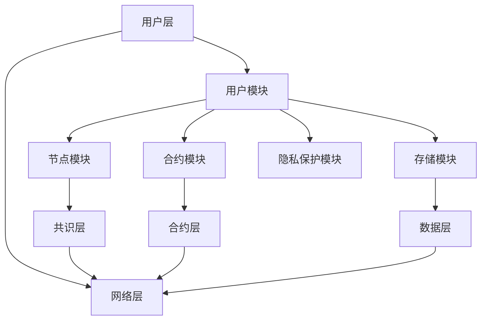

                 

### 引言：区块链与学历认证的碰撞

随着信息技术的飞速发展，数据隐私和安全性成为全球关注的焦点。传统的学历认证体系在应对现代社会日益增长的数据需求和隐私保护要求时，显得力不从心。学历认证是个人教育背景的重要凭证，然而，传统的学历认证流程往往存在诸多问题，如数据易篡改、认证效率低下、信息孤岛等。这不仅影响教育机构的信誉，也使得求职者在求职过程中面临诸多不必要的麻烦。

近年来，区块链技术的出现为解决这些问题提供了新的思路。区块链以其去中心化、不可篡改、透明性等特性，被认为是一种潜在的颠覆性技术。当我们将区块链与学历认证结合时，可以想象到，区块链技术的应用将极大地提升学历认证的透明度、安全性和效率。

本文将深入探讨区块链在学历认证中的创新应用，通过系统化的分析，让读者了解区块链技术如何在学历认证领域发挥作用。我们将从区块链技术概述、学历认证现状与挑战、区块链在学历认证中的核心应用、创新案例、系统设计、法律与伦理问题以及未来趋势等方面进行详细阐述。希望通过这篇文章，能够帮助读者全面了解区块链在学历认证领域的应用前景，为相关领域的研究和实践提供有价值的参考。

### 文章关键词

区块链，学历认证，数据隐私，去中心化，透明性，安全性，技术挑战，创新应用。

### 文章摘要

本文旨在探讨区块链技术在学历认证领域的创新应用。通过分析区块链的核心概念和特性，本文揭示了传统学历认证体系存在的问题，并阐述了区块链如何通过其去中心化、不可篡改和透明性等特性，改进学历认证流程。文章详细介绍了区块链在学历信息存储、验证、加密与隐私保护等方面的应用，通过国内外实际案例展示了区块链技术在学历认证中的实践效果。此外，文章还探讨了区块链学历认证系统的设计要点、法律与伦理问题，并对未来发展趋势进行了展望。希望通过本文的阐述，能够为推动区块链在学历认证领域的应用提供有价值的思路和参考。

## 第1章：区块链技术概述

在深入探讨区块链在学历认证中的创新应用之前，首先需要对区块链技术进行全面的概述。区块链是一种分布式账本技术，它通过去中心化的方式，实现了数据的安全存储和传输。这一技术的核心概念、基本结构、安全性和去中心化特性，为我们理解其在学历认证中的应用奠定了基础。

### 1.1 区块链的核心概念

#### 1.1.1 区块链的起源与发展

区块链最早由中本聪（Satoshi Nakamoto）在2008年提出，作为比特币的底层技术。比特币的初衷是通过去中心化的方式，解决传统金融系统中存在的中心化信任问题。区块链技术的理念在于创建一个无需信任的分布式系统，使得每个参与者都可以验证和记录交易，从而避免了第三方中介的存在。

随着时间的推移，区块链技术逐渐从金融领域扩展到其他领域，如供应链管理、医疗保健、政府服务等。区块链技术的不断发展和创新，使其成为一个具有巨大潜力的技术领域。

#### 1.1.2 区块链的基本结构

区块链由多个“区块”组成，每个区块包含一定数量的交易记录。区块通过加密算法与时间戳进行时间标记，并按照特定的规则链接起来，形成一个不可篡改的链条。以下是区块链的基本结构：

1. **区块**：每个区块包含一组交易记录、一个时间戳、一个随机数（nonce）和一个上一个区块的哈希值。
2. **链**：多个区块按照一定的规则链接在一起，形成一个区块链。
3. **节点**：区块链网络中的每个参与者都被称为一个节点，它们负责验证和传播交易。
4. **共识机制**：节点通过共识机制达成一致，以决定哪些交易应被添加到区块链上。

#### 1.1.3 区块链的安全性与去中心化

区块链技术以其高度的安全性和去中心化特性著称。以下是区块链在安全性和去中心化方面的一些关键特点：

1. **安全性**：区块链通过密码学算法确保数据的完整性和安全性。每个区块的哈希值取决于其包含的数据，任何数据的篡改都会导致哈希值的变化，从而被其他节点检测到。
2. **去中心化**：区块链网络中的节点是分布式的，没有中心化的控制点。每个节点都保存完整的区块链副本，并且参与交易验证。这意味着区块链不受任何单一实体控制，提高了系统的可靠性和抗攻击能力。

通过以上对区块链核心概念的概述，我们可以更好地理解其在学历认证中的应用潜力。区块链的这些特性，使得它成为改进学历认证流程的理想选择。接下来，我们将探讨传统学历认证的现状和存在的问题，为后续章节的内容铺垫。

## 第2章：学历认证的现状与挑战

学历认证是现代社会中一项基本且重要的服务，用于验证个人的教育背景和资质。然而，传统的学历认证体系在应对现代社会日益增长的数据需求和隐私保护要求时，暴露出诸多问题。本节将详细分析传统学历认证体系的流程、存在的问题以及面临的挑战，从而引出区块链技术在这一领域的应用潜力。

### 2.1 学历认证的流程

传统的学历认证流程通常涉及以下几个步骤：

1. **申请与审核**：当个人或机构需要验证他人的学历时，会向教育机构提交申请，教育机构会进行初步审核。
2. **查询与验证**：教育机构通过内部数据库或档案查询系统，验证申请者提供的学历信息。
3. **证书发放**：教育机构向申请者提供认证结果，通常以纸质或电子证书的形式。
4. **使用与监督**：认证结果在求职、升职、留学等场景中被使用，并需要定期监督和更新。

尽管这个流程看似简单，但实际上存在许多复杂性和依赖性。每个教育机构都有自己的认证系统，这些系统往往无法互通，导致信息孤岛现象严重。此外，学历信息的真实性和完整性也难以保证。

### 2.2 存在的问题与挑战

传统学历认证体系在操作过程中面临以下几个主要问题：

1. **数据易篡改**：传统的学历认证体系依赖于中心化的数据库，这些数据库可能存在被篡改的风险。一旦数据被篡改，整个认证体系的可靠性将受到严重威胁。
2. **认证效率低下**：传统认证流程往往需要人工干预，效率低下。特别是在大规模认证需求下，如求职高峰期，认证过程可能需要数天甚至数周的时间。
3. **信息孤岛**：不同教育机构之间的认证系统无法互联互通，导致学历信息无法共享。这不仅增加了认证的复杂性，也降低了认证的效率。
4. **隐私泄露风险**：在传统学历认证体系中，个人学历信息可能被多个机构获取和存储，增加了隐私泄露的风险。一旦发生泄露，个人隐私将面临巨大威胁。
5. **法律法规冲突**：在全球化背景下，不同国家和地区之间的学历认证标准和法规存在差异。如何在全球范围内统一学历认证标准，成为一大挑战。

### 2.3 区块链在学历认证中的潜在应用

面对传统学历认证体系的种种问题，区块链技术提供了新的解决方案。区块链的去中心化特性可以消除信息孤岛，提高认证效率；不可篡改性和安全性可以确保学历信息的真实性和完整性；透明性则使得整个认证过程更加公开透明。以下是一些区块链在学历认证中的潜在应用：

1. **分布式存储**：区块链可以将学历信息存储在分布式网络中，确保数据不被篡改，同时提高访问和查询的效率。
2. **智能合约**：利用智能合约，可以自动执行认证流程，减少人工干预，提高认证的效率和准确性。
3. **隐私保护**：通过加密技术，可以保护学历信息隐私，确保只有授权方能够访问和验证学历信息。
4. **透明性**：区块链上的所有交易都是公开透明的，每个节点都可以验证学历信息的真实性，从而提高认证的公信力。

通过以上分析，我们可以看到，区块链技术在学历认证领域具有巨大的应用潜力。在下一节中，我们将深入探讨区块链在学历认证中的核心应用，详细分析其在学历信息存储、验证、加密与隐私保护等方面的具体实施方法。

## 第2章：学历认证的现状与挑战（续）

### 2.3 区块链在学历认证中的潜在应用（续）

在详细分析了传统学历认证体系存在的问题后，我们可以看到，区块链技术提供了以下几个潜在解决方案：

1. **分布式存储**：
   - **优势**：分布式存储可以将学历信息分布在区块链网络中的各个节点，确保数据不可篡改，同时提高了数据的访问速度和可靠性。
   - **实施方法**：通过区块链的去中心化特性，每个节点都保存一份完整的教育记录，任何节点的数据篡改都会被其他节点检测到，从而保证了数据的真实性和完整性。
   - **案例**：例如，麻省理工学院（MIT）已开始使用区块链技术来存储学生的学历记录，这一举措显著提高了数据的访问效率和安全性。

2. **智能合约**：
   - **优势**：智能合约是一种自动执行的合同，可以显著减少人工干预，提高认证流程的效率和准确性。
   - **实施方法**：在区块链上部署智能合约，可以自动验证学历信息的真伪，并根据预设条件执行相应的认证流程。例如，当求职者提交学历验证请求时，智能合约可以自动验证其学历信息的真实性，并生成认证结果。
   - **案例**：谷歌已与区块链初创公司Noble Bio合作，使用智能合约来简化医疗保健领域的数据共享流程，这一模式同样可以应用于学历认证。

3. **隐私保护**：
   - **优势**：通过加密技术，可以确保学历信息的隐私，只有授权方才能解密和查看具体信息。
   - **实施方法**：在区块链上，可以使用加密算法对学历信息进行加密，从而确保只有持有正确密钥的授权方才能解密和访问具体信息。此外，通过零知识证明等高级加密技术，可以进一步保护个人隐私。
   - **案例**：Blockcerts 是一个基于区块链的数字证书平台，它使用加密技术来保护证书的隐私性，用户只能证明他们拥有特定的证书，而无需公开证书的详细信息。

4. **透明性**：
   - **优势**：区块链上的所有交易都是公开透明的，每个节点都可以验证学历信息的真实性，从而提高了认证过程的公信力。
   - **实施方法**：所有学历信息都记录在区块链上，任何节点都可以访问和验证这些信息，从而确保信息的透明性。此外，区块链的不可篡改特性使得学历信息一旦记录，就不可更改，进一步增强了透明度。
   - **案例**：教育区块链联盟（EdtechXGlobal）推出的OpenEmblema项目，利用区块链技术实现学历信息的透明认证，用户可以随时查看和验证其学历信息。

通过以上分析，我们可以看到区块链技术在学历认证中的多种潜在应用。在接下来的章节中，我们将进一步探讨区块链在学历认证中的核心应用，详细分析其在数据结构设计、数据验证机制、加密与隐私保护等方面的具体实施方法。

### 第3章：区块链在学历认证中的核心应用

在上一章中，我们探讨了区块链技术在学历认证中的潜在应用，并介绍了分布式存储、智能合约、隐私保护和透明性等关键优势。本章将深入探讨区块链在学历认证中的核心应用，具体分析区块链在学历信息存储与验证、加密与隐私保护等方面的技术细节和实施方法。

#### 3.1 基于区块链的学历信息存储与验证

区块链技术通过其分布式账本和去中心化特性，为实现学历信息的可靠存储和验证提供了强有力的支持。以下从数据结构设计、数据验证机制和透明性三个方面进行详细探讨。

##### 3.1.1 数据结构设计

区块链中的数据存储以区块的形式进行组织。每个区块包含一定数量的交易记录，这些交易记录是学历信息的载体。以下是区块链中存储学历信息的基本数据结构：

1. **交易记录**：交易记录是学历信息的具体表现形式，通常包含以下字段：
   - 学历信息：包括毕业院校、专业、学历等级、证书编号等基本信息。
   - 时间戳：记录交易发生的时间，用于确保数据的一致性和顺序。
   - 证明人信息：包括提供学历证明的机构或个人的身份信息。

2. **区块**：区块是交易记录的组织单位，每个区块包含一定数量的交易记录，并具有唯一的哈希值。区块通过哈希值与前一个区块链接，形成区块链。

3. **链**：区块链由多个区块按照特定规则链接而成，每个区块都包含指向前一个区块的哈希值。这种链式结构使得区块链具有不可篡改的特性。

##### 3.1.2 数据验证机制

区块链的验证机制是通过共识算法实现的。以下是区块链中验证学历信息的核心机制：

1. **共识算法**：共识算法是区块链节点之间达成一致的方法。常见的共识算法有工作量证明（PoW）、权益证明（PoS）和委托权益证明（DPoS）等。共识算法确保了区块链的可靠性和安全性，节点通过验证交易的有效性来决定哪些交易应被添加到区块链上。

2. **交易验证**：在区块链中，每个交易都需要经过验证才能被添加到区块链上。验证过程包括以下步骤：
   - **校验签名**：验证交易发起者的数字签名，确保交易的真实性。
   - **检查余额**：检查交易发起者账户中是否有足够的余额来支付交易费用。
   - **验证规则**：根据区块链的规则，验证交易是否符合要求，例如，学历信息必须由认证机构提供。

3. **链式验证**：区块链的链式结构使得每个区块都依赖于前一个区块的哈希值。这种结构确保了区块链的不可篡改性，任何篡改都会导致链式反应，被其他节点检测到。

##### 3.1.3 透明性

区块链的透明性是其核心优势之一。以下是区块链在学历认证中实现透明性的方法：

1. **公开账本**：区块链上的所有交易记录都是公开的，任何节点都可以访问和查看。这确保了学历信息的公开透明，任何人对学历信息的真实性都可以进行验证。

2. **访问控制**：尽管区块链上的信息是公开的，但可以通过访问控制机制来限制对敏感信息的访问。例如，只有拥有特定密钥的用户才能查看具体的学历信息。

3. **智能合约执行**：智能合约可以自动执行学历认证流程，确保认证过程公开透明。智能合约记录了认证的每一步，任何参与者都可以查看和验证。

#### 3.2 学历信息的加密与隐私保护

在区块链上存储学历信息时，隐私保护是必须考虑的一个重要方面。以下是区块链在学历信息加密与隐私保护中的实施方法：

1. **加密算法**：区块链使用加密算法来保护学历信息。常用的加密算法有对称加密和非对称加密。对称加密算法（如AES）可以快速加密和解密数据，而非对称加密算法（如RSA）则用于加密和验证身份。

2. **隐私保护技术**：区块链可以结合零知识证明、同态加密等高级加密技术，实现更高级的隐私保护。零知识证明允许验证者验证某项声明为真，而无需透露任何具体信息；同态加密则允许在加密数据上进行计算，而不需要解密数据。

3. **身份认证**：通过数字签名和身份认证技术，可以确保只有授权的用户才能访问和修改学历信息。这确保了隐私保护的同时，也确保了数据的安全性。

通过以上分析，我们可以看到区块链在学历认证中的核心应用，包括数据结构设计、数据验证机制和加密与隐私保护。区块链技术通过其去中心化、不可篡改和透明性等特性，为学历认证提供了一种全新的解决方案。在下一章中，我们将通过实际案例展示区块链在学历认证中的成功应用，进一步探讨其应用效果和前景。

### 第4章：区块链在学历认证中的创新案例

区块链技术在学历认证领域的创新应用已经取得了显著的进展。在本节中，我们将通过国内外的实际案例，详细展示区块链在学历认证中的成功应用，分析其实施效果，探讨其面临的挑战和未来的发展前景。

#### 4.1 国内区块链学历认证实践

国内一些领先的机构和高校已经积极探索区块链技术在学历认证中的应用，以下是一些典型案例：

##### 4.1.1 阿里云与教育部

阿里云与教育部合作，推出了“学历认证区块链平台”。该平台利用区块链技术，实现了全国学历信息的可信存储和验证。以下是该平台的实施效果：

1. **数据安全性**：通过区块链的分布式存储和加密技术，学历信息的安全性得到了显著提升，数据篡改的可能性几乎为零。

2. **透明性**：学历信息存储在区块链上，任何用户都可以通过平台查看和验证学历信息，提高了认证的透明度。

3. **效率提升**：传统的学历认证流程通常需要数天甚至数周的时间，而区块链平台的认证过程可以在几分钟内完成，大大提高了认证效率。

4. **成本降低**：区块链技术的应用减少了人工干预和审核成本，教育机构和认证机构可以节省大量的时间和资源。

##### 4.1.2 清华大学与深圳大学

清华大学和深圳大学联合推出的“区块链学历认证系统”，通过区块链技术实现了学历信息的去中心化管理和认证。以下是该系统的实施效果：

1. **去中心化管理**：学历信息存储在区块链上，由多个节点共同维护，不再依赖于单一中心化数据库，增强了系统的抗攻击能力和可靠性。

2. **隐私保护**：通过加密技术，学历信息只有授权用户才能查看，保护了个人隐私。

3. **互操作性**：区块链平台实现了不同教育机构之间的学历信息互认，解决了信息孤岛问题，提高了认证效率。

4. **公信力提升**：区块链上的所有交易都是公开透明的，任何用户都可以验证学历信息的真实性，从而提高了认证的公信力。

#### 4.2 国际区块链学历认证项目

国外也有一些成功的区块链学历认证项目，以下介绍几个具有代表性的项目：

##### 4.2.1 全球教育区块链联盟（EdTechXGlobal）

全球教育区块链联盟是一个由多家教育机构和科技公司组成的联盟，致力于推动区块链技术在教育领域的应用。以下是其一个重要项目——“OpenEmblema”的实施效果：

1. **全球互认**：OpenEmblema项目实现了全球范围内的学历信息互认，学生和毕业生可以在全球范围内自由流动，并获得其他国家的学历认证。

2. **透明性**：学历信息存储在区块链上，所有交易都是公开透明的，任何用户都可以查看和验证。

3. **隐私保护**：通过零知识证明等技术，保护了个人隐私，只有授权用户才能查看具体的学历信息。

4. **效率提升**：传统学历认证流程通常需要数天甚至数周的时间，而区块链平台的认证过程可以在几分钟内完成，大大提高了认证效率。

##### 4.2.2 Blockcerts

Blockcerts 是一个基于区块链的数字证书平台，由LongHash公司开发。以下是其主要特点：

1. **可扩展性**：Blockcerts 适用于各种类型的证书，包括学历证书、职业资格证书等，具有很高的可扩展性。

2. **隐私保护**：通过加密技术，证书的隐私性得到了保护，只有持有正确密钥的用户才能查看证书的具体内容。

3. **透明性**：证书的生成和验证过程都在区块链上记录，任何用户都可以查看和验证证书的真实性。

4. **互操作性**：Blockcerts 支持多种区块链平台，可以实现不同平台之间的证书互认。

#### 4.3 实施效果分析

通过以上国内外案例，我们可以看到区块链技术在学历认证中的巨大潜力。以下是区块链学历认证项目实施效果的总结：

1. **安全性提升**：区块链技术通过分布式存储和加密技术，显著提高了学历信息的安全性，数据篡改的可能性几乎为零。

2. **透明性增强**：区块链上的所有交易都是公开透明的，任何用户都可以查看和验证学历信息的真实性，提高了认证的公信力。

3. **效率提升**：区块链平台的认证过程通常可以在几分钟内完成，大大提高了认证效率，降低了人工成本。

4. **隐私保护**：通过加密和零知识证明等技术，个人隐私得到了有效保护，只有授权用户才能查看具体的学历信息。

5. **互操作性**：区块链技术实现了不同教育机构之间的学历信息互认，解决了信息孤岛问题，提高了认证效率。

#### 4.4 面临的挑战与未来展望

尽管区块链在学历认证中展现了巨大的潜力，但在实际应用中仍面临一些挑战：

1. **技术成熟度**：区块链技术尚处于发展初期，其性能和稳定性有待提升。特别是在大规模应用场景下，区块链的扩展性和效率仍需改进。

2. **法律法规**：不同国家和地区的法律法规对区块链技术的应用存在差异，如何在全球范围内统一法律法规，仍需深入研究。

3. **隐私保护**：尽管区块链技术在隐私保护方面具有优势，但在实际应用中，如何实现高效的隐私保护，仍需进一步探索。

4. **用户接受度**：区块链技术的普及程度不高，用户对其认知和接受度有限。如何提高用户对区块链学历认证的信任度和接受度，是未来需要解决的一个问题。

尽管存在挑战，但区块链在学历认证中的创新应用具有广阔的前景。随着技术的不断成熟和法规的完善，相信区块链技术将在学历认证领域发挥越来越重要的作用。通过结合区块链技术，我们可以构建一个更加安全、透明、高效的学历认证体系，为个人和社会创造更大的价值。

### 第5章：区块链学历认证系统的设计

在上一章中，我们探讨了区块链在学历认证中的实际案例及其实施效果。本章将深入分析区块链学历认证系统的设计，从系统架构、接口设计、数据安全与隐私保护等方面展开，为构建一个高效、安全的区块链学历认证系统提供技术指导。

#### 5.1 系统架构设计

区块链学历认证系统的架构设计是确保系统高效运行和安全性的关键。以下是一个典型的区块链学历认证系统的架构设计：

1. **用户层**：用户层是系统的最外层，包括个人用户和教育机构用户。用户可以通过用户界面进行学历信息的查询、验证和提交。

2. **网络层**：网络层负责区块链节点的通信和管理。节点可以通过P2P网络相互通信，实现区块链的分布式存储和验证功能。

3. **共识层**：共识层负责确保区块链网络中的节点达成一致。常用的共识算法有工作量证明（PoW）、权益证明（PoS）等，用于验证和确认交易的合法性。

4. **存储层**：存储层负责区块链数据的存储和管理。每个区块包含一定数量的交易记录，这些交易记录是学历信息的载体。

5. **合约层**：合约层是区块链上的智能合约，用于自动执行学历认证流程。智能合约可以定义学历信息的验证规则、认证流程等。

6. **数据层**：数据层负责存储和管理学历信息。学历信息通过加密算法进行保护，确保隐私和安全。

#### 5.1.1 功能模块划分

根据系统架构设计，区块链学历认证系统可以分为以下几个主要功能模块：

1. **用户模块**：包括用户注册、登录、查询、验证和提交学历信息等功能。

2. **节点模块**：包括节点注册、节点通信、数据同步和共识算法等。

3. **合约模块**：包括智能合约的编写、部署和执行，定义学历认证的规则和流程。

4. **存储模块**：包括区块链数据的存储和管理，保证数据的完整性和安全性。

5. **隐私保护模块**：包括加密算法的选择和应用，实现学历信息的隐私保护。

#### 5.1.2 系统架构图

以下是一个区块链学历认证系统的架构图，展示各功能模块及其相互关系：

通过系统架构图，我们可以清晰地看到区块链学历认证系统的整体设计，以及各个功能模块之间的关系。

#### 5.2 接口设计与实现

接口设计是区块链学历认证系统与用户、节点、合约等模块进行交互的桥梁。以下是一个典型的接口设计：

1. **用户接口**：用户接口用于用户与系统进行交互。主要接口包括：
   - 登录接口：用户输入用户名和密码进行登录。
   - 注册接口：用户创建新账户，填写基本信息。
   - 查询接口：用户查询自己的学历信息。
   - 提交接口：用户提交学历信息到区块链。

2. **节点接口**：节点接口用于节点之间的通信和数据同步。主要接口包括：
   - 注册接口：节点加入区块链网络。
   - 通信接口：节点之间进行数据传输。
   - 同步接口：节点同步区块链数据。

3. **合约接口**：合约接口用于智能合约的编写、部署和执行。主要接口包括：
   - 编写接口：开发者编写智能合约代码。
   - 部署接口：将智能合约部署到区块链上。
   - 执行接口：智能合约执行学历认证流程。

4. **存储接口**：存储接口用于区块链数据的存储和管理。主要接口包括：
   - 写入接口：将学历信息写入区块链。
   - 读取接口：从区块链中读取学历信息。
   - 更新接口：更新区块链上的学历信息。

5. **隐私保护接口**：隐私保护接口用于实现学历信息的加密和隐私保护。主要接口包括：
   - 加密接口：对学历信息进行加密。
   - 解密接口：对学历信息进行解密。
   - 零知识证明接口：实现隐私保护的零知识证明。

#### 5.3 数据安全与隐私保护

数据安全与隐私保护是区块链学历认证系统的核心要求。以下是一些关键措施：

1. **加密技术**：使用对称加密和非对称加密技术对学历信息进行加密。对称加密用于数据传输，非对称加密用于身份验证和密钥交换。

2. **权限管理**：通过权限管理机制，确保只有授权用户才能访问和修改学历信息。权限管理包括用户认证、角色分配和权限控制等。

3. **隐私保护协议**：采用隐私保护协议，如同态加密和零知识证明，实现高效的隐私保护。同态加密允许在加密数据上进行计算，而零知识证明可以验证某项声明为真，而不透露具体信息。

4. **数据备份与恢复**：定期进行数据备份，确保数据不会因系统故障或恶意攻击而丢失。同时，建立数据恢复机制，确保在数据丢失后能够快速恢复。

通过以上系统架构设计、接口设计和数据安全与隐私保护措施，我们可以构建一个高效、安全、可靠的区块链学历认证系统。在下一章中，我们将探讨区块链学历认证系统中可能面临的法律与伦理问题，以及如何应对这些挑战。

### 第6章：区块链学历认证的法律与伦理问题

随着区块链技术在学历认证领域的广泛应用，法律与伦理问题逐渐成为关注的焦点。区块链技术的特性，如去中心化、不可篡改和透明性，虽然为学历认证带来了许多优势，但也引发了一系列的法律与伦理问题。本章节将深入探讨这些挑战，并提出相应的解决方案。

#### 6.1 法律法规的挑战

区块链学历认证的法律挑战主要集中在以下几个方面：

1. **隐私保护**：虽然区块链技术提供了强大的隐私保护功能，但如何确保个人隐私在公开透明的区块链上得到有效保护，仍是一个亟待解决的问题。当前，数据隐私保护法规如《欧盟通用数据保护条例》（GDPR）和《中华人民共和国个人信息保护法》等，对于个人信息的处理和使用有着严格的要求，如何平衡隐私保护与信息透明性，成为立法者和实施者需要解决的问题。

2. **数据存储与管理**：区块链上的数据存储与管理如何符合现有的法律法规，特别是在不同国家和地区的法律环境下，如何确保数据的合规性。例如，不同国家对于数据本地化的要求不同，如何在区块链上实现数据存储的合规化，是需要解决的一个重要问题。

3. **法律纠纷**：在区块链学历认证中，一旦发生法律纠纷，如何通过法律手段解决？区块链上的交易记录是不可篡改的，但如何保证法律判决的执行，以及如何界定法律责任的归属，都是需要探讨的问题。

#### 6.1.1 区块链学历认证的法律框架

为了应对上述挑战，各国和地区需要制定相应的法律法规，为区块链学历认证提供法律框架。以下是一些建议：

1. **隐私保护法规**：制定专门针对区块链隐私保护的法律法规，明确数据收集、存储、处理和分享的规范，确保个人隐私得到有效保护。

2. **数据合规法规**：明确区块链学历认证数据在不同国家和地区存储和传输的合规要求，确保数据符合不同地区的法律和法规。

3. **法律纠纷解决机制**：建立完善的区块链法律纠纷解决机制，包括仲裁、调解和诉讼等，确保区块链学历认证中的法律纠纷能够得到公正、高效的解决。

#### 6.2 伦理问题与应对措施

除了法律挑战，区块链学历认证也面临一系列伦理问题，如数据隐私、数据真实性和公平性等。

1. **数据隐私**：区块链技术虽然提供了强大的隐私保护功能，但在实际应用中，如何确保个人隐私在公开透明的区块链上得到有效保护，仍是一个挑战。应对措施包括：
   - **零知识证明**：利用零知识证明等高级加密技术，确保个人隐私在验证过程中不被泄露。
   - **访问控制**：通过访问控制机制，确保只有授权用户才能访问和查看个人隐私信息。

2. **数据真实性**：区块链上的数据一旦记录，就难以篡改，但如何确保数据的初始真实性，是一个重要问题。应对措施包括：
   - **认证机构审核**：在数据上传前，由权威认证机构进行审核，确保数据的真实性。
   - **区块链审计**：定期进行区块链审计，确保数据的完整性和准确性。

3. **公平性**：区块链学历认证系统需要确保所有用户都能公平地使用该系统，避免因技术或资源的不平等导致的不公平现象。应对措施包括：
   - **技术普及**：通过教育和培训，提高用户对区块链技术的认知，确保所有用户都能公平地使用该系统。
   - **资源均衡**：确保区块链网络中的资源分配公平，避免因资源分配不均导致某些用户无法公平地享受区块链学历认证服务。

通过上述法律和伦理问题的探讨及应对措施的提出，我们可以看到，虽然区块链学历认证面临诸多挑战，但通过合理制定法律法规和采取有效的伦理措施，可以确保其在学历认证领域的健康、可持续发展。在下一章中，我们将展望区块链学历认证的未来发展趋势，探讨技术进步和行业应用带来的机遇与挑战。

### 第7章：区块链学历认证的展望与未来趋势

随着区块链技术的不断成熟，其在学历认证领域的应用前景也越来越广阔。本章将探讨区块链学历认证的发展趋势、技术进步带来的机遇以及可能面临的挑战，为未来区块链学历认证的实践提供有价值的参考。

#### 7.1 发展趋势分析

区块链学历认证的发展趋势可以从以下几个方面进行分析：

1. **技术进步**：随着区块链技术的不断迭代，其性能和安全性不断提升。例如，二层扩展技术、状态通道、分片等技术，可以显著提高区块链的处理能力和交易速度，满足大规模学历认证需求。

2. **普及程度提高**：随着区块链技术的普及，越来越多的教育机构和认证机构开始接受并采用区块链技术进行学历认证。预计未来几年，区块链学历认证将得到更广泛的应用。

3. **法律和法规完善**：随着各国和地区对区块链技术的重视，相关的法律和法规将逐步完善，为区块链学历认证提供明确的法律框架，确保其合法、合规运行。

4. **跨行业合作**：区块链学历认证不仅仅是教育领域的应用，还将与其他行业，如人力资源、招聘等领域进行深度融合，实现跨行业的数据共享和认证。

#### 7.1.1 技术进步带来的机遇

技术进步为区块链学历认证带来了诸多机遇：

1. **数据安全性提升**：随着加密技术和共识算法的进步，区块链学历认证的数据安全性将得到进一步提升，确保学历信息的真实性和完整性。

2. **效率提高**：通过二层扩展技术和状态通道等技术，区块链学历认证的处理能力将显著提升，实现更快、更高效的学历认证服务。

3. **隐私保护**：随着零知识证明、同态加密等技术的应用，区块链学历认证将实现更高水平的隐私保护，确保个人隐私在公开透明的区块链上得到有效保护。

4. **可信协作**：区块链技术可以实现跨机构、跨地域的可信协作，打破信息孤岛，实现学历信息的全球互认和共享。

#### 7.1.2 行业应用场景拓展

区块链学历认证的应用场景将不断拓展，包括但不限于以下几个方面：

1. **终身学习认证**：随着终身学习理念的普及，区块链学历认证可以用于记录和验证个人的学习历程，包括在线课程、职业培训等，为求职者和招聘者提供更全面的教育背景信息。

2. **国际教育互认**：区块链学历认证可以打破国际教育互认的壁垒，实现全球范围内的学历信息互认，促进国际教育交流与合作。

3. **人力资源招聘**：区块链学历认证可以为招聘机构提供可靠、透明的学历验证服务，提高招聘效率和准确性，减少招聘过程中的欺诈和误判。

4. **政府公共服务**：区块链学历认证可以应用于政府公共服务，如公务员录用、福利待遇审核等，提高政府公共服务的效率和公信力。

#### 7.2 可能面临的挑战与对策

尽管区块链学历认证前景广阔，但仍然面临一些挑战：

1. **技术成熟度**：区块链技术尚处于发展初期，其性能和稳定性有待提升。特别是在大规模应用场景下，区块链的扩展性和效率仍需改进。

2. **法律法规**：不同国家和地区的法律法规对区块链技术的应用存在差异，如何在全球范围内统一法律法规，仍需深入研究。

3. **隐私保护**：如何实现高效的隐私保护，仍是一个重要问题。特别是在学历认证中，如何平衡隐私保护和信息透明性，是一个需要解决的关键问题。

4. **用户接受度**：区块链技术的普及程度不高，用户对其认知和接受度有限。如何提高用户对区块链学历认证的信任度和接受度，是未来需要解决的一个问题。

针对上述挑战，以下是一些可能的对策：

1. **技术优化**：持续优化区块链技术，提升其性能和稳定性，特别是针对大规模应用场景，探索更高效、更安全的区块链解决方案。

2. **法律规范**：制定统一的区块链法律法规，为区块链学历认证提供明确的法律框架，确保其合法、合规运行。

3. **隐私保护**：结合先进的加密技术和隐私保护协议，实现高效的隐私保护，同时确保信息的透明性和可追溯性。

4. **用户教育**：通过教育和宣传，提高用户对区块链技术的认知和接受度，增强用户对区块链学历认证的信任。

通过以上分析，我们可以看到，区块链学历认证在未来具有广阔的发展前景。随着技术的不断进步和法律法规的完善，区块链学历认证将逐步实现其潜力，为个人和社会带来更大的价值。在探索区块链学历认证的过程中，需要充分考虑技术、法律、伦理等多方面的因素，确保其健康、可持续发展。

### 总结与展望

通过本文的探讨，我们深入了解了区块链技术在学历认证领域的创新应用。从区块链技术的核心概念、学历认证的现状与挑战，到区块链在学历认证中的核心应用、实际案例展示以及系统设计，再到法律与伦理问题的探讨，以及未来的发展趋势，我们全面剖析了区块链在学历认证中的巨大潜力。

区块链技术以其去中心化、不可篡改和透明性等特性，为学历认证提供了全新的解决方案。通过分布式存储、智能合约、加密与隐私保护等技术，区块链大幅提升了学历信息的真实性和安全性，提高了认证的效率和透明度。国内外多个实际案例的成功实践，进一步验证了区块链技术在学历认证中的可行性。

然而，区块链学历认证的发展也面临一些挑战，如技术成熟度、法律法规和隐私保护等。针对这些问题，我们需要持续优化技术，完善法律规范，加强用户教育，确保区块链学历认证的健康、可持续发展。

展望未来，区块链学历认证将不断创新，应用场景将不断拓展。随着技术的不断进步和法律法规的完善，区块链学历认证有望实现更高效、更安全、更透明的发展。我们期待区块链技术为学历认证领域带来更多创新，为个人和社会创造更大的价值。

### 最佳实践 Tips

1. **选择合适的区块链平台**：根据具体需求，选择适合的区块链平台，如以太坊、Hyperledger Fabric等，确保系统的性能和安全性。

2. **确保数据加密**：在存储和传输学历信息时，采用强加密算法，确保数据的隐私和安全。

3. **定期审计**：定期对区块链学历认证系统进行审计，确保数据的完整性和准确性。

4. **用户教育**：加强对用户的教育和培训，提高用户对区块链学历认证的认知和信任度。

### 注意事项

1. **法律法规**：在实施区块链学历认证时，需遵循所在国家和地区的法律法规，确保系统的合法合规。

2. **隐私保护**：在保护用户隐私的同时，确保信息的透明性和可追溯性，避免隐私泄露。

3. **系统性能**：确保区块链学历认证系统的性能和稳定性，特别是在大规模数据应用场景下，避免系统过载。

### 拓展阅读

1. **《区块链技术指南》**：深入了解区块链技术的核心概念、架构和实现。
2. **《智能合约设计与开发》**：学习智能合约的设计与开发，掌握在学历认证中的应用。
3. **《数据隐私保护技术》**：了解各种数据隐私保护技术，为区块链学历认证提供安全保障。

作者：AI天才研究院/AI Genius Institute & 禅与计算机程序设计艺术 /Zen And The Art of Computer Programming

