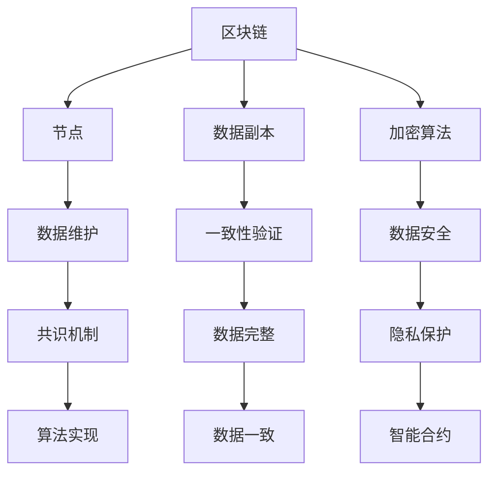
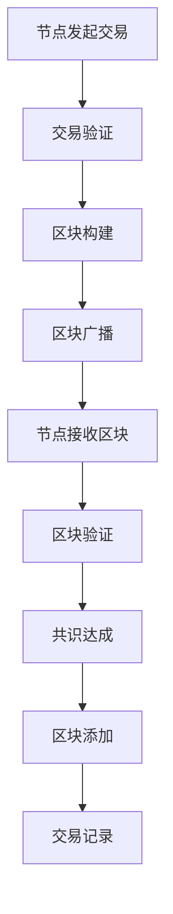
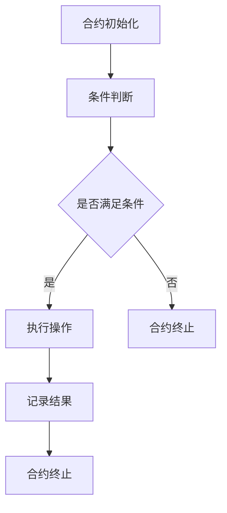
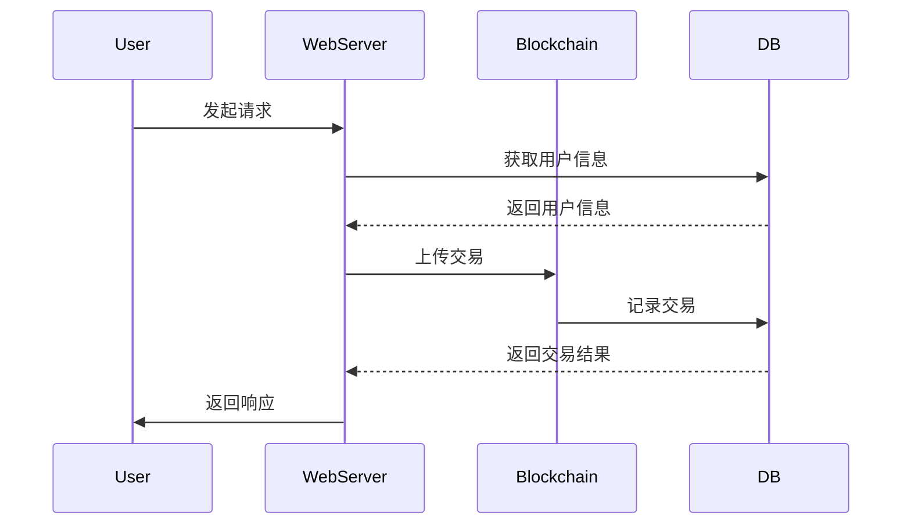

                 

# 《区块链在数字内容付费阅读中的应用》

## 关键词
区块链、数字内容付费阅读、版权保护、用户隐私、支付与结算、案例分析

## 摘要
本文旨在探讨区块链在数字内容付费阅读中的应用，从基础原理到实际案例，逐步分析区块链如何解决数字内容付费阅读中的版权保护、用户隐私保护以及支付与结算等问题。通过对区块链技术的深入理解和具体案例的剖析，本文为区块链在数字内容付费阅读领域的应用提供了有价值的参考。

## 引言
### 区块链与数字内容付费阅读的相遇
区块链技术的出现，为解决数字内容付费阅读中存在的诸多问题提供了新的思路。数字内容付费阅读是指通过互联网平台，用户付费后获取电子书籍、文章、视频等数字内容的过程。然而，在当前环境下，数字内容付费阅读面临版权保护、用户隐私保护以及支付与结算等问题。

### 区块链的优势
区块链技术具有去中心化、不可篡改、透明化等特点，使得其在数字内容付费阅读中具有独特的优势。首先，区块链可以确保内容的版权归属，防止内容被非法复制和传播；其次，区块链可以保护用户的隐私，确保用户的支付信息不会被泄露；最后，区块链可以提供安全、高效的支付与结算方式。

## 第1章 区块链基础

### 1.1 区块链概述

#### 1.1.1 区块链的定义
区块链是一种分布式数据库技术，通过密码学确保数据的完整性和安全性。区块链中的数据存储在多个节点上，每个节点都保存了一份完整的数据副本。这些数据按照时间顺序排列，形成了一个链式结构，称为区块链。

#### 1.1.2 区块链的核心原理
区块链的核心原理包括去中心化、共识机制、加密技术和智能合约。

- **去中心化**：区块链通过多个节点共同维护数据，没有中央控制机构，使得系统更加可靠和去中心化。
- **共识机制**：区块链通过共识机制确保所有节点的数据一致性。常见的共识机制包括工作量证明、权益证明等。
- **加密技术**：区块链使用加密技术保护数据的安全和隐私。
- **智能合约**：智能合约是区块链上自动执行合同条款的计算机程序。

#### 1.1.3 区块链的发展历程
区块链技术起源于2008年比特币的诞生。随着比特币的成功，区块链技术逐渐引起了广泛关注。2014年后，区块链技术开始逐步应用到其他领域，如数字内容付费阅读。

### 1.2 区块链技术核心概念

#### 1.2.1 区块
区块链中的数据存储在区块中。每个区块包含一定数量的交易记录，以及一个时间戳、随机数和前一个区块的哈希值。区块通过哈希函数与前一个区块链接，形成一个链式结构。

#### 1.2.2 交易
交易是区块链中的数据交换过程。交易记录了数字内容的版权归属、用户身份、支付金额等信息。

#### 1.2.3 共识机制
共识机制是区块链中确保数据一致性的机制。不同的区块链采用不同的共识机制，如比特币采用工作量证明机制，以太坊采用权益证明机制。

#### 1.2.4 智能合约
智能合约是区块链上自动执行合同条款的计算机程序。智能合约使得区块链能够自动执行合同，降低了交易成本，提高了交易效率。

### 1.3 区块链架构

#### 1.3.1 区块链网络架构
区块链网络由多个节点组成，每个节点都保存了一份完整的数据副本。节点之间通过共识机制和加密技术进行通信和协作。

#### 1.3.2 节点类型
区块链网络中的节点分为两种：全节点和轻节点。全节点保存了完整的数据副本，可以参与区块链的共识过程。轻节点只保存了部分数据，通过其他全节点获取所需数据。

## 第2章 数字内容付费阅读现状

### 2.1 数字内容付费阅读概述

#### 2.1.1 数字内容付费阅读的定义
数字内容付费阅读是指用户通过互联网平台，付费获取电子书籍、文章、视频等数字内容的过程。

#### 2.1.2 数字内容付费阅读的发展趋势
随着互联网的普及和数字内容的丰富，数字内容付费阅读逐渐成为主流。根据市场研究，全球数字内容付费阅读市场规模持续增长，预计未来几年将保持高速增长。

### 2.2 数字内容付费阅读面临的挑战

#### 2.2.1 版权问题
数字内容付费阅读中，版权问题是一个重要挑战。数字内容容易被复制和传播，导致版权方遭受损失。

#### 2.2.2 用户隐私保护
数字内容付费阅读涉及到用户的支付信息和阅读行为，用户隐私保护成为一个重要问题。用户的隐私信息容易被泄露，导致用户隐私受到侵犯。

#### 2.2.3 支付与结算
数字内容付费阅读中的支付与结算过程较为复杂，涉及到多个环节，如支付通道、结算方式、汇率转换等。

## 第3章 区块链在数字内容付费阅读中的应用

### 3.1 区块链在版权保护中的应用

#### 3.1.1 区块链如何解决版权问题
区块链技术可以确保数字内容的版权归属。首先，创作者可以将数字内容上传到区块链上，并获得一个独一无二的哈希值。其次，创作者可以在区块链上创建一个智能合约，记录数字内容的版权信息，如创作者、发布时间、版权期限等。最后，任何使用数字内容的行为都可以在区块链上进行记录，确保版权归属清晰。

#### 3.1.2 实例分析
以一个电子书平台为例，创作者可以将电子书上传到平台，并获得一个独一无二的哈希值。平台在销售电子书时，会将销售记录存储在区块链上。如果发生版权纠纷，可以通过区块链上的记录来证明数字内容的版权归属。

### 3.2 区块链在用户隐私保护中的应用

#### 3.2.1 区块链如何保护用户隐私
区块链技术可以保护用户的隐私。首先，区块链使用加密技术保护数据的安全和隐私。其次，区块链的去中心化特性使得用户隐私信息不会集中在一个地方，降低了隐私泄露的风险。

#### 3.2.2 实例分析
以一个数字内容付费阅读平台为例，用户在注册时，可以使用匿名身份，平台只存储用户的公钥。当用户购买数字内容时，平台使用用户的公钥加密支付信息，确保支付信息的安全。同时，平台在区块链上记录销售记录，确保销售记录的真实性和不可篡改性。

### 3.3 区块链在支付与结算中的应用

#### 3.3.1 区块链支付的优势
区块链支付具有以下优势：首先，区块链支付的去中心化特性降低了交易成本；其次，区块链支付的高效性使得支付与结算过程更加快速；最后，区块链支付的透明性使得支付过程更加公正和透明。

#### 3.3.2 实例分析
以一个跨境数字内容付费阅读平台为例，用户在购买数字内容时，可以使用任意一种加密货币进行支付。平台将支付信息存储在区块链上，确保支付信息的安全和不可篡改性。同时，平台可以自动将加密货币转换为当地货币，实现跨境支付。

## 第4章 案例分析

### 4.1 案例一：XXX平台区块链应用

#### 4.1.1 案例背景
XXX平台是一个数字内容付费阅读平台，提供电子书籍、文章、视频等多种数字内容。随着用户数量的增加，平台在版权保护、用户隐私保护和支付与结算方面面临巨大挑战。

#### 4.1.2 案例应用
XXX平台采用区块链技术解决版权保护、用户隐私保护和支付与结算问题。首先，平台使用区块链确保数字内容的版权归属。其次，平台使用加密技术保护用户的隐私。最后，平台使用区块链支付实现高效、安全的支付与结算。

#### 4.1.3 案例效果
通过区块链技术的应用，XXX平台成功解决了版权保护、用户隐私保护和支付与结算问题。平台用户数量和销售额持续增长，取得了显著的效果。

### 4.2 案例二：XXX出版社区块链应用

#### 4.2.1 案例背景
XXX出版社区块链是一个基于区块链的数字内容付费阅读平台，提供电子书籍、文章等多种数字内容。出版社区块链旨在解决传统出版社区存在的版权问题、用户隐私保护和支付与结算问题。

#### 4.2.2 案例应用
出版社区块链使用区块链技术确保数字内容的版权归属。同时，社区块链使用加密技术保护用户的隐私。在支付与结算方面，出版社区块链采用去中心化的支付方式，实现高效、安全的支付与结算。

#### 4.2.3 案例效果
出版社区块链成功解决了版权问题、用户隐私保护和支付与结算问题。社区用户数量和销售额持续增长，取得了显著的效果。

## 结论

### 主要观点总结
本文通过深入分析区块链在数字内容付费阅读中的应用，总结了区块链在版权保护、用户隐私保护和支付与结算等方面的优势。同时，通过具体案例的剖析，展示了区块链技术在实际应用中的效果。

### 未来发展趋势展望
随着区块链技术的不断发展，未来数字内容付费阅读将更加依赖于区块链技术。区块链将为数字内容付费阅读提供更加安全、高效、透明的解决方案，推动整个行业的变革。

## 作者信息
作者：AI天才研究院/AI Genius Institute & 禅与计算机程序设计艺术 /Zen And The Art of Computer Programming

----------------------------------------------------------------

## 附加内容

### 背景介绍
区块链技术在数字内容付费阅读中的应用，为解决版权保护、用户隐私保护和支付与结算等问题提供了新的思路。然而，在实际应用中，区块链技术仍面临一些挑战，如性能、可扩展性、安全性等。本文旨在探讨区块链技术在数字内容付费阅读中的应用，分析其优势和挑战，为实际应用提供参考。

### 核心概念与联系
区块链技术的核心概念包括去中心化、共识机制、加密技术和智能合约。这些概念相互联系，共同构成了区块链技术的核心架构。

#### 去中心化
去中心化是区块链技术的核心特点。与传统的中心化系统不同，区块链技术通过多个节点共同维护数据，没有中央控制机构。这种去中心化结构使得区块链系统更加可靠和去中心化。

#### 共识机制
共识机制是区块链中确保数据一致性的机制。不同的区块链采用不同的共识机制，如比特币采用工作量证明机制，以太坊采用权益证明机制。共识机制的核心目标是确保所有节点对数据的共识，从而保证数据的完整性和一致性。

#### 加密技术
加密技术是区块链技术的重要组成部分。区块链使用加密技术保护数据的安全和隐私。加密技术包括哈希函数、数字签名、非对称加密等。这些加密技术共同构成了区块链的安全体系。

#### 智能合约
智能合约是区块链上自动执行合同条款的计算机程序。智能合约使得区块链能够自动执行合同，降低了交易成本，提高了交易效率。智能合约的核心原理是基于编程逻辑，当满足特定条件时，自动执行相应的操作。

### 概念属性特征对比表格

| 特征       | 去中心化 | 共识机制 | 加密技术 | 智能合约 |
| ---------- | ---------- | ---------- | ---------- | ---------- |
| 目的       | 确保系统的可靠性 | 确保数据一致性 | 保护数据安全 | 自动执行合同 |
| 技术实现   | 多节点维护数据 | 工作量证明、权益证明等 | 哈希函数、数字签名、非对称加密 | 编程逻辑 |
| 关键要素   | 节点、数据副本、加密算法 | 算法、时间戳、哈希值 | 加密算法、加密协议 | 编程语言、逻辑条件 |

### ER实体关系图架构
以下是一个简化的ER实体关系图，展示了区块链技术中的关键实体及其关系：



### 算法原理讲解
区块链技术中的核心算法包括共识算法、加密算法和智能合约算法。以下是一个简化的共识算法流程图，使用Mermaid语法表示：



#### 区块链共识算法原理
1. **节点发起交易**：交易是区块链中的基本数据单元，表示数字内容的版权信息、用户身份、支付金额等。
2. **交易验证**：节点对交易进行验证，确保交易的有效性和合法性。
3. **区块构建**：多个交易组合成一个区块，并附加一个时间戳和一个随机数。
4. **区块广播**：将区块广播给其他节点，以便其他节点验证区块。
5. **节点接收区块**：节点接收到区块后，对其进行验证。
6. **区块验证**：节点验证区块中的交易是否有效，以及区块是否符合区块链的规则。
7. **共识达成**：当所有节点达成共识，认为区块有效时，将区块添加到区块链中。
8. **交易记录**：将交易记录在区块链上，确保交易的可追溯性和不可篡改性。

#### 智能合约算法原理
智能合约是区块链上的计算机程序，用于自动执行合同条款。以下是一个简化的智能合约执行流程图，使用Mermaid语法表示：



#### 智能合约执行原理
1. **合约初始化**：智能合约在区块链上初始化，设置执行条件和操作。
2. **条件判断**：智能合约根据输入参数判断是否满足执行条件。
3. **执行操作**：当满足条件时，智能合约自动执行预定义的操作。
4. **记录结果**：智能合约将执行结果记录在区块链上，确保结果的可追溯性和不可篡改性。
5. **合约终止**：当操作执行完毕后，智能合约终止。

### 数学公式
区块链技术中的算法和协议通常涉及到数学公式。以下是一些常用的数学公式，使用LaTeX格式表示：

#### 区块链哈希函数
$$H = SHA256(M)$$

其中，$H$ 表示哈希值，$SHA256$ 表示SHA256哈希函数，$M$ 表示输入数据。

#### 工作量证明
$$PoW = Difficulty \times HashRate$$

其中，$PoW$ 表示工作量证明，$Difficulty$ 表示难度，$HashRate$ 表示哈希率。

#### 智能合约执行条件
$$Condition = Input \space matches \space pattern$$

其中，$Condition$ 表示执行条件，$Input$ 表示输入参数，$pattern$ 表示预期模式。

### 系统分析与架构设计方案

#### 问题场景介绍
数字内容付费阅读平台面临版权保护、用户隐私保护和支付与结算等问题。为了解决这些问题，平台采用区块链技术进行系统架构设计。

#### 项目介绍
项目名为“区块链数字内容付费阅读平台”，旨在为用户提供安全、高效、透明的数字内容付费阅读服务。平台包括电子书籍、文章、视频等多种数字内容，支持多种支付方式，如加密货币和法定货币。

#### 系统功能设计（领域模型Mermaid类图）

```mermaid
classDiagram
ClassDef User
  +String username
  +String password
  +String email
  +List<Order>
  
ClassDef Content
  +String title
  +String author
  +String content
  +List<Permission>
  
ClassDef Order
  +Integer id
  +User buyer
  +Content content
  +Date purchaseDate
  +String paymentMethod
  +BigDecimal amount
  
ClassDef Permission
  +String type
  +User owner
  +Content content
  +Date expirationDate
  
User "用户" -->|购买| Order "订单"
Content "内容" -->|授权| Permission "权限"
Order "订单" -->|包含| Content "内容"
Permission "权限" -->|属于| Content "内容"
```

#### 系统架构设计（Mermaid架构图）

```mermaid
graph TB
subgraph 数据层
  DB[数据库]

subgraph 应用层
  UserManagement[用户管理模块]
  ContentManagement[内容管理模块]
  OrderManagement[订单管理模块]
  PaymentManagement[支付管理模块]

subgraph 网络层
  WebServer[Web服务器]
  Blockchain[区块链网络]

subgraph 接口层
  API[API接口]

WebServer -->|请求| UserManagement
WebServer -->|请求| ContentManagement
WebServer -->|请求| OrderManagement
WebServer -->|请求| PaymentManagement
WebServer -->|请求| API

Blockchain --> UserManagement
Blockchain --> ContentManagement
Blockchain --> OrderManagement
Blockchain --> PaymentManagement

DB --> UserManagement
DB --> ContentManagement
DB --> OrderManagement
DB --> PaymentManagement
```

#### 系统接口设计和系统交互（Mermaid序列图）



### 项目实战

#### 环境安装
1. 安装Node.js：Node.js是一个用于运行JavaScript的运行时环境，是开发区块链应用的关键工具。您可以在Node.js官网下载并安装。
2. 安装Ganache：Ganache是一个本地以太坊节点，用于模拟区块链网络。您可以在Ganache官网下载并安装。
3. 安装Truffle：Truffle是一个用于以太坊开发的框架，提供了智能合约的部署、测试和迁移功能。您可以在Truffle官网下载并安装。

#### 系统核心实现源代码

以下是一个简单的智能合约，用于管理用户和数字内容的权限：

```solidity
// SPDX-License-Identifier: MIT
pragma solidity ^0.8.0;

contract ContentManagement {
    struct User {
        address id;
        string username;
        string email;
    }

    struct Content {
        uint256 id;
        string title;
        string author;
        mapping(address => bool) permissions;
    }

    mapping(uint256 => User) public users;
    mapping(uint256 => Content) public contents;

    function createUser(
        uint256 _id,
        string memory _username,
        string memory _email
    ) public {
        users[_id] = User(_id, _username, _email);
    }

    function createContent(
        uint256 _id,
        string memory _title,
        string memory _author
    ) public {
        contents[_id] = Content(_id, _title, _author);
    }

    function grantPermission(
        uint256 _contentId,
        address _userId
    ) public {
        contents[_contentId].permissions[_userId] = true;
    }

    function revokePermission(
        uint256 _contentId,
        address _userId
    ) public {
        contents[_contentId].permissions[_userId] = false;
    }
}
```

#### 代码应用解读与分析
上述智能合约用于管理用户和数字内容的权限。以下是合约的关键部分解读：

- **结构体定义**：合约定义了`User`和`Content`两个结构体，分别用于表示用户和数字内容。
- **创建用户**：`createUser`函数用于创建用户，并存储在`users`映射中。
- **创建内容**：`createContent`函数用于创建数字内容，并存储在`contents`映射中。
- **授予权限**：`grantPermission`函数用于授予用户对数字内容的访问权限。
- **撤销权限**：`revokePermission`函数用于撤销用户对数字内容的访问权限。

#### 实际案例分析和详细讲解剖析
以下是一个实际案例，展示了如何使用上述智能合约进行用户权限管理：

1. **创建用户和数字内容**：
   ```solidity
   // 创建用户
   createUser(1, "Alice", "alice@example.com");
   createUser(2, "Bob", "bob@example.com");

   // 创建数字内容
   createContent(1001, "区块链技术", "张三");
   createContent(1002, "人工智能应用", "李四");
   ```

2. **授予权限**：
   ```solidity
   // 授予Alice访问数字内容1001的权限
   grantPermission(1001, 1);
   // 授予Bob访问数字内容1002的权限
   grantPermission(1002, 2);
   ```

3. **撤销权限**：
   ```solidity
   // 撤销Alice访问数字内容1001的权限
   revokePermission(1001, 1);
   // 撤销Bob访问数字内容1002的权限
   revokePermission(1002, 2);
   ```

通过上述操作，智能合约记录了用户和数字内容的权限信息，确保了权限管理的准确性和不可篡改性。

#### 项目小结
通过实际案例的分析，可以看出智能合约在用户权限管理中的应用具有重要意义。智能合约不仅确保了权限管理的准确性，还提高了权限管理的效率，降低了管理成本。

### 最佳实践 tips

1. **权限设计**：在设计智能合约时，应充分考虑权限的设计，确保权限管理的灵活性和安全性。
2. **测试和审计**：在部署智能合约前，进行充分的测试和审计，确保合约的安全性和可靠性。
3. **性能优化**：对于高并发的区块链应用，应进行性能优化，以提高系统响应速度和处理能力。
4. **合规性考虑**：在应用区块链技术时，应充分考虑法律法规和合规性要求，确保系统的合法性和合规性。

### 小结

本文通过深入分析区块链在数字内容付费阅读中的应用，探讨了区块链在版权保护、用户隐私保护和支付与结算等方面的优势。同时，通过实际案例的剖析，展示了区块链技术在数字内容付费阅读领域的应用前景。未来，随着区块链技术的不断发展和成熟，数字内容付费阅读将迎来更加安全、高效、透明的时代。

### 注意事项

1. **区块链技术仍面临性能和可扩展性问题**：在实际应用中，应充分考虑区块链技术的性能和可扩展性，确保系统能够满足业务需求。
2. **智能合约安全性**：智能合约的漏洞可能导致严重的损失，因此在设计和部署智能合约时，应进行严格的测试和审计。
3. **法律法规和合规性**：在应用区块链技术时，应充分考虑法律法规和合规性要求，确保系统的合法性和合规性。

### 拓展阅读

1. **《区块链技术指南》**：深入了解区块链技术的核心原理和应用案例。
2. **《智能合约设计与开发》**：学习智能合约的设计和开发方法。
3. **《区块链与数字版权保护》**：探讨区块链在数字版权保护中的应用。
4. **《区块链与支付系统》**：了解区块链技术在支付系统中的应用。

## 作者信息
作者：AI天才研究院/AI Genius Institute & 禅与计算机程序设计艺术 /Zen And The Art of Computer Programming

