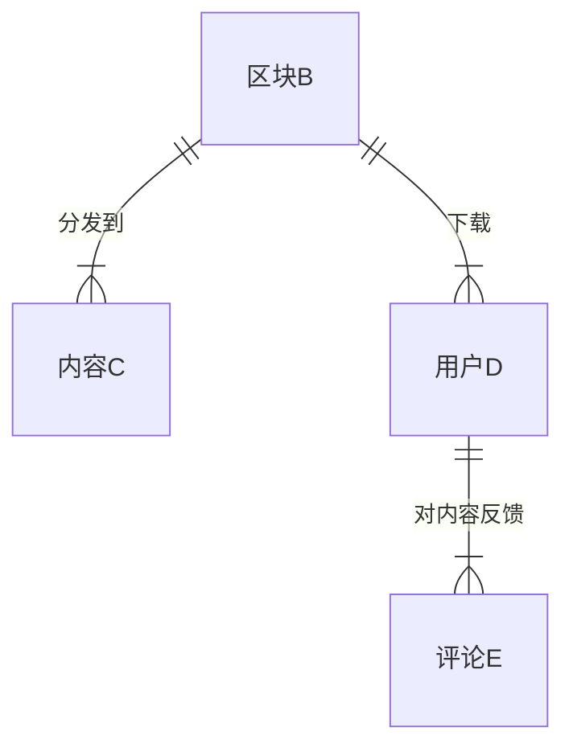

                 

### 第1章：区块链技术基础

区块链技术是近年来兴起的一种分布式数据库技术，具有去中心化、安全性高、透明性等特点。本节将介绍区块链的基本概念、工作原理、主要组成部分以及区块链与数字内容分发的相关性。

#### 1.1.1 区块链的定义与原理

区块链是一种分布式账本技术，通过加密算法和共识机制，确保数据的安全性和不可篡改性。区块链的基本原理可以概括为：

1. **数据存储**：将交易数据封装成区块，按照时间顺序串联成链。
2. **加密算法**：使用加密算法对区块进行加密，保证数据的安全性和隐私性。
3. **共识机制**：通过分布式网络中的节点达成共识，确定数据的真实性和有效性。

区块链的分布式特性使其具有较高的安全性和透明性，能够有效防止数据篡改和双花攻击。

#### 1.1.2 区块链的主要组成部分

区块链主要由以下几部分组成：

1. **区块**：区块是区块链的基本存储单元，包含一定数量的交易数据。
2. **链**：多个区块按照时间顺序链接起来，形成区块链。
3. **节点**：节点是区块链网络中的参与者，负责存储、验证和传播区块链数据。
4. **挖矿**：挖矿是节点通过解决数学难题来获取新区块的生成权，同时获得奖励。
5. **共识机制**：共识机制是节点之间达成共识的算法，确保区块链的一致性和安全性。

#### 1.1.3 区块链与数字内容分发的相关性

区块链技术为数字内容分发提供了一种去中心化的解决方案。在传统的数字内容分发模式中，内容创作者需要依赖中心化的平台进行发布和分发，这带来了以下问题：

1. **版权保护**：中心化平台可能存在盗版和侵权行为，难以有效保护创作者的版权。
2. **透明性**：中心化平台的信息透明度较低，创作者难以追踪内容的使用情况。
3. **安全性**：中心化平台可能存在数据泄露和篡改的风险。

区块链技术可以通过以下方式解决这些问题：

1. **去中心化**：区块链的去中心化特性使得内容创作者可以直接与用户进行交易，无需依赖中心化平台。
2. **版权保护**：通过区块链技术，创作者可以实现对内容的数字签名和认证，确保版权的唯一性和不可篡改性。
3. **透明性**：区块链的透明性使得内容的交易和使用情况可以被所有参与者查看，提高信息透明度。
4. **安全性**：区块链的加密技术和共识机制确保了数据的安全性和不可篡改性。

总之，区块链技术为数字内容分发提供了一种全新的解决方案，有助于提高内容的版权保护、透明性和安全性，推动数字内容产业的创新发展。

---

### 第2章：区块链核心概念与联系

区块链技术的核心概念包括共识算法、智能合约和去中心化身份验证。这些概念相互关联，共同构成了区块链技术的核心框架。本节将详细介绍这些概念，并通过对比和图示来帮助读者更好地理解。

#### 2.1 核心概念原理

##### 2.1.1 区块链的共识算法

共识算法是区块链技术的核心，它负责确保区块链网络中的所有节点对数据的共识。常见的共识算法有工作量证明（PoW）、权益证明（PoS）和委托权益证明（DPoS）等。

1. **工作量证明（PoW）**：节点通过解决复杂的数学难题来竞争区块生成权，这个过程称为挖矿。解决难题的节点获得新区块的生成权，并获得一定的奖励。
2. **权益证明（PoS）**：节点根据其在区块链中的持有代币数量和持有时间来竞争区块生成权。持有代币越多、持有时间越长，获得区块生成权的概率越大。
3. **委托权益证明（DPoS）**：节点通过选举产生代表，代表负责生成区块并维护区块链。节点通过投票选择代表，代表获得区块生成权。

##### 2.1.2 智能合约技术

智能合约是一种自动执行的合同，它基于区块链技术实现。智能合约的代码被嵌入到区块链中，一旦满足预定的条件，智能合约会自动执行相应的操作。

1. **智能合约的工作流程**：当某个条件被触发时，智能合约会自动执行预定的操作，例如转移代币、记录交易信息等。
2. **智能合约的安全性**：智能合约的安全性取决于其代码的质量和漏洞。因此，编写高质量的智能合约代码是确保安全性的关键。

##### 2.1.3 去中心化身份验证

去中心化身份验证是区块链技术的一个重要特性，它通过分布式网络来实现身份的验证和认证。

1. **去中心化身份验证的原理**：去中心化身份验证通过数字签名和公钥加密技术实现。用户在区块链上生成数字身份，并通过数字签名进行身份验证。
2. **去中心化身份验证的优势**：去中心化身份验证具有更高的安全性和隐私性，能够防止身份被盗用和伪造。

#### 2.2 概念属性特征对比

以下表格对比了区块链、数字内容分发和智能合约的概念属性特征：

| 概念 | 属性特征1 | 属性特征2 | 属性特征3 |
|------|-----------|-----------|-----------|
| 区块链 | 分布式账本 | 共识机制 | 智能合约 |
| 数字内容分发 | 版权保护 | 透明性 | 安全性 |
| 智能合约 | 自动执行 | 防篡改 | 可编程 |

#### 2.3 ER实体关系图架构

通过ER图，我们可以清晰地看到区块链、内容、用户和评论之间的关系。区块作为数据的存储单元，与内容和用户存在关联，用户可以下载和评论内容，形成了一个完整的内容分发和互动链条。

---

综上所述，区块链的核心概念与数字内容分发密切相关，通过共识算法、智能合约和去中心化身份验证等技术的应用，区块链为数字内容分发提供了一种全新的解决方案，有助于提高内容的版权保护、透明性和安全性。接下来，我们将进一步探讨区块链在数字内容分发中的应用和实践。

## 第三部分：区块链在数字内容分发中的应用

### 第3章：去中心化内容存储

去中心化内容存储（Distributed Content Storage）是区块链技术在数字内容分发中的一项重要应用。它通过分布式网络实现内容的存储和分发，提高了系统的透明性、安全性和可扩展性。本节将详细介绍去中心化内容存储的概念、应用案例以及与传统存储方式的对比。

#### 3.1 去中心化内容存储的概念

去中心化内容存储，顾名思义，是指通过分布式网络而不是单一的中央服务器来存储和检索数据。这种存储方式具有以下特点：

1. **去中心化**：去中心化内容存储不再依赖于单一的服务器或中心节点，而是通过分布式网络中的多个节点共同维护和存储数据。
2. **安全性**：去中心化内容存储通过加密算法和分布式网络结构，提高了数据的安全性，防止了单点故障和数据丢失的风险。
3. **透明性**：去中心化内容存储的每个节点都可以访问和验证数据的完整性，提高了系统的透明性。
4. **可扩展性**：去中心化内容存储能够根据需求动态扩展存储容量，无需像传统存储方式那样进行硬件升级或维护。

#### 3.2 去中心化内容存储的应用案例

以下是一些著名的去中心化内容存储应用案例：

##### 3.2.1 IPFS：InterPlanetary File System

IPFS（InterPlanetary File System，星际文件系统）是一种分布式文件系统，它使用内容寻址来存储和检索数据。IPFS通过将数据分割成小块，并将每个小块分配到不同的节点上，实现了去中心化的存储和分发。

1. **IPFS的工作原理**：IPFS使用哈希算法对文件进行加密，每个文件都有一个唯一的哈希值。用户可以通过哈希值访问文件，而无需知道文件存储的具体位置。
2. **IPFS的应用**：IPFS被广泛应用于去中心化应用（DApps）、文件分享、内容分发网络（CDN）等领域。

##### 3.2.2 Filecoin：区块链激励层

Filecoin是一个基于区块链的去中心化存储市场，它通过激励机制鼓励节点提供存储资源。Filecoin的挖矿过程类似于比特币的挖矿，但专注于存储资源。

1. **Filecoin的工作原理**：用户可以发布存储需求，存储提供者根据存储需求和价格竞争提供存储资源。一旦存储需求被满足，用户会向存储提供者支付FIL代币作为报酬。
2. **Filecoin的应用**：Filecoin被用于大规模数据存储、云计算、内容分发等领域。

##### 3.2.3 案例分析：去中心化内容分发平台

去中心化内容分发平台如PeerTube和Docker Hub，利用区块链技术实现内容的分布式存储和分发。

1. **PeerTube**：PeerTube是一个基于Mastodon开源代码的社交媒体平台，它使用IPFS实现内容的分布式存储和分享。
2. **Docker Hub**：Docker Hub是一个用于托管和分发Docker容器的平台，它使用区块链技术确保容器镜像的安全性和不可篡改性。

#### 3.3 传统存储与去中心化存储对比

以下是对传统存储和去中心化存储的对比：

| 特性 | 传统存储 | 去中心化存储 |
|------|-----------|--------------|
| 去中心化 | 中心化 | 分布式 |
| 安全性 | 可能存在单点故障 | 高安全性 |
| 透明性 | 中心化存储通常不透明 | 高透明性 |
| 可扩展性 | 需要硬件升级和维护 | 动态扩展 |
| 成本 | 高昂的硬件和维护成本 | 降低了成本 |

通过对比可以看出，去中心化内容存储在多个方面具有优势，尤其是在安全性、透明性和可扩展性方面。尽管去中心化存储还存在一些挑战，如存储效率、数据冗余和网络带宽等，但其在数字内容分发中的应用前景十分广阔。

### 第4章：智能合约在内容分发中的应用

智能合约是区块链技术的核心组成部分，它是一种自动执行合约的计算机程序。在数字内容分发领域，智能合约可以用于版权保护、付费下载、内容认证等应用。本节将详细介绍智能合约的基本原理、工作流程及其在内容分发中的应用案例。

#### 4.1 智能合约的基本原理

智能合约的基本原理基于区块链的不可篡改性和去中心化特性。智能合约由一系列代码组成，这些代码在区块链上执行，一旦条件满足，合约会自动执行预定的操作。智能合约的关键特性包括：

1. **自动执行**：智能合约在满足预定条件时自动执行，无需人为干预。
2. **不可篡改**：智能合约的代码在区块链上存储，一旦发布，就无法篡改。
3. **透明性**：智能合约的执行过程和结果对所有节点可见，提高了系统的透明度。
4. **安全性**：智能合约的安全性取决于其代码质量和区块链的安全性。

#### 4.2 智能合约的工作流程

智能合约的工作流程通常包括以下几个步骤：

1. **编写合约**：开发者编写智能合约代码，通常使用Solidity等编程语言。
2. **部署合约**：将智能合约部署到区块链上，通常需要支付一定的网络费用。
3. **调用合约**：用户通过区块链网络调用智能合约，触发合约的执行。
4. **执行操作**：智能合约根据调用参数和预定条件执行相应的操作，如转移代币、记录交易信息等。
5. **验证结果**：区块链网络中的节点对智能合约的执行结果进行验证，确保其正确性。

#### 4.3 智能合约在内容分发中的应用

智能合约在数字内容分发中具有广泛的应用，以下是一些典型的应用场景：

##### 4.3.1 版权保护

智能合约可以用于保护数字内容的版权，确保创作者的权益得到保障。具体应用包括：

1. **内容认证**：创作者可以使用智能合约对内容进行数字签名，确保内容的唯一性和不可篡改性。
2. **版权交易**：智能合约可以自动化版权交易流程，确保交易的透明性和公平性。

##### 4.3.2 付费下载

智能合约可以用于实现数字内容的付费下载，提高版权保护的同时简化交易流程。具体应用包括：

1. **自动支付**：用户通过智能合约自动支付下载费用，合约确保费用支付后提供内容。
2. **权限控制**：智能合约可以根据用户的支付情况进行权限控制，确保付费用户才能访问内容。

##### 4.3.3 内容认证与分发

智能合约可以用于实现内容认证与分发的自动化流程，确保内容的真实性。具体应用包括：

1. **版权信息记录**：智能合约可以记录版权信息，确保内容在分发过程中的版权信息不会被篡改。
2. **内容分发权限**：智能合约可以根据用户的身份和权限控制内容分发，确保内容只被授权的用户访问。

#### 4.4 案例分析：基于智能合约的版权保护

以一个实际案例来说明智能合约在版权保护中的应用：

**案例名称**：CryptoArt

**案例简介**：CryptoArt是一个基于区块链的数字艺术品交易平台，使用智能合约进行版权保护和交易。

**应用过程**：

1. **内容认证**：艺术家使用智能合约对数字艺术品进行认证，包括作品标题、艺术家信息和创作时间等。
2. **版权交易**：买家通过智能合约支付版权费用，合约确保交易透明且不可篡改。
3. **权限控制**：智能合约记录版权信息，并控制访问权限，确保只有版权持有者才能进行修改和转让操作。

通过这个案例，我们可以看到智能合约在数字内容分发中的强大应用潜力，它不仅提高了版权保护水平，还简化了交易流程，为数字内容创作者和用户提供了一种全新的内容分发模式。

### 第5章：去中心化内容分发网络

去中心化内容分发网络（Decentralized Content Distribution Network，DCDN）是利用区块链技术实现内容高效、安全、透明地分发的一种新型网络架构。与传统内容分发网络（CDN）相比，DCDN具有去中心化、不可篡改和去信任等特点。本节将介绍DCDN的概念、关键技术、应用案例以及与传统CDN的比较。

#### 5.1 DCDN概述

去中心化内容分发网络（DCDN）通过分布式网络结构实现内容的分发和存储，具有以下特点：

1. **去中心化**：DCDN不再依赖中心化的服务器或节点，而是通过分布式网络中的多个节点共同维护和分发内容，提高了系统的可靠性。
2. **不可篡改**：DCDN利用区块链的加密技术和共识机制，确保内容的完整性和不可篡改性，防止了内容被篡改或恶意攻击。
3. **去信任**：DCDN通过分布式网络中的节点进行验证和认证，去除了对中心化机构的依赖，降低了信任风险。
4. **高效性**：DCDN可以根据用户的位置和负载情况动态选择最优的节点进行内容分发，提高了内容的传输速度和效率。

#### 5.2 DCDN关键技术

DCDN的关键技术包括分布式存储、负载均衡、数据复制和去中心化路由算法等。

##### 5.2.1 负载均衡

负载均衡是DCDN的重要技术之一，它通过将流量分配到不同的节点上，避免了单个节点的过载，提高了系统的整体性能。负载均衡算法可以根据节点的负载情况、地理位置、网络延迟等因素进行动态调整。

##### 5.2.2 数据复制与冗余

数据复制与冗余是DCDN确保内容高可用性和可靠性的关键。DCDN通过将内容复制到多个节点上，实现了数据的冗余备份。当某个节点发生故障时，其他节点可以自动接管，确保内容的持续可用。

##### 5.2.3 去中心化路由算法

去中心化路由算法是DCDN实现高效内容分发的基础。它通过分布式网络中的节点协同工作，动态计算最优路由，确保内容能够快速、安全地传输到目标用户。常见的去中心化路由算法有DHT（Distributed Hash Table）和CDR（Content Delivery Routing）等。

#### 5.3 DCDN应用案例

以下是一些DCDN的应用案例：

##### 5.3.1 去中心化内容分发平台

去中心化内容分发平台如BitTorrent和IPFS，利用DCDN技术实现内容的分布式存储和分发。

1. **BitTorrent**：BitTorrent是一种基于P2P（Peer-to-Peer）技术的分布式文件分发协议，它通过将文件分割成多个小块，并分布式存储在用户节点上，实现了高效的内容分发。
2. **IPFS**：IPFS是一种基于内容寻址的分布式文件系统，它通过将文件内容转换为唯一的哈希值，实现了去中心化的内容存储和分发。

##### 5.3.2 DCDN在直播中的应用

去中心化内容分发网络（DCDN）在直播领域也具有广泛的应用前景。通过DCDN，直播内容可以高效、安全地分发到全球范围内的用户。

1. **内容存储**：直播内容在DCDN上的多个节点上进行存储，提高了内容的可靠性和可用性。
2. **负载均衡**：DCDN可以根据用户的地理位置和网络状况动态调整内容分发路径，确保直播流的高质量传输。
3. **去信任**：DCDN通过分布式网络中的节点进行验证和认证，去除了对中心化直播平台的依赖。

#### 5.4 DCDN与传统CDN的比较

以下是对DCDN与传统CDN的比较：

| 特性 | DCDN | 传统CDN |
|------|------|---------|
| 去中心化 | 高度去中心化 | 中心化 |
| 安全性 | 高安全性 | 较低安全性 |
| 可用性 | 高可用性 | 中等可用性 |
| 透明性 | 高透明性 | 低透明性 |
| 成本 | 较低成本 | 较高成本 |

通过比较可以看出，DCDN在安全性、可用性和透明性方面具有明显优势，尤其是在去中心化特性上，DCDN能够提供更高的可靠性和灵活性。然而，DCDN也存在一些挑战，如存储效率、数据冗余和网络带宽等，但其在数字内容分发中的应用前景依然十分广阔。

### 第6章：区块链与数字内容分发的法律与伦理问题

区块链技术在数字内容分发中的应用带来了诸多创新和机遇，同时也引发了一系列法律和伦理问题。本节将探讨区块链在数字内容分发中的法律框架、版权与知识产权保护、用户隐私保护以及社会责任与可持续发展等方面的挑战。

#### 6.1 区块链法律框架概述

随着区块链技术的发展，各国纷纷开始制定相关的法律法规来规范这一新兴领域。以下是一些主要国家的区块链法律框架概述：

1. **美国**：美国在区块链领域的主要法律是《区块链技术和智能合约法律指南》，它为区块链技术的应用提供了法律参考。
2. **欧盟**：欧盟通过《数字市场法案》和《数字服务法案》来规范区块链技术的应用，强调数据保护和消费者权益保护。
3. **中国**：中国出台了《区块链技术指南》和《区块链信息服务管理规定》，对区块链技术的应用进行了规范。
4. **新加坡**：新加坡通过《加密货币和数字资产法案》来规范加密货币和区块链技术，强调透明性和合规性。

尽管各国在区块链法律框架上存在差异，但总体上都倾向于鼓励创新和规范应用，以平衡创新与风险。

#### 6.2 数字内容分发的法律挑战

区块链技术在数字内容分发中面临以下法律挑战：

1. **版权保护**：在区块链上，数字内容容易被复制和传播，如何保护创作者的版权成为一个重要问题。尽管区块链技术可以通过数字签名和智能合约来确保内容的唯一性和不可篡改性，但如何在法律层面确保版权的合法权益仍然是一个挑战。
2. **知识产权**：除了版权保护外，区块链技术在知识产权保护方面也存在挑战，如商标、专利和著作权等。如何在区块链上有效保护知识产权，防止侵权行为的发生，需要法律和技术的双重支持。
3. **法律适用性**：区块链技术具有跨境性和分布式特性，导致法律适用性问题。不同国家和地区的法律法规差异较大，如何在区块链上实现全球适用的法律框架是一个需要解决的问题。

#### 6.3 用户隐私保护

区块链技术虽然在数字内容分发中具有很多优势，但也带来了隐私保护的问题：

1. **数据透明性**：区块链的透明性使得所有交易记录都能被公开查看，这可能导致用户的隐私泄露。
2. **数据共享**：区块链上的数据共享机制使得个人数据容易被公开获取，增加了隐私泄露的风险。
3. **隐私保护技术**：为了解决隐私保护问题，区块链技术研究者正在探索零知识证明、同态加密等技术，以在保护用户隐私的同时实现数据的透明性和安全性。

#### 6.4 社会责任与可持续发展

区块链技术在数字内容分发中的应用也引发了社会责任和可持续发展的问题：

1. **公平性**：区块链技术是否能够公平地分配内容分发的收益，防止垄断行为的发生，是一个重要问题。
2. **环境影响**：区块链技术尤其是基于PoW共识机制的加密货币，对环境的影响日益受到关注。如何在确保技术安全性的同时减少能源消耗，实现可持续发展，是一个重要挑战。
3. **监管合规**：区块链技术的去中心化和跨境特性使得监管变得复杂。如何在保护用户权益的同时，实现有效的监管和合规，是一个需要解决的难题。

总之，区块链技术在数字内容分发中带来了许多创新和机遇，但同时也引发了一系列法律和伦理问题。解决这些问题需要法律、技术和社会各界的共同努力，以实现区块链技术的可持续发展。

### 第7章：区块链在数字内容分发中的未来趋势

随着区块链技术的不断发展和成熟，其在数字内容分发领域的应用前景也愈发广阔。本节将探讨区块链技术的未来发展趋势、数字内容分发市场的预测以及未来应用领域的扩展。

#### 7.1 区块链技术的演进

区块链技术正处在快速发展的阶段，未来可能会出现以下几大趋势：

1. **第2层解决方案**：为了提高区块链的可扩展性和性能，第2层解决方案（如侧链、状态通道和状态树）将被广泛应用。这些解决方案可以在不影响底层区块链性能的情况下，实现高效的数据处理和交易执行。
2. **集成其他前沿技术**：区块链技术与人工智能、大数据、物联网等前沿技术的集成将成为未来趋势。例如，利用区块链技术确保数据的真实性和完整性，同时通过人工智能分析大数据，提供更精准的内容推荐和服务。
3. **隐私保护**：随着用户对隐私保护的重视，区块链技术将更加注重隐私保护机制的研发和应用。零知识证明、同态加密等隐私保护技术将在区块链应用中发挥重要作用。
4. **跨链技术**：跨链技术将实现不同区块链之间的数据传输和互操作，打破区块链孤岛，构建一个更加高效、透明的全球区块链网络。

#### 7.2 数字内容分发市场的预测

未来，数字内容分发市场将呈现出以下趋势：

1. **市场规模增长**：随着互联网用户的增加和数字化内容的普及，数字内容分发市场将继续保持高速增长。预计到2025年，全球数字内容市场将达到数千亿美元。
2. **用户需求多样化**：用户对个性化、高质量内容的追求将推动内容创作者和生产商不断创新，提供更多元化的内容服务。
3. **去中心化趋势**：区块链技术将推动数字内容分发向去中心化方向发展，创作者可以直接与用户互动，减少对中心化平台的依赖。
4. **版权保护加强**：随着区块链技术的发展，版权保护和知识产权管理将更加高效和透明，创作者的权益将得到更好的保障。

#### 7.3 未来应用领域扩展

未来，区块链在数字内容分发领域的应用将扩展到更多领域：

1. **教育领域**：区块链技术可用于实现教育资源的去中心化分发，确保学习材料的真实性和完整性，同时提供个性化的学习体验。
2. **医疗健康领域**：区块链技术可用于医疗数据的管理和共享，确保患者隐私保护的同时，提高医疗服务的质量和效率。
3. **艺术收藏领域**：区块链技术可用于艺术品的数字认证和版权保护，确保艺术品的历史和价值得到真实记录。
4. **供应链管理**：区块链技术可用于供应链管理，确保产品来源的真实性和可追溯性，提高供应链的透明度和效率。

总之，区块链技术在数字内容分发中的未来发展趋势令人期待。随着技术的不断进步和市场的需求变化，区块链将在推动数字内容产业创新发展方面发挥越来越重要的作用。

### 结语：区块链推动数字内容分发的革新

区块链技术为数字内容分发带来了革命性的变化，通过去中心化、安全性、透明性和智能合约等核心特性，解决了传统数字内容分发模式中存在的问题。从版权保护到内容认证，从付费下载到去中心化存储，区块链正在重塑数字内容产业的生态。

在数字内容分发中，区块链技术的应用不仅提高了内容创作者的权益保护，还增强了用户的信任和参与度。未来，随着区块链技术的不断发展和成熟，数字内容分发将更加高效、透明和公平，为创作者和用户提供更好的体验。

展望未来，区块链技术将继续推动数字内容分发的革新。新的应用场景和解决方案将不断涌现，为数字内容产业带来更多的机遇和挑战。区块链不仅将在数字内容分发中发挥重要作用，还将拓展到更多领域，推动社会和经济的变革。

让我们共同期待，区块链技术将在未来创造更多的奇迹，为数字内容分发和更广泛的应用场景带来前所未有的价值。

---

### 作者：AI天才研究院/AI Genius Institute & 禅与计算机程序设计艺术 /Zen And The Art of Computer Programming

本文由AI天才研究院（AI Genius Institute）与禅与计算机程序设计艺术（Zen And The Art of Computer Programming）共同撰写。我们致力于推动人工智能与计算机科学的发展，探索创新技术解决方案，为数字内容分发等领域带来深远影响。感谢您的阅读，希望本文能为您的技术研究和应用提供有价值的参考。如有任何疑问或建议，欢迎随时与我们联系。

