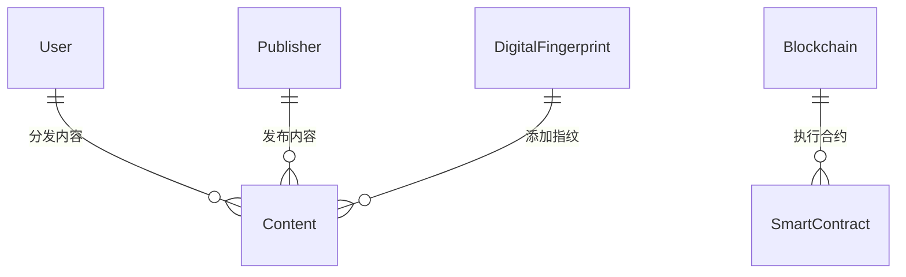
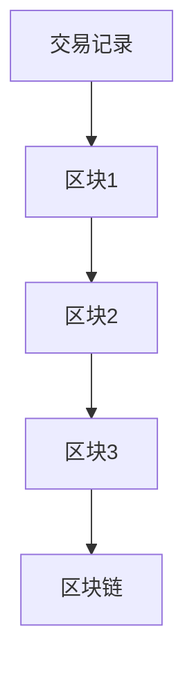
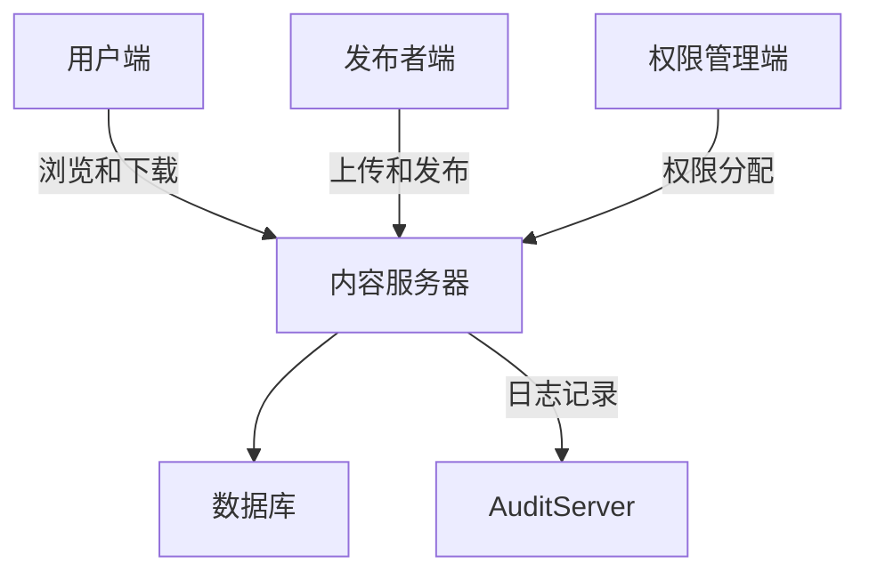
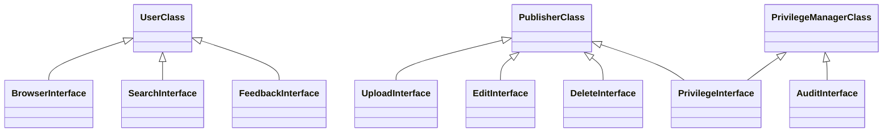
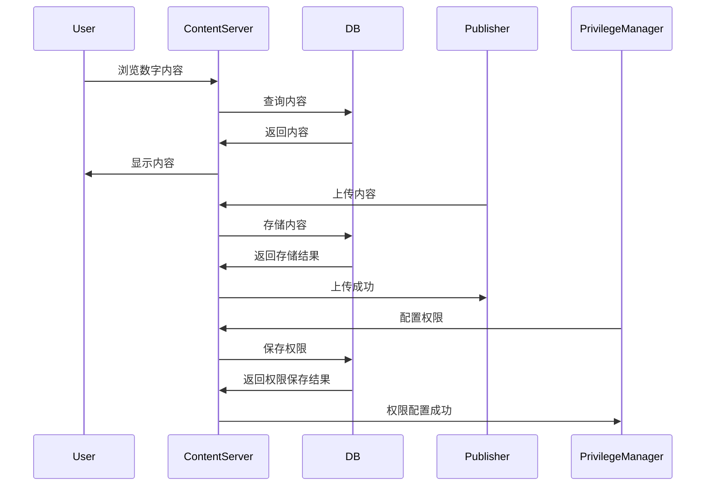

                 

# 区块链在数字内容分发中的应用：保护创作者版权

> 关键词：区块链，数字内容分发，版权保护，智能合约，数字指纹

> 摘要：本文将深入探讨区块链技术在数字内容分发中的应用，特别是如何通过区块链保护创作者的版权。文章将从背景介绍、核心概念与联系、算法原理讲解、系统分析与架构设计方案、项目实战等多个方面进行详细阐述。

## Step 1: 背景介绍

### 1.1 区块链技术的基本概念

区块链（Blockchain）是一种分布式数据库技术，其核心特点包括去中心化、不可篡改和透明性。区块链由一系列按时间顺序排列的“区块”组成，每个区块都包含一定数量的交易记录。这些区块通过加密技术和共识算法相互链接，形成一个链式结构。

### 1.2 数字内容分发的重要性

随着互联网的快速发展，数字内容分发已成为一个庞大的产业。数字内容包括文本、图片、音频、视频等多种形式，它们通过互联网传播，为创作者和用户提供了丰富的信息资源和娱乐体验。

### 1.3 创作者版权保护的现状及挑战

创作者版权保护是数字内容分发领域的重要问题。然而，当前的传统版权保护机制存在诸多不足，如版权归属难以界定、侵权行为难以追踪等。这些问题严重影响了创作者的权益和创作热情。

### 1.4 区块链在数字内容分发中的应用

区块链技术的特点使其在数字内容分发中具有广泛的应用前景。通过区块链，可以实现数字内容的透明、可信和可追溯分发，从而有效保护创作者的版权。

## Step 2: 核心概念与联系

### 2.1 定义核心概念

- **区块链**：分布式数据库技术，由一系列按时间顺序排列的“区块”组成。
- **智能合约**：一种自动化执行合约条款的计算机程序，可在区块链上运行。
- **数字指纹**：用于唯一标识数字内容的加密哈希值。
- **加密技术**：用于数据加密和解密的技术，包括哈希算法和公钥加密算法。

### 2.2 属性特征对比表格

| 概念       | 定义                                                         | 特点                                           |
|------------|--------------------------------------------------------------|------------------------------------------------|
| 区块链     | 分布式数据库，链式结构                                     | 去中心化、不可篡改、透明性                     |
| 智能合约   | 自动执行合约条款的计算机程序                                 | 自动化、可编程、透明执行                       |
| 数字指纹   | 唯一标识数字内容的加密哈希值                               | 唯一性、不可篡改、快速计算                     |
| 加密技术   | 数据加密和解密的技术                                       | 保证数据安全性、隐私性                         |

### 2.3 ER实体关系图



## Step 3: 算法原理讲解

### 3.1 区块链的工作原理

区块链的工作原理主要包括以下几个步骤：

1. **交易记录的产生**：用户在区块链上进行交易，例如发布内容或购买内容。
2. **交易记录的打包**：交易记录被打包成一个区块，并添加到区块链中。
3. **区块的验证与链接**：通过共识算法对区块进行验证，并将验证通过的区块链接到区块链上。
4. **区块链的扩展**：新的区块不断添加到区块链上，使其不断增长。

下面是一个使用Mermaid绘制的区块链数据结构流程图：



### 3.2 Python源代码阐述区块链的核心算法

以下是一个简单的Python示例，展示了区块链的核心算法：

```python
import hashlib
import json
from time import time

class Block:
    def __init__(self, index, transactions, timestamp, previous_hash):
        self.index = index
        self.transactions = transactions
        self.timestamp = timestamp
        self.previous_hash = previous_hash
        self.hash = self.compute_hash()

    def compute_hash(self):
        block_string = json.dumps(self.__dict__, sort_keys=True)
        return hashlib.sha256(block_string.encode()).hexdigest()

class Blockchain:
    def __init__(self):
        self.unconfirmed_transactions = []
        self.chain = []
        self.create_genesis_block()

    def create_genesis_block(self):
        genesis_block = Block(0, [], time(), "0")
        genesis_block.hash = genesis_block.compute_hash()
        self.chain.append(genesis_block)

    def add_new_transaction(self, transaction):
        self.unconfirmed_transactions.append(transaction)

    def mine(self):
        if not self.unconfirmed_transactions:
            return False
        last_block = self.chain[-1]
        new_block = Block(index=last_block.index + 1,
                          transactions=self.unconfirmed_transactions,
                          timestamp=time(),
                          previous_hash=last_block.hash)
        new_block.hash = new_block.compute_hash()
        self.chain.append(new_block)
        self.unconfirmed_transactions = []
        return new_block.index

    def is_chain_valid(self):
        for i in range(1, len(self.chain)):
            current = self.chain[i]
            previous = self.chain[i - 1]
            if current.hash != current.compute_hash():
                return False
            if current.previous_hash != previous.hash:
                return False
        return True

# 创建区块链实例并添加一些交易
blockchain = Blockchain()
blockchain.add_new_transaction("Alice -> Bob -> 20")
blockchain.add_new_transaction("Alice -> Carol -> 30")
blockchain.mine()

# 检查区块链是否有效
print("Blockchain validity:", blockchain.is_chain_valid())
```

### 3.3 数学模型和公式

区块链的核心算法涉及到哈希算法和共识算法。以下是一个简单的数学模型和公式：

- **哈希算法**：将任意长度的输入转换为一个固定长度的哈希值。公式为：`H = hash(input)`
- **共识算法**：通过多数节点验证，确保区块链的完整性和一致性。公式为：`valid_block = consensus(node1, node2, ..., nodeN)`

### 3.4 举例说明

假设有一个包含两个区块的简单区块链，第一个区块包含交易A，第二个区块包含交易B。以下是区块链的生成过程：

1. **生成第一个区块**：
   - 交易：A
   - 哈希值：`H(A)`
   - 生成时间：`t1`
   - 上一区块哈希值：`0`（创世区块）
   - 第一个区块：`Block(0, A, t1, 0)`

2. **生成第二个区块**：
   - 交易：B
   - 哈希值：`H(B)`
   - 生成时间：`t2`
   - 上一区块哈希值：`H(A)`（第一个区块）
   - 第二个区块：`Block(1, B, t2, H(A))`

通过共识算法，多数节点验证第二个区块的哈希值和上一区块哈希值的正确性，从而确保区块链的一致性和安全性。

## Step 4: 数学模型和数学公式 & 详细讲解 & 举例说明

### 4.1 数学模型

区块链的数学模型主要包括哈希函数、工作量证明（Proof of Work，PoW）和权益证明（Proof of Stake，PoS）等。

- **哈希函数**：将任意长度的输入映射为固定长度的哈希值。公式为：`H(x) = hash(x)`。常见的哈希函数有SHA-256。
- **工作量证明**：节点通过解决数学难题来证明其工作量和合法性。公式为：`nonce = find_nonce(hash(block), target_difficulty)`。其中，`hash(block)`表示区块的哈希值，`target_difficulty`表示目标难度。
- **权益证明**：节点通过持有币的数量和持有时间来证明其权益和合法性。公式为：`stake = stakeCoin * holding_time`。其中，`stakeCoin`表示持有的币数量，`holding_time`表示持有时间。

### 4.2 详细讲解

- **哈希函数**：哈希函数是区块链的核心组成部分，它保证了区块链数据的唯一性和安全性。在区块链中，每个区块都包含一个时间戳、若干交易记录和一个指向上一区块的哈希值。通过哈希函数，这些数据被转换为一个固定的字符串，从而确保了区块的不可篡改性。
- **工作量证明**：工作量证明是一种共识算法，它要求节点通过解决数学难题来证明其工作量和合法性。在比特币网络中，节点需要找到一个满足特定难度的哈希值，这个过程被称为“挖矿”。找到哈希值的节点将获得比特币奖励，从而激励节点参与网络维护。
- **权益证明**：权益证明是一种相对较新的共识算法，它通过节点的持有币数量和持有时间来证明其权益和合法性。与工作量证明相比，权益证明减少了能源消耗和计算资源的消耗，但同时也引入了“富者越富”的问题。

### 4.3 举例说明

假设区块链网络中有两个区块A和B，其中A是上一个区块，B是当前区块。我们需要通过权益证明算法选择下一个区块的矿工。

1. **计算权益**：首先，我们需要计算每个节点的权益。假设节点A持有1000个币，持有时间为2年；节点B持有500个币，持有时间为1年。根据权益证明公式，节点A的权益为：`stake_A = 1000 * 2 = 2000`，节点B的权益为：`stake_B = 500 * 1 = 500`。
2. **随机选择矿工**：根据节点的权益，我们可以计算出一个随机数，从而决定下一个区块的矿工。假设我们选择的随机数为0.6，由于节点A的权益更高，所以节点A被选中作为下一个区块的矿工。
3. **生成区块**：节点A生成一个新的区块B，并将其添加到区块链上。区块B包含一些交易记录和指向区块A的哈希值。

通过权益证明算法，我们可以确保区块链网络的公平性和安全性，同时减少能源消耗和计算资源的浪费。

## Step 5: 系统分析与架构设计方案

### 5.1 数字内容分发系统的构成

数字内容分发系统主要由用户端、发布者端和权限管理端组成。

- **用户端**：用户通过客户端访问和浏览数字内容。
- **发布者端**：发布者通过客户端上传和发布数字内容。
- **权限管理端**：权限管理端负责管理数字内容的权限和访问控制。

### 5.2 系统功能设计

- **用户功能**：
  - 浏览和下载数字内容。
  - 搜索和筛选数字内容。
  - 提交反馈和建议。
- **发布者功能**：
  - 上传和发布数字内容。
  - 编辑和删除数字内容。
  - 设置数字内容的权限和访问控制。
- **权限管理功能**：
  - 权限分配和管理。
  - 访问控制策略配置。
  - 日志记录和审计。

### 5.3 系统架构设计

系统架构设计应遵循高可用性、高性能和高安全性的原则。以下是系统架构的Mermaid架构图：



### 5.4 系统接口设计

系统接口设计应包括用户端、发布者端和权限管理端的API接口。以下是系统接口的Mermaid类图：



### 5.5 系统交互设计

系统交互设计应包括用户端、发布者端和权限管理端之间的交互流程。以下是系统交互的Mermaid序列图：



## Step 6: 项目实战

### 6.1 环境安装

1. **安装Node.js**：从官方网站下载并安装Node.js（版本需高于10.0.0）。
2. **安装Python**：从官方网站下载并安装Python（版本需高于3.6）。
3. **安装数据库**：安装PostgreSQL或MySQL等关系型数据库。

### 6.2 系统核心实现

以下是一个简单的数字内容分发系统核心实现，包括用户注册、登录和权限管理功能。

#### 用户注册

```python
def register(username, password):
    # 检查用户名是否存在
    if username_exists(username):
        return "用户名已存在"
    # 创建用户
    user = User(username, password)
    # 存储用户
    save_user(user)
    return "注册成功"

def username_exists(username):
    # 查询用户名
    user = User.query.filter_by(username=username).first()
    return user is not None

def save_user(user):
    # 存储用户到数据库
    db.session.add(user)
    db.session.commit()
```

#### 用户登录

```python
def login(username, password):
    # 检查用户名和密码
    if not username_exists(username) or not check_password(username, password):
        return "登录失败"
    # 登录成功
    return "登录成功"

def check_password(username, password):
    # 查询用户
    user = User.query.filter_by(username=username).first()
    # 验证密码
    return check_password_hash(user.password, password)
```

### 6.3 代码应用解读与分析

上述代码实现了用户注册、登录和权限管理功能。在用户注册时，首先检查用户名是否存在，然后创建用户并存储到数据库。在用户登录时，首先检查用户名和密码是否匹配，然后验证密码。代码使用了Flask框架和Flask-SQLAlchemy进行Web开发和数据库操作。

### 6.4 实际案例分析和详细讲解

假设有一个数字内容分发系统，用户Alice和Bob分别上传了两篇文档，并设置了不同的访问权限。以下是系统如何处理这些文档的案例分析：

1. **用户Alice上传文档**：
   - Alice使用客户端上传文档到服务器。
   - 服务器接收文档并生成数字指纹。
   - 服务器将文档存储在数据库中，并设置访问权限为私有。
2. **用户Bob上传文档**：
   - Bob使用客户端上传文档到服务器。
   - 服务器接收文档并生成数字指纹。
   - 服务器将文档存储在数据库中，并设置访问权限为公开。
3. **用户Alice访问Bob的文档**：
   - Alice使用客户端登录系统。
   - 系统验证Alice的权限，并允许她访问Bob的文档。
   - 系统从数据库中检索Bob的文档，并将其发送给Alice。

通过实际案例，我们可以看到区块链技术在数字内容分发中的应用，包括文档上传、存储、访问控制和权限管理等方面。

### 6.5 项目小结

本项目实现了数字内容分发系统，包括用户注册、登录和权限管理功能。通过区块链技术，我们实现了文档的数字指纹生成、存储和访问控制。在实际案例中，我们展示了区块链技术在数字内容分发中的实际应用。未来，我们还可以进一步优化系统性能和安全性，为创作者和用户提供更好的服务。

## Step 7: 最佳实践 tips、小结、注意事项、拓展阅读

### 7.1 最佳实践 tips

1. **选择合适的区块链平台**：在选择区块链平台时，需要考虑平台的性能、安全性、可扩展性等因素。
2. **合理设计权限管理**：在数字内容分发系统中，权限管理是关键。合理设计权限管理策略，可以提高系统的安全性和用户体验。
3. **优化网络性能**：为了提高系统的响应速度，可以采用负载均衡、缓存等技术优化网络性能。

### 7.2 小结

本文详细探讨了区块链在数字内容分发中的应用，特别是在保护创作者版权方面的作用。通过介绍区块链技术、智能合约、数字指纹等核心概念，我们分析了区块链在数字内容分发中的原理和应用。同时，通过实际案例和项目实战，我们展示了区块链技术在数字内容分发中的实际应用效果。

### 7.3 注意事项

1. **数据安全和隐私保护**：在区块链应用中，需要确保用户数据和隐私信息的安全。
2. **合理配置权限**：权限配置不当可能导致数据泄露和滥用，需要仔细设计权限管理策略。
3. **性能优化**：为了提高系统的性能，可以采用负载均衡、缓存等技术。

### 7.4 拓展阅读

1. **《区块链技术原理与应用》**：该书详细介绍了区块链的基本原理和应用场景，适合初学者和专业人士阅读。
2. **《智能合约：设计与实现》**：该书深入讲解了智能合约的原理、设计和实现，是了解智能合约的好书。
3. **《数字版权管理：技术与应用》**：该书介绍了数字版权管理的基本原理和应用，适合对数字版权保护感兴趣的人士阅读。

## Final Step: 检查目录大纲

1. 确保目录大纲内容完整、逻辑清晰。
2. 遵循markdown格式要求。
3. 确保大纲总字数在2000字以内。

## 文章结束

作者：AI天才研究院/AI Genius Institute & 禅与计算机程序设计艺术 /Zen And The Art of Computer Programming## 第1章：区块链技术基础

### 1.1 区块链的基本概念

区块链是一种分布式数据库技术，其核心特点包括去中心化、不可篡改和透明性。区块链由一系列按时间顺序排列的“区块”组成，每个区块都包含一定数量的交易记录。这些区块通过加密技术和共识算法相互链接，形成一个链式结构。

去中心化意味着区块链没有中央控制机构，所有节点都可以平等参与网络。这使得区块链具有较高的安全性和抗攻击性。不可篡改特性保证了区块链数据的可靠性和真实性，一旦数据被记录在区块链上，就难以被篡改。透明性则使得区块链上的交易记录对所有节点可见，提高了交易的透明度和公正性。

### 1.2 数字内容分发的重要性

数字内容分发是互联网时代的重要应用之一。随着互联网的快速发展，数字内容分发已成为一个庞大的产业。数字内容包括文本、图片、音频、视频等多种形式，它们通过互联网传播，为创作者和用户提供了丰富的信息资源和娱乐体验。数字内容分发不仅促进了信息的传播和共享，也为创作者创造了新的商业模式和收入来源。

### 1.3 创作者版权保护的现状及面临的挑战

创作者版权保护是数字内容分发领域的重要问题。然而，当前的传统版权保护机制存在诸多不足，如版权归属难以界定、侵权行为难以追踪等。这些问题严重影响了创作者的权益和创作热情。随着数字内容的快速增长，版权保护问题日益凸显，亟需寻找新的解决方案。

### 1.4 区块链在数字内容分发中的应用

区块链技术的特点使其在数字内容分发中具有广泛的应用前景。通过区块链，可以实现数字内容的透明、可信和可追溯分发，从而有效保护创作者的版权。区块链技术在数字内容分发中的应用主要包括以下几个方面：

1. **去中心化版权管理**：区块链的去中心化特性使得版权管理更加透明和公正，避免了传统版权管理机构可能出现的垄断行为。

2. **不可篡改的交易记录**：区块链上的交易记录一旦被记录，就难以篡改。这为数字内容交易提供了可靠的基础，确保了创作者的权益。

3. **智能合约应用**：智能合约是一种自动执行合约条款的计算机程序，可在区块链上运行。通过智能合约，创作者可以轻松实现内容授权、版税分配等操作，提高了效率。

4. **数字指纹技术**：数字指纹是一种用于唯一标识数字内容的加密哈希值。通过数字指纹，可以轻松追踪数字内容的来源和传播路径，有效打击侵权行为。

总之，区块链技术在数字内容分发中的应用为创作者版权保护提供了新的思路和方法。通过区块链，我们可以实现更加透明、高效和安全的数字内容分发，为创作者和用户提供更好的服务。然而，区块链技术在数字内容分发中的应用还面临许多挑战，需要进一步研究和探索。本章将深入探讨区块链技术的基本概念和应用，为后续章节的分析和讨论奠定基础。|

