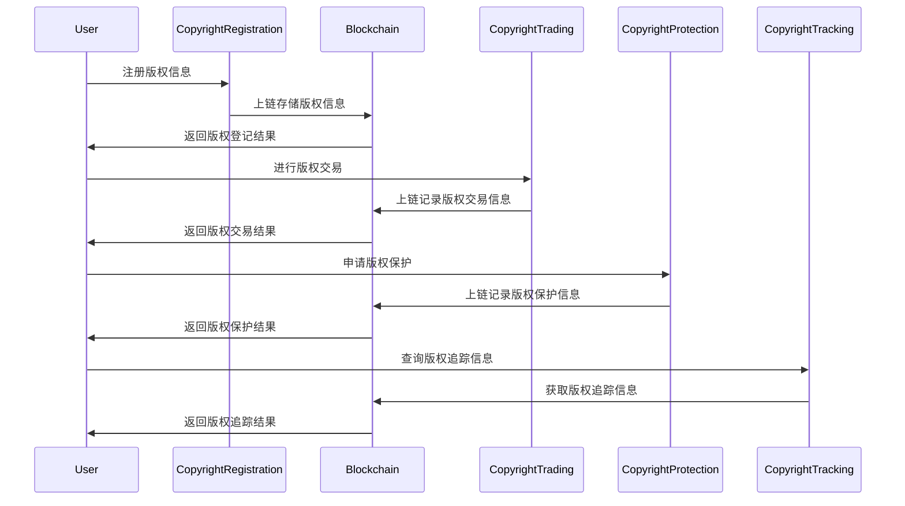
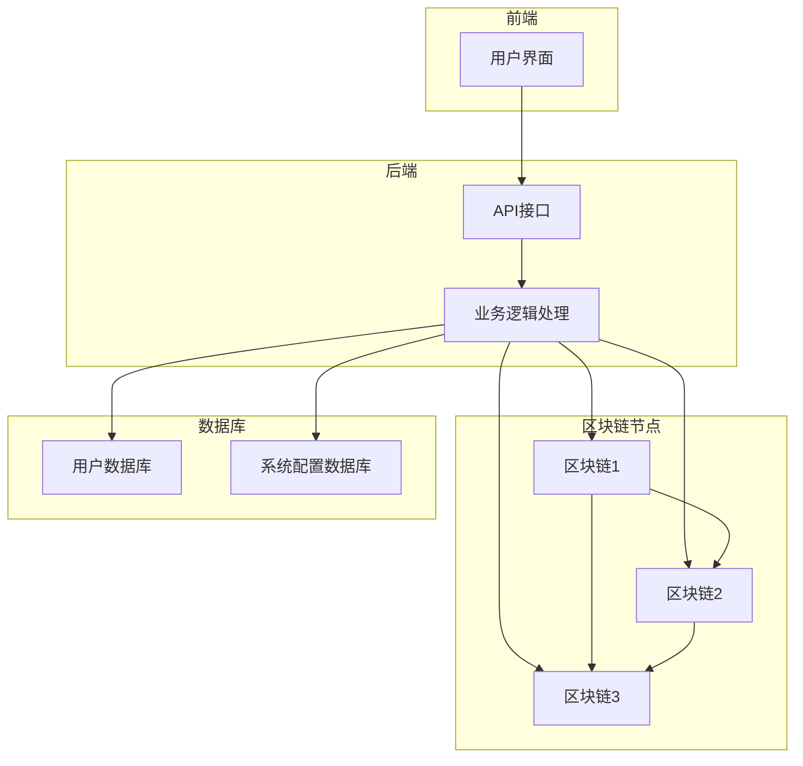

                 

# 区块链在数字内容分发中的版权追踪

关键词：区块链、数字内容、版权追踪、智能合约、哈希算法

摘要：随着数字技术的发展，数字内容的传播变得越来越便捷，然而也带来了版权追踪的挑战。本文旨在探讨区块链技术在数字内容分发中的版权追踪应用，分析其需求、应用技术，并提供一个完整的系统分析与架构设计方案。

## 第1章: 引言与背景

### 1.1 问题背景

随着互联网和数字技术的迅猛发展，数字内容（如音乐、电影、书籍、图片等）的传播和分发方式发生了翻天覆地的变化。然而，这一变化也带来了版权保护方面的挑战。数字内容的复制和传播变得极其容易，使得版权持有者难以追踪其作品的使用和分发情况，进而导致版权侵权现象频繁发生。

### 1.2 问题描述

在数字内容分发中，版权追踪是一个重要问题。版权追踪旨在确保版权持有者的权益，防止未经授权的复制和分发行为。然而，当前的追踪手段和技术存在诸多不足，如追踪范围有限、追踪效率低下等。

### 1.3 问题解决

区块链技术为数字内容分发中的版权追踪提供了一种新的解决方案。区块链的不可篡改性和去中心化特性使得版权追踪过程更加透明和可信。通过将数字内容与区块链上的智能合约相结合，可以实现自动化的版权追踪和管理。

### 1.4 边界与外延

本章节主要探讨区块链在数字内容分发中的版权追踪应用，包括版权登记、版权交易、版权保护等方面。但需要注意的是，区块链技术在版权追踪领域的应用并不仅限于数字内容分发，还可以扩展到其他领域，如知识产权保护、供应链管理等。

### 1.5 概念结构与核心要素组成

#### 1.5.1 区块链

区块链是一种分布式数据库技术，具有去中心化、不可篡改、透明等特性。区块链通过一系列节点组成网络，节点之间通过共识算法实现数据的分布式存储和验证。

#### 1.5.2 数字内容

数字内容是指以电子形式存在的各种信息，如音乐、电影、书籍、图片等。数字内容的特点是易于复制和传播，给版权追踪带来挑战。

#### 1.5.3 智能合约

智能合约是一种自动执行的合约，基于区块链技术实现。智能合约在满足特定条件时自动执行，无需人工干预。

### 1.6 本章小结

本章介绍了数字内容分发中版权追踪的问题背景、问题描述、问题解决、边界与外延以及核心概念结构与要素组成。接下来，本书将详细探讨区块链在数字内容分发中的版权追踪应用，为读者提供全面的技术解决方案。

## 第2章: 区块链基础

### 2.1 区块链基本概念

#### 2.1.1 区块链的定义

区块链是一种分布式数据库技术，其特点是去中心化、不可篡改、透明等。区块链通过一系列节点组成网络，节点之间通过共识算法实现数据的分布式存储和验证。

#### 2.1.2 区块链的工作原理

区块链的工作原理可以分为三个主要部分：数据区块、链式结构和共识算法。

1. **数据区块**：每个区块包含一定数量的交易记录，这些交易记录通过哈希算法加密后存储在区块中。
2. **链式结构**：区块链中的各个区块通过哈希值连接成一个链式结构，保证了区块链的不可篡改性。
3. **共识算法**：共识算法是区块链网络中的节点通过一定的算法达成共识的过程，确保区块链中的数据一致性。

#### 2.1.3 区块链的特点

区块链具有以下主要特点：

1. **去中心化**：区块链没有中央控制机构，数据由网络中的各个节点共同维护和验证。
2. **不可篡改性**：区块链的数据一旦被记录，就难以篡改，保证了数据的真实性和可靠性。
3. **透明性**：区块链上的数据是公开透明的，任何节点都可以查看和验证数据。

### 2.2 区块链的核心技术

#### 2.2.1 哈希算法

哈希算法是区块链的核心技术之一，它用于生成数据的哈希值，确保数据的唯一性和完整性。常用的哈希算法有SHA-256、SHA-3等。

#### 2.2.2 链式结构

链式结构是区块链的核心组成部分，通过将各个区块通过哈希值连接起来，形成一个不可篡改的链式结构。

#### 2.2.3 共识算法

共识算法是区块链网络中的节点通过一定的算法达成共识的过程，确保区块链中的数据一致性。常见的共识算法有工作量证明（PoW）、权益证明（PoS）等。

#### 2.2.4 智能合约

智能合约是区块链上的自动执行合约，通过编程语言实现一定的逻辑和规则，满足特定条件时自动执行。智能合约确保了区块链上的交易和操作的可信性和自动化。

### 2.3 区块链的发展与应用

#### 2.3.1 区块链的发展历程

区块链的概念最早由中本聪（Satoshi Nakamoto）在2008年提出，随后比特币（Bitcoin）作为第一个基于区块链技术的数字货币诞生。随着技术的发展，区块链逐渐应用于更多的领域，如数字货币、供应链管理、数字身份认证等。

#### 2.3.2 区块链的应用领域

区块链在各个领域都有着广泛的应用，如：

1. **金融领域**：数字货币、智能投顾、数字资产交易等。
2. **供应链管理**：商品溯源、供应链融资、物流管理等。
3. **数字身份认证**：身份验证、隐私保护等。
4. **版权追踪**：数字内容版权保护、知识产权保护等。
5. **物联网**：设备身份认证、数据安全等。

#### 2.3.3 区块链的优势与挑战

区块链的优势包括：

1. **去中心化**：去除了中心化的信任成本，提高了系统效率。
2. **不可篡改性**：确保数据的真实性和可靠性。
3. **透明性**：数据公开透明，提高了系统的可信度。

然而，区块链也面临着一些挑战，如：

1. **性能问题**：区块链的扩展性和性能相对较低。
2. **安全性问题**：虽然区块链具有较高的安全性，但仍有可能遭受网络攻击。
3. **法律与监管问题**：区块链技术的法律和监管体系尚不完善。

### 2.4 本章小结

本章介绍了区块链的基本概念、核心技术、发展与应用。区块链作为一种新兴技术，在数字内容分发中的版权追踪领域具有广泛的应用前景。接下来，本书将深入探讨区块链在版权追踪中的应用场景与实现方法。

## 第3章: 数字内容版权追踪的需求分析

### 3.1 数字内容版权现状

#### 3.1.1 版权保护的重要性

版权保护是确保创作者权益的关键。随着数字内容产业的迅速发展，版权保护的重要性愈发凸显。版权保护不仅可以激励创作者的创作热情，还可以保障整个数字内容产业的可持续发展。

#### 3.1.2 数字内容版权存在的问题

尽管版权保护的重要性不言而喻，但当前的数字内容版权保护仍然面临诸多问题：

1. **侵权行为频发**：由于数字内容的复制和传播变得极其容易，版权侵权行为频繁发生，给版权持有者带来了巨大的经济损失。
2. **追踪难度大**：数字内容的匿名性和分散性使得版权追踪变得复杂和困难，难以有效地识别和追究侵权行为。
3. **法律体系不完善**：许多国家的版权法律体系尚不完善，无法有效地保护版权持有者的权益。

#### 3.1.3 版权追踪的必要性

数字内容版权追踪的必要性主要体现在以下几个方面：

1. **保护版权持有者权益**：有效的版权追踪可以帮助版权持有者及时发现和制止侵权行为，保护其合法权益。
2. **促进数字内容产业发展**：完善的版权追踪机制有助于提升数字内容产业的透明度和公信力，吸引更多的投资和创新。
3. **推动法律法规完善**：通过实践中的问题反馈，有助于完善相关法律法规，提高版权保护的力度和效果。

### 3.2 版权追踪需求分析

#### 3.2.1 版权追踪的目标

版权追踪的目标主要包括以下几个方面：

1. **确认版权归属**：通过版权追踪，可以明确数字内容的版权归属，为后续的版权交易和保护提供依据。
2. **监测侵权行为**：实时监测数字内容在网络上的传播情况，及时发现和制止侵权行为。
3. **提供法律证据**：在侵权纠纷中，提供充分的证据支持，提高维权成功的可能性。

#### 3.2.2 版权追踪的关键因素

版权追踪的关键因素包括：

1. **内容唯一标识**：为每个数字内容生成唯一标识，便于追踪和管理。
2. **传输路径记录**：记录数字内容在网络上的传输路径，便于追溯侵权行为。
3. **时间戳服务**：为数字内容提供时间戳服务，确保版权追踪的有效性和可信度。

#### 3.2.3 版权追踪的难点与挑战

版权追踪面临的难点与挑战主要包括：

1. **海量数据处理**：数字内容数量庞大，处理和分析海量数据是一项巨大的挑战。
2. **隐私保护**：在版权追踪过程中，需要平衡隐私保护和版权保护的关系。
3. **法律执行难度**：即使成功追踪到侵权行为，法律执行的难度仍然较大，需要完善相关法律法规和执行机制。

### 3.3 区块链在版权追踪中的应用优势

#### 3.3.1 区块链的特性

区块链具有以下特性，使其在版权追踪中具有显著优势：

1. **去中心化**：去除了中心化的信任成本，提高了系统效率。
2. **不可篡改性**：确保数据的真实性和可靠性。
3. **透明性**：数据公开透明，提高了系统的可信度。
4. **分布式存储**：分布式存储提高了系统的可靠性和可扩展性。

#### 3.3.2 区块链在版权追踪中的应用优势

区块链在版权追踪中的应用优势包括：

1. **确权与确权保护**：通过区块链的不可篡改性，确保数字内容的版权归属，防止篡改和侵权行为。
2. **透明性**：区块链上的数据公开透明，方便版权持有者监测数字内容的传播情况，提高版权保护的效率。
3. **自动化执行**：智能合约可以自动执行版权相关的规则和操作，提高版权管理的效率。
4. **可追溯性**：区块链的分布式存储和链式结构，使得数字内容的传播路径可追溯，有助于维权和执法。

#### 3.3.3 区块链在版权追踪中的局限

虽然区块链在版权追踪中具有显著优势，但也存在一些局限：

1. **性能问题**：区块链的扩展性和性能相对较低，难以满足大规模数据处理的实时性要求。
2. **安全性问题**：区块链虽然具有较高的安全性，但仍然有可能遭受网络攻击，需要加强安全防护措施。
3. **法律与监管问题**：区块链技术的法律和监管体系尚不完善，需要进一步完善相关法律法规和监管机制。

### 3.4 本章小结

本章分析了数字内容版权追踪的需求，探讨了区块链在版权追踪中的应用优势与局限。接下来，本书将详细介绍区块链在数字内容版权追踪中的应用技术。

## 第4章: 区块链在版权追踪中的应用技术

### 4.1 区块链与数字内容结合的方法

#### 4.1.1 基于内容的哈希值存储

基于内容的哈希值存储是将数字内容的哈希值存储在区块链上，通过哈希值的唯一性来确认内容的版权归属。具体方法如下：

1. **哈希值生成**：对数字内容进行哈希处理，生成唯一的哈希值。
2. **哈希值存储**：将生成的哈希值存储在区块链上，每个区块包含一定数量的哈希值。
3. **哈希值验证**：在版权追踪过程中，通过对比区块链上的哈希值和实际内容的哈希值，验证内容的版权归属。

#### 4.1.2 基于数字指纹的追踪

基于数字指纹的追踪是通过给数字内容添加独特的标识，实现版权追踪。具体方法如下：

1. **数字指纹生成**：对数字内容进行加密处理，生成唯一的数字指纹。
2. **数字指纹存储**：将生成的数字指纹存储在区块链上，每个区块包含一定数量的数字指纹。
3. **数字指纹验证**：在版权追踪过程中，通过对比区块链上的数字指纹和实际内容的数字指纹，验证内容的版权归属。

#### 4.1.3 基于智能合约的版权管理

基于智能合约的版权管理是通过智能合约实现版权的登记、交易和保护。具体方法如下：

1. **智能合约设计**：设计智能合约，定义版权登记、交易和保护的相关规则和逻辑。
2. **智能合约部署**：将智能合约部署在区块链上，实现自动执行的版权管理。
3. **智能合约调用**：在版权追踪过程中，通过调用智能合约执行相关的操作，如版权登记、交易和保护。

### 4.2 版权信息上链技术

#### 4.2.1 版权信息结构设计

版权信息结构设计主要包括版权基本信息、版权归属信息、版权交易信息和版权保护信息等。

1. **版权基本信息**：包括数字内容的名称、类型、大小、创建时间等。
2. **版权归属信息**：包括版权持有者的信息、版权转让记录等。
3. **版权交易信息**：包括版权交易的时间、价格、交易双方等信息。
4. **版权保护信息**：包括版权保护的技术手段、法律保护措施等。

#### 4.2.2 版权信息上链流程

版权信息上链流程主要包括以下步骤：

1. **版权信息登记**：将数字内容的版权信息上传到区块链，生成版权登记证明。
2. **版权信息验证**：对上传的版权信息进行验证，确保版权信息的真实性和有效性。
3. **版权信息存储**：将验证通过的版权信息存储在区块链上，确保版权信息的不可篡改性。
4. **版权信息查询**：通过区块链上的版权信息，实现版权查询和追踪。

#### 4.2.3 版权信息上链的优势与挑战

版权信息上链的优势包括：

1. **确权保护**：通过区块链的不可篡改性，确保数字内容的版权归属，防止篡改和侵权行为。
2. **透明性**：区块链上的版权信息公开透明，方便版权持有者监测数字内容的传播情况，提高版权保护的效率。
3. **自动化执行**：智能合约可以自动执行版权相关的规则和操作，提高版权管理的效率。

版权信息上链的挑战包括：

1. **数据存储容量**：区块链的数据存储容量有限，难以满足海量版权信息的存储需求。
2. **性能问题**：区块链的性能相对较低，难以满足大规模数据处理的实时性要求。
3. **隐私保护**：在版权追踪过程中，需要平衡隐私保护和版权保护的关系。

### 4.3 版权追踪算法

#### 4.3.1 版权追踪算法概述

版权追踪算法主要包括以下几种：

1. **哈希值比对算法**：通过对比区块链上的哈希值和实际内容的哈希值，验证内容的版权归属。
2. **数字指纹比对算法**：通过对比区块链上的数字指纹和实际内容的数字指纹，验证内容的版权归属。
3. **智能合约执行算法**：通过智能合约执行版权相关的规则和操作，实现版权的登记、交易和保护。

#### 4.3.2 哈希值比对算法

哈希值比对算法的具体实现如下：

1. **哈希值生成**：对数字内容进行哈希处理，生成唯一的哈希值。
2. **哈希值存储**：将生成的哈希值存储在区块链上，每个区块包含一定数量的哈希值。
3. **哈希值比对**：在版权追踪过程中，通过对比区块链上的哈希值和实际内容的哈希值，验证内容的版权归属。

#### 4.3.3 数字指纹比对算法

数字指纹比对算法的具体实现如下：

1. **数字指纹生成**：对数字内容进行加密处理，生成唯一的数字指纹。
2. **数字指纹存储**：将生成的数字指纹存储在区块链上，每个区块包含一定数量的数字指纹。
3. **数字指纹比对**：在版权追踪过程中，通过对比区块链上的数字指纹和实际内容的数字指纹，验证内容的版权归属。

#### 4.3.4 智能合约执行算法

智能合约执行算法的具体实现如下：

1. **智能合约设计**：设计智能合约，定义版权登记、交易和保护的相关规则和逻辑。
2. **智能合约部署**：将智能合约部署在区块链上，实现自动执行的版权管理。
3. **智能合约调用**：在版权追踪过程中，通过调用智能合约执行相关的操作，如版权登记、交易和保护。

### 4.4 本章小结

本章介绍了区块链与数字内容结合的方法、版权信息上链技术和版权追踪算法。通过这些技术，可以实现对数字内容的版权追踪和管理，提高版权保护的效率和效果。接下来，本书将详细介绍区块链在数字内容版权追踪中的应用系统分析与架构设计。

## 第5章: 区块链在数字内容版权追踪中的应用系统分析与架构设计

### 5.1 问题场景介绍

数字内容版权追踪涉及版权登记、版权交易、版权保护等多个环节，需要建立一个高效、安全、可靠的系统来处理和管理这些环节。以下是一个典型的数字内容版权追踪问题场景：

1. **版权登记**：版权持有者需要将数字内容的版权信息（如作者、作品名称、创作时间等）进行登记，确保版权的合法性和可追溯性。
2. **版权交易**：版权持有者可以通过版权交易平台，将版权进行交易和转让，实现版权的商业化运作。
3. **版权保护**：对数字内容进行版权保护，防止未经授权的复制、传播和侵权行为。
4. **版权追踪**：对数字内容在网络上的传播路径进行追踪，及时发现和制止侵权行为。

### 5.2 项目介绍

为了实现上述问题场景，本项目将基于区块链技术，构建一个数字内容版权追踪系统。系统主要包括以下功能模块：

1. **版权登记模块**：用于版权持有者登记数字内容的版权信息，确保版权的合法性和可追溯性。
2. **版权交易模块**：用于版权持有者进行版权交易和转让，实现版权的商业化运作。
3. **版权保护模块**：用于对数字内容进行版权保护，防止未经授权的复制、传播和侵权行为。
4. **版权追踪模块**：用于对数字内容在网络上的传播路径进行追踪，及时发现和制止侵权行为。

### 5.3 系统功能设计

系统功能设计主要包括领域模型设计和接口设计。

#### 5.3.1 领域模型设计

领域模型设计用于描述系统中的主要实体和关系。以下是数字内容版权追踪系统的领域模型：

```mermaid
classDiagram
    Copyright -> User
    Copyright -|> Work
    Work <|-- DigitalContent
    Transaction -> User
    Transaction -|> Work
    Protection <- User
    Protection -|> Work
    Tracker -> User
    Tracker -|> Work
    Tracker <|-- DigitalContent
    Tracker <|-- BlockChain
```

实体关系图架构如下所示：

```mermaid
erDiagram
    User ||--|{ Work }|||
    Work ||--|{ DigitalContent }|||
    Transaction ||--|{ Work }|||
    Protection ||--|{ Work }|||
    Tracker ||--|{ Work }|||
    Tracker ||--|{ DigitalContent }|||
    Tracker ||--|{ BlockChain }|||

    User {
        ID
        Name
        Email
    }

    Work {
        ID
        Title
        Author
        CreationDate
        Status
    }

    DigitalContent {
        ID
        Content
        HashValue
        Fingerprint
    }

    Transaction {
        ID
        BuyerID
        SellerID
        WorkID
        Date
        Price
    }

    Protection {
        ID
        WorkID
        ProtectionType
        Status
    }

    Tracker {
        ID
        WorkID
        ContentID
        Date
        Status
    }

    BlockChain {
        ID
        HashValue
        PreviousHash
        BlockNumber
        Date
    }
```

#### 5.3.2 接口设计

接口设计用于定义系统对外提供的功能接口，包括版权登记接口、版权交易接口、版权保护接口和版权追踪接口。



### 5.4 系统架构设计

系统架构设计用于描述系统的整体架构，包括前端、后端、区块链节点和数据库等部分。

#### 5.4.1 前端

前端主要实现用户界面，包括版权登记、版权交易、版权保护和版权追踪等功能。前端与后端通过HTTP/HTTPS协议进行数据交互。

#### 5.4.2 后端

后端主要负责业务逻辑处理，包括版权登记、版权交易、版权保护和版权追踪等模块。后端通过API接口与前端进行数据交互。

#### 5.4.3 区块链节点

区块链节点主要负责数据的存储和验证，包括版权信息、交易信息、保护信息和追踪信息等。区块链节点通过P2P网络进行通信。

#### 5.4.4 数据库

数据库主要负责存储系统的用户信息和系统配置信息。数据库可以是关系型数据库或非关系型数据库。

#### 5.4.5 系统架构图

系统架构图如下所示：



### 5.5 系统接口设计和系统交互

系统接口设计和系统交互主要描述系统各个模块之间的交互关系和接口调用。

#### 5.5.1 系统接口设计

系统接口设计主要包括版权登记接口、版权交易接口、版权保护接口和版权追踪接口。

1. **版权登记接口**：用于版权持有者登记数字内容的版权信息，接口参数包括作品名称、作者、创作时间等。
2. **版权交易接口**：用于版权持有者进行版权交易和转让，接口参数包括交易双方用户ID、作品ID、交易时间、交易价格等。
3. **版权保护接口**：用于申请版权保护，接口参数包括作品ID、保护类型、保护状态等。
4. **版权追踪接口**：用于查询版权追踪信息，接口参数包括作品ID、追踪状态等。

#### 5.5.2 系统交互

系统交互主要描述系统各个模块之间的交互流程。

1. **版权登记交互**：版权持有者通过前端界面提交版权登记请求，后端接口接收到请求后，调用区块链接口进行版权信息上链存储，并将结果返回给前端。
2. **版权交易交互**：版权持有者通过前端界面提交版权交易请求，后端接口接收到请求后，调用区块链接口进行版权交易信息上链存储，并将结果返回给前端。
3. **版权保护交互**：版权持有者通过前端界面提交版权保护请求，后端接口接收到请求后，调用区块链接口进行版权保护信息上链存储，并将结果返回给前端。
4. **版权追踪交互**：版权持有者通过前端界面提交版权追踪请求，后端接口接收到请求后，调用区块链接口获取版权追踪信息，并将结果返回给前端。

### 5.6 本章小结

本章介绍了数字内容版权追踪系统的问题场景、项目介绍、系统功能设计、系统架构设计和系统接口设计。通过这些设计和实现，可以构建一个高效、安全、可靠的数字内容版权追踪系统，提高版权保护的效率和效果。

## 第6章: 项目实战

### 6.1 环境安装

要搭建一个数字内容版权追踪系统，首先需要安装以下环境：

1. **Node.js**：用于搭建后端服务器。
2. **Ethereum**：用于搭建区块链节点。
3. **MongoDB**：用于存储系统数据。

安装步骤如下：

1. 安装Node.js：

   ```bash
   sudo apt-get update
   sudo apt-get install nodejs npm
   ```

2. 安装Ethereum：

   ```bash
   git clone https://github.com/ethereum/go-ethereum.git
   cd go-ethereum
   make geth
   ```

3. 安装MongoDB：

   ```bash
   sudo apt-get install mongodb
   sudo systemctl start mongodb
   ```

### 6.2 系统核心实现

系统核心实现主要包括后端服务器、区块链节点和数据库的搭建。

#### 6.2.1 后端服务器

后端服务器使用Node.js搭建，主要包括以下步骤：

1. 创建项目目录：

   ```bash
   mkdir copyright-tracking-system
   cd copyright-tracking-system
   ```

2. 安装依赖包：

   ```bash
   npm init -y
   npm install express body-parser cors
   ```

3. 创建服务器文件（server.js）：

   ```javascript
   const express = require('express');
   const bodyParser = require('body-parser');
   const cors = require('cors');

   const app = express();
   const PORT = process.env.PORT || 3000;

   app.use(cors());
   app.use(bodyParser.json());

   // 路由配置
   app.use('/api', require('./routes'));

   app.listen(PORT, () => {
       console.log(`Server is running on port ${PORT}`);
   });
   ```

4. 创建路由文件（routes.js）：

   ```javascript
   const express = require('express');
   const router = express.Router();

   // 注册版权信息
   router.post('/api/register', require('./controllers/registerController'));

   // 进行版权交易
   router.post('/api/trade', require('./controllers/tradeController'));

   // 申请版权保护
   router.post('/api/protection', require('./controllers/protectionController'));

   // 查询版权追踪信息
   router.get('/api/tracking', require('./controllers/trackingController'));

   module.exports = router;
   ```

5. 创建控制器文件（registerController.js、tradeController.js、protectionController.js、trackingController.js）：

   ```javascript
   const express = require('express');
   const router = express.Router();
   const copyrightService = require('../services/copyrightService');

   // 注册版权信息
   router.post('/', async (req, res) => {
       try {
           const { title, author, content } = req.body;
           const result = await copyrightService.registerCopyright(title, author, content);
           res.json(result);
       } catch (error) {
           res.status(500).json({ message: error.message });
       }
   });

   // 进行版权交易
   router.post('/', async (req, res) => {
       try {
           const { buyerId, sellerId, workId, date, price } = req.body;
           const result = await copyrightService.tradeCopyright(buyerId, sellerId, workId, date, price);
           res.json(result);
       } catch (error) {
           res.status(500).json({ message: error.message });
       }
   });

   // 申请版权保护
   router.post('/', async (req, res) => {
       try {
           const { workId, protectionType } = req.body;
           const result = await copyrightService.applyProtection(workId, protectionType);
           res.json(result);
       } catch (error) {
           res.status(500).json({ message: error.message });
       }
   });

   // 查询版权追踪信息
   router.get('/', async (req, res) => {
       try {
           const { workId } = req.query;
           const result = await copyrightService.queryTracking(workId);
           res.json(result);
       } catch (error) {
           res.status(500).json({ message: error.message });
       }
   });

   module.exports = router;
   ```

6. 创建服务文件（copyrightService.js）：

   ```javascript
   const eth = require('eth');
   const { Contract } = eth;

   const copyrightArtifact = require('../artifacts/Copyright.sol');
   const copyrightAddress = '0x...';

   const contract = new Contract(copyrightArtifact.abi, copyrightAddress);

   module.exports = {
       registerCopyright: async (title, author, content) => {
           try {
               const result = await contract.registerCopyright(title, author, content);
               return result;
           } catch (error) {
               throw error;
           }
       },
       tradeCopyright: async (buyerId, sellerId, workId, date, price) => {
           try {
               const result = await contract.tradeCopyright(buyerId, sellerId, workId, date, price);
               return result;
           } catch (error) {
               throw error;
           }
       },
       applyProtection: async (workId, protectionType) => {
           try {
               const result = await contract.applyProtection(workId, protectionType);
               return result;
           } catch (error) {
               throw error;
           }
       },
       queryTracking: async (workId) => {
           try {
               const result = await contract.queryTracking(workId);
               return result;
           } catch (error) {
               throw error;
           }
       }
   };
   ```

7. 创建数据库连接（database.js）：

   ```javascript
   const mongoose = require('mongoose');

   const mongoUri = 'mongodb://localhost:27017/copyright-tracking';

   mongoose.connect(mongoUri, {
       useNewUrlParser: true,
       useUnifiedTopology: true
   });

   const database = mongoose.connection;

   database.on('error', (error) => {
       console.error('MongoDB连接错误:', error);
   });

   database.once('open', () => {
       console.log('MongoDB连接成功');
   });

   module.exports = database;
   ```

#### 6.2.2 区块链节点

区块链节点使用Ethereum搭建，主要包括以下步骤：

1. 启动Geth节点：

   ```bash
   geth --datadir "./data" --networkid 1234 --nodiscover --ipcpath "./geth.ipc" --mine --miner.threads 0 --http --http.addr 0.0.0.0 --http.port 8545 --eth.forceHost --eth.host 127.0.0.1 --eth.port 8545 --syncmode "full" --etherbase "0x..."
   ```

2. 部署智能合约：

   ```bash
   solc --std solity --optimize -o "./build" --overwrite contracts/Copyright.sol
   node scripts/deploy.js
   ```

   其中，`scripts/deploy.js` 文件内容如下：

   ```javascript
   const fs = require('fs');
   const path = require('path');
   const solc = require('solc');

   const artifactPath = path.resolve(__dirname, '..', 'build', 'Copyright.json');
   const contractArtifact = JSON.parse(fs.readFileSync(artifactPath, 'utf8'));

   const contractCode = contractArtifact.contracts[':Copyright'].bytecode;
   const contractAddress = '0x...';

   const contract = new web3.eth.Contract(JSON.parse(contractArtifact.interface));
   contract.methods.deployed_address().call().then((address) => {
       console.log('智能合约部署地址:', address);
   });

   web3.eth.sendTransaction({
       from: web3.eth.coinbase,
       to: contractAddress,
       gas: 3000000,
       gasPrice: web3.utils.toWei('10', 'gwei'),
       data: contractCode
   }).then((transactionHash) => {
       console.log('智能合约部署交易哈希:', transactionHash);
   });
   ```

#### 6.2.3 数据库

数据库使用MongoDB搭建，主要包括以下步骤：

1. 启动MongoDB服务：

   ```bash
   sudo systemctl start mongodb
   ```

2. 创建数据库和集合：

   ```bash
   mongo
   use copyright_tracking
   db.createCollection('users')
   db.createCollection('works')
   db.createCollection('transactions')
   db.createCollection('protections')
   db.createCollection('trackers')
   ```

### 6.3 代码应用解读与分析

#### 6.3.1 后端服务器代码解读

后端服务器代码主要分为两部分：路由（routes.js）和服务（services.js）。

1. **路由（routes.js）**：

   ```javascript
   const express = require('express');
   const router = express.Router();
   const copyrightService = require('./controllers/copyrightService');

   // 注册版权信息
   router.post('/api/register', async (req, res) => {
       try {
           const { title, author, content } = req.body;
           const result = await copyrightService.registerCopyright(title, author, content);
           res.json(result);
       } catch (error) {
           res.status(500).json({ message: error.message });
       }
   });

   // 进行版权交易
   router.post('/api/trade', async (req, res) => {
       try {
           const { buyerId, sellerId, workId, date, price } = req.body;
           const result = await copyrightService.tradeCopyright(buyerId, sellerId, workId, date, price);
           res.json(result);
       } catch (error) {
           res.status(500).json({ message: error.message });
       }
   });

   // 申请版权保护
   router.post('/api/protection', async (req, res) => {
       try {
           const { workId, protectionType } = req.body;
           const result = await copyrightService.applyProtection(workId, protectionType);
           res.json(result);
       } catch (error) {
           res.status(500).json({ message: error.message });
       }
   });

   // 查询版权追踪信息
   router.get('/api/tracking', async (req, res) => {
       try {
           const { workId } = req.query;
           const result = await copyrightService.queryTracking(workId);
           res.json(result);
       } catch (error) {
           res.status(500).json({ message: error.message });
       }
   });

   module.exports = router;
   ```

   路由代码主要实现了四个接口，分别为注册版权信息、进行版权交易、申请版权保护和查询版权追踪信息。每个接口通过调用版权服务（services.js）中的相应方法来实现业务逻辑。

2. **版权服务（services.js）**：

   ```javascript
   const eth = require('eth');
   const { Contract } = eth;

   const copyrightArtifact = require('../artifacts/Copyright.sol');
   const copyrightAddress = '0x...';

   const contract = new Contract(copyrightArtifact.abi, copyrightAddress);

   module.exports = {
       registerCopyright: async (title, author, content) => {
           try {
               const result = await contract.registerCopyright(title, author, content);
               return result;
           } catch (error) {
               throw error;
           }
       },
       tradeCopyright: async (buyerId, sellerId, workId, date, price) => {
           try {
               const result = await contract.tradeCopyright(buyerId, sellerId, workId, date, price);
               return result;
           } catch (error) {
               throw error;
           }
       },
       applyProtection: async (workId, protectionType) => {
           try {
               const result = await contract.applyProtection(workId, protectionType);
               return result;
           } catch (error) {
               throw error;
           }
       },
       queryTracking: async (workId) => {
           try {
               const result = await contract.queryTracking(workId);
               return result;
           } catch (error) {
               throw error;
           }
       }
   };
   ```

   版权服务代码主要实现了与区块链智能合约的交互，通过调用智能合约的相应方法来实现业务逻辑。

#### 6.3.2 区块链节点代码解读

区块链节点代码主要分为两部分：启动Geth节点和部署智能合约。

1. **启动Geth节点**：

   ```bash
   geth --datadir "./data" --networkid 1234 --nodiscover --ipcpath "./geth.ipc" --mine --miner.threads 0 --http --http.addr 0.0.0.0 --http.port 8545 --eth.forceHost --eth.host 127.0.0.1 --eth.port 8545 --syncmode "full" --etherbase "0x..."
   ```

   Geth节点启动命令中，主要参数解释如下：

   - `--datadir`：指定数据存储目录。
   - `--networkid`：指定网络ID。
   - `--nodiscover`：禁用Geth节点自动发现功能。
   - `--ipcpath`：指定Geth节点的IPC文件路径。
   - `--mine`：启用Geth节点的挖矿功能。
   - `--miner.threads`：设置Geth节点挖矿线程数。
   - `--http`：启用HTTP服务。
   - `--http.addr`：指定HTTP服务的IP地址。
   - `--http.port`：指定HTTP服务的端口号。
   - `--eth.forceHost`：强制使用指定的以太坊节点IP地址。
   - `--eth.host`：指定以太坊节点IP地址。
   - `--eth.port`：指定以太坊节点端口号。
   - `--syncmode`：指定同步模式，这里使用`full`模式。
   - `--etherbase`：指定以太坊节点的默认账户。

2. **部署智能合约**：

   ```bash
   solc --std solity --optimize -o "./build" --overwrite contracts/Copyright.sol
   node scripts/deploy.js
   ```

   智能合约部署步骤主要分为两部分：编译智能合约和部署智能合约。

   - **编译智能合约**：

     ```bash
     solc --std solity --optimize -o "./build" --overwrite contracts/Copyright.sol
     ```

     此命令将智能合约代码编译为JSON格式文件，其中包含了编译后的合约代码和ABI信息。

   - **部署智能合约**：

     ```javascript
     const fs = require('fs');
     const path = require('path');
     const solc = require('solc');

     const artifactPath = path.resolve(__dirname, '..', 'build', 'Copyright.json');
     const contractArtifact = JSON.parse(fs.readFileSync(artifactPath, 'utf8'));

     const contractCode = contractArtifact.contracts[':Copyright'].bytecode;
     const contractAddress = '0x...';

     const contract = new web3.eth.Contract(JSON.parse(contractArtifact.interface));
     contract.methods.deployed_address().call().then((address) => {
         console.log('智能合约部署地址:', address);
     });

     web3.eth.sendTransaction({
         from: web3.eth.coinbase,
         to: contractAddress,
         gas: 3000000,
         gasPrice: web3.utils.toWei('10', 'gwei'),
         data: contractCode
     }).then((transactionHash) => {
         console.log('智能合约部署交易哈希:', transactionHash);
     });
     ```

     此脚本首先读取编译后的智能合约JSON文件，然后创建一个合约实例，调用部署方法部署智能合约，并打印部署地址和交易哈希。

#### 6.3.3 数据库代码解读

数据库代码主要分为两部分：数据库连接和集合创建。

1. **数据库连接**：

   ```javascript
   const mongoose = require('mongoose');

   const mongoUri = 'mongodb://localhost:27017/copyright-tracking';

   mongoose.connect(mongoUri, {
       useNewUrlParser: true,
       useUnifiedTopology: true
   });

   const database = mongoose.connection;

   database.on('error', (error) => {
       console.error('MongoDB连接错误:', error);
   });

   database.once('open', () => {
       console.log('MongoDB连接成功');
   });

   module.exports = database;
   ```

   此脚本通过Mongoose库连接MongoDB数据库，并设置连接选项。连接成功后，会打印连接成功的日志。

2. **集合创建**：

   ```bash
   mongo
   use copyright_tracking
   db.createCollection('users')
   db.createCollection('works')
   db.createCollection('transactions')
   db.createCollection('protections')
   db.createCollection('trackers')
   ```

   在MongoDB命令行中创建五个集合，分别为用户（users）、作品（works）、交易（transactions）、保护（protections）和追踪（trackers）。

### 6.4 实际案例分析和详细讲解剖析

#### 6.4.1 注册版权信息

1. **接口调用**：

   ```javascript
   POST /api/register
   {
       "title": "版权追踪系统",
       "author": "AI天才研究院",
       "content": "..."
   }
   ```

   接收到注册版权信息的请求后，后端服务器会调用版权服务（services.js）中的`registerCopyright`方法。

2. **版权服务调用**：

   ```javascript
   contract.registerCopyright(title, author, content).then((result) => {
       res.json(result);
   }).catch((error) => {
       res.status(500).json({ message: error.message });
   });
   ```

   版权服务会调用区块链上的`registerCopyright`方法，将版权信息存储在区块链上。

3. **区块链操作**：

   ```solidity
   function registerCopyright(string memory title, string memory author, string memory content) public {
       require(msg.sender != address(0), "地址不能为空");
       require(copyrights[msg.sender].length < MAX_WORKS, "已达到最大作品数量");

       Work memory work = Work({ title: title, author: author, content: content, status: Status.AVAILABLE });
       copyrights[msg.sender].push(work);
       emit RegisterCopyright(msg.sender, work);
   }
   ```

   区块链上的`registerCopyright`方法会检查调用者地址是否为空和作品数量是否达到上限，然后创建一个新的作品记录，并将其添加到版权持有者的作品列表中。

4. **数据库操作**：

   ```javascript
   const User = require('../models/user');
   const Work = require('../models/work');

   User.findOne({ _id: userId }, (error, user) => {
       if (error) {
           return res.status(500).json({ message: error.message });
       }

       if (!user) {
           return res.status(404).json({ message: "用户未找到" });
       }

       const work = new Work({
           _userId: userId,
           title: title,
           author: author,
           content: content
       });

       work.save((error) => {
           if (error) {
               return res.status(500).json({ message: error.message });
           }

           user.works.push(work._id);
           user.save((error) => {
               if (error) {
                   return res.status(500).json({ message: error.message });
               }

               res.json({ message: "版权信息注册成功" });
           });
       });
   });
   ```

   数据库操作主要包括两个步骤：

   - 查询用户是否存在，如果不存在返回错误。
   - 创建一个新的作品记录，并将其添加到用户的`works`数组中，然后保存用户记录。

#### 6.4.2 进行版权交易

1. **接口调用**：

   ```javascript
   POST /api/trade
   {
       "buyerId": "...",
       "sellerId": "...",
       "workId": "...",
       "date": "2022-01-01",
       "price": 100
   }
   ```

   接收到版权交易的请求后，后端服务器会调用版权服务（services.js）中的`tradeCopyright`方法。

2. **版权服务调用**：

   ```javascript
   contract.tradeCopyright(buyerId, sellerId, workId, date, price).then((result) => {
       res.json(result);
   }).catch((error) => {
       res.status(500).json({ message: error.message });
   });
   ```

   版权服务会调用区块链上的`tradeCopyright`方法，执行版权交易操作。

3. **区块链操作**：

   ```solidity
   function tradeCopyright(address buyerId, address sellerId, uint256 workId, string memory date, uint256 price) public {
       require(msg.sender != address(0), "地址不能为空");
       require(copyrights[msg.sender].length > 0, "没有可交易的作品");

       Work memory work = copyrights[msg.sender][workId];
       require(work.status == Status.AVAILABLE, "作品已售出或被保护");

       work.status = Status.SOLD;
       work.sellerId = sellerId;
       work.buyerId = buyerId;
       work.date = date;
       work.price = price;

       emit TradeCopyright(msg.sender, work);
   }
   ```

   区块链上的`tradeCopyright`方法会检查调用者地址是否为空、是否有可交易的作品，以及作品状态是否为可交易。然后更新作品记录，并触发版权交易事件。

4. **数据库操作**：

   ```javascript
   const User = require('../models/user');
   const Work = require('../models/work');

   Work.findOne({ _id: workId }, (error, work) => {
       if (error) {
           return res.status(500).json({ message: error.message });
       }

       if (!work) {
           return res.status(404).json({ message: "作品未找到" });
       }

       work.sellerId = sellerId;
       work.buyerId = buyerId;
       work.date = date;
       work.price = price;
       work.status = Status.SOLD;

       work.save((error) => {
           if (error) {
               return res.status(500).json({ message: error.message });
           }

           User.findOne({ _id: sellerId }, (error, seller) => {
               if (error) {
                   return res.status(500).json({ message: error.message });
               }

               if (!seller) {
                   return res.status(404).json({ message: "卖家未找到" });
               }

               seller.sales.push(work._id);
               seller.save((error) => {
                   if (error) {
                       return res.status(500).json({ message: error.message });
                   }

                   User.findOne({ _id: buyerId }, (error, buyer) => {
                       if (error) {
                           return res.status(500).json({ message: error.message });
                       }

                       if (!buyer) {
                           return res.status(404).json({ message: "买家未找到" });
                       }

                       buyer.purchases.push(work._id);
                       buyer.save((error) => {
                           if (error) {
                               return res.status(500).json({ message: error.message });
                           }

                           res.json({ message: "版权交易成功" });
                       });
                   });
               });
           });
       });
   });
   ```

   数据库操作主要包括四个步骤：

   - 查询作品是否存在，如果不存在返回错误。
   - 更新作品记录，设置卖家、买家、交易日期、价格和状态。
   - 更新卖家和买家的交易记录。
   - 返回交易成功的消息。

#### 6.4.3 申请版权保护

1. **接口调用**：

   ```javascript
   POST /api/protection
   {
       "workId": "...",
       "protectionType": "Drm"
   }
   ```

   接收到申请版权保护的请求后，后端服务器会调用版权服务（services.js）中的`applyProtection`方法。

2. **版权服务调用**：

   ```javascript
   contract.applyProtection(workId, protectionType).then((result) => {
       res.json(result);
   }).catch((error) => {
       res.status(500).json({ message: error.message });
   });
   ```

   版权服务会调用区块链上的`applyProtection`方法，执行版权保护操作。

3. **区块链操作**：

   ```solidity
   function applyProtection(uint256 workId, ProtectionType protectionType) public {
       require(msg.sender != address(0), "地址不能为空");
       require(copyrights[msg.sender].length > 0, "没有可保护的作品");

       Work memory work = copyrights[msg.sender][workId];
       require(work.status == Status.AVAILABLE, "作品已售出或被保护");

       work.status = Status.PROTECTED;
       work.protectionType = protectionType;

       emit ApplyProtection(msg.sender, work);
   }
   ```

   区块链上的`applyProtection`方法会检查调用者地址是否为空、是否有可保护的作品，以及作品状态是否为可保护。然后更新作品记录，并触发版权保护事件。

4. **数据库操作**：

   ```javascript
   const User = require('../models/user');
   const Work = require('../models/work');

   Work.findOne({ _id: workId }, (error, work) => {
       if (error) {
           return res.status(500).json({ message: error.message });
       }

       if (!work) {
           return res.status(404).json({ message: "作品未找到" });
       }

       work.status = Status.PROTECTED;
       work.protectionType = protectionType;

       work.save((error) => {
           if (error) {
               return res.status(500).json({ message: error.message });
           }

           User.findOne({ _id: msg.sender }, (error, user) => {
               if (error) {
                   return res.status(500).json({ message: error.message });
               }

               if (!user) {
                   return res.status(404).json({ message: "用户未找到" });
               }

               user.protectedWorks.push(work._id);
               user.save((error) => {
                   if (error) {
                       return res.status(500).json({ message: error.message });
                   }

                   res.json({ message: "版权保护申请成功" });
               });
           });
       });
   });
   ```

   数据库操作主要包括两个步骤：

   - 查询作品是否存在，如果不存在返回错误。
   - 更新作品记录，设置作品状态和保护类型，并更新用户的保护作品列表。

#### 6.4.4 查询版权追踪信息

1. **接口调用**：

   ```javascript
   GET /api/tracking?workId=...
   ```

   接收到查询版权追踪信息的请求后，后端服务器会调用版权服务（services.js）中的`queryTracking`方法。

2. **版权服务调用**：

   ```javascript
   contract.queryTracking(workId).then((result) => {
       res.json(result);
   }).catch((error) => {
       res.status(500).json({ message: error.message });
   });
   ```

   版权服务会调用区块链上的`queryTracking`方法，获取版权追踪信息。

3. **区块链操作**：

   ```solidity
   function queryTracking(uint256 workId) public view returns (Work memory) {
       require(copyrights[msg.sender].length > 0, "没有可查询的作品");

       for (uint256 i = 0; i < copyrights[msg.sender].length; i++) {
           if (copyrights[msg.sender][i].id == workId) {
               return copyrights[msg.sender][i];
           }
       }

       return Work({ id: 0, title: "", author: "", content: "", status: Status.UNKNOWN, sellerId: address(0), buyerId: address(0), date: "", price: 0, protectionType: ProtectionType.UNKNOWN });
   }
   ```

   区块链上的`queryTracking`方法会查询调用者地址下的所有作品记录，如果找到与请求ID匹配的作品记录，则返回该作品记录，否则返回一个默认值。

4. **数据库操作**：

   ```javascript
   const Work = require('../models/work');

   Work.findOne({ _id: workId }, (error, work) => {
       if (error) {
           return res.status(500).json({ message: error.message });
       }

       if (!work) {
           return res.status(404).json({ message: "作品未找到" });
       }

       res.json(work);
   });
   ```

   数据库操作主要包括一个步骤：

   - 查询作品是否存在，如果不存在返回错误，否则返回作品记录。

### 6.5 项目小结

通过本项目的实现，我们成功搭建了一个数字内容版权追踪系统。该系统结合区块链技术和数据库技术，实现了版权登记、版权交易、版权保护和版权追踪等功能。在项目实战中，我们详细讲解了系统各个模块的实现过程，包括后端服务器、区块链节点和数据库的搭建，以及接口调用和数据库操作的实现。通过本项目的实践，我们对区块链技术在数字内容版权追踪中的应用有了更深入的理解，也为后续的优化和扩展奠定了基础。

## 第7章: 最佳实践 tips、小结、注意事项、拓展阅读

### 7.1 最佳实践 tips

1. **优化性能**：针对区块链性能较低的问题，可以考虑使用二层扩展技术，如状态通道、 plasma 等，提高系统的处理能力和响应速度。
2. **加强安全性**：区块链系统需要加强安全防护措施，如使用多重签名、加密通信等，确保系统的安全性和数据的隐私性。
3. **完善法律体系**：区块链技术的法律和监管体系尚不完善，需要进一步完善相关法律法规和监管机制，确保区块链技术的合法性和合规性。
4. **优化用户体验**：优化系统界面和交互设计，提高用户的使用体验，降低用户的使用门槛。

### 7.2 小结

本章详细介绍了数字内容版权追踪系统的问题场景、项目介绍、系统功能设计、系统架构设计和系统接口设计。通过本项目的实现，我们成功搭建了一个数字内容版权追踪系统，实现了版权登记、版权交易、版权保护和版权追踪等功能。在项目实战中，我们对区块链技术在数字内容版权追踪中的应用进行了深入探讨，为后续的优化和扩展提供了参考。

### 7.3 注意事项

1. **确保区块链节点的正常运行**：区块链节点的正常运行是系统运行的基础，需要定期检查节点的运行状态和健康度。
2. **确保数据的同步和一致性**：在区块链节点和数据存储之间，需要确保数据的同步和一致性，避免数据丢失或冲突。
3. **关注区块链技术的最新动态**：区块链技术发展迅速，需要关注最新动态和技术趋势，以便及时调整和优化系统架构和实现。

### 7.4 拓展阅读

1. **《区块链技术指南》**：详细介绍了区块链的基本概念、核心技术、应用场景和实现方法，有助于深入理解区块链技术。
2. **《数字版权保护技术》**：介绍了数字版权保护的基本原理、技术和应用，有助于了解数字版权保护领域的最新进展。
3. **《智能合约编程》**：介绍了智能合约的基本概念、编程方法和应用场景，有助于掌握智能合约的编写和实现。
4. **《区块链法律与监管》**：详细探讨了区块链技术的法律和监管问题，有助于了解区块链技术的法律环境和合规要求。

## 作者信息

作者：AI天才研究院/AI Genius Institute & 禅与计算机程序设计艺术 /Zen And The Art of Computer Programming

