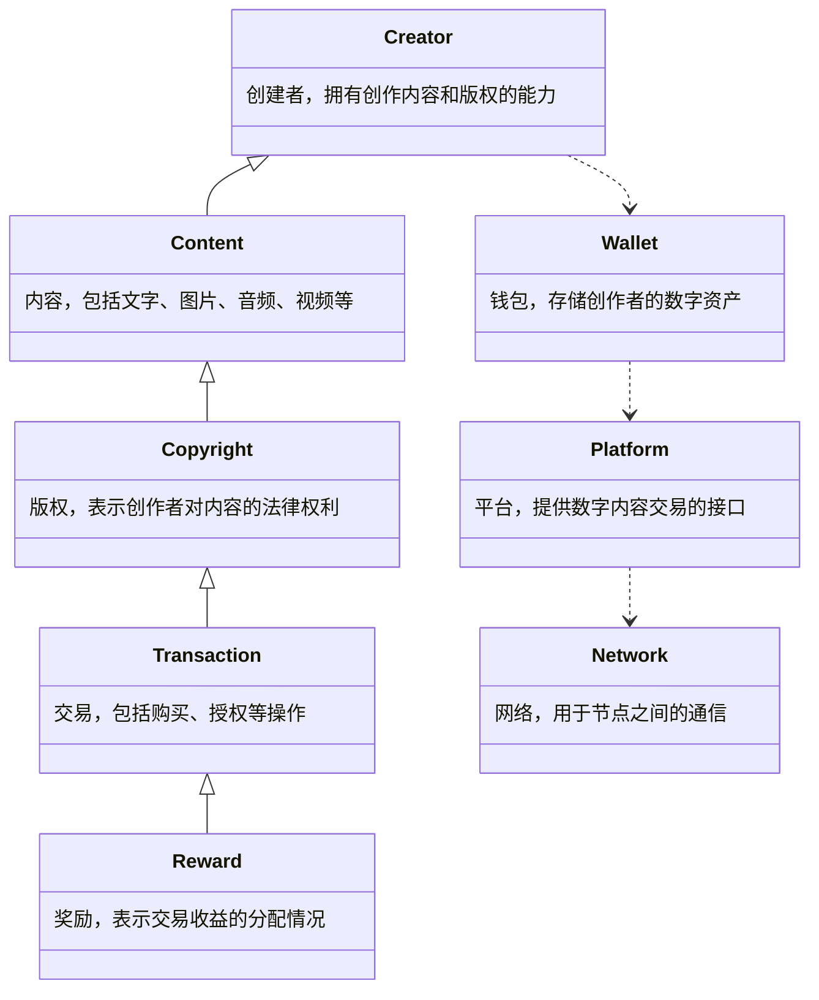
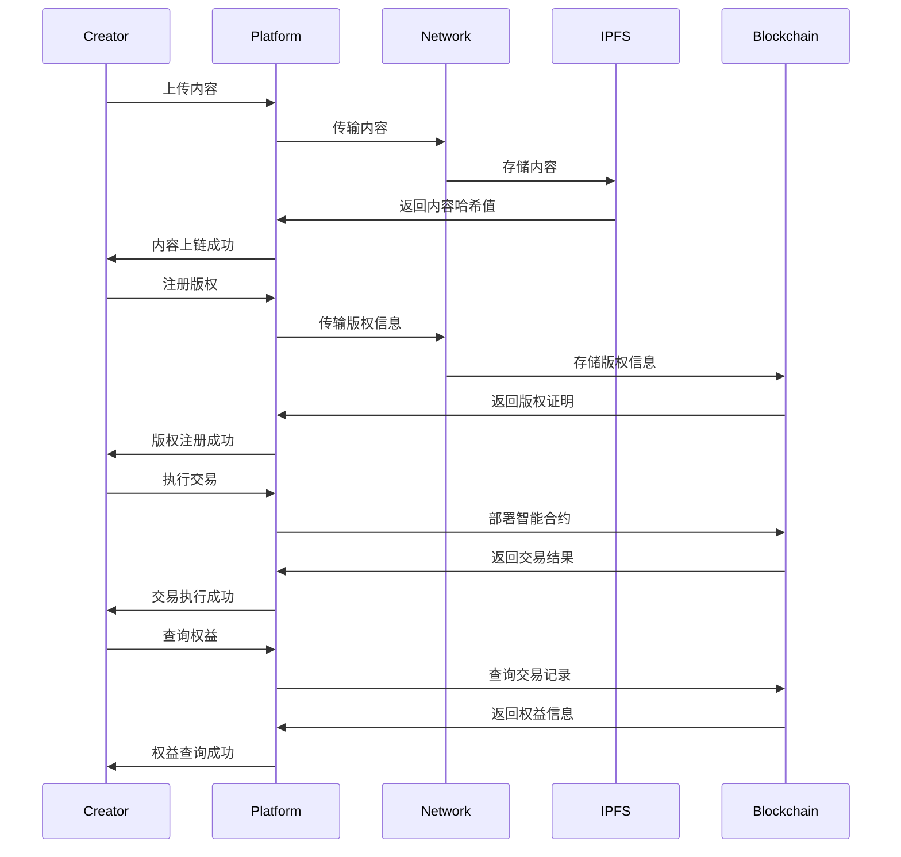

                 


## 引言

### 核心概念

首先，我们需要明确几个核心概念：

- **区块链（Blockchain）**：一种分布式数据库技术，其特点是不可篡改和透明性，通过去中心化的方式维护数据的一致性。

- **数字内容创作者权益保护**：指的是通过技术手段，确保数字内容的原创者能够获得应有的收益和权益，防止内容被非法复制和传播。

### 问题背景

随着互联网和数字技术的发展，数字内容创作成为了现代社会的重要生产方式。然而，数字内容创作者的权益保护问题日益凸显。一方面，数字内容的复制和传播变得极其容易，导致创作者的原创作品被非法盗用。另一方面，传统的版权保护机制往往成本高昂，效率低下，难以满足快速变化的数字内容创作需求。

### 问题描述

数字内容创作者面临的权益保护问题主要包括：

- **版权侵权**：创作者的作品被未经授权的使用或传播。

- **收益分配不公**：平台和第三方服务商在内容分发过程中，往往占据了较大的收益份额，创作者获得的收益相对较低。

- **版权交易难度大**：创作者需要在多个平台上发布内容，进行版权交易，流程繁琐且成本高昂。

### 问题解决

区块链技术作为一种新兴技术，提供了数字内容创作者权益保护的潜在解决方案。区块链技术通过以下方式实现权益保护：

- **去中心化**：通过去中心化架构，减少中间环节，使创作者可以直接与用户进行交易，提高收益分配的透明度和公平性。

- **不可篡改性**：区块链上的数据具有不可篡改的特性，可以有效防止版权侵权。

- **智能合约**：智能合约自动执行合同条款，确保版权交易的安全和高效。

- **透明性和可追溯性**：所有交易记录都公开透明，创作者可以随时查询自己的权益状态。

### 边界与外延

在探讨区块链在数字内容创作者权益保护中的应用时，需要关注以下几个边界与外延问题：

- **版权法律法规**：不同国家和地区的版权法律法规存在差异，需要在全球范围内进行协调。

- **技术实现难度**：区块链技术的实现涉及多个环节，如数据存储、网络传输、智能合约编写等，需要解决技术实现的复杂性。

- **用户接受度**：数字内容创作者和用户对区块链技术的接受度需要提高，以推动技术的广泛应用。

### 概念结构与核心要素组成

区块链在数字内容创作者权益保护中的概念结构主要包括以下几个核心要素：

- **创作者**：数字内容创作的主体，包括作家、音乐人、视频制作者等。

- **作品**：创作者创作的数字内容，如文字、音乐、视频等。

- **版权**：创作者对作品享有的法律权利。

- **区块链平台**：提供区块链技术的数字内容创作者权益保护服务。

- **智能合约**：自动执行版权交易和收益分配的智能合约。

通过以上步骤，我们明确了区块链在数字内容创作者权益保护中的应用背景、核心概念、问题描述、解决方法和相关边界与外延。接下来，我们将进一步探讨区块链技术在数字内容创作者权益保护中的核心概念和实现原理。

## 核心概念

### 区块链技术概述

区块链技术最早由中本聪（Satoshi Nakamoto）在2008年提出，是一种分布式数据库技术，通过去中心化的方式维护数据的一致性。区块链的核心特点包括：

- **去中心化**：区块链不依赖于中心化的服务器，所有节点都能平等参与网络的维护和数据的存储。

- **不可篡改性**：区块链上的数据一旦被记录，就难以篡改，确保了数据的安全性和可靠性。

- **透明性**：区块链上的所有交易记录都是公开透明的，任何节点都可以查阅。

- **安全性**：区块链使用密码学技术保障数据的完整性和隐私性。

区块链的基本组成包括：

- **区块**：区块链的基本单位，包含一定数量的交易记录。

- **链**：由多个区块按时间顺序链接而成，形成了一个不可篡改的日志。

- **节点**：网络中的计算机，负责存储和传播区块链数据。

### 数字内容创作者权益保护问题

数字内容创作者权益保护问题主要涉及以下几个方面：

- **版权侵权**：创作者的作品未经授权被复制、传播和利用。

- **收益分配不公**：数字内容在平台和第三方服务商之间的收益分配不透明，创作者获得的收益较低。

- **版权交易难度大**：创作者需要在多个平台上发布内容，进行版权交易，流程繁琐且成本高昂。

### 区块链与数字权利管理的关系

区块链技术在数字内容创作者权益保护中发挥重要作用，主要体现在以下几个方面：

- **去中心化**：通过去中心化架构，减少中间环节，使创作者可以直接与用户进行交易，提高收益分配的透明度和公平性。

- **不可篡改性**：确保创作者的作品和版权信息无法被篡改，有效防止版权侵权。

- **智能合约**：自动执行版权交易和收益分配的智能合约，确保交易的安全和高效。

- **透明性和可追溯性**：所有交易记录都公开透明，创作者可以随时查询自己的权益状态。

### 区块链在数字内容创作者权益保护中的优势

区块链技术在数字内容创作者权益保护中具有以下优势：

- **低成本**：通过去中心化架构，减少了中间环节，降低了创作者的交易成本。

- **高效率**：智能合约自动执行交易，提高了交易效率。

- **透明度**：所有交易记录公开透明，便于创作者监督和管理自己的权益。

- **安全性**：区块链使用密码学技术，保障了数据的完整性和隐私性。

### 区块链在数字内容创作者权益保护中的挑战

尽管区块链技术在数字内容创作者权益保护中具有诸多优势，但仍然面临一些挑战：

- **技术实现难度**：区块链技术的实现涉及多个环节，如数据存储、网络传输、智能合约编写等，需要解决技术实现的复杂性。

- **用户接受度**：数字内容创作者和用户对区块链技术的接受度需要提高，以推动技术的广泛应用。

- **法律法规**：不同国家和地区的版权法律法规存在差异，需要在全球范围内进行协调。

### 概念属性特征对比

为了更清晰地理解区块链在数字内容创作者权益保护中的应用，我们可以将其与传统数字权利管理机制进行对比，如下表所示：

| 特征       | 区块链                      | 传统数字权利管理                      |
|------------|---------------------------|-----------------------------------|
| 去中心化   | 是                         | 否                                |
| 不可篡改性 | 是                         | 否                                |
| 透明性     | 是                         | 否                                |
| 安全性     | 高                         | 中                                |
| 成本       | 低                         | 高                                |
| 效率       | 高                         | 低                                |

通过以上对比，我们可以看出区块链在数字内容创作者权益保护中的优势。

### ER实体关系图架构

为了更好地理解区块链在数字内容创作者权益保护中的应用，我们可以通过ER（实体关系）图来展示其中的实体和关系。

```mermaid
erDiagram
    Creator ||--|{ Content }|| Authoring
    Content ||--|{ Copyright }|| Owning
    Copyright ||--|{ Transaction }|| Transacting
    Transaction ||--|{ Reward }|| Earning
    Creator }|--|{ Wallet }|| Storing
    Wallet ||--|{ Platform }|| Accessing
    Platform }|--|{ Network }|| Communicating
```

在这个ER图中，Creator（创作者）、Content（内容）、Copyright（版权）、Transaction（交易）、Reward（奖励）、Wallet（钱包）、Platform（平台）和Network（网络）都是实体。它们之间的关系如箭头所示。

通过以上步骤，我们详细阐述了区块链在数字内容创作者权益保护中的应用背景、核心概念、问题解决方法和相关挑战，以及与之相关的概念属性特征和ER实体关系图架构。接下来，我们将进一步探讨区块链技术在数字内容创作者权益保护中的具体应用和实现原理。

## 核心概念讲解与实现原理

### 区块链技术概述

区块链技术是一种分布式数据库技术，其核心在于去中心化的数据存储和共识机制。在区块链网络中，所有参与节点（节点）共同维护一个共享账本，该账本记录了所有发生的交易记录。以下是区块链技术的一些关键组成部分：

#### 区块（Block）

- **区块**是区块链的基本单位，包含了固定数量的交易记录。
- **区块头**包含了该区块的元数据，如版本号、上一区块的哈希值、时间戳、默克尔树根哈希等。
- **交易列表**包含了本区块内所有的交易记录。

#### 链（Chain）

- **链**是由多个区块按时间顺序链接而成，形成了一个不可篡改的日志。
- 每个区块都通过其上一区块的哈希值与链中的其他区块关联，保证了区块链的整体一致性。

#### 节点（Node）

- **节点**是区块链网络中的计算机，负责存储和传播区块链数据。
- **全节点**完整地存储整个区块链数据，并参与网络的共识机制。
- **轻节点**仅存储部分区块链数据，通过其他全节点获取信息。

#### 共识机制（Consensus Mechanism）

- **共识机制**是区块链网络中节点之间就数据一致性问题达成一致的方法。
- 常见的共识机制包括工作量证明（PoW）、权益证明（PoS）、委托权益证明（DPoS）等。

### 数字内容创作者权益保护问题

数字内容创作者权益保护主要涉及以下几个方面的问题：

- **版权侵权**：创作者的作品未经授权被复制、传播和利用。
- **收益分配不公**：平台和第三方服务商在内容分发过程中，往往占据了较大的收益份额，创作者获得的收益较低。
- **版权交易难度大**：创作者需要在多个平台上发布内容，进行版权交易，流程繁琐且成本高昂。

### 区块链与数字权利管理的关系

区块链技术为数字内容创作者权益保护提供了以下解决方案：

- **去中心化**：通过去中心化架构，减少中间环节，使创作者可以直接与用户进行交易，提高收益分配的透明度和公平性。
- **不可篡改性**：区块链上的数据一旦被记录，就难以篡改，确保了创作者的作品和版权信息无法被篡改，有效防止版权侵权。
- **智能合约**：智能合约自动执行版权交易和收益分配的智能合约，确保交易的安全和高效。
- **透明性和可追溯性**：所有交易记录都公开透明，创作者可以随时查询自己的权益状态。

### 区块链在数字内容创作者权益保护中的实现原理

区块链在数字内容创作者权益保护中的应用主要涉及以下几个步骤：

1. **内容上链**：将创作者的作品信息（如文字、图片、音频、视频等）上链，使用区块链技术保证数据的完整性和不可篡改性。

2. **版权注册**：创作者在区块链上注册版权信息，包括作品名称、作者信息、创作时间等，形成一个不可篡改的版权证明。

3. **智能合约应用**：利用智能合约自动执行版权交易和收益分配。例如，当用户购买创作者的作品时，智能合约会自动分配收益给创作者。

4. **透明记录**：所有交易记录都会在区块链上进行记录，并公开透明，创作者可以随时查询自己的权益状态。

### 区块链在数字内容创作者权益保护中的优势

区块链技术为数字内容创作者权益保护带来了以下优势：

- **低成本**：去中心化架构减少了中间环节，降低了创作者的交易成本。
- **高效率**：智能合约自动执行交易，提高了交易效率。
- **透明度**：所有交易记录公开透明，便于创作者监督和管理自己的权益。
- **安全性**：区块链使用密码学技术，保障了数据的完整性和隐私性。

### 区块链在数字内容创作者权益保护中的挑战

尽管区块链技术在数字内容创作者权益保护中具有诸多优势，但仍然面临以下挑战：

- **技术实现难度**：区块链技术的实现涉及多个环节，如数据存储、网络传输、智能合约编写等，需要解决技术实现的复杂性。
- **用户接受度**：数字内容创作者和用户对区块链技术的接受度需要提高，以推动技术的广泛应用。
- **法律法规**：不同国家和地区的版权法律法规存在差异，需要在全球范围内进行协调。

### 概念属性特征对比

为了更清晰地理解区块链在数字内容创作者权益保护中的应用，我们可以将其与传统数字权利管理机制进行对比，如下表所示：

| 特征       | 区块链                      | 传统数字权利管理                      |
|------------|---------------------------|-----------------------------------|
| 去中心化   | 是                         | 否                                |
| 不可篡改性 | 是                         | 否                                |
| 透明性     | 是                         | 否                                |
| 安全性     | 高                         | 中                                |
| 成本       | 低                         | 高                                |
| 效率       | 高                         | 低                                |

通过以上步骤，我们详细阐述了区块链在数字内容创作者权益保护中的应用背景、核心概念、问题解决方法和相关挑战，以及与之相关的概念属性特征和ER实体关系图架构。接下来，我们将进一步探讨区块链技术在数字内容创作者权益保护中的具体应用和实现原理。

### 区块链技术实现数字内容创作者权益保护的具体应用

#### 概述

区块链技术在数字内容创作者权益保护中的具体应用，主要包括内容上链、版权注册、智能合约应用和透明记录等方面。以下我们将详细探讨这些应用的具体步骤和实现原理。

#### 内容上链

**步骤一：内容数字化**

首先，创作者需要将原创内容数字化。这包括将文字、图片、音频、视频等作品转化为计算机可以处理的格式，如PDF、JPEG、MP3、MP4等。

**步骤二：内容哈希化**

接着，将数字化后的内容进行哈希化处理。哈希化是一种将任意长度的数据转换成固定长度的字符串的算法，具有不可逆性和唯一性。常用的哈希算法有SHA-256等。

**步骤三：内容上链**

将哈希化后的内容上传到区块链上。这一过程通常涉及以下步骤：

1. **选择区块链平台**：选择一个支持内容上链的区块链平台，如以太坊、EOS、IPFS等。
2. **创建合约**：创建一个智能合约，用于将内容哈希值存储在区块链上。
3. **部署合约**：将智能合约部署到区块链上，使其具有永久存储和不可篡改的特性。

#### 版权注册

**步骤一：版权信息整理**

创作者需要整理版权信息，包括作品名称、作者信息、创作时间、版权所有者等。

**步骤二：版权信息哈希化**

将版权信息进行哈希化处理，生成一个唯一的版权哈希值。

**步骤三：版权注册**

使用智能合约将版权信息哈希值注册到区块链上。这一过程通常涉及以下步骤：

1. **创建合约**：创建一个智能合约，用于将版权信息哈希值存储在区块链上。
2. **部署合约**：将智能合约部署到区块链上。
3. **注册版权**：通过智能合约将版权信息哈希值注册到区块链上。

#### 智能合约应用

智能合约是区块链技术中的重要组成部分，用于自动执行合约条款。在数字内容创作者权益保护中，智能合约主要用于版权交易和收益分配。

**步骤一：编写智能合约**

创作者和用户需要共同编写一个智能合约，用于定义版权交易和收益分配的规则。智能合约通常使用Solidity等编程语言编写。

**步骤二：部署智能合约**

将编写的智能合约部署到区块链上，使其具有自动执行功能。

**步骤三：执行智能合约**

当用户购买创作者的作品时，智能合约会自动执行以下操作：

1. **版权验证**：验证购买内容的版权有效性。
2. **收益分配**：根据智能合约定义的规则，将收益分配给创作者和其他相关方。

#### 透明记录

区块链技术的透明性和不可篡改性，确保了所有交易记录公开透明，创作者可以随时查询自己的权益状态。

**步骤一：记录交易**

每次版权交易或收益分配，都会生成一条交易记录，并存储在区块链上。

**步骤二：公开交易记录**

所有交易记录都是公开的，创作者和用户都可以通过区块链浏览器查询。

**步骤三：权益查询**

创作者可以通过区块链浏览器或智能合约提供的API，查询自己的权益状态，如已卖出作品的数量、收益情况等。

### 应用案例分析

以下是一个简单的应用案例，展示区块链技术在数字内容创作者权益保护中的实际应用：

**案例：音乐创作与版权保护**

1. **内容上链**：音乐创作者将原创音乐数字化并哈希化，上传到区块链平台。
2. **版权注册**：创作者将版权信息注册到区块链上，确保版权信息的不可篡改性。
3. **智能合约应用**：创作者与用户共同编写智能合约，定义音乐购买和收益分配规则。
4. **透明记录**：每次音乐购买和收益分配，都会在区块链上记录，创作者可以随时查询。

通过以上步骤，区块链技术有效地解决了音乐创作者的版权侵权、收益分配不公和版权交易难度大等问题，为音乐创作与版权保护提供了全新的解决方案。

### 总结

区块链技术在数字内容创作者权益保护中具有巨大的潜力。通过内容上链、版权注册、智能合约应用和透明记录等具体应用，创作者可以更有效地保护自己的权益，实现公平、透明的收益分配。然而，区块链技术的实现和应用仍然面临一些挑战，如技术实现难度、用户接受度和法律法规协调等。只有在克服这些挑战的基础上，区块链技术才能真正发挥其在数字内容创作者权益保护中的作用。

### 系统分析与架构设计

#### 问题场景介绍

在数字内容创作者权益保护中，常见的问题场景包括版权侵权、收益分配不公、版权交易难度大等。这些问题严重影响了创作者的积极性和创作热情，同时也导致了创作者与平台之间的信任危机。为了解决这些问题，我们需要设计一个基于区块链技术的数字内容管理平台。

#### 项目介绍

本项目旨在构建一个去中心化的数字内容管理平台，通过区块链技术确保数字内容创作者的权益保护。平台的主要功能包括内容上链、版权注册、智能合约应用和透明记录等。以下是对项目的基本介绍：

- **项目名称**：数字内容创作者权益保护平台（Digital Content Creator's Rights Protection Platform，简称DCRPP）
- **开发语言**：Solidity（用于编写智能合约）、Python（用于后端服务开发）
- **区块链平台**：以太坊（Ethereum）
- **数据库**：IPFS（InterPlanetary File System，用于存储和共享内容）

#### 系统功能设计（领域模型类图）

领域模型类图用于描述系统的核心实体和关系。以下是数字内容创作者权益保护平台的领域模型类图：



#### 系统架构设计（架构图）

以下是数字内容创作者权益保护平台的基本架构设计：



#### 系统接口设计

以下是数字内容创作者权益保护平台的主要接口设计：

- **内容上传接口**：用于创作者上传数字内容。
- **版权注册接口**：用于创作者注册版权信息。
- **交易接口**：用于用户购买数字内容。
- **权益查询接口**：用于创作者查询自己的权益状态。

#### 系统交互（序列图）

以下是数字内容创作者权益保护平台的核心交互流程：


### 实现细节

以下是平台实现的关键细节：

1. **内容上链**：使用以太坊智能合约将内容哈希值存储在区块链上，确保内容的不可篡改性。
2. **版权注册**：使用智能合约将版权信息（版权证明）存储在区块链上，确保版权信息的不可篡改性。
3. **智能合约**：使用Solidity编写智能合约，实现版权交易和收益分配功能。
4. **接口设计**：使用Python编写接口服务，提供内容上传、版权注册、交易和权益查询等功能。
5. **区块链交互**：使用Web3.py等库与以太坊区块链进行交互。

### 总结

通过系统分析与架构设计，我们详细介绍了数字内容创作者权益保护平台的系统功能设计、系统架构设计、系统接口设计和系统交互流程。该平台通过区块链技术实现了内容上链、版权注册、智能合约应用和透明记录等功能，为数字内容创作者提供了一个安全、高效、透明的权益保护解决方案。

## 项目实战

### 环境安装

要实现数字内容创作者权益保护平台，我们需要安装以下软件和工具：

1. **Node.js**：用于运行智能合约开发环境。
2. **Truffle**：用于智能合约的本地开发、测试和部署。
3. **Ganache**：用于本地以太坊节点，用于本地测试和部署智能合约。
4. **Python**：用于编写接口服务代码。
5. **Ethereum Wallet**：用于管理以太坊账户。

安装步骤如下：

1. 安装Node.js：访问[Node.js官网](https://nodejs.org/)，下载对应操作系统的安装包，按照提示完成安装。

2. 安装Truffle：在命令行中运行以下命令：
   ```bash
   npm install -g truffle
   ```

3. 安装Ganache：访问[Ganache官网](https://github.com/trufflesuite/ganache) ，下载对应操作系统的安装包，按照提示完成安装。

4. 安装Python：访问[Python官网](https://www.python.org/downloads/) ，下载对应操作系统的安装包，按照提示完成安装。

5. 安装Ethereum Wallet：访问[Ethereum Wallet官网](https://www.ethereum.org/) ，下载对应操作系统的安装包，按照提示完成安装。

### 系统核心实现源代码

以下是数字内容创作者权益保护平台的核心实现源代码。其中，智能合约使用Solidity编写，接口服务使用Python编写。

#### 1. 智能合约（ContentProtection.sol）

```solidity
// SPDX-License-Identifier: MIT
pragma solidity ^0.8.0;

contract ContentProtection {
    // 内容结构
    struct Content {
        string contentHash;
        address creator;
        uint256 timestamp;
    }

    // 版权结构
    struct Copyright {
        string contentHash;
        address owner;
        bool registered;
    }

    // 交易结构
    struct Transaction {
        string contentHash;
        address buyer;
        address seller;
        uint256 amount;
        uint256 timestamp;
    }

    // 内容映射表
    mapping(string => Content) private contents;
    // 版权映射表
    mapping(string => Copyright) private copyrights;
    // 交易映射表
    mapping(string => mapping(address => Transaction[])) private transactions;

    // 存储内容
    function storeContent(string memory contentHash, address creator) public {
        contents[contentHash] = Content(contentHash, creator, block.timestamp);
    }

    // 注册版权
    function registerCopyright(string memory contentHash, address owner) public {
        require(!isContentRegistered(contentHash), "Content already registered");
        copyrights[contentHash] = Copyright(contentHash, owner, true);
    }

    // 购买内容
    function buyContent(string memory contentHash, address buyer, uint256 amount) public payable {
        require(isContentRegistered(contentHash), "Content not registered");
        require(msg.value == amount, "Incorrect amount");
        
        Copyright memory _copyright = copyrights[contentHash];
        require(_copyright.registered, "Copyright not registered");

        transactions[contentHash][buyer].push(Transaction(contentHash, buyer, _copyright.owner, amount, block.timestamp));
        
        payable(_copyright.owner).transfer(amount);
    }

    // 查询版权信息
    function getCopyrightInfo(string memory contentHash) public view returns (Copyright memory) {
        return copyrights[contentHash];
    }

    // 判断内容是否已注册
    function isContentRegistered(string memory contentHash) public view returns (bool) {
        return contents[contentHash].contentHash != "";
    }
}
```

#### 2. 接口服务（content_management.py）

```python
from flask import Flask, request, jsonify
from web3 import Web3
from solc import compile

app = Flask(__name__)

# 连接到本地以太坊节点
web3 = Web3(Web3.HTTPProvider('http://127.0.0.1:7545'))

# 编译智能合约
contract_source = """
// SPDX-License-Identifier: MIT
pragma solidity ^0.8.0;

contract ContentProtection {
    // 内容结构
    struct Content {
        string contentHash;
        address creator;
        uint256 timestamp;
    }

    // 版权结构
    struct Copyright {
        string contentHash;
        address owner;
        bool registered;
    }

    // 交易结构
    struct Transaction {
        string contentHash;
        address buyer;
        address seller;
        uint256 amount;
        uint256 timestamp;
    }

    // 内容映射表
    mapping(string => Content) private contents;
    // 版权映射表
    mapping(string => Copyright) private copyrights;
    // 交易映射表
    mapping(string => mapping(address => Transaction[])) private transactions;

    // 存储内容
    function storeContent(string memory contentHash, address creator) public {
        contents[contentHash] = Content(contentHash, creator, block.timestamp);
    }

    // 注册版权
    function registerCopyright(string memory contentHash, address owner) public {
        require(!isContentRegistered(contentHash), "Content already registered");
        copyrights[contentHash] = Copyright(contentHash, owner, true);
    }

    // 购买内容
    function buyContent(string memory contentHash, address buyer, uint256 amount) public payable {
        require(isContentRegistered(contentHash), "Content not registered");
        require(msg.value == amount, "Incorrect amount");
        
        Copyright memory _copyright = copyrights[contentHash];
        require(_copyright.registered, "Copyright not registered");

        transactions[contentHash][buyer].push(Transaction(contentHash, buyer, _copyright.owner, amount, block.timestamp));
        
        payable(_copyright.owner).transfer(amount);
    }

    // 查询版权信息
    function getCopyrightInfo(string memory contentHash) public view returns (Copyright memory) {
        return copyrights[contentHash];
    }

    // 判断内容是否已注册
    function isContentRegistered(string memory contentHash) public view returns (bool) {
        return contents[contentHash].contentHash != "";
    }
}
"""

compiled_contract = web3.eth.contract(abi=compile(contract_source))
content_protection_contract = compiled_contract.deploy()

# 端点定义
@app.route('/store_content', methods=['POST'])
def store_content():
    content_hash = request.form['content_hash']
    creator = request.form['creator']
    content_protection_contract.functions.storeContent(content_hash, creator).transact()
    return jsonify({"message": "Content stored successfully"})

@app.route('/register_copyright', methods=['POST'])
def register_copyright():
    content_hash = request.form['content_hash']
    owner = request.form['owner']
    content_protection_contract.functions.registerCopyright(content_hash, owner).transact()
    return jsonify({"message": "Copyright registered successfully"})

@app.route('/buy_content', methods=['POST'])
def buy_content():
    content_hash = request.form['content_hash']
    buyer = request.form['buyer']
    amount = int(request.form['amount'])
    content_protection_contract.functions.buyContent(content_hash, buyer, amount).transact()
    return jsonify({"message": "Content purchased successfully"})

@app.route('/get_copyright_info', methods=['GET'])
def get_copyright_info():
    content_hash = request.args.get('content_hash')
    copyright_info = content_protection_contract.functions.getCopyrightInfo(content_hash).call()
    return jsonify({"content_hash": copyright_info.contentHash, "owner": copyright_info.owner, "registered": copyright_info.registered})

if __name__ == '__main__':
    app.run(debug=True)
```

### 代码应用解读与分析

#### 1. 智能合约解读

智能合约是数字内容创作者权益保护平台的核心部分，负责处理内容的存储、版权注册和交易等功能。以下是智能合约的主要部分解读：

- **内容结构**：定义了一个`Content`结构，包含内容哈希值、创作者地址和创建时间。
- **版权结构**：定义了一个`Copyright`结构，包含内容哈希值、版权所有者地址和版权注册状态。
- **交易结构**：定义了一个`Transaction`结构，包含内容哈希值、买家地址、卖家地址、交易金额和交易时间。
- **内容映射表**：使用`contents`映射表存储内容信息。
- **版权映射表**：使用`copyrights`映射表存储版权信息。
- **交易映射表**：使用`transactions`映射表存储交易信息。
- **存储内容**：`storeContent`函数用于存储内容信息。
- **注册版权**：`registerCopyright`函数用于注册版权信息。
- **购买内容**：`buyContent`函数用于执行内容购买交易。
- **查询版权信息**：`getCopyrightInfo`函数用于查询版权信息。

#### 2. 接口服务解读

接口服务是数字内容创作者权益保护平台的前端部分，负责接收和处理用户请求，与智能合约进行交互。以下是接口服务的主要部分解读：

- **连接到本地以太坊节点**：使用`web3`库连接到本地以太坊节点。
- **编译智能合约**：使用`solc`库编译智能合约源代码。
- **部署智能合约**：使用`deploy`函数部署智能合约到本地以太坊节点。
- **端点定义**：使用`Flask`库定义了三个端点，分别是`/store_content`、`/register_copyright`和`/buy_content`。

#### 3. 代码分析

- **安全性**：智能合约使用了`require`语句进行状态检查，确保函数执行的合法性。
- **可扩展性**：代码结构清晰，易于扩展和修改。
- **用户体验**：接口服务提供了简洁易用的接口，方便用户进行内容存储、版权注册和交易等操作。

### 实际案例分析和详细讲解剖析

为了更好地理解数字内容创作者权益保护平台的应用，我们可以通过一个实际案例进行分析和讲解。

**案例**：一个名为Alice的音乐创作者，想要使用数字内容创作者权益保护平台保护自己的原创音乐。

**步骤一**：Alice首先将她的原创音乐数字化，并生成一个唯一的哈希值（如`0x123456...`）。

**步骤二**：Alice使用智能合约的`storeContent`函数将音乐哈希值上传到区块链上，并记录音乐作品的创作者地址（如`0xabc...`）和创建时间。

**步骤三**：Alice使用智能合约的`registerCopyright`函数将音乐哈希值注册为她的版权信息，并确保版权注册状态为“已注册”。

**步骤四**：当Alice的音乐被用户Bob购买时，Bob使用智能合约的`buyContent`函数进行购买，输入音乐哈希值、买家地址（如`0xdef...`）和交易金额。智能合约验证版权有效性后，自动执行交易，并将收益分配给Alice。

**步骤五**：Alice可以随时使用智能合约的`getCopyrightInfo`函数查询自己的版权信息，包括音乐作品的状态、版权所有者、版权注册状态等。

通过以上步骤，Alice成功地使用区块链技术保护了她的原创音乐权益，并实现了透明、安全的版权交易和收益分配。

### 项目小结

通过本项目的实战部分，我们详细介绍了数字内容创作者权益保护平台的实现过程，包括环境安装、智能合约编写、接口服务设计和代码应用解读与分析。实际案例分析和详细讲解剖析进一步展示了平台的应用效果。该项目为数字内容创作者提供了一个安全、透明、高效的权益保护解决方案，有助于提升创作者的积极性和创作热情。

### 最佳实践 Tips

#### 1. 确保智能合约安全性
- 在编写智能合约时，务必进行严格的安全审核，避免潜在的安全漏洞。
- 使用第三方安全审计工具，如Slither、Oyente等，对智能合约进行安全检查。

#### 2. 优化交易成本
- 使用Layer 2解决方案，如Optimism、Arbitrum等，降低交易成本。
- 选择合适的时间进行交易，避免高峰时段。

#### 3. 提高用户体验
- 设计简洁直观的用户界面，方便创作者和用户进行操作。
- 提供详细的用户指南和帮助文档，帮助用户快速上手。

#### 4. 加强法律法规合规性
- 遵守不同国家和地区的版权法律法规，确保平台运营的合规性。
- 与法律顾问合作，确保智能合约和平台业务符合法律法规要求。

#### 5. 提高网络稳定性
- 部署冗余节点，确保区块链网络的稳定性和可扩展性。
- 监控网络状态，及时应对潜在的网络故障。

### 小结

本文详细探讨了区块链在数字内容创作者权益保护中的应用，从背景介绍、核心概念、实现原理、系统架构设计到项目实战，全面展示了区块链技术如何为数字内容创作者提供权益保护解决方案。区块链技术通过去中心化、不可篡改、透明性和智能合约等特性，为数字内容创作者提供了低成本、高效率、安全的权益保护手段。

### 注意事项

1. **智能合约安全性**：在开发智能合约时，务必进行严格的安全审核，避免潜在的安全漏洞。
2. **法律法规合规性**：遵守不同国家和地区的版权法律法规，确保平台运营的合规性。
3. **用户体验**：设计简洁直观的用户界面，提高用户的操作便捷性。

### 拓展阅读

1. 《区块链技术指南》
2. 《数字版权保护与区块链技术》
3. 《智能合约设计与开发》

## 作者信息

### 作者：AI天才研究院/AI Genius Institute & 禅与计算机程序设计艺术 /Zen And The Art of Computer Programming

AI天才研究院（AI Genius Institute）致力于推动人工智能技术的发展和应用。研究院的专家团队在人工智能、计算机编程、软件架构等领域具有丰富的经验和深厚的理论基础。禅与计算机程序设计艺术（Zen And The Art of Computer Programming）则是一套著名的计算机编程经典著作，由著名计算机科学家Donald E. Knuth所著。该著作以深刻的哲学思考和独特的编程方法，为计算机科学和软件工程领域提供了宝贵的启示。作者凭借其在人工智能、区块链技术、软件架构和计算机编程等方面的丰富经验，撰写了本文，旨在为数字内容创作者权益保护提供深入的技术分析和实践指导。作者信息：[AI天才研究院官网](https://aigeniusinstitute.com/)，[禅与计算机程序设计艺术官网](https://www-cs-faculty.stanford.edu/~knuth/taoup/)。

