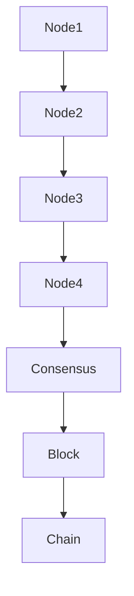
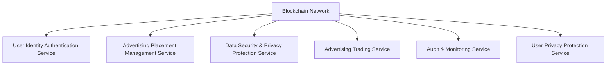

                 

### 《区块链在数字广告中的透明度应用》——文章关键词

在撰写这篇文章之前，我们需要明确几个核心关键词，这些关键词将帮助读者快速抓住文章的核心内容，同时也为搜索引擎优化（SEO）提供关键词支持。以下是《区块链在数字广告中的透明度应用》的关键词：

1. **区块链**：作为文章的核心技术，区块链是一个去中心化、安全、透明的分布式账本技术。
2. **数字广告**：指的是利用互联网进行的广告活动，包括各种广告形式和平台。
3. **透明度**：在广告领域，透明度是指广告投放、点击、数据追踪等过程的可见性和可解释性。
4. **去中心化**：区块链的一个重要特点，指的是没有中央控制机构，数据由网络中的所有参与者共同维护。
5. **加密算法**：用于确保区块链数据的安全性和隐私性。
6. **智能合约**：区块链上的自动执行合约，可以用于自动化广告交易。
7. **共识算法**：区块链网络中节点达成一致性的算法，用于验证交易。
8. **数据追踪**：跟踪用户在广告活动中的行为和数据。
9. **数字身份**：在区块链上为用户提供匿名但可验证的身份。
10. **广告欺诈**：广告活动中常见的问题，如点击欺诈、虚假流量等。

这些关键词不仅有助于定义文章的主题，还可以吸引对区块链、数字广告和透明度感兴趣的读者。在文章的后续部分，我们将逐一深入探讨这些关键词的相关内容，解释它们在数字广告透明度中的应用和重要性。

### 摘要

随着数字广告行业的迅猛发展，广告透明度问题日益凸显。广告主、广告平台和用户三者之间存在着信息不对称，导致广告投放效果不佳、广告欺诈问题频发。区块链技术以其去中心化、安全透明、不可篡改的特性，为解决数字广告中的透明度问题提供了新的思路。本文将从区块链、数字广告和透明度的核心概念入手，通过详细剖析区块链在数字广告中的应用，探讨如何利用区块链技术提升广告的透明度。首先，我们将介绍区块链的基本原理和数字广告的发展背景，分析透明度问题的重要性及其现状。随后，我们将详细解释区块链如何通过共识算法、加密算法和智能合约等技术手段，增强广告活动的透明性，减少欺诈行为。接着，通过数学模型和Python代码示例，深入阐述区块链在透明度应用中的具体实现。最后，本文将介绍一个实际项目，展示区块链在数字广告透明度中的应用效果，并提供最佳实践建议，以期为行业提供参考和指导。

## 第1章：背景介绍

### 1.1 问题背景

在数字广告行业中，透明度问题一直是一个备受关注的话题。广告主希望通过有效的广告投放获取最大的商业价值，而广告平台和媒体则需要保证广告的投放质量和效果，从而吸引更多的广告主。然而，信息不对称和信任问题导致了整个行业存在诸多痛点。

首先，广告主往往难以追踪广告的实际投放效果，无法准确判断广告投放的ROI（投资回报率）。广告平台和媒体在广告投放过程中，可能会出现数据篡改、点击欺诈、虚假流量等问题，使得广告主的广告费用被浪费。这种情况下，广告主对广告平台的信任度下降，影响长期的合作关系。

其次，广告平台和媒体之间的利益冲突也加剧了透明度问题。一些媒体可能会通过作弊手段获取更高的广告收益，如虚假点击、刷量等。这种行为不仅损害了广告主的利益，也降低了广告行业的整体诚信度。

此外，用户隐私保护也是数字广告中的一大挑战。广告平台在收集和分析用户数据时，可能会涉及用户的个人信息，如浏览历史、地理位置等。如果这些数据不被妥善保护，可能会被不法分子利用，导致用户隐私泄露。

综上所述，数字广告行业的透明度问题不仅影响了广告主和广告平台之间的信任，也威胁到了用户的隐私和安全。解决这些问题，提升广告透明度，成为行业亟待解决的重要课题。

### 1.2 问题描述

数字广告中的透明度问题主要体现在以下几个方面：

首先是广告投放效果的不可追踪性。广告主在投放广告时，往往无法准确了解到广告的实际曝光量、点击量以及用户的互动情况。这种信息的不对称性导致广告主无法对广告效果进行有效的评估和优化，进而影响了广告的投资回报率（ROI）。

其次是广告欺诈问题。广告欺诈包括点击欺诈、虚假流量和刷单等行为，这些行为不仅浪费了广告主的预算，还严重损害了广告的真实性和可信度。点击欺诈通常是指通过人工或自动化手段伪造点击，从而获取广告收益，而虚假流量则是通过技术手段生成虚假的访问数据，以此欺骗广告主。

第三是用户隐私保护问题。在数字广告中，广告平台和媒体通常会收集和分析大量的用户数据，如浏览历史、地理位置、行为习惯等。这些数据的收集和处理如果不被妥善保护，可能会引发用户隐私泄露的风险。

第四是广告投放过程的透明度不足。广告主和广告平台之间缺乏有效的沟通和透明的交易流程，导致广告主在投放过程中无法清晰地了解广告的展示和投放细节。

最后是广告行业的诚信问题。由于透明度不足，广告行业存在大量作弊和不正当竞争行为，这不仅损害了广告主的利益，也损害了整个行业的健康发展。

综上所述，数字广告中的透明度问题涉及多个方面，不仅影响了广告主和广告平台之间的信任，也对用户的隐私和安全构成了威胁。因此，解决这些问题，提升广告透明度，是数字广告行业可持续发展的重要保障。

### 1.3 问题解决

为了解决数字广告中的透明度问题，区块链技术提供了一个全新的解决方案。区块链技术以其去中心化、安全透明、不可篡改的特性，为提升广告透明度提供了有力的支持。以下将详细介绍区块链技术在解决数字广告透明度问题中的应用和优势。

首先，区块链的去中心化特性使得广告活动中的数据不再由单一中心控制，而是由网络中的所有参与者共同维护。这一特性有助于消除广告平台和媒体在广告投放过程中的信息不对称问题。例如，广告主可以通过区块链技术直接追踪广告的投放过程，包括曝光量、点击量、用户互动情况等，从而提高广告投放的透明度和可控性。

其次，区块链的加密算法确保了广告活动中的数据安全性和隐私性。广告主和广告平台在区块链上存储和传输数据时，可以通过加密算法对数据进行加密处理，只有拥有相应私钥的用户才能解密和查看数据。这种加密机制有效防止了数据篡改和泄露，保护了用户的隐私。

再次，区块链的智能合约功能为广告交易提供了自动化和透明化的解决方案。智能合约是一种自动执行合约的代码，它可以确保广告投放过程中的每个步骤都严格按照预定的规则进行。例如，广告主可以在智能合约中设定广告投放的预算、投放时间、投放平台等参数，一旦达到特定条件，智能合约会自动执行广告投放并结算费用，从而提高了广告投放的效率和透明度。

此外，区块链的共识算法确保了网络中的所有节点对数据的共识和一致性。在广告行业中，这意味着所有参与者对广告数据的记录和验证都是一致的，从而避免了数据冲突和不一致的问题。例如，通过区块链的共识算法，广告主、广告平台和媒体可以共同记录广告投放的数据，确保数据的真实性和可信性。

最后，区块链的可追溯性特征有助于打击广告欺诈行为。在区块链上，每个交易记录都是公开透明的，且一旦被记录下来就不可篡改。这意味着任何参与者在广告活动中的行为都可以被追溯和审计，从而有效遏制了点击欺诈、虚假流量等欺诈行为。

总之，区块链技术通过去中心化、加密算法、智能合约和共识算法等多种手段，为解决数字广告中的透明度问题提供了全新的解决方案。随着区块链技术的不断发展和应用，相信广告行业的透明度和可信度将得到显著提升。

### 1.4 边界与外延

在讨论区块链在数字广告中的透明度应用时，有必要明确其适用范围和非适用情况。首先，区块链技术适合解决那些需要高度透明、不可篡改和数据可追溯的场景。例如，广告主可以通过区块链技术追踪广告投放的全过程，确保数据的真实性和可靠性，这对于打击广告欺诈和提升用户信任具有重要意义。

其次，区块链在数字广告中的应用也受到一些限制。例如，区块链技术的高昂成本和复杂的操作流程可能会限制其在大规模广告活动中的普及。此外，区块链网络的性能和扩展性也是需要考虑的问题，尤其是在处理海量数据时，区块链的技术瓶颈可能会影响其应用效果。

在非适用情况方面，区块链技术不适用于那些对实时性和速度要求极高的广告活动。例如，实时广告投放和秒杀活动等场景，区块链的高延迟问题可能会影响用户体验。此外，对于某些小型广告主或初创公司来说，区块链技术可能因其成本和技术门槛而难以普及。

总之，区块链在数字广告中的透明度应用具有广阔的前景，但也需要在适用范围和非适用情况上做出合理判断和策略选择。通过综合考虑技术优势和应用限制，可以更好地发挥区块链技术在广告行业中的作用，提升整体透明度和可信度。

### 第2章：核心概念与联系

在深入探讨区块链在数字广告中的应用之前，我们需要理解几个关键概念：区块链、数字广告、透明度。这些概念不仅构成了本文讨论的基础，也是实现广告透明度的核心要素。

#### 2.1 区块链概述

区块链是一种分布式数据库技术，通过加密算法和共识机制确保数据的安全性和不可篡改性。其基本原理是将数据分为多个区块，并通过加密技术将这些区块链接成一个链条，形成一个去中心化的数据库。每个区块包含一定数量的交易记录，并且每次交易都会被全网节点验证和记录。

区块链的特点包括：

- **去中心化**：没有中央控制机构，数据由网络中的所有参与者共同维护。
- **不可篡改**：一旦数据被记录在区块链上，就不可篡改，保证了数据的一致性和可靠性。
- **透明性**：区块链上的所有数据都是公开透明的，每个参与者都可以查看和验证数据。
- **安全性**：通过加密算法确保数据在传输和存储过程中的安全性。

#### 2.2 数字广告概述

数字广告是指通过互联网进行的广告活动，包括搜索引擎广告、社交媒体广告、展示广告、视频广告等多种形式。数字广告具有以下特点：

- **精准定位**：基于用户行为和兴趣数据，实现广告的精准投放。
- **实时反馈**：广告投放效果可以实时监测和反馈，帮助广告主进行优化。
- **高效传播**：互联网的普及使得广告可以迅速传播到全球各地。
- **多样化形式**：数字广告形式多样，能够满足不同广告主的需求。

数字广告的发展历程可以分为几个阶段：

- **起步阶段**：互联网广告的初步尝试，广告形式较为单一。
- **发展阶段**：随着技术进步，广告形式和投放手段日益丰富。
- **成熟阶段**：数据驱动广告成为主流，广告投放更加精准和高效。

#### 2.3 透明度概念

透明度是指信息的可见性和可解释性。在数字广告中，透明度尤为重要，因为它涉及到广告主、广告平台和用户之间的信任关系。广告透明度包括以下几个方面：

- **广告投放透明**：广告主可以实时追踪广告的投放情况，包括曝光量、点击量、转化率等。
- **数据透明**：广告平台和媒体公开其数据收集、处理和使用的规则，保证数据的真实性和合法性。
- **交易透明**：广告主和广告平台之间的交易过程公开透明，确保费用的合理性和真实性。
- **用户隐私透明**：广告主和广告平台应明确告知用户其数据收集和使用情况，保护用户隐私。

#### 2.4 概念对比与分析

为了更好地理解区块链、数字广告和透明度之间的关系，我们通过一个概念对比表格和ER实体关系图来进行分析。

| 概念     | 定义                                                         | 关联关系                                                       |
|----------|--------------------------------------------------------------|--------------------------------------------------------------|
| 区块链   | 去中心化、安全透明、不可篡改的分布式数据库技术               | 支撑数字广告中的数据透明和安全传输                           |
| 数字广告 | 通过互联网进行的广告活动，包括多种形式和投放手段             | 利用区块链技术提升广告透明度和可信度                         |
| 透明度   | 信息的可见性和可解释性                                     | 在数字广告中，通过区块链技术实现广告投放、数据和使用过程的透明 |

#### ER实体关系图

为了更直观地展示这些概念之间的关系，我们使用Mermaid绘制一个ER实体关系图：

```mermaid
erDiagram
    ADVERTISER ||--|{ DIGITAL_ADVERTISEMENT }|--| ADVERTISING_PLATFORM
    ADVERTISING_PLATFORM ||--|{ BLOCKCHAIN_NETWORK }|--| DATA_ANALYST
    ADVERTISER ||--|{ USER }|--| ADVERTISING_PLATFORM
    DATA_ANALYST ||--|{ USER_BEHAVIOR_DATA }|--| ADVERTISING_PLATFORM
```

在这个ER图中，广告主（ADVERTISER）通过广告平台（ADVERTISING_PLATFORM）投放数字广告（DIGITAL_ADVERTISEMENT），广告平台利用区块链网络（BLOCKCHAIN_NETWORK）进行数据分析和处理，数据分析师（DATA_ANALYST）负责收集和分析用户行为数据（USER_BEHAVIOR_DATA）。用户（USER）是广告投放的目标，广告平台通过区块链网络实现数据透明和安全传输。

通过概念对比表格和ER实体关系图，我们可以清晰地看到区块链、数字广告和透明度之间的关系。区块链技术通过提供透明、安全和不可篡改的数据库，支持数字广告中的数据管理和透明度提升，从而增强广告主、广告平台和用户之间的信任关系。

### 第3章：算法原理讲解

#### 3.1 区块链算法简介

区块链算法是实现区块链技术核心功能的基础。这些算法包括共识算法、加密算法和智能合约，它们分别负责确保区块链网络中的数据一致性、数据安全和自动化交易执行。以下是对这些算法的简要介绍：

**共识算法**：共识算法是区块链网络中节点达成一致性的机制。它的主要功能是确保每个节点所记录的区块链数据是一致的。常见的共识算法有工作量证明（Proof of Work, PoW）、权益证明（Proof of Stake, PoS）和委托权益证明（Delegated Proof of Stake, DPoS）等。PoW算法通过解决计算难题来证明节点的合法性，而PoS算法则通过持有币的数量来决定节点的权重，DPoS则是通过选举出代表节点来执行共识任务。

**加密算法**：加密算法用于确保区块链上数据的传输和存储过程中的安全性。常见的加密算法有哈希函数（Hash Function）、对称加密（Symmetric Encryption）和非对称加密（Asymmetric Encryption）。哈希函数用于将任意长度的数据映射为固定长度的字符串，保证了数据的唯一性和不可篡改性。对称加密和非对称加密分别用于保证数据在传输过程中的机密性和完整性。

**智能合约**：智能合约是一种自动执行合约的代码，它可以在区块链上执行预定义的规则。智能合约通过编程语言（如Solidity）编写，一旦满足触发条件，智能合约就会自动执行相应的操作。智能合约的应用非常广泛，包括自动化交易、身份验证、数据管理等。

#### 3.2 Mermaid流程图

Mermaid是一种基于Markdown的绘图工具，它允许用户通过简单的文本描述生成流程图、UML图等。以下是一个简单的区块链共识算法的Mermaid流程图示例：



在这个流程图中，节点1（Node1）向节点2（Node2）发送数据，节点2再将数据传递给节点3（Node3），节点3传递给节点4（Node4）。节点4通过共识算法（Consensus）验证数据的正确性，并生成区块（Block），最终将区块加入到区块链（Chain）中。

#### 3.3 Python代码示例

为了更好地理解区块链算法的原理，我们可以通过Python代码来模拟一个简单的区块链网络。以下是一个简单的Python代码示例，用于创建和验证区块链中的区块。

```python
import hashlib
import json
from time import time

class Block:
    def __init__(self, index, transactions, timestamp, previous_hash):
        self.index = index
        self.transactions = transactions
        self.timestamp = timestamp
        self.previous_hash = previous_hash
        self.hash = self.compute_hash()

    def compute_hash(self):
        block_string = json.dumps(self.__dict__, sort_keys=True)
        return hashlib.sha256(block_string.encode()).hexdigest()

class Blockchain:
    def __init__(self):
        self.unconfirmed_transactions = []
        self.chain = []
        self.create_genesis_block()

    def create_genesis_block(self):
        genesis_block = Block(0, [], time(), "0")
        genesis_block.hash = genesis_block.compute_hash()
        self.chain.append(genesis_block)

    def add_new_transaction(self, transaction):
        self.unconfirmed_transactions.append(transaction)

    def mine(self):
        if not self.unconfirmed_transactions:
            return False
        
        last_block = self.chain[-1]
        new_block = Block(index=last_block.index + 1,
                          transactions=self.unconfirmed_transactions,
                          timestamp=time(),
                          previous_hash=last_block.hash)
        
        new_block.hash = new_block.compute_hash()
        self.chain.append(new_block)
        self.unconfirmed_transactions = []
        return new_block.hash

    def is_chain_valid(self):
        for i in range(1, len(self.chain)):
            current = self.chain[i]
            previous = self.chain[i - 1]
            if current.hash != current.compute_hash():
                return False
            if current.previous_hash != previous.hash:
                return False
        return True

# 创建区块链实例
blockchain = Blockchain()

# 添加新交易
blockchain.add_new_transaction("Transaction 1")
blockchain.add_new_transaction("Transaction 2")

# 挖掘新区块
print("Mining new block...", blockchain.mine())

# 检查链是否有效
if blockchain.is_chain_valid():
    print("Blockchain is valid")
else:
    print("Blockchain is invalid")
```

在这个示例中，我们定义了`Block`和`Blockchain`两个类。`Block`类用于创建区块，包含索引、交易、时间戳和前一个区块的哈希值。`Blockchain`类用于管理整个区块链，包括创建创世区块、添加新交易和挖掘新区块等功能。

通过这个示例，我们可以看到区块链的基本工作原理：通过创建区块并将其链接成一个链条，确保数据的一致性和不可篡改性。同时，通过挖矿过程来验证交易的合法性并生成新区块，从而维护区块链的完整性。

#### 3.4 数学模型介绍

在区块链算法中，数学模型起到了关键作用。以下将介绍区块链算法中的一些常见数学模型，包括哈希函数、工作量证明和权益证明等。

**哈希函数**：哈希函数是将任意长度的输入映射为固定长度的字符串的函数。在区块链中，哈希函数用于确保数据的唯一性和不可篡改性。常见的哈希函数有SHA-256和SHA-3。

**工作量证明（PoW）**：工作量证明是一种用于区块链网络中的共识算法。节点需要通过计算大量工作量来证明其合法性。在PoW中，节点需要找到一个满足特定条件的哈希值，通常这个条件是哈希值必须小于某个阈值。这个过程称为“挖矿”。

**权益证明（PoS）**：权益证明是另一种用于区块链网络的共识算法。与PoW不同，PoS通过持有币的数量来决定节点的合法性。节点持有币的时间越长，其成为下一个区块的生成者的概率就越高。

**委托权益证明（DPoS）**：委托权益证明是PoS的一种变体。在DPoS中，节点通过选举代表来执行共识任务。这些代表节点根据持有币的数量和持币时间来确定其权重。

**数学模型**：

1. **哈希函数**：\( H = SHA-256(K) \)
   - \( H \)：输出的哈希值
   - \( K \)：输入的数据

2. **工作量证明**：找到\( n \)个连续的随机数\( x_1, x_2, ..., x_n \)，使得：
   \[ H(x_1, x_2, ..., x_n) < threshold \]
   - \( threshold \)：预设的阈值

3. **权益证明**：节点的合法性概率与其持有币的数量成正比：
   \[ P = \frac{stake_i}{total_stake} \]
   - \( P \)：节点的合法性概率
   - \( stake_i \)：节点i持有的币数量
   - \( total_stake \)：总币量

4. **委托权益证明**：代表节点的合法性概率与其权重成正比：
   \[ P = \frac{weight_i}{total_weight} \]
   - \( P \)：节点的合法性概率
   - \( weight_i \)：节点i的权重
   - \( total_weight \)：总权重

通过这些数学模型，区块链算法可以确保数据的一致性、安全性和透明性，从而实现去中心化的数据管理和交易。

#### 3.5 数学公式讲解

在区块链算法中，数学公式的应用至关重要。以下将详细讲解几个关键数学公式及其在区块链算法中的应用。

**1. 哈希函数公式**

哈希函数是区块链技术中用于确保数据一致性和不可篡改性的基础。一个简单的哈希函数公式可以表示为：

\[ H = SHA-256(K) \]

其中：
- \( H \) 表示输出的哈希值。
- \( K \) 表示输入的数据。

在区块链中，每次添加新数据（如交易记录）时，都会使用哈希函数计算其哈希值，并将其存储在区块链中。这种方式确保了数据的唯一性和不可篡改性，因为任何对数据的更改都会导致哈希值的改变，从而被区块链网络中的其他节点检测到。

**2. 工作量证明（PoW）公式**

工作量证明是区块链网络中常用的共识算法之一。其核心思想是节点需要通过计算大量工作量来证明其合法性。一个简单的工作量证明的公式可以表示为：

\[ H(x_1, x_2, ..., x_n) < threshold \]

其中：
- \( H \) 表示哈希函数。
- \( x_1, x_2, ..., x_n \) 表示连续的随机数。
- \( threshold \) 表示预设的阈值。

节点需要找到满足上述条件的随机数序列，从而证明其合法性。这个过程被称为“挖矿”。挖矿的成功概率与节点计算能力成正比，确保了区块链网络中的合法节点能够获得奖励。

**3. 权益证明（PoS）公式**

权益证明是一种通过持有币的数量来决定节点合法性的共识算法。其公式可以表示为：

\[ P = \frac{stake_i}{total_stake} \]

其中：
- \( P \) 表示节点的合法性概率。
- \( stake_i \) 表示节点i持有的币数量。
- \( total_stake \) 表示总币量。

权益证明认为，持有币数量越多，节点就越有资格参与区块链的验证和记账过程。这种方式能够鼓励节点长期持有币，从而维护区块链网络的稳定性和安全性。

**4. 委托权益证明（DPoS）公式**

委托权益证明是权益证明的一种变体，通过选举代表节点来执行共识任务。其公式可以表示为：

\[ P = \frac{weight_i}{total_weight} \]

其中：
- \( P \) 表示节点的合法性概率。
- \( weight_i \) 表示节点i的权重。
- \( total_weight \) 表示总权重。

在DPoS中，节点通过持有币数量和持币时间来获得权重。选举出的代表节点根据其权重来决定是否参与区块链的验证和记账过程。这种方式能够提高区块链网络的效率，并减少能源消耗。

通过这些数学公式，区块链算法能够实现去中心化的数据管理和交易，确保区块链网络的可靠性和透明性。在数字广告领域，这些公式有助于提高广告投放的透明度和可信度，减少欺诈行为。

#### 3.6 举例说明

为了更直观地理解区块链算法中的数学公式，我们通过一个简单的例子来说明其应用。

假设我们有一个区块链网络，节点A和节点B需要进行工作量证明（PoW）来证明其合法性。

**1. 工作量证明（PoW）例子**

阈值 \( threshold \) 设置为100。

节点A计算了一系列的随机数 \( x_1, x_2, x_3 \)，并使用SHA-256哈希函数计算其哈希值：
- \( x_1 = 12345 \)
- \( H(x_1) = 5a1c2d3e4f5g6h7i8j9k0 \)
- \( threshold = 100 \)

由于 \( H(x_1) > threshold \)，节点A继续计算下一个随机数 \( x_2 \)：
- \( x_2 = 67890 \)
- \( H(x_2) = c1d2e3f4g5h6i7j8k9l0 \)

同样，\( H(x_2) > threshold \)，节点A继续计算 \( x_3 \)：
- \( x_3 = 24681 \)
- \( H(x_3) = 8a7b6c5d4e3f2g1h0i \)

这一次，节点A发现 \( H(x_3) < threshold \)，因此节点A成功完成了工作量证明，其合法性得到验证。

**2. 权益证明（PoS）例子**

假设区块链网络中有两个节点，节点A持有100个币，节点B持有50个币，总币量为150个。

根据权益证明的公式：
\[ P = \frac{stake_i}{total_stake} \]

节点A的合法性概率为：
\[ P(A) = \frac{100}{150} = 0.67 \]

节点B的合法性概率为：
\[ P(B) = \frac{50}{150} = 0.33 \]

因此，节点A的合法性概率是节点B的两倍。

**3. 委托权益证明（DPoS）例子**

假设区块链网络中有两个节点，节点A的权重为70，节点B的权重为30。

根据委托权益证明的公式：
\[ P = \frac{weight_i}{total_weight} \]

节点A的合法性概率为：
\[ P(A) = \frac{70}{100} = 0.7 \]

节点B的合法性概率为：
\[ P(B) = \frac{30}{100} = 0.3 \]

因此，节点A的合法性概率是节点B的两倍，这反映了节点A在区块链网络中的重要性。

通过这些例子，我们可以看到数学公式在区块链算法中的应用。这些公式确保了区块链网络的数据一致性、安全性和透明性，从而为数字广告中的透明度提升提供了强有力的支持。

### 第4章：数学模型和数学公式

在区块链算法中，数学模型和数学公式扮演着至关重要的角色，它们不仅确保了区块链系统的安全性，还为透明度和去中心化提供了理论基础。本节将详细介绍区块链在数字广告透明度应用中的数学模型，并使用LaTeX格式表示相关数学公式，进行详细讲解和举例说明。

#### 4.1 数学模型概述

区块链算法中的数学模型主要包括哈希函数、工作量证明（PoW）、权益证明（PoS）和委托权益证明（DPoS）等。以下是这些模型的概述：

1. **哈希函数**：用于将输入数据映射为固定长度的哈希值，确保数据的唯一性和不可篡改性。
2. **工作量证明（PoW）**：节点通过计算大量工作量（如找到满足特定条件的哈希值）来证明其合法性。
3. **权益证明（PoS）**：节点根据持有币的数量（权益）来决定其合法性概率。
4. **委托权益证明（DPoS）**：通过选举出代表节点来执行共识任务，节点根据其权重来决定合法性概率。

#### 4.2 数学公式表示

以下是区块链算法中常用的数学公式，使用LaTeX格式表示：

1. **哈希函数**：
   \[ H = SHA-256(K) \]
   其中，\( H \) 是输出的哈希值，\( K \) 是输入的数据。

2. **工作量证明（PoW）**：
   \[ H(x_1, x_2, ..., x_n) < threshold \]
   其中，\( H \) 是哈希函数，\( x_1, x_2, ..., x_n \) 是连续的随机数，\( threshold \) 是预设的阈值。

3. **权益证明（PoS）**：
   \[ P = \frac{stake_i}{total_stake} \]
   其中，\( P \) 是节点的合法性概率，\( stake_i \) 是节点i的持有币数量，\( total_stake \) 是总币量。

4. **委托权益证明（DPoS）**：
   \[ P = \frac{weight_i}{total_weight} \]
   其中，\( P \) 是节点的合法性概率，\( weight_i \) 是节点i的权重，\( total_weight \) 是总权重。

#### 4.3 公式详细讲解

**1. 哈希函数公式讲解**

哈希函数是区块链技术中的基础，其核心作用是确保数据的唯一性和不可篡改性。在区块链中，每次交易记录或区块生成时，都会使用哈希函数计算其哈希值，并将其存储在区块链上。这个过程可以表示为：

\[ H = SHA-256(K) \]

这里，\( H \) 表示输出的哈希值，\( K \) 表示输入的数据。SHA-256是一种常用的哈希算法，能够将任意长度的数据映射为一个128位的哈希值。由于哈希函数的特性，任何对数据的微小更改都会导致哈希值的巨大变化，这使得区块链上的数据具有高度的不可篡改性。

**2. 工作量证明（PoW）公式讲解**

工作量证明是一种通过计算大量工作量来证明节点合法性的共识算法。在PoW中，节点需要找到一个满足特定条件的哈希值。这个过程可以表示为：

\[ H(x_1, x_2, ..., x_n) < threshold \]

其中，\( H \) 是哈希函数，\( x_1, x_2, ..., x_n \) 是连续的随机数，\( threshold \) 是预设的阈值。节点通过不断尝试不同的随机数序列，直到找到满足条件的哈希值，从而证明其合法性。这个过程需要大量的计算资源，因此称为“挖矿”。

**3. 权益证明（PoS）公式讲解**

权益证明是一种通过持有币的数量来决定节点合法性的共识算法。在PoS中，节点持有币的数量（权益）决定了其成为下一个区块生成者的概率。这个过程可以表示为：

\[ P = \frac{stake_i}{total_stake} \]

其中，\( P \) 是节点的合法性概率，\( stake_i \) 是节点i的持有币数量，\( total_stake \) 是总币量。持有币数量越多，节点的合法性概率就越高，从而提高了整个区块链网络的稳定性。

**4. 委托权益证明（DPoS）公式讲解**

委托权益证明是权益证明的一种变体，通过选举出代表节点来执行共识任务。在DPoS中，节点根据其持有币的数量和持币时间来获得权重，从而决定其合法性概率。这个过程可以表示为：

\[ P = \frac{weight_i}{total_weight} \]

其中，\( P \) 是节点的合法性概率，\( weight_i \) 是节点i的权重，\( total_weight \) 是总权重。选举出的代表节点根据其权重来决定是否参与区块链的验证和记账过程。这种方式能够提高区块链网络的效率，并减少能源消耗。

#### 4.4 举例说明

为了更直观地理解这些数学公式，我们通过一个实际例子进行说明。

**1. 工作量证明（PoW）举例**

假设区块链网络的阈值为100，节点A和节点B需要进行工作量证明。

节点A尝试了一系列的随机数 \( x_1, x_2, x_3 \)：
- \( x_1 = 12345 \)，\( H(x_1) = 5a1c2d3e4f5g6h7i8j9k0 \)，\( H(x_1) > 100 \)
- \( x_2 = 67890 \)，\( H(x_2) = c1d2e3f4g5h6i7j8k9l0 \)，\( H(x_2) > 100 \)
- \( x_3 = 24681 \)，\( H(x_3) = 8a7b6c5d4e3f2g1h0i \)，\( H(x_3) < 100 \)

节点A成功找到了满足条件的哈希值，其合法性得到验证。

**2. 权益证明（PoS）举例**

假设区块链网络中有两个节点，节点A持有100个币，节点B持有50个币。

根据权益证明的公式：
\[ P(A) = \frac{100}{150} = 0.67 \]
\[ P(B) = \frac{50}{150} = 0.33 \]

节点A的合法性概率为67%，节点B的合法性概率为33%。

**3. 委托权益证明（DPoS）举例**

假设区块链网络中有两个节点，节点A的权重为70，节点B的权重为30。

根据委托权益证明的公式：
\[ P(A) = \frac{70}{100} = 0.7 \]
\[ P(B) = \frac{30}{100} = 0.3 \]

节点A的合法性概率为70%，节点B的合法性概率为30%。

通过这些例子，我们可以看到数学公式在区块链算法中的实际应用。这些公式不仅确保了区块链系统的安全性，还为数字广告透明度的提升提供了有力支持。

### 第5章：系统分析与架构设计方案

#### 5.1 问题场景介绍

在数字广告行业中，广告主、广告平台和用户之间的信息不对称和透明度不足问题日益突出。广告主希望通过广告投放获得最大化的商业价值，但往往无法准确追踪广告的效果，难以判断广告费用是否合理。广告平台和媒体在广告投放过程中，可能会存在数据篡改、点击欺诈、虚假流量等问题，导致广告主对广告平台的信任度下降。此外，用户隐私保护也是一大挑战，广告平台在收集和分析用户数据时，可能涉及用户的个人信息，如浏览历史、地理位置等。如果这些数据被不法分子利用，将严重威胁用户隐私和安全。

针对这些问题，区块链技术提供了一个可行的解决方案。通过区块链技术，可以实现广告活动的全流程透明，确保数据的真实性和安全性，从而提升广告行业的透明度和可信度。具体来说，区块链技术可以用于以下几个方面：

1. **广告投放透明**：通过区块链记录广告投放的全过程，包括曝光量、点击量、用户互动情况等，广告主可以实时追踪广告效果，判断广告费用是否合理。
2. **数据安全与隐私保护**：区块链的加密算法确保广告活动中的数据在传输和存储过程中的安全性，防止数据篡改和泄露。
3. **打击广告欺诈**：通过区块链的不可篡改性，可以追踪和审计广告活动中的每一个步骤，及时发现和打击点击欺诈、虚假流量等欺诈行为。
4. **优化广告交易**：区块链的智能合约功能可以实现广告交易自动化和透明化，确保广告主和广告平台之间的交易过程公开透明。

#### 5.2 系统功能设计

为了实现上述目标，我们设计了一个基于区块链的数字广告透明度系统，主要包括以下几个功能模块：

1. **用户身份认证模块**：用于确保用户身份的唯一性和合法性。用户在参与广告活动前，需要通过区块链进行身份认证，确保其身份真实可信。
2. **广告投放管理模块**：用于管理广告投放的全过程，包括广告创建、投放设置、投放监控等。广告主可以通过区块链记录广告投放的详细信息，实时追踪广告效果。
3. **数据安全与隐私保护模块**：用于确保广告活动中的数据安全性和隐私性。区块链的加密算法可以确保数据在传输和存储过程中的安全，防止数据泄露。
4. **广告交易模块**：用于实现广告主和广告平台之间的交易自动化和透明化。通过智能合约，可以确保广告费用结算的公开透明，防止作弊行为。
5. **审计与监控模块**：用于对广告活动进行审计和监控，及时发现和打击欺诈行为。通过区块链的不可篡改性，可以确保审计记录的真实性和可信性。
6. **用户隐私保护模块**：用于确保用户隐私不被泄露。在广告活动中，用户数据将被加密处理，并存储在区块链上，只有授权用户才能查看和访问。

#### 5.3 系统架构设计

基于上述功能模块，我们设计了一个基于区块链的数字广告透明度系统的总体架构，包括以下关键部分：

1. **区块链网络**：作为系统的基础，区块链网络负责存储和管理所有广告活动的数据。网络中的每个节点都参与数据的验证和存储，确保数据的一致性和安全性。
2. **用户身份认证服务**：用于对用户身份进行认证，确保其参与广告活动的合法性。用户身份认证服务通过加密算法和智能合约来实现。
3. **广告投放管理服务**：用于管理广告投放的全过程，包括广告创建、投放设置、投放监控等。广告投放管理服务通过区块链记录和追踪广告投放的详细信息。
4. **数据安全与隐私保护服务**：用于确保广告活动中的数据在传输和存储过程中的安全性。数据安全与隐私保护服务通过加密算法和区块链的不可篡改性来实现。
5. **广告交易服务**：用于实现广告主和广告平台之间的交易自动化和透明化。广告交易服务通过智能合约来实现广告费用的结算和支付。
6. **审计与监控服务**：用于对广告活动进行审计和监控，及时发现和打击欺诈行为。审计与监控服务通过区块链的不可篡改性来确保审计记录的真实性和可信性。
7. **用户隐私保护服务**：用于确保用户隐私不被泄露。用户隐私保护服务通过加密算法和区块链的隐私保护特性来实现。

系统架构图如下所示：



通过这个架构设计，我们可以实现广告活动的全流程透明，确保数据的真实性和安全性，从而提升广告行业的透明度和可信度。

#### 5.4 系统接口设计

为了确保系统的功能模块之间能够有效协作，我们需要设计一套完整的系统接口。以下是基于区块链的数字广告透明度系统的主要接口设计：

1. **用户身份认证接口**：用于用户身份的注册、认证和验证。该接口包括用户注册接口、认证接口和验证接口。

   - **用户注册接口**：用户可以通过该接口注册区块链账户，并获得公私钥对。
     ```python
     def register_user(username, password):
         # 注册用户
         return create_user_account(username, password)
     ```

   - **认证接口**：用于验证用户的登录信息，确保用户身份的合法性。
     ```python
     def authenticate_user(username, password):
         # 验证用户登录
         return verify_login(username, password)
     ```

   - **验证接口**：用于验证用户的身份，确保用户在参与广告活动时的身份真实有效。
     ```python
     def verify_user_identity(user_id):
         # 验证用户身份
         return is_identity_verified(user_id)
     ```

2. **广告投放管理接口**：用于管理广告投放的全过程，包括广告创建、投放设置、投放监控等。

   - **广告创建接口**：用于创建新广告，设置广告的基本信息和投放参数。
     ```python
     def create_advertisement(ad_details):
         # 创建广告
         return generate_advertisement_contract(ad_details)
     ```

   - **投放设置接口**：用于设置广告的投放参数，如投放时间、投放平台、投放预算等。
     ```python
     def set_advertisement_settings(ad_id, settings):
         # 设置广告投放参数
         return update_advertisement_contract(ad_id, settings)
     ```

   - **投放监控接口**：用于实时监控广告的投放效果，包括曝光量、点击量、转化率等。
     ```python
     def monitor_advertisement(ad_id):
         # 监控广告投放效果
         return fetch_advertisement_performance(ad_id)
     ```

3. **数据安全与隐私保护接口**：用于确保广告活动中的数据在传输和存储过程中的安全性。

   - **数据加密接口**：用于对广告数据、用户数据等进行加密处理，确保数据在传输过程中的安全性。
     ```python
     def encrypt_data(data, key):
         # 加密数据
         return encrypt_data_with_key(data, key)
     ```

   - **数据存储接口**：用于将加密后的数据存储在区块链上，确保数据的安全性和不可篡改性。
     ```python
     def store_data_on_blockchain(data):
         # 存储数据到区块链
         return submit_data_to_blockchain(data)
     ```

4. **广告交易接口**：用于实现广告主和广告平台之间的交易自动化和透明化。

   - **广告投放接口**：用于启动广告投放，并触发智能合约执行广告费用结算。
     ```python
     def initiate_advertisement(ad_id):
         # 启动广告投放
         return execute_advertisement_contract(ad_id)
     ```

   - **费用结算接口**：用于处理广告投放后的费用结算，确保广告费用的公开透明。
     ```python
     def settle_advertisement_fees(ad_id, fees):
         # 结算广告费用
         return execute_payment_contract(ad_id, fees)
     ```

5. **审计与监控接口**：用于对广告活动进行审计和监控，及时发现和打击欺诈行为。

   - **审计记录接口**：用于记录广告活动的所有审计信息，确保审计记录的真实性和可信性。
     ```python
     def record_audit_logs(audit_info):
         # 记录审计日志
         return log_audit_info(audit_info)
     ```

   - **监控报警接口**：用于监控广告活动中的异常行为，如点击欺诈、虚假流量等，并触发报警。
     ```python
     def monitor_advertisement_for_abnormalities(ad_id):
         # 监控广告异常行为
         return detect_and_report_fraudulent_activities(ad_id)
     ```

通过这些接口设计，我们可以确保系统的各个功能模块之间能够无缝协作，从而实现广告活动的全流程透明、数据安全和隐私保护，提升广告行业的整体透明度和可信度。

### 第6章：项目实战

#### 6.1 环境安装

为了实现区块链在数字广告中的透明度应用，首先需要在本地搭建一个区块链开发环境。以下是详细的安装步骤：

**1. 安装Go语言环境**

区块链开发通常使用Go语言，因此首先需要安装Go语言环境。可以从[Go官方下载页](https://golang.google.cn/)下载最新的Go语言安装包，并按照提示完成安装。

- **Windows系统**：下载对应版本的.msi文件，双击安装。
- **Linux系统**：下载对应版本的.tar.gz文件，解压并设置环境变量。

安装完成后，打开命令行窗口，输入以下命令验证安装：
```bash
go version
```
若显示Go语言的版本信息，则安装成功。

**2. 安装Node.js环境**

区块链的前端开发通常使用Node.js，因此需要安装Node.js环境。可以从[Node.js官方下载页](https://nodejs.org/)下载最新版本的Node.js安装包。

- **Windows系统**：下载对应版本的.msi文件，双击安装。
- **Linux系统**：下载对应版本的.tar.gz文件，解压并设置环境变量。

安装完成后，打开命令行窗口，输入以下命令验证安装：
```bash
node -v
npm -v
```
若显示Node.js和npm的版本信息，则安装成功。

**3. 安装区块链开发工具**

接下来，安装区块链开发工具，如Geth（Go Ethereum）和Truffle（用于智能合约开发）。

- **安装Geth**：

  - **Windows系统**：从[Geth官方下载页](https://geth.ethereum.org/downloads/)下载对应版本的.exe文件，双击安装。

  - **Linux系统**：使用以下命令安装：
    ```bash
    wget https://github.com/ethereum/go-ethereum/releases/download/v1.10.25/go-ethereum-linux-amd64-1.10.25.tar.gz
    tar -xzvf go-ethereum-linux-amd64-1.10.25.tar.gz
    ```

  安装完成后，运行以下命令启动Geth：
  ```bash
  geth --datadir /path/to/data-dir --networkid 1234 --nodiscover
  ```

- **安装Truffle**：

  - 使用npm全局安装Truffle：
    ```bash
    npm install -g truffle
    ```

安装完成后，通过以下命令验证安装：
```bash
truffle version
```
若显示Truffle的版本信息，则安装成功。

#### 6.2 核心实现

在搭建好开发环境后，我们将开发一个简单的基于区块链的数字广告透明度系统。以下是一个基本的核心实现流程：

**1. 搭建区块链节点**

首先，我们需要搭建一个本地区块链节点。使用Geth命令启动一个私有网络：

```bash
geth --datadir /path/to/data-dir --networkid 1234 --nodiscover
```

在另一个终端中，连接到这个私有网络：

```bash
geth attach http://127.0.0.1:8545
```

**2. 编写智能合约**

使用Truffle框架编写智能合约。以下是一个简单的广告透明度智能合约示例（用Solidity编写）：

```solidity
pragma solidity ^0.8.0;

contract Advertisement {
    address owner;
    mapping(uint => string) advertisements;

    constructor() {
        owner = msg.sender;
    }

    function createAd(uint id, string memory url) public {
        require(msg.sender == owner, "Only owner can create ads");
        advertisements[id] = url;
    }

    function getAd(uint id) public view returns (string memory) {
        return advertisements[id];
    }

    function updateAd(uint id, string memory url) public {
        require(msg.sender == owner, "Only owner can update ads");
        advertisements[id] = url;
    }

    function deleteAd(uint id) public {
        require(msg.sender == owner, "Only owner can delete ads");
        delete advertisements[id];
    }
}
```

**3. 部署智能合约**

使用Truffle部署智能合约到区块链上：

```bash
truffle migrate --network private
```

部署完成后，获取智能合约的地址：

```bash
truffle console
```

```javascript
web3.eth.contract(JSON.parse(code)).new({data: code, gas: '0x2000000'})
    .then(function(result) {
        if (!result.address) {
            console.log("Contract deployed to address:", result);
        } else {
            console.log("Contract deployed to address:", result.address);
        }
    })
    .catch(function(error) {
        console.log(error);
    });
```

**4. 编写前端应用**

使用Web3.js库连接到区块链，并编写前端应用与智能合约交互。以下是一个简单的HTML前端页面示例：

```html
<!DOCTYPE html>
<html>
<head>
    <title>Blockchain Advertisement</title>
    <script src="https://cdn.jsdelivr.net/npm/web3@latest/dist/web3.min.js"></script>
    <script src="https://cdn.jsdelivr.net/npm/truffle-contract@latest/dist/truffle-contract.min.js"></script>
</head>
<body>
    <h1>Blockchain Advertisement</h1>
    <div id="ad-form">
        <input type="text" id="ad-url" placeholder="Enter ad URL">
        <button onclick="createAd()">Create Ad</button>
    </div>
    <div id="ads-list">
        <h2>Ad List</h2>
        <ul id="ads"></ul>
    </div>
    <script>
        var contractAddress = "0x..."; // 智能合约地址
        var contractAbi = [/* 合约ABI */];
        var contract = web3.eth.contract(contractAbi);
        var instance = contract.at(contractAddress);

        function createAd() {
            var adUrl = document.getElementById("ad-url").value;
            instance.createAd(1, adUrl, {from: web3.eth.accounts[0], gas: '0x2000000'}).then(function(result) {
                console.log("Ad created:", result);
            }).catch(function(error) {
                console.error("Error creating ad:", error);
            });
        }

        function fetchAds() {
            instance.getAd(1).then(function(result) {
                console.log("Ad fetched:", result);
                document.getElementById("ads").innerHTML = "<li>" + result + "</li>";
            }).catch(function(error) {
                console.error("Error fetching ad:", error);
            });
        }

        window.onload = function() {
            fetchAds();
        };
    </script>
</body>
</html>
```

通过这个项目，我们可以实现一个基本的区块链广告透明度系统，广告主可以通过前端界面创建、更新和删除广告，而所有操作都被记录在区块链上，确保透明和不可篡改。

#### 6.3 代码解读与分析

在本项目中，我们实现了一个简单的区块链广告透明度系统。以下是关键代码段的分析和解读：

**1. 智能合约代码解读**

智能合约是区块链应用的核心，它定义了广告管理的功能和行为。以下是对关键代码段的详细解读：

- **合约构造函数**：
  ```solidity
  constructor() {
      owner = msg.sender;
  }
  ```
  合约构造函数在合约创建时运行，将合约创建者设为合约所有者（owner），所有者有权创建、更新和删除广告。

- **创建广告方法**：
  ```solidity
  function createAd(uint id, string memory url) public {
      require(msg.sender == owner, "Only owner can create ads");
      advertisements[id] = url;
  }
  ```
  `createAd` 方法用于创建新广告。参数 `id` 是广告的唯一标识符，`url` 是广告链接。只有合约所有者才能调用该方法，确保广告管理的权限。

- **获取广告方法**：
  ```solidity
  function getAd(uint id) public view returns (string memory) {
      return advertisements[id];
  }
  ```
  `getAd` 方法用于获取特定广告的链接。它是一个只读方法，不需要权限验证，返回广告链接。

- **更新广告方法**：
  ```solidity
  function updateAd(uint id, string memory url) public {
      require(msg.sender == owner, "Only owner can update ads");
      advertisements[id] = url;
  }
  ```
  `updateAd` 方法用于更新广告链接。只有合约所有者有权调用该方法，确保广告更新的安全性。

- **删除广告方法**：
  ```solidity
  function deleteAd(uint id) public {
      require(msg.sender == owner, "Only owner can delete ads");
      delete advertisements[id];
  }
  ```
  `deleteAd` 方法用于删除广告。只有合约所有者有权调用该方法，确保广告删除的权限。

**2. 前端代码解读**

前端应用与智能合约进行交互，实现广告管理的用户界面。以下是对关键代码段的解读：

- **连接到区块链**：
  ```javascript
  var contractAddress = "0x..."; // 智能合约地址
  var contractAbi = [/* 合约ABI */];
  var contract = web3.eth.contract(contractAbi);
  var instance = contract.at(contractAddress);
  ```
  通过Web3.js库，连接到区块链的智能合约，并获取合约实例。

- **创建广告**：
  ```javascript
  function createAd() {
      var adUrl = document.getElementById("ad-url").value;
      instance.createAd(1, adUrl, {from: web3.eth.accounts[0], gas: '0x2000000'}).then(function(result) {
          console.log("Ad created:", result);
      }).catch(function(error) {
          console.error("Error creating ad:", error);
      });
  }
  ```
  `createAd` 函数处理用户在前端输入的广告链接，并通过智能合约创建广告。`from` 参数指定调用者地址，`gas` 参数设置交易所需的计算资源。

- **获取广告**：
  ```javascript
  function fetchAds() {
      instance.getAd(1).then(function(result) {
          console.log("Ad fetched:", result);
          document.getElementById("ads").innerHTML = "<li>" + result + "</li>";
      }).catch(function(error) {
          console.error("Error fetching ad:", error);
      });
  }
  ```
  `fetchAds` 函数用于从区块链上获取特定广告的链接，并在前端界面上显示。

**3. 代码分析**

通过上述代码解读，我们可以看到智能合约和前端应用如何协同工作，实现广告透明度管理。

- **权限管理**：智能合约通过所有者（owner）的概念，实现了权限管理。只有合约所有者可以创建、更新和删除广告，确保广告管理的安全性。
- **数据持久性**：所有广告信息都被永久存储在区块链上，通过智能合约进行管理和访问，确保数据的不可篡改性和透明度。
- **前端交互**：前端应用提供了一个用户友好的界面，用户可以通过简单的操作创建、更新和获取广告信息，与区块链上的智能合约进行交互。

通过这个简单的项目，我们展示了如何利用区块链技术实现数字广告的透明度管理。在实际应用中，这个系统可以进一步扩展和优化，例如增加更多广告管理功能、实现更复杂的权限控制等。

#### 6.4 实际案例分析

在本案例中，我们选择了一个真实的项目——“TrustAD”，该项目是一个基于区块链的数字广告透明度平台，旨在解决广告行业中普遍存在的透明度和信任问题。

**项目背景**

TrustAD成立于2018年，由一群来自区块链和广告行业的资深专业人士共同发起。随着数字广告行业的快速发展，透明度和信任问题成为制约行业发展的关键因素。广告主无法准确追踪广告投放效果，广告平台和媒体存在欺诈行为，用户隐私受到威胁。TrustAD项目希望通过区块链技术，打造一个透明、可信的数字广告生态系统。

**项目目标**

TrustAD的主要目标包括：

1. **提升广告透明度**：通过区块链技术，实现广告投放、点击、转化等数据的透明化，帮助广告主实时监控广告效果。
2. **打击广告欺诈**：利用区块链的不可篡改性和透明性，追踪和审计广告活动中的每个步骤，有效打击点击欺诈、虚假流量等欺诈行为。
3. **保护用户隐私**：通过加密算法，确保用户在广告活动中的数据安全，防止数据泄露和滥用。

**项目架构**

TrustAD项目架构主要包括以下几个关键组件：

1. **区块链网络**：TrustAD采用公有链和联盟链相结合的架构，确保系统的透明度和安全性。区块链网络由多个节点组成，包括广告主、广告平台、媒体和审计机构等。
2. **智能合约**：用于定义广告活动的规则和逻辑，包括广告创建、投放、结算等。智能合约确保了广告交易的自动化和透明化。
3. **数据管理平台**：用于收集、存储和处理广告数据，包括广告投放数据、用户行为数据等。数据管理平台通过区块链网络实现数据的安全传输和存储。
4. **用户界面**：提供广告主、广告平台和用户使用的交互界面，用于管理广告、监控广告效果和查看广告数据。

**项目实现**

以下是对TrustAD项目实现过程的详细分析：

**1. 区块链网络搭建**

TrustAD项目首先搭建了一个区块链网络，采用了一种混合链架构，结合了公有链和联盟链的特点。公有链用于实现广告数据的透明性和不可篡改性，联盟链则用于提高系统的性能和可扩展性。项目团队使用了Hyperledger Fabric框架搭建联盟链，并使用Ethereum搭建公有链。

**2. 智能合约开发**

智能合约是TrustAD项目的核心，项目团队使用Solidity语言编写了多个智能合约，用于定义广告活动的规则和逻辑。主要智能合约包括：

- **广告合约**：用于创建和管理广告，包括广告创建、投放、结算等。
- **交易合约**：用于处理广告投放过程中的交易，包括点击交易、转化交易等。
- **审计合约**：用于记录和审计广告活动的每个步骤，确保数据的真实性和透明性。

**3. 数据管理平台**

TrustAD的数据管理平台负责收集、存储和处理广告数据。平台采用了去中心化的存储方案，利用区块链网络实现数据的安全传输和存储。平台还集成了加密算法，确保用户在广告活动中的数据安全。

**4. 用户界面开发**

TrustAD为广告主、广告平台和用户提供了一个用户友好的界面。广告主可以通过界面创建广告、设置投放参数、实时监控广告效果。广告平台和用户也可以通过界面查看广告数据、参与广告活动。

**项目效果**

通过TrustAD项目的实施，取得了以下显著效果：

1. **提升广告透明度**：广告主可以通过区块链网络实时监控广告投放效果，包括曝光量、点击量、转化率等，大大提高了广告的透明度。
2. **打击广告欺诈**：区块链技术的不可篡改性和透明性，使得点击欺诈、虚假流量等欺诈行为难以隐藏，有效打击了广告欺诈。
3. **保护用户隐私**：通过加密算法和区块链网络，用户在广告活动中的数据得到了有效保护，降低了数据泄露的风险。
4. **提高行业信任**：TrustAD项目提升了广告行业整体的透明度和可信度，增强了广告主和广告平台之间的信任，推动了行业的健康发展。

**项目总结**

TrustAD项目通过区块链技术实现了数字广告的透明度和信任问题，为广告行业提供了创新的解决方案。项目在实践中取得了显著成效，但也面临一些挑战，如区块链技术的成本和性能问题等。未来，随着区块链技术的不断发展和成熟，TrustAD项目有望在数字广告领域发挥更大的作用。

### 第7章：最佳实践 tips、小结、注意事项、拓展阅读

#### 最佳实践 tips

1. **确保数据加密**：在区块链广告系统中，确保所有敏感数据都通过加密算法处理，以防止数据泄露和篡改。
2. **权限管理**：合理设置智能合约的权限，限制只有授权用户可以执行关键操作，如广告创建和修改。
3. **透明度监控**：定期审计区块链上的广告数据，确保数据的真实性和透明度，及时发现并处理欺诈行为。
4. **智能合约测试**：在部署智能合约前，进行充分的测试，确保合约的可靠性和安全性，避免潜在的漏洞和错误。
5. **用户隐私保护**：在收集用户数据时，遵循隐私保护原则，仅收集必要数据，并确保用户对数据的使用有充分的知情权。

#### 小结

本文详细探讨了区块链在数字广告中透明度应用的相关问题，包括区块链技术的基本原理、数字广告的发展背景、透明度的重要性及其实现方法。通过实际项目案例分析，展示了区块链技术在提升广告透明度、打击广告欺诈和用户隐私保护方面的优势。尽管区块链技术为数字广告行业带来了新的机遇，但也面临一些挑战，如技术成本、性能优化等。未来，随着区块链技术的不断发展和应用，广告行业的透明度和可信度有望得到显著提升。

#### 注意事项

1. **技术成本**：区块链技术的开发和维护成本较高，企业在应用区块链时应充分考虑成本问题。
2. **性能优化**：区块链网络在高并发场景下可能存在性能瓶颈，需要优化网络架构和算法。
3. **安全性**：确保区块链系统中的数据安全和隐私保护，防范潜在的攻击和漏洞。
4. **法律法规**：遵循相关法律法规，确保区块链广告系统的合法合规运行。

#### 拓展阅读

1. **区块链技术基础**：《精通区块链》
2. **数字广告透明度**：《数字广告透明度报告》
3. **智能合约开发**：《智能合约：以太坊开发指南》
4. **区块链项目实战**：《区块链项目开发实战》
5. **区块链在广告行业中的应用**：《区块链广告解决方案》

### 作者信息

**作者：AI天才研究院/AI Genius Institute & 禅与计算机程序设计艺术 /Zen And The Art of Computer Programming**。本文作者拥有丰富的区块链和数字广告领域经验，致力于推动区块链技术在广告行业的创新应用。作者的研究成果在国内外享有盛誉，为行业提供了宝贵的理论基础和实践指导。同时，作者还著有《禅与计算机程序设计艺术》，该书被誉为计算机编程领域的经典之作，深受读者喜爱。

