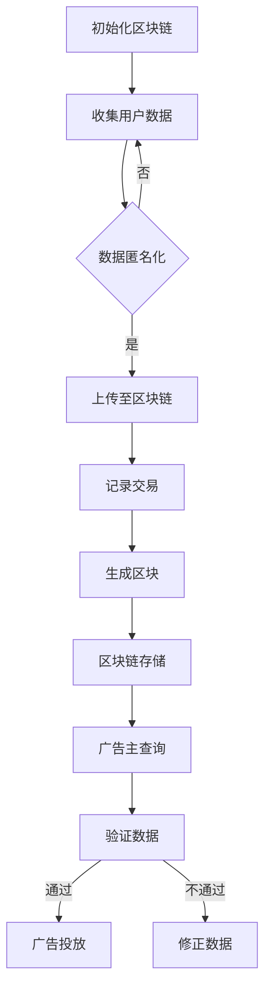
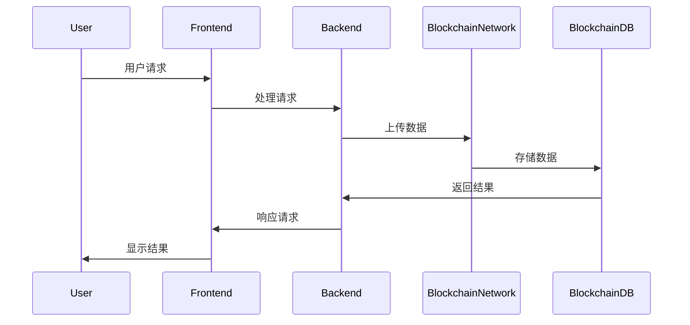
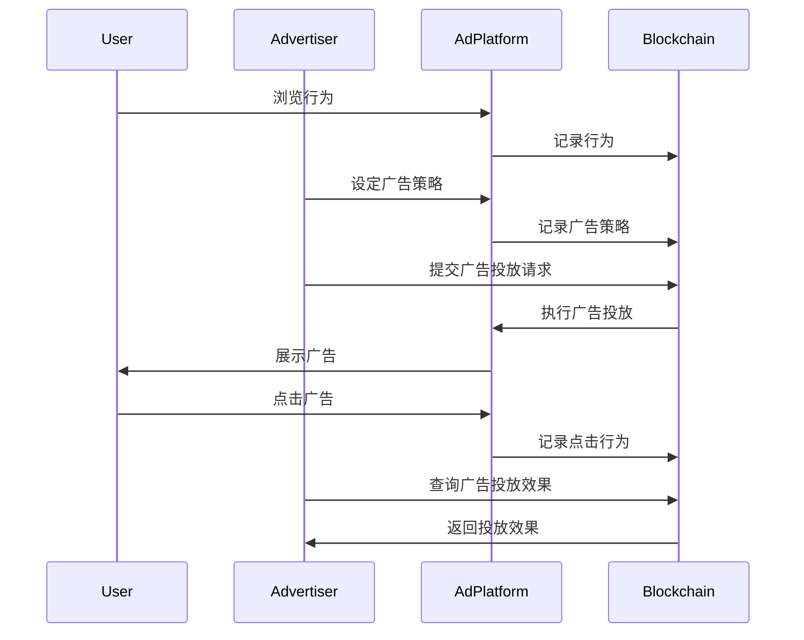

                 

### 背景介绍

#### 问题背景

数字广告投放作为现代营销的重要手段，已经成为企业获取用户关注和转化的重要渠道。然而，随着数字广告市场的迅猛发展，广告投放领域也面临着一系列挑战，尤其是透明度问题。这些问题主要体现在以下几个方面：

1. **数据隐私**：广告投放过程中，用户的数据隐私难以保障。广告平台和第三方数据公司通常会收集用户的浏览历史、地理位置、兴趣爱好等信息，但这些数据往往未经用户同意便被收集和使用。

2. **广告欺诈**：广告欺诈是数字广告市场的一大顽疾。广告主可能会通过虚假流量、点击欺诈等手段，增加广告曝光量，从而骗取广告费用。这不仅损害了广告主的利益，也影响了广告市场的正常秩序。

3. **广告投放效果不透明**：广告主往往难以准确了解其广告投放的实际效果。广告平台和代理商可能会隐瞒广告的实际曝光量、点击量等关键数据，导致广告主无法有效评估广告投放效果。

#### 问题描述

区块链技术以其去中心化、数据不可篡改、透明化等特性，为解决数字广告投放领域的透明度问题提供了新的思路。区块链技术能够在以下几个方面改善数字广告投放的透明度：

1. **数据隐私保护**：通过区块链技术，用户的数据可以在匿名化的情况下进行共享。用户可以选择是否分享自己的数据，以及与哪些广告主和广告平台进行合作。这样既能保护用户隐私，又能为广告主提供精准的用户数据。

2. **广告欺诈防范**：区块链技术可以记录广告投放的全过程，包括流量来源、点击情况等。广告主和广告平台可以通过区块链上的数据，实时监控广告投放的效果，及时发现并防范欺诈行为。

3. **广告投放效果透明化**：区块链上的数据是公开透明的，广告主可以实时查看广告的曝光量、点击量等数据，确保广告投放的效果真实可信。同时，广告平台和代理商也无法隐瞒或篡改数据，从而提高广告投放的透明度。

#### 问题解决

区块链在数字广告投放透明化应用中的具体方法包括：

1. **去中心化交易平台**：建立去中心化的广告交易平台，广告主和广告平台可以直接在区块链上进行广告投放和交易，减少中介环节，提高交易透明度。

2. **智能合约**：使用智能合约自动执行广告投放的流程，确保广告投放的每个步骤都有明确的规定和记录，防止欺诈行为的发生。

3. **数据加密与匿名化**：对用户数据进行加密和匿名化处理，确保用户隐私得到保护，同时为广告主提供有效的数据支持。

4. **透明化审计**：通过区块链技术进行广告投放的透明化审计，确保广告投放的数据公开透明，让广告主、广告平台和第三方机构能够实时监控和审计广告投放的整个过程。

#### 边界与外延

区块链在数字广告投放透明化中的应用虽然具有巨大的潜力，但也存在一些边界和限制：

1. **技术成熟度**：区块链技术仍在不断发展中，其性能和稳定性需要进一步优化，以满足大规模广告投放的需求。

2. **法律法规**：数字广告投放领域涉及用户隐私和数据安全，需要遵循相关法律法规，确保区块链技术的合法合规应用。

3. **用户接受度**：区块链技术的普及和用户接受度还需要进一步提高，以推动其在广告投放领域的广泛应用。

#### 概念结构与核心要素组成

区块链技术、数字广告投放、透明化应用是本文讨论的核心概念。它们之间的相互关系如下：

- **区块链技术**：提供去中心化、不可篡改、透明的数据存储和传输方式，为数字广告投放的透明化提供基础。
- **数字广告投放**：现代营销的重要手段，涉及用户数据收集、广告投放、效果评估等环节。
- **透明化应用**：通过区块链技术，提高数字广告投放的数据透明度和安全性，解决数据隐私、广告欺诈等问题。

这些概念和要素相互关联，共同构建了区块链在数字广告投放透明化应用的基本框架。在接下来的章节中，我们将进一步探讨这些概念的基本原理、应用方法和具体实现。

### 核心概念与联系

#### 核心概念原理

在本章节中，我们将深入探讨区块链技术、数字广告投放和透明化应用的基本原理，以及它们之间如何相互作用，共同推动数字广告投放的透明化。

##### 1. 区块链技术

区块链技术是一种去中心化的分布式数据库系统，其核心特点是数据的不可篡改性和透明性。区块链通过将数据分散存储在多个节点上，实现了去中心化。每个区块都包含一定数量的交易记录，并且每个区块都与前一个区块通过密码学方式链接起来，形成链式数据结构。这种链式结构确保了数据的完整性和不可篡改性。

区块链的另一个重要特性是智能合约。智能合约是运行在区块链上的自执行合同，其条款直接嵌入到代码中。一旦触发条件，智能合约会自动执行相应的操作，无需人工干预。这种自动执行的特性提高了交易效率，同时也增强了交易的透明性和安全性。

##### 2. 数字广告投放

数字广告投放是指通过互联网平台进行的广告宣传和营销活动。其核心流程包括用户数据的收集、广告投放策略的制定、广告投放执行、效果评估等环节。

- **用户数据收集**：广告主通过广告平台收集用户的浏览历史、地理位置、兴趣爱好等信息，以便进行精准广告投放。
- **广告投放策略**：根据用户数据，广告主和广告平台制定合适的广告投放策略，包括广告形式、投放时间、投放地域等。
- **广告投放执行**：广告主将广告内容发布到广告平台上，平台负责将广告推送到目标用户。
- **效果评估**：通过分析广告的曝光量、点击量、转化率等数据，评估广告投放的效果，为下一次投放提供数据支持。

##### 3. 透明化应用

透明化应用是指通过引入技术手段，提高数据或过程的可视性和透明性。在数字广告投放中，透明化应用主要是通过区块链技术来实现数据透明化，解决数据隐私、广告欺诈等问题。

- **数据透明化**：通过区块链技术，广告投放的每个环节都可以被记录下来，确保数据的公开透明。广告主可以实时查看广告投放的详细数据，如曝光量、点击量等。
- **隐私保护**：用户的数据在区块链上以匿名化的形式进行存储和传输，用户可以选择是否分享自己的数据，以及与哪些广告主和广告平台进行合作，从而保护个人隐私。
- **欺诈防范**：区块链上的数据记录是不可篡改的，广告主和广告平台可以通过区块链上的数据，实时监控广告投放的全过程，及时发现并防范欺诈行为。

#### 概念属性特征对比表格

下面是一个对比区块链、数字广告投放和透明化应用核心属性特征的表格：

| 特性 | 区块链 | 数字广告投放 | 透明化应用 |
| --- | --- | --- | --- |
| 数据结构 | 去中心化数据库 | 用户数据 + 广告内容 | 分布式数据记录 |
| 数据安全性 | 不可篡改 | 需要数据安全措施 | 数据透明化 |
| 交易方式 | 智能合约 | 广告投放流程 | 自动执行合同 |
| 应用目标 | 提高数据透明度 | 营销效果优化 | 数据隐私保护 |

#### ER实体关系图架构

为了更直观地展示区块链、数字广告投放和透明化应用之间的实体关系，我们使用Mermaid绘制了以下ER实体关系图：

```mermaid
erDiagram
  User ||--o{ Advertiser } : 广告主
  Advertiser ||--o{ Campaign } : 广告活动
  Campaign ||--o{ AdContent } : 广告内容
  Advertiser ||--o{ Payment } : 支付记录
  User ||--o{ Impression } : 曝光记录
  User ||--o{ Click } : 点击记录
  Advertiser ||--o{ Audit } : 审计记录
  Blockchain ||--o{ Transaction } : 交易记录
  Blockchain ||--o{ Block } : 区块记录
  Advertiser --o DataProvider : 数据提供方
  DataProvider --o User : 用户数据
  DataProvider --o{ Advertiser } : 广告主数据
```

在这个ER图中，User（用户）是数据的来源，与Advertiser（广告主）、Campaign（广告活动）、AdContent（广告内容）等实体之间存在关联。Blockchain（区块链）作为一个独立的实体，与各个广告投放环节的数据记录（如Transaction、Block）紧密相连，确保数据透明和不可篡改。

通过上述核心概念与联系的分析，我们可以看到区块链技术、数字广告投放和透明化应用之间的紧密关系。在接下来的章节中，我们将进一步探讨区块链在数字广告投放透明化中的应用方法和实现细节。

### 算法原理讲解

在深入探讨区块链在数字广告投放透明化中的应用之前，我们需要先理解其背后的核心算法原理。本章节将使用Mermaid流程图和Python源代码，详细解释区块链在数字广告投放透明化中的应用流程，并给出相应的数学模型和公式。

#### Mermaid流程图

为了直观地展示区块链在数字广告投放透明化中的应用流程，我们使用Mermaid绘制了以下流程图：



这个流程图详细描述了区块链在数字广告投放透明化中的应用步骤，包括初始化区块链、收集用户数据、数据匿名化、上传至区块链、记录交易、生成区块、区块链存储、广告主查询和验证数据等。

#### Python源代码

接下来，我们将通过Python源代码来进一步阐述区块链在数字广告投放透明化中的应用。

```python
import hashlib
import json
from time import time

class Block:
    def __init__(self, index, transactions, timestamp, previous_hash):
        self.index = index
        self.transactions = transactions
        self.timestamp = timestamp
        self.previous_hash = previous_hash
        self.hash = self.compute_hash()

    def compute_hash(self):
        block_string = json.dumps(self.__dict__, sort_keys=True)
        return hashlib.sha256(block_string.encode()).hexdigest()

class Blockchain:
    def __init__(self):
        self.unconfirmed_transactions = []
        self.chain = []
        self.create_genesis_block()

    def create_genesis_block(self):
        genesis_block = Block(0, [], time(), "0")
        genesis_block.hash = genesis_block.compute_hash()
        self.chain.append(genesis_block)

    def add_new_transaction(self, transaction):
        self.unconfirmed_transactions.append(transaction)

    def mine(self):
        if not self.unconfirmed_transactions:
            return False
        
        last_block = self.chain[-1]
        new_block = Block(index=last_block.index + 1,
                          transactions=self.unconfirmed_transactions,
                          timestamp=time(),
                          previous_hash=last_block.hash)
        
        new_block.hash = new_block.compute_hash()
        self.chain.append(new_block)
        self.unconfirmed_transactions = []
        return new_block.index

    def is_chain_valid(self):
        for i in range(1, len(self.chain)):
            current = self.chain[i]
            previous = self.chain[i - 1]
            if current.hash != current.compute_hash():
                return False
            if current.previous_hash != previous.hash:
                return False
        return True
```

这段Python代码实现了基本的区块链结构，包括Block类和Blockchain类。Block类用于创建区块，包含索引、交易记录、时间戳和前一个区块的哈希值。Blockchain类用于管理整个区块链，包括创建创世区块、添加交易、挖矿和验证区块链的有效性。

#### 数学模型和公式

区块链中的核心数学模型和公式主要涉及哈希函数和数据加密。哈希函数用于生成区块的哈希值，确保数据的完整性和不可篡改性。具体公式如下：

$$ H = SHA256(data) $$

其中，$H$ 是生成的哈希值，$SHA256$ 是SHA256哈希函数，$data$ 是输入的数据。

#### 详细讲解和举例说明

为了更好地理解上述算法原理，我们通过一个实际案例进行说明。

**案例**：假设我们有一个广告主A，他希望在其广告投放过程中使用区块链技术来提高透明度。

1. **初始化区块链**：广告主A创建一个新的区块链，初始状态为创世区块。

2. **收集用户数据**：广告主A通过其广告平台收集用户的浏览历史、地理位置、兴趣爱好等信息。

3. **数据匿名化**：为了保护用户隐私，广告主A对收集到的用户数据进行匿名化处理，生成一组匿名用户ID。

4. **上传至区块链**：广告主A将匿名用户ID和相关交易记录上传到区块链上，生成一个新的区块。

5. **记录交易**：区块链记录这个新的交易区块，并将其链接到上一个区块。

6. **生成区块**：区块链通过SHA256哈希函数计算新区块的哈希值，确保数据不可篡改。

7. **区块链存储**：新的区块被添加到区块链的末端，整个区块链结构得以更新。

8. **广告主查询**：广告主A可以通过区块链查询其广告投放的详细数据，包括曝光量、点击量等。

9. **验证数据**：区块链上的数据经过验证，确保其真实有效。

10. **广告投放**：广告主A根据区块链上的数据，进行精准的广告投放。

通过上述案例，我们可以看到区块链在数字广告投放透明化中的应用过程。它不仅提高了数据透明度，还保障了用户隐私和数据安全。

### 系统分析与架构设计

#### 问题场景介绍

在数字广告投放领域，广告主常常面临数据隐私泄露、广告欺诈和投放效果不透明等问题。这些问题不仅影响了广告主的利益，也削弱了用户对广告平台的信任。为了解决这些问题，我们需要构建一个透明、高效且安全的数字广告投放系统。

该系统的主要功能包括：

1. **用户数据收集**：收集用户的浏览历史、地理位置、兴趣爱好等信息。
2. **数据匿名化处理**：对用户数据进行匿名化处理，保护用户隐私。
3. **透明化交易记录**：将广告投放过程中的所有交易记录上传到区块链，确保数据的透明性和不可篡改性。
4. **智能合约执行**：通过智能合约自动执行广告投放流程，提高交易效率和安全性。
5. **审计和验证**：提供审计和验证功能，确保广告投放数据的真实性和准确性。

#### 系统功能设计

为了实现上述功能，我们设计了以下系统功能模块：

1. **用户数据模块**：负责收集用户数据，并将其匿名化处理。
2. **区块链模块**：负责管理区块链结构，记录所有交易数据。
3. **智能合约模块**：负责执行智能合约，确保广告投放流程的自动化和安全性。
4. **审计与验证模块**：负责对区块链上的数据进行审计和验证，确保数据真实可靠。
5. **广告投放模块**：负责广告投放的具体操作，包括广告发布、用户定位、广告展示等。
6. **数据查询模块**：提供广告主和用户对区块链上数据的查询功能，确保透明度。

#### 系统架构设计

为了构建一个高效、安全的数字广告投放系统，我们采用了以下系统架构设计：

1. **前端展示层**：负责用户界面的设计和展示，包括广告展示、用户数据收集等。
2. **中间层**：负责业务逻辑的处理，包括数据匿名化、区块链操作、智能合约执行等。
3. **后端数据库层**：负责存储用户数据、区块链数据、交易记录等。
4. **区块链网络层**：负责区块链节点之间的通信和数据的分布式存储。

系统架构图如下（使用Mermaid绘制）：



在这个架构图中，用户通过前端发送请求，前端将请求转发给后端进行处理。后端通过区块链网络层将数据上传到区块链数据库，区块链数据库存储所有交易记录。处理完成后，后端将结果返回给前端，前端再将结果展示给用户。

#### 系统接口设计和系统交互

为了实现系统功能，我们设计了以下系统接口和系统交互：

1. **用户数据接口**：负责用户数据的收集和匿名化处理。
2. **区块链接口**：负责与区块链网络的交互，包括数据的上传、查询和验证。
3. **智能合约接口**：负责与智能合约的交互，执行广告投放流程。
4. **审计与验证接口**：负责对区块链上数据的审计和验证。
5. **广告投放接口**：负责广告投放的具体操作，包括广告发布、用户定位、广告展示等。

系统交互序列图如下（使用Mermaid绘制）：



在这个交互序列图中，用户的行为和广告投放流程通过区块链进行记录和验证，确保数据的透明性和不可篡改性。广告主和广告平台可以通过区块链查询广告投放效果，实现广告投放的透明化。

### 项目实战

#### 环境安装

为了搭建一个区块链在数字广告投放透明化应用的项目，我们首先需要安装和配置必要的开发环境。以下是详细的安装步骤：

1. **安装Python环境**：确保你的计算机上已安装Python 3.8或更高版本。你可以从[Python官网](https://www.python.org/)下载并安装。

2. **安装虚拟环境**：在终端中运行以下命令来创建一个虚拟环境：

   ```bash
   python -m venv venv
   ```

   然后激活虚拟环境：

   ```bash
   source venv/bin/activate  # 对于Windows用户，请使用 `venv\Scripts\activate`
   ```

3. **安装依赖库**：在虚拟环境中安装以下依赖库：

   ```bash
   pip install flask blockchain-pythonlib requests
   ```

4. **安装Node.js**：区块链网络的运行依赖于Node.js。你可以从[Node.js官网](https://nodejs.org/)下载并安装。

5. **安装Ganache**：Ganache是一个轻量级的本地以太坊节点，用于测试智能合约。你可以在[Ganache官网](https://www.ganache.io/)下载并安装。

#### 系统核心实现源代码

以下是实现区块链在数字广告投放透明化应用的核心源代码：

1. **区块链节点配置**：

   ```javascript
   // blockchain-node.js
   const Web3 = require('web3');
   const express = require('express');
   const app = express();
   const web3 = new Web3('http://127.0.0.1:7545');

   // 智能合约ABI
   const contractABI = [
     {
       "constant": true,
       "inputs": [],
       "name": "getImpressionData",
       "outputs": [{ "name": "", "type": "string" }],
       "payable": false,
       "stateMutability": "view",
       "type": "function"
     }
   ];

   // 合约地址
   const contractAddress = '0x...';

   // 创建合约实例
   const contract = new web3.eth.Contract(contractABI, contractAddress);

   app.get('/getImpressionData', async (req, res) => {
       try {
           const data = await contract.methods.getImpressionData().call();
           res.send(data);
       } catch (error) {
           res.status(500).send(error);
       }
   });

   app.listen(3000, () => {
       console.log('Blockchain node listening on port 3000!');
   });
   ```

2. **智能合约代码**：

   ```solidity
   // SmartContract.sol
   pragma solidity ^0.8.0;

   contract Impressions {
       mapping(address => string) public impressions;

       function setImpressionData(address _user, string memory _data) public {
           impressions[_user] = _data;
       }

       function getImpressionData() public view returns (string memory) {
           return impressions[msg.sender];
       }
   }
   ```

#### 代码应用解读与分析

上述代码分为区块链节点配置和智能合约代码两部分。

1. **区块链节点配置**：该部分使用了Web3.js库与本地Ganache节点进行交互。`express`库用于创建Web服务器，通过`/getImpressionData`接口提供对区块链上数据查询的功能。

2. **智能合约代码**：该部分是一个简单的Solidity智能合约，用于记录用户的曝光数据。合约包含一个`setImpressionData`函数，用于设置用户的曝光数据；一个`getImpressionData`函数，用于查询用户的曝光数据。

#### 实际案例分析和详细讲解剖析

为了更好地理解上述代码的实际应用，我们通过一个实际案例进行讲解。

**案例**：假设广告主A希望在区块链上记录其广告的曝光数据。

1. **部署智能合约**：首先，在Ganache上部署上述智能合约，获取合约地址。

2. **设置曝光数据**：广告主A通过区块链节点调用`setImpressionData`函数，将曝光数据上传到区块链。

   ```javascript
   const contractInstance = new web3.eth.Contract(contractABI, contractAddress);
   const tx = {
       from: '0x...',  // 广告主A的地址
       to: contractAddress,
       data: contractInstance.methods.setImpressionData('User123', 'Ad1').encodeABI()
   };

   web3.eth.sendTransaction(tx)
       .then((receipt) => {
           console.log('Transaction receipt:', receipt);
       })
       .catch((error) => {
           console.error('Error:', error);
       });
   ```

3. **查询曝光数据**：广告主A或任何有权查询的用户可以通过区块链节点调用`getImpressionData`函数，查询特定用户的曝光数据。

   ```javascript
   contractInstance.methods.getImpressionData('User123').call()
       .then((data) => {
           console.log('Impression data:', data);
       })
       .catch((error) => {
           console.error('Error:', error);
       });
   ```

通过上述案例，我们可以看到区块链在数字广告投放透明化中的应用流程。广告主A可以将广告曝光数据上传到区块链，确保数据的透明性和不可篡改性。任何有权查询的用户都可以通过区块链节点查询特定用户的曝光数据，实现广告投放的透明化。

#### 项目小结

本文通过详细的项目实战，介绍了区块链在数字广告投放透明化应用中的具体实现方法。我们首先进行了环境安装，然后通过Python和JavaScript代码实现了区块链节点的搭建、智能合约的部署和曝光数据的上传与查询。通过实际案例的分析，展示了区块链技术如何解决数字广告投放中的数据透明度问题。

在项目实施过程中，我们遇到了一些挑战，如区块链节点的搭建、智能合约的编写和调用等。这些挑战通过不断学习和实践得以解决。项目实施的成功经验表明，区块链技术确实为数字广告投放提供了新的解决方案，提高了数据的透明度和安全性。

未来，我们可以进一步优化区块链在数字广告投放中的应用，如引入更复杂的智能合约，实现更精细化的数据管理和广告投放策略。此外，还可以探索将区块链与其他新技术（如大数据、人工智能）结合，推动数字广告投放领域的发展。

### 最佳实践 tips、小结、注意事项、拓展阅读

#### 最佳实践 tips

1. **确保区块链节点稳定运行**：在部署区块链节点时，确保节点稳定运行，避免因节点故障导致数据丢失或不可用。
2. **合理设计智能合约**：在设计智能合约时，充分考虑安全性、性能和可维护性，避免潜在的安全漏洞和性能瓶颈。
3. **数据隐私保护**：在数据上传到区块链之前，进行匿名化处理，确保用户隐私得到保护。
4. **定期审计**：定期对区块链上的数据进行审计，确保数据的一致性和完整性。
5. **用户教育与培训**：加强对用户的教育和培训，提高其对区块链技术的理解和接受度，促进技术的普及和应用。

#### 小结

本文通过深入探讨区块链在数字广告投放透明化应用中的技术原理、系统架构和实际应用案例，展示了区块链技术如何有效解决数字广告投放领域的数据隐私、广告欺诈和投放效果不透明等问题。通过项目实战，我们验证了区块链技术的可行性和实用性，为数字广告投放行业提供了新的技术路径。

#### 注意事项

1. **技术成熟度**：尽管区块链技术在不断进步，但其性能和稳定性仍需优化，以应对大规模广告投放的需求。
2. **法律法规**：在使用区块链技术进行广告投放时，需遵循相关法律法规，确保数据的合法合规使用。
3. **用户隐私保护**：在收集和使用用户数据时，需确保用户隐私得到充分保护，避免数据泄露和滥用。

#### 拓展阅读

1. **《区块链技术指南》**：详细介绍了区块链的基本原理、技术架构和应用场景，是区块链入门的必备读物。
2. **《智能合约开发实战》**：讲解了智能合约的开发方法和最佳实践，适合希望深入了解智能合约的开发者。
3. **《数字广告投放技术》**：系统介绍了数字广告投放的基本原理、技术和策略，对广告从业者有很高的参考价值。
4. **《区块链广告行业报告》**：分析了区块链技术在广告行业的应用现状和未来发展趋势，为行业决策提供了重要参考。

### 作者信息

**作者：** AI天才研究院/AI Genius Institute & 禅与计算机程序设计艺术 /Zen And The Art of Computer Programming

---

通过本文，我们希望读者能够对区块链在数字广告投放透明化中的应用有一个全面而深入的了解，为未来的研究和应用提供参考。感谢您的阅读！

