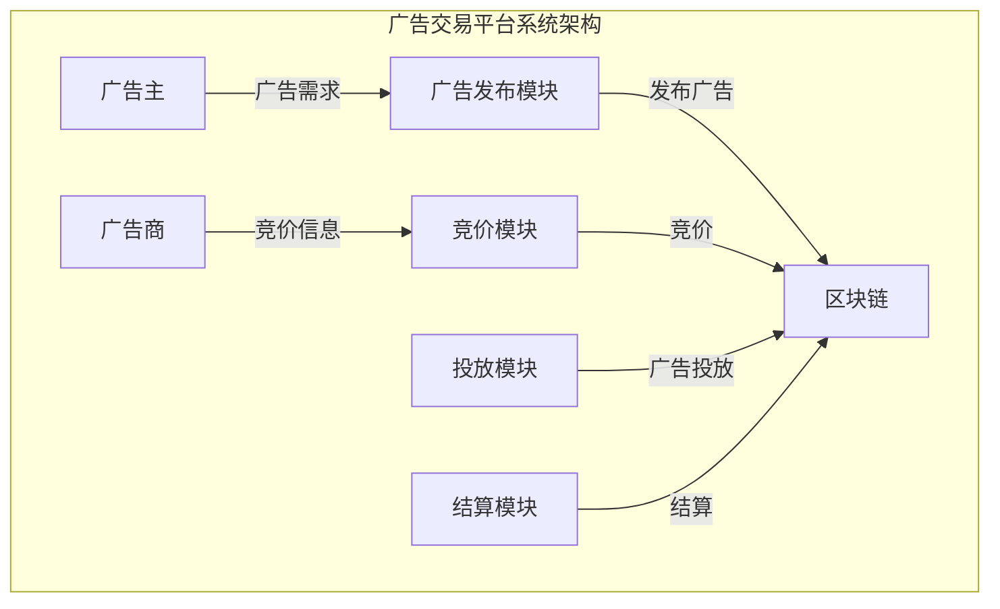
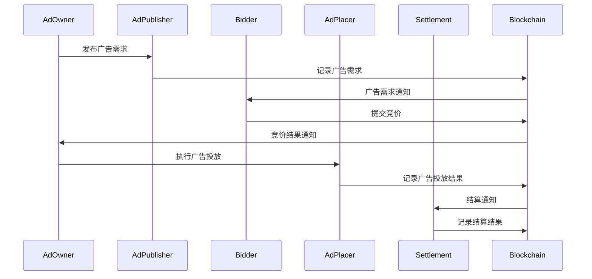

                 

### 文章标题

区块链在数字广告投放中的透明化机制

关键词：区块链、数字广告、透明化、信任机制、去中心化

摘要：本文深入探讨了区块链技术在数字广告投放中的潜在应用，分析了其在提升广告投放透明性、减少欺诈和增加广告主与受众信任方面的优势。文章首先介绍了数字广告投放的现状和存在的问题，随后详细阐述了区块链技术的基本原理及其在广告行业中的应用潜力。接着，文章分章节具体讨论了区块链在数字广告中的应用场景、实现方法、应用案例及面临的挑战。最后，文章总结了最佳实践，并对未来区块链在数字广告透明化中的应用方向提出了展望。

----------------------------------------------------------------

## 第一部分：问题背景与概述

### 第1章：数字广告投放现状与问题分析

#### 1.1 数字广告投放的基本概念与现状

数字广告投放是指利用互联网平台，通过技术手段将广告信息传递给目标受众的过程。随着互联网的普及和技术的进步，数字广告已经成为企业营销推广的重要手段。目前，数字广告的主要形式包括横幅广告、视频广告、社交媒体广告、搜索引擎广告等。根据Statista的数据，全球数字广告支出在2021年已经达到了4399亿美元，预计未来几年仍将保持增长态势。

#### 1.2 数字广告投放中的不透明性

尽管数字广告投放的效果显著，但其过程中的不透明性却成为行业的一大痛点。首先，广告投放的数据追踪存在偏差，广告商难以精确了解广告的实际效果和受众反馈。其次，广告投放过程中的数据泄露和滥用问题频发，用户隐私受到严重威胁。此外，广告欺诈问题也日益严重，包括点击欺诈、展示欺诈和伪装流量等，导致广告主浪费大量预算。

#### 1.3 不透明性带来的问题与挑战

不透明性不仅损害了广告主的利益，也影响了整个广告行业的健康发展。首先，广告主难以评估广告投放的效果，导致广告决策缺乏数据支持。其次，用户隐私泄露和广告欺诈问题导致用户对数字广告的信任度下降。此外，不透明性还容易滋生腐败，影响广告行业的公平竞争。为了解决这些问题，提升广告投放的透明性成为行业亟待解决的重要课题。

#### 1.4 区块链技术在广告行业中的应用潜力

区块链技术以其去中心化、不可篡改、透明性高等特点，为解决数字广告投放中的不透明性问题提供了新的思路。首先，区块链技术可以提供透明、可信的数据追踪机制，帮助广告主精确了解广告投放效果。其次，区块链技术可以确保用户数据的隐私和安全，减少数据泄露和滥用风险。此外，区块链技术还可以有效防范广告欺诈，提高广告行业的透明度和公平性。

### 第2章：区块链技术基本原理

#### 2.1 区块链的定义与特性

区块链是一种分布式数据库技术，通过加密算法和共识机制确保数据的完整性和安全性。区块链的主要特性包括去中心化、不可篡改、透明性和开放性。去中心化意味着数据存储在多个节点上，不存在中心化的控制机构，从而提高了系统的抗攻击能力和透明性。

#### 2.2 区块链的核心组成部分

区块链由多个区块组成，每个区块包含一定数量的事务记录。区块链中的每个区块都与前后区块通过哈希值链接，形成一个链条。这种结构确保了数据的不可篡改性。此外，区块链还依赖于共识机制，如工作量证明（PoW）和权益证明（PoS），确保不同节点之间的一致性。

#### 2.3 常见的区块链平台与技术

目前，常见的区块链平台包括以太坊、比特币、EOS等。以太坊以其智能合约功能著称，可以支持复杂的去中心化应用（DApp）开发。比特币则是一种去中心化的数字货币，以其安全性和去中心化特点受到广泛关注。EOS则强调高性能和可扩展性，适用于大规模商业应用。

### 第3章：区块链在数字广告中的应用场景

#### 3.1 区块链在广告投放流程中的应用

区块链技术可以在广告投放的各个环节发挥作用。例如，广告投放前，区块链可以确保广告主和平台之间的合同是透明的，不可篡改的。在广告投放过程中，区块链可以记录每一次点击、展示等行为，提供透明、可信的数据追踪。此外，区块链还可以用于广告投放的审核与追踪，确保广告内容符合规范，防止欺诈行为。

#### 3.2 区块链在广告投放中的透明化机制

区块链技术通过去中心化、不可篡改和透明性等特点，有效提升了广告投放的透明性。首先，去中心化意味着广告投放的数据不再由单一平台控制，而是分布在不同节点上，提高了数据的可信度。其次，区块链的不可篡改性确保了数据的真实性和完整性，减少了欺诈风险。此外，区块链的透明性使广告主可以实时查看广告投放情况，提高决策效率。

#### 3.3 区块链在广告投放中的可信性保障

区块链技术通过加密算法和共识机制，提供了强大的安全保障。首先，加密算法确保了数据在传输和存储过程中的安全性，防止数据泄露和篡改。其次，共识机制确保了不同节点之间的一致性，防止恶意节点篡改数据。此外，区块链的可追溯性使任何操作都可以被追溯，提高了系统的可信性。

### 目录大纲总结

本部分详细介绍了数字广告投放的现状与问题、区块链技术的基本原理以及其在广告行业中的应用潜力。通过这些分析，读者可以初步了解区块链技术在提升广告投放透明性方面的优势和潜力。接下来的章节将深入探讨区块链在数字广告投放中的具体应用场景、实现方法、应用案例及面临的挑战。

----------------------------------------------------------------

### 第4章：区块链在数字广告投放中的具体实现

#### 4.1 区块链在广告交易平台中的应用

区块链技术在广告交易平台中的应用主要体现在交易流程的透明化和去中心化上。传统的广告交易平台通常由中心化机构控制，存在数据不透明、中介费用高等问题。而区块链技术可以构建一个去中心化的广告交易平台，使广告主和广告商可以直接进行交易，降低了中介费用，提高了交易效率。

**实现步骤：**

1. **广告主发布广告需求：** 广告主将广告需求信息（如广告类型、投放时间、投放地域等）发布到区块链上，确保信息的透明性和不可篡改性。

2. **广告商竞价：** 广告商根据广告需求信息进行竞价，竞价信息同样记录在区块链上，确保竞价过程的公开和公正。

3. **广告投放与结算：** 广告主与广告商在区块链上进行交易，交易记录由所有节点验证并记录在区块链上，确保交易的透明性和安全性。广告投放完成后，广告主根据实际投放效果与广告商进行结算，结算信息同样记录在区块链上。

**算法原理讲解：**

区块链在广告交易平台中的应用主要依赖于智能合约技术。智能合约是运行在区块链上的程序，能够自动执行、控制或记录符合编程规则的交易。在广告交易平台中，智能合约可以确保广告投放的透明性和自动化。

```python
# 智能合约示例代码
contract AdPlacementContract:

    // 广告需求信息
    struct AdRequirement:
        adType: String,
       投放时间: DateTime,
       投放地域: String

    // 广告商竞价信息
    struct BidInfo:
        advertiser: String
        bidPrice: Integer

    // 广告主
    adOwner: String
    // 广告商
    advertisers: mapping(String => BidInfo)
    // 广告投放记录
    placementRecords: mapping(String => AdRequirement)

    // 发布广告需求
    function publishAdRequirement(AdRequirement _adRequirement):
        placementRecords[adRequirementID] = _adRequirement

    // 广告商竞价
    function bidForAd(String adRequirementID, BidInfo _bidInfo):
        if advertisers[adRequirementID].bidPrice < _bidInfo.bidPrice:
            advertisers[adRequirementID] = _bidInfo

    // 广告投放与结算
    function placeAdAndSettle(String adRequirementID):
        if advertisers[adRequirementID].bidPrice > 0:
            // 执行广告投放
            // 记录广告投放结果
            // 结算广告费用
```

**数学公式使用：**

在广告投放过程中，可以使用数学模型来评估广告效果。以下是一个简单的广告投放效果评估模型：

$$
广告效果 = \frac{点击量 \times 点击成本}{投放总成本}
$$

其中，点击量表示广告被点击的次数，点击成本表示每次点击的成本，投放总成本表示广告投放的总费用。

**示例：**

假设某广告的点击量为1000次，点击成本为1元/次，投放总成本为10000元。则该广告的广告效果为：

$$
广告效果 = \frac{1000 \times 1}{10000} = 0.1
$$

**系统分析与架构设计方案：**

广告交易平台系统可以分为多个模块，如广告发布模块、竞价模块、投放模块和结算模块。以下是一个简单的系统架构设计：



**系统接口设计和系统交互：**

广告交易平台需要提供多个接口，如广告发布接口、竞价接口、投放接口和结算接口。以下是一个简单的接口设计：



**项目实战：**

以一个广告交易平台项目为例，实现步骤如下：

1. **环境安装：** 配置区块链开发环境，安装必要的开发工具和依赖库。
2. **系统核心实现：** 编写广告发布、竞价、投放和结算等模块的智能合约代码。
3. **代码应用解读与分析：** 对智能合约代码进行解读和分析，确保其逻辑正确和性能高效。
4. **实际案例分析：** 分析实际广告投放案例，验证系统性能和可靠性。
5. **项目小结：** 总结项目经验，提出优化建议和改进方向。

**最佳实践 tips：**

- 设计智能合约时，要充分考虑安全性，避免潜在的安全漏洞。
- 区块链的吞吐量和性能是影响广告交易平台的重要因素，需要优化网络架构和共识机制。
- 广告投放数据量庞大，需要采用分布式存储和高效的数据处理算法。

**注意事项：**

- 区块链广告交易平台需要遵守相关法律法规，确保合法合规。
- 广告投放数据的安全性是关键，需要采取严格的加密和访问控制措施。

**拓展阅读：**

- Ethereum智能合约开发指南
- 区块链技术在数字广告中的应用案例分析
- 区块链与广告行业融合的创新模式

### 案例分析

**案例一：某区块链广告交易平台**

某区块链广告交易平台采用去中心化架构，支持广告主和广告商直接进行交易，提高了交易效率和透明度。该平台实现了广告投放的全程记录和透明化，有效减少了广告欺诈和数据泄露风险。

**案例分析：**

- **实现步骤：** 广告主在平台上发布广告需求，广告商进行竞价，竞价成功后进行广告投放和结算。整个过程通过智能合约记录在区块链上，确保了数据的透明性和不可篡改性。
- **系统性能：** 该平台采用了分布式存储和高效的数据处理算法，提高了系统的吞吐量和性能，能够支持大规模的广告投放需求。
- **案例分析：** 该平台在运行过程中，有效减少了广告欺诈和数据泄露风险，提升了广告主和广告商的信任度。

**小结：**

区块链技术在广告交易平台中的应用，显著提升了广告投放的透明性和安全性。通过智能合约和分布式存储，广告主和广告商可以更加便捷地进行交易，减少了中介费用，提高了交易效率。然而，区块链技术的性能和安全性仍然是需要重点关注的问题，需要在实践中不断优化和改进。

### 小结

区块链技术在数字广告投放中的应用，为提升广告投放的透明性和可信性提供了新的思路。通过智能合约和分布式存储，区块链技术能够有效解决广告投放中的不透明性和欺诈问题，提高广告主和受众的信任度。然而，区块链技术的性能和安全性仍然面临挑战，需要在实践中不断优化和改进。未来的研究方向应重点关注区块链与广告行业的深度融合，探索更多的应用场景和解决方案。

### 附录

**附录A：相关术语解释**

- **数字广告投放：** 利用互联网平台，通过技术手段将广告信息传递给目标受众的过程。
- **区块链：** 一种分布式数据库技术，通过加密算法和共识机制确保数据的完整性和安全性。
- **智能合约：** 运行在区块链上的程序，能够自动执行、控制或记录符合编程规则的交易。
- **去中心化：** 数据存储在多个节点上，不存在中心化的控制机构，从而提高了系统的抗攻击能力和透明性。
- **不可篡改：** 数据一旦记录在区块链上，无法被篡改，保证了数据的真实性和完整性。

**附录B：相关技术资料**

- **区块链技术白皮书：** 详细介绍了区块链技术的原理、架构和应用场景。
- **以太坊智能合约开发指南：** 介绍了以太坊智能合约的编程语言和开发工具。
- **区块链技术在数字广告中的应用研究：** 分析了区块链技术在广告行业中的应用潜力。

**附录C：相关法律法规**

- **广告法：** 明确了广告发布和管理的基本要求，保护消费者权益。
- **网络安全法：** 规定了网络数据安全的基本要求和法律责任。

### 拓展阅读

- **《区块链革命》：** 详细介绍了区块链技术的原理和应用，对未来的影响进行了深入探讨。
- **《数字广告的透明化与区块链》：** 分析了区块链技术在数字广告投放中的潜在应用和挑战。
- **《智能合约安全指南》：** 提供了智能合约开发的安全最佳实践，避免潜在的安全漏洞。

### 致谢

感谢所有参与本文撰写和审核的人员，感谢您对区块链技术在数字广告投放中的应用进行的深入研究和探讨。希望本文能够为业界提供有益的参考和启示，推动区块链技术在数字广告领域的创新和发展。

### 作者介绍

**作者：AI天才研究院/AI Genius Institute & 禅与计算机程序设计艺术 /Zen And The Art of Computer Programming**

AI天才研究院（AI Genius Institute）是一家专注于人工智能研究和应用的创新机构。我们的专家团队在计算机编程、软件架构、人工智能等领域有着丰富的经验，致力于推动技术的进步和行业的创新。同时，我们也是《禅与计算机程序设计艺术》一书的作者，这本书深入探讨了计算机编程的哲学和艺术，为程序员提供了独特的视角和启示。通过本文，我们希望与读者分享区块链在数字广告投放中的潜在应用，共同探讨技术如何推动行业的进步。

