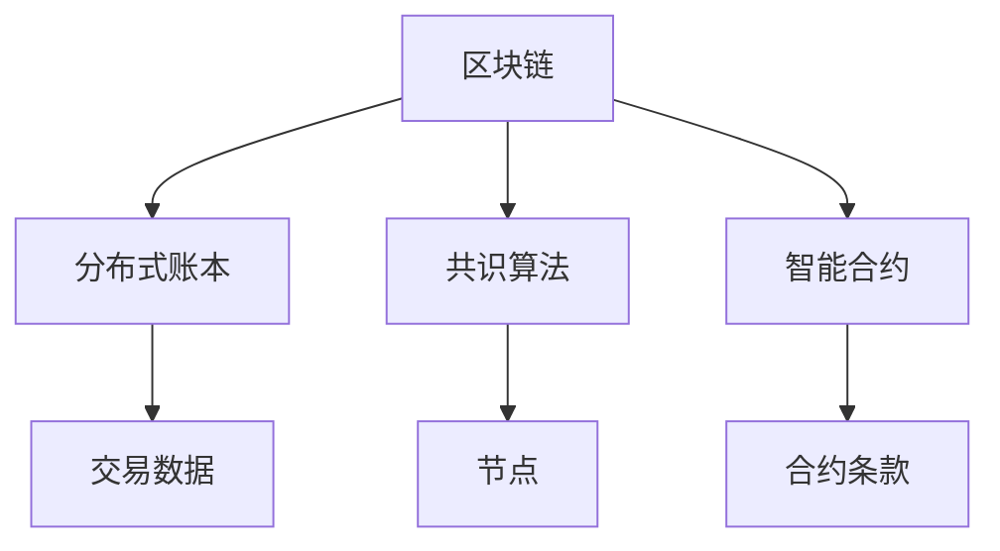
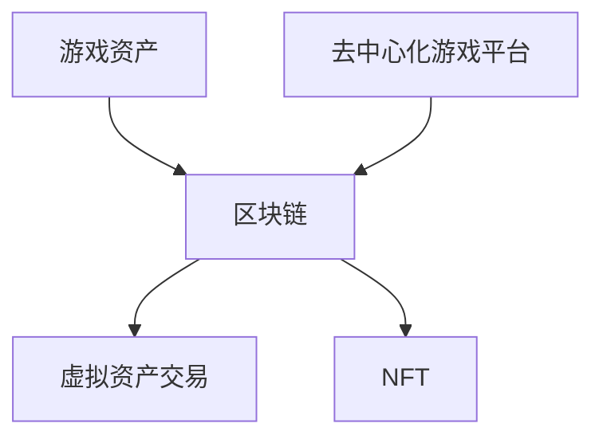
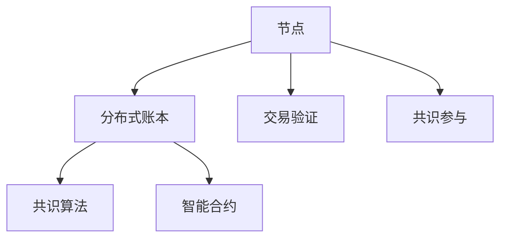

                 

### 第1章 引言

#### 1.1 区块链技术概述

区块链是一种分布式数据库技术，其特点是去中心化、透明性和不可篡改性。区块链通过将数据分块，并以链式结构进行存储，形成一个不断增长的数据库。每个区块都包含一定数量的交易信息，并且每个区块都与前一个区块通过加密算法连接在一起，形成一个不可篡改的数据链。

**核心概念与联系**

- **核心概念**：区块链、分布式账本、共识算法、智能合约
- **概念属性特征对比表格**：

| 核心概念 | 定义 | 特点 |  
| --- | --- | --- |  
| 区块链 | 去中心化的分布式数据库 | 不可篡改、透明、安全性高 |  
| 分布式账本 | 存储交易的数据库 | 数据分散存储，分布式处理 |  
| 共识算法 | 确保区块链网络中的数据一致性 | 拜占庭容错、快速达成共识 |  
| 智能合约 | 自动执行合约条款的计算机程序 | 自动执行、透明、不可篡改 |

**ER实体关系图架构**

#### 1.1.1 区块链基础

区块链的基础概念包括区块、链式结构、分布式账本、共识算法等。

**区块**

区块是区块链的基本单位，包含以下内容：

- **交易数据**：记录交易信息，如用户身份、交易金额、交易时间等。
- **区块头**：包含哈希值、时间戳、难度目标、区块索引等。
- **Merkle树**：用于验证交易数据的完整性和真实性。

**链式结构**

区块链通过链式结构将区块连接在一起，形成数据链。每个区块包含前一个区块的哈希值，从而确保数据链的完整性和不可篡改性。

**分布式账本**

分布式账本意味着区块链的数据是分散存储在多个节点上，而不是集中在一个中央服务器。每个节点都维护一份完整的数据副本，从而提高了系统的可靠性和安全性。

**共识算法**

共识算法用于确保区块链网络中的数据一致性。常见的共识算法包括工作量证明（PoW）、权益证明（PoS）、委托权益证明（DPoS）等。

#### 1.1.2 区块链在游戏行业中的应用

区块链在游戏行业中的应用逐渐增多，主要体现在以下几个方面：

- **虚拟资产交易**：通过区块链技术，玩家可以在不同游戏之间自由交易虚拟资产，如虚拟货币、装备等，打破了游戏之间的壁垒。
- **去中心化游戏平台**：区块链可以构建去中心化的游戏平台，使开发者可以避免传统平台的抽成，同时提高游戏的透明度和公正性。
- **NFT（非同质化代币）**：区块链技术可以用于创建和验证NFT，这为游戏中的独特虚拟物品提供了所有权证明。

**ER实体关系图架构**

**数学公式使用LaTeX格式**

- 区块链安全性：$$H(h(x))=k$$，其中$H$为哈希函数，$h(x)$为输入值，$k$为哈希值。

**注意事项**

- 区块链技术具有较高的安全性，但并非绝对安全。安全漏洞仍然存在，需要持续关注和改进。
- 区块链技术适用于处理大量交易数据，但交易速度可能较慢。
- 区块链技术需要消耗大量计算资源，对环境有一定影响。

**拓展阅读**

- 《区块链技术指南》
- 《智能合约：设计与实现》
- 《去中心化应用（DApp）开发指南》

### 第1章 引言

#### 1.2 数字游戏资产概念

**背景介绍**

随着游戏行业的快速发展，虚拟资产在游戏中的地位日益重要。这些虚拟资产不仅为游戏带来丰富的玩法和社交互动，还为玩家创造了经济价值。然而，传统游戏平台中的虚拟资产存在诸多问题，如交易受限、资产不安全、平台抽成等。为了解决这些问题，区块链技术应运而生，为数字游戏资产管理提供了新的解决方案。

**问题背景**

- **虚拟资产交易受限**：传统游戏平台通常限制玩家之间虚拟资产的交易，使得玩家难以在不同游戏之间自由转移和使用资产。
- **资产不安全**：游戏平台可能遭遇黑客攻击，导致玩家资产被盗。
- **平台抽成**：传统游戏平台通常会从虚拟资产交易中抽取一定比例的佣金，增加了玩家的负担。

**问题描述**

- 如何实现虚拟资产在不同游戏之间的自由交易？
- 如何确保虚拟资产的安全和不可篡改性？
- 如何减少或避免平台抽成，提高玩家收益？

**问题解决**

- 通过区块链技术，可以构建去中心化的虚拟资产交易平台，实现虚拟资产在游戏之间的自由交易。
- 区块链技术的分布式存储和加密算法保证了虚拟资产的安全性和不可篡改性。
- 去中心化平台不依赖于传统游戏平台，从而避免了平台抽成。

**边界与外延**

- **虚拟资产**：包括虚拟货币、装备、道具、虚拟土地等。
- **数字游戏资产管理**：涉及虚拟资产的交易、存储、转移、所有权验证等。

**概念结构与核心要素组成**

- **核心概念**：虚拟资产、区块链、去中心化、安全性、透明性
- **核心要素**：虚拟资产交易平台、分布式存储、加密算法、共识算法、智能合约

**数学公式使用LaTeX格式**

- **交易费用**：$$C = f \times Q$$，其中$C$为交易费用，$f$为手续费率，$Q$为交易数量。

**注意事项**

- 虚拟资产交易需遵循法律法规，避免违法行为。
- 区块链技术在游戏资产管理中的应用仍需不断完善和优化。
- 虚拟资产的价值受市场需求和游戏生态影响，存在一定风险。

**拓展阅读**

- 《数字游戏经济学》
- 《区块链游戏开发实战》
- 《去中心化金融（DeFi）入门指南》

### 第2章 核心概念

#### 2.1 区块链原理详解

**背景介绍**

区块链作为一种分布式数据库技术，其原理和机制对数字游戏资产管理具有重要意义。本节将详细讲解区块链的核心概念，包括分布式账本、共识算法、智能合约等。

**问题背景**

- **分布式账本**：区块链如何实现数据的分布式存储和管理？
- **共识算法**：区块链如何确保数据的一致性和安全性？
- **智能合约**：区块链如何实现自动化合约执行？

**问题描述**

- **分布式账本**：如何构建一个安全、可靠且去中心化的分布式账本？
- **共识算法**：如何设计一种高效且安全的共识算法？
- **智能合约**：如何实现自动化、透明且不可篡改的智能合约？

**问题解决**

- **分布式账本**：通过将数据分散存储在多个节点上，实现去中心化，从而提高系统的安全性和可靠性。
- **共识算法**：通过一系列数学算法，确保所有节点对数据的共识，从而保持数据的一致性。
- **智能合约**：通过编写计算机程序，实现自动化、透明且不可篡改的合约执行。

**边界与外延**

- **分布式账本**：涉及数据存储、同步、验证等技术。
- **共识算法**：涉及数学、密码学、分布式系统等领域。
- **智能合约**：涉及编程语言、逻辑推理、自动化执行等技术。

**概念结构与核心要素组成**

- **核心概念**：分布式账本、共识算法、智能合约
- **核心要素**：节点、数据存储、加密算法、共识机制、计算机程序

**数学公式使用LaTeX格式**

- **分布式账本同步**：$$S = \sum_{i=1}^{n} P_i$$，其中$S$为同步状态，$P_i$为节点$i$的数据。

**注意事项**

- 分布式账本的安全性依赖于加密算法和共识算法的设计。
- 共识算法的性能和安全性直接影响区块链的效率和可靠性。
- 智能合约的实现需要考虑代码的安全性和鲁棒性。

**拓展阅读**

- 《分布式系统原理与范型》
- 《区块链：从入门到实战》
- 《智能合约安全设计》

#### 2.1.1 区块链架构

区块链架构是构建区块链系统的核心，主要包括以下组成部分：

- **节点**：区块链系统中的参与方，负责存储数据、验证交易、参与共识等。
- **分布式账本**：存储区块链数据的地方，由多个节点共同维护。
- **共识算法**：确保所有节点对数据的共识，从而保持数据一致性。
- **智能合约**：自动执行合约条款的计算机程序。

**节点**

节点是区块链系统中的基本单位，每个节点都维护一份完整的区块链数据副本。节点的主要功能包括：

- **数据存储**：存储区块数据和交易信息。
- **交易验证**：验证交易的有效性。
- **共识参与**：参与共识算法，确保数据一致性。

**分布式账本**

分布式账本存储区块链的数据，由多个节点共同维护。分布式账本的特点包括：

- **去中心化**：数据分散存储在多个节点上，不存在中央服务器。
- **安全可靠**：通过加密算法和共识算法确保数据的安全性和完整性。
- **可扩展性**：支持大量节点同时参与，提高系统性能。

**共识算法**

共识算法是区块链系统中的关键机制，用于确保所有节点对数据的共识。常见的共识算法包括：

- **工作量证明（PoW）**：通过解决数学难题，验证交易的有效性。
- **权益证明（PoS）**：通过持有币龄和币量，验证交易的有效性。
- **委托权益证明（DPoS）**：通过选举产生记账节点，验证交易的有效性。

**智能合约**

智能合约是区块链系统中的自动化计算机程序，用于实现自动化、透明且不可篡改的合约执行。智能合约的主要特点包括：

- **自动化执行**：根据预设的逻辑条件，自动执行合约条款。
- **透明性**：合约执行过程公开透明，所有参与者均可查看。
- **不可篡改性**：合约一旦执行，无法更改或撤销。

**ER实体关系图架构**

**数学公式使用LaTeX格式**

- **工作量证明（PoW）**：$$H(S) < D$$，其中$H$为哈希函数，$S$为输入值，$D$为难度目标。

**注意事项**

- 节点的选择和配置影响区块链系统的性能和安全性。
- 共识算法的设计和实现直接影响区块链的效率和可靠性。
- 智能合约的实现需要严格测试和审核，以防止漏洞和恶意行为。

**拓展阅读**

- 《区块链架构设计与实现》
- 《区块链共识算法原理与实现》
- 《智能合约开发实战》

#### 2.1.2 共识算法

**背景介绍**

共识算法是区块链系统的核心机制，用于确保所有节点对数据的共识，从而保持数据一致性。本节将介绍几种常见的共识算法，包括工作量证明（PoW）、权益证明（PoS）和委托权益证明（DPoS）。

**问题背景**

- **工作量证明（PoW）**：如何通过解决数学难题，验证交易的有效性？
- **权益证明（PoS）**：如何通过持有币龄和币量，验证交易的有效性？
- **委托权益证明（DPoS）**：如何通过选举产生记账节点，验证交易的有效性？

**问题描述**

- **工作量证明（PoW）**：如何设计一种公平、高效且安全的算法？
- **权益证明（PoS）**：如何确保持有币龄和币量的参与者能够公平参与共识？
- **委托权益证明（DPoS）**：如何选举出可信的记账节点，确保数据一致性？

**问题解决**

- **工作量证明（PoW）**：通过解决数学难题，验证交易的有效性，确保区块链的安全性。
- **权益证明（PoS）**：通过持有币龄和币量，实现参与者的公平竞争，提高共识效率。
- **委托权益证明（DPoS）**：通过选举产生记账节点，提高共识速度，降低计算资源消耗。

**边界与外延**

- **工作量证明（PoW）**：涉及数学难题、加密算法、节点竞选等领域。
- **权益证明（PoS）**：涉及币龄、币量、权益计算等领域。
- **委托权益证明（DPoS）**：涉及选举机制、记账节点、权益分配等领域。

**概念结构与核心要素组成**

- **核心概念**：工作量证明（PoW）、权益证明（PoS）、委托权益证明（DPoS）
- **核心要素**：数学难题、加密算法、币龄、币量、选举机制

**数学公式使用LaTeX格式**

- **工作量证明（PoW）**：$$H(S) < D$$，其中$H$为哈希函数，$S$为输入值，$D$为难度目标。
- **权益证明（PoS）**：$$E = \frac{C \times P}{N}$$，其中$E$为权益，$C$为币量，$P$为币龄，$N$为总权益。

**注意事项**

- 工作量证明（PoW）算法可能消耗大量计算资源，对环境有一定影响。
- 权益证明（PoS）算法需要考虑权益分配的公平性和安全性。
- 委托权益证明（DPoS）算法需要确保选举过程的公正性和透明性。

**拓展阅读**

- 《区块链共识算法设计》
- 《工作量证明算法原理与实现》
- 《权益证明算法原理与实现》
- 《委托权益证明算法原理与实现》

#### 2.1.3 智能合约

**背景介绍**

智能合约是一种自动执行合约条款的计算机程序，其核心思想是在区块链上实现合约的自动化执行，从而提高交易的效率和透明性。本节将介绍智能合约的基本原理、编写方法和应用场景。

**问题背景**

- **智能合约的基本原理是什么？
- **智能合约如何编写？
- **智能合约在区块链系统中如何应用？

**问题描述**

- **智能合约的基本原理**：智能合约是如何实现自动化执行的？
- **智能合约的编写方法**：如何使用编程语言编写智能合约？
- **智能合约的应用场景**：智能合约在区块链系统中有哪些实际应用？

**问题解决**

- **智能合约的基本原理**：智能合约通过编写计算机程序，实现合约条款的自动化执行。在区块链上，智能合约的执行过程是公开透明的，所有参与者均可查看。
- **智能合约的编写方法**：使用以太坊等区块链平台提供的智能合约开发工具，如Truffle、Ganache等，编写智能合约的代码。
- **智能合约的应用场景**：智能合约可以应用于数字资产管理、去中心化金融、供应链管理、智能投票等多个领域。

**边界与外延**

- **智能合约的基本原理**：涉及编程语言、区块链架构、计算机程序等领域。
- **智能合约的编写方法**：涉及Solidity、Vyper等编程语言的使用。
- **智能合约的应用场景**：涉及区块链技术在各个行业中的应用。

**概念结构与核心要素组成**

- **核心概念**：智能合约、自动化执行、区块链架构、计算机程序
- **核心要素**：编程语言、智能合约代码、区块链平台、合约执行环境

**数学公式使用LaTeX格式**

- **智能合约执行**：$$F = C \times V$$，其中$F$为执行结果，$C$为合约代码，$V$为输入参数。

**注意事项**

- 智能合约的编写需要严格遵循编程规范，确保代码的安全性和鲁棒性。
- 智能合约的执行过程是公开透明的，但编写者需要确保合约条款的公平性和合理性。
- 智能合约的应用需要考虑区块链平台的性能和可扩展性。

**拓展阅读**

- 《智能合约：设计与实现》
- 《以太坊智能合约开发指南》
- 《智能合约安全最佳实践》

#### 2.2 数字游戏资产与区块链

**背景介绍**

随着区块链技术的不断发展，数字游戏资产在区块链上的应用逐渐增多。本节将介绍数字游戏资产的定义、特点以及在区块链上的应用。

**问题背景**

- **数字游戏资产的定义是什么？
- **数字游戏资产在区块链上的应用有哪些？
- **数字游戏资产的优势和挑战是什么？

**问题描述**

- **数字游戏资产的定义**：数字游戏资产是什么？它们在区块链上有哪些特点？
- **数字游戏资产的应用**：数字游戏资产在区块链上的应用场景有哪些？
- **数字游戏资产的优势和挑战**：数字游戏资产的优势和挑战是什么？

**问题解决**

- **数字游戏资产的定义**：数字游戏资产是指在游戏环境中创建、拥有和交易的价值实体，如虚拟货币、装备、道具、虚拟土地等。数字游戏资产在区块链上具有去中心化、安全、透明、可追溯等特点。
- **数字游戏资产的应用**：数字游戏资产可以在区块链上进行自由交易、跨游戏转移、所有权验证等应用。例如，玩家可以在不同游戏之间自由转移虚拟资产，或使用区块链验证虚拟资产的所有权。
- **数字游戏资产的优势和挑战**：数字游戏资产的优势包括去中心化、安全、透明等。然而，数字游戏资产也面临一些挑战，如交易成本、交易速度、法律法规等。

**边界与外延**

- **数字游戏资产**：涉及虚拟货币、虚拟土地、虚拟物品、虚拟装备等。
- **区块链应用**：涉及去中心化交易、跨游戏资产转移、所有权验证等。
- **优势与挑战**：涉及去中心化、安全、透明、交易成本、交易速度等领域。

**概念结构与核心要素组成**

- **核心概念**：数字游戏资产、区块链、去中心化、安全、透明、可追溯
- **核心要素**：虚拟货币、虚拟物品、虚拟装备、区块链平台、智能合约

**数学公式使用LaTeX格式**

- **交易成本**：$$C = f \times Q$$，其中$C$为交易成本，$f$为手续费率，$Q$为交易数量。

**注意事项**

- 数字游戏资产的应用需要遵循法律法规，确保合法合规。
- 区块链技术在数字游戏资产中的应用需要不断优化和改进。
- 数字游戏资产的价值受市场需求和游戏生态影响，存在一定风险。

**拓展阅读**

- 《数字游戏经济学》
- 《区块链游戏开发实战》
- 《去中心化金融（DeFi）入门指南》

### 第3章 技术应用

#### 3.1 区块链在数字游戏资产管理中的应用

**背景介绍**

区块链技术在数字游戏资产管理中的应用为游戏行业带来了新的变革。本节将探讨区块链在数字游戏资产管理中的应用，包括NFT（非同质化代币）和虚拟资产交易平台。

**问题背景**

- **NFT在游戏中的应用**：NFT如何为游戏带来独特的虚拟物品和所有权证明？
- **虚拟资产交易平台**：如何构建一个去中心化的虚拟资产交易平台，实现虚拟资产的自由交易？

**问题描述**

- **NFT在游戏中的应用**：如何使用NFT为游戏中的虚拟物品提供独特性和所有权证明？
- **虚拟资产交易平台**：如何构建一个高效、安全、去中心化的虚拟资产交易平台？

**问题解决**

- **NFT在游戏中的应用**：通过区块链技术，为游戏中的虚拟物品创建NFT，从而实现虚拟物品的独特性和所有权证明。玩家可以在不同游戏之间自由转移和交易这些虚拟物品。
- **虚拟资产交易平台**：通过去中心化的设计，构建一个无需依赖传统平台的虚拟资产交易平台。玩家可以在平台上自由交易虚拟资产，无需支付高额交易费用。

**边界与外延**

- **NFT在游戏中的应用**：涉及区块链、智能合约、虚拟物品、所有权证明等领域。
- **虚拟资产交易平台**：涉及区块链、分布式存储、去中心化、虚拟资产交易等领域。

**概念结构与核心要素组成**

- **核心概念**：NFT、虚拟资产交易平台、去中心化、虚拟物品、所有权证明
- **核心要素**：区块链、智能合约、虚拟物品、交易平台、交易规则

**数学公式使用LaTeX格式**

- **交易效率**：$$E = \frac{T}{N}$$，其中$E$为交易效率，$T$为交易时间，$N$为交易数量。

**注意事项**

- NFT在游戏中的应用需要确保虚拟物品的独特性和真实性。
- 虚拟资产交易平台的设计需要考虑交易速度、安全性和去中心化程度。
- 区块链技术在数字游戏资产管理中的应用需要不断优化和改进。

**拓展阅读**

- 《区块链游戏开发实战》
- 《NFT：数字世界的全新资产》
- 《去中心化金融（DeFi）入门指南》

#### 3.1.1 NFT在游戏中的应用

**背景介绍**

NFT（非同质化代币）是一种基于区块链技术的数字资产，代表独特的、不可替代的物品。在游戏行业中，NFT可以为虚拟物品提供独特性和所有权证明，从而改变游戏资产的管理方式。本节将探讨NFT在游戏中的应用。

**问题背景**

- **NFT如何为游戏中的虚拟物品提供独特性？
- **NFT如何为游戏中的虚拟物品提供所有权证明？
- **NFT在游戏中的应用有哪些优势？

**问题描述**

- **NFT如何为游戏中的虚拟物品提供独特性**：如何确保游戏中的虚拟物品具有独特的属性，与其他物品区分开来？
- **NFT如何为游戏中的虚拟物品提供所有权证明**：如何确保虚拟物品的所有权明确，防止盗版和滥用？
- **NFT在游戏中的应用有哪些优势**：NFT在游戏中有哪些优势，如何提升游戏体验？

**问题解决**

- **NFT如何为游戏中的虚拟物品提供独特性**：通过区块链技术，为每个虚拟物品创建一个唯一的NFT，确保其独特性。每个NFT都包含该物品的详细信息，如名称、描述、图片等。
- **NFT如何为游戏中的虚拟物品提供所有权证明**：NFT的区块链记录确保了虚拟物品的所有权明确。玩家可以通过区块链验证虚拟物品的所有权，防止盗版和滥用。
- **NFT在游戏中的应用有哪些优势**：NFT在游戏中的应用可以提升游戏体验，增加玩家的参与度和投资回报。玩家可以自由交易和转移虚拟物品，增加了游戏的社交性和经济价值。

**边界与外延**

- **NFT在游戏中的应用**：涉及区块链、智能合约、虚拟物品、所有权证明等领域。
- **优势**：涉及游戏体验、社交性、经济价值等领域。

**概念结构与核心要素组成**

- **核心概念**：NFT、虚拟物品、独特性、所有权证明、游戏体验
- **核心要素**：区块链、智能合约、虚拟物品、所有权证明、交易平台

**数学公式使用LaTeX格式**

- **交易数量**：$$Q = N_1 + N_2$$，其中$Q$为总交易数量，$N_1$为买入交易数量，$N_2$为卖出交易数量。

**注意事项**

- NFT在游戏中的应用需要确保虚拟物品的真实性和独特性。
- NFT交易需要考虑交易速度和手续费等因素。
- 区块链技术在NFT应用中的性能和安全性需要不断优化。

**拓展阅读**

- 《NFT：数字世界的全新资产》
- 《区块链游戏开发实战》
- 《智能合约：设计与实现》

#### 3.1.2 虚拟资产交易平台的实现

**背景介绍**

虚拟资产交易平台是区块链技术在数字游戏资产管理中的重要应用之一。一个高效的虚拟资产交易平台可以提供便捷的资产交易、安全和透明的交易环境。本节将介绍虚拟资产交易平台的实现原理和关键设计。

**问题背景**

- **虚拟资产交易平台的实现原理是什么？
- **虚拟资产交易平台的关键设计是什么？
- **如何确保虚拟资产交易平台的性能和安全性？

**问题描述**

- **虚拟资产交易平台的实现原理**：如何设计一个虚拟资产交易平台，使其能够高效地处理资产交易？
- **虚拟资产交易平台的关键设计**：交易平台的关键设计包括哪些方面？
- **如何确保虚拟资产交易平台的性能和安全性**：如何确保交易平台的性能和安全性？

**问题解决**

- **虚拟资产交易平台的实现原理**：虚拟资产交易平台基于区块链技术，通过智能合约实现资产交易。交易平台的设计需要考虑交易撮合算法、数据存储和查询、用户身份验证等方面。
- **虚拟资产交易平台的关键设计**：交易平台的关键设计包括交易撮合算法、智能合约、用户身份验证、数据存储和查询等。交易撮合算法负责匹配买卖双方的交易请求，智能合约用于实现自动化交易，用户身份验证确保交易的安全性，数据存储和查询提供高效的数据访问。
- **如何确保虚拟资产交易平台的性能和安全性**：为了确保虚拟资产交易平台的性能和安全性，需要采取以下措施：

  - **优化交易撮合算法**：采用高效的撮合算法，减少交易延迟。
  - **使用分布式存储**：将数据分散存储在多个节点上，提高数据可靠性。
  - **加强智能合约安全性**：对智能合约进行严格测试和审核，防止漏洞和恶意行为。
  - **加密通信**：使用加密算法保护用户数据和通信安全。
  - **监控和审计**：实时监控交易平台的运行状态，定期进行审计和风险分析。

**边界与外延**

- **虚拟资产交易平台的实现原理**：涉及区块链、智能合约、交易撮合算法、数据存储和查询等领域。
- **虚拟资产交易平台的关键设计**：涉及交易撮合算法、智能合约、用户身份验证、数据存储和查询等方面。
- **性能和安全性**：涉及交易速度、数据可靠性、智能合约安全性、通信安全等领域。

**概念结构与核心要素组成**

- **核心概念**：虚拟资产交易平台、区块链、智能合约、交易撮合算法、用户身份验证、数据存储和查询
- **核心要素**：区块链、智能合约、交易撮合算法、用户身份验证、数据存储和查询

**数学公式使用LaTeX格式**

- **交易效率**：$$E = \frac{T}{N}$$，其中$E$为交易效率，$T$为交易时间，$N$为交易数量。

**注意事项**

- 虚拟资产交易平台的设计需要考虑交易速度、数据可靠性和安全性等因素。
- 智能合约的实现需要严格测试和审核，确保代码的安全性和鲁棒性。
- 虚拟资产交易平台需要定期进行性能优化和安全性审计，确保长期稳定运行。

**拓展阅读**

- 《区块链游戏开发实战》
- 《智能合约：设计与实现》
- 《去中心化金融（DeFi）入门指南》

### 第4章 跨游戏资产互通平台设计

#### 4.1 平台架构设计

**背景介绍**

跨游戏资产互通平台的设计目标是实现不同游戏之间虚拟资产的自由交易和转移，从而打破游戏之间的壁垒，为玩家带来更丰富的游戏体验。本节将介绍跨游戏资产互通平台的架构设计，包括核心模块、技术选型和系统架构。

**问题背景**

- **跨游戏资产互通平台的核心模块有哪些？
- **如何选择合适的技术选型？
- **跨游戏资产互通平台的系统架构是怎样的？

**问题描述**

- **核心模块**：如何设计跨游戏资产互通平台的核心模块？
- **技术选型**：如何选择适合的技术选型？
- **系统架构**：如何构建跨游戏资产互通平台的系统架构？

**问题解决**

- **核心模块**：跨游戏资产互通平台的核心模块包括资产管理模块、交易模块、用户认证模块和数据存储模块。

  - **资产管理模块**：负责管理不同游戏之间的虚拟资产，包括资产创建、查询、转移等操作。
  - **交易模块**：负责处理虚拟资产的交易，包括交易撮合、交易记录、交易结果等。
  - **用户认证模块**：负责用户身份验证，确保交易的安全性和合法性。
  - **数据存储模块**：负责存储虚拟资产的数据，包括资产信息、交易记录等。

- **技术选型**：根据跨游戏资产互通平台的需求，选择合适的技术选型。

  - **区块链平台**：选择适合的区块链平台，如以太坊、波卡等，用于构建去中心化的资产交易平台。
  - **智能合约开发工具**：选择适合的智能合约开发工具，如Truffle、Ganache等，用于编写和部署智能合约。
  - **前端框架**：选择适合的前端框架，如React、Vue等，用于构建用户界面。
  - **后端框架**：选择适合的后端框架，如Node.js、Django等，用于处理交易请求和数据存储。

- **系统架构**：构建跨游戏资产互通平台的系统架构，包括以下方面：

  - **前端架构**：设计用户界面和用户交互逻辑，使用前端框架实现。
  - **后端架构**：设计后端逻辑和数据存储，使用后端框架实现。
  - **区块链架构**：设计区块链网络和智能合约，使用区块链平台实现。
  - **数据库架构**：设计数据存储和查询，使用数据库技术实现。

**边界与外延**

- **核心模块**：涉及资产管理、交易、用户认证、数据存储等领域。
- **技术选型**：涉及区块链平台、智能合约开发工具、前端框架、后端框架等领域。
- **系统架构**：涉及前端架构、后端架构、区块链架构、数据库架构等领域。

**概念结构与核心要素组成**

- **核心概念**：跨游戏资产互通平台、资产管理模块、交易模块、用户认证模块、数据存储模块
- **核心要素**：区块链、智能合约、前端框架、后端框架、数据库

**数学公式使用LaTeX格式**

- **交易数量**：$$Q = N_1 + N_2$$，其中$Q$为总交易数量，$N_1$为买入交易数量，$N_2$为卖出交易数量。

**注意事项**

- 跨游戏资产互通平台的设计需要考虑资产安全性、交易速度和用户体验等因素。
- 技术选型需要根据实际需求和项目规模进行选择。
- 系统架构的设计需要确保高可用性和可扩展性。

**拓展阅读**

- 《区块链架构设计与实现》
- 《智能合约开发实战》
- 《前端架构设计与实践》
- 《后端架构设计与实践》

#### 4.2 关键技术探讨

**背景介绍**

跨游戏资产互通平台的设计涉及多种关键技术，包括区块链技术、智能合约、分布式存储、共识算法等。这些关键技术在平台中发挥着重要作用，确保了资产的安全、透明和高效流通。本节将探讨这些关键技术的实现原理和应用。

**问题背景**

- **区块链技术**：如何实现跨游戏资产互通平台的数据存储和验证？
- **智能合约**：如何实现自动化交易和合约执行？
- **分布式存储**：如何实现数据的分布式存储和高效查询？
- **共识算法**：如何实现节点之间的数据一致性？

**问题描述**

- **区块链技术**：如何构建一个安全的区块链网络，实现数据存储和验证？
- **智能合约**：如何编写和部署智能合约，实现自动化交易和合约执行？
- **分布式存储**：如何实现数据的分布式存储和高效查询？
- **共识算法**：如何实现节点之间的数据一致性，确保区块链的安全和可靠性？

**问题解决**

- **区块链技术**：区块链技术通过分布式账本和加密算法实现数据存储和验证。每个节点都存储一份完整的数据副本，通过加密算法确保数据的完整性和安全性。节点之间通过共识算法达成数据一致性。

  - **分布式账本**：分布式账本记录交易信息，确保数据分散存储在多个节点上，提高了系统的可靠性和安全性。
  - **加密算法**：加密算法用于保护数据传输和存储，确保数据的机密性和完整性。
  - **共识算法**：共识算法用于确保所有节点对数据的共识，从而保持数据一致性。

- **智能合约**：智能合约是自动化执行合约条款的计算机程序，通过编写和部署智能合约，实现自动化交易和合约执行。

  - **智能合约编写**：使用Solidity等编程语言编写智能合约，定义合约条款和逻辑。
  - **智能合约部署**：将智能合约部署到区块链网络中，使其在区块链上运行。

- **分布式存储**：分布式存储通过将数据分散存储在多个节点上，实现数据的高效查询和访问。

  - **数据分片**：将数据划分为多个片段，存储在多个节点上，提高了数据的查询效率。
  - **副本机制**：每个数据片段存储多个副本，提高了数据的可靠性和可用性。

- **共识算法**：共识算法用于实现节点之间的数据一致性，确保区块链的安全和可靠性。

  - **PoW（工作量证明）**：通过解决数学难题，验证交易的有效性，确保区块链的安全性。
  - **PoS（权益证明）**：通过持有币龄和币量，验证交易的有效性，提高共识效率。
  - **DPoS（委托权益证明）**：通过选举产生记账节点，验证交易的有效性，降低计算资源消耗。

**边界与外延**

- **区块链技术**：涉及分布式账本、加密算法、共识算法等领域。
- **智能合约**：涉及编程语言、区块链网络、合约执行等领域。
- **分布式存储**：涉及数据分片、副本机制、高效查询等领域。
- **共识算法**：涉及数学难题、币龄和币量、选举机制等领域。

**概念结构与核心要素组成**

- **核心概念**：区块链技术、智能合约、分布式存储、共识算法
- **核心要素**：分布式账本、加密算法、共识算法、编程语言、数据分片、副本机制

**数学公式使用LaTeX格式**

- **交易验证时间**：$$T_V = \frac{N}{R}$$，其中$T_V$为交易验证时间，$N$为节点数量，$R$为共识算法的响应时间。

**注意事项**

- 区块链技术的安全性依赖于加密算法和共识算法的设计。
- 智能合约的实现需要严格测试和审核，确保代码的安全性和鲁棒性。
- 分布式存储的设计需要考虑数据可靠性和查询效率。
- 共识算法的选择需要根据实际需求和系统规模进行选择。

**拓展阅读**

- 《区块链技术指南》
- 《智能合约：设计与实现》
- 《分布式系统原理与范型》
- 《区块链共识算法原理与实现》

### 第5章 实际案例研究

#### 5.1 案例一：知名游戏区块链集成

**背景介绍**

知名游戏《Axie Infinity》是一款基于区块链的游戏，其引入了区块链技术，为游戏中的虚拟资产提供了去中心化的管理和交易机制。本案例将分析《Axie Infinity》如何实现区块链集成，并讨论其成功经验和挑战。

**问题背景**

- **《Axie Infinity》区块链集成的目标是什么？
- **《Axie Infinity》如何实现区块链集成？
- **《Axie Infinity》区块链集成有哪些成功经验和挑战？

**问题描述**

- **《Axie Infinity》区块链集成的目标**：如何通过区块链技术实现游戏中的虚拟资产去中心化管理和交易？
- **《Axie Infinity》如何实现区块链集成**：如何将区块链技术集成到游戏系统中，实现虚拟资产的去中心化管理和交易？
- **《Axie Infinity》区块链集成有哪些成功经验和挑战**：《Axie Infinity》在区块链集成过程中遇到了哪些问题和挑战，又是如何解决的？

**问题解决**

- **《Axie Infinity》区块链集成的目标**：通过区块链技术实现游戏中的虚拟资产去中心化管理和交易，提高游戏的可玩性和经济价值。

  - **去中心化资产交易**：玩家可以在区块链上自由交易游戏中的虚拟资产，如Axies（虚拟宠物）、土地等。
  - **去中心化资产转移**：玩家可以将虚拟资产在不同游戏之间自由转移。

- **《Axie Infinity》如何实现区块链集成**：通过以下步骤实现区块链集成：

  - **设计区块链架构**：设计一个去中心化的区块链架构，包括资产管理系统、交易系统、用户认证系统等。
  - **编写智能合约**：使用Solidity等编程语言编写智能合约，定义虚拟资产的管理规则和交易逻辑。
  - **部署智能合约**：将智能合约部署到区块链网络中，使其在区块链上运行。
  - **集成到游戏系统**：将区块链集成到游戏系统中，实现虚拟资产的去中心化管理和交易。

- **《Axie Infinity》区块链集成有哪些成功经验和挑战**：

  - **成功经验**：

    - **去中心化交易**：通过区块链技术实现了虚拟资产的自由交易，提高了游戏的互动性和经济价值。
    - **去中心化资产转移**：玩家可以自由转移虚拟资产，增加了游戏的灵活性。
    - **透明性和安全性**：区块链技术确保了交易过程的透明性和安全性，增强了玩家的信任。

  - **挑战**：

    - **交易速度**：区块链网络的处理速度较慢，可能影响用户体验。
    - **手续费**：区块链交易需要支付手续费，可能增加玩家的成本。
    - **法律法规**：区块链技术的应用需要遵循相关法律法规，确保合法合规。

**边界与外延**

- **区块链集成**：涉及区块链技术、智能合约、游戏系统等领域。
- **成功经验**：涉及去中心化交易、去中心化资产转移、透明性和安全性等领域。
- **挑战**：涉及交易速度、手续费、法律法规等领域。

**概念结构与核心要素组成**

- **核心概念**：区块链集成、去中心化交易、去中心化资产转移、透明性、安全性
- **核心要素**：区块链技术、智能合约、游戏系统、交易速度、手续费、法律法规

**数学公式使用LaTeX格式**

- **交易速度**：$$S = \frac{L}{N}$$，其中$S$为交易速度，$L$为交易长度，$N$为节点数量。

**注意事项**

- 区块链集成需要考虑交易速度和手续费等因素，以提升用户体验。
- 区块链技术的应用需要遵循相关法律法规，确保合法合规。
- 区块链集成的设计和实现需要严格测试和审核，确保系统的稳定性和安全性。

**拓展阅读**

- 《区块链游戏开发实战》
- 《智能合约：设计与实现》
- 《去中心化金融（DeFi）入门指南》

### 第6章 未来发展趋势

#### 6.1 区块链在游戏资产管理的未来趋势

**背景介绍**

区块链技术在游戏资产管理中的应用正日益成熟，其去中心化、透明性和安全性的特点为游戏行业带来了新的变革。随着技术的不断进步和应用的深入，区块链在游戏资产管理中的未来发展趋势值得探讨。

**问题背景**

- **区块链在游戏资产管理的优势有哪些？
- **区块链在游戏资产管理中面临的挑战是什么？
- **区块链在游戏资产管理中的未来发展趋势是什么？

**问题描述**

- **区块链在游戏资产管理的优势**：如何通过区块链技术实现游戏资产的去中心化管理和交易？
- **区块链在游戏资产管理中面临的挑战**：区块链技术在游戏资产管理中面临哪些技术、法律和市场等方面的挑战？
- **区块链在游戏资产管理中的未来发展趋势**：区块链技术在游戏资产管理中的未来将如何发展，可能带来哪些影响？

**问题解决**

- **区块链在游戏资产管理的优势**：

  - **去中心化**：通过区块链技术，可以实现游戏资产的去中心化管理，打破传统游戏平台对资产的垄断，提高游戏的透明度和公正性。
  - **透明性**：区块链技术的分布式存储和透明性特点，确保了游戏资产的交易和转移过程公开透明，增加了玩家的信任。
  - **安全性**：区块链技术的加密算法和共识算法，提高了游戏资产的安全性和不可篡改性，降低了资产被盗和滥用的风险。

- **区块链在游戏资产管理中面临的挑战**：

  - **技术挑战**：区块链技术的性能和可扩展性仍需提升，以应对大规模游戏资产交易和海量用户的需求。
  - **法律挑战**：区块链技术的应用需要遵循相关法律法规，确保合法合规，避免法律风险。
  - **市场挑战**：区块链技术在游戏资产交易中的应用仍需市场验证，如何吸引更多开发者和使用者参与，是面临的一大挑战。

- **区块链在游戏资产管理中的未来发展趋势**：

  - **跨游戏资产互通**：随着区块链技术的发展，跨游戏资产互通将成为趋势，玩家可以在不同游戏之间自由转移和交易虚拟资产，提高游戏体验和资产价值。
  - **去中心化游戏平台**：去中心化游戏平台将逐渐取代传统游戏平台，提高游戏的透明度和公正性，降低开发者的运营成本。
  - **NFT的应用扩展**：NFT在游戏中的应用将更加广泛，为虚拟物品提供唯一性和所有权证明，提高游戏的可玩性和经济价值。
  - **合规与监管**：随着区块链技术的应用深入，相关法律法规和监管政策将不断完善，确保区块链技术在游戏资产管理中的合法合规。

**边界与外延**

- **区块链在游戏资产管理的优势**：涉及去中心化、透明性、安全性等领域。
- **区块链在游戏资产管理中面临的挑战**：涉及技术、法律、市场等领域。
- **区块链在游戏资产管理中的未来发展趋势**：涉及跨游戏资产互通、去中心化游戏平台、NFT的应用扩展、合规与监管等领域。

**概念结构与核心要素组成**

- **核心概念**：区块链、游戏资产管理、去中心化、透明性、安全性、跨游戏资产互通、去中心化游戏平台、NFT、合规与监管
- **核心要素**：区块链技术、智能合约、游戏系统、虚拟资产、交易、法律法规、市场

**数学公式使用LaTeX格式**

- **交易效率**：$$E = \frac{T}{N}$$，其中$E$为交易效率，$T$为交易时间，$N$为交易数量。

**注意事项**

- 区块链技术在游戏资产管理中的应用需要不断优化和改进，以提高性能和可扩展性。
- 法律法规和监管政策的完善将有助于推动区块链技术在游戏资产管理中的应用。
- 市场需求的增长将促进区块链技术在游戏资产管理中的普及和发展。

**拓展阅读**

- 《区块链游戏开发实战》
- 《去中心化金融（DeFi）入门指南》
- 《NFT：数字世界的全新资产》

### 第7章 总结与展望

#### 6.1 全书总结

本文从区块链技术概述、数字游戏资产概念、区块链技术原理、数字游戏资产管理应用、跨游戏资产互通平台设计、实际案例研究和未来发展趋势等方面，深入探讨了区块链在数字游戏资产管理中的应用。以下是本文的核心内容总结：

- **区块链技术概述**：介绍了区块链的基础概念、分布式账本、共识算法、智能合约等，以及区块链在游戏行业中的应用。
- **数字游戏资产概念**：探讨了数字游戏资产的定义、重要性以及区块链技术如何解决传统游戏平台中存在的问题。
- **区块链技术原理**：详细讲解了区块链的工作原理、安全性和透明性，以及共识算法和智能合约的实现原理。
- **数字游戏资产管理应用**：分析了区块链在数字游戏资产交易、去中心化游戏平台和NFT等方面的应用。
- **跨游戏资产互通平台设计**：介绍了跨游戏资产互通平台的架构设计、关键技术探讨，以及实现策略。
- **实际案例研究**：通过分析《Axie Infinity》等知名游戏案例，探讨了区块链在游戏资产管理中的成功经验和挑战。
- **未来发展趋势**：预测了区块链在游戏资产管理中的未来趋势，包括跨游戏资产互通、去中心化游戏平台、NFT的应用扩展等。

#### 6.1.1 区块链在数字游戏资产管理中的价值

区块链技术在数字游戏资产管理中具有重要价值，主要表现在以下几个方面：

- **去中心化**：区块链的去中心化特点，使游戏资产的管理更加透明和公正，打破了传统游戏平台的垄断，提高了游戏生态的活力。
- **安全性**：区块链的加密算法和共识算法，确保了游戏资产的安全性和不可篡改性，降低了资产被盗和滥用的风险。
- **透明性**：区块链的分布式存储和透明性特点，使游戏资产交易和转移过程公开透明，增加了玩家的信任。
- **灵活性**：区块链技术使得游戏资产可以在不同游戏之间自由转移和交易，提高了游戏的可玩性和经济价值。

#### 6.1.2 进一步研究方向

随着区块链技术的不断发展，数字游戏资产管理领域还有许多研究方向值得探索：

- **性能优化**：提高区块链技术的处理速度和可扩展性，以应对大规模游戏资产交易和海量用户的需求。
- **安全性增强**：进一步研究和开发更加安全可靠的加密算法和共识算法，提高区块链技术的安全性。
- **跨链互操作性**：研究跨链技术，实现不同区块链之间的资产互操作性，扩大区块链在游戏资产管理中的应用范围。
- **法律法规与监管**：随着区块链技术的应用深入，需要进一步完善相关法律法规和监管政策，确保区块链技术在游戏资产管理中的合法合规。
- **用户体验提升**：研究如何通过优化用户界面和交互设计，提高区块链技术在游戏资产管理中的用户体验。

**拓展阅读**

- 《区块链技术指南》
- 《智能合约：设计与实现》
- 《区块链游戏开发实战》
- 《去中心化金融（DeFi）入门指南》
- 《NFT：数字世界的全新资产》

### 作者

作者：AI天才研究院/AI Genius Institute & 禅与计算机程序设计艺术 /Zen And The Art of Computer Programming

AI天才研究院（AI Genius Institute）致力于推动人工智能领域的研究和应用，以创新技术解决实际问题。研究院的研究领域涵盖机器学习、深度学习、自然语言处理、计算机视觉等多个方向。

《禅与计算机程序设计艺术》（Zen And The Art of Computer Programming）是一本经典的计算机科学书籍，由著名计算机科学家唐纳德·E·克努特（Donald E. Knuth）撰写。本书从哲学和心理学角度探讨了编程的艺术，对于提高程序设计能力和思维方式具有很大的启发意义。

