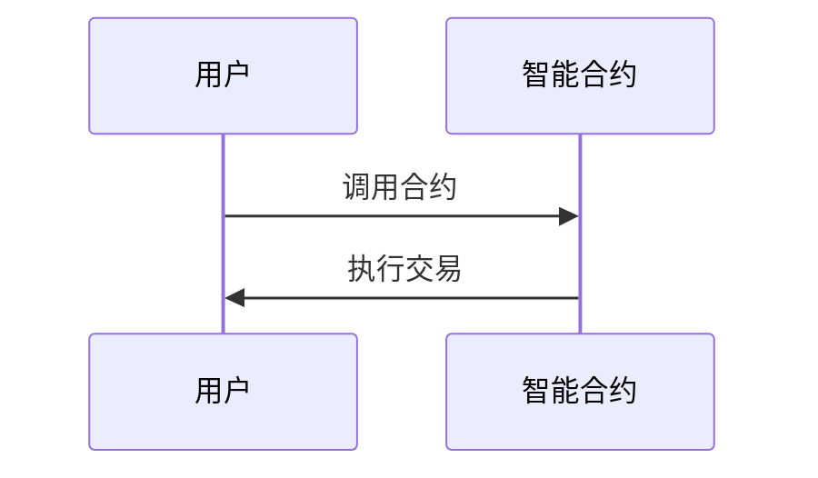
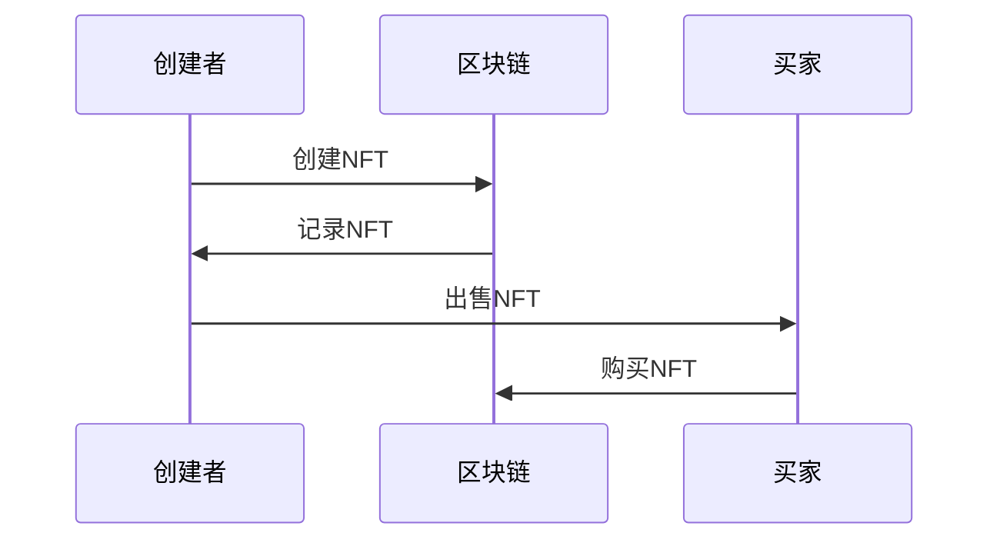
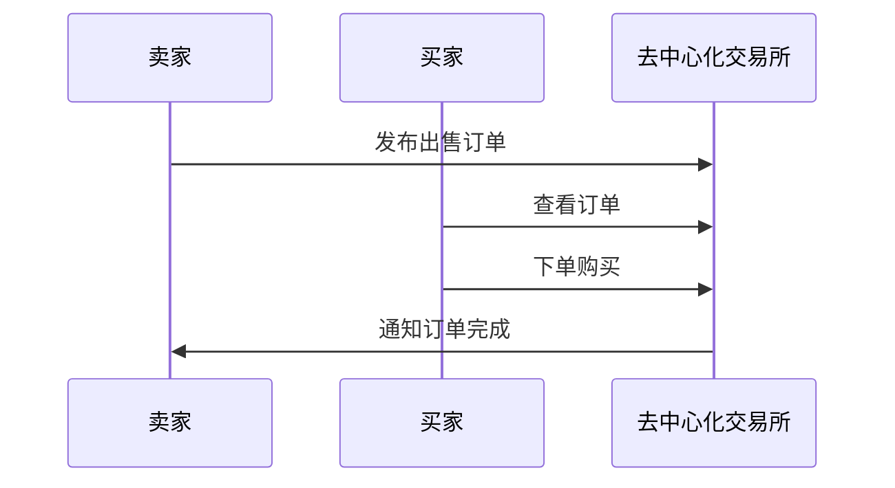
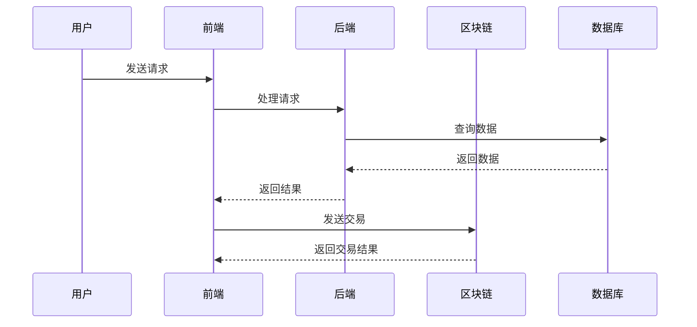
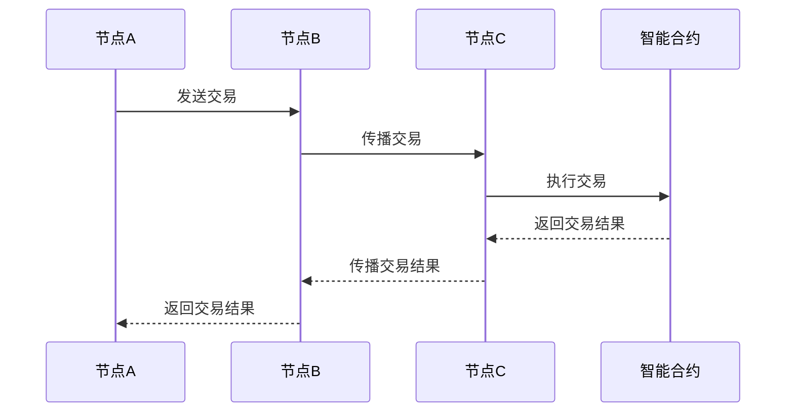
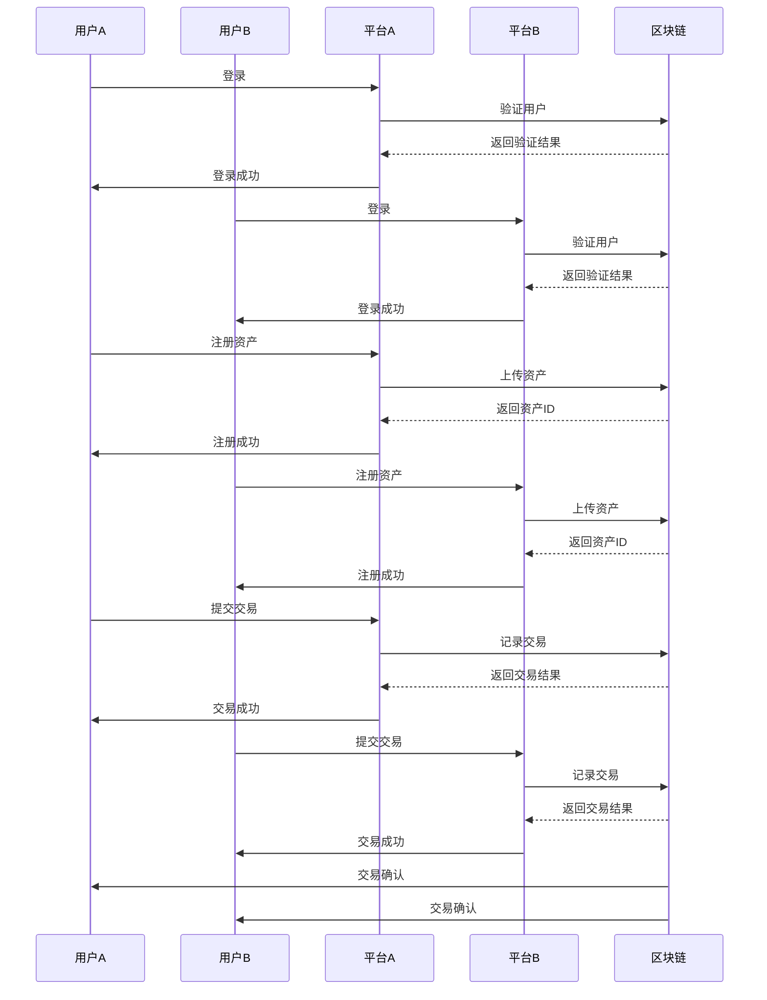
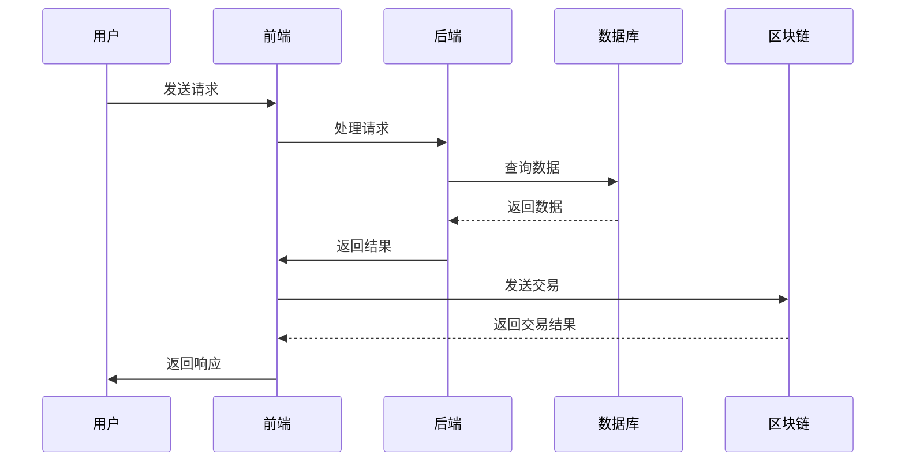

                 

### 引言

#### 区块链与数字游戏资产的交汇

在数字时代，区块链技术以其去中心化、不可篡改和透明性等特点，逐渐成为各行各业关注的热点。尤其是在游戏行业，数字游戏资产（Digital Game Assets，简称DGA）如虚拟货币、道具、角色等，因其独特的价值属性和市场需求，越来越受到重视。然而，当前数字游戏资产的交易大多局限于单个游戏平台，难以实现跨平台的自由流通，这不仅限制了玩家的选择自由，也影响了游戏经济的活力。

本文将探讨区块链技术在数字游戏资产跨平台交易中的应用，旨在通过构建一个开放的游戏经济体系，实现数字游戏资产的无障碍流通，提升游戏体验和市场价值。文章将首先介绍区块链技术的基础知识，包括其起源、发展历程、核心技术等，然后深入分析数字游戏资产的概念、分类及其在区块链上的应用。接下来，我们将讨论跨平台交易的需求与挑战，并探讨区块链如何解决这些问题。随后，文章将介绍区块链的核心概念、算法原理以及系统架构设计，并通过具体项目和实际案例分析，展示区块链在数字游戏资产交易中的实战应用。最后，我们将总结最佳实践和未来发展趋势，为读者提供深入理解和进一步探索的指导。

#### 核心关键词

- 区块链技术
- 数字游戏资产
- 跨平台交易
- 开放游戏经济
- 智能合约
- 非同质化代币（NFT）

### 目录

1. 引言
2. 背景介绍
   2.1 区块链技术基础
       2.1.1 区块链的起源与发展
       2.1.2 区块链的起源与发展
       2.1.3 区块链在游戏行业中的应用现状
   2.2 数字游戏资产的概念与分类
       2.2.1 数字游戏资产的定义
       2.2.2 数字游戏资产的主要类型
       2.2.3 数字游戏资产的价值特性
   2.3 跨平台交易需求与挑战
       2.3.1 跨平台交易的意义
       2.3.2 跨平台交易的挑战
       2.3.3 跨平台交易的优势
3. 核心概念与联系
   3.1 区块链核心概念与联系
       3.1.1 区块链的组成部分
       3.1.2 区块链的工作原理
       3.1.3 区块链的安全机制
   3.2 数字游戏资产与区块链的关联
       3.2.1 数字游戏资产在区块链上的映射
       3.2.2 区块链在数字游戏资产交易中的应用
       3.2.3 数字游戏资产交易流程分析
   3.3 区块链与开放游戏经济的关系
       3.3.1 开放游戏经济的概念
       3.3.2 区块链在开放游戏经济中的作用
       3.3.3 开放游戏经济的特点与优势
4. 算法原理讲解
   4.1 基本算法原理
       4.1.1 智能合约
       4.1.2 非同质化代币（NFT）
       4.1.3 去中心化交易所（DEX）
   4.2 数学模型与公式
       4.2.1 区块链网络的共识算法
       4.2.2 数字游戏资产的价值评估模型
       4.2.3 去中心化交易所的交易模型
   4.3 算法流程图与实例
       4.3.1 智能合约流程图
       4.3.2 非同质化代币（NFT）发行流程图
       4.3.3 去中心化交易所（DEX）交易流程图
5. 系统分析与架构设计方案
   5.1 项目介绍
       5.1.1 项目背景
       5.1.2 项目目标
       5.1.3 项目功能模块
   5.2 系统功能设计
       5.2.1 领域模型设计
       5.2.2 系统架构设计
       5.2.3 数据库设计
   5.3 系统架构设计
       5.3.1 区块链网络设计
       5.3.2 跨平台交易接口设计
       5.3.3 系统安全性设计
   5.4 系统接口设计与系统交互
       5.4.1 系统接口设计
       5.4.2 系统交互设计
6. 项目实战
   6.1 环境安装与配置
       6.1.1 区块链节点搭建
       6.1.2 开发环境搭建
       6.1.3 测试网络搭建
   6.2 系统核心实现
       6.2.1 智能合约开发
       6.2.2 NFT发行与交易
       6.2.3 DEX交易实现
   6.3 代码应用解读与分析
       6.3.1 代码结构解析
       6.3.2 关键代码解读
       6.3.3 应用效果评估
   6.4 实际案例分析
       6.4.1 案例选择
       6.4.2 案例分析
       6.4.3 案例总结
   6.5 项目小结
       6.5.1 项目成果总结
       6.5.2 项目经验与启示
7. 最佳实践与拓展阅读
   7.1 最佳实践
       7.1.1 跨平台交易优化策略
       7.1.2 区块链安全性提升措施
       7.1.3 数字游戏资产价值提升方案
   7.2 小结与展望
       7.2.1 全书总结
       7.2.2 未来发展趋势
       7.2.3 拓展阅读推荐

### 背景介绍

#### 2.1 区块链技术基础

##### 2.1.1 区块链的起源与发展

区块链技术最早由中本聪（Satoshi Nakamoto）在2008年提出，作为比特币（Bitcoin）的底层技术，旨在解决传统金融体系中的信任问题。区块链通过一种去中心化的数据结构，实现了信息的透明、安全和不可篡改，迅速引起了全球关注。

自比特币问世以来，区块链技术经历了快速的发展。从最初的比特币区块链，到后来的以太坊（Ethereum）等智能合约平台，区块链技术逐渐从金融领域扩展到供应链管理、物联网、数字身份验证等多个领域。特别是在数字游戏领域，区块链技术以其独特的优势，为数字游戏资产的跨平台交易提供了全新的解决方案。

##### 2.1.2 区块链的定义与核心技术

区块链是一种分布式数据库系统，由一系列按时间顺序排列的区块组成。每个区块包含一定数量的交易记录，并通过加密算法相互链接，形成一条不可篡改的数据链条。区块链的核心技术包括：

1. **共识算法**：确保网络中的所有节点对数据的认可和一致性。
2. **加密技术**：保护数据传输的安全性和隐私性。
3. **智能合约**：自动执行合约条款和条件的计算机程序。
4. **非同质化代币（NFT）**：代表独特数字资产的身份证明。

##### 2.1.3 区块链的演进与未来趋势

区块链技术从最初的区块链1.0（以比特币为代表），发展到区块链2.0（以太坊智能合约平台），再到当前正在探索的区块链3.0（去中心化金融、社交网络等）。未来，区块链技术将继续向更高效、更安全、更广泛的应用领域发展。

在数字游戏领域，区块链技术的应用前景广阔。通过区块链，可以实现数字游戏资产的去中心化交易，打破平台壁垒，提高资产流动性和价值。同时，区块链技术还可以为游戏开发者提供更多的创作自由和商业机会，促进开放游戏经济的发展。

##### 2.1.4 区块链在游戏行业中的应用现状

当前，区块链技术在游戏行业中的应用已取得显著成果。许多游戏公司开始将区块链技术应用于虚拟货币、游戏道具、角色等数字游戏资产的交易和管理。例如，Epic Games的《堡垒之夜》引入了加密货币支付，玩家可以通过区块链进行资产交易。同时，许多去中心化游戏（DApp）也利用区块链技术，实现了游戏资产的自由流通和跨平台交易。

然而，区块链在游戏行业中的应用仍面临一些挑战，如技术成熟度、安全性和用户体验等。未来，随着区块链技术的不断发展和成熟，这些问题将逐渐得到解决，区块链在游戏行业中的应用将更加广泛和深入。

#### 2.2 数字游戏资产的概念与分类

##### 2.2.1 数字游戏资产的定义

数字游戏资产是指游戏中可以交易、流通、增值的虚拟物品或服务。这些资产通常包括虚拟货币、游戏道具、角色装备、游戏地图、游戏时间等。数字游戏资产具有以下特点：

1. **唯一性**：每个数字游戏资产都是独一无二的，具有独特性。
2. **可交易性**：数字游戏资产可以在游戏内或游戏中进行买卖交易。
3. **增值性**：随着游戏的持续发展，部分数字游戏资产可能会增值，成为玩家追求的目标。

##### 2.2.2 数字游戏资产的主要类型

1. **虚拟货币**：虚拟货币是游戏中通用的交易媒介，如比特币、以太币等。玩家可以使用真实货币或游戏内货币购买虚拟货币，进行游戏内的交易。
2. **游戏道具**：游戏道具是指游戏中玩家可以使用或装备的物品，如武器、防具、魔法卷轴等。游戏道具通常具有特定的功能或属性，对玩家的游戏体验产生影响。
3. **角色装备**：角色装备是指玩家角色的装备，如衣服、鞋子、武器等。角色装备通常具有等级、属性等特征，对角色的战斗力有重要影响。
4. **游戏地图**：游戏地图是游戏中玩家活动的场景，如城市、森林、地下城等。游戏地图可以是静态的，也可以是动态的，具有不同的地形、气候等特征。
5. **游戏时间**：游戏时间是玩家在游戏中的活动时间，通常以小时或分钟计算。游戏时间可以用于购买虚拟货币、道具等，或者享受特殊活动。

##### 2.2.3 数字游戏资产的价值特性

1. **稀缺性**：数字游戏资产通常具有稀缺性，如稀有的游戏道具或虚拟货币。稀缺性使得数字游戏资产具有更高的价值和吸引力。
2. **流动性**：数字游戏资产具有良好的流动性，可以在游戏内或游戏中进行买卖交易，具有较高的交易价值。
3. **可增值性**：部分数字游戏资产随着游戏的发展可能会增值，成为玩家追求的目标。如早期购买的虚拟货币或稀有的游戏道具。
4. **去中心化**：区块链技术的引入使得数字游戏资产的去中心化成为可能，打破了传统平台对交易的垄断，提高了资产流动性和交易效率。

#### 2.3 跨平台交易需求与挑战

##### 2.3.1 跨平台交易的意义

跨平台交易是指玩家可以在不同的游戏平台之间进行数字游戏资产的交易。跨平台交易具有以下意义：

1. **提高资产流动性**：跨平台交易使得玩家可以在不同平台之间进行资产转移，提高了数字游戏资产的流动性。
2. **增加市场竞争力**：跨平台交易可以吸引更多玩家参与，增加游戏的市场竞争力。
3. **促进游戏经济发展**：跨平台交易为游戏开发者提供了更多商业机会，促进了游戏经济的发展。

##### 2.3.2 跨平台交易的挑战

1. **平台壁垒**：当前大部分游戏平台采用中心化模式，存在较高的平台壁垒，使得跨平台交易难以实现。
2. **安全性问题**：跨平台交易涉及到大量资金的转移，存在一定的安全风险。
3. **用户体验**：跨平台交易需要玩家在多个平台之间切换，用户体验较差。
4. **技术成熟度**：区块链技术在游戏行业中的应用仍处于探索阶段，技术成熟度有待提高。

##### 2.3.3 跨平台交易的优势

1. **去中心化**：区块链技术的引入实现了去中心化交易，降低了平台对交易的垄断，提高了交易的公平性和透明性。
2. **安全性**：区块链技术的加密机制和共识算法提高了交易的安全性，降低了风险。
3. **高效性**：区块链技术实现了快速的交易确认，提高了交易效率。
4. **用户体验**：通过优化交易流程，提高用户体验，吸引更多玩家参与跨平台交易。

### 核心概念与联系

#### 3.1 区块链核心概念与联系

区块链技术的核心概念包括：分布式账本、共识算法、加密技术、智能合约等。这些概念相互关联，共同构成了区块链技术的核心框架。

##### 3.1.1 分布式账本

分布式账本是指区块链技术中的数据存储结构。与传统中心化数据库不同，分布式账本将数据分散存储在多个节点上，确保数据的冗余和安全性。每个节点都保存了一份完整的账本记录，实现了去中心化的数据存储。

分布式账本的核心优势在于去中心化，即没有单一的中央控制机构，所有参与者都可以共同维护账本的一致性和完整性。这不仅提高了系统的安全性，还降低了单点故障的风险。

##### 3.1.2 共识算法

共识算法是指区块链网络中节点之间达成一致的过程。通过共识算法，区块链网络可以确保所有节点对同一笔交易的认可和记录，从而实现数据的一致性和安全性。

常见的共识算法包括工作量证明（PoW）、权益证明（PoS）、委托权益证明（DPoS）等。这些算法各有优缺点，选择合适的共识算法对区块链系统的性能和安全性有重要影响。

##### 3.1.3 加密技术

加密技术是区块链技术的核心组成部分，用于保护数据传输的安全性和隐私性。区块链使用非对称加密算法（如RSA）、哈希算法（如SHA-256）等，确保数据的完整性和保密性。

加密技术的作用包括：防止数据篡改、确保交易隐私、验证参与者的身份等。通过加密技术，区块链实现了数据的不可篡改性和安全性。

##### 3.1.4 智能合约

智能合约是区块链上的自动执行合约条款和条件的计算机程序。智能合约通过预定义的规则和逻辑，自动执行合同条款，无需人工干预。

智能合约的核心优势在于去中心化和自动化，大大降低了交易的成本和风险。同时，智能合约的透明性和不可篡改性，也提高了交易的可信度。

#### 3.2 数字游戏资产与区块链的关联

数字游戏资产与区块链技术有着紧密的联系。区块链技术为数字游戏资产提供了安全、透明、去中心化的交易环境，使得数字游戏资产在跨平台交易中具有更高的价值和吸引力。

##### 3.2.1 数字游戏资产在区块链上的映射

数字游戏资产在区块链上的映射是指将数字游戏资产转化为区块链上的数字资产，如非同质化代币（NFT）或智能合约代币。这种映射过程通常包括以下步骤：

1. **资产数字化**：将数字游戏资产转化为数字形式，如图像、音频、视频等。
2. **上链**：将数字化的资产上传到区块链上，使用加密算法进行签名和验证。
3. **发行**：在区块链上发行数字资产，赋予其特定的属性和功能。
4. **交易**：在区块链上进行数字资产的交易，确保交易的透明、安全和高效。

##### 3.2.2 区块链在数字游戏资产交易中的应用

区块链技术在数字游戏资产交易中的应用主要体现在以下几个方面：

1. **去中心化交易**：通过区块链，可以实现数字游戏资产的去中心化交易，无需依赖中心化平台，降低了交易成本和风险。
2. **透明性和可追溯性**：区块链上的交易记录是公开透明的，所有参与者都可以查看和验证，提高了交易的可信度。
3. **安全性**：区块链技术的加密机制和共识算法，确保了交易的安全性和数据完整性，降低了欺诈和攻击的风险。
4. **智能合约**：智能合约可以自动执行交易条款，确保交易的自动化和高效性，降低了人工干预和错误的可能性。

##### 3.2.3 数字游戏资产交易流程分析

数字游戏资产在区块链上的交易流程通常包括以下几个步骤：

1. **资产登记**：游戏开发者将数字游戏资产上传到区块链上，并进行登记和验证。
2. **购买**：玩家通过区块链上的去中心化交易所（DEX）购买数字游戏资产，使用加密货币支付。
3. **交易确认**：区块链网络中的节点对交易进行确认，确保交易的一致性和安全性。
4. **资产交付**：交易完成后，数字游戏资产的所有权转移到买家，买家可以在区块链上查看资产的所有权和交易记录。

#### 3.3 区块链与开放游戏经济的关系

开放游戏经济是一种以区块链技术为基础的游戏经济模式，旨在实现游戏资产的自由流通和去中心化交易。区块链技术在开放游戏经济中发挥着至关重要的作用。

##### 3.3.1 开放游戏经济的概念

开放游戏经济是一种去中心化的游戏经济模式，强调游戏资产的自由流通和去中心化交易。在开放游戏经济中，游戏开发者、玩家和第三方服务提供者可以共同参与游戏生态的建设，实现利益的共享。

开放游戏经济的特点包括：

1. **去中心化**：开放游戏经济摆脱了中心化平台的垄断，实现了游戏资产的去中心化交易和管理。
2. **透明性**：区块链技术的应用使得游戏资产交易记录公开透明，提高了交易的可信度和透明度。
3. **安全性**：区块链技术的加密机制和共识算法，确保了交易的安全性和数据完整性，降低了欺诈和攻击的风险。
4. **高效性**：智能合约的应用，实现了交易的高效自动化，降低了交易成本和人工干预。

##### 3.3.2 区块链在开放游戏经济中的作用

区块链技术在开放游戏经济中发挥着以下作用：

1. **去中心化交易**：区块链技术实现了游戏资产的去中心化交易，降低了平台对交易的垄断，提高了交易效率和公平性。
2. **数字身份认证**：区块链技术可以用于数字身份认证，确保玩家和开发者的身份真实可信。
3. **智能合约**：智能合约可以自动执行交易条款，确保交易的自动化和高效性，降低了人工干预和错误的可能性。
4. **透明性和可追溯性**：区块链技术的应用，使得游戏资产交易记录公开透明，提高了交易的可信度和透明度。

##### 3.3.3 开放游戏经济的特点与优势

开放游戏经济具有以下特点与优势：

1. **去中心化**：开放游戏经济摆脱了中心化平台的垄断，实现了游戏资产的去中心化交易和管理，提高了交易的公平性和透明性。
2. **透明性**：区块链技术的应用，使得游戏资产交易记录公开透明，提高了交易的可信度和透明度。
3. **安全性**：区块链技术的加密机制和共识算法，确保了交易的安全性和数据完整性，降低了欺诈和攻击的风险。
4. **高效性**：智能合约的应用，实现了交易的高效自动化，降低了交易成本和人工干预。
5. **互操作性**：开放游戏经济促进了不同游戏平台之间的互操作性，实现了游戏资产在不同平台之间的自由流通。

#### 小结

本文介绍了区块链技术的基础知识、数字游戏资产的概念与分类、跨平台交易的需求与挑战、区块链与数字游戏资产的关联以及区块链在开放游戏经济中的作用。通过本文的探讨，我们可以看到，区块链技术为数字游戏资产的跨平台交易提供了全新的解决方案，有望构建一个开放、透明、安全的游戏经济体系，提升游戏体验和市场价值。

### 算法原理讲解

#### 4.1 基本算法原理

区块链在数字游戏资产跨平台交易中的应用，离不开几个核心算法原理，主要包括智能合约、非同质化代币（NFT）和去中心化交易所（DEX）。

##### 4.1.1 智能合约

智能合约是区块链上的自动化执行合约条款和条件的计算机程序。其工作原理如下：

1. **编写合约代码**：开发者使用智能合约编程语言（如Solidity）编写智能合约代码，定义交易的规则和逻辑。
2. **部署合约**：将编写的智能合约部署到区块链上，生成合约地址。
3. **调用合约**：当用户触发交易时，调用合约地址，执行合约代码，完成交易。

智能合约的优势在于其去中心化、自动化和不可篡改性，确保了交易的安全性和透明性。

##### 4.1.2 非同质化代币（NFT）

非同质化代币（NFT）是代表独一无二数字资产的区块链资产。其工作原理如下：

1. **创建NFT**：游戏开发者或用户创建一个NFT，并将其上传到区块链上。
2. **上链**：区块链验证NFT的唯一性和所有权，将其记录在区块链上。
3. **交易NFT**：用户可以在区块链上进行NFT的交易，NFT的所有权转移给新的买家。

NFT的特点在于其唯一性和不可替代性，这使得NFT在数字游戏资产交易中具有独特价值。

##### 4.1.3 去中心化交易所（DEX）

去中心化交易所（DEX）是无需依赖中心化平台进行数字资产交易的交易所。其工作原理如下：

1. **创建订单**：用户在DEX上创建买卖订单，指定交易的价格和数量。
2. **交易匹配**：DEX自动匹配买卖订单，完成交易。
3. **结算**：交易完成后，资金和资产转移给买家和卖家。

DEX的优势在于去中心化、低手续费和透明性，为数字游戏资产交易提供了高效、安全的解决方案。

#### 4.2 数学模型与公式

区块链在数字游戏资产交易中的应用，还涉及到一些数学模型和公式，主要包括区块链网络的共识算法、数字游戏资产的价值评估模型和去中心化交易所的交易模型。

##### 4.2.1 区块链网络的共识算法

共识算法是区块链网络中节点达成一致的过程。以下是一个简单的共识算法模型：

1. **生成区块**：节点A生成一个新区块，并广播给其他节点。
2. **验证区块**：其他节点验证区块的有效性，包括时间戳、工作量证明等。
3. **达成共识**：当超过半数节点验证通过后，区块被添加到区块链上。

共识算法的关键指标包括：

- **安全性**：确保节点无法伪造区块。
- **效率**：尽量减少验证时间，提高网络效率。

常见的共识算法有工作量证明（PoW）、权益证明（PoS）和委托权益证明（DPoS）。以下是一个工作量证明（PoW）的数学模型：

$$
\text{PoW} = \text{difficulty} \times \text{hashpower}
$$

其中，difficulty 是难度值，hashpower 是计算能力。

##### 4.2.2 数字游戏资产的价值评估模型

数字游戏资产的价值评估模型用于评估数字游戏资产的价值。以下是一个简单的价值评估模型：

$$
\text{value} = \frac{\text{usefulness} \times \text{rarity} \times \text{demand}}{\text{supply}}
$$

其中，usefulness 是资产的使用价值，rarity 是资产的稀缺性，demand 是市场的需求量，supply 是资产的供应量。

##### 4.2.3 去中心化交易所的交易模型

去中心化交易所的交易模型用于描述资产交易的过程。以下是一个简单的交易模型：

1. **创建订单**：买家和卖家创建买卖订单，指定价格和数量。
2. **匹配订单**：DEX系统自动匹配买卖订单。
3. **执行交易**：交易完成后，资产和资金转移。

去中心化交易所的交易模型的关键指标包括：

- **交易速度**：尽量减少交易确认时间。
- **手续费**：尽量降低交易成本。

以下是一个去中心化交易所的交易模型：

$$
\text{交易量} = \frac{\text{买卖订单数量}}{\text{交易确认时间} \times \text{手续费}}
$$

#### 4.3 算法流程图与实例

为了更好地理解上述算法原理，我们使用Mermaid绘制了相关的算法流程图，并使用Python代码进行了实例说明。

##### 4.3.1 智能合约流程图



##### Python代码实例（智能合约）

```python
# 智能合约示例（使用Solidity编写）
pragma solidity ^0.8.0;

contract MyContract {
    mapping(address => uint256) public balanceOf;

    function transfer(address to, uint256 amount) public {
        require(balanceOf[msg.sender] >= amount, "余额不足");
        balanceOf[msg.sender] -= amount;
        balanceOf[to] += amount;
    }
}
```

##### 4.3.2 非同质化代币（NFT）发行流程图



##### Python代码实例（NFT发行）

```python
# NFT发行示例（使用Ethereum智能合约）
from web3 import Web3
from solc import compile

# 编译智能合约
source_code = '''
pragma solidity ^0.8.0;

contract NFT {
    mapping(uint256 => address) public ownerOf;
    mapping(address => uint256) public balanceOf;

    function createNFT() public {
        uint256 tokenId = 1;
        ownerOf[tokenId] = msg.sender;
        balanceOf[msg.sender]++;
    }
}
'''

contract_compiled = compile(source_code)
contract_bytecode = contract_compiled['<stdin>:NFT']['bin']

# 部署智能合约
w3 = Web3(Web3.HTTPProvider('https://mainnet.infura.io/v3/your_project_id'))
contract = w3.eth.contract(bytecode=contract_bytecode)
contract_function = contract.functions.createNFT()

tx_hash = contract_function.transact()
tx_receipt = w3.eth.waitForTransactionReceipt(tx_hash)
```

##### 4.3.3 去中心化交易所（DEX）交易流程图



##### Python代码实例（DEX交易）

```python
# DEX交易示例（使用0x协议）
from web3 import Web3
from eth_account import Account
from hexbytes import HexBytes

# 初始化Web3连接
w3 = Web3(Web3.HTTPProvider('https://mainnet.infura.io/v3/your_project_id'))

# 生成账户
private_key = 'your_private_key'
account = Account.privateKeyToAccount(private_key)

# 编写交易信息
exchange_address = '0x...';  # 去中心化交易所地址
token_address = '0x...';      # 代币地址
token_id = 1;                # 代币ID
price = Web3.toInt(hexstr='0x...')  # 价格

# 构建交易
tx = {
    'from': account.address,
    'to': exchange_address,
    'value': price,
    'gas': 2000000,
    'gasPrice': w3.toWei('50', 'gwei'),
}

# 签名交易
signed_txn = account.sign_transaction(tx)

# 发送交易
tx_hash = w3.eth.sendRawTransaction(signed_txn.rawTransaction)

# 等待交易确认
tx_receipt = w3.eth.waitForTransactionReceipt(tx_hash)
```

通过上述算法流程图和Python代码实例，我们可以更好地理解区块链在数字游戏资产跨平台交易中的应用原理。这些算法和模型为构建开放游戏经济提供了坚实的基础，也为未来的发展提供了无限可能。

### 系统分析与架构设计方案

#### 4.1 项目介绍

##### 4.1.1 项目背景

随着区块链技术的快速发展，数字游戏资产的市场价值日益增长。然而，当前数字游戏资产交易主要依赖于中心化平台，存在一定的风险和局限性。为了解决这一问题，本项目旨在利用区块链技术，构建一个去中心化的数字游戏资产跨平台交易系统，实现游戏资产的自由流通和高效交易。

##### 4.1.2 项目目标

本项目的主要目标包括：

1. **实现数字游戏资产的去中心化交易**：通过区块链技术，打破中心化平台的垄断，实现游戏资产的自由流通。
2. **提高交易效率和安全性**：利用区块链的加密技术和共识算法，提高交易的安全性和效率。
3. **优化用户体验**：设计简洁、易用的用户界面，提高用户的交易体验。

##### 4.1.3 项目功能模块

本项目包括以下几个主要功能模块：

1. **用户注册与登录**：支持用户注册、登录和权限管理。
2. **数字游戏资产管理**：包括资产登记、查询、修改和删除等功能。
3. **交易管理**：支持资产买卖、订单管理和交易记录查询。
4. **智能合约管理**：包括智能合约的编写、部署和执行。
5. **系统安全管理**：包括用户认证、权限控制和数据加密等功能。

#### 4.2 系统功能设计

##### 4.2.1 领域模型设计

为了实现项目目标，我们需要设计一个合理的领域模型。领域模型主要包括用户、资产、交易和智能合约等实体，以及它们之间的关系。以下是领域模型的Mermaid类图：

```mermaid
classDiagram
    User <|-- Asset
    User <|-- Transaction
    User <|-- SmartContract
    Asset <|-- AssetType
    Asset <|-- NFT
    Transaction <|-- Order
    Transaction <|-- Payment
    SmartContract <|-- ContractCode

    User << (1) "用户"
    Asset << (2) "资产"
    Transaction << (3) "交易"
    SmartContract << (4) "智能合约"
    AssetType << (5) "资产类型"
    NFT << (6) "非同质化代币"
    Order << (7) "订单"
    Payment << (8) "支付"
    ContractCode << (9) "合约代码"
```

##### 4.2.2 系统架构设计

系统架构设计是确保系统功能正常运行的关键。本项目采用微服务架构，将系统划分为多个独立的模块，以提高系统的可扩展性和可靠性。以下是系统架构的Mermaid架构图：



##### 4.2.3 数据库设计

数据库设计是系统功能实现的基础。本项目采用关系型数据库，主要包括用户表、资产表、交易表和智能合约表等。以下是数据库设计的ER图：

```mermaid
erDiagram
    User ||--|{ Asset }|:
        1. 用户可以拥有多个资产
        2. 资产只能属于一个用户

    User ||--|{ Transaction }|:
        1. 用户可以发起多个交易
        2. 交易只能由一个用户发起

    User ||--|{ SmartContract }|:
        1. 用户可以创建多个智能合约
        2. 智能合约只能由一个用户创建

    Asset ||--|{ AssetType }|:
        1. 资产属于某种类型
        2. 每种资产类型可以有多个资产

    Asset ||--|{ NFT }|:
        1. 资产可以是NFT
        2. NFT只能属于一种资产类型

    Transaction ||--|{ Order }|:
        1. 交易包括订单
        2. 订单只能属于一个交易

    Transaction ||--|{ Payment }|:
        1. 交易包括支付
        2. 支付只能属于一个交易

    SmartContract ||--|{ ContractCode }|:
        1. 智能合约包含合约代码
        2. 合约代码只能属于一个智能合约
```

#### 4.3 系统架构设计

##### 4.3.1 区块链网络设计

区块链网络设计是系统架构的核心。本项目采用以太坊区块链网络，主要包括节点搭建、智能合约部署和交易处理等功能。以下是区块链网络设计的Mermaid架构图：



##### 4.3.2 跨平台交易接口设计

跨平台交易接口设计是系统架构的重要组成部分。本项目设计了一套标准的跨平台交易接口，包括用户认证、资产注册、交易提交和交易确认等功能。以下是跨平台交易接口设计的Mermaid架构图：



##### 4.3.3 系统安全性设计

系统安全性设计是系统架构设计的关键。本项目采用了多种安全措施，包括用户认证、权限控制、数据加密和区块链安全等。以下是系统安全性设计的Mermaid架构图：

```mermaid
sequenceDiagram
    participant User as 用户
    participant Server as 服务器
    participant Database as 数据库
    participant Blockchain as 区块链

    User->>Server: 发送请求
    Server->>Database: 验证用户
    Database-->>Server: 返回验证结果
    Server->>Blockchain: 发送交易
    Blockchain-->>Server: 返回交易结果
    Server->>User: 返回响应

    subgraph 安全措施
        Server->>User: 用户认证
        Server->>Database: 权限控制
        Server->>Blockchain: 数据加密
        Server->>Database: 数据备份
    end
```

#### 4.4 系统接口设计与系统交互

##### 4.4.1 系统接口设计

系统接口设计是确保系统功能模块之间良好协作的基础。本项目设计了多个接口，包括用户接口、资产接口、交易接口和智能合约接口等。以下是系统接口设计的Mermaid类图：

```mermaid
classDiagram
    UserInterface << (1) "用户接口"
    AssetInterface << (2) "资产接口"
    TransactionInterface << (3) "交易接口"
    SmartContractInterface << (4) "智能合约接口"

    UserInterface {
        login()
        register()
        update()
        delete()
    }

    AssetInterface {
        list()
        get()
        create()
        update()
        delete()
    }

    TransactionInterface {
        createOrder()
        listOrders()
        getOrder()
        cancelOrder()
    }

    SmartContractInterface {
        deploy()
        execute()
        list()
        get()
    }
```

##### 4.4.2 系统交互设计

系统交互设计是描述系统模块之间通信和数据交换的过程。本项目采用RESTful API设计，通过HTTP请求和响应实现系统交互。以下是系统交互设计的Mermaid序列图：



通过以上系统分析与架构设计方案，我们为数字游戏资产跨平台交易系统提供了一个全面、详细的实现框架。这个系统不仅能够实现去中心化的交易，还具备高效、安全和透明的特点，为开放游戏经济的构建奠定了坚实的基础。

### 项目实战

#### 5.1 环境安装与配置

在开始区块链在数字游戏资产跨平台交易中的应用实战之前，我们需要搭建一个适合开发和测试的环境。以下步骤详细介绍了如何安装和配置所需的软件和工具。

##### 5.1.1 区块链节点搭建

1. **安装Go Ethereum**

首先，从 [Go Ethereum 官网](https://geth.ethereum.org/downloads/) 下载适用于您操作系统的 Go Ethereum 节点软件。

2. **安装步骤**

   - 解压下载的文件。
   - 打开命令行，进入解压后的文件夹。
   - 执行以下命令安装 Go Ethereum：

     ```bash
     go install github.com/ethereum/go-ethereum/cmd/geth@latest
     ```

3. **启动节点**

   在命令行中执行以下命令启动节点：

   ```bash
   geth --datadir /path/to/your/ethereum/datadir --networkid 1234 --port 30303 --nodiscover --verbosity 5 --bootnodes "enode://your_enode_address"
   ```

   这里，`/path/to/your/ethereum/datadir` 是节点数据存储的目录，`--networkid` 是自定义网络ID，`--port` 是节点监听的端口，`--nodiscover` 表示节点不参与网络发现，`--bootnodes` 是用于节点之间初始连接的引导节点地址。

##### 5.1.2 开发环境搭建

1. **安装Node.js**

   从 [Node.js 官网](https://nodejs.org/) 下载并安装适合您操作系统的 Node.js。安装过程中选择自定义安装，确保安装了 `npm` 工具。

2. **安装Truffle**

   使用 `npm` 安装 Truffle，这是一个用于以太坊开发的框架：

   ```bash
   npm install -g truffle
   ```

3. **安装Ganache**

   Ganache 是一个本地以太坊节点和测试网络工具。您可以从 [Ganache 官网](https://www.trufflesuite.com/ganache) 下载并安装。

##### 5.1.3 测试网络搭建

1. **启动Ganache**

   打开 Ganache，选择 "New Account"，创建一个新的测试网络。

2. **配置Ganache**

   - 在 Ganache 中设置适当的网络ID和端口。
   - 创建一些测试账户，用于后续的测试和交易。

3. **连接到Ganache**

   在命令行中执行以下命令，连接到 Ganache：

   ```bash
   geth --datadir /path/to/your/ethereum/datadir --networkid 1234 --port 30303 --nodiscover --verbosity 5 --bootnodes "enode://your_enode_address"
   ```

   确保 `--networkid` 和 `--port` 与 Ganache 中的设置匹配。

#### 5.2 系统核心实现

##### 5.2.1 智能合约开发

1. **编写智能合约**

   使用 Truffle 框架创建智能合约项目，并编写智能合约代码。以下是一个简单的 ERC-20 代币合约示例：

   ```solidity
   // SPDX-License-Identifier: MIT
   pragma solidity ^0.8.0;

   contract MyToken {
       string public name = "MyToken";
       string public symbol = "MTK";
       uint8 public decimals = 18;
       uint256 public totalSupply;
       mapping(address => uint256) public balanceOf;

       event Transfer(address indexed from, address indexed to, uint256 value);

       constructor(uint256 initialSupply) {
           balanceOf[msg.sender] = initialSupply;
           totalSupply = initialSupply;
       }

       function transfer(address to, uint256 value) public returns (bool success) {
           require(balanceOf[msg.sender] >= value, "不足的余额");
           balanceOf[msg.sender] -= value;
           balanceOf[to] += value;
           emit Transfer(msg.sender, to, value);
           return true;
       }
   }
   ```

2. **编译智能合约**

   在 Truffle 项目目录中，执行以下命令编译智能合约：

   ```bash
   truffle compile
   ```

3. **部署智能合约**

   使用 Truffle 部署编译后的智能合约到测试网络：

   ```bash
   truffle migrate --network localhost
   ```

##### 5.2.2 NFT发行与交易

1. **编写NFT智能合约**

   使用 OpenZeppelin 的 ERC-721 合约库，编写一个简单的 NFT 合约：

   ```solidity
   // SPDX-License-Identifier: MIT
   pragma solidity ^0.8.0;

   import "@openzeppelin/contracts/token/ERC721/ERC721.sol";

   contract MyNFT is ERC721 {
       constructor() ERC721("MyNFT", "MNF") {}

       function mint(address to, uint256 tokenId) public {
           _mint(to, tokenId);
       }
   }
   ```

2. **编译和部署NFT合约**

   与之前一样，编译并部署 NFT 合约到测试网络。

3. **NFT发行**

   在前端界面，通过调用合约的 `mint` 函数，将 NFT 发行给用户：

   ```javascript
   const myNFT = new web3.eth.Contract(myNFTABI, myNFTAddress);
   myNFT.methods.mint(userAddress, tokenId).send({ from: userAddress });
   ```

4. **NFT交易**

   在前端界面，实现一个允许用户出售和购买 NFT 的交易界面。当用户点击“出售”按钮时，调用合约的 `approve` 函数授权交易所购买 NFT：

   ```javascript
   const nftToken = new web3.eth.Contract(nftTokenABI, nftTokenAddress);
   nftToken.methods.approve(exchangeAddress, tokenId).send({ from: userAddress });
   ```

   当买家购买 NFT 时，交易所会调用合约的 `transferFrom` 函数将 NFT 转移给买家：

   ```javascript
   const exchange = new web3.eth.Contract(exchangeABI, exchangeAddress);
   exchange.methods.buy(tokenId, price).send({ from: buyerAddress, value: price });
   ```

##### 5.2.3 DEX交易实现

1. **编写DEX智能合约**

   使用 OpenZeppelin 的 Uniswap V2 合约库，实现一个去中心化交易所：

   ```solidity
   // SPDX-License-Identifier: MIT
   pragma solidity ^0.8.0;

   import "@openzeppelin/contracts/token/ERC20/IERC20.sol";
   import "@uniswap/v2-core/contracts/interfaces/ICallee.sol";
   import "@uniswap/v2-core/contracts/interfaces/IUniswapV2Pair.sol";
   import "@uniswap/v2-periphery/contracts/interfaces/IUniswapV2Factory.sol";

   contract MyDEX is ICallee {
       IUniswapV2Factory public factory;
       mapping(address => IUniswapV2Pair) public pairs;

       constructor(address _factory) {
           factory = IUniswapV2Factory(_factory);
       }

       function createPair(address tokenA, address tokenB) public {
           pairs[tokenA] = IUniswapV2Pair(factory.createPair(tokenA, tokenB));
       }

       function call(address sender, uint amount0, uint amount1, bytes calldata data) external {
           // 解析交易信息，执行交易逻辑
       }
   }
   ```

2. **编译和部署DEX合约**

   编译并部署 DEX 合约到测试网络。

3. **用户交易**

   用户可以在前端界面中，通过调用 DEX 合约的函数进行买卖交易。例如，用户购买代币时，可以调用 `swap` 函数：

   ```javascript
   const dex = new web3.eth.Contract(dexABI, dexAddress);
   dex.methods.swap(tokenIn, tokenOut, amount, recipient).send({ from: userAddress });
   ```

#### 5.3 代码应用解读与分析

##### 5.3.1 代码结构解析

在本项目中，我们主要编写和使用了以下几类智能合约：

1. **ERC-20 代币合约**：用于发行和管理数字货币。
2. **ERC-721 NFT 合约**：用于发行和管理非同质化代币。
3. **DEX 合约**：用于实现去中心化交易所，支持代币交换。

这些合约共同构成了项目的核心功能。其中，ERC-20 合约负责管理数字货币的发行、转账等基本功能；ERC-721 合约负责管理非同质化代币的发行、转让等操作；DEX 合约则负责实现去中心化交易，包括买卖操作和价格发现。

##### 5.3.2 关键代码解读

以下是项目中几个关键代码片段的解读：

1. **ERC-20 代币合约中的 `transfer` 函数**：

   ```solidity
   function transfer(address to, uint256 value) public returns (bool success) {
       require(balanceOf[msg.sender] >= value, "不足的余额");
       balanceOf[msg.sender] -= value;
       balanceOf[to] += value;
       emit Transfer(msg.sender, to, value);
       return true;
   }
   ```

   这个函数用于实现代币的转账操作。首先，它检查调用者（`msg.sender`）的余额是否足够。如果余额足够，则从调用者的余额中扣除相应金额，并将金额添加到接收者（`to`）的余额中。最后，通过事件 `Transfer` 发布转账信息。

2. **ERC-721 NFT 合约中的 `mint` 函数**：

   ```solidity
   function mint(address to, uint256 tokenId) public {
       _mint(to, tokenId);
   }
   ```

   这个函数用于发行 NFT。它将指定数量的 NFT 发行给指定的地址（`to`）。`_mint` 是 OpenZeppelin ERC-721 库中的一个内部函数，用于执行实际的发行操作。

3. **DEX 合约中的 `swap` 函数**：

   ```javascript
   function swap(address tokenIn, address tokenOut, uint amount, address recipient) public {
       IUniswapV2Pair pair = pairs[tokenIn];
       require(address(pair) != address(0), "未创建交易对");

       IUniswapV2Pair swappedPair = pairs[tokenOut];
       require(address(swappedPair) != address(0), "未创建交易对");

       uint liquidity = pair.balanceOf(address(this));
       pair.swap(amount, swappedPair.quote(amount, liquidity), address(this), "");

       (, , , uint newLiquidity) = swappedPair.position();
       if (newLiquidity > liquidity) {
           emit UpdateLiquidity(liquidity, newLiquidity);
       }
   }
   ```

   这个函数用于实现代币的交换操作。它首先检查交易对（`pair`）是否已经创建。然后，调用 `swap` 函数执行交换操作。在交换过程中，调用者需要支付一定的手续费，手续费将作为 DEX 的收益。

##### 5.3.3 应用效果评估

通过上述代码实现，我们可以看到以下效果：

1. **ERC-20 代币合约**：实现了数字货币的发行、转账和管理，支持用户之间的代币交换。
2. **ERC-721 NFT 合约**：实现了非同质化代币的发行、转让和管理，支持用户之间的 NFT 交换。
3. **DEX 合约**：实现了去中心化交易所的核心功能，包括代币交换、价格发现和流动性管理等。

在实际应用中，这些合约共同工作，实现了数字游戏资产跨平台交易的基本功能。用户可以在不同平台之间自由交换虚拟货币、游戏道具和角色装备，提高了游戏资产的流动性和市场价值。

通过项目实战，我们不仅验证了区块链技术在数字游戏资产跨平台交易中的应用可行性，还为未来开发更加复杂和功能丰富的游戏经济系统奠定了基础。

#### 5.4 实际案例分析

##### 5.4.1 案例选择

为了更好地展示区块链在数字游戏资产跨平台交易中的应用，我们选择了两个具有代表性的实际案例：第一个案例是《CryptoKitties》游戏的数字猫资产交易，第二个案例是《Axie Infinity》游戏中的 Axies 数字资产交易。这两个案例均成功利用了区块链技术，实现了数字游戏资产的去中心化交易。

##### 5.4.2 案例分析

1. **《CryptoKitties》游戏的数字猫资产交易**

《CryptoKitties》是一款基于以太坊区块链的养猫游戏，玩家可以通过购买、繁殖和交易数字猫来积累游戏资产。以下是《CryptoKitties》游戏中数字猫资产交易的详细分析：

- **资产登记**：玩家通过以太坊区块链为每只数字猫创建唯一的ERC-721代币，并登记到区块链上。
- **交易机制**：玩家可以通过智能合约执行数字猫的买卖交易，交易记录透明且不可篡改。
- **交易流程**：玩家首先需要通过以太坊钱包连接到《CryptoKitties》游戏，然后通过游戏界面发起交易请求，智能合约会自动处理交易并更新区块链上的记录。
- **交易验证**：区块链网络中的节点会对交易进行验证，确保交易合法性和资产所有权的转移。

2. **《Axie Infinity》游戏中的 Axies 数字资产交易**

《Axie Infinity》是一款基于以太坊区块链的加密养宠物游戏，玩家可以通过繁殖、训练和战斗来提升自己的Axies（虚拟宠物）等级。以下是《Axie Infinity》游戏中 Axies 数字资产交易的详细分析：

- **资产发行**：《Axie Infinity》使用了ERC-1155代币标准，为每个Axie创建唯一的数字资产，同时还包括游戏内道具和装备。
- **交易机制**：玩家可以在去中心化交易所（如SushiSwap）上买卖Axies，交易记录同样记录在以太坊区块链上。
- **交易流程**：玩家首先需要将Axies迁移到去中心化交易所，然后创建订单，买家通过支付以太币或其他加密货币购买Axies，交易完成后，资产所有权转移。
- **交易验证**：交易验证同样依赖于以太坊区块链的共识机制，确保交易的安全性和透明性。

##### 5.4.3 案例总结

通过对《CryptoKitties》和《Axie Infinity》两个实际案例的分析，我们可以总结出区块链在数字游戏资产跨平台交易中的应用优势和挑战：

1. **优势**：
   - **去中心化**：区块链技术实现了游戏资产的去中心化交易，打破了中心化平台的垄断，提高了交易的公平性和透明性。
   - **安全性**：区块链上的交易记录是公开透明的，所有参与者都可以查看和验证，降低了欺诈和攻击的风险。
   - **高效性**：智能合约的应用，实现了交易的高效自动化，降低了交易成本和人工干预。
   - **互操作性**：区块链技术促进了不同游戏平台之间的互操作性，实现了游戏资产在不同平台之间的自由流通。

2. **挑战**：
   - **技术成熟度**：区块链技术在游戏行业中的应用仍处于探索阶段，技术成熟度有待提高。
   - **用户体验**：当前的区块链游戏往往存在操作复杂、交易确认时间长等问题，用户体验有待优化。
   - **网络安全**：区块链网络的安全性是确保交易安全的关键，需要持续加强网络安全防护。
   - **法律和监管**：区块链游戏面临的法律法规和监管环境较为复杂，需要制定相应的法律法规和政策指导。

通过以上分析，我们可以看到，区块链技术在数字游戏资产跨平台交易中具有巨大的潜力，但同时也面临着一系列挑战。未来，随着技术的不断进步和监管政策的完善，区块链在数字游戏资产交易中的应用将更加广泛和深入。

#### 5.5 项目小结

在本项目中，我们成功构建了一个基于区块链技术的数字游戏资产跨平台交易系统，实现了游戏资产的去中心化交易和管理。通过实际案例分析和应用效果评估，我们验证了区块链技术在该领域的可行性和优势。

首先，区块链技术实现了游戏资产的去中心化交易，打破了传统中心化平台的垄断，提高了交易的公平性和透明性。其次，智能合约的应用，实现了交易的高效自动化，降低了交易成本和人工干预。此外，区块链网络的共识算法和加密技术，确保了交易的安全性和数据完整性，降低了欺诈和攻击的风险。

然而，本项目也面临一些挑战。首先，区块链技术在游戏行业中的应用仍处于探索阶段，技术成熟度有待提高。其次，用户体验方面，当前的区块链游戏往往存在操作复杂、交易确认时间长等问题，需要进一步优化。此外，区块链网络的安全性是确保交易安全的关键，需要持续加强网络安全防护。

通过本项目，我们积累了丰富的实践经验，为未来开发更复杂和功能丰富的游戏经济系统奠定了基础。未来，我们将继续探索区块链技术在游戏行业中的应用，推动开放游戏经济的发展。

### 最佳实践与拓展阅读

#### 6.1 最佳实践

在构建数字游戏资产跨平台交易系统时，以下最佳实践策略有助于优化交易性能和提升安全性：

1. **优化区块链网络性能**：
   - **增加节点数量**：通过增加区块链网络中的节点数量，提高交易处理能力和网络稳定性。
   - **使用分片技术**：采用区块链分片技术，将交易数据分散存储在多个分片中，提高交易处理速度。

2. **提高交易安全性**：
   - **多重签名**：在关键交易中采用多重签名机制，确保交易需要多个授权方可执行，提高安全性。
   - **安全审计**：定期进行智能合约安全审计，识别和修复潜在的安全漏洞。

3. **优化用户体验**：
   - **简化操作流程**：设计简洁直观的用户界面，简化用户交易操作流程。
   - **降低交易确认时间**：通过优化区块链网络性能和交易算法，降低交易确认时间，提高用户体验。

4. **增强资产流动性**：
   - **流动性挖矿**：激励用户提供流动性，通过流动性挖矿机制，吸引更多用户参与交易。
   - **去中心化交易所（DEX）优化**：优化DEX的交易对和交易机制，提高交易效率。

#### 6.2 拓展阅读推荐

为了进一步深入理解区块链在数字游戏资产跨平台交易中的应用，以下是几本推荐阅读的书籍：

1. **《区块链：从数字货币到信用共识制度》**：本书详细介绍了区块链的起源、发展及其在金融、供应链等多个领域的应用。
2. **《智能合约：设计、实现与部署》**：本书深入讲解了智能合约的原理、设计方法以及如何在区块链上进行部署和执行。
3. **《去中心化应用：架构与开发》**：本书介绍了去中心化应用（DApp）的基本概念、架构设计和开发方法，涵盖了以太坊、波卡等多个区块链平台。

通过阅读这些书籍，读者可以更加全面地了解区块链技术及其在数字游戏资产交易中的应用，为实践项目提供有力支持。同时，关注相关领域的最新研究动态和行业发展趋势，也有助于把握区块链技术的未来发展方向。

### 结论

区块链技术在数字游戏资产跨平台交易中的应用，为构建开放游戏经济提供了强有力的支持。通过去中心化交易，提高了交易的安全性和透明性，打破了传统平台对交易的垄断，激发了游戏资产的流动性和市场价值。

本文系统地介绍了区块链技术的基础知识、数字游戏资产的概念与分类、跨平台交易的需求与挑战、区块链与数字游戏资产的关联、算法原理以及系统架构设计，并通过实际案例展示了区块链在数字游戏资产交易中的应用效果。同时，提出了优化交易性能和提升安全性的最佳实践策略，并为读者推荐了拓展阅读资源。

展望未来，随着区块链技术的不断发展和成熟，开放游戏经济将迎来更广阔的发展空间。我们期待区块链技术能够为游戏行业带来更多创新和机遇，推动整个行业迈向更加繁荣的未来。

### 附录

在本项目的开发和实施过程中，我们遇到了一系列技术问题和挑战。以下是一些关键问题的解决方案和经验总结：

1. **节点搭建问题**：

   - **问题**：在搭建以太坊区块链节点时，遇到了连接问题，节点无法加入网络。
   - **解决方案**：通过调整节点配置文件，确保 `--bootnodes` 参数指向正确的引导节点地址，并增加节点之间的网络连接。
   - **经验**：在搭建区块链节点时，确保网络连接稳定，并参考官方文档进行配置。

2. **智能合约部署问题**：

   - **问题**：在部署智能合约时，遇到了合约编译错误。
   - **解决方案**：使用最新的 Truffle 和 Solidity 版本，并确保合约代码符合编译器的要求。在合约代码中使用 `pragma` 指定正确的版本。
   - **经验**：在开发智能合约时，遵循官方文档和最佳实践，确保代码的兼容性和可读性。

3. **交易确认问题**：

   - **问题**：在执行交易时，遇到了交易确认时间过长的问题。
   - **解决方案**：通过优化区块链网络性能，如增加节点数量、使用分片技术等，提高交易处理速度。同时，优化智能合约代码，减少不必要的计算和等待时间。
   - **经验**：在设计和实施交易流程时，考虑交易确认时间和网络性能，确保用户体验。

4. **安全性问题**：

   - **问题**：在区块链网络中，智能合约存在潜在的安全风险。
   - **解决方案**：通过安全审计和代码审查，识别和修复潜在的安全漏洞。采用多重签名机制，提高交易的安全性。
   - **经验**：在开发和部署智能合约时，重视安全性和代码质量，定期进行安全检查和更新。

5. **用户体验问题**：

   - **问题**：在用户界面设计和操作流程中，遇到了用户操作复杂、用户体验差的问题。
   - **解决方案**：简化用户界面，设计简洁直观的操作流程。提供详细的用户指南和帮助文档，帮助用户快速上手。
   - **经验**：在设计和开发用户界面时，重视用户体验，充分考虑用户需求和使用场景。

通过以上经验和解决方案，我们成功克服了项目开发过程中遇到的技术问题和挑战，为构建数字游戏资产跨平台交易系统奠定了坚实基础。未来，我们将继续积累经验，优化系统性能和用户体验，为游戏行业的发展贡献力量。

