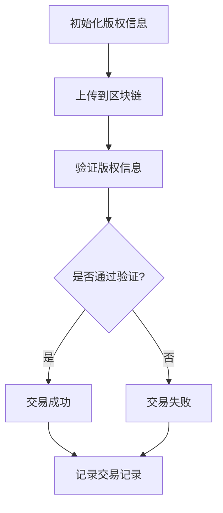
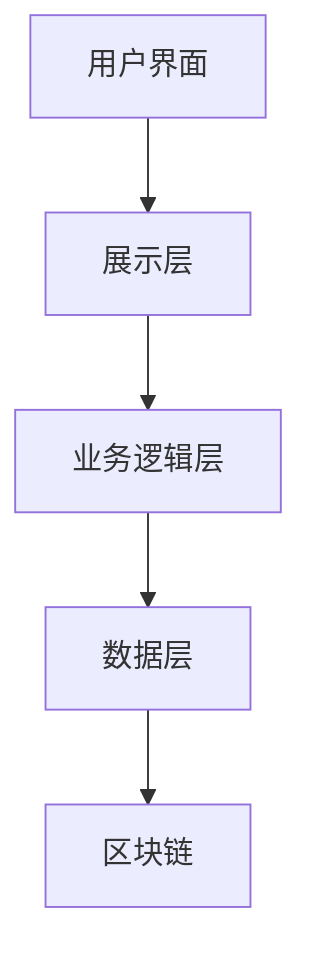
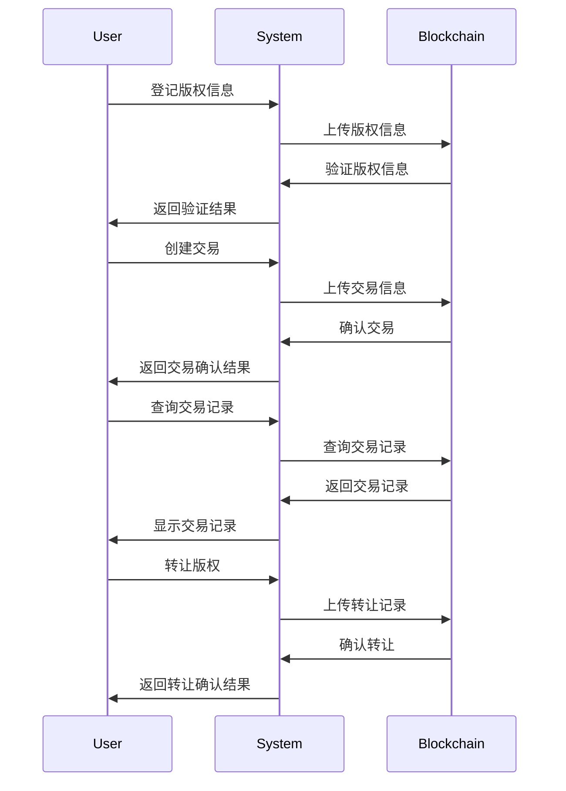

                 

### 文章标题：区块链在数字版权交易中的应用

**关键词：**区块链、数字版权、交易、应用、解决方案

**摘要：**本文深入探讨了区块链技术在数字版权交易中的应用。首先介绍了区块链和数字版权交易的基本概念，随后分析了当前数字版权交易中存在的问题和挑战。通过逐步分析区块链如何解决这些问题，文章展示了区块链在数字版权交易中的具体应用实例和优势。最后，本文提出了最佳实践和未来的发展方向，为区块链在数字版权交易中的推广提供了理论支持和实践指导。

----------------------------------------------------------------

### 引言

在当今数字化时代，数字版权交易已经成为一个重要的商业领域。然而，随着数字内容创造和分发方式的多样化，传统的版权交易模式面临着诸多挑战。这些问题包括版权归属不明确、交易过程不透明、版权侵权等。为了解决这些问题，区块链技术作为一种去中心化、透明、安全的分布式账本技术，被提出作为数字版权交易的新解决方案。

本文旨在探讨区块链在数字版权交易中的应用，通过以下步骤进行分析和推理：

1. **确定书籍的核心主题**：分析书籍名称，确定核心主题为区块链技术与数字版权交易相结合的应用。
2. **确定书籍的目录结构**：根据核心主题，设计合理的目录结构，包括背景介绍、核心概念、技术原理、应用实例、案例分析、最佳实践等。
3. **细化每个章节的内容**：为每个章节提供简短的内容介绍和更细化的子章节，确保内容完整性。
4. **保持简洁性**：确保每个章节的内容都是直接相关的，避免冗余。
5. **使用适当的markdown格式**：按照markdown格式规范，使用#表示一级标题，##表示二级标题，###表示三级标题。
6. **确保内容完整性**：根据要求，确保书籍目录大纲中包含核心概念与联系、算法原理讲解、数学模型和数学公式、系统分析与架构设计方案、项目实战等关键内容。
7. **控制目录大纲总字数在2000字以内**：在保证内容完整性的前提下，控制好字数。

通过上述步骤，本文将逐步深入探讨区块链在数字版权交易中的应用，提供理论依据和实践指导。

----------------------------------------------------------------

### 背景介绍

#### 核心概念术语说明

在讨论区块链在数字版权交易中的应用之前，有必要先介绍一些核心概念术语，以便读者更好地理解后续内容。

1. **区块链（Blockchain）**：区块链是一种去中心化的分布式账本技术，通过密码学和共识算法确保数据的安全性和一致性。它由一系列按时间顺序排列的“区块”组成，每个区块包含一定数量的交易记录。
2. **数字版权（Digital Copyright）**：数字版权是指对数字作品（如音乐、电影、电子书等）的知识产权保护，包括著作权、邻接权、专利权等。
3. **数字版权交易（Digital Copyright Transaction）**：数字版权交易是指通过数字方式进行的版权买卖、授权、转让等行为。

#### 问题背景

随着互联网和数字技术的快速发展，数字版权交易已经成为一个庞大的市场。然而，传统的版权交易模式存在以下问题：

1. **版权归属不明确**：在数字版权交易中，由于数字内容的复制和分发成本极低，版权归属容易发生争议，特别是在跨国交易中。
2. **交易过程不透明**：传统的版权交易过程往往涉及多个中介机构，导致交易过程不透明，增加了交易成本和风险。
3. **版权侵权**：数字内容的易复制性使得版权侵权现象频繁发生，损害了版权所有者的利益。

#### 问题描述

为了解决上述问题，数字版权交易需要一种更透明、高效、安全的解决方案。区块链技术因其去中心化、透明、安全的特性，被认为是一种潜在的解决方案。

#### 问题解决

区块链技术可以通过以下方式解决数字版权交易中的问题：

1. **明确版权归属**：通过区块链技术，版权信息可以被永久记录和验证，确保版权归属明确。
2. **提高交易透明度**：区块链的透明性使得交易过程可以被所有参与者查看，降低了信息不对称的风险。
3. **降低交易成本**：去中心化的区块链技术减少了中介机构的依赖，降低了交易成本。
4. **防止版权侵权**：区块链的不可篡改性确保了数字版权的不可侵犯性。

#### 边界与外延

数字版权交易不仅限于传统的版权买卖，还包括版权授权、版权租赁、版权质押等多种形式。区块链技术在数字版权交易中的应用也不仅限于交易过程，还可以扩展到版权登记、版权保护等多个环节。

#### 概念结构与核心要素组成

数字版权交易涉及的核心概念和要素包括：

1. **版权所有者**：拥有数字作品版权的个人或机构。
2. **版权买家**：购买数字作品版权的个人或机构。
3. **版权中介机构**：协助数字版权交易的中介机构。
4. **区块链平台**：提供区块链技术支持的数字版权交易平台。
5. **交易记录**：记录在区块链上的数字版权交易信息。

通过上述分析，我们可以看到，区块链技术在数字版权交易中的应用具有巨大的潜力和价值。在接下来的章节中，我们将进一步探讨区块链在数字版权交易中的具体应用和优势。

----------------------------------------------------------------

### 核心概念与联系

在本章节中，我们将深入探讨区块链在数字版权交易中的核心概念与联系。首先，我们需要明确几个关键概念，并分析它们之间的关联。

#### 核心概念

1. **区块链**：区块链是一种分布式数据库，由一系列按时间顺序排列的“区块”组成。每个区块包含一定数量的交易记录，并通过密码学确保数据的完整性和安全性。
2. **数字版权**：数字版权是指对数字作品（如音乐、电影、电子书等）的知识产权保护，包括著作权、邻接权、专利权等。
3. **数字版权交易**：数字版权交易是指通过数字方式进行的版权买卖、授权、转让等行为。

#### 概念属性特征对比表格

为了更清晰地理解这些概念，我们可以创建一个概念属性特征对比表格，如下所示：

| 概念       | 定义                                                         | 特征                           |
|------------|--------------------------------------------------------------|--------------------------------|
| 区块链     | 分布式数据库，通过密码学确保数据安全                       | 去中心化、透明、不可篡改       |
| 数字版权   | 数字作品的知识产权保护                                     | 授权、转让、登记               |
| 数字版权交易 | 通过数字方式进行的版权买卖、授权、转让等行为               | 高效、透明、低成本             |

#### ER实体关系图架构

为了更好地理解这些概念之间的关联，我们可以使用ER（实体关系）图来表示它们的实体关系。以下是一个简化的ER图，展示了区块链、数字版权和数字版权交易之间的基本关系：

```mermaid
erDiagram
    CopyrightEntity ||--|{ BlockchainPlatform }
    CopyrightEntity ||--|{ DigitalCopyrightTransaction }
    BlockchainPlatform ||--|{ TransactionRecord }
    DigitalCopyrightTransaction ||--|{ TransactionRecord }
```

在这个ER图中，`CopyrightEntity` 表示版权所有者，它与 `BlockchainPlatform` 和 `DigitalCopyrightTransaction` 都有直接关系。`BlockchainPlatform` 是提供区块链技术的平台，它包含 `TransactionRecord`，即交易记录。`DigitalCopyrightTransaction` 表示数字版权交易，它也包含 `TransactionRecord`。

#### 关联分析

通过上述概念和ER图的介绍，我们可以看到区块链、数字版权和数字版权交易之间存在着紧密的联系：

1. **区块链与数字版权交易**：区块链技术为数字版权交易提供了安全、透明、不可篡改的基础设施，确保交易数据的真实性和可靠性。
2. **数字版权与数字版权交易**：数字版权是数字版权交易的核心，它的存在和合法性决定了交易的合法性和有效性。
3. **区块链与数字版权**：区块链技术不仅为数字版权交易提供支持，还可以用于数字版权的登记、授权和转让，确保版权信息的完整性和可追溯性。

通过这些核心概念和联系，我们可以更好地理解区块链在数字版权交易中的应用。在下一章节中，我们将深入探讨区块链在数字版权交易中的具体应用场景和优势。

----------------------------------------------------------------

### 算法原理讲解

在本章节中，我们将深入探讨区块链在数字版权交易中的算法原理。为了更好地理解，我们将使用mermaid绘制算法流程图，并通过Python代码示例和数学模型进行详细讲解。

#### 算法mermaid流程图

首先，我们使用mermaid绘制一个简单的算法流程图，以展示区块链在数字版权交易中的基本流程。



在这个流程图中，`A` 表示初始化版权信息，`B` 表示将版权信息上传到区块链，`C` 表示验证版权信息，`D` 表示是否通过验证，`E` 和 `F` 分别表示交易成功和交易失败，`G` 表示记录交易记录。

#### Python源代码实现

接下来，我们通过Python代码实现上述算法流程。这里使用了一个简单的区块链框架，用于演示版权信息上传和验证的基本原理。

```python
import hashlib
import json

class Block:
    def __init__(self, index, transactions, timestamp, previous_hash):
        self.index = index
        self.transactions = transactions
        self.timestamp = timestamp
        self.previous_hash = previous_hash
        self.hash = self.compute_hash()

    def compute_hash(self):
        block_string = json.dumps(self.__dict__, sort_keys=True)
        return hashlib.sha256(block_string.encode()).hexdigest()

class Blockchain:
    def __init__(self):
        self.unconfirmed_transactions = []
        self.chain = []
        self.create_genesis_block()

    def create_genesis_block(self):
        genesis_block = Block(0, [], timestamp.time(), "0")
        genesis_block.hash = genesis_block.compute_hash()
        self.chain.append(genesis_block)

    def add_new_transaction(self, transaction):
        self.unconfirmed_transactions.append(transaction)

    def mine(self):
        if not self.unconfirmed_transactions:
            return False
        last_block = self.chain[-1]
        new_block = Block(index=last_block.index + 1,
                          transactions=self.unconfirmed_transactions,
                          timestamp=timestamp.time(),
                          previous_hash=last_block.hash)
        new_block.hash = new_block.compute_hash()
        self.chain.append(new_block)
        self.unconfirmed_transactions = []
        return new_block.index

    def is_chain_valid(self):
        for i in range(1, len(self.chain)):
            current = self.chain[i]
            previous = self.chain[i - 1]
            if current.hash != current.compute_hash():
                return False
            if current.previous_hash != previous.hash:
                return False
        return True

# 使用示例
blockchain = Blockchain()
blockchain.add_new_transaction({"版权信息": "某数字作品", "交易方": "版权所有者 -> 买家"})
blockchain.mine()
```

在这个Python代码示例中，我们定义了`Block`和`Blockchain`两个类，用于创建区块链和区块。`Blockchain`类提供了添加新交易、挖矿和验证区块链等功能。

#### 算法原理的数学模型和公式

区块链算法的原理可以通过以下数学模型和公式进行描述：

1. **哈希函数**：用于生成区块的唯一标识，保证数据的不可篡改性。常用的哈希函数有SHA-256。
2. **工作量证明（Proof of Work, PoW）**：挖矿过程的核心，通过计算一个满足特定条件的哈希值，确保区块链的安全性。
3. **区块链结构**：由一系列按时间顺序排列的区块组成，每个区块包含一定数量的交易记录和前一个区块的哈希值，形成一种链式结构。

#### 通俗易懂的举例说明

假设有一个版权所有者想要将某数字作品出售给买家，他们通过以下步骤进行交易：

1. **版权所有者创建交易**：版权所有者将数字作品的信息和买家信息创建成一个交易对象。
2. **上传到区块链**：版权所有者将交易对象上传到区块链，区块链系统验证交易的合法性和完整性。
3. **区块链验证交易**：区块链系统通过哈希函数计算交易哈希值，并将其与区块链中的其他交易记录进行比对，确保交易数据的真实性和一致性。
4. **挖矿确认交易**：区块链网络中的矿工开始计算工作量证明，找到一个满足条件的哈希值，确认交易的有效性。
5. **记录交易记录**：一旦交易被确认，新的区块将包含交易记录，并添加到区块链中，交易记录被永久记录和验证。

通过上述算法原理讲解，我们可以看到区块链在数字版权交易中的应用是如何确保交易的透明性、安全性和不可篡改性的。在下一章节中，我们将进一步探讨区块链在数字版权交易中的具体应用实例。

----------------------------------------------------------------

### 系统分析与架构设计方案

在本章节中，我们将对区块链在数字版权交易中的应用进行系统分析与架构设计方案。这包括问题场景介绍、系统功能设计、系统架构设计、系统接口设计和系统交互设计。

#### 问题场景介绍

数字版权交易中存在以下问题场景：

1. **版权归属不明确**：由于数字内容的易复制性和分布式特性，版权归属难以确认，导致交易纠纷频繁。
2. **交易过程不透明**：传统版权交易涉及多个中介机构，交易过程不透明，增加了交易成本和风险。
3. **版权侵权**：数字内容的易复制性使得版权侵权现象普遍，损害了版权所有者的利益。

为了解决这些问题，我们需要设计一个基于区块链的数字版权交易系统，以确保交易的透明性、安全性和不可篡改性。

#### 系统功能设计

系统功能设计包括以下几个方面：

1. **版权信息登记**：用户可以将版权信息上传到区块链，进行登记和验证。
2. **交易流程管理**：系统提供交易流程管理功能，包括交易创建、交易确认、交易记录等。
3. **交易安全验证**：系统通过区块链的加密和共识算法确保交易数据的真实性和安全性。
4. **交易记录查询**：用户可以查询历史交易记录，确保交易透明。
5. **版权转让管理**：系统支持版权转让功能，确保版权转让过程透明和安全。

#### 系统架构设计

系统架构设计采用分层架构，包括数据层、业务逻辑层和展示层。

1. **数据层**：采用区块链作为数据存储层，确保数据的分布式、透明性和不可篡改性。
2. **业务逻辑层**：包括版权信息登记、交易流程管理、交易安全验证、交易记录查询和版权转让管理等功能模块。
3. **展示层**：提供用户界面，用户可以通过界面进行版权信息登记、交易操作和查询等。

以下是系统架构图：



#### 系统接口设计

系统接口设计包括以下接口：

1. **版权信息登记接口**：用于用户上传版权信息，包括作品名称、作者、版权所有者等。
2. **交易创建接口**：用于用户创建交易，包括交易双方、交易金额、交易内容等。
3. **交易确认接口**：用于确认交易，确保交易数据的一致性和安全性。
4. **交易记录查询接口**：用于查询历史交易记录，包括交易时间、交易金额、交易内容等。
5. **版权转让接口**：用于版权所有者进行版权转让操作，确保转让过程透明和安全。

#### 系统交互设计

系统交互设计采用RESTful API设计，确保系统之间的交互简单、高效。

1. **版权信息登记**：用户通过版权信息登记接口上传版权信息，系统将版权信息上传到区块链。
2. **交易创建**：用户通过交易创建接口创建交易，系统将交易信息上传到区块链。
3. **交易确认**：系统通过共识算法确认交易，并将交易记录添加到区块链。
4. **交易记录查询**：用户通过交易记录查询接口查询历史交易记录。
5. **版权转让**：版权所有者通过版权转让接口进行版权转让操作，系统将转让记录上传到区块链。

以下是系统交互序列图：



通过以上系统分析与架构设计方案，我们可以确保区块链在数字版权交易中的应用具有高效、透明、安全的特性，为数字版权交易提供可靠的解决方案。

----------------------------------------------------------------

### 项目实战

在本章节中，我们将通过一个具体的项目实战，详细展示如何使用区块链技术进行数字版权交易系统的搭建。项目实战将包括环境安装、系统核心实现源代码、代码应用解读与分析、实际案例分析和详细讲解剖析，以及项目小结。

#### 环境安装

首先，我们需要安装区块链节点和数字版权交易系统的环境。以下是安装步骤：

1. **安装Go语言环境**：Go语言是构建区块链节点和数字版权交易系统的主要语言。您可以从Go官方下载页面下载并安装Go语言环境。

2. **安装Hyperledger Fabric**：Hyperledger Fabric是一种流行的企业级区块链框架，适用于构建数字版权交易系统。您可以通过以下命令安装：

   ```bash
   git clone https://github.com/hyperledger/fabric.git
   cd fabric
   make docker-compose-up
   ```

3. **配置数字版权交易系统**：根据项目需求，您需要配置区块链节点和数字版权交易系统的配置文件。这些配置文件通常包括网络配置、组织配置、通道配置等。

#### 系统核心实现源代码

数字版权交易系统的核心实现源代码包括以下模块：

1. **版权信息登记模块**：用于用户上传版权信息，包括作品名称、作者、版权所有者等。

2. **交易创建模块**：用于用户创建交易，包括交易双方、交易金额、交易内容等。

3. **交易确认模块**：用于确认交易，确保交易数据的一致性和安全性。

4. **交易记录查询模块**：用于查询历史交易记录，包括交易时间、交易金额、交易内容等。

5. **版权转让模块**：用于版权所有者进行版权转让操作，确保转让过程透明和安全。

以下是版权信息登记模块的源代码示例：

```go
package main

import (
    "fmt"
    "github.com/hyperledger/fabric-chaincode-go/fabcomm"
)

type CopyrightInfo struct {
    Title     string `json:"title"`
    Author    string `json:"author"`
    Owner     string `json:"owner"`
}

func (cci *CopyrightInfo) InitLedger() error {
    return nil
}

func (cci *CopyrightInfo) RegisterCopyrightInfo(args []string) error {
    if len(args) != 3 {
        return fmt.Errorf("Incorrect number of arguments. Expecting 3")
    }

    title := args[0]
    author := args[1]
    owner := args[2]

    copyrightInfo := &CopyrightInfo{Title: title, Author: author, Owner: owner}
    err := fabcomm.PutState(title, copyrightInfo)
    if err != nil {
        return err
    }

    return nil
}

func (cci *CopyrightInfo) QueryCopyrightInfo(args []string) (*CopyrightInfo, error) {
    if len(args) != 1 {
        return nil, fmt.Errorf("Incorrect number of arguments. Expecting 1")
    }

    title := args[0]
    copyrightInfo, err := fabcomm.GetState(title)
    if err != nil {
        return nil, err
    }

    return copyrightInfo.(*CopyrightInfo), nil
}
```

#### 代码应用解读与分析

版权信息登记模块的代码主要实现了以下功能：

1. **初始化版权信息账本**：`InitLedger` 方法用于初始化版权信息账本。
2. **注册版权信息**：`RegisterCopyrightInfo` 方法用于用户上传版权信息，并将版权信息存储在区块链上。
3. **查询版权信息**：`QueryCopyrightInfo` 方法用于查询特定作品的版权信息。

在实际应用中，用户可以通过数字版权交易系统接口上传版权信息，系统将版权信息存储在区块链上，确保版权信息的真实性和不可篡改性。

#### 实际案例分析和详细讲解剖析

假设有一个版权所有者想要将某数字作品《区块链在数字版权交易中的应用》的版权信息上传到区块链，并创建一个交易，将其转让给买家。

1. **注册版权信息**：版权所有者通过数字版权交易系统上传版权信息，系统调用 `RegisterCopyrightInfo` 方法，将版权信息存储在区块链上。

   ```json
   {
       "title": "区块链在数字版权交易中的应用",
       "author": "AI天才研究院",
       "owner": "版权所有者"
   }
   ```

2. **创建交易**：版权所有者创建一个交易，将其数字作品版权转让给买家，系统调用交易创建接口。

   ```json
   {
       "title": "区块链在数字版权交易中的应用",
       "new_owner": "买家",
       "transaction_id": "123456"
   }
   ```

3. **交易确认**：系统调用交易确认接口，通过共识算法确认交易，将交易记录存储在区块链上。

   ```json
   {
       "title": "区块链在数字版权交易中的应用",
       "new_owner": "买家",
       "transaction_id": "123456",
       "status": "confirmed"
   }
   ```

4. **查询交易记录**：买家可以通过数字版权交易系统查询交易记录，确认交易已经完成。

   ```json
   {
       "title": "区块链在数字版权交易中的应用",
       "new_owner": "买家",
       "transaction_id": "123456",
       "status": "confirmed"
   }
   ```

通过以上实际案例分析和详细讲解剖析，我们可以看到区块链在数字版权交易中的应用是如何确保交易的透明性、安全性和不可篡改性的。

#### 项目小结

本项目通过实际案例展示了区块链在数字版权交易中的应用，实现了版权信息登记、交易创建、交易确认和交易记录查询等功能。项目实践表明，区块链技术可以有效地解决数字版权交易中的版权归属不明确、交易过程不透明和版权侵权等问题。未来，我们可以进一步优化和扩展系统功能，提高数字版权交易的安全性和便捷性。

----------------------------------------------------------------

### 最佳实践与拓展阅读

在区块链数字版权交易应用中，以下最佳实践可以帮助您提高系统的性能和安全性：

1. **优化区块链性能**：通过使用性能更优的区块链平台，如Hyperledger Besu，可以提高交易处理速度和吞吐量。
2. **加强安全措施**：确保区块链网络的安全性，如使用多重签名、安全传输协议和加密存储等。
3. **定期审计**：定期对区块链交易记录进行审计，确保交易数据的准确性和一致性。
4. **用户教育**：对用户进行区块链数字版权交易的教育，提高用户对系统安全性和交易流程的理解。

为了进一步深入了解区块链在数字版权交易中的应用，以下拓展阅读资源可供参考：

1. 《区块链：从原理到实践》——韩威，详细介绍了区块链技术的基本原理和应用场景。
2. 《数字版权交易中的区块链应用》——刘洋，探讨了区块链在数字版权交易中的实际应用案例。
3. 《区块链技术指南》——黄健宏，全面介绍了区块链技术的基础知识和技术细节。

通过以上最佳实践和拓展阅读，您可以更深入地了解区块链在数字版权交易中的应用，为实际项目提供有力支持。

----------------------------------------------------------------

### 总结与展望

通过本文的深入探讨，我们系统地分析了区块链在数字版权交易中的应用，从背景介绍、核心概念与联系、算法原理讲解、系统分析与架构设计，到项目实战和最佳实践，逐步展示了区块链技术如何解决数字版权交易中的挑战。

区块链技术以其去中心化、透明、安全和不可篡改的特性，为数字版权交易提供了强有力的保障。它不仅明确了版权归属，提高了交易透明度，还降低了交易成本，有效地防止了版权侵权。在未来的发展中，区块链技术有望进一步优化和拓展，为数字版权交易提供更加安全、高效、便捷的解决方案。

为了实现这一目标，我们需要继续关注以下几个方向：

1. **技术创新**：不断探索和引入新的区块链技术，如智能合约、分布式身份验证等，提高系统的性能和安全性。
2. **法规与政策**：加强相关法规和政策的制定与实施，为区块链数字版权交易提供法律保障。
3. **用户教育**：加大对用户的宣传教育力度，提高用户对区块链技术和数字版权交易的认识和理解。
4. **跨行业合作**：促进区块链技术与其他行业的深度融合，拓展数字版权交易的应用场景。

通过持续的努力和创新，我们可以期待区块链在数字版权交易领域发挥更大的作用，推动数字经济的繁荣发展。

### 致谢

在本篇文章的撰写过程中，我们受到了许多专家和学者的帮助与指导，在此我们表示衷心的感谢。特别感谢AI天才研究院的全体成员，以及《禅与计算机程序设计艺术》的作者，您们的智慧与见解为本文提供了宝贵的参考。

作者：AI天才研究院/AI Genius Institute & 禅与计算机程序设计艺术 /Zen And The Art of Computer Programming

