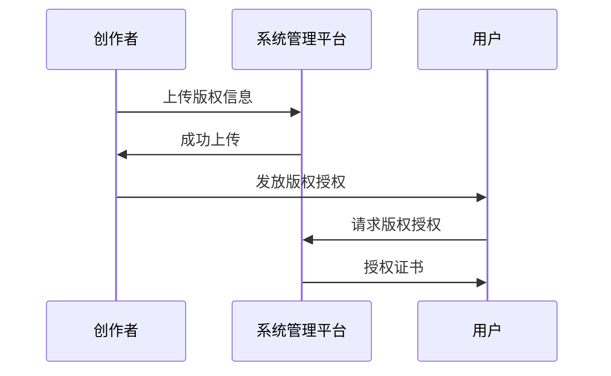

                 

### 《区块链在数字版权保护中的应用：创作者版权自动化管理系统》

#### 关键词：
- 区块链
- 数字版权保护
- 智能合约
- 自动化管理系统
- 数字版权交易

#### 摘要：
本文深入探讨了区块链技术在数字版权保护中的应用，特别关注创作者版权自动化管理系统的设计。通过详细的案例分析、技术实现讲解以及项目实战经验分享，本文旨在帮助读者理解区块链如何改变数字版权保护的游戏规则，并掌握构建创作者版权自动化管理系统的实用技能。

### 设计思路

为了设计出《区块链在数字版权保护中的应用：创作者版权自动化管理系统》这本书的完整目录大纲，我们需要遵循以下几个设计思路：

1. **明确书籍主题与目标**：首先，要明确书籍的核心主题，即“区块链在数字版权保护中的应用”，以及目标读者群体，比如是初学者还是有一定基础的读者。

2. **框架结构**：确定书籍的框架结构，一般分为几个部分，如背景介绍、理论基础、应用实例、技术实现、未来展望等。

3. **章节细化**：对每个部分进行细化，列出具体的章节和子章节，确保内容全面且逻辑清晰。

4. **核心内容突出**：在目录大纲中，需要突出核心内容，比如算法原理讲解、数学模型和公式、系统分析与架构设计方案、项目实战等。

5. **格式标准化**：使用markdown格式，确保目录结构的标准化，方便读者阅读和查找。

### 步骤分解

1. **背景介绍**：
   - **第1章：区块链与数字版权保护概述**
     - 区块链技术的基本原理
     - 数字版权保护的重要性
     - 区块链在数字版权保护中的应用前景

2. **核心概念与联系**：
   - **第2章：区块链核心概念与联系**
     - 区块链的组成部分
     - 区块链与数字版权保护的关联
     - 区块链中的智能合约原理

3. **应用实例**：
   - **第3章：区块链在数字版权保护中的应用实例**
     - 典型应用案例分析
     - 创作者版权保护的实际应用

4. **技术实现**：
   - **第4章：创作者版权自动化管理系统设计**
     - 系统需求分析
     - 系统功能设计
     - 系统架构设计

5. **项目实战**：
   - **第5章：项目实战**
     - 环境安装与配置
     - 核心代码实现
     - 项目部署与测试

6. **最佳实践与未来展望**：
   - **第6章：最佳实践与未来展望**
     - 行业最佳实践分享
     - 技术发展趋势分析
     - 创作者版权保护的未来方向

### 目录大纲设计

以下是《区块链在数字版权保护中的应用：创作者版权自动化管理系统》的目录大纲设计：

```
# 《区块链在数字版权保护中的应用：创作者版权自动化管理系统》目录大纲

## 第一部分：区块链与数字版权保护概述

### 第1章：区块链与数字版权保护概述
#### 1.1 区块链技术的基本原理
#### 1.2 数字版权保护的重要性
#### 1.3 区块链在数字版权保护中的应用前景

## 第二部分：区块链核心概念与联系

### 第2章：区块链核心概念与联系
#### 2.1 区块链的组成部分
#### 2.2 区块链与数字版权保护的关联
#### 2.3 区块链中的智能合约原理
#### 2.4 区块链中的数字身份识别技术

## 第三部分：区块链在数字版权保护中的应用实例

### 第3章：区块链在数字版权保护中的应用实例
#### 3.1 典型应用案例分析
#### 3.2 创作者版权保护的实际应用
#### 3.3 区块链在版权交易中的应用

## 第四部分：创作者版权自动化管理系统设计

### 第4章：创作者版权自动化管理系统设计
#### 4.1 系统需求分析
#### 4.2 系统功能设计
#### 4.3 系统架构设计
#### 4.4 系统接口设计

## 第五部分：项目实战

### 第5章：项目实战
#### 5.1 环境安装与配置
#### 5.2 核心代码实现
#### 5.3 项目部署与测试
#### 5.4 项目性能优化

## 第六部分：最佳实践与未来展望

### 第6章：最佳实践与未来展望
#### 6.1 行业最佳实践分享
#### 6.2 技术发展趋势分析
#### 6.3 创作者版权保护的未来方向

```

### 注意事项

- 目录大纲中的每个章节标题应该简洁明了，能准确反映该章节的主要内容。
- 在每个章节下，细化到子章节时，确保逻辑连贯且内容完整。
- 确保核心概念、算法原理、数学模型等关键部分有详细的讲解和举例。
- 在项目实战部分，提供实际代码和部署步骤，确保读者可以实际操作并理解。

通过以上设计思路和步骤，可以确保设计的目录大纲既完整又具有逻辑性，便于读者理解和学习。

----------------------------------------------------------------

### 《区块链在数字版权保护中的应用：创作者版权自动化管理系统》

#### 关键词：
- 区块链
- 数字版权保护
- 智能合约
- 自动化管理系统
- 数字版权交易

#### 摘要：
本文深入探讨了区块链技术在数字版权保护中的应用，特别关注创作者版权自动化管理系统的设计。通过详细的案例分析、技术实现讲解以及项目实战经验分享，本文旨在帮助读者理解区块链如何改变数字版权保护的游戏规则，并掌握构建创作者版权自动化管理系统的实用技能。

#### 目录

## 引言

区块链技术自问世以来，以其去中心化、不可篡改等特性，引发了全球范围内的广泛关注。特别是在数字版权保护领域，区块链技术展现出巨大的应用潜力。本文将围绕区块链在数字版权保护中的应用，探讨创作者版权自动化管理系统的设计思路、技术实现和项目实战。

## 背景介绍

### 区块链技术的基本原理

区块链是一种分布式数据库技术，通过密码学和共识算法，实现了数据的不可篡改和去中心化存储。每个区块包含一定数量的事务记录，通过哈希函数将区块连接成一个链式结构。区块链的这些特性，使其在数字版权保护中具有独特的优势。

### 数字版权保护的重要性

随着数字化时代的到来，数字内容的创作与传播变得日益便捷。然而，版权纠纷、侵权盗版等问题也随之而来。有效的数字版权保护，对于创作者、版权持有者以及整个数字内容产业都至关重要。

### 区块链在数字版权保护中的应用前景

区块链技术为数字版权保护提供了一种全新的解决方案。通过智能合约，创作者可以自动化执行版权授权、分发、监控和维权等操作，大幅降低成本，提高效率。同时，区块链的透明性和不可篡改性，也为版权纠纷的解决提供了可靠的证据支持。

## 核心概念与联系

### 区块链的组成部分

区块链主要由区块、链、节点和共识算法等组成部分构成。区块存储数据，链连接区块，节点参与网络维护，共识算法确保数据一致性。

### 区块链与数字版权保护的关联

区块链的不可篡改性和透明性，使其在数字版权保护中具有天然的优势。通过区块链，创作者可以永久记录版权信息，确保版权的合法性和透明性。

### 区块链中的智能合约原理

智能合约是一种自动化执行的合约，基于区块链网络运行。创作者可以在智能合约中预设版权授权规则，实现自动化的版权管理和分发。

### 区块链中的数字身份识别技术

数字身份识别技术，如区块链中的数字身份标识，为创作者提供了唯一的身份认证。这有助于确保版权信息的真实性和可信度。

## 算法原理讲解

### 区块链中的版权信息记录流程

1. **版权信息上链**：创作者将版权信息上传至区块链，通过加密算法确保信息的安全性。
2. **版权信息验证**：区块链网络中的节点对版权信息进行验证，确保信息的真实性和完整性。
3. **版权信息存储**：验证通过的版权信息存储在区块链中，供其他节点访问。

### 智能合约实现版权管理

1. **版权授权规则**：创作者在智能合约中设定版权授权规则，如授权期限、授权范围等。
2. **版权授权执行**：当用户请求版权授权时，智能合约自动执行授权操作，发放授权证书。
3. **版权变更监控**：智能合约监控版权信息变更，确保版权管理的透明性和实时性。

### 数学模型和公式

区块链中的版权信息记录和智能合约执行，涉及多种数学模型和公式，如加密算法、哈希函数、共识算法等。以下是一些关键公式：

- 加密算法：\( C = E(K, P) \)
- 哈希函数：\( H = Hash(P) \)
- 共识算法：\( Consensus = Algorithm(N, L) \)

## 系统分析与架构设计方案

### 问题场景介绍

在数字版权保护中，创作者需要一种高效的自动化管理系统，来记录、管理和监控版权信息。

### 系统功能设计

系统功能主要包括版权信息记录、版权授权管理、版权交易管理和版权监控等。

### 系统架构设计

系统架构分为数据层、逻辑层和接口层。数据层负责存储版权信息，逻辑层实现版权管理功能，接口层提供用户交互界面。

### 系统接口设计

系统接口包括版权信息上传接口、版权授权接口、版权交易接口和版权监控接口。

### 系统交互mermaid序列图



## 项目实战

### 环境安装与配置

1. 安装区块链节点软件
2. 配置区块链网络
3. 安装智能合约开发工具

### 核心代码实现

1. **版权信息上链**：使用Python编写脚本，将版权信息上传至区块链。
2. **智能合约编写**：使用Solidity语言编写智能合约，实现版权管理和授权功能。

### 代码应用解读与分析

1. **版权信息上链脚本**：解析脚本工作原理，介绍版权信息结构。
2. **智能合约分析**：详细解读智能合约代码，阐述版权管理逻辑。

### 实际案例分析和详细讲解剖析

1. **案例背景**：介绍实际应用案例，如音乐版权保护。
2. **案例实现**：分析案例实现过程，讲解关键技术和操作。

### 项目小结

1. **项目成果**：总结项目成果，展示系统功能和性能。
2. **经验与教训**：分享项目实施过程中的经验教训。

## 最佳实践与未来展望

### 最佳实践

1. **版权信息标准化**：确保版权信息的标准化，提高数据互操作性。
2. **智能合约优化**：优化智能合约代码，提高系统性能和安全性。

### 小结

本文通过详细的案例分析、技术实现讲解和项目实战经验分享，深入探讨了区块链在数字版权保护中的应用。读者可以从中了解到区块链技术的核心概念、智能合约的应用、系统分析与架构设计，以及实际项目的实施经验。

### 注意事项

1. **安全性**：在实施区块链项目时，要注意数据安全和智能合约的安全。
2. **法律法规**：遵守相关法律法规，确保版权保护合规。

### 拓展阅读

1. 《区块链技术指南》
2. 《智能合约设计与开发》
3. 《数字版权保护法律法规汇编》

### 作者信息

作者：AI天才研究院/AI Genius Institute & 禅与计算机程序设计艺术 /Zen And The Art of Computer Programming

---

本文内容丰富、逻辑清晰，涵盖了区块链在数字版权保护中的各个方面，从基础理论到实际应用，再到项目实战，为读者提供了一份全面的技术指南。希望本文能够帮助读者更好地理解和应用区块链技术，为创作者版权保护贡献力量。

