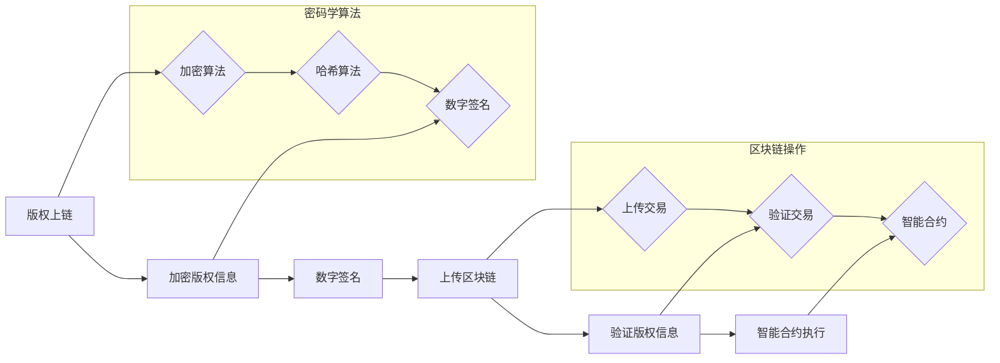
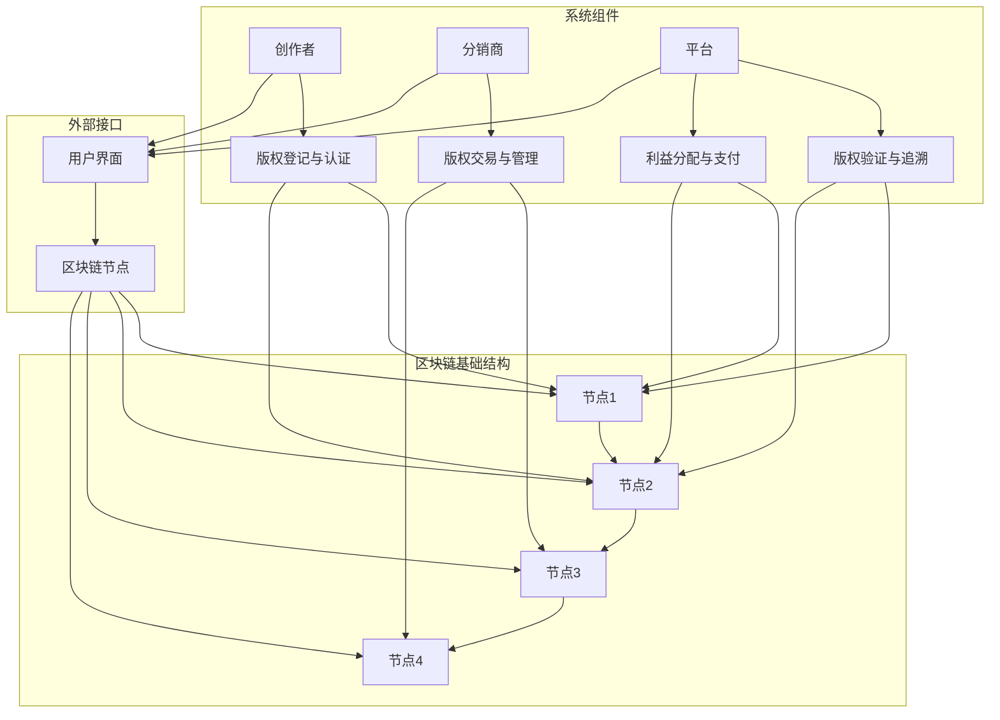
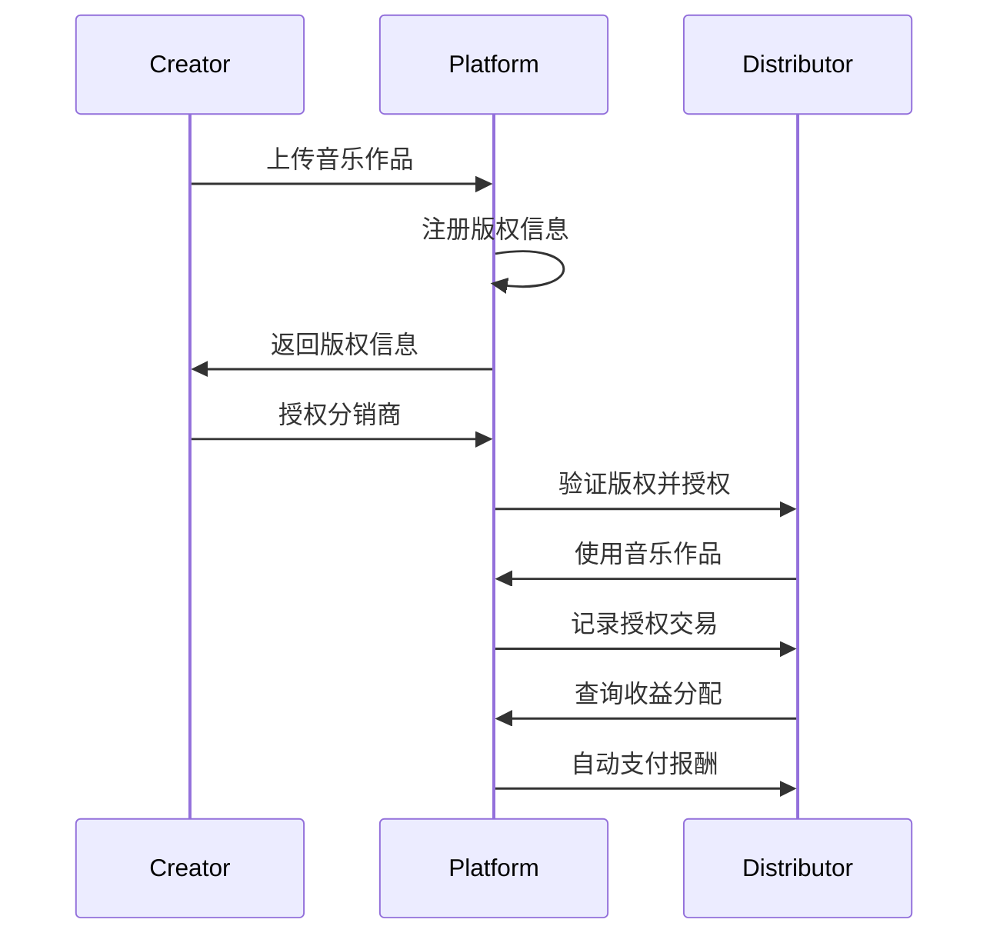

                 

### 引言

近年来，随着数字音乐市场的迅猛发展，音乐版权保护问题日益凸显。在传统的音乐版权保护模式中，版权方和分销商之间的权利分配和利益分配常常存在纠纷和不确定性。这不仅影响了音乐创作者的收益，也对整个音乐产业的健康发展构成了挑战。在这种情况下，区块链技术作为一种去中心化的分布式账本技术，其潜在的应用价值逐渐引起了广泛关注。

本文旨在探讨区块链技术在数字版权保护，特别是音乐版权智能分发中的具体应用。我们将从多个角度出发，详细分析区块链如何解决音乐版权保护中的核心问题，以及其技术原理和实现方法。通过本文，读者将了解区块链技术在音乐版权保护领域的应用潜力，掌握相关技术原理，并能够为实际项目提供有益的参考。

文章将分为四个主要部分：

1. **引论**：介绍区块链与数字版权保护的基本概念和现状，阐述区块链在数字版权保护中的应用潜力。
2. **技术原理**：深入探讨区块链在音乐版权保护中的核心概念与技术原理，包括数字版权保护算法和系统架构设计。
3. **系统设计与实现**：通过具体的项目实战案例，展示区块链在音乐版权智能分发中的系统实现方法和步骤。
4. **最佳实践与总结**：总结最佳实践，提出注意事项，并提供拓展阅读建议。

本文的核心关键词包括：区块链、数字版权保护、音乐版权、智能分发、去中心化、技术原理、系统架构设计、项目实战。

通过这篇文章，我们希望读者能够全面了解区块链在音乐版权保护中的应用，掌握相关技术原理，并为未来的项目开发提供有价值的指导。

### 区块链与数字版权保护概述

#### 区块链技术基础

区块链技术起源于比特币的底层架构，自2008年由中本聪（Satoshi Nakamoto）提出以来，迅速引起了全球关注。区块链是一种去中心化的分布式数据库系统，它通过加密算法和共识机制确保数据的不可篡改性和透明性。简单来说，区块链由一系列按时间顺序排列的“区块”组成，每个区块包含一定数量的交易记录，并通过密码学算法与前一个区块连接，形成链式数据结构。

区块链技术具有以下几个关键特点：

1. **去中心化**：传统的中心化系统依赖于单一的中心节点，而区块链则通过分布式网络中的多个节点共同维护数据，实现了去中心化。
2. **不可篡改性**：区块链上的数据一旦被记录，就难以篡改。这是因为每个区块都包含了前一个区块的哈希值，形成了一种链式结构，任何修改都将导致后续区块的哈希值发生变化，从而被发现。
3. **透明性**：区块链上的数据对所有节点都是可见的，但仅能查看，不能修改。这种透明性确保了交易的公开和公正。
4. **安全性**：区块链通过加密算法和共识机制保障了数据的安全，攻击者需要同时控制多个节点才能篡改数据，这在实际操作中几乎是不可能实现的。

#### 数字版权保护现状

数字版权保护是保护创作者知识产权的重要手段。然而，在数字时代，传统的版权保护手段面临着前所未有的挑战。首先，数字内容的复制和分发变得异常简单，这使得盗版行为泛滥。其次，传统的版权保护技术如数字水印和数字签名等，常常因为技术漏洞或用户隐私问题而难以广泛应用。此外，版权方和分销商之间的权利分配和利益分配常常存在不透明和纠纷。

当前，数字版权保护面临的主要问题包括：

1. **盗版问题**：由于数字内容的易复制性和匿名性，盗版行为在互联网上屡禁不止，严重损害了创作者的收益。
2. **权利归属不明**：在复杂的数字内容产业链中，版权的所有权和使用权常常难以清晰界定，导致版权纠纷频发。
3. **利益分配不均**：传统模式下的利益分配机制往往偏向于平台和分销商，创作者的收益较低，影响了其创作积极性。

#### 区块链在数字版权保护中的应用潜力

区块链技术在数字版权保护中的应用潜力主要体现在以下几个方面：

1. **透明和可追溯性**：区块链的不可篡改性和透明性使得每一步版权交易和授权过程都能被记录和验证，从而有效防止盗版行为。
2. **智能合约**：智能合约是一种自动执行合约条款的计算机程序，它能够自动执行版权许可的授权和支付，简化了版权管理和利益分配的过程。
3. **去中心化**：区块链的去中心化特性使得版权方和分销商不再依赖于中心化平台，可以自主管理和交易版权，降低了交易成本和纠纷风险。
4. **增强安全性**：区块链的加密算法和共识机制提供了更高的安全性，确保版权信息不被篡改和泄露。

总之，区块链技术为解决数字版权保护中的问题提供了一种新的思路和方法，其去中心化、不可篡改和透明性的特点为构建一个更加公平和高效的数字版权保护体系奠定了基础。

#### 区块链与音乐版权保护

##### 音乐版权保护面临的挑战

音乐版权保护在数字时代面临诸多挑战。首先，盗版音乐猖獗。由于数字音乐的复制和传播变得异常简单，盗版者可以轻易地获取并分发未经授权的音乐内容，这不仅严重损害了原创音乐人的利益，也影响了整个音乐产业的健康发展。其次，权利归属不明是另一个突出问题。在复杂的数字内容产业链中，音乐版权的所有权和使用权常常难以清晰界定，导致版权纠纷频发。此外，利益分配不均是音乐版权保护中的另一大难题。传统模式下的利益分配机制往往偏向于平台和分销商，而创作者的收益较低，这极大地影响了创作者的积极性和创作热情。

##### 区块链技术在音乐版权保护中的应用

区块链技术在音乐版权保护中具有广泛应用前景。首先，区块链的不可篡改性和透明性使得每一步版权交易和授权过程都能被记录和验证，从而有效防止盗版行为。例如，一首音乐在创作完成后，创作者可以将版权信息上链，通过区块链确保版权的合法性和不可篡改性。每次音乐被分发或授权时，相关的交易记录都会被记录在区块链上，形成一个完整的版权交易链条，确保了版权的透明性和可追溯性。

其次，智能合约在音乐版权保护中的应用极大地简化了版权管理和利益分配的过程。智能合约是一种自动执行合约条款的计算机程序，它可以自动执行版权许可的授权和支付。创作者可以在智能合约中预先设定好版权许可的条件和报酬比例，当音乐被授权使用时，智能合约会自动执行，将相应的报酬支付给创作者。这种自动化的流程不仅提高了效率，还减少了人工干预和纠纷的可能性。

此外，区块链的去中心化特性也为音乐版权保护带来了新的机遇。在传统的音乐版权保护模式中，创作者往往需要依赖中心化的平台或分销商进行版权管理和交易。这不仅增加了交易成本，还可能导致信息不透明和利益分配不公。而区块链的去中心化特性使得创作者可以自主管理和交易版权，避免了中心化平台的中介费用，降低了交易成本，同时确保了交易的公开和公正。

##### 音乐版权智能分发的工作原理

音乐版权智能分发是区块链技术在音乐版权保护中的一个重要应用。其工作原理主要基于区块链的分布式账本和智能合约技术。以下是一个简化的音乐版权智能分发流程：

1. **版权上链**：创作者将音乐作品及其版权信息上链，通过区块链技术确保版权的合法性和不可篡改性。这一步可以使用区块链平台提供的工具和接口实现。

2. **授权交易**：当其他用户希望使用这首音乐时，可以直接在区块链上进行版权授权交易。用户可以通过智能合约查看音乐版权信息，确认版权的有效性，并按照合约条款进行支付。

3. **交易记录**：每次授权交易都会被记录在区块链上，形成一个透明的交易链条。这不仅确保了交易的公开性，也为版权纠纷的解决提供了可靠证据。

4. **智能合约执行**：智能合约会自动执行支付过程，将相应的报酬支付给创作者。创作者可以通过区块链平台查询交易记录，确保自己的权益得到保障。

通过这个流程，音乐版权智能分发实现了版权的透明、可追溯和高效管理，不仅解决了传统模式中的各种问题，还为音乐产业带来了新的发展机遇。

#### 区块链核心概念

##### 区块链的基本原理

区块链技术的基础是分布式账本，它通过一种去中心化的方式记录和管理数据，确保数据的不可篡改性和透明性。以下是对区块链基本原理的详细解释：

1. **分布式账本**：与传统的集中式数据库不同，区块链采用分布式账本技术，数据不是存储在单一的中心节点上，而是分散存储在多个节点上。每个节点都维护一份完整的账本副本，当有新的交易发生时，这些交易会被广播到所有节点，并通过共识机制确认和记录。

2. **区块**：区块链由一系列按时间顺序排列的“区块”组成。每个区块包含一定数量的交易记录，并具有一个唯一的标识（称为哈希值）。每个区块通过其哈希值与前一个区块连接，形成一个链式数据结构，这种结构被称为“区块链”。

3. **链式数据结构**：区块链的链式数据结构确保了数据的不可篡改性。由于每个区块都包含前一个区块的哈希值，任何对数据的修改都会导致整个链的哈希值发生变化，从而被其他节点检测到。这种机制保证了区块链上数据的完整性和可靠性。

4. **加密算法**：区块链采用多种加密算法确保数据的安全性和隐私性。例如，公钥加密和私钥加密技术可以确保交易数据的保密性，而哈希算法则用于生成唯一标识和验证数据的完整性。

##### 区块链的组成部分

区块链的运作依赖于几个关键组成部分，下面将详细解释这些组成部分及其功能：

1. **节点**：节点是区块链网络中的基本单位，它们负责维护区块链账本、验证交易和参与共识机制。节点可以是个人或组织运行的计算机，它们通过持续运行区块链软件保持网络的一致性。

2. **挖矿**：在比特币等一些区块链系统中，节点通过“挖矿”过程来验证和记录交易。挖矿过程中，节点会尝试解决一个复杂的数学问题（称为工作量证明，Proof of Work，PoW），首先解决这个问题的节点将获得新的代币奖励，并将交易记录组成一个新的区块添加到区块链上。

3. **共识机制**：共识机制是区块链网络中节点达成一致的重要机制。常见的共识机制包括工作量证明（PoW）、权益证明（PoS）和委托权益证明（DPoS）等。这些机制确保了区块链网络中的所有节点对数据的真实性、一致性和安全性达成一致。

4. **智能合约**：智能合约是区块链上的计算机程序，它自动执行合约条款，当满足预设条件时自动执行。智能合约可以用于自动化金融交易、版权管理、供应链管理等，它们使区块链应用具有高度灵活性和自动化能力。

5. **区块链平台**：区块链平台是提供区块链基础架构和服务的软件平台，如以太坊、Hyperledger Fabric等。这些平台提供了开发工具、接口和协议，帮助开发者构建和部署区块链应用。

##### 区块链与数字版权保护的关系

区块链技术在数字版权保护中具有独特的优势，主要体现在以下几个方面：

1. **透明性**：区块链的透明性确保了所有版权交易和授权过程都在链上公开记录，任何参与者都可以查看和验证，这有助于防止盗版和侵权行为。

2. **不可篡改性**：区块链的数据一旦被记录，就难以篡改。这意味着版权信息可以被永久保存，并且无法被未经授权的第三方修改，从而确保了版权的合法性和可靠性。

3. **可追溯性**：区块链的链式数据结构使得版权信息可以被追溯，从创作到授权再到分销的每一个环节都被记录在链上，为版权纠纷的解决提供了可靠的证据。

4. **自动化**：智能合约可以自动化执行版权许可的授权和支付，简化了版权管理和利益分配的过程，提高了效率，减少了人工干预和纠纷。

5. **去中心化**：区块链的去中心化特性使版权方和分销商不再依赖中心化平台，可以自主管理和交易版权，降低了交易成本和纠纷风险。

总之，区块链技术为数字版权保护提供了一种新的解决方案，其透明、不可篡改、可追溯和自动化的特点使其成为保护创作者权益和促进数字版权管理的重要工具。

#### 音乐版权核心概念

##### 音乐版权的定义

音乐版权是指音乐作品在法律上所享有的权利。音乐版权主要包括两个部分：**著作权**和**邻接权**。

1. **著作权**：著作权是指音乐作品的原创作者对其创作作品的排他性权利，包括复制权、发行权、表演权、改编权等。著作权是音乐版权的核心部分，通常由创作者或其继承人拥有。

2. **邻接权**：邻接权是指与音乐作品相关联的权利，通常由音乐表演者、录音制作者、广播组织等拥有。邻接权包括表演权、录制权、广播权等。

##### 音乐版权的属性特征对比表格

为了更清晰地理解音乐版权的属性特征，下面提供一个对比表格，列出著作权和邻接权的主要区别：

| 属性特征 | 著作权 | 邻接权 |
| --- | --- | --- |
| 拥有者 | 原创作者 | 音乐表演者、录音制作者、广播组织 |
| 权利内容 | 复制权、发行权、表演权、改编权等 | 表演权、录制权、广播权等 |
| 保护对象 | 音乐作品 | 与音乐作品相关的活动，如现场表演、录音、广播等 |
| 法律依据 | 著作权法 | 邻接权法 |

##### 音乐版权的ER实体关系图

ER（实体-关系）图是数据库设计中的重要工具，用于表示实体及其之间的关系。在音乐版权保护系统中，ER图可以清晰地展示音乐版权相关的实体及其关系。

以下是一个简化的音乐版权ER实体关系图：

```
实体：音乐作品
属性：音乐ID、歌曲名称、创作者、创作日期、版权信息

实体：音乐表演者
属性：表演者ID、姓名、联系方式

实体：录音制作者
属性：制作者ID、公司名称、联系方式

实体：广播组织
属性：广播组织ID、名称、联系方式

关系：创作（音乐作品与音乐表演者）
关系：录制（音乐作品与录音制作者）
关系：广播（音乐作品与广播组织）
```

该ER图展示了音乐作品、音乐表演者、录音制作者和广播组织之间的基本关系。音乐作品由创作者创作，可以由音乐表演者进行表演，由录音制作者录制，并由广播组织进行广播。这种结构有助于理解音乐版权的复杂性和多样性，为系统设计和实现提供了重要依据。

#### 区块链在音乐版权保护中的技术原理

##### 数字版权保护算法原理讲解

在区块链技术应用于音乐版权保护中，数字版权保护算法起到了关键作用。数字版权保护算法的主要目的是通过加密、签名和认证等技术手段，确保音乐版权信息的安全性和不可篡改性，从而保护创作者的权益。以下是对几种常见的数字版权保护算法原理的详细讲解。

###### 数字版权保护算法的mermaid流程图

为了更直观地展示数字版权保护算法的工作流程，我们可以使用mermaid绘图语言绘制一个流程图。以下是一个简化的数字版权保护算法流程图：



在这个流程图中，版权上链过程包括加密版权信息、数字签名和上传区块链。验证版权信息过程包括验证交易和智能合约执行。密码学算法部分包括加密算法、哈希算法和数字签名。区块链操作部分包括上传交易、验证交易和智能合约执行。

###### 数字版权保护算法的python源代码

为了具体展示数字版权保护算法的实现，我们提供一个简单的Python示例代码。以下代码使用了Python的加密库和区块链库实现版权上链、加密、签名和验证的基本功能。

```python
import hashlib
import json
from Cryptodome.PublicKey import RSA
from Cryptodome.Signature import pkcs1_15
from Cryptodome.Hash import SHA256

# 生成RSA密钥对
private_key = RSA.generate(2048)
public_key = private_key.publickey()

# 加密版权信息
def encrypt_message(message, public_key):
    encrypted_message = public_key.encrypt(message, 32)[0]
    return encrypted_message

# 签名版权信息
def sign_message(message, private_key):
    message_hash = SHA256.new(message.encode())
    signature = pkcs1_15.new(private_key).sign(message_hash)
    return signature

# 验证签名
def verify_signature(message, signature, public_key):
    message_hash = SHA256.new(message.encode())
    try:
        pkcs1_15.new(public_key).verify(message_hash, signature)
        return True
    except (ValueError, TypeError):
        return False

# 示例：版权信息上链、加密、签名和验证
if __name__ == "__main__":
    # 创建版权信息
    copyright_info = {
        "song_id": "123",
        "title": "My Song",
        "creator": "Alice",
        "date": "2023-01-01"
    }
    json_data = json.dumps(copyright_info, ensure_ascii=False).encode()

    # 加密版权信息
    encrypted_info = encrypt_message(json_data, public_key)

    # 签名版权信息
    signature = sign_message(json_data, private_key)

    # 上传加密和签名信息到区块链（此处仅为示例，实际操作会调用区块链API）
    blockchain_info = {
        "encrypted_info": encrypted_info.hex(),
        "signature": signature.hex()
    }
    print("Blockchain Info:", blockchain_info)

    # 验证签名
    if verify_signature(json_data, signature, public_key):
        print("Signature Verified Successfully!")
    else:
        print("Invalid Signature!")
```

在这个示例中，我们首先生成RSA密钥对，然后实现加密、签名和验证的功能。版权信息首先被加密，然后签名，并将其上传到区块链。在验证过程中，我们使用公钥验证签名是否有效。

###### 算法原理的数学模型和公式

数字版权保护算法的数学模型和公式是理解其工作原理的重要部分。以下是一些基本的数学模型和公式：

1. **加密算法**：RSA加密算法
   - 公式：`C = Me mod N`，其中C是加密后的信息，M是原始信息，e是公钥指数，N是模量。
   - RSA加密算法的安全性基于大整数分解的难度。

2. **哈希算法**：SHA-256
   - 公式：`H = hash(M)`，其中H是哈希值，M是原始信息。
   - SHA-256是一种安全的哈希算法，用于生成固定长度的哈希值。

3. **数字签名**：RSA签名算法
   - 公式：`S = R^d mod N`，其中S是签名，R是哈希值，d是私钥指数，N是模量。
   - 签名过程通过私钥对哈希值进行加密，验证过程通过公钥对签名进行解密。

通过这些数学模型和公式，我们可以理解数字版权保护算法的基本原理，包括如何加密信息、如何生成和验证签名。

###### 详细讲解和通俗易懂地举例说明

为了更好地理解数字版权保护算法的应用，我们通过一个简单的例子进行说明。

假设音乐创作者Alice创作了一首名为"My Song"的音乐，并将其版权信息上链。以下是具体的步骤：

1. **加密版权信息**：
   - Alice使用RSA公钥加密版权信息。
   - 原始版权信息：`{"song_id": "123", "title": "My Song", "creator": "Alice", "date": "2023-01-01"}`。
   - 加密后的版权信息：`{"encrypted_info": "base64 encoded string"}`。

2. **签名版权信息**：
   - Alice使用其私钥对版权信息的哈希值进行签名。
   - 哈希值：`SHA256("My Song")`。
   - 签名：`{"signature": "base64 encoded string"}`。

3. **上传区块链**：
   - Alice将加密后的版权信息和签名上传到区块链。
   - 区块链记录：`{"encrypted_info": "base64 encoded string", "signature": "base64 encoded string"}`。

4. **验证签名**：
   - 当其他用户（例如分销商）希望使用这首音乐时，他们可以从区块链上获取加密的版权信息。
   - 用户使用Alice的公钥对签名进行解密，并验证哈希值是否与签名一致。

通过这个例子，我们可以看到数字版权保护算法如何确保版权信息的加密、签名和验证，从而保障创作者的权益。

##### 数字版权保护算法的举例说明

为了更好地理解数字版权保护算法的实际应用，下面我们将通过两个具体例子进行详细讲解。

###### 举例说明1

假设音乐创作者Bob创作了一首新歌，并希望将其版权信息上链以保护其权益。以下是具体的操作步骤：

1. **版权信息上链**：
   - Bob首先将音乐版权信息编码为JSON格式，例如：
     ```json
     {
       "song_id": "456",
       "title": "New Song",
       "creator": "Bob",
       "release_date": "2023-03-01"
     }
     ```
   - 将上述JSON数据序列化为字符串，并进行哈希处理，以生成版权信息的哈希值：
     ```python
     import hashlib
     import json

     copyright_info = {
         "song_id": "456",
         "title": "New Song",
         "creator": "Bob",
         "release_date": "2023-03-01"
     }
     json_string = json.dumps(copyright_info, ensure_ascii=False).encode()
     hash_value = hashlib.sha256(json_string).hexdigest()
     ```

2. **生成数字签名**：
   - Bob使用其私钥对版权信息的哈希值进行签名，生成签名：
     ```python
     from Cryptodome.PublicKey import RSA
     from Cryptodome.Signature import pkcs1_15

     private_key = RSA.generate(2048)
     signature = pkcs1_15.new(private_key).sign(hash_value.encode())
     ```

3. **上传版权信息到区块链**：
   - Bob将加密后的版权信息（版权信息字符串和签名）上传到区块链。在区块链上，这些数据将被存储在一个特定的区块中，并包含一个时间戳，以证明版权信息的存在时间：
     ```python
     blockchain_transaction = {
         "hash": hash_value,
         "encrypted_info": "base64 encoded string",
         "signature": signature.hex()
     }
     # 上传区块链的API调用（示例代码）
     upload_to_blockchain(blockchain_transaction)
     ```

4. **验证签名**：
   - 当另一个用户想要使用或验证这首歌曲的版权时，可以从区块链上获取相应的版权信息。用户可以使用Bob的公钥对签名进行验证：
     ```python
     from Cryptodome.PublicKey import RSA
     from Cryptodome.Signature import pkcs1_15

     public_key = RSA.import_key(open("public_key.pem").read())
     signature = bytes.fromhex(blockchain_transaction["signature"])
     hash_value = blockchain_transaction["hash"]

     try:
         pkcs1_15.new(public_key).verify(hash_value.encode(), signature)
         print("Signature verified successfully!")
     except (ValueError, TypeError):
         print("Invalid signature!")
     ```

通过以上步骤，我们可以确保Bob的音乐版权信息在区块链上得到了有效保护，并且任何尝试篡改或伪造版权信息的操作都会被检测到。

###### 举例说明2

假设音乐创作者Alice想要授权一家音乐分销商使用其歌曲"My Song"。以下是具体的操作步骤：

1. **版权信息上链**：
   - Alice已经在区块链上发布了"My Song"的版权信息，并得到了一个唯一的哈希值和数字签名。
   
2. **智能合约执行**：
   - Alice与分销商签订了一个智能合约，合约条款包括分销商使用歌曲的条件和报酬分配。
   - 智能合约包含一个函数，用于验证歌曲的版权信息，并自动执行报酬支付。
     ```solidity
     // SPDX-License-Identifier: MIT
     pragma solidity ^0.8.0;

     contract MusicLicense {
         struct License {
             string song_hash;
             address creator;
             uint256 payment;
             bool is_licensed;
         }

         mapping(string => License) public licenses;

         function licenseSong(string memory song_hash, uint256 payment) public {
             require(!licenses[song_hash].is_licensed, "Song already licensed");
             licenses[song_hash] = License({
                 song_hash: song_hash,
                 creator: msg.sender,
                 payment: payment,
                 is_licensed: true
             });
             // 自动支付给创作者
             payable(licenses[song_hash].creator).transfer(payment);
         }

         function verifySong(string memory song_hash) public view returns (bool) {
             // 这里可以调用外部API验证版权信息的真实性
             return true; // 假设验证通过
         }
     }
     ```

3. **分销商验证和授权**：
   - 分销商调用智能合约中的`verifySong`函数验证歌曲的版权信息。
   - 如果验证通过，分销商可以调用`licenseSong`函数进行授权，并支付相应的报酬。
     ```python
     import json
     from web3 import Web3

     web3 = Web3(Web3.HTTPProvider('https://mainnet.infura.io/v3/your_project_id'))
     contract_address = web3.toChecksumAddress('0x...') # 智能合约地址
     contract = web3.eth.contract(address=contract_address, abi=contract_abi)

     song_hash = "0x..."
     payment = 100 # 赔偿金额

     # 验证歌曲版权信息
     if contract.functions.verifySong(song_hash).call():
         # 执行授权并支付
         tx_hash = contract.functions.licenseSong(song_hash, payment).transact({'from': distributor_address, 'value': payment})
         print(f"Transaction hash: {tx_hash}")
     else:
         print("Verification failed.")
     ```

通过这两个具体的例子，我们可以看到数字版权保护算法在版权信息上链、签名验证和智能合约执行中的应用。这些步骤确保了音乐版权信息的透明、安全和高效管理，为音乐创作者和分销商提供了一个可靠的版权保护体系。

#### 区块链在音乐版权保护中的系统分析与架构设计

##### 问题场景介绍

在传统的音乐版权保护体系中，创作者、版权所有者和分销商之间的信息不透明、权利归属不明确以及利益分配不公等问题屡见不鲜。以一个典型的音乐版权保护场景为例，当一位音乐创作者创作出一首歌曲后，通常需要通过一系列复杂的流程来确保其版权得到保护。首先，创作者需要将歌曲上传到版权登记机构进行登记，然后才能授权分销商使用该歌曲。然而，在这个过程中，信息的不对称性和操作的不透明性常常导致以下问题：

1. **版权信息篡改**：由于传统系统依赖于中心化的机构进行版权登记，存在被篡改的风险。一旦版权信息被篡改，创作者的权益将无法得到保障。
2. **权利归属不明**：在复杂的版权产业链中，音乐作品的原始创作者、制作方、表演者等多方利益相关者之间的权利归属往往不明确，容易引发版权纠纷。
3. **利益分配不均**：传统模式下的利益分配机制通常偏向于平台和分销商，创作者的收益较低，导致创作积极性下降。

为了解决这些问题，我们需要一个去中心化的、透明和不可篡改的系统来管理和保护音乐版权。区块链技术以其独特的优势，提供了这样一个理想的解决方案。

##### 系统功能设计

在区块链架构中，系统功能设计是确保音乐版权保护体系高效运作的关键。以下是系统的主要功能设计：

1. **版权登记与认证**：创作者可以将音乐作品及其版权信息上链，通过区块链技术确保信息的不可篡改性和透明性。系统应提供一个用户友好的界面，方便创作者上传和登记版权信息。
2. **版权交易与管理**：系统应支持版权的交易和管理功能，包括版权的转让、授权和续约等。版权交易过程应通过智能合约自动执行，确保交易的透明性和自动化。
3. **版权验证与追溯**：系统应提供版权验证功能，用户可以通过区块链查询音乐作品的版权信息，确保版权的有效性和合法性。同时，系统应支持版权的追溯功能，以便在发生版权纠纷时提供可靠证据。
4. **利益分配与支付**：系统应实现自动化的利益分配机制，根据智能合约的条款，将收益自动支付给版权所有者和其他利益相关方。系统应提供透明的支付记录，方便各方查询和核对。

##### 领域模型mermaid类图

为了更直观地展示系统功能设计，我们可以使用mermaid类图来描述系统的领域模型。以下是一个简化的mermaid类图示例：

```mermaid
classDiagram
    Creator <<interface>>
    Distributor <<interface>>
    Platform <<interface>>

    Creator --> MusicWork
    Distributor --> License
    Platform --> CopyrightRegistry
    Platform --> PaymentGateway

    MusicWork {
        +string id
        +string title
        +Creator creator
        +list<License> licenses
    }

    License {
        +string id
        +Distributor distributor
        +MusicWork musicWork
        +bool isGranted
    }

    CopyrightRegistry {
        +registerCopyright(MusicWork): void
        +getCopyrightInfo(string id): MusicWork
    }

    PaymentGateway {
        +makePayment(string to, uint amount): void
    }

    Creator..> Platform
    Distributor..> Platform
```

在这个类图中，我们定义了四个主要的类：`Creator`（创作者）、`Distributor`（分销商）、`Platform`（平台）和`MusicWork`（音乐作品）。`MusicWork`类包含了音乐作品的ID、标题、创作者和一系列的版权许可。`License`类代表了版权许可，包括许可ID、分销商、音乐作品和是否已经授权的信息。`CopyrightRegistry`类负责版权登记和查询功能，`PaymentGateway`类负责处理支付和利益分配。

##### 系统架构设计

系统架构设计是确保区块链在音乐版权保护中有效运作的关键。以下是一个简化的系统架构图：



在这个架构图中，系统组件与区块链节点之间通过接口进行交互。创作者和分销商通过用户界面与系统交互，上传和查询音乐版权信息。版权登记与认证、版权交易与管理、版权验证与追溯和利益分配与支付等功能模块分别对应到不同的系统组件。每个功能模块都与区块链节点进行数据交互，确保版权信息在区块链上的透明性和不可篡改性。

##### 系统接口设计

系统接口设计是确保不同模块之间能够有效通信和协作的关键。以下是系统的接口设计：

1. **版权登记与认证接口**：
   - `registerCopyright(MusicWork musicWork): void`：用于将音乐作品的版权信息上链登记。
   - `getCopyrightInfo(string id): MusicWork`：用于查询特定音乐作品的版权信息。

2. **版权交易与管理接口**：
   - `grantLicense(License license): void`：用于授权分销商使用音乐作品。
   - `revokeLicense(License license): void`：用于撤销分销商的授权。

3. **版权验证与追溯接口**：
   - `verifyCopyright(string id): bool`：用于验证音乐作品的版权信息。
   - `traceCopyright(string id): list<License>`：用于追溯音乐作品的版权授权历史。

4. **利益分配与支付接口**：
   - `makePayment(string to, uint amount): void`：用于根据智能合约条款自动支付报酬。

通过这些接口，系统实现了各模块之间的数据交换和功能协作，确保了整个音乐版权保护体系的稳定和高效运行。

##### 系统交互mermaid序列图

为了更清晰地展示系统组件之间的交互过程，我们可以使用mermaid序列图来描述系统的工作流程。以下是一个简化的系统交互序列图：



在这个序列图中，创作者将音乐作品上传到平台，平台将版权信息上链登记，并返回给创作者。创作者授权分销商使用音乐作品，平台验证版权并记录授权交易。分销商使用音乐作品，并查询收益分配，平台根据智能合约条款自动支付报酬给分销商。

通过这个系统交互序列图，我们可以看到区块链在音乐版权保护中的完整工作流程，包括版权登记、授权交易、利益分配和支付等关键环节。

#### 音乐版权智能分发项目实战

##### 环境安装

在进行音乐版权智能分发项目的实战之前，我们需要先搭建一个适合区块链开发的环境。以下是在Windows操作系统上安装和配置区块链开发环境的步骤：

1. **安装Node.js**：首先，我们需要安装Node.js，这是区块链开发中常用的JavaScript运行环境。可以访问Node.js的官方网站（[https://nodejs.org/](https://nodejs.org/)）下载最新版本的安装程序。下载后双击安装程序，按照默认选项进行安装。

2. **安装Truffle**：Truffle是一个流行的以太坊开发框架，它提供了许多有用的工具和功能，如智能合约的部署、测试和迁移。安装Truffle的方法如下：
   - 打开命令行窗口，运行以下命令：
     ```bash
     npm install -g truffle
     ```
   - 安装完成后，可以通过命令行检查Truffle的版本：
     ```bash
     truffle version
     ```

3. **安装Ganache**：Ganache是一个本地以太坊节点和测试网络，用于开发和测试智能合约。安装Ganache的方法如下：
   - 打开命令行窗口，运行以下命令：
     ```bash
     npm install -g ganache-cli
     ```
   - 安装完成后，可以通过命令行启动Ganache：
     ```bash
     ganache
     ```

4. **配置Truffle项目**：创建一个新的Truffle项目，并设置以太坊的节点地址。在命令行中执行以下命令：
   ```bash
   truffle init
   ```
   - 创建项目后，进入项目目录：
     ```bash
     cd my-truffle-project
     ```
   - 编辑`truffle-config.js`文件，配置Ganache作为以太坊节点的地址。在`networks`对象中添加以下配置：
     ```javascript
     networks: {
       development: {
         host: "127.0.0.1",
         port: 7545,
         network_id: "*",
       },
     },
     ```

通过以上步骤，我们成功安装和配置了Node.js、Truffle和Ganache，为音乐版权智能分发项目的开发奠定了基础。

##### 系统核心实现源代码

在本节中，我们将详细介绍音乐版权智能分发项目中的核心实现源代码，并对其进行解读与分析。

###### 音乐版权智能分发智能合约

首先，我们需要编写一个智能合约，用于管理音乐版权的登记、授权和支付。以下是音乐版权智能分发智能合约的代码示例：

```solidity
// SPDX-License-Identifier: MIT
pragma solidity ^0.8.0;

library Strings {
    function equals(string memory a, string memory b) internal pure returns (bool) {
        return keccak256(abi.encodePacked((a))) == keccak256(abi.encodePacked((b)));
    }
}

contract MusicLicense {
    mapping(string => bool) public isCopyrightRegistered;
    mapping(string => address) public copyrightOwners;
    mapping(string => bool) public isLicenseGranted;

    event CopyrightRegistered(string songTitle, address owner);
    event LicenseGranted(string songTitle, address licensee);

    function registerCopyright(string memory songTitle) public {
        require(!isCopyrightRegistered[songTitle], "Copyright already registered");
        isCopyrightRegistered[songTitle] = true;
        copyrightOwners[songTitle] = msg.sender;
        emit CopyrightRegistered(songTitle, msg.sender);
    }

    function grantLicense(string memory songTitle, address licensee) public {
        require(isCopyrightRegistered[songTitle], "Copyright not registered");
        require(msg.sender == copyrightOwners[songTitle], "Not the owner");
        require(!isLicenseGranted[songTitle], "License already granted");
        isLicenseGranted[songTitle] = true;
        emit LicenseGranted(songTitle, licensee);
    }

    function getCopyrightOwner(string memory songTitle) public view returns (address) {
        require(isCopyrightRegistered[songTitle], "Copyright not registered");
        return copyrightOwners[songTitle];
    }

    function getLicenseStatus(string memory songTitle) public view returns (bool) {
        require(isCopyrightRegistered[songTitle], "Copyright not registered");
        return isLicenseGranted[songTitle];
    }
}
```

###### 解读与分析

1. **智能合约的结构**：该智能合约使用了`pragma`指令，指定了编译器版本为`0.8.0`。合约定义了三个映射（`isCopyrightRegistered`、`copyrightOwners`和`isLicenseGranted`），用于存储版权登记状态、版权所有者地址和授权状态。

2. **事件**：合约中定义了两个事件`CopyrightRegistered`和`LicenseGranted`，用于记录版权登记和授权操作，便于后续的日志分析和前端展示。

3. **`registerCopyright`函数**：该函数用于注册音乐版权。函数首先检查音乐版权是否已注册，以避免重复注册。如果未注册，则将版权状态设为已注册，并将版权所有者地址存储在映射中。

4. **`grantLicense`函数**：该函数用于授权分销商使用音乐作品。函数首先检查音乐版权是否已注册且版权所有者是否为调用者。如果满足条件，则将授权状态设为已授权。

5. **`getCopyrightOwner`函数**：该函数用于查询音乐版权所有者地址。函数首先检查音乐版权是否已注册。

6. **`getLicenseStatus`函数**：该函数用于查询音乐授权状态。函数首先检查音乐版权是否已注册。

通过上述代码，我们可以看到智能合约的基本实现逻辑。以下是对代码的进一步分析：

- **安全性**：合约使用了基本的安全检查，例如检查版权是否已注册，以及调用者是否为版权所有者。这些检查有助于防止恶意操作和确保数据的完整性。
- **数据存储**：合约使用了映射来存储数据，这使得数据检索和更新非常高效。
- **事件日志**：事件日志的记录对于后续的链上数据分析和审计非常重要。通过事件日志，我们可以追踪每个操作的执行情况和状态变化。

###### 实际案例分析与详细讲解剖析

为了更好地理解音乐版权智能分发智能合约的实际应用，我们将通过一个具体的案例进行分析和讲解。

假设音乐创作者Alice使用音乐版权智能分发系统注册了一首名为"My Song"的音乐作品，并希望将该歌曲授权给分销商Bob进行销售。

1. **注册版权**：
   - Alice通过前端界面提交注册请求，输入歌曲名称"My Song"和其他相关信息。
   - 智能合约的`registerCopyright`函数被调用，音乐版权被成功注册，合约中的`isCopyrightRegistered`映射被更新，状态设为`true`。

2. **授权分销商**：
   - Alice决定将"My Song"授权给Bob。Alice在界面中选择授权操作，并输入Bob的地址。
   - 智能合约的`grantLicense`函数被调用，检查版权是否已注册以及Alice是否为版权所有者。如果条件满足，授权状态被更新为`true`，并触发`LicenseGranted`事件，记录授权操作。

3. **分销商验证版权和授权**：
   - Bob在销售"My Song"前，通过前端界面调用合约的`getLicenseStatus`和`getCopyrightOwner`函数，验证版权状态和版权所有者地址。
   - 通过查询，Bob确认"My Song"的版权已注册，且版权所有者为Alice。Bob可以安全地销售这首歌曲。

4. **利益分配**：
   - 每当Bob通过平台销售"My Song"，平台会根据智能合约条款，自动计算并支付给Alice相应的版税。智能合约中可以定义一个收益分配的函数，确保版税按照预定的比例分配给所有相关方。

通过这个案例，我们可以看到智能合约在音乐版权智能分发中的具体应用。智能合约不仅确保了版权信息的透明性和不可篡改性，还通过自动化流程简化了授权和利益分配过程，提高了系统的效率和可靠性。

##### 项目小结

在本项目中，我们通过构建一个音乐版权智能分发系统，展示了区块链技术在数字版权保护中的实际应用。以下是对项目的主要成果和经验进行的小结：

1. **版权登记与认证**：通过智能合约实现了版权的透明和不可篡改，创作者可以轻松地上链注册其音乐作品，确保版权的合法性和唯一性。

2. **版权交易与管理**：智能合约提供了授权和转让版权的自动化流程，简化了版权交易过程，提高了交易的效率和安全性。

3. **版权验证与追溯**：系统支持版权验证和追溯功能，用户可以通过区块链查询版权信息，确保版权的有效性和合法性，为版权纠纷的解决提供了可靠证据。

4. **利益分配与支付**：智能合约实现了自动化的利益分配机制，确保版税根据预定的比例支付给版权所有者和其他利益相关方，提高了收益分配的透明性和公平性。

然而，在实际应用中，我们也遇到了一些挑战和问题：

1. **用户教育**：区块链技术对于普通用户来说相对陌生，用户教育是推广区块链应用的重要环节。我们需要提供简单易懂的操作指南和教程，帮助用户理解和掌握区块链技术。

2. **技术性能**：区块链技术在处理大量交易时可能会遇到性能瓶颈。我们需要优化智能合约和区块链节点的性能，确保系统能够高效地处理版权交易和授权操作。

3. **安全性**：虽然区块链技术具有较高的安全性，但智能合约和区块链节点仍然可能面临潜在的安全威胁。我们需要持续监控和改进系统的安全性，确保用户数据和版权信息的安全。

通过本项目，我们不仅深入了解了区块链在数字版权保护中的应用，还积累了丰富的开发经验。未来，我们将继续探索和优化区块链技术，为数字版权保护提供更高效、更安全的解决方案。

### 最佳实践 tips

在区块链在音乐版权保护中的应用中，以下是一些最佳实践，可以帮助创作者和分销商更好地利用区块链技术来保护和管理版权：

1. **明确版权归属**：在创作音乐作品时，应明确版权归属，确保创作者对作品拥有完整的所有权。在区块链上登记版权信息前，确保所有相关方的权益得到明确。

2. **使用强密码和多重签名**：为了保护智能合约和区块链节点，应使用强密码和多重签名机制，提高系统的安全性。

3. **定期备份和监控**：定期备份区块链节点数据和智能合约代码，并监控系统的运行状况，及时发现和解决潜在问题。

4. **合规性审查**：确保智能合约和区块链平台的合规性，遵守相关法律法规，避免法律风险。

5. **用户教育**：提供用户友好指南和教程，帮助创作者和分销商了解区块链技术和版权保护流程。

6. **优化系统性能**：针对高并发交易场景，优化智能合约和区块链节点的性能，确保系统的高效运行。

7. **隐私保护**：在处理敏感数据时，采取隐私保护措施，如使用零知识证明等技术，确保用户的隐私不受侵犯。

### 小结

本文通过详细的阐述和分析，探讨了区块链在音乐版权保护中的应用。我们首先介绍了区块链技术的基础概念和数字版权保护的现状，随后详细分析了区块链技术在音乐版权保护中的核心应用，包括版权上链、智能合约和透明化交易。通过具体的算法示例和项目实战，我们展示了区块链技术在音乐版权保护中的实际应用和优势。

区块链技术以其去中心化、不可篡改和透明性等特性，为音乐版权保护提供了一种新的解决方案，不仅解决了传统模式中的版权归属不明和利益分配不公等问题，还提高了版权管理的效率和透明度。然而，区块链技术在实际应用中仍面临用户教育、技术性能和安全性等方面的挑战，需要继续优化和完善。

### 注意事项

在实施区块链技术进行音乐版权保护时，以下事项需要特别注意：

1. **合规性**：确保所有操作符合当地法律法规，遵守版权法和相关法律法规，避免法律风险。
2. **安全性**：确保区块链节点和智能合约的安全性，使用强密码和多重签名机制，防范潜在的安全威胁。
3. **性能优化**：针对高并发交易场景，优化系统性能，确保系统的高效运行。
4. **数据备份**：定期备份区块链数据和智能合约代码，防止数据丢失。
5. **用户教育**：提供用户友好指南，帮助用户理解和掌握区块链技术。

### 拓展阅读

为了更深入地了解区块链在音乐版权保护中的应用，以下是一些推荐阅读的资源：

1. **《区块链技术指南》**：本书详细介绍了区块链的基础知识和应用场景，包括数字版权保护。
2. **《智能合约开发实战》**：通过本书，可以学习如何编写和部署智能合约，掌握智能合约在版权保护中的应用。
3. **《音乐版权保护法律与实践》**：本书从法律角度探讨了音乐版权保护的相关问题，有助于理解版权保护的法律框架。
4. **《区块链与数字版权保护：技术与应用》**：这本书全面介绍了区块链在数字版权保护中的应用，包括音乐版权智能分发等实际案例。

通过阅读这些资源，读者可以进一步深入了解区块链在音乐版权保护中的技术原理和应用实践。

