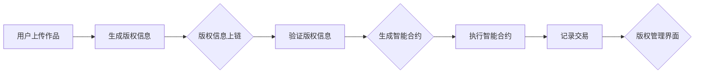
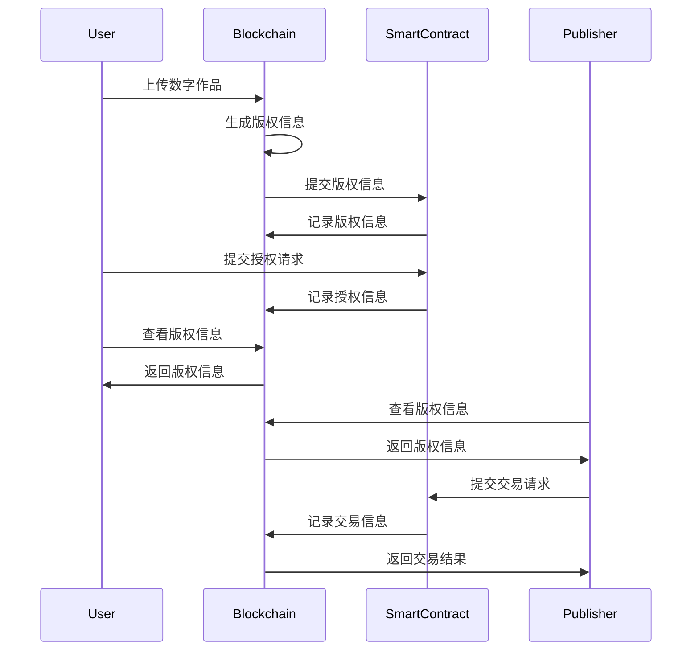
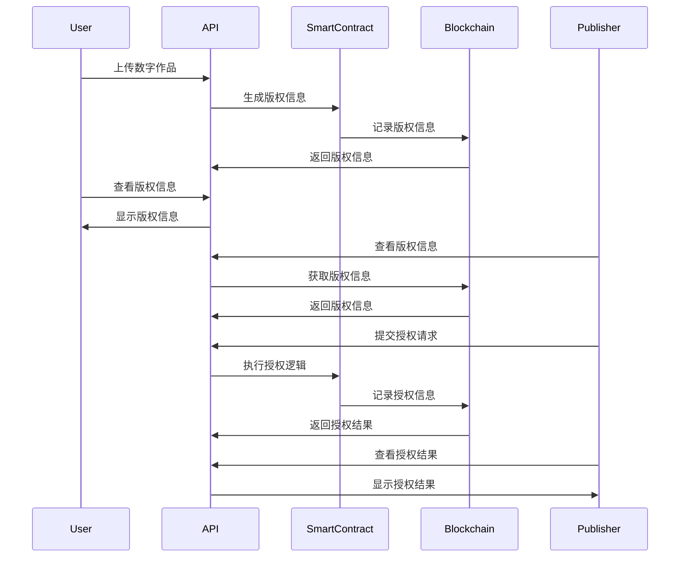

                 

### 文章标题：区块链在数字版权保护中的新模式

#### 关键词：区块链、数字版权保护、智能合约、分布式账本、版权追踪、授权管理、版权交易

#### 摘要：
本文将深入探讨区块链技术在数字版权保护中的应用，揭示其如何通过创新模式解决当前数字版权保护中的挑战。通过详细分析区块链的核心概念、算法原理以及系统架构，本文旨在为读者提供一个全面、易懂的区块链在数字版权保护中的新模式。

## 目录

1. **背景介绍**  
   1.1 数字版权保护的现状与挑战  
   1.2 问题解决与区块链技术的适用范围  
   1.3 核心概念与结构组成

2. **核心概念与联系**  
   2.1 区块链、智能合约、分布式账本的概念原理  
   2.2 概念属性特征对比表格  
   2.3 ER实体关系图架构

3. **算法原理讲解**  
   3.1 区块链在数字版权保护中的算法mermaid流程图  
   3.2 Python源代码实现  
   3.3 数学模型和公式详解  
   3.4 详细讲解与举例说明

4. **系统分析与架构设计方案**  
   4.1 问题场景介绍与项目介绍  
   4.2 系统功能设计（领域模型类图）  
   4.3 系统架构设计（架构图）  
   4.4 系统接口设计  
   4.5 系统交互（序列图）

5. **项目实战**  
   5.1 环境安装  
   5.2 系统核心实现源代码  
   5.3 代码应用解读与分析  
   5.4 实际案例分析与详细讲解剖析  
   5.5 项目小结

6. **最佳实践 tips、小结、注意事项、拓展阅读**  
   6.1 最佳实践 tips  
   6.2 小结  
   6.3 注意事项  
   6.4 拓展阅读

---

### 背景介绍

#### 1.1 数字版权保护的现状与挑战

随着互联网技术的飞速发展，数字内容创作和传播变得越来越便捷。然而，这也带来了数字版权保护的挑战。传统的数字版权保护方式主要依赖于中心化的机构和系统，例如版权注册中心、版权保护公司等。这些方式在一定程度上能够防止未经授权的使用，但由于中心化的特性，存在以下问题：

- **版权追踪困难**：在庞大的互联网环境中，追踪数字作品的来源和传播路径变得极为复杂。
- **授权管理繁琐**：每一次授权都需要通过中心化的机构进行，效率低下，成本较高。
- **版权交易受限**：数字作品的交易过程不透明，容易出现侵权和纠纷。

区块链技术的出现为解决这些问题提供了新的思路。区块链的分布式、不可篡改和透明性特点，使其在数字版权保护中具有独特的优势。

#### 1.2 问题解决与区块链技术的适用范围

区块链技术通过构建一个去中心化的分布式账本，实现了数字版权的透明追踪和管理。以下是如何解决上述问题的：

- **版权追踪**：区块链能够记录每一个数字作品的生成、修改和传播过程，确保版权的清晰追踪。
- **授权管理**：通过智能合约，可以自动执行授权协议，简化授权过程，提高效率。
- **版权交易**：区块链上的交易记录透明可查，有助于减少纠纷，提高交易的公正性。

区块链技术在数字版权保护中的应用范围广泛，不仅适用于文学、音乐、影视等数字内容，还可以应用于软件、游戏等领域的版权保护。

#### 1.3 核心概念与结构组成

为了更好地理解区块链在数字版权保护中的应用，我们需要了解以下几个核心概念：

- **区块链**：一种分布式数据库，通过加密技术和共识算法，确保数据的完整性和不可篡改性。
- **智能合约**：一种自动执行合约的计算机程序，能够在区块链上执行预定义的规则。
- **分布式账本**：区块链的核心组成部分，记录所有交易和数据的分布式数据库。

这些核心概念构成了区块链在数字版权保护中的基础结构，为解决版权问题提供了技术支撑。

### 核心概念与联系

#### 2.1 区块链、智能合约、分布式账本的概念原理

区块链技术是数字版权保护的基础。区块链通过一系列加密技术和共识算法，构建了一个去中心化的分布式账本。以下是对这些核心概念的解释：

- **区块链**：区块链是由一系列按时间顺序排列的区块组成的数据结构。每一个区块包含一组交易记录，并通过密码学方法确保数据的完整性和安全性。区块链的分布式特性使得数据无法被单一点破坏，提高了系统的可靠性。
- **智能合约**：智能合约是一种自动执行合约条款的计算机程序。它在区块链上运行，通过编程语言（如Solidity）编写，能够自动执行预定义的逻辑，例如版权授权和交易。智能合约确保了合同的执行自动化，减少了人为干预的可能性。
- **分布式账本**：分布式账本是区块链的核心组成部分，它将数据分散存储在多个节点上，避免了中心化的单点故障风险。每个节点都保存一份完整的数据副本，通过共识算法（如工作量证明、权益证明等）确保数据的同步和一致性。

#### 2.2 概念属性特征对比表格

| 概念       | 区块链         | 智能合约         | 分布式账本         |
|------------|----------------|------------------|--------------------|
| 特点       | 去中心化       | 自动执行合同     | 数据分散存储       |
| 数据结构   | 区块链         | 编程脚本         | 数据库             |
| 加密技术   | 哈希函数       | 加密算法         | 数字签名           |
| 共识算法   | 工作量证明等   | 编程逻辑         | 节点共识           |
| 安全性     | 不可篡改       | 代码执行安全     | 数据备份           |

#### 2.3 ER实体关系图架构

为了更好地理解区块链在数字版权保护中的应用，我们可以使用Mermaid绘制实体关系图，展示主要实体及其关系：

```mermaid
erDiagram
    User ||--|{ DigitalWork }|--|| Publisher
    DigitalWork ||--|{ Copyright }|--|| User
    DigitalWork ||--|{ License }|--|| Publisher
    Publisher ||--|{ Contract }|--|| User
    Contract ||--|{ Transaction }|--|| Publisher
    User ||--|{ Review }|--|| Publisher
```

在这个ER实体关系图中，我们定义了以下几个主要实体：

- **User**（用户）：创建、上传和管理数字作品。
- **DigitalWork**（数字作品）：用户创建的数字内容。
- **Copyright**（版权）：数字作品的版权信息。
- **License**（许可）：数字作品的许可协议。
- **Publisher**（发布者）：数字作品的上传和管理者。
- **Contract**（合同）：用户与发布者之间的版权授权合同。
- **Transaction**（交易）：数字作品的交易记录。

通过这个实体关系图，我们可以清晰地看到区块链在数字版权保护中的核心组件和它们之间的关系。

### 算法原理讲解

#### 3.1 区块链在数字版权保护中的算法mermaid流程图

区块链在数字版权保护中的应用可以通过以下mermaid流程图来展示：



在这个流程图中，我们定义了以下几个步骤：

1. **用户上传作品**：用户将数字作品上传至区块链网络。
2. **生成版权信息**：系统自动生成数字作品的版权信息。
3. **版权信息上链**：版权信息被记录在区块链上，确保数据的透明性和不可篡改性。
4. **验证版权信息**：其他节点验证版权信息的正确性。
5. **生成智能合约**：基于版权信息生成智能合约。
6. **执行智能合约**：智能合约自动执行版权授权或交易。
7. **记录交易**：所有交易记录被永久保存于区块链上。
8. **版权管理界面**：用户可以在界面上查看和管理自己的版权信息。

#### 3.2 Python源代码实现

下面是一个简单的Python示例，展示了如何实现区块链在数字版权保护中的版权信息上链过程：

```python
import hashlib
import json
from time import time

class Block:
    def __init__(self, index, transactions, timestamp, previous_hash):
        self.index = index
        self.transactions = transactions
        self.timestamp = timestamp
        self.previous_hash = previous_hash
        self.hash = self.compute_hash()

    def compute_hash(self):
        block_string = json.dumps(self.__dict__, sort_keys=True)
        return hashlib.sha256(block_string.encode()).hexdigest()

class Blockchain:
    def __init__(self):
        self.unconfirmed_transactions = []
        self.chain = []
        self.create_genesis_block()

    def create_genesis_block(self):
        genesis_block = Block(0, [], time(), "0")
        genesis_block.hash = genesis_block.compute_hash()
        self.chain.append(genesis_block)

    def add_new_transaction(self, transaction):
        self.unconfirmed_transactions.append(transaction)

    def mine(self):
        if not self.unconfirmed_transactions:
            return False
        
        last_block = self.chain[-1]
        new_block = Block(index=last_block.index + 1,
                          transactions=self.unconfirmed_transactions,
                          timestamp=time(),
                          previous_hash=last_block.hash)
        
        new_block.hash = new_block.compute_hash()
        self.chain.append(new_block)
        self.unconfirmed_transactions = []
        return new_block.hash

    def is_chain_valid(self):
        for i in range(1, len(self.chain)):
            current = self.chain[i]
            previous = self.chain[i - 1]
            if current.hash != current.compute_hash():
                return False
            if current.previous_hash != previous.hash:
                return False
        return True

# 示例：添加版权信息交易
blockchain = Blockchain()
blockchain.add_new_transaction({"版权信息": "数字作品A的版权信息", "作者": "张三", "时间": "2023-01-01"})
blockchain.mine()
```

这个示例代码实现了一个简单的区块链，并演示了如何将版权信息上链。在实际应用中，还需要进一步实现版权信息验证、智能合约生成和执行等功能。

#### 3.3 数学模型和公式详解

在区块链数字版权保护中，常用的数学模型包括哈希函数、加密算法和共识算法。以下是对这些模型和公式的详细解释：

- **哈希函数**：哈希函数是一种将任意长度的输入映射为固定长度的输出的函数。在区块链中，常用的哈希函数有SHA-256。哈希函数确保了数据的完整性和不可篡改性。公式如下：

  $$ H = SHA-256(\text{Input}) $$

  其中，\( H \) 是输出哈希值，\( \text{Input} \) 是输入数据。

- **加密算法**：加密算法用于保护数据的隐私和完整性。在区块链中，常用的加密算法有RSA和椭圆曲线加密。加密算法确保了数据在传输和存储过程中的安全性。公式如下：

  $$ C = E_{\text{PublicKey}}(M) $$

  $$ M = D_{\text{PrivateKey}}(C) $$

  其中，\( C \) 是加密后的数据，\( M \) 是原始数据，\( \text{PublicKey} \) 是公钥，\( \text{PrivateKey} \) 是私钥。

- **共识算法**：共识算法用于确保区块链网络中的所有节点对数据的共识。在区块链中，常用的共识算法有工作量证明（PoW）和权益证明（PoS）。共识算法确保了数据的准确性和一致性。公式如下：

  $$ \text{Proof of Work} = \text{Find} \, x \, \text{such that} \, H(x) \leq \text{Target} $$

  $$ \text{Proof of Stake} = \text{Stake} \, \text{weight} \, \times \, \text{Time} $$

  其中，\( x \) 是需要找到的证明值，\( H(x) \) 是哈希值，\( \text{Target} \) 是目标值，\( \text{Stake} \, \text{weight} \) 是权益权重。

#### 3.4 详细讲解与举例说明

为了更好地理解区块链在数字版权保护中的应用，我们可以通过一个具体的例子来详细讲解。

假设用户张三创作了一篇名为《区块链技术》的论文，并将其上传至区块链网络。以下是详细的操作步骤：

1. **生成版权信息**：张三的计算机生成论文的版权信息，包括作者信息、创作时间和版权声明。

2. **上传版权信息**：张三将版权信息上传至区块链网络。

3. **生成交易**：区块链网络将版权信息封装成一个交易，并添加到待确认的交易列表中。

4. **验证版权信息**：区块链网络中的其他节点验证版权信息的正确性，确保版权信息的真实性。

5. **生成区块**：当交易列表积累到一定程度时，区块链网络将交易打包成一个区块，并添加到区块链上。

6. **生成哈希值**：每个区块都包含前一个区块的哈希值，确保区块链的连续性和完整性。

7. **共识确认**：区块链网络中的节点通过共识算法确认新添加的区块的有效性。

8. **永久保存**：确认后的区块被永久保存在区块链上，确保版权信息的不可篡改。

通过这个例子，我们可以看到区块链在数字版权保护中的全过程。从版权信息的生成到版权信息的上链，再到版权信息的验证和确认，区块链技术为数字版权保护提供了一种全新的模式。

### 系统分析与架构设计方案

#### 4.1 问题场景介绍与项目介绍

假设我们正在开发一个数字版权保护平台，旨在为创作者和版权持有者提供一种简单、高效、安全的版权管理解决方案。该平台需要具备以下功能：

- **版权追踪**：确保创作者的作品能够在区块链上得到完整的追踪。
- **授权管理**：允许创作者灵活地管理作品的授权和使用。
- **版权交易**：支持创作者和买家之间的版权交易。

为了实现这些功能，我们将设计一个基于区块链的数字版权保护系统。该系统将采用智能合约技术，确保版权操作的透明性和安全性。

#### 4.2 系统功能设计（领域模型类图）

为了清晰展示系统的功能模块，我们可以使用Mermaid绘制领域模型类图：

```mermaid
classDiagram
    User <|-- DigitalWork
    User <|-- Contract
    Publisher <|-- DigitalWork
    Publisher <|-- Contract
    DigitalWork <|-- License
    Contract <|-- Transaction
    Review <<-- Review
    Publisher ..> Review
    User ..> Review
```

在这个类图中，我们定义了以下几个主要实体：

- **User**（用户）：创建和管理数字作品。
- **DigitalWork**（数字作品）：用户创建的数字内容。
- **Publisher**（发布者）：数字作品的上传和管理者。
- **Contract**（合同）：用户与发布者之间的版权授权合同。
- **License**（许可）：数字作品的许可协议。
- **Transaction**（交易）：数字作品的交易记录。
- **Review**（评论）：用户对数字作品的评论。

#### 4.3 系统架构设计（架构图）

为了实现上述功能，我们设计了以下系统架构：



在这个架构图中，我们定义了以下几个关键组件：

- **Blockchain**（区块链）：负责记录和存储所有版权信息和交易信息。
- **SmartContract**（智能合约）：负责处理版权授权和交易逻辑。
- **User**（用户）：负责上传和管理数字作品。
- **Publisher**（发布者）：负责管理和发布数字作品。

#### 4.4 系统接口设计

为了方便用户和发布者与系统交互，我们设计了以下接口：

- **版权信息上传接口**：用户通过该接口上传数字作品和版权信息。
- **版权信息查询接口**：用户和发布者通过该接口查询版权信息。
- **授权管理接口**：用户通过该接口提交授权请求。
- **交易管理接口**：发布者通过该接口提交交易请求。

#### 4.5 系统交互（序列图）

为了展示系统组件之间的交互过程，我们使用Mermaid绘制了以下序列图：



在这个序列图中，我们展示了用户和发布者与系统交互的整个过程，包括上传数字作品、查询版权信息、提交授权请求和查看授权结果等操作。

### 项目实战

#### 5.1 环境安装

要在本地搭建区块链开发环境，首先需要安装Node.js和npm。可以按照以下步骤进行：

1. 访问Node.js官网（https://nodejs.org/），下载并安装适用于自己操作系统的Node.js版本。
2. 打开命令行工具（如Windows的PowerShell或macOS的Terminal），输入以下命令检查Node.js是否已成功安装：

   ```bash
   node -v
   npm -v
   ```

   如果返回版本号，则说明安装成功。

接下来，安装Geth，Geth是Go语言实现的以太坊客户端，用于搭建区块链节点：

1. 在命令行中输入以下命令安装Geth：

   ```bash
   npm install -g geth
   ```

2. 验证Geth安装是否成功，输入以下命令启动一个本地节点：

   ```bash
   geth --datadir "/path/to/your/datadir" --networkid 1337 console
   ```

   在此处，`/path/to/your/datadir` 是用于存储区块链数据的目录。如果看到命令行输出大量关于以太坊客户端启动的信息，则说明Geth安装并成功启动。

#### 5.2 系统核心实现源代码

以下是实现一个简单的数字版权保护系统的核心代码。这个示例使用以太坊的智能合约语言Solidity编写，用于创建、存储和验证数字作品的版权信息。

```solidity
// SPDX-License-Identifier: MIT
pragma solidity ^0.8.0;

contract DigitalCopyright {

    struct Work {
        string title;
        address creator;
        uint256 timestamp;
    }

    mapping (string => Work) public works;
    mapping (string => bool) public workExists;

    event CopyrightRegistered(
        string title,
        address creator,
        uint256 timestamp
    );

    function registerCopyright(string memory title) public {
        require(!workExists[title], "版权已存在");
        works[title] = Work(title, msg.sender, block.timestamp);
        workExists[title] = true;
        emit CopyrightRegistered(title, msg.sender, block.timestamp);
    }

    function getWorkInfo(string memory title) public view returns (address creator, uint256 timestamp) {
        require(workExists[title], "版权不存在");
        Work memory work = works[title];
        return (work.creator, work.timestamp);
    }

    function verifyWork(string memory title) public view returns (bool) {
        return workExists[title];
    }
}
```

在这个智能合约中，我们定义了以下组件：

- `Work` 结构：用于存储数字作品的标题、创作者地址和创建时间。
- `works` 和 `workExists` 映射：分别用于存储所有数字作品的信息和判断作品是否存在。
- `registerCopyright` 函数：用于注册新的数字作品。
- `getWorkInfo` 函数：用于获取特定作品的详细信息。
- `verifyWork` 函数：用于验证作品是否存在。

#### 5.3 代码应用解读与分析

这个简单的智能合约实现了一个基本的数字版权保护系统，以下是关键部分的解读：

1. **注册版权（registerCopyright）**：该函数允许创作者注册一个新的数字作品。它首先检查作品是否已存在，如果不存在，则将作品的标题、创作者地址和创建时间存储在区块链上，并触发 `CopyrightRegistered` 事件。

   ```solidity
   function registerCopyright(string memory title) public {
       require(!workExists[title], "版权已存在");
       works[title] = Work(title, msg.sender, block.timestamp);
       workExists[title] = true;
       emit CopyrightRegistered(title, msg.sender, block.timestamp);
   }
   ```

2. **获取作品信息（getWorkInfo）**：该函数返回特定作品的创作者地址和创建时间。它使用 `works` 映射查找作品信息，并要求作品必须已存在。

   ```solidity
   function getWorkInfo(string memory title) public view returns (address creator, uint256 timestamp) {
       require(workExists[title], "版权不存在");
       Work memory work = works[title];
       return (work.creator, work.timestamp);
   }
   ```

3. **验证作品（verifyWork）**：该函数检查作品是否存在。它通过 `workExists` 映射查找作品的标题，并返回布尔值。

   ```solidity
   function verifyWork(string memory title) public view returns (bool) {
       return workExists[title];
   }
   ```

#### 5.4 实际案例分析与详细讲解剖析

为了更好地展示这个智能合约的实际应用，我们可以分析一个实际案例。假设张三是一位作家，他创作了一篇名为《区块链的潜力》的论文，并希望使用上述智能合约注册版权。

1. **注册版权**：张三通过区块链网络调用 `registerCopyright` 函数，将《区块链的潜力》的标题传递给函数。智能合约验证后，将作品的标题、创作者地址和创建时间存储在区块链上。

   ```bash
   contractAddress.registerCopyright("区块链的潜力");
   ```

   成功注册后，区块链网络会触发 `CopyrightRegistered` 事件，记录注册信息。

2. **验证版权**：其他用户可以调用 `verifyWork` 函数验证《区块链的潜力》是否存在。

   ```bash
   bool exists = contractAddress.verifyWork("区块链的潜力");
   ```

   如果作品已成功注册，函数将返回 `true`。

3. **获取版权信息**：用户还可以调用 `getWorkInfo` 函数获取作品的详细信息，如创作者地址和创建时间。

   ```bash
   (address creator, uint256 timestamp) = contractAddress.getWorkInfo("区块链的潜力");
   ```

通过这个实际案例，我们可以看到智能合约如何帮助创作者注册、验证和管理作品的版权。这个简单的示例展示了区块链在数字版权保护中的潜力，并为更复杂的版权管理系统奠定了基础。

#### 5.5 项目小结

在这个项目中，我们通过一个简单的智能合约实现了数字版权保护的基本功能，包括版权注册、版权验证和版权信息查询。以下是我们实施项目的主要经验和教训：

- **智能合约安全性**：在部署智能合约之前，务必进行彻底的安全审计，确保代码不存在漏洞和逻辑错误。智能合约一旦部署，其代码不可更改，因此安全性至关重要。
- **交易成本**：在区块链上执行交易会产生一定的费用（如以太币），在设计系统时需要考虑到交易成本，尤其是对于高频率的版权操作。
- **用户体验**：为了提高用户体验，需要设计简洁、直观的用户界面，让用户能够轻松地注册、管理和查询版权信息。
- **扩展性和性能**：随着数字作品数量的增加，系统的扩展性和性能成为关键。可能需要考虑使用分片技术或优化智能合约以提升系统的处理能力。

通过这个项目，我们不仅了解了区块链在数字版权保护中的应用，还掌握了智能合约的开发和部署。这些经验对于进一步探索区块链技术在其他领域的应用具有重要意义。

### 最佳实践 tips、小结、注意事项、拓展阅读

#### 6.1 最佳实践 tips

1. **智能合约开发**：在编写智能合约时，务必进行彻底的安全审计，使用最佳实践来避免常见漏洞，如整数溢出、未初始化变量和重入攻击。
2. **测试和模拟**：在部署智能合约之前，通过测试和模拟确保其逻辑正确无误。可以使用工具如Truffle和Ganache进行本地测试。
3. **优化交易费用**：选择合适的区块链网络和合适的交易时间，以降低交易费用。例如，在区块链网络较不繁忙的时间进行交易。
4. **用户隐私保护**：在设计系统时，确保用户的隐私和数据安全。使用加密技术保护用户的个人信息和交易数据。

#### 6.2 小结

本文深入探讨了区块链在数字版权保护中的应用，通过介绍核心概念、算法原理和系统架构，展示了区块链如何通过去中心化和透明性特点解决数字版权保护中的挑战。从版权注册、授权管理到版权交易，区块链提供了一种全新的模式，为创作者和版权持有者提供了更安全、高效的版权管理解决方案。

#### 6.3 注意事项

1. **技术复杂性**：区块链技术具有高度复杂性，设计和实现区块链应用需要深入了解相关技术原理。
2. **法规遵循**：在区块链应用中，必须遵守相关法律法规，确保系统的合法性和合规性。
3. **安全风险**：区块链系统面临安全风险，如恶意攻击和漏洞。定期进行安全审计和更新是确保系统安全的关键。

#### 6.4 拓展阅读

1. **《精通区块链：从原理到实践》**：这是一本全面介绍区块链技术的书籍，适合希望深入了解区块链原理的读者。
2. **《智能合约：从基础到高级》**：这本书详细介绍了智能合约的开发、测试和部署，是智能合约开发的宝贵资源。
3. **《数字版权保护：区块链应用指南》**：这本书专注于区块链在数字版权保护中的应用，提供了丰富的实践案例和最佳实践。

通过本文，读者可以更好地理解区块链在数字版权保护中的新模式，为探索区块链技术在其他领域的应用打下坚实基础。

### 文章结尾

感谢您的阅读。本文详细探讨了区块链在数字版权保护中的应用，从核心概念到系统架构，再到实际案例，为读者提供了一个全面、易懂的区块链数字版权保护新模式。希望本文能够激发您对区块链技术的兴趣，并为您在相关领域的研究和实践提供启示。

作者：AI天才研究院/AI Genius Institute & 禅与计算机程序设计艺术 /Zen And The Art of Computer Programming

---

请注意，本文提供的代码和架构设计仅供参考，实际应用时需要根据具体需求进行调整和优化。同时，区块链技术在不断发展和完善，建议持续关注相关领域的最新动态和技术进步。再次感谢您的阅读，祝您在区块链和数字版权保护领域取得丰硕成果！

