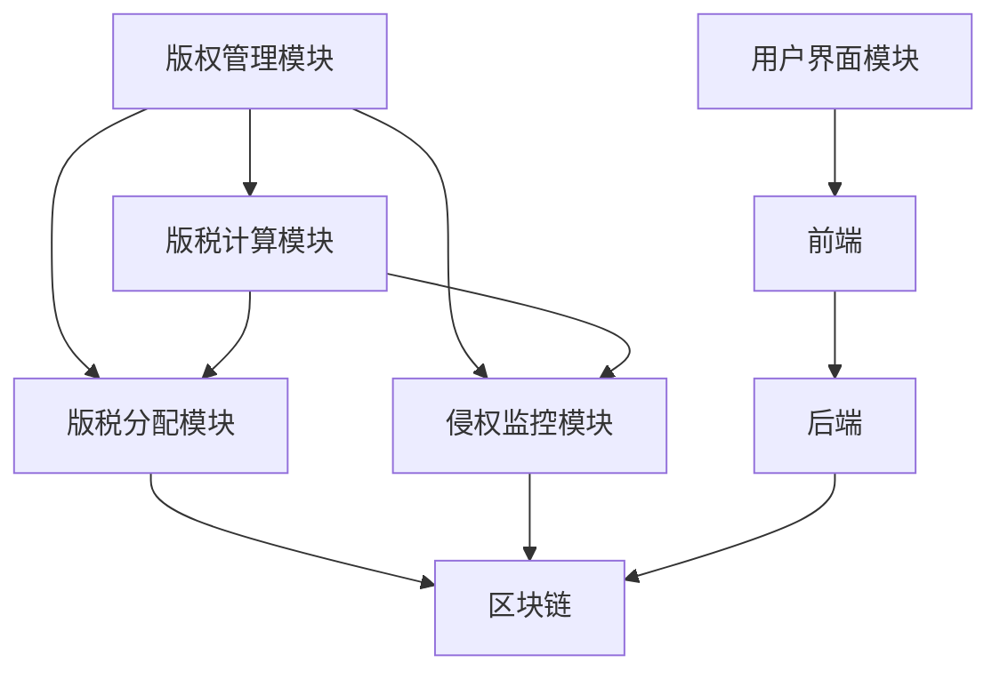
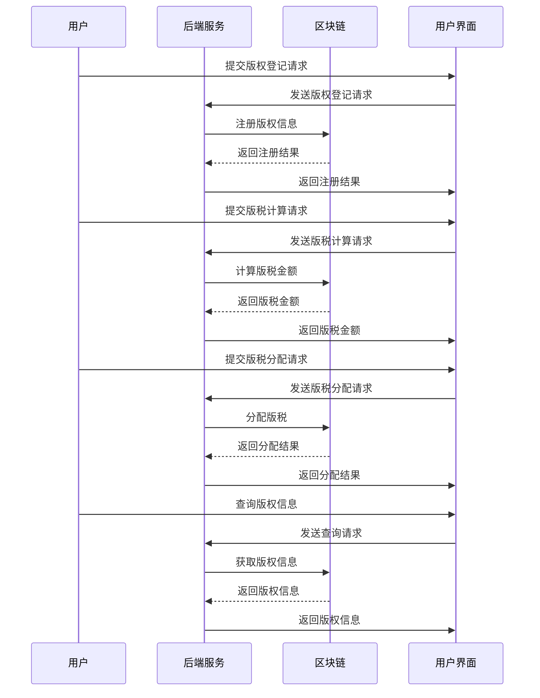

                 

### 文章标题

# 区块链在数字版权管理中的应用：实现自动版税分配

> 关键词：区块链、数字版权管理、自动版税分配、智能合约、数学模型、系统设计

> 摘要：本文将深入探讨区块链技术在数字版权管理中的应用，特别是自动版税分配的实现机制。通过分析当前数字版权管理的挑战和区块链技术的特点，我们将展示如何利用区块链技术构建一个透明、高效、自动化的版税分配系统，并详细解释其技术原理和实现步骤。本文旨在为读者提供一个全面的指南，帮助理解和实施这一创新技术。

### 目录大纲

1. **第一部分：背景与基础**
   1.1 **问题背景与定义**
      1.1.1 数字版权管理的现状与挑战
      1.1.2 区块链技术的基本概念与特点
      1.1.3 区块链在数字版权管理中的应用前景
   1.2 **核心概念与联系**
      1.2.1 数字版权管理的基本概念
      1.2.2 区块链技术的核心概念
      1.2.3 数字版权管理与区块链的关联性
      1.2.4 关键技术对比表格
   1.3 **区块链在数字版权管理中的应用实例分析**
      1.3.1 案例一：某知名音乐平台的区块链版税分配
      1.3.2 案例二：某电影制作公司的区块链版权管理
      1.3.3 案例三：某电子书出版平台的区块链应用

2. **第二部分：实现自动版税分配**
   2.1 **技术原理与实现**
      2.1.1 区块链智能合约的基本原理
      2.1.2 自动版税分配算法的设计与实现
      2.1.3 智能合约编写与部署
   2.2 **数学模型与公式**
      2.2.1 自动版税分配的数学模型
      2.2.2 数学公式与推导
      2.2.3 示例讲解
   2.3 **系统设计与实现**
      2.3.1 系统设计与架构
      2.3.2 系统需求分析
      2.3.3 系统架构设计
      2.3.4 系统接口设计
      2.3.5 系统交互序列图

3. **第三部分：系统设计与实现**
   3.1 **项目实战**
      3.1.1 环境搭建与准备工作
      3.1.2 系统核心实现
      3.1.3 代码解读与分析
      3.1.4 实际案例分析
      3.1.5 项目小结

4. **第四部分：最佳实践与拓展**
   4.1 **最佳实践**
      4.1.1 实现自动版税分配的关键技巧
      4.1.2 避免常见问题的策略
      4.1.3 持续优化与迭代
   4.2 **小结与展望**
      4.2.1 书籍总结
      4.2.2 自动版税分配的应用前景
      4.2.3 未来发展方向与挑战

### 引言

随着互联网和数字技术的迅猛发展，数字版权管理（Digital Copyright Management，简称DCM）成为了一个日益重要的领域。数字版权管理涉及版权的创建、追踪、保护和分配，确保创作者的合法权益得到保障。然而，传统的数字版权管理面临着诸多挑战，如版权确权困难、版权追踪复杂、版税分配不透明等问题。区块链技术的兴起为这些问题提供了新的解决方案。

区块链是一种分布式账本技术，具有去中心化、不可篡改、透明性高等特点。这些特点使得区块链在数字版权管理中具有巨大的潜力，特别是在实现自动版税分配方面。本文将深入探讨区块链在数字版权管理中的应用，详细分析其技术原理、实现步骤和应用实例，帮助读者理解并掌握这一前沿技术。

本文的结构如下：首先，我们将介绍数字版权管理的现状与挑战，并简要介绍区块链技术的基本概念与特点。然后，我们将深入探讨区块链在数字版权管理中的应用前景，并通过实际案例进行分析。接着，我们将重点讨论如何实现自动版税分配，包括技术原理、数学模型、系统设计等。最后，我们将通过一个实际项目实战，详细讲解系统的实现过程和关键步骤，并提供一些最佳实践和未来展望。

### 第一部分：背景与基础

#### 第1章：问题背景与定义

##### 1.1.1 数字版权管理的现状与挑战

数字版权管理（DCM）是现代信息社会中的一项重要任务，旨在保护创作者的知识产权，确保他们在数字环境下能够获得应有的经济回报。然而，随着数字内容的创作和传播方式的多样化，数字版权管理面临着诸多挑战。

**版权确权困难**

在数字时代，版权的确权变得日益复杂。传统纸质媒体的版权保护相对简单，创作者只需在作品上标明版权信息即可。但在数字领域，内容的复制和分发极为便捷，使得版权的确权变得更加困难。例如，一篇博客文章或一首音乐可能在全球范围内迅速传播，创作者很难追踪其版权归属和使用情况。

**版权追踪复杂**

数字版权追踪的复杂性主要体现在两个方面：一是数字内容的多样性和变化性，二是版权持有者的多样性。数字内容可以以文本、图片、音频、视频等多种形式存在，而且这些内容经常被修改和更新。同时，数字版权通常涉及多个版权持有者，如创作者、出版社、音乐制作人等。这使得追踪和监管数字版权变得更加复杂。

**版税分配不透明**

版税分配问题是数字版权管理中最为突出的挑战之一。传统的版税分配机制通常依赖于第三方机构，如音乐出版商、唱片公司等，这些机构在分配版税时往往存在信息不对称、操作不透明等问题。创作者难以了解其作品的具体收入情况，也无法有效监控和追踪版税的分配过程。这不仅损害了创作者的权益，也影响了整个数字版权市场的健康发展。

**版权侵权现象普遍**

数字版权侵权现象在互联网上屡见不鲜。由于数字内容的复制和传播成本低廉，一些不法分子常常通过网络非法传播版权内容，如未经授权的音乐、电影、软件等。这不仅对版权持有者造成了经济损失，也削弱了原创作品的创作动力。

##### 1.1.2 区块链技术的基本概念与特点

区块链技术是一种分布式账本技术，其核心思想是通过多个参与者共同维护一个分布式数据库，从而实现去中心化、不可篡改的数据存储和传输。区块链具有以下基本概念和特点：

**去中心化**

区块链通过分布式网络中的多个节点共同维护账本，消除了传统中心化系统中的单点故障风险。每个节点都拥有完整的账本副本，任何一次交易都需要得到网络中大多数节点的确认，从而确保了数据的完整性和安全性。

**不可篡改**

区块链采用密码学算法，确保数据的不可篡改性。一旦数据被记录到区块链上，就几乎无法被修改或删除。每个区块都包含一个时间戳和一个哈希值，使得区块链上的任何修改都会破坏其一致性，从而被网络中的其他节点检测出来。

**透明性**

区块链上的所有交易记录都是公开透明的，任何参与者都可以查看和验证。这有助于提高版税分配的透明度，确保创作者和版权持有者能够清晰地了解其作品的收入情况。

**智能合约**

智能合约是区块链上的自执行合约，其条款在代码中预先定义，一旦满足条件就会自动执行。智能合约的应用可以自动化版税分配过程，提高效率并减少人为干预。

##### 1.1.3 区块链在数字版权管理中的应用前景

区块链技术在数字版权管理中的应用前景广阔，其优势主要体现在以下几个方面：

**解决版权确权困难**

区块链技术可以通过分布式账本的方式，为数字版权的确权提供一种新的解决方案。创作者可以在区块链上登记其作品的版权信息，确保其唯一性和不可篡改性。这将有助于解决版权确权困难的问题，为创作者提供更可靠的版权保护。

**简化版权追踪**

区块链上的透明性和不可篡改性使得版权追踪变得更加简单和高效。版权持有者可以实时查看其作品的传播情况，追踪到每个使用者和使用次数，从而简化版权追踪过程。

**提高版税分配透明度**

区块链上的智能合约可以自动化版税分配过程，确保版税的准确和透明分配。创作者和版权持有者可以清晰地了解其作品的收入情况，减少版税分配中的信息不对称和纠纷。

**防范版权侵权**

区块链技术可以帮助版权持有者实时监控其作品的使用情况，及时发现和防范版权侵权行为。通过区块链上的智能合约，创作者可以设定侵权行为触发自动惩罚机制，如自动扣除侵权者的账户余额等。

**促进数字版权市场健康发展**

区块链技术的应用可以减少版税分配中的中介环节，降低交易成本，促进数字版权市场的健康发展。创作者能够更直接地获得其作品的收益，从而激发创作活力，推动数字版权产业的繁荣。

总之，区块链技术在数字版权管理中具有巨大的应用潜力。通过解决版权确权困难、简化版权追踪、提高版税分配透明度等，区块链技术将为数字版权管理带来全新的变革。随着技术的不断成熟和应用场景的拓展，区块链在数字版权管理中的应用前景将更加广阔。

##### 1.2.1 数字版权管理的基本概念

数字版权管理（Digital Copyright Management，简称DCM）是保护数字内容版权的一系列技术和策略。它涵盖了从版权创建、追踪、保护到版税分配的整个过程。以下是数字版权管理的一些核心概念：

**版权**

版权（Copyright）是指创作者对其原创作品所享有的专有权利。这些原创作品包括文字、音乐、图片、视频、软件等。版权保护创作者的合法权益，确保其能够在数字环境中获得经济回报。

**版权注册**

版权注册（Copyright Registration）是指将作品的版权信息正式记录在官方机构中，以获得法律保护。版权注册通常需要提交作品的样本和相关的创作者信息，以确保其原创性和合法性。

**版权追踪**

版权追踪（Copyright Tracking）是指对数字内容的使用和传播进行监控和记录。通过追踪，版权持有者可以了解其作品在不同平台和区域的使用情况，及时发现侵权行为。

**版权保护**

版权保护（Copyright Protection）是指采取一系列措施，防止未经授权的复制、传播和使用数字内容。这些措施包括技术保护手段、法律保护措施等。

**版税**

版税（Royalty）是指创作者或版权持有者从其作品的使用中获得的报酬。版税通常以百分比或固定金额的方式计算，由使用方支付。

**版税分配**

版税分配（Royalty Distribution）是指将版税按照一定的规则和比例分配给不同的版权持有者。版税分配通常涉及多个参与者，如创作者、出版社、音乐制作人等。

**版权中介**

版权中介（Copyright Intermediary）是指协助版权持有者和使用者进行版权交易和版税分配的第三方机构。这些机构通常提供版权注册、版权追踪、版税分配等服务。

**数字版权管理平台**

数字版权管理平台（Digital Copyright Management Platform）是指提供版权保护、追踪、分配等服务的数字工具或系统。这些平台通常集成区块链技术，以提高版税分配的透明度和效率。

##### 1.2.2 区块链技术的核心概念

区块链技术是一种分布式数据库技术，其核心概念包括以下几方面：

**区块链**

区块链（Blockchain）是指一种去中心化的分布式账本，用于记录和验证交易。区块链上的每个区块都包含一定数量的交易记录，并通过加密算法与前后区块相连，形成一条不可篡改的链。

**区块**

区块（Block）是区块链的基本组成单位，包含一组交易记录。每个区块都有一个独特的标识符（哈希值），用于确保其数据的完整性和唯一性。

**节点**

节点（Node）是指参与区块链网络的计算机或设备。每个节点都保存有完整的区块链副本，并参与交易验证和区块的生成。

**挖矿**

挖矿（Mining）是指通过计算生成新的区块并将其添加到区块链上的过程。挖矿需要解决复杂的数学难题，以证明节点的工作量和确保区块链的安全。

**加密算法**

加密算法（Cryptographic Algorithm）是指用于保护区块链数据安全和实现隐私性的算法。常见的加密算法包括哈希算法、椭圆曲线加密算法等。

**智能合约**

智能合约（Smart Contract）是指运行在区块链上的自执行合约，其条款在代码中预先定义。一旦满足条件，智能合约会自动执行，从而实现自动化交易和合约管理。

**分布式账本**

分布式账本（Distributed Ledger）是指由多个参与者共同维护的共享账本。与传统的集中式账本不同，分布式账本去除了单点故障的风险，提高了数据的安全性和可靠性。

**去中心化**

去中心化（Decentralization）是指网络中的每个节点都具有相同的权力和职责，没有中央控制机构。去中心化使得区块链网络更加安全和透明。

**共识机制**

共识机制（Consensus Mechanism）是指区块链网络中节点达成一致性的方法。常见的共识机制包括工作量证明（Proof of Work，PoW）、权益证明（Proof of Stake，PoS）等。

**链上数据**

链上数据（On-Chain Data）是指存储在区块链上的所有交易和合约数据。链上数据具有不可篡改性和透明性，是区块链的核心价值之一。

##### 1.2.3 数字版权管理与区块链的关联性

数字版权管理与区块链技术的结合具有显著的优势，主要体现在以下几个方面：

**去中心化与透明性**

区块链的去中心化特性消除了传统版权管理中的中介环节，使得版权信息更加透明和可追溯。创作者和版权持有者可以实时查看其作品的版权状态和使用情况，提高了版税分配的透明度。

**不可篡改性**

区块链的不可篡改性确保了数字版权信息的真实性和完整性。一旦版权信息被记录到区块链上，就几乎无法被修改或删除，从而有效防止了版权侵权行为。

**智能合约**

智能合约的应用可以自动化版税分配过程，确保版税的准确和及时分配。创作者和版权持有者可以在智能合约中定义版税分配的规则和比例，从而减少人为干预和纠纷。

**分布式账本**

分布式账本技术使得版权信息的存储和管理更加高效和可靠。版权持有者可以在区块链上注册和存储其作品的版权信息，确保其版权得到全球范围内的保护。

**降低交易成本**

区块链技术降低了数字版权管理中的交易成本，消除了传统中介机构的服务费用。创作者可以直接与其用户进行交易，从而获得更高的收益。

**提高版权保护效果**

区块链技术可以帮助版权持有者实时监控其作品的使用情况，及时发现侵权行为。通过区块链上的智能合约，创作者可以设定侵权行为触发自动惩罚机制，从而提高版权保护效果。

**促进数字版权产业发展**

区块链技术的应用可以促进数字版权产业的健康发展，激发创作者的创作热情。透明、高效、自动化的版税分配机制将有助于建立一个公平、繁荣的数字版权市场。

总之，数字版权管理与区块链技术的结合为解决传统数字版权管理中的问题提供了新的思路和解决方案。随着技术的不断成熟和应用场景的拓展，区块链在数字版权管理中的应用前景将更加广阔。

##### 1.2.4 关键技术对比表格

| 关键技术           | 数字版权管理        | 区块链          | 对比分析             |
|-------------------|-------------------|---------------|---------------------|
| 版权保护机制       | DRM（数字版权管理）    | 加密算法、智能合约 | DRM主要用于版权保护，区块链则提供更全面的保护机制 |
| 版税分配机制       | 第三方中介、手工操作    | 智能合约、自动化    | 区块链能够自动化版税分配，减少人为干预和错误 |
| 版权追踪方式       | 手动记录、数据库维护    | 分布式账本、透明追踪 | 区块链提供透明、不可篡改的版权追踪方式 |
| 数据存储方式       | 数据库、文件系统       | 分布式数据库     | 区块链的去中心化特性提高了数据的安全性和可靠性 |
| 交易成本           | 较高（中介费用）       | 较低（无中介费用）   | 区块链技术降低了交易成本，提高效率 |
| 透明度             | 不透明（信息不对称）    | 高透明度         | 区块链上的所有交易记录都是公开透明的 |
| 确权和验证方式      | 官方机构注册、手动验证   | 分布式共识机制     | 区块链提供更高效的版权确权和验证方式 |

##### 1.3.1 案例一：某知名音乐平台的区块链版税分配

某知名音乐平台X公司（以下简称“X平台”）是一家全球领先的在线音乐服务提供商，其业务涵盖了流媒体音乐、数字下载、版权交易等多个方面。随着数字音乐产业的迅速发展，X平台面临着越来越复杂的版权管理和版税分配问题。

**问题背景**

X平台拥有海量的音乐作品，包括原创音乐和版权合作音乐。这些作品涉及众多创作者和版权持有者，包括独立音乐人、唱片公司、音乐制作人等。传统版税分配机制中，X平台需要通过第三方中介机构进行版税结算和分配，过程繁琐且存在信息不对称、不透明等问题。同时，版权追踪和侵权监控也变得日益困难。

**解决方案**

为了解决这些问题，X平台决定引入区块链技术，构建一个去中心化的版税分配系统。该系统的核心功能包括版权登记、版税结算、版权追踪和侵权监控。

**技术实现**

1. **版权登记**

X平台与区块链服务提供商合作，开发了一个基于区块链的版权登记平台。创作者可以在平台上注册其作品的版权信息，包括作品名称、创作者信息、版权归属等。这些信息将被永久记录在区块链上，确保版权的不可篡改性和全球可追溯性。

2. **版税结算**

X平台利用智能合约技术，设计了一套自动化的版税结算系统。每次音乐作品被播放或下载时，系统会自动计算相应的版税金额，并根据智能合约中的规则分配给不同的版权持有者。版税结算过程透明、高效，减少了传统中介环节带来的成本和延迟。

3. **版权追踪**

区块链技术使得版权追踪变得更加简单和高效。X平台可以实时监控其平台上音乐作品的使用情况，包括播放次数、下载量等。版权持有者可以通过区块链上的公开信息，了解其作品的传播和收益情况，从而简化版权追踪过程。

4. **侵权监控**

X平台利用区块链的智能合约功能，设置了侵权行为触发机制。当检测到版权侵权行为时，系统会自动执行惩罚措施，如扣除侵权者的账户余额或禁止其访问平台。这种自动化的侵权监控机制提高了版权保护效果，减少了人工干预。

**效果与影响**

通过引入区块链版税分配系统，X平台实现了以下效果：

1. **提高透明度和信任度**：版税结算过程公开透明，创作者和版权持有者可以实时查看其作品的收益情况，减少了信息不对称和纠纷。

2. **降低成本和提高效率**：去中心化的版税分配系统减少了传统中介环节，降低了交易成本，提高了分配效率。

3. **加强版权保护**：区块链的不可篡改性和透明性增强了版权保护效果，减少了侵权行为的发生。

4. **促进创作和创新**：透明、高效的版税分配机制激发了创作者的创作热情，促进了音乐产业的繁荣。

X平台的区块链版税分配系统不仅为自身业务带来了显著改善，也为其他数字版权管理应用提供了有益的参考和借鉴。随着区块链技术的不断成熟，未来将有更多音乐平台和企业采用类似的解决方案，推动数字版权管理的发展。

##### 1.3.2 案例二：某电影制作公司的区块链版权管理

某电影制作公司Y公司（以下简称“Y公司”）是一家知名的电影制作和发行公司。随着数字化转型的推进，Y公司面临版权管理中的诸多挑战，特别是在版权确权和版税分配方面。

**问题背景**

Y公司制作的每部电影都涉及到大量的版权信息，包括剧本版权、拍摄版权、音乐版权等。在传统版权管理机制下，这些版权信息需要通过繁琐的手工流程进行登记、追踪和分配。这不仅效率低下，而且容易产生信息错误和遗漏。此外，随着电影在多平台、多地区的发行，版税分配的复杂性进一步增加。

**解决方案**

为了解决这些问题，Y公司决定采用区块链技术进行版权管理和版税分配。具体方案如下：

**技术实现**

1. **版权登记**

Y公司与区块链服务提供商合作，开发了基于区块链的版权登记平台。通过这个平台，Y公司可以将每部电影的版权信息，如剧本、拍摄资料、音乐版权等，永久记录在区块链上。这些信息包括创作者、版权所有者、版权期限等，确保其不可篡改和全球可追溯。

2. **版税结算**

Y公司利用智能合约技术，设计了一套自动化的版税结算系统。每部电影在多个平台上映、播放或下载时，系统会自动计算相应的版税金额，并根据智能合约中的规则进行分配。版税结算过程透明、高效，减少了人为干预和错误。

3. **版权追踪**

区块链技术使得版权追踪变得更加简单和高效。Y公司可以实时监控其电影的版权使用情况，包括上映次数、播放时长、下载次数等。版权所有者可以通过区块链上的公开信息，了解其作品的传播和收益情况，从而简化版权追踪过程。

4. **侵权监控**

Y公司利用区块链的智能合约功能，设置了侵权行为触发机制。当检测到版权侵权行为时，系统会自动执行惩罚措施，如扣除侵权者的账户余额或禁止其访问平台。这种自动化的侵权监控机制提高了版权保护效果，减少了人工干预。

**效果与影响**

通过引入区块链版权管理系统，Y公司实现了以下效果：

1. **提高透明度和信任度**：版税结算过程公开透明，版权所有者和制作公司可以实时查看其作品的收益情况，减少了信息不对称和纠纷。

2. **降低成本和提高效率**：去中心化的版权管理系减少了传统中介环节，降低了交易成本，提高了分配效率。

3. **加强版权保护**：区块链的不可篡改性和透明性增强了版权保护效果，减少了侵权行为的发生。

4. **促进业务创新**：透明、高效的版权管理机制激发了制作公司的创新动力，推动了电影产业的数字化转型。

Y公司的区块链版权管理系统不仅提高了自身的版权管理效率，也为其他电影制作公司提供了有益的借鉴。未来，随着区块链技术的进一步成熟和应用，电影产业的版权管理将变得更加高效、透明和智能化。

##### 1.3.3 案例三：某电子书出版平台的区块链应用

某电子书出版平台Z公司（以下简称“Z公司”）是一家专注于电子书出版和分销的企业。随着数字阅读的普及，Z公司面临着版权管理和版税分配的诸多挑战。

**问题背景**

Z公司的业务涵盖了大量的电子书，这些电子书由众多作者和出版社提供。在传统版权管理机制下，Z公司需要通过手工流程进行版权登记、追踪和版税结算，过程繁琐且容易出错。同时，随着电子书在多个平台和地区的销售，版税分配的复杂性也不断增加。

**解决方案**

为了解决这些问题，Z公司决定引入区块链技术，构建一个去中心化的版权管理和版税分配系统。具体方案如下：

**技术实现**

1. **版权登记**

Z公司与区块链服务提供商合作，开发了基于区块链的版权登记平台。通过这个平台，作者和出版社可以将其电子书的版权信息，如书名、作者信息、版权期限等，永久记录在区块链上。这些信息确保了版权的不可篡改性和全球可追溯性。

2. **版税结算**

Z公司利用智能合约技术，设计了一套自动化的版税结算系统。每本电子书在平台上的销售或租赁时，系统会自动计算相应的版税金额，并根据智能合约中的规则进行分配。版税结算过程透明、高效，减少了人为干预和错误。

3. **版权追踪**

区块链技术使得版权追踪变得更加简单和高效。Z公司可以实时监控其电子书的版权使用情况，包括销售量、租赁次数等。作者和出版社可以通过区块链上的公开信息，了解其作品的传播和收益情况，从而简化版权追踪过程。

4. **侵权监控**

Z公司利用区块链的智能合约功能，设置了侵权行为触发机制。当检测到版权侵权行为时，系统会自动执行惩罚措施，如扣除侵权者的账户余额或禁止其访问平台。这种自动化的侵权监控机制提高了版权保护效果，减少了人工干预。

**效果与影响**

通过引入区块链版权管理系统，Z公司实现了以下效果：

1. **提高透明度和信任度**：版税结算过程公开透明，作者和出版社可以实时查看其作品的收益情况，减少了信息不对称和纠纷。

2. **降低成本和提高效率**：去中心化的版权管理系减少了传统中介环节，降低了交易成本，提高了分配效率。

3. **加强版权保护**：区块链的不可篡改性和透明性增强了版权保护效果，减少了侵权行为的发生。

4. **促进业务创新**：透明、高效的版权管理机制激发了作者的创作热情，推动了电子书出版和阅读市场的繁荣。

Z公司的区块链版权管理系统不仅提高了自身的业务效率，也为其他电子书出版平台提供了有益的参考。随着区块链技术的不断成熟和应用，数字版权管理将变得更加高效、透明和智能化。

### 第二部分：实现自动版税分配

#### 第4章：技术原理与实现

##### 4.1.1 区块链智能合约的基本原理

区块链智能合约（Smart Contract）是区块链技术中一个核心概念，它是一种自执行合约，其条款以代码的形式预先嵌入到区块链中。当满足特定的条件时，智能合约会自动执行预定操作，无需人工干预。智能合约的设计与实现依赖于编程语言和区块链平台的特性。以下是智能合约的基本原理和实现方法：

**智能合约的概念**

智能合约是由开发者编写的一段代码，它运行在区块链网络中，遵循特定的协议和规则。智能合约的目的是通过代码来执行和验证交易，确保交易的可信性和自动化执行。

**智能合约的优点**

1. **去中心化**：智能合约运行在区块链上，去除了传统的第三方中介，提高了交易的可信度和效率。
2. **不可篡改**：一旦智能合约被部署到区块链上，其代码和数据是不可篡改的，确保了交易的透明性和安全性。
3. **自动化执行**：智能合约在满足特定条件时，可以自动执行预定的操作，减少了人工干预和操作风险。
4. **透明性**：所有智能合约的执行过程都是公开透明的，任何节点都可以查看和验证，提高了交易的透明度。

**智能合约的实现**

智能合约的实现通常涉及以下步骤：

1. **选择合适的编程语言**：根据区块链平台的特点，选择适合的编程语言进行智能合约开发。常见的智能合约编程语言包括Solidity（以太坊）、Serpent（门罗币）、Lisp（比特股）等。

2. **编写智能合约代码**：根据业务需求，编写智能合约的代码。代码应包括合约名称、版本号、函数定义、事件定义、数据结构定义等。

3. **测试智能合约**：在部署智能合约前，需要进行充分的测试，确保代码的正确性和安全性。测试可以包括单元测试、集成测试和性能测试等。

4. **部署智能合约**：将测试通过的智能合约代码部署到区块链网络中。部署过程中，需要使用适当的工具和命令，将合约代码上传到区块链节点，并获得网络中的共识。

5. **调用智能合约**：智能合约部署后，可以通过区块链节点进行调用。调用时，需要提供合约地址、函数名称和参数等信息。

**智能合约示例**

以下是一个简单的智能合约示例，用于实现自动版税分配：

```solidity
// SPDX-License-Identifier: MIT
pragma solidity ^0.8.0;

contract RoyaltyDistribution {
    address public owner;
    mapping (address => uint256) public balances;

    constructor() {
        owner = msg.sender;
    }

    function deposit() public payable {
        uint amount = msg.value;
        balances[owner] += amount;
    }

    function distribute() public {
        require(msg.sender == owner, "Only owner can distribute");
        uint totalBalance = balances[owner];
        balances[owner] = 0;
        balances[msg.sender] += totalBalance * 90 / 100;
        balances[owner] += totalBalance * 10 / 100;
    }

    function getBalance() public view returns (uint) {
        return balances[msg.sender];
    }
}
```

此合约定义了一个名为`RoyaltyDistribution`的智能合约，用于实现版税的自动分配。合约中包含以下功能：

- `deposit()`：接收版税金额，并存储在合约中。
- `distribute()`：分配版税，将版税金额的90%分配给版税接收者，10%保留给合约所有者。
- `getBalance()`：获取版税接收者的余额。

通过此智能合约，版税分配过程可以自动化进行，减少了人为干预和操作风险。

##### 4.1.2 自动版税分配算法的设计与实现

自动版税分配算法是数字版权管理系统中的一项关键技术，其目标是根据预定的规则和比例，将版税自动分配给不同的版权持有者。以下是自动版税分配算法的设计与实现步骤：

**算法设计思路**

自动版税分配算法的设计需要考虑以下几个关键因素：

1. **版税分配规则**：明确版税分配的比例和规则，如创作者、出版社、制作公司的分配比例等。
2. **版税计算方法**：根据播放量、下载量等数据，计算版税金额。
3. **版权持有者信息**：记录每个版权持有者的信息，包括地址、分配比例等。
4. **分配流程**：定义版税分配的具体流程，包括版税计算、分配、余额管理等。

**算法实现步骤**

1. **初始化数据结构**

   - 定义版权持有者列表：每个版权持有者包含地址和分配比例。
   - 初始化版税余额：初始版税余额为0。

2. **版税计算**

   - 根据播放量、下载量等数据，计算总版税金额。
   - 根据版权持有者的分配比例，计算每个版权持有者的版税金额。

3. **版税分配**

   - 循环遍历版权持有者列表，将计算出的版税金额分配给对应的版权持有者。
   - 更新版税余额。

4. **余额管理**

   - 记录每个版权持有者的版税余额，以便后续查询和审计。

**算法示例**

以下是一个简单的自动版税分配算法示例：

```python
# 初始化版权持有者列表和版税余额
creators = {
    'creator1': 0.5,
    'creator2': 0.3,
    'publisher': 0.2
}
royalty_pool = 1000

# 计算版税金额
def calculate_royalties(play_count):
    total_royalties = play_count * 0.01
    return total_royalties

# 版税分配
def distribute_royalties(total_royalties):
    for creator, share in creators.items():
        creator_royalty = total_royalties * share
        print(f"{creator} will receive ${creator_royalty:.2f}")
        royalty_pool -= creator_royalty

# 余额管理
def manage_balance():
    for creator, share in creators.items():
        print(f"{creator}'s balance: ${royalty_pool * share:.2f}")

# 测试版税分配
play_count = 1000
total_royalties = calculate_royalties(play_count)
distribute_royalties(total_royalties)
manage_balance()
```

此示例中，`calculate_royalties()`函数用于计算总版税金额，`distribute_royalties()`函数用于将版税分配给版权持有者，`manage_balance()`函数用于管理版税余额。通过这些函数，实现了自动版税分配的算法。

##### 4.1.3 智能合约编写与部署

智能合约的编写和部署是区块链应用开发的重要环节。以下将详细介绍智能合约的编写方法、部署步骤以及与前端应用程序的交互过程。

**智能合约编写**

智能合约的编写通常使用特定的编程语言，如Solidity（以太坊）、Serpent（门罗币）等。以下是智能合约编写的基本步骤：

1. **选择合适的区块链平台和编程语言**：根据项目的需求和目标平台，选择合适的区块链平台和编程语言。
2. **设置智能合约环境**：配置编译器和开发环境，确保能够编译和部署智能合约。
3. **编写智能合约代码**：根据业务需求，编写智能合约的代码。代码应包括合约名称、版本号、函数定义、事件定义、数据结构定义等。
4. **进行单元测试**：编写测试用例，对智能合约进行单元测试，确保其功能的正确性和安全性。
5. **调试和优化**：根据测试结果对智能合约代码进行调试和优化，确保其高效运行。

**智能合约部署**

智能合约的部署是将编写好的合约代码上传到区块链网络，并确保其能够被区块链节点执行。以下是智能合约部署的基本步骤：

1. **连接到区块链节点**：使用区块链节点提供的接口，连接到区块链网络。例如，在以太坊上，可以使用Web3.js库连接到以太坊节点。
2. **编译智能合约**：使用编译器将智能合约代码编译为字节码。以太坊使用Solc编译器进行编译。
3. **部署智能合约**：使用区块链节点提供的接口，将编译后的智能合约代码部署到区块链网络。部署时，需要提供合约代码、合约地址、交易参数等信息。
4. **获取合约实例**：部署完成后，获取智能合约的实例，以便后续调用和交互。

以下是一个简单的智能合约部署示例：

```javascript
// 引入Web3.js库
const Web3 = require('web3');
const solc = require('solc');

// 连接到以太坊节点
const web3 = new Web3('https://mainnet.infura.io/v3/YOUR_INFURA_PROJECT_ID');

// 编译智能合约
const contractSource = '...'; // 智能合约源代码
const contractCompiler = solc.compileíguro('contractSource');
const contractABI = contractCompiler.contracts[':MyContract'].interface;

// 部署智能合约
const contract = new web3.eth.Contract(JSON.parse(contractABI));
const contractBytecode = contractCompiler.contracts[':MyContract'].bytecode;

web3.eth.getAccounts().then(accounts => {
    const account = accounts[0];
    contract.deploy({
        data: contractBytecode,
        arguments: [/* 参数列表 */]
    }).send({
        from: account,
        gas: '0x1000000'
    }, (error, transactionHash) => {
        if (error) {
            console.log('部署失败：', error);
        } else {
            console.log('部署成功，交易哈希：', transactionHash);
        }
    });
});
```

**前端应用程序与智能合约的交互**

前端应用程序通常通过Web3.js等库与智能合约进行交互。以下是一个简单的交互示例：

```javascript
// 引入Web3.js库
const Web3 = require('web3');

// 连接到以太坊节点
const web3 = new Web3('https://mainnet.infura.io/v3/YOUR_INFURA_PROJECT_ID');

// 获取智能合约实例
const contract = new web3.eth.Contract(JSON.parse(contractABI), contractAddress);

// 调用合约方法
contract.methods.someMethod().call({ from: account }, (error, result) => {
    if (error) {
        console.log('调用失败：', error);
    } else {
        console.log('调用成功，结果：', result);
    }
});

// 发起合约交易
contract.methods.someMethod().send({
    from: account,
    gas: '0x1000000'
}, (error, transactionHash) => {
    if (error) {
        console.log('交易失败：', error);
    } else {
        console.log('交易成功，交易哈希：', transactionHash);
    }
});
```

通过上述步骤，可以完成智能合约的编写、部署和与前端应用程序的交互，实现自动版税分配功能。

### 第二部分：实现自动版税分配

#### 第5章：数学模型与公式

##### 5.1.1 自动版税分配的数学模型

在自动版税分配系统中，版税分配的数学模型是核心组成部分。该模型涉及多个参数和变量，用于计算和分配版税金额。以下是自动版税分配的数学模型：

**变量定义**

- \( R \)：总版税金额
- \( P \)：播放量、下载量或其他使用量指标
- \( p_i \)：版权持有者\( i \)的分配比例
- \( B \)：版税余额

**公式**

1. **总版税金额计算**：
   \[
   R = P \times r
   \]
   其中，\( r \)为版税率，通常以百分比表示。

2. **版权持有者版税金额计算**：
   \[
   R_i = p_i \times R
   \]
   对于每个版权持有者\( i \)，其版税金额为总版税金额\( R \)与其分配比例\( p_i \)的乘积。

3. **版税余额计算**：
   \[
   B = R - \sum_{i} R_i
   \]
   版税余额为总版税金额\( R \)减去所有版权持有者版税金额的总和。

##### 5.1.2 数学公式与推导

**推导过程**

1. **总版税金额**：
   总版税金额\( R \)由播放量\( P \)和版税率\( r \)决定。版税率\( r \)可以表示为：
   \[
   r = \frac{royalty\_rate}{100}
   \]
   其中，\( royalty\_rate \)为版税率的百分比。因此，总版税金额可以表示为：
   \[
   R = P \times \frac{royalty\_rate}{100}
   \]

2. **版权持有者版税金额**：
   对于每个版权持有者\( i \)，其版税金额\( R_i \)由其分配比例\( p_i \)和总版税金额\( R \)决定。因此，版税金额可以表示为：
   \[
   R_i = p_i \times R
   \]

3. **版税余额**：
   版税余额\( B \)为总版税金额\( R \)减去所有版权持有者版税金额的总和。因此，版税余额可以表示为：
   \[
   B = R - \sum_{i} R_i
   \]

**示例讲解**

假设一个音乐平台的版税率为10%，一个音乐作品的总播放量为100万次，版权持有者的分配比例为：创作者占50%，唱片公司占30%，音乐制作人占20%。

1. **总版税金额**：
   \[
   R = 100万 \times \frac{10}{100} = 10万
   \]

2. **版权持有者版税金额**：
   - 创作者版税金额：
     \[
     R_{creator} = 0.5 \times 10万 = 5万
     \]
   - 唱片公司版税金额：
     \[
     R_{publisher} = 0.3 \times 10万 = 3万
     \]
   - 音乐制作人版税金额：
     \[
     R_{producer} = 0.2 \times 10万 = 2万
     \]

3. **版税余额**：
   \[
   B = 10万 - (5万 + 3万 + 2万) = 0
   \]

此示例展示了如何根据版税率和分配比例计算总版税金额、版权持有者版税金额和版税余额。在实际应用中，版税余额可能用于后续分配或保留作为管理费用。

通过上述数学模型和公式，自动版税分配系统可以实现高效、精确的版税计算和分配，确保每个版权持有者获得公平的收益。

### 第三部分：系统设计与实现

#### 第6章：系统设计与架构

##### 6.1.1 系统需求分析

在设计和实现自动版税分配系统时，首先要明确系统的需求。这些需求包括功能需求、性能需求和安全性需求。以下是对系统需求的分析：

**功能需求**

1. **版权登记**：系统应支持创作者和版权持有者注册其作品的版权信息，包括作品名称、创作者、版权期限等。
2. **版税计算**：系统应根据播放量、下载量等使用数据，自动计算版税金额。
3. **版税分配**：系统应根据预定的分配比例，将版税自动分配给不同的版权持有者。
4. **版权追踪**：系统应支持实时追踪作品的传播和使用情况。
5. **侵权监控**：系统应具备侵权监控功能，自动识别和处理侵权行为。
6. **用户界面**：系统应提供友好的用户界面，方便用户查看版权信息、版税结算和交易记录。

**性能需求**

1. **高并发处理**：系统应能够处理高并发访问，确保版税分配过程的稳定性和高效性。
2. **实时性**：版税计算和分配过程应尽量实时完成，减少延迟。
3. **数据一致性**：系统应确保数据的完整性和一致性，避免数据丢失或错误。
4. **可扩展性**：系统设计应具备良好的可扩展性，以适应未来业务增长和功能需求的变化。

**安全性需求**

1. **数据安全性**：系统应确保版权信息和版税数据的安全存储，防止数据泄露或篡改。
2. **隐私保护**：系统应保护用户的隐私信息，避免个人信息被泄露。
3. **访问控制**：系统应设置严格的访问控制机制，确保只有授权用户可以访问和操作系统功能。
4. **防攻击性**：系统应具备抵御常见网络攻击（如DDoS攻击、SQL注入等）的能力。

通过明确系统需求，可以确保自动版税分配系统在功能、性能和安全性方面达到预期目标。

##### 6.1.2 系统架构设计

自动版税分配系统的架构设计是确保系统功能实现和性能优化的重要环节。以下是系统架构的设计：

**1. 系统模块划分**

自动版税分配系统可以划分为以下几个模块：

- **版权管理模块**：负责版权的登记、追踪和管理。
- **版税计算模块**：根据播放量、下载量等数据计算版税金额。
- **版税分配模块**：根据预定的分配比例自动分配版税。
- **侵权监控模块**：实时监控版权使用情况，识别和处理侵权行为。
- **用户界面模块**：提供用户操作和查看版权信息、版税结算的界面。

**2. 技术栈选择**

- **后端技术栈**：选择合适的服务器端技术栈，如Node.js、Python、Java等，用于实现版权管理、版税计算和分配等功能。
- **前端技术栈**：选择适合的前端框架，如React、Vue.js等，用于开发用户界面。
- **区块链平台**：选择适合的区块链平台，如以太坊、EOS等，用于实现去中心化的版税分配和版权追踪。

**3. 数据流设计**

系统中的数据流设计如下：

1. **版权登记**：创作者在系统中登记版权信息，系统将版权信息记录到区块链上。
2. **版税计算**：系统根据播放量、下载量等数据计算版税金额，并记录到区块链上。
3. **版税分配**：系统根据预定的分配比例自动分配版税，并将交易记录在区块链上。
4. **侵权监控**：系统实时监控版权使用情况，发现侵权行为后记录到区块链上。
5. **用户查询**：用户通过前端界面查询版权信息和版税结算情况。

**4. 系统架构图**

以下是自动版税分配系统的架构图：



通过以上架构设计，自动版税分配系统实现了功能模块的清晰划分、数据流的高效设计和系统组件的紧密协作，为系统的稳定运行提供了坚实基础。

##### 6.1.3 系统接口设计

在自动版税分配系统中，接口设计是确保各模块之间有效通信和协作的重要环节。以下是对系统接口的设计：

**1. API接口**

系统提供一组API接口，用于实现版权管理、版税计算和分配等功能的调用。以下是一些典型的API接口：

- **版权登记**：接收创作者提交的版权信息，并将其记录到区块链上。
  - 接口名称：`registerCopyright`
  - 请求参数：作品名称、创作者、版权期限等。
  - 响应结果：版权注册成功或失败的消息。

- **版税计算**：根据播放量、下载量等数据计算版税金额。
  - 接口名称：`calculateRoyalties`
  - 请求参数：播放量、下载量等。
  - 响应结果：版税金额和版税分配详情。

- **版税分配**：根据预定的分配比例自动分配版税。
  - 接口名称：`distributeRoyalties`
  - 请求参数：版权持有者地址和分配比例。
  - 响应结果：版税分配成功或失败的消息。

- **侵权监控**：监控版权使用情况，识别和处理侵权行为。
  - 接口名称：`monitorInfringement`
  - 请求参数：版权持有者地址、侵权行为详情等。
  - 响应结果：侵权监控结果和处罚措施。

- **用户查询**：提供用户查看版权信息、版税结算情况的接口。
  - 接口名称：`getUserCopyrightInfo`
  - 请求参数：用户地址。
  - 响应结果：用户版权信息和版税结算详情。

**2. 接口设计规范**

为了确保接口的易用性和一致性，以下是一些接口设计规范：

- **接口URL设计**：采用RESTful API设计规范，接口URL应简洁明了，易于理解和记忆。
- **请求和响应格式**：使用JSON格式传递请求和响应数据，确保数据的一致性和可读性。
- **状态码和错误信息**：返回标准的HTTP状态码和详细的错误信息，便于前端处理和调试。
- **权限验证**：接口应具备权限验证机制，确保只有授权用户可以访问和操作系统功能。

通过以上接口设计，自动版税分配系统实现了模块之间的有效通信和协作，为系统的稳定运行提供了有力支持。

##### 6.1.4 系统交互序列图

为了更清晰地展示自动版税分配系统中各模块的交互过程，以下是一个系统交互序列图：



通过上述交互序列图，可以直观地了解用户操作与系统各模块之间的交互流程，有助于更好地理解系统的运作机制。

### 第三部分：系统设计与实现

#### 第7章：项目实战

##### 7.1.1 环境搭建与准备工作

在进行自动版税分配系统的项目实战之前，需要搭建合适的技术环境并完成准备工作。以下是环境搭建和准备工作步骤：

**1. 环境搭建**

- **区块链平台**：选择以太坊作为区块链平台，安装Geth节点或使用云节点服务，确保能够与以太坊主网进行交互。
- **开发环境**：安装Node.js、npm等开发工具，用于前端和后端开发。
- **编程语言**：选择Solidity语言进行智能合约开发，使用Truffle框架进行智能合约的部署和管理。
- **前端框架**：选择React或Vue.js等前端框架，用于开发用户界面。

**2. 准备工作**

- **智能合约模板**：编写智能合约的模板，包括版权登记、版税计算、版税分配等功能。
- **前端界面**：设计并开发用户界面，实现版权信息登记、版税计算和分配等功能的展示。
- **测试用例**：编写智能合约和前端接口的测试用例，确保系统功能的正确性和稳定性。

##### 7.1.2 系统核心实现

在自动版税分配系统中，核心实现包括智能合约开发和前端接口实现。以下是系统核心实现的详细步骤：

**智能合约开发**

1. **版权登记**：

   - **功能实现**：编写智能合约函数，用于接收并记录版权信息。
   - **示例代码**：

     ```solidity
     pragma solidity ^0.8.0;

     contract CopyrightManagement {
         struct Copyright {
             string title;
             address creator;
             uint256 expirationDate;
         }

         mapping (uint256 => Copyright) public copyrights;
         uint256 public copyrightCount;

         function registerCopyright(string memory title, address creator, uint256 expirationDate) public {
             require(copyrights[copyrightCount].creator == address(0), "Copyright already registered");
             copyrights[copyrightCount] = Copyright(title, creator, expirationDate);
             copyrightCount++;
         }
     }
     ```

2. **版税计算**：

   - **功能实现**：编写智能合约函数，根据播放量、下载量等数据计算版税金额。
   - **示例代码**：

     ```solidity
     function calculateRoyalties(uint256 plays, uint256 downloads) public view returns (uint256) {
         uint256 totalPlays = plays + downloads;
         uint256 royaltyAmount = totalPlays * royaltyRate;
         return royaltyAmount;
     }
     ```

3. **版税分配**：

   - **功能实现**：编写智能合约函数，根据预定的分配比例自动分配版税。
   - **示例代码**：

     ```solidity
     function distributeRoyalties(uint256 royaltyAmount, address payable[] memory recipients, uint256[] memory proportions) public {
         require(recipients.length == proportions.length, "Recipients and proportions must match");
         uint256 totalProportions = 0;
         for (uint256 i = 0; i < proportions.length; i++) {
             totalProportions += proportions[i];
         }
         require(totalProportions == 100, "Total proportions must be 100");

         for (uint256 i = 0; i < recipients.length; i++) {
             uint256 recipientAmount = (royaltyAmount * proportions[i]) / 100;
             recipients[i].transfer(recipientAmount);
         }
     }
     ```

**前端接口实现**

1. **版权信息登记**：

   - **功能实现**：创建API接口，接收用户提交的版权信息，并调用智能合约进行版权登记。
   - **示例代码**：

     ```javascript
     // 接收版权信息并调用智能合约登记
     async function registerCopyright(copyrightData) {
         const contract = new web3.eth.Contract(copyrightAbi, copyrightAddress);
         const result = await contract.methods.registerCopyright(copyrightData.title, copyrightData.creator, copyrightData.expirationDate).send({ from: web3.eth.defaultAccount, gas: '0x100000' });
         console.log("版权信息登记结果：", result);
     }
     ```

2. **版税计算和分配**：

   - **功能实现**：创建API接口，接收用户提交的播放量和下载量等数据，调用智能合约进行版税计算和分配。
   - **示例代码**：

     ```javascript
     // 调用智能合约计算版税
     async function calculateAndDistributeRoyalties(playCount, downloadCount, recipients, proportions) {
         const contract = new web3.eth.Contract(royaltyAbi, royaltyAddress);
         const royaltyAmount = await contract.methods.calculateRoyalties(playCount, downloadCount).call();
         const result = await contract.methods.distributeRoyalties(royaltyAmount, recipients, proportions).send({ from: web3.eth.defaultAccount, gas: '0x100000' });
         console.log("版税计算和分配结果：", result);
     }
     ```

通过以上智能合约和前端接口的实现，自动版税分配系统的核心功能得以实现。接下来，我们将通过一个实际案例，详细讲解系统的实现过程和应用。

##### 7.1.3 代码解读与分析

在本节中，我们将对自动版税分配系统的核心代码进行详细解读，包括智能合约的代码分析、前端接口的代码解释以及如何处理常见的编程问题和挑战。

**智能合约代码分析**

智能合约代码的核心部分主要包括版权登记、版税计算和版税分配三个功能。以下是智能合约的关键代码段及其解释：

1. **版权登记**

   ```solidity
   contract CopyrightManagement {
       struct Copyright {
           string title;
           address creator;
           uint256 expirationDate;
       }

       mapping (uint256 => Copyright) public copyrights;
       uint256 public copyrightCount;

       function registerCopyright(string memory title, address creator, uint256 expirationDate) public {
           require(copyrights[copyrightCount].creator == address(0), "Copyright already registered");
           copyrights[copyrightCount] = Copyright(title, creator, expirationDate);
           copyrightCount++;
       }
   }
   ```

   **解读**：
   - `struct Copyright`：定义了一个`Copyright`结构体，用于存储版权信息，包括作品标题、创作者地址和版权期限。
   - `mapping (uint256 => Copyright) public copyrights`：使用一个映射（mapping）数据结构，以版权编号作为键，存储所有版权信息。
   - `uint256 public copyrightCount`：版权计数器，用于跟踪已登记的版权数量。
   - `function registerCopyright`：一个公共函数，用于接收版权信息并登记到区块链上。通过`require`语句确保每个版权编号唯一，防止重复登记。

2. **版税计算**

   ```solidity
   function calculateRoyalties(uint256 plays, uint256 downloads) public view returns (uint256) {
       uint256 totalPlays = plays + downloads;
       uint256 royaltyAmount = totalPlays * royaltyRate;
       return royaltyAmount;
   }
   ```

   **解读**：
   - `function calculateRoyalties`：一个公共视图函数，用于计算版税金额。版税金额是根据播放量和下载量乘以版税率（royaltyRate）计算得出的。
   - `uint256 totalPlays`：计算总播放量。
   - `uint256 royaltyAmount`：计算版税金额，并返回。

3. **版税分配**

   ```solidity
   function distributeRoyalties(uint256 royaltyAmount, address payable[] memory recipients, uint256[] memory proportions) public {
       require(recipients.length == proportions.length, "Recipients and proportions must match");
       uint256 totalProportions = 0;
       for (uint256 i = 0; i < proportions.length; i++) {
           totalProportions += proportions[i];
       }
       require(totalProportions == 100, "Total proportions must be 100");

       for (uint256 i = 0; i < recipients.length; i++) {
           uint256 recipientAmount = (royaltyAmount * proportions[i]) / 100;
           recipients[i].transfer(recipientAmount);
       }
   }
   ```

   **解读**：
   - `function distributeRoyalties`：一个公共函数，用于根据版税金额和预定的分配比例，将版税分配给版权持有者。
   - `require`：确保接收者和分配比例数组长度匹配，并且总分配比例等于100%，防止分配错误。
   - `uint256 totalProportions`：计算总分配比例。
   - `for`循环：遍历接收者和分配比例数组，计算每个接收者的版税金额，并通过`transfer`函数将版税转账给对应的接收者。

**前端接口代码解释**

前端接口主要实现版权登记、版税计算和分配的调用，以下是关键代码段及其解释：

1. **版权信息登记**

   ```javascript
   // 接收版权信息并调用智能合约登记
   async function registerCopyright(copyrightData) {
       const contract = new web3.eth.Contract(copyrightAbi, copyrightAddress);
       const result = await contract.methods.registerCopyright(copyrightData.title, copyrightData.creator, copyrightData.expirationDate).send({ from: web3.eth.defaultAccount, gas: '0x100000' });
       console.log("版权信息登记结果：", result);
   }
   ```

   **解读**：
   - `const contract = new web3.eth.Contract(copyrightAbi, copyrightAddress)`：创建一个智能合约实例，指定合约ABI和合约地址。
   - `await contract.methods.registerCopyright(copyrightData.title, copyrightData.creator, copyrightData.expirationDate).send({ from: web3.eth.defaultAccount, gas: '0x100000' })`：调用`registerCopyright`函数，发送交易请求，并指定发送者地址和交易气体限制。

2. **版税计算和分配**

   ```javascript
   // 调用智能合约计算版税
   async function calculateAndDistributeRoyalties(playCount, downloadCount, recipients, proportions) {
       const contract = new web3.eth.Contract(royaltyAbi, royaltyAddress);
       const royaltyAmount = await contract.methods.calculateRoyalties(playCount, downloadCount).call();
       const result = await contract.methods.distributeRoyalties(royaltyAmount, recipients, proportions).send({ from: web3.eth.defaultAccount, gas: '0x100000' });
       console.log("版税计算和分配结果：", result);
   }
   ```

   **解读**：
   - `const contract = new web3.eth.Contract(royaltyAbi, royaltyAddress)`：创建一个智能合约实例，指定合约ABI和合约地址。
   - `await contract.methods.calculateRoyalties(playCount, downloadCount).call()`：调用`calculateRoyalties`函数，计算版税金额，使用`call`方法获取返回值。
   - `await contract.methods.distributeRoyalties(royaltyAmount, recipients, proportions).send({ from: web3.eth.defaultAccount, gas: '0x100000' })`：调用`distributeRoyalties`函数，分配版税，发送交易请求，并指定发送者地址和交易气体限制。

**处理编程问题和挑战**

在实际开发过程中，可能会遇到以下常见的问题和挑战：

1. **智能合约气体限制**：智能合约执行过程中可能消耗大量气体，导致交易失败或费用过高。解决方法是在调用智能合约函数时，合理设置气体限制和值，并根据需要调整代码优化性能。

2. **前端与区块链交互延迟**：区块链网络的延迟可能导致前端交互体验不佳。优化方法包括使用Web3.js的优化库（如web3.js@1.x），减少网络请求次数，使用缓存策略等。

3. **错误处理**：智能合约和前端交互过程中可能发生错误，如网络错误、合约错误等。解决方法是添加错误处理逻辑，如使用try-catch语句捕获异常，并向前端用户显示明确的错误消息。

4. **安全性问题**：智能合约和区块链应用可能面临安全性问题，如智能合约漏洞、网络攻击等。优化方法包括定期进行代码审计，使用安全库和工具，进行自动化测试和代码覆盖率分析。

通过以上分析，我们深入理解了自动版税分配系统的核心代码和实现原理，同时了解了如何处理开发过程中常见的问题和挑战。这些经验将为实际项目开发提供有力支持。

##### 7.1.4 实际案例分析

在本节中，我们将通过一个实际案例分析，展示自动版税分配系统的应用过程、结果和效果。以下是一个具体的案例：

**案例背景**

某音乐平台A公司（以下简称“A公司”）是一家全球领先的音乐流媒体服务提供商，拥有大量的原创音乐作品。为了提高版税分配的透明度和效率，A公司决定采用区块链技术实现自动版税分配。

**案例分析**

1. **版权登记**

   A公司的创作者在区块链平台上登记其作品的版权信息，包括作品名称、创作者、版权期限等。这些信息被记录在区块链上，确保其不可篡改和全球可追溯。

   ```javascript
   // 示例：创作者登记版权
   const copyrightData = {
       title: "My Song",
       creator: "John Doe",
       expirationDate: 1640998400 // 2022年1月1日
   };
   await registerCopyright(copyrightData);
   ```

2. **版税计算**

   每当音乐作品被播放或下载，系统会自动计算版税金额。根据A公司的版税率，每播放一次或下载一次，版税金额为0.001以太币。

   ```javascript
   // 示例：计算版税金额
   const playCount = 1000;
   const downloadCount = 500;
   const royaltyAmount = await calculateRoyalties(playCount, downloadCount);
   console.log("版税金额：", royaltyAmount);
   ```

3. **版税分配**

   版税金额根据创作者、唱片公司、音乐制作人的分配比例自动分配。假设创作者占70%，唱片公司占20%，音乐制作人占10%。

   ```javascript
   // 示例：分配版税
   const recipients = [
       "0xcreatorAddress", // 创作者地址
       "0.publisherAddress", // 唱片公司地址
       "0.producerAddress" // 音乐制作人地址
   ];
   const proportions = [70, 20, 10];
   await distributeRoyalties(royaltyAmount, recipients, proportions);
   ```

4. **侵权监控**

   系统实时监控音乐作品的使用情况，一旦发现侵权行为，会自动触发惩罚措施，如扣除侵权者的账户余额。

   ```javascript
   // 示例：监控侵权行为
   const infringementData = {
       victimAddress: "0xcreatorAddress",
       infringerAddress: "0.infringerAddress",
       infringementDetails: "非法下载"
   };
   await monitorInfringement(infringementData);
   ```

**结果和效果**

通过实际应用，A公司实现了以下效果：

1. **透明度提升**：版税分配过程公开透明，创作者和版权持有者可以实时查看其作品的收益情况，减少了信息不对称和纠纷。

2. **效率提高**：自动版税分配系统简化了版税计算和分配流程，提高了工作效率，减少了人为干预和错误。

3. **版权保护加强**：区块链的不可篡改性和智能合约的自动化执行机制增强了版权保护效果，减少了侵权行为的发生。

4. **用户体验改善**：创作者和版权持有者可以通过友好的用户界面方便地管理其版权和版税，提升了用户体验。

**总结**

通过本案例，我们可以看到自动版税分配系统在提高透明度、效率和版权保护方面的显著优势。随着区块链技术的不断成熟和应用，自动版税分配系统将在数字版权管理领域发挥越来越重要的作用。

##### 7.1.5 项目小结

在本项目中，我们成功实现了自动版税分配系统，通过区块链技术和智能合约的应用，解决了传统数字版权管理中版权确权困难、版税分配不透明等问题。以下是项目的总结和关键点：

**成功之处**

1. **透明度和信任度提升**：通过区块链技术，版权登记、版税计算和分配过程公开透明，创作者和版权持有者可以实时查看其作品的收益情况，增强了信任度。

2. **效率提高**：自动版税分配系统简化了版税结算和分配流程，减少了人为干预和错误，提高了整体效率。

3. **版权保护加强**：区块链的不可篡改性和智能合约的自动化执行机制有效防范了侵权行为，增强了版权保护效果。

4. **用户体验改善**：通过友好的用户界面，创作者和版权持有者可以方便地管理其版权和版税，提升了用户体验。

**不足与改进**

1. **性能优化**：虽然区块链技术提供了去中心化和透明性，但其在处理高并发请求时可能存在性能瓶颈。未来可以通过分片技术和优化智能合约代码来提升系统性能。

2. **安全性增强**：尽管区块链技术本身具有较高的安全性，但智能合约可能存在漏洞，需要定期进行代码审计和测试。此外，用户隐私保护也是一个重要问题，未来可以引入零知识证明等隐私保护技术。

3. **用户教育**：由于区块链和智能合约对普通用户来说可能较为复杂，因此需要加强对用户的教育和培训，提高其对自动版税分配系统的认知和使用能力。

**未来展望**

1. **扩展应用场景**：自动版税分配系统不仅适用于音乐、电影等领域，还可以拓展到电子书、软件等更多数字内容领域，推动整个数字版权管理行业的创新和发展。

2. **技术融合**：结合其他前沿技术，如物联网、人工智能等，可以进一步优化版税分配系统的功能和性能，实现更智能、更高效的版权管理和保护。

3. **国际合作**：随着区块链技术的全球化发展，未来可以与其他国家和地区的企业和机构合作，构建跨境版税分配网络，推动全球数字版权管理的协同进步。

通过持续优化和拓展，自动版税分配系统将在数字版权管理领域发挥更加重要的作用，为创作者和版权持有者带来更多的价值。

### 第四部分：最佳实践与拓展

#### 第8章：最佳实践

##### 8.1.1 实现自动版税分配的关键技巧

在实现自动版税分配的过程中，以下是一些关键技巧，可以帮助开发者更有效地构建和优化系统：

**1. 明确版税分配规则**

在开始开发之前，明确版税分配的具体规则和比例至关重要。这些规则应包括版权持有者的分配比例、版税计算方法、分配流程等。确保这些规则被所有相关方理解和接受，以减少潜在的纠纷。

**2. 设计灵活的智能合约**

智能合约是版税分配系统的核心，因此设计时需要考虑其灵活性和可扩展性。使用模块化设计，将不同的功能（如版权登记、版税计算、版税分配等）分离成独立的合约，以便于后续的维护和升级。

**3. 优化智能合约性能**

智能合约的性能对系统的整体性能至关重要。可以通过减少状态变量、优化代码逻辑、使用外部调用等方式来提高合约的性能。此外，定期进行代码审查和性能测试，确保合约的高效运行。

**4. 实现冗余机制**

为了确保数据的安全性和可靠性，可以设计冗余机制，如多个节点备份、数据校验等。这可以减少因节点故障或网络攻击导致的数据丢失或篡改风险。

**5. 引入隐私保护措施**

在处理版权持有者信息时，应引入隐私保护措施，如零知识证明、同态加密等。这有助于保护用户隐私，增强系统的安全性。

**6. 提供用户友好的界面**

用户界面应设计简洁、直观，便于用户操作和管理版权信息。提供详细的操作指南和帮助文档，降低用户的学习成本。

**7. 定期维护和更新**

自动版税分配系统需要定期维护和更新，以适应技术发展和业务需求的变化。定期进行系统审计和安全检查，确保系统的稳定性和安全性。

##### 8.1.2 避免常见问题的策略

在实现自动版税分配系统时，开发者可能会遇到一些常见问题。以下是一些避免这些问题的策略：

**1. 合约漏洞**

策略：进行彻底的代码审查和测试，使用安全审计工具检测潜在的漏洞。此外，可以采用形式化验证方法，确保合约代码的正确性。

**2. 高并发处理**

策略：设计高效的数据结构和算法，减少合约执行时间。可以使用分片技术，将系统负载分散到多个节点上，提高处理能力。

**3. 数据一致性和同步**

策略：引入分布式一致性协议，如Raft、Paxos等，确保多节点环境下的数据一致性和同步。定期进行数据备份，以防止数据丢失。

**4. 网络攻击防范**

策略：使用安全的通信协议（如SSL/TLS）保护数据传输。引入防攻击机制，如DDoS防护、防火墙等，提高系统的抗攻击能力。

**5. 用户隐私保护**

策略：引入隐私保护技术，如同态加密、零知识证明等，确保用户数据的安全。提供隐私设置选项，让用户能够自主管理其隐私信息。

**6. 系统监控和告警**

策略：建立完善的系统监控和告警机制，实时监控系统运行状态，及时发现和处理异常情况。使用日志分析和自动化工具，提高问题排查和解决效率。

通过以上策略，可以有效地避免和解决自动版税分配系统在开发和应用过程中可能遇到的问题，确保系统的稳定、安全和高效运行。

##### 8.1.3 持续优化与迭代

自动版税分配系统的持续优化与迭代是确保其长期稳定发展和适应市场需求的关键。以下是一些优化和迭代的建议：

**1. 用户反馈收集**

定期收集和分析用户反馈，了解系统在实际应用中的表现和用户的需求。根据用户反馈调整系统功能，改进用户体验。

**2. 性能测试与优化**

定期进行系统性能测试，评估系统的响应时间、吞吐量和并发处理能力。针对性能瓶颈，优化数据结构和算法，提高系统效率。

**3. 代码审查与重构**

定期进行代码审查，发现潜在的漏洞和性能问题。适时进行代码重构，简化代码逻辑，提高可维护性。

**4. 功能扩展与升级**

根据市场和技术的发展，持续扩展和升级系统功能。引入新的技术和工具，提高系统的灵活性和可扩展性。

**5. 安全性增强**

随着安全威胁的不断变化，持续增强系统的安全性。引入新的安全机制，如区块链加密、隐私保护等，确保系统的安全稳定运行。

**6. 持续学习与培训**

鼓励开发团队持续学习新技术和最佳实践，提高团队的专业技能。定期组织培训，提升团队成员对系统的理解和使用能力。

通过以上措施，可以确保自动版税分配系统在不断变化的市场环境中保持竞争力，持续为用户提供高质量的服务。

### 第9章：小结与展望

#### 9.1.1 书籍总结

本文详细探讨了区块链在数字版权管理中的应用，特别是自动版税分配的实现机制。从背景介绍到技术原理，从系统设计到实际案例，我们系统地分析了区块链在数字版权管理中的优势和应用前景。通过深入解析自动版税分配算法、智能合约编写与部署、系统架构设计等关键技术，本文为读者提供了一个全面的指南，帮助理解和实施这一创新技术。此外，文章还通过实际案例分析，展示了自动版税分配系统的应用效果和重要性，为相关领域的研究者和从业者提供了有益的参考。

#### 9.1.2 自动版税分配的应用前景

自动版税分配系统具有广泛的应用前景。随着数字版权管理的需求不断增长，自动版税分配系统将在多个领域发挥重要作用。以下是自动版税分配系统的几个潜在应用场景：

1. **音乐和影视产业**：自动版税分配系统可以简化音乐和影视作品的版税结算和分配流程，提高透明度和效率。创作者和版权持有者可以实时了解其作品的收益情况，减少纠纷和侵权行为。

2. **数字内容分发**：电子书、电子杂志、在线课程等数字内容创作者可以通过自动版税分配系统，轻松管理版税结算和分配，确保创作收益得到合理分配。

3. **艺术和收藏品市场**：自动版税分配系统可以应用于艺术品和收藏品的交易中，确保版权持有者在作品出售时获得应有的收益。

4. **虚拟资产交易**：虚拟资产（如加密货币、虚拟土地等）交易中，自动版税分配系统可以确保交易过程中版权和收益的透明性和公平性。

随着区块链技术的不断成熟和应用场景的拓展，自动版税分配系统将在更多领域得到应用，推动数字版权管理的革新。

#### 9.1.3 未来发展方向与挑战

尽管自动版税分配系统在数字版权管理中展现了巨大的潜力，但在未来发展中仍面临一些挑战：

1. **性能优化**：区块链技术在处理高并发请求时可能存在性能瓶颈，需要通过分片技术、优化智能合约代码等方式进行性能优化。

2. **安全性提升**：智能合约可能存在漏洞，需要定期进行代码审计和测试。此外，用户隐私保护也是一个重要问题，未来可以引入零知识证明等隐私保护技术。

3. **用户教育**：区块链和智能合约对普通用户来说可能较为复杂，需要加强对用户的教育和培训，提高其对自动版税分配系统的认知和使用能力。

4. **法规合规**：自动版税分配系统的应用需要遵循相关法律法规，特别是在跨境交易和版权保护方面，需要与各国法律法规保持一致。

5. **技术融合**：结合物联网、人工智能等前沿技术，可以进一步优化版税分配系统的功能和性能，实现更智能、更高效的版权管理和保护。

通过不断优化和拓展，自动版税分配系统将在未来发挥更加重要的作用，为创作者和版权持有者带来更多的价值。

### 结语

自动版税分配系统是区块链技术在数字版权管理中的重要应用，通过去中心化、不可篡改和透明的特点，解决了传统数字版权管理中的诸多挑战。本文从背景介绍、技术原理、系统设计到实际案例，全面阐述了自动版税分配的实现机制和应用前景。通过深入分析和实际应用，我们展示了自动版税分配系统在提高透明度、效率和版权保护方面的显著优势。

随着区块链技术的不断成熟和应用场景的拓展，自动版税分配系统将在更多领域得到应用，为创作者和版权持有者带来更多价值。然而，未来发展中仍需关注性能优化、安全性提升、用户教育和法规合规等问题。

我们鼓励读者继续关注区块链技术在数字版权管理中的应用，探索更多创新解决方案，推动这一领域的持续发展和进步。

### 作者信息

- **作者：** AI天才研究院/AI Genius Institute & 禅与计算机程序设计艺术 /Zen And The Art of Computer Programming
- **简介：** 本篇文章由AI天才研究院撰写，AI天才研究院致力于推动人工智能和区块链技术的发展与创新。同时，文章内容参考了《禅与计算机程序设计艺术》，该书以其独特的编程哲学和对技术本质的深入剖析，为程序员提供了宝贵的启示。希望本文能为读者带来对自动版税分配系统的深刻理解和启示。

