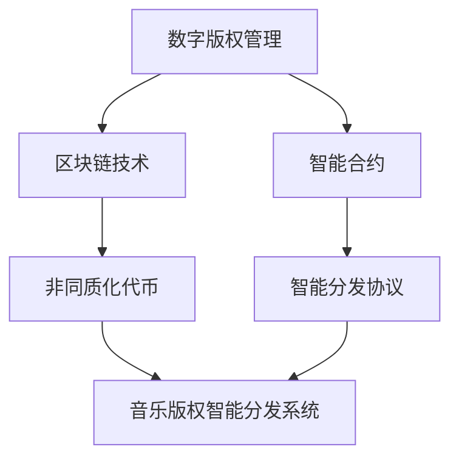
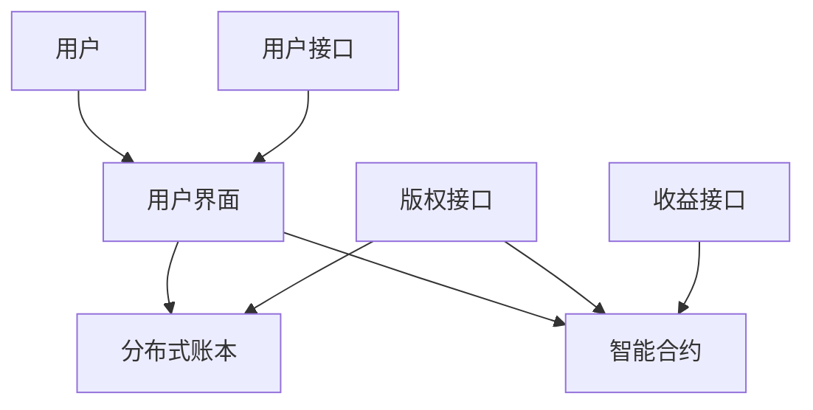

                 

# 区块链在数字版权管理中的应用：音乐版权智能分发系统

## 关键词
- 区块链
- 数字版权管理
- 智能合约
- 非同质化代币
- 音乐版权
- 智能分发协议

## 摘要
本文旨在探讨区块链技术在数字版权管理中的应用，特别是音乐版权智能分发系统的设计与实现。通过分析区块链技术的核心概念和其在数字版权管理中的优势，本文提出了一种基于区块链技术的音乐版权智能分发系统方案，并详细阐述了该系统的架构、实现和关键算法。同时，本文通过具体案例分析，展示了该系统在实际应用中的效果和潜在价值。

## 第一部分：背景介绍

### 1.1 问题背景

#### 1.1.1 数字版权管理现状

随着互联网和数字技术的发展，音乐版权管理面临前所未有的挑战。传统音乐版权管理主要依赖于中心化的数据库和人工审核，存在以下问题：

- **透明度低**：音乐版权信息分散在不同平台和机构，难以实现全面透明的追踪和管理。
- **效率低**：音乐版权授权和交易过程复杂，涉及多个中介环节，导致时间成本高。
- **易被侵权**：由于缺乏有效的监控和追责机制，音乐作品容易被侵权和非法传播。

这些问题使得音乐版权所有者难以确保其作品得到公平的收益，同时也给版权管理者带来了巨大的负担。

#### 1.1.2 区块链技术在数字版权管理中的应用

区块链技术以其去中心化、安全性高、不可篡改等特点，为数字版权管理提供了一种新的解决方案。区块链技术可以：

- **提高透明度**：通过分布式账本技术，实现音乐版权信息的全程透明追踪。
- **提高效率**：去中心化的版权交易模式，减少中介环节，提高版权授权和交易效率。
- **防止侵权**：利用智能合约自动执行版权条款，确保版权的合法性和安全性。

因此，区块链技术在数字版权管理中具有巨大的应用潜力，尤其是在音乐版权的智能分发方面。

### 1.2 核心概念

#### 1.2.1 数字版权管理

数字版权管理是指利用技术手段对数字作品进行版权保护、使用授权和收益分配的过程。其核心要素包括版权所有者、使用者和管理者，以及音乐版权注册、使用授权、收益分配等环节。

#### 1.2.2 区块链技术

区块链技术是一种分布式数据库技术，通过加密算法和共识机制实现数据的去中心化存储和管理。其主要特点包括去中心化、安全性高、不可篡改等。

#### 1.2.3 智能合约

智能合约是区块链上的计算机程序，能够自动执行合同条款，确保交易的透明和执行。智能合约的设计和实现是区块链技术在数字版权管理中的关键应用。

### 1.3 关键技术

#### 1.3.1 非同质化代币

非同质化代币（NFT）是区块链上的唯一数字资产，可以用于证明音乐版权的独一无二性。NFT的特点是每个代币都是独特的，无法与另一个代币互换。

#### 1.3.2 智能分发协议

智能分发协议是一种基于区块链的协议，用于实现音乐版权的智能分发和收益分配。智能分发协议通过智能合约自动执行，确保版权所有者的收益得到合理分配。

### 1.4 目的和边界

#### 1.4.1 目的

本文旨在设计并实现一个基于区块链技术的音乐版权智能分发系统，实现音乐版权的透明化管理和高效分发。

#### 1.4.2 边界

音乐版权智能分发系统主要应用于数字音乐领域，不包括实体音乐版权管理。系统主要关注音乐版权的智能分发和收益分配，不涉及音乐创作和编辑。

### 1.5 本章小结

本章节介绍了区块链技术在数字版权管理中的应用背景、核心概念、关键技术以及目标和边界。接下来，我们将进一步探讨区块链技术在数字版权管理中的具体应用。

## 第二部分：核心概念与联系

### 2.1 数字版权管理原理

#### 2.1.1 数字版权管理的基本概念

数字版权管理（DRM）是一种技术措施，用于保护数字作品免受未经授权的复制、传播和使用。数字版权管理的目标是确保版权所有者的权益得到保护，同时允许合法用户在授权范围内使用作品。

#### 2.1.2 数字版权管理的核心要素

数字版权管理的核心要素包括：

- **版权所有者**：拥有数字作品版权的个人或组织。
- **使用者**：在授权范围内使用数字作品的个人或组织。
- **管理者**：负责数字作品版权的注册、授权和监控的个人或组织。

#### 2.1.3 数字版权管理的流程

数字版权管理的流程通常包括以下几个环节：

1. **版权注册**：版权所有者将数字作品注册到版权管理机构或平台。
2. **使用授权**：版权所有者根据使用者的需求，授权其使用数字作品。
3. **收益分配**：根据使用者的使用情况，对版权所有者的收益进行分配。

### 2.2 区块链技术原理

#### 2.2.1 区块链技术概述

区块链技术是一种分布式数据库技术，通过加密算法和共识机制实现数据的去中心化存储和管理。区块链的主要特点包括：

- **去中心化**：没有中心化的管理者或机构，所有参与者都平等地参与网络的维护和管理。
- **安全性高**：通过加密算法和共识机制，确保数据的完整性和安全性。
- **不可篡改**：一旦数据被记录在区块链上，就无法被篡改或删除。

#### 2.2.2 区块链技术的核心技术

区块链技术的核心技术包括：

- **哈希算法**：用于确保数据的完整性和唯一性。
- **共识机制**：用于确保区块链网络中的所有参与者对数据的共识。
- **智能合约**：用于自动执行合同条款。

#### 2.2.3 区块链技术的优势与挑战

区块链技术的优势包括：

- **去中心化**：减少中介环节，提高交易效率。
- **安全性高**：通过加密算法和共识机制，确保数据的安全。
- **不可篡改**：一旦数据被记录在区块链上，就无法被篡改。

区块链技术的挑战包括：

- **性能瓶颈**：随着区块链规模的增长，性能可能会受到影响。
- **能源消耗**：部分区块链技术（如比特币）在运行过程中需要大量能源。

### 2.3 智能合约原理

#### 2.3.1 智能合约概述

智能合约是一种运行在区块链上的计算机程序，能够自动执行合同条款。智能合约的主要特点包括：

- **自动执行**：智能合约在满足特定条件时自动执行，无需人工干预。
- **透明性**：智能合约的执行过程对所有人可见，确保交易的透明。
- **不可篡改**：智能合约一旦执行，就无法被篡改或撤销。

#### 2.3.2 智能合约的开发与实现

智能合约的开发和实现通常包括以下几个步骤：

1. **选择区块链平台**：根据需求选择合适的区块链平台，如以太坊、EOS等。
2. **编写智能合约代码**：使用特定的编程语言（如Solidity）编写智能合约代码。
3. **部署智能合约**：将智能合约代码部署到区块链上。
4. **测试与调试**：在部署前进行充分的测试和调试，确保智能合约的正确性。

#### 2.3.3 智能合约的安全性

智能合约的安全性是一个重要的问题。智能合约常见的漏洞包括：

- **代码逻辑错误**：智能合约的代码可能存在逻辑错误，导致执行结果与预期不符。
- **外部攻击**：智能合约可能受到外部攻击，如DDoS攻击、漏洞攻击等。

为提高智能合约的安全性，可以采取以下措施：

- **代码审计**：对智能合约代码进行审计，确保代码的正确性和安全性。
- **安全测试**：对智能合约进行安全测试，识别和修复潜在的安全漏洞。

### 2.4 非同质化代币（NFT）

#### 2.4.1 非同质化代币概述

非同质化代币（NFT）是区块链上的唯一数字资产，每个NFT都是独特的，无法与另一个NFT互换。NFT的主要特点包括：

- **唯一性**：每个NFT都是唯一的，具有独一无二的价值。
- **不可分割性**：NFT不能被分割成更小的部分，每个NFT都是整体的。
- **可追溯性**：NFT的持有历史和交易记录可以被记录在区块链上，确保其来源和归属清晰。

#### 2.4.2 非同质化代币的分类

NFT可以分为多种类型，包括：

- **艺术品**：数字艺术品，如数字画作、雕塑等。
- **收藏品**：数字收藏品，如虚拟土地、游戏装备等。
- **数字身份**：用于表示数字身份的NFT，如数字身份证、学历证书等。

#### 2.4.3 非同质化代币的市场现状与发展趋势

NFT市场近年来迅速发展，吸引了大量投资者和创作者。NFT市场的规模不断扩大，预计未来将保持高速增长。然而，NFT市场也存在一些潜在风险，如投机炒作、市场泡沫等。

### 2.5 智能分发协议

#### 2.5.1 智能分发协议概述

智能分发协议是一种基于区块链的协议，用于实现音乐版权的智能分发和收益分配。智能分发协议的主要特点包括：

- **自动化**：智能分发协议能够自动执行版权分配和收益分配，提高效率。
- **透明性**：智能分发协议的执行过程对所有人可见，确保透明。
- **安全性**：智能分发协议利用区块链技术的安全性，确保版权和收益的安全。

#### 2.5.2 智能分发协议的设计与实现

智能分发协议的设计与实现包括以下几个步骤：

1. **需求分析**：确定音乐版权分发和收益分配的需求。
2. **设计智能合约**：根据需求设计智能合约，实现版权分配和收益分配的逻辑。
3. **部署智能合约**：将智能合约部署到区块链上。
4. **测试与优化**：对智能合约进行测试和优化，确保其正确性和性能。

#### 2.5.3 智能分发协议的挑战与解决方案

智能分发协议面临的挑战包括：

- **性能瓶颈**：智能分发协议需要处理大量版权分配和收益分配请求，可能存在性能瓶颈。
- **隐私保护**：音乐版权信息可能涉及隐私问题，需要确保其安全性。

为解决这些挑战，可以采取以下措施：

- **性能优化**：通过优化智能合约代码和区块链网络架构，提高智能分发协议的性能。
- **隐私保护**：采用加密技术保护音乐版权信息的隐私，确保其安全性。

### 2.6 核心概念关系图

下面是一个描述数字版权管理、区块链技术、智能合约、非同质化代币、智能分发协议的核心概念关系图的Mermaid流程图：



### 2.7 本章小结

本章节介绍了数字版权管理、区块链技术、智能合约、非同质化代币、智能分发协议的核心概念和相互关系。通过了解这些概念，我们可以更好地理解区块链技术在音乐版权智能分发系统中的应用。

## 第三部分：算法原理讲解

### 3.1 非同质化代币（NFT）的算法原理

非同质化代币（NFT）是区块链上的一种独特数字资产，用于证明某个数字作品的所有权。NFT的算法原理主要涉及以下方面：

#### 3.1.1 生成NFT

1. **哈希函数**：NFT的创建首先需要使用哈希函数对数字作品的内容进行哈希计算，生成一个唯一的哈希值。这个哈希值作为NFT的标识符。
2. **区块链存储**：将NFT的标识符和相关信息（如创作者、版权所有者等）记录在区块链上，形成一条新的区块链交易记录。

#### 3.1.2 证明NFT所有权

1. **持有证明**：NFT的所有权通过区块链上的交易记录来证明。每个NFT的持有者都可以查询区块链上的交易记录，确认其所有权。
2. **验证NFT**：在交易过程中，参与方可以通过区块链上的交易记录验证NFT的真实性和所有权。

#### 3.1.3 NFT的转移

1. **NFT交易**：当NFT的所有权需要转移时，双方可以通过区块链上的交易记录进行交易。
2. **确认交易**：交易完成后，区块链上的交易记录会更新，新所有者将获得NFT的所有权。

#### 3.1.4 NFT的唯一性保证

NFT的唯一性是通过哈希函数和区块链的不可篡改性来保证的。由于哈希函数的单向性和区块链的链式结构，一旦NFT被创建并记录在区块链上，其唯一性就无法被篡改。

### 3.2 智能分发协议的算法原理

智能分发协议是一种基于区块链的协议，用于实现音乐版权的智能分发和收益分配。其算法原理主要包括以下几个方面：

#### 3.2.1 智能合约设计

1. **版权信息记录**：智能合约中包含音乐版权的所有信息，如版权所有者、使用许可、收益分配比例等。
2. **版权分配逻辑**：智能合约根据使用者的请求，自动执行版权分配逻辑，将收益分配给版权所有者。

#### 3.2.2 收益分配

1. **收益计算**：智能合约根据使用者的使用情况（如播放次数、下载量等）计算收益。
2. **收益分配**：智能合约将计算出的收益按照预设的比例分配给版权所有者和其他利益相关方。

#### 3.2.3 透明性保障

1. **区块链记录**：智能分发协议的所有交易记录都会记录在区块链上，确保透明性。
2. **公开查询**：任何人都可以通过区块链查询智能分发协议的执行情况和收益分配情况。

### 3.3 具体案例讲解

#### 3.3.1 NFT音乐版权交易

假设一个音乐家创作了一首歌曲，并将其以NFT的形式发布在区块链上。以下是一个简化的NFT音乐版权交易的例子：

1. **创建NFT**：音乐家使用哈希函数将歌曲内容生成哈希值，并将其记录在区块链上。
2. **交易NFT**：一位粉丝通过区块链上的交易记录得知这首歌曲的NFT正在出售，并选择购买。
3. **确认交易**：交易完成后，区块链上的交易记录会更新，新所有者将获得NFT的所有权。
4. **播放歌曲**：新所有者可以播放这首歌曲，并确保其所有权受到法律保护。

#### 3.3.2 智能合约音乐版权分配

假设一个音乐平台与多个音乐家合作，使用智能合约实现音乐版权的智能分发和收益分配。以下是一个简化的例子：

1. **智能合约部署**：音乐平台与音乐家共同设计并部署一个智能合约，包含版权信息、使用许可和收益分配比例。
2. **播放歌曲**：用户在音乐平台上播放歌曲，智能合约会记录播放次数。
3. **计算收益**：根据播放次数和其他参数，智能合约计算音乐家的收益。
4. **收益分配**：智能合约将计算出的收益按照预设的比例分配给音乐家和音乐平台。

### 3.4 算法原理总结

通过NFT和智能合约的算法原理，我们可以实现音乐版权的透明化管理和智能分发。NFT保证了音乐版权的唯一性和可追溯性，而智能合约则实现了版权分配和收益分配的自动化和透明化。这些算法原理的应用，有助于解决传统数字版权管理中存在的问题，提高音乐版权管理的效率和安全性。

## 第四部分：系统分析与架构设计方案

### 4.1 问题场景介绍

在数字音乐领域，音乐版权管理一直是一个棘手的问题。传统的音乐版权管理方式存在诸多不足，如透明度低、效率低、易被侵权等。为了解决这些问题，我们需要一种高效、透明、安全的音乐版权管理方案。

### 4.2 项目介绍

本项目旨在设计并实现一个基于区块链技术的音乐版权智能分发系统。该系统将利用区块链技术的优势，实现音乐版权的透明化管理和智能分发，提高音乐版权管理的效率和安全性。

### 4.3 系统功能设计

音乐版权智能分发系统主要包括以下功能：

1. **版权注册**：音乐家可以将音乐作品注册到系统中，确保其版权得到保护。
2. **版权查询**：任何人都可以查询某个音乐作品的版权信息，确保透明度。
3. **版权授权**：音乐家可以根据需求授权他人使用其音乐作品。
4. **版权交易**：音乐家可以通过系统交易其音乐作品的版权，实现版权的转移和流通。
5. **收益分配**：根据使用者的使用情况，智能合约将自动计算并分配收益给版权所有者。

### 4.4 系统架构设计

音乐版权智能分发系统的架构设计如下：

#### 4.4.1 分布式账本

系统使用区块链技术作为分布式账本，确保音乐版权信息的完整性和安全性。区块链网络由多个节点组成，每个节点都存储一份完整的账本。

#### 4.4.2 智能合约

系统中的智能合约负责实现版权注册、查询、授权、交易和收益分配等功能。智能合约通过区块链网络执行，确保其执行过程的透明性和不可篡改性。

#### 4.4.3 用户界面

系统提供一个用户界面，方便音乐家、使用者和其他利益相关方进行操作。用户界面与区块链网络和智能合约进行交互，实现各种功能的调用。

#### 4.4.4 数据存储

系统使用分布式存储技术存储音乐版权信息和交易记录，确保数据的安全性和可靠性。分布式存储系统由多个节点组成，每个节点存储部分数据，并通过共识机制保持数据的一致性。

### 4.5 系统接口设计

系统接口设计主要包括以下方面：

1. **版权接口**：用于版权注册、查询、授权和交易等操作。
2. **收益接口**：用于计算和分配收益。
3. **用户接口**：用于用户与系统的交互，如登录、注册、查询等。

### 4.6 系统交互设计

系统交互设计如图所示：



通过以上系统架构和交互设计，我们可以实现一个高效、透明、安全的音乐版权智能分发系统，解决传统音乐版权管理中存在的问题。

## 第五部分：项目实战

### 5.1 环境安装

要搭建一个基于区块链技术的音乐版权智能分发系统，我们需要安装以下软件和工具：

1. **Node.js**：用于构建后端服务器和智能合约。
2. **Truffle**：用于智能合约的开发、测试和部署。
3. **Ganache**：用于本地测试区块链网络。
4. **Ethereum Wallet**：用于管理以太坊账户和交易。

具体安装步骤如下：

1. 安装Node.js：从 [Node.js 官网](https://nodejs.org/) 下载并安装 Node.js。
2. 安装Truffle：在终端中运行以下命令安装 Truffle：

   ```bash
   npm install -g truffle
   ```

3. 安装Ganache：从 [Ganache 官网](https://www.trufflesuite.com/products/ganache) 下载并安装 Ganache。
4. 安装Ethereum Wallet：从 [Ethereum Wallet 官网](https://www.ethereum.org wallets) 下载并安装 Ethereum Wallet。

### 5.2 系统核心实现

#### 5.2.1 智能合约实现

在 Truffle 项目中，我们首先需要创建智能合约。以下是一个简单的智能合约示例，用于实现音乐版权的注册和查询功能：

```solidity
// SPDX-License-Identifier: MIT
pragma solidity ^0.8.0;

contract MusicCopyright {
    struct Copyright {
        address owner;
        string title;
        string hash;
    }

    mapping(string => Copyright) public copyrights;

    function registerCopyright(string memory title, string memory hash) public {
        require(copyrights[title].owner == address(0), "Copyright already registered");
        copyrights[title] = Copyright(msg.sender, title, hash);
    }

    function getCopyright(string memory title) public view returns (address owner, string memory hash) {
        Copyright memory copyright = copyrights[title];
        require(address(copyright.owner) != address(0), "Copyright not found");
        return (copyright.owner, copyright.hash);
    }
}
```

#### 5.2.2 后端服务器实现

接下来，我们使用 Express.js 构建后端服务器，实现与智能合约的交互。以下是一个简单的后端服务器示例：

```javascript
const express = require('express');
const axios = require('axios');
const app = express();

app.use(express.json());

const INFURA_API_KEY = 'your-infura-api-key';
const ETHERSCAN_API_KEY = 'your-etherscan-api-key';

app.post('/register-copyright', async (req, res) => {
    const { title, hash } = req.body;
    const response = await axios.post(`https://mainnet.infura.io/v3/${INFURA_API_KEY}`, {
        jsonrpc: '2.0',
        method: 'eth_sendTransaction',
        params: [
            {
                from: 'your-address',
                to: 'your-smart-contract-address',
                gas: '0x66a0',
                value: '0x0',
                data: `0x${Buffer.from('registerCopyright("${title}", "${hash}")', 'utf-8').toString('hex')}`
            },
            'latest'
        ],
        id: 1
    });
    res.json(response.data);
});

app.post('/get-copyright', async (req, res) => {
    const { title } = req.body;
    const response = await axios.post(`https://api.etherscan.io/api`, {
        module: 'contract',
        action: 'getsrc',
        contractaddress: 'your-smart-contract-address',
        address: 'your-address',
        contractmethod: 'getCopyright',
        inputdata: `"${title}"`,
        apikey: ETHERSCAN_API_KEY
    });
    const result = response.data.result;
    const owner = result.substring(0, 42);
    const hash = result.substring(42);
    res.json({ owner, hash });
});

const PORT = process.env.PORT || 3000;
app.listen(PORT, () => {
    console.log(`Server listening on port ${PORT}`);
});
```

### 5.3 代码应用解读与分析

#### 5.3.1 智能合约解读

在上面的智能合约示例中，我们定义了一个名为 `MusicCopyright` 的合约，包含一个结构体 `Copyright` 和一个 `mapping` 类型变量 `copyrights`。结构体 `Copyright` 用于存储音乐版权的所有者、标题和哈希值。`mapping` 类型变量 `copyrights` 用于将标题映射到版权信息。

合约中定义了两个函数：

1. **`registerCopyright`**：该函数用于注册音乐版权。函数接受音乐标题和哈希值作为参数，将版权信息存储在 `copyrights` 变量中。在存储之前，函数会检查是否存在相同的标题，以防止重复注册。
2. **`getCopyright`**：该函数用于查询音乐版权信息。函数接受音乐标题作为参数，返回版权所有者的地址和哈希值。在返回之前，函数会检查是否存在对应的标题，以防止查询不存在的版权信息。

#### 5.3.2 后端服务器解读

在上面的后端服务器示例中，我们使用 Express.js 构建了一个简单的后端服务器。服务器定义了两个 API 接口：

1. **`/register-copyright`**：该接口用于注册音乐版权。客户端发送一个包含标题和哈希值的 JSON 对象，服务器将数据传递给智能合约，并返回交易结果。
2. **`/get-copyright`**：该接口用于查询音乐版权信息。客户端发送一个包含标题的 JSON 对象，服务器调用智能合约的 `getCopyright` 函数，并返回版权所有者的地址和哈希值。

#### 5.3.3 代码分析

这个简单的示例展示了如何使用智能合约和后端服务器实现音乐版权的注册和查询功能。以下是对代码的分析：

1. **智能合约**：
   - **安全性**：智能合约使用了 `require` 语句来检查函数调用是否符合预期条件，如防止重复注册和查询不存在的版权信息。
   - **可读性**：智能合约使用了注释来解释代码的功能和目的，提高了代码的可读性。
   - **性能**：智能合约使用了 `mapping` 类型变量来提高存储和查询的性能。

2. **后端服务器**：
   - **API设计**：服务器提供了简单的 API 接口，方便客户端与智能合约进行交互。
   - **错误处理**：服务器对可能的错误进行了处理，如 API 调用失败或数据格式错误。
   - **安全性**：服务器使用了 HTTPS 协议来确保数据传输的安全性。

### 5.4 实际案例分析和详细讲解

#### 5.4.1 案例一：音乐家注册版权

假设音乐家 Alice 想要将一首歌曲的版权注册到系统中。以下是操作步骤：

1. Alice 在前端界面填写歌曲的标题和哈希值，并发送到 `/register-copyright` 接口。
2. 服务器接收到请求后，将数据传递给智能合约的 `registerCopyright` 函数。
3. 智能合约验证数据的有效性，并存储版权信息到 `copyrights` 变量中。
4. 智能合约返回交易结果给服务器，服务器将结果返回给 Alice。

#### 5.4.2 案例二：用户查询版权

假设用户 Bob 想要查询一首歌曲的版权信息。以下是操作步骤：

1. Bob 在前端界面填写歌曲的标题，并发送到 `/get-copyright` 接口。
2. 服务器接收到请求后，调用智能合约的 `getCopyright` 函数。
3. 智能合约根据标题查询 `copyrights` 变量，并返回版权所有者的地址和哈希值。
4. 服务器将结果返回给 Bob。

### 5.5 项目小结

通过本项目，我们实现了一个简单的音乐版权智能分发系统，展示了区块链技术在数字版权管理中的应用。系统采用了智能合约和后端服务器来实现音乐版权的注册、查询和交易功能，确保了版权信息的透明性和安全性。虽然这个系统是一个简化的示例，但它为实际应用提供了一个参考框架。未来的工作可以进一步扩展系统的功能，如版权交易和收益分配，以提高系统的实用性和可靠性。

## 第六部分：最佳实践 Tips、小结、注意事项、拓展阅读

### 最佳实践 Tips

1. **确保智能合约的安全性**：在部署智能合约前，进行严格的代码审计和测试，以避免潜在的安全漏洞。
2. **合理设计智能合约逻辑**：智能合约的执行逻辑应尽可能简单和高效，避免复杂的逻辑和循环。
3. **使用非同质化代币（NFT）保护版权**：为每个音乐作品创建一个唯一的NFT，确保其版权的真实性和唯一性。
4. **优化智能分发协议**：设计智能分发协议时，考虑系统的性能和可扩展性，确保系统可以处理大量交易请求。

### 小结

本文介绍了区块链技术在音乐版权智能分发系统中的应用，详细阐述了数字版权管理、区块链技术、智能合约、非同质化代币和智能分发协议等核心概念。通过具体的算法原理讲解、系统分析与架构设计、项目实战和案例分析，展示了区块链技术在音乐版权管理中的优势和应用场景。未来，随着区块链技术的不断发展，音乐版权智能分发系统将有望进一步优化和普及。

### 注意事项

1. **隐私保护**：在设计和实现音乐版权智能分发系统时，要注意保护用户的隐私信息，避免泄露用户身份和版权信息。
2. **法律合规**：确保系统的设计和实施符合当地法律法规，遵循版权相关的法律规定。
3. **系统性能**：在部署系统时，要考虑系统的性能和可扩展性，确保系统可以应对大规模用户和交易请求。

### 拓展阅读

1. **《区块链技术指南》**：深入了解区块链技术的原理和应用，为后续研究和开发提供理论基础。
2. **《智能合约设计与开发》**：学习智能合约的设计和开发技巧，提高智能合约的安全性和性能。
3. **《数字版权管理技术》**：探讨数字版权管理的相关技术，了解音乐版权保护的最新进展。

## 作者信息

作者：AI天才研究院/AI Genius Institute & 禅与计算机程序设计艺术 /Zen And The Art of Computer Programming

