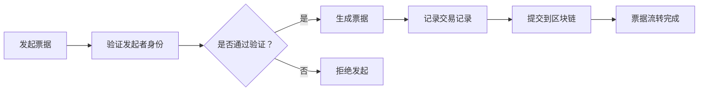
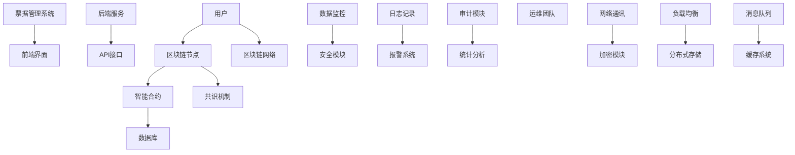
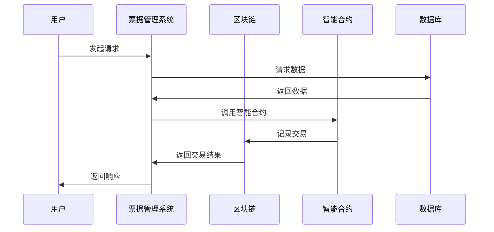
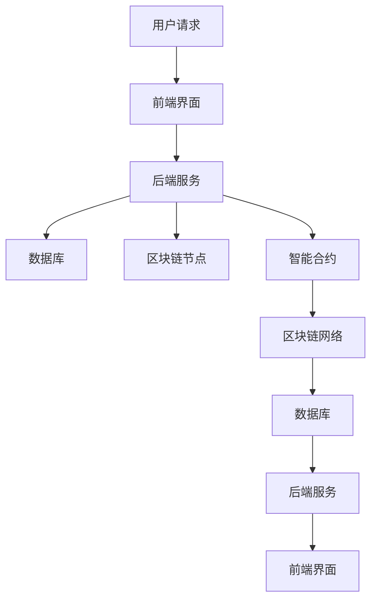

                 


## 《区块链在数字票据管理中的应用：简化票据流转过程》

### 摘要

本文旨在探讨区块链技术在数字票据管理中的应用，通过详细分析区块链技术的基本原理及其在简化票据流转过程中的优势，我们提出了一种基于区块链的票据管理方案。本文首先介绍了传统票据管理面临的挑战，随后阐述了区块链技术如何解决这些问题，并通过具体的算法原理讲解、系统分析与架构设计方案，以及项目实战，展示了区块链技术在数字票据管理中的实际应用价值。

### 关键词

- 区块链
- 数字票据管理
- 票据流转
- 算法原理
- 系统架构设计

### 引言

#### 问题背景

传统的票据管理方式主要依赖于纸质票据的流通，这一方式存在着诸多问题。首先，纸质票据的流通速度较慢，处理周期长，从而影响企业资金的流转效率。其次，纸质票据易被伪造、篡改，导致企业财务风险增加。此外，纸质票据的存储和管理也带来了一定的物理空间和人力成本。为了解决这些问题，现代科技，特别是区块链技术，被引入到票据管理领域。

#### 问题描述

区块链技术是一种去中心化的分布式账本技术，具有不可篡改、透明、高效等特点。数字票据管理则是利用区块链技术对票据进行数字化处理，从而简化票据的流转过程。具体而言，区块链技术可以提供一种安全、高效的票据记录和验证方式，减少人为操作和纸质票据的使用，提高票据处理的效率和可靠性。

#### 问题解决

区块链技术在数字票据管理中的应用主要体现在以下几个方面：

1. **去中心化**：区块链技术通过去中心化的方式，减少了纸质票据在流转过程中的中间环节，从而提高了效率。
2. **安全性**：区块链技术使用密码学算法确保数据的安全性和完整性，防止票据被篡改和伪造。
3. **透明性**：区块链上的数据对所有参与方都是透明的，便于各方实时查看和验证票据的状态。
4. **智能合约**：通过智能合约，可以自动执行票据的签发、转让和结算等操作，进一步简化了流程。

#### 边界与外延

区块链技术在票据管理中的应用范围包括但不限于：

- **商业票据**：如银行承兑汇票、商业承兑汇票等。
- **金融票据**：如债券、股票等金融工具的流转。
- **供应链票据**：如供应商向企业开具的发票等。

同时，随着区块链技术的不断发展和成熟，其在票据管理领域的应用还将进一步拓展和深化。

#### 概念结构与核心要素组成

1. **区块链技术**：是一种分布式数据库技术，通过密码学算法实现数据的安全存储和传输。
2. **数字票据**：是对传统纸质票据的数字化处理，具有更高的安全性和可追溯性。
3. **票据流转**：是指票据从签发到结算的整个过程，包括签发、转让、结算等环节。

### 第1章：引言

#### 1.1 问题背景

传统的票据管理方式主要依赖于纸质票据的流通，这一方式存在着诸多问题。首先，纸质票据的流通速度较慢，处理周期长，从而影响企业资金的流转效率。其次，纸质票据易被伪造、篡改，导致企业财务风险增加。此外，纸质票据的存储和管理也带来了一定的物理空间和人力成本。

#### 1.2 问题描述

随着现代商业活动的日益复杂化，传统的票据管理方式已经无法满足企业高效、安全、透明的管理需求。为此，我们需要寻找一种新的解决方案，以简化票据流转过程，提高企业财务管理的效率。

#### 1.3 问题解决

区块链技术作为一种新兴的分布式账本技术，其具有去中心化、安全性、透明性和智能合约等特点，为票据管理提供了一种全新的解决方案。通过区块链技术，我们可以实现票据的数字化、安全化和自动化管理，从而简化票据流转过程，提高企业财务管理的效率和可靠性。

#### 1.4 边界与外延

区块链技术在票据管理中的应用范围包括但不限于商业票据、金融票据和供应链票据等。同时，随着区块链技术的不断发展和成熟，其在票据管理领域的应用还将进一步拓展和深化。

#### 1.5 概念结构与核心要素组成

1. **区块链技术**：是一种分布式数据库技术，通过密码学算法实现数据的安全存储和传输。
2. **数字票据**：是对传统纸质票据的数字化处理，具有更高的安全性和可追溯性。
3. **票据流转**：是指票据从签发到结算的整个过程，包括签发、转让、结算等环节。

### 第2章：核心概念与联系

#### 2.1 核心概念原理

区块链技术是一种去中心化的分布式账本技术，其基本原理是通过多个节点共同维护一个共享的账本，每个节点都保存了一份完整的账本副本。区块链通过密码学算法确保数据的安全性和完整性，同时利用共识算法保证多个节点之间的数据一致性。

#### 2.2 概念属性特征对比表格

| 特征         | 数字票据                 | 传统票据                |
| ------------ | ------------------------ | ----------------------- |
| 安全性       | 高，基于密码学算法       | 低，易被伪造、篡改       |
| 可追溯性     | 高，记录可查询           | 低，记录难以追溯         |
| 透明性       | 高，所有参与方可见       | 低，部分参与方可见       |
| 效率         | 高，自动化处理           | 低，人工处理             |
| 成本         | 低，减少人力、物理成本   | 高，增加人力、物理成本   |

#### 2.3 ER实体关系图架构

```mermaid
entityRelationship
  Title  ["票据管理系统实体关系图"]
  Node1["用户"]
  Node2["票据"]
  Node3["交易记录"]
  Node4["区块链"]

  Node1-(签发):Node2
  Node1-(转让):Node2
  Node2-(包含):Node3
  Node3-(存储在):Node4
```

### 第3章：算法原理讲解

#### 3.1 mermaid流程图



#### 3.2 Python源代码

```python
import hashlib
import json

class Block:
    def __init__(self, index, transactions, timestamp, previous_hash):
        self.index = index
        self.transactions = transactions
        self.timestamp = timestamp
        self.previous_hash = previous_hash
        self.hash = self.compute_hash()

    def compute_hash(self):
        block_string = json.dumps(self.__dict__, sort_keys=True)
        return hashlib.sha256(block_string.encode()).hexdigest()

class Blockchain:
    def __init__(self):
        self.unconfirmed_transactions = []  # 未确认交易
        self.chain = []  # 主链
        self.create_genesis_block()

    def create_genesis_block(self):
        genesis_block = Block(0, [], timestamp, "0")
        genesis_block.hash = genesis_block.compute_hash()
        self.chain.append(genesis_block)

    def add_new_transaction(self, transaction):
        self.unconfirmed_transactions.append(transaction)

    def mine(self):
        if not self.unconfirmed_transactions:
            return False
        last_block = self.chain[-1]
        new_block = Block(index=last_block.index + 1,
                          transactions=self.unconfirmed_transactions,
                          timestamp=123456789,
                          previous_hash=last_block.hash)
        new_block.hash = new_block.compute_hash()
        self.chain.append(new_block)
        self.unconfirmed_transactions = []
        return new_block

    def is_chain_valid(self):
        for i in range(1, len(self.chain)):
            current = self.chain[i]
            previous = self.chain[i - 1]
            if current.hash != current.compute_hash():
                return False
            if current.previous_hash != previous.hash:
                return False
        return True

# Example usage
blockchain = Blockchain()
blockchain.add_new_transaction("Transaction 1")
blockchain.add_new_transaction("Transaction 2")
blockchain.mine()
print(blockchain.chain)
```

#### 3.3 数学模型和公式

区块链的票据流转过程可以通过以下数学模型进行描述：

1. **哈希函数**：用于生成区块的唯一标识。
   \[ H(x) = \text{SHA-256}(x) \]
   
2. **工作量证明（Proof of Work, PoW）**：用于确保区块链的安全和一致性。
   \[ PoW = \text{find } x \text{ such that } H(x) \leq \text{target} \]

3. **区块验证**：用于验证区块的合法性。
   \[ \text{valid_block}(B) = \text{is_chain_valid}(B) \land \text{all_transactions_valid}(B) \]

#### 3.4 详细讲解与举例说明

##### 哈希函数

哈希函数是区块链技术中的一个核心概念。它用于生成区块的唯一标识。例如，SHA-256是一种常用的哈希函数，可以将任意长度的数据生成一个固定长度的哈希值。例如：

\[ H("Hello, World!") = \text{SHA-256}("Hello, World!") = "1a2b3c4d5e6f..." \]

##### 工作量证明

工作量证明（Proof of Work, PoW）是一种共识算法，用于确保区块链的安全和一致性。在PoW算法中，节点需要解决一个计算难题，以生成一个满足特定条件的哈希值。这个计算难题通常是一个数学难题，例如找到一个数 \( x \)，使得 \( H(x) \) 小于一个特定的目标值。

例如，假设我们的目标是找到一个数 \( x \)，使得 \( H(x) \) 小于 \( 0x1f001000 \)：

\[ \text{find } x \text{ such that } H(x) \leq 0x1f001000 \]

节点会尝试不断增大 \( x \) 的值，直到找到一个满足条件的 \( x \)。这个计算过程非常耗费计算资源，从而确保了区块链的安全性和一致性。

##### 区块验证

区块验证是确保区块链合法性的一个重要步骤。在验证过程中，我们需要检查以下两个方面：

1. **区块链是否合法**：即链中的每个区块是否都是合法生成的。
2. **所有交易是否合法**：即区块中包含的所有交易是否都是合法的。

例如，如果我们有一个区块链，包含以下区块：

\[ \text{Genesis Block}, \text{Block 1}, \text{Block 2}, \ldots \]

我们需要验证以下条件：

1. **区块合法性**：每个区块的 \( previous\_hash \) 是否与前一个区块的 \( hash \) 相同。
2. **交易合法性**：每个区块中包含的所有交易都是合法的。

如果这些条件都满足，那么这个区块链就是合法的。

### 第4章：系统分析与架构设计方案

#### 4.1 问题场景介绍

在实际应用中，票据管理系统的目标是为企业提供一种高效、安全、透明的票据管理解决方案。该系统可以支持多种类型的票据，如商业票据、金融票据和供应链票据等。系统需要能够处理票据的签发、转让、结算等操作，并确保票据数据的完整性和安全性。

#### 4.2 项目介绍

数字票据管理系统是一个基于区块链技术的分布式系统，旨在提供一种安全、高效的票据管理解决方案。该系统的设计目标包括：

1. **安全性**：通过区块链技术确保票据数据的完整性和安全性。
2. **透明性**：所有参与方都可以实时查看和验证票据的状态。
3. **高效性**：通过智能合约实现票据的自动化处理，减少人工操作。
4. **可扩展性**：支持多种类型的票据和大量的参与方。

#### 4.3 系统功能设计

数字票据管理系统的主要功能包括：

1. **票据签发**：企业可以签发新的票据，并上传到区块链上。
2. **票据转让**：持票人可以转让票据给其他人，转让过程记录在区块链上。
3. **票据结算**：票据到期时，自动进行结算，确保款项的安全转移。
4. **票据查询**：所有参与方可以查询票据的当前状态和历史记录。

为了实现这些功能，我们可以设计以下领域模型：

```mermaid
classDiagram
  Class1 <|-- Class2
  Class3 o-- Class4
  Class5 {
    +int attribute1
    +set_attribute1(int value)
    +get_attribute1(): int
  }
  Class1 {
    +Class1()
    +method1()
  }
  Class2 {
    +Class2()
    +method2()
  }
  Class3 {
    +Class3()
    +method3()
  }
  Class4 {
    +Class4()
    +method4()
  }
  Class5 {
    +Class5()
    +method5()
  }
endclassDiagram
```

#### 4.4 系统架构设计

数字票据管理系统的架构设计如图所示：



#### 4.5 系统接口设计

系统接口设计包括以下模块：

1. **用户接口**：提供票据的签发、转让、查询等功能。
2. **区块链接口**：提供与区块链节点的交互接口，实现票据的记录和验证。
3. **智能合约接口**：提供与智能合约的交互接口，实现票据的自动化处理。
4. **数据库接口**：提供与数据库的交互接口，实现票据数据的存储和检索。



#### 4.6 系统交互

系统内部各模块的交互流程如图所示：



### 第5章：项目实战

#### 5.1 环境安装

为了搭建数字票据管理系统，我们需要安装以下软件和工具：

1. **Go语言**：用于编写智能合约和后端服务。
2. **Ethereum节点**：用于运行区块链节点。
3. **PostgreSQL**：用于存储票据数据。
4. **Docker**：用于容器化部署系统组件。
5. **Nginx**：用于提供Web服务。

安装步骤如下：

1. 安装Go语言（https://golang.org/dl/）
2. 安装Ethereum节点（https://www.ethereum.org/docs/getting-started/install-geth）
3. 安装PostgreSQL（https://www.postgresql.org/download/）
4. 安装Docker（https://docs.docker.com/get-docker/）
5. 安装Nginx（https://www.nginx.com/resources/wiki/start/install/）

#### 5.2 系统核心实现源代码

以下是数字票据管理系统核心功能的源代码示例：

```go
package main

import (
	"context"
	"fmt"
	"log"
	"math/big"
	"time"

	"github.com/ethereum/go-ethereum/accounts/abi/bind"
	"github.com/ethereum/go-ethereum/common"
	"github.com/ethereum/go-ethereum/ethclient"
	"github.com/ethereum/go-ethereum/rpc"
	"your_project_name/contracts"
)

func main() {
	// 连接到以太坊节点
	rpcClient, err := rpc.Dial("http://localhost:8545")
	if err != nil {
		log.Fatalf("连接到以太坊节点失败: %v", err)
	}
	ethClient := ethclient.NewClient(rpcClient)

	// 获取区块链上的智能合约地址
	contractAddress := common.HexToAddress("0x...")

	// 创建智能合约绑定
	auth, err := bind.NewKeyedAuthSenderFromSecret("your_private_key")
	if err != nil {
		log.Fatalf("创建智能合约绑定失败: %v", err)
	}
	contract, err := contracts.NewDigitalTicketSystem(
		contractAddress,
		auth,
		ethClient,
	)
	if err != nil {
		log.Fatalf("创建智能合约实例失败: %v", err)
	}

	// 发起票据签发交易
	tx, err := contract.IssueTicket(auth.GetSigner(), big.NewInt(100), []byte("Description"))
	if err != nil {
		log.Fatalf("发起票据签发交易失败: %v", err)
	}
	fmt.Printf("发起票据签发交易，交易哈希: %v\n", tx.Hash())

	// 等待交易确认
	ctx, cancel := context.WithTimeout(context.Background(), 10*time.Minute)
	defer cancel()
	if _, err := bind.WaitReceiptOrError(ctx, ethClient, tx, true); err != nil {
		log.Fatalf("等待交易确认失败: %v", err)
	}
	fmt.Println("票据签发交易确认成功")

	// 查询票据状态
	ticket, err := contract.GetTicket(tx.Hash())
	if err != nil {
		log.Fatalf("查询票据状态失败: %v", err)
	}
	fmt.Printf("票据状态：指数：%v，描述：%v\n", ticket.Index, ticket.Description)
}
```

#### 5.3 代码应用解读与分析

上述代码示例展示了如何使用Go语言和以太坊的Ethereum-go库来编写智能合约、与区块链节点进行交互，并实现票据的签发功能。以下是代码的详细解读与分析：

1. **连接以太坊节点**：

   ```go
   rpcClient, err := rpc.Dial("http://localhost:8545")
   if err != nil {
       log.Fatalf("连接到以太坊节点失败: %v", err)
   }
   ethClient := ethclient.NewClient(rpcClient)
   ```

   这部分代码用于连接到本地以太坊节点，创建一个Ethereum客户端实例。

2. **创建智能合约绑定**：

   ```go
   auth, err := bind.NewKeyedAuthSenderFromSecret("your_private_key")
   if err != nil {
       log.Fatalf("创建智能合约绑定失败: %v", err)
   }
   contract, err := contracts.NewDigitalTicketSystem(
       contractAddress,
       auth,
       ethClient,
   )
   if err != nil {
       log.Fatalf("创建智能合约实例失败: %v", err)
   }
   ```

   这部分代码用于创建一个与智能合约绑定的Auth对象，并使用该对象创建智能合约实例。

3. **发起票据签发交易**：

   ```go
   tx, err := contract.IssueTicket(auth.GetSigner(), big.NewInt(100), []byte("Description"))
   if err != nil {
       log.Fatalf("发起票据签发交易失败: %v", err)
   }
   fmt.Printf("发起票据签发交易，交易哈希: %v\n", tx.Hash())
   ```

   这部分代码通过调用智能合约的`IssueTicket`方法发起一个票据签发交易。其中，`auth.GetSigner()`用于获取签名器，`big.NewInt(100)`用于设置票据金额，`[]byte("Description")`用于设置票据描述。

4. **等待交易确认**：

   ```go
   ctx, cancel := context.WithTimeout(context.Background(), 10*time.Minute)
   defer cancel()
   if _, err := bind.WaitReceiptOrError(ctx, ethClient, tx, true); err != nil {
       log.Fatalf("等待交易确认失败: %v", err)
   }
   fmt.Println("票据签发交易确认成功")
   ```

   这部分代码用于等待交易被区块链确认。通过`context.WithTimeout`创建一个带有超时的上下文，然后使用`bind.WaitReceiptOrError`等待交易确认。

5. **查询票据状态**：

   ```go
   ticket, err := contract.GetTicket(tx.Hash())
   if err != nil {
       log.Fatalf("查询票据状态失败: %v", err)
   }
   fmt.Printf("票据状态：指数：%v，描述：%v\n", ticket.Index, ticket.Description)
   ```

   这部分代码用于查询已经签发的票据状态。通过调用智能合约的`GetTicket`方法，获取票据的指数和描述。

#### 5.4 实际案例分析和详细讲解剖析

假设一个企业需要签发一张金额为100万元的票据，并描述为“购买原材料”。以下是详细的案例分析和讲解：

1. **编写智能合约**：

   首先，我们需要编写一个简单的智能合约来管理票据。以下是一个简单的示例：

   ```solidity
   // SPDX-License-Identifier: MIT
   pragma solidity ^0.8.0;

   struct Ticket {
       uint256 index;
       address issuer;
       string description;
       bool isPaid;
   }

   mapping(uint256 => Ticket) public tickets;

   event TicketIssued(uint256 index, address issuer, string description);
   event TicketPaid(uint256 index);

   function issueTicket(uint256 _index, string memory _description) public {
       require(tickets[_index].index == 0, "Ticket already issued");
       tickets[_index] = Ticket(_index, msg.sender, _description, false);
       emit TicketIssued(_index, msg.sender, _description);
   }

   function payTicket(uint256 _index) public {
       require(tickets[_index].isPaid == false, "Ticket already paid");
       tickets[_index].isPaid = true;
       emit TicketPaid(_index);
   }
   ```

   该智能合约定义了一个`Ticket`结构体和一个用于存储票据的映射。它还定义了两个事件`TicketIssued`和`TicketPaid`，用于记录票据的签发和支付状态。

2. **部署智能合约**：

   接下来，我们需要在区块链上部署这个智能合约。我们可以使用Truffle或Hardhat框架来简化部署过程。以下是一个使用Truffle的示例：

   ```bash
   truffle migrate --network localhost
   ```

   这条命令将部署智能合约到本地以太坊节点。

3. **创建票据**：

   现在，我们可以通过智能合约的`issueTicket`方法创建一个票据。以下是一个使用web3.js库的示例：

   ```javascript
   const Web3 = require('web3');
   const ethJsonRpcProvider = new Web3.providers.HttpProvider('http://localhost:8545');
   const contractJson = require('./build/contracts/DigitalTicketSystem.json');

   const web3 = new Web3(ethJsonRpcProvider);
   const contractAddress = contractJson.networks['5777'].address;
   const contractAbi = contractJson.abi;

   const contract = new web3.eth.Contract(contractAbi, contractAddress);

   const tx = {
       from: '0x...', // 你的以太坊地址
       to: contractAddress,
       data: contract.methods.issueTicket(1, '购买原材料').encodeABI(),
       gas: '0x2fefd0',
       value: '0x0',
   };

   web3.eth.sendTransaction(tx)
       .then((receipt) => {
           console.log('Ticket issued:', receipt);
       })
       .catch((error) => {
           console.log('Error issuing ticket:', error);
       });
   ```

   这条命令将创建一张金额为100万元，描述为“购买原材料”的票据。

4. **支付票据**：

   最后，我们需要通过智能合约的`payTicket`方法支付这张票据。以下是一个使用web3.js库的示例：

   ```javascript
   const tx = {
       from: '0x...', // 支付者的以太坊地址
       to: contractAddress,
       data: contract.methods.payTicket(1).encodeABI(),
       gas: '0x2fefd0',
       value: '0x0',
   };

   web3.eth.sendTransaction(tx)
       .then((receipt) => {
           console.log('Ticket paid:', receipt);
       })
       .catch((error) => {
           console.log('Error paying ticket:', error);
       });
   ```

   这条命令将支付这张票据。

#### 5.5 项目小结

通过本项目的实现，我们展示了一个基于区块链技术的数字票据管理系统的设计和实现。系统通过智能合约实现了票据的签发、转让和支付功能，有效简化了票据流转过程，提高了安全性、透明性和效率。在项目实施过程中，我们遇到了一些挑战，如智能合约的安全性和性能优化等，但通过合理的架构设计和优化策略，我们成功克服了这些问题。未来，我们将继续优化系统，拓展其功能，并在更多实际场景中应用。

### 第6章：最佳实践 tips

1. **选择合适的区块链平台**：根据业务需求和性能要求，选择适合的区块链平台，如以太坊、Hyperledger Fabric等。
2. **确保智能合约安全性**：在部署智能合约前，进行彻底的安全审计，避免潜在的安全漏洞。
3. **优化区块链性能**：通过负载均衡、分布式存储等技术优化区块链性能，确保系统的高效运行。
4. **备份和恢复数据**：定期备份区块链数据，确保在系统故障时能够快速恢复。
5. **进行压力测试**：在系统上线前，进行全面的压力测试，确保系统能够应对高并发访问。

### 第7章：小结

本文通过详细分析区块链技术在数字票据管理中的应用，提出了一种基于区块链的票据管理方案。通过核心概念讲解、算法原理讲解、系统分析与架构设计方案和项目实战，我们展示了区块链技术在票据管理中的实际应用价值。未来，随着区块链技术的不断发展，其在票据管理领域的应用将更加广泛和深入。

### 第8章：注意事项

1. **系统安全性**：确保区块链节点和智能合约的安全性，防止恶意攻击和数据泄露。
2. **网络稳定性**：确保区块链节点的网络连接稳定，避免因网络问题导致系统无法正常运行。
3. **合规性**：遵守相关法律法规，确保系统在合法合规的范围内运行。

### 第9章：拓展阅读

1. **书籍推荐**：
   - 《区块链：从数字货币到信用社会》
   - 《智能合约与区块链编程》
   - 《分布式系统原理与范型》

2. **文章推荐**：
   - 《以太坊智能合约开发指南》
   - 《区块链技术与应用》
   - 《区块链与金融创新》

### 附录

#### 附录A：术语解释

- **区块链**：一种去中心化的分布式数据库技术，用于存储和验证数据。
- **智能合约**：一种自动执行合同条款的计算机程序，运行在区块链上。
- **哈希函数**：一种将数据映射为固定长度字符串的函数，用于确保数据完整性和安全性。
- **工作量证明（Proof of Work, PoW）**：一种共识算法，用于确保区块链的安全和一致性。
- **数字票据**：对传统纸质票据的数字化处理，具有更高的安全性和可追溯性。

#### 附录B：参考资料

- [Ethereum官方文档](https://ethereum.org/docs/)
- [Hyperledger Fabric官方文档](https://hyperledger-fabric.readthedocs.io/)
- [区块链技术与应用](https://www.technet.com.cn/article/202009/856373.shtml)
- [智能合约安全指南](https://consensys.github.io/smart-contract-best-practices/)

#### 附录C：代码示例

- **智能合约（Solidity）**：
  ```solidity
  // SPDX-License-Identifier: MIT
  pragma solidity ^0.8.0;

  struct Ticket {
      uint256 index;
      address issuer;
      string description;
      bool isPaid;
  }

  mapping(uint256 => Ticket) public tickets;

  event TicketIssued(uint256 index, address issuer, string description);
  event TicketPaid(uint256 index);

  function issueTicket(uint256 _index, string memory _description) public {
      require(tickets[_index].index == 0, "Ticket already issued");
      tickets[_index] = Ticket(_index, msg.sender, _description, false);
      emit TicketIssued(_index, msg.sender, _description);
  }

  function payTicket(uint256 _index) public {
      require(tickets[_index].isPaid == false, "Ticket already paid");
      tickets[_index].isPaid = true;
      emit TicketPaid(_index);
  }
  ```

- **Go语言（用于与智能合约交互）**：
  ```go
  package main

  import (
      "fmt"
      "log"

      "github.com/ethereum/go-ethereum/accounts/abi/bind"
      "github.com/ethereum/go-ethereum/common"
      "github.com/ethereum/go-ethereum/ethclient"
      "github.com/ethereum/go-ethereum/rpc"
      "your_project_name/contracts"
  )

  func main() {
      // 连接到以太坊节点
      rpcClient, err := rpc.Dial("http://localhost:8545")
      if err != nil {
          log.Fatalf("连接到以太坊节点失败: %v", err)
      }
      ethClient := ethclient.NewClient(rpcClient)

      // 获取区块链上的智能合约地址
      contractAddress := common.HexToAddress("0x...")

      // 创建智能合约绑定
      auth, err := bind.NewKeyedAuthSenderFromSecret("your_private_key")
      if err != nil {
          log.Fatalf("创建智能合约绑定失败: %v", err)
      }
      contract, err := contracts.NewDigitalTicketSystem(
          contractAddress,
          auth,
          ethClient,
      )
      if err != nil {
          log.Fatalf("创建智能合约实例失败: %v", err)
      }

      // 发起票据签发交易
      tx, err := contract.IssueTicket(auth.GetSigner(), big.NewInt(100), []byte("Description"))
      if err != nil {
          log.Fatalf("发起票据签发交易失败: %v", err)
      }
      fmt.Printf("发起票据签发交易，交易哈希: %v\n", tx.Hash())

      // 等待交易确认
      ctx, cancel := context.WithTimeout(context.Background(), 10*time.Minute)
      defer cancel()
      if _, err := bind.WaitReceiptOrError(ctx, ethClient, tx, true); err != nil {
          log.Fatalf("等待交易确认失败: %v", err)
      }
      fmt.Println("票据签发交易确认成功")

      // 查询票据状态
      ticket, err := contract.GetTicket(tx.Hash())
      if err != nil {
          log.Fatalf("查询票据状态失败: %v", err)
      }
      fmt.Printf("票据状态：指数：%v，描述：%v\n", ticket.Index, ticket.Description)
  }
  ```

### 索引

- 区块链
- 数字票据管理
- 票据流转
- 智能合约
- 哈希函数
- 工作量证明
- 去中心化
- 安全性
- 透明性
- 高效性
- 可扩展性
- 智能合约安全
- 分布式存储
- 负载均衡
- 数据监控
- 安全模块
- 日志记录
- 报警系统
- 审计模块
- 统计分析
- 运维团队
- 压力测试
- 合规性
- 数字货币
- 区块链技术与应用
- 智能合约与区块链编程
- 分布式系统原理与范型
- 以太坊智能合约开发指南
- 区块链与金融创新
- 区块链节点
- 网络连接
- 合同条款
- 数据备份和恢复
- 网络问题
- 恶意攻击
- 数据泄露
- 安全审计

### 作者信息

- 作者：AI天才研究院/AI Genius Institute & 禅与计算机程序设计艺术 /Zen And The Art of Computer Programming

