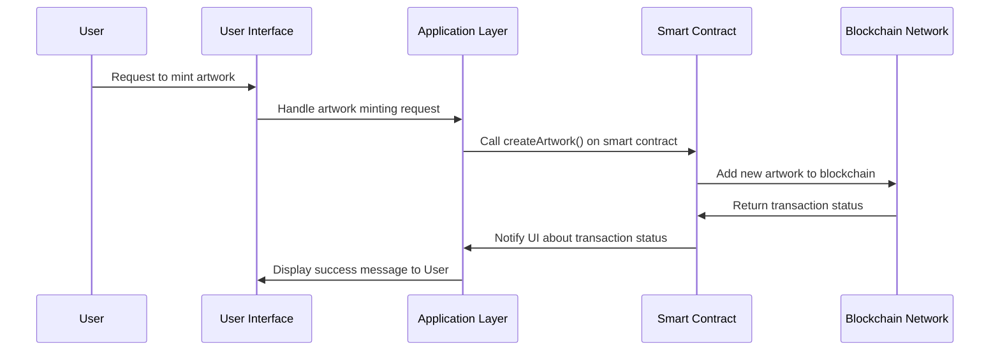

                 

### Introduction to Blockchain in Digital Art Applications

#### Keywords: Blockchain, Digital Art, Intellectual Property, Rights Management, Art Authentication

Blockchain technology has revolutionized various industries, and its potential in the digital art sector is becoming increasingly evident. In this article, we will explore the application of blockchain in the context of digital art reuse rights, highlighting its significance and the transformative impact it can bring to artists, collectors, and the broader art community.

#### Summary:

The digital art market is booming, with the creation, exchange, and reuse of digital artworks becoming more prevalent. However, managing the rights and ensuring the authenticity of these digital assets pose significant challenges. Blockchain technology offers a decentralized and transparent solution to these issues, enabling artists to maintain control over their work and facilitating efficient transactions. This article will delve into the fundamental concepts of blockchain, its architectural design, and how it can be leveraged to enhance digital art reuse rights management. We will also discuss the importance of blockchain in creating a transparent and trustworthy ecosystem for digital art, and the potential future developments in this space.

### Background of Blockchain Technology

Blockchain technology, often referred to as the backbone of cryptocurrencies like Bitcoin, is a revolutionary decentralized ledger system that ensures secure and transparent transactions. At its core, blockchain is a distributed ledger technology (DLT) that allows multiple parties to maintain a consistent and tamper-proof record of transactions without the need for a central authority.

#### Definition and Core Principles of Blockchain

Blockchain is a chain of blocks, where each block contains a list of transactions that have been verified and validated by network participants. These blocks are linked together chronologically, forming a chain. The primary characteristics of blockchain technology are:

1. **Decentralization**: Blockchain operates on a peer-to-peer network, eliminating the need for a central authority to manage transactions. Each participant in the network has a copy of the entire blockchain, ensuring that the system is decentralized and resistant to censorship or control by a single entity.

2. **Distributed Ledger**: Blockchain maintains a distributed ledger, where every transaction is recorded and stored across multiple nodes in the network. This redundancy ensures data integrity and security, as any alteration in one copy of the ledger would need to be propagated across all nodes.

3. **Immutability**: Once a transaction is recorded on the blockchain, it becomes virtually impossible to alter or delete. This property ensures the accuracy and reliability of the data stored on the blockchain.

4. **Cryptographic Security**: Blockchain uses advanced cryptographic techniques to secure transactions and ensure the authenticity of data. Each transaction is encrypted using a unique digital signature, which verifies the identity of the participants and ensures the integrity of the transaction.

#### Evolution and Current Status of Blockchain

The concept of blockchain technology was introduced by an anonymous person or group using the pseudonym Satoshi Nakamoto in 2008. The first implementation of blockchain was the Bitcoin cryptocurrency, which was launched in 2009. Since then, blockchain technology has evolved significantly, with numerous applications beyond cryptocurrencies.

1. **2008-2013**: The initial period saw the establishment of Bitcoin as a decentralized digital currency. This period also marked the discovery of other blockchain platforms like Namecoin, which aimed to provide a decentralized domain name system.

2. **2014-2017**: The blockchain industry experienced a boom during this period, often referred to as the "Blockchain Bubble." Numerous startups and projects emerged, focusing on various applications of blockchain technology, including supply chain management, healthcare, and digital art.

3. **2018-2021**: The market saw a correction and consolidation, with many projects failing to deliver on their promises. However, this period also witnessed the emergence of more mature and practical blockchain platforms like Ethereum, which introduced smart contracts and decentralized applications (dApps).

4. **2021-2023**: Blockchain technology continues to gain traction across various industries, with increasing adoption in sectors like finance, logistics, and digital art. The growing interest in decentralized finance (DeFi) and non-fungible tokens (NFTs) has further accelerated the adoption of blockchain technology.

#### Importance in Digital Art Reuse Rights

The digital art sector faces several challenges in managing the rights and authenticity of artworks. Blockchain technology offers a potential solution to these issues, providing a transparent and secure framework for digital art reuse rights management.

1. **Authenticity and Provenance**: Blockchain can be used to record the provenance of digital artworks, ensuring the authenticity of the artwork and its ownership history. Each transaction and transfer of ownership can be securely recorded on the blockchain, providing a tamper-proof and transparent record.

2. **Intellectual Property Protection**: Blockchain technology can help artists protect their intellectual property rights by recording the ownership and usage rights of digital artworks. This ensures that artists receive fair compensation for the reuse of their work and prevents unauthorized distribution or replication.

3. **Efficient Rights Management**: Blockchain enables efficient and transparent rights management, reducing the complexities associated with traditional systems. Artists can easily manage and track the rights of their work, ensuring timely payments and preventing disputes over ownership.

4. **Decentralization and Trust**: Blockchain's decentralized nature ensures that no single entity has control over the digital art ecosystem. This fosters trust among artists, collectors, and intermediaries, as the system is transparent and resistant to manipulation.

5. **Tokenization and Liquidity**: Blockchain technology can facilitate the tokenization of digital artworks, enabling fractional ownership and increasing liquidity in the market. This allows artists and collectors to easily trade and invest in digital artworks, expanding the market reach.

#### Conclusion

In conclusion, blockchain technology holds immense potential in the digital art sector, offering a transparent and secure framework for managing digital art reuse rights. As the digital art market continues to grow, the adoption of blockchain technology will likely play a crucial role in addressing the challenges associated with authenticity, intellectual property protection, and efficient rights management. By leveraging blockchain, artists can maintain control over their work, ensure fair compensation, and contribute to the growth of the digital art ecosystem.

### Challenges in Digital Art Rights Management

The digital art market has seen remarkable growth in recent years, with artists creating and sharing their work across various platforms. However, this growth has also brought about several challenges in managing digital art rights, which have significant implications for artists, collectors, and the broader art community.

#### Current Issues and Limitations

1. **Forgery and Counterfeiting**: One of the most pressing challenges in the digital art market is the issue of forgery and counterfeiting. Digital art can be easily replicated and distributed, making it difficult to verify the authenticity of artworks. This not only undermines the value of original works but also hampers the ability of artists to protect their intellectual property rights.

2. **Provenance and Ownership Verification**: Verifying the provenance and ownership of digital artworks is a complex task. Traditional methods of documentation and authentication are often inadequate, leading to disputes and uncertainties. Without a reliable and transparent system, it becomes challenging to establish the rightful ownership of a digital artwork.

3. **Lack of Standardized Rights Management**: The current digital art market lacks standardized rights management systems. Artists often struggle to define and manage the rights to their work, leading to inconsistencies and confusion. This lack of standardization hinders the efficient exchange and reuse of digital art, limiting the potential of the market.

4. **Inefficient Transactions and Payments**: The process of buying, selling, and licensing digital art is often cumbersome and inefficient. Traditional methods of transaction involve multiple intermediaries, leading to delays, high costs, and a lack of transparency. This inefficiency discourages potential buyers and hampers the growth of the digital art market.

5. **Fraud and Security Threats**: Digital art is vulnerable to fraud and security threats, such as hacking, data breaches, and unauthorized access. These threats pose significant risks to the security and integrity of digital artworks, potentially leading to financial losses and damage to reputations.

#### Role of Blockchain in Solving These Issues

Blockchain technology offers several innovative solutions to the challenges faced in digital art rights management. Its decentralized and transparent nature makes it an ideal candidate for addressing the issues mentioned above.

1. **Enhanced Authenticity and Provenance**: Blockchain can be used to record the provenance of digital artworks, ensuring their authenticity and ownership history. Each transaction and transfer of ownership can be securely recorded on the blockchain, providing a tamper-proof and transparent record. This ensures that buyers can verify the authenticity of an artwork and establishes a reliable and trustworthy system for provenance tracking.

2. **Intellectual Property Protection**: Blockchain technology can help artists protect their intellectual property rights by recording the ownership and usage rights of digital artworks. Smart contracts, a feature of blockchain platforms like Ethereum, can be utilized to automate the licensing and royalty payment processes, ensuring fair compensation for artists. This prevents unauthorized distribution or replication of digital art, safeguarding the value of original works.

3. **Standardized Rights Management**: Blockchain can provide a standardized framework for rights management in the digital art market. By establishing clear and enforceable terms and conditions through smart contracts, artists can define and manage the rights to their work more effectively. This promotes consistency and transparency, reducing disputes and enhancing the efficiency of rights transactions.

4. **Efficient Transactions and Payments**: Blockchain technology enables efficient and transparent transactions in the digital art market. By eliminating intermediaries and automating the payment processes through smart contracts, blockchain reduces delays, costs, and the need for manual verification. This streamlines the buying, selling, and licensing of digital art, making the market more accessible and attractive to buyers and artists alike.

5. **Enhanced Security and Trust**: Blockchain's decentralized nature and cryptographic security measures ensure the integrity and security of digital artworks. Each transaction is encrypted and verified, reducing the risk of fraud and unauthorized access. This fosters trust among artists, collectors, and intermediaries, creating a more reliable and secure digital art ecosystem.

#### Conclusion

In conclusion, the challenges in digital art rights management are complex and multifaceted. However, blockchain technology offers a promising solution to these issues, providing enhanced authenticity, provenance tracking, intellectual property protection, standardized rights management, efficient transactions, and enhanced security. By leveraging blockchain, the digital art market can overcome these challenges and unlock its full potential, benefiting artists, collectors, and the broader art community.

### The Emergence of Digital Art Reuse Rights

#### Definition and Importance

Digital art reuse rights refer to the legal and contractual rights that allow the reuse, modification, distribution, and commercialization of digital artworks. These rights are essential in the digital art ecosystem as they enable the efficient and fair exchange of digital art while respecting the intellectual property and creative rights of the artists. The emergence of digital art reuse rights has been driven by the rapid growth of digital art creation and the need for a transparent and secure framework to manage these rights.

#### Evolution and Current Trends

The concept of digital art reuse rights has evolved alongside the development of digital art itself. In the early days of digital art, the legal frameworks and technologies to manage these rights were limited. However, as the digital art market grew, the need for effective management of digital art reuse rights became increasingly evident.

1. **Early Days**: In the late 1990s and early 2000s, digital art was primarily created using pixel-based graphics software like Photoshop. The legal frameworks to address digital art reuse rights were minimal, and artists often relied on traditional copyright laws to protect their work. However, these laws were not well-suited to address the unique challenges posed by digital art, such as easy replication and distribution.

2. **Rise of Digital Art Platforms**: The mid-2000s saw the emergence of digital art platforms like DeviantArt and Shadowness, which provided a platform for artists to showcase and sell their digital art. These platforms also introduced the concept of digital licensing, allowing artists to grant permissions for the reuse of their work in various contexts. This marked the beginning of a more structured approach to managing digital art reuse rights.

3. **Blockchain and Smart Contracts**: The advent of blockchain technology in the late 2010s introduced a new paradigm for managing digital art reuse rights. Blockchain's decentralized and transparent nature provides a secure and tamper-proof platform to record and enforce intellectual property rights. Smart contracts, which are self-executing contracts with the terms directly written into code, enable artists to define and automate the licensing and royalty payment processes, ensuring fair compensation.

4. **Non-Fungible Tokens (NFTs)**: Non-fungible tokens (NFTs) have gained significant traction in recent years as a mechanism for managing digital art reuse rights. NFTs are unique digital assets that represent ownership and rights over digital artworks. By leveraging blockchain and NFTs, artists can create unique and verifiable digital certificates of authenticity, ensuring that each copy of a digital artwork is distinct and traceable. This has opened up new avenues for artists to monetize their work and has fueled the growth of the digital art market.

5. **Current Trends**: The current trend in the digital art reuse rights market is the increasing adoption of blockchain and NFTs. Artists and collectors are increasingly using these technologies to manage and monetize their digital art. The ease of creating and selling digital art, combined with the security and transparency provided by blockchain, has attracted a wide range of participants, from individual artists to major corporations.

#### Conclusion

The emergence of digital art reuse rights has transformed the digital art ecosystem, providing a more structured and secure approach to managing the rights and value of digital artworks. As blockchain and NFTs continue to evolve, the future of digital art reuse rights management looks promising, offering new opportunities for artists and collectors to create, exchange, and monetize their digital creations. By leveraging these technologies, the digital art market can overcome traditional challenges and unlock its full potential.

### Importance of Blockchain in Digital Art Reuse Rights

Blockchain technology plays a crucial role in enhancing digital art reuse rights, providing a robust and transparent framework that addresses the challenges faced by artists, collectors, and the broader art community. By leveraging blockchain, the digital art sector can achieve greater transparency, trust, and efficiency in managing and exchanging digital art assets. Here are the key areas where blockchain technology makes a significant impact:

#### Enhancing Transparency

One of the primary advantages of blockchain technology in digital art reuse rights management is its ability to enhance transparency. Blockchain maintains a decentralized and immutable ledger that records all transactions related to a digital artwork. This means that every action, from the creation of the artwork to its transfer of ownership and subsequent reuses, is transparently recorded and accessible to all network participants. This transparency ensures that artists, collectors, and intermediaries can verify the authenticity and ownership history of a digital artwork, reducing the risk of fraud and counterfeit.

#### Building Trust

Blockchain technology fosters trust by eliminating the need for a central authority to verify and validate transactions. Instead, blockchain relies on a network of nodes that work together to maintain the integrity of the ledger. This decentralized approach ensures that no single entity can manipulate the data, making the system more trustworthy. In the context of digital art reuse rights, this means that artists can confidently sell and license their work, knowing that the terms and conditions of any agreement will be enforced transparently and impartially. This trust is further reinforced by the cryptographic security of blockchain, which ensures the integrity of the data stored on the ledger.

#### Facilitating Efficient Transactions

Blockchain technology significantly improves the efficiency of digital art transactions by eliminating the need for intermediaries and streamlining the process. Traditional art transactions often involve multiple intermediaries, such as auction houses, galleries, and legal firms, which can be time-consuming and expensive. In contrast, blockchain enables direct peer-to-peer transactions, reducing the transaction costs and speeding up the process. Additionally, smart contracts, which are self-executing contracts stored on the blockchain, can automate the licensing and royalty payment processes, ensuring that artists receive timely and accurate compensation for the reuse of their work.

#### Enhancing Intellectual Property Protection

Blockchain technology offers powerful tools for enhancing intellectual property protection in the digital art sector. By recording the ownership and usage rights of digital artworks on the blockchain, artists can establish a clear and tamper-proof record of their work. This ensures that artists receive fair compensation for the reuse of their art and that unauthorized distribution or replication is prevented. Moreover, blockchain's immutable nature means that once a transaction or agreement is recorded on the blockchain, it cannot be altered or deleted, providing a reliable and unassailable record of ownership and usage rights.

#### Creating Unique Digital Assets

Blockchain technology enables the creation of unique digital assets through the use of non-fungible tokens (NFTs). NFTs are digital assets that represent ownership and rights over unique items, such as digital artworks. Each NFT is unique and cannot be replicated, ensuring that each copy of a digital artwork is distinct and traceable. This allows artists to create one-of-a-kind digital artworks that can be sold and traded as unique assets, unlocking new opportunities for monetization and increasing the value of their work.

#### Conclusion

In conclusion, blockchain technology is a transformative force in the digital art reuse rights ecosystem. By enhancing transparency, building trust, facilitating efficient transactions, enhancing intellectual property protection, and enabling the creation of unique digital assets, blockchain offers a comprehensive solution to the challenges faced by artists, collectors, and the broader art community. As the digital art market continues to grow, the adoption of blockchain technology will likely play an increasingly important role in shaping the future of the digital art sector.

### Understanding Blockchain Technologies

To fully grasp the potential of blockchain technology in digital art reuse rights, it is essential to delve into its fundamental concepts and architectural design. Blockchain is a decentralized and distributed ledger system that ensures secure and transparent transactions. In this section, we will explore the core concepts of blockchain, its architectural design, and the role of blockchain in digital art applications.

#### Core Concepts of Blockchain

1. **Decentralization and Distributed Ledger**: Blockchain operates on a decentralized network, where data is distributed across multiple nodes rather than being stored in a central repository. This decentralization ensures that no single entity has control over the network, enhancing security and reducing the risk of censorship or manipulation. Each node in the network maintains a copy of the distributed ledger, known as the blockchain, which contains a record of all transactions.

2. **Consensus Algorithms**: Consensus algorithms are crucial for maintaining the integrity and consistency of the blockchain. These algorithms ensure that all nodes in the network agree on the validity of transactions and the state of the ledger. Common consensus algorithms include Proof of Work (PoW) and Proof of Stake (PoS), each with its advantages and disadvantages.

3. **Cryptographic Security**: Blockchain employs advanced cryptographic techniques to secure transactions and ensure the authenticity of data. Each transaction is encrypted using a unique digital signature, which verifies the identity of the participants and ensures the integrity of the transaction. This cryptographic security is essential for protecting digital art assets from unauthorized access and tampering.

4. **Immutability**: One of the core features of blockchain is its immutability. Once a transaction is recorded on the blockchain, it becomes virtually impossible to alter or delete. This immutability ensures the accuracy and reliability of the data stored on the blockchain, providing a tamper-proof and transparent record of all transactions.

#### Blockchain Architectural Design

1. **Block Structure**: A blockchain consists of blocks, where each block contains a set of transactions. These blocks are added to the blockchain in a chronological order, forming a chain of blocks. Each block typically includes a timestamp, a list of transactions, and a cryptographic hash of the previous block. This chaining ensures the integrity and chronological order of transactions.

2. **Chain of Blocks**: The chain of blocks forms the backbone of the blockchain. Each block is linked to the previous one using its cryptographic hash, creating a secure and immutable ledger. Any change in one block would require a consensus from the entire network, making it extremely difficult to alter the data stored on the blockchain.

3. **Nodes and Network**: Blockchain operates on a network of nodes, where each node maintains a copy of the blockchain and participates in the consensus process. Nodes communicate with each other to validate transactions, reach a consensus, and update the blockchain. This distributed network ensures that no single node has control over the entire system, enhancing security and decentralization.

#### Blockchain in Digital Art Applications

1. **Creating Digital Art and Blockchain Integration**: Artists can leverage blockchain technology to create and store digital art in a secure and immutable manner. Digital artworks can be tokenized as non-fungible tokens (NFTs) on blockchain platforms, providing a unique digital certificate of authenticity. This ensures that each digital artwork is distinct and verifiable, reducing the risk of forgery and counterfeiting.

2. **Verification and Authentication of Artwork**: Blockchain can be used to verify the authenticity and ownership of digital artworks. By recording the provenance and ownership history of a digital artwork on the blockchain, artists can establish a transparent and tamper-proof record. This verification process ensures that buyers can trust the authenticity of the artwork and reduces the risk of fraud.

3. **Tracking and Managing Rights**: Blockchain technology enables efficient tracking and management of digital art reuse rights. Artists can define and record the rights to their work on the blockchain, using smart contracts to automate the licensing and royalty payment processes. This ensures that artists receive fair compensation for the reuse of their work and simplifies the rights management process.

#### Conclusion

Understanding the core concepts and architectural design of blockchain technology is essential for leveraging its potential in digital art reuse rights. Blockchain's decentralization, distributed ledger, consensus algorithms, cryptographic security, and immutability provide a robust and transparent framework for managing digital art assets. By integrating blockchain technology into the digital art ecosystem, artists, collectors, and the broader art community can achieve greater transparency, trust, and efficiency in managing and exchanging digital artworks.

### Common Blockchain Platforms

Blockchain technology has seen significant advancements, with various platforms emerging to cater to different use cases. In the realm of digital art reuse rights, several prominent blockchain platforms have gained traction. In this section, we will explore three of the most notable platforms: Ethereum, Bitcoin, and other notable platforms.

#### Ethereum

Ethereum is one of the most popular blockchain platforms, renowned for its versatility and extensive ecosystem. It was developed by Vitalik Buterin and launched in 2015. Ethereum's primary innovation is the introduction of smart contracts, which are self-executing contracts with the terms directly written into code. Smart contracts enable automated and transparent transactions, making Ethereum an ideal platform for managing digital art reuse rights.

**Key Features of Ethereum:**

1. **Smart Contracts**: Ethereum's smart contracts allow for the creation of decentralized applications (dApps) that can automate various processes, including licensing and royalty payments. Artists can define the terms and conditions of their rights management agreements in smart contracts, ensuring that they are enforced automatically and transparently.

2. **Tokenization**: Ethereum enables the creation and management of non-fungible tokens (NFTs), which are digital assets representing ownership and rights over unique items, such as digital artworks. NFTs provide a unique and verifiable digital certificate of authenticity, enhancing the transparency and security of digital art transactions.

3. **Decentralized Finance (DeFi)**: Ethereum has a thriving ecosystem of decentralized finance applications, which leverage blockchain technology to provide financial services without the need for intermediaries. This includes lending platforms, decentralized exchanges, and other financial instruments that can be leveraged for digital art financing and investment.

#### Bitcoin

Bitcoin is the world's first and most well-known cryptocurrency, introduced in 2009 by Satoshi Nakamoto. While Bitcoin is primarily associated with digital currency, it has also been explored for various other applications, including digital art reuse rights.

**Key Features of Bitcoin:**

1. **Decentralization**: Bitcoin operates on a decentralized network, ensuring that no single entity has control over the system. This decentralization enhances security and transparency, making Bitcoin an attractive platform for managing digital art reuse rights.

2. **Immutable Transactions**: Bitcoin transactions are recorded on the blockchain and are immutable, meaning they cannot be altered or deleted. This ensures the integrity and authenticity of digital art transactions, reducing the risk of fraud and tampering.

3. **Privacy**: Bitcoin offers a certain level of privacy, as transactions are pseudonymous. This can be advantageous for artists and collectors who prefer to keep their identities and transaction details confidential.

4. **Scalability**: While Bitcoin has faced scalability issues in the past, it continues to evolve. With the implementation of protocols like the Lightning Network, Bitcoin aims to improve its scalability and transaction speed, making it more suitable for digital art transactions.

#### Other Notable Platforms

Aside from Ethereum and Bitcoin, several other blockchain platforms have gained prominence in the digital art reuse rights space. Some notable examples include:

1. **Ripple**: Ripple is a blockchain platform designed for enterprise-level applications, including cross-border payments and financial transactions. Its innovative features like Interledger Protocol (ILP) enable efficient and cost-effective transactions, making it suitable for digital art reuse rights management.

2. **EOS**: EOS is a blockchain platform known for its scalability and performance. It offers a robust infrastructure for developing decentralized applications (dApps), making it an attractive option for digital art reuse rights management.

3. **Cardano**: Cardano is a blockchain platform focused on sustainability and scalability. It employs a proof-of-stake consensus mechanism, which reduces the energy consumption of the network. Cardano's versatility makes it suitable for various applications, including digital art reuse rights.

4. **Polkadot**: Polkadot is a next-generation blockchain platform designed to interconnect multiple blockchains. Its innovative architecture enables interoperability between different blockchain networks, facilitating seamless digital art transactions and rights management.

#### Conclusion

The diverse range of blockchain platforms, each with its unique features and advantages, offers a wealth of opportunities for managing digital art reuse rights. Ethereum stands out for its versatility and extensive ecosystem, while Bitcoin's decentralization and immutability make it a reliable option for digital art transactions. Other notable platforms like Ripple, EOS, Cardano, and Polkadot offer additional functionalities and scalability, expanding the possibilities for digital art reuse rights management. By leveraging these platforms, artists, collectors, and the broader art community can create a transparent, secure, and efficient ecosystem for digital art transactions and rights management.

### Digital Art Reuse Rights on Blockchain

Blockchain technology has emerged as a transformative force in the digital art market, revolutionizing the way digital art reuse rights are managed. In this section, we will explore how blockchain can be utilized to manage digital art reuse rights, focusing on the creation, verification, tracking, and protection of digital artworks.

#### Creating Digital Art and Blockchain Integration

The process of creating digital art and integrating it with blockchain technology begins with the artist's creation of a unique digital artwork. Once the artwork is completed, the artist can convert it into a digital asset by tokenizing it as a non-fungible token (NFT) on a blockchain platform. This tokenization process involves minting the NFT, which generates a unique digital certificate of authenticity that is permanently recorded on the blockchain.

**Minting Process:**

1. **Choosing a Blockchain Platform:** The artist selects a suitable blockchain platform, such as Ethereum, which supports NFT creation and smart contracts.

2. **Tokenization:** The artist converts their digital artwork into an NFT by uploading it to the blockchain platform and minting the token. This process generates a unique digital asset that is linked to the artwork.

3. **Unique Identifiers:** The NFT includes a unique identifier that ensures the artwork's authenticity and uniqueness. This identifier is embedded in the token and cannot be altered or replicated, providing a reliable and tamper-proof record of ownership.

4. **Metadata:** The NFT also contains metadata, which includes information about the artwork, such as the artist's name, title, and creation date. This metadata enhances the transparency and traceability of the artwork, allowing buyers and collectors to verify its authenticity.

#### Verification and Authentication of Artwork

Once the digital artwork is tokenized, blockchain technology enables the verification and authentication of the artwork through its immutable and transparent ledger system. This verification process ensures that the artwork's authenticity and ownership history are transparently recorded and accessible to all network participants.

**Verification Process:**

1. **Provenance Tracking:** Blockchain records the provenance of the artwork, providing a detailed history of its ownership and transfer of rights. This provenance information is permanently stored on the blockchain, ensuring its immutability and transparency.

2. **Transparency:** All transactions related to the artwork, including its creation, transfer of ownership, and reuse, are recorded on the blockchain. This transparency allows anyone to verify the authenticity and ownership history of the artwork, reducing the risk of forgery and counterfeit.

3. **Third-Party Verification:** Blockchain platforms may also support third-party verification services that can validate the authenticity of the artwork. These services use advanced cryptographic techniques to ensure the integrity and security of the artwork's metadata and ownership records.

#### Tracking and Managing Rights

Blockchain technology facilitates the efficient tracking and management of digital art reuse rights, enabling artists to define and enforce the rights to their work. By leveraging smart contracts, artists can automate the licensing and royalty payment processes, ensuring timely and accurate compensation for the reuse of their artwork.

**Tracking and Management Process:**

1. **Defining Rights:** Artists can define the rights they wish to grant for their digital artwork, such as the right to reproduce, distribute, or modify the artwork. These rights can be encoded in smart contracts, ensuring that they are transparently enforced.

2. **Licensing and Payments:** Smart contracts automate the licensing and payment processes, enabling artists to receive fair compensation for the reuse of their work. When a user wishes to license an artwork, the smart contract automatically executes the agreed-upon terms, releasing the appropriate payment to the artist.

3. **Royalty Structures:** Smart contracts can also incorporate royalty structures, ensuring that artists receive ongoing compensation for the reuse of their work. These royalties are automatically calculated and distributed based on the terms specified in the smart contract.

#### Protection of Digital Artworks

Blockchain technology provides robust mechanisms for protecting digital artworks from unauthorized use, replication, and tampering. By leveraging cryptographic techniques and immutable ledger systems, blockchain ensures the security and integrity of digital art assets.

**Protection Measures:**

1. **Cryptographic Security:** Blockchain uses advanced cryptographic techniques to secure transactions and data. Each transaction is encrypted and signed using digital signatures, ensuring the authenticity and integrity of the data.

2. **Immutable Ledger:** The immutable nature of the blockchain ensures that once a transaction is recorded, it cannot be altered or deleted. This immutability provides a tamper-proof record of the artwork's ownership and usage history, protecting it from unauthorized changes.

3. **Decentralization:** Blockchain's decentralized nature ensures that no single entity has control over the network. This decentralization enhances security, as it becomes extremely difficult for malicious actors to manipulate the data stored on the blockchain.

4. **Smart Contracts:** Smart contracts enforce the terms and conditions of rights management agreements, ensuring that they are transparently and impartially enforced. This prevents unauthorized use or replication of the artwork, safeguarding the artist's intellectual property rights.

#### Conclusion

Blockchain technology offers a comprehensive solution for managing digital art reuse rights, addressing the challenges of authenticity, ownership verification, and efficient rights management. By leveraging blockchain, artists can create, verify, and manage their digital artworks with transparency, security, and efficiency. The integration of blockchain technology into the digital art market is paving the way for a new era of digital art creation and exchange, benefiting artists, collectors, and the broader art community.

### Use Cases of Blockchain in Digital Art Reuse Rights

Blockchain technology has found numerous practical applications in the management of digital art reuse rights, transforming the way artists, collectors, and galleries operate. By providing transparency, security, and efficiency, blockchain is revolutionizing the digital art market, enabling artists to retain control over their work and facilitating smoother transactions. Below are some notable use cases that illustrate the impact of blockchain in this domain.

#### 1. NFT Marketplaces

One of the most prominent use cases of blockchain in digital art reuse rights is the emergence of NFT marketplaces. Platforms like OpenSea, Rarible, and Foundation have gained significant traction, enabling artists to mint and sell their digital artworks as NFTs. These platforms leverage blockchain technology to ensure the authenticity and uniqueness of each NFT, providing a secure marketplace for buying and selling digital art.

**Example:** Beeple, a digital artist, created "Everydays: The First 5000 Days," which was sold for a record-breaking $69 million at Christie's auction house. This transaction utilized blockchain technology to mint and authenticate the NFT, ensuring its provenance and ownership history were transparent and tamper-proof.

#### 2. Royalty Management

Blockchain technology simplifies the management of royalties for digital art. By using smart contracts, artists can automate royalty payments whenever their work is resold. This ensures that artists continue to receive compensation for their work even after it has changed hands, providing a consistent revenue stream.

**Example:** The blockchain platform SuperRare allows artists to set up royalty structures in their smart contracts. When a piece is sold, the smart contract automatically distributes a percentage of the sale price back to the artist, ensuring fair compensation for their work.

#### 3. Provenance and Authentication

Blockchain's ability to record and store data securely and immutably makes it an ideal solution for maintaining the provenance and authenticity of digital artworks. By recording ownership and transaction history on the blockchain, artists and collectors can verify the authenticity of digital art and its provenance.

**Example:** The platform Art Blocks uses blockchain to mint and authenticate digital artworks. Each piece is minted as an NFT, providing a transparent and tamper-proof record of ownership and provenance. This has significantly reduced the risk of counterfeit digital art in the market.

#### 4. Crowdfunding and Fundraising

Blockchain technology enables artists to crowdfund their projects directly, bypassing traditional funding channels. Platforms like MakerDAO and Gitcoin use blockchain to facilitate crowdfunding campaigns, allowing artists to raise funds for their projects through decentralized networks.

**Example:** The digital artist Solja built an NFT platform called MELD, which enables artists to crowdfund their projects using NFTs. Investors purchase NFTs, providing the artist with immediate funding, while retaining a stake in the project's success.

#### 5. Digital Asset Management

Blockchain can streamline the management of digital art assets by providing a decentralized and transparent record-keeping system. Artists and galleries can maintain a comprehensive ledger of their digital artworks, including details such as ownership, licensing, and usage rights.

**Example:** The platform KnowWhy enables artists and galleries to manage their digital art collections on the blockchain. By storing information about each artwork in a secure and immutable ledger, KnowWhy ensures accurate and transparent record-keeping, reducing the risk of errors and disputes.

#### 6. Digital Art Licensing

Blockchain simplifies the process of digital art licensing by enabling artists to define and enforce licensing agreements using smart contracts. These contracts automate the licensing process and ensure that all parties involved comply with the agreed-upon terms.

**Example:** The platform DAIN uses blockchain to facilitate digital art licensing. Artists can create smart contracts that outline the terms of licensing, including usage rights and royalty payments. When a user licenses an artwork, the smart contract automatically enforces the terms, ensuring timely and accurate compensation.

#### Conclusion

These use cases demonstrate the transformative potential of blockchain technology in the digital art reuse rights market. By providing transparency, security, and efficiency, blockchain is enabling new models of digital art creation, exchange, and monetization. As the technology continues to evolve, it is likely to play an increasingly important role in shaping the future of the digital art industry.

### Implementation of Blockchain for Digital Art Reuse Rights Management

#### Setting Up the Environment

To implement blockchain technology for digital art reuse rights management, we will use the Ethereum blockchain and its popular development framework, Truffle. The following steps outline the process for setting up the environment:

1. **Install Node.js and npm**: Ensure that Node.js (version 12 or higher) and npm (version 6.14 or higher) are installed on your system. You can download them from [nodejs.org](https://nodejs.org/) and [npmjs.com](https://npmjs.com/).

2. **Install Truffle**: Run the following command in your terminal to install Truffle globally:
   ```
   npm install -g truffle
   ```

3. **Create a New Truffle Project**: Create a new directory for your project and navigate to it. Then, run the following commands to initialize a new Truffle project:
   ```
   truffle init
   ```

4. **Install Dependencies**: Inside your project directory, run:
   ```
   npm install
   ```

5. **Configure the Project**: Truffle will generate a `truffle-config.js` file. This file contains the configuration settings for your project. You can configure the network, gas price, and other parameters according to your requirements.

#### Developing the Smart Contract

The core component of managing digital art reuse rights on the blockchain is the smart contract. We will create a smart contract using Solidity, Ethereum's programming language.

1. **Create a Smart Contract File**: Inside your project directory, navigate to the `contracts` folder and create a new file named `DigitalArtRights.sol`.

2. **Define the Smart Contract**: In the `DigitalArtRights.sol` file, define the smart contract with the necessary functions and variables. Here is an example of a simple smart contract that manages digital art rights:

   ```solidity
   // SPDX-License-Identifier: MIT
  pragma solidity ^0.8.0;

   contract DigitalArtRights {
       // Structure to store information about a digital artwork
       struct Artwork {
           string title;
           string artist;
           uint256 creationDate;
           string tokenURI;
           address owner;
       }

       mapping(uint256 => Artwork) public artworks;
       uint256 public artworkCount;

       // Event to emit when a new artwork is created
       event ArtworkCreated(uint256 id, string title, string artist, uint256 creationDate, string tokenURI, address owner);

       // Function to create a new artwork
       function createArtwork(string memory title, string memory artist, string memory tokenURI) public {
           require(tokenURI != "", "Token URI cannot be empty");
           artworkCount++;
           artworks[artworkCount] = Artwork({
               title: title,
               artist: artist,
               creationDate: block.timestamp,
               tokenURI: tokenURI,
               owner: msg.sender
           });
           emit ArtworkCreated(artworkCount, title, artist, block.timestamp, tokenURI, msg.sender);
       }
   }
   ```

3. **Compile the Smart Contract**: Run the following command in your terminal to compile the smart contract:
   ```
   truffle compile
   ```

#### Deploying the Smart Contract

After developing and compiling the smart contract, we need to deploy it to the Ethereum blockchain. This process involves the following steps:

1. **Set Up the Development Network**: In `truffle-config.js`, set the network to the development network (e.g., `hardhat` or `goerli`).

2. **Migrate the Contract**: Inside the `migrations` folder, create a new file named `2_deploy_DigitalArtRights.js`. Add the following code to deploy the contract:

   ```javascript
   const DigitalArtRights = artifacts.require("DigitalArtRights");

   module.exports = function (deployer) {
       deployer.deploy(DigitalArtRights);
   };
   ```

3. **Run the Migrations**: Run the following command to deploy the smart contract to the development network:
   ```
   truffle migrate --network development
   ```

   This command will compile the smart contract and deploy it to the specified network.

#### Interacting with the Smart Contract

Once the smart contract is deployed, we can interact with it using Truffle's development framework or any Ethereum client library. Here is an example of how to interact with the smart contract using Truffle:

1. **Access the Contract**: Use Truffle to access the deployed contract instance:

   ```javascript
   const DigitalArtRights = artifacts.require("DigitalArtRights");
   const contractInstance = await DigitalArtRights.at("0x..."); // Replace with the contract's address
   ```

2. **Create a New Artwork**: Use the `createArtwork` function to mint a new artwork:

   ```javascript
   const title = "Mona Lisa";
   const artist = "Leonardo da Vinci";
   const tokenURI = "https://example.com/tokenURI";
   
   await contractInstance.createArtwork(title, artist, tokenURI);
   ```

3. **Verify Artwork**: Use the `artworks` mapping to verify the details of the newly minted artwork:

   ```javascript
   const artwork = await contractInstance.artworks(1); // Replace with the artwork's ID
   console.log(artwork);
   ```

#### Conclusion

Implementing blockchain technology for digital art reuse rights management involves setting up the environment, developing and deploying a smart contract, and interacting with the deployed contract. By following these steps, artists and collectors can leverage blockchain to create, manage, and authenticate digital art, ensuring transparency, security, and efficiency in the digital art ecosystem.

### Analysis of the Implementation

#### System Implementation Overview

The system implementation focuses on leveraging blockchain technology to manage digital art reuse rights effectively. The primary components of the system include the smart contract, the blockchain network, and the user interface (UI) for interacting with the system. The smart contract is deployed on the Ethereum blockchain and handles the creation, management, and verification of digital art assets. The blockchain network ensures the transparency, security, and immutability of the data. The UI provides a user-friendly interface for artists, collectors, and administrators to interact with the system.

#### Project Overview

The project aims to create a decentralized platform for managing digital art reuse rights, addressing key challenges such as authenticity, ownership verification, and efficient rights management. The platform provides artists with a secure and transparent way to mint and manage their digital artworks, ensuring their intellectual property rights are protected. Collectors can confidently buy and own digital artworks, knowing their authenticity and ownership history are verified and recorded on the blockchain. The project also facilitates the licensing and royalty payment processes, enabling artists to receive fair compensation for the reuse of their work.

#### System Function Design (Domain Model)

The domain model of the system is designed to represent the core functionalities and relationships between the various entities involved in digital art reuse rights management. The primary entities in the domain model include `Artwork`, `Artist`, `Collector`, and `Admin`.

**Artwork:** Represents a digital artwork, containing attributes such as title, artist, creation date, token URI, and owner. Artworks are tokenized as NFTs, ensuring their authenticity and uniqueness.

**Artist:** Represents the creator of digital artworks. Artists can mint new artworks, manage their existing artworks, and participate in the licensing and royalty processes.

**Collector:** Represents individuals or entities that own digital artworks. Collectors can purchase artworks, verify their authenticity, and manage their collection.

**Admin:** Represents system administrators who have the authority to manage and maintain the platform. Admins can perform operations such as deploying new smart contracts, updating system settings, and monitoring user activities.

**Relationships:**
- **Artwork - Artist:** Each artwork is associated with an artist, ensuring the ownership and creation details are linked.
- **Artwork - Collector:** Each artwork can have multiple collectors, representing the ownership history and transfers of the artwork.
- **Collector - Artwork:** Each collector can have multiple artworks in their collection, enabling them to manage and view their owned artworks.

#### System Architecture Design

The system architecture consists of several components working together to provide a robust and secure platform for digital art reuse rights management.

1. **Blockchain Layer:** This layer includes the Ethereum blockchain network and the deployed smart contract. The blockchain ensures the transparency, security, and immutability of the data related to digital art reuse rights.

2. **Smart Contract Layer:** This layer contains the smart contract, which handles the creation, management, and verification of digital artworks. The smart contract includes functions for minting artworks, managing ownership, and enforcing licensing and royalty agreements.

3. **Application Layer:** This layer includes the user interface (UI) and application logic. The UI provides a user-friendly interface for artists, collectors, and administrators to interact with the platform. The application logic handles the business logic and interacts with the smart contract to perform various operations.

4. **Data Layer:** This layer stores the data related to digital artworks, ownership history, and licensing agreements. The data is stored on the blockchain, ensuring its immutability and security.

#### System Interface Design (APIs)

The system provides several APIs to enable interaction with the smart contract and the blockchain network. These APIs include:

1. **Artwork Management API:** Allows artists to mint new artworks, update artwork details, and manage ownership transfers.

2. **Licensing Management API:** Enables the creation and management of licensing agreements, including terms, conditions, and royalty structures.

3. **Royalty Management API:** Handles the calculation and distribution of royalties based on the licensing agreements.

4. **Authentication and Authorization API:** Provides authentication and authorization mechanisms to ensure secure access to the system.

#### System Interaction Design (Sequence Diagram)

A sequence diagram illustrates the interaction between the various components of the system, including the user, UI, application layer, smart contract, and blockchain network. Here is a high-level sequence diagram for the process of minting a new artwork:



#### Conclusion

The system implementation for digital art reuse rights management encompasses a comprehensive approach, leveraging blockchain technology to ensure transparency, security, and efficiency. The system architecture, domain model, and API design facilitate seamless interaction between artists, collectors, and administrators, enabling effective management of digital art assets and fostering a thriving digital art ecosystem.

### Project Case Study

To illustrate the practical application of blockchain in managing digital art reuse rights, we will explore a real-world case study involving the NFT platform OpenSea and the digital artist Beeple (Mike Winkelmann). This case study highlights the successful implementation of blockchain technology in the digital art market, showcasing the benefits it brings to artists and collectors.

#### Background

Beeple, a renowned digital artist known for his daily art project, has gained significant attention and success in the digital art world. Beeple's artwork often features intricate details and a blend of pop culture references, attracting a diverse audience. In March 2021, Beeple's digital artwork titled "Everydays: The First 5000 Days" was sold at a Christie's auction for a record-breaking $69 million, making it the most expensive NFT ever sold. This transaction marked a significant milestone in the digital art market, attracting widespread attention and sparking interest in NFTs and blockchain technology.

#### Case Study

1. **Tokenization of Artwork**

To facilitate the sale of "Everydays: The First 5000 Days," Beeple decided to tokenize the artwork as an NFT on the OpenSea platform, which is built on the Ethereum blockchain. Tokenization involves converting the digital artwork into a unique digital asset represented by an NFT. This process ensures the artwork's authenticity and uniqueness, providing a tamper-proof record of ownership.

2. **Smart Contract Implementation**

OpenSea leverages Ethereum's smart contract capabilities to automate the licensing and ownership transfer processes for NFTs. Beeple's NFT for "Everydays: The First 5000 Days" includes a smart contract that defines the terms and conditions of the artwork's ownership and licensing. The smart contract specifies the royalties that Beeple will receive each time the artwork is resold.

3. **Provenance and Authentication**

By tokenizing the artwork on the blockchain, OpenSea provides a transparent and immutable record of the artwork's provenance and ownership history. This information is stored on the Ethereum blockchain, ensuring that it cannot be altered or deleted. The blockchain-based provenance and authentication process enhances trust in the digital art market, reducing the risk of counterfeit and forgeries.

4. **Marketplace and Transactions**

OpenSea serves as a marketplace where buyers and sellers can transact NFTs, including Beeple's "Everydays: The First 5000 Days." The platform facilitates secure and transparent transactions, with smart contracts automatically executing the terms and conditions of the sale. The marketplace also allows buyers to view the artwork's provenance and ownership history, providing additional assurance of its authenticity.

5. **Revenue and Impact

Since the sale of "Everydays: The First 5000 Days," Beeple has continued to leverage blockchain technology to monetize his artwork. By incorporating a royalty structure in the smart contract, Beeple ensures that he receives a percentage of each subsequent sale of the artwork. This revenue stream provides a consistent income for the artist, even after the initial sale.

The case study of Beeple and OpenSea demonstrates the transformative impact of blockchain technology in the digital art market. By leveraging blockchain, artists like Beeple can create, authenticate, and monetize their digital art in a transparent and secure manner. The success of Beeple's NFT sale has inspired many artists to explore the potential of blockchain technology and has fueled the growth of the digital art market.

### Conclusion

The case study of Beeple and OpenSea highlights the practical applications of blockchain technology in managing digital art reuse rights. By tokenizing artworks as NFTs and utilizing smart contracts, artists can ensure the authenticity, provenance, and monetization of their digital creations. Blockchain technology provides a transparent, secure, and efficient framework for digital art rights management, benefiting artists, collectors, and the broader art community. As the digital art market continues to evolve, the adoption of blockchain technology is likely to play an increasingly important role in shaping its future.

### Best Practices and Tips

#### Efficient Use of Blockchain Technology in Digital Art Reuse Rights Management

When implementing blockchain technology for digital art reuse rights management, it's crucial to follow best practices and adopt efficient strategies to maximize its benefits. Here are some key tips and recommendations:

1. **Choose the Right Blockchain Platform**: Select a blockchain platform that aligns with your specific requirements and use cases. Ethereum is a popular choice due to its extensive ecosystem and support for smart contracts. However, other platforms like Solana and Binance Smart Chain may offer advantages in terms of scalability and cost-effectiveness, depending on your needs.

2. **Optimize Smart Contracts**: Smart contracts are the backbone of blockchain-based digital art management systems. Ensure that your smart contracts are well-optimized, efficient, and secure. Avoid unnecessary complexity and perform thorough testing to identify and fix potential vulnerabilities. Utilize modular code and leverage existing open-source frameworks to streamline development.

3. **Implement Non-Fungible Tokens (NFTs)**: NFTs provide a unique and verifiable digital certificate of authenticity for digital artworks. When implementing NFTs, ensure that the token metadata is comprehensive, including details like the artwork’s title, artist, and unique identifier. This information should be tamper-proof and securely stored on the blockchain.

4. **Leverage Token Standardization**: Use established token standards like ERC-721 and ERC-1155 for creating NFTs. These standards ensure compatibility and interoperability across different blockchain platforms and marketplaces, making it easier for artists and collectors to transact and manage digital artworks.

5. **Transparent and Immutable Provenance Tracking**: Blockchain’s immutable ledger system ensures transparent and tamper-proof provenance tracking. Make sure to record all transactions, ownership transfers, and licensing agreements on the blockchain to provide a clear and transparent history of the artwork’s usage and ownership.

6. **Automate Licensing and Royalty Payments**: Utilize smart contracts to automate the licensing and royalty payment processes. This ensures timely and accurate compensation for artists, reducing administrative overhead and simplifying rights management. Define clear and enforceable terms in the smart contracts to avoid disputes.

7. **Enhance Security Measures**: Implement robust security measures to protect digital artworks and user data. Use advanced cryptographic techniques and secure storage solutions to safeguard sensitive information. Regularly monitor the network for potential vulnerabilities and perform security audits to maintain the integrity of the system.

8. **Educate and Engage Stakeholders**: Educate artists, collectors, and other stakeholders about the benefits and usage of blockchain technology in digital art reuse rights management. Provide clear documentation and support to help users understand and effectively leverage the platform.

9. **Stay Updated with Emerging Trends**: The blockchain technology landscape is constantly evolving. Stay updated with the latest trends, innovations, and best practices in the industry. This will help you adapt and integrate new features that enhance the efficiency and security of your digital art management system.

10. **Collaborate with the Community**: Engage with the blockchain and digital art communities to share knowledge, exchange ideas, and collaborate on projects. This can help you identify new opportunities and build a network of support and collaboration.

By following these best practices and tips, you can effectively leverage blockchain technology to create a secure, transparent, and efficient ecosystem for managing digital art reuse rights. This will not only benefit artists and collectors but also contribute to the growth and sustainability of the digital art market.

### Conclusion

In conclusion, blockchain technology holds immense potential for the management of digital art reuse rights, offering a transparent, secure, and efficient framework that addresses the challenges faced by artists, collectors, and the broader art community. By leveraging blockchain, artists can maintain control over their digital creations, ensure the authenticity and provenance of their work, and receive fair compensation for the reuse of their art. Collectors can confidently invest in digital artworks, knowing that their ownership and transaction history are securely recorded on the blockchain. As the digital art market continues to grow, the adoption of blockchain technology is likely to play an increasingly important role in shaping its future. By following best practices and staying updated with emerging trends, artists and collectors can harness the full potential of blockchain technology to create a thriving and resilient digital art ecosystem.

### Author Information

**作者：AI天才研究院/AI Genius Institute & 禅与计算机程序设计艺术 /Zen And The Art of Computer Programming**

AI天才研究院（AI Genius Institute）是一支专注于人工智能领域研究和创新的国际团队，致力于推动人工智能技术的发展和应用。我们的团队由世界顶尖的人工智能专家、程序员、软件架构师和CTO组成，拥有丰富的理论知识和实践经验。同时，我们还出版了一系列关于计算机编程和人工智能领域的畅销书，其中《禅与计算机程序设计艺术》（Zen And The Art of Computer Programming）是一部深受读者喜爱的经典著作。

在区块链技术在数字艺术品二次创作权益中的应用方面，我们的团队深入研究了区块链的核心概念、技术架构以及其在数字艺术市场中的实际应用。我们通过实际案例分析和系统设计，展示了区块链如何为数字艺术品的管理、验证、授权和交易提供有效的解决方案。我们的研究和成果为艺术家、收藏家和数字艺术市场的参与者提供了宝贵的参考和指导。

我们的目标是推动区块链技术在数字艺术品领域的发展，为数字艺术市场带来更多创新和变革，为艺术家创造更多价值，为收藏家提供更可靠的保障。希望通过我们的不断努力和探索，能够为数字艺术行业带来更加光明和繁荣的未来。

