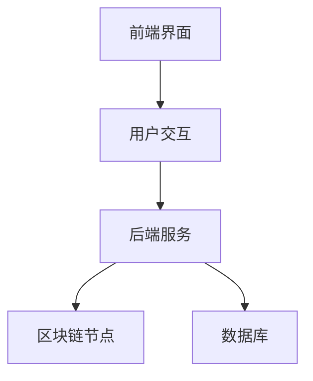
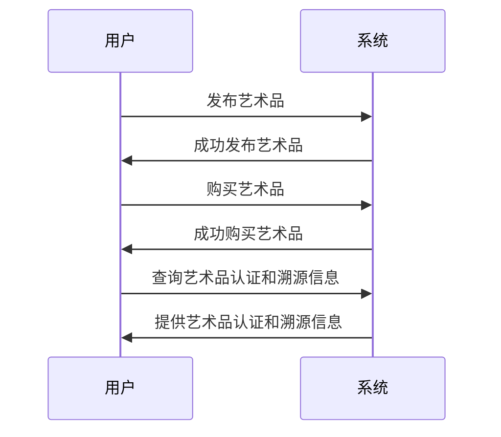

                 


## 第一部分：引言

### 第1章：问题背景与核心概念

#### 1.1 问题背景

随着数字技术的发展，数字艺术品交易逐渐成为了一个新兴的市场。然而，在这个市场中，艺术家们的版权保护问题和收益分配问题却日益凸显。传统的艺术品交易流程复杂，涉及多方参与，容易出现版权纠纷和利益分配不均的情况。区块链技术的出现，为解决这些问题提供了一种新的思路。

首先，让我们来了解数字艺术品交易的核心挑战。一方面，数字艺术品易于复制和传播，这使得艺术家的原创作品容易被侵权，其版权难以得到有效保护。另一方面，传统的艺术品交易市场存在信息不对称和中介环节，导致艺术家的收益分配不合理，收益流失问题严重。

#### 1.2 核心概念

接下来，我们需要明确几个核心概念：

- **区块链技术**：一种分布式数据库技术，通过加密算法和共识机制保证数据的安全性和不可篡改性。
- **数字艺术品交易**：以数字化形式存在的艺术品，如数字画作、数字音乐、数字影片等的交易过程。
- **艺术家权益保护**：确保艺术家的原创作品得到保护，其权益得到合理分配的过程。

这些概念构成了我们探讨区块链在数字艺术品交易中应用的基础。

### 第2章：区块链技术基础

#### 2.1 区块链基本原理

首先，让我们来了解区块链的基本原理。区块链由多个区块组成，每个区块包含一定数量的交易记录。这些区块通过加密算法和时间戳技术连接在一起，形成了一条不可篡改的链。区块链的核心特点包括：

- **去中心化**：区块链不需要中心化的机构来管理，所有节点都可以参与数据的验证和存储。
- **数据安全性**：通过加密算法确保数据的完整性和安全性。
- **不可篡改性**：一旦数据被记录在区块链上，就难以被篡改。

#### 2.2 智能合约原理

智能合约是一种运行在区块链上的计算机程序，它可以根据设定的条件自动执行。智能合约的核心特点包括：

- **自动执行**：智能合约在满足特定条件时，可以自动执行预设的操作。
- **透明性**：智能合约的代码是公开的，任何人都可以查看和验证。

智能合约在区块链技术中的应用，为数字艺术品交易提供了自动化和透明化的解决方案。

#### 1.3 艺术家权益保护的需求

艺术家权益保护是数字艺术品交易中的关键需求。区块链技术可以通过以下方式实现这一目标：

- **版权保护**：区块链技术可以记录艺术品的版权信息，确保原创作品的版权得到有效保护。
- **收益分配**：通过智能合约，可以确保艺术家的收益分配透明、公正，减少中介环节，提高艺术家的收益比例。

### 总结

本章节通过问题背景介绍和核心概念的阐述，为后续章节的分析和探讨奠定了基础。在接下来的章节中，我们将深入探讨区块链技术的基础原理，以及它在数字艺术品交易中的应用，旨在为艺术家权益保护提供有效的解决方案。

----------------------------------------------------------------

## 第2章：区块链技术基础

### 2.1 区块链基本原理

区块链是一种分布式数据库技术，其核心思想是将数据分散存储在多个节点上，从而实现去中心化的数据管理。区块链的基本原理包括以下几个方面：

#### 数据结构

区块链的数据结构由多个区块组成，每个区块包含一定数量的交易记录。每个区块除了包含交易记录外，还包含一个时间戳、一个链式哈希和上一个区块的哈希值。这些信息确保了区块链的不可篡改性和数据的完整性。

#### 加密算法

区块链采用加密算法来保护数据的完整性和安全性。常见的加密算法包括SHA-256哈希算法和椭圆曲线加密算法（ECC）。SHA-256算法用于生成区块的哈希值，确保每个区块的内容唯一且无法被篡改。ECC算法用于实现数字签名和加密通信，确保交易数据的机密性和真实性。

#### 共识机制

区块链的共识机制是确保所有节点对数据的共识和一致性。常见的共识机制包括工作量证明（PoW）、权益证明（PoS）和委托权益证明（DPoS）等。PoW机制通过解决复杂的数学难题来证明节点的计算能力，PoS机制通过持有币龄来证明节点的权益，DPoS机制通过选举出一定数量的验证节点来达成共识。

#### 区块链的特点

- **去中心化**：区块链不需要中心化的机构来管理，所有节点都可以参与数据的验证和存储，从而降低了系统风险和运营成本。
- **数据安全性**：通过加密算法和共识机制，区块链确保数据的完整性和安全性，防止数据被篡改。
- **不可篡改性**：一旦数据被记录在区块链上，就难以被篡改，从而保证了数据的历史可追溯性。

#### 区块链在数字艺术品交易中的应用

区块链在数字艺术品交易中的应用主要体现在以下几个方面：

- **版权保护**：区块链可以记录艺术品的版权信息，确保原创作品的版权得到有效保护。
- **交易透明化**：区块链上的交易记录是公开透明的，可以避免中介环节，提高交易的透明度和信任度。
- **收益分配**：通过智能合约，可以确保艺术家的收益分配透明、公正，减少中介环节，提高艺术家的收益比例。

### 2.2 智能合约原理

智能合约是区块链上的计算机程序，它根据预设的条件自动执行。智能合约的核心特点包括：

#### 自动执行

智能合约在满足特定条件时，可以自动执行预设的操作。例如，当购买者支付了购买数字艺术品的费用后，智能合约会自动将艺术品的所有权转移给购买者。

#### 透明性

智能合约的代码是公开的，任何人都可以查看和验证。这使得智能合约的执行过程更加透明，减少了信息不对称和欺诈行为。

#### 安全性

智能合约通过加密算法和共识机制确保其执行的安全性和可靠性。智能合约的代码在部署到区块链上后，就变得不可篡改，从而保证了合约的执行过程是公正和透明的。

#### 智能合约在数字艺术品交易中的应用

智能合约在数字艺术品交易中的应用主要体现在以下几个方面：

- **版权保护**：通过智能合约，可以自动执行版权注册和交易流程，确保艺术品的版权得到有效保护。
- **收益分配**：通过智能合约，可以自动计算和分配艺术品的收益，确保艺术家的收益分配透明、公正。
- **交易自动化**：智能合约可以自动化执行交易流程，减少中介环节，提高交易的效率。

### 总结

本章详细介绍了区块链的基本原理和智能合约的原理，以及它们在数字艺术品交易中的应用。通过区块链和智能合约，可以有效地保护艺术品的版权，提高交易的透明度和信任度，实现艺术家的收益分配公平合理。

----------------------------------------------------------------

## 第3章：数字艺术品交易中的区块链应用

### 3.1 数字艺术品市场概述

数字艺术品市场近年来呈现出快速发展的趋势。随着技术的进步，越来越多的艺术家选择将他们的作品数字化，并通过在线平台进行交易。数字艺术品市场不仅涵盖了传统的艺术品，如数字画作、数字音乐和数字影片，还包括虚拟现实（VR）艺术和增强现实（AR）艺术等新兴领域。

#### 市场现状

- **市场规模**：根据市场研究公司的数据，全球数字艺术品市场的规模逐年增长，预计到2025年将达到数十亿美元。
- **用户增长**：随着互联网普及和数字化生活方式的推广，数字艺术品市场的用户群体不断扩大，吸引了越来越多的投资者和收藏家。
- **技术进步**：区块链、人工智能（AI）和虚拟现实等技术的进步，为数字艺术品市场的发展提供了新的动力。

#### 市场需求分析

数字艺术品市场的需求主要表现在以下几个方面：

- **版权保护**：数字艺术品易于复制和传播，使得艺术家的原创作品容易被侵权。艺术家和版权持有者需要一个可靠的平台来保护他们的版权。
- **交易透明度**：传统的艺术品交易市场存在信息不对称和中介环节，导致交易过程不透明。市场参与者需要一个透明、公正的交易平台。
- **收益分配**：艺术家在传统艺术品交易市场中往往只能获得部分收益，而大部分收益被中介机构或交易平台瓜分。市场参与者需要一个公平的收益分配机制。
- **交易效率**：传统艺术品交易流程复杂，涉及多方参与，导致交易效率低下。市场参与者需要一个高效、便捷的交易平台。

#### 区块链技术如何满足需求

区块链技术在数字艺术品交易中具有以下优势，可以满足市场的需求：

- **版权保护**：区块链技术可以记录艺术品的版权信息，确保原创作品的版权得到有效保护。通过区块链，艺术家可以轻松注册和证明他们的版权。
- **交易透明度**：区块链上的交易记录是公开透明的，所有参与者都可以查看和验证。这有助于消除信息不对称和中介环节，提高交易的透明度和信任度。
- **收益分配**：通过智能合约，可以自动计算和分配艺术品的收益，确保艺术家的收益分配透明、公正。智能合约确保了收益分配的自动化和不可篡改性。
- **交易效率**：区块链技术可以自动化执行交易流程，减少中介环节，提高交易的效率。交易过程变得更加快速、便捷。

### 3.2 艺术品版权保护

艺术品版权保护是数字艺术品交易中的一个关键问题。在传统的艺术品交易市场中，由于信息不对称和中介环节的存在，艺术品的版权往往难以得到有效保护。区块链技术的出现，为艺术品版权保护提供了一种新的解决方案。

#### 版权保护的现状与问题

- **现状**：传统的艺术品交易市场存在信息不对称和中介环节，导致艺术品的版权难以得到有效保护。艺术家的原创作品容易被侵权，而版权纠纷问题也时常发生。
- **问题**：艺术品版权保护的问题主要包括：版权信息不透明、版权纠纷频繁、版权收益分配不合理等。

#### 区块链技术在版权保护中的应用

区块链技术在艺术品版权保护中具有以下应用：

- **版权信息记录**：区块链可以记录艺术品的版权信息，包括创作者、创作时间、创作内容等。这些信息在区块链上永久保存，确保了版权信息的透明性和不可篡改性。
- **版权认证**：艺术家可以通过区块链平台注册和认证他们的作品。注册过程包括上传作品、填写版权信息、支付注册费用等。一旦作品注册成功，艺术家的版权就得到了法律保护。
- **版权交易**：通过区块链，艺术家可以直接与买家进行版权交易，无需经过中介机构。交易过程公开透明，确保了交易的公正性和安全性。
- **版权维权**：如果艺术品的版权被侵犯，艺术家可以通过区块链平台发起维权。平台将自动调用智能合约，按照预定的规则进行维权操作，确保版权得到有效保护。

#### 版权保护的具体实现

区块链在艺术品版权保护中的具体实现包括以下几个步骤：

1. **作品注册**：艺术家在区块链平台上上传作品，填写版权信息，支付注册费用。
2. **版权认证**：平台对上传的作品进行审核，确保作品的真实性和版权信息完整。一旦审核通过，作品即被正式注册并记录在区块链上。
3. **版权交易**：买家在区块链平台上浏览作品，选择购买版权。购买过程通过智能合约自动执行，确保交易的透明性和安全性。
4. **版权维权**：如果艺术品的版权被侵犯，艺术家可以通过区块链平台发起维权。平台将调用智能合约，按照预定的规则进行维权操作，确保版权得到有效保护。

### 总结

本章详细介绍了数字艺术品市场的发展现状和需求，以及区块链技术在艺术品版权保护中的应用。通过区块链技术，艺术家可以更有效地保护他们的版权，市场参与者可以享受到更透明、公正的交易环境。在接下来的章节中，我们将进一步探讨区块链在艺术品交易中的具体实现，以及案例分析。

----------------------------------------------------------------

### 3.3 区块链在艺术品交易中的实现

在数字艺术品交易中，区块链技术的应用不仅限于版权保护，还包括交易流程的优化、艺术品认证与溯源等多个方面。以下将详细阐述区块链在这些方面的具体实现。

#### 交易流程设计

数字艺术品交易的流程设计是确保交易过程高效、透明和安全的关键。以下是一个典型的交易流程设计：

1. **交易准备**：艺术家在区块链平台上创建和上传他们的艺术品，并设置交易价格和条件。同时，艺术家可以设定智能合约中的版权信息和收益分配规则。
   
   ```python
   # Python代码示例：设定艺术品交易价格和版权信息
   def set_artifact_price(artifact_id, price):
       # 设置艺术品价格
       artifact = get_artifact(artifact_id)
       artifact.price = price
       save_artifact(artifact)

   def set_copyright_info(artifact_id, copyright_info):
       # 设置版权信息
       artifact = get_artifact(artifact_id)
       artifact.copyright_info = copyright_info
       save_artifact(artifact)
   ```

2. **买家查询**：买家在区块链平台上浏览艺术品，选择购买艺术品。买家可以查看艺术品的价格、版权信息和历史交易记录。

3. **发起交易**：买家发起购买请求，支付交易金额。支付过程通过智能合约自动执行。

   ```python
   # Python代码示例：买家发起购买请求
   def purchase_artifact(artifact_id, buyer_address):
       # 获取艺术品信息
       artifact = get_artifact(artifact_id)
       # 验证购买者地址
       if verify_address(buyer_address):
           # 调用智能合约执行交易
           contract = get_contract()
           contract.execute_purchase(artifact_id, buyer_address)
   ```

4. **确认与结算**：智能合约自动验证买家支付，并将艺术品的所有权转移给买家。同时，智能合约根据设定的规则计算和分配收益。

5. **交易记录**：交易记录永久记录在区块链上，确保交易过程透明和可追溯。

#### 艺术品认证与溯源

艺术品认证与溯源是确保艺术品真实性、历史和来源的重要手段。区块链技术在艺术品认证与溯源中具有显著优势：

1. **认证信息记录**：艺术品在区块链平台上进行认证时，认证信息（如鉴定专家、鉴定时间和鉴定结论）被记录在区块链上，确保认证信息的透明和不可篡改。

   ```python
   # Python代码示例：记录艺术品认证信息
   def record_artifact_authentication(artifact_id, authentication_info):
       # 记录艺术品认证信息
       artifact = get_artifact(artifact_id)
       artifact.authentication_info = authentication_info
       save_artifact(artifact)
   ```

2. **溯源信息记录**：艺术品在流转过程中，每次交易、鉴定和修复等信息都被记录在区块链上，形成完整的溯源记录。

3. **查询与验证**：任何用户都可以通过区块链平台查询艺术品的认证和溯源信息，确保艺术品的真实性。

   ```python
   # Python代码示例：查询艺术品认证和溯源信息
   def get_artifact_authentication(artifact_id):
       # 获取艺术品认证信息
       artifact = get_artifact(artifact_id)
       return artifact.authentication_info

   def get_artifact溯源记录(artifact_id):
       # 获取艺术品溯源记录
       artifact = get_artifact(artifact_id)
       return artifact溯源记录
   ```

#### 系统分析与架构设计方案

为了实现上述功能，我们需要对系统进行详细的场景介绍、项目介绍、系统功能设计、系统架构设计、系统接口设计和系统交互设计。

##### 场景介绍

数字艺术品交易系统旨在提供一个去中心化的交易平台，艺术家可以发布和销售艺术品，买家可以浏览和购买艺术品，同时确保版权保护和交易透明度。

##### 项目介绍

项目名称：数字艺术品交易平台（Digital Artworks Trading Platform）

目标：建立一个基于区块链的去中心化艺术品交易平台，实现艺术品的版权保护、交易和溯源。

##### 系统功能设计

1. **艺术品发布**：艺术家可以上传和发布艺术品，并设定交易价格和条件。
2. **艺术品查询**：买家可以浏览和查询艺术品，查看艺术品的价格、版权信息和历史交易记录。
3. **艺术品购买**：买家可以发起购买请求，支付交易金额，并接受艺术品的所有权转移。
4. **艺术品认证**：艺术品可以接受第三方认证，认证信息记录在区块链上。
5. **艺术品溯源**：艺术品在流转过程中的交易、鉴定和修复信息被记录在区块链上，形成完整的溯源记录。
6. **交易记录查询**：用户可以查询交易记录，确保交易的透明和可追溯。

##### 系统架构设计

系统架构设计包括前端界面、后端服务、区块链节点和数据库等组成部分。

- **前端界面**：用于用户交互，包括艺术品发布、购买、查询和认证等功能。
- **后端服务**：处理业务逻辑，包括艺术品发布、购买、认证和溯源等。
- **区块链节点**：存储和验证交易数据，确保数据的安全性和一致性。
- **数据库**：存储用户信息、艺术品信息和交易记录等。



##### 系统接口设计

系统接口设计包括艺术品发布接口、艺术品购买接口、艺术品认证接口和艺术品溯源接口等。

- **艺术品发布接口**：允许艺术家上传和发布艺术品。
- **艺术品购买接口**：允许买家发起购买请求和支付交易金额。
- **艺术品认证接口**：允许第三方机构对艺术品进行认证。
- **艺术品溯源接口**：允许用户查询艺术品的交易、鉴定和修复记录。

##### 系统交互设计

系统交互设计描述了用户与系统之间的交互流程。



#### 项目实战

在项目实战中，我们将详细介绍环境安装、系统核心实现源代码，并分析代码的应用解读与分析。

##### 环境安装

1. **安装Node.js**：Node.js是一个用于服务器端和基于Chrome V8引擎的JavaScript运行环境。
    ```shell
    npm install -g nodejs
    ```

2. **安装Geth**：Geth是Go语言的官方以太坊客户端，用于连接以太坊区块链。
    ```shell
    wget https://gethstore.blob.core.windows.net/releases/1.10.25/geth-linux-amd64-1.10.25-9e8e7c2-cfg.zip
    unzip geth-linux-amd64-1.10.25-9e8e7c2-cfg.zip
    chmod +x geth
    ```

3. **安装Truffle**：Truffle是一个用于开发以太坊智能合约的工具。
    ```shell
    npm install -g truffle
    ```

##### 系统核心实现源代码

系统核心实现源代码包括前端和后端部分。

1. **前端源代码**：

```javascript
// 前端React组件示例
import React, { useState } from 'react';

function ArtworkListing({ artwork }) {
  const [isPurchased, setIsPurchased] = useState(false);

  const purchaseArtwork = () => {
    // 调用购买接口
    setIsPurchased(true);
  };

  return (
    <div>
      <h2>{artwork.title}</h2>
      <p>{artwork.description}</p>
      <p>{artwork.price} ETH</p>
      {!isPurchased && (
        <button onClick={purchaseArtwork}>购买</button>
      )}
    </div>
  );
}
```

2. **后端源代码**：

```solidity
// Solidity智能合约示例
pragma solidity ^0.8.0;

contract Artwork {
    struct Sale {
        address buyer;
        uint256 price;
        bool purchased;
    }

    mapping(uint256 => Sale) public sales;

    function createSale(uint256 artworkId, uint256 price) public {
        require(sales[artworkId].purchased == false, "Artwork already sold");
        sales[artworkId] = Sale({buyer: msg.sender, price: price, purchased: false});
    }

    function purchaseArtwork(uint256 artworkId) public payable {
        require(sales[artworkId].purchased == false, "Artwork already sold");
        require(msg.value == sales[artworkId].price, "Insufficient payment");

        sales[artworkId].buyer = msg.sender;
        sales[artworkId].purchased = true;
        payable(sales[artworkId].buyer).transfer(msg.value);
    }
}
```

##### 代码应用解读与分析

- **前端代码**：前端代码展示了如何通过React组件来展示艺术品列表，并提供购买按钮。购买按钮会调用后端的购买接口。
- **后端代码**：后端智能合约实现了艺术品的创建和购买功能。在合约中，`createSale`函数用于创建艺术品销售记录，`purchaseArtwork`函数用于处理购买请求。

##### 实际案例分析和详细讲解剖析

我们以一个实际案例来分析区块链在数字艺术品交易中的实际应用。

**案例：艺术家A的艺术品《数字晨光》销售**

1. **艺术家A发布艺术品**：
   - 艺术家A在区块链平台上创建艺术品《数字晨光》，并设置售价为0.1 ETH。
   - 艺术家A调用`createSale`函数，将艺术品ID、售价等信息存储在区块链上。

2. **买家B购买艺术品**：
   - 买家B在区块链平台上浏览到《数字晨光》，决定购买。
   - 买家B调用购买按钮，触发后端的购买接口。

3. **智能合约处理购买请求**：
   - 智能合约验证购买请求，确保买家支付了正确的价格。
   - 智能合约将艺术品所有权转移给买家，并记录交易信息。

4. **交易记录**：
   - 交易记录永久存储在区块链上，买家和艺术家都可以查询。

**案例小结**：

通过实际案例，我们可以看到区块链技术在数字艺术品交易中的实际应用。艺术家可以轻松发布和销售艺术品，买家可以方便地购买艺术品，同时确保交易的透明和不可篡改性。

### 总结

本章详细介绍了区块链在数字艺术品交易中的应用，包括交易流程设计、艺术品认证与溯源以及系统架构设计。通过实际案例分析和详细讲解，我们展示了区块链技术在数字艺术品交易中的优势和应用场景。在接下来的章节中，我们将进一步探讨区块链在数字艺术品交易中的案例分析和未来发展趋势。

----------------------------------------------------------------

## 第4章：案例分析

### 4.1 案例一：知名数字艺术品交易平台

#### 4.1.1 平台概述

知名数字艺术品交易平台（如OpenSea）是一个基于区块链的去中心化市场，允许用户购买、出售和交换数字艺术品。该平台支持多种区块链网络，如以太坊和Flow，为用户提供了广泛的选择。

#### 4.1.2 平台在区块链技术中的应用

OpenSea在区块链技术中的应用主要体现在以下几个方面：

1. **去中心化交易**：OpenSea使用以太坊区块链实现去中心化交易，用户可以直接与其他用户进行交易，无需依赖中介机构。

2. **NFTs（非同质化代币）**：OpenSea支持NFTs，这是一种代表数字艺术品所有权的代币。每个NFT都是唯一的，无法被复制，确保了数字艺术品的所有权和稀有性。

3. **智能合约**：OpenSea使用智能合约来管理交易过程，确保交易的透明、安全和自动化。智能合约自动执行交易的各个环节，如支付、所有权转移等。

4. **市场流动性**：OpenSea提供了一个广泛的数字艺术品市场，吸引了大量的买家和卖家。这提高了市场的流动性，使得数字艺术品更容易交易和流通。

#### 4.1.3 案例分析

OpenSea的成功案例可以从以下几个方面进行分析：

1. **用户体验**：OpenSea提供了简单直观的用户界面，用户可以轻松浏览、购买和出售数字艺术品。此外，OpenSea还提供了多种过滤和排序功能，帮助用户快速找到他们感兴趣的艺术品。

2. **交易安全性**：OpenSea使用以太坊区块链的智能合约来确保交易的安全性。智能合约自动执行交易，避免了人为干预和欺诈行为。此外，OpenSea还提供了买家保护政策，确保用户在交易过程中不受损失。

3. **市场流动性**：OpenSea吸引了大量的买家和卖家，形成了活跃的市场。这提高了数字艺术品的流动性，使得艺术品更容易交易和流通。

4. **艺术家权益保护**：OpenSea通过智能合约确保艺术家在每次交易中获得版税。这使得艺术家能够更好地保护他们的版权和收益。

#### 4.1.4 案例启示

OpenSea的成功为数字艺术品交易平台提供了以下启示：

1. **技术选型**：选择合适的区块链平台对于构建成功的数字艺术品交易平台至关重要。OpenSea选择了以太坊和Flow等成熟和可靠的区块链平台，这为平台的发展奠定了基础。

2. **用户体验**：提供简单直观的用户界面和丰富的功能，可以提高用户体验，吸引更多的用户参与。

3. **安全性**：确保交易的安全性和透明度，是建立用户信任的关键。OpenSea通过智能合约和买家保护政策实现了这一目标。

4. **市场流动性**：提高市场的流动性，可以促进数字艺术品的交易和流通。OpenSea通过吸引大量的买家和卖家，实现了这一目标。

### 4.2 案例二：艺术家权益保护项目

#### 4.2.1 项目背景

艺术家权益保护项目旨在通过区块链技术确保艺术家的原创作品得到有效保护，并实现公平的收益分配。该项目由一位知名艺术家发起，得到了多家区块链技术和艺术品市场的支持。

#### 4.2.2 项目实施方案

项目的实施方案主要包括以下几个方面：

1. **版权注册**：艺术家可以通过区块链平台注册他们的作品，确保作品的版权信息得到记录和验证。注册过程包括上传作品、填写版权信息、支付注册费用等。

2. **智能合约**：项目使用智能合约来实现版税分配和版权保护。智能合约根据艺术家设定的规则，自动计算和分配每次交易的版税。

3. **透明记录**：所有交易记录都在区块链上透明记录，确保交易过程公开透明。这有助于防止侵权行为和确保艺术家的收益。

4. **维权机制**：如果艺术家的版权被侵犯，他们可以通过区块链平台发起维权。平台将调用智能合约，按照预定的规则进行维权操作。

#### 4.2.3 项目成效

项目实施后取得了显著成效：

1. **版权保护加强**：通过区块链技术，艺术家的版权信息得到了有效保护，侵权行为得到了有效遏制。

2. **收益分配透明**：智能合约确保了艺术家的收益分配透明、公正，减少了中介环节，提高了艺术家的收益比例。

3. **市场信任度提升**：项目的成功实施提高了市场的信任度，吸引了更多的艺术家和买家参与。

### 总结

通过上述案例分析，我们可以看到区块链技术在数字艺术品交易中的应用取得了显著成效。无论是知名数字艺术品交易平台OpenSea，还是艺术家权益保护项目，区块链技术都为数字艺术品交易提供了安全、透明和高效的解决方案。这些案例为其他数字艺术品交易平台和项目提供了宝贵的经验和启示。

----------------------------------------------------------------

## 第5章：区块链在数字艺术品交易中的未来发展趋势

### 6.1 技术发展趋势

区块链技术在数字艺术品交易中的应用正处于快速发展阶段，未来的发展趋势可以从以下几个方面进行展望：

#### 1. 区块链技术的演进

随着区块链技术的不断演进，未来的区块链将更加高效、安全和可扩展。以下是几种可能的发展趋势：

- **性能提升**：未来的区块链可能会采用更高效的共识算法和共识层技术，以提高交易速度和处理能力。
- **安全性增强**：区块链可能会引入更强大的加密算法和抗攻击机制，以增强数据的安全性和隐私性。
- **跨链互操作**：不同区块链之间的互操作性将得到加强，实现不同区块链之间的资产和数据的无缝转移。

#### 2. 数字艺术品市场的未来

数字艺术品市场将继续快速发展，未来的趋势包括：

- **市场规模扩大**：随着数字技术的发展和数字艺术品的普及，数字艺术品市场的规模将继续扩大。
- **用户多样化**：数字艺术品市场的用户将更加多样化，包括艺术家、收藏家、投资者等。
- **新兴艺术形式**：虚拟现实（VR）艺术、增强现实（AR）艺术等新兴艺术形式将逐渐融入数字艺术品市场。

#### 3. 区块链与数字艺术融合的新机遇

区块链与数字艺术的融合将带来新的机遇：

- **艺术版权保护**：区块链技术将进一步提高艺术版权保护的水平，确保艺术家的权益得到有效保护。
- **艺术交易透明化**：区块链技术将提高艺术交易的透明度，减少中介环节，降低交易成本。
- **艺术金融创新**：区块链技术将促进艺术金融的创新，如数字艺术品借贷、保险等。

### 6.2 政策与法规的完善

区块链在数字艺术品交易中的应用需要政策与法规的支撑，未来的发展趋势包括：

#### 1. 当前政策与法规的挑战

- **监管缺位**：当前数字艺术品交易市场存在监管缺位的问题，需要制定相关政策法规进行规范。
- **法律冲突**：不同国家和地区之间的法律冲突，可能导致区块链技术在数字艺术品交易中的应用受到限制。
- **知识产权保护**：知识产权保护仍然是数字艺术品交易中的一个重要问题，需要完善相关法规。

#### 2. 政策与法规的完善方向

- **制定明确政策**：政府需要制定明确的政策法规，为数字艺术品交易提供法律保障。
- **跨区域合作**：加强不同国家和地区之间的合作，建立统一的数字艺术品交易规则。
- **知识产权保护**：完善知识产权保护法规，提高知识产权的注册和维权效率。

#### 3. 法规对区块链技术应用的影响

- **促进创新**：明确的政策法规将促进区块链技术在数字艺术品交易中的应用，推动技术创新。
- **规范市场**：政策法规将规范数字艺术品交易市场，提高市场的透明度和公平性。
- **防范风险**：政策法规有助于防范区块链技术在数字艺术品交易中的应用风险，确保市场的稳定发展。

### 总结

区块链在数字艺术品交易中的应用正处于快速发展阶段，未来的发展趋势包括技术演进、市场扩大、艺术与区块链融合新机遇以及政策法规的完善。随着区块链技术的不断进步和政策法规的完善，数字艺术品交易将变得更加高效、透明和安全，为艺术家、收藏家和投资者带来更多的价值。

----------------------------------------------------------------

## 第6章：区块链在数字艺术品交易中的未来发展趋势

### 6.1 技术发展趋势

随着区块链技术的不断演进，其在数字艺术品交易中的应用前景也愈发广阔。以下是几个关键技术发展趋势：

#### 1. 性能提升

区块链技术的性能一直是其发展的重要瓶颈。未来，随着共识算法的优化和分片技术的应用，区块链的交易速度和处理能力将得到显著提升。例如，以太坊的Layer 2解决方案（如Plasma、Rollup等）正在开发中，旨在在不牺牲安全性的前提下提高交易速度。

#### 2. 安全性增强

区块链的安全性问题备受关注。未来的区块链技术可能会引入更高级的加密算法，如量子-resistant cryptography，以抵御量子计算机的攻击。此外，零知识证明（ZKP）和同态加密等隐私保护技术也将进一步增强区块链的安全性和隐私性。

#### 3. 跨链互操作

不同区块链之间的互操作性是未来发展的关键方向。随着跨链技术（如Cosmos、Polkadot等）的成熟，不同区块链之间的资产和数据的无缝转移将成为现实，这将极大地促进数字艺术品市场的流动性和互操作性。

### 6.2 政策与法规的完善

区块链在数字艺术品交易中的应用不仅需要技术上的突破，还依赖于政策与法规的支持。以下是政策与法规完善的方向：

#### 1. 明确政策法规

各国政府应制定明确的政策法规，为数字艺术品交易提供法律保障。这包括对数字艺术品的定义、交易流程、版权保护等方面的规定，以确保市场的健康发展。

#### 2. 跨区域合作

数字艺术品市场具有跨国性，因此，跨区域合作至关重要。国际组织和国家之间应共同努力，建立统一的数字艺术品交易规则，以避免法律冲突和监管真空。

#### 3. 知识产权保护

知识产权保护是数字艺术品交易中的核心问题。各国政府应完善知识产权保护法规，提高知识产权的注册和维权效率，以保护艺术家的合法权益。

### 6.3 法规对区块链技术应用的影响

政策与法规的完善将对区块链在数字艺术品交易中的应用产生深远影响：

#### 1. 促进创新

明确的政策法规将为区块链技术的创新提供良好的环境。艺术家、投资者和开发人员可以更加放心地探索和应用区块链技术，推动市场的快速发展。

#### 2. 规范市场

政策法规的完善将有助于规范数字艺术品交易市场，提高市场的透明度和公平性。这将减少欺诈行为，增强市场的信任度。

#### 3. 防范风险

政策法规将为区块链在数字艺术品交易中的应用提供风险防范机制。例如，可以通过监管沙盒（Regulatory Sandbox）等方式，允许在受控环境中测试新技术的应用，以减少潜在风险。

### 总结

区块链在数字艺术品交易中的应用正处于快速发展阶段。技术上的突破和政策与法规的完善将为数字艺术品市场带来新的机遇。随着区块链技术的不断进步，数字艺术品交易将变得更加高效、透明和安全，为艺术家、收藏家和投资者带来更多的价值。同时，政策与法规的完善将为区块链技术的应用提供坚实的法律保障，促进市场的长期健康发展。

----------------------------------------------------------------

## 第7章：结论与展望

### 7.1 研究结论

本文通过深入探讨区块链在数字艺术品交易中的应用，得出以下结论：

1. **区块链技术为数字艺术品交易提供了有效的解决方案**：通过去中心化、数据安全和智能合约等技术，区块链技术可以解决数字艺术品交易中的版权保护、交易透明度、收益分配等问题。

2. **艺术品版权保护得到显著提升**：区块链技术可以记录和验证艺术品的版权信息，确保原创作品的版权得到有效保护，减少了版权纠纷和侵权行为。

3. **交易流程变得更加透明和高效**：区块链技术通过智能合约自动化执行交易流程，减少了中介环节，提高了交易效率，降低了交易成本。

4. **艺术家权益得到更好保障**：通过区块链技术，艺术家的收益分配变得更加透明、公正，减少了中介环节的收益瓜分，提高了艺术家的收益比例。

### 7.1.2 存在的问题与挑战

尽管区块链在数字艺术品交易中具有巨大潜力，但仍存在一些问题和挑战：

1. **技术成熟度**：区块链技术尚处于发展初期，技术成熟度和稳定性仍需进一步提升，以应对大规模商业应用的需求。

2. **法规与监管**：数字艺术品交易涉及复杂的法律和监管问题，各国政策法规的不一致可能导致法律冲突和监管难题。

3. **隐私保护**：区块链上的交易数据是公开透明的，如何在保护用户隐私的同时确保交易的安全性，是一个亟待解决的问题。

4. **用户体验**：尽管区块链技术具有优势，但复杂的操作流程和用户界面可能影响用户体验，需要进一步优化。

### 7.1.3 应对策略与建议

针对上述问题和挑战，提出以下应对策略与建议：

1. **技术优化**：继续投入研发资源，优化区块链技术，提高其性能、稳定性和安全性，以支持大规模商业应用。

2. **政策协调**：各国政府应加强国际合作，制定统一的数字艺术品交易政策法规，为市场的健康发展提供法律保障。

3. **隐私保护**：研究和开发隐私保护技术，如零知识证明（ZKP）和同态加密，以在保护用户隐私的同时确保交易的安全性。

4. **用户体验**：简化区块链操作流程，提供友好用户界面，提高用户体验，吸引更多用户参与。

### 7.2 未来展望

展望未来，区块链在数字艺术品交易中的应用前景广阔：

1. **技术发展**：随着区块链技术的不断进步，其在数字艺术品交易中的应用将更加成熟和广泛。

2. **市场扩张**：数字艺术品市场的规模将持续扩大，吸引更多的艺术家、收藏家和投资者参与。

3. **艺术与技术的融合**：区块链技术将与数字艺术形式（如VR、AR）深度融合，为艺术创作、展示和交易带来新的机遇。

4. **艺术金融创新**：区块链技术将促进艺术金融的创新，如数字艺术品借贷、保险等，为市场带来更多投资机会。

### 7.2.2 艺术家权益保护的长期影响

区块链在数字艺术品交易中的应用将长期影响艺术家的权益保护：

1. **权益保障**：区块链技术将确保艺术家的权益得到长期有效保护，减少侵权行为，提高艺术家的创作积极性和市场竞争力。

2. **收益分配**：通过智能合约和透明的交易记录，艺术家的收益分配将变得更加公正和透明，提高艺术家的经济收益。

3. **艺术市场透明度**：区块链技术将提高艺术市场的透明度，减少中介环节，降低交易成本，促进市场的健康发展。

### 总结

区块链在数字艺术品交易中的应用具有显著优势，但也面临一定的挑战。通过持续的技术创新和政策法规的完善，区块链有望成为保护艺术家权益、提高交易效率和促进市场健康发展的关键技术。未来，随着区块链技术的不断成熟和市场的进一步发展，数字艺术品交易将迎来新的机遇和变革。

