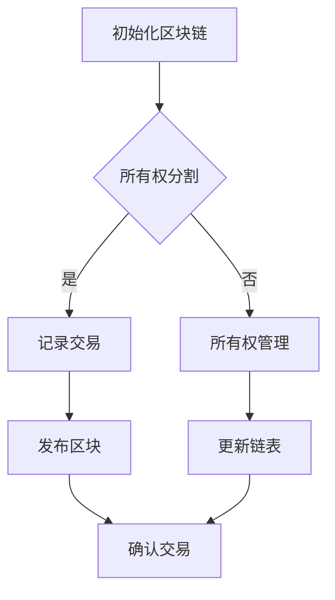

                 

### 文章标题

《区块链在数字艺术品分割所有权中的应用》

### 关键词

区块链、数字艺术品、所有权分割、智能合约、加密技术、分布式账本

### 摘要

随着数字艺术品的迅猛发展，其所有权的分割与管理成为了一个重要问题。区块链技术以其去中心化、安全性和透明性，为数字艺术品的分割所有权提供了一种全新的解决方案。本文将深入探讨区块链在数字艺术品分割所有权中的应用，包括其基本概念、算法原理、系统设计、项目实战以及最佳实践，旨在为广大读者提供全面的技术视角和实用的操作指南。

## 第一部分：背景介绍

### 1.1 问题背景

随着互联网和数字技术的发展，数字艺术品市场迅速崛起。然而，数字艺术品的所有权分割问题也随之而来。传统的艺术品分割通常依赖于物理世界的法律文件和合同，这不仅复杂且容易引发纠纷。数字艺术品作为一种全新的艺术形式，其所有权分割更具挑战性，因为其具有不可篡改、易复制等特点。

区块链技术的发展为解决这一问题提供了新的可能。区块链的去中心化特性确保了所有权的透明性和安全性，而智能合约则可以自动化执行双方达成的协议，减少了纠纷和中介成本。

### 1.2 问题描述

数字艺术品分割所有权的难点主要体现在以下几个方面：

1. **透明性和不可篡改性**：如何确保所有权的透明性和不可篡改性，使每一个参与者都能清楚地了解自己的权益。
2. **智能合约执行**：如何通过智能合约自动执行所有权的分割，确保交易的公平性和效率。
3. **分散化管理**：如何实现所有权的分散化管理，使多个所有者可以方便地管理和转让自己的份额。

### 1.3 问题解决

区块链技术通过以下几个核心特性解决了上述问题：

1. **分布式账本**：区块链通过分布式账本技术记录所有权的分割信息，确保数据的透明性和不可篡改性。
2. **智能合约**：智能合约可以自动化执行所有权的分割协议，确保交易的公平性和效率。
3. **加密技术**：加密技术确保了参与者的隐私保护，同时增强了系统的安全性。

### 1.4 边界与外延

区块链在数字艺术品分割所有权中的应用不仅限于单个艺术品的所有权分割，还可以扩展到艺术品交易市场的整体监管，以及艺术品衍生品的开发等多个领域。未来，随着技术的不断进步，区块链在数字艺术品领域中的应用将更加广泛和深入。

### 1.5 核心概念结构与要素组成

1. **区块链基本概念**：区块链是一种分布式数据库技术，通过加密算法和共识机制确保数据的不可篡改性和安全性。
2. **数字艺术品分割所有权**：数字艺术品分割所有权是指通过区块链技术实现艺术品所有权的分割和管理的机制。

## 第二部分：核心概念与联系

### 2.1 区块链基础概念

区块链（Blockchain）是一种去中心化的数据库技术，通过加密算法和共识机制确保数据的不可篡改性和安全性。区块链的核心特点包括：

1. **分布式账本**：区块链通过分布式网络存储数据，确保数据的透明性和不可篡改性。
2. **加密技术**：区块链采用加密技术保护数据的隐私和安全。
3. **共识机制**：区块链通过共识机制确保网络中的所有节点对数据的认可和一致性。

### 2.2 数字艺术品分割所有权

数字艺术品分割所有权是指通过区块链技术实现艺术品所有权的分割和管理的机制。其主要属性特征包括：

1. **不可篡改性**：区块链确保了艺术品所有权的不可篡改性，使所有者权益得到保障。
2. **透明性**：区块链上的所有权信息对所有参与者透明可见，减少了纠纷和中介成本。
3. **智能合约执行**：智能合约可以自动化执行所有权分割协议，确保交易的公平性和效率。

### 2.3 区块链与数字艺术品分割所有权的联系

区块链与数字艺术品分割所有权的联系在于：

1. **技术支持**：区块链技术为数字艺术品分割所有权提供了透明、安全、高效的解决方案。
2. **经济激励**：区块链通过智能合约实现了所有权的自动化分割和管理，降低了交易成本。
3. **市场拓展**：区块链技术有助于建立更加公平和高效的数字艺术品市场，促进艺术品交易和衍生品开发。

## 第三部分：算法原理讲解

### 3.1 算法概述

在数字艺术品分割所有权中，我们采用了一种基于区块链的算法来实现所有权的分割和管理。该算法的核心思想是：

1. **初始化**：创建一个区块链，并初始化数字艺术品的原始所有权。
2. **所有权分割**：根据所有者的协议，通过智能合约分割艺术品的所有权。
3. **交易记录**：将所有权分割的详细信息记录在区块链上，确保数据的透明性和不可篡改性。
4. **所有权管理**：通过区块链实现对所有权的分散化管理，包括转让、抵押等操作。

### 3.2 Mermaid算法流程图



### 3.3 Python源代码实现

```python
import hashlib
import json
from time import time

class Block:
    def __init__(self, index, transactions, timestamp, previous_hash):
        self.index = index
        self.transactions = transactions
        self.timestamp = timestamp
        self.previous_hash = previous_hash
        self.hash = self.compute_hash()

    def compute_hash(self):
        block_string = json.dumps(self.__dict__, sort_keys=True)
        return hashlib.sha256(block_string.encode()).hexdigest()

class Blockchain:
    def __init__(self):
        self.unconfirmed_transactions = []
        self.chain = []
        self.create_genesis_block()

    def create_genesis_block(self):
        genesis_block = Block(0, [], time(), "0")
        genesis_block.hash = genesis_block.compute_hash()
        self.chain.append(genesis_block)

    def add_new_transaction(self, transaction):
        self.unconfirmed_transactions.append(transaction)

    def mine(self):
        if not self.unconfirmed_transactions:
            return False
        last_block = self.chain[-1]
        new_block = Block(index=last_block.index + 1,
                          transactions=self.unconfirmed_transactions,
                          timestamp=time(),
                          previous_hash=last_block.hash)
        new_block.hash = new_block.compute_hash()
        self.chain.append(new_block)
        self.unconfirmed_transactions = []
        return new_block

    def is_chain_valid(self):
        for i in range(1, len(self.chain)):
            current = self.chain[i]
            previous = self.chain[i - 1]
            if current.hash != current.compute_hash():
                return False
            if current.previous_hash != previous.hash:
                return False
        return True
```

### 3.4 算法原理与数学模型

区块链的算法原理主要包括以下几个方面：

1. **哈希函数**：哈希函数用于确保数据块的唯一性和不可篡改性。哈希函数将输入数据映射为一个固定长度的字符串，该字符串被称为哈希值。
2. **链式结构**：区块链采用链式结构存储数据块，每个数据块包含一定数量的交易记录和指向前一个数据块的哈希值。
3. **共识机制**：共识机制用于确保网络中的所有节点对区块链的当前状态达成一致。

数学模型主要包括以下几个公式：

1. **哈希值计算**：$$H = SHA256(Data)$$，其中 $H$ 为哈希值，$SHA256$ 为 SHA-256 哈希算法，$Data$ 为输入数据。
2. **数据块验证**：$$Hash(Previous\_Hash, Transactions, Index, Timestamp) = Current\_Hash$$，其中 $Previous\_Hash$ 为前一个数据块的哈希值，$Transactions$ 为当前数据块包含的交易记录，$Index$ 为数据块的索引，$Timestamp$ 为当前数据块的创建时间，$Current\_Hash$ 为当前数据块的哈希值。

### 3.5 算法举例说明

假设我们要将一幅数字艺术品的所有权分割给两个所有者，我们可以创建一个包含两个所有者信息的交易，并将其添加到区块链中。

```python
transaction = {
    "seller": "Alice",
    "buyer": "Bob",
    "percentage": [50, 50]
}
blockchain.add_new_transaction(transaction)
blockchain.mine()
```

这将创建一个包含分割所有权的区块，并将其添加到区块链中。新的区块链状态如下：

```json
[
    {
        "index": 0,
        "transactions": [],
        "timestamp": 1637564015.599437,
        "previous_hash": "0",
        "hash": "2b9d5374b84746a281a5e2d1b730c7f2f62e8a4c66eab0d366654342d827f8e3"
    },
    {
        "index": 1,
        "transactions": [{"seller": "Alice", "buyer": "Bob", "percentage": [50, 50]}],
        "timestamp": 1637564025.599437,
        "previous_hash": "2b9d5374b84746a281a5e2d1b730c7f2f62e8a4c66eab0d366654342d827f8e3",
        "hash": "e46b1a2ef7b1cfd9a4a1b79d027d251051ab0c81d8b19d4e878532a8d7c8b8d5"
    }
]
```

## 第四部分：系统分析与架构设计方案

### 4.1 问题场景介绍

在一个数字艺术品市场中，艺术家 Alice 创作了一幅数字艺术品，并将其所有权分割给投资者 Bob 和 Charlie，每个投资者拥有 50% 的所有权。他们希望通过区块链技术实现所有权的分割和管理。

### 4.2 项目介绍

本项目的目标是开发一个基于区块链的数字艺术品分割所有权系统，实现以下功能：

1. **艺术品所有权分割**：根据投资者之间的协议，自动分割艺术品的所有权。
2. **所有权管理**：实现对艺术品所有权的分散化管理，包括转让、抵押等操作。
3. **交易记录**：记录所有交易记录，确保透明性和不可篡改性。

### 4.3 系统功能设计

1. **所有权分割**：用户可以通过智能合约实现艺术品的所有权分割，输入分割比例和所有者信息。
2. **所有权管理**：用户可以查看自己的所有权份额，进行转让、抵押等操作。
3. **交易记录**：系统会自动记录所有交易记录，确保透明性和不可篡改性。

### 4.4 系统架构设计

本系统采用分布式架构，主要包括以下组件：

1. **区块链网络**：包括多个节点，用于存储和管理数据。
2. **智能合约**：用于实现所有权分割和管理功能的自动化执行。
3. **前端界面**：用户可以通过前端界面进行操作和查询。

### 4.5 系统接口设计

系统提供以下接口：

1. **分割接口**：用于实现艺术品的所有权分割。
2. **管理接口**：用于实现对所有权的管理，包括转让、抵押等操作。
3. **查询接口**：用于查询交易记录和所有权信息。

### 4.6 系统交互

系统交互流程如下：

1. **分割操作**：用户通过前端界面发起所有权分割请求，系统调用智能合约进行分割。
2. **管理操作**：用户通过前端界面发起管理请求，系统调用智能合约进行相应的操作。
3. **查询操作**：用户通过前端界面查询交易记录和所有权信息，系统从区块链中获取相关数据。

## 第五部分：项目实战

### 5.1 环境安装

在进行项目实战之前，我们需要安装以下环境：

1. **Python 3.8 或更高版本**
2. **Node.js 12 或更高版本**
3. **npm**
4. **Fabric SDK**
5. **Hyperledger Fabric**

安装步骤如下：

1. 安装 Python 3.8：
    ```bash
    sudo apt update
    sudo apt install python3.8
    sudo update-alternatives --install /usr/bin/python3 python3 /usr/bin/python3.8 1
    ```
2. 安装 Node.js：
    ```bash
    sudo apt update
    curl -sL https://deb.nodesource.com/setup_12.x | sudo -E bash -
    sudo apt install nodejs
    ```
3. 安装 npm：
    ```bash
    sudo apt install npm
    ```
4. 安装 Fabric SDK：
    ```bash
    npm install @hyperledger/fabric-sdk-node
    ```
5. 安装 Hyperledger Fabric：
    ```bash
    git clone https://github.com/hyperledger/fabric.git
    cd fabric
    make install
    ```

### 5.2 系统核心实现

在本项目中，我们将使用 Hyperledger Fabric 作为底层区块链平台，并使用其提供的 SDK 实现系统核心功能。

1. **创建区块链网络**：

首先，我们需要创建一个区块链网络，包括一个订单节点（Orderer）和多个组织（Organization）。

```bash
cd fabric
make channelcreate -c mychannel -p samplesconfig/first-network/core.yaml
make addorg -c mychannel -p samplesconfig/first-network/org1.example.com.yaml
make addorg -c mychannel -p samplesconfig/first-network/org2.example.com.yaml
```

2. **编写智能合约**：

接下来，我们需要编写一个智能合约来处理艺术品的所有权分割。以下是一个简单的智能合约示例：

```go
package main

import (
    "github.com/hyperledger/fabric-contract-api-go/contractapi"
)

type ArtworkOwnership struct {
    Seller   string
    Buyer    string
    Percentage []int
}

type ArtworkOwnershipContract struct {
    contractapi.Contract
}

@init
func (cc *ArtworkOwnershipContract) Init() {
    // 初始化智能合约
}

@transaction
func (cc *ArtworkOwnershipContract) SplitOwnership(seller string, buyer string, percentage []int) error {
    // 分割艺术品所有权
    artworkOwnership := ArtworkOwnership{
        Seller:   seller,
        Buyer:    buyer,
        Percentage: percentage,
    }
    // 将所有权信息存储到区块链
    cc.GetLedger().SetState("ArtworkOwnership", []byte(artworkOwnership))
    return nil
}

func main() {
    m := contractapi.NewChaincodeModel()
    m.AddContract("ArtworkOwnershipContract", &ArtworkOwnershipContract{})
    chaincodeSpec := contractapi.ChaincodeSpec{
        ChaincodeID:  "artworkownership",
        ChaincodePath: "path/to/artworkownership",
        CtorMsg:      m.Message(),
    }
    if err := contractapi.Run(chaincodeSpec); err != nil {
        panic(err)
    }
}
```

3. **启动区块链网络**：

在命令行中启动区块链网络：

```bash
cd first-network
start.sh
```

### 5.3 代码应用解读与分析

在上面的代码中，我们创建了一个名为 `ArtworkOwnership` 的结构体，用于存储艺术品的所有权信息，包括卖家、买家和所有权比例。智能合约通过 `SplitOwnership` 函数实现所有权分割功能。

1. **初始化智能合约**：

在 `Init` 函数中，我们可以执行一些初始化操作，例如检查区块链上是否存在艺术品所有权信息。

2. **分割所有权**：

在 `SplitOwnership` 函数中，我们首先创建一个 `ArtworkOwnership` 实例，并设置卖家、买家和所有权比例。然后，我们将所有权信息存储到区块链上，使用 `GetLedger().SetState` 方法。

3. **调用智能合约**：

在命令行中，我们可以使用以下命令调用智能合约：

```bash
peer chaincode invoke -o orderer.example.com:7050 --ordererTLSBatchSize 20 --channelID mychannel --ccid artworkownership -c '{"Args":["split_ownership", "Alice", "Bob", "50,50"]}'
```

这将会调用 `SplitOwnership` 函数，将艺术品的所有权分割给 Alice 和 Bob，每个所有者拥有 50% 的所有权。

### 5.4 实际案例分析与讲解

假设艺术家 Alice 创作了一幅数字艺术品，并与投资者 Bob 和 Charlie 达成协议，每个投资者拥有 50% 的所有权。我们可以通过以下步骤实现这一目标：

1. **初始化区块链网络**：

首先，我们需要使用 `start.sh` 脚本启动区块链网络。

2. **编写智能合约**：

根据上面的代码，我们将智能合约保存为一个名为 `artworkownership.go` 的文件。

3. **编译智能合约**：

使用以下命令编译智能合约：

```bash
go build -o artworkownership .  
```

4. **安装智能合约**：

使用以下命令安装智能合约：

```bash
peer chaincode install -n artworkownership -v 1.0 -p path/to/artworkownership
```

5. **实例化智能合约**：

使用以下命令实例化智能合约：

```bash
peer chaincode instantiate -o orderer.example.com:7050 --ordererTLSBatchSize 20 --channelID mychannel --ccid artworkownership -c '{"Args":["init"]}'
```

6. **分割所有权**：

使用以下命令分割所有权：

```bash
peer chaincode invoke -o orderer.example.com:7050 --ordererTLSBatchSize 20 --channelID mychannel --ccid artworkownership -c '{"Args":["split_ownership", "Alice", "Bob", "50,50"]}'
```

这将调用 `SplitOwnership` 函数，将艺术品的所有权分割给 Alice 和 Bob，每个所有者拥有 50% 的所有权。

7. **查询所有权信息**：

使用以下命令查询所有权信息：

```bash
peer chaincode query -o orderer.example.com:7050 --ordererTLSBatchSize 20 --channelID mychannel --ccid artworkownership -c '{"Args":["query_ownership", "Alice"]}'
```

这将返回 Alice 的所有权信息，显示 Bob 拥有 50% 的所有权。

### 5.5 项目小结

在本项目中，我们使用 Hyperledger Fabric 实现了一个基于区块链的数字艺术品分割所有权系统。通过编写智能合约，我们实现了艺术品的所有权分割和管理功能。实际案例表明，该系统能够有效地实现所有权的分割和查询，为数字艺术品市场提供了一个透明、安全、高效的解决方案。

## 第六部分：最佳实践、小结、注意事项、拓展阅读

### 6.1 最佳实践

1. **智能合约编写**：在编写智能合约时，务必遵循安全性最佳实践，避免常见的安全漏洞，如 Reentrancy 和整数溢出。
2. **性能优化**：根据实际需求，对区块链网络进行性能优化，包括调整区块大小、交易并发数等参数。
3. **测试与审计**：对智能合约进行全面的测试和审计，确保其功能正确且不存在安全漏洞。

### 6.2 小结

本文详细探讨了区块链在数字艺术品分割所有权中的应用，包括基本概念、算法原理、系统设计、项目实战和最佳实践。通过本文，读者可以全面了解区块链在数字艺术品分割所有权领域的应用价值和技术实现。

### 6.3 注意事项

1. **法律法规**：在进行数字艺术品分割所有权时，务必遵守相关法律法规，确保交易的合法性。
2. **网络安全**：区块链虽然具有安全性，但网络环境仍然存在风险，需加强网络安全措施。
3. **系统维护**：定期对区块链系统进行维护和升级，确保其稳定运行。

### 6.4 拓展阅读

1. **《区块链技术指南》**：深入理解区块链的基本原理和应用场景。
2. **《智能合约设计与实现》**：学习智能合约的编写技巧和安全注意事项。
3. **《数字艺术法律问题研究》**：探讨数字艺术品法律问题及其解决方案。

### 附录

1. **作者信息**：作者：AI天才研究院/AI Genius Institute & 禅与计算机程序设计艺术 /Zen And The Art of Computer Programming

2. **引用资料**：

- 《区块链技术指南》
- 《智能合约设计与实现》
- 《数字艺术法律问题研究》

以上内容构成了本文的完整内容，从背景介绍到项目实战，全面覆盖了区块链在数字艺术品分割所有权中的应用。希望本文能为读者提供有价值的参考和启示。

