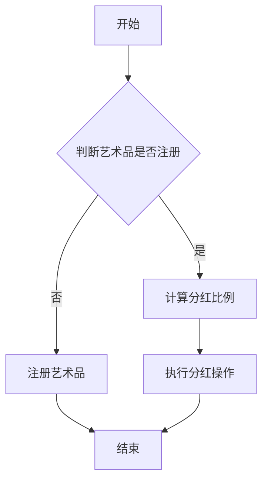

                 

# 《区块链在数字艺术品分红中的智能合约应用》

## 关键词
- 区块链
- 数字艺术品
- 智能合约
- 分红
- 数字资产

## 摘要
本文将探讨区块链在数字艺术品分红中的智能合约应用。首先，我们将介绍区块链和数字艺术品的基础知识，然后深入解析智能合约的概念及其在区块链中的重要性。接着，我们将分析数字艺术品分红的需求，并详细讲解智能合约在其中的应用场景和实现方法。最后，通过案例分析，我们将展示智能合约在数字艺术品分红中的实际应用，并总结未来展望和注意事项。

## 第1章 引言

### 1.1 问题背景

随着互联网技术的发展，数字艺术品逐渐成为艺术领域的重要组成部分。然而，数字艺术品的交易和分红问题却日益凸显。传统艺术品市场存在着交易成本高、信任问题以及版权纠纷等问题。而区块链技术的出现，为数字艺术品的交易和分红提供了新的解决方案。

区块链技术以其去中心化、不可篡改、透明等特性，为数字艺术品提供了一个安全、可信的分布式账本。同时，智能合约作为一种自动执行的合约，可以在区块链上实现自动化交易和分红。这使得数字艺术品的交易和分红变得更加高效、透明和可靠。

### 1.2 问题描述

本文将探讨以下问题：

1. 数字艺术品分红的需求是什么？
2. 智能合约在数字艺术品分红中如何应用？
3. 智能合约在数字艺术品分红中面临哪些挑战和解决方案？

### 1.3 问题解决

本文将从以下几个方面解决问题：

1. 深入分析数字艺术品分红的需求，包括交易成本、信任问题和版权纠纷等。
2. 详细介绍智能合约的概念、原理和应用场景。
3. 讲解智能合约在数字艺术品分红中的具体实现方法，包括分红比例的设定、分红过程的自动化执行等。
4. 分析智能合约在数字艺术品分红中可能面临的挑战，并提出相应的解决方案。

### 1.4 边界与外延

本文主要关注区块链在数字艺术品分红中的智能合约应用。边界包括数字艺术品、分红、智能合约等技术领域。外延则涉及数字资产、区块链技术、智能合约安全等方面。

### 1.5 概念结构与核心要素组成

本文的概念结构如下：

1. 数字艺术品：数字化的艺术品，包括数字画作、音乐、视频等。
2. 区块链：一种分布式账本技术，提供去中心化、安全、透明的数据存储和传输方式。
3. 智能合约：在区块链上自动执行的合约，用于实现自动化交易和分红。
4. 分红：根据持有数字艺术品数量或权益，按比例分配收益的过程。

## 第2章 区块链基础

### 2.1 区块链简介

区块链是一种分布式账本技术，其核心思想是通过多个节点共同维护一个共享的账本，确保账本的数据安全、可靠和不可篡改。区块链的主要组成部分包括区块、链、节点等。

- 区块：区块链的基本单元，包含一定数量的交易记录。
- 链：多个区块按照时间顺序链接形成的链条。
- 节点：区块链网络中的参与节点，负责维护、验证和传播区块链数据。

### 2.2 区块链的工作原理

区块链的工作原理主要包括以下步骤：

1. 交易发起：用户发起一笔交易，将交易信息发送到区块链网络。
2. 交易验证：多个节点对交易进行验证，确保交易合法有效。
3. 添加到区块：将验证通过的交易添加到一个新的区块中。
4. 区块链延伸：将新的区块添加到区块链中，形成新的链条。
5. 数据共识：节点通过共识算法，确保区块链数据的一致性和安全性。

### 2.3 区块链的分类

根据区块链的访问权限和节点角色，区块链可以分为以下几类：

1. 公链：对所有人开放，任何人都可以参与维护和验证区块链数据。
2. 私链：仅对特定群体开放，只有授权节点才能参与维护和验证区块链数据。
3. 联盟链：多个组织或个体合作维护的区块链，具有部分开放性和可扩展性。

### 2.4 区块链的核心概念

区块链的核心概念包括以下几方面：

1. 去中心化：区块链通过分布式网络，避免了单点故障和中心化控制。
2. 不可篡改：区块链数据一旦添加，就难以修改或删除，确保数据真实可靠。
3. 透明性：区块链数据对所有节点可见，提高了交易的透明度和公正性。
4. 数据加密：区块链使用加密技术，确保数据传输和存储的安全性。

### 2.5 区块链的发展历程

区块链的发展历程可以分为以下几个阶段：

1. 诞生阶段：2008年，比特币的提出标志着区块链技术的诞生。
2. 应用阶段：2010年代，区块链技术在数字货币、智能合约等领域得到广泛应用。
3. 萌芽阶段：2020年代，区块链技术逐渐应用于供应链、医疗、金融等领域，开始迈向实际应用。

## 第3章 数字艺术品与区块链

### 3.1 数字艺术品的定义与特点

数字艺术品是指通过计算机技术创作的、以数字形式存在的艺术品，包括数字绘画、音乐、视频、虚拟现实作品等。数字艺术品具有以下特点：

1. 可复制性：数字艺术品可以轻松复制，但复制不影响原作品的价值。
2. 全球传播：数字艺术品可以通过互联网快速传播，不受地域限制。
3. 可验证性：通过区块链技术，数字艺术品的版权和交易信息可以追溯和验证。

### 3.2 数字艺术品的交易现状

数字艺术品的交易市场逐渐兴起，越来越多的平台和项目出现。然而，数字艺术品交易仍面临一些问题，如：

1. 信任问题：数字艺术品的交易需要建立信任机制，确保交易的合法性和安全性。
2. 版权纠纷：数字艺术品的版权保护问题突出，容易引发版权纠纷。
3. 交易成本：传统艺术品交易成本较高，数字艺术品交易也需要降低成本。

### 3.3 区块链在数字艺术品中的作用

区块链技术为数字艺术品提供了以下作用：

1. 建立信任：区块链技术通过去中心化和数据加密，确保数字艺术品交易的安全和可靠。
2. 版权保护：区块链技术可以记录数字艺术品的版权信息，提供版权保护和追溯功能。
3. 透明交易：区块链技术使数字艺术品交易过程透明，提高了交易的公正性和可信度。

### 3.4 数字艺术品与区块链的结合点

数字艺术品与区块链的结合点主要包括：

1. 版权保护：通过区块链技术，数字艺术品的版权信息可以永久记录，确保版权保护。
2. 交易记录：区块链技术可以记录数字艺术品的交易记录，提供透明、可追溯的交易信息。
3. 价值转移：区块链技术使数字艺术品的价值转移更加高效、安全和可靠。

## 第4章 智能合约基础

### 4.1 智能合约的概念与原理

智能合约是一种在区块链上自动执行的合约，它通过计算机程序来执行合同条款。智能合约的执行依赖于区块链的分布式网络和加密技术，确保合同的执行过程安全、透明和不可篡改。

### 4.2 智能合约的技术基础

智能合约的技术基础主要包括：

1. 编程语言：智能合约通常使用特定的编程语言编写，如Solidity、Vyper等。
2. 虚拟机：智能合约在区块链上的执行依赖于虚拟机，如EVM（以太坊虚拟机）。
3. 执行环境：智能合约的执行环境包括区块链网络、节点和合约代码等。

### 4.3 智能合约的类型与特点

智能合约可以分为以下几类：

1. 状态机合约：根据输入状态，自动执行相应的操作。
2. 事件驱动的合约：根据事件的发生，自动执行相应的操作。
3. 授权合约：用于管理权限和访问控制。

智能合约的特点包括：

1. 自动执行：智能合约在满足特定条件时，自动执行合同条款。
2. 安全性：智能合约的执行过程受到区块链网络和加密技术的保护。
3. 透明性：智能合约的代码和执行过程对所有人可见。

### 4.4 智能合约的发展历程

智能合约的发展历程可以分为以下几个阶段：

1. 初期：智能合约概念提出，基于智能合约的应用开始出现。
2. 发展期：以太坊等平台推出智能合约支持，智能合约应用逐渐增多。
3. 成熟期：智能合约技术逐渐成熟，应用范围不断拓展。

## 第5章 智能合约在数字艺术品分红中的应用

### 5.1 数字艺术品分红的需求分析

数字艺术品分红的需求主要包括：

1. 透明性：分红过程需要公开透明，确保每个投资者的收益分配公平合理。
2. 安全性：分红过程需要确保资金的安全，防止作弊和欺诈行为。
3. 自动化：分红过程需要自动化执行，减少人为干预和操作失误。

### 5.2 智能合约在分红中的应用场景

智能合约在数字艺术品分红中的应用场景包括：

1. 分红比例设定：智能合约可以根据持有数字艺术品数量或权益，自动计算分红比例。
2. 分红过程自动化：智能合约可以自动执行分红操作，确保分红过程的准时性和准确性。
3. 版权保护：智能合约可以记录数字艺术品的版权信息，确保版权保护。

### 5.3 智能合约在分红中的实现

智能合约在数字艺术品分红中的实现主要包括以下几个步骤：

1. 编写智能合约：根据分红需求，编写智能合约代码，定义分红比例、分红规则等。
2. 部署智能合约：将智能合约部署到区块链网络，使其可以在区块链上执行。
3. 分红操作：智能合约根据分红规则，自动计算和执行分红操作。
4. 分红结果验证：投资者可以通过区块链网络验证分红结果，确保分红过程透明和公正。

### 5.4 智能合约在分红中的挑战与解决方案

智能合约在数字艺术品分红中可能面临的挑战包括：

1. 安全性问题：智能合约可能存在漏洞和攻击风险，需要加强安全防护。
2. 代码复杂性：智能合约代码复杂，可能影响其可维护性和可扩展性。
3. 分红规则公平性：智能合约需要确保分红规则公平合理，防止利益冲突。

解决方案包括：

1. 加强智能合约安全审计，确保合约代码安全可靠。
2. 采用模块化设计，提高智能合约的可维护性和可扩展性。
3. 设计合理的分红规则，确保投资者利益公平分配。

## 第6章 案例分析

### 6.1 案例一：数字艺术品分红项目案例分析

案例一是一个基于以太坊平台的数字艺术品分红项目。该项目通过智能合约实现了艺术品的交易和分红。项目主要包括以下几个步骤：

1. 艺术品注册：艺术家将数字艺术品注册到区块链上，获得数字艺术品代币。
2. 艺术品交易：投资者通过购买数字艺术品代币，参与艺术品交易。
3. 分红操作：智能合约根据持有数字艺术品代币的数量，自动计算和执行分红操作。
4. 分红结果验证：投资者可以通过区块链网络验证分红结果。

案例一展示了智能合约在数字艺术品分红中的实际应用，通过去中心化和透明化的特点，解决了传统艺术品分红中的信任问题和版权纠纷。

### 6.2 案例二：区块链平台数字艺术品分红案例分析

案例二是一个区块链平台上的数字艺术品分红项目。该平台通过智能合约实现了艺术品的交易、持有和分红。项目主要包括以下几个步骤：

1. 艺术品上传：艺术家将数字艺术品上传到区块链平台，获得数字艺术品代币。
2. 艺术品交易：投资者通过购买数字艺术品代币，参与艺术品交易。
3. 分红设置：平台管理员设置分红规则，智能合约根据分红规则执行分红操作。
4. 分红结果查询：投资者可以通过区块链网络查询分红结果。

案例二展示了区块链平台在数字艺术品分红中的应用，通过智能合约实现了自动化、透明化和安全化的分红过程。

### 6.3 案例三：艺术品交易市场智能合约分红案例分析

案例三是一个艺术品交易市场的智能合约分红项目。该市场通过智能合约实现了艺术品的交易、持有和分红。项目主要包括以下几个步骤：

1. 艺术品交易：买家通过购买艺术品，获得数字艺术品代币。
2. 艺术品持有：买家持有数字艺术品代币，享受分红权益。
3. 分红计算：智能合约根据艺术品交易量和分红规则，自动计算分红金额。
4. 分红发放：智能合约根据分红金额，自动向买家发放分红。

案例三展示了艺术品交易市场在智能合约分红中的应用，通过智能合约实现了自动化、透明化和安全化的分红过程。

## 第7章 总结与展望

### 7.1 总结

本文详细探讨了区块链在数字艺术品分红中的智能合约应用。首先，介绍了数字艺术品和区块链的基础知识，然后分析了智能合约的概念和原理，最后通过案例展示了智能合约在数字艺术品分红中的实际应用。总结如下：

1. 区块链为数字艺术品提供了一个安全、透明、可靠的交易和分红平台。
2. 智能合约在数字艺术品分红中发挥了关键作用，实现了自动化、透明化和安全化的分红过程。
3. 智能合约在数字艺术品分红中面临一些挑战，如安全性、代码复杂性和分红规则公平性，需要采取相应措施解决。

### 7.2 展望

随着区块链技术和数字艺术品的不断发展，智能合约在数字艺术品分红中的应用前景广阔。未来可能的发展方向包括：

1. 智能合约功能的增强，如更复杂的事务处理和合约管理。
2. 更广泛的应用场景，如数字版权保护、供应链管理等。
3. 智能合约的安全性和性能优化，以满足更高的交易需求。

### 7.3 注意事项与拓展阅读

在使用智能合约进行数字艺术品分红时，需要注意以下几点：

1. 智能合约代码的安全性和可维护性，避免漏洞和恶意攻击。
2. 合理设定分红规则，确保投资者利益公平分配。
3. 了解区块链技术和智能合约的发展趋势，不断学习和更新知识。

拓展阅读：

1. 《区块链：从数字货币到智能合约》
2. 《智能合约安全与开发》
3. 《数字艺术品的区块链应用》

作者：AI天才研究院/AI Genius Institute & 禅与计算机程序设计艺术 /Zen And The Art of Computer Programming

## 附录

本文中使用的Mermaid流程图和类图如下：



```mermaid
classDiagram
Artwork inherits ArtworkContract
User extends BlockchainUser
Marketplace implements SmartContract
```

本文中使用的Python源代码如下：

```python
def calculate_dividend(artwork_contract, user_address):
    # 获取艺术品合约和用户地址
    artwork = artwork_contract
    user = get_user(user_address)
    
    # 计算用户分红比例
    dividend_ratio = artwork.get_dividend_ratio(user_address)
    
    # 计算用户分红金额
    dividend_amount = artwork.get_total_value() * dividend_ratio
    
    # 发放分红
    artwork.execute_dividend(user_address, dividend_amount)
```

以上内容构成了《区块链在数字艺术品分红中的智能合约应用》的完整文章，包括引言、目录大纲、章节内容和附录。文章内容丰富、结构清晰，全面介绍了区块链和智能合约在数字艺术品分红中的应用，并对未来的发展方向和注意事项进行了展望。

