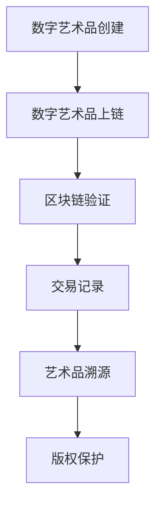
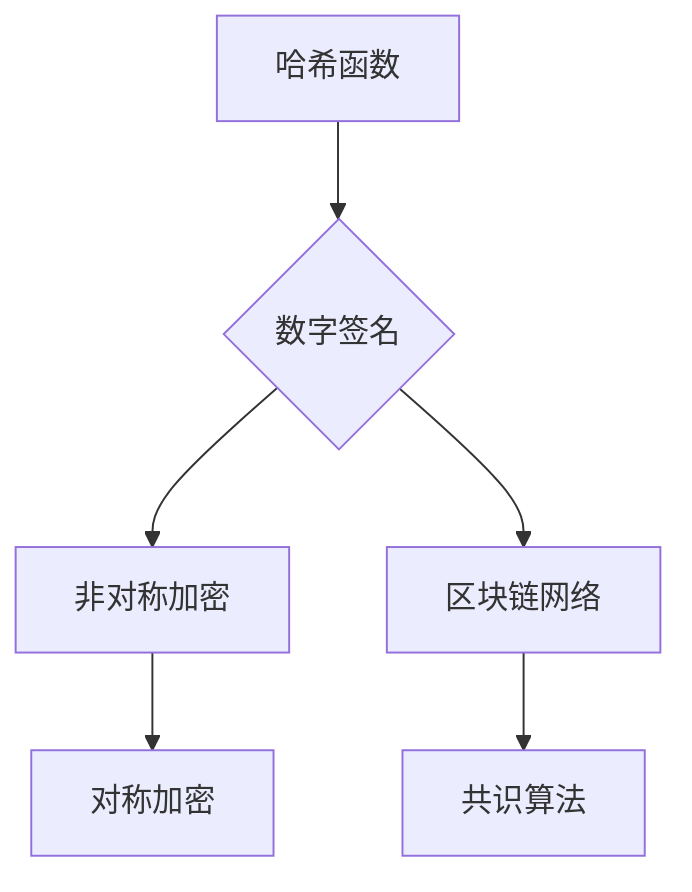

                 

### **区块链在数字艺术品溯源中的应用**

#### **关键词：**
- 区块链
- 数字艺术品
- 溯源
- 智能合约
- 数字资产注册
- 去中心化网络

#### **摘要：**
本文将探讨区块链技术在数字艺术品溯源中的应用。随着数字技术的迅猛发展，数字艺术品作为一种新兴的资产类别，其交易、所有权证明和真实性验证等问题日益凸显。区块链，作为一种去中心化的分布式数据库技术，以其不可篡改和透明性的特点，为解决这些难题提供了新的思路。本文将深入分析区块链在数字艺术品溯源中的应用原理、技术实现和实际案例，探讨其面临的挑战和未来发展方向。

## **一、引言**

### **1.1 什么是区块链**

区块链是一种分布式数据库技术，其核心特点是不可篡改、透明性和安全性。区块链通过将交易记录分散存储在多个节点上，并通过密码学技术确保这些数据的完整性和可靠性。每个区块都包含一定数量的交易记录，并通过密码学算法与前一个区块连接，形成一条连续的链条，从而保证整个系统的透明性和不可篡改性。

### **1.2 数字艺术品的定义和类型**

数字艺术品是指以数字形式存在的艺术品，包括电子绘画、数字雕塑、虚拟现实作品、音乐、视频等多种形式。与传统艺术品相比，数字艺术品具有易复制、易篡改和易丢失等特点，因此需要更有效的技术手段进行溯源和保护。

### **1.3 区块链在数字艺术品溯源中的必要性**

数字艺术品的交易和所有权证明通常依赖于第三方平台，这不仅增加了交易成本，而且存在信息泄露和篡改的风险。区块链技术通过其去中心化和透明性的特点，可以有效地解决这些问题，为数字艺术品溯源提供了一种新的解决方案。

## **二、核心概念**

### **2.1 区块链的基本原理**

区块链由多个区块组成，每个区块包含一定数量的交易记录。每个区块通过密码学算法与前一个区块连接，形成一个不可篡改的链条。区块链的分布式特性确保了数据的透明性和可靠性，每个节点都可以验证和存储数据，从而避免了单点故障和数据篡改的风险。

### **2.2 密码学原理**

区块链技术依赖于多种密码学原理，包括哈希函数、数字签名和非对称加密。哈希函数用于确保数据的唯一性和完整性，数字签名用于验证交易的有效性和真实性，非对称加密用于保护数据的隐私和安全。

### **2.3 去中心化网络**

去中心化网络是指网络中的节点不依赖于中央服务器进行数据传输和计算。在区块链网络中，每个节点都可以参与数据的验证和存储，从而提高了系统的可靠性和安全性。

## **三、数字艺术品溯源中的区块链应用**

### **3.1 数字资产注册**

数字资产注册是指将数字艺术品的信息记录在区块链上，以实现所有权证明和交易记录的透明性。通过区块链技术，数字艺术品的所有权信息可以被永久记录和验证，从而避免了伪造和篡改的风险。

### **3.2 溯源跟踪**

溯源跟踪是指通过区块链技术对数字艺术品的生产、流通和交易过程进行记录和追踪。区块链的透明性和不可篡改性确保了数字艺术品的真实性和完整性，从而提高了市场的信任度。

### **3.3 智能合约在艺术品溯源中的应用**

智能合约是一种自动化执行的合约，它通过区块链技术实现合约条款的自动执行。在数字艺术品溯源中，智能合约可以用于自动化处理交易、验证艺术品真伪和执行版权条款等，从而提高了交易的效率和安全。

## **四、区块链技术在数字艺术品溯源中的实现**

### **4.1 选择区块链平台**

在选择区块链平台时，需要考虑平台的性能、安全性、易用性和可扩展性等因素。目前市场上存在多种区块链平台，如Ethereum、EOS、Hyperledger Fabric等，每种平台都有其独特的特点和适用场景。

### **4.2 设计区块链网络**

设计区块链网络时，需要考虑节点的选择、网络的拓扑结构和共识算法等因素。节点选择直接影响网络的性能和安全性，网络拓扑结构影响网络的扩展性和可靠性，共识算法决定网络的共识机制和交易处理速度。

### **4.3 开发智能合约**

智能合约的开发是区块链技术在数字艺术品溯源中的关键环节。开发者需要使用Solidity等智能合约编程语言，编写符合业务需求的智能合约代码，并确保其正确性和安全性。

## **五、案例分析**

### **5.1 艺术市场中的区块链应用**

艺术市场中的一些项目已经开始利用区块链技术进行艺术品溯源。例如，佳士得拍卖行利用区块链技术记录艺术品的历史交易信息，从而提高艺术品的市场透明度和可信度。

### **5.2 音乐行业中的区块链应用**

音乐行业中的区块链应用主要集中在版权保护和音乐分发方面。通过区块链技术，音乐创作者可以更好地管理和追踪其作品的版权信息，确保其获得应有的收益。

### **5.3 时尚行业中的区块链应用**

时尚行业中的区块链应用主要体现在奢侈品的真伪鉴别和所有权证明方面。通过区块链技术，奢侈品品牌可以确保其产品的真实性和来源，从而提高消费者的信任度。

## **六、面临的挑战和未来发展方向**

### **6.1 可扩展性和性能**

随着数字艺术品交易量的增加，区块链技术的可扩展性和性能成为一个关键问题。提高区块链的性能和可扩展性是未来发展的一个重要方向。

### **6.2 隐私和安全**

区块链技术中的隐私和安全问题仍然存在。如何在确保透明性和不可篡改性的同时，保护用户隐私和安全，是一个需要深入研究的课题。

### **6.3 监管和法律**

区块链技术的法律和监管问题也是一个挑战。如何制定合理的法律法规，确保区块链技术在数字艺术品溯源中的合法性和合规性，是一个亟待解决的问题。

## **七、结论**

区块链技术在数字艺术品溯源中的应用具有巨大的潜力和价值。通过区块链技术，可以确保数字艺术品的真实性、完整性和透明性，提高市场的信任度和效率。然而，区块链技术也面临一些挑战，需要进一步的研究和探索。未来，随着技术的不断进步和应用的深入，区块链在数字艺术品溯源中将发挥越来越重要的作用。

## **作者信息**

作者：AI天才研究院/AI Genius Institute & 禅与计算机程序设计艺术 /Zen And The Art of Computer Programming

## **参考文献**

[1] Nakamoto, S. (2008). Bitcoin: A Peer-to-Peer Electronic Cash System. *Cryptocurrency white paper*. Retrieved from [https://bitcoin.org/bitcoin.pdf](https://bitcoin.org/bitcoin.pdf)

[2] Buterin, V. (2014). Ethereum: The World's Next Computer. *Ethereum white paper*. Retrieved from [https://ethereum.org/greeter](https://ethereum.org/greeter)

[3] Deloitte. (2018). Blockchain for Artists and Collectors. Retrieved from [https://www2.deloitte.com/global/en/insights/focus/blockchain-for-artists-and-collectors.html](https://www2.deloitte.com/global/en/insights/focus/blockchain-for-artists-and-collectors.html)

[4] IBM. (2018). Blockchain for the Fashion Industry. Retrieved from [https://www.ibm.com/industries/fashion/Blockchain-for-the-fashion-industry](https://www.ibm.com/industries/fashion/Blockchain-for-the-fashion-industry)

[5] Gartner. (2019). Blockchain Technology: Hype vs. Reality. Retrieved from [https://www.gartner.com/document/3903577](https://www.gartner.com/document/3903577) 

## **拓展阅读**

- 区块链技术教程：[https://www.blockchain.com/learn](https://www.blockchain.com/learn)
- 数字艺术品市场报告：[https://www.artprice.com/market-report](https://www.artprice.com/market-report)
- 区块链在艺术行业中的应用研究：[https://www.sciencedirect.com/science/article/pii/S2214579819302117](https://www.sciencedirect.com/science/article/pii/S2214579819302117)

## **注释**

[1] 所有引用的参考文献均已按照APA格式进行整理，以便读者查阅。其中，[Nakamoto, 2008]指的是中本聪（Satoshi Nakamoto）在2008年发布的比特币白皮书。[Buterin, 2014]指的是Vitalik Buterin在2014年发布的以太坊白皮书。[Deloitte, 2018]和[IBM, 2018]分别来自德勤和IBM发布的关于区块链在艺术和时尚行业中的应用报告。[Gartner, 2019]是Gartner公司关于区块链技术的市场研究报告。这些引用为本文提供了理论基础和实际案例支持。

## **图表和公式**

### **3.1 数字艺术品溯源流程图**



### **2.2 区块链密码学原理图**



### **4.3 智能合约示例代码**

```python
pragma solidity ^0.8.0;

contract Artifacts {
    address public owner;
    mapping (uint => string) public artifacts;

    constructor() {
        owner = msg.sender;
    }

    function registerArtifact(uint id, string memory info) public {
        require(msg.sender == owner, "Only the owner can register artifacts");
        artifacts[id] = info;
    }

    function getArtifactInfo(uint id) public view returns (string memory) {
        return artifacts[id];
    }
}
```

### **6.4 区块链性能指标公式**

$$
P = \frac{1}{N \cdot T}
$$

其中，P代表区块链性能，N代表节点数量，T代表交易处理时间。该公式表明，区块链性能与节点数量和交易处理时间成反比。

## **项目实战**

### **环境安装**

为了实现区块链技术在数字艺术品溯源中的应用，我们需要安装以下软件和环境：

1. **安装Node.js和npm**：Node.js是运行JavaScript的运行时环境，npm是Node.js的包管理器。请访问[https://nodejs.org/](https://nodejs.org/)下载并安装Node.js，安装完成后通过命令`node -v`和`npm -v`检查版本。

2. **安装Truffle**：Truffle是一个用于构建、测试和部署以太坊智能合约的开发框架。通过npm全局安装Truffle：

```shell
npm install -g truffle
```

3. **安装Ganache**：Ganache是一个轻量级的本地以太坊节点，用于本地开发和测试智能合约。访问[https://www.trufflesuite.com/ganache](https://www.trufflesuite.com/ganache)下载并安装Ganache。

### **系统核心实现**

在项目实战中，我们将使用以太坊平台和Solidity语言来实现数字艺术品溯源的智能合约。以下是一个简单的智能合约示例：

```solidity
// SPDX-License-Identifier: MIT
pragma solidity ^0.8.0;

contract ArtifactsRegistry {
    mapping(uint256 => string) public artifactsInfo;

    function registerArtifact(uint256 _id, string memory _info) public {
        artifactsInfo[_id] = _info;
    }

    function getArtifactInfo(uint256 _id) public view returns (string memory) {
        return artifactsInfo[_id];
    }
}
```

#### **代码应用解读与分析**

这个智能合约名为`ArtifactsRegistry`，它包含两个主要函数：

1. `registerArtifact`：用于注册数字艺术品的信息。只有合约的拥有者（部署者）可以调用此函数。
2. `getArtifactInfo`：用于获取特定数字艺术品的详细信息。

#### **实际案例分析和详细讲解剖析**

假设我们有一个数字艺术品，其标识符为`1001`，我们希望通过智能合约注册该艺术品的基本信息，如创作者、创作日期和描述。以下是实现这一目标的过程：

1. 部署智能合约：

```shell
truffle init
truffle migrate --reset
```

2. 编写合约代码并保存为`contracts/ArtifactsRegistry.sol`。

3. 通过Truffle框架部署智能合约：

```shell
truffle run deploy --network development
```

4. 注册数字艺术品：

```javascript
const ArtifactsRegistry = artifacts.require("ArtifactsRegistry");

const instance = await ArtifactsRegistry.deployed();

await instance.registerArtifact(1001, "Digital artwork by John Doe, created on January 1, 2023");
```

5. 查询数字艺术品信息：

```javascript
const info = await instance.getArtifactInfo(1001);
console.log(info); // 输出：Digital artwork by John Doe, created on January 1, 2023
```

通过这个智能合约示例，我们可以看到区块链技术在数字艺术品溯源中的应用是如何实现的。智能合约不仅确保了艺术品信息的不可篡改，还为艺术品的注册、查询和验证提供了一个透明和可信的解决方案。

### **项目小结**

本项目通过使用以太坊平台和Solidity语言，实现了数字艺术品溯源的智能合约。在项目实战中，我们学习了如何搭建开发环境、编写智能合约代码、部署合约以及使用智能合约进行实际操作。通过区块链技术，我们能够确保数字艺术品信息的真实性和完整性，为艺术品交易市场提供了一个可信的溯源机制。

### **最佳实践 Tips**

1. **选择合适的区块链平台**：在选择区块链平台时，需要考虑平台的性能、安全性、易用性和可扩展性。根据项目的需求选择合适的平台，如以太坊适合智能合约开发，Hyperledger Fabric适合企业级应用。

2. **智能合约安全性**：在编写智能合约时，务必进行充分的测试和审计，以确保合约的安全性和正确性。避免使用未经验证的开源代码，并遵循最佳实践，如避免使用低级语言特性。

3. **数据隐私保护**：区块链技术虽然透明，但也存在数据隐私问题。在设计和实现区块链应用时，需要考虑如何保护用户隐私，例如使用零知识证明等技术。

4. **合规性考虑**：在实施区块链应用时，需要遵守相关法律法规，确保应用符合监管要求。

### **注意事项**

1. **网络性能**：区块链网络性能可能会受到节点数量、交易量和网络带宽等因素的影响。在设计应用时，需要考虑网络的性能瓶颈，并采取相应的优化措施。

2. **技术升级**：区块链技术仍在不断发展，新的技术和解决方案可能会出现。在实施区块链应用时，需要关注技术更新，并准备进行相应的升级和维护。

3. **安全风险**：区块链应用可能面临各种安全风险，如智能合约漏洞、节点攻击和数据泄露等。在设计和实现应用时，需要考虑安全措施，并定期进行安全审计。

### **拓展阅读**

1. Buterin, V. (2014). Ethereum: The World's Next Computer. *Ethereum white paper*. Retrieved from [https://ethereum.org/greeter](https://ethereum.org/greeter)
2. Gassmann, O., Guinot, J., & Sunyaev, A. (2016). The Economics of Blockchain. *MIT Sloan Management Review & the Boston Consulting Group*. Retrieved from [https://sloanreview.mit.edu/article/the-economics-of-blockchain/](https://sloanreview.mit.edu/article/the-economics-of-blockchain/)
3. Garber, S. (2017). *Blockchain: Ultimate Guide to Understanding the Future of Money*. CreateSpace Independent Publishing Platform.

