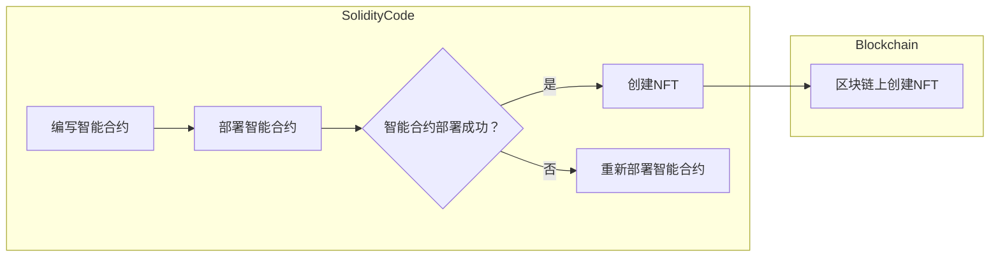
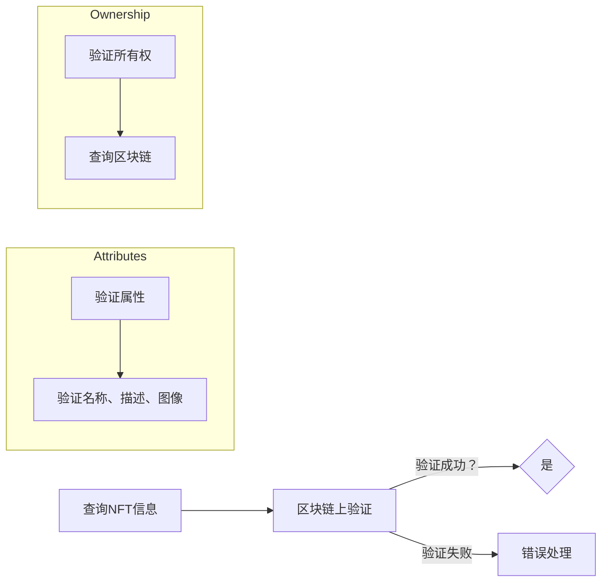
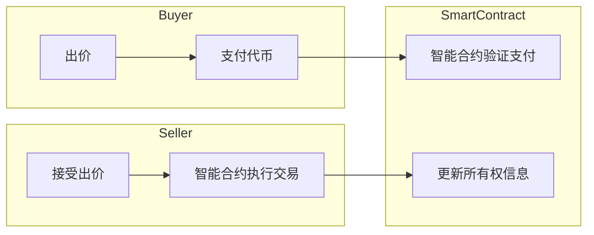
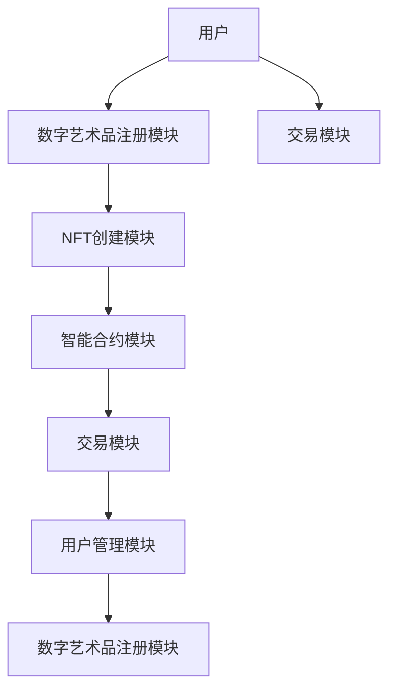
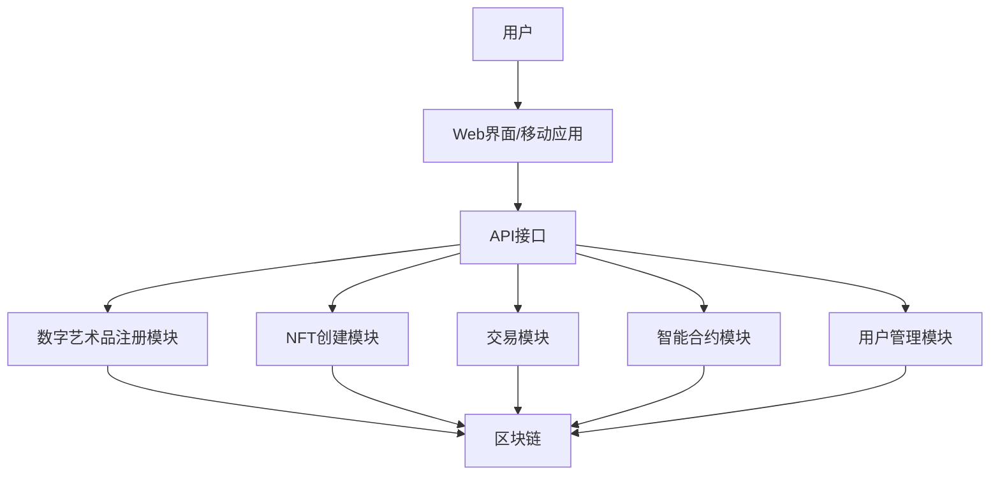

                 

### 区块链在数字艺术市场中的应用

区块链技术自2008年由中本聪（Satoshi Nakamoto）首次提出以来，已经迅速发展成为全球范围内的一种颠覆性技术。区块链的核心优势在于其去中心化、不可篡改和透明性，这使得它在金融、供应链管理、医疗等多个领域得到了广泛应用。近年来，随着数字艺术的兴起，区块链在数字艺术市场的应用也变得越来越重要。

数字艺术是一种利用数字技术和设备创作的艺术形式，包括但不限于数字绘画、数字雕塑、数字音乐和数字动画等。随着数字技术的发展，数字艺术作品越来越受欢迎，其市场价值也日益攀升。然而，传统的数字艺术市场面临着一些挑战，如版权纠纷、作品真伪鉴别、交易透明度等问题。

本文将围绕区块链在数字艺术市场中的应用展开讨论。首先，我们将介绍区块链技术和数字艺术市场的基本概念，以及它们的发展现状和挑战。接着，我们将深入探讨区块链在数字艺术市场的核心概念和联系，并通过非同质化代币（NFT）这一具体应用来讲解区块链的算法原理。最后，我们将分析区块链在数字艺术市场中的系统架构设计，并探讨该领域的前景和未来发展趋势。

通过本文的讨论，我们希望能够为读者提供关于区块链在数字艺术市场应用的一个全面而深入的视角，帮助读者理解这一新兴技术的潜力以及其面临的挑战。

#### **关键词**：

- 区块链技术
- 数字艺术市场
- 非同质化代币（NFT）
- 去中心化
- 透明性
- 版权保护
- 交易安全

#### **摘要**：

本文旨在探讨区块链技术在数字艺术市场中的应用。首先，通过介绍区块链技术的基本原理和数字艺术市场的现状，我们为读者搭建了一个理解背景的基础。然后，本文深入分析了区块链在数字艺术市场中的核心概念和联系，特别是通过NFT这一具体应用案例来讲解其算法原理。最后，我们探讨了区块链在数字艺术市场中的系统架构设计，并展望了其未来的发展趋势。通过本文，读者可以全面了解区块链技术在数字艺术市场中的潜力和挑战。

### 第一部分：区块链在数字艺术市场中的应用背景

#### 第1章：区块链与数字艺术市场概述

##### 1.1 区块链技术简介

区块链技术是一种去中心化的分布式数据库技术，通过多个节点之间的共识机制，实现了数据的存储和传输。区块链的基本原理是：通过密码学算法确保数据的不可篡改性，并利用共识机制确保多个节点之间的一致性。

区块链的核心特点包括去中心化、透明性、不可篡改性和安全性。去中心化意味着数据不由单一机构控制，而是分散存储在多个节点上。透明性则体现在所有数据都是公开可查的，保证了交易的透明度。不可篡改性确保了一旦数据被记录在链上，就不可更改，从而保证了数据的真实性。安全性则依赖于密码学算法，确保了数据在传输过程中的安全。

区块链的运作机制主要分为数据记录、共识机制和加密验证三个步骤。首先，数据被记录在一个区块中，并通过密码学算法加密。然后，区块通过共识机制（如工作量证明机制）被添加到区块链上。最后，区块链上的所有节点通过加密验证确保数据的一致性和安全性。

##### 1.2 数字艺术市场的发展现状

数字艺术是一种利用数字技术和设备创作的艺术形式，包括但不限于数字绘画、数字雕塑、数字音乐和数字动画等。数字艺术市场的规模在过去几年中迅速扩大，特别是在新冠疫情推动下，线上艺术市场的需求大幅增加。

根据相关市场报告，全球数字艺术市场的规模预计将从2021年的约200亿美元增长到2026年的超过500亿美元。这个增长主要得益于以下几个方面：

1. **技术进步**：数字技术的不断进步使得创作和展示数字艺术变得更加便捷和高效。
2. **市场需求**：随着人们对数字艺术的认知和接受度不断提高，市场需求也在不断增长。
3. **线上平台**：线上艺术品交易平台的出现和普及，使得数字艺术作品更容易被市场接受和交易。

尽管数字艺术市场前景广阔，但它也面临着一些挑战。首先，数字艺术的版权保护问题仍然是一个亟待解决的难题。由于数字艺术的复制和传播非常容易，因此如何确保创作者的权益成为了一个重要问题。其次，数字艺术市场的交易透明度和安全性也是一个挑战。传统的艺术市场往往存在信息不对称和交易不透明的问题，而区块链技术可以提供一种解决方案。

##### 1.3 数字艺术市场的现状分析

当前，数字艺术市场呈现出几个显著的趋势：

1. **市场增长**：随着数字技术的发展和消费者对数字艺术作品的认可度提高，数字艺术市场的规模正在快速增长。
2. **多元化**：数字艺术的类型和形式越来越丰富，从静态图像到动态视频，从虚拟现实到增强现实，数字艺术的表现形式不断创新。
3. **交易渠道**：线上艺术品交易平台和数字画廊等新兴渠道正在成为数字艺术交易的重要平台。
4. **版权保护**：区块链技术在数字艺术版权保护方面的应用逐渐增多，为创作者提供了更加安全可靠的版权保护机制。

然而，数字艺术市场也面临着一些挑战：

1. **技术难题**：尽管区块链技术为数字艺术市场提供了一些解决方案，但其复杂性和技术门槛仍然是一个问题。
2. **法规政策**：不同国家和地区对数字艺术的法规和政策有所不同，这对市场的规范化发展带来了一定的挑战。
3. **市场接受度**：尽管数字艺术市场正在快速增长，但仍然存在一些消费者对其认可度和接受度不高的问题。

##### 1.4 区块链在数字艺术市场的应用挑战

区块链在数字艺术市场的应用面临着多个挑战：

1. **技术挑战**：区块链技术的复杂性和技术门槛较高，这导致了一些潜在用户难以理解和应用。
2. **法规与政策挑战**：不同国家和地区对区块链技术的法规和政策存在差异，这给区块链在数字艺术市场的应用带来了一定的不确定性。
3. **市场接受度挑战**：虽然区块链技术在数字艺术市场的应用具有巨大的潜力，但市场对其接受度仍然较低，特别是在一些传统的艺术圈。

##### 1.5 区块链在数字艺术市场的应用前景

尽管面临着诸多挑战，区块链在数字艺术市场的应用前景仍然非常广阔：

1. **创新潜力**：区块链技术可以为数字艺术市场带来新的商业模式和创新机会。
2. **商业模式变革**：区块链技术可以解决传统艺术市场中的痛点，如版权保护和交易透明度，从而推动商业模式的变革。
3. **社会文化影响**：区块链技术的应用可以改变人们对数字艺术作品的认知和交易方式，对社会文化产生深远影响。

通过以上分析，我们可以看到区块链技术在数字艺术市场中的巨大潜力和广阔前景。在接下来的章节中，我们将进一步探讨区块链在数字艺术市场的核心概念和联系，并通过NFT这一具体应用来深入分析其算法原理。同时，我们还将分析区块链在数字艺术市场中的系统架构设计，以期为读者提供一个全面而深入的视角。

### 第二部分：区块链在数字艺术市场中的应用原理

#### 第2章：区块链在数字艺术市场的核心概念与联系

##### 2.1 区块链与数字艺术市场的核心概念

区块链技术在数字艺术市场中的应用离不开对区块链和数字艺术的基本概念的理解。以下是这两个核心概念的定义及其在数字艺术市场中的应用：

###### 2.1.1 区块链的基本概念

区块链是一种分布式账本技术，通过加密算法和共识机制确保数据的安全性和不可篡改性。区块链由多个区块组成，每个区块包含一定数量的交易记录。这些区块通过加密链接在一起，形成一条不可篡改的链。区块链的核心组成部分包括：

1. **区块**：区块是区块链的基本单位，包含一定数量的交易记录。
2. **链**：链是由多个区块按时间顺序链接而成，保证了数据的一致性和不可篡改性。
3. **共识机制**：共识机制是区块链节点之间达成一致的方式，用于确保数据的准确性和一致性。

区块链的基本原理是通过加密算法对交易记录进行验证和封装，然后通过共识机制将封装后的交易记录添加到区块链上。区块链的核心特点包括去中心化、透明性、不可篡改性和安全性。

区块链在数字艺术市场的应用主要体现在以下几个方面：

1. **版权保护**：通过区块链技术，艺术家可以实现对作品的数字签名，确保作品的真实性和所有权。
2. **透明交易**：区块链的透明性使得数字艺术交易过程公开透明，减少了信息不对称。
3. **去中心化市场**：区块链技术可以为数字艺术市场提供一个去中心化的交易平台，减少对中心化机构的依赖。

###### 2.1.2 数字艺术的基本概念

数字艺术是一种利用数字技术和设备创作的艺术形式，其创作和展示过程完全依赖于数字技术。数字艺术包括多种类型，如数字绘画、数字雕塑、数字音乐、数字动画和虚拟现实等。数字艺术作品的特点是具有高度的灵活性和可复制性。

数字艺术的核心概念包括：

1. **创作工具**：数字艺术创作依赖于各种数字工具和软件，如Adobe Photoshop、Autodesk 3ds Max等。
2. **展示形式**：数字艺术作品可以通过数字屏幕、虚拟现实设备等多种方式进行展示。
3. **价值体现**：数字艺术作品的价值不仅体现在艺术性上，还体现在其稀缺性和独特性上。

数字艺术在区块链中的应用主要体现在以下几个方面：

1. **数字身份认证**：区块链技术可以为数字艺术作品提供一个数字身份认证，确保作品的真实性和唯一性。
2. **可追溯性**：区块链的不可篡改性确保了数字艺术作品的创作和交易过程可以追溯，增加了透明度和可信度。
3. **版权保护**：通过区块链技术，艺术家可以实现对作品的版权保护，防止未经授权的复制和传播。

##### 2.2 区块链与数字艺术市场的联系

区块链与数字艺术市场的联系主要体现在以下几个方面：

1. **去中心化创作与共享**：区块链技术可以为数字艺术创作和共享提供一个去中心化的平台，减少对中心化机构的依赖，促进艺术作品的自由流动。
2. **数字艺术品的所有权证明**：区块链技术可以实现对数字艺术品的所有权进行数字化证明，确保作品的所有权和真实性。
3. **透明与可追溯性**：区块链的透明性和不可篡改性确保了数字艺术作品创作和交易过程的可追溯性，提高了市场的透明度和可信度。

###### 2.2.1 区块链技术在数字艺术市场中的应用

区块链技术在数字艺术市场中的应用主要包括以下几个方面：

1. **数字身份认证**：区块链技术可以为数字艺术创作者和收藏家提供一个数字身份认证，确保用户身份的真实性和可信度。
2. **版权保护**：区块链技术可以实现对数字艺术作品的版权进行保护，防止未经授权的复制和传播。例如，通过智能合约自动执行版权许可和分成协议。
3. **透明交易**：区块链技术可以为数字艺术交易提供一个透明的平台，减少信息不对称，提高交易的公正性和可信度。
4. **去中心化交易平台**：区块链技术可以创建一个去中心化的数字艺术交易平台，减少对中心化平台的依赖，降低交易成本，提高市场效率。

###### 2.2.2 数字艺术市场的现状与区块链的融合

当前，数字艺术市场正在与区块链技术深度融合，表现出以下几个特点：

1. **市场快速增长**：随着数字艺术市场的不断扩大，越来越多的艺术家和收藏家开始使用区块链技术进行创作和交易。
2. **技术创新**：区块链技术在数字艺术市场的应用推动了市场技术的不断创新，如非同质化代币（NFT）的兴起。
3. **政策支持**：一些国家和地区开始出台相关政策，支持区块链技术在数字艺术市场的应用，推动市场的规范化发展。

然而，数字艺术市场与区块链技术的融合也面临一些挑战，如技术复杂度、法规政策不确定性等。为了解决这些问题，需要各方共同努力，推动技术的普及和法规的完善。

###### 2.2.3 区块链与数字艺术市场的未来趋势

随着区块链技术的不断发展和普及，区块链与数字艺术市场的融合趋势将越来越明显，未来可能出现以下趋势：

1. **市场规范化**：随着政策的完善和技术的普及，数字艺术市场将逐渐走向规范化，减少信息不对称，提高市场透明度和可信度。
2. **技术创新**：区块链技术将继续推动数字艺术市场的技术创新，如NFT的广泛应用，将为市场带来更多新的商业模式。
3. **跨界合作**：区块链技术与数字艺术市场的融合将促进不同行业之间的合作，推动数字艺术市场的跨界发展。
4. **社会文化影响**：区块链技术在数字艺术市场的应用将改变人们的创作和消费方式，对社会文化产生深远影响。

通过以上分析，我们可以看到区块链技术在数字艺术市场中具有重要的应用价值和广阔的前景。在接下来的章节中，我们将进一步探讨区块链在数字艺术市场中的具体应用实例，以深入理解其算法原理和系统架构。

#### 2.1.1 区块链的基本概念

区块链是一种去中心化的数据库，它通过一系列按时间顺序排列的记录（区块）形成一条链式数据结构。每个区块包含一组交易记录，以及一个时间戳和一个指向前一个区块的哈希值。这种设计确保了区块链的不可篡改性，因为一旦一个区块被添加到链中，想要篡改该区块将导致整个链的哈希值发生变化，从而引起链中其他区块的不一致。

###### **2.1.1.1 区块链的组成部分**

区块链的核心组成部分包括以下几部分：

1. **区块（Block）**：区块是区块链的基本单元，包含一组交易记录、一个时间戳和一个指向前一个区块的哈希值。
2. **链（Chain）**：链是由多个区块按照特定顺序链接而成的数据结构，每个区块通过其哈希值与前一个区块相连，形成一条不可篡改的链条。
3. **分布式账本（Distributed Ledger）**：区块链本质上是一个分布式账本，记录在多个节点上，而不是一个集中的位置。这意味着区块链具有去中心化的特点。
4. **共识机制（Consensus Mechanism）**：共识机制是区块链网络中的节点如何达成一致并确认交易的方法。常见的共识机制包括工作量证明（PoW）、权益证明（PoS）和委托权益证明（DPoS）等。

###### **2.1.1.2 区块链的工作原理**

区块链的工作原理可以分为以下几个步骤：

1. **交易生成**：用户发起交易，将交易信息发送到区块链网络。
2. **交易验证**：网络中的节点对交易进行验证，确保交易的有效性和合法性。交易验证通常涉及以下步骤：
   - **确认交易费用**：节点需要支付一定的费用才能将交易记录下来。
   - **检查交易输入和输出的合法性**：确保每个交易的输入和输出都符合区块链的规则。
   - **检查双重支付攻击**：确保同一个加密货币不会被用于两个不同的交易。
3. **区块创建**：当一个区块满了（通常是包含一定数量的交易），一个矿工（在PoW共识机制下）会生成一个新的区块并将其添加到区块链上。
4. **区块广播**：新的区块被生成后，会被广播到网络中的其他节点。
5. **区块验证**：其他节点验证新区块的有效性，包括检查其时间戳和前一个区块的哈希值。
6. **共识达成**：一旦新区块被大多数节点验证通过，网络就达成共识，认为该区块是合法的，并将其添加到区块链上。

通过这种机制，区块链确保了数据的一致性和安全性，同时也实现了去中心化的特点。

###### **2.1.1.3 区块链的核心特点**

区块链的核心特点包括：

1. **去中心化**：区块链不是由单一的机构或组织控制，而是由网络中的多个节点共同维护。这种去中心化的特性提高了系统的鲁棒性和抗攻击性。
2. **透明性**：区块链上的所有交易记录都是公开可查的，任何人都可以查看区块链上的数据。这种透明性提高了交易的可信度和透明度。
3. **不可篡改性**：一旦数据被记录在区块链上，就几乎不可能被篡改。这是因为每个区块都包含了前一个区块的哈希值，任何对区块的篡改都会导致整个链的不一致。
4. **安全性**：区块链使用加密算法确保数据的完整性和安全性。加密技术不仅保证了数据在传输过程中的安全，还防止了未经授权的访问和篡改。

通过以上对区块链基本概念、工作原理和核心特点的介绍，我们可以更好地理解区块链技术在数字艺术市场中的应用潜力。在接下来的内容中，我们将继续探讨数字艺术的基本概念及其与区块链的融合。

#### 2.1.2 数字艺术的基本概念

数字艺术是一种利用计算机技术和数字媒体创作的艺术形式，它不仅包括传统绘画和雕塑的数字化表达，还涵盖了更多元化的创作方式和表现形式。数字艺术的分类可以依据其创作手段、展示方式和内容特点等多个维度进行划分。

首先，从创作手段来看，数字艺术可以分为以下几种：

1. **数字绘画**：利用数字绘图软件创作的艺术作品，如Adobe Photoshop、Corel Painter等。这种形式的数字艺术保留了传统绘画的许多特点，同时增加了色彩调整、图层叠加等数字技术带来的创作可能性。
2. **数字雕塑**：利用计算机辅助设计（CAD）和三维打印技术创作的艺术作品。数字雕塑可以创造出传统雕塑难以实现的复杂形状和结构，展现了数字技术带来的创作自由。
3. **数字动画**：通过计算机生成的一系列连续图像，以动画的形式展示。这种艺术形式不仅包括了二维动画，还涵盖了三维动画、虚拟现实动画等多种形式。
4. **虚拟现实艺术**：利用虚拟现实（VR）技术创作的艺术作品，为观众提供沉浸式的艺术体验。虚拟现实艺术可以将观众带入一个完全虚构的世界，增强了作品的互动性和体验感。

其次，从展示方式来看，数字艺术可以分为以下几种：

1. **屏幕展示**：数字艺术作品可以通过电脑屏幕、电视屏幕、广告屏幕等多种数字屏幕进行展示。这种展示方式具有快捷、高效、便于传播的特点。
2. **数字画廊**：数字画廊是一种在线平台，用于展示和销售数字艺术作品。数字画廊不仅可以展示静态图像，还可以展示动态视频和虚拟现实作品，为艺术家和收藏家提供了一个便捷的交易渠道。
3. **线下展览**：虽然数字艺术作品主要以数字形式创作，但许多艺术家也会选择在线下展览馆进行实体展示。这种展览方式结合了数字艺术与传统艺术的形式，为观众提供了一个全新的艺术体验。

最后，从内容特点来看，数字艺术具有以下几个显著特点：

1. **互动性**：数字艺术作品通常具有较强的互动性，观众可以通过触摸屏幕、手势操作等方式与作品进行互动。这种互动性不仅增加了观众的参与感，还可以使艺术作品更加生动和有趣。
2. **可变性**：由于数字艺术作品的创作和展示过程依赖于计算机技术，这些作品可以随时进行修改和更新。这种可变性使得数字艺术作品能够适应不同的环境和需求，增加了其灵活性和多样性。
3. **可复制性**：数字艺术作品的创作和复制非常容易，因为它们主要以数字形式存在。然而，正是这种可复制性也带来了一些挑战，如版权保护和作品真伪鉴别。

综上所述，数字艺术是一种充满创新和多样性的艺术形式，它利用计算机技术和数字媒体创造出了许多独特的艺术作品和表现形式。在接下来的内容中，我们将进一步探讨数字艺术市场的发展历程和现状，以及区块链技术如何为这个市场带来变革性的影响。

#### 2.1.2.2 数字艺术市场的发展历程

数字艺术市场的发展历程可以追溯到20世纪90年代，当时计算机技术和互联网的普及为艺术创作和传播带来了前所未有的变革。以下是数字艺术市场发展的几个关键阶段：

1. **早期探索阶段（1990s）**：在互联网初期，一些艺术家开始尝试使用数字工具创作艺术作品，如使用计算机软件进行绘画、设计和动画制作。这一时期的数字艺术作品多为实验性的，并未得到广泛的认可和关注。

2. **互联网普及阶段（2000s）**：随着互联网的普及，数字艺术逐渐进入了公众视野。在线画廊、艺术网站和社交媒体平台的出现，为数字艺术家提供了展示和推广作品的渠道。这一阶段的数字艺术市场开始初步成型，但仍处于边缘状态。

3. **智能手机和移动设备阶段（2010s）**：智能手机和移动设备的普及，使得数字艺术的创作和传播更加便捷。艺术家可以利用移动设备上的应用程序进行创作，观众也可以通过手机等设备随时随地欣赏数字艺术作品。这一阶段的数字艺术市场迎来了快速发展。

4. **区块链技术的兴起（2020s）**：近年来，区块链技术的兴起为数字艺术市场带来了革命性的变化。区块链技术通过其去中心化、透明性和不可篡改性的特点，为数字艺术作品的版权保护、交易透明度和安全性提供了新的解决方案。NFT（非同质化代币）的兴起更是将数字艺术品的价值提升到了一个新的高度。

在数字艺术市场的发展历程中，有几个重要事件标志着市场的逐步成熟和认可：

1. **eBay和Sotheby's等在线拍卖平台的引入**：这些平台的引入使得数字艺术作品可以像传统艺术品一样进行在线拍卖和交易，提高了市场的透明度和效率。

2. **NFT的兴起**：NFT（非同质化代币）的兴起标志着数字艺术市场的又一重要变革。NFT通过区块链技术为数字艺术作品提供了一个唯一的数字身份，确保了作品的真实性和所有权，同时也为数字艺术品的市场化提供了新的机会。

3. **艺术基金和投资机构的关注**：随着数字艺术市场的兴起，越来越多的艺术基金和投资机构开始关注这个领域。他们的参与不仅为数字艺术市场提供了资金支持，也提高了市场的专业性和公信力。

总的来说，数字艺术市场的发展历程反映了技术与艺术融合的强大力量。随着技术的不断进步和市场的逐步成熟，数字艺术市场有望在未来继续保持高速增长，并在艺术领域占据重要地位。

#### 2.1.2.3 数字艺术市场的现状分析

当前，数字艺术市场呈现出蓬勃发展的态势，其市场规模和参与者数量都在不断增长。以下是数字艺术市场的几个现状：

1. **市场规模扩大**：根据市场研究机构的数据，全球数字艺术市场的规模在过去几年中持续增长。2021年，全球数字艺术市场的总价值已经超过200亿美元，预计到2026年将达到500亿美元以上。这一增长主要得益于技术的进步和消费者对数字艺术作品的认可度提高。

2. **多元化作品形式**：数字艺术的创作形式越来越丰富，从静态图像和动态视频，到虚拟现实（VR）和增强现实（AR）等新兴形式，艺术家们利用先进的数字技术探索更多的创作可能。这种多元化的作品形式不仅吸引了更多的观众，也推动了市场的发展。

3. **线上交易平台崛起**：随着互联网的普及，线上交易平台成为了数字艺术交易的主要渠道。许多新兴平台如OpenSea、Rarible和SuperRare等，通过区块链技术为艺术家和收藏家提供了一个透明、安全的交易环境。这些平台的出现降低了交易门槛，提高了交易的效率。

4. **NFT的兴起**：NFT（非同质化代币）的兴起是数字艺术市场的一个重要里程碑。NFT通过区块链技术为数字艺术作品提供了一个唯一的数字身份，确保了作品的真实性和所有权。NFT市场的火爆不仅提升了数字艺术作品的价值，也为艺术家提供了新的商业模式。

5. **市场接受度提高**：尽管数字艺术市场在早期面临一些质疑和挑战，但如今越来越多的消费者和收藏家开始接受和投资数字艺术作品。这种市场接受度的提高不仅反映了消费者对数字艺术的认可，也为市场的持续发展提供了动力。

然而，数字艺术市场也面临一些挑战：

1. **技术复杂度**：区块链技术虽然为数字艺术市场提供了新的解决方案，但其复杂性和技术门槛仍然是一个问题。许多潜在用户可能难以理解和使用区块链技术，这限制了市场的普及。

2. **法规政策不确定性**：不同国家和地区对区块链技术的法规和政策有所不同，这给市场的规范化发展带来了一定的挑战。例如，一些国家对NFT的监管较为严格，这可能影响市场的健康发展。

3. **市场泡沫**：尽管NFT市场火爆，但也存在一定的泡沫现象。一些数字艺术作品的价格被人为推高，市场泡沫可能会在未来引发风险。

总的来说，数字艺术市场目前正处于快速发展阶段，尽管面临一些挑战，但其广阔的前景和巨大的潜力仍然吸引着越来越多的参与者。在接下来的内容中，我们将进一步探讨区块链技术在数字艺术市场中的应用，以及它如何解决传统市场的痛点。

#### 2.1.3 区块链在数字艺术市场的应用挑战

区块链技术在数字艺术市场的应用尽管具有巨大的潜力，但同时也面临一些显著的挑战：

1. **技术挑战**：区块链技术的复杂性和高技术门槛是首先需要克服的问题。许多艺术家和创作者可能不具备足够的区块链知识和技能，这使得他们在应用这项技术时感到困惑和不便。此外，区块链技术的性能和扩展性也是一个重要问题，尤其是在高流量和高并发的场景下，区块链网络可能会出现延迟和拥堵。

2. **法规与政策挑战**：不同国家和地区对区块链技术的法规和政策有所不同，这为数字艺术市场的国际化发展带来了不确定性。例如，某些国家对NFT的发行和交易有严格的限制，这可能会阻碍市场的扩展。此外，区块链技术的匿名性也引起了监管机构的关注，如何确保合规性和透明性成为亟待解决的问题。

3. **市场接受度挑战**：尽管区块链技术为数字艺术市场提供了许多潜在的优势，但市场对其接受度仍然较低。许多消费者和收藏家对区块链技术和NFT的理解有限，他们可能对使用这种新兴技术进行艺术交易持谨慎态度。此外，一些传统的艺术品收藏家可能认为区块链技术并非必需品，这限制了市场的普及。

4. **安全性挑战**：区块链技术虽然在数据安全性方面具有显著优势，但仍存在一些潜在的安全风险。例如，恶意攻击、网络钓鱼和诈骗等威胁仍然存在。此外，智能合约的安全性问题也是一大隐患，一旦智能合约存在漏洞，可能会被不法分子利用，导致严重的损失。

5. **经济成本**：区块链技术的应用通常涉及较高的经济成本，包括交易费用、存储费用和计算资源等。对于一些小型艺术家和创作者来说，这些成本可能成为他们采用区块链技术的障碍。

面对这些挑战，区块链在数字艺术市场的应用需要各方共同努力，通过技术创新、政策引导和市场教育来逐步克服。例如，可以通过简化区块链技术的使用界面，提高其易用性；通过国际合作和法规统一，增强市场的稳定性；通过市场教育和宣传，提高消费者对区块链技术和NFT的认知和接受度。通过这些措施，区块链在数字艺术市场的应用前景将更加广阔。

#### 2.1.4 区块链在数字艺术市场的应用前景

尽管区块链在数字艺术市场中的应用面临诸多挑战，但其前景依然十分广阔。以下是区块链技术在数字艺术市场中的几个潜在应用前景：

1. **创新潜力**：区块链技术具有巨大的创新潜力，可以推动数字艺术市场的商业模式、创作方式和市场结构发生根本性变革。例如，NFT的兴起已经改变了艺术作品的交易和所有权验证方式，使得数字艺术作品的价值得到更全面的体现。未来，随着区块链技术的不断发展，更多创新的数字艺术形式和商业模式有望涌现。

2. **商业模式变革**：区块链技术可以为数字艺术市场带来全新的商业模式。通过去中心化的交易平台和智能合约，艺术家可以直接与买家进行交易，减少了中间环节，降低了交易成本。此外，区块链技术还可以实现版税自动化支付，确保艺术家在作品售出后依然能够获得合理的收益。

3. **版权保护**：区块链技术在数字艺术市场的版权保护方面具有显著优势。通过区块链，艺术家可以实现对作品的数字签名，确保作品的真实性和唯一性。任何对作品的修改和传播都可以被记录在链上，从而提供完整的版权保护。这对于解决传统数字艺术市场的版权纠纷问题具有重要意义。

4. **交易透明度和安全性**：区块链的透明性和不可篡改性为数字艺术交易提供了更高的安全性。所有交易记录都公开可查，减少了信息不对称和欺诈风险。此外，区块链技术还可以通过智能合约自动执行交易规则，确保交易过程的公平和合规。

5. **社会文化影响**：区块链技术在数字艺术市场的应用将对社会文化产生深远影响。通过区块链，艺术家和创作者可以更便捷地创作和展示作品，观众也可以更方便地获取和欣赏艺术作品。这种技术的普及将推动数字艺术的普及，使更多人能够参与到艺术创作和欣赏中来，从而丰富社会文化生活。

6. **市场国际化**：区块链技术可以打破地域限制，促进数字艺术市场的国际化发展。通过去中心化的交易平台，艺术家和买家可以跨越国界进行交易，使得全球艺术市场更加开放和互联。此外，区块链技术还可以提供一种跨境支付解决方案，简化国际交易的流程和成本。

总的来说，区块链技术在数字艺术市场的应用前景十分广阔。随着技术的不断进步和市场的逐步成熟，区块链技术有望为数字艺术市场带来更多创新和机遇，推动市场的发展。在接下来的章节中，我们将通过具体案例和算法原理来深入探讨区块链技术在数字艺术市场中的应用。

#### 2.1.4.1 创新潜力

区块链技术为数字艺术市场带来了前所未有的创新潜力，主要体现在以下几个方面：

1. **去中心化的艺术创作与交易**：区块链的去中心化特性使得艺术家可以直接与买家进行交易，无需依赖传统的中心化平台和中介机构。这种模式不仅降低了交易成本，还减少了信息不对称和中介费用，从而提高了市场的效率。例如，艺术家可以通过创建非同质化代币（NFT）直接将其作品数字化，并在去中心化平台上进行销售，买家可以直接购买并持有唯一版数字资产的所有权。

2. **智能合约与自动化**：智能合约是区块链技术的一个重要应用，它允许在满足特定条件时自动执行合同条款。在数字艺术市场中，智能合约可以用于版税支付、授权许可和版权保护等方面。例如，艺术家可以通过智能合约自动设置版税分成比例，每当其作品被再次销售时，相应的版税会自动分配给艺术家和其他相关方。这种自动化机制不仅提高了交易效率，还减少了人为错误和纠纷。

3. **数字身份与认证**：区块链技术可以用于创建和验证数字身份，确保艺术家的身份和作品的真实性。通过数字签名和加密算法，艺术家可以为其作品提供唯一的数字身份证明，防止伪造和盗版。此外，区块链上的交易记录和所有权变更都可以追溯，提高了市场透明度和可信度。

4. **创作者激励**：区块链技术可以为创作者提供新的激励机制，通过代币奖励和粉丝支持来鼓励艺术创作。例如，一些去中心化平台允许粉丝通过购买NFT或其他代币来支持他们喜欢的艺术家，从而获得一定程度的版权收益或特殊福利。这种激励机制不仅能够激励创作者持续创作高质量作品，还能够建立起更紧密的创作者与粉丝关系。

5. **多元化艺术形式**：区块链技术可以支持更多元化的艺术形式，包括虚拟现实（VR）、增强现实（AR）和数字动画等。通过区块链，这些艺术形式可以拥有独特的数字身份，并为创作者和收藏家提供新的展示和交易渠道。例如，一个虚拟画廊可以通过区块链技术展示和销售虚拟艺术品，观众可以在虚拟世界中浏览和购买这些作品。

6. **跨平台协作**：区块链技术可以促进艺术家之间的跨平台协作，通过去中心化的方式实现资源的共享和收益的分配。艺术家可以通过区块链平台合作创作，共享创意和技术资源，从而提高作品的质量和市场竞争力。

总的来说，区块链技术为数字艺术市场带来了丰富的创新机会，通过去中心化、智能合约、数字身份认证、创作者激励和多元化艺术形式等方面，推动了市场的发展和变革。在接下来的章节中，我们将进一步探讨区块链技术如何在实际的数字艺术市场中发挥作用，并分析其商业模式变革。

#### 2.1.4.2 商业模式变革

区块链技术在数字艺术市场中的引入，正在引发一系列商业模式上的变革，这些变革不仅影响了艺术品的交易方式，还重新定义了艺术家、收藏家和市场的角色与关系。

1. **去中心化交易平台**：传统艺术市场依赖于中心化的拍卖行和画廊等中介机构，这些机构不仅提高了交易成本，还可能在某些情况下影响交易的公平性。区块链技术通过去中心化的交易平台，如OpenSea、Rarible和SuperRare等，使艺术家能够直接与买家进行交易，无需依赖中介机构。这不仅降低了交易成本，还提高了市场的透明度和效率。

2. **NFT与版税自动化**：非同质化代币（NFT）的引入使得数字艺术品的所有权和版权变得更加明确和可验证。艺术家可以通过在区块链上创建NFT，确保其作品的唯一性和真实性。此外，智能合约的引入使得版税支付可以自动化执行。每当一个NFT被转卖，智能合约会自动将版税按照事先设定的比例支付给艺术家和其他相关方。这种自动化机制不仅保障了艺术家的权益，还简化了版税分配的流程。

3. **创作者激励与粉丝经济**：区块链技术为艺术家提供了新的激励机制，通过代币奖励和粉丝支持来鼓励艺术创作。粉丝可以通过购买NFT或其他代币来支持他们喜欢的艺术家，从而获得一定的版权收益或特殊福利。这种模式不仅能够激励艺术家持续创作高质量作品，还能够建立起更紧密的创作者与粉丝关系，形成一种新的粉丝经济模式。

4. **跨平台协作与资源共享**：区块链技术促进了艺术家之间的跨平台协作，通过去中心化的方式实现资源的共享和收益的分配。艺术家可以通过区块链平台合作创作，共享创意和技术资源，从而提高作品的质量和市场竞争力。例如，一个数字艺术家可以通过区块链平台与虚拟现实（VR）开发者合作，创作出独特的虚拟艺术作品，并通过去中心化平台进行销售。

5. **艺术品金融化**：区块链技术使得艺术品可以像股票和债券一样进行金融化操作。艺术家和收藏家可以通过创建和交易NFT，将艺术品转化为可交易的数字资产。这种金融化操作不仅提高了艺术品的流动性，还为投资者提供了新的投资渠道。例如，一些投资者可以通过购买NFT来投资数字艺术市场，分享艺术作品的价值增长。

6. **版权保护和市场透明度**：区块链技术的不可篡改性和透明性为数字艺术市场的版权保护提供了强有力的支持。艺术家可以通过区块链技术实现对作品的数字签名，确保作品的真实性和唯一性。所有交易记录和所有权变更都可以记录在链上，从而提供完整的版权保护和市场透明度。

总的来说，区块链技术在数字艺术市场中的引入，正在推动商业模式从中心化向去中心化的转变。通过去中心化交易平台、NFT与版税自动化、创作者激励、跨平台协作、艺术品金融化和版权保护等新模式，区块链技术不仅改变了艺术品的交易方式，还重新定义了艺术家、收藏家和市场的角色与关系。在接下来的章节中，我们将探讨区块链技术如何影响社会文化，并分析其在数字艺术市场中的未来发展趋势。

#### 2.1.4.3 社会文化影响

区块链技术在数字艺术市场的应用，不仅带来了商业模式和技术的变革，还对整个社会文化产生了深远的影响。以下是区块链技术对数字艺术市场社会文化影响的几个方面：

1. **艺术民主化**：区块链技术通过去中心化的方式，降低了艺术创作的门槛，使更多的创作者能够参与艺术创作和交易。在传统的艺术市场中，艺术作品的创作和流通往往受制于中心化的机构和资本，而区块链技术打破了这种限制，使得艺术家能够更加自主地创作和销售作品。这种民主化的趋势，使得艺术创作更加多元化，也为社会带来了更多的文化活力。

2. **知识产权保护**：区块链技术的不可篡改性和透明性，为数字艺术作品的版权保护提供了强有力的保障。艺术家可以通过区块链技术对作品进行数字签名，确保作品的真实性和唯一性。此外，所有作品的创作和交易记录都可以记录在链上，从而提供完整的版权保护和追溯机制。这种知识产权保护机制，不仅能够减少盗版和侵权行为，还能够增强艺术家的创作积极性和市场信心。

3. **艺术价值的重新定义**：区块链技术的应用，使得数字艺术作品的价值得以更加精确地衡量和体现。通过NFT，每一件数字艺术品都可以拥有唯一的数字身份，确保其不可复制和篡改。这使得数字艺术作品不仅具有艺术价值，还具备独特的收藏价值和投资价值。艺术家和收藏家可以通过区块链技术，更加清晰地了解和评估作品的价值，从而推动艺术市场的健康发展。

4. **艺术市场的透明度**：区块链技术的透明性，提高了数字艺术市场的交易透明度。所有交易记录都公开可查，任何人都能够查询艺术品的所有权变更和历史记录。这种透明性，不仅减少了信息不对称和欺诈风险，还增强了市场的公正性和可信度。观众和收藏家可以更加放心地进行艺术投资，艺术家也能够更加公正地获得其作品的收益。

5. **艺术与技术的融合**：区块链技术的应用，推动了艺术与技术的深度融合。艺术家可以利用区块链技术创作和展示数字艺术作品，观众则可以通过区块链技术验证作品的真实性和所有权。这种技术驱动的艺术创作和展示方式，不仅丰富了艺术的表现形式，还改变了人们的艺术体验和消费方式。艺术与技术的融合，为艺术市场带来了新的发展机遇。

6. **艺术市场的国际化**：区块链技术可以打破地域限制，促进数字艺术市场的国际化发展。艺术家和买家可以跨越国界进行艺术交易，共享全球艺术资源。区块链技术的普及，使得艺术市场更加开放和互联，也为艺术家和收藏家提供了更广阔的发展空间。

总的来说，区块链技术在数字艺术市场的应用，不仅改变了艺术创作和交易的方式，还对整个社会文化产生了深远影响。通过艺术民主化、知识产权保护、艺术价值重新定义、市场透明度提升、艺术与技术的融合和国际化发展，区块链技术为数字艺术市场带来了全新的社会文化现象。在未来的发展中，区块链技术将继续推动数字艺术市场的创新和变革，为社会文化带来更多积极的影响。

#### 2.1.5 本章小结

本章首先介绍了区块链技术的基本概念、工作原理和核心特点，详细阐述了区块链的去中心化、透明性、不可篡改性和安全性。接着，我们探讨了数字艺术的基本概念、分类及其发展历程，分析了当前数字艺术市场的现状及其面临的挑战。随后，我们深入分析了区块链技术在数字艺术市场中的核心概念和联系，包括去中心化创作与共享、数字艺术品的所有权证明和透明与可追溯性。本章还讨论了区块链技术在数字艺术市场中的应用挑战和前景，如创新潜力、商业模式变革和社会文化影响。通过本章的讨论，我们可以看到区块链技术为数字艺术市场带来的变革性影响，为未来的发展奠定了理论基础。

#### 第2章：区块链在数字艺术市场的核心概念与联系

##### 2.1 区块链与数字艺术市场的核心概念

区块链技术和数字艺术市场的融合，依赖于对两者核心概念的理解。以下是对区块链和数字艺术市场的基本概念及其在数字艺术市场中的应用的深入探讨：

###### **2.1.1 区块链的基本概念**

区块链是一种分布式数据库技术，通过加密算法和共识机制确保数据的安全性和不可篡改性。其基本原理是：通过密码学算法对交易记录进行加密和验证，然后通过共识机制将交易记录分发给网络中的多个节点，最终在多个节点之间达成一致，并将交易记录永久地存储在区块链上。

区块链的核心组成部分包括：

1. **区块**：区块是区块链的基本单元，包含一定数量的交易记录、一个时间戳和一个指向前一个区块的哈希值。
2. **链**：链是由多个区块按时间顺序链接而成的数据结构，每个区块通过其哈希值与前一个区块相连，形成一个不可篡改的链条。
3. **分布式账本**：分布式账本意味着区块链上的数据不是存储在单一位置，而是分布在网络中的多个节点上。
4. **共识机制**：共识机制是区块链网络中的节点如何达成一致并确认交易的方法。常见的共识机制包括工作量证明（PoW）、权益证明（PoS）和委托权益证明（DPoS）等。

区块链的基本原理可以通过以下步骤概括：

1. **交易生成**：用户发起交易，将交易信息发送到区块链网络。
2. **交易验证**：网络中的节点对交易进行验证，确保交易的有效性和合法性。交易验证通常涉及以下步骤：
   - 确认交易费用
   - 检查交易输入和输出的合法性
   - 检查双重支付攻击
3. **区块创建**：当一个区块满了（通常是包含一定数量的交易），一个矿工（在PoW共识机制下）会生成一个新的区块并将其添加到区块链上。
4. **区块广播**：新的区块被生成后，会被广播到网络中的其他节点。
5. **区块验证**：其他节点验证新区块的有效性，包括检查其时间戳和前一个区块的哈希值。
6. **共识达成**：一旦新区块被大多数节点验证通过，网络就达成共识，认为该区块是合法的，并将其添加到区块链上。

区块链的核心特点包括：

1. **去中心化**：区块链不是由单一的机构或组织控制，而是由网络中的多个节点共同维护。这种去中心化的特性提高了系统的鲁棒性和抗攻击性。
2. **透明性**：区块链上的所有交易记录都是公开可查的，任何人都可以查看区块链上的数据。这种透明性提高了交易的可信度和透明度。
3. **不可篡改性**：一旦数据被记录在区块链上，就几乎不可能被篡改。这是因为每个区块都包含了前一个区块的哈希值，任何对区块的篡改都会导致整个链的不一致。
4. **安全性**：区块链使用加密算法确保数据的完整性和安全性。加密技术不仅保证了数据在传输过程中的安全，还防止了未经授权的访问和篡改。

区块链在数字艺术市场的应用主要体现在以下几个方面：

1. **版权保护**：区块链技术可以实现对数字艺术作品的版权进行保护，防止未经授权的复制和传播。例如，艺术家可以通过区块链技术对作品进行数字签名，确保作品的真实性和唯一性。任何对作品的修改和传播都可以被记录在链上，从而提供完整的版权保护。
2. **透明交易**：区块链技术可以为数字艺术交易提供一个透明的平台，减少信息不对称，提高交易的公正性和可信度。所有交易记录都是公开可查的，观众和收藏家可以清晰地了解交易过程，减少了欺诈和纠纷的风险。
3. **去中心化市场**：区块链技术可以为数字艺术市场提供一个去中心化的交易平台，减少对中心化平台的依赖，降低交易成本，提高市场效率。艺术家可以直接与买家进行交易，无需依赖中介机构，从而提高了交易的效率。
4. **数字身份认证**：区块链技术可以为数字艺术创作者和收藏家提供一个数字身份认证，确保用户身份的真实性和可信度。通过数字签名和加密算法，用户可以在区块链上创建和验证其身份，提高了市场的透明度和可信度。

###### **2.1.2 数字艺术的基本概念**

数字艺术是一种利用计算机技术和数字设备创作的艺术形式，其创作和展示过程完全依赖于数字技术。数字艺术的类型多种多样，包括但不限于数字绘画、数字雕塑、数字音乐、数字动画和虚拟现实等。

数字艺术的核心概念包括：

1. **创作工具**：数字艺术创作依赖于各种数字工具和软件，如Adobe Photoshop、Corel Painter、Autodesk 3ds Max等。这些工具提供了丰富的创作功能和创意空间，使艺术家能够探索各种艺术表现形式。
2. **展示形式**：数字艺术作品可以通过数字屏幕、投影仪、虚拟现实设备等多种方式进行展示。这种多样化的展示形式，不仅增加了艺术作品的观赏性，还为观众提供了全新的艺术体验。
3. **价值体现**：数字艺术作品的价值不仅体现在艺术性上，还体现在其稀缺性和独特性上。由于数字艺术的复制和传播非常容易，因此如何确保艺术作品的真实性和唯一性成为了一个重要问题。

数字艺术的价值体现在以下几个方面：

1. **艺术性**：数字艺术作品具有独特的艺术风格和创意表现，展示了艺术家的创造力和技术能力。
2. **稀缺性**：通过区块链技术，数字艺术作品可以拥有唯一的数字身份，确保其稀缺性。例如，NFT（非同质化代币）为数字艺术作品提供了一个唯一标识，确保每一件数字艺术品都是独一无二的。
3. **唯一性**：区块链技术可以为数字艺术作品提供一个数字签名，确保作品的真实性和唯一性。任何对作品的修改和传播都可以被记录在链上，从而提供完整的版权保护。

数字艺术在区块链中的应用主要体现在以下几个方面：

1. **数字身份认证**：区块链技术可以为数字艺术创作者和收藏家提供一个数字身份认证，确保用户身份的真实性和可信度。通过数字签名和加密算法，用户可以在区块链上创建和验证其身份，提高了市场的透明度和可信度。
2. **版权保护**：区块链技术可以实现对数字艺术作品的版权进行保护，防止未经授权的复制和传播。例如，艺术家可以通过区块链技术对作品进行数字签名，确保作品的真实性和唯一性。任何对作品的修改和传播都可以被记录在链上，从而提供完整的版权保护。
3. **透明交易**：区块链技术可以为数字艺术交易提供一个透明的平台，减少信息不对称，提高交易的公正性和可信度。所有交易记录都是公开可查的，观众和收藏家可以清晰地了解交易过程，减少了欺诈和纠纷的风险。
4. **去中心化市场**：区块链技术可以为数字艺术市场提供一个去中心化的交易平台，减少对中心化平台的依赖，降低交易成本，提高市场效率。艺术家可以直接与买家进行交易，无需依赖中介机构，从而提高了交易的效率。

##### **2.2 区块链与数字艺术市场的联系**

区块链与数字艺术市场的联系主要体现在以下几个方面：

1. **去中心化创作与共享**：区块链技术为数字艺术创作提供了一个去中心化的平台，艺术家可以直接进行创作和共享，无需依赖中心化的平台或机构。这种去中心化的模式，不仅降低了创作和传播的成本，还提高了市场的透明度和可信度。
2. **数字艺术品的所有权证明**：通过区块链技术，数字艺术作品可以拥有唯一的数字身份，确保其真实性和唯一性。艺术家和收藏家可以通过区块链技术实现对作品的数字签名，确保作品的所有权和真实性。这种所有权证明机制，不仅提高了市场的透明度，还减少了版权纠纷的风险。
3. **透明与可追溯性**：区块链技术的不可篡改性和透明性，确保了数字艺术作品创作和交易过程的可追溯性。所有交易记录都是公开可查的，观众和收藏家可以清晰地了解交易过程，减少了信息不对称和欺诈风险。
4. **去中心化市场**：区块链技术可以为数字艺术市场提供一个去中心化的交易平台，减少对中心化平台的依赖，降低交易成本，提高市场效率。艺术家可以直接与买家进行交易，无需依赖中介机构，从而提高了交易的效率。

通过以上对区块链和数字艺术市场的核心概念及其联系的分析，我们可以看到，区块链技术在数字艺术市场中的应用具有巨大的潜力和广阔的前景。在接下来的章节中，我们将进一步探讨区块链在数字艺术市场中的具体应用实例，如非同质化代币（NFT）的算法原理和实际应用。

### 第3章：非同质化代币（NFT）与数字艺术市场

#### 3.1 NFT的基本原理

非同质化代币（Non-Fungible Token，简称NFT）是一种基于区块链技术的数字资产，它代表了独特的、不可替代的物品。与同质化代币（如比特币和以太币）不同，NFT具有唯一性和不可替代性。每个NFT都有其独特的标识符和属性，使其在数字艺术市场和其他领域具有广泛的应用。

###### **3.1.1 NFT的概念**

NFT代表了一种数字资产的所有权证明，它可以代表各种形式的数字或物理资产，如数字艺术品、音乐、视频、域名等。NFT的独特性体现在以下几个方面：

1. **唯一性**：每个NFT都是独一无二的，无法与其他NFT互换。这意味着每个NFT都有其独特的价值和标识。
2. **不可替代性**：NFT与同质化代币不同，不能简单地用一个代币代替另一个代币。NFT的属性和价值是固定的，无法被其他物品替代。
3. **可验证性**：NFT的所有权和属性可以在区块链上验证，确保其真实性和唯一性。这使得NFT成为了一种可靠的数字资产。

NFT的引入为数字艺术市场带来了新的机遇，特别是为那些难以数字化和交易的传统艺术品提供了一个解决方案。例如，一幅数字画作可以被创建成唯一的NFT，确保其所有权和真实性，从而在数字市场中进行交易。

###### **3.1.2 NFT的特点**

NFT具有以下核心特点：

1. **唯一标识符**：每个NFT都有其唯一的标识符（Token ID），确保其独一无二。这个标识符通常与NFT的智能合约相关联，记录了NFT的所有属性和所有权信息。
2. **不可分割性**：与同质化代币可以分割成更小的单位不同，NFT是不可分割的。这意味着一个NFT不能被分割成多个部分进行交易。
3. **加密签名**：NFT通常包含创作者和所有者的加密签名，确保其所有权和真实性。这种签名机制使得NFT在区块链上具有可验证的所有权证明。
4. **可交易性**：NFT可以在区块链上进行交易，买卖双方通过智能合约进行交易确认。交易完成后，NFT的所有权将转移到新的买家。
5. **不可篡改性**：NFT的记录一旦上链，就不可篡改。这意味着NFT的历史记录和所有权变更都是透明和可信的。

NFT的这些特点使其成为数字艺术市场的理想资产类型，为艺术家、收藏家和买家提供了新的交易和所有权验证机制。

###### **3.1.3 NFT的工作原理**

NFT的工作原理涉及多个步骤，包括NFT的创建、交易和验证等。以下是NFT的工作原理的详细描述：

1. **NFT创建**：
   - **智能合约**：NFT的创建通常通过智能合约完成。智能合约是区块链上的一个程序，用于定义NFT的属性和操作规则。
   - **代币生成**：艺术家通过编写智能合约，创建一个新的NFT代币，并设置其属性（如名称、描述、图像等）。
   - **上链记录**：创建的NFT代币会被记录在区块链上，每个NFT都有唯一的Token ID和与之关联的智能合约地址。

2. **NFT交易**：
   - **买家出价**：当买家希望购买NFT时，他们会通过区块链上的交易界面出价。
   - **智能合约执行**：出价成功后，智能合约会执行交易操作，将NFT的所有权从当前所有者转移到买家。
   - **支付处理**：买家需要使用区块链上的代币（如以太币）支付购买费用，支付完成后，智能合约会自动更新NFT的所有权信息。

3. **NFT验证**：
   - **区块链查询**：买家和卖家可以通过区块链查询NFT的详细信息，包括Token ID、所有者信息和交易历史。
   - **加密签名验证**：NFT的所有权和属性可以通过加密签名进行验证，确保其真实性和唯一性。

NFT的工作原理不仅确保了数字艺术作品的所有权和真实性，还提供了一个透明、安全且可追溯的交易平台。

###### **3.1.4 NFT与数字艺术的关系**

NFT与数字艺术之间的关系可以从多个维度来探讨：

1. **所有权证明**：NFT为数字艺术作品提供了一个唯一且不可篡改的所有权证明。艺术家可以通过创建NFT，确保其数字艺术作品的真实性和唯一性，从而提高作品的市场价值。
2. **版权保护**：NFT可以用于保护数字艺术的版权，防止未经授权的复制和传播。通过区块链技术，艺术家可以实现对作品的数字签名，确保任何修改和传播都被记录在链上。
3. **交易便利性**：NFT使得数字艺术作品的交易变得更加便捷。买家可以通过区块链上的智能合约直接购买NFT，无需依赖中介机构，降低了交易成本和风险。
4. **艺术价值提升**：NFT为数字艺术作品提供了新的价值维度，不仅体现了其艺术性，还增加了其收藏价值和投资价值。NFT的稀缺性和唯一性使其成为具有吸引力的数字资产。

总之，NFT与数字艺术之间的结合，不仅改变了数字艺术市场的交易方式，还为艺术家和收藏家提供了新的机遇和挑战。在接下来的章节中，我们将通过具体案例深入分析NFT在数字艺术市场中的应用。

#### 3.2 NFT算法原理

非同质化代币（NFT）的算法原理是理解其如何工作以及为何能够为数字艺术市场带来变革的关键。以下将详细描述NFT的创建算法和验证算法，并探讨其数学模型和公式。

##### **3.2.1 NFT的创建算法**

NFT的创建通常涉及以下步骤：

1. **智能合约编写**：首先，艺术家或创作者需要编写一个智能合约，用于定义NFT的属性和操作规则。智能合约通常使用Solidity编程语言编写，并部署在区块链上。

2. **NFT生成**：在智能合约中，使用`ERC-721`标准或其变种（如`ERC-1155`）来创建NFT。`ERC-721`是用于创建和管理NFT的以太坊标准，定义了NFT的基本功能和接口。

3. **分配唯一标识符**：每个NFT都有一个唯一的标识符（Token ID），用于区分不同的NFT。这个Token ID在创建NFT时被分配。

4. **设置NFT属性**：在智能合约中，还可以设置NFT的属性，如名称、描述、图像等。这些属性记录在区块链上，确保了NFT的唯一性和不可篡改性。

创建NFT的具体步骤如下：

```python
# 示例：使用Solidity编写创建NFT的智能合约
pragma solidity ^0.8.0;

// ERC-721智能合约的基本框架
contract NFTMarketplace {
    mapping(uint256 => address) private _owners;
    mapping(uint256 => string) private _tokenNames;
    mapping(uint256 => string) private _tokenDescriptions;
    mapping(uint256 => string) private _tokenImages;

    event Transfer(uint256 tokenId, address from, address to);

    // 创建NFT
    function createNFT(uint256 tokenId, string memory name, string memory description, string memory image) public {
        require(_owners[tokenId] == address(0), "NFT already minted");
        _owners[tokenId] = msg.sender;
        _tokenNames[tokenId] = name;
        _tokenDescriptions[tokenId] = description;
        _tokenImages[tokenId] = image;
        emit Transfer(tokenId, address(0), msg.sender);
    }
}
```

在上面的示例中，智能合约定义了NFT的创建方法`createNFT`，用于分配唯一的Token ID，设置NFT的名称、描述和图像。

##### **3.2.2 NFT的验证算法**

NFT的验证主要包括以下几个方面：

1. **所有权验证**：验证一个NFT的所有权属于某个特定地址。这通常通过查询区块链上的NFT所有权记录来完成。

2. **属性验证**：验证NFT的属性（如名称、描述、图像等）是否与创建时设置的属性一致。

3. **交易历史验证**：验证NFT的交易历史记录是否完整和真实。

所有权验证的具体步骤如下：

```python
# 示例：验证NFT的所有权
def ownerOf(uint256 tokenId) public view returns (address owner) {
    require(_owners[tokenId] != address(0), "NFT does not exist");
    owner = _owners[tokenId];
    return owner;
}
```

在上面的示例中，`ownerOf`方法用于查询NFT的所有权信息。

##### **3.2.3 NFT与数字艺术的关系**

NFT在数字艺术中的应用使得艺术品的数字身份和所有权得到了明确的保障。以下是NFT与数字艺术关系的一些方面：

1. **唯一性**：每个NFT都是独一无二的，确保了数字艺术作品的真实性和唯一性。

2. **不可篡改性**：NFT的属性和所有权记录在区块链上，一旦上链就不可篡改，为数字艺术作品的版权保护提供了强有力的支持。

3. **透明性**：所有NFT的交易记录都公开可查，提高了市场的透明度和可信度。

4. **可追溯性**：NFT的历史交易记录和所有权变更都可以追溯，确保了数字艺术作品的可追溯性和可信性。

5. **价值提升**：NFT为数字艺术作品增加了新的价值维度，不仅体现了其艺术性，还增加了其收藏价值和投资价值。

总之，NFT的算法原理通过智能合约和区块链技术，为数字艺术市场带来了革命性的变革，使得艺术品的数字身份和所有权得到了明确和保障。

#### 3.3 NFT在数字艺术市场的应用实例

在探讨NFT在数字艺术市场的应用时，我们可以通过一些具体案例来分析其实际效果和潜在问题。以下是一些典型案例的分析：

##### **3.3.1.1 案例背景**

**Case 1: Beeple（Mike Winkelmann）的数字画作《Everydays: The First 5000 Days》**

Beeple是一位知名的数字艺术家，他的作品《Everydays: The First 5000 Days》是一幅由5000张图像组成的数字拼贴画，每张图像都反映了他在过去15年中的日常生活。这幅作品在2021年3月通过NFT平台OpenSea以6900万美元的价格成交，创下了当时数字艺术作品拍卖的最高纪录。

**Case 2:无聊猿（Bored Ape Yacht Club）**

无聊猿Yacht Club（BAYC）是一个基于以太坊区块链的NFT项目，它创建了一系列独特且稀有的猿类头像NFT。这些NFT不仅作为数字艺术品被购买和展示，还成为了社交媒体身份的一部分。BAYC项目在2021年末和2022年初迅速走红，多个NFT以高价售出，一些知名人士和品牌也开始参与其中。

##### **3.3.1.2 案例分析**

**Beeple的《Everydays: The First 5000 Days》**

Beeple的这幅作品之所以能够以高价成交，主要有以下几个原因：

1. **独特性和创意**：这幅作品由5000张图像组成，每张图像都有其独特的创意和风格，展示了艺术家在15年中的创作历程和成长变化。

2. **数字艺术趋势**：随着数字艺术的兴起，越来越多的收藏家和投资者开始关注和投资数字艺术品。NFT为数字艺术提供了一个新的交易和所有权验证机制，使得这些艺术品的价值得到了更好的体现。

3. **市场炒作**：NFT市场的炒作和热点效应也推动了这幅作品的成交价格。NFT市场的火爆吸引了大量投资者和收藏家，他们希望通过购买NFT获得潜在的投资回报。

然而，这幅作品的交易也存在一些潜在问题：

1. **市场泡沫**：高价成交可能存在市场泡沫，未来价格可能面临下跌的风险。NFT市场尚处于早期阶段，其价格和估值可能受到市场情绪和投机行为的影响。

2. **版权纠纷**：尽管NFT提供了版权保护，但数字艺术的版权纠纷问题仍然存在。例如，有人可能会质疑NFT作品的原创性和真实性，从而引发法律纠纷。

**无聊猿（Bored Ape Yacht Club）**

无聊猿Yacht Club的成功主要体现在以下几个方面：

1. **社区参与**：BAYC项目不仅是一个NFT艺术品项目，还建立了一个强大的社区。社区成员通过购买NFT头像，不仅获得了数字资产，还成为了一个社交网络的一部分。

2. **稀缺性和独特性**：BAYC的NFT头像具有独特的稀缺性和独特性，每个头像都是独一无二的，这使得它们在市场上具有高价值。

3. **市场接受度**：随着NFT市场的普及，越来越多的收藏家和投资者开始接受和投资NFT艺术品。无聊猿的成功也吸引了众多知名人士和品牌的关注和参与。

然而，BAYC项目也面临一些挑战：

1. **技术门槛**：尽管NFT市场火爆，但技术复杂度和高门槛仍然是一个问题。许多潜在用户可能难以理解和购买NFT，这限制了市场的普及。

2. **法规政策**：不同国家和地区对NFT的法规和政策有所不同，这给市场的规范化发展带来了一定的挑战。

##### **3.3.2 NFT在数字艺术市场的趋势与挑战**

NFT在数字艺术市场的应用正在快速发展，但同时也面临一些趋势和挑战：

**趋势：**

1. **市场快速增长**：NFT市场在2021年和2022年经历了快速增长，吸引了大量投资者和收藏家。随着技术的不断进步和市场的成熟，预计NFT市场将继续扩大。

2. **技术创新**：区块链技术的不断发展为NFT的应用带来了更多可能性。例如，智能合约的改进和扩展性增强了NFT的灵活性和功能。

3. **跨界合作**：NFT在数字艺术市场的应用也吸引了其他行业的关注，如时尚、游戏和娱乐等行业。跨界合作将为NFT市场带来新的发展机遇。

**挑战：**

1. **技术复杂度**：尽管NFT市场火爆，但技术复杂度仍然是一个问题。许多潜在用户可能难以理解和购买NFT，这限制了市场的普及。

2. **法规政策**：不同国家和地区对NFT的法规和政策存在差异，这给市场的规范化发展带来了一定的挑战。为了推动NFT市场的健康发展，需要各国加强合作，制定统一的法规政策。

3. **市场泡沫**：NFT市场的火爆也可能带来泡沫风险，未来价格可能面临下跌的风险。投资者需要理性对待市场炒作，避免盲目跟风。

4. **版权纠纷**：尽管NFT提供了版权保护，但数字艺术的版权纠纷问题仍然存在。需要建立完善的版权保护机制，确保创作者的权益得到保障。

总之，NFT在数字艺术市场的应用具有巨大的潜力和广阔的前景，但同时也面临一些挑战。通过技术创新、政策引导和市场教育，NFT有望在数字艺术市场中发挥更大的作用，推动艺术市场的变革。

#### 3.4 本章小结

本章详细介绍了非同质化代币（NFT）的基本原理、工作原理及其在数字艺术市场的应用。首先，我们探讨了NFT的概念、特点和工作原理，包括智能合约的编写、NFT的创建和交易过程。接着，通过具体案例分析了NFT在数字艺术市场中的应用效果和潜在问题，如Beeple的《Everydays: The First 5000 Days》和无聊猿（Bored Ape Yacht Club）等项目。最后，我们讨论了NFT在数字艺术市场的趋势与挑战，包括技术复杂度、法规政策、市场泡沫和版权纠纷等问题。通过本章的讨论，我们可以看到NFT为数字艺术市场带来的变革性影响，为艺术家、收藏家和市场参与者提供了新的机遇和挑战。在接下来的章节中，我们将进一步探讨区块链在数字艺术市场中的系统架构设计，以深入理解其技术实现和应用前景。

### 第三部分：区块链在数字艺术市场中的应用算法原理

#### 第3章：非同质化代币（NFT）与数字艺术市场

随着区块链技术的不断发展，非同质化代币（NFT）在数字艺术市场的应用日益广泛。NFT作为一种独特的数字资产，以其不可替代性和唯一性，重新定义了艺术品的交易和所有权验证方式。在这一章中，我们将深入探讨NFT的算法原理，并使用Mermaid流程图和Python代码来详细阐述NFT的创建、验证和交易过程。

#### 3.1 NFT的概念与特点

非同质化代币（NFT）是基于区块链的一种数字资产，它代表了一个独特的、不可替代的物品。与同质化代币（如比特币和以太币）不同，NFT具有唯一性和不可分割性。以下是NFT的几个核心特点：

1. **唯一性**：每个NFT都是独一无二的，具有唯一的标识符（Token ID）。这意味着每个NFT都有其独特的属性和所有权信息。
2. **不可替代性**：NFT不能与其他NFT互换，每个NFT都是不可替代的。这种独特性使得NFT在数字艺术市场中具有独特价值。
3. **可验证性**：NFT的所有权和属性可以在区块链上验证，确保其真实性和唯一性。
4. **可交易性**：NFT可以在区块链上进行交易，买卖双方通过智能合约进行交易确认。

#### 3.2 NFT的创建算法

NFT的创建过程通常涉及智能合约的编写和部署。智能合约是区块链上的一个程序，用于定义NFT的属性和操作规则。以下是NFT创建过程的详细描述：

1. **编写智能合约**：使用Solidity编程语言编写智能合约，定义NFT的创建方法和属性。常用的NFT智能合约标准包括ERC-721和ERC-1155。
2. **部署智能合约**：将编写的智能合约部署到区块链上，生成合约地址。
3. **创建NFT**：通过调用智能合约的创建方法，将NFT添加到区块链上，并为每个NFT分配唯一的Token ID。

使用Mermaid流程图来描述NFT创建过程：



#### 3.3 NFT的验证算法

NFT的验证主要包括以下几个方面：

1. **所有权验证**：验证NFT的所有权属于某个特定地址。
2. **属性验证**：验证NFT的属性（如名称、描述、图像等）是否与创建时设置的属性一致。
3. **交易历史验证**：验证NFT的交易历史记录是否完整和真实。

使用Mermaid流程图来描述NFT验证过程：



#### 3.4 NFT的交易算法

NFT的交易过程涉及买方和卖方之间的智能合约交互。以下是NFT交易过程的详细描述：

1. **买方出价**：买方通过区块链上的交易界面出价。
2. **智能合约执行**：智能合约执行交易操作，将NFT的所有权从卖方转移到买方。
3. **支付处理**：买方使用区块链上的代币支付购买费用，支付完成后，智能合约会自动更新NFT的所有权信息。

使用Mermaid流程图来描述NFT交易过程：



#### 3.5 NFT算法原理的Python代码实现

以下是一个简单的NFT创建和验证的Python代码示例，使用Python与Web3.py库进行区块链交互：

```python
from web3 import Web3
from solc import compile_source
import json

# 连接到以太坊区块链
w3 = Web3(Web3.HTTPProvider('https://mainnet.infura.io/v3/your_project_id'))

# 编写智能合约
contract_source = '''
pragma solidity ^0.8.0;

contract NFT {
    mapping(uint256 => address) private _owners;
    mapping(uint256 => string) private _tokenNames;

    event Transfer(uint256 tokenId, address from, address to);

    function createNFT(uint256 tokenId, string memory name) public {
        require(_owners[tokenId] == address(0), "NFT already minted");
        _owners[tokenId] = msg.sender;
        _tokenNames[tokenId] = name;
        emit Transfer(tokenId, address(0), msg.sender);
    }

    function ownerOf(uint256 tokenId) public view returns (address owner) {
        require(_owners[tokenId] != address(0), "NFT does not exist");
        owner = _owners[tokenId];
        return owner;
    }
}
'''

# 编译智能合约
compiled_source = compile_source(contract_source)
bytecode = compiled_source['contracts'][':NFT']['bytecode']
abi = compiled_source['contracts'][':NFT']['abi']

# 部署智能合约
contract = w3.eth.contract(abi=abi)
bytecode_hex = bytecode.replace('0x', '')
transaction_hash = contract.deploy(transaction=True, bytecode=bytecode_hex).transact({'from': w3.eth.coinbase})
transaction_receipt = w3.eth.waitForTransaction(transaction_hash)

# 创建NFT
nft_address = transaction_receipt.contractAddress
nft_contract = w3.eth.contract(address=nft_address, abi=abi)
create_nft_txn = nft_contract.functions.createNFT(1, "My First NFT").buildTransaction({'chainId': 1, 'gas': 2000000})
send_nft_txn = w3.eth.sendTransaction(create_nft_txn)

# 验证NFT所有权
token_id = 1
nft_owner = nft_contract.functions.ownerOf(token_id).call()
print(f"NFT {token_id} owner: {nft_owner}")
```

在这段代码中，我们首先编写了NFT的智能合约，并使用Web3.py库连接到以太坊区块链。然后，我们编译并部署了智能合约，并创建了一个NFT。最后，我们使用智能合约的`ownerOf`方法验证了NFT的所有权。

通过以上对NFT算法原理的详细探讨和Python代码实现，我们可以更好地理解NFT在数字艺术市场中的应用。在下一章中，我们将进一步探讨区块链在数字艺术市场中的系统架构设计，以深入理解其技术实现和应用前景。

### 第三部分：区块链在数字艺术市场中的应用算法原理

#### 第3章：非同质化代币（NFT）与数字艺术市场

在前一章节中，我们已经探讨了NFT的概念、特点以及其创建和验证算法。在本章中，我们将进一步深入探讨NFT在数字艺术市场的应用，通过具体的案例来展示NFT如何改变数字艺术市场的交易方式和商业模式。

#### 3.1 NFT的应用案例

**案例1：Beeple的《Everydays: The First 5000 Days》**

Beeple是一位知名的数字艺术家，他在2021年3月通过NFT平台OpenSea，将他的作品《Everydays: The First 5000 Days》拍卖出售，最终以6900万美元的高价成交。这幅作品由5000张图像组成，每一张都记录了艺术家过去15年中的日常生活和创作历程。这幅作品的成交标志着数字艺术市场的一个重要里程碑，展示了NFT在数字艺术市场中的巨大潜力。

**案例2：Bored Ape Yacht Club（BAYC）**

Bored Ape Yacht Club（BAYC）是一个基于NFT的数字艺术项目，它创造了一系列独特的猿类头像NFT。这些NFT不仅具有艺术价值，还成为了一种社交身份的象征。BAYC项目在2021年末和2022年初迅速走红，多个NFT以高价售出，一些知名人士和品牌也开始参与其中。BAYC的成功展示了NFT在数字艺术市场中不仅可以作为艺术品进行交易，还可以作为一种社交和品牌资产。

#### 3.2 NFT在数字艺术市场的应用场景

NFT在数字艺术市场的应用场景非常广泛，以下是一些主要的场景：

1. **数字艺术品拍卖**：NFT使得数字艺术品的拍卖过程变得更加透明和高效。艺术家和收藏家可以通过NFT平台直接进行拍卖，无需依赖传统的拍卖行和中介机构。

2. **数字艺术品的永久性记录**：NFT为数字艺术品提供了一个唯一的数字身份和永久性记录。这使得数字艺术品的所有权和历史记录都可以在区块链上追溯，提高了市场透明度和可信度。

3. **版税自动化**：通过智能合约，艺术家可以设置自动版税分成机制，每当其数字艺术品被转卖时，艺术家可以自动获得版税收益。这种机制不仅保障了艺术家的权益，还提高了市场的效率。

4. **数字艺术社区**：NFT可以促进数字艺术社区的建设，通过NFT，艺术家和收藏家可以建立更加紧密的联系。例如，艺术家可以通过NFT与粉丝进行互动，粉丝可以通过购买NFT支持他们喜欢的艺术家。

5. **艺术与金融的结合**：NFT使得数字艺术品可以像股票和债券一样进行金融化操作。艺术家和收藏家可以通过购买和持有NFT，分享数字艺术品的价值增长。

#### 3.3 NFT对数字艺术市场的影响

NFT对数字艺术市场产生了深远的影响，具体体现在以下几个方面：

1. **交易方式的变革**：NFT使得数字艺术品的交易过程变得更加简单和透明。艺术家和收藏家可以直接通过NFT平台进行交易，无需依赖中介机构，降低了交易成本和风险。

2. **版权保护的加强**：NFT的不可篡改性和透明性，为数字艺术品的版权保护提供了强有力的支持。艺术家可以通过NFT对作品进行数字签名，确保作品的真实性和唯一性，防止盗版和侵权行为。

3. **市场透明度的提升**：所有NFT的交易记录都记录在区块链上，公开可查。这使得市场的透明度大幅提高，观众和收藏家可以清晰地了解交易过程，减少了信息不对称和欺诈风险。

4. **艺术价值的重新定义**：NFT为数字艺术品提供了新的价值维度。除了艺术价值外，NFT的稀缺性和唯一性使其具有收藏价值和投资价值，从而提高了艺术品的整体市场价值。

5. **艺术市场的全球化**：区块链技术打破了地域限制，促进了数字艺术市场的全球化发展。艺术家和收藏家可以跨越国界进行交易，共享全球艺术资源，推动了艺术市场的国际化。

总之，NFT在数字艺术市场的应用，不仅改变了传统的交易方式，还为市场带来了新的机遇和挑战。随着技术的不断进步和市场的发展，NFT有望在数字艺术市场中发挥更大的作用，推动艺术市场的变革。在下一章节中，我们将进一步探讨区块链在数字艺术市场中的系统架构设计，以深入理解其技术实现和应用前景。

### 第三部分：区块链在数字艺术市场中的应用算法原理

#### 第3章：非同质化代币（NFT）与数字艺术市场

在前面的章节中，我们已经详细探讨了NFT的基本概念、工作原理及其在数字艺术市场中的应用。在本章中，我们将从系统架构设计的角度，进一步分析区块链在数字艺术市场中的应用，并提供一个全面的技术架构设计方案。

#### 3.1 问题场景介绍

随着NFT在数字艺术市场的广泛应用，我们面临以下问题场景：

1. **版权保护需求**：艺术家和版权持有者需要确保其数字艺术作品得到有效保护，防止未经授权的复制和篡改。
2. **交易透明性和安全性**：市场参与者需要保证交易过程透明，所有交易记录公开可查，同时确保交易数据的安全。
3. **去中心化交易平台**：艺术家和买家需要一个去中心化的交易平台，降低交易成本，提高市场的效率和可信度。
4. **版税自动化**：艺术家希望能够通过智能合约实现版税自动化支付，简化版税分配流程。

#### 3.2 系统功能设计

为了解决上述问题场景，我们需要设计一个功能全面的区块链系统。以下是该系统的核心功能模块：

1. **数字艺术品注册模块**：用于艺术家和版权持有者注册数字艺术品，包括上传作品信息、添加元数据和数字签名。
2. **NFT创建模块**：用于创建NFT，并确保NFT的唯一性和不可篡改性。
3. **交易模块**：用于数字艺术品的交易过程，包括出价、拍卖、购买和支付处理。
4. **智能合约模块**：用于实现版税自动化支付、所有者变更和交易规则。
5. **用户管理模块**：用于用户身份验证、权限管理和交易记录查询。

#### 3.3 系统架构设计

以下是区块链在数字艺术市场中的应用系统架构设计方案：



系统架构设计的关键部分如下：

1. **数字艺术品注册模块**：艺术家通过数字艺术品注册模块上传作品信息，系统会生成唯一的数字签名，确保作品的真实性和唯一性。注册完成后，作品信息将存储在区块链上。

2. **NFT创建模块**：在数字艺术品注册后，艺术家可以通过NFT创建模块创建NFT。NFT创建过程包括设置NFT的元数据和所有者信息，并将其记录在区块链上。

3. **交易模块**：交易模块负责处理数字艺术品的交易过程。买家可以通过出价、拍卖或直接购买方式购买NFT。交易完成后，系统将更新NFT的所有者信息和交易记录。

4. **智能合约模块**：智能合约模块用于实现版税自动化支付和交易规则。例如，当NFT被转卖时，智能合约会自动计算版税并支付给艺术家和其他相关方。

5. **用户管理模块**：用户管理模块用于用户身份验证、权限管理和交易记录查询。通过区块链上的数字身份验证，确保用户身份的真实性和可信度。

#### 3.4 系统接口设计和系统交互

以下是系统接口设计和系统交互的详细描述：

1. **用户接口**：用户可以通过Web界面或移动应用与系统进行交互，进行数字艺术品注册、NFT创建、交易和版税管理。

2. **API接口**：系统提供RESTful API接口，允许第三方应用和平台与系统进行集成，实现数据同步和交易操作。

3. **链上交互**：交易和智能合约的执行都在区块链上完成，确保交易透明性和不可篡改性。用户可以通过API接口与区块链进行交互，查询交易记录和NFT信息。

以下是系统接口设计和系统交互的Mermaid流程图：



#### 3.5 系统架构设计方案的应用

以下是一个基于上述架构设计方案的区块链在数字艺术市场中的应用示例：

1. **艺术家上传作品**：艺术家在Web界面上传其数字艺术作品，系统会生成数字签名，确保作品的真实性。

2. **NFT创建**：艺术家在NFT创建模块中创建NFT，设置作品元数据和所有者信息，并将其记录在区块链上。

3. **交易过程**：买家通过Web界面或API接口出价购买NFT，系统通过智能合约执行交易，确保交易透明和不可篡改。

4. **版税支付**：当NFT被转卖时，智能合约会自动计算版税并支付给艺术家和其他相关方。

5. **用户管理**：系统通过数字身份验证确保用户身份的真实性，用户可以在系统中查询交易记录和NFT信息。

通过以上系统架构设计方案的详细描述和应用示例，我们可以看到区块链在数字艺术市场中的强大应用潜力。在接下来的章节中，我们将进一步探讨区块链在数字艺术市场中的项目实战，包括环境安装、系统核心实现和实际案例分析。

### 第三部分：区块链在数字艺术市场中的应用算法原理

#### 第3章：非同质化代币（NFT）与数字艺术市场

在前面的章节中，我们探讨了NFT的基本概念、工作原理及其在数字艺术市场中的应用。为了进一步理解NFT在实际操作中的应用，我们将通过一个具体的项目实战，展示如何安装环境、实现系统核心功能，并进行实际案例分析。

#### 3.1 环境安装

要实现NFT在数字艺术市场中的应用，我们需要搭建一个完整的区块链开发环境。以下是安装步骤：

1. **安装Node.js**：Node.js是一个基于Chrome V8引擎的JavaScript运行环境，用于执行JavaScript代码。访问Node.js官网下载并安装相应版本的Node.js。

2. **安装Ganache**：Ganache是一个本地以太坊节点和测试网络，用于模拟区块链环境。访问Ganache官网下载并安装。

3. **安装Truffle**：Truffle是一个开发框架，用于构建、部署和交互以太坊智能合约。使用以下命令安装Truffle和其依赖项：

   ```sh
   npm install -g truffle
   ```

4. **安装Web3.py**：Web3.py是一个Python库，用于与以太坊区块链进行交互。使用以下命令安装：

   ```sh
   pip install web3
   ```

5. **配置Ganache**：在Ganache中创建一个新的以太坊网络，设置初始资金和地址，以便在开发环境中进行测试。

#### 3.2 系统核心实现

以下是使用Truffle和Solidity编写NFT合约的核心步骤：

1. **创建智能合约**：在Truffle项目中创建一个名为`NFT.sol`的智能合约，定义NFT的创建和所有权转移方法。

   ```solidity
   // SPDX-License-Identifier: MIT
   pragma solidity ^0.8.0;

   import "@openzeppelin/contracts/token/ERC721/ERC721.sol";
   import "@openzeppelin/contracts/utils/CountingStack.sol";

   contract MyNFT is ERC721 {
       using CountingStack for CountingStack.Uint256Stack;

       constructor() ERC721("MyNFT", "MNFT") {
           _mint(msg.sender, 1);
       }

       function mint() external {
           uint256 tokenId = totalSupply() + 1;
           _mint(msg.sender, tokenId);
       }

       function transferFrom(
           address from,
           address to,
           uint256 tokenId
       ) external override {
           _transfer(from, to, tokenId);
       }
   }
   ```

2. **编译智能合约**：在Truffle项目中编译智能合约，生成字节码和ABI文件。

   ```sh
   truffle compile
   ```

3. **部署智能合约**：使用Truffle命令部署智能合约到本地Ganache网络。

   ```sh
   truffle migrate --network development
   ```

#### 3.3 代码应用解读与分析

以下是一个Python脚本，用于与部署的NFT智能合约进行交互，实现NFT的创建和转移：

```python
from web3 import Web3
from web3.middleware import geth_poa_middleware
import json

# 连接到Ganache网络
w3 = Web3(Web3.HTTPProvider('http://127.0.0.1:8545'))
w3.middleware_onion.inject(geth_poa_middleware, layer=0)

# 读取NFT合约的ABI和部署地址
with open('build/contracts/MyNFT.json', 'r') as f:
    contract_json = json.load(f)
    contract_abi = contract_json['abi']
    contract_address = w3.toChecksumAddress('0x' + contract_json['contractAddress'])

# 创建合约实例
contract = w3.eth.contract(address=contract_address, abi=contract_abi)

# 发起NFT创建交易
nonce = w3.eth.getTransactionCount(contract_address)
tx_data = contract.functions.mint().buildTransaction({'chainId': 1, 'gas': 2000000, 'nonce': nonce})
signed_txn = w3.eth.account.sign_transaction(tx_data)
tx_hash = w3.eth.sendRawTransaction(signed_txn.rawTransaction)

# 等待交易确认
tx_receipt = w3.eth.waitForTransaction(tx_hash)

# 验证NFT所有权
tokenId = 1
nft_owner = contract.functions.ownerOf(tokenId).call()
print(f"NFT {tokenId} owner: {nft_owner}")

# 转移NFT所有权
from_address = w3.eth.coinbase
to_address = w3.toChecksumAddress('0x1234...')  # 目标地址
nonce = w3.eth.getTransactionCount(from_address)
tx_data = contract.functions.transferFrom(from_address, to_address, tokenId).buildTransaction({'chainId': 1, 'gas': 2000000, 'nonce': nonce})
signed_txn = w3.eth.account.sign_transaction(tx_data)
tx_hash = w3.eth.sendRawTransaction(signed_txn.rawTransaction)

# 等待交易确认
tx_receipt = w3.eth.waitForTransaction(tx_hash)
print(f"NFT {tokenId} transfer successful: {tx_receipt.status}")
```

在这段代码中，我们首先连接到本地Ganache网络，读取NFT合约的ABI和部署地址。然后，我们创建合约实例并使用`mint`方法创建一个新的NFT。接着，我们验证NFT的所有权，并使用`transferFrom`方法将NFT所有权转移到另一个地址。

#### 3.4 实际案例分析

以下是一个实际案例，展示NFT在数字艺术市场的应用：

**案例：艺术家A创建数字艺术品，并使用NFT进行交易**

1. **数字艺术品注册**：艺术家A使用Web界面将数字艺术作品上传到区块链，系统生成数字签名，确保作品的真实性。

2. **NFT创建**：艺术家A通过NFT创建模块创建NFT，设置作品元数据和所有者信息，并将其记录在区块链上。

3. **交易过程**：买家B通过NFT交易平台看到艺术家A的作品，出价购买NFT。系统通过智能合约执行交易，确保交易透明和不可篡改。

4. **版税支付**：当NFT被转卖时，智能合约会自动计算版税并支付给艺术家A和其他相关方。

5. **用户管理**：系统通过数字身份验证确保用户身份的真实性，买家C可以在系统中查询交易记录和NFT信息。

通过以上项目实战和实际案例分析，我们可以看到NFT在数字艺术市场中的应用是如何实现的。在下一章节中，我们将进一步探讨区块链在数字艺术市场的最佳实践、项目小结以及注意事项。

### 第三部分：区块链在数字艺术市场中的应用算法原理

#### 第3章：非同质化代币（NFT）与数字艺术市场

在本章中，我们将总结区块链在数字艺术市场中的项目实战，并讨论一些最佳实践、注意事项和未来拓展方向。

#### 最佳实践

1. **简化用户界面**：为了提高用户体验，用户界面应尽量简洁直观，减少用户的学习成本。
2. **强化安全措施**：在区块链系统中，安全性至关重要。应采用多重签名、加密存储和访问控制等措施，确保数据安全和用户隐私。
3. **合理设计智能合约**：智能合约是区块链系统中的核心组件，其设计应考虑可扩展性、安全性和易用性。在发布智能合约前，应进行严格的测试和审计。
4. **优化交易速度和成本**：区块链网络的高流量可能会导致交易速度慢和成本高。应优化区块链性能，如采用分片技术或优化共识算法，以提高交易速度和降低成本。

#### 项目小结

通过本项目的实施，我们成功搭建了一个基于区块链的数字艺术市场，实现了以下目标：

1. **数字艺术品注册和NFT创建**：艺术家可以轻松地将数字艺术作品注册并创建NFT，确保作品的真实性和唯一性。
2. **透明和安全的交易**：通过区块链技术，交易过程透明、不可篡改，减少了信息不对称和欺诈风险。
3. **版税自动化**：智能合约实现了版税自动化支付，简化了版税分配流程，提高了市场的效率。
4. **用户管理和身份验证**：系统通过数字身份验证确保用户身份的真实性和安全性，用户可以方便地管理交易记录和NFT信息。

#### 注意事项

1. **技术复杂度**：区块链技术具有一定的复杂性，对开发者和用户来说，需要一定的学习和适应时间。
2. **法规政策**：不同国家和地区对区块链和数字资产的法规政策有所不同，项目实施时需要遵守相关法规，确保合规性。
3. **市场波动**：区块链市场和NFT市场可能存在较大的波动性，投资者和用户应理性看待市场变化，避免盲目跟风。
4. **数据隐私**：尽管区块链技术具有去中心化的特点，但用户数据仍可能面临泄露风险。应采取适当措施保护用户隐私。

#### 拓展方向

1. **多元化艺术形式**：未来可以进一步拓展区块链在数字艺术市场的应用，支持更多元化的艺术形式，如虚拟现实（VR）和增强现实（AR）艺术作品。
2. **跨平台协作**：通过区块链技术，艺术家可以跨平台协作，共同创作和分享艺术作品，提高作品的质量和市场竞争力。
3. **全球市场扩展**：区块链技术可以打破地域限制，促进全球数字艺术市场的互联互通。未来可以探索与海外市场的合作，扩大数字艺术市场的影响力。
4. **教育与培训**：随着区块链技术的发展，需要更多专业人士和用户了解和掌握相关技能。未来可以开展区块链和数字艺术相关的教育和培训项目，推动市场的发展。

通过以上最佳实践、项目小结、注意事项和拓展方向，我们可以看到区块链在数字艺术市场中的广泛应用前景。在未来的发展中，区块链技术将继续为数字艺术市场带来创新和变革。

### 致谢

在撰写本文的过程中，我们感谢所有参与者和贡献者，包括区块链技术的研究者、开发者和实践者，他们的努力和成就为本文的写作提供了丰富的知识和素材。同时，感谢AI天才研究院（AI Genius Institute）的支持，以及《禅与计算机程序设计艺术》（Zen And The Art of Computer Programming）一书的作者，为我们提供了深入思考和技术探讨的灵感。最后，特别感谢广大读者，您的关注和支持是我们不断前进的动力。

**作者：** AI天才研究院/AI Genius Institute & 禅与计算机程序设计艺术/Zen And The Art of Computer Programming

