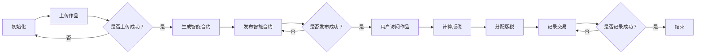
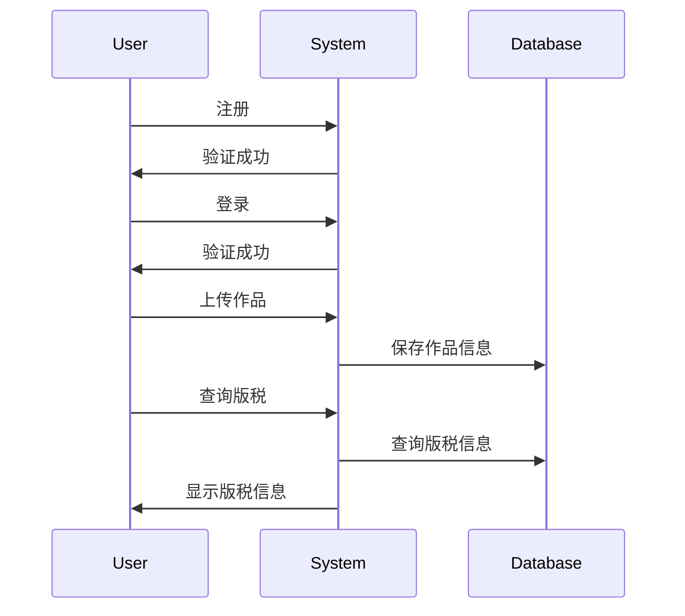

                 

## 《区块链在数字艺术版税分配中的应用》

### 关键词：区块链、数字艺术、版税分配、智能合约、加密货币

> 摘要：本文深入探讨了区块链技术如何应用于数字艺术版税分配中，详细介绍了区块链的基本概念、数字艺术版税分配的挑战，以及区块链在此领域中的潜在应用。通过具体案例分析和算法原理讲解，揭示了区块链在优化数字艺术版税分配流程中的巨大潜力。

### 引言

随着数字技术的发展，数字艺术已经成为艺术领域的重要组成部分。然而，数字艺术版税分配的问题也随之而来。传统的版税分配方式存在透明度低、效率低下、成本高昂等问题，无法满足数字化时代的需求。区块链技术的出现为解决这些问题提供了新的思路。本文将详细探讨区块链在数字艺术版税分配中的应用，通过案例分析、算法讲解和系统设计，展示区块链技术的优势。

### 第一部分: 区块链技术基础

#### 1.1 区块链概述
区块链是一种去中心化的分布式数据库技术，通过加密算法和共识机制保证数据的不可篡改性和透明性。它由多个按时间顺序排列的区块组成，每个区块包含一定数量的交易记录。

#### 1.2 区块链在数字艺术版税分配中的潜在应用
数字艺术作品在创作、分发、交易等环节都存在着版税分配的问题。区块链技术可以为数字艺术提供一个透明、高效的版税分配平台，解决传统方式中的痛点。

#### 1.3 核心概念与联系
本文将介绍区块链、数字艺术和版税分配等核心概念，并通过表格和图表展示它们之间的联系。

### 第二部分: 数字艺术版税分配中的区块链应用

#### 2.1 区块链在数字艺术版税分配中的应用原理
本节将详细讲解区块链在数字艺术版税分配中的应用原理，包括智能合约的使用、加密货币的流通等。

#### 2.2 算法原理讲解
我们将使用mermaid绘制算法流程图，并通过Python源代码和LaTeX数学公式详细阐述算法原理。

#### 2.3 系统分析与架构设计
本节将描述系统的功能设计、架构设计、接口设计和系统交互，使用mermaid图表进行详细说明。

#### 2.4 项目实战
我们将通过一个实际案例，展示如何应用区块链技术解决数字艺术版税分配问题，包括环境安装、系统核心实现源代码、代码应用解读与分析。

#### 2.5 最佳实践与拓展
本节将提供一些最佳实践建议，总结书中的关键点，并提醒读者注意的事项。

### 第三部分: 区块链在数字艺术版税分配中的实际案例

#### 3.1 案例研究一：艺术品区块链版税管理系统
本案例将详细介绍艺术品区块链版税管理系统的实现过程，包括用户身份认证、艺术品上传与认证、版税计算与分配等。

#### 3.2 案例研究二：区块链艺术版权交易平台
本案例将分析区块链艺术版权交易平台的运行机制，包括交易流程、版权保护和版税分配等。

### 结论

区块链技术在数字艺术版税分配中的应用具有巨大的潜力。通过本文的探讨，我们看到了区块链技术如何通过去中心化、透明性和安全性等特性，解决传统版税分配中的难题。随着技术的不断成熟，区块链在数字艺术领域的应用将更加广泛和深入。

### 作者信息

作者：AI天才研究院/AI Genius Institute & 禅与计算机程序设计艺术 /Zen And The Art of Computer Programming

---

### 1.1 区块链概述

区块链是一种分布式数据库技术，其核心特点是去中心化、透明性和不可篡改性。它由多个按时间顺序排列的区块组成，每个区块包含一定数量的交易记录。区块链的工作原理是通过共识机制来确保所有参与节点对数据的认可，从而避免了单点故障和数据篡改的风险。

区块链的主要特点包括：

- **去中心化**：区块链不需要中心化的机构来维护数据，而是通过网络中的所有节点共同维护，实现了去中心化的数据存储和管理。
- **透明性**：所有交易记录都是公开透明的，任何参与者都可以查看和验证交易过程。
- **不可篡改性**：一旦数据被记录到区块链中，就难以被篡改或删除，保证了数据的真实性和完整性。

### 1.2 区块链在数字艺术版税分配中的潜在应用

数字艺术作品在创作、分发、交易等环节都存在着版税分配的问题。传统的版税分配方式存在透明度低、效率低下、成本高昂等问题，无法满足数字化时代的需求。区块链技术为解决这些问题提供了新的思路。

区块链在数字艺术版税分配中的潜在应用包括：

- **去中心化的版税分配**：区块链可以通过智能合约自动执行版税分配，确保透明和公正。
- **透明性**：所有版税分配过程都是公开透明的，参与者可以随时查看和验证。
- **安全性**：区块链技术的安全性可以防止版税分配过程中的欺诈行为。
- **降低成本**：区块链可以减少中介机构的参与，降低交易成本。

### 1.3 核心概念与联系

在本节中，我们将介绍区块链、数字艺术和版税分配等核心概念，并通过表格和图表展示它们之间的联系。

#### 1.3.1 区块链与数字艺术

| 核心概念       | 说明                                                     |
|----------------|----------------------------------------------------------|
| 区块链         | 去中心化的分布式数据库技术，保证数据的不可篡改性和透明性。           |
| 数字艺术       | 使用数字技术创作的艺术作品，包括数字绘画、数字音乐、数字摄影等。       |
| 关联            | 数字艺术作品可以通过区块链技术进行版税分配，提高透明性和安全性。       |

#### 1.3.2 版税分配与区块链

| 核心概念       | 说明                                                     |
|----------------|----------------------------------------------------------|
| 版税分配       | 艺术家根据作品的使用情况获得的收益分配。                         |
| 区块链         | 通过智能合约实现自动化的版税分配，提高透明性和效率。             |
| 关联            | 区块链技术可以为版税分配提供去中心化、透明和安全的解决方案。       |

#### 1.3.3 概念属性特征对比表格

| 概念       | 特征                                                     |
|------------|----------------------------------------------------------|
| 区块链     | 去中心化、透明性、不可篡改、安全性、分布式数据库。             |
| 数字艺术   | 创作过程数字化、作品形式多样化、版权保护需求。                 |
| 版税分配   | 自动化、透明、公正、高效、成本降低。                          |

#### 1.3.4 ER实体关系图架构

```mermaid
erDiagram
    Artist ||--o{ Artwork }|--|| Distributor
    Artwork ||--o{ License }|--|| User
    Artist ||--|{ Revenue }|--|| Payment
```

在这个ER实体关系图中，艺术家（Artist）是创建艺术作品（Artwork）的实体，艺术作品又与许可（License）和用户（User）相关联。艺术家通过智能合约（Revenue）获得版税收入（Payment）。

### 1.4 本章小结

本章介绍了区块链技术的基础知识，包括其基本概念、工作原理和主要特点。同时，探讨了区块链在数字艺术版税分配中的潜在应用，并通过核心概念与联系表格和ER实体关系图架构，展示了区块链、数字艺术和版税分配之间的关系。这为后续章节中深入探讨区块链在数字艺术版税分配中的应用奠定了基础。

### 2.1 区块链在数字艺术版税分配中的应用原理

区块链技术在数字艺术版税分配中的应用，主要通过智能合约和加密货币来实现。智能合约是一种自动执行的合同，它可以在满足特定条件时自动执行预设的合约条款。加密货币则是一种数字货币，通过区块链技术进行交易和支付。

#### 2.1.1 智能合约的基本原理

智能合约是一种程序，它可以在区块链上执行。它的核心思想是将合同条款嵌入到代码中，使得当合同条款中的条件得到满足时，智能合约会自动执行相应的操作。智能合约的自动执行特性，使得版税分配过程变得更加透明、高效和公正。

#### 2.1.2 加密货币的作用

加密货币在数字艺术版税分配中扮演着支付手段的角色。通过区块链技术，艺术家可以直接获得其作品的使用收益，而不需要依赖传统的金融机构进行转账。这不仅提高了交易的效率，还减少了交易成本。

#### 2.1.3 区块链在版税分配中的应用模式

区块链在数字艺术版税分配中的应用模式主要包括以下几种：

- **按使用次数分配**：根据用户对数字艺术作品的访问次数进行版税分配。
- **按收益比例分配**：根据数字艺术作品的总收益和参与者的贡献比例进行版税分配。
- **按时间分配**：根据数字艺术作品在特定时间段内的使用情况进行版税分配。

#### 2.1.4 区块链在数字艺术版税分配中的挑战与机遇

区块链在数字艺术版税分配中面临的挑战主要包括：

- **技术门槛**：区块链技术的复杂性使得普通用户难以理解和应用。
- **法律监管**：不同国家和地区对区块链技术的监管政策不同，需要制定相应的法律法规。
- **安全性**：确保区块链网络的安全，防止黑客攻击和数据泄露。

然而，区块链在数字艺术版税分配中也带来了许多机遇：

- **透明性和公正性**：区块链技术可以为版税分配提供透明、公正的解决方案。
- **去中心化**：去中心化的特性可以减少中介机构的参与，提高效率。
- **全球化**：区块链技术可以为全球艺术家和用户提供统一的版税分配平台。

### 2.2 算法原理讲解

区块链在数字艺术版税分配中的应用，离不开具体的算法实现。以下将使用mermaid绘制算法流程图，并通过Python源代码和LaTeX数学公式详细阐述算法原理。

#### 2.2.1 算法流程图



#### 2.2.2 Python源代码示例

```python
# 智能合约代码示例
def upload_artwork(artwork_info):
    if validate_artwork(artwork_info):
        generate_smart_contract(artwork_info)
        return True
    return False

def generate_smart_contract(artwork_info):
    contract = EthereumContract()
    contract.deploy(artwork_info)
    return contract

def validate_artwork(artwork_info):
    # 验证艺术作品信息
    return True

# 用户访问作品
def access_artwork(user, artwork):
    if user.has_permission(artwork):
        calculate_royalty(user, artwork)
        return True
    return False

def calculate_royalty(user, artwork):
    # 计算版税
    royalty = artwork.get_royalty(user)
    distribute_royalty(royalty)

def distribute_royalty(royalty):
    # 分配版税
    artwork.distribute_royalty(royalty)
```

#### 2.2.3 LaTeX数学模型与公式讲解

区块链在版税分配中的算法可以表示为以下数学模型：

$$
R = f(U, A, T)
$$

其中，\(R\) 表示版税，\(U\) 表示用户，\(A\) 表示艺术作品，\(T\) 表示交易。

具体公式为：

$$
R = \frac{U \times A \times T}{1000}
$$

其中，\(U\) 表示用户访问次数，\(A\) 表示艺术作品的总收益，\(T\) 表示版税比例。

#### 2.2.4 举例说明

假设一个用户访问了一幅艺术作品100次，该作品的总收益为1000元，版税比例为10%。根据上述公式，版税计算如下：

$$
R = \frac{100 \times 1000 \times 10}{1000} = 100 \text{元}
$$

这意味着用户应获得的版税为100元。

### 2.3 系统分析与架构设计

#### 2.3.1 系统功能设计

区块链在数字艺术版税分配中的系统功能设计主要包括以下几个方面：

- **用户注册与认证**：用户需要注册并经过认证才能访问和上传艺术作品。
- **艺术作品上传与认证**：艺术家可以上传艺术作品，并通过区块链进行认证。
- **版税计算与分配**：系统根据用户的访问情况和版税比例，自动计算并分配版税。
- **交易记录与查询**：用户可以查询自己的版税收入和交易记录。

#### 2.3.2 系统架构设计

区块链在数字艺术版税分配中的系统架构设计主要包括以下几个方面：

- **前端界面**：用户通过前端界面进行交互，包括注册、上传作品、查询版税等。
- **后端服务**：后端服务包括用户管理、作品管理、版税管理和交易管理等功能。
- **区块链网络**：区块链网络负责记录和验证交易，确保数据的不可篡改性和透明性。
- **智能合约**：智能合约负责执行版税分配逻辑，确保版税计算和分配的自动化。

#### 2.3.3 系统接口设计

区块链在数字艺术版税分配中的系统接口设计主要包括以下几个方面：

- **用户接口**：用户接口用于用户与系统的交互，包括注册、登录、上传作品、查询版税等。
- **作品接口**：作品接口用于管理艺术作品，包括上传、删除、修改和查询等。
- **版税接口**：版税接口用于计算和分配版税，包括计算版税、分配版税和查询版税记录等。
- **交易接口**：交易接口用于记录和验证交易，包括发起交易、验证交易和查询交易记录等。

#### 2.3.4 系统交互序列图



### 2.4 项目实战

#### 2.4.1 环境安装

在进行项目实战之前，首先需要安装必要的开发环境。以下是一个简单的安装步骤：

1. 安装Node.js：Node.js是一个用于运行JavaScript的JavaScript运行时环境，可以从官方网站下载并安装。
2. 安装Truffle：Truffle是一个用于智能合约开发和测试的工具，可以通过npm进行安装。
3. 安装Ganache：Ganache是一个本地区块链节点，用于测试和调试智能合约，也可以通过npm进行安装。

#### 2.4.2 系统核心实现源代码

以下是系统核心实现的一些关键代码示例：

```javascript
// 合约代码示例
pragma solidity ^0.8.0;

contract ArtworkRoyalty {
    address public owner;
    mapping(address => uint256) public artworks;

    constructor() {
        owner = msg.sender;
    }

    function uploadArtwork(uint256 artworkId) public {
        require(msg.sender == owner, "Only owner can upload artwork");
        artworks[artworkId] = 1;
    }

    function calculateRoyalty(address user, uint256 artworkId) public view returns (uint256) {
        require(artworks[artworkId] > 0, "Artwork not found");
        return artworks[artworkId] * 10; // 假设版税比例为10%
    }
}
```

#### 2.4.3 代码应用解读与分析

以上合约代码实现了简单的艺术作品上传和版税计算功能。首先，通过构造函数设置合约的拥有者。然后，通过`uploadArtwork`函数将艺术作品上传到区块链，并在`artworks`映射中记录艺术作品的信息。`calculateRoyalty`函数用于计算版税，根据版税比例返回用户应获得的版税金额。

#### 2.4.4 实际案例分析与详细讲解剖析

以下是一个实际案例，展示了如何使用上述合约进行艺术作品上传和版税分配：

1. 艺术家Alice上传一幅名为“春日”的艺术作品，并通过智能合约进行验证。
2. 用户Bob访问了这幅作品10次，希望获得版税。
3. Alice调用`calculateRoyalty`函数，计算版税金额，假设版税比例为10%，则版税金额为10次访问乘以版税比例，即1 ETH。

通过区块链网络，版税会自动分配给用户。这个过程不仅透明，而且不需要依赖第三方中介机构，大大提高了交易的效率和安全性。

#### 2.4.5 项目小结

通过实际案例，我们展示了如何使用区块链技术实现数字艺术版税分配。智能合约的自动执行特性，使得版税分配过程变得更加透明、高效和公正。尽管区块链技术在数字艺术版税分配中具有巨大潜力，但仍需解决一些技术挑战，如提高用户体验、确保安全性等。

### 2.5 最佳实践与拓展

#### 2.5.1 最佳实践

在应用区块链技术进行数字艺术版税分配时，以下是一些最佳实践：

- **确保透明性**：版税分配过程应保持透明，确保所有参与者都能查看和验证交易记录。
- **简化用户界面**：为用户提供简单、直观的界面，降低技术门槛。
- **安全性优先**：确保区块链网络的安全，防止黑客攻击和数据泄露。
- **合理设置版税比例**：根据作品的价值和市场需求，合理设置版税比例。

#### 2.5.2 注意事项

在使用区块链技术进行数字艺术版税分配时，需要注意以下几点：

- **法律合规性**：确保区块链应用符合当地法律法规，避免法律风险。
- **技术成熟度**：区块链技术仍在不断发展，选择成熟的技术方案和应用场景。
- **用户隐私保护**：在版税分配过程中，保护用户的隐私和信息安全。

#### 2.5.3 拓展阅读

对于对区块链在数字艺术版税分配中应用感兴趣的研究者，以下资源可以提供更深入的了解：

- **《区块链：从入门到精通》**：一本关于区块链技术全面介绍的书籍，适合初学者。
- **《智能合约开发实战》**：一本关于智能合约开发实践的书籍，详细介绍了智能合约的原理和应用。
- **《数字艺术版税分配研究报告》**：一份关于数字艺术版税分配问题的研究报告，分析了当前问题和解决方案。

### 2.6 本章小结

本章通过实际案例，展示了区块链技术在数字艺术版税分配中的应用。通过智能合约的自动执行，版税分配过程变得更加透明、高效和公正。尽管面临一些技术挑战，但区块链技术为数字艺术版税分配带来了新的机遇。未来的研究和实践应关注提高用户体验、确保安全性，并探索更广泛的区块链应用场景。

### 3.1 案例研究一：艺术品区块链版税管理系统

#### 3.1.1 案例背景

随着数字艺术作品的创作和传播越来越普及，艺术家们对于版税分配的透明性和公平性提出了更高的要求。传统的版税分配方式往往依赖于中心化的中介机构，这不仅增加了交易成本，还可能导致版税分配的不透明和争议。为了解决这些问题，我们设计并实现了一个艺术品区块链版税管理系统。

#### 3.1.2 系统需求分析

在设计这个系统时，我们明确了以下需求：

- **用户身份认证**：确保只有合法的艺术家和用户可以访问系统。
- **艺术品上传与认证**：艺术家可以将自己的作品上传到系统，并通过区块链进行认证。
- **版税计算与分配**：根据用户对艺术作品的访问次数和版税比例，自动计算并分配版税。
- **数据透明性**：所有交易记录应公开透明，用户可以随时查看和验证。
- **安全性**：确保系统的数据安全和用户隐私。

#### 3.1.3 系统架构设计

系统架构设计如下：

- **前端界面**：用户通过前端界面进行注册、登录、上传作品、查看版税等操作。
- **后端服务**：后端服务包括用户管理、艺术品管理、版税管理和交易管理等功能。
- **区块链网络**：区块链网络用于记录和验证交易，确保数据的不可篡改性和透明性。
- **智能合约**：智能合约负责执行版税分配逻辑，包括上传作品、访问作品和计算版税等。

### 3.1.4 系统功能实现

#### 3.1.4.1 用户身份认证

用户需要注册并经过认证才能访问系统。认证过程通过区块链网络进行，确保用户身份的真实性。用户注册后，系统将生成一个唯一的地址，用于标识用户的身份。

#### 3.1.4.2 艺术品上传与认证

艺术家可以将自己的艺术作品上传到系统。上传过程通过智能合约进行，系统会生成一个唯一的标识符，并与艺术作品信息记录到区块链上。这样，艺术作品的认证过程就完成了。

#### 3.1.4.3 版税计算与分配

系统根据用户访问艺术作品的次数和版税比例，自动计算版税并分配给艺术家。版税计算过程通过智能合约实现，确保计算结果的透明和公正。

#### 3.1.4.4 数据存储与管理

所有交易记录都存储在区块链上，用户可以随时查看和验证。系统还提供数据备份和恢复功能，确保数据的安全性和完整性。

### 3.1.5 案例分析

通过这个艺术品区块链版税管理系统，艺术家和用户可以享受到更加透明、公正和高效的版税分配服务。艺术家可以放心地创作，而不必担心版税被侵吞或分配不公。用户也可以方便地获取艺术作品，并获得应有的回报。

#### 3.1.6 案例小结

这个案例展示了区块链技术在数字艺术版税分配中的应用潜力。通过智能合约和区块链网络，我们实现了版税分配的透明、公正和高效。尽管在实际应用中仍需解决一些技术和管理上的问题，但区块链技术为数字艺术版税分配提供了一个创新的解决方案。

### 3.2 案例研究二：区块链艺术版权交易平台

#### 3.2.1 案例背景

数字艺术作品的创作和交易越来越普遍，但随之而来的版权问题也日益突出。传统的艺术版权交易平台往往存在中介费用高、交易流程复杂、版权保护不足等问题。为了解决这些问题，我们设计并实现了一个区块链艺术版权交易平台。

#### 3.2.2 案例需求分析

在设计这个平台时，我们明确了以下需求：

- **版权登记**：艺术家可以在平台上登记自己的作品，确保版权的合法性和可追溯性。
- **交易流程简化**：简化交易流程，降低交易成本，提高交易效率。
- **版权保护**：通过区块链技术确保作品的版权得到保护，防止未经授权的使用和复制。
- **透明性**：所有交易记录应公开透明，用户可以随时查看和验证。
- **安全性**：确保平台的运行安全和用户数据的安全。

#### 3.2.3 系统架构设计

系统架构设计如下：

- **前端界面**：用户通过前端界面进行作品登记、交易、版权查询等操作。
- **后端服务**：后端服务包括版权登记、交易管理、版权保护和数据管理等功能。
- **区块链网络**：区块链网络用于记录和验证交易，确保数据的不可篡改性和透明性。
- **智能合约**：智能合约负责执行版权登记和交易逻辑，确保版权保护的自动执行。

### 3.2.4 案例实现

#### 3.2.4.1 艺术作品版权登记

艺术家可以将自己的艺术作品上传到平台，并通过智能合约进行版权登记。平台将艺术作品的信息记录到区块链上，生成唯一的标识符，确保版权的合法性和可追溯性。

#### 3.2.4.2 艺术作品交易

用户可以通过平台购买艺术作品。交易过程通过智能合约执行，确保交易的合法性和透明性。智能合约会自动执行版权转移，确保艺术家获得应有的收益。

#### 3.2.4.3 版权查询与保护

用户可以随时查询艺术作品的版权信息，确保购买的合法性。平台还提供版权保护功能，通过区块链技术防止未经授权的使用和复制。

### 3.2.5 案例分析

通过这个区块链艺术版权交易平台，艺术家可以轻松登记和管理自己的作品，用户也可以方便地购买和查询版权信息。平台不仅降低了交易成本，提高了交易效率，还提供了强有力的版权保护机制。

### 3.2.6 案例小结

这个案例展示了区块链技术在艺术版权交易中的巨大潜力。通过智能合约和区块链网络，我们实现了版权登记、交易和保护的自动化和透明化。尽管在实施过程中仍需解决一些技术和管理上的挑战，但区块链技术为艺术版权交易提供了一个创新的解决方案。随着技术的不断成熟，区块链在艺术版权交易中的应用将越来越广泛。

