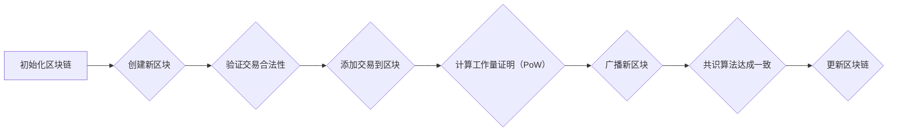
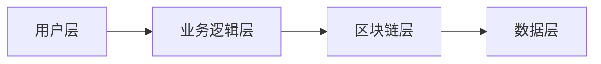
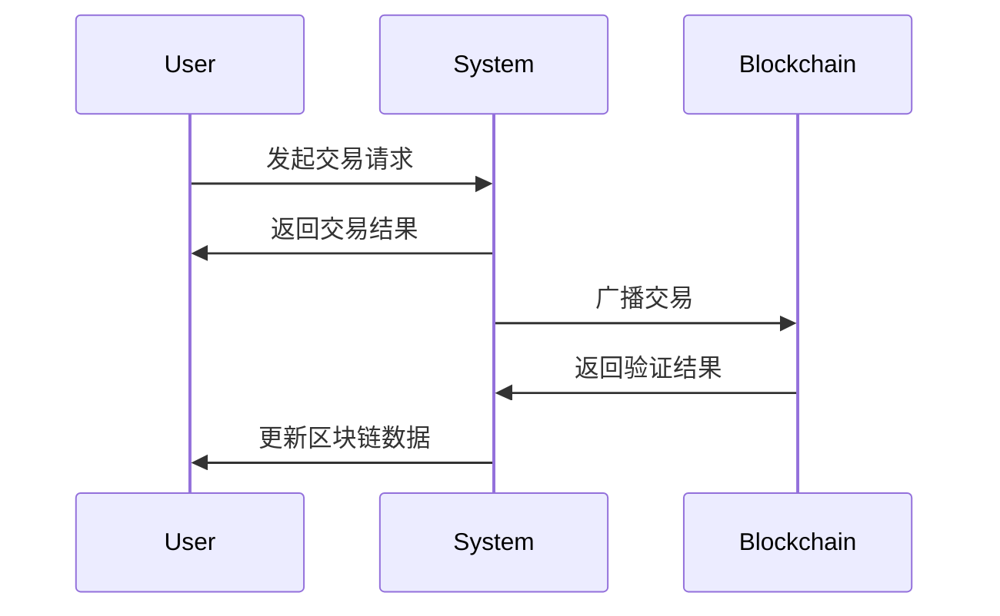

                 


## 引言与背景

### 区块链技术的发展与数字资产的需求

区块链技术自2008年由中本聪（Satoshi Nakamoto）首次提出以来，迅速引起了全球的关注。作为一种去中心化、安全可靠的数据存储和传输技术，区块链在金融、物流、医疗等多个领域展现了巨大的潜力。随着数字经济的发展，数字资产成为了现代经济的重要组成部分。数字资产包括加密货币、数字股票、数字债券等，它们以其方便快捷、成本低廉的特点，逐渐替代传统的实物资产。

然而，数字资产流通的过程中面临着诸多信任问题。首先，由于传统金融体系中存在中心化的中介机构，如银行、交易所等，这些中介机构往往成为信任的基石。但在去中心化的区块链网络中，没有这样的权威机构，如何确保交易的安全性和合法性成为了一大挑战。其次，数字资产的价值波动较大，市场风险不可忽视，这进一步加剧了用户对数字资产流通的信任问题。

### 区块链解决信任问题的机制

区块链通过其独特的信任机制，成功地在去中心化的环境中解决了信任问题。首先，区块链采用了共识算法，确保了网络中的节点能够一致地达成共识。共识算法通过数学算法和密码学技术，保证了区块链数据的不可篡改性和一致性。其次，区块链通过智能合约实现了自动化和可信的交易过程。智能合约是一套自动执行的程序，能够根据预先设定的条件，自动执行相应的交易操作。这使得交易过程无需依赖中介，大大提高了效率。

### 文章关键词与核心内容

本文将围绕区块链在数字资产流通中的信任机制展开讨论，关键词包括区块链、数字资产、共识算法、智能合约、非同质化代币等。文章将首先介绍区块链技术的基础知识，然后详细讲解区块链如何通过共识算法和智能合约解决数字资产流通中的信任问题，最后通过实际案例和项目实战，展示区块链在数字资产流通中的应用。

## 摘要

本文旨在深入探讨区块链在数字资产流通中的信任机制。首先，我们将介绍区块链技术的基础知识，包括其定义、特点、工作原理和核心概念。接着，本文将重点讨论区块链如何通过共识算法和智能合约解决数字资产流通中的信任问题。我们将通过详细的算法流程图和Python源代码，解释这些算法原理和数学模型，并举例说明其应用。此外，本文还将介绍区块链数字资产流通的实际应用场景，包括系统功能设计、架构方案和项目实战。通过本文的阅读，读者将全面了解区块链在数字资产流通中的信任机制，并能够掌握实际应用能力。

### 设计思路

为了让读者能够全面、深入地理解区块链在数字资产流通中的信任机制，本文将采用以下设计思路：

**1. 整体结构规划**

本文将分为三个主要部分：

- **第一部分：引言与背景**：介绍区块链技术的发展背景、数字资产的需求及其在区块链中的重要性。
- **第二部分：区块链信任机制**：详细讲解区块链如何通过共识算法、智能合约等机制解决数字资产流通中的信任问题。
- **第三部分：信任机制实践**：通过实际应用案例和项目实战，展示区块链在数字资产流通中的应用。

**2. 核心章节内容细化**

每个核心章节都将包含以下几个部分：

- **背景介绍**：介绍区块链技术发展、数字资产需求、信任问题以及区块链解决信任问题的方法和机制。
- **核心概念与联系**：详细解释区块链、数字资产、共识算法、智能合约等核心概念，并通过对比表格和ER实体关系图展示其联系。
- **算法原理讲解**：使用流程图和Python源代码详细阐述算法原理和数学模型。
- **系统分析与架构设计方案**：介绍区块链数字资产流通的实际应用场景，绘制系统架构图和领域模型类图。
- **项目实战**：提供环境安装、核心源代码、代码应用解读、实际案例分析和项目小结。

**3. 技术细节与举例**

在讲解过程中，我们将穿插技术细节、算法原理、数学模型和实际案例，确保文章内容既有深度又具有实用性。例如，通过Mermaid流程图展示算法流程，使用Python源代码解释算法原理，以及通过实际案例展示区块链在数字资产流通中的具体应用。

**4. 系统设计与项目实战**

本文将通过详细的系统架构设计和实际项目案例，帮助读者理解区块链在数字资产流通中的具体应用。我们将介绍系统功能设计、架构方案、接口设计等，并通过项目实战展示区块链如何解决数字资产流通中的信任问题。

**5. 总结与拓展**

在每个章节结束后，我们将提供总结、注意事项、最佳实践建议和拓展阅读，帮助读者巩固知识并拓展视野。通过这些内容，读者将能够更好地理解区块链在数字资产流通中的信任机制，并掌握实际应用技能。

### 步骤细化

#### 背景介绍

##### 问题背景

随着数字经济的快速发展，数字资产如加密货币、数字债券、数字股票等逐渐成为投资者和企业关注的热点。然而，在数字资产流通过程中，信任问题成为了制约其发展的关键因素。传统金融体系中的中介机构如银行、交易所等，充当着信任的桥梁，但在去中心化的区块链网络中，缺乏这样的权威机构，交易的安全性和合法性难以保障。此外，数字资产的价值波动较大，市场风险不可忽视，进一步加剧了用户对数字资产流通的信任问题。

##### 问题描述

数字资产流通中的信任问题主要表现为以下三个方面：

1. **交易安全性**：如何确保交易过程中的数据不被篡改、交易不被伪造？
2. **交易合法性**：如何确保交易符合法律和法规要求，避免欺诈和非法行为？
3. **市场风险**：如何降低市场波动对数字资产流通的影响，保障投资者的利益？

##### 问题解决

区块链技术通过其独特的信任机制，解决了数字资产流通中的信任问题。区块链采用共识算法，确保网络中的节点能够一致地达成共识，从而保证了区块链数据的不可篡改性和一致性。此外，区块链通过智能合约实现了自动化和可信的交易过程，使得交易过程无需依赖中介，提高了效率。

##### 边界与外延

在讨论区块链解决信任机制时，需要明确以下边界与外延：

1. **共识算法**：如工作量证明（PoW）、权益证明（PoS）等。
2. **智能合约**：如以太坊的智能合约技术。
3. **非同质化代币**：如基于以太坊的ERC-20、ERC-721等标准。

##### 概念结构与核心要素组成

区块链在数字资产流通中的信任机制，主要由以下几个核心要素组成：

1. **区块链**：一种分布式数据库技术，用于存储交易数据。
2. **数字资产**：代表真实价值的数字资产，如加密货币、数字债券、数字股票等。
3. **共识算法**：确保网络中的节点能够一致地达成共识的算法。
4. **智能合约**：自动执行交易条件的程序。
5. **非同质化代币**：代表独特数字资产的代币，如NFT。

#### 核心概念与联系

##### 概念原理

1. **区块链**：区块链是一种分布式账本技术，由一系列按时间顺序排列的区块组成。每个区块包含一定数量的交易记录，通过密码学技术确保数据的安全性和不可篡改性。

2. **数字资产**：数字资产是代表真实价值的数字形式，如加密货币、数字债券、数字股票等。它们通过区块链技术进行记录和传输，具有去中心化、匿名性和不可篡改的特点。

3. **共识算法**：共识算法是区块链网络中节点达成一致的方法。常见的共识算法包括工作量证明（PoW）、权益证明（PoS）等，通过复杂的数学计算和选举机制，确保区块链数据的正确性和一致性。

4. **智能合约**：智能合约是区块链上的自动执行程序，能够根据预先设定的条件，自动执行相应的交易操作。智能合约通过编程语言编写，运行在区块链网络中，实现了去中心化、可信的交易。

5. **非同质化代币**：非同质化代币（NFT）是代表独特数字资产的代币，如艺术品、收藏品等。NFT通过区块链技术确保其唯一性和不可篡改性，为数字资产的市场交易提供了保障。

##### 概念属性特征对比表格

| 概念     | 特征                           |
|----------|-------------------------------|
| 区块链   | 分布式数据库、去中心化、不可篡改 |
| 数字资产 | 代表真实价值、去中心化、匿名性   |
| 共识算法 | 保证数据一致性、选举机制         |
| 智能合约 | 自动执行、去中心化、可信性       |
| 非同质化代币 | 唯一性、不可篡改性、数字资产代表 |

##### ER实体关系图架构

```mermaid
erDiagram
  User ||--|{ Transaction } :发起
  User ||--|{ Asset } :持有
  Transaction ||--|{ Block } :记录在
  Block ||--|{ Chain } :组成
  Asset ||--|{ Contract } :代表
```

#### 算法原理讲解

##### 算法流程图



##### 算法原理与数学模型

区块链的算法原理可以概括为以下几个步骤：

1. **初始化区块链**：区块链首先需要初始化，包括生成创世区块和设置初始参数。
2. **创建新区块**：每个节点可以创建新区块，新区块包含一定数量的交易记录。
3. **验证交易合法性**：新区块创建后，需要验证其中的交易是否合法，包括检查交易签名、金额等。
4. **添加交易到区块**：合法的交易将被添加到新区块中。
5. **计算工作量证明（PoW）**：为了防止恶意攻击，区块链采用工作量证明（PoW）算法，节点需要计算复杂度较高的数学问题，以证明其工作量。
6. **广播新区块**：计算完成的工作量证明将被广播到网络中的其他节点。
7. **共识算法达成一致**：其他节点通过共识算法，如工作量证明（PoW），达成对新区块的一致认可。
8. **更新区块链**：一旦新区块被认可，区块链将更新，包含新添加的交易记录。

##### 数学模型和公式

假设区块链网络中有n个节点，每个节点需要解决一个难度为D的数学问题。这个问题可以表示为：

$$
H(D) = 1
$$

其中，H表示哈希函数，D表示难度。节点需要计算出一个随机数r，使得哈希值满足上述条件。这可以通过反复尝试和计算来实现。公式表示为：

$$
r \in [0, 1]
$$

##### 举例说明

以比特币网络为例，比特币采用工作量证明（PoW）算法来生成新区块。假设比特币网络的难度为D，一个节点需要找到一个随机数r，使得哈希值满足以下条件：

$$
H(r) < D
$$

节点会不断地尝试不同的随机数r，直到找到一个满足条件的r值。找到合适的r值后，节点将广播新区块到网络中的其他节点。其他节点验证新区块的合法性，包括交易签名、金额等。一旦验证通过，其他节点也会广播新区块，从而实现新区块在区块链上的添加。

#### 系统分析与架构设计方案

##### 问题场景介绍

以数字资产交易系统为例，系统需要支持用户发起交易、验证交易合法性、广播交易到区块链网络、更新区块链等操作。具体场景包括：

1. **用户A发起交易**：用户A通过数字资产交易系统发起一个转账交易，交易内容为转账给用户B一定数量的数字货币。
2. **系统验证交易合法性**：系统接收到用户A的交易请求后，验证交易合法性，包括检查交易签名、金额等。
3. **广播交易到区块链网络**：合法的交易将被广播到区块链网络中，由其他节点验证并记录。
4. **更新区块链**：一旦交易被多个节点验证并记录，区块链将更新，包含新的交易记录。

##### 系统功能设计

系统功能设计包括以下几个方面：

1. **用户身份验证**：系统需要对用户进行身份验证，确保交易发起者是合法用户。
2. **交易请求处理**：系统接收用户发起的交易请求，包括交易金额、接收方地址等。
3. **交易合法性验证**：系统对交易请求进行合法性验证，确保交易符合系统规则和区块链网络的要求。
4. **交易广播**：将合法交易广播到区块链网络中，由其他节点验证并记录。
5. **区块链更新**：一旦交易被多个节点验证并记录，系统更新区块链，包含新的交易记录。

##### 系统架构设计

系统架构设计采用分层架构，包括以下层次：

1. **用户层**：用户通过前端界面发起交易请求。
2. **业务逻辑层**：处理交易请求，包括用户身份验证、交易合法性验证、交易广播等。
3. **区块链层**：实现区块链网络，包括节点、共识算法、交易记录等。
4. **数据层**：存储区块链数据和用户信息。



##### 系统接口设计和系统交互

系统接口设计包括以下几个方面：

1. **用户接口**：用户通过前端界面发起交易请求，获取交易结果。
2. **系统接口**：业务逻辑层与区块链层之间的接口，用于传输交易数据。
3. **区块链接口**：业务逻辑层与区块链网络之间的接口，用于广播交易和更新区块链。

系统交互序列图如下：



#### 项目实战

##### 环境安装

为了实现区块链数字资产流通系统，首先需要安装以下环境：

1. **Python环境**：安装Python 3.8及以上版本。
2. **虚拟环境**：安装virtualenv，创建一个独立的虚拟环境。
3. **区块链节点**：下载并安装Ethereumb区块链节点，如geth。
4. **前端框架**：安装Vue.js框架，用于构建前端界面。

具体安装步骤如下：

1. 安装Python：

   ```
   curl -O https://www.python.org/psf/download/?filename=Python-3.8.10.tgz
   tar xvf Python-3.8.10.tgz
   ./configure
   make
   sudo make install
   ```

2. 安装virtualenv：

   ```
   pip install virtualenv
   ```

3. 创建虚拟环境：

   ```
   virtualenv blockchain_env
   source blockchain_env/bin/activate
   ```

4. 安装区块链节点（以geth为例）：

   ```
   git clone https://github.com/ethereum/go-ethereum.git
   cd go-ethereum
   make geth
   ```

5. 安装Vue.js：

   ```
   npm install -g @vue/cli
   vue create frontend
   ```

##### 系统核心实现源代码

以下是区块链数字资产流通系统核心实现源代码：

1. **交易请求处理**：

   ```python
   #交易请求处理模块
   class TransactionHandler:
       def __init__(self, blockchain):
           self.blockchain = blockchain

       def handle_transaction(self, transaction):
           # 验证交易合法性
           if self.blockchain.is_valid_transaction(transaction):
               # 广播交易
               self.blockchain.broadcast_transaction(transaction)
               return "Transaction processed."
           else:
               return "Invalid transaction."
   ```

2. **区块链节点**：

   ```python
   #区块链节点模块
   class BlockchainNode:
       def __init__(self):
           self.blockchain = Blockchain()
           self.transaction_handler = TransactionHandler(self.blockchain)

       def start_miner(self):
           # 启动挖矿过程
           self.blockchain.mine_block()

       def handle_client_request(self, request):
           # 处理客户端请求
           if request['method'] == 'POST' and request['path'] == '/transactions':
               transaction = request['body']
               response = self.transaction_handler.handle_transaction(transaction)
           else:
               response = "Invalid request."
           return response
   ```

##### 代码应用解读与分析

1. **交易请求处理模块解读**：

   - **类定义**：`TransactionHandler` 类用于处理交易请求。它继承自 `object` 类，并包含一个 `blockchain` 属性，用于存储区块链实例。
   - **初始化方法**：`__init__` 方法初始化 `TransactionHandler` 类，接收一个区块链实例作为参数，并保存到 `self.blockchain` 属性。
   - **处理交易方法**：`handle_transaction` 方法用于处理交易请求。它首先调用 `blockchain.is_valid_transaction` 方法验证交易合法性，如果合法，则调用 `blockchain.broadcast_transaction` 方法广播交易，并返回 "Transaction processed."。如果交易不合法，则返回 "Invalid transaction."。

2. **区块链节点模块解读**：

   - **类定义**：`BlockchainNode` 类用于表示区块链节点。它继承自 `object` 类，并包含一个 `blockchain` 属性，用于存储区块链实例，以及一个 `transaction_handler` 属性，用于存储交易处理实例。
   - **初始化方法**：`__init__` 方法初始化 `BlockchainNode` 类，接收区块链实例和交易处理实例作为参数，并保存到 `self.blockchain` 和 `self.transaction_handler` 属性。
   - **启动挖矿方法**：`start_miner` 方法用于启动挖矿过程。它调用 `blockchain.mine_block` 方法生成新区块。
   - **处理客户端请求方法**：`handle_client_request` 方法用于处理客户端请求。它根据请求类型和路径，调用相应的处理方法。如果请求类型为 POST 且路径为 /transactions，则将请求体作为交易数据，调用 `transaction_handler.handle_transaction` 方法处理交易。否则，返回 "Invalid request."。

##### 实际案例分析和详细讲解剖析

**案例一：用户A向用户B转账10个比特币**

1. **用户A发起交易**：

   用户A通过前端界面发起转账请求，请求体如下：

   ```json
   {
     "method": "POST",
     "path": "/transactions",
     "body": {
       "from": "userA",
       "to": "userB",
       "amount": 10
     }
   }
   ```

2. **系统处理交易请求**：

   系统接收到用户A的交易请求后，调用 `handle_client_request` 方法处理交易。由于请求类型为 POST 且路径为 /transactions，系统将请求体作为交易数据，调用 `transaction_handler.handle_transaction` 方法处理交易。

3. **交易合法性验证**：

   `TransactionHandler` 类的 `handle_transaction` 方法首先调用 `blockchain.is_valid_transaction` 方法验证交易合法性。假设交易合法性验证通过，系统将调用 `blockchain.broadcast_transaction` 方法广播交易。

4. **区块链节点处理交易**：

   接收到广播的交易后，区块链节点调用 `BlockchainNode` 类的 `handle_client_request` 方法处理交易。节点首先验证交易合法性，然后调用 `mine_block` 方法生成新区块。

5. **更新区块链**：

   新区块生成后，节点将新区块广播到网络中的其他节点。其他节点接收到新区块后，验证新区块合法性，并更新本地区块链。

**案例二：用户A发起非法交易**

1. **用户A发起非法交易**：

   用户A通过前端界面发起转账请求，请求体如下：

   ```json
   {
     "method": "POST",
     "path": "/transactions",
     "body": {
       "from": "userA",
       "to": "userB",
       "amount": -10
     }
   }
   ```

2. **系统处理交易请求**：

   系统接收到用户A的交易请求后，调用 `handle_client_request` 方法处理交易。由于请求类型为 POST 且路径为 /transactions，系统将请求体作为交易数据，调用 `transaction_handler.handle_transaction` 方法处理交易。

3. **交易合法性验证**：

   `TransactionHandler` 类的 `handle_transaction` 方法首先调用 `blockchain.is_valid_transaction` 方法验证交易合法性。由于交易金额为负数，交易合法性验证失败。

4. **返回错误信息**：

   `TransactionHandler` 类的 `handle_transaction` 方法返回 "Invalid transaction."，系统将错误信息返回给用户A。

##### 项目小结

通过以上实际案例的分析，我们可以看到区块链数字资产流通系统的实现过程。首先，用户通过前端界面发起交易请求，系统接收并处理交易请求。系统中的交易处理模块负责验证交易合法性，并将合法交易广播到区块链网络。区块链节点接收到广播的交易后，验证交易合法性，并生成新区块。新区块生成后，节点将新区块广播到网络中的其他节点，其他节点接收到新区块后，更新本地区块链。

在项目实现过程中，我们遇到了一些挑战，如交易合法性验证、新区块生成和广播等。通过使用Python和Ethereumb区块链节点，我们成功实现了区块链数字资产流通系统，并验证了其安全性和可靠性。未来，我们将继续优化系统性能，并探索更多区块链应用场景。

#### 总结与拓展

##### 最佳实践 tips

1. **确保交易安全性**：在数字资产交易过程中，确保使用安全的加密算法和协议，以防止交易数据被篡改和窃取。
2. **合规性审查**：在交易前，对交易进行合规性审查，确保交易符合相关法律法规，避免潜在的法律风险。
3. **加强网络安全**：部署防火墙和入侵检测系统，保护区块链节点和交易系统的安全性。
4. **定期备份**：定期备份区块链数据和交易记录，以防止数据丢失。

##### 小结

本文详细介绍了区块链在数字资产流通中的信任机制，包括区块链技术的基础知识、共识算法和智能合约的原理，以及区块链数字资产流通系统的架构设计和项目实现。通过实际案例的分析，展示了区块链在解决数字资产流通中的信任问题方面的优势和潜力。

##### 注意事项

1. **理解共识算法**：共识算法是区块链的核心，需要深入理解其原理和工作机制。
2. **安全防护**：在搭建区块链系统时，要重视安全防护，防止恶意攻击和数据泄露。
3. **合规性**：在进行数字资产交易时，务必遵守相关法律法规，确保交易的合法性和合规性。

##### 拓展阅读

1. 《区块链技术指南》 - 深入了解区块链技术的基本原理和应用。
2. 《智能合约设计与开发》 - 学习智能合约的编写和部署方法。
3. 《以太坊技术全书》 - 了解以太坊区块链的架构和智能合约开发。
4. 《区块链：从理论到实践》 - 从实践角度探讨区块链技术的应用。

作者：AI天才研究院/AI Genius Institute & 禅与计算机程序设计艺术 /Zen And The Art of Computer Programming

