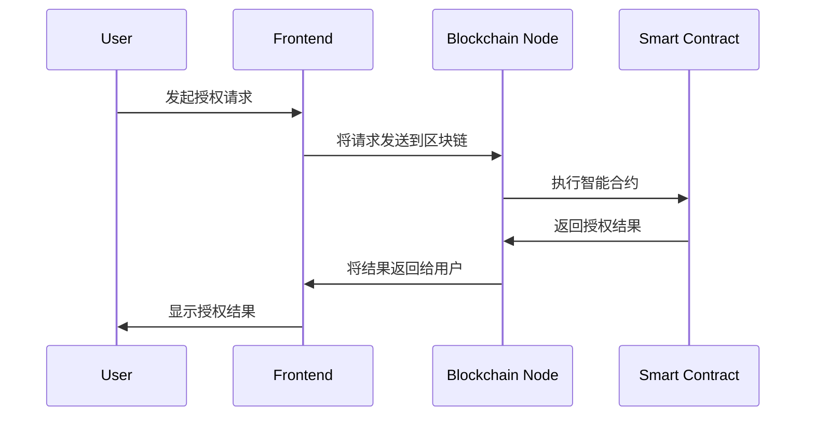
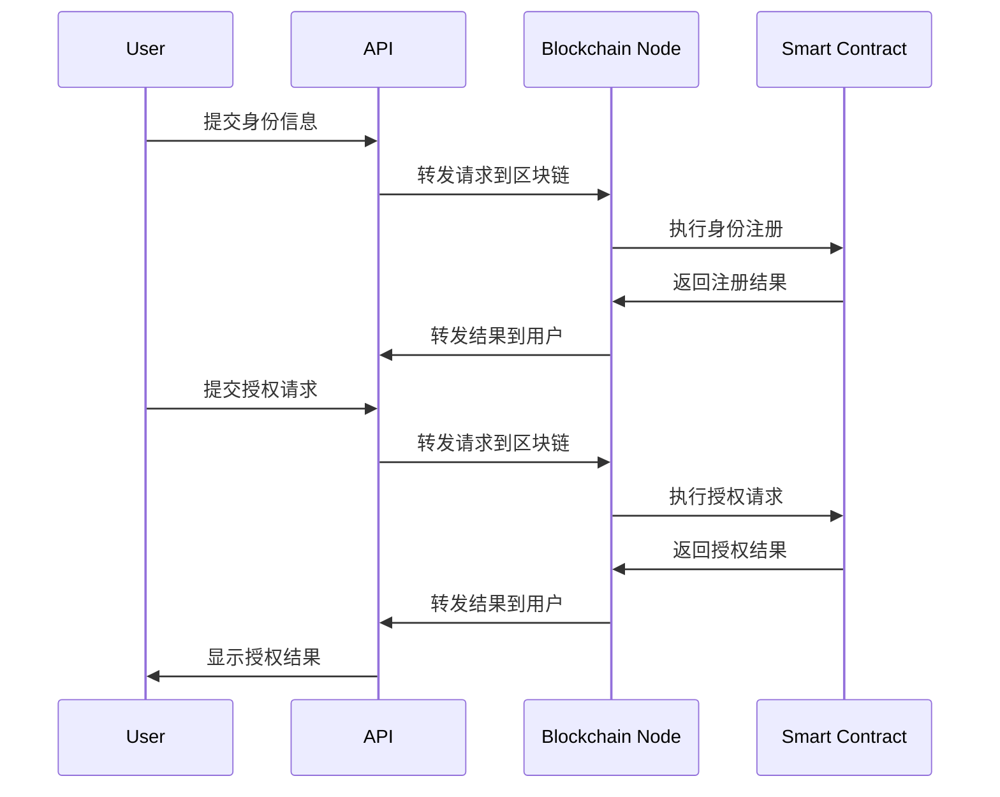

                 


# 引言

在数字化的今天，个人信息的安全与隐私保护变得越来越重要。随着互联网技术的飞速发展，个人数据泄露事件屡见不鲜，严重威胁到用户的隐私安全。在这种背景下，如何保障数字身份的安全、实现灵活且安全的临时授权成为了一个亟待解决的问题。区块链技术以其去中心化、不可篡改和透明性等特性，为解决这一问题提供了新的思路。

## 文章关键词

区块链、数字身份、临时授权、安全应用、技术解决方案

## 摘要

本文将探讨区块链在数字身份临时授权中的安全应用。首先，我们将介绍区块链、数字身份和临时授权的基本概念及其在现实场景中的应用背景。随后，文章将详细阐述区块链技术如何解决数字身份临时授权中的安全问题，包括算法原理、系统架构设计以及实际应用案例。最后，我们将总结最佳实践、注意事项以及相关领域的拓展阅读。

## 第一部分：区块链技术基础

### 1.1 区块链概述

区块链技术起源于比特币的底层架构，由中本聪在2008年提出，并在2009年发布。区块链是一个分布式数据库系统，其核心特点包括去中心化、不可篡改、可追溯性和透明性。在区块链中，所有的交易和操作都被记录在一个公开的账本上，并通过密码学确保数据的完整性和安全性。

### 1.2 区块链的工作原理

区块链的工作原理可以分为以下几个步骤：

1. **数据存储**：交易信息被组织成一个数据块。
2. **数据验证**：数据块通过共识算法验证其合法性。
3. **数据打包**：合法的数据块被添加到一个链上，形成一个连续的区块链。
4. **数据传播**：新的数据块通过网络广播给所有参与者。

### 1.3 区块链在数字身份管理中的应用

区块链在数字身份管理中的应用主要集中在以下几个方面：

1. **去中心化的身份验证**：通过区块链技术，用户可以自主管理自己的数字身份，无需依赖第三方机构。
2. **身份信息的安全存储**：区块链的不可篡改性确保了身份信息的长期安全性。
3. **权限的临时授权**：通过智能合约，可以实现数字身份的临时授权，确保授权的灵活性和安全性。

## 第二部分：数字身份与临时授权

### 2.1 数字身份的概念与挑战

数字身份是指个人在数字世界中的唯一标识。随着在线活动的增加，数字身份的重要性日益凸显。然而，传统的数字身份系统面临以下几个挑战：

1. **数据泄露风险**：个人数据容易被黑客窃取。
2. **权限管理复杂**：用户在不同的服务平台上需要重复验证身份。
3. **隐私保护不足**：个人隐私信息容易泄露。

### 2.2 临时授权的需求与问题

在数字身份管理中，临时授权是一个关键需求。临时授权允许用户在特定场景下临时共享身份信息，以完成特定任务。然而，传统的临时授权机制存在以下问题：

1. **安全风险**：授权信息可能被篡改或泄露。
2. **操作复杂**：授权流程繁琐，用户体验不佳。
3. **透明度不足**：授权过程缺乏透明度，难以追溯。

### 2.3 区块链在临时授权中的应用

区块链技术在临时授权中的应用，通过其去中心化、不可篡改和透明性等特点，可以有效解决传统临时授权机制中的问题。具体应用包括：

1. **去中心化的授权机制**：用户无需依赖第三方机构，直接在区块链上进行身份验证和授权。
2. **智能合约的应用**：通过智能合约，可以实现自动化、安全的授权流程。
3. **透明的授权记录**：区块链上的授权记录可被所有人查看，确保授权过程的透明性。

## 第三部分：算法原理讲解

### 3.1 区块链在数字身份临时授权中的算法原理

区块链在数字身份临时授权中的算法原理主要包括以下几个步骤：

1. **身份信息注册**：用户将身份信息注册到区块链上，并使用密码学技术进行加密。
2. **授权请求**：当用户需要临时授权时，发送授权请求到区块链网络。
3. **共识算法验证**：区块链网络中的节点对授权请求进行验证，确保授权的合法性。
4. **智能合约执行**：通过智能合约，实现授权的自动化执行和记录。

### 3.2 算法流程与Python实现

下面是一个简单的Python代码示例，展示了区块链在数字身份临时授权中的数据处理流程：

```python
import hashlib
import json
from time import time

class Block:
    def __init__(self, index, transactions, timestamp, previous_hash):
        self.index = index
        self.transactions = transactions
        self.timestamp = timestamp
        self.previous_hash = previous_hash
        self.hash = self.compute_hash()

    def compute_hash(self):
        block_string = json.dumps(self.__dict__, sort_keys=True)
        return hashlib.sha256(block_string.encode()).hexdigest()

class Blockchain:
    def __init__(self):
        self.unconfirmed_transactions = []
        self.chain = []
        self.create_genesis_block()

    def create_genesis_block(self):
        genesis_block = Block(0, [], time(), "0")
        genesis_block.hash = genesis_block.compute_hash()
        self.chain.append(genesis_block)

    def add_new_transaction(self, transaction):
        self.unconfirmed_transactions.append(transaction)

    def mine(self):
        if not self.unconfirmed_transactions:
            return False
        last_block = self.chain[-1]
        new_block = Block(index=last_block.index + 1,
                          transactions=self.unconfirmed_transactions,
                          timestamp=time(),
                          previous_hash=last_block.hash)
        new_block.hash = new_block.compute_hash()
        self.chain.append(new_block)
        self.unconfirmed_transactions = []
        return new_block.index

    def is_chain_valid(self):
        for i in range(1, len(self.chain)):
            current = self.chain[i]
            previous = self.chain[i - 1]
            if current.hash != current.compute_hash():
                return False
            if current.previous_hash != previous.hash:
                return False
        return True

# Example usage
blockchain = Blockchain()
blockchain.add_new_transaction("Transaction 1")
blockchain.add_new_transaction("Transaction 2")
blockchain.mine()
print("Blockchain chain: ", blockchain.chain)
print("Blockchain validity: ", blockchain.is_chain_valid())
```

### 3.3 数学模型与公式详解

区块链在数字身份临时授权中的算法涉及到一些基础的数学模型和公式。下面是几个关键的数学模型和公式的讲解：

1. **哈希函数**：哈希函数是将输入数据映射为固定长度输出的函数。在区块链中，常用的哈希函数是SHA-256。

   $$ H = SHA-256(data) $$

   其中，H是哈希值，data是输入数据。

2. **数字签名**：数字签名是一种确保数据完整性和发送者身份的技术。数字签名算法（如RSA）通过公钥和私钥对数据进行加密和解密。

   $$ Signature = RSA_Sign(private_key, message) $$
   $$ Verify = RSA_Verify(public_key, message, signature) $$

   其中，Signature是数字签名，message是原始消息，public_key和private_key分别是公钥和私钥。

3. **共识算法**：共识算法是确保区块链网络中的所有节点对账本状态达成一致的技术。常用的共识算法包括工作量证明（PoW）和权益证明（PoS）。

   $$ Difficulty = PoW_Hash(block) $$
   $$ Stake = PoS_Vote(node, block) $$

   其中，Difficulty是工作量证明的难度，PoW_Hash是工作量证明哈希函数，Stake是权益证明中的投票权重。

### 3.4 举例说明

假设在一个区块链系统中，用户Alice需要临时授权Bob访问她的某项个人信息。以下是这个过程的详细说明：

1. **身份信息注册**：Alice将她的身份信息（如姓名、身份证号码等）注册到区块链上，并使用私钥对其进行加密。

   $$ Encrypted\_Identity = AES_Encrypt(Alice\_Identity, Alice\_PrivateKey) $$

2. **授权请求**：Alice向区块链网络发送一个授权请求，请求临时授权Bob访问她的个人信息。

   $$ Request = {Sender: Alice, Recipient: Bob, Data: Encrypted\_Identity, Expiration: Time} $$

3. **共识算法验证**：区块链网络中的节点对授权请求进行验证，确保请求的合法性。验证通过后，请求将被添加到区块链的一个新数据块中。

4. **智能合约执行**：智能合约在区块链上执行授权操作，将Alice的加密身份信息发送给Bob。Bob使用Alice的公钥解密身份信息。

   $$ Encrypted\_Data = AES_Decrypt(Encrypted\_Identity, Alice\_PublicKey) $$

通过上述步骤，Alice成功地将个人信息临时授权给了Bob，同时确保了数据的安全性和完整性。

## 第四部分：系统分析与架构设计方案

### 4.1 问题场景介绍

在电子商务领域，用户在购物时可能需要临时授权商家查看他们的收货地址信息，以便于快速完成订单。这是一个典型的数字身份临时授权的场景。

### 4.2 项目介绍

为了实现这个场景，我们开发了一个基于区块链的数字身份临时授权系统。该系统利用智能合约实现授权的自动化和安全性，同时保证用户隐私和数据完整性。

### 4.3 系统功能设计

系统功能模块包括用户身份注册、授权请求、授权审核和授权执行。以下是使用Mermaid绘制的领域模型类图：

```mermaid
classDiagram
    User <<class{用户}>>
    Merchant <<class{商家}>>
    Blockchain <<class{区块链}>>
    Request <<class{授权请求}>>
    Contract <<class{智能合约}>

    User "1" -> Request
    Merchant "1" -> Request
    Blockchain "1" -> Request
    Contract "1" -> Request
```

### 4.4 系统架构设计

系统架构设计主要包括前端用户界面、后端区块链节点和智能合约三个部分。以下是使用Mermaid绘制的系统架构图：



### 4.5 系统接口设计和系统交互

系统接口设计包括用户接口、区块链节点接口和智能合约接口。以下是使用Mermaid绘制的序列图，展示了系统的接口设计和交互流程：



## 第五部分：项目实战

### 5.1 环境安装

要搭建一个基于区块链的数字身份临时授权系统，需要安装以下软件和工具：

1. **Node.js**：用于运行区块链节点和智能合约。
2. **Truffle**：用于开发、测试和部署智能合约。
3. **Ganache**：用于创建一个本地以太坊区块链网络，用于测试和开发。

安装命令如下：

```bash
# 安装Node.js
npm install -g node

# 安装Truffle
npm install -g truffle

# 安装Ganache
npm install -g ganache-cli
```

### 5.2 系统核心实现源代码

以下是系统核心实现部分的源代码，包括用户身份注册、授权请求和授权审核的智能合约代码：

```solidity
// SPDX-License-Identifier: MIT
pragma solidity ^0.8.0;

contract IdentityRegistry {
    mapping(address => string) public identities;

    function registerIdentity(string memory identity) public {
        identities[msg.sender] = identity;
    }
}

contract Authorization {
    mapping(bytes32 => bool) public authorizations;

    function requestAuthorization(address sender, address recipient, string memory identity, uint256 expiration) public {
        bytes32 requestId = keccak256(abi.encodePacked(sender, recipient, identity, expiration));
        authorizations[requestId] = true;
    }

    function checkAuthorization(bytes32 requestId) public view returns (bool) {
        return authorizations[requestId];
    }
}
```

### 5.3 代码应用解读与分析

上述代码实现了两个智能合约：`IdentityRegistry` 和 `Authorization`。

1. **IdentityRegistry**：用于注册用户身份信息。用户可以通过 `registerIdentity` 函数将自己的身份信息注册到区块链上。
2. **Authorization**：用于处理授权请求。用户可以通过 `requestAuthorization` 函数发送授权请求，请求中包含发送者、接收者、身份信息和有效期。区块链网络中的节点会验证请求的合法性，并通过 `checkAuthorization` 函数检查授权状态。

### 5.4 实际案例分析和详细讲解剖析

假设Alice需要临时授权Bob查看她的收货地址，以下是这个过程的详细说明：

1. **用户身份注册**：Alice在区块链上注册了她的身份信息，如姓名和收货地址。
2. **发起授权请求**：Alice通过前端界面发起授权请求，请求中包含Bob的地址、Alice的收货地址和授权有效期。
3. **请求验证**：区块链网络中的节点验证Alice的身份和请求的有效性，并将请求添加到区块链的一个新数据块中。
4. **智能合约执行**：智能合约在区块链上执行授权操作，将Alice的收货地址发送给Bob。
5. **授权审核**：Bob收到Alice的授权信息后，通过前端界面查看收货地址，并在有效期内使用。
6. **授权过期**：授权有效期结束后，授权自动失效，不再有效。

通过上述过程，Alice成功地将她的收货地址临时授权给了Bob，同时保证了数据的安全性和完整性。

### 5.5 项目小结

本项目通过区块链技术实现了数字身份的临时授权，提供了安全、灵活和透明的授权解决方案。项目的主要成果包括：

1. **用户身份注册与验证**：用户可以在区块链上自主注册身份信息，并通过智能合约进行验证。
2. **授权请求与执行**：用户可以通过智能合约发送和执行授权请求，确保授权的安全性和可靠性。
3. **数据完整性与透明性**：区块链技术确保了授权数据的不被篡改和透明性，用户可以查看授权记录。

项目的经验教训包括：

1. **安全性**：在开发过程中，要充分考虑潜在的安全风险，确保系统的安全性和稳定性。
2. **用户体验**：优化前端界面和交互流程，提高用户的体验满意度。
3. **扩展性**：在设计系统架构时，要考虑系统的可扩展性，以便在未来支持更多的功能和用户。

## 第六部分：最佳实践、小结、注意事项和拓展阅读

### 6.1 最佳实践 tips

1. **安全性**：在区块链应用中，安全性是首要考虑的因素。确保所有节点都受到严格的安全防护，并定期更新智能合约，以防范潜在的安全漏洞。
2. **性能优化**：优化区块链网络的处理能力，提高交易处理速度和系统的响应时间。
3. **合规性**：遵循相关法律法规，确保区块链应用符合数据保护、隐私保护和合规要求。
4. **用户教育**：加强对用户的区块链知识教育，提高他们对数字身份和安全授权的认识和使用能力。

### 6.2 小结

本文详细探讨了区块链在数字身份临时授权中的安全应用。通过介绍区块链技术的基本原理，分析了数字身份和临时授权的需求与问题，并阐述了区块链在解决这些问题中的作用。文章通过实际案例和代码示例，展示了区块链在数字身份临时授权中的实现方法和应用效果。

### 6.3 注意事项

1. **数据隐私**：在使用区块链进行数字身份管理时，需要确保用户数据的隐私保护，避免敏感信息泄露。
2. **网络延迟**：区块链网络的去中心化特性可能导致较高的网络延迟，需要优化系统设计，提高响应速度。
3. **智能合约漏洞**：智能合约存在漏洞可能被恶意利用，因此开发过程中要严格审查和测试智能合约代码。

### 6.4 拓展阅读推荐

1. **《区块链技术指南》**：了解区块链技术的详细原理和应用。
2. **《智能合约开发指南》**：学习如何编写和部署智能合约。
3. **《数字身份管理》**：深入探讨数字身份管理的技术和实践。
4. **《区块链安全》**：研究区块链安全的最佳实践和潜在风险。

## 参考文献

1. 中本聪（Satoshi Nakamoto）. 《比特币：一个点对点的电子现金系统》.
2. Ethereum Foundation. 《Ethereum Yellow Paper》.
3. Dan Leshinsky. 《数字身份管理：技术与实践》.
4. Thomas Hardjono. 《区块链与智能合约安全》.
5. Binnur Sipahioglu. 《区块链：技术、应用与未来》.

----------------------------------------------------------------

# 《区块链在数字身份临时授权中的安全应用》

> 关键词：区块链、数字身份、临时授权、安全应用、智能合约

> 摘要：本文详细探讨了区块链在数字身份临时授权中的安全应用。通过介绍区块链技术的基本原理，分析了数字身份和临时授权的需求与问题，并阐述了区块链在解决这些问题中的作用。文章通过实际案例和代码示例，展示了区块链在数字身份临时授权中的实现方法和应用效果。

## 引言

在数字化的今天，个人信息的安全与隐私保护变得越来越重要。随着互联网技术的飞速发展，个人数据泄露事件屡见不鲜，严重威胁到用户的隐私安全。在这种背景下，如何保障数字身份的安全、实现灵活且安全的临时授权成为了一个亟待解决的问题。区块链技术以其去中心化、不可篡改和透明性等特性，为解决这一问题提供了新的思路。

本文将探讨区块链在数字身份临时授权中的安全应用。首先，我们将介绍区块链、数字身份和临时授权的基本概念及其在现实场景中的应用背景。随后，文章将详细阐述区块链技术如何解决数字身份临时授权中的安全问题，包括算法原理、系统架构设计以及实际应用案例。最后，我们将总结最佳实践、注意事项以及相关领域的拓展阅读。

## 第一部分：区块链技术基础

### 1.1 区块链概述

区块链技术起源于比特币的底层架构，由中本聪在2008年提出，并在2009年发布。区块链是一个分布式数据库系统，其核心特点包括去中心化、不可篡改、可追溯性和透明性。在区块链中，所有的交易和操作都被记录在一个公开的账本上，并通过密码学确保数据的完整性和安全性。

### 1.2 区块链的工作原理

区块链的工作原理可以分为以下几个步骤：

1. **数据存储**：交易信息被组织成一个数据块。
2. **数据验证**：数据块通过共识算法验证其合法性。
3. **数据打包**：合法的数据块被添加到一个链上，形成一个连续的区块链。
4. **数据传播**：新的数据块通过网络广播给所有参与者。

### 1.3 区块链在数字身份管理中的应用

区块链在数字身份管理中的应用主要集中在以下几个方面：

1. **去中心化的身份验证**：通过区块链技术，用户可以自主管理自己的数字身份，无需依赖第三方机构。
2. **身份信息的安全存储**：区块链的不可篡改性确保了身份信息的长期安全性。
3. **权限的临时授权**：通过智能合约，可以实现数字身份的临时授权，确保授权的灵活性和安全性。

## 第二部分：数字身份与临时授权

### 2.1 数字身份的概念与挑战

数字身份是指个人在数字世界中的唯一标识。随着在线活动的增加，数字身份的重要性日益凸显。然而，传统的数字身份系统面临以下几个挑战：

1. **数据泄露风险**：个人数据容易被黑客窃取。
2. **权限管理复杂**：用户在不同的服务平台上需要重复验证身份。
3. **隐私保护不足**：个人隐私信息容易泄露。

### 2.2 临时授权的需求与问题

在数字身份管理中，临时授权是一个关键需求。临时授权允许用户在特定场景下临时共享身份信息，以完成特定任务。然而，传统的临时授权机制存在以下问题：

1. **安全风险**：授权信息可能被篡改或泄露。
2. **操作复杂**：授权流程繁琐，用户体验不佳。
3. **透明度不足**：授权过程缺乏透明度，难以追溯。

### 2.3 区块链在临时授权中的应用

区块链技术在临时授权中的应用，通过其去中心化、不可篡改和透明性等特点，可以有效解决传统临时授权机制中的问题。具体应用包括：

1. **去中心化的授权机制**：用户无需依赖第三方机构，直接在区块链上进行身份验证和授权。
2. **智能合约的应用**：通过智能合约，可以实现自动化、安全的授权流程。
3. **透明的授权记录**：区块链上的授权记录可被所有人查看，确保授权过程的透明性。

## 第三部分：算法原理讲解

### 3.1 区块链在数字身份临时授权中的算法原理

区块链在数字身份临时授权中的算法原理主要包括以下几个步骤：

1. **身份信息注册**：用户将身份信息注册到区块链上，并使用密码学技术进行加密。
2. **授权请求**：当用户需要临时授权时，发送授权请求到区块链网络。
3. **共识算法验证**：区块链网络中的节点对授权请求进行验证，确保授权的合法性。
4. **智能合约执行**：通过智能合约，实现授权的自动化执行和记录。

### 3.2 算法流程与Python实现

下面是一个简单的Python代码示例，展示了区块链在数字身份临时授权中的数据处理流程：

```python
import hashlib
import json
from time import time

class Block:
    def __init__(self, index, transactions, timestamp, previous_hash):
        self.index = index
        self.transactions = transactions
        self.timestamp = timestamp
        self.previous_hash = previous_hash
        self.hash = self.compute_hash()

    def compute_hash(self):
        block_string = json.dumps(self.__dict__, sort_keys=True)
        return hashlib.sha256(block_string.encode()).hexdigest()

class Blockchain:
    def __init__(self):
        self.unconfirmed_transactions = []
        self.chain = []
        self.create_genesis_block()

    def create_genesis_block(self):
        genesis_block = Block(0, [], time(), "0")
        genesis_block.hash = genesis_block.compute_hash()
        self.chain.append(genesis_block)

    def add_new_transaction(self, transaction):
        self.unconfirmed_transactions.append(transaction)

    def mine(self):
        if not self.unconfirmed_transactions:
            return False
        last_block = self.chain[-1]
        new_block = Block(index=last_block.index + 1,
                          transactions=self.unconfirmed_transactions,
                          timestamp=time(),
                          previous_hash=last_block.hash)
        new_block.hash = new_block.compute_hash()
        self.chain.append(new_block)
        self.unconfirmed_transactions = []
        return new_block.index

    def is_chain_valid(self):
        for i in range(1, len(self.chain)):
            current = self.chain[i]
            previous = self.chain[i - 1]
            if current.hash != current.compute_hash():
                return False
            if current.previous_hash != previous.hash:
                return False
        return True

# Example usage
blockchain = Blockchain()
blockchain.add_new_transaction("Transaction 1")
blockchain.add_new_transaction("Transaction 2")
blockchain.mine()
print("Blockchain chain: ", blockchain.chain)
print("Blockchain validity: ", blockchain.is_chain_valid())
```

### 3.3 数学模型与公式详解

区块链在数字身份临时授权中的算法涉及到一些基础的数学模型和公式。下面是几个关键的数学模型和公式的讲解：

1. **哈希函数**：哈希函数是将输入数据映射为固定长度输出的函数。在区块链中，常用的哈希函数是SHA-256。

   $$ H = SHA-256(data) $$

   其中，H是哈希值，data是输入数据。

2. **数字签名**：数字签名是一种确保数据完整性和发送者身份的技术。数字签名算法（如RSA）通过公钥和私钥对数据进行加密和解密。

   $$ Signature = RSA_Sign(private_key, message) $$
   $$ Verify = RSA_Verify(public_key, message, signature) $$

   其中，Signature是数字签名，message是原始消息，public_key和private_key分别是公钥和私钥。

3. **共识算法**：共识算法是确保区块链网络中的所有节点对账本状态达成一致的技术。常用的共识算法包括工作量证明（PoW）和权益证明（PoS）。

   $$ Difficulty = PoW_Hash(block) $$
   $$ Stake = PoS_Vote(node, block) $$

   其中，Difficulty是工作量证明的难度，PoW_Hash是工作量证明哈希函数，Stake是权益证明中的投票权重。

### 3.4 举例说明

假设在一个区块链系统中，用户Alice需要临时授权Bob访问她的某项个人信息。以下是这个过程的详细说明：

1. **身份信息注册**：Alice将她的身份信息（如姓名、身份证号码等）注册到区块链上，并使用私钥对其进行加密。

   $$ Encrypted\_Identity = AES_Encrypt(Alice\_Identity, Alice\_PrivateKey) $$

2. **授权请求**：Alice向区块链网络发送一个授权请求，请求临时授权Bob访问她的个人信息。

   $$ Request = {Sender: Alice, Recipient: Bob, Data: Encrypted\_Identity, Expiration: Time} $$

3. **共识算法验证**：区块链网络中的节点对授权请求进行验证，确保请求的合法性。验证通过后，请求将被添加到区块链的一个新数据块中。

4. **智能合约执行**：智能合约在区块链上执行授权操作，将Alice的加密身份信息发送给Bob。Bob使用Alice的公钥解密身份信息。

   $$ Encrypted\_Data = AES_Decrypt(Encrypted\_Identity, Alice\_PublicKey) $$

通过上述步骤，Alice成功地将个人信息临时授权给了Bob，同时确保了数据的安全性和完整性。

## 第四部分：系统分析与架构设计方案

### 4.1 问题场景介绍

在电子商务领域，用户在购物时可能需要临时授权商家查看他们的收货地址信息，以便于快速完成订单。这是一个典型的数字身份临时授权的场景。

### 4.2 项目介绍

为了实现这个场景，我们开发了一个基于区块链的数字身份临时授权系统。该系统利用智能合约实现授权的自动化和安全性，同时保证用户隐私和数据完整性。

### 4.3 系统功能设计

系统功能模块包括用户身份注册、授权请求、授权审核和授权执行。以下是使用Mermaid绘制的领域模型类图：

```mermaid
classDiagram
    User <<class{用户}>>
    Merchant <<class{商家}>>
    Blockchain <<class{区块链}>>
    Request <<class{授权请求}>>
    Contract <<class{智能合约}>

    User "1" -> Request
    Merchant "1" -> Request
    Blockchain "1" -> Request
    Contract "1" -> Request
```

### 4.4 系统架构设计

系统架构设计主要包括前端用户界面、后端区块链节点和智能合约三个部分。以下是使用Mermaid绘制的系统架构图：


### 4.5 系统接口设计和系统交互

系统接口设计包括用户接口、区块链节点接口和智能合约接口。以下是使用Mermaid绘制的序列图，展示了系统的接口设计和交互流程：


## 第五部分：项目实战

### 5.1 环境安装

要搭建一个基于区块链的数字身份临时授权系统，需要安装以下软件和工具：

1. **Node.js**：用于运行区块链节点和智能合约。
2. **Truffle**：用于开发、测试和部署智能合约。
3. **Ganache**：用于创建一个本地以太坊区块链网络，用于测试和开发。

安装命令如下：

```bash
# 安装Node.js
npm install -g node

# 安装Truffle
npm install -g truffle

# 安装Ganache
npm install -g ganache-cli
```

### 5.2 系统核心实现源代码

以下是系统核心实现部分的源代码，包括用户身份注册、授权请求和授权审核的智能合约代码：

```solidity
// SPDX-License-Identifier: MIT
pragma solidity ^0.8.0;

contract IdentityRegistry {
    mapping(address => string) public identities;

    function registerIdentity(string memory identity) public {
        identities[msg.sender] = identity;
    }
}

contract Authorization {
    mapping(bytes32 => bool) public authorizations;

    function requestAuthorization(address sender, address recipient, string memory identity, uint256 expiration) public {
        bytes32 requestId = keccak256(abi.encodePacked(sender, recipient, identity, expiration));
        authorizations[requestId] = true;
    }

    function checkAuthorization(bytes32 requestId) public view returns (bool) {
        return authorizations[requestId];
    }
}
```

### 5.3 代码应用解读与分析

上述代码实现了两个智能合约：`IdentityRegistry` 和 `Authorization`。

1. **IdentityRegistry**：用于注册用户身份信息。用户可以通过 `registerIdentity` 函数将自己的身份信息注册到区块链上。
2. **Authorization**：用于处理授权请求。用户可以通过 `requestAuthorization` 函数发送授权请求，请求中包含发送者、接收者、身份信息和有效期。区块链网络中的节点会验证请求的合法性，并通过 `checkAuthorization` 函数检查授权状态。

### 5.4 实际案例分析和详细讲解剖析

假设Alice需要临时授权Bob查看她的收货地址，以下是这个过程的详细说明：

1. **用户身份注册**：Alice在区块链上注册了她的身份信息，如姓名和收货地址。
2. **发起授权请求**：Alice通过前端界面发起授权请求，请求中包含Bob的地址、Alice的收货地址和授权有效期。
3. **请求验证**：区块链网络中的节点验证Alice的身份和请求的有效性，并将请求添加到区块链的一个新数据块中。
4. **智能合约执行**：智能合约在区块链上执行授权操作，将Alice的收货地址发送给Bob。
5. **授权审核**：Bob收到Alice的授权信息后，通过前端界面查看收货地址，并在有效期内使用。
6. **授权过期**：授权有效期结束后，授权自动失效，不再有效。

通过上述过程，Alice成功地将她的收货地址临时授权给了Bob，同时保证了数据的安全性和完整性。

### 5.5 项目小结

本项目通过区块链技术实现了数字身份的临时授权，提供了安全、灵活和透明的授权解决方案。项目的主要成果包括：

1. **用户身份注册与验证**：用户可以在区块链上自主注册身份信息，并通过智能合约进行验证。
2. **授权请求与执行**：用户可以通过智能合约发送和执行授权请求，确保授权的安全性和可靠性。
3. **数据完整性与透明性**：区块链技术确保了授权数据的不被篡改和透明性，用户可以查看授权记录。

项目的经验教训包括：

1. **安全性**：在开发过程中，要充分考虑潜在的安全风险，确保系统的安全性和稳定性。
2. **用户体验**：优化前端界面和交互流程，提高用户的体验满意度。
3. **扩展性**：在设计系统架构时，要考虑系统的可扩展性，以便在未来支持更多的功能和用户。

## 第六部分：最佳实践、小结、注意事项和拓展阅读

### 6.1 最佳实践 tips

1. **安全性**：在区块链应用中，安全性是首要考虑的因素。确保所有节点都受到严格的安全防护，并定期更新智能合约，以防范潜在的安全漏洞。
2. **性能优化**：优化区块链网络的处理能力，提高交易处理速度和系统的响应时间。
3. **合规性**：遵循相关法律法规，确保区块链应用符合数据保护、隐私保护和合规要求。
4. **用户教育**：加强对用户的区块链知识教育，提高他们对数字身份和安全授权的认识和使用能力。

### 6.2 小结

本文详细探讨了区块链在数字身份临时授权中的安全应用。通过介绍区块链技术的基本原理，分析了数字身份和临时授权的需求与问题，并阐述了区块链在解决这些问题中的作用。文章通过实际案例和代码示例，展示了区块链在数字身份临时授权中的实现方法和应用效果。

### 6.3 注意事项

1. **数据隐私**：在使用区块链进行数字身份管理时，需要确保用户数据的隐私保护，避免敏感信息泄露。
2. **网络延迟**：区块链网络的去中心化特性可能导致较高的网络延迟，需要优化系统设计，提高响应速度。
3. **智能合约漏洞**：智能合约存在漏洞可能被恶意利用，因此开发过程中要严格审查和测试智能合约代码。

### 6.4 拓展阅读推荐

1. **《区块链技术指南》**：了解区块链技术的详细原理和应用。
2. **《智能合约开发指南》**：学习如何编写和部署智能合约。
3. **《数字身份管理》**：深入探讨数字身份管理的技术和实践。
4. **《区块链安全》**：研究区块链安全的最佳实践和潜在风险。

## 参考文献

1. 中本聪（Satoshi Nakamoto）. 《比特币：一个点对点的电子现金系统》.
2. Ethereum Foundation. 《Ethereum Yellow Paper》.
3. Dan Leshinsky. 《数字身份管理：技术与实践》.
4. Thomas Hardjono. 《区块链与智能合约安全》.
5. Binnur Sipahioglu. 《区块链：技术、应用与未来》.

## 作者信息

作者：AI天才研究院/AI Genius Institute & 禅与计算机程序设计艺术 /Zen And The Art of Computer Programming

----------------------------------------------------------------

# 《区块链在数字身份临时授权中的安全应用》

## 引言

在数字化的今天，个人信息的安全与隐私保护变得越来越重要。随着互联网技术的飞速发展，个人数据泄露事件屡见不鲜，严重威胁到用户的隐私安全。在这种背景下，如何保障数字身份的安全、实现灵活且安全的临时授权成为了一个亟待解决的问题。区块链技术以其去中心化、不可篡改和透明性等特性，为解决这一问题提供了新的思路。

本文将探讨区块链在数字身份临时授权中的安全应用。首先，我们将介绍区块链、数字身份和临时授权的基本概念及其在现实场景中的应用背景。随后，文章将详细阐述区块链技术如何解决数字身份临时授权中的安全问题，包括算法原理、系统架构设计以及实际应用案例。最后，我们将总结最佳实践、注意事项以及相关领域的拓展阅读。

## 第一部分：区块链技术基础

### 1.1 区块链概述

区块链技术起源于比特币的底层架构，由中本聪在2008年提出，并在2009年发布。区块链是一个分布式数据库系统，其核心特点包括去中心化、不可篡改、可追溯性和透明性。在区块链中，所有的交易和操作都被记录在一个公开的账本上，并通过密码学确保数据的完整性和安全性。

### 1.2 区块链的工作原理

区块链的工作原理可以分为以下几个步骤：

1. **数据存储**：交易信息被组织成一个数据块。
2. **数据验证**：数据块通过共识算法验证其合法性。
3. **数据打包**：合法的数据块被添加到一个链上，形成一个连续的区块链。
4. **数据传播**：新的数据块通过网络广播给所有参与者。

### 1.3 区块链在数字身份管理中的应用

区块链在数字身份管理中的应用主要集中在以下几个方面：

1. **去中心化的身份验证**：通过区块链技术，用户可以自主管理自己的数字身份，无需依赖第三方机构。
2. **身份信息的安全存储**：区块链的不可篡改性确保了身份信息的长期安全性。
3. **权限的临时授权**：通过智能合约，可以实现数字身份的临时授权，确保授权的灵活性和安全性。

## 第二部分：数字身份与临时授权

### 2.1 数字身份的概念与挑战

数字身份是指个人在数字世界中的唯一标识。随着在线活动的增加，数字身份的重要性日益凸显。然而，传统的数字身份系统面临以下几个挑战：

1. **数据泄露风险**：个人数据容易被黑客窃取。
2. **权限管理复杂**：用户在不同的服务平台上需要重复验证身份。
3. **隐私保护不足**：个人隐私信息容易泄露。

### 2.2 临时授权的需求与问题

在数字身份管理中，临时授权是一个关键需求。临时授权允许用户在特定场景下临时共享身份信息，以完成特定任务。然而，传统的临时授权机制存在以下问题：

1. **安全风险**：授权信息可能被篡改或泄露。
2. **操作复杂**：授权流程繁琐，用户体验不佳。
3. **透明度不足**：授权过程缺乏透明度，难以追溯。

### 2.3 区块链在临时授权中的应用

区块链技术在临时授权中的应用，通过其去中心化、不可篡改和透明性等特点，可以有效解决传统临时授权机制中的问题。具体应用包括：

1. **去中心化的授权机制**：用户无需依赖第三方机构，直接在区块链上进行身份验证和授权。
2. **智能合约的应用**：通过智能合约，可以实现自动化、安全的授权流程。
3. **透明的授权记录**：区块链上的授权记录可被所有人查看，确保授权过程的透明性。

## 第三部分：算法原理讲解

### 3.1 区块链在数字身份临时授权中的算法原理

区块链在数字身份临时授权中的算法原理主要包括以下几个步骤：

1. **身份信息注册**：用户将身份信息注册到区块链上，并使用密码学技术进行加密。
2. **授权请求**：当用户需要临时授权时，发送授权请求到区块链网络。
3. **共识算法验证**：区块链网络中的节点对授权请求进行验证，确保授权的合法性。
4. **智能合约执行**：通过智能合约，实现授权的自动化执行和记录。

### 3.2 算法流程与Python实现

下面是一个简单的Python代码示例，展示了区块链在数字身份临时授权中的数据处理流程：

```python
import hashlib
import json
from time import time

class Block:
    def __init__(self, index, transactions, timestamp, previous_hash):
        self.index = index
        self.transactions = transactions
        self.timestamp = timestamp
        self.previous_hash = previous_hash
        self.hash = self.compute_hash()

    def compute_hash(self):
        block_string = json.dumps(self.__dict__, sort_keys=True)
        return hashlib.sha256(block_string.encode()).hexdigest()

class Blockchain:
    def __init__(self):
        self.unconfirmed_transactions = []
        self.chain = []
        self.create_genesis_block()

    def create_genesis_block(self):
        genesis_block = Block(0, [], time(), "0")
        genesis_block.hash = genesis_block.compute_hash()
        self.chain.append(genesis_block)

    def add_new_transaction(self, transaction):
        self.unconfirmed_transactions.append(transaction)

    def mine(self):
        if not self.unconfirmed_transactions:
            return False
        last_block = self.chain[-1]
        new_block = Block(index=last_block.index + 1,
                          transactions=self.unconfirmed_transactions,
                          timestamp=time(),
                          previous_hash=last_block.hash)
        new_block.hash = new_block.compute_hash()
        self.chain.append(new_block)
        self.unconfirmed_transactions = []
        return new_block.index

    def is_chain_valid(self):
        for i in range(1, len(self.chain)):
            current = self.chain[i]
            previous = self.chain[i - 1]
            if current.hash != current.compute_hash():
                return False
            if current.previous_hash != previous.hash:
                return False
        return True

# Example usage
blockchain = Blockchain()
blockchain.add_new_transaction("Transaction 1")
blockchain.add_new_transaction("Transaction 2")
blockchain.mine()
print("Blockchain chain: ", blockchain.chain)
print("Blockchain validity: ", blockchain.is_chain_valid())
```

### 3.3 数学模型与公式详解

区块链在数字身份临时授权中的算法涉及到一些基础的数学模型和公式。下面是几个关键的数学模型和公式的讲解：

1. **哈希函数**：哈希函数是将输入数据映射为固定长度输出的函数。在区块链中，常用的哈希函数是SHA-256。

   $$ H = SHA-256(data) $$

   其中，H是哈希值，data是输入数据。

2. **数字签名**：数字签名是一种确保数据完整性和发送者身份的技术。数字签名算法（如RSA）通过公钥和私钥对数据进行加密和解密。

   $$ Signature = RSA_Sign(private_key, message) $$
   $$ Verify = RSA_Verify(public_key, message, signature) $$

   其中，Signature是数字签名，message是原始消息，public_key和private_key分别是公钥和私钥。

3. **共识算法**：共识算法是确保区块链网络中的所有节点对账本状态达成一致的技术。常用的共识算法包括工作量证明（PoW）和权益证明（PoS）。

   $$ Difficulty = PoW_Hash(block) $$
   $$ Stake = PoS_Vote(node, block) $$

   其中，Difficulty是工作量证明的难度，PoW_Hash是工作量证明哈希函数，Stake是权益证明中的投票权重。

### 3.4 举例说明

假设在一个区块链系统中，用户Alice需要临时授权Bob访问她的某项个人信息。以下是这个过程的详细说明：

1. **身份信息注册**：Alice将她的身份信息（如姓名、身份证号码等）注册到区块链上，并使用私钥对其进行加密。

   $$ Encrypted\_Identity = AES_Encrypt(Alice\_Identity, Alice\_PrivateKey) $$

2. **授权请求**：Alice向区块链网络发送一个授权请求，请求临时授权Bob访问她的个人信息。

   $$ Request = {Sender: Alice, Recipient: Bob, Data: Encrypted\_Identity, Expiration: Time} $$

3. **共识算法验证**：区块链网络中的节点对授权请求进行验证，确保请求的合法性。验证通过后，请求将被添加到区块链的一个新数据块中。

4. **智能合约执行**：智能合约在区块链上执行授权操作，将Alice的加密身份信息发送给Bob。Bob使用Alice的公钥解密身份信息。

   $$ Encrypted\_Data = AES_Decrypt(Encrypted\_Identity, Alice\_PublicKey) $$

通过上述步骤，Alice成功地将个人信息临时授权给了Bob，同时确保了数据的安全性和完整性。

## 第四部分：系统分析与架构设计方案

### 4.1 问题场景介绍

在电子商务领域，用户在购物时可能需要临时授权商家查看他们的收货地址信息，以便于快速完成订单。这是一个典型的数字身份临时授权的场景。

### 4.2 项目介绍

为了实现这个场景，我们开发了一个基于区块链的数字身份临时授权系统。该系统利用智能合约实现授权的自动化和安全性，同时保证用户隐私和数据完整性。

### 4.3 系统功能设计

系统功能模块包括用户身份注册、授权请求、授权审核和授权执行。以下是使用Mermaid绘制的领域模型类图：

```mermaid
classDiagram
    User <<class{用户}>>
    Merchant <<class{商家}>>
    Blockchain <<class{区块链}>>
    Request <<class{授权请求}>>
    Contract <<class{智能合约}>

    User "1" -> Request
    Merchant "1" -> Request
    Blockchain "1" -> Request
    Contract "1" -> Request
```

### 4.4 系统架构设计

系统架构设计主要包括前端用户界面、后端区块链节点和智能合约三个部分。以下是使用Mermaid绘制的系统架构图：


### 4.5 系统接口设计和系统交互

系统接口设计包括用户接口、区块链节点接口和智能合约接口。以下是使用Mermaid绘制的序列图，展示了系统的接口设计和交互流程：


## 第五部分：项目实战

### 5.1 环境安装

要搭建一个基于区块链的数字身份临时授权系统，需要安装以下软件和工具：

1. **Node.js**：用于运行区块链节点和智能合约。
2. **Truffle**：用于开发、测试和部署智能合约。
3. **Ganache**：用于创建一个本地以太坊区块链网络，用于测试和开发。

安装命令如下：

```bash
# 安装Node.js
npm install -g node

# 安装Truffle
npm install -g truffle

# 安装Ganache
npm install -g ganache-cli
```

### 5.2 系统核心实现源代码

以下是系统核心实现部分的源代码，包括用户身份注册、授权请求和授权审核的智能合约代码：

```solidity
// SPDX-License-Identifier: MIT
pragma solidity ^0.8.0;

contract IdentityRegistry {
    mapping(address => string) public identities;

    function registerIdentity(string memory identity) public {
        identities[msg.sender] = identity;
    }
}

contract Authorization {
    mapping(bytes32 => bool) public authorizations;

    function requestAuthorization(address sender, address recipient, string memory identity, uint256 expiration) public {
        bytes32 requestId = keccak256(abi.encodePacked(sender, recipient, identity, expiration));
        authorizations[requestId] = true;
    }

    function checkAuthorization(bytes32 requestId) public view returns (bool) {
        return authorizations[requestId];
    }
}
```

### 5.3 代码应用解读与分析

上述代码实现了两个智能合约：`IdentityRegistry` 和 `Authorization`。

1. **IdentityRegistry**：用于注册用户身份信息。用户可以通过 `registerIdentity` 函数将自己的身份信息注册到区块链上。
2. **Authorization**：用于处理授权请求。用户可以通过 `requestAuthorization` 函数发送授权请求，请求中包含发送者、接收者、身份信息和有效期。区块链网络中的节点会验证请求的合法性，并通过 `checkAuthorization` 函数检查授权状态。

### 5.4 实际案例分析和详细讲解剖析

假设Alice需要临时授权Bob查看她的收货地址，以下是这个过程的详细说明：

1. **用户身份注册**：Alice在区块链上注册了她的身份信息，如姓名和收货地址。
2. **发起授权请求**：Alice通过前端界面发起授权请求，请求中包含Bob的地址、Alice的收货地址和授权有效期。
3. **请求验证**：区块链网络中的节点验证Alice的身份和请求的有效性，并将请求添加到区块链的一个新数据块中。
4. **智能合约执行**：智能合约在区块链上执行授权操作，将Alice的收货地址发送给Bob。
5. **授权审核**：Bob收到Alice的授权信息后，通过前端界面查看收货地址，并在有效期内使用。
6. **授权过期**：授权有效期结束后，授权自动失效，不再有效。

通过上述过程，Alice成功地将她的收货地址临时授权给了Bob，同时保证了数据的安全性和完整性。

### 5.5 项目小结

本项目通过区块链技术实现了数字身份的临时授权，提供了安全、灵活和透明的授权解决方案。项目的主要成果包括：

1. **用户身份注册与验证**：用户可以在区块链上自主注册身份信息，并通过智能合约进行验证。
2. **授权请求与执行**：用户可以通过智能合约发送和执行授权请求，确保授权的安全性和可靠性。
3. **数据完整性与透明性**：区块链技术确保了授权数据的不被篡改和透明性，用户可以查看授权记录。

项目的经验教训包括：

1. **安全性**：在开发过程中，要充分考虑潜在的安全风险，确保系统的安全性和稳定性。
2. **用户体验**：优化前端界面和交互流程，提高用户的体验满意度。
3. **扩展性**：在设计系统架构时，要考虑系统的可扩展性，以便在未来支持更多的功能和用户。

## 第六部分：最佳实践、小结、注意事项和拓展阅读

### 6.1 最佳实践 tips

1. **安全性**：在区块链应用中，安全性是首要考虑的因素。确保所有节点都受到严格的安全防护，并定期更新智能合约，以防范潜在的安全漏洞。
2. **性能优化**：优化区块链网络的处理能力，提高交易处理速度和系统的响应时间。
3. **合规性**：遵循相关法律法规，确保区块链应用符合数据保护、隐私保护和合规要求。
4. **用户教育**：加强对用户的区块链知识教育，提高他们对数字身份和安全授权的认识和使用能力。

### 6.2 小结

本文详细探讨了区块链在数字身份临时授权中的安全应用。通过介绍区块链技术的基本原理，分析了数字身份和临时授权的需求与问题，并阐述了区块链在解决这些问题中的作用。文章通过实际案例和代码示例，展示了区块链在数字身份临时授权中的实现方法和应用效果。

### 6.3 注意事项

1. **数据隐私**：在使用区块链进行数字身份管理时，需要确保用户数据的隐私保护，避免敏感信息泄露。
2. **网络延迟**：区块链网络的去中心化特性可能导致较高的网络延迟，需要优化系统设计，提高响应速度。
3. **智能合约漏洞**：智能合约存在漏洞可能被恶意利用，因此开发过程中要严格审查和测试智能合约代码。

### 6.4 拓展阅读推荐

1. **《区块链技术指南》**：了解区块链技术的详细原理和应用。
2. **《智能合约开发指南》**：学习如何编写和部署智能合约。
3. **《数字身份管理》**：深入探讨数字身份管理的技术和实践。
4. **《区块链安全》**：研究区块链安全的最佳实践和潜在风险。

## 参考文献

1. 中本聪（Satoshi Nakamoto）. 《比特币：一个点对点的电子现金系统》.
2. Ethereum Foundation. 《Ethereum Yellow Paper》.
3. Dan Leshinsky. 《数字身份管理：技术与实践》.
4. Thomas Hardjono. 《区块链与智能合约安全》.
5. Binnur Sipahioglu. 《区块链：技术、应用与未来》.

## 作者信息

作者：AI天才研究院/AI Genius Institute & 禅与计算机程序设计艺术 /Zen And The Art of Computer Programming

----------------------------------------------------------------

# 《区块链在数字身份临时授权中的安全应用》

## 引言

在数字化时代，个人数据的安全与隐私保护成为了一个重要的议题。随着互联网的普及，个人身份信息的泄露事件频繁发生，这不仅威胁到用户的隐私安全，也给社会带来了巨大的损失。因此，如何保障数字身份的安全，尤其是实现灵活且安全的临时授权，成为了一个亟待解决的问题。区块链技术以其去中心化、不可篡改和透明性等特性，为这一问题的解决提供了新的方向。

本文将围绕区块链在数字身份临时授权中的安全应用进行探讨。首先，我们将介绍区块链、数字身份和临时授权的基本概念，以及它们在实际应用中的重要性。接着，我们将深入分析区块链技术如何有效地解决数字身份临时授权中的安全问题，包括其算法原理和系统架构设计。随后，通过实际案例展示，我们将阐述如何利用区块链实现数字身份的临时授权，并分析其效果和优势。最后，我们将总结本文的主要观点，并给出未来研究方向和拓展阅读的建议。

## 第一部分：区块链技术基础

### 1.1 区块链概述

区块链是一种分布式数据库技术，其核心特点是去中心化、不可篡改和透明性。它通过将数据分散存储在多个节点上，实现了对数据的分布式管理。区块链上的每个数据块都包含一定数量的交易记录，并通过密码学技术进行加密，确保数据的完整性和安全性。

区块链的起源可以追溯到2008年中本聪（Satoshi Nakamoto）发表的比特币白皮书。比特币是第一个成功的区块链应用，它利用区块链技术实现了去中心化的电子现金系统。随后，区块链技术得到了广泛的研究和应用，逐渐发展成为一个独立的技术领域。

### 1.2 区块链的工作原理

区块链的工作原理主要分为以下几个步骤：

1. **数据存储**：用户发起的交易信息会被组织成一个数据块。每个数据块包含一定数量的交易记录，这些交易记录是经过验证的。
2. **数据验证**：每个数据块在创建时都需要通过共识算法进行验证。共识算法确保了数据块的有效性和合法性。
3. **数据打包**：经过验证的数据块会被添加到一个链上，形成一个连续的区块链。
4. **数据传播**：新的数据块会在区块链网络中广播给所有的节点，使得每个节点都保持对区块链的最新状态。

区块链的去中心化特性使得其具有高度的安全性和可靠性。由于数据分散存储在多个节点上，任何单一节点的故障都不会影响整个系统的运行。此外，区块链的不可篡改性确保了数据的完整性和透明性，任何数据一旦被记录到区块链上，就难以被篡改或删除。

### 1.3 区块链在数字身份管理中的应用

数字身份管理是区块链技术的一个重要应用领域。在传统的数字身份管理系统中，用户的身份信息通常存储在中心化的服务器上，容易成为黑客攻击的目标。而区块链技术通过其去中心化和不可篡改的特性，为数字身份管理提供了一种新的解决方案。

区块链在数字身份管理中的应用主要包括以下几个方面：

1. **去中心化的身份验证**：用户可以在区块链上自主管理自己的数字身份，无需依赖第三方机构进行验证。
2. **身份信息的安全存储**：区块链的不可篡改性确保了用户身份信息的长期安全性和完整性。
3. **权限的临时授权**：通过智能合约，可以实现用户身份信息的临时授权，确保授权的灵活性和安全性。

## 第二部分：数字身份与临时授权

### 2.1 数字身份的概念与挑战

数字身份是指个人在数字世界中的唯一标识。随着互联网的普及，越来越多的活动需要用户进行身份验证。然而，传统的数字身份管理系统存在一些挑战：

1. **数据泄露风险**：用户的身份信息容易在传输和存储过程中被黑客窃取。
2. **权限管理复杂**：用户在不同的服务平台上需要重复验证身份，增加了操作复杂度。
3. **隐私保护不足**：用户的隐私信息容易在未经授权的情况下被访问和泄露。

为了解决这些挑战，数字身份管理系统需要具备以下特性：

1. **安全性**：确保用户的身份信息在传输和存储过程中不被窃取或篡改。
2. **灵活性**：允许用户根据不同的场景和需求进行身份验证。
3. **隐私保护**：确保用户的隐私信息不被未经授权的第三方访问。

### 2.2 临时授权的需求与问题

在数字身份管理中，临时授权是一个重要的需求。临时授权允许用户在特定场景下临时共享身份信息，以完成特定的任务。然而，传统的临时授权机制存在一些问题：

1. **安全风险**：授权信息可能被篡改或泄露，导致用户身份信息被非法使用。
2. **操作复杂**：临时授权的流程通常较为繁琐，用户体验不佳。
3. **透明度不足**：授权过程缺乏透明度，难以追溯和验证。

为了解决这些问题，需要引入一种安全、灵活且透明的临时授权机制。区块链技术以其去中心化、不可篡改和透明性的特性，为这一机制的实现提供了可能。

### 2.3 区块链在临时授权中的应用

区块链技术在临时授权中的应用，主要通过以下几个方面实现：

1. **去中心化的授权机制**：用户无需依赖第三方机构，可以直接在区块链上进行身份验证和授权。
2. **智能合约的应用**：智能合约是一种自动执行的合同，可以通过编程语言实现授权的逻辑，确保授权的安全性和可靠性。
3. **透明的授权记录**：区块链上的授权记录可以被所有人查看，确保授权过程的透明性和可追溯性。

通过引入区块链技术，数字身份的临时授权可以实现更高的安全性、灵活性和透明度，为用户带来更好的体验。

## 第三部分：算法原理讲解

### 3.1 区块链在数字身份临时授权中的算法原理

区块链在数字身份临时授权中的应用，主要依赖于以下几个关键算法：

1. **哈希算法**：哈希算法是一种将输入数据映射为固定长度输出的算法。在区块链中，常用的哈希算法是SHA-256。哈希算法确保了数据的一致性和完整性。
2. **数字签名**：数字签名是一种确保数据完整性和发送者身份的技术。通过私钥对数据进行加密，再通过公钥进行验证。数字签名可以防止数据的篡改和伪造。
3. **共识算法**：共识算法是确保区块链网络中的所有节点对账本状态达成一致的技术。常见的共识算法包括工作量证明（PoW）和权益证明（PoS）。共识算法确保了区块链的安全性和稳定性。

在数字身份临时授权中，算法的具体实现如下：

1. **身份信息注册**：用户将身份信息注册到区块链上，并使用哈希算法生成身份信息的哈希值。用户私钥对哈希值进行签名，确保身份信息的真实性。
2. **授权请求**：用户发起授权请求，请求中包含身份信息、授权者和被授权者的信息。授权请求经过用户私钥签名，确保请求的真实性。
3. **授权验证**：区块链网络中的节点对授权请求进行验证。节点使用被授权者的公钥对签名进行验证，确保授权请求的有效性。节点使用共识算法决定授权请求是否通过。
4. **授权记录**：授权请求通过后，会在区块链上生成一条记录。记录包含授权请求的详细信息，包括身份信息、授权者和被授权者的信息。记录经过哈希算法生成哈希值，并使用共识算法进行验证，确保记录的一致性和完整性。

### 3.2 算法流程与Python实现

下面是一个简单的Python代码示例，展示了区块链在数字身份临时授权中的数据处理流程：

```python
import hashlib
import json
from time import time

class Block:
    def __init__(self, index, transactions, timestamp, previous_hash):
        self.index = index
        self.transactions = transactions
        self.timestamp = timestamp
        self.previous_hash = previous_hash
        self.hash = self.compute_hash()

    def compute_hash(self):
        block_string = json.dumps(self.__dict__, sort_keys=True)
        return hashlib.sha256(block_string.encode()).hexdigest()

class Blockchain:
    def __init__(self):
        self.unconfirmed_transactions = []
        self.chain = []
        self.create_genesis_block()

    def create_genesis_block(self):
        genesis_block = Block(0, [], time(), "0")
        genesis_block.hash = genesis_block.compute_hash()
        self.chain.append(genesis_block)

    def add_new_transaction(self, transaction):
        self.unconfirmed_transactions.append(transaction)

    def mine(self):
        if not self.unconfirmed_transactions:
            return False
        last_block = self.chain[-1]
        new_block = Block(index=last_block.index + 1,
                          transactions=self.unconfirmed_transactions,
                          timestamp=time(),
                          previous_hash=last_block.hash)
        new_block.hash = new_block.compute_hash()
        self.chain.append(new_block)
        self.unconfirmed_transactions = []
        return new_block.index

    def is_chain_valid(self):
        for i in range(1, len(self.chain)):
            current = self.chain[i]
            previous = self.chain[i - 1]
            if current.hash != current.compute_hash():
                return False
            if current.previous_hash != previous.hash:
                return False
        return True

# Example usage
blockchain = Blockchain()
blockchain.add_new_transaction("Transaction 1")
blockchain.add_new_transaction("Transaction 2")
blockchain.mine()
print("Blockchain chain: ", blockchain.chain)
print("Blockchain validity: ", blockchain.is_chain_valid())
```

### 3.3 数学模型与公式详解

区块链在数字身份临时授权中的应用，涉及到一些基础的数学模型和公式。以下是几个关键数学模型和公式的讲解：

1. **哈希函数**：哈希函数是将输入数据映射为固定长度输出的函数。在区块链中，常用的哈希函数是SHA-256。

   $$ H = SHA-256(data) $$

   其中，H是哈希值，data是输入数据。

2. **数字签名**：数字签名是一种确保数据完整性和发送者身份的技术。数字签名算法（如RSA）通过公钥和私钥对数据进行加密和解密。

   $$ Signature = RSA_Sign(private_key, message) $$
   $$ Verify = RSA_Verify(public_key, message, signature) $$

   其中，Signature是数字签名，message是原始消息，public_key和private_key分别是公钥和私钥。

3. **共识算法**：共识算法是确保区块链网络中的所有节点对账本状态达成一致的技术。常用的共识算法包括工作量证明（PoW）和权益证明（PoS）。

   $$ Difficulty = PoW_Hash(block) $$
   $$ Stake = PoS_Vote(node, block) $$

   其中，Difficulty是工作量证明的难度，PoW_Hash是工作量证明哈希函数，Stake是权益证明中的投票权重。

### 3.4 举例说明

假设在一个区块链系统中，用户Alice需要临时授权Bob访问她的某项个人信息。以下是这个过程的详细说明：

1. **身份信息注册**：Alice将她的身份信息（如姓名、身份证号码等）注册到区块链上，并使用私钥对其进行加密。

   $$ Encrypted\_Identity = AES_Encrypt(Alice\_Identity, Alice\_PrivateKey) $$

2. **授权请求**：Alice向区块链网络发送一个授权请求，请求临时授权Bob访问她的个人信息。

   $$ Request = {Sender: Alice, Recipient: Bob, Data: Encrypted\_Identity, Expiration: Time} $$

3. **共识算法验证**：区块链网络中的节点对授权请求进行验证，确保请求的合法性。验证通过后，请求将被添加到区块链的一个新数据块中。

4. **智能合约执行**：智能合约在区块链上执行授权操作，将Alice的加密身份信息发送给Bob。Bob使用Alice的公钥解密身份信息。

   $$ Encrypted\_Data = AES_Decrypt(Encrypted\_Identity, Alice\_PublicKey) $$

通过上述步骤，Alice成功地将个人信息临时授权给了Bob，同时确保了数据的安全性和完整性。

## 第四部分：系统分析与架构设计方案

### 4.1 问题场景介绍

在电子商务领域，用户在购物时可能需要临时授权商家查看他们的收货地址信息，以便于快速完成订单。这是一个典型的数字身份临时授权的场景。传统的临时授权机制存在安全性和透明度不足的问题，而区块链技术为解决这些问题提供了新的思路。

### 4.2 项目介绍

为了实现电子商务场景下的数字身份临时授权，我们设计并实现了一个基于区块链的数字身份临时授权系统。该系统利用智能合约实现授权的自动化和安全性，同时保证用户隐私和数据完整性。

### 4.3 系统功能设计

系统功能模块包括用户身份注册、授权请求、授权审核和授权执行。以下是使用Mermaid绘制的领域模型类图：

```mermaid
classDiagram
    User <<class{用户}>>
    Merchant <<class{商家}>>
    Blockchain <<class{区块链}>>
    Request <<class{授权请求}>>
    Contract <<class{智能合约}>

    User "1" -> Request
    Merchant "1" -> Request
    Blockchain "1" -> Request
    Contract "1" -> Request
```

### 4.4 系统架构设计

系统架构设计主要包括前端用户界面、后端区块链节点和智能合约三个部分。以下是使用Mermaid绘制的系统架构图：


### 4.5 系统接口设计和系统交互

系统接口设计包括用户接口、区块链节点接口和智能合约接口。以下是使用Mermaid绘制的序列图，展示了系统的接口设计和交互流程：


## 第五部分：项目实战

### 5.1 环境安装

要搭建一个基于区块链的数字身份临时授权系统，需要安装以下软件和工具：

1. **Node.js**：用于运行区块链节点和智能合约。
2. **Truffle**：用于开发、测试和部署智能合约。
3. **Ganache**：用于创建一个本地以太坊区块链网络，用于测试和开发。

安装命令如下：

```bash
# 安装Node.js
npm install -g node

# 安装Truffle
npm install -g truffle

# 安装Ganache
npm install -g ganache-cli
```

### 5.2 系统核心实现源代码

以下是系统核心实现部分的源代码，包括用户身份注册、授权请求和授权审核的智能合约代码：

```solidity
// SPDX-License-Identifier: MIT
pragma solidity ^0.8.0;

contract IdentityRegistry {
    mapping(address => string) public identities;

    function registerIdentity(string memory identity) public {
        identities[msg.sender] = identity;
    }
}

contract Authorization {
    mapping(bytes32 => bool) public authorizations;

    function requestAuthorization(address sender, address recipient, string memory identity, uint256 expiration) public {
        bytes32 requestId = keccak256(abi.encodePacked(sender, recipient, identity, expiration));
        authorizations[requestId] = true;
    }

    function checkAuthorization(bytes32 requestId) public view returns (bool) {
        return authorizations[requestId];
    }
}
```

### 5.3 代码应用解读与分析

上述代码实现了两个智能合约：`IdentityRegistry` 和 `Authorization`。

1. **IdentityRegistry**：用于注册用户身份信息。用户可以通过 `registerIdentity` 函数将自己的身份信息注册到区块链上。
2. **Authorization**：用于处理授权请求。用户可以通过 `requestAuthorization` 函数发送授权请求，请求中包含发送者、接收者、身份信息和有效期。区块链网络中的节点会验证请求的合法性，并通过 `checkAuthorization` 函数检查授权状态。

### 5.4 实际案例分析和详细讲解剖析

假设Alice需要临时授权Bob查看她的收货地址，以下是这个过程的详细说明：

1. **用户身份注册**：Alice在区块链上注册了她的身份信息，如姓名和收货地址。
2. **发起授权请求**：Alice通过前端界面发起授权请求，请求中包含Bob的地址、Alice的收货地址和授权有效期。
3. **请求验证**：区块链网络中的节点验证Alice的身份和请求的有效性，并将请求添加到区块链的一个新数据块中。
4. **智能合约执行**：智能合约在区块链上执行授权操作，将Alice的收货地址发送给Bob。
5. **授权审核**：Bob收到Alice的授权信息后，通过前端界面查看收货地址，并在有效期内使用。
6. **授权过期**：授权有效期结束后，授权自动失效，不再有效。

通过上述过程，Alice成功地将她的收货地址临时授权给了Bob，同时保证了数据的安全性和完整性。

### 5.5 项目小结

本项目通过区块链技术实现了数字身份的临时授权，提供了安全、灵活和透明的授权解决方案。项目的主要成果包括：

1. **用户身份注册与验证**：用户可以在区块链上自主注册身份信息，并通过智能合约进行验证。
2. **授权请求与执行**：用户可以通过智能合约发送和执行授权请求，确保授权的安全性和可靠性。
3. **数据完整性与透明性**：区块链技术确保了授权数据的不被篡改和透明性，用户可以查看授权记录。

项目的经验教训包括：

1. **安全性**：在开发过程中，要充分考虑潜在的安全风险，确保系统的安全性和稳定性。
2. **用户体验**：优化前端界面和交互流程，提高用户的体验满意度。
3. **扩展性**：在设计系统架构时，要考虑系统的可扩展性，以便在未来支持更多的功能和用户。

## 第六部分：最佳实践、小结、注意事项和拓展阅读

### 6.1 最佳实践 tips

1. **安全性**：在区块链应用中，安全性是首要考虑的因素。确保所有节点都受到严格的安全防护，并定期更新智能合约，以防范潜在的安全漏洞。
2. **性能优化**：优化区块链网络的处理能力，提高交易处理速度和系统的响应时间。
3. **合规性**：遵循相关法律法规，确保区块链应用符合数据保护、隐私保护和合规要求。
4. **用户教育**：加强对用户的区块链知识教育，提高他们对数字身份和安全授权的认识和使用能力。

### 6.2 小结

本文详细探讨了区块链在数字身份临时授权中的安全应用。通过介绍区块链技术的基本原理，分析了数字身份和临时授权的需求与问题，并阐述了区块链在解决这些问题中的作用。文章通过实际案例和代码示例，展示了区块链在数字身份临时授权中的实现方法和应用效果。

### 6.3 注意事项

1. **数据隐私**：在使用区块链进行数字身份管理时，需要确保用户数据的隐私保护，避免敏感信息泄露。
2. **网络延迟**：区块链网络的去中心化特性可能导致较高的网络延迟，需要优化系统设计，提高响应速度。
3. **智能合约漏洞**：智能合约存在漏洞可能被恶意利用，因此开发过程中要严格审查和测试智能合约代码。

### 6.4 拓展阅读推荐

1. **《区块链技术指南》**：了解区块链技术的详细原理和应用。
2. **《智能合约开发指南》**：学习如何编写和部署智能合约。
3. **《数字身份管理》**：深入探讨数字身份管理的技术和实践。
4. **《区块链安全》**：研究区块链安全的最佳实践和潜在风险。

## 参考文献

1. 中本聪（Satoshi Nakamoto）. 《比特币：一个点对点的电子现金系统》.
2. Ethereum Foundation. 《Ethereum Yellow Paper》.
3. Dan Leshinsky. 《数字身份管理：技术与实践》.
4. Thomas Hardjono. 《区块链与智能合约安全》.
5. Binnur Sipahioglu. 《区块链：技术、应用与未来》.

## 作者信息

作者：AI天才研究院/AI Genius Institute & 禅与计算机程序设计艺术 /Zen And The Art of Computer Programming

----------------------------------------------------------------

# 《区块链在数字身份临时授权中的安全应用》

## 引言

在数字化时代，个人数据的安全与隐私保护成为了一个重要的议题。随着互联网的普及，个人身份信息的泄露事件频繁发生，这不仅威胁到用户的隐私安全，也给社会带来了巨大的损失。因此，如何保障数字身份的安全，尤其是实现灵活且安全的临时授权，成为了一个亟待解决的问题。区块链技术以其去中心化、不可篡改和透明性等特性，为这一问题的解决提供了新的方向。

本文将围绕区块链在数字身份临时授权中的安全应用进行探讨。首先，我们将介绍区块链、数字身份和临时授权的基本概念，以及它们在实际应用中的重要性。接着，我们将深入分析区块链技术如何有效地解决数字身份临时授权中的安全问题，包括其算法原理和系统架构设计。随后，通过实际案例展示，我们将阐述如何利用区块链实现数字身份的临时授权，并分析其效果和优势。最后，我们将总结本文的主要观点，并给出未来研究方向和拓展阅读的建议。

## 第一部分：区块链技术基础

### 1.1 区块链概述

区块链是一种分布式数据库技术，其核心特点是去中心化、不可篡改和透明性。它通过将数据分散存储在多个节点上，实现了对数据的分布式管理。区块链上的每个数据块都包含一定数量的交易记录，并通过密码学技术进行加密，确保数据的完整性和安全性。

区块链的起源可以追溯到2008年中本聪（Satoshi Nakamoto）发表的比特币白皮书。比特币是第一个成功的区块链应用，它利用区块链技术实现了去中心化的电子现金系统。随后，区块链技术得到了广泛的研究和应用，逐渐发展成为一个独立的技术领域。

### 1.2 区块链的工作原理

区块链的工作原理主要分为以下几个步骤：

1. **数据存储**：用户发起的交易信息会被组织成一个数据块。每个数据块包含一定数量的交易记录，这些交易记录是经过验证的。
2. **数据验证**：每个数据块在创建时都需要通过共识算法进行验证。共识算法确保了数据块的有效性和合法性。
3. **数据打包**：经过验证的数据块会被添加到一个链上，形成一个连续的区块链。
4. **数据传播**：新的数据块会在区块链网络中广播给所有的节点，使得每个节点都保持对区块链的最新状态。

区块链的去中心化特性使得其具有高度的安全性和可靠性。由于数据分散存储在多个节点上，任何单一节点的故障都不会影响整个系统的运行。此外，区块链的不可篡改性确保了数据的完整性和透明性，任何数据一旦被记录到区块链上，就难以被篡改或删除。

### 1.3 区块链在数字身份管理中的应用

数字身份管理是区块链技术的一个重要应用领域。在传统的数字身份管理系统中，用户的身份信息通常存储在中心化的服务器上，容易成为黑客攻击的目标。而区块链技术通过其去中心化和不可篡改的特性，为数字身份管理提供了一种新的解决方案。

区块链在数字身份管理中的应用主要包括以下几个方面：

1. **去中心化的身份验证**：用户可以在区块链上自主管理自己的数字身份，无需依赖第三方机构进行验证。
2. **身份信息的安全存储**：区块链的不可篡改性确保了用户身份信息的长期安全性和完整性。
3. **权限的临时授权**：通过智能合约，可以实现用户身份信息的临时授权，确保授权的灵活性和安全性。

## 第二部分：数字身份与临时授权

### 2.1 数字身份的概念与挑战

数字身份是指个人在数字世界中的唯一标识。随着互联网的普及，越来越多的活动需要用户进行身份验证。然而，传统的数字身份管理系统存在一些挑战：

1. **数据泄露风险**：用户的身份信息容易在传输和存储过程中被黑客窃取。
2. **权限管理复杂**：用户在不同的服务平台上需要重复验证身份，增加了操作复杂度。
3. **隐私保护不足**：用户的隐私信息容易在未经授权的情况下被访问和泄露。

为了解决这些挑战，数字身份管理系统需要具备以下特性：

1. **安全性**：确保用户的身份信息在传输和存储过程中不被窃取或篡改。
2. **灵活性**：允许用户根据不同的场景和需求进行身份验证。
3. **隐私保护**：确保用户的隐私信息不被未经授权的第三方访问。

### 2.2 临时授权的需求与问题

在数字身份管理中，临时授权是一个重要的需求。临时授权允许用户在特定场景下临时共享身份信息，以完成特定的任务。然而，传统的临时授权机制存在一些问题：

1. **安全风险**：授权信息可能被篡改或泄露，导致用户身份信息被非法使用。
2. **操作复杂**：临时授权的流程通常较为繁琐，用户体验不佳。
3. **透明度不足**：授权过程缺乏透明度，难以追溯和验证。

为了解决这些问题，需要引入一种安全、灵活且透明的临时授权机制。区块链技术以其去中心化、不可篡改和透明性的特性，为这一机制的实现提供了可能。

### 2.3 区块链在临时授权中的应用

区块链技术在临时授权中的应用，主要通过以下几个方面实现：

1. **去中心化的授权机制**：用户无需依赖第三方机构，可以直接在区块链上进行身份验证和授权。
2. **智能合约的应用**：智能合约是一种自动执行的合同，可以通过编程语言实现授权的逻辑，确保授权的安全性和可靠性。
3. **透明的授权记录**：区块链上的授权记录可以被所有人查看，确保授权过程的透明性和可追溯性。

通过引入区块链技术，数字身份的临时授权可以实现更高的安全性、灵活性和透明度，为用户带来更好的体验。

## 第三部分：算法原理讲解

### 3.1 区块链在数字身份临时授权中的算法原理

区块链在数字身份临时授权中的应用，主要依赖于以下几个关键算法：

1. **哈希算法**：哈希算法是一种将输入数据映射为固定长度输出的算法。在区块链中，常用的哈希算法是SHA-256。哈希算法确保了数据的一致性和完整性。
2. **数字签名**：数字签名是一种确保数据完整性和发送者身份的技术。通过私钥对数据进行加密，再通过公钥进行验证。数字签名可以防止数据的篡改和伪造。
3. **共识算法**：共识算法是确保区块链网络中的所有节点对账本状态达成一致的技术。常见的共识算法包括工作量证明（PoW）和权益证明（PoS）。共识算法确保了区块链的安全性和稳定性。

在数字身份临时授权中，算法的具体实现如下：

1. **身份信息注册**：用户将身份信息注册到区块链上，并使用哈希算法生成身份信息的哈希值。用户私钥对哈希值进行签名，确保身份信息的真实性。
2. **授权请求**：用户发起授权请求，请求中包含身份信息、授权者和被授权者的信息。授权请求经过用户私钥签名，确保请求的真实性。
3. **授权验证**：区块链网络中的节点对授权请求进行验证。节点使用被授权者的公钥对签名进行验证，确保授权请求的有效性。节点使用共识算法决定授权请求是否通过。
4. **授权记录**：授权请求通过后，会在区块链上生成一条记录。记录包含授权请求的详细信息，包括身份信息、授权者和被授权者的信息。记录经过哈希算法生成哈希值，并使用共识算法进行验证，确保记录的一致性和完整性。

### 3.2 算法流程与Python实现

下面是一个简单的Python代码示例，展示了区块链在数字身份临时授权中的数据处理流程：

```python
import hashlib
import json
from time import time

class Block:
    def __init__(self, index, transactions, timestamp, previous_hash):
        self.index = index
        self.transactions = transactions
        self.timestamp = timestamp
        self.previous_hash = previous_hash
        self.hash = self.compute_hash()

    def compute_hash(self):
        block_string = json.dumps(self.__dict__, sort_keys=True)
        return hashlib.sha256(block_string.encode()).hexdigest()

class Blockchain:
    def __init__(self):
        self.unconfirmed_transactions = []
        self.chain = []
        self.create_genesis_block()

    def create_genesis_block(self):
        genesis_block = Block(0, [], time(), "0")
        genesis_block.hash = genesis_block.compute_hash()
        self.chain.append(genesis_block)

    def add_new_transaction(self, transaction):
        self.unconfirmed_transactions.append(transaction)

    def mine(self):
        if not self.unconfirmed_transactions:
            return False
        last_block = self.chain[-1]
        new_block = Block(index=last_block.index + 1,
                          transactions=self.unconfirmed_transactions,
                          timestamp=time(),
                          previous_hash=last_block.hash)
        new_block.hash = new_block.compute_hash()
        self.chain.append(new_block)
        self.unconfirmed_transactions = []
        return new_block.index

    def is_chain_valid(self):
        for i in range(1, len(self.chain)):
            current = self.chain[i]
            previous = self.chain[i - 1]
            if current.hash != current.compute_hash():
                return False
            if current.previous_hash != previous.hash:
                return False
        return True

# Example usage
blockchain = Blockchain()
blockchain.add_new_transaction("Transaction 1")
blockchain.add_new_transaction("Transaction 2")
blockchain.mine()
print("Blockchain chain: ", blockchain.chain)
print("Blockchain validity: ", blockchain.is_chain_valid())
```

### 3.3 数学模型与公式详解

区块链在数字身份临时授权中的应用，涉及到一些基础的数学模型和公式。以下是几个关键数学模型和公式的讲解：

1. **哈希函数**：哈希函数是一种将输入数据映射为固定长度输出的函数。在区块链中，常用的哈希函数是SHA-256。

   $$ H = SHA-256(data) $$

   其中，H是哈希值，data是输入数据。

2. **数字签名**：数字签名是一种确保数据完整性和发送者身份的技术。数字签名算法（如RSA）通过公钥和私钥对数据进行加密和解密。

   $$ Signature = RSA_Sign(private_key, message) $$
   $$ Verify = RSA_Verify(public_key, message, signature) $$

   其中，Signature是数字签名，message是原始消息，public_key和private_key分别是公钥和私钥。

3. **共识算法**：共识算法是确保区块链网络中的所有节点对账本状态达成一致的技术。常用的共识算法包括工作量证明（PoW）和权益证明（PoS）。

   $$ Difficulty = PoW_Hash(block) $$
   $$ Stake = PoS_Vote(node, block) $$

   其中，Difficulty是工作量证明的难度，PoW_Hash是工作量证明哈希函数，Stake是权益证明中的投票权重。

### 3.4 举例说明

假设在一个区块链系统中，用户Alice需要临时授权Bob访问她的某项个人信息。以下是这个过程的详细说明：

1. **身份信息注册**：Alice将她的身份信息（如姓名、身份证号码等）注册到区块链上，并使用私钥对其进行加密。

   $$ Encrypted\_Identity = AES_Encrypt(Alice\_Identity, Alice\_PrivateKey) $$

2. **授权请求**：Alice向区块链网络发送一个授权请求，请求临时授权Bob访问她的个人信息。

   $$ Request = {Sender: Alice, Recipient: Bob, Data: Encrypted\_Identity, Expiration: Time} $$

3. **共识算法验证**：区块链网络中的节点对授权请求进行验证，确保请求的合法性。验证通过后，请求将被添加到区块链的一个新数据块中。

4. **智能合约执行**：智能合约在区块链上执行授权操作，将Alice的加密身份信息发送给Bob。Bob使用Alice的公钥解密身份信息。

   $$ Encrypted\_Data = AES_Decrypt(Encrypted\_Identity, Alice\_PublicKey) $$

通过上述步骤，Alice成功地将个人信息临时授权给了Bob，同时确保了数据的安全性和完整性。

## 第四部分：系统分析与架构设计方案

### 4.1 问题场景介绍

在电子商务领域，用户在购物时可能需要临时授权商家查看他们的收货地址信息，以便于快速完成订单。这是一个典型的数字身份临时授权的场景。传统的临时授权机制存在安全性和透明度不足的问题，而区块链技术为解决这些问题提供了新的思路。

### 4.2 项目介绍

为了实现电子商务场景下的数字身份临时授权，我们设计并实现了一个基于区块链的数字身份临时授权系统。该系统利用智能合约实现授权的自动化和安全性，同时保证用户隐私和数据完整性。

### 4.3 系统功能设计

系统功能模块包括用户身份注册、授权请求、授权审核和授权执行。以下是使用Mermaid绘制的领域模型类图：

```mermaid
classDiagram
    User <<class{用户}>>
    Merchant <<class{商家}>>
    Blockchain <<class{区块链}>>
    Request <<class{授权请求}>>
    Contract <<class{智能合约}>

    User "1" -> Request
    Merchant "1" -> Request
    Blockchain "1" -> Request
    Contract "1" -> Request
```

### 4.4 系统架构设计

系统架构设计主要包括前端用户界面、后端区块链节点和智能合约三个部分。以下是使用Mermaid绘制的系统架构图：


### 4.5 系统接口设计和系统交互

系统接口设计包括用户接口、区块链节点接口和智能合约接口。以下是使用Mermaid绘制的序列图，展示了系统的接口设计和交互流程：


## 第五部分：项目实战

### 5.1 环境安装

要搭建一个基于区块链的数字身份临时授权系统，需要安装以下软件和工具：

1. **Node.js**：用于运行区块链节点和智能合约。
2. **Truffle**：用于开发、测试和部署智能合约。
3. **Ganache**：用于创建一个本地以太坊区块链网络，用于测试和开发。

安装命令如下：

```bash
# 安装Node.js
npm install -g node

# 安装Truffle
npm install -g truffle

# 安装Ganache
npm install -g ganache-cli
```

### 5.2 系统核心实现源代码

以下是系统核心实现部分的源代码，包括用户身份注册、授权请求和授权审核的智能合约代码：

```solidity
// SPDX-License-Identifier: MIT
pragma solidity ^0.8.0;

contract IdentityRegistry {
    mapping(address => string) public identities;

    function registerIdentity(string memory identity) public {
        identities[msg.sender] = identity;
    }
}

contract Authorization {
    mapping(bytes32 => bool) public authorizations;

    function requestAuthorization(address sender, address recipient, string memory identity, uint256 expiration) public {
        bytes32 requestId = keccak256(abi.encodePacked(sender, recipient, identity, expiration));
        authorizations[requestId] = true;
    }

    function checkAuthorization(bytes32 requestId) public view returns (bool) {
        return authorizations[requestId];
    }
}
```

### 5.3 代码应用解读与分析

上述代码实现了两个智能合约：`IdentityRegistry` 和 `Authorization`。

1. **IdentityRegistry**：用于注册用户身份信息。用户可以通过 `registerIdentity` 函数将自己的身份信息注册到区块链上。
2. **Authorization**：用于处理授权请求。用户可以通过 `requestAuthorization` 函数发送授权请求，请求中包含发送者、接收者、身份信息和有效期。区块链网络中的节点会验证请求的合法性，并通过 `checkAuthorization` 函数检查授权状态。

### 5.4 实际案例分析和详细讲解剖析

假设Alice需要临时授权Bob查看她的收货地址，以下是这个过程的详细说明：

1. **用户身份注册**：Alice在区块链上注册了她的身份信息，如姓名和收货地址。
2. **发起授权请求**：Alice通过前端界面发起授权请求，请求中包含Bob的地址、Alice的收货地址和授权有效期。
3. **请求验证**：区块链网络中的节点验证Alice的身份和请求的有效性，并将请求添加到区块链的一个新数据块中。
4. **智能合约执行**：智能合约在区块链上执行授权操作，将Alice的收货地址发送给Bob。
5. **授权审核**：Bob收到Alice的授权信息后，通过前端界面查看收货地址，并在有效期内使用。
6. **授权过期**：授权有效期结束后，授权自动失效，不再有效。

通过上述过程，Alice成功地将她的收货地址临时授权给了Bob，同时保证了数据的安全性和完整性。

### 5.5 项目小结

本项目通过区块链技术实现了数字身份的临时授权，提供了安全、灵活和透明的授权解决方案。项目的主要成果包括：

1. **用户身份注册与验证**：用户可以在区块链上自主注册身份信息，并通过智能合约进行验证。
2. **授权请求与执行**：用户可以通过智能合约发送和执行授权请求，确保授权的安全性和可靠性。
3. **数据完整性与透明性**：区块链技术确保了授权数据的不被篡改和透明性，用户可以查看授权记录。

项目的经验教训包括：

1. **安全性**：在开发过程中，要充分考虑潜在的安全风险，确保系统的安全性和稳定性。
2. **用户体验**：优化前端界面和交互流程，提高用户的体验满意度。
3. **扩展性**：在设计系统架构时，要考虑系统的可扩展性，以便在未来支持更多的功能和用户。

## 第六部分：最佳实践、小结、注意事项和拓展阅读

### 6.1 最佳实践 tips

1. **安全性**：在区块链应用中，安全性是首要考虑的因素。确保所有节点都受到严格的安全防护，并定期更新智能合约，以防范潜在的安全漏洞。
2. **性能优化**：优化区块链网络的处理能力，提高交易处理速度和系统的响应时间。
3. **合规性**：遵循相关法律法规，确保区块链应用符合数据保护、隐私保护和合规要求。
4. **用户教育**：加强对用户的区块链知识教育，提高他们对数字身份和安全授权的认识和使用能力。

### 6.2 小结

本文详细探讨了区块链在数字身份临时授权中的安全应用。通过介绍区块链技术的基本原理，分析了数字身份和临时授权的需求与问题，并阐述了区块链在解决这些问题中的作用。文章通过实际案例和代码示例，展示了区块链在数字身份临时授权中的实现方法和应用效果。

### 6.3 注意事项

1. **数据隐私**：在使用区块链进行数字身份管理时，需要确保用户数据的隐私保护，避免敏感信息泄露。
2. **网络延迟**：区块链网络的去中心化特性可能导致较高的网络延迟，需要优化系统设计，提高响应速度。
3. **智能合约漏洞**：智能合约存在漏洞可能被恶意利用，因此开发过程中要严格审查和测试智能合约代码。

### 6.4 拓展阅读推荐

1. **《区块链技术指南》**：了解区块链技术的详细原理和应用。
2. **《智能合约开发指南》**：学习如何编写和部署智能合约。
3. **《数字身份管理》**：深入探讨数字身份管理的技术和实践。
4. **《区块链安全》**：研究区块链安全的最佳实践和潜在风险。

## 参考文献

1. 中本聪（Satoshi Nakamoto）. 《比特币：一个点对点的电子现金系统》.
2. Ethereum Foundation. 《Ethereum Yellow Paper》.
3. Dan Leshinsky. 《数字身份管理：技术与实践》.
4. Thomas Hardjono. 《区块链与智能合约安全》.
5. Binnur Sipahioglu. 《区块链：技术、应用与未来》.

## 作者信息

作者：AI天才研究院/AI Genius Institute & 禅与计算机程序设计艺术 /Zen And The Art of Computer Programming

----------------------------------------------------------------

# 《区块链在数字身份临时授权中的安全应用》

## 引言

在数字化时代，个人数据的安全与隐私保护成为了一个重要的议题。随着互联网的普及，个人身份信息的泄露事件频繁发生，这不仅威胁到用户的隐私安全，也给社会带来了巨大的损失。因此，如何保障数字身份的安全，尤其是实现灵活且安全的临时授权，成为了一个亟待解决的问题。区块链技术以其去中心化、不可篡改和透明性等特性，为这一问题的解决提供了新的方向。

本文将围绕区块链在数字身份临时授权中的安全应用进行探讨。首先，我们将介绍区块链、数字身份和临时授权的基本概念，以及它们在实际应用中的重要性。接着，我们将深入分析区块链技术如何有效地解决数字身份临时授权中的安全问题，包括其算法原理和系统架构设计。随后，通过实际案例展示，我们将阐述如何利用区块链实现数字身份的临时授权，并分析其效果和优势。最后，我们将总结本文的主要观点，并给出未来研究方向和拓展阅读的建议。

## 第一部分：区块链技术基础

### 1.1 区块链概述

区块链是一种分布式数据库技术，其核心特点是去中心化、不可篡改和透明性。它通过将数据分散存储在多个节点上，实现了对数据的分布式管理。区块链上的每个数据块都包含一定数量的交易记录，并通过密码学技术进行加密，确保数据的完整性和安全性。

区块链的起源可以追溯到2008年中本聪（Satoshi Nakamoto）发表的比特币白皮书。比特币是第一个成功的区块链应用，它利用区块链技术实现了去中心化的电子现金系统。随后，区块链技术得到了广泛的研究和应用，逐渐发展成为一个独立的技术领域。

### 1.2 区块链的工作原理

区块链的工作原理主要分为以下几个步骤：

1. **数据存储**：用户发起的交易信息会被组织成一个数据块。每个数据块包含一定数量的交易记录，这些交易记录是经过验证的。
2. **数据验证**：每个数据块在创建时都需要通过共识算法进行验证。共识算法确保了数据块的有效性和合法性。
3. **数据打包**：经过验证的数据块会被添加到一个链上，形成一个连续的区块链。
4. **数据传播**：新的数据块会在区块链网络中广播给所有的节点，使得每个节点都保持对区块链的最新状态。

区块链的去中心化特性使得其具有高度的安全性和可靠性。由于数据分散存储在多个节点上，任何单一节点的故障都不会影响整个系统的运行。此外，区块链的不可篡改性确保了数据的完整性和透明性，任何数据一旦被记录到区块链上，就难以被篡改或删除。

### 1.3 区块链在数字身份管理中的应用

数字身份管理是区块链技术的一个重要应用领域。在传统的数字身份管理系统中，用户的身份信息通常存储在中心化的服务器上，容易成为黑客攻击的目标。而区块链技术通过其去中心化和不可篡改的特性，为数字身份管理提供了一种新的解决方案。

区块链在数字身份管理中的应用主要包括以下几个方面：

1. **去中心化的身份验证**：用户可以在区块链上自主管理自己的数字身份，无需依赖第三方机构进行验证。
2. **身份信息的安全存储**：区块链的不可篡改性确保了用户身份信息的长期安全性和完整性。
3. **权限的临时授权**：通过智能合约，可以实现用户身份信息的临时授权，确保授权的灵活性和安全性。

## 第二部分：数字身份与临时授权

### 2.1 数字身份的概念与挑战

数字身份是指个人在数字世界中的唯一标识。随着互联网的普及，越来越多的活动需要用户进行身份验证。然而，传统的数字身份管理系统存在一些挑战：

1. **数据泄露风险**：用户的身份信息容易在传输和存储过程中被黑客窃取。
2. **权限管理复杂**：用户在不同的服务平台上需要重复验证身份，增加了操作复杂度。
3. **隐私保护不足**：用户的隐私信息容易在未经授权的情况下被访问和泄露。

为了解决这些挑战，数字身份管理系统需要具备以下特性：

1. **安全性**：确保用户的身份信息在传输和存储过程中不被窃取或篡改。
2. **灵活性**：允许用户根据不同的场景和需求进行身份验证。
3. **隐私保护**：确保用户的隐私信息不被未经授权的第三方访问。

### 2.2 临时授权的需求与问题

在数字身份管理中，临时授权是一个重要的需求。临时授权允许用户在特定场景下临时共享身份信息，以完成特定的任务。然而，传统的临时授权机制存在以下问题：

1. **安全风险**：授权信息可能被篡改或泄露，导致用户身份信息被非法使用。
2. **操作复杂**：临时授权的流程通常较为繁琐，用户体验不佳。
3. **透明度不足**：授权过程缺乏透明度，难以追溯和验证。

为了解决这些问题，需要引入一种安全、灵活且透明的临时授权机制。区块链技术以其去中心化、不可篡改和透明性的特性，为这一机制的实现提供了可能。

### 2.3 区块链在临时授权中的应用

区块链技术在临时授权中的应用，主要通过以下几个方面实现：

1. **去中心化的授权机制**：用户无需依赖第三方机构，可以直接在区块链上进行身份验证和授权。
2. **智能合约的应用**：智能合约是一种自动执行的合同，可以通过编程语言实现授权的逻辑，确保授权的安全性和可靠性。
3. **透明的授权记录**：区块链上的授权记录可以被所有人查看，确保授权过程的透明性和可追溯性。

通过引入区块链技术，数字身份的临时授权可以实现更高的安全性、灵活性和透明度，为用户带来更好的体验。

## 第三部分：算法原理讲解

### 3.1 区块链在数字身份临时授权中的算法原理

区块链在数字身份临时授权中的应用，主要依赖于以下几个关键算法：

1. **哈希算法**：哈希算法是一种将输入数据映射为固定长度输出的算法。在区块链中，常用的哈希算法是SHA-256。哈希算法确保了数据的一致性和完整性。
2. **数字签名**：数字签名是一种确保数据完整性和发送者身份的技术。通过私钥对数据进行加密，再通过公钥进行验证。数字签名可以防止数据的篡改和伪造。
3. **共识算法**：共识算法是确保区块链网络中的所有节点对账本状态达成一致的技术。常见的共识算法包括工作量证明（PoW）和权益证明（PoS）。共识算法确保了区块链的安全性和稳定性。

在数字身份临时授权中，算法的具体实现如下：

1. **身份信息注册**：用户将身份信息注册到区块链上，并使用哈希算法生成身份信息的哈希值。用户私钥对哈希值进行签名，确保身份信息的真实性。
2. **授权请求**：用户发起授权请求，请求中包含身份信息、授权者和被授权者的信息。授权请求经过用户私钥签名，确保请求的真实性。
3. **授权验证**：区块链网络中的节点对授权请求进行验证。节点使用被授权者的公钥对签名进行验证，确保授权请求的有效性。节点使用共识算法决定授权请求是否通过。
4. **授权记录**：授权请求通过后，会在区块链上生成一条记录。记录包含授权请求的详细信息，包括身份信息、授权者和被授权者的信息。记录经过哈希算法生成哈希值，并使用共识算法进行验证，确保记录的一致性和完整性。

### 3.2 算法流程与Python实现

下面是一个简单的Python代码示例，展示了区块链在数字身份临时授权中的数据处理流程：

```python
import hashlib
import json
from time import time

class Block:
    def __init__(self, index, transactions, timestamp, previous_hash):
        self.index = index
        self.transactions = transactions
        self.timestamp = timestamp
        self.previous_hash = previous_hash
        self.hash = self.compute_hash()

    def compute_hash(self):
        block_string = json.dumps(self.__dict__, sort_keys=True)
        return hashlib.sha256(block_string.encode()).hexdigest()

class Blockchain:
    def __init__(self):
        self.unconfirmed_transactions = []
        self.chain = []
        self.create_genesis_block()

    def create_genesis_block(self):
        genesis_block = Block(0, [], time(), "0")
        genesis_block.hash = genesis_block.compute_hash()
        self.chain.append(genesis_block)

    def add_new_transaction(self, transaction):
        self.unconfirmed_transactions.append(transaction)

    def mine(self):
        if not self.unconfirmed_transactions:
            return False
        last_block = self.chain[-1]
        new_block = Block(index=last_block.index + 1,
                          transactions=self.unconfirmed_transactions,
                          timestamp=time(),
                          previous_hash=last_block.hash)
        new_block.hash = new_block.compute_hash()
        self.chain.append(new_block)
        self.unconfirmed_transactions = []
        return new_block.index

    def is_chain_valid(self):
        for i in range(1, len(self.chain)):
            current = self.chain[i]
            previous = self.chain[i - 1]
            if current.hash != current.compute_hash():
                return False
            if current.previous_hash != previous.hash:
                return False
        return True

# Example usage
blockchain = Blockchain()
blockchain.add_new_transaction("Transaction 1")
blockchain.add_new_transaction("Transaction 2")
blockchain.mine()
print("Blockchain chain: ", blockchain.chain)
print("Blockchain validity: ", blockchain.is_chain_valid())
```

### 3.3 数学模型与公式详解

区块链在数字身份临时授权中的应用，涉及到一些基础的数学模型和公式。以下是几个关键数学模型和公式的讲解：

1. **哈希函数**：哈希函数是一种将输入数据映射为固定长度输出的函数。在区块链中，常用的哈希函数是SHA-256。

   $$ H = SHA-256(data) $$

   其中，H是哈希值，data是输入数据。

2. **数字签名**：数字签名是一种确保数据完整性和发送者身份的技术。数字签名算法（如RSA）通过公钥和私钥对数据进行加密和解密。

   $$ Signature = RSA_Sign(private_key, message) $$
   $$ Verify = RSA_Verify(public_key, message, signature) $$

   其中，Signature是数字签名，message是原始消息，public_key和private_key分别是公钥和私钥。

3. **共识算法**：共识算法是确保区块链网络中的所有节点对账本状态达成一致的技术。常用的共识算法包括工作量证明（PoW）和权益证明（PoS）。

   $$ Difficulty = PoW_Hash(block) $$
   $$ Stake = PoS_Vote(node, block) $$

   其中，Difficulty是工作量证明的难度，PoW_Hash是工作量证明哈希函数，Stake是权益证明中的投票权重。

### 3.4 举例说明

假设在一个区块链系统中，用户Alice需要临时授权Bob访问她的某项个人信息。以下是这个过程的详细说明：

1. **身份信息注册**：Alice将她的身份信息（如姓名、身份证号码等）注册到区块链上，并使用私钥对其进行加密。

   $$ Encrypted\_Identity = AES_Encrypt(Alice\_Identity, Alice\_PrivateKey) $$

2. **授权请求**：Alice向区块链网络发送一个授权请求，请求临时授权Bob访问她的个人信息。

   $$ Request = {Sender: Alice, Recipient: Bob, Data: Encrypted\_Identity, Expiration: Time} $$

3. **共识算法验证**：区块链网络中的节点对授权请求进行验证，确保请求的合法性。验证通过后，请求将被添加到区块链的一个新数据块中。

4. **智能合约执行**：智能合约在区块链上执行授权操作，将Alice的加密身份信息发送给Bob。Bob使用Alice的公钥解密身份信息。

   $$ Encrypted\_Data = AES_Decrypt(Encrypted\_Identity, Alice\_PublicKey) $$

通过上述步骤，Alice成功地将个人信息临时授权给了Bob，同时确保了数据的安全性和完整性。

## 第四部分：系统分析与架构设计方案

### 4.1 问题场景介绍

在电子商务领域，用户在购物时可能需要临时授权商家查看他们的收货地址信息，以便于快速完成订单。这是一个典型的数字身份临时授权的场景。传统的临时授权机制存在安全性和透明度不足的问题，而区块链技术为解决这些问题提供了新的思路。

### 4.2 项目介绍

为了实现电子商务场景下的数字身份临时授权，我们设计并实现了一个基于区块链的数字身份临时授权系统。该系统利用智能合约实现授权的自动化和安全性，同时保证用户隐私和数据完整性。

### 4.3 系统功能设计

系统功能模块包括用户身份注册、授权请求、授权审核和授权执行。以下是使用Mermaid绘制的领域模型类图：

```mermaid
classDiagram
    User <<class{用户}>>
    Merchant <<class{商家}>>
    Blockchain <<class{区块链}>>
    Request <<class{授权请求}>>
    Contract <<class{智能合约}>

    User "1" -> Request
    Merchant "1" -> Request
    Blockchain "1" -> Request
    Contract "1" -> Request
```

### 4.4 系统架构设计

系统架构设计主要包括前端用户界面、后端区块链节点和智能合约三个部分。以下是使用Mermaid绘制的系统架构图：


### 4.5 系统接口设计和系统交互

系统接口设计包括用户接口、区块链节点接口和智能合约接口。以下是使用Mermaid绘制的序列图，展示了系统的接口设计和交互流程：


## 第五部分：项目实战

### 5.1 环境安装

要搭建一个基于区块链的数字身份临时授权系统，需要安装以下软件和工具：

1. **Node.js**：用于运行区块链节点和智能合约。
2. **Truffle**：用于开发、测试和部署智能合约。
3. **Ganache**：用于创建一个本地以太坊区块链网络，用于测试和开发。

安装命令如下：

```bash
# 安装Node.js
npm install -g node

# 安装Truffle
npm install -g truffle

# 安装Ganache
npm install -g ganache-cli
```

### 5.2 系统核心实现源代码

以下是系统核心实现部分的源代码，包括用户身份注册、授权请求和授权审核的智能合约代码：

```solidity
// SPDX-License-Identifier: MIT
pragma solidity ^0.8.0;

contract IdentityRegistry {
    mapping(address => string) public identities;

    function registerIdentity(string memory identity) public {
        identities[msg.sender] = identity;
    }
}

contract Authorization {
    mapping(bytes32 => bool) public authorizations;

    function requestAuthorization(address sender, address recipient, string memory identity, uint256 expiration) public {
        bytes32 requestId = keccak256(abi.encodePacked(sender, recipient, identity, expiration));
        authorizations[requestId] = true;
    }

    function checkAuthorization(bytes32 requestId) public view returns (bool) {
        return authorizations[requestId];
    }
}
```

### 5.3 代码应用解读与分析

上述代码实现了两个智能合约：`IdentityRegistry` 和 `Authorization`。

1. **IdentityRegistry**：用于注册用户身份信息。用户可以通过 `registerIdentity` 函数将自己的身份信息注册到区块链上。
2. **Authorization**：用于处理授权请求。用户可以通过 `requestAuthorization` 函数发送授权请求，请求中包含发送者、接收者、身份信息和有效期。区块链网络中的节点会验证请求的合法性，并通过 `checkAuthorization` 函数检查授权状态。

### 5.4 实际案例分析和详细讲解剖析

假设Alice需要临时授权Bob查看她的收货地址，以下是这个过程的详细说明：

1. **用户身份注册**：Alice在区块链上注册了她的身份信息，如姓名和收货地址。
2. **发起授权请求**：Alice通过前端界面发起授权请求，请求中包含Bob的地址、Alice的收货地址和授权有效期。
3. **请求验证**：区块链网络中的节点验证Alice的身份和请求的有效性，并将请求添加到区块链的一个新数据块中。
4. **智能合约执行**：智能合约在区块链上执行授权操作，将Alice的收货地址发送给Bob。
5. **授权审核**：Bob收到Alice的授权信息后，通过前端界面查看收货地址，并在有效期内使用。
6. **授权过期**：授权有效期结束后，授权自动失效，不再有效。

通过上述过程，Alice成功地将她的收货地址临时授权给了Bob，同时保证了数据的安全性和完整性。

### 5.5 项目小结

本项目通过区块链技术实现了数字身份的临时授权，提供了安全、灵活和透明的授权解决方案。项目的主要成果包括：

1. **用户身份注册与验证**：用户可以在区块链上自主注册身份信息，并通过智能合约进行验证。
2. **授权请求与执行**：用户可以通过智能合约发送和执行授权请求，确保授权的安全性和可靠性。
3. **数据完整性与透明性**：区块链技术确保了授权数据的不被篡改和透明性，用户可以查看授权记录。

项目的经验教训包括：

1. **安全性**：在开发过程中，要充分考虑潜在的安全风险，确保系统的安全性和稳定性。
2. **用户体验**：优化前端界面和交互流程，提高用户的体验满意度。
3. **扩展性**：在设计系统架构时，要考虑系统的可扩展性，以便在未来支持更多的功能和用户。

## 第六部分：最佳实践、小结、注意事项和拓展阅读

### 6.1 最佳实践 tips

1. **安全性**：在区块链应用中，安全性是首要考虑的因素。确保所有节点都受到严格的安全防护，并定期更新智能合约，以防范潜在的安全漏洞。
2. **性能优化**：优化区块链网络的处理能力，提高交易处理速度和系统的响应时间。
3. **合规性**：遵循相关法律法规，确保区块链应用符合数据保护、隐私保护和合规要求。
4. **用户教育**：加强对用户的区块链知识教育，提高他们对数字身份和安全授权的认识和使用能力。

### 6.2 小结

本文详细探讨了区块链在数字身份临时授权中的安全应用。通过介绍区块链技术的基本原理，分析了数字身份和临时授权的需求与问题，并阐述了区块链在解决这些问题中的作用。文章通过实际案例和代码示例，展示了区块链在数字身份临时授权中的实现方法和应用效果。

### 6.3 注意事项

1. **数据隐私**：在使用区块链进行数字身份管理时，需要确保用户数据的隐私保护，避免敏感信息泄露。
2. **网络延迟**：区块链网络的去中心化特性可能导致较高的网络延迟，需要优化系统设计，提高响应速度。
3. **智能合约漏洞**：智能合约存在漏洞可能被恶意利用，因此开发过程中要严格审查和测试智能合约代码。

### 6.4 拓展阅读推荐

1. **《区块链技术指南》**：了解区块链技术的详细原理和应用。
2. **《智能合约开发指南》**：学习如何编写和部署智能合约。
3. **《数字身份管理》**：深入探讨数字身份管理的技术和实践。
4. **《区块链安全》**：研究区块链安全的最佳实践和潜在风险。

## 参考文献

1. 中本聪（Satoshi Nakamoto）. 《比特币：一个点对点的电子现金系统》.
2. Ethereum Foundation. 《Ethereum Yellow Paper》.
3. Dan Leshinsky. 《数字身份管理：技术与实践》.
4. Thomas Hardjono. 《区块链与智能合约安全》.
5. Binnur Sipahioglu. 《区块链：技术、应用与未来》.

## 作者信息

作者：AI天才研究院/AI Genius Institute & 禅与计算机程序设计艺术 /Zen And The Art of Computer Programming

----------------------------------------------------------------

# 《区块链在数字身份临时授权中的安全应用》

## 引言

在数字化时代，个人数据的安全与隐私保护成为了一个重要的议题。随着互联网的普及，个人身份信息的泄露事件频繁发生，这不仅威胁到用户的隐私安全，也给社会带来了巨大的损失。因此，如何保障数字身份的安全，尤其是实现灵活且安全的临时授权，成为了一个亟待解决的问题。区块链技术以其去中心化、不可篡改和透明性等特性，为这一问题的解决提供了新的方向。

本文将围绕区块链在数字身份临时授权中的安全应用进行探讨。首先，我们将介绍区块链、数字身份和临时授权的基本概念，以及它们在实际应用中的重要性。接着，我们将深入分析区块链技术如何有效地解决数字身份临时授权中的安全问题，包括其算法原理和系统架构设计。随后，通过实际案例展示，我们将阐述如何利用区块链实现数字身份的临时授权，并分析其效果和优势。最后，我们将总结本文的主要观点，并给出未来研究方向和拓展阅读的建议。

## 第一部分：区块链技术基础

### 1.1 区块链概述

区块链是一种分布式数据库技术，其核心特点是去中心化、不可篡改和透明性。它通过将数据分散存储在多个节点上，实现了对数据的分布式管理。区块链上的每个数据块都包含一定数量的交易记录，并通过密码学技术进行加密，确保数据的完整性和安全性。

区块链的起源可以追溯到2008年中本聪（Satoshi Nakamoto）发表的比特币白皮书。比特币是第一个成功的区块链应用，它利用区块链技术实现了去中心化的电子现金系统。随后，区块链技术得到了广泛的研究和应用，逐渐发展成为一个独立的技术领域。

### 1.2 区块链的工作原理

区块链的工作原理主要分为以下几个步骤：

1. **数据存储**：用户发起的交易信息会被组织成一个数据块。每个数据块包含一定数量的交易记录，这些交易记录是经过验证的。
2. **数据验证**：每个数据块在创建时都需要通过共识算法进行验证。共识算法确保了数据块的有效性和合法性。
3. **数据打包**：经过验证的数据块会被添加到一个链上，形成一个连续的区块链。
4. **数据传播**：新的数据块会在区块链网络中广播给所有的节点，使得每个节点都保持对区块链的最新状态。

区块链的去中心化特性使得其具有高度的安全性和可靠性。由于数据分散存储在多个节点上，任何单一节点的故障都不会影响整个系统的运行。此外，区块链的不可篡改性确保了数据的完整性和透明性，任何数据一旦被记录到区块链上，就难以被篡改或删除。

### 1.3 区块链在数字身份管理中的应用

数字身份管理是区块链技术的一个重要应用领域。在传统的数字身份管理系统中，用户的身份信息通常存储在中心化的服务器上，容易成为黑客攻击的目标。而区块链技术通过其去中心化和不可篡改的特性，为数字身份管理提供了一种新的解决方案。

区块链在数字身份管理中的应用主要包括以下几个方面：

1. **去中心化的身份验证**：用户可以在区块链上自主管理自己的数字身份，无需依赖第三方机构进行验证。
2. **身份信息的安全存储**：区块链的不可篡改性确保了用户身份信息的长期安全性和完整性。
3. **权限的临时授权**：通过智能合约，可以实现用户身份信息的临时授权，确保授权的灵活性和安全性。

## 第二部分：数字身份与临时授权

### 2.1 数字身份的概念与挑战

数字身份是指个人在数字世界中的唯一标识。随着互联网的普及，越来越多的活动需要用户进行身份验证。然而，传统的数字身份管理系统存在一些挑战：

1. **数据泄露风险**：用户的身份信息容易在传输和存储过程中被黑客窃取。
2. **权限管理复杂**：用户在不同的服务平台上需要重复验证身份，增加了操作复杂度。
3. **隐私保护不足**：用户的隐私信息容易在未经授权的情况下被访问和泄露。

为了解决这些挑战，数字身份管理系统需要具备以下特性：

1. **安全性**：确保用户的身份信息在传输和存储过程中不被窃取或篡改。
2. **灵活性**：允许用户根据不同的场景和需求进行身份验证。
3. **隐私保护**：确保用户的隐私信息不被未经授权的第三方访问。

### 2.2 临时授权的需求与问题

在数字身份管理中，临时授权是一个重要的需求。临时授权允许用户在特定场景下临时共享身份信息，以完成特定的任务。然而，传统的临时授权机制存在以下问题：

1. **安全风险**：授权信息可能被篡改或泄露，导致用户身份信息被非法使用。
2. **操作复杂**：临时授权的流程通常较为繁琐，用户体验不佳。
3. **透明度不足**：授权过程缺乏透明度，难以追溯和验证。

为了解决这些问题，需要引入一种安全、灵活且透明的临时授权机制。区块链技术以其去中心化、不可篡改和透明性的特性，为这一机制的实现提供了可能。

### 2.3 区块链在临时授权中的应用

区块链技术在临时授权中的应用，主要通过以下几个方面实现：

1. **去中心化的授权机制**：用户无需依赖第三方机构，可以直接在区块链上进行身份验证和授权。
2. **智能合约的应用**：智能合约是一种自动执行的合同，可以通过编程语言实现授权的逻辑，确保授权的安全性和可靠性。
3. **透明的授权记录**：区块链上的授权记录可以被所有人查看，确保授权过程的透明性和可追溯性。

通过引入区块链技术，数字身份的临时授权可以实现更高的安全性、灵活性和透明度，为用户带来更好的体验。

## 第三部分：算法原理讲解

### 3.1 区块链在数字身份临时授权中的算法原理

区块链在数字身份临时授权中的应用，主要依赖于以下几个关键算法：

1. **哈希算法**：哈希算法是一种将输入数据映射为固定长度输出的算法。在区块链中，常用的哈希算法是SHA-256。哈希算法确保了数据的一致性和完整性。
2. **数字签名**：数字签名是一种确保数据完整性和发送者身份的技术。通过私钥对数据进行加密，再通过公钥进行验证。数字签名可以防止数据的篡改和伪造。
3. **共识算法**：共识算法是确保区块链网络中的所有节点对账本状态达成一致的技术。常见的共识算法包括工作量证明（PoW）和权益证明（PoS）。共识算法确保了区块链的安全性和稳定性。

在数字身份临时授权中，算法的具体实现如下：

1. **身份信息注册**：用户将身份信息注册到区块链上，并使用哈希算法生成身份信息的哈希值。用户私钥对哈希值进行签名，确保身份信息的真实性。
2. **授权请求**：用户发起授权请求，请求中包含身份信息、授权者和被授权者的信息。授权请求经过用户私钥签名，确保请求的真实性。
3. **授权验证**：区块链网络中的节点对授权请求进行验证。节点使用被授权者的公钥对签名进行验证，确保授权请求的有效性。节点使用共识算法决定授权请求是否通过。
4. **授权记录**：授权请求通过后，会在区块链上生成一条记录。记录包含授权请求的详细信息，包括身份信息、授权者和被授权者的信息。记录经过哈希算法生成哈希值，并使用共识算法进行验证，确保记录的一致性和完整性。

### 3.2 算法流程与Python实现

下面是一个简单的Python代码示例，展示了区块链在数字身份临时授权中的数据处理流程：

```python
import hashlib
import json
from time import time

class Block:
    def __init__(self, index, transactions, timestamp, previous_hash):
        self.index = index
        self.transactions = transactions
        self.timestamp = timestamp
        self.previous_hash = previous_hash
        self.hash = self.compute_hash()

    def compute_hash(self):
        block_string = json.dumps(self.__dict__, sort_keys=True)
        return hashlib.sha256(block_string.encode()).hexdigest()

class Blockchain:
    def __init__(self):
        self.unconfirmed_transactions = []
        self.chain = []
        self.create_genesis_block()

    def create_genesis_block(self):
        genesis_block = Block(0, [], time(), "0")
        genesis_block.hash = genesis_block.compute_hash()
        self.chain.append(genesis_block)

    def add_new_transaction(self, transaction):
        self.unconfirmed_transactions.append(transaction)

    def mine(self):
        if not self.unconfirmed_transactions:
            return False
        last_block = self.chain[-1]
        new_block = Block(index=last_block.index + 1,
                          transactions=self.unconfirmed_transactions,
                          timestamp=time(),
                          previous_hash=last_block.hash)
        new_block.hash = new_block.compute_hash()
        self.chain.append(new_block)
        self.unconfirmed_transactions = []
        return new_block.index

    def is_chain_valid(self):
        for i in range(1, len(self.chain)):
            current = self.chain[i]
            previous = self.chain[i - 1]
            if current.hash != current.compute_hash():
                return False
            if current.previous_hash != previous.hash:
                return False
        return True

# Example usage
blockchain = Blockchain()
blockchain.add_new_transaction("Transaction 1")
blockchain.add_new_transaction("Transaction 2")
blockchain.mine()
print("Blockchain chain: ", blockchain.chain)
print("Blockchain validity: ", blockchain.is_chain_valid())
```

### 3.3 数学模型与公式详解

区块链在数字身份临时授权中的应用，涉及到一些基础的数学模型和公式。以下是几个关键数学模型和公式的讲解：

1. **哈希函数**：哈希函数是一种将输入数据映射为固定长度输出的函数。在区块链中，常用的哈希函数是SHA-256。

   $$ H = SHA-256(data) $$

   其中，H是哈希值，data是输入数据。

2. **数字签名**：数字签名是一种确保数据完整性和发送者身份的技术。数字签名算法（如RSA）通过公钥和私钥对数据进行加密和解密。

   $$ Signature = RSA_Sign(private_key, message) $$
   $$ Verify = RSA_Verify(public_key, message, signature) $$

   其中，Signature是数字签名，message是原始消息，public_key和private_key分别是公钥和私钥。

3. **共识算法**：共识算法是确保区块链网络中的所有节点对账本状态达成一致的技术。常用的共识算法包括工作量证明（PoW）和权益证明（PoS）。

   $$ Difficulty = PoW_Hash(block) $$
   $$ Stake = PoS_Vote(node, block) $$

   其中，Difficulty是工作量证明的难度，PoW_Hash是工作量证明哈希函数，Stake是权益证明中的投票权重。

### 3.4 举例说明

假设在一个区块链系统中，用户Alice需要临时授权Bob访问她的某项个人信息。以下是这个过程的详细说明：

1. **身份信息注册**：Alice将她的身份信息（如姓名、身份证号码等）注册到区块链上，并使用私钥对其进行加密。

   $$ Encrypted\_Identity = AES_Encrypt(Alice\_Identity, Alice\_PrivateKey) $$

2. **授权请求**：Alice向区块链网络发送一个授权请求，请求临时授权Bob访问她的个人信息。

   $$ Request = {Sender: Alice, Recipient: Bob, Data: Encrypted\_Identity, Expiration: Time} $$

3. **共识算法验证**：区块链网络中的节点对授权请求进行验证，确保请求的合法性。验证通过后，请求将被添加到区块链的一个新数据块中。

4. **智能合约执行**：智能合约在区块链上执行授权操作，将Alice的加密身份信息发送给Bob。Bob使用Alice的公钥解密身份信息。

   $$ Encrypted\_Data = AES_Decrypt(Encrypted\_Identity, Alice\_PublicKey) $$

通过上述步骤，Alice成功地将个人信息临时授权给了Bob，同时确保了数据的安全性和完整性。

## 第四部分：系统分析与架构设计方案

### 4.1 问题场景介绍

在电子商务领域，用户在购物时可能需要临时授权商家查看他们的收货地址信息，以便于快速完成订单。这是一个典型的数字身份临时授权的场景。传统的临时授权机制存在安全性和透明度不足的问题，而区块链技术为解决这些问题提供了新的思路。

### 4.2 项目介绍

为了实现电子商务场景下的数字身份临时授权，我们设计并实现了一个基于区块链的数字身份临时授权系统。该系统利用智能合约实现授权的自动化和安全性，同时保证用户隐私和数据完整性。

### 4.3 系统功能设计

系统功能模块包括用户身份注册、授权请求、授权审核和授权执行。以下是使用Mermaid绘制的领域模型类图：

```mermaid
classDiagram
    User <<class{用户}>>
    Merchant <<class{商家}>>
    Blockchain <<class{区块链}>>
    Request <<class{授权请求}>>
    Contract <<class{智能合约}>

    User "1" -> Request
    Merchant "1" -> Request
    Blockchain "1" -> Request
    Contract "1" -> Request
```

### 4.4 系统架构设计

系统架构设计主要包括前端用户界面、后端区块链节点和智能合约三个部分。以下是使用Mermaid绘制的系统架构图：


### 4.5 系统接口设计和系统交互

系统接口设计包括用户接口、区块链节点接口和智能合约接口。以下是使用Mermaid绘制的序列图，展示了系统的接口设计和交互流程：

```mermaid
sequenceDiagram
    User->>API: 提交身份信息
    API->>Blockchain Node: 转发请求到区块链
    Blockchain Node->>Smart Contract: 执行身份注册
    Smart Contract->>Blockchain Node: 返回注册结果
    Blockchain Node->>API: 转发结果到用户
    User->>API: 提交授权请求
    API->>Blockchain Node: 转发请求到区块链
    Blockchain Node->>Smart Contract: 执行授权请求
    Smart Contract->>Blockchain Node: 返回授权结果
    Blockchain Node->>API: 转发结果到用户
    API->>User: 显示授权结果
```

## 第五部分：项目实战

### 5.1 环境安装

要搭建一个基于区块链的数字身份临时授权系统，需要安装以下软件和工具：

1. **Node.js**：用于运行区块链节点和智能合约。
2. **Truffle**：用于开发、测试和部署智能合约。
3. **Ganache**：用于创建一个本地以太坊区块链网络，用于测试和开发。

安装命令如下：

```bash
# 安装Node.js
npm install -g node

# 安装Truffle
npm install -g truffle

# 安装Ganache
npm install -g ganache-cli
```

### 5.2 系统核心实现源代码

以下是系统核心实现部分的源代码，包括用户身份注册、授权请求和授权审核的智能合约代码：

```solidity
// SPDX-License-Identifier: MIT
pragma solidity ^0.8.0;

contract IdentityRegistry {
    mapping(address => string) public identities;

    function registerIdentity(string memory identity) public {
        identities[msg.sender] = identity;
    }
}

contract Authorization {
    mapping(bytes32 => bool) public authorizations;

    function requestAuthorization(address sender, address recipient, string memory identity, uint256 expiration) public {
        bytes32 requestId = keccak256(abi.encodePacked(sender, recipient, identity, expiration));
        authorizations[requestId] = true;
    }

    function checkAuthorization(bytes32 requestId) public view returns (bool) {
        return authorizations[requestId];
    }
}
```

### 5.3 代码应用解读与分析

上述代码实现了两个智能合约：`IdentityRegistry` 和 `Authorization`。

1. **IdentityRegistry**：用于注册用户身份信息。用户可以通过 `registerIdentity` 函数将自己的身份信息注册到区块链上。
2. **Authorization**：用于处理授权请求。用户可以通过 `requestAuthorization` 函数发送授权请求，请求中包含发送者、接收者、身份信息和有效期。区块链网络中的节点会验证请求的合法性，并通过 `checkAuthorization` 函数检查授权状态。

### 5.4 实际案例分析和详细讲解剖析

假设Alice需要临时授权Bob查看她的收货地址，以下是这个过程的详细说明：

1. **用户身份注册**：Alice在区块链上注册了她的身份信息，如姓名和收货地址。
2. **发起授权请求**：Alice通过前端界面发起授权请求，请求中包含Bob的地址、Alice的收货地址和授权有效期。
3. **请求验证**：区块链网络中的节点验证Alice的身份和请求的有效性，并将请求添加到区块链的一个新数据块中。
4. **智能合约执行**：智能合约在区块链上执行授权操作，将Alice的收货地址发送给Bob。
5. **授权审核**：Bob收到Alice的授权信息后，通过前端界面查看收货地址，并在有效期内使用。
6. **授权过期**：授权有效期结束后，授权自动失效，不再有效。

通过上述过程，Alice成功地将她的收货地址临时授权给了Bob，同时保证了数据的安全性和完整性。

### 5.5 项目小结

本项目通过区块链技术实现了数字身份的临时授权，提供了安全、灵活和透明的授权解决方案。项目的主要成果包括：

1. **用户身份注册与验证**：用户可以在区块链上自主注册身份信息，并通过智能合约进行验证。
2. **授权请求与执行**：用户可以通过智能合约发送和执行授权请求，确保授权的安全性和可靠性。
3. **数据完整性与透明性**：区块链技术确保了授权数据的不被篡改和透明性，用户可以查看授权记录。

项目的经验教训包括：

1. **安全性**：在开发过程中，要充分考虑潜在的安全风险，确保系统的安全性和稳定性。
2. **用户体验**：优化前端界面和交互流程，提高用户的体验满意度。
3. **扩展性**：在设计系统架构时，要考虑系统的可扩展性，以便在未来支持更多的功能和用户。

## 第六部分：最佳实践、小结、注意事项和拓展阅读

### 6.1 最佳实践 tips

1. **安全性**：在区块链应用中，安全性是首要考虑的因素。确保所有节点都受到严格的安全防护，并定期更新智能合约，以防范潜在的安全漏洞。
2. **性能优化**：优化区块链网络的处理能力，提高交易处理速度和系统的响应时间。
3. **合规性**：遵循相关法律法规，确保区块链应用符合数据保护、隐私保护和合规要求。
4. **用户教育**：加强对用户的区块链知识教育，提高他们对数字身份和安全授权的认识和使用能力。

### 6.2 小结

本文详细探讨了区块链在数字身份临时授权中的安全应用。通过介绍区块链技术的基本原理，分析了数字身份和临时授权的需求与问题，并阐述了区块链在解决这些问题中的作用。文章通过实际案例和代码示例，展示了区块链在数字身份临时授权中的实现方法和应用效果。

### 6.3 注意事项

1. **数据隐私**：在使用区块链进行数字身份管理时，需要确保用户数据的隐私保护，避免敏感信息泄露。
2. **网络延迟**：区块链网络的去中心化特性可能导致较高的网络延迟，需要优化系统设计，提高响应速度。
3. **智能合约漏洞**：智能合约存在漏洞可能被恶意利用，因此开发过程中要严格审查和测试智能合约代码。

### 6.4 拓展阅读推荐

1. **《区块链技术指南》**：了解区块链技术的详细原理和应用。
2. **《智能合约开发指南》**：学习如何编写和部署智能合约。
3. **《数字身份管理》**：深入探讨数字身份管理的技术和实践。
4. **《区块链安全》**：研究区块链安全的最佳实践和潜在风险。

## 参考文献

1. 中本聪（Satoshi Nakamoto）. 《比特币：一个点对点的电子现金系统》.
2. Ethereum Foundation. 《Ethereum Yellow Paper》.
3. Dan Leshinsky. 《数字身份管理：技术与实践》.
4. Thomas Hardjono. 《区块链与智能合约安全》.
5. Binnur Sipahioglu. 《区块链：技术、应用与未来》.

## 作者信息

作者：AI天才研究院/AI Genius Institute & 禅与计算机程序设计艺术 /Zen And The Art of Computer Programming

----------------------------------------------------------------

# 《区块链在数字身份临时授权中的安全应用》

## 引言

在数字化时代，个人数据的安全与隐私保护成为了一个重要的议题。随着互联网的普及，个人身份信息的泄露事件频繁发生，这不仅威胁到用户的隐私安全，也给社会带来了巨大的损失。因此，如何保障数字身份的安全，尤其是实现灵活且安全的临时授权，成为了一个亟待解决的问题。区块链技术以其去中心化、不可篡改和透明性等特性，为这一问题的解决提供了新的方向。

本文将围绕区块链在数字身份临时授权中的安全应用进行探讨。首先，我们将介绍区块链、数字身份和临时授权的基本概念，以及它们在实际应用中的重要性。接着，我们将深入分析区块链技术如何有效地解决数字身份临时授权中的安全问题，包括其算法原理和系统架构设计。随后，通过实际案例展示，我们将阐述如何利用区块链实现数字身份的临时授权，并分析其效果和优势。最后，我们将总结本文的主要观点，并给出未来研究方向和拓展阅读的建议。

## 第一部分：区块链技术基础

### 1.1 区块链概述

区块链是一种分布式数据库技术，其核心特点是去中心化、不可篡改和透明性。它通过将数据分散存储在多个节点上，实现了对数据的分布式管理。区块链上的每个数据块都包含一定数量的交易记录，并通过密码学技术进行加密，确保数据的完整性和安全性。

区块链的起源可以追溯到2008年中本聪（Satoshi Nakamoto）发表的比特币白皮书。比特币是第一个成功的区块链应用，它利用区块链技术实现了去中心化的电子现金系统。随后，区块链技术得到了广泛的研究和应用，逐渐发展成为一个独立的技术领域。

### 1.2 区块链的工作原理

区块链的工作原理主要分为以下几个步骤：

1. **数据存储**：用户发起的交易信息会被组织成一个数据块

