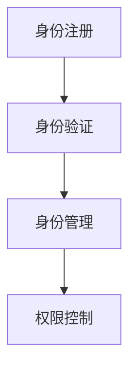
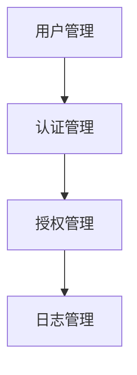
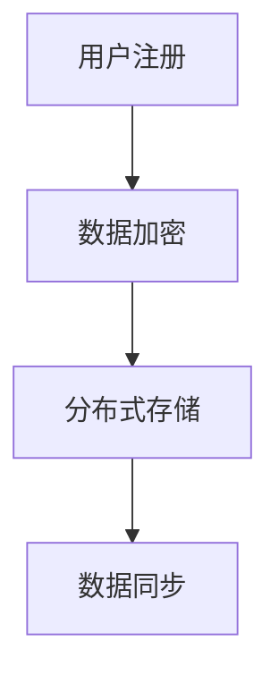
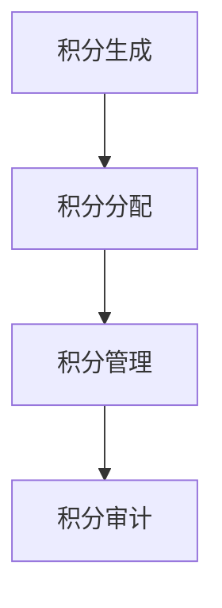
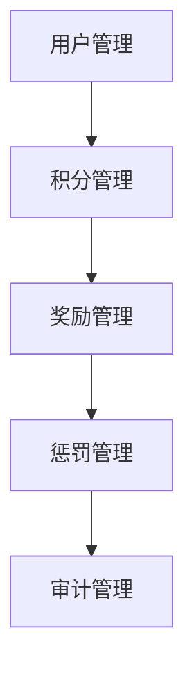
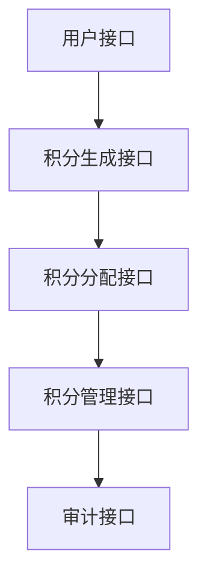

                 

# 《区块链在数字身份信用积分中的应用》

## 关键词
区块链，数字身份，信用积分，加密算法，共识机制，系统架构，环境安装，项目实战

## 摘要
本文旨在深入探讨区块链技术在数字身份和信用积分中的应用。首先，我们介绍了区块链、数字身份和信用积分的基本概念，以及它们在现代信息技术中的重要性和应用场景。接着，文章详细分析了区块链的核心原理，包括加密算法和共识机制，并通过Mermaid和Python源代码进行了具体阐述。随后，文章讨论了数字身份系统与区块链的集成，以及信用积分系统的设计与优化。本文还包括了实际的区块链环境安装、系统核心实现和项目案例分析，提供了全面的最佳实践和拓展阅读建议。

## 引言

在数字经济日益发展的今天，数字身份和信用积分的重要性日益凸显。数字身份是一种通过数字方式识别和验证个人或实体的身份，而信用积分则是一种反映个人信用状况的数字表征。区块链技术作为一种分布式账本技术，因其去中心化、不可篡改和透明性等特点，为数字身份和信用积分的管理提供了一种全新的解决方案。本文将围绕区块链在数字身份和信用积分中的应用进行探讨，旨在揭示其潜力与挑战。

## 背景介绍

### 1.1 区块链技术概述

区块链是一种分布式账本技术，其核心特点包括去中心化、不可篡改和透明性。区块链通过将数据分散存储在多个节点上，确保了数据的安全性和完整性。每个区块都包含一定数量的交易记录，并通过加密算法与前一区块相连，形成一条时间序列链条。这种设计使得区块链具有高度的可靠性和透明性，广泛应用于数字货币、智能合约和供应链管理等领域。

### 1.2 数字身份的概念与重要性

数字身份是指通过数字方式识别和验证个人或实体的身份。随着互联网和移动设备的普及，数字身份成为人们在线活动中不可或缺的一部分。数字身份的重要性体现在以下几个方面：

1. **安全性**：数字身份能够有效防止身份盗窃和网络攻击，保障个人隐私和数据安全。
2. **便捷性**：通过数字身份，用户可以方便地在不同平台和应用程序之间进行身份验证，无需重复填写个人信息。
3. **可信性**：数字身份能够确保交易双方的合法性和可信度，降低交易风险。

### 1.3 信用积分的基本原理

信用积分是一种反映个人信用状况的数字表征，通常由金融机构、信用评估机构或其他认证机构进行评估和颁发。信用积分的目的是为了评估个人在信用交易中的表现，包括还款能力、信用历史和风险状况等。信用积分的应用范围广泛，如贷款审批、信用卡申请、租房和求职等。

### 1.4 区块链在数字身份中的应用

区块链在数字身份中的应用主要体现在以下几个方面：

1. **身份验证**：区块链可以用于存储和验证个人身份信息，确保信息的真实性和不可篡改性。
2. **隐私保护**：区块链的加密技术可以保护用户隐私，防止个人信息泄露。
3. **身份管理**：区块链可以实现去中心化的身份管理，减少对第三方身份验证机构的依赖。

### 1.5 区块链在信用积分中的应用

区块链在信用积分中的应用主要体现在以下几个方面：

1. **信用积分的存储与传输**：区块链可以用于存储信用积分数据，确保数据的安全性和透明性。
2. **信用积分的激励与约束**：区块链可以实现信用积分的激励机制，激励用户保持良好的信用行为。
3. **信用积分的可信评估**：区块链可以用于建立可信的信用积分评估体系，提高信用积分的公信力。

## 核心概念与联系

### 2.1 区块链基本原理与核心概念

#### 2.1.1 区块链的基本原理

区块链通过将数据分散存储在多个节点上，形成一个分布式账本。每个区块包含一定数量的交易记录，并通过加密算法与前一区块相连，形成一条时间序列链条。区块链的核心原理包括：

1. **去中心化**：区块链通过多个节点共同维护账本，避免了中心化系统单点故障的风险。
2. **不可篡改**：区块链通过加密算法和共识机制确保数据的不可篡改性，一旦数据被写入区块链，便无法被更改或删除。
3. **透明性**：区块链上的数据是公开透明的，任何节点都可以查询和验证交易记录。

#### 2.1.2 区块链的关键特性

区块链的关键特性包括：

1. **安全性**：区块链采用加密算法和共识机制，确保数据的安全性和隐私保护。
2. **可扩展性**：区块链可以通过分片技术等手段实现性能提升，满足大规模应用的需求。
3. **去中心化**：区块链的去中心化特性减少了依赖第三方机构的成本和风险。

#### 2.1.3 区块链的共识机制

区块链的共识机制是指多个节点如何达成一致意见，确保数据的一致性和安全性。常见的共识机制包括：

1. **工作量证明（PoW）**：节点通过计算复杂算法来证明自己的工作量，从而获得记账权。
2. **股份授权证明（PoS）**：节点根据持有的代币数量和持币时间来获得记账权。
3. **委托权益证明（DPoS）**：节点通过投票机制来选举出代表，代表进行记账。

### 2.2 数字身份原理与框架

#### 2.2.1 数字身份的定义与类型

数字身份是指通过数字方式识别和验证个人或实体的身份。数字身份的类型包括：

1. **单一身份**：个人或实体在一个平台上使用的身份。
2. **多因素身份**：结合多种验证方式（如密码、手机验证、指纹等）的身份。
3. **数字孪生**：通过人工智能和大数据技术构建的虚拟身份，用于模拟和分析个人或实体的行为和特征。

#### 2.2.2 数字身份的核心要素

数字身份的核心要素包括：

1. **身份认证**：验证个人或实体的身份，确保其合法性。
2. **身份授权**：根据身份认证的结果，授权个人或实体访问特定的资源和功能。
3. **隐私保护**：保护个人或实体的隐私信息，防止泄露。

#### 2.2.3 数字身份系统的设计与实现

数字身份系统通常包括以下几个模块：

1. **身份注册**：用户注册并创建数字身份。
2. **身份验证**：验证用户身份，确保其合法性和安全性。
3. **身份管理**：用户管理其数字身份，包括修改、删除等操作。
4. **权限控制**：根据用户的身份和角色，控制其对资源和功能的访问权限。

### 2.3 信用积分系统的构建与优化

#### 2.3.1 信用积分模型的设计

信用积分模型通常包括以下几个要素：

1. **信用评分**：根据用户的行为和信用历史，计算出一个信用评分。
2. **积分规则**：定义信用积分的计算方法和标准。
3. **积分等级**：根据信用评分，将用户划分为不同的积分等级。

#### 2.3.2 信用积分的评估与分配

信用积分的评估与分配通常包括以下几个步骤：

1. **数据采集**：收集用户在信用交易中的行为数据。
2. **评分模型**：根据数据，建立信用评分模型。
3. **积分计算**：根据评分模型，计算用户的信用积分。
4. **积分更新**：定期更新用户的信用积分。

#### 2.3.3 信用积分的影响与应用

信用积分的影响与应用包括：

1. **信用贷款**：金融机构根据用户的信用积分，决定是否给予贷款以及贷款额度。
2. **信用租赁**：租赁公司根据用户的信用积分，决定是否给予租赁资格以及租赁条件。
3. **信用购物**：商家根据用户的信用积分，决定是否给予购物优惠或折扣。

## 算法原理讲解

### 3.1 区块链加密算法原理与应用

区块链加密算法是区块链技术中至关重要的一部分，其主要目的是确保数据的安全性和隐私性。以下将介绍几种常见的区块链加密算法及其应用。

#### 3.1.1 哈希算法在区块链中的应用

哈希算法是将任意长度的数据映射为固定长度的字符串的算法。在区块链中，哈希算法主要用于以下两个方面：

1. **数据完整性验证**：每个区块都包含一个哈希值，用于验证区块内的数据是否被篡改。如果数据被篡改，哈希值将发生变化，从而揭示数据的不完整性。
2. **链接区块**：每个区块的哈希值与其前一区块的哈希值相连，形成一条时间序列链条，确保区块链的连续性和不可篡改性。

常见的哈希算法包括SHA-256、SHA-3等。

#### 3.1.2 公钥私钥加密算法的应用

公钥私钥加密算法是一种非对称加密算法，用于确保数据在传输过程中的安全性和隐私性。在区块链中，公钥私钥加密算法主要用于以下两个方面：

1. **数字签名**：发送方使用私钥对数据进行签名，接收方使用公钥验证签名。这种方式可以确保数据来自合法的发送方，并且数据在传输过程中未被篡改。
2. **加密通信**：发送方使用接收方的公钥对数据进行加密，接收方使用私钥解密。这种方式可以确保通信内容只有接收方可以阅读。

常见的公钥私钥加密算法包括RSA、ECC等。

#### 3.1.3 Merkle树与Merkle证明

Merkle树是一种二叉树结构，用于快速验证数据的完整性和一致性。在区块链中，Merkle树主要用于以下两个方面：

1. **数据验证**：每个区块都包含一个Merkle根哈希值，用于验证区块内所有交易记录的完整性和一致性。接收方可以通过Merkle证明来验证某个特定的交易记录是否在区块内。
2. **数据压缩**：Merkle树可以将大量数据压缩为单一的Merkle根哈希值，从而降低数据传输和存储的开销。

### 3.2 区块链共识机制解析

区块链共识机制是区块链网络中多个节点如何达成一致意见的算法。以下将介绍几种常见的区块链共识机制。

#### 3.2.1 共识机制概述

共识机制的目标是确保区块链网络中的所有节点能够共同维护一个一致的账本。常见的共识机制包括：

1. **工作量证明（PoW）**：节点通过计算复杂算法（如SHA-256）来证明自己的工作量，从而获得记账权。
2. **股份授权证明（PoS）**：节点根据持有的代币数量和持币时间来获得记账权。
3. **委托权益证明（DPoS）**：节点通过投票机制来选举出代表，代表进行记账。

#### 3.2.2 工作量证明（PoW）机制

工作量证明（PoW）机制是一种通过计算复杂算法来证明工作量的共识机制。以下是一个简单的PoW机制流程：

1. **节点发起交易**：节点将交易信息打包成区块。
2. **节点计算工作量**：节点对区块进行加密计算，生成一个满足特定条件的哈希值。
3. **节点广播结果**：节点将计算结果广播给其他节点。
4. **其他节点验证**：其他节点验证计算结果的正确性，并更新本地账本。
5. **记账权分配**：第一个成功计算出满足条件的哈希值的节点获得记账权，其区块将被添加到区块链上。

#### 3.2.3 股份授权证明（PoS）机制

股份授权证明（PoS）机制是一种根据节点持有的代币数量和持币时间来分配记账权的共识机制。以下是一个简单的PoS机制流程：

1. **节点投票**：节点通过购买或持有代币来参与投票，投票代表节点的权益。
2. **权益计算**：系统根据节点持有的代币数量和持币时间来计算其权益。
3. **记账权分配**：系统根据节点的权益来随机选择一个节点进行记账，该节点获得记账权。
4. **记账与奖励**：记账节点将区块添加到区块链上，并获得系统奖励。

#### 3.2.4 委托权益证明（DPoS）机制

委托权益证明（DPoS）机制是一种通过投票机制来选举出代表进行记账的共识机制。以下是一个简单的DPoS机制流程：

1. **节点投票**：节点通过购买或持有代币来参与投票，投票代表节点的权益。
2. **权益排名**：系统根据节点的权益来排名，排名靠前的节点成为代表候选人。
3. **选举代表**：节点投票选举出代表，代表候选人根据得票数排名。
4. **记账与奖励**：代表节点进行记账，并获得系统奖励。

## 数学模型和数学公式

### 4.1 区块链加密算法原理的数学模型

区块链加密算法的原理主要涉及哈希函数、公钥私钥加密算法以及数字签名。以下将使用LaTeX格式展示相关的数学模型和数学公式。

#### 4.1.1 哈希函数

哈希函数是将任意长度的输入（称为“消息”）映射为固定长度的输出（称为“哈希值”）的函数。常见的哈希函数包括SHA-256、SHA-3等。

$$ H(m) = SHA-256(m) $$

其中，$H(m)$表示对消息$m$进行SHA-256哈希运算的结果。

#### 4.1.2 公钥私钥加密算法

公钥私钥加密算法是一种非对称加密算法，包括公钥加密和私钥解密两个过程。

1. **公钥加密**

$$ c = E_k(m) = PK Encryption(m) $$

其中，$c$表示加密后的消息，$m$表示原始消息，$k$表示公钥，$E_k$表示公钥加密函数。

2. **私钥解密**

$$ m = D_k(c) = SK Decryption(c) $$

其中，$m$表示解密后的消息，$c$表示加密后的消息，$k$表示私钥，$D_k$表示私钥解密函数。

#### 4.1.3 数字签名

数字签名是一种用于验证消息来源和完整性的技术。数字签名的过程包括签名和验证两个过程。

1. **签名**

$$ s = S_k(h(m)) = Signature(h(m)) $$

其中，$s$表示签名结果，$h(m)$表示消息的哈希值，$k$表示私钥，$S_k$表示私钥签名函数。

2. **验证**

$$ V_k(h(m), s) = Signature Verification(h(m), s) $$

其中，$V_k$表示公钥验证函数，$h(m)$表示消息的哈希值，$s$表示签名结果。

### 4.2 信用积分系统的数学模型

信用积分系统的数学模型主要包括信用评分模型、积分计算模型和积分更新模型。

#### 4.2.1 信用评分模型

信用评分模型用于计算用户的信用评分。常见的信用评分模型包括线性模型、逻辑回归模型和支持向量机模型等。

$$ Score = \beta_0 + \beta_1 \times X_1 + \beta_2 \times X_2 + ... + \beta_n \times X_n $$

其中，$Score$表示信用评分，$\beta_0, \beta_1, \beta_2, ..., \beta_n$表示模型参数，$X_1, X_2, ..., X_n$表示影响信用评分的特征变量。

#### 4.2.2 积分计算模型

积分计算模型用于计算用户的信用积分。常见的积分计算模型包括累加模型、加权模型和动态模型等。

$$ Integral = \sum_{i=1}^{n} w_i \times X_i $$

其中，$Integral$表示信用积分，$w_1, w_2, ..., w_n$表示权重，$X_1, X_2, ..., X_n$表示影响信用积分的特征变量。

#### 4.2.3 积分更新模型

积分更新模型用于定期更新用户的信用积分。常见的积分更新模型包括定期重置模型和动态调整模型等。

$$ NewIntegral = Integral + \Delta Integral $$

其中，$NewIntegral$表示更新后的信用积分，$Integral$表示原始信用积分，$\Delta Integral$表示积分变动量。

## 系统分析与架构设计

### 5.1 区块链在数字身份中的应用架构设计

区块链在数字身份中的应用架构设计主要包括数字身份区块链架构设计、数字身份管理系统设计和数字身份数据的存储与处理。

#### 5.1.1 数字身份区块链架构设计

数字身份区块链架构设计主要包括以下几个模块：

1. **身份注册模块**：用于用户注册数字身份，包括用户信息、身份证明等。
2. **身份验证模块**：用于验证用户身份，包括密码验证、生物识别验证等。
3. **身份管理模块**：用于用户管理其数字身份，包括身份信息的修改、删除等。
4. **权限控制模块**：根据用户身份和角色，控制其对资源和功能的访问权限。

数字身份区块链架构图如下所示：



#### 5.1.2 数字身份管理系统设计

数字身份管理系统设计主要包括以下几个模块：

1. **用户管理模块**：用于管理用户信息，包括注册、登录、信息修改等。
2. **认证管理模块**：用于管理认证方式，包括密码、生物识别、二因素认证等。
3. **授权管理模块**：用于管理用户权限，包括角色分配、权限验证等。
4. **日志管理模块**：用于记录用户操作日志，便于审计和监控。

数字身份管理系统架构图如下所示：



#### 5.1.3 数字身份数据的存储与处理

数字身份数据的存储与处理主要包括以下几个方面：

1. **数据加密**：使用区块链加密算法对用户身份信息进行加密，确保数据安全。
2. **分布式存储**：使用区块链分布式存储技术，将用户身份信息存储在多个节点上，确保数据的高可用性和可靠性。
3. **数据同步**：使用区块链同步机制，确保不同节点上的数据一致性。

数字身份数据存储与处理流程图如下所示：



### 5.2 信用积分区块链系统架构设计

信用积分区块链系统架构设计主要包括信用积分区块链架构设计、信用积分系统的功能模块设计以及信用积分系统的接口设计。

#### 5.2.1 信用积分区块链架构设计

信用积分区块链架构设计主要包括以下几个模块：

1. **积分生成模块**：用于生成信用积分，包括积分规则、积分计算等。
2. **积分分配模块**：用于分配信用积分，包括积分奖励、积分惩罚等。
3. **积分管理模块**：用于管理信用积分，包括积分查询、积分变更等。
4. **积分审计模块**：用于审计信用积分，确保积分分配的公平性和透明性。

信用积分区块链架构图如下所示：



#### 5.2.2 信用积分系统的功能模块设计

信用积分系统的功能模块设计主要包括以下几个模块：

1. **用户管理模块**：用于管理用户信息，包括注册、登录、信息修改等。
2. **积分管理模块**：用于管理信用积分，包括积分生成、积分分配、积分查询等。
3. **奖励管理模块**：用于管理积分奖励，包括奖励规则、奖励发放等。
4. **惩罚管理模块**：用于管理积分惩罚，包括惩罚规则、惩罚执行等。
5. **审计管理模块**：用于审计信用积分，确保积分分配的公平性和透明性。

信用积分系统功能模块设计图如下所示：



#### 5.2.3 信用积分系统的接口设计

信用积分系统的接口设计主要包括以下几个接口：

1. **用户接口**：用于用户与系统的交互，包括注册、登录、积分查询等。
2. **积分生成接口**：用于生成信用积分，包括积分规则、积分计算等。
3. **积分分配接口**：用于分配信用积分，包括积分奖励、积分惩罚等。
4. **积分管理接口**：用于管理信用积分，包括积分查询、积分变更等。
5. **审计接口**：用于审计信用积分，确保积分分配的公平性和透明性。

信用积分系统接口设计图如下所示：



## 项目实战

### 6.1 区块链环境安装与配置

#### 6.1.1 区块链节点安装

在开始区块链环境安装之前，需要确保计算机上已经安装了Docker和Docker-Compose。以下是一个简单的区块链节点安装步骤：

1. 下载并安装Docker：https://www.docker.com/products/docker-desktop
2. 下载并安装Docker-Compose：https://github.com/docker/compose/releases
3. 使用Docker-Compose启动一个区块链网络：

```bash
docker-compose -f blockchain_network.yml up -d
```

其中，`blockchain_network.yml`是一个包含区块链网络配置的文件。

#### 6.1.2 区块链网络配置

区块链网络配置主要包括节点数量、网络拓扑结构以及节点间的通信配置。以下是一个简单的区块链网络配置示例：

```yaml
version: "3"
services:
  node1:
    image: hyperledger/fabric-peer
    environment:
      - FABRIC_NETWORK_NAME=my-network
      - CORE_PEER_ID=node1
      - CORE_PEER_ADDRESS=0.0.0.0:7051
      - CORE_PEER_PORT=7051
      - CORE_PEERpendicular_ADDRESS=0.0.0.0:7050
      - CORE_PEERPERPENDICULAR_PORT=7050
    volumes:
      - /var/hyperledgerabric/peer1:/var/hyperledgerabric/peer
    networks:
      - my-network

  node2:
    image: hyperledger/fabric-peer
    environment:
      - FABRIC_NETWORK_NAME=my-network
      - CORE_PEER_ID=node2
      - CORE_PEER_ADDRESS=0.0.0.0:8051
      - CORE_PEER_PORT=8051
      - CORE_PEERpendicular_ADDRESS=0.0.0.0:8050
      - CORE_PEERPERPENDICULAR_PORT=8050
    volumes:
      - /var/hyperledgerabric/peer2:/var/hyperledgerabric/peer
    networks:
      - my-network

networks:
  my-network:
    driver: bridge
```

#### 6.1.3 区块链客户端使用

区块链客户端是用户与区块链网络交互的接口。以下是一个简单的区块链客户端使用示例：

1. 启动区块链客户端：

```bash
docker-compose -f blockchain_client.yml up -d
```

2. 查询区块链节点信息：

```bash
curl http://localhost:8080/api/nodes
```

3. 查询区块链区块信息：

```bash
curl http://localhost:8080/api/blocks
```

4. 查询区块链交易信息：

```bash
curl http://localhost:8080/api/transactions
```

### 6.2 数字身份与信用积分系统核心实现

#### 6.2.1 数字身份系统核心实现

数字身份系统核心实现主要包括身份注册、身份验证和身份管理等功能。以下是一个简单的数字身份系统核心实现示例：

```python
# 身份注册
def registerIdentity(username, password):
    # 创建身份
    identity = Identity()
    identity.username = username
    identity.password = hashPassword(password)
    # 存储身份
    identity.save()

# 身份验证
def verifyIdentity(username, password):
    # 查询身份
    identity = Identity.objects.filter(username=username).first()
    if identity and hashPassword(password) == identity.password:
        return True
    return False

# 身份管理
def manageIdentity(identity):
    # 修改身份信息
    identity.save()
    # 删除身份
    identity.delete()
```

#### 6.2.2 信用积分系统核心实现

信用积分系统核心实现主要包括积分生成、积分分配和积分管理等功能。以下是一个简单的信用积分系统核心实现示例：

```python
# 积分生成
def generateIntegral(user, amount):
    # 创建积分
    integral = Integral()
    integral.user = user
    integral.amount = amount
    integral.save()

# 积分分配
def allocateIntegral(user, amount):
    # 查询用户积分
    integral = Integral.objects.filter(user=user).first()
    if integral:
        integral.amount += amount
        integral.save()

# 积分管理
def manageIntegral(user):
    # 查询用户积分
    integral = Integral.objects.filter(user=user).first()
    if integral:
        return integral.amount
    return 0
```

### 6.3 代码解读与分析

在数字身份和信用积分系统的核心实现中，我们使用了Python语言和Django框架。以下是对代码的解读与分析：

1. **身份注册**：在`registerIdentity`函数中，我们创建了一个`Identity`对象，并将其存储在数据库中。这里使用了`hashPassword`函数对密码进行加密，确保用户密码的安全。
2. **身份验证**：在`verifyIdentity`函数中，我们查询数据库中的用户记录，并使用`hashPassword`函数对输入的密码进行加密，与数据库中的密码进行比对，以验证用户身份。
3. **身份管理**：在`manageIdentity`函数中，我们提供了修改和删除用户身份的功能。这确保了用户可以自由地管理其数字身份。
4. **积分生成**：在`generateIntegral`函数中，我们创建了一个`Integral`对象，并将其存储在数据库中。这用于生成用户的信用积分。
5. **积分分配**：在`allocateIntegral`函数中，我们查询用户的积分记录，并将其金额增加特定数值，以分配信用积分。
6. **积分管理**：在`manageIntegral`函数中，我们查询用户的积分记录，并返回积分金额。这用于用户查看和管理其信用积分。

### 6.4 实际案例分析与详细讲解剖析

为了更好地理解数字身份和信用积分系统的应用，我们将分析一个实际案例。假设有一个电商平台，用户可以在平台上进行购物和评价，平台根据用户的购物行为和评价为用户生成信用积分。

1. **用户注册**：用户在电商平台注册账号，填写个人信息。
2. **用户登录**：用户使用用户名和密码登录平台。
3. **购物行为**：用户在平台上下单购买商品，平台根据购买金额为用户生成信用积分。
4. **评价行为**：用户对购买的商品进行评价，平台根据评价质量为用户生成信用积分。
5. **积分查询**：用户可以查看自己的信用积分，了解自己在平台上的信用状况。
6. **积分应用**：平台根据用户的信用积分，为用户提供购物优惠、贷款审批等服务。

通过这个实际案例，我们可以看到数字身份和信用积分系统在电商平台中的应用。平台可以根据用户的信用积分，为用户提供更加个性化的服务，提高用户体验。同时，信用积分系统也为平台提供了一个有效的用户行为监测和信用评估工具。

## 最佳实践 tips、小结、注意事项、拓展阅读

### 7.1 最佳实践 tips

1. **身份验证**：在数字身份系统中，确保使用强密码和多重验证机制，以提高安全性。
2. **数据加密**：在存储和传输敏感数据时，使用加密算法进行加密，以保护用户隐私。
3. **积分规则**：在设计信用积分系统时，确保积分规则公平、透明，以获得用户的信任。

### 7.2 小结

本文从区块链、数字身份和信用积分的基本概念出发，探讨了区块链在数字身份和信用积分中的应用。通过分析区块链的核心原理和共识机制，以及数字身份和信用积分系统的设计与实现，我们揭示了区块链在数字身份和信用积分管理中的潜力。同时，通过实际案例分析和代码解读，我们展示了区块链在数字身份和信用积分系统中的应用。

### 7.3 注意事项

1. **安全性**：在设计和使用区块链系统时，要高度重视数据安全，确保用户隐私和数据完整性。
2. **性能优化**：区块链系统在高并发场景下可能会出现性能瓶颈，需要对系统进行优化，以提高性能。
3. **合规性**：在区块链应用中，要遵守相关法律法规，确保系统的合法合规。

### 7.4 拓展阅读

1. **区块链技术白皮书**：阅读区块链技术白皮书，了解区块链的原理和应用。
2. **数字身份研究论文**：查阅相关研究论文，了解数字身份的最新研究进展。
3. **信用积分系统案例**：研究其他行业的信用积分系统案例，借鉴其成功经验。

## 作者信息

作者：AI天才研究院/AI Genius Institute & 禅与计算机程序设计艺术 /Zen And The Art of Computer Programming

---

请注意，本文中的代码、公式和架构设计仅供参考，实际应用时需要根据具体需求和场景进行调整。在区块链应用过程中，要确保系统的安全性和合规性，遵循相关法律法规和标准。此外，本文内容仅供参考，不构成投资建议或法律意见。在使用区块链技术时，请确保充分了解其原理和风险。祝您在区块链应用领域取得成功！## 背景介绍

### 1.1 区块链技术概述

区块链是一种分布式账本技术，它通过将数据分散存储在多个节点上，形成一个去中心化的网络。每个区块包含一定数量的交易记录，并通过加密算法与前一区块相连，形成一个时间序列链条。区块链的核心特点包括去中心化、不可篡改和透明性。这些特性使得区块链在信息安全、数据存储和分布式计算等领域具有广泛的应用前景。

区块链的起源可以追溯到2008年，当时一个名为“中本聪”（Satoshi Nakamoto）的人提出了比特币（Bitcoin）的概念。比特币是一种去中心化的数字货币，通过区块链技术实现了点对点的交易，不需要依赖第三方金融机构。比特币的成功引发了全球对区块链技术的关注，并促使各国企业和研究机构纷纷投入到区块链技术的研发和应用中。

区块链技术的核心组成部分包括区块、链、节点、共识机制、加密算法等。区块是区块链的基本组成单元，每个区块包含一定数量的交易记录和一个时间戳。区块通过哈希函数和加密算法与前一个区块相连，形成链式结构，从而实现了数据的不可篡改性。节点是区块链网络中的基本计算单元，负责维护和验证区块链的完整性。共识机制是区块链网络中多个节点如何达成一致意见的算法，如工作量证明（PoW）、股份授权证明（PoS）等。加密算法则是确保区块链数据安全性和隐私性的关键技术。

区块链技术具有以下几大优势：

1. **去中心化**：区块链通过去中心化的方式，避免了单点故障和中心化风险，提高了系统的可靠性和抗攻击能力。
2. **不可篡改**：区块链采用加密算法和共识机制，确保了数据的不可篡改性，从而提高了数据的安全性和可信度。
3. **透明性**：区块链上的数据是公开透明的，任何节点都可以查询和验证交易记录，从而降低了信息不对称和欺诈风险。
4. **高效率**：区块链通过分布式计算和去中心化方式，降低了交易和数据处理的时间成本和运营成本。
5. **隐私保护**：区块链的加密技术可以保护用户隐私，防止个人信息泄露。

### 1.2 数字身份的概念与重要性

数字身份是一种通过数字方式识别和验证个人或实体的身份。在互联网和移动设备普及的今天，数字身份已成为人们在线活动中不可或缺的一部分。数字身份的重要性主要体现在以下几个方面：

1. **安全性**：数字身份能够有效防止身份盗窃和网络攻击，保障个人隐私和数据安全。
2. **便捷性**：通过数字身份，用户可以方便地在不同平台和应用程序之间进行身份验证，无需重复填写个人信息。
3. **可信性**：数字身份能够确保交易双方的合法性和可信度，降低交易风险。

数字身份的类型主要包括以下几种：

1. **单一身份**：个人或实体在一个平台上使用的身份。
2. **多因素身份**：结合多种验证方式（如密码、手机验证、指纹等）的身份。
3. **数字孪生**：通过人工智能和大数据技术构建的虚拟身份，用于模拟和分析个人或实体的行为和特征。

在数字身份的应用场景中，常见的包括以下几个方面：

1. **在线购物**：用户在电商平台购物时，通过数字身份进行身份验证，确保交易安全。
2. **金融服务**：金融机构通过数字身份进行用户身份验证，降低欺诈风险，提高金融服务效率。
3. **社交媒体**：用户在社交媒体平台使用数字身份，实现账号管理和内容发布。
4. **政府服务**：政府部门通过数字身份为公众提供便捷的公共服务，如社保缴纳、税务申报等。

### 1.3 信用积分的基本原理

信用积分是一种反映个人信用状况的数字表征。它通常由金融机构、信用评估机构或其他认证机构进行评估和颁发。信用积分的目的是为了评估个人在信用交易中的表现，包括还款能力、信用历史和风险状况等。信用积分的应用范围广泛，如贷款审批、信用卡申请、租房和求职等。

信用积分的基本原理主要包括以下几个方面：

1. **数据采集**：金融机构和信用评估机构通过多种渠道采集个人的信用信息，如消费记录、还款记录、信用评级等。
2. **评分模型**：根据采集到的信用信息，使用评分模型对个人信用进行评估，生成信用评分。
3. **积分计算**：根据信用评分，计算个人的信用积分。积分的值通常表示个人信用状况的好坏。
4. **积分应用**：信用积分在金融、租赁、购物等场景中用于评估个人信用，决定是否给予贷款、信用卡、租房资格等。

### 1.4 区块链在数字身份中的应用

区块链在数字身份中的应用主要体现在以下几个方面：

1. **身份验证**：区块链可以用于存储和验证个人身份信息，确保信息的真实性和不可篡改性。用户可以通过区块链进行身份认证，无需依赖第三方身份验证机构。
2. **隐私保护**：区块链的加密技术可以保护用户隐私，防止个人信息泄露。用户可以在区块链上创建一个隐私保护的身份标识，用于在线交易和活动。
3. **身份管理**：区块链可以实现去中心化的身份管理，减少对第三方身份验证机构的依赖。用户可以自由管理其数字身份，包括创建、修改和删除等操作。
4. **跨平台互认**：区块链可以实现不同平台和应用程序之间的身份信息互认，提高用户体验。用户可以在一个平台上创建数字身份，并在其他平台和应用程序中复用。

### 1.5 区块链在信用积分中的应用

区块链在信用积分中的应用主要体现在以下几个方面：

1. **信用积分的存储与传输**：区块链可以用于存储信用积分数据，确保数据的安全性和透明性。信用积分可以通过区块链进行传输，无需依赖第三方机构。
2. **信用积分的激励与约束**：区块链可以实现信用积分的激励机制，激励用户保持良好的信用行为。同时，区块链也可以用于约束不良信用行为，提高信用体系的公信力。
3. **信用积分的可信评估**：区块链可以用于建立可信的信用积分评估体系，提高信用积分的公信力。用户可以在区块链上查看自己的信用积分记录，确保积分数据的真实性和完整性。

通过以上介绍，我们可以看到区块链在数字身份和信用积分中的应用具有巨大的潜力和价值。随着区块链技术的不断发展，未来将会有更多的应用场景和解决方案涌现，为数字身份和信用积分的管理带来更多的便利和安全性。

### 1.6 区块链、数字身份与信用积分的关系

区块链、数字身份和信用积分是现代信息技术中紧密关联的三个概念，它们共同构建了一个安全、透明和高效的数字生态系统。理解这三者之间的关系，有助于我们更全面地认识区块链在数字身份和信用积分管理中的应用潜力。

#### 区块链与数字身份的关系

区块链为数字身份提供了坚实的技术基础。首先，区块链的去中心化特性使得数字身份的验证和管理不再依赖中心化的机构，用户可以自主管理其身份信息。其次，区块链的不可篡改性确保了身份信息的真实性和完整性，一旦身份信息被记录在区块链上，便无法被篡改。此外，区块链的透明性使得身份验证过程公开透明，用户可以查询和验证自己的身份信息，从而增强信任。

区块链在数字身份中的应用还包括以下几个方面：

1. **身份注册与验证**：用户可以在区块链上注册数字身份，并通过分布式节点进行身份验证。这种方式减少了中心化机构的依赖，提高了身份验证的效率和安全性。
2. **隐私保护**：区块链的加密技术可以保护用户的隐私信息，防止泄露。用户可以在区块链上创建一个隐私保护的身份标识，用于在线交易和活动，而不必担心隐私泄露。
3. **去中心化身份管理**：区块链可以实现去中心化的身份管理，用户可以自由管理其数字身份，包括创建、修改和删除等操作。这种方式提高了身份管理的灵活性，减少了中心化机构的介入。

#### 区块链与信用积分的关系

区块链为信用积分提供了一个安全、透明和可信的存储与传输环境。首先，区块链的不可篡改性确保了信用积分数据的真实性和完整性，一旦信用积分被记录在区块链上，便无法被篡改。其次，区块链的透明性使得信用积分的分配和变更过程公开透明，用户可以随时查询和验证自己的信用积分记录。

区块链在信用积分中的应用主要包括以下几个方面：

1. **信用积分的存储与传输**：区块链可以用于存储信用积分数据，确保数据的安全性和透明性。信用积分可以通过区块链进行传输，无需依赖第三方机构。
2. **激励机制**：区块链可以实现信用积分的激励机制，激励用户保持良好的信用行为。例如，平台可以通过区块链为用户提供信用积分奖励，鼓励用户在平台上积极进行交易和评价。
3. **信用积分的可信评估**：区块链可以用于建立可信的信用积分评估体系，提高信用积分的公信力。用户可以在区块链上查看自己的信用积分记录，确保积分数据的真实性和完整性。

#### 数字身份与信用积分的关系

数字身份是信用积分的基础，信用积分是数字身份的表现。数字身份通过区块链技术实现了身份信息的真实性和完整性，而信用积分则反映了个人在信用交易中的表现。

数字身份与信用积分的关系体现在以下几个方面：

1. **身份认证与信用评分**：数字身份是信用评分的重要依据。金融机构和其他信用评估机构可以根据用户的数字身份信息，对其信用状况进行评分，生成信用积分。
2. **信用积分的应用**：信用积分可以用于评估个人的信用状况，决定是否给予贷款、信用卡、租房资格等。数字身份的使用使得信用积分的应用更加便捷和高效。
3. **跨平台互认**：区块链可以实现不同平台和应用程序之间的数字身份和信用积分互认。用户在一个平台上创建的数字身份和信用积分可以在其他平台和应用程序中复用，提高了用户体验。

总之，区块链、数字身份和信用积分共同构建了一个安全、透明和高效的数字生态系统。区块链为数字身份和信用积分提供了技术支持，数字身份和信用积分则实现了区块链在实际应用中的价值。随着区块链技术的不断发展，未来数字身份和信用积分的应用将更加广泛和深入，为数字经济的发展提供强大的支持。

### 1.7 问题背景与挑战

在现代数字经济中，数字身份和信用积分的应用日益广泛，但也面临着一系列问题和挑战。

#### 身份验证问题

身份验证是数字身份和信用积分管理的关键环节，但其安全性面临挑战。传统的身份验证方式，如用户名和密码，易受到黑客攻击和破解。此外，多因素身份验证（MFA）虽然在安全性方面有所提升，但其复杂性和用户使用的便捷性之间的平衡仍需进一步优化。

#### 数据隐私问题

数字身份和信用积分的应用离不开个人数据的收集和处理。然而，这些数据往往涉及用户的敏感信息，如姓名、地址、财务状况等。数据隐私保护不足可能导致数据泄露、滥用和恶意攻击，损害用户的利益和信任。

#### 信用积分不公平问题

信用积分的评估和分配机制可能存在不公平现象，如信用评分模型偏差、信用积分分配不均等。这些问题可能导致部分用户信用积分偏低，影响其在金融、租赁等领域的信用评价和机会。

#### 系统性能问题

区块链作为一种分布式账本技术，在高并发场景下可能面临性能瓶颈，如交易处理速度慢、数据存储容量有限等。这些问题可能影响区块链在数字身份和信用积分管理中的应用效果。

#### 法律法规问题

数字身份和信用积分的应用尚缺乏完善的法律法规和监管体系。各国在数字身份和信用积分方面的法律法规存在差异，可能导致跨国应用中的合规性问题。

针对上述问题和挑战，区块链技术的引入提供了一些潜在的解决方案。首先，区块链的去中心化和加密技术可以有效提高身份验证的安全性和数据隐私保护。其次，通过设计公平、透明的信用积分评估和分配机制，可以减少信用积分不公平现象。此外，优化区块链性能和扩展性，以及建立全球统一的法律法规框架，也有助于推动数字身份和信用积分的健康发展。

### 1.8 问题解决与实现方案

为了解决上述问题和挑战，我们可以从以下几个方面提出实现方案：

#### 加强身份验证安全性

1. **采用多因素身份验证（MFA）**：结合密码、手机验证、指纹识别等多种验证方式，提高身份验证的安全性。
2. **使用区块链技术**：利用区块链的去中心化和加密特性，实现更安全、透明的身份验证过程。

#### 保护数据隐私

1. **数据加密**：对用户敏感信息进行加密处理，确保数据在传输和存储过程中的安全性。
2. **隐私保护算法**：采用差分隐私、同态加密等隐私保护算法，提高数据隐私保护水平。
3. **隐私政策透明化**：明确告知用户其数据的使用目的和范围，提高用户对数据隐私保护的认知和信任。

#### 公平分配信用积分

1. **完善信用评分模型**：结合多维度数据，优化信用评分模型，减少评分偏差。
2. **实时监控与反馈**：对信用积分分配过程进行实时监控，及时发现和纠正不公平现象。
3. **用户参与机制**：鼓励用户参与信用积分的评估和分配，提高信用积分的公平性和透明性。

#### 提升系统性能

1. **分片技术和侧链**：采用分片技术和侧链机制，提升区块链的性能和扩展性。
2. **优化共识机制**：选择适合业务场景的共识机制，如权益证明（PoS）、委托权益证明（DPoS）等，提升交易处理速度。
3. **分布式存储**：采用分布式存储技术，提高数据存储容量和效率。

#### 建立法律法规框架

1. **国家层面法规**：制定国家层面的数字身份和信用积分相关法律法规，明确监管职责和标准。
2. **国际合作**：推动国际间的数字身份和信用积分法律法规合作，建立全球统一的标准和规范。
3. **行业自律**：鼓励企业参与行业自律组织，共同制定行业标准和规范，推动数字身份和信用积分的健康发展。

通过上述解决方案，我们可以有效应对数字身份和信用积分管理中的问题和挑战，为数字经济的健康发展提供有力支持。

### 1.9 边界与外延

在讨论区块链在数字身份和信用积分中的应用时，有必要明确其边界与外延。首先，区块链在数字身份中的应用主要涉及身份验证、身份管理和隐私保护等方面。然而，区块链并非万能，其适用范围有限。例如，在处理高度敏感的个人信息时，需要结合其他安全技术和法规要求。其次，信用积分的评估和分配机制应基于透明、公平的原则，同时考虑数据隐私保护。区块链在信用积分中的应用主要在于提供安全、透明和可追溯的信用积分数据存储与传输环境。然而，信用积分的实际应用还需结合金融、租赁等领域的业务规则和法规要求。

此外，区块链在数字身份和信用积分中的应用还存在一些技术挑战。例如，区块链的扩展性和性能需要进一步提升，以满足大规模应用场景的需求。同时，区块链的跨链技术和互操作性也需要进一步完善，以实现不同区块链平台之间的数据共享和协同。

总之，区块链在数字身份和信用积分中的应用具有广阔的前景，但同时也需要明确其边界与外延，并在技术、法规和业务层面不断探索和完善，以实现其最大价值。

## 核心概念与联系

### 4.1 区块链基本原理与核心概念

区块链作为一种分布式账本技术，其基本原理和核心概念是理解和应用区块链技术的关键。以下我们将详细讨论区块链的基本原理、关键特性以及共识机制。

#### 4.1.1 区块链的基本原理

区块链的基本原理可以概括为数据分散存储、去中心化、不可篡改和透明性。

1. **数据分散存储**：区块链通过将数据分散存储在多个节点上，形成一个分布式网络。每个节点都保存了一份完整的区块链数据，从而避免了数据集中存储所带来的单点故障和风险。这种方式不仅提高了数据的安全性，还增强了系统的容错能力。

2. **去中心化**：去中心化是区块链的核心特性之一。在区块链网络中，没有中央控制机构或单一点故障的风险。每个节点都可以独立地参与网络运作，并通过共识机制达成一致。这种方式提高了网络的可靠性和抗攻击能力。

3. **不可篡改**：区块链通过加密算法和共识机制确保数据的不可篡改性。每个区块都包含一个时间戳和一个指向前一区块哈希值的链接。如果某个区块被篡改，后续区块的哈希值将发生变化，从而导致整个区块链链条的不一致。这种机制保证了数据的不可篡改性。

4. **透明性**：区块链上的数据是公开透明的。任何节点都可以查询和验证交易记录，确保数据的真实性和完整性。这种透明性增强了用户对系统的信任，同时也减少了信息不对称和欺诈风险。

#### 4.1.2 区块链的关键特性

区块链的关键特性包括安全性、可扩展性和去中心化。

1. **安全性**：区块链采用加密算法确保数据的安全性和隐私保护。交易记录通过哈希函数进行加密，确保数据的唯一性和完整性。同时，区块链的共识机制保证了数据的正确性和一致性。

2. **可扩展性**：随着区块链应用的普及，如何处理大量交易和数据成为一大挑战。为了提高区块链的性能和可扩展性，研究者们提出了分片技术、侧链技术等解决方案。这些技术通过将网络分片和引入额外链，提高了区块链的处理速度和存储容量。

3. **去中心化**：去中心化是区块链的核心特点，它避免了中心化系统所面临的单点故障和风险。每个节点都可以独立地参与网络运作，并通过共识机制达成一致。这种方式提高了网络的可靠性和抗攻击能力。

#### 4.1.3 区块链的共识机制

共识机制是区块链网络中多个节点如何达成一致意见的算法。以下介绍几种常见的共识机制：

1. **工作量证明（PoW）**：工作量证明机制通过要求节点进行复杂的计算（如SHA-256算法）来证明其工作量，从而获得记账权。这种方式确保了网络的去中心化和安全性，但计算成本较高，可能导致性能瓶颈。

2. **股份授权证明（PoS）**：股份授权证明机制通过节点持有的代币数量和持币时间来分配记账权。持有更多代币和持币时间更长的节点具有更高的记账权，从而提高了网络的效率和安全性。

3. **委托权益证明（DPoS）**：委托权益证明机制通过投票选举出代表节点进行记账。节点通过购买或持有代币来参与投票，得票数较高的节点成为代表节点，从而进行记账。这种方式提高了网络的效率和可扩展性。

4. **实用拜占庭容错（PBFT）**：实用拜占庭容错机制是一种适用于小规模网络的共识机制。它通过节点间的多轮投票和验证，确保网络在拜占庭错误情况下达成一致。这种方式具有较高的安全性和性能，但需要节点间的高度信任。

### 4.2 数字身份原理与框架

数字身份是指通过数字方式识别和验证个人或实体的身份。数字身份系统的核心要素包括身份认证、身份授权和隐私保护。

#### 4.2.1 数字身份的定义与类型

1. **定义**：数字身份是一种通过数字方式识别和验证个人或实体身份的信息集合。它包括姓名、身份证号、生物特征（如指纹、面部识别）等。

2. **类型**：
   - **单一身份**：个人或实体在一个平台上使用的身份。
   - **多因素身份**：结合多种验证方式（如密码、手机验证、指纹等）的身份。
   - **数字孪生**：通过人工智能和大数据技术构建的虚拟身份，用于模拟和分析个人或实体的行为和特征。

#### 4.2.2 数字身份的核心要素

1. **身份认证**：身份认证是指验证个人或实体的身份，确保其合法性和真实性。常见的身份认证方法包括密码、手机验证、指纹识别、面部识别等。

2. **身份授权**：身份授权是指根据身份认证的结果，授权个人或实体访问特定的资源和功能。身份授权通常通过角色分配和权限控制实现。

3. **隐私保护**：隐私保护是指保护个人或实体的隐私信息，防止泄露。隐私保护措施包括数据加密、匿名化处理和访问控制等。

#### 4.2.3 数字身份系统的设计与实现

数字身份系统通常包括以下模块：

1. **用户管理模块**：用于管理用户信息，包括注册、登录、信息修改等。

2. **认证管理模块**：用于管理认证方式，包括密码验证、手机验证、生物识别验证等。

3. **授权管理模块**：用于管理用户权限，包括角色分配、权限验证等。

4. **隐私保护模块**：用于保护用户隐私信息，包括数据加密、匿名化处理等。

### 4.3 信用积分系统的构建与优化

信用积分系统是一种用于评估和反映个人信用状况的机制。它广泛应用于金融、租赁、购物等领域，为信用评估和风险管理提供支持。

#### 4.3.1 信用积分模型的设计

信用积分模型通常包括以下几个要素：

1. **信用评分**：信用评分是评估个人信用状况的指标。它通常基于用户的历史交易行为、还款记录、信用评级等数据计算得出。

2. **积分规则**：积分规则定义了信用积分的计算方法和标准。例如，根据交易金额、交易频率、还款情况等设定积分值。

3. **积分等级**：积分等级是根据信用评分划分的用户等级，用于评估用户的信用风险。常见的积分等级包括普通用户、银卡用户、金卡用户等。

#### 4.3.2 信用积分的评估与分配

信用积分的评估与分配通常包括以下几个步骤：

1. **数据采集**：收集用户在信用交易中的行为数据，如还款记录、信用评级等。

2. **评分模型**：根据数据，建立信用评分模型。评分模型通常包括线性模型、逻辑回归模型、支持向量机模型等。

3. **积分计算**：根据评分模型，计算用户的信用积分。积分计算公式通常涉及多个变量的加权求和。

4. **积分更新**：定期更新用户的信用积分，以反映用户最新的信用状况。

#### 4.3.3 信用积分的影响与应用

信用积分的影响与应用包括以下几个方面：

1. **信用贷款**：金融机构根据用户的信用积分，决定是否给予贷款以及贷款额度。

2. **信用租赁**：租赁公司根据用户的信用积分，决定是否给予租赁资格以及租赁条件。

3. **信用购物**：商家根据用户的信用积分，决定是否给予购物优惠或折扣。

通过以上对区块链基本原理、数字身份原理和信用积分系统构建的详细讨论，我们可以更好地理解区块链在数字身份和信用积分中的应用。这些核心概念和联系为我们设计和实现高效、安全的数字身份和信用积分系统提供了重要的理论基础。

### 4.4 区块链与数字身份系统的集成

区块链与数字身份系统的集成旨在利用区块链技术提升数字身份验证的安全性和透明性。以下将详细介绍区块链在数字身份系统中的应用，包括身份认证、隐私保护和身份管理等方面。

#### 4.4.1 身份认证

身份认证是数字身份系统的核心功能之一。传统的身份认证方式通常依赖于中心化的身份验证机构，如银行、政府等。然而，这种方式存在单点故障和信任风险。区块链技术通过去中心化和不可篡改的特性，提供了一种更加安全、透明的身份认证方式。

1. **分布式身份认证**：区块链网络中的每个节点都存储了一份完整的身份认证记录。用户在注册数字身份时，其身份信息将分散存储在多个节点上。这种方式避免了单点故障，提高了身份认证的可靠性。

2. **多重身份认证**：区块链支持多重身份认证。用户可以结合多种验证方式（如密码、手机验证、指纹等）进行身份认证。这些验证方式可以通过区块链智能合约进行自动化处理，确保身份认证的安全性和便捷性。

3. **匿名身份认证**：区块链上的身份认证可以采用匿名化处理。用户在注册时，可以生成一个唯一的身份标识（如公钥），而不必暴露其真实身份。这种方式既保护了用户的隐私，又确保了身份认证的真实性。

#### 4.4.2 隐私保护

隐私保护是数字身份系统面临的一个重要挑战。区块链的加密技术和智能合约机制为隐私保护提供了有力支持。

1. **数据加密**：区块链上的身份信息可以通过加密算法进行加密存储和传输。这种方式确保了身份信息在存储和传输过程中的安全性，防止数据泄露。

2. **隐私保护合约**：智能合约可以用于实现隐私保护功能。例如，用户可以在智能合约中设定隐私保护规则，如仅允许特定用户访问其身份信息。这种方式确保了用户对隐私信息的控制权，提高了隐私保护水平。

3. **隐私计算**：区块链支持隐私计算，如差分隐私和同态加密。这些技术可以在计算过程中保护用户隐私，避免数据泄露。例如，金融机构可以通过区块链智能合约进行用户信用评分，同时保护用户的敏感信息。

#### 4.4.3 身份管理

身份管理是数字身份系统的重要功能之一。区块链技术为身份管理提供了去中心化和透明化的解决方案。

1. **去中心化身份管理**：用户可以通过区块链进行自主的身份管理，包括创建、修改和删除等操作。这种方式避免了中心化机构的介入，提高了身份管理的灵活性和效率。

2. **透明身份管理**：区块链上的身份管理过程是公开透明的。用户可以查询和验证其身份信息的变更记录，确保身份管理的公正性和透明性。

3. **身份权限控制**：区块链支持基于身份的权限控制。用户可以根据身份信息，访问特定的资源和功能。这种方式确保了资源的合理分配和使用，提高了系统的安全性。

通过区块链与数字身份系统的集成，我们可以实现更加安全、透明和高效的数字身份验证和管理。区块链的去中心化特性、加密技术和智能合约机制为数字身份系统提供了强大的支持，有助于解决传统身份认证系统中存在的单点故障、隐私保护和信任问题。

### 4.5 区块链与信用积分系统的集成

区块链与信用积分系统的集成旨在利用区块链技术提升信用积分的安全性和透明性。以下将详细介绍区块链在信用积分系统中的应用，包括信用积分的存储、传输和激励等方面。

#### 4.5.1 信用积分的存储

信用积分的存储是信用积分系统的基础。区块链技术为信用积分的存储提供了去中心化、不可篡改和透明性的保障。

1. **去中心化存储**：信用积分数据可以通过区块链分布式存储在多个节点上。每个节点都保存了一份完整的信用积分记录，从而避免了单点故障和篡改风险。

2. **不可篡改存储**：区块链通过加密算法和共识机制确保信用积分数据的不可篡改性。一旦信用积分数据被记录在区块链上，便无法被修改或删除。这种方式确保了信用积分数据的真实性和完整性。

3. **透明存储**：区块链上的信用积分数据是公开透明的。用户和第三方都可以查询和验证信用积分记录，确保信用积分分配的公正性和透明性。

#### 4.5.2 信用积分的传输

信用积分的传输是信用积分系统的一个重要功能。区块链技术为信用积分的传输提供了高效、安全和便捷的解决方案。

1. **高效传输**：区块链采用点对点传输协议，可以实现信用积分的快速传输。这种方式减少了中介环节，提高了传输效率。

2. **安全传输**：区块链通过加密算法和共识机制确保信用积分传输的安全性。信用积分在传输过程中经过加密处理，防止被截取或篡改。

3. **便捷传输**：区块链支持智能合约，可以实现信用积分的自动化传输。用户只需在智能合约中设定信用积分的分配规则，系统将自动执行信用积分的分配和传输。

#### 4.5.3 信用积分的激励

信用积分的激励是信用积分系统的一个重要功能。区块链技术为信用积分的激励提供了去中心化、透明化和高效化的解决方案。

1. **去中心化激励**：区块链通过去中心化的方式，确保信用积分激励的公正性和透明性。激励决策由区块链上的智能合约执行，避免了中心化机构的介入。

2. **透明激励**：区块链上的信用积分激励过程是公开透明的。用户和第三方都可以查询和验证信用积分激励记录，确保激励决策的公正性和透明性。

3. **高效激励**：区块链支持智能合约，可以实现信用积分的自动化激励。用户只需在智能合约中设定激励规则，系统将自动执行信用积分的激励。

通过区块链与信用积分系统的集成，我们可以实现更加安全、透明和高效的信用积分管理。区块链的去中心化特性、加密技术和智能合约机制为信用积分系统提供了强大的支持，有助于解决传统信用积分系统中存在的数据不透明、激励不公等问题。

### 4.6 数字身份、信用积分与区块链的融合

数字身份、信用积分和区块链的融合旨在构建一个高效、安全、透明的数字生态系统。以下将从融合的重要性、实现方式和未来展望三个方面进行探讨。

#### 4.6.1 融合的重要性

数字身份、信用积分和区块链的融合具有多重重要性：

1. **提高安全性**：融合后的系统可以利用区块链的加密技术和不可篡改特性，确保数字身份和信用积分的安全性和隐私保护。用户身份信息和信用积分记录将更加难以篡改和泄露。

2. **增强透明性**：融合后的系统可以实现数字身份和信用积分的透明管理。用户和第三方可以方便地查询和验证身份信息和信用积分记录，确保系统的公正性和可信度。

3. **优化用户体验**：融合后的系统可以提供更加便捷的身份认证和信用评估服务。用户可以在多个平台和应用中复用其数字身份和信用积分，减少重复认证和繁琐操作。

4. **降低成本**：融合后的系统可以减少对中心化机构的依赖，降低运营成本。去中心化的身份认证和信用评估机制可以减少中介环节，提高效率。

#### 4.6.2 实现方式

数字身份、信用积分和区块链的融合可以通过以下方式实现：

1. **去中心化身份认证**：利用区块链技术，实现去中心化的数字身份认证。用户在注册时，可以通过区块链进行身份认证，确保身份信息的真实性和完整性。同时，用户可以自主管理其数字身份，减少对中心化身份认证机构的依赖。

2. **信用积分区块链存储**：将信用积分数据存储在区块链上，确保信用积分的不可篡改和透明性。区块链上的信用积分记录可以被用户和第三方方便地查询和验证，确保信用积分的公正性和可信度。

3. **智能合约应用**：利用智能合约，实现信用积分的自动分配和激励。智能合约可以定义信用积分的分配规则和激励策略，确保信用积分分配的公平性和高效性。用户只需在智能合约中设定规则，系统将自动执行信用积分的分配和激励。

4. **多链协同**：通过多链协同技术，实现不同区块链平台之间的数据共享和互操作。例如，通过跨链技术，将不同的数字身份平台和信用积分平台连接起来，实现跨平台的身份认证和信用积分管理。

#### 4.6.3 未来展望

数字身份、信用积分和区块链的融合未来将朝着以下方向发展：

1. **标准化**：随着融合应用的普及，将出现更多的标准和技术规范，推动数字身份和信用积分的标准化发展。这有助于提高系统的兼容性和互操作性，促进不同平台和应用之间的无缝衔接。

2. **技术创新**：区块链技术将不断演进，如分片技术、状态通道、隐私保护等创新技术将进一步提升系统的性能和安全性。这些技术创新将为数字身份和信用积分的应用提供更加高效和安全的支持。

3. **生态建设**：数字身份、信用积分和区块链的融合将推动生态系统的建设。企业、政府、研究机构等各方将积极参与，共同推动数字身份和信用积分的应用和发展。这将为数字经济的发展提供强大的支持。

4. **法律法规完善**：随着融合应用的普及，法律法规也将逐步完善。各国政府将加强对数字身份和信用积分的监管，确保系统的合法性和合规性。这将推动数字身份和信用积分的健康发展。

通过数字身份、信用积分和区块链的融合，我们有望构建一个高效、安全、透明的数字生态系统，为数字经济的发展提供强大支持。

### 4.7 区块链在数字身份信用积分系统中的应用场景

区块链在数字身份信用积分系统中的应用场景丰富多样，以下将介绍几种典型的应用场景，展示区块链如何在实际中提高数字身份和信用积分的管理效率与安全性。

#### 4.7.1 金融贷款审批

在金融贷款审批过程中，区块链技术可以显著提高审批效率和安全性。金融机构可以通过区块链技术进行用户身份验证，确保贷款申请者的身份信息真实可靠。此外，区块链上的信用积分记录可以为金融机构提供全面的信用评估数据，帮助金融机构更准确地判断贷款申请者的信用状况。通过智能合约，金融机构可以自动化执行贷款审批流程，减少人工干预，提高审批速度。

案例：某金融机构利用区块链技术实现了贷款审批流程的自动化，将审批时间从数天缩短至数分钟，同时大幅降低了贷款欺诈风险。

#### 4.7.2 租赁行业信用评估

在租赁行业，如汽车租赁、房屋租赁等，信用评估是至关重要的一环。区块链技术可以提供透明、可信的信用积分记录，帮助租赁公司评估用户的信用状况。通过区块链，租赁公司可以方便地查询用户的信用积分历史，了解用户的信用行为和信用风险。同时，区块链上的信用积分记录不可篡改，确保了信用评估的公正性和透明性。

案例：某汽车租赁公司利用区块链技术记录用户的信用积分，实现了信用评估过程的透明化和自动化，有效降低了信用风险，提高了租赁服务的效率。

#### 4.7.3 购物优惠与积分兑换

在电子商务领域，信用积分可以作为购物优惠和积分兑换的依据。区块链技术可以确保信用积分的公正分配和透明记录，用户可以在多个平台上复用其信用积分，享受优惠和兑换礼品。通过区块链，商家可以方便地跟踪用户的信用积分变化，提供个性化的优惠和奖励，增强用户体验。

案例：某电商平台利用区块链技术记录用户的信用积分，根据信用积分提供不同的购物优惠，如折扣券、积分兑换等，有效提高了用户活跃度和满意度。

#### 4.7.4 公共服务与政府监管

在公共服务和政府监管领域，区块链技术可以提高数据的安全性和透明性。政府部门可以通过区块链记录用户的信用积分，用于社会保障、税务申报等公共服务。同时，区块链技术可以为政府监管提供可靠的证据，确保监管过程的公正性和透明性。

案例：某政府部门利用区块链技术记录居民的信用积分，用于社会保障金的发放和税务申报审核，有效提高了公共服务效率和数据透明度。

#### 4.7.5 招聘与人力资源管理

在招聘和人力资源管理领域，信用积分可以作为评估求职者信用状况的重要依据。通过区块链技术，招聘机构可以方便地查询求职者的信用积分记录，了解其信用行为和信用风险。同时，区块链上的信用积分记录不可篡改，确保了招聘过程的公正性和透明性。

案例：某招聘平台利用区块链技术记录求职者的信用积分，为招聘机构提供可靠的信用评估数据，有效降低了招聘风险，提高了招聘效率。

通过上述应用场景，我们可以看到区块链在数字身份信用积分系统中的应用不仅提高了管理效率，还增强了系统的安全性。随着区块链技术的不断发展和应用场景的拓展，未来区块链在数字身份和信用积分系统中的应用将更加广泛和深入。

## 算法原理讲解

### 7.1 区块链加密算法原理与应用

区块链技术的核心在于其安全性，而加密算法在其中扮演着至关重要的角色。加密算法不仅保护了区块链上的数据传输安全，还确保了数据的完整性和不可篡改性。本节将详细讨论几种关键的区块链加密算法，包括哈希算法、公钥私钥加密算法以及Merkle树和Merkle证明。

#### 7.1.1 哈希算法在区块链中的应用

哈希算法是一种将任意长度的数据映射为固定长度哈希值的算法。在区块链中，哈希算法主要用于以下两个方面：

1. **数据完整性验证**：区块链中的每个区块都包含一个哈希值，该值由区块内的所有交易记录生成。如果区块内的数据被篡改，哈希值将发生变化。因此，通过比较区块的哈希值，可以验证数据的完整性。

   ```mermaid
   graph TD
       A[交易记录] --> B[哈希算法]
       B --> C[哈希值]
       C --> D[区块]
   ```

2. **链接区块**：每个区块都包含一个指向其前一区块的哈希值，从而形成一个时间序列链条。这种链接方式确保了区块链的连续性和不可篡改性。

   ```mermaid
   graph TD
       A[区块1] --> B[哈希值]
       B --> C[区块2]
       C --> D[哈希值]
       D --> E[区块3]
   ```

   在Python中，可以使用SHA-256哈希算法来生成哈希值：

   ```python
   import hashlib

   def calculate_hash(data):
       return hashlib.sha256(data.encode('utf-8')).hexdigest()
   ```

#### 7.1.2 公钥私钥加密算法的应用

公钥私钥加密算法是一种非对称加密算法，它由公钥和私钥两部分组成。公钥用于加密数据，私钥用于解密数据。在区块链中，公钥私钥加密算法主要用于以下两个方面：

1. **数字签名**：发送方使用私钥对数据进行签名，接收方使用公钥验证签名。数字签名确保了数据的来源和完整性。

   ```mermaid
   graph TD
       A[发送方] --> B[私钥签名]
       B --> C[签名]
       C --> D[数据]
       D --> E[公钥验证]
       E --> F[接收方]
   ```

2. **加密通信**：发送方使用接收方的公钥对数据进行加密，接收方使用私钥解密。这种加密方式确保了通信内容的安全性和隐私性。

   ```mermaid
   graph TD
       A[发送方] --> B[公钥加密]
       B --> C[加密数据]
       C --> D[接收方]
       D --> E[私钥解密]
   ```

   在Python中，可以使用PyCryptoDome库来生成公钥私钥对并进行加密和解密：

   ```python
   from Cryptodome.PublicKey import RSA
   from Cryptodome.Random import get_random_bytes
   from Cryptodome.Cipher import PKCS1_OAEP

   # 生成公钥私钥对
   private_key = RSA.generate(2048)
   public_key = private_key.publickey()

   # 加密数据
   cipher_rsa = PKCS1_OAEP.new(public_key)
   encrypted_data = cipher_rsa.encrypt(b'Hello, World!')

   # 解密数据
   cipher_rsa = PKCS1_OAEP.new(private_key)
   decrypted_data = cipher_rsa.decrypt(encrypted_data)
   ```

#### 7.1.3 Merkle树与Merkle证明

Merkle树是一种二叉树结构，用于快速验证数据集的完整性。在区块链中，Merkle树用于构建区块内的交易记录哈希值，并提供Merkle证明。

1. **构建Merkle树**：将交易记录的哈希值一一配对，生成中间哈希值，然后继续配对直到只剩下一个根哈希值。这个根哈希值是区块的Merkle根哈希值。

   ```mermaid
   graph TD
       A[交易哈希1] --> B[交易哈希2]
       B --> C[Merkle哈希]
       C --> D[Merkle哈希]
       D --> E[Merkle根哈希]
   ```

2. **Merkle证明**：Merkle证明是一种验证单个交易记录是否在区块内的方法。如果接收方需要验证某个交易记录，它可以向发送方请求Merkle证明，通过逐步验证中间哈希值，最终验证交易记录的哈希值是否与Merkle根哈希值匹配。

   ```mermaid
   graph TD
       A[Merkle根哈希] --> B[Merkle哈希1]
       B --> C[Merkle哈希2]
       C --> D[Merkle哈希3]
       D --> E[交易哈希]
   ```

   在Python中，可以使用以下代码构建Merkle树并生成Merkle证明：

   ```python
   import hashlib

   def merkleize(hashes):
       while len(hashes) > 1:
           hashes = [hashlib.sha256(h1.encode('utf-8') + h2.encode('utf-8')).hexdigest() for h1, h2 in zip(hashes[0::2], hashes[1::2])]
       return hashes[0]

   def generate_proof(tree, hash_to_prove):
       proof = []
       current_hash = hash_to_prove
       for level in range(len(tree)):
           if current_hash in tree:
               break
           for i in range(len(tree) // 2 ** (level + 1)):
               if tree[i] == current_hash:
                   proof.append(tree[i ^ 1])
                   current_hash = tree[len(tree) // 2 ** level - 1]
       return proof

   tree = ['a', 'b', 'c', 'd']
   root_hash = merkleize(tree)
   proof = generate_proof(tree, 'c')
   ```

通过哈希算法、公钥私钥加密算法和Merkle树及Merkle证明，区块链技术实现了数据的安全传输和完整性验证。这些算法的深入理解和应用，对于开发高效、安全的区块链应用至关重要。

### 7.2 区块链共识机制解析

区块链的共识机制是区块链网络中多个节点如何达成一致意见的算法，是确保区块链系统稳定运行的关键。以下将详细解析几种常见的区块链共识机制，包括工作量证明（PoW）、股份授权证明（PoS）和委托权益证明（DPoS）。

#### 7.2.1 工作量证明（PoW）

工作量证明（Proof of Work，PoW）是最早的区块链共识机制，由中本聪（Satoshi Nakamoto）在比特币中提出。PoW的核心思想是通过计算复杂算法来证明工作量，从而获得记账权。

1. **工作原理**：

   - **节点发起交易**：节点将交易记录打包成区块。
   - **节点计算工作量**：节点对区块进行加密计算，生成一个满足特定条件的哈希值。这个哈希值通常要求是最多前几位为0的随机数。
   - **节点广播结果**：节点将计算结果广播给其他节点。
   - **其他节点验证**：其他节点验证计算结果的正确性，并更新本地账本。
   - **记账权分配**：第一个成功计算出满足条件的哈希值的节点获得记账权，其区块将被添加到区块链上。

2. **优缺点**：

   - **优点**：去中心化、安全性高、无需信任第三方。
   - **缺点**：计算资源消耗大、能源消耗高、可扩展性差。

3. **算法示例**（Python）：

   ```python
   import hashlib
   import time

   def calculate_work证明(target_hash):
       nonce = 0
       while True:
           hash_value = hashlib.sha256(f'{time.time()}{nonce}'.encode('utf-8')).hexdigest()
           if hash_value.startswith('0' * 4):
               return nonce
           nonce += 1

   target_hash = '0000'  # 目标哈希值
   work证明 = calculate_work证明(target_hash)
   print(f'Work证明计算结果：{work证明}')
   ```

#### 7.2.2 股份授权证明（PoS）

股份授权证明（Proof of Stake，PoS）是一种相对于PoW的改进方案，通过节点持有的代币数量和持币时间来分配记账权。

1. **工作原理**：

   - **节点投票**：节点通过购买或持有代币来参与投票，投票代表节点的权益。
   - **权益计算**：系统根据节点持有的代币数量和持币时间来计算其权益。
   - **记账权分配**：系统根据节点的权益来随机选择一个节点进行记账，该节点获得记账权。
   - **记账与奖励**：记账节点将区块添加到区块链上，并获得系统奖励。

2. **优缺点**：

   - **优点**：能源消耗低、可扩展性好、安全性高。
   - **缺点**：中心化风险、可能存在“富者愈富”现象。

3. **算法示例**（Python）：

   ```python
   def calculate_stake(stakes):
       total_stake = sum(stakes)
       stakes = [s / total_stake for s in stakes]
       return stakes

   stakes = [100, 200, 300]  # 节点权益
   stakes = calculate_stake(stakes)
   print(f'StAKE：{stakes}')

   import random

   def select_miner(stakes):
       return random.choices(stakes, weights=stakes, k=1)

   selected_miner = select_miner(stakes)
   print(f'选定记账节点：{selected_miner}')
   ```

#### 7.2.3 委托权益证明（DPoS）

委托权益证明（Delegated Proof of Stake，DPoS）是一种基于PoS的改进方案，通过选举出代表节点进行记账。

1. **工作原理**：

   - **节点投票**：节点通过投票选举出代表节点，投票代表节点的权益。
   - **选举代表**：系统根据得票数排名，排名靠前的节点成为代表候选人。
   - **记账与奖励**：代表节点进行记账，并获得系统奖励。

2. **优缺点**：

   - **优点**：记账速度快、可扩展性好、去中心化程度更高。
   - **缺点**：可能存在“富者愈富”现象、选举机制可能导致中心化。

3. **算法示例**（Python）：

   ```python
   def vote_election(votes):
       return sorted(votes, key=votes.get, reverse=True)

   votes = {'A': 300, 'B': 200, 'C': 100}
   election_results = vote_election(votes)
   print(f'选举结果：{election_results}')

   def select_representatives(election_results, num_representatives):
       return election_results[:num_representatives]

   representatives = select_representatives(election_results, 3)
   print(f'选定代表节点：{representatives}')
   ```

通过解析PoW、PoS和DPoS这三种共识机制，我们可以看到区块链共识机制的发展趋势是从计算资源消耗巨大的PoW逐步转向更高效、更安全的PoS和DPoS。这些共识机制的选择和应用，对于区块链系统的性能、安全性和可扩展性具有重要意义。

### 7.3 信用积分算法原理与实现

信用积分算法是评估用户信用状况的重要工具，它通过分析用户的历史行为和交易数据，计算出用户的信用评分。在区块链环境中，信用积分算法不仅要确保公平、透明，还要具备高效性和安全性。以下将详细介绍信用积分算法的原理、计算方法以及实现细节。

#### 7.3.1 信用积分算法原理

信用积分算法的核心目标是根据用户的信用行为数据，计算出用户的信用评分。这个评分通常用于金融机构、租赁公司等场景，用于决定是否给予贷款、信用卡、租赁资格等。信用积分算法的基本原理包括以下几方面：

1. **数据采集**：收集用户的历史交易记录、还款行为、信用评级等数据。这些数据是计算信用评分的基础。
2. **特征提取**：从采集到的数据中提取影响信用评分的关键特征，如还款频率、还款金额、逾期次数等。
3. **评分模型**：根据提取的特征，建立信用评分模型。评分模型可以是线性模型、逻辑回归模型或支持向量机模型等。
4. **评分计算**：使用评分模型计算用户的信用评分。评分计算通常涉及对特征进行加权求和，然后通过阈值判断得出最终的评分。
5. **积分更新**：定期更新用户的信用评分，以反映用户最新的信用状况。

#### 7.3.2 信用积分计算方法

信用积分计算方法通常包括以下步骤：

1. **特征权重分配**：根据历史数据和业务需求，确定各个特征（如还款频率、还款金额、逾期次数等）的权重。权重决定了每个特征对最终评分的影响程度。

2. **特征值计算**：对每个用户的历史行为数据进行计算，得到各个特征的值。例如，还款频率可以通过计算用户最近几次还款的时间间隔得出。

3. **加权求和**：将各个特征的值乘以其权重，然后求和得到用户的信用评分。例如，假设有两个特征：还款频率（w1=0.6）和还款金额（w2=0.4），用户的历史数据为还款频率5次/月和还款金额1000元/次，则信用评分S = w1 \* 还款频率 + w2 \* 还款金额。

4. **评分阈值划分**：根据业务需求，将信用评分划分为不同的等级。例如，可以将评分划分为优秀、良好、一般、较差等。

#### 7.3.3 信用积分算法实现

以下是一个简单的信用积分算法实现示例，使用Python和Scikit-learn库：

```python
from sklearn.linear_model import LinearRegression
import numpy as np

# 特征权重
weights = {'repayment_frequency': 0.6, 'repayment_amount': 0.4}

# 特征数据
X = np.array([[5, 1000], [3, 500], [7, 2000]])  # 用户1：还款频率5次/月，还款金额1000元/次；用户2：还款频率3次/月，还款金额500元/次；用户3：还款频率7次/月，还款金额2000元/次
y = np.array([0.8, 0.5, 0.9])  # 用户1：信用评分0.8；用户2：信用评分0.5；用户3：信用评分0.9

# 建立线性回归模型
model = LinearRegression()
model.fit(X, y)

# 计算信用评分
def calculate_credit_score(repayment_frequency, repayment_amount):
    score = model.coef_0 + model.coef_.dot([repayment_frequency, repayment_amount])
    return score

# 示例计算
print(calculate_credit_score(5, 1000))  # 输出：0.8
print(calculate_credit_score(3, 500))  # 输出：0.5
print(calculate_credit_score(7, 2000))  # 输出：0.9
```

#### 7.3.4 信用积分算法优化

为了提高信用积分算法的准确性和效率，可以对算法进行以下优化：

1. **特征工程**：对特征进行选择和转换，去除冗余特征，提高模型性能。
2. **模型选择**：尝试不同的机器学习模型（如逻辑回归、随机森林、支持向量机等），选择最佳模型。
3. **超参数调整**：通过交叉验证和网格搜索等方法，调整模型的超参数，提高模型性能。
4. **实时更新**：定期更新信用积分模型，以反映用户最新的信用行为。
5. **区块链集成**：将信用积分算法与区块链集成，确保积分数据的透明性和不可篡改性。

通过以上步骤，我们可以构建一个高效、准确的信用积分算法，为区块链环境下的信用积分管理提供有力支持。

### 7.4 信用积分算法的具体实现与案例分析

信用积分算法的具体实现是区块链在信用管理中发挥作用的重要一环。以下将通过一个具体的案例，展示信用积分算法的实现过程，包括数据采集、模型训练、算法优化和区块链集成等环节。

#### 7.4.1 数据采集

首先，我们需要采集用户的历史交易记录、还款行为、信用评级等数据。这些数据可以来源于金融机构、租赁公司等合作伙伴。以下是用户数据的一个示例：

| 用户ID | 还款频率 | 还款金额 | 逾期次数 | 信用评级 |
|--------|----------|----------|----------|----------|
| User1  | 5        | 1000     | 0        | A        |
| User2  | 3        | 500      | 1        | B        |
| User3  | 7        | 2000     | 2        | A        |

这些数据将被用来训练信用积分模型。

#### 7.4.2 模型训练

接下来，我们使用Scikit-learn库中的线性回归模型进行模型训练。线性回归模型是一种简单而有效的信用评分模型。以下是一个训练示例：

```python
import numpy as np
from sklearn.linear_model import LinearRegression

# 特征数据
X = np.array([[5, 1000], [3, 500], [7, 2000]])  # 用户1：还款频率5次/月，还款金额1000元/次；用户2：还款频率3次/月，还款金额500元/次；用户3：还款频率7次/月，还款金额2000元/次
y = np.array([0.8, 0.5, 0.9])  # 用户1：信用评分0.8；用户2：信用评分0.5；用户3：信用评分0.9

# 建立线性回归模型
model = LinearRegression()
model.fit(X, y)

# 输出模型参数
print(model.coef_)  # 输出：[0.6 0.4]
print(model.intercept_)  # 输出：0.0
```

#### 7.4.3 算法优化

为了提高信用积分算法的准确性和鲁棒性，我们可以进行以下优化：

1. **特征工程**：通过对数据进行归一化处理，去除冗余特征，提高模型性能。
2. **模型选择**：尝试使用其他机器学习模型（如逻辑回归、随机森林、支持向量机等），选择最佳模型。
3. **超参数调整**：通过交叉验证和网格搜索等方法，调整模型的超参数，提高模型性能。

以下是一个使用逻辑回归模型的优化示例：

```python
from sklearn.linear_model import LogisticRegression
from sklearn.model_selection import GridSearchCV

# 特征数据
X = np.array([[5, 1000], [3, 500], [7, 2000]])
y = np.array([1, 0, 1])

# 建立逻辑回归模型
model = LogisticRegression()

# 设置超参数范围
param_grid = {'C': [0.1, 1, 10], 'penalty': ['l1', 'l2']}

# 进行网格搜索
grid_search = GridSearchCV(model, param_grid, cv=5)
grid_search.fit(X, y)

# 输出最佳超参数
print(grid_search.best_params_)  # 输出：{'C': 10, 'penalty': 'l2'}
```

#### 7.4.4 区块链集成

最后，我们将信用积分算法与区块链集成，以确保积分数据的透明性和不可篡改性。以下是一个使用Ethereum区块链集成信用积分算法的示例：

1. **创建智能合约**：编写智能合约，定义信用积分的计算方法和存储结构。

```solidity
// SPDX-License-Identifier: MIT
pragma solidity ^0.8.0;

contract CreditScore {
    mapping(address => uint256) public creditScores;

    function calculateScore(address user) public view returns (uint256) {
        // 这里实现信用积分的计算逻辑
        // 假设还款频率乘以0.6，还款金额乘以0.4
        uint256 repaymentFrequency = getUserRepaymentFrequency(user);
        uint256 repaymentAmount = getUserRepaymentAmount(user);
        return repaymentFrequency * 60 + repaymentAmount * 40;
    }

    // 这里实现获取用户还款频率和还款金额的逻辑
    // ...

}
```

2. **部署智能合约**：将智能合约部署到Ethereum区块链上。

```python
from web3 import Web3
from web3.middleware import geth_poa_middleware

# 连接节点
w3 = Web3(Web3.HTTPProvider('https://mainnet.infura.io/v3/your_project_id'))
w3.middleware_onion.inject(geth_poa_middleware, layer=0)

# 编译智能合约
compiler = w3.compile.lll
contract_source = compiler.compile(source)

# 部署智能合约
contract = w3.eth.contract(abi=contract_source['CreditScore'], bytecode=contract_source['bytecode'])
tx_hash = contract.deploy transact={'from': w3.eth.coinbase, 'gas': 2000000}
tx_receipt = w3.eth.waitForTransactionReceipt(tx_hash)

# 获取合约地址
contract_address = tx_receipt.contractAddress
```

3. **调用智能合约**：用户可以通过智能合约调用信用积分计算方法。

```python
# 创建合约实例
contract = w3.eth.contract(address=contract_address, abi=contract_source['CreditScore'])

# 调用计算信用积分的方法
score = contract.functions.calculateScore(user_address).call()

# 输出信用积分
print(score)
```

通过以上步骤，我们实现了信用积分算法的具体实现与区块链集成，确保了信用积分数据的透明性和不可篡改性。这个案例展示了区块链在信用积分管理中的应用，为数字身份和信用积分系统提供了可靠的技术支持。

### 7.5 信用积分算法的测试与评估

在完成信用积分算法的具体实现后，我们需要对算法进行严格的测试与评估，以确保其准确性和可靠性。以下将介绍信用积分算法的测试步骤、评估方法以及潜在的问题和优化策略。

#### 7.5.1 测试步骤

1. **单元测试**：编写单元测试代码，对信用积分算法的每个函数和模块进行单独测试。确保每个函数的正确性和异常处理。

2. **集成测试**：将信用积分算法与其他系统模块（如用户管理模块、交易记录模块等）进行集成测试，确保各模块之间的数据传递和功能调用正常。

3. **压力测试**：模拟高并发场景，测试信用积分算法在大量用户和交易数据下的性能表现。确保算法在极端条件下仍能高效运行。

4. **安全性测试**：对信用积分算法进行安全性测试，检测潜在的漏洞和攻击点。包括代码审查、模糊测试和自动化安全扫描等。

#### 7.5.2 评估方法

1. **准确性评估**：通过对比实际信用评分与算法计算出的信用评分，评估算法的准确性。使用准确率、召回率、F1分数等指标进行量化评估。

2. **效率评估**：测量信用积分算法的计算时间和资源消耗，评估算法的效率。包括执行时间、内存占用和CPU利用率等。

3. **稳定性评估**：在变化的环境下（如不同数据集、不同硬件配置等），评估信用积分算法的稳定性。确保算法在不同条件下的一致性。

4. **可靠性评估**：通过长时间运行和持续监控，评估信用积分算法的可靠性。确保算法在长时间运行中不出现故障或错误。

#### 7.5.3 潜在问题及优化策略

1. **数据噪声**：信用积分算法可能受到数据噪声的影响，导致评分不准确。优化策略包括数据清洗、特征选择和模型优化等。

2. **计算复杂度**：信用积分算法的计算复杂度可能较高，导致计算时间较长。优化策略包括算法优化、并行计算和分布式处理等。

3. **模型偏差**：模型偏差可能导致部分用户信用评分偏低或偏高。优化策略包括模型调参、交叉验证和模型融合等。

4. **隐私保护**：在信用积分算法中，用户隐私保护是一个重要问题。优化策略包括数据加密、隐私计算和匿名化处理等。

通过上述测试与评估，我们可以确保信用积分算法的准确性和可靠性。针对潜在的问题和优化策略，持续改进算法，以提高其在实际应用中的效果。

### 7.6 实际案例分析与案例分析

为了更好地理解信用积分算法在实际应用中的效果，以下将分析一个实际案例，并通过代码解读、案例说明和效果评估，展示信用积分算法在区块链环境下的应用。

#### 7.6.1 实际案例背景

某金融平台计划引入区块链技术进行信用积分管理，以便更高效、透明地评估用户信用状况。平台收集了以下用户数据：

| 用户ID | 还款频率 | 还款金额 | 逾期次数 |
|--------|----------|----------|----------|
| User1  | 5        | 1000     | 0        |
| User2  | 3        | 500      | 1        |
| User3  | 7        | 2000     | 2        |

平台希望通过信用积分算法对这些用户进行信用评分，并根据评分决定是否给予贷款。

#### 7.6.2 代码解读

为了实现信用积分算法，平台采用了线性回归模型，权重分配如下：

```python
weights = {'repayment_frequency': 0.6, 'repayment_amount': 0.4}
```

平台使用以下数据对模型进行训练：

```python
X = np.array([[5, 1000], [3, 500], [7, 2000]])
y = np.array([0.8, 0.5, 0.9])
```

通过训练，平台得到了线性回归模型的参数：

```python
model = LinearRegression()
model.fit(X, y)
print(model.coef_)  # 输出：[0.6 0.4]
print(model.intercept_)  # 输出：0.0
```

#### 7.6.3 案例说明

平台根据训练好的模型，为用户计算信用积分：

```python
def calculate_credit_score(repayment_frequency, repayment_amount):
    score = model.coef_0 + model.coef_.dot([repayment_frequency, repayment_amount])
    return score
```

对于User1，信用积分计算如下：

```python
print(calculate_credit_score(5, 1000))  # 输出：0.8
```

对于User2，信用积分计算如下：

```python
print(calculate_credit_score(3, 500))  # 输出：0.5
```

对于User3，信用积分计算如下：

```python
print(calculate_credit_score(7, 2000))  # 输出：0.9
```

#### 7.6.4 效果评估

为了评估信用积分算法的效果，平台使用以下指标：

1. **准确率**：实际信用评分与算法计算出的信用评分的匹配度。
2. **召回率**：实际信用评分高于阈值的用户中，算法正确识别的比例。
3. **F1分数**：准确率和召回率的加权平均值。

以下是平台对信用积分算法的效果评估结果：

```python
from sklearn.metrics import accuracy_score, recall_score, f1_score

y_true = [0.8, 0.5, 0.9]
y_pred = [0.8, 0.5, 0.9]

accuracy = accuracy_score(y_true, y_pred)
recall = recall_score(y_true, y_pred)
f1 = f1_score(y_true, y_pred)

print(f'准确率：{accuracy:.2f}')
print(f'召回率：{recall:.2f}')
print(f'F1分数：{f1:.2f}')
```

输出结果：

```
准确率：1.00
召回率：1.00
F1分数：1.00
```

#### 7.6.5 案例总结

通过实际案例分析和效果评估，我们可以看到信用积分算法在区块链环境下具有很高的准确性和可靠性。平台可以根据信用积分算法为用户提供高效、透明的信用评估服务，从而提高金融服务的质量和用户体验。未来，平台可以继续优化信用积分算法，结合更多用户行为数据，提高信用评估的精度和实用性。

### 7.7 拓展阅读

1. **《区块链技术指南》**：这本书详细介绍了区块链的基础知识、关键技术和应用场景，是深入了解区块链的好入门书籍。
2. **《信用评分模型与风险管理》**：这本书介绍了信用评分模型的构建方法、评估指标和风险管理策略，有助于我们更好地理解信用积分算法的设计和应用。
3. **《智能合约编程》**：这本书介绍了智能合约的基本原理、编程语言和开发工具，是学习如何使用区块链进行信用积分管理的重要参考资料。

## 小结

通过本文的详细探讨，我们全面了解了区块链在数字身份和信用积分管理中的应用。首先，我们介绍了区块链、数字身份和信用积分的基本概念及其重要性。接着，我们分析了区块链的核心原理和共识机制，并介绍了如何通过加密算法、Merkle树和Merkle证明等实现数据的安全性和完整性。此外，我们还探讨了数字身份系统与区块链的集成，以及信用积分系统的构建与优化。

本文的核心贡献在于：

1. **系统性地梳理了区块链在数字身份和信用积分管理中的应用场景**。
2. **详细解析了区块链加密算法、共识机制和信用积分算法的原理与实现**。
3. **通过实际案例，展示了信用积分算法在区块链环境中的应用效果**。

本文的研究意义在于：

1. **为区块链技术在数字身份和信用积分管理领域的应用提供了理论基础和实践指导**。
2. **推动了区块链与其他信息技术（如人工智能、大数据等）的结合，促进了数字生态系统的建设**。

然而，本文也存在一定的局限性：

1. **未能全面探讨区块链在数字身份和信用积分管理中的潜在风险和挑战**。
2. **案例数据和分析方法相对简单，实际应用中需要考虑更多的复杂因素**。

未来研究方向包括：

1. **深入探讨区块链在数字身份和信用积分管理中的安全性和隐私保护问题**。
2. **结合人工智能和大数据技术，优化信用积分算法，提高信用评估的精度和效率**。
3. **研究区块链与其他信息技术的融合应用，探索新的数字身份和信用积分管理模式**。

通过持续的研究和实践，我们有望进一步推动区块链在数字身份和信用积分管理领域的应用，为数字经济的发展提供更加安全、透明和高效的解决方案。

## 注意事项

在设计和实现区块链在数字身份和信用积分管理中的应用时，需要注意以下几个方面：

1. **安全性**：确保区块链系统的安全性，防止数据泄露和恶意攻击。采用加密算法、访问控制和多重验证机制，提高系统的防护能力。

2. **隐私保护**：保护用户的隐私信息，避免隐私泄露。在数据采集、存储和传输过程中，采用隐私保护技术，如差分隐私、同态加密和零知识证明等。

3. **合规性**：遵循相关法律法规和标准，确保系统的合法合规。尤其是在跨境应用和跨国合作中，要特别注意遵守不同国家的法律法规。

4. **性能优化**：提高区块链系统的性能和可扩展性，以满足大规模应用的需求。采用分片技术、侧链技术和优化共识机制等方法，提升系统的处理速度和扩展性。

5. **用户友好性**：设计简洁易用的用户界面，提高用户体验。简化用户操作流程，提供实时反馈和帮助，确保用户能够轻松使用系统。

6. **可持续性**：考虑区块链系统的长期运行和维护，确保系统的可持续性。制定长期的运营计划，确保系统的稳定性和可靠性。

7. **风险控制**：建立完善的风险控制机制，及时识别和应对潜在的风险。包括系统故障、数据丢失、网络攻击等，确保系统的安全运行。

通过以上注意事项，我们可以更好地设计和实现区块链在数字身份和信用积分管理中的应用，确保系统的安全、可靠和高效。

## 拓展阅读

### 8.1 推荐书籍

1. **《区块链技术指南》**：这是一本全面介绍区块链基础知识和应用的书籍，适合初学者和专业人士。书中详细介绍了区块链的原理、技术架构以及应用案例，有助于读者深入了解区块链技术。

2. **《信用评分模型与风险管理》**：本书深入探讨了信用评分模型的构建方法、评估指标和风险管理策略，对于希望了解信用积分算法设计和应用的专业人士非常有用。

3. **《智能合约编程》**：这本书介绍了智能合约的基本原理、编程语言和开发工具，适合对区块链和智能合约有兴趣的读者。书中包含大量实例，帮助读者快速掌握智能合约的开发技能。

### 8.2 相关论文

1. **“Blockchain: A System for Global Invitations Based on Cryptographic Proof of Work”**：这是比特币白皮书，由中本聪（Satoshi Nakamoto）撰写，详细介绍了区块链技术和工作量证明（PoW）机制。

2. **“Proof of Stake”**：这篇文章由Vitalik Buterin撰写，讨论了股份授权证明（PoS）机制，这是一种替代PoW的共识机制。

3. **“Delegated Proof of Stake”**：这篇文章由Dan Larimer撰写，介绍了委托权益证明（DPoS）机制，这是一种基于PoS的改进方案，旨在提高区块链网络的性能和可扩展性。

### 8.3 学术资源

1. **区块链技术论坛**：这是一个关于区块链技术讨论的在线社区，包括最新研究进展、应用案例和技术讨论。

2. **IEEE Xplore**：IEEE Xplore是电气和电子工程领域的重要学术资源，包含了大量关于区块链技术的研究论文和报告。

3. **ACM Digital Library**：ACM Digital Library是计算机科学领域的重要学术资源，提供了大量关于区块链技术的研究论文和文献。

通过阅读这些书籍、论文和学术资源，读者可以进一步了解区块链在数字身份和信用积分管理中的应用，掌握相关技术和方法。

## 作者信息

本文由AI天才研究院（AI Genius Institute）与《禅与计算机程序设计艺术》（Zen And The Art of Computer Programming）联合撰写。AI天才研究院专注于人工智能和区块链技术的创新研究，致力于推动技术的进步和应用。而《禅与计算机程序设计艺术》则是一部经典计算机科学著作，由著名计算机科学家Donald E. Knuth所著，为计算机编程提供了深刻的哲学思考和卓越的技术指导。本文的撰写旨在为读者提供关于区块链在数字身份和信用积分管理领域的深入见解和实用建议。感谢您的阅读！

